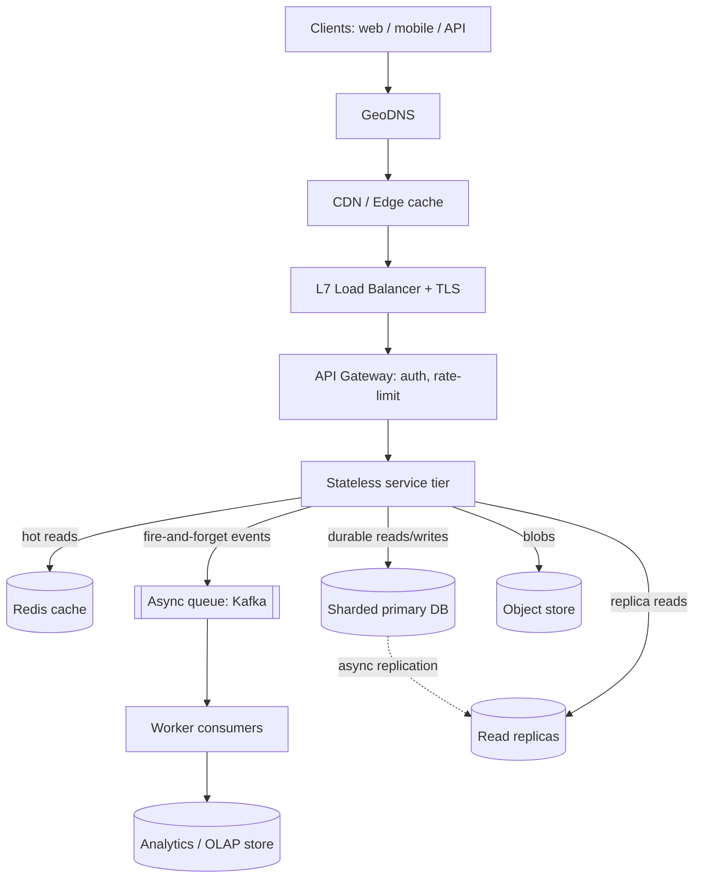

# The HLD Interview Framework

> **Category:** Fundamentals & Framework
> **Topic:** A repeatable, staff-level methodology for any system-design round.
>
> This is a *methodology* document, not a design of one concrete system. Instead of designing a single product, it teaches the repeatable approach you run for **any** prompt — and it does so by walking the same 12-section structure you would use in a real round, with a worked running example (a URL shortener / "TinyURL") to make every abstract step concrete. Think of this as the meta-template that sits behind every other design in this collection.

---

## 0. How to read this document

Each major section below does two things:

1. **Teaches the step** — what it is, why it matters, the judgment a senior is expected to show, and the failure mode that step exists to avoid.
2. **Demonstrates the step** on a running example so you see the abstract method as concrete output.

The running example is a **URL shortener** because it is small enough to fit in your head, yet it exercises every interesting axis: read-heavy traffic, a hot-key cache problem, unique-ID generation, a storage choice, and analytics fan-out. Whenever you see a box marked **▶ Worked example**, that is the method applied; everything else is the method itself.

The single most important sentence in this entire document: **a system-design round is not a test of whether you know what a load balancer is — it is a test of whether you can drive an ambiguous, open-ended conversation to a defensible design under time pressure, narrating your tradeoffs as you go.** Everything below serves that.

---

## 1. Problem & clarifying questions

### 1.1 Restating "the problem"

The "system" we are designing here is **the candidate's own process** for a 45–60 minute HLD round. The deliverable is a *protocol*: a sequence of moves that reliably produces a strong design regardless of which prompt you draw ("Design Twitter", "Design a rate limiter", "Design Uber", "Design Dropbox").

The reason a framework matters: HLD prompts are **deliberately underspecified**. The interviewer says four words ("Design a chat app") and watches what you do with the ambiguity. Candidates who have no framework freeze, or — worse — sprint to boxes-and-arrows and design the wrong system confidently. A framework converts panic into a checklist.

### 1.2 The clarifying questions you ask *the interviewer* (about the round itself)

Before diving into *any* prompt, a senior candidate orients on the **meta-parameters of the round**. You usually don't ask these aloud — you infer them — but make them explicit in your head:

- **How long is the round?** 45 min is the default; 60 min changes your time budget. (Time management, §1.4 of the round, is its own deep dive — see Deep Dive D.)
- **What is the interviewer's seniority signal target?** A round leveled for *senior* (e.g., L5/E5) rewards a clean, correct, complete design. A round leveled for *staff* (L6/E6+) rewards **scoping judgment, explicit tradeoffs, and identifying the one or two genuinely hard problems and going deep**. Knowing the target changes where you spend time (see §10, senior vs staff).
- **Is this a product-design or infra-design prompt?** "Design Instagram" is product-flavored (entities, feeds, media). "Design a distributed message queue" is infra-flavored (consistency, ordering, delivery semantics). The framework is the same; the *deep dives* differ.
- **Does the interviewer want breadth or depth?** Watch for the cue. "Walk me through the whole thing" = breadth first. "How would you handle X?" = they want depth on X; abandon your script and follow them.

### 1.3 The clarifying questions you ask about *the prompt* — the universal set

This is the heart of the framework. For **any** prompt, you drive a requirements conversation across four buckets. Memorize the buckets, not the questions.

**Bucket 1 — Functional requirements (what the system *does*).** Ask until you have a crisp, bounded feature list. The trap is assuming scope; the senior move is *negotiating* scope down to something you can actually design in the time given.

> Universal openers:
> - "Who are the actors / users, and what are the core use cases? Can we list the top 3–4 and explicitly defer the rest?"
> - "What is the single most important operation — the one that defines the system?" (For a shortener: *redirect*. For Twitter: *read the home timeline*.)
> - "What is explicitly **out of scope**?" (Always ask. It is the cheapest way to shrink the problem and signals scoping maturity.)

**Bucket 2 — Non-functional requirements (the *qualities*).** This is where senior candidates separate themselves, because NFRs drive the architecture far more than features do.

> Universal openers:
> - **Latency:** "What's the p99 latency target for the critical read path?" (Numbers, not adjectives. "Fast" is not a requirement; "p99 < 100 ms" is.)
> - **Availability:** "What's the availability target — three nines (99.9%, ~8.8 h/yr down), four (52 min/yr), five (5 min/yr)? Is this an availability-first or consistency-first system?" (This is the CAP conversation — see §9.)
> - **Consistency:** "Does a read have to reflect the latest write immediately (strong consistency), or is eventual consistency acceptable, and if so what's the tolerable staleness window?"
> - **Durability:** "Can we ever lose a write? (A payment: never. A 'last seen' timestamp: sometimes.)"
> - **Read/write ratio:** "Is this read-heavy or write-heavy?" (This single answer dictates your caching and replication strategy more than almost anything else.)

**Bucket 3 — Scale (the *numbers* you'll estimate from).** You need enough to do back-of-the-envelope math.

> Universal openers:
> - "How many users — total registered, and daily active (DAU)?"
> - "What's the request rate, or can I derive it from DAU × actions/day?"
> - "What's the data size per item, and the retention period?"
> - "What's the read:write ratio numerically?" (e.g., 100:1)
> - "Geographic distribution — single region or global? Multi-region affects everything (latency, consistency, cost)."

**Bucket 4 — Constraints & non-goals.** Budget, existing infra, team, regulatory.

> Universal openers:
> - "Are we greenfield, or building on existing infrastructure / a particular cloud?"
> - "Any compliance constraints (GDPR, data residency, PCI)?"
> - "Cost sensitivity — are we optimizing for minimal cost, or is this a hyperscale system where engineering time dominates?"

> **▶ Worked example — clarifying a URL shortener**
>
> *Me:* "Let me make sure I understand the scope. The core functions are: (1) given a long URL, return a short URL; (2) given a short URL, redirect to the long one. Is that the heart of it?"
> *Interviewer:* "Yes."
> *Me:* "A few clarifications. **Functional:** Do we support custom aliases (vanity URLs like `/my-brand`)? Link expiration? Do we need analytics — click counts, geo, referrer?"
> *Interviewer:* "Support custom aliases and basic click analytics. Expiration optional."
> *Me:* "**Out of scope** then: user accounts beyond an API key, editing a link's target after creation, A/B redirect rules — agreed?"
> *Interviewer:* "Agreed."
> *Me:* "**Non-functional:** redirect is the critical path. I'd target p99 < ~50 ms and very high availability — say 99.99% — because a dead redirect breaks every embedded link. Reads can be eventually consistent (a brand-new link being unresolvable for a few seconds is fine), but the *mapping* must be durable — we must never lose a created link. Sound right?"
> *Interviewer:* "Yes, redirect availability is paramount."
> *Me:* "**Scale:** let's say 100 M new URLs/month and a 100:1 read:write ratio. I'll derive QPS from that. Global audience, so I'll plan for multi-region reads."
>
> Notice what happened: in ~90 seconds I bounded scope, named the critical path, fixed an availability/consistency posture, and pinned numbers to estimate from. I have *not* drawn a single box. That restraint is the signal.

### 1.4 The failure mode this section avoids

**Jumping to architecture.** The number-one rejection reason in real debriefs is "started drawing boxes before understanding the problem" or "designed for the wrong scale." Clarification is cheap insurance against spending 40 minutes on a beautifully engineered solution to a problem the interviewer didn't ask for.

---

## 2. Requirements (finalized) — the framework's "Step 1" output

After clarification, you **write down** the finalized requirements (on the whiteboard / in the shared doc). This does three things: it creates a contract you can point back to, it shows structured thinking, and it gives you a checklist to validate the final design against.

### 2.1 The template

```
FUNCTIONAL (what it does)
  - F1: <core operation>          [must-have]
  - F2: <core operation>          [must-have]
  - F3: <secondary>               [nice-to-have / stretch]
  OUT OF SCOPE: <list>            [explicitly deferred]

NON-FUNCTIONAL (qualities — each with a number)
  - Latency:      p99 < X ms on the critical path
  - Availability: N nines  (and which CAP side under partition)
  - Consistency:  strong | eventual (staleness window)
  - Durability:   no data loss | best-effort
  - Scale:        DAU, QPS (read/write), data growth/yr

ASSUMPTIONS (things the interviewer didn't pin down)
  - A1, A2, A3 ...  (stated so they can be challenged)
```

The **assumptions block** is a senior tell. You state the things you couldn't get answered, mark them as assumptions, and proceed. This lets you move fast without being wrong — if the interviewer disagrees, they'll correct you, and you've signaled that you know the design *depends* on these.

> **▶ Worked example — finalized requirements**
>
> **Functional**
> - F1: Create short URL from long URL (and optional custom alias). *Must.*
> - F2: Redirect short → long. *Must — critical path.*
> - F3: Click analytics (count, timestamp, coarse geo). *Should.*
> - Out of scope: editing targets, user dashboards, A/B rules.
>
> **Non-functional**
> - Latency: redirect p99 < 50 ms; create p99 < 200 ms.
> - Availability: 99.99% for redirect; 99.9% for create. **AP** under partition (a stale/duplicate-tolerant read beats an unavailable one).
> - Consistency: eventual for the mapping (≤ a few seconds), strong *not* required.
> - Durability: the long↔short mapping must never be lost. Analytics may lose a small fraction of events.
> - Scale: 100 M creates/month, 100:1 read:write.
>
> **Assumptions**
> - A1: Average long URL ≈ 100 bytes; short code 7 chars.
> - A2: Links retained 5 years.
> - A3: Read:write = 100:1 (derives redirect QPS).

---

## 3. Capacity estimation — the framework's "Step 2"

Estimation is where you prove you can reason quantitatively about scale. The point is **not** precision — it is showing you can derive QPS, storage, bandwidth, and machine counts from first principles, and that you know which numbers *force architectural decisions* (e.g., "this won't fit on one machine → we must shard"; "this read QPS will melt the DB → we need a cache").

### 3.1 The numbers a senior keeps memorized (the "powers of ten" toolkit)

You cannot do BOTE math without a few anchor constants. Memorize these:

| Quantity | Value to memorize |
|---|---|
| Seconds in a day | ~86,400 ≈ **10^5** (round to 100k for speed) |
| Seconds in a month | ~2.5 × 10^6 |
| Bytes: char/int/UUID | 1 B / 4–8 B / 16 B |
| 1 KB / 1 MB / 1 GB / 1 TB | 10^3 / 10^6 / 10^9 / 10^12 bytes |
| L1 cache reference | ~1 ns |
| Main memory (RAM) reference | ~100 ns |
| SSD random read | ~100 µs (~10^5 ns) |
| Network round trip within a datacenter | ~0.5 ms |
| Disk (HDD) seek | ~10 ms |
| Network round trip cross-continent | ~100–150 ms |
| Read 1 MB sequentially from RAM / SSD / network | ~10 µs / ~1 ms / ~10 ms |

The "latency numbers every programmer should know" matter because they tell you *what dominates*: an in-memory cache hit is ~1000× faster than a cross-datacenter call, which is *why* caching and locality are the levers you reach for.

### 3.2 The estimation recipe (run this for any prompt)

1. **Writes/sec.** Total write events ÷ seconds in the period. Round aggressively.
2. **Reads/sec.** Writes × read:write ratio.
3. **Peak factor.** Multiply average QPS by 2–3× for peaks (traffic isn't uniform). State this explicitly.
4. **Storage/yr.** Items/yr × bytes/item. Add index/replication overhead (×2–3).
5. **Bandwidth.** QPS × payload size, for read and write separately.
6. **Memory for cache.** Apply the 80/20 rule — cache the hot ~20% of daily reads — and size it.
7. **Machine/shard count.** Storage ÷ per-node capacity; QPS ÷ per-node throughput. Take the max.

The discipline: **round to one significant figure and use powers of ten.** "100 M / month ≈ 10^8 / 2.5×10^6 s ≈ 40 writes/s" is the right level of rigor. Nobody wants you doing long division.

> **▶ Worked example — full BOTE for the shortener**
>
> **Writes (create):** 100 M/month ÷ 2.5×10^6 s/month = **~40 writes/s** average. Peak ×3 ≈ **120 writes/s**.
>
> **Reads (redirect):** 40 × 100 = **~4,000 reads/s** average. Peak ×3 ≈ **12,000 reads/s**.
> *Architectural consequence:* 12k QPS of point-lookups is trivially cacheable and well within a single Redis node's ~100k+ ops/s — so the **redirect path should be a cache hit, not a DB hit.** That decision falls straight out of the math.
>
> **Storage:** 100 M/month × 12 months × 5 yr = **6 B URLs**. Per record ≈ short code (7 B) + long URL (~100 B) + metadata (~50 B) ≈ ~160 B; round to **~500 B with indexes**. Total ≈ 6×10^9 × 500 B = **3 TB** (×3 for replication ≈ **~9 TB**).
> *Consequence:* 3–9 TB does not fit comfortably on one node's RAM and is awkward on one disk under load → **shard the key-value store**, but it's small enough that this is a handful of shards, not hundreds.
>
> **Bandwidth:** redirect responses are tiny (HTTP 301/302, ~few hundred bytes). 12k QPS × ~500 B ≈ **6 MB/s** — negligible. Create: 120/s × ~200 B ≈ trivial.
> *Consequence:* bandwidth is a non-issue here; the constraint is **read QPS latency**, not throughput.
>
> **Cache sizing (80/20):** assume 20% of links drive 80% of redirects. Hot set ≈ 20% × (creates that are recent + active) ≈ on the order of **~100 M hot mappings**. At ~500 B each that's ~50 GB — split across a small Redis cluster. Even caching a generous hot set is cheap.
>
> **Key-space sanity check for the short code:** with a 7-char code over base62 (a–z, A–Z, 0–9), the space is 62^7 ≈ **3.5 × 10^12** ≈ 3.5 trillion. We need 6 B over 5 years → **6×10^9 / 3.5×10^12 ≈ 0.17%** of the space used. 7 chars is plenty; we will not run out, and collisions are rare. *This little check pre-empts an obvious interviewer probe ("will you run out of codes?").*
>
> **Conclusion from the math:** read-heavy, cacheable, ~few TB sharded store, key-space comfortable. The numbers have already told us the architecture: cache-fronted, sharded KV store, with an async analytics path.

### 3.3 The failure mode this section avoids

**Over-engineering for a scale that doesn't exist, or under-engineering for one that does.** The math tells you whether you need one box or a thousand. A candidate who designs a 200-shard globally-replicated monster for 40 writes/s has shown poor judgment; so has one who puts 6 TB on a single Postgres instance. The estimate is your reality check.

---

## 4. API design — the framework's "Step 3"

APIs are the contract between the client and your system. Defining them early forces you to nail down *exactly* what data flows in and out, which de-risks the rest of the design. Keep them small: cover the must-have functional requirements, nothing more.

### 4.1 The method

- **One endpoint per core operation.** Map directly to your F1, F2, …
- **Choose a style and justify it briefly:** REST for CRUD-ish resources, gRPC for internal high-throughput RPC, GraphQL when clients need flexible field selection. Don't agonize — pick and move.
- **Show request and response shapes**, status codes, and the **idempotency / auth** story even at this stage (e.g., an `Idempotency-Key` header on creates; an API key or token for auth).
- **Pagination** for any list endpoint — always use cursor-based, not offset-based, at scale (offset pagination degrades as the offset grows and is unstable under inserts).

> **▶ Worked example — shortener API**
>
> ```
> POST /v1/urls
>   Auth: Bearer <api-key>
>   Headers: Idempotency-Key: <uuid>     # safe retries: same key → same short code
>   Body: { "long_url": "https://…", "custom_alias": "my-brand"?, "ttl_days": 365? }
>   201 → { "short_url": "https://sho.rt/abc1234", "code": "abc1234", "expires_at": "…" }
>   409 → alias already taken
>   400 → malformed URL
>
> GET /{code}                            # the hot path
>   302 Found, Location: <long_url>      # see Deep Dive C for 301 vs 302
>   404 → unknown/expired code
>
> GET /v1/urls/{code}/stats              # analytics read
>   Auth: Bearer <api-key>
>   200 → { "code": "abc1234", "clicks": 10342, "by_day": [...], "top_geo": [...] }
> ```
>
> Note the two senior touches baked in: the **Idempotency-Key** (so a client retry after a timeout doesn't mint two codes for one URL) and **302 vs 301** flagged as a real decision (it controls whether browsers cache the redirect — which directly trades CDN/edge offload against analytics fidelity; resolved in Deep Dive C).

### 4.2 The failure mode this avoids

**Designing internals that can't actually serve the use case.** If you can't write the API cleanly, your requirements aren't crisp yet — go back to §2. The API is the proof that you understood the problem.

---

## 5. High-level architecture — the framework's "Step 4"

Now — and only now — you draw boxes and arrows. The goal is a **request-flow narrative**: a client request enters and you trace it through every component to the response and back. You want the *simplest architecture that satisfies the requirements*, then you let the deep dives complicate it where the requirements demand.

### 5.1 The default skeleton (the "every system starts here" template)

Almost every web-scale system is a variation on this spine. Start here, then add/remove based on the prompt:

```
        Clients (web / mobile / API)
                  │
                  ▼
        [ DNS  /  GeoDNS ]
                  │
                  ▼
        [ CDN / Edge ]  ── (static + cacheable responses)
                  │
                  ▼
        [ Load Balancer ]  (L7, TLS termination)
                  │
        ┌─────────┴─────────┐
        ▼                   ▼
   [ API Gateway ]     (auth, rate-limit, routing)
        │
        ▼
   [ Stateless app / service tier ]  ── horizontally scalable
        │
   ┌────┼─────────────┬───────────────┐
   ▼    ▼             ▼               ▼
[Cache] [Primary DB] [Async queue]  [Object store]
 (Redis) (sharded)    (Kafka/SQS)    (S3/blob)
                          │
                          ▼
                    [ Workers / consumers ]
                          │
                          ▼
                    [ Analytics / OLAP / DW ]
```

**Each box, in one line (explain-every-term discipline):**
- **DNS / GeoDNS** — resolves the hostname to an IP; GeoDNS returns the IP closest to the user for locality.
- **CDN / Edge** — geographically distributed caches that serve content near the user; offloads traffic from origin.
- **Load balancer (L7)** — distributes requests across app servers; L7 (application layer) can route by path/host and terminate TLS.
- **API gateway** — a single entry point that does cross-cutting concerns: authentication, rate limiting, request routing.
- **Stateless app tier** — servers holding no session state, so any request can hit any server → trivially horizontally scalable (add more boxes behind the LB).
- **Cache (Redis/Memcached)** — in-memory key-value store fronting the DB for hot reads.
- **Primary DB (sharded)** — the durable source of truth; sharded = data partitioned across nodes by a key.
- **Async queue (Kafka/SQS)** — decouples producers from consumers so slow/bursty work happens off the request path.
- **Object store (S3)** — cheap, durable storage for large blobs (images, files).
- **Workers** — background consumers that drain the queue (e.g., aggregate analytics).

### 5.2 Mermaid view



### 5.3 Trace one request end-to-end (the narration that wins points)

> **▶ Worked example — the redirect path narrated**
>
> 1. User clicks `sho.rt/abc1234`. **GeoDNS** routes to the nearest edge.
> 2. **CDN/edge:** if we issued a cacheable 301 earlier, the edge may answer directly — zero origin load. (We chose 302 to preserve analytics; see Deep Dive C — so typically this is a miss and we proceed.)
> 3. **LB → app tier:** a stateless redirect service receives `GET /abc1234`.
> 4. **Cache lookup:** `GET code:abc1234` in Redis. **Hit (the common case)** → return `302 Location: <long_url>` in well under 50 ms. Done.
> 5. **Cache miss:** read from the sharded KV store (sharded by code), populate the cache (read-through), return 302.
> 6. **Analytics, off the hot path:** the app emits a click event to **Kafka** *fire-and-forget* — it does **not** block the redirect. A worker aggregates counts into the OLAP store.
>
> The senior signal here is step 6: **the analytics write never touches the redirect's latency budget.** That separation of the critical path from the best-effort path is exactly the judgment being tested.

### 5.4 Method note: start simple, justify every box

A staff candidate **does not** draw all 11 boxes for every prompt. You draw the spine, then *earn* each addition: "We add a CDN **because** redirects are global and latency-sensitive; we add the queue **because** analytics must not block redirects." If you can't name the requirement a box satisfies, delete the box. Unjustified complexity is a negative signal.

---

## 6. Data model & storage choices — the framework's "Step 5"

Two decisions: **(a) the schema/entities**, and **(b) which datastore, and why** — justified against the **access patterns**, never by reflex ("I always use Postgres"). The access pattern is king: *how* you read and write the data dictates the store.

### 6.1 The decision procedure

1. **List entities and relationships.** Keep it minimal — the core nouns.
2. **List access patterns** explicitly: point lookups? range scans? joins? aggregations? write-heavy append? These map to data-store strengths.
3. **Match pattern → store** using the cheat table below.
4. **Decide the partition (shard) key** *now*, because it determines whether your access patterns are cheap or catastrophic. The right shard key spreads load evenly and keeps the common query on a single shard.

### 6.2 Datastore selection cheat table

| Store type | Best for (access pattern) | Weak at | Examples |
|---|---|---|---|
| **Relational (SQL)** | Strong consistency, complex joins, transactions, ad-hoc queries | Horizontal write scaling; huge scale needs sharding | Postgres, MySQL |
| **KV store** | Single-key point lookups at massive scale, low latency | Range queries, joins | DynamoDB, Redis, Cassandra (as KV) |
| **Wide-column** | High write throughput, time-series, known query patterns | Ad-hoc joins, strong multi-row txns | Cassandra, Bigtable, HBase |
| **Document** | Flexible/nested schema, per-document reads | Cross-document joins/txns | MongoDB, DocumentDB |
| **Search index** | Full-text search, faceting | Source of truth (it's a derived index) | Elasticsearch, OpenSearch |
| **Object/blob** | Large immutable files, cheap durable bytes | Querying contents | S3, GCS |
| **OLAP / columnar** | Analytical aggregations over huge datasets | Low-latency point writes/reads | Snowflake, BigQuery, ClickHouse, Redshift |
| **Graph** | Traversals / relationship queries (friends-of-friends) | Bulk scans | Neo4j, Neptune |
| **In-memory cache** | Sub-ms hot reads, ephemeral | Durability (it's volatile) | Redis, Memcached |
| **Time-series** | Append-heavy metrics with time-range queries | General-purpose | InfluxDB, Prometheus, TimescaleDB |

> **▶ Worked example — shortener data model & store**
>
> **Entities:**
> - `urls`: `code (PK)`, `long_url`, `creator_id`, `created_at`, `expires_at`
> - `clicks` (append-only events): `code`, `ts`, `geo`, `referrer`, `ua`
> - `stats` (aggregates): `code`, `day`, `count`, `by_geo`
>
> **Access patterns:**
> - P1: `GET by code` → single-key point lookup, 12k QPS. **Dominant.**
> - P2: `PUT new code` → single-key write, 120 QPS.
> - P3: append a click event → high-volume append.
> - P4: read aggregated stats for a code → small range/aggregate read, low QPS.
>
> **Store decisions (each justified):**
> - **Mapping (`urls`): a sharded KV store** (DynamoDB / Cassandra-as-KV / even a sharded MySQL keyed by code). Why: P1 is a pure point lookup and *the* hot path — a KV store gives O(1)-ish single-key reads at scale and shards cleanly on `code`. A relational DB's joins/transactions buy us nothing here; we'd be paying for features we don't use. **Failure mode avoided:** picking Postgres and discovering the single-master write/query path doesn't scale to billions of keys without bolt-on sharding anyway.
> - **Cache: Redis** in front, sharded by code, read-through. Why: turns 12k QPS of disk reads into ~1k QPS of misses. **Failure avoided:** hammering the DB with cacheable reads.
> - **Click events: append to Kafka, then a wide-column/OLAP store** (Cassandra or ClickHouse). Why: P3 is write-heavy append + P4 is analytical aggregation — exactly OLAP/columnar territory. **Failure avoided:** doing `COUNT(*)` on a transactional row store and melting it.
> - **Shard key = `code`.** Why: it's high-cardinality and uniformly distributed (especially if codes come from a hashed/encoded counter), so load spreads evenly and every redirect hits exactly one shard. **Failure avoided:** sharding by `creator_id` (skewed — one big customer becomes a hot shard).

### 6.3 The method's golden rule

**Pick the store from the access pattern, then say the failure mode you avoided.** "I'd use a KV store because the dominant pattern is single-key point lookups at 12k QPS; a relational store would force me into sharding anyway while charging me for joins I never make." That single sentence is a staff-level answer.

---

## 7. Deep dives — the framework's "Step 6" (the bulk of the round)

This is where the round is won or lost. After the high-level design, the interviewer (or you, proactively) picks the **2–4 genuinely hard sub-problems** and goes deep: enumerate options, build a tradeoff table, and **defend a decision by naming the failure mode it avoids.**

Below are the **categories of hard problem that recur across nearly every system**, each taught as a reusable deep-dive pattern, with the running example threaded through. Treat these as a library: when you draw a new prompt, you'll find its hard parts are instances of these.

### Deep Dive A — Caching strategy (the read-scaling deep dive)

Almost every read-heavy system needs a cache. The deep dive is *which* caching pattern, *what* eviction policy, and *how* you handle the failure modes (stale data, thundering herd, hot keys).

**Options — caching patterns:**

| Pattern | How it works | Pro | Con |
|---|---|---|---|
| **Cache-aside (lazy)** | App checks cache; on miss, reads DB and populates cache | Simple; only caches what's used | First read is slow; risk of stale data |
| **Read-through** | Cache library fetches from DB on miss transparently | Clean app code | Coupling to cache provider |
| **Write-through** | Writes go to cache and DB synchronously | Cache always fresh | Write latency higher |
| **Write-back (write-behind)** | Write to cache, flush to DB async | Fast writes | Risk of data loss on cache crash |

**The hard failure modes and their fixes:**
- **Thundering herd / cache stampede** — a hot key expires and 10,000 requests simultaneously miss and hit the DB. *Fix:* request coalescing (single-flight: one request fills the cache, others wait) and/or probabilistic early expiration.
- **Hot key** — one key (a viral link) overwhelms a single cache node. *Fix:* replicate the hot key across nodes, or add a small per-app-server local cache (L1) in front of Redis (L2).
- **Stale data / invalidation** — "there are only two hard things… cache invalidation and naming." *Fix:* short TTLs for tolerable staleness; explicit invalidation on write for strict needs.
- **Cache penetration** (queries for nonexistent keys bypass the cache and hit the DB) — *Fix:* cache negative results (404s) briefly, or front with a Bloom filter (a probabilistic set membership structure: "definitely not present" or "maybe present").

> **▶ Decision (shortener):** cache-aside + read-through Redis, TTL ~24 h (mappings are immutable, so staleness isn't a correctness risk — only expiry/deletion is, handled by short negative-cache TTLs). For viral links (hot key), add a per-server local cache so a single viral redirect is served from app-local memory. **Failure modes avoided:** stampede (single-flight on miss), hot key (L1 local cache), penetration (negative-cache 404s for guessed codes).

### Deep Dive B — Unique ID / key generation (the "no collisions, at scale, fast" deep dive)

A huge class of systems needs to mint unique identifiers: short codes, tweet IDs, order IDs. The deep dive is generating them **unique, ideally sortable, without a single bottleneck.**

**Options:**

| Approach | Unique? | Coordination | Sortable by time? | Notes |
|---|---|---|---|---|
| **Auto-increment in one DB** | Yes | Single point of contention | Yes | Doesn't scale; SPOF |
| **UUID v4 (random 128-bit)** | Yes (practically) | None | No | 16 bytes — large; random hurts index locality |
| **DB ticket server / segment allocation** | Yes | Each app server grabs a *range* of IDs, then serves locally | Roughly | Great middle ground; few central calls |
| **Snowflake (timestamp + machine ID + sequence)** | Yes | None after machine-ID assignment | Yes | 64-bit, time-sortable; needs clock discipline |
| **Hash of content** (e.g., MD5/base62 of long URL) | Mostly | None | No | Collisions possible → must detect & retry |
| **Base62-encode a global counter** | Yes | Depends on counter source | Yes | Compact, short codes; pair with segment allocation |

**The hard parts:** avoiding a central bottleneck, keeping IDs short, and handling the **race on custom aliases** (two users request `/promo` at once — needs a uniqueness check that's atomic, e.g., a conditional insert / compare-and-set).

> **▶ Decision (shortener):** **base62-encode IDs drawn from a counter that uses segment/range allocation** — each app server reserves a block of, say, 1,000 IDs from a central allocator and hands them out locally, refilling when low. This gives short, collision-free 7-char codes with ~1 central call per 1,000 creates (no bottleneck). Custom aliases use a **conditional `INSERT` that fails on duplicate** (atomic uniqueness). **Failure modes avoided:** central counter bottleneck (segments amortize it), collisions (counter is monotonic, no hashing), alias races (atomic CAS).
>
> *Alternative defended:* I'd avoid hashing the long URL — collisions force a retry loop, and identical URLs would collapse to one code (sometimes unwanted). I'd avoid UUIDs — 16 bytes is too long for a "short" URL and they're not sortable.

### Deep Dive C — Consistency & the read path (the CAP / freshness deep dive)

Whenever you replicate or cache, you face: *how fresh must reads be, and what happens under a network partition?* This is the CAP theorem made concrete: under a partition (P), you choose **C** (refuse stale reads → unavailable) or **A** (serve possibly-stale reads → available).

**Options for the read path:**

| Strategy | Consistency | Availability | When to use |
|---|---|---|---|
| **Read from primary only** | Strong | Lower (primary is SPOF) | Money, inventory |
| **Read from replicas (async)** | Eventual | High | Read-heavy, staleness-tolerant |
| **Read-your-writes (sticky/session)** | Per-user strong | High | User edits their own data |
| **Quorum reads/writes (R+W>N)** | Tunable | Tunable | Dynamo-style stores |

> **▶ Decision (shortener):** **AP / eventual consistency.** Reads come from cache and replicas. A newly created link being unresolvable for a couple of seconds is acceptable (the creator can wait); a redirect outage is not. Also the **301 vs 302** sub-decision: a **301 (permanent)** is cached aggressively by browsers/CDNs → great for latency and origin offload, but **kills click analytics** (the browser never re-hits us). A **302 (temporary)** forces every click through us → full analytics, more load. Since analytics is a requirement, **default 302**, and offer 301 as a per-link option for high-traffic links where analytics is waived. **Failure mode avoided:** silently losing analytics by caching the redirect, or conversely melting under load by refusing to ever cache.

### Deep Dive D — Time management & interviewer-signal reading (the *meta* deep dive)

This is the deep dive unique to the *framework* topic, and it's the one that makes the other three land. A perfect design delivered at minute 50 of a 45-minute round scores worse than a good design delivered with time to discuss tradeoffs.

**The 45-minute budget (target, not a straitjacket):**

| Phase | Minutes | What you're doing | Failure if you overrun |
|---|---|---|---|
| Clarify requirements | 5–8 | Functional, NFR, scale, scope | Designing wrong thing |
| Estimation | 3–5 | BOTE QPS/storage | Skip → can't justify scale decisions |
| API + high-level design | 8–10 | Boxes, request flow | Too much detail too early |
| Deep dives | 15–20 | The 2–4 hard problems | **This is the score** — protect this time |
| Wrap-up | 3–5 | Bottlenecks, what I'd do next, tradeoffs revisited | No closure → "ran out of time" |

**Reading interviewer signals (and pivoting):**

| Signal | What it means | Your move |
|---|---|---|
| "Let's assume that and move on" | You're rat-holing | Jump to the next phase immediately |
| "How would you handle X?" | They want depth on X | Drop your script; deep-dive X now |
| "What if scale were 100×?" | Testing whether design degrades gracefully | Discuss the bottleneck and the next lever |
| Silence / nodding | You're on track | Continue, but offer a pivot point |
| Repeated "why?" | Probing your justification | Give the tradeoff + failure mode, not just the choice |
| Frowning at complexity | You over-engineered | Simplify; name what you'd cut |

**The pivot rule:** the interviewer is a co-author, not an audience. The moment they steer, *follow them* — abandoning your prepared structure to chase their question is a *positive* signal (it shows you're collaborating, not reciting). The candidates who fail here are the ones who plow through their memorized script while the interviewer is clearly trying to redirect.

### Deep Dive E (optional, prompt-dependent) — Asynchronous processing & fan-out

Many systems have a "do work off the request path" problem (feed generation, notifications, analytics, video transcoding). The deep dive is **fan-out-on-write vs fan-out-on-read**, queue choice, and exactly-once vs at-least-once delivery.

- **Fan-out-on-write (push):** precompute results at write time (e.g., push a tweet into all followers' feeds). Fast reads, expensive writes, bad for celebrities (millions of followers → write amplification). 
- **Fan-out-on-read (pull):** compute at read time. Cheap writes, slower reads. 
- **Hybrid:** push for normal users, pull for celebrities. (This hybrid is the canonical "Design Twitter" answer.)
- **Delivery semantics:** at-least-once (retries → consumer must be idempotent) is the practical default; exactly-once is expensive and usually emulated via idempotency keys + dedup.

> **▶ For the shortener** this collapses to the analytics path: click events go to Kafka (at-least-once), a worker aggregates into OLAP, dedup via event ID. Best-effort — losing a fraction of click events is acceptable, so we don't pay for exactly-once.

### How to choose *which* deep dives to run

For any prompt, the hard parts are almost always one or more of: **(1) scaling reads (caching), (2) scaling writes / unique IDs, (3) consistency under replication, (4) async fan-out, (5) storage choice for the dominant access pattern.** Identify which 2–4 your prompt stresses (the estimation step usually reveals them — "12k read QPS" screamed *caching*) and go deep on those. Announce it: *"The two genuinely hard problems here are the hot-key cache stampede and unique short-code generation — let me go deep on both."* That sentence alone signals staff-level prioritization.

---

## 8. Scaling & bottlenecks — the framework's "Step 7"

After the deep dives, demonstrate that you know **where the design breaks first** as load grows, and the **next lever** for each bottleneck. The method: walk the request path component by component and ask "what melts at 10×? at 100×?"

### 8.1 The universal bottleneck walk

| Component | Breaks when… | The lever (in order) |
|---|---|---|
| Single app server | CPU/conns saturate | Add servers behind LB (stateless → trivial) |
| Load balancer | One LB's throughput exceeded | DNS round-robin across multiple LBs; anycast |
| Database (reads) | Read QPS exceeds node | Add read replicas; add cache; CQRS read models |
| Database (writes) | Write QPS / data exceeds node | Shard (partition by key); batch writes |
| A single shard | Skewed key → hot shard | Re-shard on better key; split the hot shard; consistent hashing for smooth rebalancing |
| Cache | Hot key / memory / single node | Replicate hot keys; cluster Redis; add L1 local cache |
| Cross-region latency | Global users hit one region | Multi-region read replicas; edge/CDN; geo-routing |
| Async workers | Queue lag grows unbounded | Add consumers (partition the topic); backpressure |

**Consistent hashing** (worth a one-liner because it always comes up): a technique to map keys to nodes so that adding/removing a node only remaps a *small fraction* of keys (≈1/N) instead of nearly all of them — essential for rebalancing shards/caches without a mass reshuffle.

> **▶ Worked example — shortener bottleneck order**
>
> 1. **First to break:** the DB under redirect read load. *Lever:* the cache (already designed) — pushes 12k QPS to ~1k miss QPS.
> 2. **Next:** a viral link = hot cache key on one node. *Lever:* L1 local cache + hot-key replication (Deep Dive A).
> 3. **At 100×:** the sharded KV store's write/storage on a hot shard. *Lever:* consistent hashing to add shards smoothly; ensure `code` shard key stays uniform.
> 4. **Global growth:** single-region latency for far users. *Lever:* multi-region read replicas + CDN for 301-eligible links.
> 5. **Analytics:** Kafka consumer lag if a campaign spikes clicks. *Lever:* add partitions + consumers; analytics is async so it absorbs bursts without touching redirect latency.

The senior signal: **stating the order** ("the DB goes first, then hot keys, then…") and pairing each with a *specific, already-mentioned* lever, rather than reciting a generic list.

---

## 9. Reliability, consistency & security — the framework's "Step 8"

Cover the cross-cutting concerns the interviewer will check off: failure handling, the replication/consistency model, idempotency, auth, and abuse/rate limiting.

### 9.1 Reliability & failure handling
- **No single points of failure (SPOF):** every tier redundant. LBs in pairs, DB with replicas + automated failover, multi-AZ deployment (availability zones = isolated failure domains within a region).
- **Graceful degradation:** if analytics is down, redirects still work (best-effort path is isolated). If the cache is down, the DB absorbs reads (degraded latency, not an outage).
- **Retries with backoff + jitter** to avoid retry storms; **circuit breakers** to stop hammering a failing dependency.
- **Replication:** sync replication for durability-critical data (slower, no loss); async for read scaling (faster, possible lag).

### 9.2 Consistency model (tie back to CAP)
- State it explicitly: this system is **AP, eventual consistency** (per §2), with read-your-writes for the creator via a sticky cache populate. Strong consistency is reserved for the alias-uniqueness check (atomic CAS), because *that* is the one place a race causes a correctness bug.

### 9.3 Idempotency
- **Why:** networks retry; without idempotency a retried `POST /urls` mints duplicate codes or double-charges. 
- **How:** `Idempotency-Key` header (§4); the service records the key → result mapping; a retry with the same key returns the original result. At-least-once queues require idempotent consumers (dedup on event ID).

### 9.4 Security & abuse
- **Auth:** API keys / OAuth tokens at the gateway; never trust the client.
- **Rate limiting:** token-bucket per API key at the gateway (a token bucket refills at a fixed rate; each request spends a token; empty bucket → 429). Protects against scraping the key-space and abuse.
- **Abuse-specific to shorteners:** malicious-URL scanning (don't become a phishing redirector), and **enumeration** — sequential codes let attackers crawl all links; mitigate by making codes non-sequential (e.g., encode the counter through a reversible permutation / encryption so codes look random).
- **Encryption:** TLS in transit; encryption at rest for the store.
- **Input validation:** reject malformed URLs, oversized inputs.

> **▶ Worked example — shortener security note:** the enumeration risk is the interesting one and a likely probe. Because we derive codes from a monotonic counter, raw base62 codes would be *guessable/sequential*. We pass the counter through a **Feistel/permutation cipher** before base62-encoding, so codes appear random while staying unique and collision-free. **Failure mode avoided:** an attacker enumerating `abc1234`→`abc1235` and harvesting every link.

---

## 10. Extensions & follow-ups — the framework's "Step 9"

Interviewers extend the prompt to test how your design *bends*. The framework move: for each extension, name **which component changes and which stays**, and the new tradeoff. Below are the universal extension categories plus the shortener-specific ones.

### 10.1 Universal extension patterns (apply to almost any prompt)
- **"Make it global / multi-region."** Changes: add regional replicas, geo-routing, and now you face cross-region *write* consistency. Decision: keep writes single-region (simpler) or go multi-master (conflict resolution via last-write-wins or CRDTs). Tradeoff: write latency vs. consistency complexity.
- **"10× / 100× the scale."** Changes: revisit the bottleneck walk (§8); the *next lever* for each is the answer. Tests graceful degradation.
- **"Add strong consistency to X."** Changes: that path moves from replica/cache reads to primary/quorum reads; cost is latency and availability. State what you give up.
- **"Reduce cost."** Changes: tiered storage (hot in cache/SSD, cold in object store), smaller replication factor for non-critical data, spot/auto-scaled workers.
- **"Add real-time."** Changes: introduce push (WebSockets / SSE / pub-sub) instead of polling.

### 10.2 Shortener-specific follow-ups
- **"Link expiration & cleanup."** Add `expires_at`; a background TTL sweeper / DB TTL; cache negative-caches expired codes.
- **"Per-user analytics dashboards."** Now reads of aggregated stats grow → the OLAP store and a separate read API; pre-aggregate by day to keep dashboard queries cheap.
- **"Custom domains (vanity per customer)."** Routing layer maps domain → tenant; multi-tenancy and TLS cert management (ACME automation) enter.
- **"Detect & block malicious links."** Add an async URL-reputation scan on create; quarantine flagged links.
- **"99.999% availability."** Multi-region active-active for the read path, since the mapping is immutable and conflict-free — a rare case where active-active is *easy* (no write conflicts on immutable data). Note that gracefully.

The signal: you don't redesign from scratch for each follow-up — you point at the **one or two boxes that change** and state the new tradeoff. That demonstrates the design was *modular* and that you understand its load-bearing decisions.

---

## 11. Interview Q&A

Likely questions, crisp model answers, deep-probe follow-ups, and the senior-signal (tradeoff/justification) questions flagged.

**Q1. Where do you start a system-design round?**
*A:* Requirements clarification — never boxes first. Four buckets: functional, non-functional (with *numbers*: latency, availability, consistency, durability), scale, and out-of-scope. Then write finalized requirements + assumptions, *then* estimate, *then* design.
*Probe — "Why so much time on requirements?"* Because the dominant rejection reason is designing the wrong system or for the wrong scale; clarification is cheap insurance. *Probe — "What if the interviewer won't give numbers?"* I state explicit assumptions ("I'll assume 1 M DAU and 100:1 reads") and proceed — they'll correct me if it matters.

**Q2. How do you do capacity estimation without a calculator?**
*A:* Powers of ten and one significant figure. Memorize anchors (86,400 s/day ≈ 10^5; 2.5×10^6 s/month). Derive writes/s, then reads/s via the ratio, ×2–3 for peak, storage = items × bytes × replication, then machine count = max(storage/node, QPS/node). The goal is the *order of magnitude that forces an architectural decision*, not precision.
*Probe — "What does the number actually tell you?"* Whether I need one box or a thousand, and whether reads need a cache. E.g., 12k read QPS → cacheable on one Redis node → the redirect path is a cache hit.

**Q3. (Senior-signal — tradeoff) How do you choose a datastore?**
*A:* From the *access pattern*, never by reflex. Enumerate patterns (point lookup? range? join? aggregate? append?), match to the store's strength, and justify by the failure mode avoided. For the shortener: dominant pattern is single-key point lookup at 12k QPS → a sharded KV store; a relational DB would force sharding anyway while charging me for joins I never make.
*Probe — "When *would* you pick SQL?"* When I need multi-row transactions, complex ad-hoc joins, or strong consistency on related entities — e.g., an orders/payments system. *Probe — "Postgres can scale to billions of rows, why not use it?"* It can with partitioning + read replicas, but for a pure KV access pattern I'd be operating a relational engine to do a KV job; a purpose-built KV store is simpler and cheaper at that scale.

**Q4. (Senior-signal — tradeoff) 301 vs 302 redirect — which and why?**
*A:* 301 (permanent) is cached by browsers/CDNs → great latency and origin offload but **destroys click analytics** (the client never re-hits us). 302 (temporary) routes every click through us → full analytics, more load. Since analytics is a stated requirement, default 302; offer 301 per-link for high-traffic links where analytics is waived. The decision is literally *analytics fidelity vs. read-path load.*
*Probe — "How do you serve 12k QPS if you can't cache the redirect at the edge?"* In-memory Redis + L1 local cache on the app tier; the redirect is still a memory hit, just at our tier rather than the browser's.

**Q5. How do you generate unique short codes at scale without a bottleneck?**
*A:* Base62-encode IDs from a counter using *segment/range allocation* — each app server reserves a block (e.g., 1,000 IDs) from a central allocator and serves locally, so there's ~1 central call per 1,000 creates. Short (7-char), collision-free, no central bottleneck. Custom aliases use an atomic conditional insert to resolve races.
*Probe — "Why not hash the URL?"* Collisions force retries and identical URLs collapse to one code. *Probe — "Why not UUIDs?"* 16 bytes is too long for a 'short' URL and they're not time-sortable.

**Q6. How do you handle a cache stampede / hot key when a link goes viral?**
*A:* Stampede: single-flight (request coalescing) so one request fills the cache while others wait, plus probabilistic early expiry. Hot key: replicate it across cache nodes and add an L1 local cache on each app server so a viral redirect is served from app-local memory.
*Probe — "What about a query for a code that doesn't exist (penetration)?"* Negative-cache the 404 briefly, optionally a Bloom filter to short-circuit known-absent keys.

**Q7. (Senior-signal — CAP) Is this system CP or AP, and why?**
*A:* AP / eventual consistency. Under a partition I prefer a possibly-stale-but-available redirect over an unavailable one — a dead redirect breaks every embedded link, while a few seconds of staleness on a brand-new link is harmless. The one place I keep strong consistency is the alias-uniqueness check (atomic CAS), because that's the only spot where a race causes a real correctness bug.
*Probe — "Where would you *want* CP in a different system?"* Money/inventory — there, I'd refuse a stale read and accept lower availability under partition.

**Q8. How do you manage a 45-minute round?**
*A:* ~5–8 clarify, 3–5 estimate, 8–10 API + high-level, **15–20 deep dives (protect this — it's the score)**, 3–5 wrap-up. And I read signals: "let's move on" = I'm rat-holing; "how would you handle X?" = drop my script and deep-dive X; "what if 100×?" = walk the next bottleneck lever.
*Probe — "What if you're running out of time in deep dives?"* I announce priorities — "the two hard problems are caching and ID generation; I'll go deep on caching and sketch ID generation" — so I show prioritization even when I can't cover everything.

**Q9. (Senior-signal) How does a *staff* answer differ from a *senior* answer to the same prompt?**
*A:* A senior answer is *correct and complete*: clarifies, estimates, designs a working system, handles the obvious deep dives. A staff answer adds **scoping judgment and explicit tradeoff ownership**: it negotiates scope down, *names which 2 problems are genuinely hard and why*, defends each decision with the failure mode it avoids, discusses what it would cut under time/cost pressure, and treats the interviewer as a co-author — pivoting fluidly. Staff is less about knowing more components and more about *judgment under ambiguity*.
*Probe — "Give a concrete example."* Senior: "I'll add a cache." Staff: "Reads are 12k QPS and cacheable, so I'll front the KV store with Redis; the real risk is a viral hot key causing a stampede, so I'll add single-flight and an L1 local cache — that's the part I'd spend time on; the rest is standard."

**Q10. What are the most common ways candidates fail this round?**
*A:* (1) Jumping to boxes before requirements. (2) Designing for the wrong scale (no estimation). (3) Rat-holing on a favorite detail and running out of time. (4) Reciting a memorized design instead of responding to *this* prompt. (5) Naming components without justifying them (cargo-culting). (6) Not narrating tradeoffs — making correct choices silently. (7) Ignoring interviewer steering. (8) No closure / no bottleneck discussion.
*Probe — "Which is most fatal?"* Designing the wrong thing — it wastes the whole round. That's why clarification is non-negotiable.

---

## 12. Cheat-sheet & self-test

### 12.1 The framework in one screen (run this for ANY prompt)

```
1. CLARIFY (5–8m)  — 4 buckets:
     Functional  | Non-functional (NUMBERS: latency p99, availability nines,
     consistency, durability, read:write) | Scale (DAU, QPS, data, geo) | Out-of-scope
   → Write finalized reqs + ASSUMPTIONS block.

2. ESTIMATE (3–5m) — powers of ten:
     writes/s = events / period(s);  reads/s = writes × ratio;  ×2–3 peak.
     storage = items × bytes × replication;  cache = 80/20 hot set.
     machines = max(storage/node, QPS/node).  Let the number force the design.

3. API (do early) — one endpoint per core op; idempotency-key on writes;
     cursor pagination; auth at the gateway.

4. HIGH-LEVEL (8–10m) — start from the spine:
     Client→DNS/CDN→LB→Gateway→stateless app→[cache | sharded DB | queue | object store]→workers→OLAP
     Justify EVERY box by the requirement it serves. Narrate one request end-to-end.

5. DATA MODEL & STORE — pick store from ACCESS PATTERN; choose shard key;
     say the failure mode avoided.

6. DEEP DIVES (15–20m — THE SCORE) — pick 2–4 hard problems from the library:
     A caching (stampede/hot key)  B unique-ID (segment alloc)  C consistency/CAP
     D async fan-out (push vs pull)  E storage choice
     Each: options → tradeoff table → defended decision → failure mode avoided.

7. BOTTLENECKS — walk the path; state break ORDER + next lever each.

8. RELIABILITY/SECURITY — no SPOF, graceful degradation, idempotency,
     replication/consistency model, auth, rate-limit, abuse.

9. EXTENSIONS — name the 1–2 boxes that change + the new tradeoff.

10. WRAP (3–5m) — recap decisions, what I'd do next, tradeoffs revisited.
```

### 12.2 Key numbers to keep loaded

- s/day ≈ 10^5 (86,400); s/month ≈ 2.5×10^6.
- RAM ~100 ns, SSD read ~100 µs, intra-DC RTT ~0.5 ms, cross-continent RTT ~100 ms, disk seek ~10 ms.
- Nines: 99.9% ≈ 8.8 h/yr, 99.99% ≈ 52 min/yr, 99.999% ≈ 5 min/yr.
- Peak factor ×2–3. Replication overhead ×2–3. 80/20 for cache hot set.
- base62, 7 chars ≈ 3.5×10^12 codes.

### 12.3 Decisions you should be ready to defend (with failure mode)

- Cache-aside Redis + L1 local cache → avoids DB melt + hot-key stampede.
- Sharded KV store, shard by high-cardinality key → avoids hot shard + needless joins.
- Segment-allocated base62 IDs → avoids central counter bottleneck + collisions.
- AP/eventual reads, strong only on uniqueness CAS → avoids redirect outage + alias race.
- Async analytics off the hot path → avoids analytics load touching read latency.
- Non-sequential (permuted) codes → avoids enumeration/harvesting.

### 12.4 Diagram-in-words (recite this if you can't draw)

"Client hits GeoDNS, then a CDN edge, then an L7 load balancer that terminates TLS, into an API gateway doing auth and rate-limiting, into a stateless app tier. The app reads hot keys from a Redis cache (cache-aside, L1 local in front for viral keys) and falls back to a sharded KV store sharded by code; writes mint codes via segment-allocated base62 counters. Click events fire-and-forget to Kafka, drained by workers into an OLAP store — completely off the redirect latency path. Read replicas and multi-region edges serve global reads; the whole thing is AP with strong consistency only on the alias-uniqueness check."

### 12.5 Self-test (no answers — practice these out loud, timed)

1. Draw the 4 clarifying-question buckets from memory and write 3 questions in each for a brand-new prompt: **"Design a pastebin."**
2. For **"Design a rate limiter,"** do the BOTE estimation and state the *one number* that forces the architecture.
3. For **"Design Twitter's home timeline,"** name the single hardest deep dive and argue push vs pull vs hybrid with the failure mode each avoids.
4. Pick any system you've used today and decide its datastore *from the access patterns*, naming the shard key and the failure mode a wrong shard key would cause.
5. You're at minute 35 of a 45-minute round and the interviewer says "what if traffic were 100× higher?" — narrate your exact next 60 seconds (what you say, what you point at, what you defer).

---

*End of document. This framework is the meta-template behind every other design in this collection: clarify → estimate → API → high-level → data model → deep dives → bottlenecks → reliability/security → extensions → wrap, narrating a defended tradeoff at every step.*
