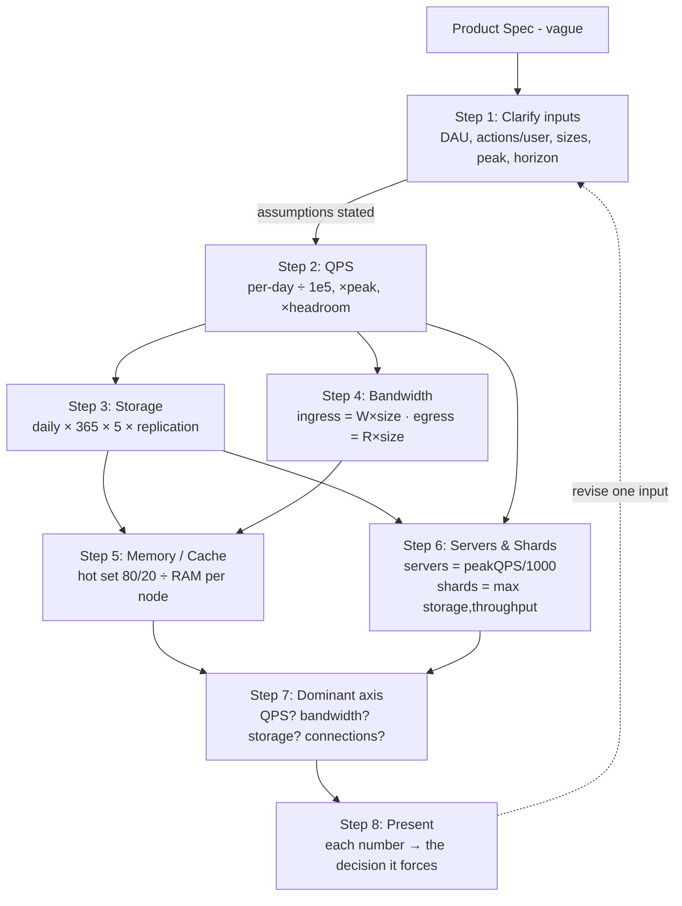

# Back-of-the-Envelope Estimation — A Staff-Level HLD Calculation Playbook

> **Category:** Fundamentals & Framework
> **Topic:** Back-of-the-Envelope (BOTE) Estimation
> **Format note:** This is a *methodology / reference* topic, so the standard HLD skeleton is bent toward a **calculation playbook**. The "system under design" here is *the estimation process itself*: the inputs you clarify, the formulas you apply, the numbers you memorize, and the way you present the result in 3–5 minutes of interview time. We still walk the full HLD structure — clarifying questions, "requirements," capacity, "API," architecture, deep dives — but every section maps onto *how you estimate*, not how you build one product.

---

## 1. Problem & Clarifying Questions

### 1.1 Restating the problem

In a system-design interview, before you draw a single box, you must answer: **how big is this thing?** Back-of-the-envelope estimation is the disciplined practice of converting a vague product spec ("design Twitter") into a small set of load-bearing numbers — **QPS** (queries per second), storage growth over time, network bandwidth, working-set memory, and the resulting **server and shard counts** — using arithmetic you can do in your head or on a whiteboard in under five minutes.

> **QPS (queries per second):** the rate of requests hitting a component. Sometimes split into RPS (requests/sec) at the edge and QPS at a datastore. We use QPS generically for "operations per second against component X."

The *purpose* is not precision — it is **order-of-magnitude correctness** that drives architecture decisions:

- A system at **100 QPS** fits on one box; one at **1,000,000 QPS** needs sharding, caching tiers, and a CDN. Estimation tells you which world you're in.
- A dataset that grows **1 GB/year** lives in a single Postgres; one that grows **1 PB/year** forces a distributed store and a retention policy. Estimation forces that decision early.
- The number that *breaks* the design (the bottleneck) usually falls out of the arithmetic, not the diagram.

A senior answer treats estimation as a **decision-making tool**, not a ritual. The numbers must *change* the design — if your estimate doesn't influence a single box, you estimated the wrong thing.

### 1.2 Why this is a skill worth its own document

Junior candidates either skip estimation (and then can't justify "why shard?") or drown in it (computing storage to three significant figures while the clock runs). The staff-level skill is **knowing which 4–5 numbers matter, computing them fast, rounding aggressively, and immediately spending them on a design decision.** This document teaches that discipline as if it were a system: inputs → process → outputs → presentation.

### 1.3 The clarifying questions you ask *before estimating*

Even for "just estimate this," you must extract the inputs. Estimation is **garbage-in-garbage-out**: the entire result rides on 2–3 assumptions (DAU, actions per user, payload size). Pin them explicitly. The questions group as follows.

**A. Scope & product shape (what are we estimating?)**
- What are the **core user actions**? (post, read, like, search, upload, watch…) Each action becomes a separate QPS line.
- Which actions are **reads** vs **writes**? (Drives the read/write ratio, the single most important number for caching/replication.)
- Is there **fan-out**? (One write that produces many reads/writes — e.g., a tweet to 1M followers. Fan-out can dominate everything.)

> **Fan-out:** the multiplier between one logical event and the number of downstream operations it triggers. "Fan-out on write" = do the work when the event happens (push); "fan-out on read" = do it when someone asks (pull).

**B. Scale (how many users, how active?)**
- **Total users** vs **DAU** (daily active users) vs **MAU** (monthly active)? DAU is usually the right denominator for traffic.
- **Actions per active user per day**? (e.g., a user reads 50 posts, writes 2.)
- **Growth horizon** — are we sizing for today, 1 year, or 5 years? Storage almost always sized for **5 years**; traffic for **1–2x current peak**.

**C. Traffic shape (average vs peak)**
- What's the **peak-to-average ratio**? (Diurnal cycles, regional concentration, events.) A common default is **peak ≈ 2–3× average**; spiky social/news can be **5–10×**.
- Any **hotspots** — celebrity accounts, viral content, flash sales — that break uniform assumptions?

**D. Payload & retention (how big is each thing?)**
- **Size per object/row** — tweet (~300 B metadata), photo (~1–2 MB), video (~tens–hundreds of MB), chat message (~200 B).
- **Retention** — keep forever, 90 days, ephemeral? Drives storage and whether you need tiering/archival.
- **Replication factor** — 3× is the default for durability; multiply raw storage by it.

**E. Non-functional targets (what quality bar?)**
- **Latency target** (p50/p99) — affects whether you can do synchronous fan-out, how much caching you need.
- **Availability** target (99.9% vs 99.99%) — affects redundancy multipliers.
- **Consistency** — strong vs eventual — affects replication and whether reads can hit caches/replicas.

**F. Out of scope (what do we *not* estimate?)**
- Confirm we can ignore analytics pipelines, ML training, internal tooling, etc., unless explicitly asked. Cut the surface area early.

### 1.4 Assumptions I'll proceed with (stated, defended, revisable)

When the interviewer says "you decide," state defaults *out loud* and move:

| Input | Default I assume | Why |
|---|---|---|
| DAU | Given by problem; else 1% of "internet" ≈ 100M for a "global" app | Order-of-magnitude anchor |
| Actions/user/day | Reads 10–100, writes 1–10 (read-heavy) | Most consumer apps are read-heavy |
| Peak/average | 2× (steady), 5× (spiky) | Diurnal + regional concentration |
| Seconds/day | ≈ 100,000 (really 86,400, rounded for mental math) | Round up → conservative QPS |
| Replication | 3× | Standard durability default |
| Storage horizon | 5 years | Industry convention for capacity planning |
| Server capacity | 1,000 QPS/box (CPU-bound app), 10k+ for simple/cached | Conservative, defensible |
| Object sizes | text 1 KB, image 1 MB, video 50 MB/min | Memorized anchors |

> The single most important habit: **round to clean powers of ten (and two)**, and **always round in the *conservative* direction** for the thing you care about (up for load you must serve, up for storage you must hold). Precision is the enemy of speed; the goal is the right *exponent*.

---

## 2. "Requirements" — What a Good Estimate Must Deliver

Reframing the HLD "requirements" section: what does a *correct, interview-grade estimate* have to produce?

### 2.1 Functional requirements (the outputs)

A complete estimate delivers, for the system in question:
1. **QPS**, split into **read QPS** and **write QPS** (and any heavy sub-operations like uploads or fan-out writes).
2. **Peak QPS** (= average × peak factor) — the number you actually provision for.
3. **Storage** at the horizon (typically 5 years), *including* replication.
4. **Bandwidth** — ingress (writes) and egress (reads), often the dominant cost for media.
5. **Working-set memory** — what must fit in cache to hit the latency/hit-rate target.
6. **Server count** (QPS ÷ per-server capacity) and **shard count** (data ÷ per-shard capacity, or QPS ÷ per-shard QPS).

### 2.2 Non-functional requirements (the qualities of a good estimate)

| Quality | Target | Failure mode it avoids |
|---|---|---|
| **Speed** | < 5 min total | Burning the clock on arithmetic, no time for design |
| **Order-of-magnitude accuracy** | Within ~3–10× of reality | Wrong *world* (single box vs fleet) → wrong architecture |
| **Traceability** | Every number has a stated assumption | Can't defend or revise when interviewer changes a parameter |
| **Decision-linked** | Each number drives a design choice | Numbers that don't matter waste time |
| **Revisability** | Change one input, re-derive in seconds | Brittle estimate collapses on follow-up |

### 2.3 Explicit assumptions baked into the playbook

- We compute in **average** then multiply to **peak**; we never start from peak (you can't measure peak directly from a spec).
- We treat **1 day ≈ 10^5 seconds** (86,400 rounded up). This biases QPS slightly *low* but is offset by the peak multiplier; some prefer 86,400 → just remember the trick and be consistent.
- We assume **read-heavy** unless told otherwise (typical 10:1 to 100:1 read:write for consumer apps).
- **Durability via 3× replication** is the default for primary stores; erasure coding (≈1.4×) for cold/object storage.

---

## 3. Capacity Estimation — The Core Engine (with arithmetic shown)

This is the heart of the playbook. We first install the **numbers every engineer should know**, then the **formulas**, then several **fully worked examples**.

### 3.1 The numbers every engineer must memorize

#### 3.1.1 Latency numbers ("Latency Numbers Every Programmer Should Know" — Jeff Dean, rounded to modern hardware)

> These tell you *where time goes* and *what you can/can't do synchronously per request.*

| Operation | Rounded latency | Mental anchor |
|---|---|---|
| L1 cache reference | ~1 ns | "free" |
| Branch mispredict | ~3 ns | — |
| L2 cache reference | ~4 ns | — |
| Mutex lock/unlock | ~17 ns | — |
| Main memory (RAM) reference | ~100 ns | 100× L1 |
| Compress 1 KB (cheap algo) | ~2 µs | — |
| Read 1 MB sequentially from **RAM** | ~3 µs (modern; classic: 250 µs) | — |
| Send 1 KB over 1 Gbps network | ~10 µs | — |
| SSD random read | ~16 µs (≈100 µs classic) | — |
| Round trip within **same datacenter** | ~500 µs (0.5 ms) | — |
| Read 1 MB sequentially from **SSD** | ~50–200 µs | — |
| Disk (HDD) seek | ~3–10 ms | "spinning rust is slow" |
| Read 1 MB sequentially from **HDD** | ~5–20 ms | — |
| Round trip **CA ↔ Netherlands** (cross-continent) | ~150 ms | speed of light tax |

**What you actually do with these:**
- **Memory is ~100,000× faster than a cross-DC round trip.** → cache aggressively; avoid chatty cross-region calls in the hot path.
- **An SSD random read (~16–100 µs) is ~100× a RAM read but ~100× faster than an HDD seek.** → SSDs for hot data, HDD only for cold/sequential.
- **A same-DC RTT is ~0.5 ms.** If your p99 budget is 100 ms, you can afford ~50–100 sequential same-DC hops — but only ~1 cross-continent round trip (~150 ms blows the budget). → put data near users (CDN/geo-replication) and parallelize/fan-out internal calls.
- **Speed of light is ~1 ms per 100 km one-way (in fiber, ~200,000 km/s).** Cross-continent latency is physics, not a config flag.

#### 3.1.2 Throughput / capacity anchors

| Resource | Rounded capacity | Notes |
|---|---|---|
| Single app server (CPU-bound, real logic) | **~1,000 QPS** | Conservative default; defend with "real handlers, some I/O" |
| Single app server (light/cached, async I/O) | ~5k–50k QPS | Node/Go event-loop, mostly cache hits |
| Single Redis/Memcached node | ~100k–1M ops/sec | In-memory, simple ops |
| Single SQL primary (OLTP writes) | ~1k–10k writes/sec | Before sharding; reads scale via replicas |
| Single NoSQL node (Cassandra/Dynamo-style) | ~10k–50k ops/sec | Per node, tunable |
| Single Kafka broker | ~100s of MB/s, ~1M msgs/s | Sequential disk + page cache |
| 1 Gbps NIC | ~125 MB/s | divide bits by 8 |
| 10 Gbps NIC | ~1.25 GB/s | typical modern server |
| Modern server RAM | ~64–512 GB | working-set sizing |
| Modern server cores | ~16–128 vCPU | concurrency budget |
| SSD capacity / cost | ~1–8 TB/drive | hot tier |
| HDD capacity | ~10–20 TB/drive | cold tier |

> Pick **1,000 QPS/server** as your default and *say why* ("assuming real business logic with DB calls; bump to 10k if it's just cache reads"). Interviewers reward the caveat far more than the exact number.

#### 3.1.3 Storage-per-thing anchors

| Object | Rounded size | Notes |
|---|---|---|
| ASCII char | 1 byte | — |
| UUID | 16 bytes | — |
| Timestamp (epoch ms) | 8 bytes | — |
| Typical DB row (a few cols + indexes) | ~100 B – 1 KB | round to **1 KB** for safety |
| Tweet/short post (text + metadata) | ~300 B – 1 KB | text is tiny |
| Chat message | ~100–300 B | — |
| Thumbnail | ~10–50 KB | — |
| Photo (compressed) | ~200 KB – 2 MB | round to **1 MB** |
| Audio (1 min, compressed) | ~1 MB | — |
| Video (1 min, 1080p) | ~10–50 MB | round to **~50 MB/min** (or per-quality) |
| 1 hour 1080p video | ~1–3 GB | — |

#### 3.1.4 Powers of two & unit cheats (the mental-math backbone)

> **Why powers of two:** storage and addressing are binary; knowing 2^n lets you convert "X bits of ID space" or "Y bytes" instantly.

| 2^n | Value | Name | "Bytes" reading |
|---|---|---|---|
| 2^10 | ~1,000 (1,024) | Thousand | **1 KB** |
| 2^20 | ~1 million | Million | **1 MB** |
| 2^30 | ~1 billion | Billion | **1 GB** |
| 2^32 | ~4 billion | — | 4 GB (IPv4 space, max 32-bit int) |
| 2^40 | ~1 trillion | Trillion | **1 TB** |
| 2^50 | ~10^15 | Quadrillion | **1 PB** |
| 2^60 | ~10^18 | Quintillion | **1 EB** |
| 2^64 | ~1.8 × 10^19 | — | 64-bit ID space (effectively unlimited) |

**Time cheats (memorize these — they convert per-day to per-second):**
- **1 day ≈ 86,400 s ≈ 10^5 s** (round up for conservatism).
- 1 month ≈ 2.5 × 10^6 s; 1 year ≈ **3.15 × 10^7 s ≈ 3 × 10^7 s**.
- **The killer shortcut:** *X per day ÷ 10^5 = X per second.* So **1 million/day ≈ 10 QPS**, **100 million/day ≈ 1,000 QPS**, **1 billion/day ≈ 10,000 QPS**.

**Bandwidth cheats:**
- Divide **bits by 8** to get bytes. 1 Gbps ≈ 125 MB/s. 10 Gbps ≈ 1.25 GB/s.
- Bytes/sec = (objects/sec) × (bytes/object). Then compare to NIC capacity.

### 3.2 The estimation formulas (the "algorithm")

Treat each as a one-liner you apply mechanically.

**1) Average write QPS**
```
write_QPS_avg = DAU × writes_per_user_per_day ÷ 86,400 (≈ ÷10^5)
```

**2) Average read QPS (account for fan-out)**
```
read_QPS_avg = DAU × reads_per_user_per_day ÷ 10^5
# If reads are themselves fanned out (e.g., one feed read pulls N items),
# multiply by the per-read fan-out where it lands on the datastore.
```

**3) Peak QPS**
```
peak_QPS = avg_QPS × peak_factor          # peak_factor = 2 (steady) … 5–10 (spiky)
provisioned_QPS = peak_QPS × headroom     # headroom = 1.3–2 (never run hot)
```

> **Headroom multiplier:** never size to exactly peak — leave 30–100% slack so you survive failover (a lost replica concentrates its load on survivors), GC pauses, and traffic surges. A common rule: provision so steady state sits at ≤50–60% utilization.

**4) Storage (at horizon, with replication)**
```
daily_bytes   = writes_per_day × bytes_per_object
storage_5yr   = daily_bytes × 365 × 5 × replication_factor
# Add index overhead (~+20–50%) and metadata for media (the blob is the bulk).
```

**5) Bandwidth**
```
ingress_Bps = write_QPS × bytes_per_write_object     # uploads
egress_Bps  = read_QPS  × bytes_per_read_object      # downloads/serves
# Egress usually dominates for media (read-heavy + large objects).
```

**6) Working-set memory (for caching)**
```
cache_bytes = (hot_objects) × bytes_per_object
# hot_objects from the 80/20 rule: e.g., 20% of objects get 80% of reads,
# or "last N days of active data," or "top-K by popularity."
cache_nodes = cache_bytes ÷ RAM_per_node (e.g., 256 GB usable)
```

**7) Server count**
```
app_servers = provisioned_peak_QPS ÷ per_server_QPS (default 1,000)
```

**8) Shard count (two independent constraints — take the max)**
```
shards_by_storage    = total_storage ÷ storage_per_shard (e.g., 1–2 TB SSD)
shards_by_throughput = peak_QPS_on_store ÷ per_shard_QPS
shards = max(shards_by_storage, shards_by_throughput)   # then round up, add spares
```

> **Why `max`:** a shard can be *capacity-bound* (too much data) or *throughput-bound* (too many ops) independently. The binding constraint wins. A celebrity-hotspot can blow throughput on one shard even if storage is fine → that's a *hot-shard* problem requiring a different fix (replication of hot keys, request coalescing), not more shards.

### 3.3 Worked Example A — Newsfeed (Twitter-scale)

**Clarified inputs (stated assumptions):**
- DAU = **200M**; each user reads feed **~25×/day**, posts **~0.5×/day** (1 post per 2 users/day → 100M posts/day).
- Avg followers/user for fan-out reasoning: median ~200, but heavy tail (celebs to 100M).
- Tweet ≈ **300 B** text+metadata; assume **1 KB** with indexes.
- Peak factor = **5×** (spiky social traffic). Replication = 3×. Horizon = 5 yr.

**Write QPS (posts):**
```
posts/day = 200M × 0.5 = 100M/day
write_QPS_avg = 100M ÷ 10^5 = 1,000 QPS
peak_write_QPS = 1,000 × 5 = 5,000 QPS
```

**Read QPS (feed fetches):**
```
feed reads/day = 200M × 25 = 5B/day
read_QPS_avg = 5B ÷ 10^5 = 50,000 QPS
peak_read_QPS = 50,000 × 5 = 250,000 QPS
→ Read:Write ratio ≈ 50:1. VERY read-heavy → cache + precomputed feeds.
```

**Fan-out decision (the load-bearing one):**
- *Fan-out on write (push):* each post copied into followers' feeds. Cost = posts/day × avg_followers writes. 100M posts × 200 followers = **20B feed-writes/day ≈ 200,000 write QPS avg → 1M peak.** Huge, but reads become trivial (just read your precomputed feed). **Breaks on celebrities** (1 post → 100M writes = a write storm).
- *Fan-out on read (pull):* compute feed at read time by merging followees' recent posts. Reads are 50k QPS but each does a scatter-gather over ~hundreds of timelines → expensive reads.
- **Defended decision — hybrid:** push for normal users (cheap, fast reads), pull for celebrities (avoid the write storm), merge at read time for users following celebs. *Failure mode avoided:* the celebrity write-amplification that would melt the fan-out service.

**Storage (5 yr, posts only):**
```
100M posts/day × 1 KB = 100 GB/day
× 365 × 5 = ~182 TB
× 3 (replication) = ~550 TB ≈ 0.5 PB for tweet data
(Media — images/video — dwarfs this; see Example B for media sizing.)
```

**Servers & shards:**
```
app servers (read-path) ≈ 250,000 peak read QPS ÷ 1,000 = 250 servers (×headroom 1.5 ≈ 375)
tweet store shards: by storage 550 TB ÷ 2 TB = ~275 shards;
  by throughput (writes incl. fan-out) 1M peak ÷ 50k/node = ~20 → storage-bound → ~275 shards, round to 300.
feed cache: keep ~last 800 feed entries/active user; 200M users × 800 × ~300 B ≈ 48 TB → ~200 nodes @256GB.
```

**One-line takeaway:** *Read-dominated (50:1), so the entire design is "precompute and cache feeds"; the hard part is celebrity fan-out, solved by a hybrid push/pull.*

### 3.4 Worked Example B — Video Platform (YouTube-scale)

**Clarified inputs:**
- DAU = **1B**; each watches **5 videos/day**; uploads are rare: **0.1% of DAU upload 1 video/day** → 1M uploads/day.
- Avg watch = **10 min** of 1080p; 1 min 1080p ≈ **50 MB** → 1 video-view ≈ ~500 MB streamed (assume adaptive bitrate avg ~5 MB/min → 50 MB per 10-min watch; we'll use **5 MB/min effective**).
- Stored video transcoded into ~5 renditions; raw + renditions ≈ **1 GB per uploaded video-hour**; assume avg upload = 10 min → **~150 MB raw, ~500 MB all renditions**.
- Peak = 3×. Replication: object store with erasure coding ≈ 1.4× (not 3×).

**Watch (read) QPS & bandwidth — the dominant cost:**
```
views/day = 1B × 5 = 5B/day
view_QPS_avg = 5B ÷ 10^5 = 50,000 starts/sec (session starts)
Egress bandwidth: concurrent streams matter more than QPS for video.
  Effective bitrate ~5 Mbps (1080p) = 0.625 MB/s per stream.
  Avg concurrent viewers: 5B views × 10 min ÷ 86,400 s ÷ 60 = ~580k concurrent (avg)
  Peak concurrent ≈ ×3 = ~1.7M concurrent streams
  Peak egress = 1.7M × 5 Mbps = 8.5 Tbps  → CDN is MANDATORY, not optional.
```

**Why this number forces the design:** 8.5 Tbps cannot come from origin servers; it must be served from a global **CDN** (edge cache network). The estimate *is* the justification for the CDN line item — that's the point of estimating.

**Upload (write) QPS & ingest:**
```
uploads/day = 1M → write_QPS_avg ≈ 10 QPS (tiny!) → ×3 peak = 30 QPS
ingest bandwidth = 30 uploads/s × 150 MB = 4.5 GB/s (manageable)
BUT transcoding is CPU-heavy: 1M videos/day × (several CPU-minutes each)
  → a large async transcoding fleet, decoupled via a queue.
```

**Storage (5 yr):**
```
per upload all-renditions ≈ 500 MB
1M/day × 500 MB = 500 TB/day (!)
× 365 × 5 = ~912 PB
× 1.4 (erasure coding) ≈ ~1.3 EB  → object storage with tiering + retention policy.
```

**Takeaway:** *Uploads are negligible QPS but enormous storage + CPU (transcode); watches are modest QPS but colossal bandwidth (TB/s) → the design is CDN + object store + async transcoding pipeline. The estimate dictates all three.*

### 3.5 Worked Example C — Chat / Messaging (WhatsApp-scale)

**Clarified inputs:**
- DAU = **500M**; each sends **40 messages/day**; message ≈ **200 B** (text); media sent separately.
- Group chats add fan-out: assume avg message goes to **2 recipients** (mostly 1:1, some groups).
- Peak = 4× (evening spikes). Messages retained ~30 days on server (then client-only / E2E).

**Write QPS:**
```
sends/day = 500M × 40 = 20B/day
send_QPS_avg = 20B ÷ 10^5 = 200,000 QPS
peak_send_QPS = 200,000 × 4 = 800,000 QPS  (writes are the dominant op — write-heavy!)
delivery fan-out: ×2 recipients → up to 1.6M delivery-writes/sec peak.
```

> Note the contrast: chat is **write-heavy / fan-out-on-write**, the *opposite* of newsfeed. This single observation reshapes the design: you need a high-write store (LSM-tree based like Cassandra), persistent connections (WebSocket) for push delivery, and per-user inbox queues — not a read cache.

**Storage (30-day server retention):**
```
20B msgs/day × 200 B = 4 TB/day
× 30 days × 3 (replication) = ~360 TB hot window (modest; retention caps growth)
```

**Connections (the real scaling axis for chat):**
```
Concurrent connections ≈ DAU online at once. Say 20% of 500M = 100M live WebSockets.
Per server ~100k–500k connections (tuned). → 100M ÷ 200k = ~500 connection-gateway servers.
```

**Takeaway:** *Chat inverts the newsfeed: write-heavy with delivery fan-out, retention bounds storage, and the dominant scaling constraint is concurrent persistent connections, not QPS or storage.*

### 3.6 Cross-example pattern recognition

| System | Dominant axis | Read:Write | Fan-out style | Forcing-function number |
|---|---|---|---|---|
| Newsfeed | Read QPS + feed cache | ~50:1 (read) | on write (hybrid for celebs) | 250k read QPS → cache everything |
| Video | Egress bandwidth + storage | read-heavy | n/a (broadcast) | 8.5 Tbps → CDN mandatory |
| Chat | Write QPS + connections | write-heavy | on write (delivery) | 800k write QPS + 100M conns |

> The meta-skill: **identify the *dominant axis* first** (QPS? bandwidth? storage? connections?), because that's where the design lives. Estimation's job is to *find the dominant axis* and produce the one number that makes a design decision unavoidable.

---

## 4. "API" of the Estimation Process — The Inputs & Outputs Contract

Reframing "API design": the estimation routine has a clean signature. Treat it like a function you call in every interview.

```text
estimate(product_spec) -> CapacityReport

INPUTS (clarify these first):
  dau: int                       # daily active users
  reads_per_user_day: float
  writes_per_user_day: float
  bytes_per_read_object: int
  bytes_per_write_object: int
  fan_out: { kind: "write"|"read", factor: float }
  peak_factor: float             # 2 steady … 5–10 spiky
  headroom: float                # 1.3–2.0
  replication: float             # 3.0 default; 1.4 erasure-coded
  horizon_years: int             # usually 5
  per_server_qps: int            # 1000 default
  storage_per_shard_bytes: int   # ~1–2 TB
  per_shard_qps: int             # ~10k–50k

OUTPUTS (the report you present):
  read_qps_avg, write_qps_avg
  read_qps_peak, write_qps_peak
  storage_horizon_bytes          # incl. replication + index overhead
  ingress_Bps, egress_Bps
  cache_working_set_bytes, cache_nodes
  app_servers
  shard_count                    # = max(by_storage, by_throughput)
  dominant_axis: "qps"|"bandwidth"|"storage"|"connections"
  decisions: list[ (number, design_choice_it_forces) ]
```

**The contract that matters:** every field in `OUTPUTS.decisions` must pair a number with the design choice it justifies. An estimate with no `decisions` entries is incomplete — you computed but didn't *use* the numbers.

**The presentation "response shape" (how you say it out loud):**
1. "Assuming **DAU = X**, **R reads / W writes per user/day**…" (state inputs).
2. "That's **~Q read QPS, ~q write QPS** average, **×P peak ≈ …**" (the headline numbers).
3. "Storage over 5 years ≈ **S** with 3× replication."
4. "**Therefore** — [the decision]: because reads are 50× writes, I'll precompute feeds and cache them; because egress is 8 Tbps, I need a CDN." (link to design.)

---

## 5. High-Level "Architecture" — The Estimation Workflow

Here the "architecture" is the **dataflow of the estimation process**: how a spec becomes a sized design. Two diagrams as required.

### 5.1 ASCII block diagram

```
                          ┌──────────────────────────────────────────┐
                          │            PRODUCT SPEC (vague)            │
                          │        "Design Twitter / YouTube"          │
                          └───────────────────┬────────────────────────┘
                                              │
                       ┌──────────────────────▼───────────────────────┐
                       │   STEP 1: CLARIFY  (extract the inputs)        │
                       │  DAU · actions/user · sizes · peak · horizon   │
                       └──────────────────────┬───────────────────────┘
                                              │  (assumptions stated)
                       ┌──────────────────────▼───────────────────────┐
                       │   STEP 2: QPS    (÷10^5/day, ×peak, ×headroom) │
                       │   read_QPS  |  write_QPS  |  peak  |  fan-out  │
                       └───────┬───────────────────────────────┬───────┘
                               │                               │
            ┌──────────────────▼──────┐        ┌───────────────▼─────────────┐
            │ STEP 3: STORAGE          │        │ STEP 4: BANDWIDTH           │
            │ daily×365×5×replication  │        │ ingress=W×size              │
            │ + index overhead         │        │ egress =R×size  (dominates) │
            └──────────────────┬───────┘        └───────────────┬─────────────┘
                               │                               │
            ┌──────────────────▼───────┐        ┌──────────────▼──────────────┐
            │ STEP 5: MEMORY/CACHE     │        │ STEP 6: SERVERS & SHARDS     │
            │ hot set (80/20) ÷ RAM    │        │ servers=peakQPS÷1000         │
            │                          │        │ shards=max(storage,throughput)│
            └──────────────────┬───────┘        └──────────────┬──────────────┘
                               │                               │
                       ┌───────▼───────────────────────────────▼───────┐
                       │   STEP 7: FIND DOMINANT AXIS + LINK DECISIONS  │
                       │  "8 Tbps → CDN"  "50:1 read → cache feeds"     │
                       └───────────────────┬───────────────────────────┘
                                          │
                       ┌───────────────────▼───────────────────────────┐
                       │   STEP 8: PRESENT  (numbers → decisions, fast) │
                       └────────────────────────────────────────────────┘
```

### 5.2 Mermaid diagram



### 5.3 Sequence diagram — how the estimation conversation flows in-interview

```mermaid
sequenceDiagram
    participant C as Candidate
    participant I as Interviewer
    C->>I: "Before sizing — what's DAU? actions per user? object size?"
    I-->>C: "200M DAU, you decide the rest"
    C->>C: State defaults (reads 25, writes 0.5, peak 5x, 5yr, 3x repl)
    C->>I: "So ~50k read QPS avg, ~250k peak; 1k write QPS; ~50:1 read-heavy"
    C->>I: "Storage ~0.5 PB/5yr for text; media dwarfs it"
    C->>I: "Therefore: precompute+cache feeds; hybrid fan-out for celebs"
    I-->>C: "What if a celebrity has 100M followers?"
    C->>C: Re-derive fan-out write storm = 100M writes/post
    C->>I: "That's why celebs use pull, not push — avoids the write storm"
```

---

## 6. "Data Model" — The Reference Tables You Keep in Your Head

Reframing "data model & storage choices": the estimation's persistent state is the **set of memorized constants**. Here is the consolidated reference (the "schema" of your mental cache), plus the *judgment* for picking a datastore *from* an access pattern — because that's the decision your numbers feed.

### 6.1 The consolidated cheat tables (single source of truth)

Already enumerated in §3.1; the compressed recall version:

- **Time:** day ≈ 10^5 s; year ≈ 3×10^7 s. **per-day ÷ 10^5 = per-second.**
- **1M/day ≈ 10 QPS · 100M/day ≈ 1k QPS · 1B/day ≈ 10k QPS.**
- **Powers:** 2^10≈1K, 2^20≈1M, 2^30≈1G, 2^40≈1T, 2^50≈1P.
- **Latency ladder:** RAM 100 ns · SSD 16–100 µs · same-DC RTT 0.5 ms · disk seek 10 ms · cross-continent 150 ms.
- **Capacity:** app server 1k QPS · cache node ~1M ops · SQL primary ~10k writes · NIC 1 Gbps = 125 MB/s.
- **Sizes:** row/tweet ~1 KB · photo ~1 MB · video ~50 MB/min · message ~200 B.
- **Multipliers:** peak 2–5×, headroom 1.3–2×, replication 3× (1.4× erasure-coded).

### 6.2 Choosing a datastore *from the access pattern your numbers reveal*

The estimate produces a **read/write ratio**, **QPS magnitude**, **object size**, and **consistency need**; those map to a store:

| If the numbers say… | Pick | Why / failure mode avoided |
|---|---|---|
| Read-heavy (≥10:1), small objects, need low p99 | **Cache (Redis/Memcached) in front of any store** | Misses on hot path blow latency; cache absorbs the 80% |
| High write QPS (≥10k), append-style, eventual OK | **LSM-tree NoSQL (Cassandra/Scylla/Dynamo)** | B-tree SQL primaries choke on write QPS; LSM batches writes |
| Strong consistency, transactions, moderate QPS | **Relational (Postgres/MySQL) + read replicas** | NoSQL lacks easy multi-row ACID; replicas scale reads |
| Huge immutable blobs (media), bandwidth-dominated | **Object store (S3/GCS) + CDN** | Putting blobs in a DB explodes cost; CDN serves the Tbps |
| Time-ordered, retention-bounded (chat, logs) | **LSM NoSQL or log store + TTL** | Unbounded growth without TTL; retention caps storage |
| Search/ranking over text | **Inverted index (Elasticsearch)** | Primary store can't do relevance scan |
| Stream/fan-out decoupling | **Log/queue (Kafka)** | Synchronous fan-out couples producers to consumers |

> The discipline: **don't pick a datastore, then justify it. Derive the access pattern from the estimate, then let the pattern pick the store.** The number `read:write = 50:1` *is* the argument for "cache + replicas"; the number `write QPS = 800k` *is* the argument for "LSM NoSQL."

---

## 7. Deep Dives — The Hard Sub-Problems of Estimation

This is the bulk. These are the genuinely tricky judgment calls that separate a senior estimator from a junior one. Each has options, a tradeoff table, and a defended decision naming the failure mode avoided.

### 7.1 Deep Dive 1 — Peak vs Average, and the Headroom Trap

**The problem:** You compute *average* QPS from per-day totals. But you provision for *peak*, and you must *not* provision for exactly peak. Get the multipliers wrong and you either over-provision (waste money / lose the interview on cost) or under-provision (outage at peak / failover).

**Why average ≠ peak:** traffic is non-uniform across three axes:
1. **Diurnal** — daily cycle; most users active in evening local time → ~2–3× over a flat day.
2. **Geographic concentration** — if users cluster in a few timezones, the global "average" hides regional peaks.
3. **Events** — a viral post, a flash sale, New Year's Eve messaging → 5–10× or more, briefly.

**The headroom trap (the part juniors miss):** even after you size to peak, you must add **headroom** because:
- **Failover concentration:** if you run N replicas and one dies, its load redistributes to N−1. At 3 replicas, losing one adds 50% to survivors. If you were at 70% utilization, you're now at 105% → cascading failure. So steady-state utilization must be low enough to absorb a failure.
- **GC / tail latency:** JVM GC pauses, compaction, cache-warming all cause transient capacity loss.
- **Estimation error itself:** your average could be 2× off.

| Approach to peak/headroom | Pro | Con | Failure mode if wrong |
|---|---|---|---|
| Size to **average** only | Cheapest | No margin at all | Outage every evening |
| Size to **peak** exactly (×peak_factor) | Handles normal peaks | No failover/GC margin | Cascading failure when a node dies at peak |
| **Peak × headroom (1.5–2×)** | Survives failover + surge | More cost | (none — this is the senior choice) |
| Autoscale to peak, no static headroom | Cost-efficient | Scale-up lag (minutes) | Cold-start gap during a sudden spike |

**Defended decision:** **Provision = average × peak_factor (2–5×) × headroom (1.5×)**, *and* keep autoscaling for sustained shifts, *and* keep static headroom for the autoscaler's reaction lag. State it as: "I'll target ~50% steady-state utilization so a single replica loss or a GC pause never tips me over 100%." **Failure mode avoided:** the *failover cascade*, where losing one node overloads the rest and takes down the tier — the most common real-world outage and a classic senior-signal probe.

**Numeric illustration:** newsfeed avg read = 50k QPS. Peak ×5 = 250k. Headroom ×1.5 = 375k provisioned. At 1k QPS/server → 375 servers. Running 375 servers at 250k peak = 67% util; lose 10% of fleet → 74% — still safe. Had we sized 250 servers (peak only), losing 10% → 111% → outage.

### 7.2 Deep Dive 2 — Fan-out: Where One Action Becomes a Million

**The problem:** A single user action can trigger a wildly variable number of downstream operations. Fan-out is the #1 way estimates go wrong by orders of magnitude — and the #1 source of real bottlenecks.

**Two fundamental strategies:**

- **Fan-out on write (push / precompute):** when the event happens, immediately materialize the result for all consumers. Newsfeed: on post, write into every follower's feed. **Reads become O(1)** (read your precomputed feed); **writes become O(followers)**.
- **Fan-out on read (pull / on-demand):** do nothing at write time; compute the result when someone reads. Newsfeed: on feed-open, gather recent posts from everyone you follow. **Writes are O(1)**; **reads become O(followees)** scatter-gather.

**The estimation impact** is enormous and asymmetric. Push amplifies *writes*; pull amplifies *reads*. You must estimate *both* costs and pick based on the ratio:

| Strategy | Write cost | Read cost | Storage | Best when | Failure mode |
|---|---|---|---|---|---|
| **Push (fan-out on write)** | High (×avg_followers) | Trivial | High (N copies) | Read-heavy, modest fan-out, low-latency reads needed | **Celebrity write storm** (1 post → 100M writes) |
| **Pull (fan-out on read)** | Trivial | High (×avg_followees, scatter-gather) | Low (1 copy) | Write-heavy, huge fan-out, reads tolerate latency | **Thundering-herd reads** on popular accounts; slow feeds |
| **Hybrid** | Push for normal, pull for celebs | Merge at read | Medium | Heavy-tailed follower distribution (the real world) | Complexity; correctly classifying "celeb" threshold |

**Worked numbers (from §3.3):**
- Push: 100M posts/day × 200 avg followers = **20B feed-writes/day ≈ 200k write QPS avg, 1M peak.** A single celebrity post (100M followers) = **100M writes in one burst** — this *is* the write storm; it can saturate the fan-out workers and back up the queue for everyone.
- Pull: 5B feed-reads/day each fanning to ~hundreds of timelines = **trillions of timeline reads/day** if naive → infeasible without caching each timeline.

**Defended decision:** **Hybrid.** Push for the long tail (cheap, fast reads, the 99.9% of users). Pull for accounts above a follower threshold (e.g., >100k) so their posts aren't fanned out; instead, followers merge celeb posts at read time. **Failure mode avoided:** the celebrity write storm that would otherwise make a single popular post a fleet-wide incident. *Senior signal:* explicitly naming the threshold and the merge step, and acknowledging the added complexity is a deliberate tradeoff against an unbounded write amplification.

> **Secondary fan-out you must not forget:** *delivery fan-out* in chat (one group message → N inbox writes + N push notifications), and *replication fan-out* (every write × replication factor). Both multiply your raw write QPS; fold them in before sizing the write store.

### 7.3 Deep Dive 3 — Storage Estimation: The Multipliers That Compound

**The problem:** Storage is where a "small" per-object size compounds into petabytes via four stacked multipliers, and where forgetting any one of them puts you off by 3–10×.

**The four compounding multipliers (in order):**
1. **Volume × time:** objects/day × days in horizon. *Trap: using "today's" objects, not 5 years.*
2. **Replication:** ×3 (sync replicas) or ×1.4 (erasure coding for cold/object). *Trap: forgetting replication entirely — off by 3×.*
3. **Index & metadata overhead:** secondary indexes, denormalized copies, write-ahead logs, compaction overhead in LSM stores can add **+30–100%**. *Trap: counting only the raw row.*
4. **Derived/duplicated data:** thumbnails, transcodes, search indexes, precomputed feeds (push fan-out *is* duplicated storage!). *Trap: a push-fan-out feed store can be larger than the source data.*

| What to include | Multiplier | Often forgotten? |
|---|---|---|
| Raw object × volume × horizon | base | no |
| Replication | ×3 (or ×1.4 EC) | **yes** |
| Indexes / WAL / compaction slack | ×1.3–2 | **yes** |
| Derived (thumbs, transcodes, search) | +large (media: ×3–5) | **yes** |
| Precomputed feeds (push fan-out) | +copies | **yes** |

**Hot/cold tiering decision (what the size *forces*):** once storage crosses ~petabytes, you cannot keep it all on SSD. Estimate the **hot fraction** (recent + popular, often <5%) and tier:

| Tier | Store | Cost | Latency | Holds |
|---|---|---|---|---|
| Hot | SSD / in-memory | $$$$ | µs–ms | last N days, top-K popular |
| Warm | HDD / standard object | $$ | ms–10s ms | older but accessed |
| Cold | Glacier-style archival | $ | seconds–minutes | compliance/retention only |

**Defended decision:** Always present storage as **raw → ×replication → ×overhead → + derived**, then **immediately propose a retention policy and tiering** if the 5-year number exceeds a few hundred TB. *Failure mode avoided:* the "infinite SSD" fallacy where a junior sizes 1 EB of hot SSD and proposes an economically impossible system; and the inverse, under-counting replication/derived data and claiming a petabyte system fits in a single rack. Naming the *retention policy* is the senior move — it's the only lever that bounds otherwise-unbounded growth.

**Worked check (video, §3.4):** raw 500 TB/day × 365 × 5 = 912 PB × 1.4 EC ≈ 1.3 EB. A junior who forgets renditions (×5 derived) and erasure coding lands at ~180 PB — **7× low**, leading them to under-provision the object store and omit tiering.

### 7.4 Deep Dive 4 — Server vs Shard Counts: Two Different Questions

**The problem:** "How many servers?" and "how many shards?" are *different* and computed *differently*, and the shard count is itself the **max of two independent constraints**. Conflating them is a classic junior error.

**Servers (stateless app tier):** purely throughput-driven.
```
app_servers = provisioned_peak_QPS ÷ per_server_QPS
```
Stateless servers scale **horizontally and linearly** — double the QPS, double the boxes. The only subtlety is choosing `per_server_QPS` honestly (1k for real logic, 10k+ for cache-served).

**Shards (stateful data tier):** driven by **whichever of two limits binds first**:
```
shards_by_storage    = total_storage ÷ usable_per_shard (e.g., 1–2 TB)
shards_by_throughput = peak_store_QPS ÷ per_shard_QPS (e.g., 10k–50k)
shard_count = max(shards_by_storage, shards_by_throughput) + spares
```

| Scenario | Storage-bound or throughput-bound? | Right fix |
|---|---|---|
| Petabytes of cold-ish data, modest QPS | storage-bound | more shards (capacity) |
| Small dataset, enormous QPS | throughput-bound | more shards/replicas (spread ops) |
| Small data, one **hot key** taking 90% of QPS | **neither** — it's a *hot-shard* problem | replicate the hot key, request-coalesce, cache; *more shards won't help* |

**The hot-shard nuance (senior signal):** if load is skewed (Zipfian — a few keys get most traffic), uniform sharding *fails* — one shard melts while others idle. Adding shards doesn't fix a single hot key. The fixes are: **replicate the hot key across nodes**, **cache it at the edge**, **coalesce duplicate requests**, or **partition the hot key itself** (e.g., split a celebrity timeline by time range).

**Defended decision:** compute *both* shard constraints, take the **max**, add ~20% spare shards for rebalancing headroom, **and** explicitly check for skew → if present, name the hot-key mitigation rather than just adding shards. *Failure mode avoided:* (a) under-sharding a throughput-bound store because you only checked storage (or vice-versa); (b) the *hot-shard meltdown* where uniform sharding plus skewed load takes down one partition while the cluster looks healthy on average.

**Worked check (newsfeed):** tweet store: storage-bound 550 TB ÷ 2 TB = 275 shards; throughput-bound ~1M writes ÷ 50k = 20 shards → **max = 275**, round to 300, +60 spare = 360. But the celebrity timeline is a hot key → that specific timeline is replicated + cached + read via pull, *not* solved by more shards.

### 7.5 Deep Dive 5 — Estimating Cache Working Set & Hit Rate (the latency lever)

**The problem:** Caching is how read-heavy systems survive, but "just add a cache" is a junior answer. The senior question is: **how big must the cache be, and what hit rate does that buy?** — because the cache size *and* hit rate together determine whether you meet your p99 and how much you offload the backing store.

**Estimating the working set (what must be cached):** apply a popularity model.
- **80/20 (Pareto):** ~20% of objects serve ~80% of reads → cache the hot 20%.
- **Time-window:** "active data = last 7 days" — cache only recent objects (works for feeds, chat).
- **Top-K:** cache the K most popular items (works for video, trending).

```
cache_bytes = hot_objects × bytes_per_object
hit_rate ≈ fraction_of_reads_served_by_hot_set (from the popularity model)
backing_store_QPS = read_QPS × (1 − hit_rate)
```

**Why hit rate is everything (Amdahl-style):** the backing store only sees the *misses*. At 95% hit rate, a 250k-QPS read tier puts just **12.5k QPS** on the database — a single SQL primary territory. At 50% hit rate it's 125k QPS — you'd need heavy sharding. **The hit rate, derived from the working-set estimate, decides whether you shard the database at all.**

| Cache sizing choice | Hit rate | Backing QPS (of 250k) | Cost | Risk |
|---|---|---|---|---|
| Cache top 1% (tiny) | ~60% | 100k | $ | DB still hammered → must shard heavily |
| Cache hot 20% (80/20) | ~80% | 50k | $$ | Moderate DB load |
| Cache last 7 days (large) | ~95% | 12.5k | $$$ | DB load trivial; cache fleet big |
| Cache everything | ~99%+ | ~2.5k | $$$$ | Cost; pointless past diminishing returns |

**Defended decision:** size the cache to a **named popularity model** (state "I'll cache the last 7 days of feeds / the top 20% of objects, expecting ~90–95% hit rate"), then **show the resulting backing-store QPS** and let *that* number decide DB sharding. *Failure mode avoided:* the **silent cache-stampede / cold-cache outage** — if you don't size for the working set, a cache flush or cold start dumps full read QPS onto an under-provisioned DB and it falls over. Also avoids over-spending on a cache far past the diminishing-returns knee.

> **Don't forget:** cache RAM is another *server-count* output. 48 TB of feed cache ÷ 256 GB/node ≈ 200 cache nodes — a real line item, not free. And eviction policy (LRU/LFU/TTL) plus stampede protection (request coalescing, probabilistic early expiry) are the reliability follow-ups an interviewer will push on.

---

## 8. Scaling & Bottlenecks — Where the Estimate Breaks First

The value of estimation is predicting **what breaks first as you grow**. For each subsystem, the number that breaks it and the fix:

| Subsystem | Bottleneck signal (the number) | What breaks | How you remove it |
|---|---|---|---|
| App tier | peak QPS ÷ 1k > current boxes | CPU saturation, latency climbs | Add stateless servers behind LB; autoscale |
| SQL primary | write QPS > ~10k, or working set > RAM | Write lock contention, slow queries | Read replicas (reads), then **shard** (writes), or move to LSM NoSQL |
| Cache | working set > cache RAM | hit rate drops → DB QPS spikes | Add cache nodes; consistent hashing to spread keys |
| Fan-out service | celebrity followers × posts | write storm, queue backlog | Hybrid push/pull; cap fan-out; pull for celebs |
| Bandwidth/egress | read QPS × object size > NIC/origin | origin saturates, latency/jitter | **CDN**; edge caching; adaptive bitrate |
| Connection gateway | concurrent conns > per-node limit | FD exhaustion, memory | More gateways; consistent-hash users to gateways |
| Hot shard | one key's QPS > per-shard QPS | one partition melts | Replicate/cache hot key; partition the key |
| Queue/broker | msg rate > broker throughput | lag grows unbounded | Partition topic; add brokers; backpressure |

**The general scaling story you narrate:**
1. **Start single-box** (if QPS < ~1k and data < ~1 TB).
2. **Scale reads first** — cache + read replicas (cheap, high leverage on read-heavy systems).
3. **Scale writes next** — shard the write store once a single primary's write QPS or storage is exceeded.
4. **Decouple with queues** — async the fan-out/transcode/notification work so spikes buffer instead of dropping.
5. **Push reads to the edge** — CDN once egress is the dominant axis.
6. **Geo-distribute** once latency (cross-continent 150 ms) or a single region's capacity binds.

> The estimate tells you *which step you're at*. A 100-QPS system that proposes CDNs and 300 shards is over-engineered (a real failure mode in interviews — "design for the scale you have, name the trigger for the next step").

---

## 9. Reliability, Consistency & Security (of the system you sized — and of the estimate itself)

### 9.1 How the estimate informs reliability

- **Replication factor** (the 3× in your storage math) *is* your durability story: 3 copies across AZs survives a node + an AZ loss. State the **durability target** (e.g., 11 nines for object storage via erasure coding) — it changes the multiplier (EC ≈ 1.4× for the same durability as 3× replication).
- **Headroom** (Deep Dive 1) *is* your availability story: enough slack that a node/AZ failure doesn't cascade. Tie the headroom multiplier to the availability SLO (99.99% ⇒ survive single-AZ loss at peak ⇒ size for N−1 at peak).
- **Failover concentration** must be in the math: losing 1 of 3 replicas adds 50% to survivors; size so survivors stay < 100%.

### 9.2 Consistency, sizing impact

- **Strong consistency** (read-after-write, quorum) costs latency (cross-replica round trips, ~0.5 ms same-DC each) and limits how much you can serve from replicas/caches → *raises* your primary QPS and thus shard count.
- **Eventual consistency** lets reads hit replicas/caches → *lowers* backing-store QPS, enabling the cache hit-rate offload from Deep Dive 5. State which you assume; it changes the numbers.
- **Idempotency:** at high write QPS with retries, duplicate writes are inevitable. Size for **retry amplification** (clients retry on timeout → real write QPS can be 1.2–2× nominal) and design idempotency keys so retries don't double-count.

### 9.3 Security & abuse (and their capacity cost)

- **Rate limiting / quotas:** abuse and bots can multiply your QPS. A senior estimate *caps* per-user QPS (e.g., token bucket) so a malicious client can't single-handedly create the peak you didn't provision for. Rate limiting is both a security control *and* a capacity guardrail.
- **Auth overhead:** token validation adds per-request CPU; if you size app servers at 1k QPS, confirm that includes auth, or it's another tier.
- **DDoS / amplification:** your peak factor must account for adversarial spikes, not just organic; this is an argument for edge protection (CDN/WAF) absorbing volumetric attacks before they reach origin.
- **Hot-key abuse:** a deliberately hammered key is a security-flavored hot-shard problem — request coalescing and per-key rate limits protect the shard.

### 9.4 Reliability of the *estimate* itself

- **Sensitivity analysis:** know which input dominates. If storage is driven 90% by media size, your photo-size assumption is the load-bearing one — state it loudest and be ready to re-run.
- **Sanity checks:** cross-check against reality (e.g., "YouTube reportedly serves ~Tbps-scale egress — my 8.5 Tbps is the right order of magnitude"). If your number is wildly off a known public figure, you mis-estimated.
- **Conservative rounding:** round *up* for things you must serve/hold; this builds implicit safety margin and keeps you on the safe side of error.

---

## 10. Extensions & Follow-ups — How Each Reshapes the Estimate

Realistic interviewer pushes and how each changes the numbers:

| Follow-up | What changes in the estimate | New decision it forces |
|---|---|---|
| "Now make it **global**." | Add per-region DAU split; cross-continent RTT 150 ms enters latency budget | Geo-replication, region-local writes, CDN; consistency model per region |
| "Add **media** (photos/video)." | Object size jumps KB → MB/GB; egress becomes dominant axis | Object store + CDN + transcoding pipeline; storage re-sized in PB/EB |
| "Add **search**." | New read QPS line; inverted-index storage (+30–100% of corpus) | Elasticsearch tier; index update fan-out from writes |
| "Add **notifications**." | Delivery fan-out (×recipients) on every event; push-service QPS | Async queue + push gateway; sized like chat delivery |
| "What about a **celebrity / viral event**?" | Peak factor 5× → 50×; one hot key | Hybrid fan-out, hot-key caching/replication, rate limits |
| "**Reduce cost** by 50%." | Re-examine headroom, replication (3×→EC), tiering, cache size vs hit-rate knee | Tier cold data; erasure code; right-size cache to the diminishing-returns point |
| "**10× the users.**" | Linear re-derive: QPS, storage, shards all ×10 | Shard count crosses operational limits → multi-cluster, cell-based architecture |
| "**Strong consistency** required." | Reads can't hit stale replicas/caches → backing QPS rises | Quorum/leader reads; more primary capacity; lower cache offload |
| "**Real-time / streaming**." | From QPS to *concurrent connections* + message rate | WebSocket gateways, sized by connections not QPS (like chat) |
| "**Append a data pipeline / analytics.**" | New write multiplier (every event also goes to a log/warehouse) | Kafka + warehouse; sized separately; don't load the OLTP path |

> The unifying skill: each follow-up either (a) adds a **new QPS/storage line**, (b) changes a **multiplier** (peak, replication, fan-out), or (c) shifts the **dominant axis**. Identify which, re-derive only the affected number, and re-state the decision. A good estimate is *modular* — you change one input and recompute in seconds.

---

## 11. Interview Q&A

**Q1. Why divide per-day counts by 100,000 instead of 86,400?**
86,400 is exact, but 10^5 is faster mental math and rounds QPS slightly *low*, which is offset by multiplying up for peak. Consistency matters more than the 16% difference; the goal is the right exponent. *(Just say "≈10^5 seconds a day" and move.)*

**Q2. How do you decide fan-out on write vs read?**
Estimate both costs. Push amplifies writes (×followers), read becomes trivial — best for read-heavy with modest fan-out. Pull amplifies reads (×followees scatter-gather), write trivial — best for write-heavy or huge fan-out. Real systems use **hybrid**: push for the long tail, pull for celebrities, to avoid the celebrity write storm (one post → 100M writes).

**Q3. How many app servers for 250k peak QPS?**
At a conservative 1,000 QPS/server for real business logic, 250 servers; with 1.5× headroom for failover/GC, ~375. If most reads are cache hits I'd bump per-server to ~10k and need far fewer — I'd state the assumption explicitly.

**Q4. Walk me through storage for 100M tweets/day over 5 years.**
100M × 1 KB = 100 GB/day; × 365 × 5 = ~182 TB; × 3 replication = ~550 TB; +~30% indexes ≈ ~700 TB. Media, if present, dwarfs this and needs object storage + tiering. *(Names every multiplier — that's the signal.)*

**Q5. Servers vs shards — what's the difference?**
Servers (stateless) scale linearly with QPS: peak ÷ per-server capacity. Shards (stateful) are `max(storage-bound, throughput-bound)` — a shard can be capacity-limited or ops-limited independently, and the binding one wins. And skew means a hot key needs replication/caching, not more shards.

**Q6. Your read:write ratio is 50:1 — what does that buy you?**
It says the system *is* a read-serving problem: precompute and cache. With a 90–95% cache hit rate the backing store sees only 5–10% of reads — possibly a single primary instead of a sharded cluster. The ratio directly decides whether I shard the DB.

**Q7. (Senior signal) Defend your headroom multiplier.**
I provision peak × 1.5 so steady-state sits ~50–67% utilization. The reason is failover concentration: with 3 replicas, losing one adds 50% load to survivors; without headroom that tips them over 100% and cascades. The multiplier is sized to survive N−1 at peak, tied to the availability SLO. *(Probe: "Why not autoscale instead?" — Autoscaling handles sustained shifts but has minutes of reaction lag; static headroom covers the gap during a sudden spike or instant node loss.)*

**Q8. (Senior signal) When does adding shards NOT help?**
When load is skewed to a hot key (Zipfian). Uniform sharding melts one partition while others idle; more shards don't move a single key. Fixes are replicating/caching the hot key, request coalescing, or partitioning the key itself (e.g., split a celebrity timeline by time range). *(Probe: "How detect it?" — per-shard QPS/latency dashboards; the average looks healthy while one partition is saturated.)*

**Q9. (Senior signal) How do you know your estimate isn't wildly wrong?**
Sensitivity + sanity. I identify the dominant input (often media size or fan-out) and state it loudest. Then I cross-check against a known public figure — if my egress is 8 Tbps and the real service is Tbps-scale, the order of magnitude is right. I round conservatively so errors land on the safe side. *(Probe: "Which input dominates here?" — name it and re-derive on the spot.)*

**Q10. Why is egress, not QPS, the constraint for video?**
View QPS is modest (~50k starts/sec), but each stream is ~5 Mbps for minutes. Peak concurrent streams (~1.7M) × bitrate = ~8.5 Tbps — far beyond origin capacity, so a global CDN is mandatory. The dominant axis is bandwidth, not request rate; estimation surfaces that. *(Probe: "How size the CDN?" — by peak concurrent egress per region, plus origin-offload ratio from cache hit rate at the edge.)*

**Q11. Chat vs newsfeed — why are they opposite?**
Newsfeed is read-heavy (50:1) → cache/precompute, scaling axis = read QPS. Chat is write-heavy with delivery fan-out → LSM NoSQL + WebSocket push, scaling axis = concurrent connections (100M live sockets ÷ 200k/node ≈ 500 gateways). Same estimation method, opposite dominant axis — which is exactly what you must identify first.

---

## 12. Cheat-Sheet & Self-Test

### 12.1 Dense recap (the whole playbook on one card)

**The 8-step routine:** Clarify inputs → QPS (÷10^5, ×peak, ×headroom) → Storage (×365×5×repl + overhead) → Bandwidth (R×size egress dominates) → Cache working set (80/20 ÷ RAM) → Servers (peak÷1k) & Shards (max(storage, throughput)) → find Dominant axis → Present (number → decision).

**Killer conversions:**
- **per-day ÷ 10^5 = per-second.** 1M/day≈10 QPS · 100M/day≈1k · 1B/day≈10k.
- year ≈ 3×10^7 s; day ≈ 10^5 s.
- 2^10≈1K · 2^20≈1M · 2^30≈1G · 2^40≈1T · 2^50≈1P.
- 1 Gbps = 125 MB/s (÷8).

**Latency ladder:** RAM 100 ns → SSD 16–100 µs → same-DC RTT 0.5 ms → disk seek 10 ms → cross-continent 150 ms.

**Capacity anchors:** app 1k QPS · cache ~1M ops · SQL primary ~10k writes · NoSQL node ~10–50k · NIC 1 Gbps=125 MB/s · server RAM 256 GB.

**Size anchors:** row/tweet ~1 KB · message ~200 B · photo ~1 MB · video ~50 MB/min.

**Multipliers:** peak 2–5× (spiky 5–10×) · headroom 1.5× · replication 3× (EC 1.4×) · index +30–100%.

**The five hard parts:** (1) peak×headroom to survive failover cascade; (2) fan-out hybrid to dodge celebrity write storm; (3) storage's four compounding multipliers + tiering; (4) shards = max(storage,throughput) + hot-key ≠ more shards; (5) cache working set → hit rate → backing QPS decides DB sharding.

**Worked headlines:** Newsfeed 50k→250k read QPS, 50:1, 0.5 PB text, hybrid fan-out. Video 8.5 Tbps egress → CDN, ~1.3 EB storage, async transcode. Chat 800k write QPS, 100M connections → WebSocket gateways + LSM.

**Diagram-in-words:** Spec → clarify inputs (stated assumptions) → average QPS → ×peak ×headroom → branch into storage / bandwidth / memory / (servers & shards) → identify dominant axis → present each number paired with the design decision it forces; loop back if an input changes.

**Presentation discipline:** state inputs out loud → give headline QPS first → then storage/bandwidth → *then* the decision each forces. Round aggressively, conservatively, and never spend more than ~5 minutes before you start spending the numbers on the architecture.

### 12.2 Self-test (no answers — work them cold)

1. A photo-sharing app has 500M DAU; each views 50 photos/day and uploads 2/day. Photos average 1.5 MB. Compute average and peak (×4) read QPS, write QPS, 5-year storage with 3× replication, and peak egress bandwidth. Which axis dominates, and what one architectural decision does it force?

2. A ride-hailing service has 10M active drivers sending GPS pings every 4 seconds. What's the write QPS? Each ping is 100 B. What's the ingress bandwidth and the daily storage (no replication)? Is this storage- or throughput-bound, and how would you shard it?

3. You estimate a read tier at 400k peak QPS. You plan to cache "the last 30 days of data" expecting a 92% hit rate. What QPS hits the backing store? Does that fit on a single SQL primary, and if not, how many shards at 10k writes/node-equivalent? What changes if the hit rate is only 60%?

4. A messaging app's group feature means each sent message averages 8 recipients. Sends are 100k QPS. Compute the delivery fan-out write QPS and the push-notification QPS. If each connection server holds 200k WebSockets and 30% of 400M users are online, how many gateway servers do you need?

5. Your 5-year storage estimate comes to 4 EB of video on SSD, which is economically impossible. List the four multipliers you'd re-examine and the two levers (besides "buy more SSD") that bring this to a feasible design — and quantify the rough savings of each.

---

*End of document.*
