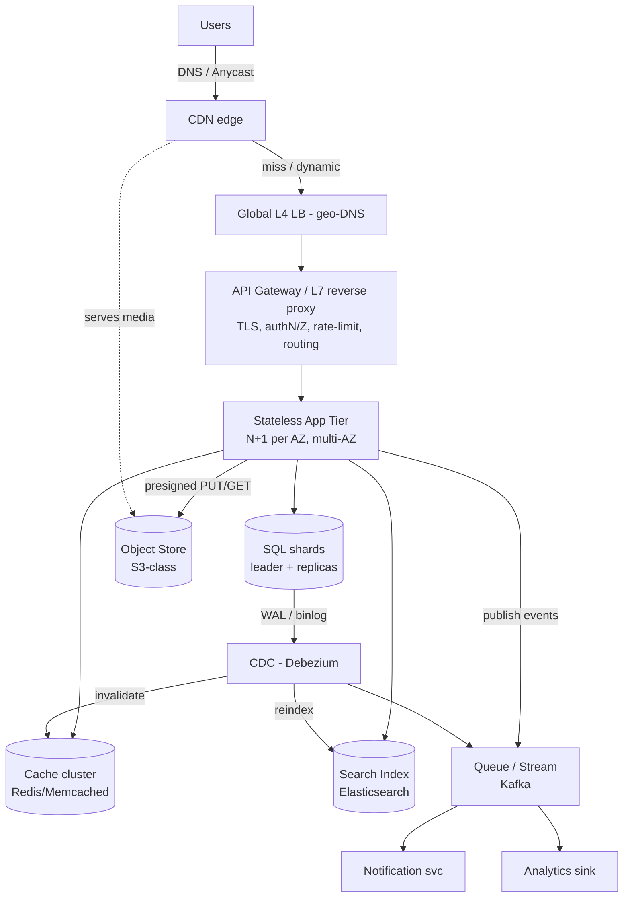

# Building Blocks Cheat-Sheet — A Design-Time Catalog

> **Category:** Fundamentals & Framework
> **Topic:** Building Blocks Cheat-Sheet (reference + practice artifact)
> **Reader:** senior backend engineer (Java/JVM, distributed systems) practising HLD.
> **Goal:** not to teach *what* a load balancer is, but to teach *when* to reach for each block, *what failure mode* it removes, and *what you pay* for it.

This document deliberately bends the standard HLD template. There is no single "system" to size here — the topic is the toolbox itself. So the structure is: treat the **toolbox as the system**, drive it from a realistic reference workload (a read-heavy social/commerce backend), size *that* so the numbers are concrete, and then walk each building block as a **design-time decision** with a defended tradeoff. The interview value is the judgment, so most of the doc is the per-block deep dives and the "how they compose" section.

---

## 1. Problem & Clarifying Questions

**Restated problem.** Produce a catalog of the core distributed-systems building blocks — load balancers (L4/L7), CDN, reverse proxy / API gateway, caches, message queues vs streams, SQL vs NoSQL, sharding, replication, search index, blob store, rate limiter, pub/sub, change-data-capture (CDC) — framed as design-time decisions. For each: what it solves, when to add it, its dominant failure mode, and the one-line tradeoff. Then show how they compose into a typical large-scale architecture with a reference diagram.

Even though "the system" is a catalog, a strong interview answer still opens by clarifying scope. The questions I would ask:

**Functional scope questions**
- *"Is this a greenfield design or are we evolving an existing monolith?"* — This decides whether I introduce blocks proactively or only when a metric forces them. The senior instinct is: **you do not add a building block until a measurement demands it.** Each block is a liability (operational surface, failure mode, cost) until it's earning its keep.
- *"What is the read:write ratio and the data-gravity of the workload?"* — A 100:1 read-heavy feed system leans on CDN + cache + read replicas. A write-heavy ledger leans on sharding, durable WAL (write-ahead log: the append-only log a database fsyncs before acknowledging a write), and CDC. The toolbox is the same; the *order you reach for it* differs.
- *"What are the dominant access patterns?"* — Point lookups by key, range scans, full-text search, analytical aggregation, and graph traversal each pull toward a different datastore. This is the single biggest driver of SQL-vs-NoSQL-vs-search-vs-blob.

**Non-functional questions**
- *"What is the latency budget, p99 not just p50?"* — p99 (the latency the slowest 1% of requests see) is what forces caches, CDNs, and connection-pool tuning. A 50ms p99 budget rules out cross-region synchronous reads.
- *"What availability target — three nines, four, five?"* — 99.9% (about 8.8h/yr down) vs 99.99% (about 53min/yr) vs 99.999% (about 5min/yr) changes everything: multi-AZ vs multi-region, active-passive vs active-active, and whether you can tolerate a stateful failover.
- *"What consistency does the business actually need, per data class?"* — Account balance: strong/linearizable. Like-count: eventual is fine. Most systems are a *mix*, and the art is classifying each data type so you don't pay strong-consistency cost on data that doesn't need it.
- *"Durability target?"* — "We can never lose a committed order" (RPO≈0, recovery-point-objective: max acceptable data loss) vs "losing 5 minutes of analytics events is fine." Durability target sets replication factor and sync-vs-async replication.

**Scale questions**
- *"DAU/MAU, peak-to-average ratio, growth rate?"* — Peak QPS, not average, sizes the fleet. A 5x peak (e.g., a flash sale or a 9 PM feed spike) means you provision for 5x or you autoscale fast enough to catch it.
- *"Object sizes and total dataset size?"* — Sizes the blob store, cache memory budget, and shard count.
- *"Geographic distribution of users?"* — Single-region vs multi-region drives CDN, geo-DNS, and the hardest consistency tradeoffs.

**Out-of-scope confirmation**
- I'll exclude: client/mobile app design, billing, ML model training pipelines, and detailed Kubernetes/infra-as-code. I'll treat observability (metrics/logs/traces) as cross-cutting and mention it but not deep-dive.

---

## 2. Requirements (Finalized)

To make the numbers concrete, I'll anchor the catalog to a **reference workload**: a read-heavy consumer backend (think a social feed + light commerce), because it naturally exercises *every* block in the catalog.

**Functional (reference workload):**
- Users post content (text + media), follow other users, and read a home feed.
- Users search content and other users by text.
- Users place occasional orders (the strong-consistency island).
- The system emits events (post created, order placed) consumed by downstream services (notifications, analytics, search indexer).

**Non-functional (the targets that force each block):**

| Property | Target | Which block it forces |
|---|---|---|
| Read p99 latency | ≤ 100 ms | CDN, cache, read replicas |
| Write p99 latency | ≤ 300 ms | async fan-out, queues |
| Availability (reads) | 99.99% | multi-AZ, replicas, stateless app tier behind LB |
| Availability (writes) | 99.95% | leader-based replication, failover |
| Order consistency | strong / linearizable | single-leader SQL shard, no read-from-replica for balances |
| Feed/like consistency | eventual (seconds) | cache + async fan-out acceptable |
| Order durability | RPO ≈ 0 | synchronous replication of the order WAL |
| Media durability | 11 nines | object store (S3-class) |

**Explicit assumptions (flagged):**
- 100M registered users, **20M DAU**.
- Read:write ratio **100:1** (typical for feed/social).
- Peak = **3x** average.
- Average post payload (metadata) ≈ **1 KB**; media handled separately in blob store, average **300 KB**, with 10% of posts carrying media.
- We run in **3 AZs** in a primary region, with a warm DR (disaster-recovery) region.

---

## 3. Capacity Estimation (arithmetic shown)

The point of this section in the catalog is to derive the numbers that *trigger* each block. I'll show the working.

**Daily request volume.**
- 20M DAU. Assume each active user generates **50 reads/day** (feed scrolls, profile views) and **0.5 writes/day** (posts, likes are counted as light writes; let's fold likes in to get ~5 writes/day to be honest about social interactions). Use **5 writes/day** and **500 reads/day** to honor the 100:1 ratio.
  - Reads/day = 20M × 500 = **10 billion reads/day**.
  - Writes/day = 20M × 5 = **100 million writes/day**.

**Average QPS.** Seconds/day = 86,400.
- Read QPS_avg = 10e9 / 86,400 ≈ **115,700 reads/s** (~116K).
- Write QPS_avg = 100e6 / 86,400 ≈ **1,157 writes/s** (~1.2K).

**Peak QPS (3x).**
- Read QPS_peak ≈ **347,000 ≈ 350K reads/s**.
- Write QPS_peak ≈ **3,500 writes/s**.

These two numbers alone justify the headline blocks:
- **350K reads/s** at ≤100ms p99 cannot all hit a database. → **cache + CDN are mandatory**, not optional. If the cache hit rate is 95%, the DB read load drops to 350K × 5% = **17.5K reads/s**, which read replicas can serve. The 95% number is the single most load-bearing assumption in the whole design — I'd flag it loudly and design a fallback for cache loss (see deep dive #2).
- **3,500 writes/s** is modest for a single well-tuned SQL leader (a commodity Postgres/MySQL leader handles low tens-of-thousands of simple writes/s), so **sharding is not yet forced by write throughput** — it'll be forced by *dataset size* and *blast-radius isolation* instead. Naming that distinction is a senior signal.

**Storage.**
- Post metadata: 100M writes/day × 1 KB = **100 GB/day** of metadata. Over 5 years ≈ 100 GB × 365 × 5 ≈ **182 TB**. With replication factor 3 → **~550 TB**. → too big for one node's working set comfortably; **shard the metadata store** (sharding forced by *size*, as predicted).
- Media: 10% of 100M = 10M media/day × 300 KB = **3 TB/day**. Over 5 years ≈ **5.5 PB** before replication. → **blob/object store is mandatory**; you would never put 5.5 PB of blobs in a relational DB.

**Bandwidth.**
- Read bandwidth: 350K reads/s × ~1 KB metadata ≈ **350 MB/s ≈ 2.8 Gbps** egress for metadata, plus media. Media reads dominate: if 10% of reads pull a 300 KB object, that's 35K media/s × 300 KB = **10.5 GB/s ≈ 84 Gbps**. → **CDN is mandatory** to offload that media egress from origin; serving 84 Gbps from origin servers is wasteful and slow for distant users.
- Write ingest bandwidth: 3,500 writes/s × 1 KB ≈ 3.5 MB/s metadata + media uploads (10M/day × 300KB / 86400 ≈ 35 MB/s avg, 100 MB/s peak). Manageable; route media uploads straight to blob store, not through the app tier.

**Memory (cache sizing).**
- Hot set: assume **20%** of daily-active content is "hot" and 80% of reads hit it (Pareto). Cache the hot post metadata: working set ≈ a few days of posts × 20% ≈ say we want ~200 GB of hot metadata cacheable. → a **Redis/Memcached cluster of ~10–20 nodes** (each ~16–32 GB usable) gives headroom. This is what backs the 95% hit-rate assumption.

**Server/shard counts (rough).**
- **App tier:** if one stateless app node handles ~2K req/s comfortably (JVM service, mostly I/O-bound), 350K reads/s ÷ 2K ≈ **175 nodes**, round to **~200** for headroom + AZ spread (so any one AZ loss leaves 2/3 capacity = ~130 nodes, still > 175? No — so size each AZ to carry peak: 175 per healthy fleet means provision ~260 across 3 AZs so losing one AZ keeps ~175). Naming N+1/AZ-loss sizing is the senior move.
- **DB shards:** 550 TB ÷ (say 8 TB usable per shard primary) ≈ **~70 shards**, ×3 replicas = ~210 DB nodes. (You'd tune shard size to keep working set in RAM and rebuild times sane.)
- **Cache:** ~15 nodes. **CDN:** managed (Cloudflare/Akamai/CloudFront-class), not self-run.

These numbers are illustrative but internally consistent, and crucially they *map each block to the metric that forces it*. That mapping is the cheat-sheet's spine.

---

## 4. API Design

Since the artifact is a catalog, the "API" is best read as **the contract each building block presents to the rest of the system** plus the user-facing edges. I'll show the user-facing API briefly, then the internal block contracts.

**User-facing (through the API gateway):**
```
POST /v1/posts                      // create a post
  req:  { text, mediaUploadId? }    // media pre-uploaded via signed URL
  resp: { postId, createdAt }       // 201; Idempotency-Key header required

GET  /v1/feed?cursor=<opaque>&limit=20
  resp: { items: [...], nextCursor }

GET  /v1/posts/{postId}             // cacheable; ETag + Cache-Control

POST /v1/media/upload-url           // returns a presigned URL to PUT blob directly to object store
  resp: { uploadId, url, expiresAt }

GET  /v1/search?q=<text>&type=post|user&cursor=...
POST /v1/orders                     // strong-consistency island; Idempotency-Key required
```

**Internal block contracts (the catalog's real API):**
```
Load balancer:   forward(conn|request) -> backend     // health-checked pool
API gateway:     authN/authZ, rate-limit, route, transform
Cache:           get(key) -> value|miss;  set(key,val,ttl);  del(key)
Queue:           publish(topic, msg);  consume(group) -> msg + ack()/nack()
Stream:          append(partitionKey, event) -> offset;  read(from=offset)
Object store:    putObject(key, bytes);  getObject(key);  presign(key, ttl)
Search index:    index(doc);  query(text, filters, page) -> hits
Rate limiter:    allow(identity, cost) -> bool         // token-bucket semantics
Pub/Sub:         subscribe(topic, handler);  publish(topic, event)
CDC:             tail(table) -> change events (insert/update/delete)
```

The recurring shape worth internalizing: **synchronous request/response blocks** (LB, gateway, cache, DB, search) sit on the user's latency path, so they must be fast and you must have a fallback when they fail. **Asynchronous blocks** (queue, stream, pub/sub, CDC) sit *off* the latency path, so they trade immediate consistency for throughput and decoupling.

---

## 5. High-Level Architecture

### ASCII block diagram (the reference composition)

```
                          ┌──────────────┐
        Users ───DNS──────│   CDN (edge)  │  static + media, cache GETs
                          └──────┬───────┘
                                 │ (cache miss / dynamic)
                          ┌──────▼───────┐
                          │ Global LB / │  geo-DNS, anycast
                          │  L4 LB      │
                          └──────┬──────┘
                                 │
                          ┌──────▼───────┐
                          │ API Gateway /│  TLS term, authN/Z, rate-limit,
                          │  L7 Reverse  │  routing, request shaping
                          │   Proxy      │
                          └──────┬───────┘
            ┌────────────────────┼────────────────────┐
            │                    │                     │
      ┌─────▼─────┐        ┌─────▼─────┐         ┌─────▼─────┐
      │ App tier  │        │ App tier  │   ...   │ App tier  │  stateless, N+1 per AZ
      │ (AZ-a)    │        │ (AZ-b)    │         │ (AZ-c)    │
      └──┬──┬──┬──┘        └───────────┘         └───────────┘
         │  │  │
   ┌─────┘  │  └───────────────┬───────────────┬──────────────┐
   │        │                  │               │              │
┌──▼───┐ ┌──▼─────┐      ┌──────▼──────┐  ┌─────▼─────┐  ┌──────▼──────┐
│Cache │ │ SQL    │      │  Object     │  │  Search   │  │  Queue /    │
│(Redis│ │ shards │      │  Store      │  │  Index    │  │  Stream     │
│clus.)│ │ leader │      │ (S3-class)  │  │ (ES/Solr) │  │ (Kafka)     │
└──────┘ │ +repl. │      └─────────────┘  └─────▲─────┘  └──┬───────┬──┘
         └───┬────┘                              │          │       │
             │ WAL/binlog                        │     ┌────▼──┐ ┌──▼──────┐
         ┌───▼────┐                              │     │ Notif │ │ Analytics│
         │  CDC    │──────────────────────────────┘     │ svc   │ │  sink    │
         │ (Debez.)│   feeds search indexer & caches    └───────┘ └──────────┘
         └─────────┘
```

### Mermaid diagram



**Request flow (read a feed):**
1. DNS/anycast routes the user to the nearest CDN PoP (point-of-presence: an edge location).
2. CDN serves cached media directly; the dynamic feed call misses and goes to the global L4 LB.
3. L4 LB (operates at TCP layer, fast, no payload inspection) routes to the regional L7 gateway.
4. Gateway terminates TLS, authenticates the JWT, checks the rate limiter, routes to the app tier.
5. App node tries the cache first (feed is precomputed and cached per user). On hit (target 95%), returns immediately. On miss, reads from a SQL read replica, rebuilds the page, populates cache.
6. Media URLs in the response point back at the CDN.

**Write flow (create a post):**
1. Through gateway → app tier. App writes metadata to the SQL leader (strongly durable, synchronously replicated within AZ).
2. App publishes a `post.created` event to Kafka and returns 201 to the user *without* waiting for fan-out — the slow work (updating followers' feeds, indexing for search, notifications) happens async off the latency path.
3. Consumers fan out: feed-builder updates follower feed caches, search indexer indexes the post, notification service alerts followers. CDC also tails the SQL WAL as a *second* path to keep search/cache consistent even if the app forgot to publish.

---

## 6. Data Model & Storage Choices

Entities and the datastore each lands in — the choice is driven by access pattern, not by fashion.

| Entity | Access pattern | Store | Why (and failure mode avoided) |
|---|---|---|---|
| User, Order, Account balance | point lookup by id; transactional; relational integrity | **Sharded SQL (Postgres/MySQL)** | ACID + foreign keys; avoids the lost-money failure mode of eventual consistency on balances. |
| Post metadata | point lookup by postId; high write volume; sharded by author | **Sharded SQL or wide-column (Cassandra)** | If write fan-out and timeline-by-key dominate, Cassandra's tunable consistency + write throughput win; if relational joins matter, SQL. Choose per the dominant query. |
| Home feed (precomputed) | get list by userId; ephemeral; high read | **Cache (Redis sorted sets)** | O(log n) ranked timeline reads; avoids recomputing feeds on every scroll. Backed by SQL so cache loss is recoverable. |
| Media blobs | put once, get many, large | **Object store (S3-class)** | 11-nines durability, cheap, CDN-frontable; avoids bloating the DB and the failure mode of blob I/O starving transactional I/O. |
| Full-text search docs | text + filter queries, ranking | **Search index (Elasticsearch)** | Inverted index for text; a SQL `LIKE '%x%'` does full scans (the failure mode: O(N) query latency). |
| Events / change log | append, replay, multi-consumer | **Log/stream (Kafka)** | Durable replayable ordered log; avoids tight coupling and the failure mode of a slow consumer blocking the producer. |

**Schema sketch (SQL island):**
```sql
users(user_id PK, handle, created_at, ...)          -- sharded by user_id
posts(post_id PK, author_id, text, media_key?, created_at)  -- sharded by author_id
follows(follower_id, followee_id, PK(follower_id, followee_id))
orders(order_id PK, user_id, amount, status, created_at)    -- strong consistency
```
**Sharding key choice:** posts sharded by `author_id` keeps an author's posts co-located (cheap profile reads) but creates **hot shards** for celebrity authors — addressed in deep dive #4. The follow graph sharded by `follower_id` makes "who do I follow" cheap; the inverse query ("who follows me") then needs a secondary index or a denormalized reverse table. Naming this asymmetry is the senior signal.

---

## 7. Deep Dives — Each Building Block as a Design-Time Decision

This is the bulk of the document and the core deliverable. For **each block**: *what it solves → when to add it → failure mode → one-line tradeoff*, then the design judgment.

### 7.0 The meta-rule

> **Add a block only when a metric forces it, and own its failure mode before you own its benefit.** Every block is latency + cost + an operational failure surface. The senior answer never says "we'll add a cache"; it says "the DB read load at 350K/s exceeds replica capacity, so we add a cache, accept a 95% hit-rate dependency, and design the cold-cache stampede defense."

---

### 7.1 Load Balancers — L4 vs L7

- **Solves:** spreads traffic across a fleet, removes single-server bottleneck and provides health-checked failover.
- **Add when:** you have more than one app instance (i.e., immediately, for any HA system).
- **Failure mode:** the LB itself is a SPOF (single point of failure) → mitigate with redundant LBs + anycast/floating IP. Also: bad health checks can eject healthy nodes (flapping) or keep dead ones.
- **One-line tradeoff:** **L4** is fast and protocol-agnostic but blind to content; **L7** is content-aware (routing, retries, TLS) but does more work per request.

| Dimension | L4 (transport) | L7 (application) |
|---|---|---|
| Operates on | TCP/UDP, IPs+ports | HTTP/gRPC, headers, paths |
| Capability | connection forwarding, fast | path/host routing, retries, TLS term, header rewrite |
| Cost | lowest latency, highest throughput | more CPU, richer features |
| Use it for | raw throughput, non-HTTP, first hop | smart routing, canary, A/B, sticky sessions |

**Decision:** Use **L4 at the edge** (anycast, raw throughput, DDoS surface), then **L7 inside** as the API gateway for routing and policy. This two-tier split avoids the failure mode where a single all-in-one LB becomes both the bottleneck and the SPOF. *Sticky sessions* (pinning a user to one backend) are an anti-pattern for a stateless tier — prefer stateless app nodes + shared session store so any node can serve any request and node loss is invisible.

---

### 7.2 CDN (Content Delivery Network)

- **Solves:** serves static + cacheable content from edge PoPs near users; offloads origin bandwidth and cuts latency for distant users.
- **Add when:** you serve media/static assets globally, or origin egress (here ~84 Gbps of media) is expensive/slow. The bandwidth math in §3 forces it.
- **Failure mode:** stale content (over-long TTL serving outdated objects) and cache poisoning. Mitigate with versioned/immutable object keys (`/img/abc123-v2.jpg`) and short TTLs on mutable content.
- **One-line tradeoff:** massive latency + egress savings, at the cost of an invalidation/staleness problem you now own.

**Decision:** Front all media with the CDN using **immutable content-hashed keys** so invalidation is free (a new version = a new URL). Serve dynamic API responses through the CDN only with very short TTLs or not at all. The failure this avoids: origin overload and 200ms+ latencies for users far from the region.

---

### 7.3 Reverse Proxy / API Gateway

- **Solves:** single entry point for cross-cutting concerns — TLS termination, authN/authZ, rate limiting, request routing, response shaping, and protocol translation.
- **Add when:** you have more than one backend service, or any cross-cutting policy you don't want duplicated in every service.
- **Failure mode:** becomes a fat SPOF and a deployment bottleneck if it grows business logic. Keep it thin and policy-only.
- **One-line tradeoff:** centralizes cross-cutting concerns (DRY, consistent policy) at the cost of a shared component every request traverses.

**Decision:** Gateway does authN, coarse authZ, rate limiting, and routing — **no business logic**. The reverse proxy (nginx/Envoy-class) handles TLS termination and connection management. The failure this avoids: scattering auth/rate-limit logic across services where it drifts and creates security gaps.

---

### 7.4 Caches — Where to Place Them (DEEP DIVE)

This is the highest-leverage block in a read-heavy system, so it earns the deepest treatment.

- **Solves:** absorbs read load that the database cannot serve (here: 350K reads/s → 17.5K at 95% hit rate), and cuts read latency from ~5–20ms (DB) to sub-ms.
- **Add when:** read QPS or read latency exceeds what the durable store can serve within budget. The §3 math forces it hard.
- **Failure mode:** **cache stampede / thundering herd** on cold start or mass eviction (every miss hits the DB simultaneously); **stale data**; and **dependency inversion** — if the system *cannot* run without the cache (the 95% assumption), the cache becomes a SPOF for availability, not just performance.
- **One-line tradeoff:** huge latency/throughput win for a consistency-and-staleness problem you now own.

**Where to place the cache — options:**

| Placement | Where | Pros | Cons / failure mode |
|---|---|---|---|
| Client / browser | on device | zero network cost | uncontrollable invalidation |
| CDN edge | PoP | offloads origin | only cacheable/public content |
| Local in-process | app node heap | fastest, no network hop | not shared, cold on deploy, per-node duplication |
| Distributed (Redis/Memcached) | shared tier | shared, large, survives app restarts | network hop, its own HA problem |
| Database buffer pool | inside DB | transparent | doesn't reduce DB connection load |

**Caching patterns:**
- **Cache-aside (lazy):** app reads cache, on miss reads DB and populates. Simple, resilient (cache loss = slower, not wrong). Default choice.
- **Write-through:** write goes to cache and DB synchronously — consistent but slower writes.
- **Write-behind:** write to cache, async flush to DB — fast but risks data loss on cache failure.

**Decision:** Use **cache-aside on a distributed Redis cluster** as the primary, plus a small **local in-process cache** for the very hottest keys (config, celebrity profiles) to cut the network hop and protect against Redis blips. Defenses for the failure modes:
- **Stampede:** use a *mutex/single-flight* (one request rebuilds a key while others wait or serve stale) and *jittered TTLs* (spread expiry so keys don't all expire at the same instant). Avoids the failure where one popular key expiring sends 10K simultaneous DB reads.
- **Cold cache:** on a full cache flush, the DB would see 350K reads/s. Mitigate by *warming* the cache before taking traffic, and by *load-shedding* (rate-limit DB fallback) so a cold cache degrades gracefully instead of taking the DB down (the classic "cache loss → DB meltdown → full outage" cascade).
- **Staleness/consistency:** invalidate on write via CDC (see 7.13) so the cache and DB don't drift. For data that can be slightly stale (like-counts), accept eventual consistency with a short TTL.

---

### 7.5 Message Queues vs Streams (DEEP DIVE)

Frequently conflated; the distinction is a real interview discriminator.

- **Queue (e.g., SQS, RabbitMQ):** a message is delivered to *one* consumer and removed after ack. Good for **task distribution / work queues** — "send this email," "resize this image."
- **Stream / log (e.g., Kafka, Kinesis):** an ordered, durable, *replayable* log; many independent consumer groups each read at their own offset; messages persist after consumption (retention-based, not ack-based).

| Dimension | Queue | Stream (log) |
|---|---|---|
| Delivery | to one consumer, then gone | retained; many consumers, each own offset |
| Ordering | usually per-queue/weak | strict per-partition |
| Replay | no (consumed = gone) | yes (re-read from offset) |
| Best for | task/work distribution, RPC offload | event sourcing, fan-out to N consumers, CDC sink, analytics |
| Failure mode | poison message blocks/dead-letters; at-least-once dupes | slow consumer lags; partition hot-spotting; offset mismanagement → reprocessing |

**Solves:** decoupling producers from consumers, absorbing spikes (buffering), and enabling async work off the latency path (the write-flow returns before fan-out).

**Add when:** a producer must not block on a slow/multiple consumers, or you need spike buffering, or multiple independent teams consume the same events.

**Decision:** Use a **stream (Kafka)** as the backbone because the reference workload fans the same `post.created`/`order.placed` events to *multiple* consumers (feed builder, search indexer, notifications, analytics) and needs **replay** to rebuild a search index or backfill a new consumer. Use a plain **queue** only for pure point-to-point task offload (e.g., a "send SMS" worker) where replay is meaningless. Partition Kafka by a key that preserves the ordering you care about (e.g., by `user_id` so a user's events stay ordered) — the failure this avoids is out-of-order processing (e.g., a "post deleted" event processed before its "post created"). Handle **at-least-once delivery** with idempotent consumers (dedupe by event id) — the failure avoided is double-charging or double-notifying.

---

### 7.6 SQL vs NoSQL (DEEP DIVE)

The most over-debated and under-reasoned choice. The discipline: choose by **access pattern and consistency need**, per data class, not globally.

| Need | Pick | Why / failure mode avoided |
|---|---|---|
| Transactions, joins, strong invariants (orders, balances) | **SQL (Postgres/MySQL)** | ACID; avoids lost-update/lost-money under concurrency |
| Massive write throughput, simple key access, tunable consistency, horizontal scale | **Wide-column (Cassandra/Scylla)** | linear write scaling; avoids single-leader write ceiling |
| Flexible/evolving schema, document reads | **Document (MongoDB/DynamoDB)** | schema flexibility; avoids migration pain |
| Caching, ephemeral ranked data | **Key-value (Redis)** | sub-ms ops; not a system of record |
| Graph traversal (deep follows-of-follows) | **Graph (Neo4j)** | avoids exponential join blowup |

**The CAP/PACELC frame (explain inline):** *CAP* says under a network **P**artition you must choose **C**onsistency or **A**vailability. *PACELC* extends it: **E**lse (no partition), you still choose between **L**atency and **C**onsistency. SQL leaders favor C; Dynamo-style NoSQL favors A/L with eventual consistency. The senior point: **partitions are rare but latency-vs-consistency is a choice you make on every single request.**

**Decision:** **Polyglot persistence.** SQL for the transactional island (users, orders, balances). Cassandra (or sharded SQL) for high-volume post metadata if write throughput/timeline-by-key dominates. Redis for feeds/caches. Do **not** force everything into one engine — the failure that avoids is either (a) a SQL leader melting under write load it was never sized for, or (b) reinventing transactions on top of an eventually consistent store and getting it subtly wrong (lost orders).

---

### 7.7 Sharding (Partitioning)

- **Solves:** dataset or write throughput that exceeds a single node — splits data across nodes by a shard key.
- **Add when:** data size (here ~550 TB) or write QPS exceeds one node's working-set/throughput. In §3, **size forced sharding before throughput did** — call that out.
- **Failure mode:** **hot shards** (skewed key, e.g., celebrity author), **cross-shard queries/transactions** (slow, or impossible atomically), and **resharding pain** (rebalancing under live traffic).
- **One-line tradeoff:** unbounded horizontal scale at the cost of cross-shard operations and rebalancing complexity.

| Strategy | How | Failure mode |
|---|---|---|
| Range | partition by key range | hot ranges (recent timestamps all land on one shard) |
| Hash | hash(key) → shard | even spread but no range scans; resharding moves most keys |
| Consistent hashing | keys on a ring | minimizes movement on add/remove node |
| Directory/lookup | explicit map key→shard | flexible, but the lookup table is a SPOF |

**Decision:** **Consistent hashing** for the metadata store so adding capacity moves only ~1/N of keys (avoids the "rehash everything" outage on scale-out). For hot shards (celebrity author), **split the hot key's data** (e.g., shard a celebrity's posts by `(author_id, time_bucket)`), or treat celebrities specially (see 7.9 fan-out). Avoid cross-shard transactions by aligning the shard key with the transaction boundary (an order and its items share `order_id`).

---

### 7.8 Replication

- **Solves:** availability (survive node loss), read scaling (serve reads from replicas), and durability (data on multiple nodes).
- **Add when:** any HA requirement, or read load exceeds the leader.
- **Failure mode:** **replication lag** (stale reads from async replicas → read-your-own-write violations), **split-brain** (two leaders after a partition), and **failover data loss** (async replica promoted loses un-replicated writes).
- **One-line tradeoff:** availability + read scale vs. staleness (async) or write latency (sync).

| Model | Consistency | Write latency | Failure mode |
|---|---|---|---|
| Single-leader, async repl | reads can be stale | fast writes | lag; lost writes on failover |
| Single-leader, sync repl | strong | slower (wait for replica ack) | a slow replica stalls writes |
| Multi-leader | conflicts possible | low (local writes) | write conflicts need resolution |
| Leaderless (quorum, R+W>N) | tunable | tunable | requires read-repair / anti-entropy |

**Decision:** **Single-leader with semi-synchronous replication** for the SQL island: at least one replica must ack before commit (RPO≈0 within AZ for orders) while others replicate async for read scale. For feeds/likes (eventual is fine), async replicas are acceptable. Solve **read-your-own-writes** by routing a user's reads to the leader for a short window after their write, or by tracking a write watermark and reading a replica only when it's caught up — avoids the jarring failure where a user posts and then doesn't see their own post. Prevent **split-brain** with a consensus-based leader election (Raft/quorum) + fencing tokens so a deposed leader can't keep writing.

---

### 7.9 Search Index — and the Feed Fan-out aside (DEEP DIVE)

- **Solves:** full-text and faceted queries that a relational `LIKE '%x%'` would do via O(N) full scans (latency death).
- **Add when:** users search by free text / need ranking / faceted filters.
- **Failure mode:** **index/source divergence** (the index drifts from the DB), **reindex cost**, and **eventual-consistency window** (a new post isn't searchable for a second or two).
- **One-line tradeoff:** fast text queries + ranking, at the cost of a second copy of data you must keep in sync.

**Decision:** Use **Elasticsearch**, fed by **CDC** off the SQL WAL (not by dual-writes from the app). Why CDC over dual-write: a dual write ("write to DB *and* to ES from the app") has the failure mode where one write succeeds and the other fails, silently diverging the index. CDC makes the **DB the single source of truth** and the index a derived view, so a replay of the log fully rebuilds it.

**Feed fan-out aside (the celebrity problem):** how to build the home feed touches several blocks at once:
- **Fan-out-on-write (push):** when you post, write into every follower's feed cache. Fast reads, but a celebrity with 50M followers triggers 50M writes per post — a write storm (the failure mode).
- **Fan-out-on-read (pull):** build the feed at read time by merging followees' recent posts. Cheap writes, expensive reads.
- **Hybrid (the answer):** push for normal users, **pull for celebrities** — at read time, merge the precomputed feed with a live fetch of the few celebrities you follow. This avoids both the write storm and the slow read, and is the canonical senior answer.

---

### 7.10 Blob / Object Store

- **Solves:** durable, cheap storage of large immutable objects (media), decoupled from the transactional DB.
- **Add when:** you store files/media; §3's 5.5 PB forces it.
- **Failure mode:** treating it like a database (listing/scanning a bucket is slow; no transactions), and accidental public exposure (security).
- **One-line tradeoff:** infinite cheap durable storage, but only key→blob access (no queries, no transactions).

**Decision:** Store media in an **S3-class object store** with **presigned URLs** so clients upload/download *directly* (the app tier never proxies bytes — that avoids the failure where 84 Gbps of media flows through and saturates your app servers). Store only the **object key** in SQL. Front reads with the CDN. Use immutable, content-hashed keys for free invalidation.

---

### 7.11 Rate Limiter

- **Solves:** protects the system from abuse, runaway clients, and overload; enforces fairness and quotas.
- **Add when:** any public endpoint (immediately, at the gateway).
- **Failure mode:** the limiter's own state store (counters) becomes a bottleneck or SPOF; and a too-coarse limit harms legitimate bursty users.
- **One-line tradeoff:** protection + fairness, at the cost of a shared counter store and tuning effort.

| Algorithm | Behavior | Failure mode |
|---|---|---|
| Fixed window | count per wall-clock window | boundary bursts (2x at window edge) |
| Sliding window log | exact, per-request timestamps | memory-heavy at scale |
| Sliding window counter | approximate, cheap | small inaccuracy |
| **Token bucket** | tokens refill at rate R, burst up to B | best default — allows bursts, smooths average |
| Leaky bucket | constant outflow rate | no burst tolerance |

**Decision:** **Token bucket at the gateway**, backed by **Redis** with atomic Lua scripts (so the check-and-decrement is race-free across nodes). Token bucket allows legitimate bursts (a user loading a page fires several requests at once) while capping the sustained rate — avoids the fixed-window failure where a client sends 2x the limit across a window boundary. Apply limits per-API-key/user/IP, and **fail open vs. fail closed** deliberately: for abuse protection on writes, fail closed (deny if limiter is down) only for sensitive endpoints; for reads, fail open so a limiter outage doesn't take down the read path.

---

### 7.12 Pub/Sub

- **Solves:** one-to-many event distribution where publishers don't know subscribers (decoupling).
- **Add when:** multiple independent services react to the same event and you want loose coupling.
- **Failure mode:** **at-least-once duplicates**, lost messages if subscribers are offline (unless durable), and fan-out amplification.
- **One-line tradeoff:** clean decoupling and extensibility, at the cost of delivery-guarantee complexity and eventual consistency.

**Pub/Sub vs. queue vs. stream:** pub/sub is the *pattern* (one→many, topic-based); a **stream (Kafka)** is the durable, replayable *implementation* of it, while a transient pub/sub (Redis Pub/Sub) is fire-and-forget (subscribers offline = miss the message — a real failure mode).

**Decision:** Implement pub/sub **on the Kafka backbone** (topics = events, consumer groups = subscribers) so it's durable and replayable; reserve transient Redis Pub/Sub only for ephemeral signals (e.g., "cache invalidate now") where a missed message is harmless because a TTL will fix it.

---

### 7.13 Change Data Capture (CDC)

- **Solves:** reliably propagating DB changes to other systems (search index, cache, analytics, data lake) **without dual-writes**.
- **Add when:** you need derived views (search, cache, read models) kept in sync with a source-of-truth DB.
- **Failure mode:** **dual-write divergence** is what CDC *prevents*; CDC's own failure modes are connector lag, WAL retention pressure (if a consumer falls behind, the DB's WAL must be retained, risking disk fill), and schema-change handling.
- **One-line tradeoff:** rock-solid derived-data sync from a single source of truth, at the cost of an extra pipeline and an eventual-consistency window.

**Decision:** Use **Debezium-class CDC** tailing the SQL WAL/binlog into Kafka. Why this matters: it makes the SQL DB the **single source of truth** and search index + caches **derived, replayable views**. The failure this avoids is the classic dual-write bug — app writes to DB, then crashes before writing to ES, leaving the index permanently wrong. With CDC, the index is just a projection of the log; replay rebuilds it. Watch WAL retention: alert on consumer lag so a stalled connector doesn't fill the DB disk (a sneaky outage).

---

## 8. Scaling & Bottlenecks

How the composed system scales, where it breaks **first**, and how each bottleneck is removed.

**Order in which things break as you grow:**
1. **Single app server → fleet.** Bottleneck: CPU/connections. Fix: stateless app tier behind LB, autoscale on QPS/CPU. (First and easiest.)
2. **DB read load.** Bottleneck: leader can't serve 350K reads/s. Fix: **cache** (95% offload) then **read replicas** for the remaining 17.5K/s.
3. **DB write/size.** Bottleneck: 550 TB, write fan-out. Fix: **shard** by consistent hashing; isolate the strong-consistency island.
4. **Media egress.** Bottleneck: 84 Gbps from origin. Fix: **CDN** + direct-to-object-store uploads.
5. **Synchronous fan-out on write.** Bottleneck: a post that updates 50M feeds blocks the writer. Fix: **async via Kafka** + **hybrid fan-out** for celebrities.
6. **Hot shard / hot key.** Bottleneck: one celebrity saturates one shard/cache node. Fix: key-splitting, local cache for hot keys, pull-model for celebrities.
7. **Cache cluster capacity / cold-start.** Bottleneck: eviction storms. Fix: jittered TTL, single-flight, load-shedding to protect the DB.
8. **Cross-region.** Bottleneck: global latency + consistency. Fix: geo-DNS + regional read replicas; keep writes in the home region or go multi-leader only where conflicts are tolerable.

**The recurring senior insight:** **the bottleneck moves.** Every fix you apply pushes the constraint to the next layer. A good design names the *next* bottleneck before the interviewer does.

---

## 9. Reliability, Consistency & Security

**Reliability / failure handling**
- **Redundancy at every tier:** N+1 per AZ, multi-AZ, warm DR region. No single component is a SPOF — LBs are paired, the cache cluster tolerates node loss, DB has replicas + failover.
- **Graceful degradation:** if the cache is down, **load-shed** (serve a subset, add backpressure) rather than melt the DB. If search is down, fall back to a basic DB query with a banner. If the recommendation service is down, serve a generic feed. Degrade features, don't fail the request.
- **Timeouts, retries with jittered exponential backoff, and circuit breakers** on every network call — a circuit breaker (stops calling a failing dependency for a cooldown) prevents one slow dependency from exhausting all threads (the cascading-failure failure mode).
- **Bulkheads:** isolate resource pools per dependency so one saturated downstream can't consume all connections.
- **Idempotency:** every write API takes an `Idempotency-Key`; the server dedupes so client retries (which *will* happen) don't double-create orders or double-charge. Async consumers dedupe by event id (at-least-once delivery is a fact, not a bug).

**Consistency model (per data class)**
- **Strong/linearizable:** orders, balances → single-leader SQL, semi-sync replication, no replica reads for balances.
- **Read-your-writes:** route a user to the leader briefly after their write, or use write-watermark replica routing.
- **Eventual:** feeds, like-counts, search index, derived caches → acceptable seconds of lag; reconciled via CDC.
- **Saga pattern** for cross-service workflows (e.g., order → payment → inventory): a sequence of local transactions with compensating actions, because a distributed ACID transaction across services is impractical (2PC is slow and a coordinator failure blocks everyone).

**Security / abuse**
- **TLS everywhere**, terminated at the gateway; mTLS service-to-service inside.
- **AuthN** via short-lived JWTs; **authZ** coarse at the gateway, fine-grained in services.
- **Rate limiting** (token bucket) per user/IP/key at the gateway; stricter on write/auth endpoints.
- **Object store**: private by default, time-limited presigned URLs, no public buckets (the classic data-leak failure).
- **Input validation + WAF** at the edge against injection; **secrets** in a vault, never in code/config.
- **DDoS:** anycast L4 + CDN absorb volumetric attacks at the edge before they reach origin.

---

## 10. Extensions & Follow-ups (how each changes the design)

- **"Make it multi-region active-active."** Now writes can originate in two regions → conflict resolution needed. Options: keep a single global write region per data class (simplest), or use CRDTs/last-writer-wins for tolerant data, or per-region sharding (a user "belongs" to a home region). Latency-vs-consistency (PACELC's "else") becomes the dominant tension.
- **"Strong consistency on the feed too."** Drop the cache for feed reads or use write-through + read-from-leader; you pay latency and lose the 95% offload — likely refuse unless the business truly needs it, and justify with the cost.
- **"Add real-time delivery (live notifications)."** Add **WebSocket/SSE gateway** + a presence service + pub/sub fan-out; the feed fan-out now also pushes to connected sockets.
- **"Support exactly-once processing."** True exactly-once is impossible end-to-end; achieve *effectively-once* with idempotent consumers + dedup store + transactional outbox (write the event in the same DB transaction as the state change, then CDC ships it — eliminates the dual-write gap).
- **"10x the scale."** Re-run the §3 arithmetic: more shards, more cache nodes, possibly tiered caching (L1 local + L2 distributed), and a data-tiering strategy (hot in SSD/cache, cold in object store).
- **"Cut cost 30%."** Right-size replicas, use spot/preemptible for stateless tier, tune CDN cache ratios, move cold data to cheaper storage tiers, and compress payloads.
- **"Add analytics / a data lake."** CDC already gives you the change stream — sink Kafka into a lake (Parquet on object store) + a warehouse; keep analytics off the OLTP path entirely.

---

## 11. Interview Q&A

**Q1. When do you add a cache, and what's the risk?**
Add it when read QPS or read latency exceeds what the durable store can serve in budget (here 350K/s). The risk: the system can become *dependent* on the cache (95% hit rate), so a cold/empty cache sends full load to the DB — a meltdown. Mitigate with jittered TTLs, single-flight rebuilds, warm-up, and load-shedding.
*Follow-up: how do you keep cache and DB consistent?* — Invalidate via CDC off the WAL so the DB is the single source of truth; accept short eventual-consistency windows for tolerant data.
*Follow-up: cache-aside vs write-through?* — Cache-aside by default (cache loss = slower, not wrong); write-through only when you need read-after-write consistency through the cache and accept slower writes.

**Q2. L4 vs L7 load balancing — when each?**
L4 (TCP, fast, content-blind) at the edge for raw throughput and DDoS surface; L7 (HTTP-aware, routing/retries/TLS) inside as the gateway for smart routing and policy. Two tiers avoid a single all-in-one LB being both bottleneck and SPOF.

**Q3. Queue vs stream?**
Queue = one consumer, consumed-then-gone, task distribution. Stream = durable replayable log, many consumer groups, event fan-out and CDC. Pick a stream (Kafka) when multiple consumers need the same events or you need replay; pick a queue for pure point-to-point task offload.
*Follow-up: how do you handle a poison message?* — Dead-letter queue after N retries; alert; never block the partition indefinitely.

**Q4. (Senior signal) SQL or NoSQL for this system — defend it.**
Polyglot. SQL for the transactional island (orders/balances) because ACID prevents lost-money under concurrency; wide-column/Cassandra or sharded SQL for high-volume post metadata where write throughput and timeline-by-key dominate; Redis for feeds; object store for media; ES for search. Forcing one engine either melts a SQL leader or reinvents transactions badly on an eventually consistent store.
*Follow-up: explain CAP vs PACELC here.* — Under partition, the order DB chooses consistency (refuse rather than serve a wrong balance); else, on the read path, we choose latency (serve from cache/replica) for tolerant data. Latency-vs-consistency is a per-request choice, partitions are rare.

**Q5. (Senior signal) How do you build the home feed at scale, and why?**
Hybrid fan-out: push to follower feed caches for normal users (fast reads), pull at read time for celebrities (avoid the 50M-write storm). Merge precomputed + live celebrity posts. Defends against both the write-amplification failure (pure push) and the slow-read failure (pure pull).

**Q6. (Senior signal) Why CDC instead of dual-writes to the search index?**
Dual-write has a failure mode where the DB write succeeds and the index write fails (or vice versa), permanently diverging them. CDC makes the DB the single source of truth and the index a derived, replayable projection — a log replay rebuilds it. Cost: an extra pipeline and an eventual-consistency window. Watch WAL retention so a lagging consumer doesn't fill the DB disk.

**Q7. How do you make writes idempotent?**
Client sends an `Idempotency-Key`; the server records it and returns the original result on retries, so a network retry can't double-create. Async consumers dedupe by event id because at-least-once delivery guarantees occasional duplicates.
*Follow-up: where do you store idempotency keys?* — A fast store (Redis) with TTL covering the retry window, or a uniqueness constraint in the DB for the strong path.

**Q8. What rate-limiting algorithm and where?**
Token bucket at the gateway, backed by Redis with atomic Lua. It allows legitimate bursts while capping sustained rate, unlike fixed-window which permits 2x at boundaries. Per user/IP/key; stricter on writes/auth.

**Q9. What's your first bottleneck and how does it move?**
First the single app server (fix: stateless fleet + LB), then DB reads (cache + replicas), then DB size/writes (shard), then media egress (CDN), then synchronous fan-out (async + hybrid). The bottleneck always moves to the next layer — name the next one before it's hit.

**Q10. (Senior signal) How do you prevent cascading failure?**
Timeouts + jittered backoff retries + circuit breakers + bulkheads, plus graceful degradation (load-shed, serve stale, drop optional features). A slow dependency must never exhaust all threads — the circuit breaker trips and the system sheds rather than collapses.

---

## 12. Cheat-Sheet & Self-Test

### Dense recap — the catalog in one screen

| Block | Solves | Add when | Failure mode | One-line tradeoff |
|---|---|---|---|---|
| L4 LB | spread traffic, fast | >1 server, edge | SPOF; bad health checks | speed vs content-blindness |
| L7 LB / gateway | routing, TLS, auth, rate-limit | >1 service | fat SPOF if it grows logic | centralized policy vs shared hop |
| CDN | edge media, offload origin | global media / high egress | staleness / poisoning | latency+egress win vs invalidation problem |
| Cache | absorb read load | reads exceed DB budget | stampede / dependency SPOF | throughput vs staleness you own |
| Queue | task distribution | producer mustn't block | poison msg, dupes | decoupling vs at-least-once |
| Stream | event fan-out, replay | many consumers / replay | consumer lag, hot partition | replayable log vs offset complexity |
| SQL | transactions, joins | invariants, balances | write ceiling on leader | ACID vs horizontal scale effort |
| NoSQL (wide-col) | write scale, key access | huge writes, simple access | no joins, eventual | scale vs weaker guarantees |
| Sharding | size/throughput > 1 node | data/writes exceed node | hot shard, cross-shard ops | scale vs cross-shard complexity |
| Replication | HA, read scale, durability | any HA / read scale | lag, split-brain, lost writes | availability vs staleness/write latency |
| Search index | text/faceted queries | free-text search | source divergence, reindex | fast text vs second synced copy |
| Object store | durable large blobs | files/media | misused as DB; exposure | cheap durable storage vs key-only access |
| Rate limiter | abuse/overload protection | any public endpoint | counter store SPOF | protection vs shared-state cost |
| Pub/Sub | one→many decoupling | many reactors | dupes / lost if transient | extensibility vs delivery complexity |
| CDC | sync derived views, no dual-write | search/cache/lake sync | connector lag, WAL fill | single-source-of-truth sync vs extra pipeline |

### Key numbers (reference workload)
- 20M DAU, 100:1 read:write, 3x peak.
- ~350K reads/s peak, ~3.5K writes/s peak.
- Cache at 95% hit → 17.5K DB reads/s.
- ~550 TB metadata (×3 repl) → ~70 shards; ~5.5 PB media → object store + CDN (~84 Gbps egress saved).

### Headline decisions
L4 edge + L7 gateway · cache-aside Redis (+ local hot-key cache) · Kafka stream backbone · polyglot persistence with a strong SQL island · consistent-hash sharding · semi-sync single-leader replication · ES fed by CDC · presigned-URL object store behind CDN · token-bucket rate limiter · hybrid feed fan-out · idempotency keys + circuit breakers + graceful degradation.

### Diagram-in-words
Users → CDN (media) → L4 edge → L7 gateway (TLS/auth/rate-limit) → stateless app fleet (multi-AZ) → {cache-aside Redis, sharded SQL leader+replicas, object store via presigned URLs, search index, Kafka}. SQL WAL → CDC → Kafka → {feed builder, search indexer, notifications, analytics} and CDC also invalidates cache + reindexes search. DB is the single source of truth; search/cache/feed are derived replayable views.

### Self-test (no answers)
1. Your cache cluster is flushed during a deploy. Walk through exactly what happens to DB load and how your design prevents an outage.
2. A single celebrity post must reach 80M followers. Trace the write path and justify every block it touches.
3. The order service must never double-charge despite client retries and at-least-once event delivery. Specify the idempotency mechanism at each layer.
4. You're asked to add full-text search without a dual-write bug. Describe the pipeline and how a new index version is rebuilt from scratch.
5. Define, per data class in this system, the required consistency level and the exact mechanism that delivers it — and name the failure mode each weaker choice would cause.
