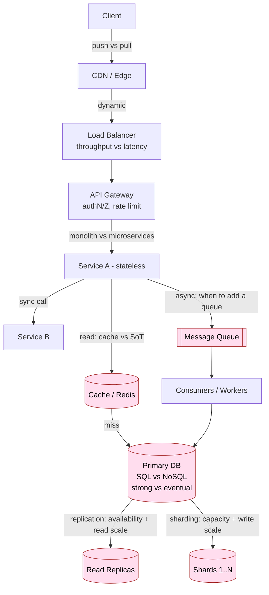

# Tradeoff Playbook — A Staff-Level Reference for System Design Interviews

> **Category:** Fundamentals & Framework
> **Topic:** Tradeoff Playbook (reference topic — structured as a catalog of recurring tradeoffs with decision rules)

This document is deliberately *not* a single-system design. It is the meta-layer underneath every HLD: the recurring forks in the road, the **signals** that push you to one side, the **failure mode** you incur if you pick wrong, and — critically — **how to verbalize the tradeoff out loud** so an interviewer hears a staff engineer rather than a junior pattern-matcher.

I've kept the required HLD document structure but adapted each section to the catalog format the prompt asks for. The "system under design" here is your **decision-making process during an HLD round**.

---

## 1. Problem & clarifying questions

**Restated problem.** In a senior/staff system-design round, the bar is not "can you name a load balancer." The bar is: *given an ambiguous prompt, can you extract the constraints that matter, then make and defend a sequence of tradeoff decisions whose justification reveals you understand the failure modes?* Every box you draw is the visible tip of an invisible decision. The interviewer is grading the decisions, not the boxes.

So the "tradeoff playbook" is the toolkit you reach for at each decision point. But before you reach for any tool, a real interview starts with **clarifying questions** — because the *right* tradeoff is entirely determined by the requirements. The single most common reason a candidate picks the wrong side of a tradeoff is that they never established the requirement that would have settled it.

Here are the questions I ask the interviewer at the top of **every** HLD round, grouped. These double as the questions you must answer (or assume) before applying any tradeoff rule in this playbook.

**Functional scope**
- What are the *core* user-facing operations? (Distinguish the 2–3 that define the system from the long tail of nice-to-haves.)
- Who are the actors — end users, internal services, admins, partners?
- What is explicitly **out of scope** for this round? (Billing? Analytics? Mobile vs web? Search? I want to spend my hour on what's being graded.)

**Non-functional — the tradeoff-deciding questions**
- **Read/write ratio?** This single number decides caching, push-vs-pull, replication-vs-sharding, and denormalization. A 100:1 read-heavy system and a write-heavy system are *different designs*.
- **Latency target, and on which percentile?** p50 vs p99 vs p99.9 changes everything. "Fast" is not a spec; "p99 < 200 ms for read, < 500 ms for write" is.
- **Availability target?** 99.9% (8.7 h/yr down) vs 99.99% (52 min/yr) vs 99.999% (5 min/yr). Each extra nine roughly multiplies cost and forbids certain designs (e.g., synchronous cross-region writes).
- **Consistency requirement, per operation?** Is stale data a correctness bug (money, inventory, auth) or merely a UX nit (like count, follower count)? Consistency is *not* global — it's per data item, per operation.
- **Durability requirement?** Is losing the last 1 second of writes acceptable (a "like") or catastrophic (a payment)? This decides sync vs async replication and ack semantics.
- **Scale, today and in 2–3 years.** DAU/MAU, peak QPS, total data volume, object size, growth rate. Without these I cannot do capacity math, and without capacity math the tradeoffs are unanchored guesses.

**Scale / growth**
- Expected DAU, peak-to-average ratio (do we have thundering-herd events — flash sales, live sports, viral posts?).
- Hot-key skew: is traffic uniform or Zipfian (a few celebrities/products dominate)? Skew breaks naive sharding and naive caching.
- Geographic distribution — single region or global? Global forces a consistency-vs-latency decision immediately.

**Out-of-scope confirmation**
- Confirm what we can hand-wave (auth provider, CDN, observability stack) so I can name them once and move on.

**Why I lead with these.** Every tradeoff in this playbook resolves *differently* depending on the answers above. If I designed before asking, I'd be optimizing for requirements that may not exist — the classic junior failure mode of "I built a globally-strongly-consistent system" when the interviewer wanted a like button.

---

## 2. Requirements (finalized) — for the playbook itself

Since this is a reference artifact rather than one system, the "requirements" are the conditions under which the playbook is correct and usable.

**Functional requirements of the playbook**
- Catalog the ~10 recurring HLD tradeoffs.
- For each: a crisp definition, the **signals** favoring each side, the **failure mode** of the wrong choice, a **decision rule**, and an **interview script** (how to say it out loud).
- Provide comparison tables wherever 3+ options exist.
- Provide a decision-flow diagram and a sequence diagram of how a tradeoff gets surfaced in a live interview.

**Non-functional requirements (of your interview performance)**
- **Latency:** you should reach a *defended* decision on any of these tradeoffs within ~60–90 seconds of it arising. Hesitation reads as not knowing.
- **Consistency:** your stated decision must remain consistent with your earlier requirement statements. Contradicting yourself ("I want strong consistency" then "we'll fan-out-on-write and tolerate staleness") is a red flag.
- **Durability:** the *justification* must survive a follow-up probe. "Because it's faster" dies on the first "faster how, and at what cost?"

**Explicit assumptions used throughout**
- Backend on JVM (Java), distributed-systems context, cloud deployment (managed DBs, object store, message brokers available).
- "Top-tier company scale" defaults: tens of millions of DAU unless stated, peak-to-average ~3–5x.
- Costs are order-of-magnitude; the *relative* cost direction is what matters in an interview, not the exact dollar.

---

## 3. Capacity estimation — the arithmetic that decides tradeoffs

Tradeoffs are not abstract; they're forced by numbers. Below is the back-of-envelope toolkit, then worked examples showing how the *number* selects the *side*.

### 3.1 The constants worth memorizing

| Quantity | Value to use |
|---|---|
| Seconds per day | 86,400 ≈ **~100k** (round up for headroom) |
| Seconds per month | ~2.5M |
| 1 million writes/day | ~12 writes/sec average |
| 1 billion writes/day | ~12k writes/sec average |
| Peak factor | 3–5× average (use 5× for spiky consumer apps) |
| L1 cache ref | ~1 ns |
| Main memory ref | ~100 ns |
| SSD random read | ~100 µs |
| Network round trip within DC | ~0.5 ms |
| Cross-region RTT (e.g., US↔EU) | ~80–150 ms |
| Disk seek (spinning) | ~10 ms |
| Read 1 MB sequentially from SSD | ~1 ms |
| Read 1 MB over 1 Gbps network | ~10 ms |

The two facts that decide more tradeoffs than any others: **memory ≈ 1000× faster than SSD random read**, and **cross-region RTT ≈ 100 ms ≈ 200× a same-DC hop**. Caching exists because of the first; the consistency-vs-latency war exists because of the second.

### 3.2 Worked example A — does the read/write ratio force a cache?

Suppose 50M DAU, each user makes 20 reads and 2 writes per active day.

- Reads/day = 50M × 20 = **1B reads/day** → 1B / 86,400 ≈ **~11.6k reads/sec** average → at 5× peak ≈ **~58k reads/sec**.
- Writes/day = 50M × 2 = 100M/day → ~1.16k writes/sec avg → **~5.8k writes/sec** peak.
- **Read:write ≈ 10:1.**

Decision consequence: a 10:1 ratio with 58k peak reads against a primary DB that comfortably serves ~5–10k QPS per node means you'd need ~6–12 read replicas *or* a cache. A cache with even 80% hit rate cuts DB read load to ~12k QPS — one or two replicas. **The number (10:1, 58k peak) is what selects "introduce a cache + read replicas," not taste.**

### 3.3 Worked example B — does data volume force sharding?

Suppose each user stores 5 KB of profile + relationships, and we keep 200M total users plus 5 years of an activity log at 200 bytes/event, 30 events/user/day.

- User data = 200M × 5 KB = **1 TB**. Fits on one beefy node; replication, not sharding, suffices.
- Activity log = 200M × 30 events/day × 200 B × 365 × 5 ≈ 200M × 30 × 200 × 1825 ≈ **~2.2 PB**. No single node holds this. **The number (petabytes) forces sharding**; replication alone cannot solve a capacity problem, only an availability/read-throughput one.

This is the cleanest demonstration of the **replication-vs-sharding** rule: replication solves *availability and read throughput*; sharding solves *capacity and write throughput*. The arithmetic tells you which problem you have.

### 3.4 Worked example C — does fan-out cost force push-vs-pull?

Social feed: 50M DAU, average user follows 200 accounts, a celebrity has 50M followers, average user posts 0.1 times/day.

- Posts/day = 50M × 0.1 = 5M posts/day ≈ ~58 posts/sec avg, ~290/sec peak.
- **Fan-out-on-write (push):** each post writes to all followers' feeds. Average post → 200 feed writes. 5M posts × 200 = **1B feed writes/day** ≈ 11.6k/sec avg. Tolerable. *But* a celebrity post → 50M feed writes in one burst → a **write storm** that can stall the system for minutes. This is the precise failure mode of naive push.
- **Fan-out-on-read (pull):** feed assembled at read time by querying the people you follow. Read = 200 source lookups merged. With 58k peak reads/sec × 200 lookups = **11.6M sub-queries/sec** — crushes the DB. This is the failure mode of naive pull at read-heavy scale.

The number forces the *hybrid*: push for normal users, pull for celebrities. **You cannot derive the hybrid without doing this arithmetic** — which is exactly why interviewers ask you to do it.

---

## 4. API design — surfacing tradeoffs through interface choices

Interface decisions *are* tradeoff decisions. A few that recur:

**Synchronous request/response vs. async with callback/poll.** The signature tells the story:

```
# Synchronous (caller blocks, simple, but coupled to downstream latency/availability)
POST /orders            -> 201 Created { orderId, status: "CONFIRMED" }

# Asynchronous (caller gets a handle immediately; result arrives later)
POST /orders            -> 202 Accepted { orderId, status: "PENDING" }
GET  /orders/{id}       -> 200 OK { orderId, status: "CONFIRMED" | "PENDING" | "FAILED" }
# or webhook: POST {callbackUrl} { orderId, status }
```

The moment you return **202 Accepted**, you've made the sync-vs-async tradeoff in the open. (Decision rule in §7.4.)

**Idempotency in the contract.** Any non-idempotent write that can be retried needs an idempotency key:

```
POST /payments
Headers: Idempotency-Key: <client-generated-uuid>
Body:    { amount, currency, source }
-> 200 OK { paymentId }   # same key returns same result, never double-charges
```

This single header is how you make "at-least-once delivery" (the realistic guarantee of any queue/retry system) safe. Omitting it is a classic correctness failure (§9).

**Pagination = a latency-vs-completeness tradeoff.** Offset pagination is simple but O(n) deep; cursor/keyset pagination is O(1) but can't jump to page N:

```
GET /feed?cursor=<opaque>&limit=20  -> { items, nextCursor }
```

I default to cursor pagination at scale because deep `OFFSET 1000000` scans are the failure mode that turns a 5 ms query into a 5 s one.

---

## 5. High-level architecture — where each tradeoff lives in a system

Rather than one system, here is the **canonical request path** with each tradeoff annotated where it physically arises. This is the mental map I overlay on any HLD.

### 5.1 ASCII diagram

```
                                  ┌─────────────────────────────────────────┐
                                  │   TRADEOFF LIVES HERE  →  [decision]      │
                                  └─────────────────────────────────────────┘

   Client
     │  (push vs pull: who initiates? long-poll / WS / SSE vs polling)
     ▼
 ┌─────────┐   [latency vs cost: edge PoPs]      ┌──────────┐
 │   CDN   │ ───────────────────────────────────▶│  Static  │
 └────┬────┘                                      └──────────┘
      │ dynamic
      ▼
 ┌──────────────┐  [throughput vs latency: conn pooling, TLS termination]
 │ Load Balancer│  [availability: health checks, multi-AZ]
 └──────┬───────┘
        ▼
 ┌──────────────┐   [monolith vs microservices: one box or many?]
 │  API Gateway │   [security: authN/authZ, rate limiting]
 └──────┬───────┘
        ▼
 ┌──────────────┐        sync          ┌──────────────┐
 │  Service A   │ ───────────────────▶ │  Service B   │   [sync vs async:
 │ (stateless)  │ ◀─── 200/202 ──────  │              │    inline call vs queue]
 └──────┬───────┘                      └──────────────┘
        │  read                                 │ write event
        ▼                                        ▼
 ┌──────────────┐  [cache vs source of truth]  ┌──────────────┐
 │    Cache     │  [consistency: TTL/invalidate]│   Message    │  [async durability:
 │ (Redis)      │                               │   Queue      │   ack, replay, DLQ]
 └──────┬───────┘                               └──────┬───────┘
        │ miss                                          ▼
        ▼                                        ┌──────────────┐
 ┌──────────────┐  [SQL vs NoSQL]               │  Consumers   │
 │   Primary    │  [normalize vs denormalize]   │ (workers)    │
 │   Database   │  [strong vs eventual]         └──────────────┘
 └──────┬───────┘
        │ replicate (availability, read scale)   shard (capacity, write scale)
        ▼                                          ▼
 ┌──────────────┐                          ┌──────────────┐
 │ Read Replicas│                          │  Shard 1..N  │
 └──────────────┘                          └──────────────┘
```

### 5.2 Mermaid diagram



### 5.3 Sequence diagram — how a tradeoff surfaces in a live interview

```mermaid
sequenceDiagram
    participant I as Interviewer
    participant Y as You
    Note over I,Y: A tradeoff fork appears
    I->>Y: "How do you store the feed?"
    Y->>Y: Recall read:write ratio (from clarifying Qs)
    Y->>I: "It's 100:1 read-heavy with celebrity skew, so..."
    Y->>I: State options: push / pull / hybrid (table in head)
    Y->>I: Name failure mode of each (write storm vs read storm)
    Y->>I: Defend: hybrid — push for normal, pull for celebs
    I->>Y: "What if a normal user suddenly goes viral?"
    Y->>I: "Threshold-based promotion to pull; debounce fan-out"
    Note over I,Y: Senior signal = anticipating the probe
```

---

## 6. Data model & storage choices — the SQL/NoSQL and normalization tradeoffs grounded

The storage decision is where the most tradeoffs collide, so it deserves a concrete frame before the catalog. The driving question is always: **what are the access patterns?** Model the queries first, the schema second, the engine third.

A worked entity example — a generic "user + content + relationship" core:

| Entity | Key access pattern | Pushes toward |
|---|---|---|
| User profile | Read by `userId`, occasional update | KV / document store; or SQL row — small, point-lookup |
| Content (post) | Write-once, read-many by `postId`; list by `authorId` | Wide-column or document; denormalize author name in |
| Relationships (follows) | "Who do I follow", "who follows me", both huge | Adjacency list in wide-column; or graph DB if traversal-heavy |
| Counters (likes) | Extreme write rate, eventual read | Specialized counter / Redis + async flush; never a hot SQL row |
| Transactions (payments) | ACID, multi-row invariants | SQL with serializable isolation; non-negotiable |

The table itself demonstrates the meta-rule: **there is no single right database; you pick per access pattern, and at scale a real system is polyglot.** The catalog in §7 gives the decision rules.

---

## 7. Deep dives — THE CATALOG OF TRADEOFFS

This is the bulk of the document. Each tradeoff follows the same template:
**(a) what it is, (b) signals for each side, (c) failure mode of the wrong choice, (d) decision rule, (e) the interview script.**

---

### 7.1 SQL vs NoSQL

**(a) What it is.** SQL = relational engines (Postgres, MySQL) with a fixed schema, joins, and ACID transactions. NoSQL is an umbrella: key-value (Redis, DynamoDB), document (MongoDB), wide-column (Cassandra, Bigtable), and graph (Neo4j). The real axis is not "SQL vs NoSQL" but **"strong relational guarantees + flexible queries" vs "horizontal write scale + flexible schema + a fixed, denormalized access pattern."**

**ACID** = Atomicity, Consistency, Isolation, Durability — the transactional guarantees that let you update multiple rows as one all-or-nothing unit. **BASE** (Basically Available, Soft state, Eventual consistency) is the NoSQL counter-philosophy: trade immediate consistency for availability and scale.

**(b) Signals**

| Signal | Points to SQL | Points to NoSQL |
|---|---|---|
| Multi-entity transactions / invariants (money, inventory) | ✅ | ❌ |
| Ad-hoc / evolving queries, reporting, joins | ✅ | ❌ |
| Strong consistency required | ✅ | (some KV offer it, but not the default) |
| Write throughput beyond a single primary (10k+ writes/s sustained) | ❌ (hard to shard) | ✅ |
| Schema flexibility / sparse attributes | (JSONB helps) | ✅ |
| Massive volume, predictable single access pattern | ❌ | ✅ |
| Sub-ms point lookups at huge scale | (with cache) | ✅ (DynamoDB/Cassandra) |

**(c) Failure mode of the wrong choice.**
- *Picking NoSQL when you needed SQL:* you reimplement transactions and joins in application code, get them subtly wrong, and ship data-integrity bugs (double-spend, orphaned rows). The classic disaster: "we'll just denormalize" and then discover you need a consistent multi-document update that the store can't atomically do.
- *Picking SQL when you needed NoSQL:* you hit the single-primary write ceiling, attempt application-level sharding, and inherit cross-shard joins, distributed transactions, and rebalancing pain — at which point you've built a worse version of a NoSQL store.

**(d) Decision rule.** *Default to SQL.* It is the most flexible and least regret-prone choice until a specific signal forces otherwise. Move a *particular access pattern* (not the whole system) to NoSQL when: (i) write volume provably exceeds a sharded SQL fleet's comfort, or (ii) the access pattern is fixed and the relational features are unused. **Polyglot persistence** — SQL for the transactional core, NoSQL for the high-volume feed/log/counter — is the staff answer, not "all SQL" or "all NoSQL."

**(e) Interview script.** "The transactional core — accounts, orders, balances — goes in Postgres because I need multi-row ACID invariants; getting those wrong means double-charging a customer. The activity feed is write-heavy, append-only, and queried by a single key, so it goes in a wide-column store like Cassandra where I get linear write scaling. I'm choosing per-access-pattern, not picking one religion."

---

### 7.2 Normalization vs denormalization

**(a) What it is.** **Normalization** stores each fact once and joins to reconstruct views — minimal redundancy, easy writes, expensive reads. **Denormalization** duplicates data so a read is a single lookup — cheap reads, expensive and error-prone writes (you must update every copy).

**(b) Signals**

| Signal | Normalize | Denormalize |
|---|---|---|
| Read:write ratio | balanced or write-heavy | strongly read-heavy |
| Latency budget per read | generous (joins OK) | tight; must avoid joins/fan-out |
| Data changes frequently | ✅ (one place to update) | ❌ (many copies to fix) |
| Engine can't join (wide-column) | n/a | ✅ forced |
| Strong consistency of duplicated field needed | ✅ | risky (copies drift) |

**(c) Failure mode.**
- *Over-normalized read-heavy system:* every page load fans out into 8 joins, p99 latency balloons, the DB becomes the bottleneck, and you bolt on caching to paper over a modeling mistake.
- *Over-denormalized:* a single field change (user renames themselves) must propagate to millions of copies; you miss some, and now the system shows two different names for the same user — a **consistency drift** failure that's hard to detect and harder to repair.

**(d) Decision rule.** Normalize by default (it's the safe, correct starting point). Denormalize *deliberately and locally* for proven hot read paths, and only when you have a concrete plan to keep copies consistent (async propagation, periodic reconciliation jobs, or accepting bounded staleness). **Denormalization is a performance optimization you pay for in write complexity and consistency risk** — never the default.

**(e) Interview script.** "I'll normalize the source of truth. For the feed read path, which is 100:1 read-heavy and latency-sensitive, I'll denormalize the author's display name into each feed item so the read is a single fetch. I accept that a name change triggers a background backfill and that some items briefly show the old name — a UX nit, not a correctness bug. If this were a balance field, I would *not* denormalize it."

---

### 7.3 Strong vs eventual consistency

**(a) What it is.** **Strong consistency**: every read returns the latest committed write (you act as if there's a single copy). **Eventual consistency**: replicas converge over time; a read may return stale data for a window. This is the practical face of **CAP** — under a network partition you must choose Consistency or Availability — and of **PACELC** — *even without a partition*, you trade Latency for Consistency.

**(b) Signals**

| Signal | Strong | Eventual |
|---|---|---|
| Stale read is a correctness bug (money, inventory, auth, uniqueness) | ✅ | ❌ |
| Stale read is a cosmetic UX nit (like count, feed item) | ❌ overkill | ✅ |
| Global/multi-region with tight latency | ❌ (cross-region consensus is slow) | ✅ |
| Need high availability during partitions | ❌ (CP must reject writes) | ✅ (AP stays up) |
| Read-your-own-writes UX | needs session/read-your-writes | careful: route to primary or sticky |

**(c) Failure mode.**
- *Eventual where you needed strong:* two users buy the last item because each read a stale "in stock"; you oversell. Or an auth-token revocation propagates lazily and a banned user keeps acting. These are real incidents, not theory.
- *Strong where eventual would do:* you force synchronous cross-region consensus on a like counter; p99 write latency jumps to 150 ms, availability drops because any partition blocks writes, and cost soars — all to make a number that nobody needs to be exact, exact.

**(d) Decision rule.** Consistency is **per data item, per operation**, never global. Default eventual for the high-volume, low-stakes majority; reserve strong for the small set of correctness-critical invariants. Useful middle grounds: **read-your-writes / monotonic-reads** session guarantees (cheap, fixes the most jarring UX), and **bounded staleness** (stale by at most X seconds). For uniqueness/inventory, use a strongly-consistent primary or a conditional-write/compare-and-set primitive on that one key.

**(e) Interview script.** "I'll classify each operation. Posting and reading a feed: eventual — a few seconds of staleness is invisible. Decrementing inventory at checkout: strong — I'll do a conditional update on the item row so I never oversell, even though it costs me latency on that one operation. I'm not buying global strong consistency; I'm buying it surgically where a stale read is a money bug."

---

### 7.4 Sync vs async — and *when* to introduce a queue

**(a) What it is.** **Synchronous**: caller blocks until the work completes and gets the result inline. **Asynchronous**: caller hands the work off (to a queue/broker) and returns immediately; the work happens later, decoupled in time. A **message queue** (Kafka, SQS, RabbitMQ) is the buffer that makes async safe and durable.

**(b) Signals**

| Signal | Sync (inline) | Async (queue) |
|---|---|---|
| Caller needs the result to proceed | ✅ | ❌ |
| Work is fast and reliable (<~100 ms, rarely fails) | ✅ | overkill |
| Work is slow / spiky / can fail-and-retry (email, video transcode, fan-out) | ❌ (blocks user) | ✅ |
| Producer and consumer have different scaling rates | ❌ (tight coupling) | ✅ (buffer absorbs bursts) |
| Need to smooth load spikes / protect a fragile downstream | ❌ | ✅ (queue as shock absorber) |
| Strict end-to-end latency on the result | ✅ | ❌ (adds queue delay) |

**(c) Failure mode.**
- *Sync where you needed async:* a slow or failing downstream (the email provider is down) takes your whole request path down with it — **cascading failure** and tail-latency contagion. Threads pile up waiting; the service exhausts its pool and stops serving even unrelated requests.
- *Async where sync would do:* you add a queue for a fast, reliable, result-needed call. Now you've added latency, a new failure domain, eventual-consistency surprises, and the operational burden of dead-letter queues and replay — for nothing.

**(d) Decision rule.** Introduce a queue when **any** of: (i) the work can be deferred (caller doesn't need the result now), (ii) the work is slow/spiky/failure-prone and you want retries and back-pressure, (iii) you must decouple producer/consumer scaling, or (iv) you need a durable buffer to absorb traffic spikes and protect a fragile downstream. If none hold, keep it synchronous — a queue is not free. A common hybrid: **return 202 immediately, do the heavy work async, and notify via webhook/poll/websocket.** Pair every async write with **idempotent consumers** because queues deliver at-least-once.

**(e) Interview script.** "Placing an order: I'll synchronously reserve inventory and create the order — the user needs that confirmation, and it must be consistent. But sending the confirmation email, updating the recommendation model, and indexing for search are fire-and-forget — I publish an `OrderPlaced` event to Kafka and let consumers handle them. That way an email-provider outage never blocks checkout, and a Black Friday spike is absorbed by the queue instead of toppling the email service."

---

### 7.5 Push vs pull (fan-out-on-write vs fan-out-on-read)

**(a) What it is.** The canonical feed/notification problem. **Push / fan-out-on-write**: when a producer creates an item, immediately write it into every consumer's materialized feed — reads are then trivial. **Pull / fan-out-on-read**: store items once; at read time, gather from all sources the reader cares about and merge. Push optimizes reads; pull optimizes writes.

**(b) Signals**

| Signal | Push (write fan-out) | Pull (read fan-out) |
|---|---|---|
| Read-heavy, low write rate | ✅ (precompute) | ❌ |
| Producers have huge follower counts (celebrities) | ❌ (write storm) | ✅ |
| Followers mostly inactive (write would be wasted) | ❌ | ✅ |
| Tight read latency / must be instant | ✅ | ❌ (read does work) |
| Write volume already high | ❌ | ✅ |

**(c) Failure mode.**
- *Pure push:* a celebrity post triggers tens of millions of feed writes in seconds — a **write storm** that saturates the DB and delays everyone's feeds. Also wastes writes on inactive followers.
- *Pure pull:* at read-heavy scale, every feed load fans out into hundreds of source queries; the read path collapses under a **read storm**, and p99 latency is unacceptable.

**(d) Decision rule.** **Hybrid by follower count.** Push for the vast majority (normal users with modest followings) so reads are cheap. For accounts above a follower threshold (celebrities), *don't* push — readers pull those few high-fanout sources at read time and merge with their pushed feed. Promote/demote accounts across the threshold dynamically; debounce fan-out so a rapid burst of posts doesn't multiply the storm. Also consider pushing only to *active* users and lazily backfilling for the dormant.

**(e) Interview script.** "I'll fan out on write for normal users — feed reads become a single range scan, which matches our 100:1 read skew. But pushing a celebrity's post to 50M feeds is a write storm, so celebrities are pull: readers merge their precomputed feed with a live fetch of the handful of celebrities they follow. The threshold is tuned to where write cost crosses read cost. If a normal user goes viral, they get promoted to pull automatically."

---

### 7.6 Monolith vs microservices

**(a) What it is.** A **monolith** is one deployable unit; a **microservices** architecture splits the system into independently deployable services communicating over the network. The tradeoff is **organizational and operational, not primarily performance** — and that framing alone is a senior signal.

**(b) Signals**

| Signal | Monolith | Microservices |
|---|---|---|
| Small team / early-stage / unproven product | ✅ | ❌ (premature) |
| Need fast local iteration, simple debugging | ✅ | ❌ |
| Many teams needing independent deploy cadence | ❌ | ✅ |
| Components have wildly different scaling needs | ❌ | ✅ (scale hot service alone) |
| Strong consistency / transactions across components | ✅ (one DB) | ❌ (distributed txns are hard) |
| Clear, stable domain boundaries | n/a | ✅ (needed to split well) |
| Operational maturity (CI/CD, observability, on-call) | low OK | high required |

**(c) Failure mode.**
- *Premature microservices:* a 5-person team builds 15 services, drowns in network failures, distributed tracing, eventual-consistency bugs, and a deploy that requires coordinating 6 repos. They've paid the **distributed-systems tax** with none of the organizational benefit. This is the most common over-engineering mistake in interviews and in industry.
- *Monolith past its limits:* one giant codebase where every team blocks on every release, one slow endpoint exhausts shared threads and takes down everything, and you can't scale the hot path without scaling the whole thing — a **deploy-coupling and blast-radius** failure.

**(d) Decision rule.** **Start monolith (or a modular monolith with clean internal boundaries); extract services along proven seams when a specific pain appears** — independent scaling, independent deploy cadence, team autonomy, or fault isolation. Split by *bounded context / business capability*, never by technical layer. The first services to extract are usually the ones with a different scaling profile (e.g., a media-processing pipeline) or a different team. Never split for resume-driven reasons.

**(e) Interview script.** "At this stage I'd build a modular monolith — clean module boundaries, one deploy, one database — because the team is small and the domain isn't fully understood; premature microservices would buy distributed-systems pain for no benefit. I'd extract the first microservice when a concrete signal appears: the media-transcoding path needs GPU nodes and bursts independently, so it earns its own service and its own scaling. Splits follow bounded contexts, not layers."

---

### 7.7 Replication vs sharding (partitioning)

**(a) What it is.** **Replication** keeps full copies of the data on multiple nodes — for **availability** (survive a node loss) and **read throughput** (serve reads from many copies). **Sharding/partitioning** splits the data across nodes so each holds a slice — for **capacity** (data exceeds one node) and **write throughput** (writes spread across primaries). They solve different problems and are usually combined (each shard is itself replicated).

**(b) Signals**

| Signal | Replication | Sharding |
|---|---|---|
| Data fits on one node | ✅ (sufficient) | ❌ (unneeded complexity) |
| Read-heavy, want more read capacity | ✅ (read replicas) | (also, but heavier) |
| Need to survive node/AZ failure | ✅ | (only with replicated shards) |
| Data exceeds single-node storage | ❌ | ✅ |
| Write throughput exceeds single primary | ❌ (one primary still) | ✅ (many primaries) |
| Can pick a good shard key (even distribution, query-aligned) | n/a | ✅ required |

**(c) Failure mode.**
- *Replication when you needed sharding:* you add read replicas to fix a *write* or *capacity* problem — but all writes still funnel to one primary, and the data still doesn't fit. The primary remains the bottleneck; you've added cost without removing the ceiling.
- *Sharding when replication would do:* you shard a 100 GB dataset that fits comfortably on one node, inheriting cross-shard queries, rebalancing, hot-shard skew, and distributed-transaction pain for no reason.
- *Bad shard key:* you shard by something skewed (e.g., `country`) and one shard holds 60% of traffic — a **hot shard** that recreates the single-node bottleneck you were trying to escape.

**(d) Decision rule.** Replicate for availability and read scale; shard for capacity and write scale. **Use the capacity arithmetic (§3.3) to decide:** does the data fit on one node, and does write QPS fit one primary? If both yes → replicate only. If either no → shard, and choose a shard key that is **high-cardinality, evenly distributed, and aligned with the dominant query** (so most queries hit one shard). Combine: replicate each shard for HA. **Consistent hashing** minimizes data movement when adding/removing shards.

**(e) Interview script.** "Our 1 TB user table fits one node, so I'll just replicate it: a primary plus read replicas across AZs gives me availability and absorbs the 10:1 read skew. The 2 PB activity log can't fit one node and takes 12k writes/sec, so it must be sharded — by `userId`, which is high-cardinality and matches the dominant 'fetch my activity' query, keeping it single-shard. Each shard is replicated 3× for durability. Replication solved my availability and read problems; sharding solved my capacity and write problems — different tools for different problems."

---

### 7.8 Latency vs throughput vs cost

**(a) What it is.** The eternal triangle. **Latency** = how long one request takes (you care about tail percentiles, p99/p99.9). **Throughput** = how many requests per second the system sustains. **Cost** = money/resources. You can usually optimize any two at the expense of the third; chasing all three is the tell of someone who hasn't faced a real capacity plan.

**(b) Signals & mechanisms**

| Goal | Mechanism | Costs you |
|---|---|---|
| Lower latency | More replicas/edge PoPs, more RAM cache, no batching, dedicated capacity | Higher cost; sometimes lower throughput |
| Higher throughput | Batching, async, queues, connection pooling, bigger work units | Higher per-request latency |
| Lower cost | Fewer/smaller nodes, higher utilization, batching, spot instances | Higher latency and/or lower headroom |

Key tension: **batching** trades latency for throughput and cost (amortize overhead across many items, but each item waits for the batch). **Over-provisioning** trades cost for tail latency (idle headroom absorbs spikes). **Caching** trades cost/consistency for latency.

**(c) Failure mode.**
- *Latency-obsessed, cost-blind:* you over-provision 5× and add edge caches everywhere; finance kills the project, or you've built a system that can't be afforded at scale.
- *Throughput-via-batching, latency-blind:* you batch aggressively to hit a cost target; p99 latency blows the SLA because items wait for the batch window — invisible at p50, fatal at p99.
- *Cost-obsessed:* you run at 95% utilization to save money; the first spike has no headroom, queues build, and latency cascades into an outage.

**(d) Decision rule.** Make the tradeoff *explicit and requirement-driven*: pick the **one** dimension that's the hard constraint (usually a p99 latency SLA *or* a cost ceiling), satisfy it, then optimize the others. Use batching/async to raise throughput where latency budget allows; keep headroom (target ~60–70% utilization) so spikes don't cascade. State the percentile — "p99 < 200 ms" — because averages hide the tail that actually breaks SLAs.

**(e) Interview script.** "My hard constraint is p99 read latency under 200 ms. To hit that cheaply, I cache hot data in memory — that buys latency without buying a bigger DB fleet. For the write path I can afford 500 ms, so I batch writes to the analytics store, trading some latency for far higher throughput and lower cost. I'll run at ~65% utilization so a 3× spike doesn't cascade. I'm explicitly *not* optimizing all three — latency is the constraint, cost is the budget, throughput I buy with batching where the latency budget allows."

---

### 7.9 Caching vs source-of-truth

**(a) What it is.** A **cache** is a fast, usually in-memory, copy of data whose authoritative version lives elsewhere (the **source of truth**, SoT). Caching is the single highest-leverage latency/cost optimization — and the single richest source of consistency bugs. The hard part is never the cache; it's **invalidation**.

**(b) Signals**

| Signal | Cache it | Don't cache (go to SoT) |
|---|---|---|
| Read-heavy, same data read repeatedly | ✅ | ❌ |
| Data tolerates bounded staleness | ✅ | ❌ if must be fresh |
| Expensive to compute/fetch | ✅ | n/a |
| Strong consistency required (balances, auth) | ❌ (or cache + strict invalidation) | ✅ |
| Low hit rate / unique-per-request data | ❌ (no benefit, adds complexity) | ✅ |

**Caching patterns & their tradeoffs**

| Pattern | How | Tradeoff |
|---|---|---|
| Cache-aside (lazy) | App checks cache, on miss loads SoT and populates | Simple; first read is slow; risk of stale until TTL/invalidation |
| Read-through | Cache library loads SoT on miss | Cleaner code; same staleness concerns |
| Write-through | Write to cache and SoT synchronously | Cache always fresh; higher write latency |
| Write-behind | Write to cache, flush to SoT async | Fast writes; risk of data loss if cache dies before flush |

**(c) Failure mode.**
- *Stale cache:* you cache without an invalidation strategy; users see deleted posts, old prices, revoked permissions. **Cache invalidation correctness** is the bug.
- *Thundering herd / cache stampede:* a hot key expires and thousands of concurrent requests all miss and hit the DB simultaneously, taking it down. Fix with request coalescing / single-flight, or staggered TTLs, or refresh-ahead.
- *Caching where you shouldn't:* caching auth/balance data with a TTL → a revoked user keeps access until the TTL expires — a security hole.

**(d) Decision rule.** Cache read-heavy, staleness-tolerant, expensive-to-compute data. Choose the pattern by write needs (cache-aside is the safe default; write-through when you can't tolerate staleness and accept the write cost). **Always define the invalidation strategy explicitly** (TTL, write-time invalidation, or event-driven). Protect hot keys from stampedes (single-flight + jittered TTL). Never cache correctness-critical data without strict, immediate invalidation — and prefer not caching it at all.

**(e) Interview script.** "Feed items and profiles are read-heavy and staleness-tolerant, so cache-aside in Redis with a 60 s TTL — 80%+ hit rate cuts DB load dramatically. To avoid a stampede when a celebrity's hot key expires, I'll use single-flight so only one request repopulates it, plus jittered TTLs. I will *not* cache the auth/permission check with a lazy TTL — a revoked token must take effect immediately, so that read goes to the SoT or uses event-driven invalidation. The cache is a latency optimization; the SoT is still the truth."

---

### 7.10 Bonus recurring forks (compressed)

These come up often enough to keep in the holster.

| Tradeoff | One-side signal → other-side signal | Wrong-choice failure mode |
|---|---|---|
| **Stateless vs stateful services** | Stateless: easy scaling/restart → Stateful: needs sticky sessions, sharded state, careful failover | Stateful behind a round-robin LB → session loss on every restart |
| **Optimistic vs pessimistic locking** | Optimistic (version check): low contention → Pessimistic (lock): high contention, must serialize | Optimistic under high contention → constant retry storms; Pessimistic under low contention → needless lock waits/deadlocks |
| **At-least-once vs exactly-once delivery** | At-least-once + idempotency (realistic) → "exactly-once" (expensive, often illusory) | Believing in cheap exactly-once → duplicate side effects (double email/charge) |
| **Long polling vs WebSocket vs SSE** | Polling: simple, wasteful → SSE: server→client stream → WS: bidirectional, costly connections | WS for low-frequency one-way updates → connection-management cost for nothing |
| **Edge/CDN vs origin** | CDN: static, cacheable, geo-distributed → origin: dynamic, personalized | Caching personalized content at CDN → user A sees user B's data (a real CDN incident class) |
| **Single-region vs multi-region** | Single: simpler, strong consistency easy → multi: low global latency + DR, but forces eventual consistency or expensive consensus | Multi-region with synchronous cross-region writes → every write pays 100+ ms RTT, availability tanks |
| **Compute vs storage for derived data** | Precompute/store (read-cheap) → compute-on-read (storage-cheap, fresh) | Precomputing rarely-read data → storage waste + staleness; computing hot data on read → CPU bottleneck |

---

## 8. Scaling & bottlenecks — how to *find* the next bottleneck

Tradeoffs recur because **systems bottleneck in a predictable order**. Knowing the order lets you anticipate the interviewer's "now it's 10× bigger" probe.

**The usual bottleneck progression (and the tradeoff it triggers):**
1. **Single app server CPU** → add a load balancer + horizontal scale (requires *stateless* services — §7.10).
2. **Database read load** → read replicas (replication, §7.7) + cache (§7.9).
3. **Cache misses / hot keys** → bigger cache, better keys, stampede protection (§7.9).
4. **Database write load / write contention** → shard (§7.7), or move the hot write path to NoSQL/queue (§7.1, §7.4).
5. **Single-primary write ceiling** → sharding with a good key, or CQRS (split read/write models).
6. **Cross-shard queries / hot shard** → reshard, better key, or denormalize to avoid cross-shard joins.
7. **Synchronous fan-out / downstream coupling** → queue + async (§7.4), push/pull hybrid (§7.5).
8. **Network/region latency** → CDN, edge, regional replicas (single-vs-multi-region tradeoff).

**How to remove each:** every step above *is* one of the cataloged tradeoffs being applied. That's the whole point of the playbook — scaling is just applying the right tradeoff at the right bottleneck, in order.

**The meta-skill:** when an interviewer says "10× the traffic," don't redesign — say *"the first thing that breaks is X, here's the tradeoff I apply, the next thing that breaks is Y."* Naming the breaking order in sequence is a top staff signal.

---

## 9. Reliability, consistency & security — the cross-cutting tradeoffs

**Reliability / failure handling.**
- **Timeouts + retries with exponential backoff + jitter** on every network call — but retries on non-idempotent operations require **idempotency keys** (§4), or you turn a transient blip into duplicate charges.
- **Circuit breakers** to stop hammering a failing downstream (turns a slow dependency into a fast, contained failure instead of cascading thread exhaustion). This is the reliability face of the sync-vs-async tradeoff (§7.4).
- **Bulkheads** (isolated resource pools per dependency) so one slow downstream can't drain the whole thread pool.
- **Graceful degradation:** serve stale cache or a reduced experience rather than failing — the availability-vs-consistency tradeoff applied to outages.
- **Dead-letter queues** for messages that repeatedly fail, so a poison message doesn't block the queue.

**Consistency model (recap as decision).** Per-operation classification (§7.3) is the design artifact. Use **read-your-writes** session guarantees for UX, **bounded staleness** where acceptable, and strong/conditional writes only on invariants. Document which is which — an interviewer will ask "is this consistent?" for each store.

**Security & abuse.**
- **AuthN/AuthZ** at the gateway; never trust the client. Revocation must be timely — the reason not to lazily cache auth (§7.9).
- **Rate limiting** (token bucket / sliding window) per user and per IP — the abuse-prevention tradeoff: protect the system at the cost of occasionally throttling a legitimate burst. Place it at the edge so attack traffic dies before reaching expensive services.
- **Input validation, least privilege, encryption in transit and at rest** as table stakes.
- **The security-vs-latency tradeoff:** every auth check, encryption, and validation adds latency; the answer is to do it once at the edge and pass a trusted token inward, not to skip it.

---

## 10. Extensions & follow-ups — how each changes the tradeoffs

| Interviewer adds… | Which tradeoff it re-opens | How the answer shifts |
|---|---|---|
| "Make it global / multi-region" | Strong-vs-eventual, single-vs-multi-region | Cross-region RTT (~100 ms) forces eventual consistency or expensive consensus; go AP for most data, keep strong-consistency islands regional |
| "Now it's write-heavy, not read-heavy" | Push-vs-pull, replication-vs-sharding, normalize-vs-denormalize | Flip to pull/sharding; denormalization's write cost now dominates — reconsider it |
| "A few keys get 1000× the traffic" | Caching, sharding, push-vs-pull | Hot-key handling: dedicated cache, key splitting, pull for hot producers |
| "We can't lose any data ever" | Sync-vs-async, durability | Synchronous replication with quorum acks; write-behind caching is now forbidden |
| "Cut the cost in half" | Latency-vs-throughput-vs-cost | Batch more, raise utilization, drop replicas — and state the latency/headroom you're sacrificing |
| "Add real-time updates" | Push-vs-pull, polling-vs-WS | Move from poll to WS/SSE; introduce a pub/sub layer |
| "It must be exactly-once" | Delivery semantics | Reframe: at-least-once + idempotency keys; true exactly-once needs dedup store + transactional outbox |
| "10× the scale" | (all of §8) | Walk the bottleneck progression, not a redesign |

The senior move on any follow-up: **identify which tradeoff just got re-opened, and re-derive only that decision** — don't throw away the whole design.

---

## 11. Interview Q&A

**Q1. How do you decide SQL vs NoSQL?**
Default SQL for its flexibility and ACID guarantees; move a *specific access pattern* to NoSQL only when a signal forces it — write volume beyond a sharded SQL fleet, or a fixed access pattern that uses none of the relational features. Real systems are polyglot.
*Deep probes:* (a) "What breaks if you put payments in MongoDB?" → multi-document transactions; you'd hand-roll ACID and ship a double-spend bug. (b) "When does sharded SQL stop being enough?" → when cross-shard joins/distributed transactions dominate and a fixed-key NoSQL store would be simpler at that volume.

**Q2. When do you introduce a message queue?**
When work can be deferred, is slow/spiky/failure-prone, needs producer/consumer decoupling, or needs a buffer to protect a fragile downstream. Otherwise keep it synchronous — a queue adds latency, a failure domain, and operational burden.
*Deep probes:* (a) "What's the cost of adding one unnecessarily?" → added latency, eventual-consistency surprises, DLQ/replay ops. (b) "How do you make async safe?" → idempotent consumers, because queues are at-least-once.

**Q3. Strong or eventual consistency for a like counter? For inventory?**
Like counter: eventual — staleness is invisible, and forcing strong consistency would spike latency and hurt availability for no benefit. Inventory at checkout: strong/conditional write — a stale read oversells, which is a money bug.
*Deep probes:* (a) "How do you give read-your-own-writes on the eventual path?" → session stickiness or route the user's own reads to the primary. (b) "How do you do strong inventory without killing throughput?" → conditional/compare-and-set on the single item row, not a global transaction.

**Q4. (Senior signal) Push or pull for a feed — and why not just pick one?**
Hybrid by follower count. Pure push dies on celebrity write storms; pure pull dies on read storms at read-heavy scale. Push for normal users (cheap reads), pull for celebrities (avoid the storm), with dynamic promotion.
*Deep probes:* (a) "What's the threshold?" → where write-fan-out cost crosses read-merge cost; tune empirically. (b) "A normal user goes viral mid-day?" → promote to pull, debounce fan-out.

**Q5. (Senior signal) When do microservices help, and when do they hurt?**
They help when *organizational/operational* signals appear — independent deploy cadence, independent scaling, team autonomy, fault isolation. They hurt when adopted prematurely: a small team pays the distributed-systems tax (network failures, distributed transactions, tracing) for no benefit. Start modular monolith; extract along bounded contexts when a concrete pain appears.
*Deep probes:* (a) "What's the first service you'd extract here?" → the one with a different scaling profile (e.g., media transcoding) or owned by a different team. (b) "Why not split by layer?" → splitting by technical layer creates chatty cross-service calls and shared-DB coupling; split by business capability.

**Q6. Replication or sharding — what does each actually solve?**
Replication solves availability and read throughput; sharding solves capacity and write throughput. Use capacity math: if data fits one node and writes fit one primary, replicate only; otherwise shard with a good key, and replicate each shard for HA.
*Deep probes:* (a) "Your shard key candidates?" → high-cardinality, even, query-aligned (e.g., userId for per-user queries). (b) "What if one shard goes hot?" → bad key choice; reshard or split the hot key.

**Q7. (Senior signal) Walk me through the latency/throughput/cost tradeoff for this write path.**
Pick the hard constraint first (p99 SLA or cost ceiling), satisfy it, then optimize the rest. Batch/async to raise throughput where latency budget allows; keep ~65% utilization headroom so spikes don't cascade. State the percentile explicitly.
*Deep probes:* (a) "Why not run at 95% utilization to save money?" → no headroom for spikes → cascading latency → outage. (b) "Where exactly does batching hurt?" → p99: items wait for the batch window even though p50 looks fine.

**Q8. How do you keep a cache consistent with the source of truth?**
Define invalidation explicitly: TTL for staleness-tolerant data, write-time or event-driven invalidation for fresher needs, write-through when you can't tolerate staleness. Protect hot keys from stampedes (single-flight + jittered TTL). Never lazily cache correctness-critical data like auth/balances.
*Deep probes:* (a) "Cache stampede — what is it and the fix?" → simultaneous misses on an expired hot key hammer the DB; fix with request coalescing and staggered TTLs. (b) "Write-behind risk?" → data loss if the cache dies before flushing to SoT.

**Q9. Normalize or denormalize the feed?**
Normalize the source of truth; denormalize only the proven hot read path (e.g., embed author name in feed items) with an explicit propagation/reconciliation plan and accepted bounded staleness. Never denormalize correctness-critical fields like balances.
*Deep probes:* (a) "User renames themselves — what happens?" → background backfill; some items briefly show the old name (acceptable UX nit). (b) "When is the write cost of denormalization the dominant factor?" → write-heavy systems or frequently-changing duplicated fields.

**Q10. How do you make retries safe?**
Timeouts + exponential backoff + jitter, with idempotency keys on non-idempotent writes so a retry never causes a duplicate side effect. Add circuit breakers and bulkheads so a slow downstream fails fast and contained rather than cascading.
*Deep probes:* (a) "Why jitter?" → to avoid synchronized retry storms (thundering herd) after a blip. (b) "Exactly-once delivery?" → reframe to at-least-once + idempotency; true exactly-once needs a dedup store / transactional outbox.

---

## 12. Cheat-sheet & self-test

### Dense recap

**Key numbers to anchor decisions**
- 1B writes/day ≈ 12k/sec avg; ×5 peak ≈ 58k/sec.
- Memory ~100 ns vs SSD random read ~100 µs → memory is ~1000× faster → *that's why caches exist*.
- Cross-region RTT ~80–150 ms → *that's why global strong consistency is expensive*.
- Replication solves availability + read scale; sharding solves capacity + write scale.
- Target ~60–70% utilization for spike headroom.

**The ten tradeoffs and their one-line decision rules**
1. **SQL vs NoSQL** — default SQL; go NoSQL per access pattern when write/scale or fixed-pattern signals force it; be polyglot.
2. **Normalize vs denormalize** — normalize by default; denormalize only proven hot reads with a consistency plan.
3. **Strong vs eventual** — per operation; strong for money/inventory/auth, eventual for the rest.
4. **Sync vs async (queue)** — queue when deferrable, slow/spiky, decoupled, or needs buffering; else stay sync.
5. **Push vs pull** — hybrid by follower count; push normals, pull celebrities.
6. **Monolith vs microservices** — start modular monolith; extract along bounded contexts on concrete pain.
7. **Replication vs sharding** — replicate for availability/read; shard for capacity/write; combine.
8. **Latency vs throughput vs cost** — pick the hard constraint, satisfy it, optimize the rest; state the percentile.
9. **Caching vs SoT** — cache read-heavy staleness-tolerant data; define invalidation; protect hot keys; never lazily cache auth.
10. **Bonus forks** — stateless>stateful default; at-least-once+idempotency over "exactly-once"; CDN only for non-personalized.

**Diagram-in-words.** Client → CDN → LB → API gateway (authN/Z, rate limit) → stateless service → {cache (cache-aside) → DB primary → read replicas / shards} and {queue → async workers}. Each arrow hides a tradeoff; name the signal and the failure mode at each.

**How to verbalize any tradeoff (the script template):**
> "Given [requirement/number from clarifying questions], the options are A and B. A fails by [failure mode]; B fails by [failure mode]. Because [the deciding signal] holds here, I choose [side], accepting [the cost I'm taking on]."

Hitting that four-part structure — requirement, options, failure modes, defended choice with its cost — is what separates a staff answer from a junior one.

### Self-test (no answers)
1. Your design is 100:1 read-heavy today, but the interviewer says next quarter it flips to write-heavy. Which three of the ten tradeoffs do you re-open, and how does each decision change?
2. You sharded a 500 GB dataset by `country` and one shard is at 70% capacity while others idle. Diagnose the failure and give two fixes.
3. A teammate proposes write-behind caching for account balances "for speed." State the failure mode and what you'd do instead.
4. The interviewer demands "exactly-once" notification delivery. Reframe the requirement and describe the mechanism you'd actually build.
5. You must support a global user base with a p99 read SLA of 100 ms and strong consistency for one operation only. Which operation gets strong consistency, where does it physically run, and what do you tell the interviewer about the other operations?
