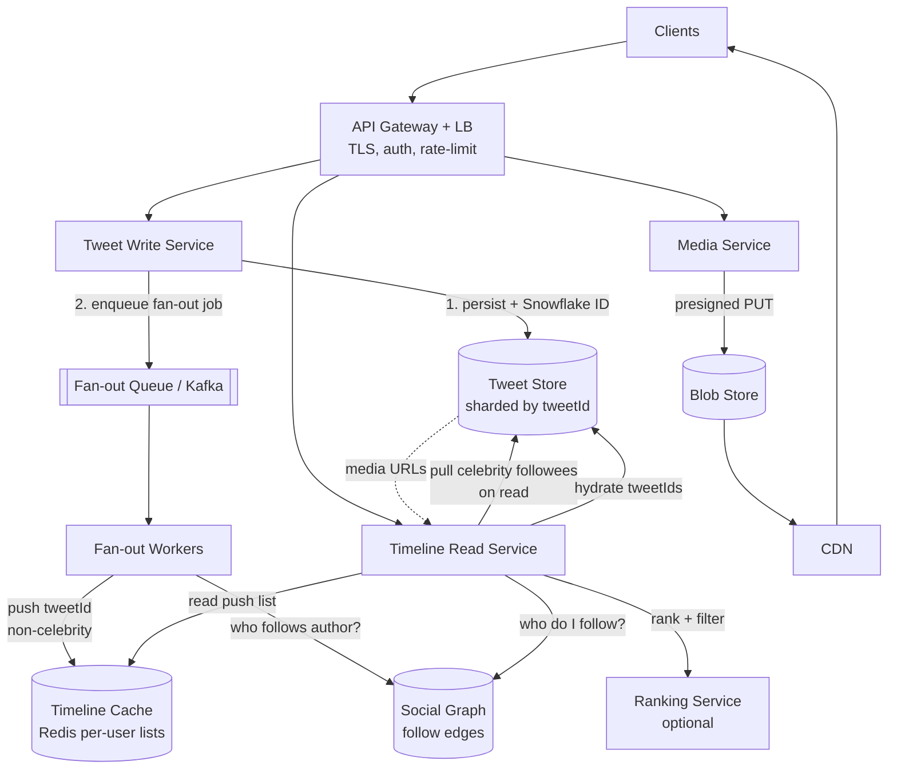
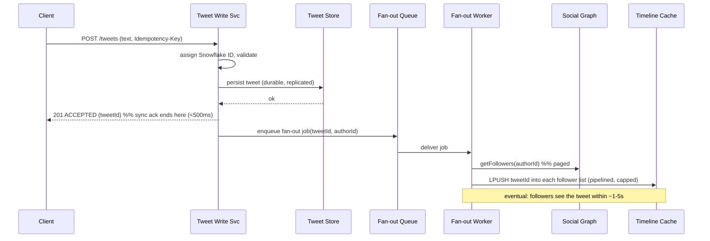
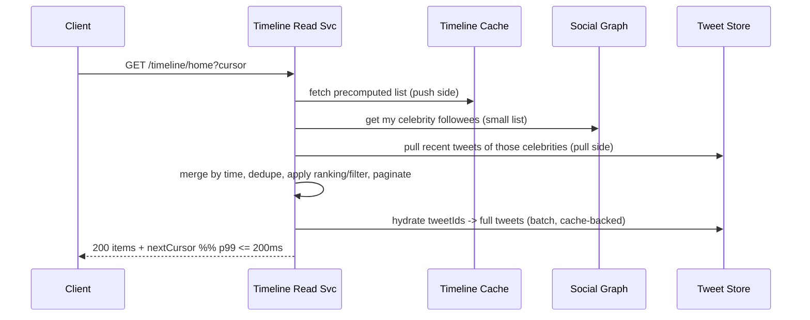

# Design Twitter / News Feed — High-Level Design

> Staff-level system-design reference. Audience: a senior backend engineer (Java/JVM, distributed systems) practising HLD. The goal is to teach *design judgment* — what to clarify, what to estimate, what to trade off, and how to defend each decision against the failure mode it avoids.

---

## 1. Problem & Clarifying Questions

### 1.1 Restating the problem

Design a Twitter-like service. At its core there are two deceptively simple operations:

- **Post a tweet** (write): a user emits a short message (optionally with media) to their followers.
- **View the home timeline** (read): a user opens the app and sees a feed of recent tweets from the accounts they follow, usually newest-first or ranked.

Everything hard about this system lives in the *coupling* between those two operations through the **social graph** (who follows whom) and the **extreme skew** of that graph: a typical user has a few hundred followers; a celebrity has 100M+. A naive design that works for the median user catastrophically fails for the tail, and a design tuned for the tail wastes resources on the median. The art is reconciling the two.

Before drawing a single box, a senior candidate interrogates scope. Twitter is a *huge* product (DMs, search, trends, ads, spaces, lists, notifications). I want to nail down exactly which slice I'm being asked to build.

### 1.2 Functional clarifying questions

1. **Core scope.** Are we building (a) post tweet, (b) home timeline (the feed of people you follow), (c) user timeline (a single user's own tweets)? I'll assume **all three are in-scope**, with home-timeline generation as the centerpiece.
2. **Engagement.** Do we need likes, retweets, replies, quote-tweets? These multiply write volume and complicate ranking. I'll assume **likes + retweets in-scope** (they're integral to fan-out and ranking), **replies/threads as a lighter follow-up**, and **quote-tweets as a retweet variant**.
3. **Ranking vs. chronological.** Is the home timeline strictly reverse-chronological, or ranked ("For You")? This is a fork in the road — ranking adds an ML scoring layer. I'll design a **chronological core** and treat **ranking as a pluggable deep dive**, because real Twitter offers both.
4. **Media.** Do tweets carry images/video/GIFs? I'll assume **yes** (images + short video), handled via a separate blob/CDN path, not inline in the tweet store.
5. **Follows.** Symmetric (friends, like Facebook) or asymmetric (followers, like Twitter)? **Asymmetric** — this is the defining property and the source of the celebrity problem.
6. **Search / hashtags / trends / DMs / notifications?** I'll treat these as **out-of-scope** for the core, mention integration points, and leave them as extensions.
7. **Edit / delete.** Can tweets be edited or deleted? I'll assume **delete = yes** (legal/abuse necessity), **edit = out-of-scope** for v1 (it complicates already-fanned-out copies; flag as follow-up).

### 1.3 Non-functional clarifying questions

1. **Scale.** How many users? Daily-active? Read:write ratio? I'll assume **~500M total users, ~200M DAU, ~2.5B reads/day, ~500M writes/day** (a read-heavy, ~100:1 read:write workload — Twitter is overwhelmingly a *consumption* product).
2. **Latency.** Timeline load p99 target? I'll target **home-timeline read p99 ≤ 200 ms** (it gates app open-to-content), **tweet post p99 ≤ 500 ms** for the synchronous ack (fan-out can be async).
3. **Availability.** What's the SLO? **Reads ≥ 99.99%** (a blank timeline is a visible outage); **writes ≥ 99.9%** (a delayed tweet is tolerable). Reads must degrade gracefully — stale > down.
4. **Consistency.** How fresh must the feed be? I'll assert **eventual consistency is acceptable** — a follower seeing a tweet 1–5s late is fine. We are *not* a bank. This unlocks asynchronous fan-out, which is the entire ballgame.
5. **Durability.** Tweets must not be lost once acked. **Durable, replicated storage** for the source-of-truth tweet store; the materialized timeline is a *cache/derived view* and may be lossy/rebuildable.
6. **Geography.** Single region or global? I'll assume **multi-region, read-local** with a home region per user, async cross-region replication.

### 1.4 Out-of-scope (stated explicitly)

Search, trending topics, DMs, ads/monetization, Spaces/audio, full notification system, account/identity management beyond a userId, and the recommendation system for *who to follow*. I'll note where each plugs in.

### 1.5 Assumptions I'll proceed with

| Parameter | Assumption |
|---|---|
| Total users | 500M |
| Daily active users (DAU) | 200M |
| Tweets written / day | 500M (avg 2.5 tweets/DAU) |
| Home-timeline reads / day | 2.5B (avg 12.5 opens/DAU, several refreshes) |
| Read:write ratio | ~5:1 by request; effectively ~100:1 at the *fan-out* level (see §3) |
| Avg followers / user | ~200 (median far lower; mean dragged up by celebrities) |
| Avg follows (followees) / user | ~200 |
| Tweet text size | ≤ 280 chars (~300 bytes incl. metadata, ~1 KB with full metadata) |
| Media | ~15% of tweets carry media; stored in blob+CDN |
| Consistency | Eventual (seconds) for feed; strong for the tweet write ack |
| Feed model | Reverse-chronological core + optional ranking |

---

## 2. Requirements (Finalized)

### 2.1 Functional

- **F1 — Post tweet:** a user posts text (≤280 chars) + optional media; gets a durable ack with a tweet ID and timestamp.
- **F2 — Home timeline:** a user fetches a paginated feed of recent tweets from accounts they follow, newest-first (or ranked), with cursor-based pagination.
- **F3 — User timeline:** fetch a single user's own tweets (their profile feed).
- **F4 — Follow / unfollow:** mutate the social graph; takes effect on subsequent reads.
- **F5 — Engagement:** like, retweet, reply, quote. Retweets re-fan-out the original into the retweeter's followers' timelines.
- **F6 — Delete tweet:** tombstone the tweet; it disappears from timelines (lazily on read or eagerly on fan-out delete).

### 2.2 Non-functional

| Property | Target | Rationale |
|---|---|---|
| Home-timeline read latency | p99 ≤ 200 ms | Gates time-to-content on app open |
| Post-tweet latency (sync ack) | p99 ≤ 500 ms | Fan-out is async; only durability + ID are synchronous |
| Read availability | ≥ 99.99% | Empty feed = visible outage; degrade to stale, never down |
| Write availability | ≥ 99.9% | Delayed delivery tolerable |
| Feed freshness | seconds (eventual) | Unlocks async fan-out |
| Durability | 11 nines on source tweet store | Acked tweets are never lost |
| Read throughput | ~30K timeline-reads/s avg, design for 5–10× peak | See §3 |

**Terms inline:** *p99* = the latency below which 99% of requests complete; the tail that dominates user-perceived slowness. *SLO* = the internal target; *SLA* the externally promised version. *Eventual consistency* = replicas converge to the same value given no new writes, but readers may briefly see stale data. *Tombstone* = a delete marker left in place of data so that derived views and replicas learn of the deletion.

---

## 3. Capacity Estimation (with arithmetic)

Round numbers, but the *method* matters more than the digits. Always show the work and flag the dominant term.

### 3.1 Write QPS

```
Tweets/day        = 500M
Seconds/day       = 86,400  (~10^5)
Avg write QPS     = 500M / 86,400 ≈ 5,800 writes/s   (~6K/s)
Peak (×3 for diurnal + events) ≈ 17K–20K writes/s
```

5,800 tweets/s is *trivial* to ingest. The write problem is **not ingestion — it's fan-out amplification** (§3.3).

### 3.2 Read QPS

```
Timeline reads/day = 2.5B
Avg read QPS       = 2.5B / 86,400 ≈ 29,000 reads/s   (~30K/s)
Peak (×5)          ≈ 145K reads/s
```

Each timeline read returns ~20–50 tweets. If each read assembled the feed by querying the tweets of all ~200 followees on the fly, that's a different cost model than serving a precomputed list — this is exactly the push/pull decision in §7.

### 3.3 Fan-out amplification (the real number)

This is the metric that decides the architecture. When a user with `F` followers tweets, a push (fan-out-on-write) design performs `F` writes into follower timelines.

```
Avg followers           ≈ 200
Avg fan-out writes/tweet ≈ 200
Total fan-out writes/day = 500M tweets × 200 = 100B writes/day
Fan-out write QPS        = 100B / 86,400 ≈ 1.16M writes/s   (~1.2M/s avg)
Peak (×3)                ≈ 3.5M writes/s
```

So the average-case write amplification turns 6K tweets/s into **~1.2M timeline-insert ops/s**. Now the tail:

```
Celebrity with 100M followers tweets once
→ 100M timeline inserts for ONE tweet.
At 1M inserts/s that's 100 seconds of work — a "fan-out storm."
```

**This is the crux.** Pure push collapses on celebrities; pure pull collapses on the read path (every read scans hundreds of followees). The hybrid (§7) exists precisely to bound this number.

### 3.4 Storage

**Tweet store (source of truth):**
```
Per tweet           ≈ 1 KB (text + metadata: id, authorId, ts, counts, mediaRefs)
Tweets/day          = 500M
Tweets/day storage  = 500M × 1 KB = 500 GB/day
Tweets/year         ≈ 180 TB/year (raw)
With replication ×3 ≈ 540 TB/year
Over 10 years       ≈ 5–6 PB (source tweets, replicated)
```

**Social graph:**
```
Edges (follow relationships) ≈ 500M users × 200 follows = 100B edges
Per edge (followerId,followeeId,ts) ≈ 32 bytes
Graph storage ≈ 100B × 32B = 3.2 TB (×3 replication ≈ 10 TB)
```
Small enough to live in a sharded KV/graph store, even partly in memory.

**Materialized home timelines (the push cache):**
```
Keep last ~800 tweet IDs per active user in cache.
Per entry ≈ 16 bytes (tweetId 8B + authorId/score 8B)
Per user timeline ≈ 800 × 16B ≈ 12.8 KB
For 200M DAU ≈ 200M × 12.8 KB ≈ 2.56 TB
```
~2.5 TB of hot timeline data fits across a Redis cluster (a few hundred GB per node × ~10–20 nodes, with replicas). Crucially, **we only materialize timelines for active users** — materializing for 500M including dormant accounts would triple this for no benefit.

### 3.5 Bandwidth

```
Read egress (text):
 30K reads/s × 30 tweets × 1 KB ≈ 900 MB/s ≈ 7.2 Gbps (text alone, pre-CDN)

Media egress dominates:
 ~15% of timeline tweets carry media; a single image ≈ 200 KB, video ≈ several MB.
 Media is served from CDN, NOT from the app tier — so app-tier bandwidth stays in the single-digit Gbps,
 while CDN absorbs tens-to-hundreds of Gbps of media. This split is a deliberate design choice (§7.7).
```

### 3.6 Server / shard count (sanity check)

- **Timeline read service:** at ~145K peak reads/s, if one app node handles ~5K rps, that's ~30 nodes + headroom → ~50–80 nodes across regions.
- **Fan-out workers:** 3.5M peak inserts/s; if a worker does ~20K inserts/s (pipelined Redis), that's ~175 workers → ~250 with headroom.
- **Timeline cache (Redis):** 2.5 TB hot / ~128 GB usable per node ≈ 20 nodes + replicas ≈ 40 nodes.
- **Tweet store (e.g., sharded Cassandra/Manhattan):** sized by IOPS and PB-scale storage; ~100s of nodes over years; shard by tweetId.
- **Graph store:** ~10 TB; ~20–40 shards.

**Takeaway:** ingestion is cheap; the cost centers are (1) fan-out write amplification, (2) the timeline cache, and (3) media/CDN. Optimize there.

---

## 4. API Design

REST-ish for clarity; in practice these are internal RPCs (gRPC/Thrift) behind a gateway. All authenticated via a bearer token resolved to `userId`. Pagination is **cursor-based** (opaque cursor encoding `(timestamp, tweetId)`), never offset-based — offsets break under inserts and are O(n) on large feeds.

### 4.1 Post a tweet

```
POST /v1/tweets
Headers: Authorization: Bearer <token>
         Idempotency-Key: <client-generated-uuid>   # dedupe retries
Body:
{
  "text": "hello world",
  "mediaIds": ["m_abc", "m_def"],     # pre-uploaded media handles
  "replyToTweetId": null,
  "quoteTweetId": null
}
Response 201:
{
  "tweetId": "1789...e7",              # 64-bit Snowflake-style ID (time-sortable)
  "authorId": "u_123",
  "createdAt": "2026-06-25T10:00:00Z",
  "status": "ACCEPTED"                 # fan-out is async; this acks durability only
}
```

*Why an Idempotency-Key:* the client may retry on a flaky network; without dedupe you'd post duplicate tweets. The write path stores the key→tweetId mapping briefly and returns the same tweetId on replay.

### 4.2 Get home timeline

```
GET /v1/timeline/home?cursor=<opaque>&limit=30&ranked=false
Response 200:
{
  "items": [
    {
      "tweetId": "...", "authorId": "u_999", "text": "...",
      "createdAt": "...", "media": [{"url": "https://cdn/...","type":"image"}],
      "likeCount": 42, "retweetCount": 3, "viewerHasLiked": true,
      "retweetedBy": "u_555"            # present if this is a retweet in your feed
    }
  ],
  "nextCursor": "eyJ0cyI6..."           # null when fully paginated
}
```

### 4.3 Get user timeline

```
GET /v1/timeline/user/{userId}?cursor=<opaque>&limit=30
# Served largely by pull from the tweet store partitioned by authorId.
```

### 4.4 Social graph

```
POST   /v1/follow      { "followeeId": "u_888" }     -> 204
DELETE /v1/follow      { "followeeId": "u_888" }     -> 204
GET    /v1/followers/{userId}?cursor=...&limit=100
GET    /v1/following/{userId}?cursor=...&limit=100
```

### 4.5 Engagement

```
POST   /v1/tweets/{id}/like        -> 204  (idempotent)
DELETE /v1/tweets/{id}/like        -> 204
POST   /v1/tweets/{id}/retweet     -> 201  (creates a retweet tweet; re-fans-out)
DELETE /v1/tweets/{id}             -> 204  (tombstone; lazy removal from timelines)
```

### 4.6 Media upload (separate path)

```
POST /v1/media:initUpload  { "type":"image","sizeBytes":204800 }
   -> { "mediaId":"m_abc","uploadUrl":"https://blob/presigned..." }
# Client PUTs bytes directly to the presigned blob URL (bypasses app tier).
# On tweet post, the tweet references mediaId; media is processed/transcoded async.
```

---

## 5. High-Level Architecture

### 5.1 Component responsibilities

- **API Gateway / LB:** TLS termination, auth, rate limiting, routing. *Term: LB = load balancer; spreads traffic across stateless nodes.*
- **Tweet Write Service:** validates, assigns a **Snowflake ID** (time-sortable 64-bit: timestamp + machine + sequence — so IDs are roughly chronological and globally unique without a central counter), persists to the tweet store, then enqueues a fan-out job.
- **Tweet Store:** durable source of truth, sharded by tweetId, with a secondary access path by authorId (for user timelines).
- **Social Graph Service:** stores follow edges; answers "who follows X" (for fan-out) and "who does X follow" (for pull).
- **Fan-out Service (async workers):** consumes fan-out jobs from a queue; for non-celebrity authors, pushes the tweetId into each follower's materialized timeline in the cache.
- **Timeline Cache:** Redis cluster holding per-user lists of recent tweetIds (the push side).
- **Timeline Read Service:** assembles the home timeline = merge(materialized push list, on-the-fly pull of celebrity followees), hydrates tweetIds → full tweet objects, applies ranking/filtering, paginates.
- **Media Service + Blob Store + CDN:** ingest, transcode, store, and serve media; URLs in tweets point at the CDN.
- **Async backbone:** Kafka (or similar) for fan-out jobs and event streams (likes, follows) feeding counters and ranking.

### 5.2 ASCII block diagram

```
                                   ┌──────────────┐
                Clients ──────────▶│ API Gateway  │  (TLS, auth, rate-limit)
                                   │      + LB    │
                                   └──────┬───────┘
                        ┌─────────────────┼───────────────────────┐
                        ▼                 ▼                        ▼
                ┌───────────────┐  ┌────────────────┐     ┌────────────────┐
        WRITE   │ Tweet Write   │  │ Timeline Read  │ READ │ Media Service  │
        path    │ Service       │  │ Service        │      │ (init upload)  │
                └──────┬────────┘  └───────┬────────┘     └──────┬─────────┘
                       │ 1.persist          │ assemble+hydrate    │ presigned
                       ▼                    ▼                     ▼
                ┌──────────────┐    ┌──────────────────┐   ┌──────────────┐
                │ Tweet Store  │◀───┤ hydrate tweetIds │   │  Blob Store  │
                │ (sharded by  │    │   (read)         │   │ (S3-like)    │
                │  tweetId)    │    └───────┬──────────┘   └──────┬───────┘
                └──────┬───────┘            │                     │ transcode
                       │ 2.enqueue          │ merge push+pull     ▼
                       ▼                     │                ┌─────────┐
                ┌──────────────┐             │                │   CDN   │──▶ clients
                │  Fan-out     │             │                └─────────┘
                │  Queue(Kafka)│             │
                └──────┬───────┘             │
                       ▼                     ▼
                ┌──────────────┐     ┌──────────────────┐
                │ Fan-out      │────▶│ Timeline Cache   │◀── push lists
                │ Workers      │push │ (Redis: per-user │
                └──────┬───────┘     │  recent tweetIds)│
                       │ who-follows └──────────────────┘
                       ▼                     ▲
                ┌──────────────┐             │ pull celebrity tweets on read
                │ Social Graph │─────────────┘
                │ Service      │
                └──────────────┘
```

### 5.3 Mermaid diagram



### 5.4 Key flows (sequence)

**Post-tweet (non-celebrity), async fan-out:**



**Read home timeline (hybrid merge):**



---

## 6. Data Model & Storage Choices

### 6.1 Entities

**Tweet (source of truth)**
```
tweetId      : int64   (Snowflake — time-sortable, globally unique)
authorId     : int64
text         : string  (<=280 chars)
mediaIds     : list<string>
replyTo      : int64?   quoteOf : int64?
createdAt    : timestamp
likeCount    : int64    retweetCount : int64    replyCount : int64   (denormalized counters)
deleted      : bool / tombstone
```

**Follow edge (social graph)**
```
(followerId, followeeId, createdAt)
Two access patterns => two physical layouts:
  - followers-of(X):  partition by followeeId  (used by fan-out)
  - following-of(X):  partition by followerId  (used by pull / profile)
Store both (denormalized adjacency lists).
```

**Materialized home timeline (derived cache)**
```
key: "tl:home:{userId}"  ->  capped sorted list of (tweetId, score|ts), newest first, length ~800
```

**User timeline (derived/queried)**
```
served by querying Tweet Store partitioned by authorId, time-ordered.
```

### 6.2 Datastore choices — justified against access patterns

| Data | Store | Why this store (and the failure mode avoided) |
|---|---|---|
| **Tweet source of truth** | Wide-column NoSQL (Cassandra / Bigtable / Twitter's Manhattan) sharded by tweetId | Access is write-once, read-by-id, massive volume, append-only. Need linear write scalability + tunable consistency + multi-DC replication. A single SQL primary would become the write bottleneck and a single point of failure. NoSQL avoids the **write-master saturation** failure mode at PB scale. |
| **User-timeline access (by authorId)** | Same wide-column store, secondary table keyed `(authorId, tweetId desc)` | Co-locates a user's tweets for cheap range scans. Avoids scatter-gather across all shards to build a profile feed. |
| **Social graph** | Sharded KV / purpose-built graph store (e.g., FlockDB-style adjacency lists) | "Who follows X" and "who X follows" are bulk adjacency reads. Storing both directions denormalized avoids the **read-amplification on fan-out** failure mode (otherwise you'd scan the whole edge table). |
| **Materialized home timeline** | In-memory Redis cluster, capped lists | The read path needs sub-ms list reads at 145K rps. A disk store can't serve that latency; Redis avoids the **read-latency-blowup** failure mode. Data is *derived*, so loss is recoverable (rebuild from tweet store + graph). |
| **Counters (likes/retweets)** | Sharded/approximate counters (Redis + periodic flush, or a counter store) | Hot tweets get millions of likes; a single row update would hot-spot. Sharded counters avoid the **single-row write contention** failure mode. Eventual count is fine for display. |
| **Media blobs** | Object store (S3-like) + CDN | Large binaries don't belong in the tweet DB; serving them from the app tier would saturate bandwidth. CDN avoids the **origin-bandwidth saturation** failure mode and cuts latency via edge caching. |
| **Idempotency keys, sessions, rate-limit counters** | Redis with TTL | Ephemeral, high-throughput, expiry-friendly. |

**Why NOT a single relational DB for everything:** at 100B graph edges, 5+ PB of tweets, 145K read QPS, and 1.2M fan-out writes/s, a relational primary becomes a write bottleneck and the join `tweets ⋈ follows` per read is a scatter-gather across the whole dataset. We *deliberately denormalize* and pre-materialize to trade storage + write amplification for read latency — the right trade for a 100:1 read-heavy product.

---

## 7. Deep Dives (the bulk)

The five genuinely hard sub-problems: (7.1) push vs pull vs hybrid timeline generation; (7.2) the celebrity / hot-key problem; (7.3) feed ranking; (7.4) caching, hydration & eventual consistency; (7.5) media; plus (7.6) scaling the social graph and (7.7) cross-region.

---

### 7.1 Timeline generation: fan-out-on-write vs fan-out-on-read vs hybrid

This is *the* decision the whole system pivots on.

**Definitions (inline):**
- **Fan-out-on-write (push):** when a user tweets, immediately write the tweetId into the materialized home timeline of *every follower*. Reads become cheap (read one precomputed list). Writes become expensive and amplified by follower count.
- **Fan-out-on-read (pull):** store the tweet once. At read time, gather the followees of the reader, query each one's recent tweets, merge-sort, and return. Writes are cheap (one insert). Reads become expensive and amplified by followee count.

**Tradeoff table:**

| Dimension | Fan-out-on-write (push) | Fan-out-on-read (pull) | Hybrid (chosen) |
|---|---|---|---|
| Write cost | O(followers) — huge for celebrities | O(1) | O(followers) but **only for non-celebrities** |
| Read cost | O(1) — read one list | O(followees) merge — slow, ~200 queries | O(1 + #celebrity-followees) — bounded |
| Read latency p99 | Excellent | Poor / spiky | Excellent |
| Storage | High (materialized per follower) | Low | Moderate |
| Celebrity tweet | Catastrophic (100M writes) | Cheap | **Pulled at read, not pushed** |
| Inactive users | Wasted writes | No waste | Skip materializing dormant users |
| Freshness | Immediate once fanned | Always current | Immediate (push) + current (pull) |
| Failure mode if used alone | Fan-out storm on celebrity tweet | Read scatter-gather meltdown at peak | — |

**Decision: Hybrid (push for the body, pull for the head of the distribution).**

- **Push path:** for authors with follower count *below a threshold* (say `T = 100K` followers), fan out on write into followers' materialized timelines. This covers the vast majority of accounts and keeps reads O(1).
- **Pull path:** for **celebrity / high-fan-out authors** (above `T`), do **not** push. Instead, at *read time*, the reader's timeline service fetches the recent tweets of the small set of celebrities the reader follows and merges them into the push list.
- **Why this is correct:** a reader follows at most a handful of celebrities (you don't follow 10,000 celebs). So the pull side is bounded and small, while the push side stays O(1). We've turned the unbounded fan-out (`F` up to 100M) into a bounded read merge (a few extra queries). This **avoids the fan-out-storm failure mode** without paying the **read-scatter-gather meltdown** of pure pull.

**Threshold tuning is itself a tradeoff:** lower `T` → more accounts treated as celebrities → cheaper writes but more pull work per read. Higher `T` → more push amplification. `T` is set empirically by balancing fan-out queue depth against read-merge cost; it can even be **per-user adaptive** (treat an account as "push" until its follower count crosses `T`, then flip to "pull" and stop materializing).

**Don't materialize for dormant users:** if a follower hasn't opened the app in N days, skip the push and rebuild their timeline lazily on next login (read from tweet store + graph). This slashes the 1.2M/s fan-out by the fraction of inactive followers — often a large fraction.

---

### 7.2 The celebrity / hot-key problem

Even with the hybrid, celebrities create two distinct hot spots:

**(a) Write hot spot (avoided by pull):** as above — we simply don't push celebrity tweets. Solved by the hybrid split.

**(b) Read hot spot (a new problem the pull side creates):** if 50M people follow @celebrity and they all pull @celebrity's latest tweet at read time, that single tweet's row / cache key becomes a **hot key** receiving millions of reads/s — a classic *thundering herd* on one partition.

**Options to tame the read hot key:**

| Option | Mechanism | Tradeoff / failure mode avoided |
|---|---|---|
| **Replicate the hot tweet across cache nodes** | Store celebrity recent-tweets in *multiple* replicas / a dedicated celebrity cache; clients/read-svc hit any replica | Spreads read load; costs extra memory. Avoids **single-node hot-key meltdown**. |
| **Local (in-process) cache on read nodes** | Each Timeline Read node caches celebrity tweets for a few seconds | Eliminates most cross-network reads for the hottest keys; risk of brief staleness (acceptable). Avoids **network amplification to the cache tier**. |
| **Request coalescing / single-flight** | Concurrent misses for the same key collapse into one backend fetch | Prevents N simultaneous loads from stampeding the store. Avoids **thundering herd on cache miss**. |
| **Push to followers' *cursors* but mark "needs merge"** | Keep pull but pre-warm | More complex; rarely worth it. |

**Decision:** keep celebrity tweets in a **dedicated, replicated celebrity cache** plus a **short-TTL local cache** on read nodes, with **single-flight** on misses. The hottest keys are read from process memory; the rest from the replicated celebrity cache; the store is hit rarely. This stacks defenses against the **hot-key meltdown** and the **thundering herd**.

**Likes/retweets counters are also hot keys.** A tweet going viral gets millions of like writes. A single counter row would serialize those updates and hot-spot one partition. **Decision:** *sharded counters* — split the counter into K sub-counters across partitions; increment a random shard; sum (or read an approximate cached total) on read. Display counts are eventually consistent, which users accept. This avoids the **single-row write-contention** failure mode.

---

### 7.3 Feed ranking (chronological → "For You")

The chronological core is a time-sorted merge. Ranking replaces "sort by time" with "sort by predicted engagement," turning the feed into a recommendation problem.

**Pipeline (candidate generation → scoring → filtering → ordering):**

1. **Candidate sourcing:** the merged push+pull set is the *in-network* candidate pool. Optionally add **out-of-network** candidates (tweets from accounts you don't follow that a model predicts you'll engage with) — this is what makes "For You" feel different from "Following."
2. **Feature hydration:** per (viewer, tweet) features — author affinity (how often you engage with this author), recency, tweet engagement velocity (likes/min), media presence, viewer's historical preferences, social proof (a friend liked it).
3. **Scoring:** a lightweight ranking model (logistic regression → GBDT → a neural ranker) predicts `P(engage)` (like/reply/retweet/dwell). Score = weighted combination of those probabilities.
4. **Filtering / business rules:** dedupe, remove muted/blocked authors, demote already-seen tweets, diversity rules (don't show 5 tweets from one author), safety/abuse filters, NSFW gating.
5. **Ordering & pagination:** sort by score within a freshness window; serve top-N with a cursor.

**Where ranking runs — tradeoff:**

| Approach | When scoring happens | Tradeoff |
|---|---|---|
| **Score at read time** | On each timeline fetch | Freshest features, but adds latency + compute per read at 145K rps; needs a fast model + feature cache |
| **Precompute scores at fan-out** | When pushing into timelines | Cheap reads, but scores go stale and can't use read-time context (time of day, recent activity) |
| **Two-stage: light precompute + read-time re-rank top-K** | Hybrid | Best balance — cheaply narrow candidates, then re-rank only the visible window at read time |

**Decision:** **two-stage ranking.** Precompute/maintain a candidate set cheaply (the materialized timeline + recent celebrity pulls), then **re-rank only the top window** (e.g., a few hundred candidates) at read time with a fast model and cached features. This keeps p99 within budget (re-ranking a few hundred items is bounded) while preserving read-time freshness — avoiding both the **read-latency blowup** of scoring everything and the **stale-score** failure of pure precompute. Ranking must be **gracefully degradable**: if the ranking service is slow/down, fall back to chronological. A blank or hung feed is far worse than a slightly-worse-ordered one.

---

### 7.4 Caching the timeline, hydration & eventual consistency

**Two-level structure:**
1. **Timeline cache (IDs only):** `tl:home:{userId}` → capped list of recent `(tweetId, score)`. We store **IDs, not full tweets** — so a tweet appearing in 1M timelines costs ~16 bytes each, not 1 KB each, and editing/deleting a tweet doesn't require rewriting a million copies of the body.
2. **Tweet object cache (hydration):** read service batches the tweetIds and hydrates them via a tweet cache (Redis/Memcached) backed by the tweet store. One tweet body is cached once and shared across all timelines referencing it. *This indirection is the key insight that makes push affordable.*

**Cache sizing & eviction:** keep ~800 IDs/user for active users; evict by LRU on inactivity. On a cold miss (timeline not materialized), **rebuild lazily**: pull followees' recent tweets from the store, merge, populate the cache. So the cache is a *recoverable derived view* — its loss is a latency event, not a data-loss event.

**Eventual consistency of the feed — what's actually guaranteed:**
- **Tweet durability is strong:** the write is acked only after the tweet store replicates it. You never lose an acked tweet.
- **Feed visibility is eventual:** fan-out is async; a follower may see a new tweet 1–5s after posting. This is *by design* and is the entire reason the system scales.
- **Ordering anomalies:** because push and pull are merged and clocks/queues vary, a reader might momentarily see tweet B before A even if A was posted first. Snowflake IDs (time-sortable) bound this — we sort by ID/timestamp at merge time, so the *displayed* order is consistent even if arrival order isn't.
- **Read-your-own-writes:** a user must see their *own* tweet immediately after posting (or the app feels broken). **Decision:** the write service synchronously inserts the author's own tweet into the author's own timeline cache (and the client optimistically renders it), independent of the async follower fan-out. This patches the one consistency hole users actually notice.
- **Deletes:** tombstone in the tweet store. Timelines hold IDs; on hydration a tombstoned tweet is skipped/filtered. We **don't** eagerly scrub a million timelines — lazy removal on read is cheaper and the staleness window is tiny. (For legal/abuse takedowns requiring hard removal, run an async scrubbing job.)

**Failure modes avoided:** storing IDs (not bodies) avoids the **edit/delete fan-out re-write storm** and slashes cache memory; lazy rebuild avoids treating the cache as a **single point of data loss**; synchronous self-insert avoids the **read-your-own-writes** glitch.

---

### 7.5 Handling media

Tweets reference media; they never embed bytes. The flow:

1. **Pre-upload:** client calls `media:initUpload`, gets a `mediaId` + **presigned URL**, and PUTs bytes **directly to the blob store** — bypassing the app tier entirely (so a 5 MB video never traverses our request servers).
2. **Async processing:** an event triggers transcoding (multiple resolutions/bitrates for adaptive streaming), thumbnail generation, format normalization, and **content safety scanning** (NSFW/CSAM detection) before the media is publicly servable.
3. **Reference, then post:** the tweet stores `mediaIds`; on read, the tweet hydration resolves them to **CDN URLs**.
4. **Serving:** all media is served from **CDN edge caches**, which absorb the tens-to-hundreds of Gbps of media egress and cut latency. The blob store is the origin, hit only on CDN miss.

**Tradeoffs:** direct-to-blob upload avoids **app-tier bandwidth saturation**; async transcode avoids **blocking the post path** on heavy CPU work (post stays <500 ms); CDN avoids **origin saturation** and reduces global latency. The cost is added pipeline complexity and a window where media is "processing." For video at scale, adaptive bitrate streaming (HLS/DASH) is the norm.

---

### 7.6 Scaling the social graph

- **Sharding:** partition follow edges by user. Store **both** adjacency directions (followers-by-followeeId for fan-out; following-by-followerId for pull/profile). Denormalization avoids per-fan-out full-table scans.
- **Hot reads:** "who follows @celebrity" returns up to 100M IDs — never materialize that in one call. Fan-out workers **page** through followers (and for celebrities we don't fan out at all, sidestepping the problem). Cache hot follower-count metadata.
- **Consistency on follow/unfollow:** these mutate the graph; effects apply on subsequent reads (pull) and subsequent tweets (push). A newly-followed account's *old* tweets aren't back-filled into your push list — they appear via pull or on lazy rebuild. Acceptable.

---

### 7.7 Cross-region / global

- **Home region per user:** route a user to their nearest/home region; serve reads locally for latency.
- **Async cross-region replication:** the tweet store and graph replicate asynchronously across regions; fan-out happens in each region for that region's followers (or replicates the materialized timelines).
- **Tradeoff:** async replication means a tweet posted in one region may take longer to appear for followers in another — consistent with our eventual-consistency stance, and far cheaper than synchronous global consensus, which would blow the latency budget.

---

## 8. Scaling & Bottlenecks

**How it scales:**
- **Stateless services** (gateway, write, read, fan-out workers) scale horizontally behind LBs — add nodes.
- **Tweet store & graph** scale by sharding (by tweetId / by userId).
- **Timeline cache** scales by sharding Redis by userId + adding replicas for read fan-out.
- **Fan-out** scales by adding queue partitions + worker consumers; backpressure via the queue absorbs bursts.

**Where it breaks first, and the fix:**

| Bottleneck | Symptom | Fix |
|---|---|---|
| **Celebrity fan-out storm** | Queue backs up, followers see huge delay on celeb tweet | Hybrid: pull celebrity tweets at read; never push them (§7.1–7.2) |
| **Hot key on celebrity reads / viral counters** | One cache/store partition saturates | Replicated celebrity cache + local cache + single-flight; sharded counters (§7.2) |
| **Timeline cache memory** | Eviction churn, miss rate climbs | Only materialize active users; cap list length; lazy rebuild for dormant (§3.4, §7.1) |
| **Hydration fan-out** | Read latency rises as each read hydrates 30 IDs | Batch + tweet-object cache so popular tweets are hydrated once and shared (§7.4) |
| **Fan-out write amplification (1.2M/s)** | Redis write pressure | Pipeline inserts; cap list; skip dormant; shard cache (§3.3) |
| **Ranking latency** | Read p99 breaches budget | Two-stage: re-rank only top window; degrade to chronological (§7.3) |
| **Media bandwidth** | App-tier or origin egress saturates | Direct-to-blob upload + CDN (§7.5) |
| **Hot shard (e.g., monotonic IDs)** | One shard takes all writes | Shard tweets by tweetId hash, not by time prefix, to spread writes |

---

## 9. Reliability, Consistency & Security

**Reliability / failure handling:**
- **Async fan-out via durable queue** decouples write ack from fan-out; worker crashes → jobs retried (at-least-once). Fan-out inserts are **idempotent** (inserting the same tweetId into a list twice is dedupable), so retries are safe.
- **Graceful degradation:** if the timeline cache is cold/unavailable, rebuild from the tweet store (slower but correct). If ranking is down, serve chronological. If media/CDN is down, serve text-only. **Reads degrade, never go blank.**
- **Replication:** tweet store and graph replicated ×3 across AZs/regions; quorum or async per consistency need.
- **Backpressure & rate limiting** protect the fan-out and write paths from overload (a celebrity tweet-storm or a bot flood).

**Consistency model (restated crisply):**
- *Strong* on the **tweet write ack** (durable + replicated before 201).
- *Read-your-own-writes* for the author (synchronous self-insert).
- *Eventual* (seconds) for **follower feed visibility** and for **counters**.
- *Ordering* stabilized by time-sortable Snowflake IDs at merge time.

**Idempotency:**
- **Posts:** `Idempotency-Key` dedupes client retries → at most one tweet.
- **Likes/follows:** modeled as idempotent set operations (liking twice = liked once).
- **Fan-out jobs:** idempotent inserts tolerate at-least-once delivery.

**Security & abuse:**
- **AuthN/Z:** bearer tokens at the gateway resolved to userId; per-endpoint authorization (you can only delete your own tweet).
- **Rate limiting:** per-user and per-IP token buckets at the gateway (e.g., posts/min, follows/min) to throttle spam and scraping.
- **Abuse / spam / bot detection:** async classifiers on the write stream; shadow-ban or quarantine; CAPTCHA on suspicious follow bursts.
- **Content safety:** NSFW/CSAM scanning in the media pipeline before serving; text moderation hooks.
- **Privacy:** protected accounts (tweets only visible to approved followers) → enforce visibility checks at read/hydration; private tweets must not leak into public pull paths.
- **Transport & data:** TLS everywhere; encryption at rest for stores; audit logs for takedowns.

---

## 10. Extensions & Follow-ups

| Extension | How the design changes |
|---|---|
| **"For You" out-of-network recs** | Add a candidate-generation service (embedding retrieval / co-engagement) feeding the ranker; ranking deep-dive §7.3 already accommodates extra candidates. |
| **Edit tweet** | Since timelines store IDs (not bodies), an edit only mutates the tweet store + invalidates the object cache — no million-timeline rewrite. Maintain edit history + an "edited" flag; cap edit window. |
| **Threads / conversations** | Add `replyTo` chains; conversation assembly is a separate read path (fetch by root tweetId). Reply notifications fan out to participants. |
| **DMs** | Separate messaging system (different consistency: ordered per-conversation, often stronger). Not the feed path. |
| **Search & hashtags** | Index tweets into a search cluster (inverted index, e.g., Elasticsearch) off the write stream; trends = streaming aggregation (count-min sketch over hashtags). |
| **Notifications** | Consume the engagement/follow event streams; fan out notifications similarly (push/pull by recipient activity). |
| **Real-time live updates** | WebSocket/long-poll gateway pushes new tweetIds to open clients; the materialized timeline already has the data, just notify-and-merge. |
| **Bookmarks / lists / mute / block** | Read-time filters layered into the ranking/filter stage. |
| **Multi-region active-active** | Conflict-free replication for counters (CRDTs), per-user home region, async tweet/graph replication. |
| **Stricter freshness** | Tighten fan-out SLA, add more workers/queue partitions; the eventual-consistency model is the cost lever. |

---

## 11. Interview Q&A

**Q1. Push or pull for the timeline — and why not just one?**
Hybrid. Push (fan-out-on-write) gives O(1) reads but explodes on celebrities (one tweet → up to 100M writes — a fan-out storm). Pull (fan-out-on-read) gives O(1) writes but O(followees) reads, melting the read path at peak. Hybrid pushes for normal accounts and *pulls celebrity tweets at read time*; since a reader follows only a few celebrities, the pull side is bounded. We get cheap reads and bounded writes. *Deep probes:* (a) How do you pick the celebrity threshold? — empirically balance fan-out queue depth vs. read-merge cost; make it adaptive per account. (b) What if a normal user *becomes* a celebrity? — flip them to pull when followers cross T and stop materializing. (c) Dormant followers? — don't materialize; rebuild lazily on login.

**Q2. Walk the post-tweet path. What's synchronous vs async?**
Synchronous: assign Snowflake ID, persist durably to the replicated tweet store, ack 201 (≤500 ms), and synchronously self-insert into the author's own timeline (read-your-own-writes). Async: enqueue a fan-out job; workers read followers from the graph and push the tweetId into followers' cached timelines (non-celebrities only). Followers see it within ~1–5 s — eventual by design.

**Q3. (Senior signal) Why store tweetIds in timelines instead of full tweets?**
Three wins: (1) memory — 16 B vs ~1 KB per timeline entry, so a tweet in 1M timelines costs 16 MB not 1 GB; (2) single source of truth — edits/deletes touch one tweet, not a million copies; (3) shared hydration cache — a popular tweet is cached once and reused across all timelines. The cost is a hydration step on read, which we batch and cache. *Probe:* what's the read-time price? A batched multi-get against the tweet-object cache — bounded by page size (~30), cache-hit-heavy.

**Q4. How do you keep timeline reads under p99 200 ms?**
Read one precomputed ID list from Redis (sub-ms), pull a bounded set of celebrity tweets, merge, batch-hydrate from a tweet-object cache, re-rank only the visible window, paginate. Everything is bounded and cache-served; the store is rarely hit on the hot path. Degrade to chronological if ranking is slow.

**Q5. (Senior signal) What consistency do you actually guarantee, and where do you cheat?**
Strong durability on the tweet write ack; read-your-own-writes for the author; *eventual* (seconds) for follower visibility and counters; order stabilized by time-sortable IDs at merge. We "cheat" on follower freshness and counter accuracy because the product tolerates it and it's what makes async fan-out — hence the whole scale story — possible. *Probe:* anomaly example? A momentary out-of-order arrival, fixed by sorting on Snowflake ID at merge time.

**Q6. A tweet goes viral — 10M likes in an hour. What breaks and how do you fix it?**
A single counter row hot-spots (write contention) and the tweet becomes a read hot key. Fix counters with sharded counters (increment a random sub-counter, sum/cache on read — eventually consistent). Fix read hot key with a replicated celebrity cache + short-TTL local cache on read nodes + single-flight on misses. *Probe:* exact counts? No — display counts are approximate and cached; users don't notice ±.

**Q7. How does the celebrity read path not become its own hot-key disaster?**
By layering caches: the hottest celebrity tweets live in read-node process memory (seconds TTL), then a dedicated replicated celebrity cache, then the store. Concurrent misses coalesce via single-flight, so the store sees one fetch, not a stampede. This trades a little staleness for surviving the thundering herd.

**Q8. (Senior signal) Why NoSQL/wide-column for tweets instead of a relational DB?**
The workload is append-heavy, read-by-id, PB-scale, with 100B graph edges and 1.2M fan-out writes/s. A relational primary becomes a write bottleneck and a SPOF, and the per-read join (tweets ⋈ follows) is a scatter-gather across the whole dataset. We denormalize and pre-materialize to trade storage + write amplification for read latency — correct for a 100:1 read-heavy product. *Probe:* what do you give up? Ad-hoc joins and strong cross-entity transactions — neither is on the hot path here.

**Q9. How do deletes and edits work without rewriting a million timelines?**
Timelines store IDs. Delete = tombstone in the tweet store; hydration filters tombstoned IDs lazily (async hard-scrub only for legal takedowns). Edit = mutate the single tweet body + invalidate the object cache; IDs in timelines are untouched. The ID-indirection makes both cheap.

**Q10. How do you handle media without saturating your servers?**
Clients upload directly to the blob store via presigned URLs (bytes never touch the app tier). Transcoding/safety-scanning is async. Tweets reference mediaIds; reads resolve them to CDN URLs; all media serves from CDN edge, absorbing the heavy egress and cutting latency. The post path stays fast because it never blocks on media processing.

---

## 12. Cheat-sheet & Self-test

### 12.1 Dense recap

**Key numbers:** 500M users / 200M DAU. Writes ~6K/s (peak ~20K). Reads ~30K/s (peak ~145K). **Fan-out amplification: ~1.2M timeline-inserts/s** (peak ~3.5M) — *the* number. Avg 200 followers; celebrity up to 100M. Tweet ~1 KB; ~500 GB/day → multi-PB over years. Graph ~100B edges (~10 TB ×3). Hot timeline cache ~2.5 TB. Targets: read p99 ≤200 ms, post p99 ≤500 ms, reads 99.99%, feed freshness seconds.

**Key decisions:** Hybrid fan-out (push for normals, pull for celebrities) — bounds the unbounded. Store **tweetIds, not bodies**, in timelines + a shared object cache for hydration. Two-stage ranking (cheap candidates, re-rank visible window, degrade to chronological). Sharded counters + replicated/local celebrity cache + single-flight for hot keys. Snowflake IDs for time-sortable ordering. Direct-to-blob + CDN for media. Synchronous self-insert for read-your-own-writes; everything else eventual.

**Diagram-in-words:** Client → Gateway → {Write Svc → Tweet Store + Fan-out Queue → Workers → (graph) → Timeline Cache} and {Read Svc → merge(Timeline Cache push, celebrity pull from Tweet Store) → hydrate via object cache → rank → paginate}. Media: client → presigned blob → transcode → CDN → client.

**Failure modes each decision avoids:** hybrid → fan-out storm; IDs-not-bodies → edit/delete rewrite storm + memory blowup; sharded counters → single-row write contention; celebrity cache + single-flight → hot-key meltdown + thundering herd; CDN → origin/app-tier bandwidth saturation; degrade-to-chronological → blank/hung feed; self-insert → read-your-own-writes glitch.

### 12.2 Self-test (no answers)

1. Recompute the average fan-out write QPS if avg followers were 1,000 instead of 200, and decide whether your celebrity threshold T should change.
2. A user follows 50 celebrities (unusual). Does the hybrid still bound their read cost? What would you adjust?
3. Design the exact merge-and-dedupe algorithm for combining the push list with celebrity pull results, including how you handle a tweet that appears in both.
4. The timeline cache cluster loses a shard (no replica). Walk through the read path's behavior and the rebuild procedure; quantify the latency impact.
5. Propose a concrete scheme to support tweet *edit* with an audit history while keeping timelines as ID-lists, and state which caches you must invalidate and when.
