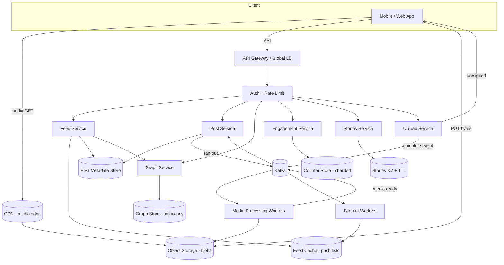
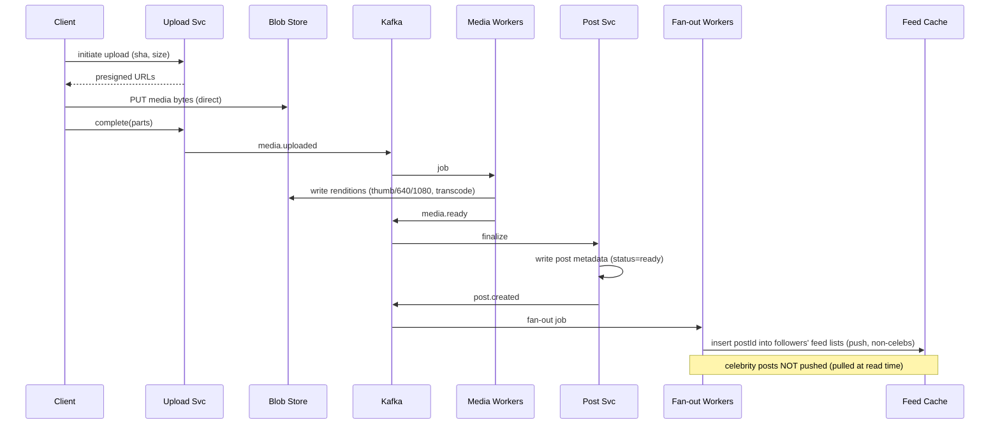

# Design Instagram — High-Level Design (Staff/Principal Level)

> A complete, interview-ready HLD for a photo/video-sharing social network. Written as a reference + practice artifact for a senior backend engineer practising system design. The goal is not just the boxes-and-arrows but the **design judgment**: what to clarify, what to estimate, where the hard problems are, and how to defend each decision against the failure mode it avoids.

---

## 1. Problem & Clarifying Questions

**Restated problem.** Build a service like Instagram: users follow other users, post photos and short videos, view a personalized **feed** of posts from people they follow, view **stories** (ephemeral media that expires after 24h), and interact (like, comment, view counts). The system is overwhelmingly **read-heavy**, media-centric, and must serve a global audience with low latency.

A senior candidate never jumps to architecture. The first 3–5 minutes are spent extracting the real requirements. Below are the questions I would ask the interviewer, grouped, with the answer I will assume if the interviewer says "you decide."

### 1.1 Functional scope
- **Which surfaces are in scope?** I'll assume the core: post media (photo + short video), follow/unfollow, home feed (following-based), per-user profile grid, stories (24h TTL), likes, comments, and like/comment/view counts. 
- **Is there an algorithmic "Explore"/recommendations feed?** I'll assume a **reverse-chronological + lightly ranked** following-feed is in scope; a full ML recommendation engine (Explore, Reels discovery) is **out of scope** but I'll note where it plugs in.
- **Direct messaging?** **Out of scope** (it's a separate chat/HLD problem — presence, delivery receipts, E2E).
- **Live video / long-form video?** Out of scope. We handle short clips (≤ 60s, Reels-like) but not live streaming.
- **Editing/filters client- or server-side?** Assume filters are applied **client-side**; the server receives already-filtered media. Server still transcodes/thumbnails.

### 1.2 Non-functional
- **Latency targets?** Assume **feed load p99 < 200 ms** for cached metadata; media delivery dominated by CDN edge (tens of ms). Upload acknowledgement should be fast (< 500 ms to accept), with processing async.
- **Availability?** Reads must be **highly available (≥ 99.99%)** — feed and media viewing are the core product. Writes (posting) can tolerate brief degradation; we prefer **availability over strict consistency** for counts and feed freshness.
- **Consistency model?** **Eventual consistency** is acceptable for feed delivery, like counts, and follower counts. **Read-your-own-writes** is required: after I post, I must see my own post immediately on my profile and feed. Privacy changes (going private, blocking) should propagate quickly (seconds), but a few seconds of staleness is tolerable.
- **Durability?** Media and post metadata must be **highly durable** (no data loss; ~11 nines via object storage). Stories media can be deleted after TTL.
- **Global?** Assume multi-region, global user base; CDN-fronted media is mandatory.

### 1.3 Scale
- **DAU / MAU?** I'll assume **500M DAU**, ~2B MAU (Instagram-scale, slightly conservative).
- **Posts per day?** Assume **~100M new posts/day** (photos + videos).
- **Read/write ratio?** Assume **~100:1** read:write — feed views, profile views, story views vastly outnumber posts.
- **Average followers / following?** Assume median ~200 following; but **celebrities have 100M+ followers** — the heavy tail drives the fan-out design.

### 1.4 Out of scope (explicit)
DMs, live streaming, ads/monetization internals, shopping, full ML ranking/Explore, content moderation ML (we'll note the hook), and account recovery/auth provider internals.

> **Why lead with this:** the single biggest design fork in Instagram is the **feed fan-out model**, and that decision is entirely driven by the follower distribution (heavy tail) and the read:write ratio. If I don't pin those numbers down first, every later decision is unjustified.

---

## 2. Requirements (Finalized)

### 2.1 Functional requirements
1. **Post media:** upload a photo or short video with caption; it appears on the author's profile and is delivered to followers' feeds.
2. **Social graph:** follow/unfollow; private accounts require follow approval; block.
3. **Home feed:** personalized list of recent posts from accounts the user follows, paginated, near-real-time.
4. **Profile grid:** all posts by a given user, reverse-chronological.
5. **Stories:** post ephemeral media; followers see it in a stories tray; **auto-expires after 24h**; track who viewed.
6. **Engagement:** like/unlike, comment, and see **counts** (likes, comments, views) that are approximately accurate and converge.

### 2.2 Non-functional requirements
| Property | Target | Notes |
|---|---|---|
| Feed read latency | p99 < 200 ms (metadata) | Media served by CDN, ~10–50 ms edge |
| Upload accept | < 500 ms | Processing (transcode/thumbnail) async |
| Availability (reads) | ≥ 99.99% | Core product; degrade gracefully |
| Availability (writes) | ≥ 99.9% | Can queue/retry |
| Durability (media+metadata) | ~11 nines | Object storage replication |
| Consistency | Eventual + read-your-writes | Counts converge; privacy propagates in seconds |
| Scale | 500M DAU, 100M posts/day, 100:1 R:W | Heavy-tail follower graph |

### 2.3 Key assumptions
- Median following ≈ 200; max followers ≈ 100M+ (celebrities) → **hybrid fan-out** is mandatory.
- Average photo ≈ 1.5 MB after server-side recompression; we store multiple renditions (thumbnails + several resolutions). Video clip ≈ 5 MB average after transcode (several renditions).
- A "feed view" reads ~10–20 posts (metadata) per page; media loaded lazily.

---

## 3. Capacity Estimation

> Show the arithmetic. Round aggressively; the goal is order-of-magnitude and identifying the dominant resource.

### 3.1 Write QPS (posts)
- 100M posts/day ÷ 86,400 s ≈ **~1,160 posts/sec average**.
- Peak ≈ 3× average ≈ **~3,500 posts/sec**. Modest — writes are not the bottleneck.

### 3.2 Read QPS (feed + media metadata)
- 100:1 read:write on posts → **~116,000 reads/sec average**, peak ~350K/sec. But "reads" is fuzzy; let's derive from feed views.
- 500M DAU; assume each opens the app ~20 times/day and each open loads ~1 feed page (~15 posts metadata). That's 500M × 20 = **10B feed-page reads/day** ≈ **~116,000 feed-page reads/sec average**, peak ~350K/sec. Each page touches ~15 post-metadata records → **~1.7M post-metadata lookups/sec average** at peak ~5M/sec. → **Metadata cache is the workhorse.**

### 3.3 Media bandwidth
- Per feed page ~15 media items; assume 5 actually loaded (lazy) at ~200 KB rendered (feed-resolution, not full): 5 × 200 KB = 1 MB/page.
- 10B pages/day × 1 MB ≈ **~10 PB/day egress**, average ≈ 10 PB ÷ 86,400 ≈ **~115 GB/s ≈ ~920 Gbps average**, peak ~3 Tbps. → **CDN is non-negotiable; origin would melt.** Cache hit ratio at the CDN must be high (>95%) or origin egress is catastrophic.

### 3.4 Storage growth
- 100M posts/day. Per post we store original + renditions. Photo: original ~3 MB + (thumbnail 20 KB + 320px + 640px + 1080px ≈ ~1 MB) ≈ ~4 MB. Video posts are a minority but heavier; blend to **~5 MB/post average across renditions**.
- 100M × 5 MB = **~500 TB/day** of new media → **~180 PB/year**. Object storage (S3-like), tiered to cold storage for old media.
- **Metadata** per post ≈ ~1 KB (ids, author, caption, media pointers, counts, timestamps). 100M × 1 KB = **~100 GB/day** → ~36 TB/year. Trivial vs media; lives in a sharded metadata store + cache.

### 3.5 Feed precompute (fan-out) cost
- If we **fan-out-on-write** (push) for everyone: each post writes into every follower's feed list. Average ~200 followers but the mean is dragged up by celebrities. Suppose average effective fan-out ≈ 500 writes/post (mix). 1,160 posts/sec × 500 = **~580K feed-insert writes/sec** average, and a single celebrity post = 100M inserts. The celebrity case is a **write amplification bomb** → motivates hybrid (don't push celebrity posts).

### 3.6 Memory (feed cache)
- Cache each active user's feed (list of ~500 recent post ids + minimal metadata). 500M DAU × 500 ids × ~16 B ≈ 500M × 8 KB = **~4 TB** for feed lists. Distributed across a Redis-like cluster → ~40 nodes at 100 GB usable each (with replication, ~80–100 nodes). Feasible.
- Post-metadata hot cache: top ~1B recently-active posts × 1 KB = **~1 TB**, sharded across the same cache tier.

### 3.7 Server count (rough)
- Stateless API/feed-service handling ~350K peak QPS at, say, 2K QPS/instance → **~175 instances** + headroom → ~300. Plus media-upload, transcode workers (CPU-heavy), and the cache/DB tiers. The dominant cost is **transcode CPU + CDN egress + media storage**, not the API tier.

**Takeaways that shape the design:** (1) reads dominate → cache + CDN everything; (2) media egress is the giant cost → high CDN hit ratio + rendition strategy; (3) celebrity fan-out is a write bomb → hybrid push/pull feed; (4) metadata is small → sharded NoSQL + aggressive caching.

---

## 4. API Design

REST/HTTP for clients (mobile-friendly), gRPC internally between services. All write endpoints take an **idempotency key**. All list endpoints use **cursor pagination** (opaque cursor, not offset — offsets break under inserts).

### 4.1 Media upload (two-phase)
```
POST /v1/uploads:initiate
  body: { mediaType: "photo"|"video", contentLength, sha256, idempotencyKey }
  resp: { uploadId, uploadUrls: [presignedPUT...], partSize }   // direct-to-blob

PUT  <presigned blob URL>            // client uploads bytes directly to object store

POST /v1/uploads/{uploadId}:complete
  body: { parts:[{partNumber, etag}], idempotencyKey }
  resp: { mediaId, status: "processing" }
```

### 4.2 Create post
```
POST /v1/posts
  body: { mediaIds:[...], caption, location?, idempotencyKey }
  resp: { postId, authorId, createdAt, status: "processing"|"ready" }
```

### 4.3 Feed
```
GET /v1/feed?cursor=<opaque>&limit=20
  resp: { items:[ { postId, authorId, mediaUrls:{thumb,640,1080}, caption,
                    likeCount, commentCount, likedByMe, createdAt } ],
          nextCursor }
```

### 4.4 Profile / posts by user
```
GET /v1/users/{userId}/posts?cursor=&limit=24
```

### 4.5 Social graph
```
POST   /v1/users/{userId}/follow      // resp: {state:"following"|"requested"}
DELETE /v1/users/{userId}/follow
GET    /v1/users/{userId}/followers?cursor=
GET    /v1/users/{userId}/following?cursor=
```

### 4.6 Engagement
```
POST   /v1/posts/{postId}/likes       body:{idempotencyKey}   // idempotent
DELETE /v1/posts/{postId}/likes
POST   /v1/posts/{postId}/comments    body:{text, idempotencyKey}
GET    /v1/posts/{postId}/comments?cursor=
```

### 4.7 Stories
```
POST /v1/stories                       body:{mediaId, idempotencyKey}  // TTL 24h
GET  /v1/stories/tray                   // ranked list of followees with active stories
POST /v1/stories/{storyId}/views        // record a view (fire-and-forget, batched)
```

> **Term inline:** *Presigned URL* = a time-limited, signed object-store URL that lets the client upload/download bytes directly to blob storage without proxying through our servers — saves enormous bandwidth on our app tier. *Cursor pagination* = pagination keyed on a stable sort value (e.g., `(createdAt, postId)`) so newly inserted rows don't cause page drift or duplicates the way numeric offsets do.

---

## 5. High-Level Architecture

### 5.1 Request flow (narrative)
- **Clients** hit a **global edge / API gateway** (TLS termination, auth, rate limiting, routing). Static media never touches the app tier — it's served by the **CDN** from object storage.
- **Upload path:** client → gateway → Upload Service issues presigned URLs → client uploads **directly to blob store** → completion event lands on a **queue** → **Media Processing workers** transcode/thumbnail and write renditions back to blob → publish "media ready" → Post Service finalizes the post and triggers **feed fan-out**.
- **Read path (feed):** client → gateway → Feed Service → reads precomputed feed list from **feed cache** (push portion) + pulls recent posts from **celebrities the user follows** (pull portion) → merges → hydrates post metadata from **metadata cache/DB** → returns media **CDN URLs**.

### 5.2 ASCII block diagram
```
                         +-------------------+
        Mobile/Web  ----> |   CDN (media)     |  <---- Object Storage (blobs)
            |             +-------------------+              ^
            |  (api calls)                                   | renditions
            v                                                |
   +-------------------+      +------------------+    +---------------------+
   |  API Gateway /    | ---> |  Auth / Rate     |    |  Media Processing   |
   |  Global LB        |      |  Limit           |    |  Workers (transcode |
   +-------------------+      +------------------+    |  + thumbnails)      |
            |                                          +----------+--------+
   +--------+--------+--------------+-------------+                ^
   |        |        |              |             |                | (jobs)
   v        v        v              v             v          +-----+------+
+------+ +------+ +--------+   +-----------+  +---------+     |  Queue /   |
|Feed  | |Post  | |Graph   |   |Engagement |  |Stories  |    |  Kafka     |
|Svc   | |Svc   | |Svc     |   |Svc(counts)|  |Svc(TTL) |    +-----+------+
+--+---+ +--+---+ +---+----+   +-----+-----+  +----+----+          ^
   |        |         |              |             |               | upload
   v        v         v              v             v               | complete
+------+ +------+ +--------+   +-----------+  +---------+     +-----+------+
|Feed  | |Post  | |Graph DB|   |Counter    |  |Stories  |    | Upload Svc |
|Cache | |Meta  | |/ KV    |   |Store      |  |KV+TTL   |    | (presign)  |
|(push)| |Store | |(adj.   |   |(sharded)  |  |         |    +------------+
+------+ +------+ | lists) |   +-----------+  +---------+
                  +--------+
   (all backed by sharded NoSQL + Redis-style caches; async events on Kafka)
```

### 5.3 Mermaid diagram


### 5.4 Key sequence — post creation + fan-out


---

## 6. Data Model & Storage Choices

### 6.1 Entities
- **User**(userId, handle, displayName, isPrivate, avatarMediaId, createdAt, followerCount, followingCount).
- **Post**(postId, authorId, caption, mediaIds[], createdAt, likeCount, commentCount, status, location?).
- **Media**(mediaId, type, renditions{thumb,640,1080,...}, durationMs?, status).
- **Follow** edge: (followerId → followeeId, state, createdAt).
- **Like**(postId, userId, createdAt) and **Comment**(commentId, postId, authorId, text, createdAt).
- **Story**(storyId, authorId, mediaId, createdAt, expiresAt) + **StoryView**(storyId, viewerId, ts).
- **FeedEntry** (per user): ordered list of postIds (in cache, optionally persisted).

### 6.2 ID generation
Use **time-sortable 64/128-bit IDs** (Snowflake-style: timestamp + machine + sequence). Benefit: postId is roughly k-sortable by creation time → cursor pagination and "recent first" merges become trivial, and we avoid a central sequence bottleneck. *Term:* Snowflake ID = a distributed unique-ID scheme embedding a timestamp so IDs sort by creation time without coordination.

### 6.3 Datastore choices and why

| Data | Store | Why (access pattern) | Failure mode avoided |
|---|---|---|---|
| Media blobs + renditions | **Object storage** (S3-like) behind CDN | Immutable, huge, served by URL; ~11-nines durability; cheap tiering | Origin overload, data loss |
| Post metadata | **Wide-column / KV NoSQL** (Cassandra/DynamoDB-style), sharded by postId | Point lookups by postId + range by authorId; write-once mostly; needs horizontal scale at 100M/day | Single-DB hotspot; vertical-scale wall |
| Social graph | **Sharded KV adjacency lists** (followers list, following list) or graph DB | Read "who do I follow" (small), "who follows X" (can be 100M) — store as sharded lists; partition follower-of-celeb across shards | Single huge row / hot partition for celebs |
| Feed lists | **In-memory cache** (Redis-style), sorted set of postIds per user | Hot, ephemeral, rebuildable from source of truth | DB read storm on every feed open |
| Counters (likes/views) | **Sharded distributed counters** + cache | Extremely high write rate, approximate-ok, must converge | Hot-row write contention on a single counter |
| Stories | **KV with native TTL** + blob for media | Short-lived, auto-expire, view tracking | Manual GC complexity; unbounded growth |
| Likes/Comments detail | NoSQL partitioned by postId, clustered by time | Range scan "comments of post, newest first" | Cross-partition scans |

**Why NoSQL over a single relational DB for the hot paths:** at 100M posts/day and millions of metadata lookups/sec we need **horizontal partitioning + tunable consistency + linear write scaling**, which a single primary RDBMS can't give. We accept losing cross-entity ACID transactions and joins — those aren't on the hot path (the feed is denormalized). A relational store is fine for low-volume, consistency-sensitive data (e.g., the authoritative follow/privacy state, billing) — many real designs keep a sharded SQL (Vitess-style) there.

---

## 7. Deep Dives (the hard parts)

This is the bulk. Five sub-problems: (7.1) the feed / fan-out, (7.2) media upload + processing + CDN, (7.3) the social graph at celebrity scale, (7.4) distributed counters for likes/views, (7.5) stories / ephemeral TTL. Each has options, a tradeoff table, and a defended decision naming the failure mode avoided.

---

### 7.1 The Feed — Fan-out Tradeoffs (the central problem)

**Problem.** When user A opens the app, return a recent, personalized list of posts from everyone A follows, fast (p99 < 200 ms), at 350K feed-page reads/sec. Two canonical strategies, plus the hybrid.

- **Fan-out on write (push):** when someone posts, immediately insert the postId into the precomputed feed list of every follower (in cache/DB). Read is then trivial: just read your list. 
- **Fan-out on read (pull):** store posts only by author; at read time, gather the recent posts of everyone you follow, merge-sort by time, return top N. Write is trivial; read is expensive.
- **Hybrid:** push for normal accounts; **pull** for high-fan-out accounts (celebrities); merge the two at read time.

| Dimension | Push (fan-out write) | Pull (fan-out read) | **Hybrid (chosen)** |
|---|---|---|---|
| Write cost | High (× followers); **celebrity = bomb** | O(1) | Bounded: skip push for celebs |
| Read cost | O(1) — read your list | High (gather N authors, merge) | Read list + pull few celebs + merge |
| Read latency | Best | Worst (fan-in at read) | Near-push for most |
| Freshness | Slight delay (fan-out lag) | Real-time | Real-time-ish |
| Storage | High (duplicate ids per follower) | Low | Moderate |
| Inactive followers | Wasteful (push to dormant users) | No waste | Mitigated (push to active only) |

**Decision: Hybrid push/pull.**
- **Push** a post into followers' feed cache lists **iff** the author's follower count is below a threshold (e.g., < ~10K–100K) **and** primarily to **active** followers (those who opened the app recently). The feed list is a Redis sorted set keyed by user, scored by postId (time-sortable). 
- **Pull** for celebrity authors: at read time, fetch the user's celebrity-followees' recent posts (a small set per user — you follow few celebrities), merge with the pushed list, sort by time, paginate.
- **Merge:** the Feed Service reads the pushed sorted-set page, fetches recent posts from each followed celebrity (cached per-celebrity timeline), k-way merges by postId timestamp, applies light ranking/dedup, hydrates metadata, returns CDN URLs.

**Why hybrid — failure modes avoided.** Pure push avoids slow reads but **detonates on a celebrity post** (100M synchronous inserts) and wastes storage pushing to dormant users. Pure pull avoids that but makes the **hottest path (feed read at 350K QPS) the most expensive operation**, blowing the latency budget for users who follow thousands of people. Hybrid bounds **both** the write amplification (no celeb push) and the read fan-in (only a handful of celebs pulled per user).

**Important sub-decisions:**
- **Active-user gating:** maintain a "recently active" set; fan-out workers only push to active followers, and we **rebuild** a user's feed lazily on app open if they were dormant. Avoids 4 TB+ of wasted feed lists for users who never log in.
- **Bounded list length:** cap each feed list at ~500–1000 ids (trim on insert). The cache is a *materialized view*, not the source of truth — it's rebuildable from posts + graph. Avoids unbounded memory.
- **Fan-out is async** (Kafka → fan-out workers). The post is acknowledged to the author immediately; fan-out catches up in seconds. Author's **read-your-own-writes** is guaranteed by injecting their own post into their feed synchronously (or reading their profile timeline directly).
- **Ranking hook:** start reverse-chronological; the merge step is where a ranking service later scores candidates. Keep it pluggable.

**Capacity check:** push write rate ≈ 580K inserts/sec (§3.5) excluding celebs — comfortably handled by a sharded cache cluster with pipelined writes. Celebrity pulls per read are bounded (you follow O(10) celebs), each served from a per-celeb timeline cache — cheap.

---

### 7.2 Media Upload, Processing Pipeline, Blob Storage + CDN

**Problem.** Accept 3,500 uploads/sec at peak, store ~500 TB/day durably, transcode video and generate multiple photo/video renditions, and serve ~3 Tbps of media at the edge with low latency.

**Upload (direct-to-blob, two-phase).** Client calls Upload Service → gets **presigned multipart URLs** → uploads bytes **directly to object storage** (never through our app tier — saves ~Tbps of ingress proxying) → calls complete. *Multipart upload* = splitting a large file into parts uploaded in parallel and reassembled by the store; gives resumability and throughput. Idempotency key + content sha256 dedup repeated uploads.

**Processing pipeline (async, event-driven):**
1. Completion publishes `media.uploaded` to Kafka.
2. **Media workers** (autoscaled, CPU/GPU-heavy) pull jobs:
   - **Validation & moderation hook:** verify type/size, run a fast safety classifier (hook for content moderation; out of scope to detail).
   - **Photos:** generate renditions — `thumb` (~150px), `320`, `640`, `1080`, plus a tiny **blurhash/placeholder** for instant UI. Strip EXIF/PII; recompress (e.g., to modern codec like WebP/AVIF).
   - **Videos:** transcode to an adaptive ladder (e.g., 240p/480p/720p) and package for **adaptive bitrate streaming (HLS/DASH)** — *ABR* = client picks a quality tier matching its bandwidth, switching segment-by-segment. Generate poster thumbnail. Transcode is the dominant CPU cost.
   - Write renditions back to blob, publish `media.ready`.
3. Post Service marks the post `ready`; only then is it eligible for fan-out. Until ready, author sees a "processing" placeholder.

**Why async + queue.** Transcoding a video can take seconds–minutes; doing it inline would blow the 500 ms upload-accept budget and couple upload availability to transcode capacity. Queue **decouples** ingest from processing, absorbs spikes, and lets us **retry** failed/poison jobs and **autoscale workers** independently. Failure mode avoided: upload outages when transcode capacity is saturated.

**Blob storage layout.** Content-addressed or postId-prefixed keys; **immutable** objects (renditions never mutated → trivially cacheable). Lifecycle policy tiers media: hot (recent) on standard storage, old/cold media to cheaper tiers. Cross-region replication for durability and locality.

**CDN strategy (the cost center).** 
- Serve all renditions via CDN with long TTLs (immutable URLs → cache forever; new versions get new keys). Target **>95% edge hit ratio** — at 3 Tbps, a 90% vs 97% hit ratio is the difference between manageable and ruinous origin egress.
- **URL signing** for private accounts (signed, expiring URLs); public posts use cacheable public URLs.
- **Pre-warm/push** popular content (celebrity posts) to edges proactively; **tiered caching** (edge → regional shield → origin) collapses origin requests.
- Pick rendition by client (device DPI, viewport, network) — feed uses `640`, full-screen uses `1080`, grid uses `thumb`. Reduces egress dramatically.

| Concern | Option A | Option B | **Decision** |
|---|---|---|---|
| Upload path | Proxy through app tier | **Direct-to-blob presigned** | B — saves Tbps ingress, resumable |
| Processing | Inline/synchronous | **Async queue + workers** | Async — decouple, retry, autoscale |
| Video delivery | Single MP4 | **ABR (HLS/DASH ladder)** | ABR — adapts to bandwidth, less stall |
| Origin protection | Single CDN tier | **Tiered + pre-warm** | Tiered — collapse origin egress |

---

### 7.3 The Social Graph at Celebrity Scale

**Problem.** Store follower/following relationships supporting: (a) "who do I follow" (small, read on every feed pull), (b) "who follows X" (can be 100M for a celebrity — used for fan-out and follower lists), (c) follow/unfollow writes, (d) private-account approval and blocking, (e) accurate-ish follower **counts**.

**Storage model.** Store two **adjacency lists** per relationship direction:
- `following:{userId}` → set of followeeIds (bounded-ish, ~thousands).
- `followers:{userId}` → set of followerIds (can be 100M → **must be sharded across many partitions**, never a single row).

**Sharding.** Partition by the userId being keyed. The `followers:{celebrity}` set is itself sharded into sub-partitions (e.g., `followers:{celebrity}:{shard0..N}`) so no single partition holds 100M entries — avoids the **hot/huge partition** failure mode. Fan-out workers iterate these sub-partitions in parallel.

**Reads.**
- Feed pull needs "my followees" — small, cache it per user.
- Follower **lists** (UI) are paginated via cursor over the sharded set.
- Follower **counts** are maintained as a **separate counter** (see 7.4), not by counting the set (counting 100M rows per profile view is absurd).

**Writes.** Follow = add edge to both lists + increment counters (async) + (if pushable author later posts) feed implications. Unfollow = remove + decrement. Use idempotency: re-following is a no-op. **Private accounts:** follow creates a `requested` edge; approval flips it to `following`. **Block:** removes edges and prevents future follows/views; block state must propagate to feed filtering quickly.

**Consistency.** The follow edge's **authoritative state** wants stronger consistency (you shouldn't see a private account's posts after they reject you). Keep authoritative edges in a store with strong-enough consistency (e.g., quorum reads/writes or a sharded SQL), while **counts and feed effects are eventual**. Failure mode avoided: privacy leaks from stale edge reads.

| Concern | Option | **Decision / rationale** |
|---|---|---|
| Celeb follower set | Single row | **Sharded sub-partitions** — avoid 100M-row hot partition |
| Follower count | COUNT the set | **Dedicated counter** — avoid O(followers) on every read |
| Edge consistency | Eventual | **Quorum/strong for authoritative edge** — privacy correctness |
| Graph engine | Native graph DB | **Sharded KV adjacency lists** — graph DB hard to scale to 100M edges/node; we don't need multi-hop traversal |

---

### 7.4 Distributed Counters — Likes / Comments / Views

**Problem.** A viral post can receive **millions of likes in minutes** and tens of millions of views. A naive `UPDATE posts SET like_count = like_count + 1 WHERE id = ?` serializes all writes on one row → **hot-row contention** → the row becomes a global lock and writes pile up. Yet every feed render reads these counts at millions of QPS, and they must **converge** to a correct (or near-correct) value.

**Approaches.**

| Approach | How | Pros | Cons |
|---|---|---|---|
| Single-row increment | One row, atomic incr | Exact, simple | **Hot-row contention**; collapses under viral load |
| Sharded counters | Split a counter into N sub-counters across shards; increment a random shard; sum on read | No single hot row; scales writes | Read must sum N shards; eventual |
| Approximate / probabilistic | HyperLogLog for unique views, etc. | Tiny memory, huge cardinality | Approximate only |
| Async aggregation (stream) | Emit like events to Kafka; stream processor aggregates; periodically write rollup | Smooths spikes, exact-ish, replayable | Read sees slightly stale rollup |

**Decision: sharded counters + async stream aggregation, with cached read value.**
- **Likes/comments (need to be ~exact and converge):** each like emits an idempotent event (dedup by `(postId,userId)` for likes so double-tap doesn't double-count). Increment a **sharded counter** (random of N shards per post) for instant feedback, AND emit to a stream that a processor aggregates into an authoritative rollup. The displayed count = cached sum of shards / rollup. On read, serve from cache; refresh asynchronously. Failure mode avoided: hot-row write collapse under virality, while still converging to a correct value.
- **Views (massive, approximate-OK):** batch on client, fire-and-forget, aggregate via stream; **unique views via HyperLogLog** (*HLL* = a probabilistic structure estimating distinct-count in tiny memory with ~1–2% error). We don't need exact view counts.
- **Idempotency for likes:** the like is a *set membership* (`like(postId,userId)` exists or not), not a raw increment. Store membership; the count is derived. So retries/double-taps are naturally idempotent and the count can't drift from network retries — only the membership set is authoritative; the counter is a cached projection that can be **recomputed** from it if it drifts.

**Read-your-own-write on likes:** after I tap like, the client optimistically shows liked + count+1; the server confirms; the membership store gives me `likedByMe=true` immediately even before the global count rollup catches up.

---

### 7.5 Stories — Ephemeral Media with TTL

**Problem.** Stories are media that **auto-expire after 24h**, shown in a "tray" of followees with active stories, with **view tracking** ("seen by"). High write volume (people post many stories), high read (everyone checks the tray), and everything must vanish at TTL without expensive manual cleanup.

**Design.**
- **Story metadata** in a **KV store with native TTL** (e.g., set `expiresAt = now+24h`; store auto-evicts). Failure mode avoided: building a custom garbage collector and risking unbounded growth of dead stories.
- **Story media** in blob with a **lifecycle rule** deleting objects after ~24–48h (small grace for in-flight views). CDN TTL ≤ story TTL so expired media isn't served from edge.
- **Tray assembly:** for the viewing user, gather followees who have **active** (non-expired) stories. This is a **pull** at read time over the (small) following set, hitting a per-user "active stories" index. We do **not** fan-out-on-write stories to all followers' trays the way the feed does for non-celebs heavily, because stories are short-lived and the tray is recomputed cheaply on open — though we can maintain a per-viewer "has-active-stories" hint set updated on post. Ranking (close friends, recency) applied in tray order.
- **View tracking:** `StoryView(storyId, viewerId, ts)`. Views are high-volume and **batched fire-and-forget**; we store the **set of viewers** per story (for the author's "seen by" list) and a **unique view count** (HLL or set size, since a story typically has bounded viewers). Because the story expires in 24h, the viewer set is naturally bounded and cleaned up with the story.
- **Read-your-own:** the author sees their own story immediately; followers see it within seconds.

| Concern | Option | **Decision** |
|---|---|---|
| Expiry | Cron/GC job | **Native TTL + blob lifecycle** — no custom GC |
| Tray | Push to all trays | **Pull on open + active-story hint** — cheap, ephemeral |
| View tracking | Per-view row writes synchronously | **Batched async + bounded viewer set** — absorb volume |

---

## 8. Scaling & Bottlenecks

**How it scales.** Every tier is **horizontally partitioned and stateless where possible**:
- API/Feed/Post/Graph/Engagement services are **stateless** → scale by adding instances behind the LB.
- Metadata, graph, counters: **sharded by key** (postId / userId) → add shards to grow.
- Feed cache, metadata cache: **sharded Redis-style cluster** with replicas.
- Media: object storage scales effectively infinitely; CDN scales at the edge.
- Fan-out & media processing: **autoscaled worker pools** off Kafka; backlog absorbs spikes.

**Where it breaks first, and the fix:**

| Bottleneck | Symptom | Fix |
|---|---|---|
| CDN origin egress | Hit ratio drops → origin saturates → media slow | Tiered caching, pre-warm celeb content, immutable URLs, per-device rendition |
| Celebrity fan-out | Push storm on a celeb post | **Don't push celebs — pull at read** (7.1); shard follower set |
| Hot like-counter | Write contention on viral post | **Sharded counter + stream aggregation** (7.4) |
| Feed cache hot keys | Mega-celebrity timeline read-hot | Replicate hot keys / local in-process cache / per-celeb timeline cache |
| Metadata read storm | DB overload on feed hydration | Aggressive metadata cache; cache-aside with TTL + negative caching |
| Transcode backlog | Media "processing" forever during spikes | Autoscale workers, priority queues, shed/queue gracefully |
| Thundering herd on cache miss | Many requests recompute same key | Request coalescing / single-flight; stale-while-revalidate |
| Cross-region latency | Slow for far users | Geo-routing, regional caches, replicate metadata read-replicas |

**Multi-region.** Pin a user to a home region for writes; **async replicate** metadata and graph to other regions for local reads. Media is global via CDN. Accept eventual cross-region consistency (feed may be seconds stale across regions — acceptable per §2).

---

## 9. Reliability, Consistency & Security

### 9.1 Reliability / failure handling
- **Async everything risky:** fan-out, media processing, view counting all go through Kafka → retries, dead-letter queues for poison messages, replay for recovery.
- **Feed cache is rebuildable:** if a feed-cache shard dies, rebuild from posts + graph (source of truth). The cache is a materialized view, never the only copy — avoids data loss on cache failure.
- **Graceful degradation:** if ranking is down, serve reverse-chron. If counts are stale, show last-known. If a celebrity pull times out, serve the pushed portion and backfill. **Reads stay up even when writes degrade.**
- **Idempotency:** all writes carry idempotency keys; likes are set-membership (naturally idempotent); post creation dedups on key → safe client retries without duplicate posts.
- **Backpressure:** queues + rate limits absorb spikes; workers autoscale; circuit breakers between services.

### 9.2 Consistency model
- **Eventual** for feed delivery, counts, follower lists — converges in seconds.
- **Read-your-own-writes** guaranteed: author's own post injected into their view synchronously; `likedByMe` from membership store.
- **Stronger** for authoritative follow/privacy/block edges (quorum or sharded-SQL) so privacy is correct — a rejected/blocked user must not see content. This is the one place we **trade availability for consistency** deliberately, and we justify it by the cost of a privacy leak.

### 9.3 Security & abuse
- **AuthN/AuthZ:** OAuth2/OIDC tokens at the gateway; per-request authorization (can this user view this private post? is the requester blocked?).
- **Private media:** signed, expiring CDN URLs; authorization checked before issuing.
- **Rate limiting & abuse:** per-user/IP rate limits at the gateway (token bucket); spam/bot detection on follow and like floods; **moderation hook** in the media pipeline (CSAM/NSFW classifiers, hashing against known-bad).
- **Data hygiene:** strip EXIF/GPS from photos on processing (PII leak prevention).
- **Idempotency keys** also defend against duplicate-charge-style replay abuse on writes.
- **Audit & deletion:** account/post deletion must purge metadata, renditions, feed entries (tombstone + lazy cleanup), and honor regional data-deletion regulations.

---

## 10. Extensions & Follow-ups

Realistic variations an interviewer adds, and how each changes the design:

1. **Algorithmic ranked feed / Explore (Reels).** Add a **candidate-generation + ranking** layer in the feed merge step: pull candidates (followed + recommended), score with an ML model (features: affinity, recency, engagement). Needs a feature store and low-latency model serving. The hybrid fan-out already provides the candidate set; ranking slots in at merge.
2. **Live video / streaming.** Different system: ingest → real-time transcode → ABR segments → CDN; chat overlay; presence. Out of our blob+async pipeline (that's for VOD).
3. **Hashtags / search.** Add an **inverted index / search cluster** (Elasticsearch-style) populated async from post events; trending via stream aggregation.
4. **Notifications.** A notification service consuming engagement/follow events from Kafka → push/APNs/FCM; itself a fan-out problem (mute the celebrity-like storms).
5. **Close Friends / audience controls on stories.** Add audience scoping to the story's tray-assembly filter; authorization at read.
6. **Edit/delete consistency.** Deletes must propagate to feed caches (tombstones), CDN (invalidate or rely on new keys), counters, and search index — all async with lazy cleanup.
7. **Stronger global consistency.** If a region requires it, introduce a consensus-replicated store for that subset, accepting higher write latency.
8. **Analytics / insights.** Stream all events to a data lake / warehouse for creator analytics — already have the event backbone (Kafka).

---

## 11. Interview Q&A

**Q1. Push vs pull for the feed — what did you choose and why?**
Hybrid. Push for normal accounts (read O(1)), pull for celebrities (avoid the 100M-insert write bomb). I push only to active followers and cap list length; the feed cache is a rebuildable materialized view. This bounds both write amplification and read fan-in. *(senior-signal: tradeoff + failure mode named)*

**Q1 follow-ups:** *Where's the threshold?* Tune by follower count/cost (~10K–100K), measured, not fixed. *What about a user who follows only celebrities?* Their feed is mostly pull, but they follow few accounts total per page — still bounded; cache per-celeb timelines. *How do you guarantee read-your-own-writes despite async fan-out?* Inject the author's own post synchronously / read their profile timeline directly.

**Q2. A celebrity posts — walk me through what happens.**
Post is accepted and acknowledged immediately. It's stored in metadata and the author's timeline. Because the author exceeds the fan-out threshold, we **do not push** to 100M feeds. Followers get it via **pull at read time** from the cached per-celeb timeline during feed merge. Avoids the synchronous insert storm. *(senior-signal)*

**Q3. How do likes stay correct on a viral post without a hot row?**
Likes are **set membership** `(postId,userId)`, naturally idempotent; the displayed count is a **projection**. We use **sharded counters** for instant feedback plus **stream aggregation** into a rollup, served from cache. No single row is contended; the count converges and can be recomputed from membership if it drifts. *(senior-signal)*

**Q3 follow-up:** *Views?* Approximate is fine — batched fire-and-forget + HyperLogLog for unique counts.

**Q4. Why direct-to-blob uploads and async processing?**
Proxying ~Tbps of media ingress through the app tier is wasteful and couples upload availability to our servers; presigned multipart upload sends bytes straight to storage. Transcoding takes seconds–minutes, so it's async via a queue — keeps upload-accept under 500 ms, enables retries and independent autoscaling. Failure mode avoided: upload outages when transcode is saturated.

**Q5. How do you keep CDN origin from melting at 3 Tbps?**
Immutable rendition URLs (cache forever), tiered caching (edge → shield → origin), pre-warm celebrity content, per-device rendition selection to cut bytes, target >95% hit ratio. A few points of hit-ratio is the whole budget at this scale. *(senior-signal)*

**Q6. What's your consistency model, and where do you deviate?**
Eventual for feed/counts/lists with read-your-own-writes; **stronger** only for authoritative follow/privacy/block edges, because a stale privacy read is a real leak. That's the one place I trade availability for consistency.

**Q7. How do stories expire without a GC nightmare?**
Native TTL on metadata KV + blob lifecycle rules; tray assembled by pull over the (small) following set; viewer sets bounded by the 24h lifetime and cleaned up with the story.

**Q8. How does the social graph store a 100M-follower celebrity?**
Sharded sub-partitioned adjacency lists, never a single row; follower **count** is a dedicated counter, not a COUNT over the set; fan-out workers iterate sub-partitions in parallel. Avoids the hot/huge partition.

**Q9. Where does this break first and how do you fix it?**
CDN origin egress and celebrity fan-out are the first to break. Fixes: tiered/pre-warmed CDN + hybrid pull for celebs. Next: hot counters (sharding) and metadata read storms (caching + single-flight).

**Q10. How would you add a ranked/Explore feed?**
Insert candidate-gen + ML ranking at the feed merge step; hybrid fan-out already produces candidates; add a feature store + low-latency model serving; keep reverse-chron as the degradation fallback.

---

## 12. Cheat-sheet & Self-test

**Key numbers (memorize):**
- 500M DAU, ~100M posts/day, **100:1 read:write**.
- Posts: ~1.2K/s avg, ~3.5K/s peak. Feed pages: ~116K/s avg, ~350K/s peak → ~5M metadata lookups/s peak.
- Media egress: ~10 PB/day → **~3 Tbps peak** → CDN with >95% hit ratio mandatory.
- Storage: ~500 TB/day media (~180 PB/yr); metadata ~100 GB/day (trivial).
- Feed cache: ~4 TB for feed lists across DAU.

**Key decisions (one line each):**
- **Feed:** hybrid push/pull — push normals to active followers, pull celebrities, merge at read.
- **Upload:** presigned direct-to-blob + async queue + transcode workers; ABR for video.
- **CDN:** immutable URLs, tiered + pre-warm, per-device renditions.
- **Graph:** sharded adjacency lists, sub-partitioned for celebs, separate follower counter.
- **Counters:** likes as idempotent set membership; sharded counters + stream rollup; HLL for views.
- **Stories:** native TTL + blob lifecycle; pull tray; bounded viewer set.
- **Consistency:** eventual + read-your-own-writes; strong only for privacy/follow edges.
- **IDs:** Snowflake-style time-sortable.

**Diagram in words:** Client → CDN for media (object storage origin); Client → Gateway/auth → {Feed, Post, Graph, Engagement, Stories, Upload} services → sharded NoSQL + Redis caches; uploads go direct-to-blob, completion → Kafka → media workers → renditions → post finalize → Kafka → fan-out workers → feed cache (push) ; feed read = push list + celeb pull merged.

**Self-test (no answers):**
1. Derive the peak feed-metadata lookup QPS from DAU and sessions, and say which tier serves it.
2. A celebrity with 80M followers posts a video. Trace every component touched and identify what is *not* done synchronously and why.
3. Likes on a post drift from the true value after a cache incident. How do you detect and correct without downtime?
4. Your CDN hit ratio drops from 97% to 88% during a viral event. Quantify the origin egress impact and list three mitigations.
5. Design the deletion path for a post (with 2M likes and 50 comments) so that feeds, counters, CDN, and search all converge — and state the consistency you can promise.

---

*End of document.*
