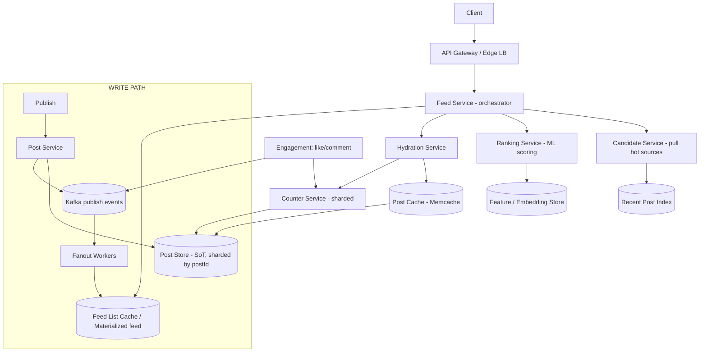
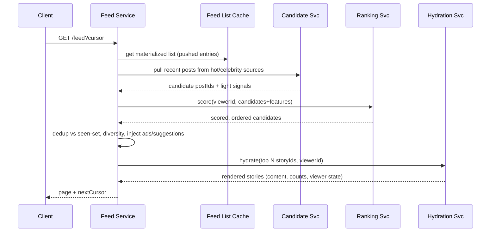

# Design Facebook News Feed — High-Level Design

> **Reader:** senior backend engineer (JVM, distributed systems) practising HLD.
> **Goal:** not just *an* answer, but the *design judgment* — what to clarify, what to trade off, and which failure mode each decision avoids.

---

## 1. Problem & Clarifying Questions

### 1.1 Restate the problem

Design the backend that powers the **Facebook News Feed**: the personalized, ranked, infinitely-scrollable stream of stories (posts, photos, videos, shared links, life events, friend activity) a user sees when they open the app. The system must:

- **Aggregate** content from many sources a user "follows" (friends, pages, groups, followed accounts).
- **Rank** that content by relevance, not just recency.
- **Deliver** it with low latency, fresh, deduplicated, and paginated, to billions of users.

This is fundamentally a **read-heavy, write-amplified, personalization** problem. The hard parts are *not* storing a post — they are (a) deciding *whose* posts a given user should even consider, (b) *ranking* them well, and (c) doing both within ~100 ms at billions-of-reads-per-day scale.

### 1.2 Clarifying questions I would ask first

A senior candidate never jumps to boxes-and-arrows. I'd spend the first 3–5 minutes here.

**Functional scope**
1. What is a "story"? Just friend posts, or also pages, groups, ads, "People you may know", birthdays, suggested content? — *Materially changes fan-out and injection logic.*
2. Is the feed **ranked** (relevance) or **reverse-chronological**? Modern FB is ranked; this drives the whole ML pipeline. I'll assume **ranked**.
3. Do we support **reactions, comments, shares** (engagement) that feed back into ranking? Yes — they're both a write path and a ranking signal.
4. Read-only feed, or also the **write/publish** path? I'll design both but spend the bulk on read + ranking.
5. Single feed, or also **Stories / Reels / Marketplace**? I'll scope to the main News Feed and treat others as injectable sources.
6. Do we need **real-time updates** (a post appears while you scroll) or is per-session refresh acceptable? Assume **near-real-time on refresh + pull-to-refresh**, not live websocket push for v1.

**Non-functional**
7. Latency target for feed load? Assume **p99 < 200 ms server-side** for the first page.
8. Availability target? Assume **99.95%+** — feed is the front door; a stale feed is far better than an error.
9. Consistency expectations? Feed can be **eventually consistent** (it's fine if your friend's post takes a few seconds to appear), but **you must see your own writes** (read-your-writes).
10. Is it acceptable to **drop/miss** some eligible stories under load? Yes — feed is best-effort relevance, not a transaction ledger. This is a huge degree of freedom.

**Scale**
11. DAU / MAU? Assume **2B DAU**, **3B MAU**.
12. Average friends/follows per user? Assume **~500 friends**, with a long tail of **celebrities/pages at 10M–100M+ followers**.
13. Posts created per day? Assume **~1B original posts/day** plus comments/reactions.
14. Feed opens per user per day? Assume **~10**, each viewing **~2 pages** of ~10–20 stories.

**Out of scope (state explicitly)**
- Ad targeting & auction internals (we'll inject ad slots but not design the auction).
- The ML model training pipeline & feature stores in full (we treat the ranker as a scored service with a feature contract).
- Media storage/transcoding (CDN + blob store; not the focus).
- Messaging, notifications, search.

---

## 2. Requirements (finalized)

### 2.1 Functional

- **FR1 — Publish:** A user creates a post (text/photo/video/link). It becomes eligible for friends'/followers' feeds.
- **FR2 — Feed read:** A user requests their feed; receives a ranked, paginated list of stories with rendered metadata (author, content, counts, viewer's reaction state).
- **FR3 — Ranking:** Stories are ordered by a personalized relevance score, not pure recency.
- **FR4 — Pagination:** Infinite scroll; stable, non-duplicating, resumable pagination.
- **FR5 — Engagement:** Like/react/comment/share; these update counts and feed ranking signals.
- **FR6 — Dedup & injection:** No story appears twice in a session; inject non-friend content (suggestions, ads, "On this day").
- **FR7 — Freshness:** New high-relevance content should surface within seconds-to-minutes on refresh.

### 2.2 Non-functional

| Property | Target | Notes |
|---|---|---|
| **Latency** | p99 < 200 ms (first page, server-side) | Subsequent pages can use a cached materialized list. |
| **Availability** | 99.95%+ for reads | Degrade gracefully (stale feed) rather than error. |
| **Consistency** | Eventual for others' content; **read-your-writes** for self | Feed is best-effort. |
| **Durability** | Posts/engagement: durable (no loss). Feed lists: regenerable, not durable. | Distinguish *source of truth* from *derived view*. |
| **Scalability** | 2B DAU, ~1B posts/day, ~10–100M reads/sec peak feed-item fetches | See §3. |
| **Freshness** | New content visible within ~seconds–minutes | Tunable per source type. |

### 2.3 Key assumptions

- Feed is **ranked**, eventually consistent, best-effort (may drop low-value eligible stories).
- ~500 friends median; celebrity sources exist (hot keys).
- Read:write ratio is heavily read-skewed at the **feed-item-view** level (~100:1), even though publish QPS is modest.
- We can precompute partial work asynchronously (fan-out, candidate generation) to keep the read path cheap.

---

## 3. Capacity Estimation (show the arithmetic)

### 3.1 Write (publish) QPS

```
1B original posts/day ÷ 86,400 s/day ≈ 11,600 posts/sec  (avg)
Peak ≈ 3× avg ≈ ~35,000 posts/sec
```
Comments + reactions are ~10–50× posts:
```
~10–50B engagement writes/day → ~115k–580k writes/sec avg → ~1M+/sec peak
```
**Takeaway:** write QPS is large but *tractable* with sharding. The real amplification is fan-out (below).

### 3.2 Read QPS

```
2B DAU × 10 opens/day = 20B feed opens/day
20B ÷ 86,400 ≈ 231,000 feed-open requests/sec (avg)
Peak ≈ 3× ≈ ~700,000 feed requests/sec
```
Each open renders ~20 stories, each story hydrates author + content + counts + viewer state. So **feed-item hydration QPS**:
```
700k feed reqs/sec × 20 items ≈ 14M item-hydrations/sec at peak
```
This is the number that justifies aggressive caching of post content and counts.

### 3.3 Fan-out amplification (the killer number)

If we *push* every post to every follower's feed at write time:
```
11,600 posts/sec × 500 followers (avg) ≈ 5.8M feed-insert writes/sec (avg)
Peak ≈ ~17M feed-insert writes/sec
```
And a single celebrity post (100M followers) would generate **100M writes** in one burst. This is exactly why pure push doesn't survive contact with the long tail → motivates the **hybrid fan-out** deep dive (§7.3).

### 3.4 Storage

**Source-of-truth posts:**
```
1B posts/day × ~1.5 KB metadata (excl. media) ≈ 1.5 TB/day
× 365 ≈ ~550 TB/year (metadata only; media in blob/CDN, far larger)
```
**Engagement (reactions/comments):**
```
~30B/day × ~200 B ≈ 6 TB/day → ~2 PB/year
```
**Precomputed feed lists (if push):** store ~500 recent feed entries (postId + score + ts ≈ 40 B) per user:
```
2B users × 500 × 40 B = 40 TB  (kept in a fast store / partially in cache)
```
Manageable — feed lists are small references, not content.

### 3.5 Bandwidth

```
Feed response ~ 20 stories × ~2 KB rendered (excl. media) ≈ 40 KB/page
700k reqs/sec × 40 KB ≈ 28 GB/sec ≈ 224 Gbps egress (metadata only)
```
Media dominates real bandwidth and is served from **CDN**, not our app tier.

### 3.6 Server / shard counts (rough)

- **Feed read service:** if one node serves ~5k feed reqs/sec (assembly + ranking call), 700k/5k ≈ **~140 nodes**, ×3 for headroom/regions ≈ **~400+**.
- **Ranking/ML scoring:** scoring ~500–1500 candidates/request × 700k req/s = ~700M scores/sec peak → fleet of GPU/CPU inference nodes; batch + cache to cut this drastically (§7.2).
- **Post store shards:** 550 TB/yr metadata + reads → shard by postId across, say, **~1000s of shards** on a partitioned store.
- **Cache (feed lists + hot posts):** tens of TB of RAM → a large Redis/Memcache fleet (FB's actual Memcache fleet is famously huge).

> **Flag:** all numbers are order-of-magnitude planning figures; in a real round I'd state these as assumptions and adjust to the interviewer's scale.

---

## 4. API Design

REST-ish for clarity; in practice these are RPCs (Thrift/gRPC) behind an API gateway. All authenticated; `viewerId` derived from the auth token, never trusted from the client.

### 4.1 Read feed

```
GET /v1/feed?cursor=<opaque>&limit=20
Authorization: Bearer <token>

200 OK
{
  "items": [
    {
      "storyId": "s_abc",
      "type": "POST",                 // POST | SHARED | SUGGESTION | AD | EVENT
      "authorId": "u_123",
      "authorName": "...", "authorAvatar": "...",
      "createdAt": 1719300000,
      "content": { "text": "...", "media": [ {"url":"cdn://...","type":"IMAGE"} ] },
      "counts": { "likes": 42, "comments": 8, "shares": 2 },
      "viewerState": { "reaction": "LIKE", "saved": false },
      "rankScore": 0.873,             // usually internal/debug only
      "injectedReason": null
    }
  ],
  "nextCursor": "eyJ...",            // opaque, encodes position + dedup set ref
  "hasMore": true
}
```

- **`cursor`** is **opaque and server-defined** — it encodes the ranked position, a snapshot/session token, and a reference to the seen-set for dedup. Never expose offsets (they break under inserts).
- **`limit`** capped server-side (e.g. ≤ 30).

### 4.2 Publish

```
POST /v1/posts
Idempotency-Key: <client-uuid>
{ "text":"...", "media":[...], "audience":"FRIENDS" }

201 Created
{ "postId":"p_789", "createdAt":1719300000 }
```
- **`Idempotency-Key`** dedupes double-taps / retries (§9.4).

### 4.3 Engagement

```
POST   /v1/posts/{postId}/reactions   { "type":"LIKE" }     // idempotent (upsert)
DELETE /v1/posts/{postId}/reactions
POST   /v1/posts/{postId}/comments     { "text":"..." }
```

### 4.4 Internal RPCs (the interesting ones)

```
FeedService.GetFeed(viewerId, cursor, limit) -> RankedStories
FanoutService.OnPublish(postId, authorId, audience)         // async, via queue
CandidateService.GetCandidates(viewerId, context) -> [postId, lightSignals]
RankingService.Score(viewerId, [candidateFeatures]) -> [postId, score]
HydrationService.Hydrate([storyId], viewerId) -> [RenderedStory]
CounterService.GetCounts([postId]) -> counts
```

---

## 5. High-Level Architecture

### 5.1 Request flow (read)

1. Client → **API Gateway / Edge** (auth, rate limit, TLS termination, regional routing).
2. → **Feed Service** (orchestrator). Checks **Feed List Cache** for a precomputed/materialized ranked list for this viewer.
3. **Candidate generation:** combine (a) precomputed pushed entries for normal-degree sources + (b) pulled recent posts from **high-fanout/celebrity sources** + (c) injectable sources (ads, suggestions).
4. **Ranking:** send candidates + features to **Ranking Service** (ML scoring), which returns scores. Apply dedup, diversity, business rules.
5. **Hydration:** fetch post content (Post Store + **Post Cache**), counts (**Counter Service**), and viewer state (reaction/saved).
6. Assemble page, set `nextCursor`, return.

### 5.2 ASCII block diagram

```
                                  ┌─────────────────────────┐
        Mobile / Web ───────────► │  API Gateway / Edge LB  │  auth, TLS, rate-limit, geo-route
                                  └────────────┬────────────┘
                                               │
                              ┌────────────────▼─────────────────┐
                              │           Feed Service            │ orchestrator
                              │  (candidate gen → rank → hydrate) │
                              └──┬───────┬───────────┬─────────┬──┘
                                 │       │           │         │
            ┌────────────────────▼─┐  ┌──▼────────┐ ┌▼────────┐ ┌▼───────────────┐
            │  Feed List Cache /   │  │ Candidate │ │ Ranking │ │  Hydration      │
            │  Materialized Feed   │  │  Service  │ │ Service │ │  Service        │
            │  (per-user lists)    │  │(pull hot) │ │  (ML)   │ │ (content+counts)│
            └──────────┬───────────┘  └──┬────────┘ └────┬────┘ └──┬─────────┬────┘
                       │                 │               │         │         │
                       │            ┌────▼────┐    ┌──────▼─────┐ ┌─▼──────┐ ┌▼─────────┐
                       │            │ Post    │    │ Feature/   │ │ Post   │ │ Counter  │
                       │            │ Index   │    │ Embedding  │ │ Cache  │ │ Service  │
                       │            │ (recent)│    │ Store      │ │(Memcd) │ │(sharded) │
                       │            └─────────┘    └────────────┘ └───┬────┘ └────┬─────┘
                       │                                              │           │
   WRITE PATH          │                                        ┌─────▼───────────▼─────┐
   ───────────         │                                        │   Post Store (SoT)    │
 Publish ─► Post Svc ──┴──► Kafka (publish events) ─► Fanout ───►│  sharded by postId    │
                                       │              Workers     └───────────────────────┘
                                       └──► writes feed entries into Feed List store/cache
```

### 5.3 Mermaid diagram



### 5.4 Sequence — feed read



### 5.5 Sequence — publish + fan-out

```mermaid
sequenceDiagram
    participant Cl as Client
    participant PSV as Post Service
    participant PS as Post Store
    participant K as Kafka
    participant FW as Fanout Worker
    participant FLC as Feed Lists
    Cl->>PSV: POST /posts (Idempotency-Key)
    PSV->>PS: durably write post (SoT)
    PSV-->>Cl: 201 postId  (read-your-writes ready)
    PSV->>K: emit PostPublished(postId, authorId, audience)
    K->>FW: consume event
    FW->>FW: classify author (normal vs high-fanout)
    alt normal-degree author
      FW->>FLC: insert feed entry into each follower's list
    else high-fanout (celebrity)
      FW->>FW: do NOT fan out; mark for pull-time merge
    end
```

---

## 6. Data Model & Storage Choices

### 6.1 Core entities

| Entity | Key fields | Notes |
|---|---|---|
| **Post** | postId (PK), authorId, type, text, mediaRefs[], audience, createdAt, status | Source of truth. |
| **Edge / Follow** | (followerId, followeeId), createdAt, weight | The social graph. |
| **FeedEntry** | (viewerId, postId), authorId, createdAt, score(optional) | Derived materialized list (push). |
| **Reaction** | (postId, userId) → type, ts | Upsert; one per user per post. |
| **Comment** | commentId, postId, userId, text, ts | High volume. |
| **Counter** | postId → {likes, comments, shares} | Approximate, hot. |
| **ViewerState** | (viewerId, postId) → reaction, saved, seen | For rendering "you liked this". |

### 6.2 Datastore choices and *why*

| Data | Store | Why (access pattern) | Failure mode avoided |
|---|---|---|---|
| **Post (SoT)** | Sharded NoSQL / wide-column (e.g. Cassandra-like) or sharded MySQL+TAO-style cache | Point-read by postId, write-once-mostly, massive volume, no cross-row txns needed | Avoids a single relational master bottleneck; horizontal scale. |
| **Social graph (edges)** | Graph-optimized store (FB's **TAO** — graph cache over sharded MySQL) | "Who do I follow", "followers of X", traversals; read-heavy | Avoids expensive repeated JOINs; caches the graph hot set. |
| **Feed lists (push)** | Per-user list in fast KV / Redis (capped, e.g. last 500) | Range read of recent entries by viewerId; append on fan-out | Avoids recomputing the whole candidate set on every read. |
| **Recent post index (pull)** | Time-bucketed index per author in KV/log | "Give me author X's last N posts since T" for celebrity pull | Avoids fanning out celebrity posts to 100M lists. |
| **Counters** | Sharded counter service / Redis with periodic flush; or approximate counters | Extreme write rate, read on every hydration; exact value not critical | Avoids hot-row contention on a single counter row. |
| **Post content cache** | Memcache/Redis (the 14M item-hydrations/sec layer) | Read the same hot posts millions of times | Avoids hammering the post store; protects SoT. |
| **Features/embeddings** | Feature store + vector index (ANN) | Ranking needs user/post embeddings, recent engagement features | Avoids recomputing features inline; keeps ranking fast. |

**Why not one big SQL DB?** Feed has no need for multi-row ACID across users; it's a derived, eventually-consistent view. Forcing it through a relational master would cap write throughput and add latency. We separate **source of truth (durable, sharded)** from **derived views (regenerable, cached)** — the single most important storage decision.

### 6.3 Sharding keys

- **Post store:** shard by `postId` (or `hash(postId)`) → even distribution, point reads cheap.
- **Feed lists:** shard by `viewerId` → a user's whole feed list lives on one shard (range scan is local).
- **Counters:** shard by `postId`, and for super-hot posts, split into N sub-counters summed on read (avoids hot key).
- **Graph (edges):** shard by source node; replicate hot celebrity follower lists.

---

## 7. Deep Dives (the bulk)

The genuinely hard sub-problems: **(7.1) feed assembly & pagination, (7.2) the ranking pipeline, (7.3) fan-out strategy, (7.4) freshness vs cost & caching, (7.5) dedup & story injection.**

---

### 7.1 Deep dive — Feed assembly model: push vs pull vs hybrid (and pagination)

The central architectural fork: **do we precompute each user's feed (push/fan-out-on-write) or assemble it on read (pull/fan-out-on-read)?**

**Push (fan-out-on-write):** when A posts, insert a FeedEntry into every follower's precomputed list. Reads are cheap (read your own list).
**Pull (fan-out-on-read):** store nothing per follower; at read time, gather recent posts from everyone you follow, merge, rank.

| Dimension | Push (write fan-out) | Pull (read fan-out) | Hybrid (chosen) |
|---|---|---|---|
| Read latency | **Excellent** (list is ready) | Poor (gather + merge N sources live) | Good |
| Write cost | **Terrible** for high-degree authors (celebrity → 100M writes) | Cheap | Bounded |
| Storage | High (N copies of references) | Low | Medium |
| Freshness | Delayed by fan-out lag | **Instant** | Tunable |
| Inactive users | Wasted work (fan out to people who never log in) | No waste | Skip inactive on push |
| Celebrity posts | Catastrophic write storm | Fine | **Pull at read time** |

**Decision: Hybrid fan-out.**
- **Push** for *normal-degree* authors (most users): fan out their posts to followers' feed lists asynchronously.
- **Pull** for *high-fanout* authors (celebrities/large pages, e.g. > ~10k–100k followers): do **not** fan out. At read time, the viewer's feed service *pulls* recent posts from the small set of high-fanout sources the viewer follows and merges them with their precomputed list.
- **Skip inactive recipients** on push (don't materialize feeds for users who haven't logged in in N days — regenerate lazily on return).

**Failure mode each choice avoids:**
- Pure push → **celebrity write storm** (one post = 100M synchronous-ish writes, saturating the feed-list store). Hybrid avoids it by pulling those.
- Pure pull → **read fan-out explosion** (every feed open does ~500 source reads + live merge under a 200 ms budget). Hybrid avoids it by precomputing the common case.

**Pagination of an infinite, *ranked* feed — the subtle part.**
Offset pagination breaks the moment new items are inserted at the top (you re-see items / skip items). Ranked feeds make it worse because order isn't time-monotonic. So:

- On the **first** request, the Feed Service builds a **ranked session snapshot**: it generates candidates, ranks them, and stores the ordered list of `storyId`s (or a deterministic seed) keyed by a **session/snapshot id**, with a TTL (e.g. 10–30 min).
- The **cursor** is opaque: it encodes `{snapshotId, position, seenSetRef}`. Subsequent pages read the *frozen* ranked list at the next position → **stable, no dupes, resumable**.
- A **pull-to-refresh** mints a *new* snapshot (re-rank with fresh candidates), so users still get freshness without breaking mid-scroll order.
- The **seen-set** (recently shown storyIds, e.g. a bounded set / Bloom filter in the cursor or session) enforces dedup across pages and across the push-list/pull-merge boundary.

> *Term: a **Bloom filter** is a compact probabilistic set — tells you "probably seen" or "definitely not seen"; small false-positive rate is acceptable for "have I shown this story".*

This snapshot approach is the senior insight: **freeze the ranking per session, refresh on explicit pull**, rather than re-ranking every page (jittery, expensive, dup-prone).

---

### 7.2 Deep dive — Ranking / relevance pipeline (systems view)

We're asked for the *systems-level* design, not the model math. The pipeline has clear stages, each with a different latency/cost budget. This is the **funnel**: thousands of candidates → hundreds → ~tens shown.

```
Candidates (≈1k–5k)  →  Lightweight filter/score (cheap, fast, in-memory)
                     →  Heavyweight ML rank (top ~500, the expensive model)
                     →  Re-rank: diversity, dedup, business rules, injection
                     →  Page of ~20
```

**Stage 1 — Candidate generation (recall).** Gather everything *eligible*: pushed entries + pulled celebrity posts + injectables. Apply hard filters (audience/privacy, blocked users, already-seen, too old). Cheap and broad — optimize for **recall** (don't miss good stuff), not precision.

**Stage 2 — Lightweight ranking (pre-scoring).** A cheap model / heuristic scores all candidates using easily-available signals (recency, author affinity, content type, simple counts) to **prune** ~thousands down to the few hundred worth expensive scoring. This protects the costly model from being called on junk.

**Stage 3 — Heavyweight ML scoring (the "edge ranking").** For each surviving candidate, predict engagement probabilities — `P(like)`, `P(comment)`, `P(share)`, `P(meaningful interaction)`, `P(hide/negative)` — using a deep model. The final score is a **weighted combination** of these predicted actions:

```
score = w1·P(like) + w2·P(comment) + w3·P(share)
        + w4·P(meaningful_interaction) − w5·P(hide) − w6·P(report)
```

This is the modern descendant of Facebook's **EdgeRank** (the original `affinity × weight × time-decay` formula). The signals/features:

| Signal class | Examples | Where it lives |
|---|---|---|
| **Affinity** | viewer↔author interaction history, closeness | Feature store, precomputed |
| **Content** | type (video/photo/text), embedding, topic | Embedding store (vector) |
| **Engagement velocity** | how fast this post is gaining reactions | Counter/stream aggregation |
| **Recency** | age, time-decay | Computed inline |
| **Viewer context** | device, session time-of-day, recent behavior | Request context + recent-activity cache |
| **Negative** | hide/unfollow/report propensity | Feature store |

**Systems concerns (this is what gets graded):**

1. **Latency budget.** Scoring 500 candidates with a deep model in < ~50 ms requires: **batched inference** (one RPC scores all candidates, not 500 RPCs), feature **prefetch in parallel** with candidate gen, and **feature caching** (precompute user features offline; only fetch deltas inline).
2. **Feature freshness vs cost.** Most features are precomputed in a feature store (hourly/daily); only a few real-time features (engagement velocity, this-session behavior) are computed inline from a streaming aggregator. *Tradeoff: real-time features improve quality but add latency and infra cost — keep them few.*
3. **Caching the ranking.** Cache the *scored snapshot* per session (ties into §7.1). Don't re-score on every page.
4. **Graceful degradation.** If the ranking service is slow/down, **fall back** to the lightweight score or even recency order. A slightly-worse-ranked feed >>> an error. The Feed Service enforces a **deadline** on the ranking RPC and proceeds with whatever returned (timeout → fallback ordering).
5. **Model rollout / A-B.** Multiple model versions behind the Ranking Service, traffic-split by experiment framework; the Feed Service doesn't know or care which model scored.

**Decision:** multi-stage funnel with **batched, deadline-bounded, cache-backed** scoring and a **recency/light fallback**. The failure mode avoided: **head-of-line ranking latency** taking down the whole feed read — the deadline + fallback decouples feed availability from model availability.

---

### 7.3 Deep dive — Fan-out strategy & the celebrity (hot-key) problem

Already chose **hybrid** in §7.1; here's the *implementation* of fan-out and how we handle the long tail.

**Async fan-out pipeline.** Publish writes the post to SoT synchronously, returns 201 immediately, then emits a `PostPublished` event to **Kafka**. **Fan-out workers** consume it and write FeedEntry references into followers' lists. Why async: decouples publish latency from fan-out cost, absorbs bursts, retriable.

**Author classification.** On publish, look up the author's follower count from the graph service:
- **Normal-degree (< threshold, e.g. 100k):** push to followers' lists (skipping inactive recipients).
- **High-fanout (≥ threshold):** mark in a **"hot authors" set**; do not push. The post lives in a per-author **recent-posts index**, pulled at read time.

**The hot-key problem on the read side.** When millions of viewers pull the same celebrity's recent posts simultaneously, that author's recent-post index becomes a hot key.
- Mitigate with **replication + local caching**: the celebrity's recent posts are tiny and identical for everyone → cache them aggressively (CDN-like, per-region) with short TTL. One read serves millions.
- For **counters** on viral posts: split a hot counter into N sub-counters across shards, sum on read; or serve **approximate** counts from cache refreshed every few seconds (exact like-count is not critical).

**Fan-out worker reliability.** At-least-once delivery from Kafka → fan-out is **idempotent** (FeedEntry keyed by `(viewerId, postId)`, upsert). Lag monitoring; if workers fall behind, freshness degrades gracefully (post appears a bit later) rather than failing.

**Tradeoff table — handling high-degree authors:**

| Approach | Pro | Con | Verdict |
|---|---|---|---|
| Push to all followers | Simple read | 100M-write storm, lag | ✗ |
| Never push (pull all) | No storm | Every read does huge merge | ✗ |
| **Hybrid + pull hot authors** | Bounded both sides | More read-side logic + merge | ✔ |
| Push but rate-limited/queued | Eventually consistent | Huge backlog, stale for hours | partial |

**Decision:** hybrid with threshold-based classification, async idempotent push for the body, read-time pull for hot authors, aggressive per-region caching of hot authors' recent posts. Avoids both the write storm and the read-merge explosion.

---

### 7.4 Deep dive — Freshness vs cost & the caching hierarchy

Feed is read ~100× more than written, so caching is where the cost lives — but stale caches hurt freshness. We tune each layer's TTL by **how much staleness the data tolerates.**

**Caching layers (top to bottom):**

| Layer | What it holds | Staleness tolerance | TTL / invalidation |
|---|---|---|---|
| **Client/app cache** | Last rendered page | Seconds–minutes | Pull-to-refresh, app foreground |
| **Edge/CDN** | Public hot-author posts, media | Seconds | Short TTL |
| **Feed list / session snapshot** | Per-viewer ranked list | A session | TTL 10–30 min; new on refresh |
| **Post content cache (Memcache)** | Post bodies/metadata | Long (posts rarely change) | Invalidate on edit/delete |
| **Counter cache** | Like/comment counts | Seconds (approximate ok) | Periodic refresh / write-through-ish |
| **Feature cache** | Ranking features/embeddings | Minutes–hours | Recompute offline + delta inline |

**Freshness mechanisms without re-ranking everything:**
1. **Pull-to-refresh** mints a new snapshot (cheap user-triggered freshness).
2. **Hot-author pull** at read time always sees their newest posts (no fan-out lag for the sources most likely to be fresh-sensitive).
3. **"New posts available" pill**: a lightweight check (is there anything newer than your snapshot top?) lets the client prompt a refresh without auto-disrupting scroll.

**Tradeoff — write-through vs read-through caching of post content:**
- *Read-through* (cache miss → load from SoT → populate): simple, self-healing, but first reader pays latency and a thundering herd is possible on a hot post.
- *Write-through / cache-aside on publish*: warm the cache when a post is created (especially celebrity posts) → no cold-start herd.

**Decision:** **cache-aside read-through** generally, with **proactive warming** for high-fanout authors' posts, plus **request coalescing / single-flight** (only one loader per missing key; others wait) to kill thundering herds.

> *Term: **thundering herd** — when a popular cache key expires, thousands of concurrent misses all hammer the backend at once. **Single-flight** lets one request fill the cache while the rest wait on it.*

**Failure mode avoided:** on a viral post, naive read-through would let millions of cache misses stampede the post store. Warming + single-flight protects the SoT.

---

### 7.5 Deep dive — Dedup & story injection

A polished feed never shows the same story twice and weaves in non-friend content tastefully.

**Dedup.**
- **Intra-session:** the **seen-set** (referenced by the cursor) ensures no story repeats across pages of one session. With the frozen snapshot (§7.1), intra-session dedup is mostly free — the ranked list is fixed.
- **Cross-source dedup:** the same post can arrive via the pushed list *and* the hot-author pull, or as both an original and a friend's reshare → collapse on `postId` (and group reshares of the same underlying object into a single "X and 3 others shared" story).
- **Cross-session ("don't show me what I already saw last time"):** persist a bounded recently-seen set per user (e.g. last few hundred storyIds, or a rolling Bloom filter) so a refresh doesn't re-serve what you just scrolled past. Bounded so it can't grow unbounded.

**Story injection.** The feed isn't only friend posts. The Feed Service merges injectable sources *after* organic ranking:

| Injected | Source | Placement rule |
|---|---|---|
| **Ads** | Ad service / auction | Fixed slots (e.g. every Nth story); pacing/frequency caps |
| **Suggestions** ("Pages you may like", PYMK) | Recommendation service | Capped per session, spaced out |
| **Memories / On this day** | Memories service | At most one per session |
| **Friend activity / events** | Activity service | Relevance-gated |

**Injection rules (senior-signal):**
- **Diversity / spacing:** don't show two ads or two videos from the same author back-to-back — apply a re-ranking pass that enforces min-gap constraints between similar items.
- **Frequency capping:** an ad/suggestion seen-and-dismissed shouldn't reappear soon (ties into the seen-set, tagged by reason).
- **Budget per page:** cap injected fraction (e.g. ≤ 20% non-organic) so the feed still feels like *your* feed — protects engagement/retention.

**Decision:** rank organic first, then run a **constrained re-ranking / interleaving pass** that injects ads/suggestions under spacing + frequency + budget constraints, with all injected items registered in the dedup seen-set. Failure mode avoided: a feed that feels spammy or repetitive (retention killer) — and double-counting/double-showing the same object.

---

## 8. Scaling & Bottlenecks

| Bottleneck (where it breaks first) | Symptom | Mitigation |
|---|---|---|
| **Celebrity fan-out** | Write storm, fan-out lag, feed-list store saturation | Hybrid: pull hot authors (§7.3) |
| **Ranking service** | p99 latency spikes, CPU/GPU saturation | Multi-stage funnel, batching, feature cache, deadline + recency fallback (§7.2) |
| **Hot post content/counters** | Single shard/key overload on viral posts | Cache + warm + single-flight; split counters; approximate counts (§7.4) |
| **Feed read fan-out (hydration)** | 14M item fetches/sec hit post store | Memcache layer absorbs hot set; SoT protected |
| **Graph reads (follower lists)** | Repeated traversals | TAO-style graph cache, replicate hot follower lists |
| **Cross-region latency** | Global users far from data | Regional replicas; pin user to home region; async cross-region replication |
| **Kafka / fan-out worker lag** | Stale feeds | Autoscale workers, prioritize active recipients, monitor lag |

**Scaling levers:** stateless Feed Services scale horizontally behind the gateway; caches and stores shard by `viewerId`/`postId`; ranking is an independently-scaled fleet; everything async (fan-out, feature compute) is queue-buffered so bursts become backlog, not errors.

**Multi-region:** users routed to a home region; SoT replicated cross-region (async, eventually consistent); feed lists/caches are per-region (regenerable). Read-your-writes preserved by routing a user's reads+writes to the same region (or session stickiness) for a short window after a write.

---

## 9. Reliability, Consistency & Security

### 9.1 Failure handling & graceful degradation
The governing principle: **a degraded feed beats an error.** Layered fallbacks:
- Ranking down/slow → recency/light-score ordering (deadline-bounded RPC).
- Hot-author pull fails → serve from pushed list only (you miss a couple celebrity posts).
- Counter service down → show cached/approximate counts or hide counts.
- Feature store miss → score with available features (model handles missing features).
- Whole personalization tier down → serve a cached prior snapshot ("you may have seen these") rather than 500.

### 9.2 Replication & consistency model
- **SoT (posts, engagement):** durable, replicated (quorum or leader-follower); **read-your-writes** for the author.
- **Derived views (feed lists, caches):** eventually consistent, regenerable; we accept staleness.
- **Counters:** eventually consistent, approximate by design.

### 9.3 Read-your-writes
After publishing, the author must see their post immediately even if fan-out hasn't completed: on the author's *own* feed read, the Feed Service explicitly pulls the author's very recent posts (a tiny self-pull) and merges them, independent of fan-out lag.

### 9.4 Idempotency
- **Publish:** `Idempotency-Key` (client UUID) → server dedupes retries within a window (store key→postId).
- **Fan-out:** FeedEntry upsert keyed `(viewerId, postId)` → at-least-once Kafka delivery is safe.
- **Reactions:** upsert keyed `(postId, userId)` → double-tap is naturally idempotent.

### 9.5 Security, auth, abuse, rate limiting
- **AuthN/Z:** token at the gateway; `viewerId` derived server-side, never trusted from client; per-post **audience/privacy** checks enforced in candidate filtering (not just in UI).
- **Rate limiting:** per-user and per-IP at the gateway (publish, reactions) to curb spam/scraping; tighter limits on write paths.
- **Abuse / integrity:** spam & policy classifiers can demote or filter candidates pre-ranking; reported/violating content removed from candidate set.
- **Privacy:** blocked/muted relationships filtered at candidate gen; deleted posts invalidated from caches (tombstone propagation).
- **PII / data access:** feature store and logs governed; ranking features avoid leaking private signals across users.

---

## 10. Extensions & Follow-ups

| Follow-up the interviewer adds | How the design changes |
|---|---|
| **Real-time push** (post appears live while scrolling) | Add a websocket/long-poll channel; server pushes "new items" pills, not auto-insert (preserves snapshot stability). Live-counter updates via pub/sub. |
| **Stories / Reels** | Treat as additional injectable sources with their own candidate/rank logic; separate ranking heads. |
| **Groups & Pages weighting** | New affinity signals + audience rules; pages are often high-fanout → pull path. |
| **Negative feedback ("hide", "see less")** | Strong negative ranking signal; immediate session-level suppression of that author/type; feed back into model. |
| **Chronological toggle ("Most Recent")** | Bypass ML rank; pure time-merge of candidates — already supported by candidate layer. |
| **Notifications for engagement** | Engagement events already on Kafka → notification service is just another consumer. |
| **Multi-device read consistency** | Snapshot/cursor keyed to user, not device; recently-seen set shared across devices. |
| **GDPR / right-to-delete** | Tombstones propagate to caches + feature store; SoT delete is authoritative. |
| **Cost reduction** | Skip ranking for low-activity users (cheaper path); compress feature set; raise cache TTLs where staleness tolerable. |
| **Cold start (new user, few friends)** | Lean heavily on injected/recommended content + popular-in-network; candidate gen widens recall. |

---

## 11. Interview Q&A

**Q1. Push or pull for fan-out — which and why?**
Hybrid. Push for normal-degree authors (cheap reads), pull for high-fanout/celebrity authors (avoids the 100M-write storm). Skip inactive recipients on push. Push gives read latency; pull caps write amplification; hybrid takes both wins.

**Q2. How do you paginate a *ranked* infinite feed without dupes or skips?**
Freeze a **ranked session snapshot** on the first request; the cursor is opaque and encodes `{snapshotId, position, seenSet}`. Pages read the frozen list. Pull-to-refresh mints a new snapshot. Never use offsets — inserts at the top would corrupt them.

**Q3. (Senior signal) Ranking service has a p99 latency spike. What happens to the feed?**
Nothing fatal — the ranking RPC is **deadline-bounded**; on timeout the Feed Service falls back to the lightweight/recency order and still returns a page. We deliberately **decouple feed availability from model availability**: a slightly-worse-ranked feed beats an error.

**Q4. A post goes viral (10M reactions in minutes). What breaks and how do you protect it?**
The counter row and the post-content cache key become hot. Split the counter into N sub-counters summed on read (or serve approximate counts from cache); warm the post in cache on publish and use **single-flight** to prevent a thundering herd on the SoT. Hot-author pull path keeps fan-out bounded.

**Q5. How do you guarantee a user sees their own post immediately?**
Read-your-writes via a **self-pull**: on the author's own feed read, explicitly merge their most recent posts from SoT regardless of fan-out completion. Publish writes SoT synchronously before returning 201.

**Q6. (Senior signal) Why separate "source of truth" from "feed lists," and what consistency do you give each?**
Posts/engagement are durable, replicated, read-your-writes-consistent (they can't be lost). Feed lists and caches are **derived and regenerable**, so they can be eventually consistent and even rebuilt from scratch. This separation is what lets feed reads be cheap and writes scale — forcing the derived view to be strongly consistent would cap throughput for no user benefit.

**Q7. How does ranking actually score a story (systems view)?**
A funnel: candidate gen (recall) → lightweight prune → heavyweight model predicting `P(like/comment/share/meaningful/hide)` → weighted score → diversity/injection re-rank. Features mostly precomputed in a feature store; a few real-time features from a stream aggregator. Inference is **batched** per request and feature fetches run in parallel with candidate gen.

**Q8. How do you keep the feed fresh without re-ranking on every page?**
Snapshot per session (stable scroll) + pull-to-refresh for new snapshots + always-fresh hot-author pull + a "new posts" pill driven by a cheap "is anything newer than my snapshot top" check.

**Q9. (Senior signal) How do you inject ads/suggestions without wrecking engagement?**
Rank organic first, then a **constrained interleaving pass** with spacing (no two ads/same-author-videos adjacent), frequency caps, and a budget (e.g. ≤20% non-organic). All injected items registered in the dedup seen-set. The constraint is product-driven: too much injection tanks retention.

**Q10. How do you handle dedup across the push list and the pull merge?**
Collapse on `postId`, group reshares of the same underlying object, and gate everything through the cursor's seen-set (bounded recently-seen, e.g. a rolling Bloom filter) so nothing repeats within or across sessions.

**Deep-probe follow-ups (be ready):**
- *"What's the threshold for 'celebrity'?"* — tunable (e.g. 10k–100k followers), chosen by measuring fan-out cost vs read-merge cost; not a magic constant.
- *"Bloom filter false positives drop a good story — acceptable?"* — yes, feed is best-effort; a rare missed story is invisible to the user and cheaper than perfect tracking.
- *"How do you A/B test ranking safely?"* — model versions behind the Ranking Service, traffic-split by experiment framework, monitored on engagement + guardrail metrics; Feed Service is model-agnostic.

---

## 12. Cheat-sheet & Self-test

### 12.1 Dense recap

- **Shape:** read-heavy, write-amplified personalization. Separate **SoT (durable, sharded by postId)** from **derived feed views (regenerable, cached, sharded by viewerId)**.
- **Key numbers:** 2B DAU; ~12k posts/sec avg (~35k peak); ~700k feed reqs/sec peak → ~14M item-hydrations/sec; naive push ≈ 5.8M–17M feed-inserts/sec; ~550 TB/yr post metadata; feed-list refs ~40 TB total.
- **Fan-out:** **hybrid** — push normal authors (skip inactive), **pull** celebrities; async via Kafka; idempotent FeedEntry upsert.
- **Ranking:** funnel (recall → light prune → heavy `P(action)` model → diversity/injection); **batched, deadline-bounded, cached, recency fallback**.
- **Pagination:** frozen **ranked session snapshot**; opaque cursor `{snapshotId, position, seenSet}`; refresh mints new snapshot. No offsets.
- **Freshness/caching:** layered TTLs by staleness tolerance; cache-aside read-through + warm hot authors + **single-flight** vs thundering herd; approximate hot counters (split-counter).
- **Dedup/injection:** collapse on postId + seen-set (Bloom); inject ads/suggestions via constrained interleaving (spacing, freq cap, ≤20% budget).
- **Reliability:** degraded feed > error; read-your-writes via self-pull; idempotency keys on publish; regional home + async cross-region.
- **Security:** server-derived viewerId, audience/privacy at candidate gen, rate limits, integrity classifiers pre-rank.

**Diagram-in-words:** Client → Gateway → Feed Service → {Feed-list cache (push) + Candidate pull (celebrities) + injectables} → Ranking Service (funnel) → dedup/diversity/inject → Hydration (Post cache→SoT, Counter service) → page + cursor. Write path: Publish → SoT (sync) → Kafka → Fan-out workers → feed lists (push) / recent-post index (pull).

### 12.2 Self-test (no answers)

1. Derive the feed-insert/sec for pure push if avg followers were 1,000 and posts/sec 20,000 — and explain why this argues for hybrid.
2. Your ranked snapshot has a 20-min TTL; a user scrolls for 40 minutes. What happens at minute 21, and how do you keep the experience smooth?
3. Counts on a viral post are off by ~2% across replicas. Defend why that's acceptable — and name one place where approximate counts would *not* be acceptable.
4. A celebrity with 80M followers posts; trace the exact read-path steps when one of their followers opens the feed 2 seconds later.
5. The ranking model fleet loses 40% of capacity at peak. Walk through the degradation sequence and what the user perceives.

---

*End of design.*
