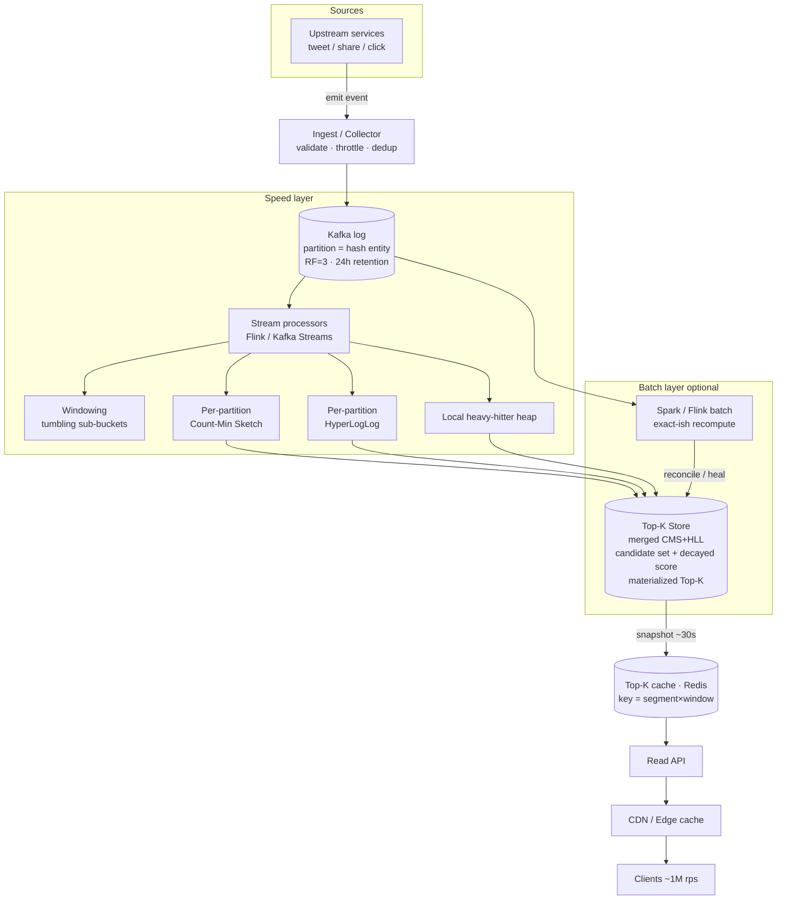
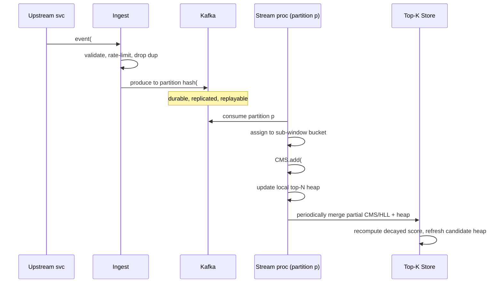
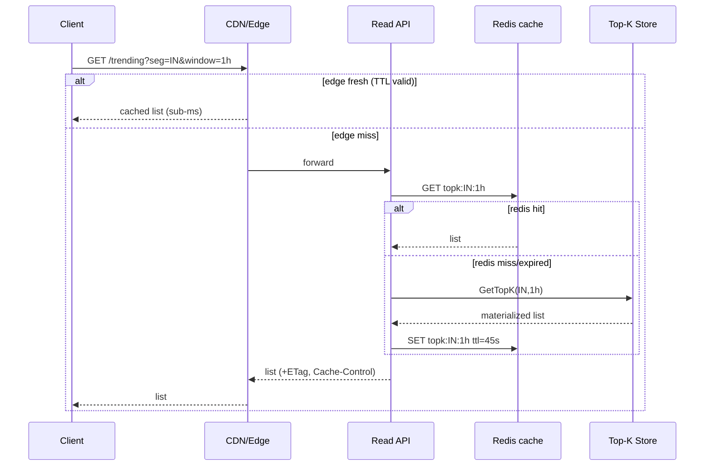

# Design Trending / Top-K

> **System-design interview reference** — Social & Feed category. Computing the top-K trending entities (hashtags, products, search queries, videos) over a sliding time window, at scale, in near-real-time.
>
> Reader profile: senior backend engineer (JVM/distributed systems) practising HLD. The goal is to teach *design judgment* — requirements clarification, tradeoffs, and the deep dives that separate a staff answer from a junior one.

---

## 1. Problem & clarifying questions

### 1.1 Restating the problem

"Trending" means: of all the entities being mentioned/clicked/viewed across a firehose of events, surface the **K most popular ones over a recent time window** — e.g. "Top 10 trending hashtags in the last 5 minutes / 1 hour / 24 hours." The system continuously ingests a high-volume event stream, maintains approximate popularity counts under a time window, and serves a small ranked list to readers with very low latency and very high read fan-out.

The core tension: the **write side is a firehose** (millions of events/sec, long-tail key space, hot keys) while the **read side is a tiny answer** (a list of K items) requested by an enormous read audience. Exact counting of every key over every window is wasteful; the interesting engineering is approximating it cheaply and serving it cheaply.

This is deceptively hard because:
- **The key space is huge and skewed.** Billions of distinct hashtags exist; a handful are red-hot at any moment (Zipfian distribution). You cannot keep an exact per-key counter for everything in memory.
- **"Recent" requires windowing.** A naive lifetime counter would keep last year's Super Bowl hashtag at the top forever. You need time-decay or sliding windows.
- **It must be near-real-time.** Trends that take an hour to appear are useless. Sub-minute freshness is the differentiator.
- **It's adversarial.** Bots and coordinated spam try to manufacture trends. The ranking is a product surface people game.

### 1.2 Questions I'd ask the interviewer (before any boxes-and-arrows)

A staff candidate spends the first 5 minutes here. I'd group questions by **functional**, **non-functional**, **scale**, and **out-of-scope**.

**Functional**
1. **What is the "entity"?** Hashtags? Search queries? Products clicked? URLs shared? Videos watched? This decides the key cardinality and the event semantics (a "mention" vs a "purchase").
2. **What's K?** Top 10, Top 100, Top 1000? K being small (≤1000) lets us serve from memory trivially; K in the millions changes everything.
3. **What time windows?** A single fixed window (last hour) or multiple simultaneous windows (5m / 1h / 24h / 7d)? Multiple windows multiply the storage/compute.
4. **Global or segmented?** One global top-K, or top-K *per country / per language / per category / per user-cohort*? Segmentation multiplies the number of independent top-K problems (one per segment) — this is often the real scaling driver.
5. **What's the popularity metric?** Raw event count? **Unique users** (cardinality, dedup so one bot can't spam)? A weighted/decayed score? Velocity (rate of change, "rising") vs absolute volume?
6. **Exact or approximate counts acceptable?** Almost always approximate is fine for *trending* — nobody cares if a hashtag had 1,002,310 vs 1,001,950 mentions, only that it's #3. This unlocks sketches. I'd confirm we can trade a few % count error for orders-of-magnitude resource savings.
7. **Do we need the count shown, or just the rank/order?** Showing "1.2M tweets" is a softer requirement than perfect ordering.

**Non-functional**
8. **Read latency / scale?** Trending is on the home screen of hundreds of millions of users → enormous read QPS, p99 must be a few ms. Confirm.
9. **Freshness / staleness budget?** How stale can the served list be? "≤ 1 minute behind" is typical and very different from "≤ 1 second."
10. **Availability target?** Trending is *non-critical* — if it's stale or briefly unavailable, the app still works. So we can favor availability over strong consistency, and serve a slightly stale cached list rather than fail. Confirm we're allowed to.
11. **Consistency expectations?** Eventual consistency on the ranked list is fine. Confirm.
12. **Durability?** Do we need to reconstruct exact historical trends (audit/analytics), or is the top-K an ephemeral, best-effort signal? This decides whether we keep raw events.

**Scale**
13. **Event ingest rate?** Peak vs average events/sec? Spikes (New Year, major sports events) can be 5–10× average.
14. **Distinct key cardinality?** Per window — millions? billions?
15. **Geographic distribution?** Single region or global multi-region (affects ingest topology and per-region trending).

**Out-of-scope (confirm we can skip)**
16. Personalized/ML-ranked trending (relevance to *you*) — I'll treat trending as a *global/segment* signal and mention personalization as an extension.
17. The full anti-abuse/spam ML pipeline — I'll cover the hooks but not build a fraud detector.
18. The downstream UI / notification system.

### 1.3 Assumptions I'll proceed with

Having asked, I'll state and design against these (and call out where a different answer flips the design):

- **Entity:** hashtags (Twitter/X-style). ~Twitter scale.
- **Metric:** primarily **event count**, with **unique-user cardinality** as a dedup/anti-spam signal (HyperLogLog), and **time-decay** so recency wins.
- **K:** Top 50 per segment is the product surface; internally we keep a Top ~1000 candidate set for stability.
- **Windows:** multiple — **5 min, 1 h, 24 h** (sliding). This is the realistic, harder case.
- **Segmentation:** **global + per-country (~50 active countries)**. So ~51 segments × 3 windows ≈ ~150 independent top-K lists.
- **Approximation:** acceptable. Counts can be off by a few %; ordering of the top items must be correct.
- **Read scale:** ~1M reads/sec (the list is on every home screen, but heavily cacheable). Serve in **single-digit ms**.
- **Freshness:** served list **≤ 30–60 s** stale.
- **Availability > consistency:** serving a slightly stale list is always preferable to an error. Target **99.99%** read availability; eventual consistency is fine.
- **Durability:** raw event stream is retained briefly (hours) for replay/recompute; the top-K snapshots themselves are reproducible, not precious.

---

## 2. Requirements (finalized)

### 2.1 Functional
- **FR1 — Ingest:** Accept a high-volume stream of `(entity, user_id, timestamp, segment)` events.
- **FR2 — Count under window:** Maintain approximate popularity per entity per (segment × window).
- **FR3 — Top-K query:** Return the K most popular entities for a given (segment, window), ordered, optionally with approximate counts.
- **FR4 — Time semantics:** Older activity counts less (sliding window / decay). A spike must rise quickly and fall when it stops.
- **FR5 — Dedup / anti-spam:** Count *unique users* (or apply weighting) so a single actor can't inflate a trend; expose hooks to discount known-bad actors.
- **FR6 — Multiple windows & segments simultaneously.**

### 2.2 Non-functional
| Property | Target | Rationale |
|---|---|---|
| **Read latency** | p50 < 2 ms, p99 < 10 ms | List is on the home screen; served from cache/memory. |
| **Read availability** | 99.99% | Always serve *something*, even if stale. |
| **Write/ingest throughput** | sustain peak ~1.2M events/s, burst 5× | Firehose; must not drop on spikes. |
| **Freshness** | served list ≤ 60 s behind real time | Trending's whole value is recency. |
| **Consistency** | eventual; monotonic-ish per segment | A briefly stale list is acceptable; flapping is not. |
| **Count accuracy** | top items correctly *ordered*; counts ±few % | Approximate is fine for trending. |
| **Durability** | raw events retained ~6–24 h for replay | Top-K is reproducible, not sacred. |
| **Cost** | sub-linear in key cardinality | Cannot pay per distinct key. |

### 2.3 Explicit assumptions (numbers we'll estimate against)
- Daily events: **~10 billion/day** average.
- Distinct hashtags seen per day: **~100 million**; per 5-min window: **~1–5 million** distinct.
- Hot-key skew: top 1% of keys ≈ 90% of traffic (Zipf).
- Segments × windows: **~150 top-K lists** to maintain.
- K served = 50; candidate set kept = ~1000 per list.

---

## 3. Capacity estimation (show the arithmetic)

### 3.1 Write / ingest QPS
- 10B events/day ÷ 86,400 s ≈ **115,700 events/s average**.
- Peak factor ~3× (diurnal + events) → **~350K events/s sustained peak**.
- Headroom for spikes 3–5× → design ingest for **~1.2M events/s burst**.
- Each event written to the bus carries `(entity_id 8B, user_id 8B, ts 8B, segment 2B, type 1B)` + framing ≈ **~50–80 bytes** on the wire.

### 3.2 Ingest bandwidth
- 350K events/s × 80 B ≈ **28 MB/s** average; ×5 burst ≈ **140 MB/s**.
- Through a partitioned log (Kafka) with replication factor 3 → ~3× write amplification on the broker disks: ~**84 MB/s** sustained broker write, well within a modest cluster.

### 3.3 Raw event storage (replay buffer)
- Retain 24 h: 10B events × 80 B ≈ **800 GB/day** raw on the wire.
- In Kafka with RF=3: ~**2.4 TB** for 24 h. A handful of brokers with a few TB each. Cheap and bounded — this is the durability/replay safety net, not a database.

### 3.4 The key win: sketch memory instead of per-key counters

Naive exact approach: a hash map of `entity → count` per (segment × window). Per 5-min window we see ~1–5M distinct keys; per 24 h window ~100M distinct. With 150 lists, exact maps would be:
- 24 h global list: 100M keys × (16 B key + 8 B count) ≈ **2.4 GB** for *one* list, and we'd need per-window sub-buckets too. Across 150 lists with overlap this balloons to **hundreds of GB and unbounded with cardinality** — and worse, it grows with traffic.

**Count-Min Sketch (CMS)** replaces per-key maps with a fixed 2-D array of counters. (CMS = a probabilistic frequency table: `d` hash rows × `w` columns; each key increments one counter per row; an estimate is the *minimum* across its rows — minimum because collisions only ever *add* to a counter, so the smallest is the least-polluted.) Size is **independent of key count**, chosen by error bounds:
- Error `ε` (overestimate as a fraction of total stream count `N`) with width `w = ⌈e/ε⌉`; failure prob `δ` with depth `d = ⌈ln(1/δ)⌉`.
- Pick ε = 0.01% (0.0001), δ = 0.1%: `w = e/0.0001 ≈ 27,183`, `d = ln(1000) ≈ 7`.
- Counters at 4 B: `w × d × 4 ≈ 27,183 × 7 × 4 ≈ 760 KB` **per sketch**.
- One sketch per (segment × window) we actively roll = ~150 → **~114 MB total**, plus sub-window buckets (below). Round up generously: **a few GB**, *flat regardless of how many hashtags exist or how much traffic spikes*. That is the entire point.

### 3.5 Cardinality (unique users) memory — HyperLogLog
For dedup ("how many *unique* users used this hashtag"), exact sets are huge (a viral tag has millions of users). **HyperLogLog (HLL)** estimates set cardinality in fixed space by tracking the maximum number of leading zeros seen in hashed values (more leading zeros ⇒ more distinct items, statistically).
- HLL with 2^14 = 16,384 registers × 6 bits ≈ **12 KB** per counter, ~0.8% standard error.
- We only need HLL for *candidate* hot keys (the ~1000 per list), not all 100M: 1000 × 150 × 12 KB ≈ **1.8 GB**. Manageable.

### 3.6 Read QPS, bandwidth, and serving
- ~1M reads/s for the trending list, but the answer changes at most every ~30–60 s and is identical for all users in a segment → **cache hit ratio ≈ 99.99%**.
- Response: 50 items × (~40 B label + 8 B count) ≈ **2.4 KB** (a few KB with metadata).
- 1M/s × 3 KB ≈ **3 GB/s** egress — but served from edge/CDN/in-process cache, fanned out cheaply. Origin sees a trickle (one refresh per segment per ~30 s ≈ 150 lists / 30 s ≈ **5 origin reads/s**).

### 3.7 Server / shard counts (ballpark)
| Tier | Sizing logic | Count |
|---|---|---|
| Ingest API / collectors | 1.2M events/s ÷ ~50K/s per node | ~25–30 nodes |
| Kafka brokers | 140 MB/s ×3 RF, plus headroom | ~6–9 brokers |
| Stream processors (aggregation) | partitioned by entity hash, ~50K events/s/core | ~30–60 cores → ~10–15 nodes |
| Top-K store (sketches + heaps, replicated) | a few GB hot state, CPU-bound on merges | ~6–10 nodes |
| Serving cache (read tier) | mostly CDN/edge; origin tiny | ~6 nodes + CDN |

The headline: **ingest and processing scale with traffic; storage does not scale with key cardinality** thanks to sketches. That decoupling is the design's spine.

---

## 4. API design

### 4.1 Read API (the hot path)

```
GET /v1/trending
  ?segment=global|country:IN|...
  &window=5m|1h|24h
  &k=50
  &include_counts=true
→ 200 OK
{
  "segment": "country:IN",
  "window": "1h",
  "generated_at": "2026-06-25T10:32:00Z",   // snapshot time (freshness signal)
  "ttl_seconds": 45,
  "items": [
    { "rank": 1, "entity": "#WorldCup",   "score": 1284300, "approx": true, "unique_users": 940000 },
    { "rank": 2, "entity": "#Election",   "score":  990120, "approx": true, "unique_users": 720000 },
    ...
  ]
}
```
- `generated_at` + `ttl_seconds` let clients and CDNs cache safely and show "as of" freshness.
- `approx: true` signals counts are sketch estimates.
- Idempotent, cacheable `GET`. `ETag`/`If-None-Match` supported for 304s.

### 4.2 Write / ingest API

```
POST /v1/events            // typically internal; events arrive from the firehose
{ "entity": "#WorldCup", "user_id": "u_123", "ts": 1750000000, "segment": "country:IN", "type": "mention" }
→ 202 Accepted   // fire-and-forget into the log; never blocks the user
```
In practice events are produced **directly to Kafka** by upstream services (the tweet-write service emits a hashtag event), not via a synchronous HTTP call — the API above is the conceptual contract. Producing is async and best-effort; ingest must never be on a user's critical write path.

### 4.3 Internal RPCs
- `MergeSketch(segment, window, partial_sketch)` — processors merge partial CMS/HLL into the global sketch (CMS and HLL are both **mergeable**: CMS by element-wise add, HLL by element-wise max — this is why parallel aggregation works at all).
- `GetTopK(segment, window, k)` — read from the precomputed store.
- `SnapshotTopK(segment, window)` — periodic publish of the materialized list to the serving cache.

---

## 5. High-level architecture

Requests flow in two decoupled paths: a **write/aggregation path** (firehose → log → stream processors → top-K store) and a **read/serving path** (clients → cache/CDN → tiny origin). The store is the seam between them: writers update it continuously; readers snapshot it.

### 5.1 ASCII block diagram

```
                          WRITE / AGGREGATION PATH
  Upstream services (tweet, share, click)
        │  emit (entity,user,ts,segment)
        ▼
  ┌──────────────┐     ┌───────────────────────────┐
  │ Ingest/Collector│──▶│  Kafka (partitioned log)  │  ◀── replay buffer (24h)
  │  (validate,dedup│   │  partition = hash(entity) │      durability/RF=3
  │   throttle)     │   └───────────────────────────┘
  └──────────────┘                │ consume by partition
                                  ▼
                    ┌──────────────────────────────────────┐
                    │  Stream processors (Flink/Kafka Str.) │
                    │  • windowing (tumbling sub-buckets)   │
                    │  • per-partition CMS + HLL            │
                    │  • local heavy-hitter heap            │
                    └──────────────────────────────────────┘
                                  │ merge partials
                                  ▼
                    ┌──────────────────────────────────────┐
                    │  Top-K Store (per segment×window)     │
                    │  • merged CMS / HLL                   │
                    │  • candidate set + decayed scores     │
                    │  • materialized Top-K list            │
                    │  replicated, in-memory + snapshot     │
                    └──────────────────────────────────────┘
                                  │ snapshot every ~30s
   READ / SERVING PATH            ▼
  Clients ─▶ CDN/Edge ─▶ Read API ─▶ Top-K cache (Redis) ─▶ (origin: Top-K Store)
            (99.99% hit)            (per segment×window key, TTL ~45s)

                    [ Batch layer (optional, kappa→lambda) ]
   Kafka 24h ─▶ Spark/Flink batch recompute ─▶ exact-ish Top-K ─▶ reconcile store
```

### 5.2 Mermaid diagram



### 5.3 Key flow — write path (sequence)



### 5.4 Key flow — read path (sequence)



---

## 6. Data model & storage choices

### 6.1 Entities
- **Event** (transient, in the log): `entity_id, user_id, ts, segment, type`.
- **Sketch state** (per segment×window×sub-bucket): a CMS (frequency) + HLL (unique users).
- **Candidate set** (per segment×window): a bounded set of the ~1000 hottest `entity_id`s with their decayed score and unique-user estimate — this is the heavy-hitter set we actually rank.
- **Materialized Top-K** (per segment×window): the ordered list of K items + `generated_at`/`ttl`, ready to serve.

### 6.2 Why these datastores (justified against access patterns)

| Component | Access pattern | Choice | Why / failure mode avoided |
|---|---|---|---|
| Event firehose | High-throughput append, replay, ordered per key | **Kafka** (partitioned log) | Decouples producers from consumers; partition-by-entity keeps a key's events ordered on one consumer; replay heals processing bugs. Avoids: backpressure stalling user writes; losing the ability to recompute. |
| Speed-layer state | Per-partition incremental sketch updates, mergeable | **In-process state in Flink/Kafka Streams** (RocksDB-backed, checkpointed) | State lives next to compute → no per-event network hop. Checkpoints give exactly-once recovery. Avoids: a remote-DB round trip per event (would cap throughput) and state loss on crash. |
| Top-K store | Small hot state (few GB), frequent merges, snapshot reads | **In-memory store, replicated** (e.g. sharded service with Redis/local heaps + periodic snapshot to durable store) | Fits in RAM because sketches are fixed-size; replication for availability. Avoids: disk I/O on the hot ranking path. |
| Serving cache | Read-heavy, identical answer per segment, short TTL | **Redis + CDN/edge** | One value per segment×window, refreshed every ~30–45 s, fanned out to millions. Avoids: 1M rps hitting the store; a hot-key read stampede. |
| Replay / audit | Rare, large scans | **Object store (S3) + Kafka retention** | Cheap cold storage for raw events if longer history is needed. Avoids: paying DB prices for write-once data. |

**Why not a relational DB or a per-key KV store as the source of truth?** Because the count problem is *unbounded in key cardinality and write rate*. A `SELECT entity, COUNT(*) ... GROUP BY entity ORDER BY ... LIMIT K` over a window is correct but (a) requires storing every event or every per-key counter (cardinality-bound storage), and (b) does a full sort/scan per query. Sketches make state **fixed-size and traffic-independent**; that is the whole reason this is an interesting design and not a SQL query.

---

## 7. Deep dives (the bulk)

I'll go deep on the five genuinely hard sub-problems: (7.1) approximate counting with Count-Min Sketch + heavy hitters; (7.2) windowing & time-decay; (7.3) batch vs streaming (lambda vs kappa) and how we heal sketch error; (7.4) hot keys, skew, and partitioning; (7.5) spam/abuse and dedup with HyperLogLog. Then (7.6) low-latency serving.

---

### 7.1 Deep dive — approximate top-K: Count-Min Sketch + heavy hitters

**The problem.** We must answer "what are the K most frequent keys" over a stream with billions of events and ~100M distinct keys, without storing a counter per key. This is the classic **heavy-hitters / frequent-items** problem.

**Why exact is off the table.** Exact top-K needs either (a) a counter per distinct key (cardinality-bound memory, unbounded), or (b) storing all events and sorting (compute-bound, slow). Both scale with the thing we can't control: how many distinct hashtags exist and how much people tweet.

**Option A — Count-Min Sketch (CMS) + a small top-K heap.**
A CMS is a `d × w` grid of counters with `d` independent hash functions. To `add(key)`: for each row `i`, increment `grid[i][hash_i(key) % w]`. To `estimate(key)`: take the **minimum** counter across its `d` cells (minimum because hash collisions can only *inflate* a cell, so the smallest cell has suffered the fewest collisions → tightest upper bound). Error: estimate is never an underestimate, and overestimates by at most `ε·N` with probability `1−δ`, where `N` is total stream weight. We pair the CMS with a **min-heap of the top ~K candidates**: on each event, increment CMS, get the new estimate, and if it beats the heap's smallest, insert/update. The heap gives us the ranked answer; the CMS gives us the (approximate) counts cheaply.

*Failure mode it avoids:* unbounded memory growth with key cardinality. Memory is fixed (~760 KB for our ε/δ), no matter how many distinct hashtags appear.

**Option B — Space-Saving / Misra-Gries (counter-based heavy hitters).**
Keep exactly `m` (key → count) slots. On a new key when full, evict the slot with the smallest count and *reuse* its count as the new key's baseline (Space-Saving). Guarantees finding all keys above frequency `N/m`. Pure, deterministic top-K with one structure; no separate heap.

*Failure mode it avoids:* over-counting cold keys — it never tracks more than `m` keys, so memory is hard-bounded and it directly yields the candidate set. But it's harder to merge across parallel partitions than a CMS (merging Space-Saving summaries is approximate and fiddly), and it doesn't give arbitrary-key lookups.

**Option C — exact GROUP BY in a stream SQL engine (Flink SQL / materialized view).**
Correct, simple to express. But state = distinct keys; for 100M keys this is large RocksDB state and heavy compaction.

| Option | Memory | Mergeable (parallel) | Accuracy | Arbitrary-key lookup | Complexity |
|---|---|---|---|---|---|
| **A: CMS + heap** | Fixed (~KB–MB), key-count independent | **Yes** (element-wise add) | Overestimate ≤ ε·N | Yes | Medium |
| B: Space-Saving | Fixed (m slots) | Approximate / awkward | Finds all > N/m | No (only tracked keys) | Low–medium |
| C: Exact stream SQL | Grows with cardinality | Yes | Exact | Yes | Low to write, high to run |

**Decision: CMS + per-segment top-K heap as the speed layer, with Space-Saving as an alternative I'd mention.**
Reasons: (1) **mergeability** — each Flink partition keeps a local CMS; merging is element-wise addition, so we parallelize aggregation across partitions and across the fleet trivially. (2) **Fixed memory** independent of cardinality. (3) Pairs cleanly with a small heap to materialize the ranked list. We accept the **overestimate** characteristic of CMS, which is exactly why we add the heavy-hitter heap (we only need ordering among the *top* items, where counts are large and relative error is tiny). The pathological CMS failure — a *cold* key colliding with a hot key and looking falsely popular — is bounded by ε·N and further mitigated by requiring a key to clear a minimum support threshold and by the unique-user (HLL) check before it can enter the candidate set. The remaining residual error is healed by the batch layer (7.3).

**Practical sketch sizing recap:** d=7, w≈27K → ~760 KB/sketch, ε=0.01% of stream total. For a window with N=1B events, ε·N = 100K — negligible against a #1 trend at 1.2M, but not negligible for a key at the 1000th rank, which is exactly why we cap the *served* K at 50 (where counts are large) and keep 1000 only as a stability buffer.

---

### 7.2 Deep dive — windowing & time-decay

**The problem.** "Trending in the last 5 min / 1 h / 24 h" means counts must **expire**. A lifetime CMS would keep last week's trends forever. We need sliding windows and/or decay, cheaply, for many windows at once.

**Window primitives (defined):**
- **Tumbling window:** fixed, non-overlapping buckets (e.g. one CMS per 1-minute slice). Simple; a key's count is summed across the buckets in range.
- **Sliding window:** overlapping windows that advance smoothly (e.g. "last 60 min" recomputed every minute). More accurate at the edges, more state.
- **Session window:** gaps-based; not relevant here.

**Option A — bucketed tumbling sketches + roll-up (sliding via summation).**
Maintain a CMS per small **sub-bucket** (e.g. 1-minute granularity). The "last 1 h" answer = sum of the last 60 one-minute CMS (CMS sum is element-wise add → still a valid CMS). To advance, **evict** the oldest bucket and **add** a new one — a *ring buffer of sketches*. This is exact-resolution at the bucket granularity.
- For 5m/1h/24h: keep 1-min buckets for 5m and 1h; for 24h, roll 1-min buckets up into 1-hour buckets (coarser granularity is fine for a day-long window). Storage: ~60 minute-buckets + ~24 hour-buckets per segment.
- *Failure mode avoided:* the "permanent trend" bug — old buckets fall off cleanly; eviction is O(1) (drop a sketch).

**Option B — exponential time-decay (decayed counters).**
Instead of windows, multiply every count by a decay factor `λ^Δt` over time (or maintain a decayed score `score = score·e^(−Δt/τ) + 1` per event). Recency is built in; no buckets. Great for a single "trending now" notion and for *velocity*.
- *Failure mode avoided:* abrupt window-edge cliffs (a trend that drops to zero the instant a window boundary passes). Decay is smooth.
- *Downside:* you get one decayed view, not arbitrary windows; and decaying a CMS uniformly is easy (scale all counters) but you lose the ability to answer "exactly the last 5 minutes."

**Option C — exact sliding via per-event timestamps (e.g. timestamped reservoir / event store).**
Most accurate, but stores events → cardinality/volume bound. Off the table for the same reason as exact counting.

| Option | Multi-window | Edge accuracy | Memory | Eviction cost | Smoothness |
|---|---|---|---|---|---|
| **A: Bucketed tumbling + roll-up** | Yes (sum buckets) | Bucket-granular | bucket_count × sketch | O(1) drop bucket | Stepwise (per bucket) |
| B: Exponential decay | One decayed view | Smooth | 1 sketch | none (scale in place) | Smooth |
| C: Exact timestamps | Yes, exact | Exact | Volume-bound | per-event | Smooth |

**Decision: Bucketed tumbling sketches as the primary mechanism, plus an exponential-decay *score* for the "rising/velocity" signal.**
The ring-of-sketches gives clean multi-window support (5m = last 5 buckets, 1h = last 60, 24h = last 24 hourly roll-ups) with O(1) eviction and trivially mergeable state. We choose 1-minute base granularity as the sweet spot: fine enough that 5-minute trends feel real-time, coarse enough that we keep only ~60 + 24 sketches per segment. We *additionally* keep a decayed score per candidate so we can rank "rising" topics (high recent velocity) rather than only "biggest absolute volume" — this is what makes a brand-new spike outrank a steadily-large evergreen tag. **Failure mode avoided:** the window-boundary cliff (mitigated by 1-min granularity + decayed velocity blending) and the permanent-trend bug (mitigated by bucket eviction). We compute the served score as a blend, e.g. `rank_score = absolute_window_count × w1 + decayed_velocity × w2`, tuned per product.

**Watermarks / late & out-of-order events:** events can arrive late (mobile clients buffer offline). The stream processor uses **event-time windows with a watermark** (a heuristic "we've probably seen all events up to time T") and a small **allowed-lateness** grace (e.g. 1–2 min) before sealing a bucket. Very late events (beyond grace) are dropped from the live window but still land in the replay log for the batch layer to reconcile. This avoids both (a) waiting forever for stragglers (kills freshness) and (b) silently miscounting (batch heals it).

---

### 7.3 Deep dive — batch vs streaming: lambda, kappa, and healing sketch error

**The problem.** The streaming path is fast but approximate (CMS overestimates, dropped late events, occasional reprocessing bugs). Sometimes we want a *correct* answer for analytics, billing, or to **heal** the live list. How do we combine speed and correctness?

**Definitions:**
- **Lambda architecture:** run two pipelines — a **speed layer** (streaming, approximate, fresh) and a **batch layer** (periodic, exact, slow) — and merge their outputs at serving time. The batch result eventually overwrites/corrects the speed result.
- **Kappa architecture:** *one* pipeline — everything is a stream; to "recompute," you **replay the log** through the same streaming code. No separate batch codebase.

**Option A — pure Kappa (one streaming pipeline, replay to recompute).**
All logic lives in Flink/Kafka Streams. To fix a bug or recompute exactly, replay Kafka from an offset through a new job version. Single codebase, no batch/stream skew (the bane of lambda — maintaining two implementations of the same logic that subtly disagree).
- *Failure mode avoided:* logic divergence between batch and stream code; operational cost of two systems.

**Option B — Lambda (separate batch recompute that corrects the stream).**
Streaming serves the live list; a periodic batch job (Spark over the 24 h log in S3/Kafka) computes a near-exact top-K and **reconciles** the store — replacing decayed CMS estimates with measured counts for the candidate set, and re-validating that no false heavy-hitter slipped in.
- *Failure mode avoided:* accumulated approximation drift in long windows (24 h); auditability ("what were the real numbers?").
- *Downside:* two code paths to keep consistent.

**Option C — streaming-only, no correction.**
Simplest; accept permanent approximation. Fine if counts never need to be exact and there's no audit need.

| Option | Freshness | Correctness | Operational cost | Code paths | Heals drift/late data |
|---|---|---|---|---|---|
| A: Kappa | High | Approx (exact via replay) | Low | One | Via replay |
| B: Lambda | High (speed) + exact (batch) | Highest | High | Two | Yes |
| C: Streaming-only | High | Approx only | Lowest | One | No |

**Decision: Kappa-first, with a thin batch reconciliation job (a pragmatic hybrid leaning kappa).**
Primary serving is streaming (CMS + windows), giving sub-minute freshness. We deliberately avoid full lambda's twin-codebase tax by making the batch step **reuse the same aggregation logic over a replay** rather than a separate Spark reimplementation — i.e. kappa-style replay produces the "exact-ish" candidate counts, which we **reconcile into the store** for the long (24 h) windows and to expunge any spurious heavy hitter. So: streaming for freshness and short windows; periodic replay-recompute (every ~15 min for 24 h windows) for correctness and healing. **Failure mode avoided:** (a) lambda's stream/batch logic skew (we share code), (b) unbounded approximation drift over the day-long window, (c) inability to recover from a processing bug (we can always replay). The cost — extra compute for periodic replays — is bounded because we only recompute the *candidate set* counts exactly, not all 100M keys.

---

### 7.4 Deep dive — hot keys, skew, and partitioning

**The problem.** Hashtag traffic is brutally Zipfian: during a major event, a single tag (`#WorldCup`) can be 30–50% of *all* events. If we partition Kafka by `hash(entity)`, that one tag pins a single partition and a single consumer at 50% of total load → that consumer melts while others idle. Classic **hot-partition / hot-key** problem.

**Option A — partition by entity, single owner per key.**
Clean: all events for a key land on one consumer, which keeps that key's exact local count. But a hot key creates a hot partition; throughput is capped by one consumer's capacity.
- *Failure mode:* hot-partition meltdown.

**Option B — random/round-robin partitioning + global merge.**
Spread events evenly across partitions regardless of key; each partition keeps its *own* CMS over *all* keys; merge CMS across partitions (element-wise add) to get the global sketch.
- *Failure mode avoided:* hot partition — load is uniform. *New cost:* every partition tracks every hot key, and we must merge sketches. But merging CMS is cheap and the merge frequency is low (every few seconds), so this is the standard answer. This is exactly why **CMS mergeability** is so valuable.

**Option C — key-salting / two-level aggregation for the very hottest keys.**
For known mega-hot keys, split into `key#0..key#N` sub-keys spread across partitions (salting), aggregate each locally, then sum the N partials. A pre-aggregation/combiner step (local map-side combine) collapses bursts before they hit the network.
- *Failure mode avoided:* a single super-hot key still overloading one consumer even under random partitioning's *count* path (the local heap update for a 50%-traffic key).

| Strategy | Load balance | Merge cost | Hot-key safe | Per-key exactness |
|---|---|---|---|---|
| A: Partition by entity | Poor (skew) | None | No | Yes (locally) |
| B: Random + CMS merge | Excellent | Low (CMS add) | Yes | Approx (CMS) |
| C: Salting + 2-level | Excellent | Medium | Yes (even mega-keys) | Approx |

**Decision: Random/round-robin partitioning + per-partition CMS + periodic global merge, with map-side pre-aggregation (combiner) and salting reserved for the top few mega-keys.**
This is the canonical streaming-aggregation pattern: spread load uniformly, let each worker maintain a fixed-size sketch over everything, and merge cheaply. **Failure mode avoided:** the hot-partition meltdown and the single-consumer bottleneck. The **map-side combiner** (each processor batches and pre-sums local increments before emitting to the merger) is the crucial detail that keeps the merge traffic flat even when a key is firehose-hot — instead of N network messages for N mentions, we send one "+N" per flush interval. We reserve salting for the handful of pathological mega-keys identified at runtime (a key exceeding, say, 10% of partition load triggers automatic sub-key splitting). We accept CMS approximation as the price of uniform load — and we already decided that's fine for trending.

**Read-side hot key:** the *served list* for `global` is itself a hot read key (everyone fetches it). We solve that in 7.6 with edge caching and request coalescing, not partitioning.

---

### 7.5 Deep dive — spam, abuse, and dedup with HyperLogLog

**The problem.** Trending is adversarial. A botnet can post `#BuyMyCoin` a million times to fake a trend. Counting raw events rewards this. We need the metric to reflect **genuine breadth of interest**, not raw volume from few actors.

**Mechanisms:**
1. **Unique-user counting via HyperLogLog.** Rank by *distinct users* (HLL cardinality) rather than raw event count, or use a blend. One bot posting 1M times adds ~1 to the unique-user count. HLL gives ~0.8% error in 12 KB per candidate — we maintain HLL only for the candidate set (~1000 keys/segment), not all keys. **Failure mode avoided:** single-actor volume spam.
2. **Per-user rate limiting / dedup at ingest.** Drop or down-weight repeated events from the same `(user, entity)` within a short window (a small per-user CMS or a probabilistic dedup filter). Caps each user's contribution. **Failure mode avoided:** a single user spamming one tag.
3. **Account-quality weighting.** Weight each event by a trust score (account age, prior abuse signals, verified status). New/throwaway/bot-scored accounts contribute fractionally. Hooks into an external reputation service; we don't build it but we consume its score. **Failure mode avoided:** coordinated fresh-account farms.
4. **Velocity-anomaly gating.** A tag whose volume comes from an implausibly small set of users, or rises faster than any organic trend, is flagged/held for review before promotion. **Failure mode avoided:** sudden coordinated spikes.
5. **Coordinated-behavior detection (out of scope to build, in scope to hook):** clustering on near-identical content / co-occurring accounts; feed the result back as a discount. We expose a `suppress(entity, segment)` and `discount(user_set)` control plane that the abuse system can drive.

**Why HLL specifically (and the merge property):** distinct-count is set-cardinality, which is expensive exactly. HLL approximates it in fixed tiny space and is **mergeable by element-wise max** of registers — so, like CMS, we can compute it per partition and merge globally. Without mergeability, distributed unique-user counting would force shuffling user IDs to a single owner per key (a hot-key shuffle). HLL sidesteps that.

| Spam vector | Defense | Structure |
|---|---|---|
| One actor, huge volume | Unique-user ranking | HyperLogLog |
| One actor, repeated event | Ingest dedup / rate limit | per-user CMS / bloom |
| Many fresh accounts | Trust weighting | reputation score |
| Coordinated spike | Velocity anomaly gate | decayed-velocity + user-set ratio |
| Persistent gaming | Suppress / discount control plane | manual + ML feedback |

**Decision: rank on a blended score = f(unique_users via HLL, weighted_event_count, decayed_velocity), with ingest-side dedup and trust weighting, and a suppression control plane.** Primary signal is **unique users**, because breadth is far harder to fake than volume. We blend in weighted volume and velocity so a genuinely huge organic event still ranks. **Failure mode avoided:** trends manufactured by volume from few actors — the dominant, cheapest attack.

---

### 7.6 Deep dive — serving the precomputed top-K at low latency and huge fan-out

**The problem.** ~1M reads/s for a tiny answer that's identical for everyone in a segment and changes only every ~30–60 s. We must not let that hit the store, and p99 must be a few ms.

**Mechanisms:**
- **Materialize, don't compute on read.** The store publishes a ready-to-serve JSON snapshot per (segment×window) every ~30 s. Reads are pure lookups, never ranking. **Failure mode avoided:** per-request sort/scan latency and store overload.
- **Layered caching:** in-process LRU on the Read API → Redis → store. The Redis key `topk:{segment}:{window}` holds the snapshot with TTL ~45 s.
- **Edge/CDN caching with short TTL + stale-while-revalidate.** Since the answer is identical per segment and tolerates ~30–60 s staleness, the CDN serves the overwhelming majority of reads. `Cache-Control: max-age=30, stale-while-revalidate=30` lets the edge serve a slightly stale list while it refreshes — never a miss-induced latency spike. **Failure mode avoided:** origin overload and cold-cache latency cliffs.
- **Request coalescing / single-flight at origin.** On a cache miss for a hot key, only one request fetches from the store; concurrent requests wait for that single fill. **Failure mode avoided:** cache-stampede (thundering herd) when a popular segment's cache expires.
- **Negative/empty caching** for unknown segments to avoid pointless store hits.
- **Push vs pull:** because the snapshot changes on a known cadence, we *push* new snapshots into Redis on publish (proactive refresh) rather than rely solely on lazy TTL expiry — eliminating the post-expiry miss entirely for active segments.

**Decision: precompute + push snapshots into a TTL'd, edge-fronted cache with single-flight and stale-while-revalidate.** Origin sees ~5 reads/s (one per segment per refresh) instead of 1M/s. p99 dominated by CDN/in-process cache → sub-millisecond to low-ms. The whole read tier is stateless and trivially horizontally scalable.

---

## 8. Scaling & bottlenecks

**How it scales:**
- **Ingest** scales horizontally with collector nodes and Kafka partitions; the firehose is just more partitions and brokers.
- **Aggregation** scales with stream-processor parallelism; random partitioning means adding workers is linear, and CMS/HLL merges stay cheap.
- **Storage does NOT scale with key cardinality** — fixed-size sketches are the key architectural win. More hashtags ≠ more memory.
- **Serving** scales with cache/CDN, decoupled from everything behind it.
- **More segments/windows** scale linearly in store memory (each is ~MB), and that's the main growth axis — adding per-language or per-category trending multiplies the list count, which we shard across store nodes by `(segment, window)`.

**Where it breaks first, and the fix:**
| Bottleneck | Symptom | Fix |
|---|---|---|
| Hot Kafka partition | one consumer at 100%, lag grows | random partitioning + map-side combine; salt mega-keys (7.4) |
| Merge frequency too high | network/CPU churn merging sketches | batch merges (every few sec), pre-aggregate locally |
| Cache stampede on popular segment | latency spike + origin spike on expiry | single-flight, push refresh, stale-while-revalidate (7.6) |
| Segment×window explosion | store memory grows with new segments | shard store by (segment,window); coarsen far-back windows |
| CMS error on long window | false/imprecise low-rank items | batch reconciliation heals candidate counts (7.3); cap served K=50 |
| Spike 10× ingest | broker/processor saturation | autoscale processors; Kafka absorbs burst as buffer; shed low-value events (sampling) under extreme load |
| Late/out-of-order events | undercounting at window edge | event-time watermarks + allowed lateness; batch heal (7.2) |

**Load-shedding under catastrophic spikes:** if ingest exceeds capacity, **sample** events (count 1-in-N and scale estimates) rather than drop unevenly — CMS estimates scale linearly, so uniform sampling degrades accuracy gracefully while preserving *relative* ordering, which is all trending needs. Far better than letting lag explode and freshness collapse.

---

## 9. Reliability, consistency & security

**Failure handling**
- **Stream processor crash:** Flink/Kafka Streams checkpoints (RocksDB + Kafka offsets) → recover state and resume from last checkpoint with exactly-once or at-least-once semantics. Sketch counts are idempotent under at-least-once *only if* we dedup; otherwise small over-count, healed by batch.
- **Store node loss:** state is replicated; a replica is promoted. Worst case, we **rebuild from the Kafka replay buffer** (re-aggregate the last window) — possible precisely because we retained raw events for 24 h. Brief staleness, no data-loss panic.
- **Cache loss:** Redis down → Read API falls back to the store (which is sized for ~5 origin rps, so a brief direct-hit is survivable with single-flight); CDN keeps serving slightly stale lists via stale-while-revalidate. Trending degrades to "a bit stale," never "down."
- **Kafka unavailable:** producers buffer locally and retry; ingest is async so user-facing writes are unaffected (we deliberately kept ingest off the critical path).

**Consistency model**
- **Eventual consistency** on the served list; we deliberately chose availability over consistency (trending is non-critical). We target **monotonic-ish, non-flapping** lists: the rank score blends absolute + decayed velocity and we apply mild hysteresis (a candidate must clear a threshold to enter and stay until it clearly drops) so the list doesn't jitter every refresh. Snapshots carry `generated_at` so clients know freshness.

**Idempotency**
- Events carry a stable `event_id`; ingest dedups duplicates (retries from producers, at-least-once delivery). Sketch increments are then effectively idempotent at the (user,entity,bucket) granularity where it matters for anti-spam.

**Security / abuse / rate limiting**
- **AuthN/Z:** read endpoint is public/cacheable but rate-limited per client/IP at the edge; write/ingest is internal, mTLS between services.
- **Abuse:** see 7.5 — unique-user ranking, ingest dedup, trust weighting, velocity gating, suppression control plane.
- **Rate limiting:** edge throttles per-IP reads (cheap, since answer is cached anyway); ingest applies per-user event quotas.
- **Safety:** a suppression/denylist control plane lets ops/trust&safety instantly remove a harmful or abusive trend from the served list (a serving-layer filter applied at snapshot publish), independent of the counting pipeline — fast kill switch.
- **PII:** user IDs are only used transiently for dedup/HLL; we don't persist per-user event history in the trending store.

---

## 10. Extensions & follow-ups

1. **Personalized trending ("trending *for you*").** Blend global/segment trends with the user's follow graph / interests. Changes the read path from one shared answer to a per-user computation → reintroduces a heavy read-side, solved by per-cohort precomputation + a light per-user re-rank, or by treating it as a feed-ranking problem (different system). The global pipeline becomes a *candidate generator*.
2. **More segments (per-language, per-city, per-topic).** Linear growth in lists; shard the store; coarsen older windows; possibly compute fine segments only when they have enough traffic to matter (suppress low-volume segments to control the list explosion).
3. **"Rising" vs "top" tabs.** Surface high-*velocity* (decayed score / acceleration) separately from high-*volume*. We already keep decayed velocity (7.2) → expose a second ranking.
4. **Show context / why-trending.** Attach representative posts or a category label → join the top-K with a content store at serve time (cached).
5. **Exact counts / analytics & billing.** If exact numbers become a hard requirement (e.g. ad reporting), lean harder into the batch/lambda layer to produce audited counts from the replay log; the streaming list stays the fast approximate view.
6. **Multi-region / global trending.** Each region computes local trends from local ingest; a global aggregator merges regional sketches (mergeable!) for the worldwide list — cross-region merge of CMS/HLL is cheap and avoids shipping raw events globally.
7. **Top-K of *very large* K (millions).** Can't keep a 1M-entry heap cheaply per segment; switch to a tiered structure or accept exact batch computation — at that point it's closer to a "ranking export" job than real-time trending.
8. **Different entity with purchase semantics (top products).** Same skeleton; metric becomes weighted by revenue/quantity, dedup by buyer, and exactness/auditability requirements rise (money) → more batch reconciliation.

---

## 11. Interview Q&A

**Q1. Why approximate counting instead of an exact GROUP BY?**
Because state and compute would scale with key cardinality (~100M distinct hashtags) and event volume — both unbounded and outside our control. Count-Min Sketch makes state *fixed-size and traffic-independent* (~KB–MB per sketch), and trending only needs correct *ordering of the top items*, not exact counts. We trade a few % count error for orders-of-magnitude resource savings.
- *Probe: when does approximation hurt?* At the tail (low ranks) where CMS overestimate ε·N is comparable to true counts — so we cap served K=50 (large counts) and heal the candidate set with batch.
- *Probe: why minimum across CMS rows?* Collisions only ever inflate a cell, so the smallest cell is the least-polluted → tightest upper bound.

**Q2. How do you handle the hot key (`#WorldCup` = 50% of traffic)?**
Don't partition by entity (that pins one consumer). Partition randomly so load is uniform; each worker keeps its own CMS over all keys; merge sketches globally (CMS is mergeable by addition). Add a map-side combiner so a firehose-hot key emits "+N per flush" instead of N messages. Salt the handful of mega-keys if even that saturates.
- *Probe: cost of random partitioning?* Every worker tracks every hot key and we must merge — but merging is cheap and infrequent; that's the trade we accept.

**Q3. How do you make counts expire ("last hour")?**
A ring buffer of tumbling sub-bucket sketches (1-min granularity). "Last 1 h" = sum the last 60 buckets (CMS sum = valid CMS); advancing evicts the oldest bucket O(1). For 24 h we roll minute-buckets into hourly ones. We also keep an exponential-decay velocity score for smoothness and "rising" ranking.
- *Probe: window-edge cliffs?* Mitigated by 1-min granularity + blending in smooth decayed velocity.
- *Probe: late events?* Event-time windows with watermark + allowed-lateness grace; very-late events are dropped live but healed by batch.

**Q4. Lambda or kappa?**
Kappa-first: one streaming codebase; recompute by replaying Kafka. We add a thin batch reconciliation (replay-based, reusing the same logic) to heal long-window drift and expunge false heavy hitters, without paying lambda's twin-codebase skew tax. (Senior signal: name the failure mode — lambda's batch/stream logic divergence.)
- *Probe: why not pure streaming-only?* Because 24 h windows accumulate CMS drift and we need a way to recover from bugs and late data — replay gives both.

**Q5. How do you stop bots from faking a trend?**
Rank primarily on **unique users** via HyperLogLog (one bot posting 1M times adds ~1 to the unique count), blended with weighted volume and velocity. Dedup/rate-limit at ingest, weight events by account trust, gate sudden anomalous spikes, and keep a suppression control plane as a kill switch.
- *Probe: why HLL not exact sets?* Distinct-count is expensive exactly; HLL is fixed 12 KB, ~0.8% error, and mergeable by max so we can compute it distributed.

**Q6. How do you serve 1M reads/s with a few-ms p99?**
The answer is tiny, identical per segment, and changes every ~30–60 s → precompute snapshots and serve from edge/CDN + Redis + in-process cache with stale-while-revalidate and single-flight. Origin sees ~5 rps. Reads are pure lookups, never ranking.
- *Probe: cache stampede?* Single-flight on miss + proactive push of new snapshots so active segments never have a post-expiry miss.

**Q7. What's your consistency/availability stance and why?**
Eventual consistency, availability over consistency — trending is non-critical, so a slightly stale or briefly degraded list beats an error. We avoid flapping with score hysteresis and expose `generated_at` for freshness. (Senior signal: justify *why* it's safe to be eventually consistent here — the data is a low-stakes signal, not a transaction.)

**Q8. How does memory scale as the platform grows 10×?**
Ingest/compute scale linearly with traffic, but **sketch memory does not scale with key cardinality or volume** — it's fixed by the chosen ε/δ. The real growth axis is segments×windows (each ~MB), which we shard. So 10× more tweets ≈ same trending storage. (Senior signal: identify the *true* scaling axis.)

**Q9. (Tradeoff) Why CMS over Space-Saving for heavy hitters?**
CMS is cleanly *mergeable* (element-wise add) → essential for parallel/distributed aggregation and multi-region merge; it also supports arbitrary-key lookups. Space-Saving has a hard memory bound and directly yields candidates but merges awkwardly across partitions. We pick mergeability because our aggregation is massively parallel. (Senior signal.)

**Q10. (Tradeoff) Where would you spend more vs less if budget were tight?**
Spend on **ingest reliability** (Kafka RF, replay buffer) and **read caching** (cheap, huge fan-out leverage). Save on **batch correctness** (make it coarser/less frequent) and **window granularity** (2-min buckets instead of 1) since trending tolerates approximation. I'd never cut the replay buffer — it's the recovery backbone. (Senior signal: align spend with what's load-bearing.)

---

## 12. Cheat-sheet & self-test

### 12.1 Dense recap (numbers, decisions, diagram-in-words)

**Numbers**
- ~10B events/day → ~115K/s avg, ~350K/s peak, design for ~1.2M/s burst.
- Distinct keys/day ~100M; per 5-min ~1–5M. Zipf: top 1% ≈ 90% of traffic.
- CMS d=7, w≈27K → ~760 KB/sketch, ε=0.01% of stream total; HLL 16K registers → ~12 KB, ~0.8% error.
- ~150 lists (51 segments × 3 windows); K served = 50, candidates kept ~1000.
- Reads ~1M/s, ~99.99% cache hit → origin ~5 rps; response ~3 KB; freshness ≤ 60 s.
- Raw event retention 24 h ≈ 2.4 TB (RF=3) as replay/recovery buffer.

**Decisions (and the failure mode each avoids)**
- **CMS + heavy-hitter heap** for counting → avoids unbounded memory with key cardinality; mergeable for parallelism.
- **Bucketed tumbling sketches (ring buffer) + decayed velocity** → avoids the permanent-trend bug and window-edge cliffs; multi-window for free.
- **Kappa-first + thin replay-based batch reconciliation** → avoids lambda's twin-codebase skew while healing long-window drift.
- **Random partitioning + map-side combine (+ salting for mega-keys)** → avoids hot-partition meltdown.
- **Unique-user ranking via HyperLogLog + ingest dedup + trust weighting** → avoids volume-spam fake trends.
- **Precompute + edge/CDN cache + single-flight + stale-while-revalidate** → avoids origin overload and cache stampede; few-ms p99.
- **Availability > consistency, with hysteresis** → avoids outages on a non-critical surface and list flapping.

**Diagram in words:** Firehose → ingest (validate/dedup/throttle) → Kafka (random-partitioned, RF=3, 24 h replay) → stream processors (event-time windowed, per-partition CMS + HLL + local heap, map-side combine) → merge into per-(segment×window) Top-K store (ring of tumbling sketches + decayed candidate scores + materialized list, replicated) → snapshot every ~30 s → Redis + CDN/edge with single-flight + stale-while-revalidate → clients. A replay-based batch job periodically recomputes the candidate set exactly and reconciles the store to heal drift and false hitters.

### 12.2 Self-test (no answers)
1. Derive CMS width and depth for ε=0.05% and δ=0.5%, and compute the per-sketch memory at 4-byte counters. How much total for 200 lists?
2. Your `#WorldCup` partition is at 100% CPU while others idle, despite "random" partitioning of *other* keys. What single change fixes it and what does it cost?
3. A late batch of events arrives 90 s after a 1-min bucket sealed. Trace exactly what happens in the live path vs the batch path, and what the user sees.
4. The trending list flaps between two orderings every refresh. Name three mechanisms that could cause it and the one you'd reach for first.
5. Ingest suddenly 8× spikes beyond processor capacity. Compare dropping events at random vs sampling 1-in-N and scaling estimates — which preserves trending correctness and why?
