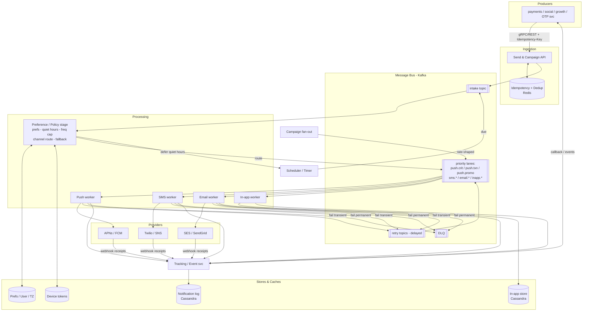
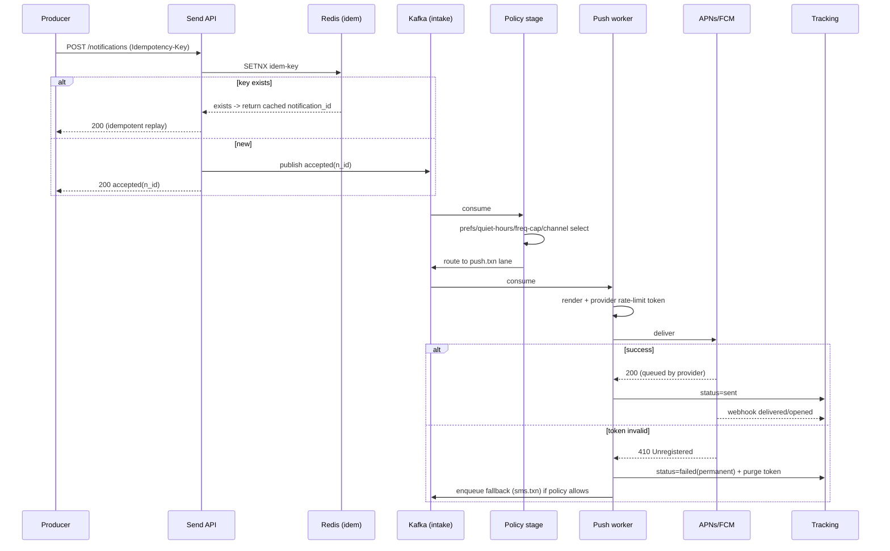

# Design a Notification System — High-Level Design (HLD)

> **Reader:** senior backend engineer (Java/JVM, distributed systems) practising HLD.
> **Goal:** an interview-ready, staff-level design that teaches *design judgment* — clarifying questions, defended tradeoffs, and deep dives — for a multi-channel notification platform delivering **billions of messages per day**.

---

## 1. Problem & Clarifying Questions

### 1.1 Restating the problem

Design a **Notification System**: a platform-internal service that lets many *producer* services (a "like" service, a payments service, a marketing engine, an OTP service, …) emit *intent to notify a user*, and reliably turns that intent into a *delivered message* across one or more **channels** — mobile **push** (APNs for iOS, FCM for Android), **SMS**, **email**, and **in-app** (the bell icon / notification center).

The system is **not** the thing that *decides* to notify (that business logic lives in the producers). It is the thing that *renders, routes, throttles, deduplicates, delivers, retries, and tracks* notifications. Think of it as the postal service: senders hand off addressed letters; we guarantee delivery semantics, respect "do not disturb" signs, never deliver the same letter twice, and tell the sender whether it arrived.

A key piece of design judgment up front: **a notification system is a write-heavy, fan-out, integration-with-flaky-third-parties problem.** The hard parts are not "how do I store a row" — they are *idempotency across retries*, *rate limiting so we don't spam a user or get an IP banned by Gmail*, *backpressure when APNs is slow*, and *priority isolation so a 50M-recipient marketing blast does not delay a 2FA code*. The design below is organized to make those the centerpiece.

### 1.2 Clarifying questions I would ask the interviewer

I never jump to boxes-and-arrows. These are the questions, grouped, with *why each matters to the design*.

**Functional scope**

1. **Which channels?** Push (APNs/FCM), SMS, email, in-app, plus WebPush/desktop? Voice? WhatsApp/RCS? — *Each channel is a different provider integration with different rate limits, payload limits, and delivery semantics. This sets the number of "sender" adapters.*
2. **Who are the producers?** A handful of internal services via SDK/RPC, or thousands of teams self-serving via an API? — *Self-serve means strong multi-tenancy, quotas, and templating-as-a-product; a fixed set of internal callers is simpler.*
3. **Transactional vs. promotional?** Do we handle OTP/2FA, password resets, order updates (transactional, high-priority, must-deliver) *and* marketing campaigns (bulk, low-priority, suppressible)? — *This is the single biggest design driver. It forces priority lanes, separate rate-limit policies, and unsubscribe/consent management.*
4. **Templating?** Does the system own message templates + localization, or do producers send fully-rendered content? — *Owning templates centralizes localization/branding and lets non-engineers edit copy, but adds a rendering subsystem and template versioning.*
5. **User preferences & quiet hours?** Must we honor per-user, per-channel, per-category opt-outs and time-zone-aware quiet hours? — *Yes for a real product; this is a deep dive.*
6. **Scheduling?** Send-now only, or "send at 9am local time", recurring digests, and large pre-scheduled campaigns? — *Scheduling adds a timer/scheduler subsystem and a "due" sweep.*
7. **Delivery tracking & receipts?** Do we need delivered/opened/clicked analytics fed back to producers? — *Adds an event ingestion + analytics path and webhook/callback handling from providers.*

**Non-functional**

8. **Scale?** Notifications/day total, peak-to-average ratio, per-channel split, number of users, devices per user. — *Drives all capacity math.*
9. **Latency SLOs by class?** What's the budget for an OTP (must feel instant) vs. a marketing push (minutes is fine)? — *Defines lane SLOs.*
10. **Delivery guarantee?** At-least-once (with dedup) is industry standard; is exactly-once required anywhere? Is best-effort acceptable for promo? — *At-least-once + idempotent dedup is the pragmatic answer.*
11. **Ordering?** Must notifications to a single user be ordered? — *Usually "mostly, best-effort"; strict ordering is expensive and rarely required.*
12. **Availability target?** 99.9% / 99.99%? — *Affects redundancy and multi-region.*
13. **Compliance?** GDPR/CCPA (right to erasure, consent), TCPA (SMS consent, quiet-hours law), CAN-SPAM (unsubscribe within 10 days). — *Legal constraints become hard functional requirements.*

**Out of scope (confirm with interviewer)**

- The *decision* to notify (producer business logic).
- The mobile client SDK internals and the OS-level display.
- Long-term data-warehouse analytics (we emit events; BI consumes them).
- Building our own SMS/email infra — we integrate Twilio/SNS/SES/SendGrid etc.

### 1.3 Assumptions I'll proceed with

Stated so the interviewer can redirect:

- **Channels:** Push (APNs + FCM), SMS, Email, In-app. (WebPush/WhatsApp are "extensions".)
- **Producers:** internal services via a gRPC SDK + a public REST API for partner teams; multi-tenant-ish with per-tenant quotas.
- **Both transactional and promotional** traffic. **Priority lanes** are required.
- **System owns templates + localization**; producers may also pass pre-rendered content.
- **User preferences + time-zone-aware quiet hours** are required.
- **Scheduling**: send-now, send-at, and large campaign fan-out.
- **Delivery tracking** required, with provider webhooks feeding status.
- **Guarantee:** at-least-once with **idempotent dedup** (effectively once per logical notification).
- **Availability:** 99.95% for the ingestion/transactional path; the system is **active-active multi-region**.

---

## 2. Requirements (Finalized)

### 2.1 Functional

- **F1 — Send API.** Accept a notification request: `{recipient(s), channel(s) (or "let system choose"), template_id or rendered_content, data/variables, category, priority, dedup_key, idempotency_key, schedule}`.
- **F2 — Multi-channel delivery.** Render and deliver to push/SMS/email/in-app via the right provider, with fallbacks (e.g., push fails → SMS).
- **F3 — Templating & localization.** Store versioned templates; render with variables; choose locale by user profile; sanitize/escape.
- **F4 — Fan-out.** A single logical request may target one user, a list, a topic/segment ("all users in IN who opted into deals"), or a campaign of tens of millions.
- **F5 — User preferences.** Per-user, per-channel, per-category opt-in/out; global mute; **quiet hours** (time-zone aware); frequency caps ("max 3 promos/day").
- **F6 — Deduplication & idempotency.** Same `idempotency_key` ⇒ processed once. Same `dedup_key` within a window ⇒ collapsed (e.g., "5 people liked your post" not 5 pushes).
- **F7 — Rate limiting / throttling.** Per-user (don't spam), per-tenant (quota), per-provider (respect APNs/Gmail limits & avoid IP reputation damage).
- **F8 — Retries + DLQ.** Transient failures retried with backoff; permanent failures (invalid token, hard bounce) dead-lettered and trigger token/address cleanup.
- **F9 — Priority lanes.** Critical (OTP/2FA, security) > Transactional (order shipped) > Promotional (marketing). Higher lanes are isolated from bulk lanes.
- **F10 — Delivery tracking.** Track per-notification state (queued → sent → delivered → opened/clicked → failed); ingest provider webhooks; expose status query + emit events to producers.
- **F11 — Scheduling.** Send-now, send-at-time, send-at-9am-local; cancel scheduled.
- **F12 — In-app center.** Persist in-app notifications; read/unread; pagination; badge counts.

### 2.2 Non-functional

| Property | Target | Notes |
|---|---|---|
| **Latency (Critical/OTP)** | p99 enqueue→provider handoff < **1–2 s** | The OTP must feel instant; the human is staring at a login screen. |
| **Latency (Transactional)** | p99 < **5–10 s** | |
| **Latency (Promotional)** | minutes acceptable | Throughput, not latency, is the goal. |
| **Availability (ingest + transactional)** | **99.95%** | Active-active multi-region. |
| **Durability** | No accepted notification lost | Once we 200 the producer, it survives crashes (WAL/queue persistence). |
| **Delivery semantics** | **At-least-once + idempotent dedup** | Exactly-once is impossible end-to-end (providers can deliver and lose the ack); we make *our processing* idempotent and dedup at the edge. |
| **Ordering** | Best-effort per user | Strict per-user ordering only where cheaply available (single partition). |
| **Throughput** | **Billions/day**, peak ≈ 5× average | See capacity math. |
| **Consistency** | Preferences: read-your-writes for the user editing them; eventual for the delivery path's view of prefs (bounded staleness, seconds). | A just-set "mute" should take effect quickly but a few seconds of lag is acceptable. |

### 2.3 Explicit assumptions

- **2 billion notifications/day** total (≈ a large consumer platform).
- **Channel split:** Push 70% (1.4B), In-app 20% (0.4B), Email 7% (140M), SMS 3% (60M). SMS is small but expensive/regulated.
- **500M MAU**, avg **1.5 push tokens/user** (multiple devices).
- **Peak/average = 5×** (e.g., 9am local, flash sale, breaking news).
- **Payload sizes:** push ≈ 1 KB, in-app row ≈ 1 KB, email ≈ 30 KB rendered, SMS ≈ 200 B.

---

## 3. Capacity Estimation (show the arithmetic)

### 3.1 QPS (writes — the dominant load)

- Total/day = 2,000,000,000.
- Seconds/day = 86,400.
- **Average write QPS** = 2e9 / 86,400 ≈ **23,150/s** → call it **~23K notifications/s average**.
- **Peak QPS** = 5 × 23K ≈ **115K notifications/s**.

Per channel at peak (using the split):

| Channel | Share | Peak QPS |
|---|---:|---:|
| Push | 70% | ~80K/s |
| In-app | 20% | ~23K/s |
| Email | 7% | ~8K/s |
| SMS | 3% | ~3.5K/s |

**Fan-out amplification.** A *campaign* request is 1 API call but N deliveries. A "breaking news to 50M users" event in 60 s = 50e6/60 ≈ **833K deliveries/s** for that minute — far above the 115K steady peak. **Design implication:** campaign fan-out must be *decoupled and rate-shaped*, not delivered synchronously. We smear it over minutes and isolate it from transactional lanes.

### 3.2 Reads

- **In-app center reads** dominate reads: 500M MAU, suppose each opens the bell ~5×/day → 2.5e9 reads/day ≈ **29K/s average, ~145K/s peak**. Cacheable, served from a read-optimized store.
- **Preference reads on the delivery path:** every delivery checks prefs/quiet-hours. At 115K deliveries/s peak that's **115K pref-lookups/s** — must be cache-served (see §7.4).
- **Status queries** from producers: modest; mostly we *push* events to them.

### 3.3 Storage

**Notification log (status + audit), 30-day hot retention:**
- 2e9/day × 30 = **6e10 rows**.
- Row ≈ 500 B (ids, status, timestamps, channel, provider, error). → 6e10 × 500 B = **30 TB** hot. With replication (3×) ≈ **90 TB**.
- Cold/archive (1 year, S3, compressed ~150 B/row): 2e9 × 365 × 150 B ≈ **110 TB/yr** in object storage. Cheap.

**In-app notifications (kept ~90 days, served to users):**
- 0.4e9/day × 90 = 3.6e10 rows × 1 KB = **36 TB** × 3 replicas ≈ **108 TB**.

**User preferences:** 500M users × ~2 KB (per-channel/category flags, quiet-hour windows, tz, frequency counters) = **~1 TB**, fully cacheable; the working set (active users) fits in a Redis tier.

**Device tokens:** 500M × 1.5 × ~300 B = **~225 GB**. Fits comfortably in memory across a small cluster.

**Templates:** thousands of templates × few KB × versions = **low GBs**. Trivial.

### 3.4 Bandwidth

- **Push egress:** 80K/s × 1 KB ≈ **80 MB/s** to APNs/FCM at peak. Modest.
- **Email egress:** 8K/s × 30 KB ≈ **240 MB/s** at peak. The big one; we hand bytes to SES/SendGrid which absorb it.
- **In-app:** writes ~23K/s × 1 KB ≈ 23 MB/s; reads 145K/s × 1 KB ≈ **145 MB/s** (cache-served).

None of these are scary individually; the system is **request-rate-bound and provider-rate-bound**, not bandwidth-bound (except email, which providers absorb).

### 3.5 Memory & server/shard counts (rough sizing)

- **Ingestion/API tier:** a well-tuned JVM service handles ~5–10K req/s with low CPU (it just validates + enqueues). For 115K peak with headroom: ~20–30 instances behind LBs per region, 3 regions ⇒ ~60–90 instances. Cheap, stateless, autoscaled.
- **Worker tier (channel senders):** delivery is I/O-bound (waiting on providers), so we run many lightweight async workers. Rule of thumb: a worker holding 1K in-flight async calls each ~200 ms ⇒ ~5K deliveries/s/worker. For 115K peak ⇒ ~25 workers, but we over-provision per lane and per channel (e.g., separate worker pools), so ~80–120 worker instances/region with autoscaling on queue depth.
- **Kafka (message bus):** 2e9 msgs/day; with replication and multiple topics/partitions, target ~hundreds of partitions per major topic to allow parallel consumers. A ~10–20 broker cluster/region handles this with room.
- **Redis (prefs/dedup/rate-limit/tokens):** working set a few hundred GB ⇒ a sharded cluster of ~10–20 nodes/region.
- **Notification log store (Cassandra/DynamoDB-style):** 30 TB hot × 3 ⇒ tens of nodes; partition by `notification_id` / `user_id`.

> **Takeaway numbers to remember:** ~**23K/s avg, ~115K/s peak**, **2B/day**, **30 TB hot log**, **80 MB/s push / 240 MB/s email egress**, peak campaign bursts to **~800K/s** that must be rate-shaped.

---

## 4. API Design

Two surfaces: a **gRPC SDK** for internal high-throughput producers and a **REST API** for partners. Shapes shown as REST/JSON for readability; gRPC mirrors them.

### 4.1 Send (single / small batch)

```
POST /v1/notifications
Idempotency-Key: <uuid>            # header; client-generated, required
{
  "tenant": "payments-svc",
  "recipients": [{ "user_id": "u_123" }],     # or device_token / email / phone for raw sends
  "category": "security.otp",                  # maps to consent + priority policy
  "priority": "critical",                       # critical | transactional | promotional (server may clamp)
  "channels": ["auto"],                         # auto = system chooses per prefs+fallback; or explicit list
  "template": { "id": "otp_v3", "locale": "auto", "vars": { "code": "481920", "ttl": "5m" } },
  "dedup_key": "otp:u_123",                     # optional; collapse duplicates within a window
  "dedup_window_s": 60,
  "ttl_s": 300,                                 # drop if not delivered within TTL (OTP is useless late)
  "schedule": null,                             # or { "send_at": "...", "tz": "user_local" }
  "callback_url": "https://payments/notif-events"  # optional webhook for status
}

200 OK
{ "notification_id": "n_abc", "status": "accepted", "dedup": "new" }   # or "dedup":"collapsed"
```

**Design notes:**
- **`Idempotency-Key` is mandatory.** It is the contract that lets producers safely retry on timeout without double-sending (§7.3).
- **`priority` may be clamped server-side** by category policy — a marketing tenant can't self-promote to `critical`.
- **`ttl_s`** lets time-sensitive messages (OTP) be dropped rather than delivered uselessly late.
- **`channels:["auto"]`** delegates channel selection + fallback to the system using prefs.

### 4.2 Campaign / segment send (large fan-out)

```
POST /v1/campaigns
{
  "tenant": "growth",
  "audience": { "segment_id": "seg_deals_IN" },   # or "user_ids":[...], or "topic":"news.breaking"
  "template": { "id": "flash_sale_v2", "locale": "auto", "vars": {...} },
  "channels": ["push"],
  "priority": "promotional",
  "schedule": { "send_at": "2026-06-25T09:00", "tz": "user_local" },
  "rate_shape": { "max_per_minute": 2000000 },     # smear the blast
  "respect_frequency_cap": true
}
202 Accepted
{ "campaign_id": "c_789", "status": "scheduled", "estimated_recipients": 48000000 }
```

Returns **202** (accepted, async). Fan-out happens in the background (§7.2).

### 4.3 Preferences

```
GET  /v1/users/{user_id}/preferences
PUT  /v1/users/{user_id}/preferences
{
  "channels": { "push": true, "email": true, "sms": false },
  "categories": { "marketing.deals": false, "social.likes": "digest" },
  "quiet_hours": { "start": "22:00", "end": "07:00", "tz": "Asia/Kolkata" },
  "frequency_caps": { "promotional": { "per_day": 3 } }
}
```

### 4.4 Device token registration

```
POST /v1/users/{user_id}/devices
{ "platform": "ios", "token": "<apns-token>", "app_version": "...", "locale": "en-IN" }
DELETE /v1/users/{user_id}/devices/{token}     # logout / invalidation
```

### 4.5 In-app center

```
GET /v1/users/{user_id}/inbox?cursor=...&limit=20   # paginated, newest-first
POST /v1/users/{user_id}/inbox/{id}/read
GET /v1/users/{user_id}/inbox/unread-count          # badge; cached
```

### 4.6 Status & provider webhooks

```
GET /v1/notifications/{notification_id}             # current status + per-channel attempts
POST /internal/webhooks/{provider}                  # inbound delivery receipts from SES/Twilio/FCM/APNs feedback
```

---

## 5. High-Level Architecture

### 5.1 The flow in words

A producer calls **Send API** with an idempotency key. The API **validates, authenticates the tenant, applies idempotency** (dedupe-on-ingest), assigns a `notification_id`, persists an "accepted" record, and **publishes to an intake topic** on the message bus — then immediately returns 200. *Nothing slow happens on the request path.*

A **Preference/Policy stage** (consumer) enriches each message: looks up the user, applies preferences/quiet-hours/frequency caps, resolves channels (and fallback order), and either *drops/suppresses*, *defers* (quiet hours → schedule for later), or *routes* the message into **per-channel, per-priority queues** (the priority lanes).

**Channel workers** (push/SMS/email/in-app) consume their lanes, **render the template** (or use pre-rendered content), apply **provider-level rate limiting**, call the **provider adapter**, and record the result. Failures go to **retry queues** (delayed) and ultimately a **DLQ**. Successes await **provider webhooks** that update final delivery status. A **tracking/event service** writes status to the **notification log** and pushes events back to producers and analytics.

**Campaigns** take a different ingress: a **fan-out service** expands a segment into millions of individual messages, *rate-shaped*, into the promotional lanes — keeping bulk traffic off the critical lanes entirely.

### 5.2 ASCII block diagram

```
                       ┌─────────────────────────────────────────────────────────┐
  Producers            │                  NOTIFICATION SYSTEM                      │
 (payments, social,    │                                                           │
  growth, OTP svc)     │                                                           │
        │              │   ┌──────────┐   idempotency   ┌──────────────┐          │
        │  gRPC/REST   │   │  Send /  │   + validate     │  Idempotency │          │
        ├──────────────┼──▶│ Campaign │◀────────────────▶│  + Dedup     │          │
        │              │   │   API    │                  │  (Redis)     │          │
        │              │   └────┬─────┘                  └──────────────┘          │
        │              │        │ publish "accepted"                               │
        │              │        ▼                                                  │
        │              │   ┌─────────────────  KAFKA: intake topic ─────────────┐  │
        │              │   └──────────────────────────┬──────────────────────────┘ │
        │              │                               ▼                            │
        │              │              ┌────────────────────────────┐               │
        │              │              │  Preference / Policy stage  │◀── Prefs cache (Redis)
        │              │              │  prefs · quiet hours ·      │◀── User/TZ store
        │              │              │  freq caps · channel route  │◀── Tokens store
        │              │              │  · fallback · suppress/defer│               │
        │              │              └─────┬───────────┬──────────┬┘               │
        │              │   PRIORITY LANES   ▼           ▼          ▼  (per channel × priority)
        │              │   ┌─────────────────────────────────────────────────────┐ │
        │              │   │ push.critical | push.txn | push.promo | sms.* | ...  │ │  (Kafka topics/partitions)
        │              │   └───┬──────────────┬──────────────┬──────────┬─────────┘ │
        │              │       ▼              ▼              ▼          ▼           │
        │              │  ┌─────────┐   ┌─────────┐   ┌─────────┐  ┌─────────┐      │
        │              │  │ Push     │   │ SMS      │   │ Email    │  │ In-app  │     │
        │              │  │ worker   │   │ worker   │   │ worker   │  │ worker  │     │
        │              │  │ +render  │   │ +render  │   │ +render  │  │ +render │     │
        │              │  │ +RL      │   │ +RL      │   │ +RL      │  │         │     │
        │              │  └────┬─────┘   └────┬─────┘   └────┬─────┘  └────┬────┘     │
        │              │       ▼              ▼              ▼            ▼          │
        │              │  ┌──────────────── Provider Adapters ────────────────┐     │
        │              │  │ APNs · FCM │ Twilio/SNS │ SES/SendGrid │ in-app DB │     │
        │              │  └────┬───────────┬─────────────┬────────────┬───────┘     │
        │              │       │           │             │            │             │
        │  webhooks ───┼───────┴───────────┴─────────────┴──┐         ▼             │
        │  (receipts)  │                                     ▼   ┌──────────────┐   │
        │              │                          ┌────────────┐ │ In-app store │   │
        │              │   ┌──────────┐  events   │ Tracking / │ │ (Cassandra)  │   │
        │◀─────────────┼───│ Producer │◀──────────│ Event svc  │ └──────────────┘   │
        │  status      │   │ callbacks│           └─────┬──────┘                    │
        │              │   └──────────┘                 ▼                           │
        │              │     RETRY (delay) + DLQ   ┌──────────────┐  ┌────────────┐ │
        │              │   ◀──────────────────────▶│ Notif log    │  │ Analytics  │ │
        │              │                           │ (Cassandra)  │  │ (warehouse)│ │
        │              │                           └──────────────┘  └────────────┘ │
        │              └─────────────────────────────────────────────────────────┘
        │
   ┌────┴─────┐   Scheduler / Timer service ──▶ enqueues "due" (send_at, quiet-hour deferrals) into intake
   │ Campaign │   Fan-out service ──▶ expands segment → rate-shaped → promo lanes
   └──────────┘
```

### 5.3 Mermaid diagram



### 5.4 Sequence — single transactional push (happy path + fallback)



---

## 6. Data Model & Storage Choices

### 6.1 Entities

**Notification (the logical request)**
```
notification_id (PK)   tenant   category   priority   idempotency_key
recipient_ref          channels_requested   template_id   locale
dedup_key   ttl_s   schedule   created_at   final_status
```

**Delivery attempt (per channel × try)**
```
notification_id   channel   attempt_no   provider   provider_msg_id
status (queued|sent|delivered|opened|clicked|failed|bounced|suppressed)
error_code   error_class (transient|permanent)   ts
```

**User preferences**
```
user_id (PK)   tz   channel_optin{push,email,sms,inapp}
category_prefs{category -> on|off|digest}
quiet_hours{start,end,tz}   frequency_caps{class -> {per_day, ...}}   updated_at
```

**Device token**
```
user_id   platform   token (PK)   app_version   locale   last_seen   valid
```

**Template**
```
template_id   version   channel   locale   subject   body (handlebars)
required_vars   created_by   status(active|draft)
```

**In-app notification**
```
user_id (partition)   created_at (clustering, desc)   notif_id
title   body   deeplink   read(bool)   category
```

### 6.2 Datastore choices (justified against access patterns)

| Data | Store | Why (access pattern + failure mode avoided) |
|---|---|---|
| **Intake & lane messages** | **Kafka** (log) | Durable, ordered-per-partition, high-throughput, replayable. Decouples ingest from delivery → producers aren't blocked by slow providers. Partitioning gives parallelism + per-key ordering. *Avoids:* request-path coupling to flaky third parties; lost work on crash. |
| **Idempotency / dedup / rate-limit counters / quiet-hour locks** | **Redis** (cluster) | Need sub-ms `SETNX`, TTL keys, atomic counters, sliding windows (Lua). Ephemeral-ish (backed by the log of truth). *Avoids:* DB hot-row contention on the request path; double-send. |
| **Notification log + delivery attempts** | **Cassandra / DynamoDB** (wide-column) | Write-heavy (every attempt is a write), time-series-ish, keyed by `notification_id`/`user_id`, no cross-row transactions needed, needs horizontal scale + multi-region replication + tunable consistency. *Avoids:* a single SQL master becoming the write bottleneck at 100K+ writes/s. |
| **In-app inbox** | **Cassandra** (partition=`user_id`, cluster by time) | "Newest-N for a user" = a partition scan with a cursor — exactly Cassandra's sweet spot. High write rate, simple reads, per-user isolation. *Avoids:* index bloat / N+1 from a relational design at 36 TB. |
| **User preferences + profile + tz** | **Relational (Postgres/MySQL) as source of truth + Redis cache** | Strongly-consistent edits (user toggles a setting → read-your-writes), modest write rate, relational shape (joins to user). Delivery path reads the *cache* (eventual, bounded staleness seconds). *Avoids:* hammering the SQL master with 115K reads/s — cache absorbs it. |
| **Device tokens** | **Redis + durable backing (Dynamo/Cassandra)** | Hot lookups on delivery; frequent invalidation. *Avoids:* slow token lookups on the delivery path. |
| **Templates** | **Object store / Git-backed config + cache** | Small, versioned, read-mostly, edited rarely. *Avoids:* over-engineering. |
| **Analytics / opens-clicks long-term** | **Object store (S3) + warehouse (BigQuery/Snowflake)** | Append-only event firehose, batch BI. *Avoids:* polluting the operational hot path. |

**Why not one big SQL database for everything?** At 100K+ writes/s with provider webhooks adding more writes, a single RDBMS master is the first thing to fall over (write throughput + hot rows + lock contention). We *do* keep SQL for the small, transactional, relational slice (preferences) where its guarantees pay off, and push the firehose to log/wide-column stores built for it. This split is the central storage tradeoff: **match each datastore to its access pattern rather than forcing one model everywhere.**

---

## 7. Deep Dives (the bulk)

The genuinely hard sub-problems: **(1) the queue-based pipeline + priority lanes + backpressure, (2) fan-out for massive campaigns, (3) idempotency + deduplication, (4) rate limiting/throttling at three layers, (5) retries + DLQ + provider failure handling.** Preferences/quiet-hours and templating are covered as focused subsections.

---

### 7.1 Deep dive — Queue-based pipeline, priority lanes & backpressure

**Problem.** A single OTP must reach the user in ~1 s while, simultaneously, a 50M-recipient marketing blast is in flight. If they share queues and workers, the blast's millions of messages sit *ahead* of the OTP and delay it by minutes — a catastrophic SLO miss for the thing that matters most. We need **isolation by priority** and **graceful behavior under overload (backpressure)**.

**Design.** A staged pipeline on Kafka with **separate topics per (channel × priority class)**:

```
push.critical   push.transactional   push.promotional
email.critical  email.transactional  email.promotional
sms.* ...        inapp.* ...
```

- **Dedicated worker pools per lane.** Critical lanes get guaranteed, reserved capacity (their own consumer group, their own instances). Promotional workers can be scaled up/down aggressively and *never* steal the critical pool's capacity.
- **Weighted consumption within a worker** (when one pool serves multiple lanes): poll critical first, then transactional, then promotional, with a starvation guard (e.g., always reserve ≥10% cycles for lower lanes so they don't stall forever).
- **Partitioning for ordering + parallelism.** Partition lanes by `user_id` (hash). This gives *per-user ordering* (same user's notifications land on one partition, consumed in order) and horizontal parallelism across partitions. Critical caveat: ordering is only *best-effort per user* because retries and fallbacks can reorder — and that's acceptable.

**Backpressure (the part juniors miss).** When APNs slows down (it does — Apple throttles), push workers' in-flight calls pile up. We must not (a) drop accepted work, nor (b) OOM. Mechanisms:

1. **Kafka *is* the buffer.** Workers pull at the rate they can deliver; unprocessed messages simply accumulate in the log (which is sized for hours of buffer). Lag rises but nothing is lost. Producers are *not* blocked because they're decoupled by the intake topic.
2. **Concurrency limiting per worker** (a bounded semaphore of in-flight provider calls) so a slow provider can't blow up heap.
3. **Adaptive consumption** — if a lane's consumer lag exceeds a threshold, autoscale that lane's workers (scale on *lag*, not CPU — CPU is low because it's I/O-bound).
4. **TTL-based shedding** — messages past `ttl_s` (a late OTP) are dropped at dequeue, freeing capacity for fresh work. *This is graceful load shedding: discard work that's already worthless.*
5. **Lane fairness under global overload** — if everything is saturated, shed *promotional* first (it's suppressible and re-sendable), protecting critical/transactional. Encode this as per-lane consumption budgets.

**Options considered**

| Approach | Pros | Cons | Verdict |
|---|---|---|---|
| **Single shared queue, priority field, sort at consumer** | Simple infra | Priority sort over a huge queue is impractical in Kafka (it's a log, not a priority queue); head-of-line blocking; one bad lane stalls all | ✗ Rejected — head-of-line blocking kills the OTP SLO |
| **Separate topic per priority, shared workers** | Isolation in storage; fewer pools | A flooded promo lane still competes for worker CPU/connections | ◐ OK for small scale |
| **Separate topics + dedicated worker pools per lane (chosen)** | True isolation; independent scaling; shed promo first | More topics/pools to operate | ✓ **Chosen** |
| **External priority-queue system (e.g., RabbitMQ priorities, SQS + multiple queues)** | Native priority semantics | Lower throughput ceiling than Kafka for billions/day; we still want the log for replay | ◐ Use SQS-style for lower-scale variants |

**Decision:** **separate (channel × priority) Kafka topics with dedicated, lag-autoscaled worker pools, TTL shedding, and promo-first load shedding.** This avoids the dominant failure mode — *head-of-line blocking where a marketing blast delays 2FA codes* — and degrades gracefully by shedding the least valuable traffic first.

---

### 7.2 Deep dive — Fan-out for massive campaigns

**Problem.** `POST /campaigns` with `segment_id = "all opted-in users in IN"` may resolve to **48M recipients**. We cannot (a) compute that synchronously on the request path, (b) dump 48M messages into a lane in one burst (would spike to ~800K/s and starve other traffic), or (c) lose the campaign halfway if a fan-out worker crashes.

**Design — staged, resumable, rate-shaped fan-out:**

1. **Accept fast (202).** Persist a `campaign` record (`status=scheduled`, audience spec, rate cap, template) and return immediately.
2. **Audience resolution** is a *batch* job: stream the segment from the user store / a precomputed segment table (segments are maintained by an upstream audience service; we read them in pages). For ad-hoc `user_ids`, page through the list.
3. **Chunking.** Split the audience into chunks (e.g., 10K user_ids each). Each chunk = one **fan-out task** written to a `campaign.fanout` work topic. The campaign's progress is tracked as `chunks_total / chunks_done` so a crash resumes from the last unacked chunk (Kafka offset = checkpoint).
4. **Per-chunk expansion** by fan-out workers: for each user → apply **frequency cap + suppression + preferences** *here* (cheap to do in bulk; avoids enqueuing messages that will just be dropped downstream), render-ready message → publish to the **promotional** lanes.
5. **Rate shaping.** A distributed **token bucket** (Redis) caps campaign emission to `max_per_minute`. Fan-out workers acquire tokens before publishing, smearing 48M over, say, 30 minutes (≈26K/s) instead of a 60-s spike. This keeps the blast inside steady capacity and off the critical lanes.
6. **Time-zone-aware "send at 9am local."** The scheduler buckets the audience by tz; each bucket is released when *its* local 9am arrives, so the global blast is naturally smeared across 24 one-hour waves around the world — a free additional rate-shaping benefit.

**Push topics vs. per-user fan-out (an important channel nuance).** For *truly* identical content to a huge audience (e.g., breaking news), **FCM/APNs topic messaging** lets you publish *one* message to a provider "topic" the devices subscribe to — the provider does the fan-out. This is dramatically cheaper but loses per-user personalization, per-user prefs enforcement, and per-user delivery tracking.

| Fan-out strategy | Pros | Cons | When |
|---|---|---|---|
| **Synchronous expand on request** | Simple | Times out; not resumable; bursty | ✗ Never at scale |
| **Per-user fan-out, rate-shaped (chosen default)** | Honors prefs/caps; personalization; per-user tracking | Most expensive (N provider calls) | ✓ Default for promo/personalized |
| **Provider topic messaging (FCM/APNs topics)** | One call → millions; cheap | No per-user prefs/personalization/tracking | ✓ For identical, consent-blanket broadcasts (news) |
| **Precomputed segments + chunked tasks** | Fast resolution; resumable | Segment freshness lag | ✓ Always pair with per-user fan-out |

**Decision:** **chunked, resumable, rate-shaped per-user fan-out** as the default, applying suppression/caps during expansion to avoid wasted downstream work; **offer provider topic messaging** as an opt-in for identical broadcasts. This avoids the failure modes of *request timeouts*, *non-resumable half-sent campaigns*, and *bursts starving transactional traffic*.

---

### 7.3 Deep dive — Idempotency & deduplication

These are two distinct concerns that interviewers often conflate.

**(a) Idempotency** — *"the producer retried; don't double-send."* A producer times out on `POST /notifications` and retries. Without protection, two notifications go out.

- **Mechanism:** client supplies a unique `Idempotency-Key`. The API does an atomic `SETNX idem:{tenant}:{key} -> notification_id` in Redis with a TTL (e.g., 24 h). First writer wins and proceeds; a retry finds the key and returns the *same* `notification_id` with `status=accepted` (a replay), doing no new work. The key→result mapping is also persisted (so it survives Redis eviction) — Redis is the fast path, the log is the truth.
- **Edge case — crash between SETNX and enqueue.** If we set the key but crash before publishing to Kafka, a retry would see the key and *not* re-enqueue → lost notification. Fix: store the idempotency record with a state machine (`reserved → enqueued`); a retry that finds a `reserved` (not yet `enqueued`) record either waits or re-drives the enqueue (the enqueue itself carries the `notification_id`, so re-publishing is safe — see internal idempotency below). Alternatively use the **transactional outbox**: write the idempotency record *and* an outbox row in one DB transaction, then a relay publishes to Kafka — guaranteeing "accepted ⇒ will be enqueued."

**(b) Deduplication** — *"collapse semantically duplicate notifications."* Two flavors:
- **Producer-driven dedup_key:** "5 likes in 1 min → 1 push." Maintain a Redis key `dedup:{dedup_key}` with TTL = `dedup_window_s`; first occurrence creates the notification, later ones *increment a counter* and (optionally) update the message ("Alice and 4 others liked…") rather than emit anew. This is **aggregation/coalescing**, a deliberate product feature, not an error guard.
- **System-driven exactly-once-ish processing:** because delivery is at-least-once (Kafka may redeliver on consumer rebalance; retries replay), a worker might process the same `notification_id` twice. Guard with a **per-notification "already-sent" marker**: before calling the provider, `SETNX sent:{notification_id}:{channel}`; if present, skip. Combine with provider-side idempotency where available (some providers accept a client dedup id).

**Why we can't get true exactly-once delivery.** The provider can deliver the push *and then* the network drops the ack — we don't know if it landed, so we'd retry, risking a duplicate. End-to-end exactly-once across an external system is impossible; the honest design is **at-least-once + idempotent processing + best-effort dedup**, and we make the *user-visible* duplicate rate near-zero with the sent-marker.

| Concern | Key | TTL | Mechanism | Failure avoided |
|---|---|---|---|---|
| Producer retry | `idem:{tenant}:{key}` | 24 h | SETNX → return same id | Double-send on client retry |
| Coalesce duplicates | `dedup:{dedup_key}` | window | counter + collapse | Notification spam ("5 separate likes") |
| Reprocessing | `sent:{nid}:{channel}` | hours | SETNX before provider call | Duplicate from Kafka redelivery/retry |

**Decision:** **edge idempotency via Redis `SETNX` + persisted record (outbox for the accept→enqueue gap), product-level coalescing via `dedup_key`, and per-channel sent-markers to suppress reprocessing duplicates.** This avoids both *double-sends on retry* and *notification-center spam*, while being honest that exactly-once delivery is unattainable and dedup is the right tool.

---

### 7.4 Deep dive — Rate limiting / throttling (three layers) + preferences & quiet hours

Rate limiting here is *not one thing* — it operates at three layers, each protecting against a different failure.

**Layer 1 — Per-user throttling (protect the human).** Cap how many notifications a user receives (e.g., ≤ N promos/day, ≤ 1 push/minute for a category). Implement with a **sliding-window or token-bucket counter in Redis** keyed `rl:{user_id}:{class}`, evaluated in the **Policy stage** (and again in campaign expansion). Over-limit promos are *dropped/suppressed* (logged as `suppressed`), not retried. *Avoids:* annoying users into uninstalling / unsubscribing — the real business cost.

**Layer 2 — Per-tenant quotas (protect the platform & fairness).** Each producer/tenant has a quota (req/s and req/day). Enforced at the API with a distributed token bucket `rl:tenant:{id}`. Over-quota ⇒ `429` with `Retry-After`. *Avoids:* one buggy/abusive producer monopolizing the pipeline.

**Layer 3 — Per-provider throttling (protect deliverability & reputation).** This is the subtle, senior one. Providers impose limits and *punish* violations:
- **APNs/FCM** throttle aggressively and may return 429/`TooManyRequests`; you must respect their pacing.
- **Email (SES/Gmail/etc.)** is reputation-based: sending too fast from an IP, or sending to spam traps / bouncing addresses, **damages IP/domain reputation**, which silently routes future mail to spam — a slow, hard-to-detect catastrophe. So email needs **warm-up ramps**, **bounce/complaint handling that purges addresses**, and **per-IP/per-domain send-rate caps**.
- **SMS** has carrier limits and per-number throughput caps; long codes vs. short codes differ.

Implement provider rate limits with a **distributed token bucket per (provider, route, region)** in Redis; workers acquire a token before each provider call and *back off on 429* (honoring `Retry-After`). *Avoids:* getting throttled or, worse, **IP/domain reputation damage that sends all your email to spam.**

**Preferences & quiet hours (a focused sub-deep-dive).** Evaluated in the Policy stage against the (cached) preference record:
- **Channel/category opt-out:** if the user disabled `marketing.deals`, suppress. **Critical/transactional categories (OTP, security, legal) are *not* suppressible** — they bypass promotional preferences (you can't opt out of your own 2FA code). This category→suppressibility policy is central and must be encoded server-side.
- **Quiet hours (time-zone aware):** if "now" in the user's tz falls in `[start,end]`, do **not** deliver promotional/transactional pushes; **defer** them — schedule for `end`-of-quiet-hours via the scheduler — rather than drop. Critical messages ignore quiet hours. *Subtlety:* tz must come from the user profile, and DST must be handled by using a real tz library (`Asia/Kolkata`, not a fixed offset). *Avoids:* 3am marketing pushes (and TCPA legal violations for SMS, which legally restrict calling hours).
- **Frequency caps:** the Layer-1 counter, scoped by class.
- **Digest mode:** if a category is set to `digest`, the message is *aggregated* into a periodic summary (the scheduler emits the digest) instead of immediate delivery — reduces volume and respects user intent.

**Consistency note for preferences on the hot path.** The delivery path reads prefs from **cache** (eventual, bounded staleness ~seconds via cache TTL + write-through invalidation on `PUT /preferences`). A user who just hit "mute" might receive one in-flight message; acceptable. But **opt-outs and unsubscribes for compliance are treated as strong**: unsubscribe writes go to the SoT *and* invalidate the cache synchronously, and the suppression list is also checked at send time, so we don't email someone who legally unsubscribed. *This is the read-your-writes-where-it-legally-matters tradeoff.*

| Limit layer | Key | Action on breach | Failure mode avoided |
|---|---|---|---|
| Per-user | `rl:{user}:{class}` | suppress (promo) / defer | User annoyance, churn |
| Per-tenant | `rl:tenant:{id}` | 429 + Retry-After | Noisy-neighbor monopolization |
| Per-provider | `rl:prov:{prov}:{region}` | back off, honor Retry-After | Provider throttling + email reputation damage |

**Decision:** **three independent rate-limit layers (user, tenant, provider) plus preference/quiet-hour/frequency/digest evaluation in the Policy stage**, with **non-suppressible critical categories**, **defer-not-drop for quiet hours**, and **strong consistency for compliance opt-outs**. This avoids the trio of failures — *spamming users*, *one tenant starving others*, and *reputation/throttling damage from providers* — while staying legally compliant.

---

### 7.5 Deep dive — Retries, DLQ & provider failure handling

**Problem.** Providers fail in two fundamentally different ways, and treating them the same is a bug:
- **Transient:** timeout, 5xx, 429, connection reset, provider brief outage. → **retry**.
- **Permanent:** invalid/expired device token (APNs `410 Unregistered`, FCM `NotRegistered`), hard email bounce (mailbox doesn't exist), invalid phone number, content rejected. → **do not retry**; instead **clean up** (purge the dead token/address) and dead-letter.

**Error classification is the crux.** Each provider adapter maps provider responses to `{transient | permanent | success-async}` (the last because most providers accept then deliver asynchronously, confirming via webhook). A misclassification is costly: retrying a permanent error wastes capacity and can worsen reputation (repeatedly mailing a bounced address is a spam signal).

**Retry mechanism — delayed, bounded, jittered:**
- **Exponential backoff with jitter** (e.g., 1s, 4s, 16s, 60s, … capped) to avoid retry storms synchronizing ("thundering herd"). *Jitter* = randomizing each delay so retries spread out.
- **Bounded attempts** (e.g., 5) and **respect `ttl_s`** — never retry past the message's usefulness (a 6-minute-late OTP is dropped, not retried).
- **Implementation:** Kafka doesn't natively delay messages, so use **delay topics / a retry topic per backoff tier** (publish to `retry-60s`, a consumer that sleeps/holds until due then republishes to the lane) — or a dedicated scheduler with a "due" sweep. (At lower scale, SQS visibility timeouts or RabbitMQ delayed exchanges do this natively.)
- **Circuit breaker per provider/region.** If a provider's error rate spikes (it's down), *open the breaker*: stop hammering it, fast-fail/park messages, and **fail over** to a secondary provider or region if configured. Half-open probes test recovery. *Avoids:* wasting all worker capacity hammering a dead provider and amplifying the outage.

**DLQ (dead-letter queue).** After max retries or on permanent error, the message goes to a **per-channel DLQ** with full context (last error, attempts). DLQ handling:
- **Permanent token/address errors trigger cleanup** (purge token, add email to suppression list).
- **Operational alerting** on DLQ growth (a spike usually means a provider/integration is broken).
- **Manual or automated replay** once the root cause is fixed (replay from DLQ → lane).
- **Fallback channel** is attempted *before* DLQ when policy allows: push failed permanently → try SMS/email (`channels:["auto"]` defines fallback order). Fallback is itself rate-limited and respects prefs.

**Webhooks (async delivery confirmation).** Providers confirm final delivery/open/click via webhooks to `/internal/webhooks/{provider}`. These must be: **authenticated** (verify provider signature), **idempotent** (a provider may re-deliver a webhook — dedupe on `provider_msg_id`), and **decoupled** (enqueue inbound webhooks to a topic; a consumer updates the notification log). Bounce/complaint webhooks feed the suppression list and token cleanup. *Avoids:* trusting unverified callbacks, and double-counting opens.

| Failure | Class | Action |
|---|---|---|
| Timeout / 5xx / conn reset | Transient | Backoff retry (bounded, jittered) |
| 429 TooManyRequests | Transient | Back off honoring Retry-After; throttle the lane |
| 410 Unregistered / NotRegistered | Permanent | Purge token; fallback channel; DLQ |
| Hard bounce / invalid mailbox | Permanent | Suppress address; DLQ |
| Content/policy rejection | Permanent | DLQ + alert (likely a template bug) |
| Provider down (error spike) | Transient (systemic) | Circuit breaker + failover provider/region |

**Decision:** **per-provider error classification → bounded jittered backoff via delay topics for transient, immediate cleanup + DLQ for permanent, circuit breakers with provider/region failover, fallback channels before DLQ, and authenticated idempotent webhook ingestion.** This avoids *retry storms*, *hammering dead providers*, *repeatedly mailing dead addresses (reputation harm)*, and *lost delivery-status signal*.

---

### 7.6 Templating & localization (focused)

- **Versioned templates** (Handlebars-style) per `channel × locale`, with `required_vars` for validation. Producers reference `template_id` + `vars`; the worker fetches the *active* version, selects locale from the user profile (fallback chain `en-IN → en → default`), renders, and **escapes/sanitizes** to prevent injection (a `{{name}}` that's `"<script>"` must not break an HTML email or in-app render).
- **Rendering is done in the channel worker, not the API** — keeps the request path thin and lets rendering scale with delivery.
- **Template changes are config, not deploys** (edited via a console, reviewed, versioned), so non-engineers can update copy; pinning to a version avoids a bad edit blasting millions.
- **Per-channel payload constraints** (push ≤ ~4 KB, SMS segments at 160 chars, email size) are validated at render time; over-limit content is truncated/split per channel rules.

---

## 8. Scaling & Bottlenecks

**How it scales.** Every tier is horizontally scalable and stateless except the data tier:
- **API tier:** stateless behind LBs; autoscale on req/s. Add regions for geo + availability (active-active).
- **Kafka:** add partitions/brokers; partition count sets max consumer parallelism — provision generously (re-partitioning later is painful, so over-provision partitions up front).
- **Workers:** autoscale **on consumer lag per lane**, not CPU (delivery is I/O-bound). Each lane scales independently.
- **Stores:** Cassandra/Dynamo scale by adding nodes; Redis by sharding; SQL (prefs) is small and cache-fronted.

**Where it breaks first (and the fix):**

| Bottleneck | Symptom | Fix |
|---|---|---|
| **Provider throughput / throttling** (the real ceiling) | 429s, rising lag, opens breaker | Per-provider token buckets, multiple sender IPs/apps, secondary providers, email IP warm-up; pacing |
| **Redis hot keys** (idem/dedup/rate-limit) | A viral `dedup_key` or popular tenant hammers one shard | Shard by key; for hot counters use sharded counters / local pre-aggregation; client-side rate-limit hints |
| **Campaign bursts** | 800K/s spike starves lanes | Rate-shaping token bucket + tz-bucketed release + dedicated promo lanes/pools (already designed in) |
| **Notification-log write volume** | Cassandra write pressure from every attempt + webhook | Batch/async writes; coarsen status granularity for promo; TTL old rows; tiered storage to S3 |
| **In-app inbox fan-out reads** | Bell-icon read QPS spikes | Cache unread counts + first page in Redis; precompute badge counts |
| **Preference lookups on hot path** | 115K/s to SQL would melt it | Cache-served prefs (already designed); negative caching |
| **Kafka rebalance storms** | Worker churn during autoscale causes redeliveries | Static membership / cooperative rebalancing; idempotent processing absorbs the duplicates |
| **Scheduler "due" sweep hot spot** | Many messages due at exactly 9:00 local | Bucket + jitter the release within the minute; shard the timer by tz/hash |

**The honest one-liner:** *the notification system's true scaling limit is almost never our own compute — it's the downstream providers' rate limits and (for email) sender reputation.* Most of the engineering is about pacing into them gracefully and degrading the right traffic first.

---

## 9. Reliability, Consistency & Security

**Reliability / failure handling**
- **Durability of accepted work:** once we 200 the producer, the notification is in Kafka (replicated, acks=all) and/or the outbox — it survives broker/worker crashes and is replayable.
- **At-least-once everywhere** + idempotent processing (§7.3) → crashes cause re-processing, not loss, with near-zero user-visible duplicates.
- **Multi-region active-active:** producers route to the nearest healthy region; Kafka and stores replicate cross-region. On regional failure, traffic shifts; in-flight work in the dead region is reprocessed after recovery (idempotency makes this safe).
- **Circuit breakers + provider/region failover** isolate provider outages (§7.5).
- **Graceful degradation:** under global overload, shed promotional first, then transactional, never critical; drop TTL-expired work.
- **DLQ + alerting + replay** for the long tail.

**Consistency model**
- **Delivery path:** eventual/at-least-once; ordering best-effort per user (single partition).
- **Preferences:** read-your-writes for the editing user (SoT = SQL); delivery path reads cache (bounded staleness, seconds). **Compliance opt-outs/unsubscribes are strongly consistent** (sync invalidate + suppression-list check at send).
- **Idempotency/dedup:** strong (atomic Redis ops, backed by persisted records).
- **Status:** eventually consistent as webhooks arrive; `delivered`/`opened` lag the actual event.

**Idempotency** — covered in §7.3: mandatory `Idempotency-Key`, sent-markers, idempotent webhook ingestion, outbox for the accept→enqueue gap.

**Security & abuse**
- **AuthN/Z:** producers authenticate (mTLS/service tokens for internal, API keys/OAuth for partners); per-tenant scopes restrict which categories/priorities a tenant may use (a marketing tenant can't send `critical`).
- **PII handling:** notification content + phone/email are PII. Encrypt at rest and in transit; minimize retention (TTL the hot log; redact PII in long-term analytics); honor **GDPR/CCPA right-to-erasure** (delete user prefs/tokens/inbox; tombstone log).
- **Consent & compliance:** maintain consent records (SMS/TCPA, email/CAN-SPAM); enforce **unsubscribe** (one-click, honored ≤ legal window) via the suppression list checked at send; quiet-hour laws for SMS.
- **Abuse / rate limiting:** per-tenant quotas (§7.4) prevent a compromised/abusive producer from blasting users; anomaly detection on tenant volume spikes; content scanning for phishing/spam in partner-submitted content.
- **Webhook security:** verify provider signatures; idempotent ingestion; the inbound webhook endpoint is itself rate-limited and authenticated.
- **Template injection:** sanitize/escape all variable interpolation (§7.6).
- **Audit:** every send and preference change is logged for traceability and compliance.

---

## 10. Extensions & Follow-ups

Realistic variations an interviewer adds, and how each changes the design:

1. **"Add WhatsApp / RCS / WebPush / voice."** New provider adapters + lanes; each has distinct rate limits, payload shapes, consent rules (WhatsApp requires pre-approved templates + opt-in). The pipeline is unchanged — that's the payoff of the adapter pattern.
2. **"Smart channel selection / send-time optimization (ML)."** Replace the static fallback order with an ML model predicting the channel/time most likely to get engagement per user. Adds a model-serving step in the Policy stage; needs the engagement events (opens/clicks) we already collect as training data.
3. **"Notification grouping / threading in the OS."** Use channel-native grouping (Android channels, iOS thread-ids); extend the in-app model with thread keys; coalescing (§7.3) feeds this.
4. **"Guaranteed ordering per user."** Force single-partition-per-user *and* single-flight per user (a per-user lock so attempt N+1 waits for N) — costs throughput and complicates retries; justify only if a real requirement (rare).
5. **"Real-time in-app via WebSocket/SSE."** Add a push-to-connected-clients path (a gateway holding WebSocket connections, subscribing to per-user channels) for instant in-app updates + live badge counts; falls back to poll.
6. **"Exactly-once delivery."** Explain it's impossible end-to-end; offer at-least-once + dedup + provider idempotency ids to minimize duplicates, and ordering keys for the rare strict cases.
7. **"Multi-tenant SaaS with self-serve templates + analytics dashboards."** Strengthen tenant isolation (quotas, separate lanes per big tenant), template authoring UI, per-tenant deliverability dashboards, and per-tenant sender domains/IPs (email reputation isolation).
8. **"Cost optimization."** SMS is ~100× the cost of push; prefer push, fall back to SMS only for critical; batch emails; use provider topic messaging for broadcasts; tier storage to S3. Add cost guardrails per tenant.
9. **"Localization at scale / RTL / pluralization."** Extend templating with ICU message format, per-locale review workflows, and a translation pipeline.
10. **"Disaster recovery / replay a lost day."** Because Kafka retains the log and the notification log records intent, we can replay a window — but must re-check TTL/prefs to avoid sending stale messages (don't resend yesterday's OTPs).

---

## 11. Interview Q&A

**Q1. How do you stop a 50M marketing blast from delaying a 2FA code?**
Separate (channel × priority) lanes with *dedicated* worker pools; critical lanes have reserved capacity and are never starved by promo. Promo is additionally rate-shaped (token bucket) and tz-bucketed so it never bursts. Under overload we shed promo first. *Follow-ups:* (a) *How do you prevent starvation of promo?* Reserve a small cycle budget for lower lanes. (b) *What if critical itself spikes?* Autoscale critical workers on lag; critical is small in volume so this is cheap. (c) *Where does ordering come from?* Partition by user_id.

**Q2. Why at-least-once and not exactly-once? How do users not see duplicates?**
Exactly-once end-to-end is impossible: a provider can deliver then lose the ack, so we can't distinguish "delivered" from "lost" and must retry. We use at-least-once + idempotent processing: `Idempotency-Key` at ingest, per-channel `sent:` markers before provider calls, and provider idempotency ids — driving user-visible duplicates near zero. *Follow-ups:* (a) *What about the crash between SETNX and enqueue?* Transactional outbox / `reserved→enqueued` state. (b) *Cost of the sent-marker?* One Redis op per delivery; cheap and TTL'd.

**Q3. How do you protect email deliverability?**
Email is reputation-based: bursts, bounces, and spam-trap hits silently route you to spam. We pace per-IP/domain with token buckets, warm up IPs, process bounce/complaint webhooks to purge addresses into a suppression list, and isolate big tenants on their own sending domains. *Follow-ups:* (a) *How detect reputation damage?* Monitor bounce/complaint rates and provider deliverability signals; alert. (b) *Shared vs. dedicated IPs?* Dedicated for high-volume tenants to isolate blast radius.

**Q4. A user toggles "mute marketing." How fast does it take effect, and can they still get an OTP?**
Preferences SoT is SQL with write-through cache invalidation, so it takes effect within seconds on the delivery path (one in-flight message may slip — acceptable for promo). Critical/transactional categories (OTP, security) are non-suppressible by design, so the OTP always goes. Compliance unsubscribes are strongly consistent + checked against a suppression list at send. *Follow-up:* *Why not strong consistency for all prefs?* 115K reads/s on the hot path would melt SQL; bounded staleness is the right tradeoff except where legally required.

**Q5. Walk me through retries and the DLQ.**
Adapters classify provider errors as transient (retry with bounded, jittered exponential backoff via delay topics, respecting TTL) or permanent (purge token/address, try fallback channel, then DLQ). Circuit breakers stop hammering a down provider and fail over. DLQ growth alerts; messages are replayable after fixes. *Follow-ups:* (a) *Why jitter?* Avoids synchronized retry storms. (b) *Kafka has no native delay — how?* Per-tier retry/delay topics or a scheduler sweep. (c) *Don't retry a 410?* Right — it's permanent; retrying harms reputation and wastes capacity.

**Q6. (Senior signal) Why Kafka for the pipeline instead of a database queue or RabbitMQ priorities?**
Kafka gives durable, replayable, high-throughput, partition-ordered logs that decouple ingest from flaky providers and act as the backpressure buffer — critical at billions/day. A DB-as-queue creates hot rows and write-throughput limits; RabbitMQ priorities give nicer semantics but a lower throughput ceiling and weaker replay. We *do* use SQS/Rabbit-style for lower-scale variants. The tradeoff we accept: Kafka lacks native priority/delay, so we model lanes as topics and delays as retry-tier topics. *Follow-up:* *Re-partitioning pain?* Over-provision partitions up front.

**Q7. (Senior signal) Why split storage across SQL + Cassandra + Redis instead of one database?**
Match each datastore to its access pattern: SQL for the small, relational, strongly-consistent preference slice; Cassandra for the write-heavy, time-series notification log and per-user inbox (partition-by-user reads); Redis for sub-ms idempotency/rate-limit/dedup. Forcing one model creates the dominant failure — a single SQL master can't take 100K+ writes/s plus webhook writes plus 115K pref reads/s. The cost is operational complexity across systems, which we accept for fit-to-load. *Follow-up:* *Consistency across them?* The log is the audit trail (eventual); the SoT for prefs is SQL; Redis is fast-path backed by persisted records.

**Q8. (Senior signal) How do you handle a flash-sale campaign to 48M users at 9am local without melting anything?**
Accept 202; resolve the segment as a chunked, resumable batch (offset = checkpoint); during per-chunk expansion apply suppression/caps so we don't enqueue doomed messages; emit into promo lanes through a Redis token bucket capped per minute; tz-bucket the release so 9am-local smears the blast across 24 waves. This keeps it inside steady capacity and off critical lanes. *Follow-up:* *Identical content broadcast?* Use FCM/APNs topic messaging (one call → millions) when per-user prefs/tracking aren't needed.

**Q9. How do quiet hours work across time zones and DST?**
The Policy stage reads the user's IANA tz (`Asia/Kolkata`) from profile and evaluates "now" against `[start,end]` using a real tz library (handles DST) — not a fixed offset. Promo/transactional pushes in quiet hours are *deferred* (scheduled for window end), not dropped; critical bypasses quiet hours. SMS additionally respects legal calling-hour laws. *Follow-up:* *What if tz unknown?* Default to a safe global window or device-locale heuristic; never send at a likely-night time for promo.

**Q10. How do you track delivery and feed it back?**
Workers record `sent`; providers confirm `delivered/opened/clicked` via authenticated, idempotent webhooks into a topic → consumer updates the Cassandra notification log → we emit events to producer callbacks and to the analytics firehose. Status queries read the log. *Follow-ups:* (a) *Dedupe webhooks?* Key on `provider_msg_id`. (b) *Opens are unreliable (image-blocking) — how report?* Treat opens as best-effort signal, not ground truth; `delivered` is the reliable state.

---

## 12. Cheat-Sheet & Self-Test

### 12.1 Dense recap

**Key numbers:** 2B/day; **~23K/s avg, ~115K/s peak**; channel split push 70 / in-app 20 / email 7 / SMS 3; 500M MAU, 1.5 tokens/user; **30 TB hot log** (×3 repl), 36 TB in-app; push egress 80 MB/s, **email egress 240 MB/s**; campaign bursts to **~800K/s** if unshaped. Latency SLO: OTP < 1–2 s, txn < 5–10 s, promo minutes. Availability 99.95%, active-active.

**Decisions to remember:**
- **Decouple ingest from delivery via Kafka** — request path only validates + idempotency + enqueue + 200.
- **Separate (channel × priority) lanes + dedicated worker pools** → no head-of-line blocking; shed promo first; TTL-shed stale work.
- **At-least-once + idempotent processing** (`Idempotency-Key` SETNX + outbox; per-channel sent-markers; `dedup_key` coalescing). Exactly-once is impossible.
- **Three rate-limit layers:** per-user (no spam), per-tenant (no noisy neighbor), **per-provider (protect throughput + email reputation)**.
- **Preferences cache-served (eventual); compliance opt-outs strong;** critical categories non-suppressible; quiet hours **defer not drop**, tz/DST-aware.
- **Campaigns:** 202 → chunked resumable fan-out → apply caps during expansion → **rate-shaped** + tz-bucketed into promo lanes; provider topic messaging for identical broadcasts.
- **Retries:** classify transient vs permanent; jittered bounded backoff via delay topics; circuit breaker + provider/region failover; permanent → purge token/address → fallback channel → DLQ; idempotent authenticated webhooks.
- **Storage fit:** SQL (prefs SoT) + Redis (idem/RL/dedup/tokens) + Cassandra (log + inbox) + S3/warehouse (analytics).

**Diagram in words:** Producer → API (idempotency, 200) → Kafka intake → Policy stage (prefs/quiet-hours/caps/route/fallback) → per-(channel×priority) lanes → channel workers (render + provider rate-limit) → provider adapters → providers; failures → retry topics → DLQ; provider webhooks → Tracking → notification log + producer callbacks + analytics; Scheduler handles send-at/quiet-hour deferrals; Fan-out service expands campaigns rate-shaped into promo lanes.

### 12.2 Self-test (no answers)

1. Sketch the lane topology and explain exactly where an OTP and a marketing push diverge in the pipeline — and what guarantees the OTP isn't queued behind the blast.
2. A producer's `POST /notifications` times out; it retries 3×. Trace every place a duplicate could arise and which mechanism kills it. Now add a worker crash mid-send — what changes?
3. Your email deliverability suddenly drops (mail going to spam). Walk the metrics you'd inspect and the parts of the design that should have prevented or contained it.
4. Design the exact Redis structures and atomic operations for (a) per-user frequency cap, (b) per-provider token bucket, (c) `dedup_key` coalescing — including TTLs and the failure if Redis is briefly unavailable.
5. A campaign of 48M users is scheduled for "9am local time" worldwide. Describe how the system avoids both a single global burst and missing anyone, and how it resumes if a fan-out worker dies at 30% progress.
