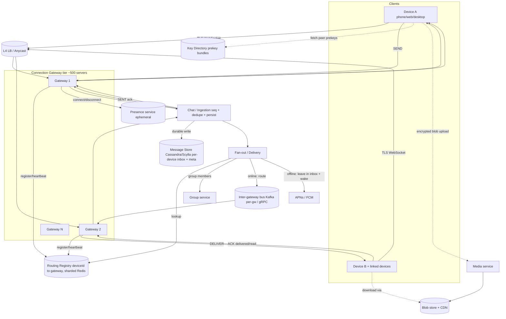

# Design WhatsApp / a Chat System — High-Level Design

> **Category:** Messaging & Real-time
> **Level:** Senior / Staff system-design round
> **Reader:** Senior backend engineer (Java/JVM, distributed systems) practising HLD.

---

## 1. Problem & Clarifying Questions

### 1.1 Restating the problem

Design a planet-scale chat system in the style of WhatsApp: users exchange **text and media messages** in **1:1 and group conversations**, in **near-real-time**, with **delivery and read receipts**, **presence** (online / last-seen / typing), **offline message storage and resync** (a phone is offline most of the day), and **end-to-end encryption (E2EE)** so that the server never sees plaintext. The hard part is not "store a row in a table" — it is delivering a message to a device that may or may not be connected, fanning out to many devices and many group members, doing it with low tail latency at the scale of *billions* of users and *hundreds of millions* of simultaneously-open TCP connections, while keeping messages ordered, exactly-once-ish, durable until delivered, and encrypted end-to-end.

A junior answer draws "client → server → DB → other client." A senior answer reasons about: *where does the message live between send and receive when the recipient is offline?*, *how do we keep 100M+ sockets open cheaply?*, *how do we route a message to the one gateway box holding the recipient's socket?*, *what ordering guarantee do we actually promise?*, and *how does E2EE constrain everything the server is allowed to do?*

### 1.2 Questions I would ask the interviewer first

I never jump to boxes-and-arrows. I'd spend the first 3–5 minutes scoping. The questions, grouped:

**Functional scope**

1. **1:1 only, or groups too?** Groups change fan-out, ordering, and membership management dramatically. *(Assume: both. Group cap ~1024 members — WhatsApp's real cap.)*
2. **Media (images, video, voice notes, documents) in scope, or text only?** Media needs a blob store + thumbnailing + a separate upload path. *(Assume: yes, media in scope, designed as a separate path.)*
3. **Delivery receipts** — do we need the three-tick model: **sent** (server got it), **delivered** (recipient device got it), **read** (recipient opened it)? *(Assume: yes, all three.)*
4. **Presence** — online/offline, last-seen, typing indicators? *(Assume: yes; these are best-effort, not durable.)*
5. **Multi-device** — can one account be logged in on phone + web + desktop simultaneously, all receiving the same messages? *(Assume: yes, up to ~4 linked devices. This is a major complexity multiplier and a real interview signal.)*
6. **End-to-end encryption** — required? This is WhatsApp's defining property and forbids server-side content inspection, server-side search, and server-side group fan-out of *plaintext*. *(Assume: yes, E2EE via the Signal protocol, mandatory.)*
7. **Message editing / deletion / disappearing messages / reactions / replies / forwarding?** *(Assume: out of scope for v1 except a note on delete-for-everyone and disappearing messages in extensions.)*
8. **History on new device** — when I link a new device, do I get full chat history? Under E2EE this is non-trivial. *(Assume: limited history sync; full history is an extension.)*
9. **Search** — server-side message search? Under E2EE the server can't read content, so search is **client-side only**. *(Assume: client-side search; out of scope for the backend.)*
10. **Calls (voice/video)?** *(Assume: out of scope; mention WebRTC signalling reuse in extensions.)*

**Non-functional scope**

11. **Scale** — DAU? Peak concurrent connections? Messages/day? *(Assume below: 2B users, 500M DAU, 100B msgs/day.)*
12. **Latency target** — what's "real-time"? *(Assume: p50 < 200ms, p99 < 1s end-to-end for an online→online message, intra-region.)*
13. **Durability** — can we ever lose an undelivered message? *(Assume: no — an accepted message must be durably stored until delivered to all recipient devices, then it may be deleted server-side.)*
14. **Availability** — target? *(Assume: 99.99% for the messaging path. A user must be able to *send*; *delivery* to an offline peer is naturally deferred.)*
15. **Consistency / ordering** — per-conversation ordering, or global? *(Assume: per-conversation FIFO as perceived by participants; no global order. We'll define this precisely in §9.)*
16. **Retention** — how long do we hold undelivered messages? *(Assume: 30 days, then drop with a notification, matching WhatsApp behavior.)*
17. **Regulatory / data residency** — must EU user data stay in EU? *(Assume: regional data residency required; affects sharding key and routing.)*

**Out-of-scope (explicitly parked)**

- Spam/abuse ML pipelines (mentioned at a systems level in §9).
- Payments, business API, status/stories, communities — out.
- Full E2EE key-transparency / verified-keys UX — mentioned, not designed.

### 1.3 Assumptions I'll proceed with

| Dimension | Assumption |
|---|---|
| Users | 2B registered, 500M DAU |
| Concurrency | 100M+ simultaneously connected sockets at peak |
| Volume | 100B messages/day (~75% 1:1, ~25% group) |
| Conversation types | 1:1 and group (≤1024 members) |
| Devices | Multi-device, ≤4 linked devices/account |
| Encryption | E2EE mandatory (Signal protocol); server stores ciphertext only |
| Receipts | sent / delivered / read |
| Presence | online, last-seen, typing — best-effort, ephemeral |
| Media | Out-of-band upload to blob store; only encrypted blob ref travels in the message |
| Retention | Undelivered messages held ≤30 days |
| Ordering | Per-conversation FIFO (causal-ish), not global |

---

## 2. Requirements (finalized)

### 2.1 Functional

- **F1 — Send/receive messages** in 1:1 and group chats, near-real-time when both online.
- **F2 — Offline delivery:** if a recipient device is offline, the message is durably queued and delivered (and ordered) when the device reconnects.
- **F3 — Receipts:** sender sees *sent* (server ack), *delivered* (device ack), *read* (user opened).
- **F4 — Presence:** online/last-seen and typing indicators (best-effort).
- **F5 — Multi-device:** all of a user's linked devices receive every message addressed to that user; receipts and read-state sync across them.
- **F6 — Groups:** create group, add/remove members, leave; messages fan out to all members' devices.
- **F7 — Media:** send/receive images, video, voice, documents; only an (encrypted) reference + key travels in the chat message; bytes go via a blob store.
- **F8 — E2EE:** server never sees plaintext message content; only sender and recipient devices can decrypt.
- **F9 — History sync:** on reconnect or new linked device, the device can catch up on missed messages.

### 2.2 Non-functional

| Property | Target | Notes |
|---|---|---|
| **Latency** | p50 < 200 ms, p99 < 1 s (online→online, intra-region) | Includes gateway routing + push to socket. Cross-region adds RTT. |
| **Availability** | 99.99% send path | "Send always works" even if peer is offline; delivery deferred. |
| **Durability** | No loss of accepted-but-undelivered messages | Replicated, acked write before sender gets *sent*. |
| **Consistency** | Per-conversation FIFO; receipts eventually consistent | No global order. Monotonic per (conversation, sender). |
| **Scalability** | 100M+ concurrent sockets; 100B msgs/day; horizontal everywhere | No single box holds critical state non-redundantly. |
| **Security** | E2EE; authenticated sessions; rate-limited; no plaintext at rest server-side | Metadata minimization is best-effort. |

### 2.3 What "real-time" means precisely

We promise **best-effort sub-second delivery when both parties are online and connected to healthy gateways**. We do **not** promise synchronous round-trips; messaging is **asynchronous and store-and-forward**. The sender's UX (single tick → double tick → blue tick) is driven by async acks, not a blocking RPC. This framing is the key senior insight: **a chat system is a durable, ordered, store-and-forward message bus with a real-time push layer bolted on**, not an RPC service.

---

## 3. Capacity Estimation

Show the arithmetic; flag assumptions. Rough numbers, order-of-magnitude is what matters in interview.

### 3.1 Message write QPS

- 100B messages/day.
- Seconds/day ≈ 86,400 ≈ 1e5 (round).
- **Average write QPS** = 100e9 / 86,400 ≈ **1.16M msgs/sec**.
- Peak is spiky (evenings, New Year). Use **peak factor ~3×** → **~3.5M writes/sec** at peak.

But each logical message **fans out** to recipient devices:

- 1:1 message → recipient has ~2 devices avg → 2 deliveries. Plus sender's other devices (multi-device sync) → ~+1. Plus receipts coming back.
- Group message (avg group ~50 members, ~2 devices each) → ~100 deliveries.
- Blended: 75% are 1:1 (~3 deliveries each), 25% are group (~100 deliveries each).
- **Fan-out factor** ≈ 0.75·3 + 0.25·100 = 2.25 + 25 = **~27 deliveries per logical send**.

So **delivery/push QPS** ≈ 1.16M × 27 ≈ **~31M pushes/sec average**, **~90M/sec peak**. This fan-out number is why group messaging dominates the delivery layer's cost even though groups are a minority of *logical* sends. **Defended takeaway: the system is fan-out-bound, not ingest-bound.**

### 3.2 Connection / gateway sizing

- 100M concurrent sockets at peak.
- Each idle WebSocket on a tuned JVM/Netty box costs ~**10–40 KB** of heap + kernel socket buffers; with epoll, one box can hold **~500K–1M idle connections** if business logic is kept off the I/O threads.
- Conservatively **500K sockets/gateway** → **100M / 500K = 200 gateway servers** minimum, ×2–3 for headroom + failure tolerance + regional spread → **~500 gateway servers**.
- The constraint is rarely CPU; it's **memory per connection, file descriptors (ulimit), ephemeral-port exhaustion on the LB side, and the per-message routing cost**. We design for memory and routing below.

### 3.3 Storage

**Message metadata + ciphertext (text):**

- Avg stored message envelope: msgId (16B), convId (16B), senderId (8B), seq/timestamp (16B), ciphertext (avg ~256B for text), flags (~16B) ≈ **~350B**. Round to **~500B** with overhead/indexing.
- Per device, per message, while undelivered we keep a queue entry; but the canonical ciphertext is stored once per recipient device under E2EE (because each device gets a separately-encrypted copy — Signal). For 1:1 that's ~2 copies; for groups, ~N copies. We'll mostly store **per-recipient-device encrypted payloads** in inboxes (discussed in §6/§7).

Let's size the **persistent message store** assuming we keep messages 30 days for undelivered + a rolling buffer:

- Daily logical messages: 100e9. After fan-out to per-device envelopes (~27×) for the *undelivered queue*: but most get delivered within seconds and the inbox entry is removed. Only a small fraction (say 5%) sit undelivered. Effective stored device-envelopes/day ≈ 100e9 × 27 × 5% ≈ **135e9/day**. At 500B each → **~67 TB/day** of transient inbox data, churning.
- Permanent metadata (for sync/ordering, even if device-copies are GC'd): say we keep a thin per-message record (no ciphertext) ~100B × 100e9/day = **10 TB/day**, retained 30 days = **~300 TB**.
- **Takeaway:** This is a write-heavy, time-series-ish, high-churn workload → favors **LSM-tree stores (Cassandra/Scylla, or HBase)** over B-tree RDBMS. (Justified in §6.)

**Media:**

- Say 10% of messages carry media, avg 200 KB (compressed images dominate; video is rarer but huge — averaged out).
- 100e9 × 10% × 200 KB = **2e9 × 200 KB = 4e14 B/day = ~400 TB/day** of media into the blob store. Media is the storage giant. With 30-day expiry of *undelivered* media but typically longer client retention via CDN/cache, the blob store grows fast → object storage (S3/GCS-like) + CDN, lifecycle policies, dedup by content-hash.

### 3.4 Bandwidth

- Text delivery: 31M pushes/sec × 500B ≈ **~15 GB/s = 120 Gbps** average for text alone; ~3× at peak.
- Media: served from CDN, decoupled. 400 TB/day / 86,400s ≈ **4.6 GB/s = ~37 Gbps** average ingest; egress is multiples of that via CDN edge.
- **Takeaway:** text fits comfortably across ~500 gateways (each ~tens of Mbps); media must ride a CDN, never the message path.

### 3.5 Memory / cache

- **Routing table**: map `userId/deviceId → gatewayId` for 100M live connections. Entry ~ (16B key + 16B value + overhead) ≈ 64B → 100M × 64B = **~6.4 GB**. Trivially fits in a sharded in-memory store (Redis cluster) — but it's *hot* and *write-churning* (every connect/disconnect updates it). We'll deep-dive this.
- **Presence**: similar size, even more churn; kept in-memory with short TTLs.

### 3.6 Summary table

| Metric | Avg | Peak |
|---|---|---|
| Logical msg writes | 1.16M/s | ~3.5M/s |
| Delivery pushes (post fan-out ~27×) | ~31M/s | ~90M/s |
| Concurrent sockets | — | 100M+ |
| Gateways (≈500K sockets each) | ~200 min | ~500 provisioned |
| Transient inbox storage | ~67 TB/day churn | — |
| Permanent thin metadata (30d) | ~300 TB | — |
| Media into blob store | ~400 TB/day | — |
| Text delivery bandwidth | ~120 Gbps | ~360 Gbps |
| Routing table memory | ~6.4 GB | (sharded) |

---

## 4. API Design

Two surfaces: a **persistent connection protocol** (the hot path, over WebSocket/MQTT-like framing) and a small set of **HTTP/RPC endpoints** for setup, media, and group management.

### 4.1 Connection protocol (over a single persistent socket)

WhatsApp uses a custom binary protocol historically based on a modified XMPP, then a proprietary "Noise" + framing scheme. Conceptually it's a **bidirectional framed message stream**. I'll describe it as typed frames. (MQTT is a real alternative — Facebook Messenger used MQTT; noted in §7.)

**Client → Server frames:**

```
CONNECT      { authToken, deviceId, clientSeqAck, protocolVersion }
SEND         { clientMsgId, convId, recipientDeviceEnvelopes[], ts }
ACK          { type: DELIVERED|READ, msgIds[], convId }
PRESENCE     { state: ONLINE|TYPING|PAUSED }
PULL         { convId?, sinceSeq }          // request missed messages
PONG         { }                            // heartbeat reply
```

- `recipientDeviceEnvelopes[]` is the E2EE consequence: the client, not the server, produces one **separately-encrypted ciphertext per recipient device** (Signal "sender keys" optimization for groups discussed in §7). The server treats each as an opaque blob to route.

**Server → Client frames:**

```
CONNECT_ACK  { sessionId, serverTime, resumeFrom }
DELIVER      { serverMsgId, convId, senderId, seq, envelope, ts }
ACK          { clientMsgId → serverMsgId, status: SENT }   // server accepted & durably stored
RECEIPT      { msgId, status: DELIVERED|READ, byDevice }
PRESENCE     { userId, state, lastSeen? }
PING         { }                            // heartbeat
```

The crucial pairing: client `SEND` → server durably persists → server replies `ACK{SENT}` (single tick). When recipient device sends `ACK{DELIVERED}` → server relays `RECEIPT{DELIVERED}` to sender (double tick). `ACK{READ}` → `RECEIPT{READ}` (blue tick).

### 4.2 HTTP/RPC endpoints (control plane)

```
POST /v1/register            { phone, deviceInfo } → { userId, deviceId, regToken }
POST /v1/devices/link        { primaryDeviceSig, newDevicePubKey } → { deviceId }
GET  /v1/keys/{userId}       → { identityKey, signedPreKey, oneTimePreKeys[] }   // E2EE key bundle (prekeys)
POST /v1/keys                { deviceId, prekeys[] }                              // upload more one-time prekeys
POST /v1/groups              { name, members[] } → { groupId }
POST /v1/groups/{id}/members { add[], remove[] } → { version }
GET  /v1/groups/{id}         → { members[], version, ... }
POST /v1/media/upload-url    { contentHash, size, mime } → { uploadUrl, blobId }  // presigned
GET  /v1/media/{blobId}      → 302 to CDN URL
GET  /v1/sync                { sinceSeq, deviceId } → { messages[], nextSeq }      // HTTP fallback for catch-up
```

Notes:
- **Key bundle / prekeys**: in Signal, to start an encrypted session with a peer you fetch their published *prekey bundle* (identity key + signed prekey + a one-time prekey). The server is a **dumb key directory** here — it stores and hands out public keys it cannot use. We must handle prekey exhaustion (client replenishes; server warns when low).
- **Media** is fully out-of-band: client encrypts the blob with a random symmetric key, uploads ciphertext to blob store via presigned URL, then sends a chat message containing `{blobId, decryptionKey, contentHash}` — all of which are themselves inside the E2EE envelope. The server stores ciphertext bytes and never has the key.

### 4.3 Idempotency

- `clientMsgId` (UUID generated on device) makes `SEND` idempotent: the server dedupes on `(senderDeviceId, clientMsgId)`. A retry after a flaky network won't double-post. Server returns the same `serverMsgId`.

---

## 5. High-Level Architecture

### 5.1 Components

- **Load balancer / connection LB (L4):** TCP/TLS termination edge that spreads incoming socket connections across gateways. Must be sticky-per-connection (a socket stays on one gateway for its life). Often a layer-4 LB + DNS/anycast to nearest region.
- **Connection Gateway servers (the "chat servers"):** hold the live WebSocket per device, do framing, auth on connect, heartbeats, and **push** messages to the device. Stateful (they own live sockets) but hold *no durable* state.
- **Session / Routing registry:** the in-memory map `deviceId → gatewayId` plus reverse index. Lets any gateway find which gateway holds a target device's socket. Sharded Redis or a gossip-based registry.
- **Message ingestion / Chat service:** receives `SEND`, validates, assigns `serverMsgId` + sequence, **durably persists** to the message store, and triggers fan-out.
- **Message store (per-device inbox + thin metadata):** durable, replicated, LSM-based. Holds undelivered envelopes and the conversation timeline metadata.
- **Fan-out / delivery service:** for each recipient device, look up its gateway via the registry and forward the envelope; if offline, leave it in the inbox and (optionally) trigger a **push notification** (APNs/FCM) to wake the app.
- **Presence service:** tracks online/last-seen/typing; fed by gateway connect/disconnect/heartbeat events; ephemeral store with TTLs.
- **Group service:** group membership, versioning, and member resolution for fan-out.
- **Media service + blob store + CDN:** out-of-band encrypted blob upload/download.
- **Key directory service:** stores/serves public prekey bundles for E2EE session setup.
- **Push notification service:** bridges to APNs (Apple) / FCM (Google) to wake offline apps.
- **Inter-gateway message bus:** how gateway A hands a message to gateway B that holds the recipient socket — direct RPC keyed by the registry, or a pub/sub like Kafka per-gateway topic.

### 5.2 ASCII block diagram

```
                                  ┌─────────────────────────────┐
                                  │     Push (APNs / FCM)        │◄── wake offline apps
                                  └──────────────▲──────────────┘
                                                 │
  Device A                                       │
 ┌────────┐    TLS/WebSocket    ┌──────────────────────────────────────────────┐
 │ phone  │◄══════════════════►│         Connection Gateway tier (~500)         │
 │ web    │                     │  Gw#1  Gw#2  ...  Gw#N   (each ~500K sockets)  │
 │ desktop│                     └───▲─────────────▲──────────────────▲──────────┘
 └────────┘                         │             │                  │
      ▲                             │ register/   │ lookup           │ deliver
      │ L4 LB / anycast             │ heartbeat   │ (deviceId→Gw)    │
      │                       ┌─────┴─────┐  ┌────┴─────────┐        │
      │                       │  Session  │  │   Routing    │        │
      │                       │ /Presence │  │  Registry    │        │
      │                       │  (Redis)  │  │  (sharded)   │        │
      │                       └───────────┘  └──────────────┘        │
      │                                                              │
 ┌────┴────────────┐   SEND     ┌───────────────────┐   fan-out  ┌──┴───────────────┐
 │  (same gateway   │──────────►│  Chat / Ingestion  │──────────►│  Fan-out /        │
 │   forwards SEND) │           │  service (seq,     │           │  Delivery service │
 └──────────────────┘           │  persist, dedupe)  │           └──┬───────────────┘
                                 └─────────┬─────────┘              │
                                           │ durable write           │ enqueue/lookup
                                  ┌────────▼─────────┐    ┌──────────▼────────────┐
                                  │  Message Store    │    │  Inter-gw bus / direct │
                                  │  (Cassandra/Scylla│    │  RPC (Kafka per-gw or  │
                                  │   per-device inbox│    │  gRPC by registry)     │
                                  │   + timeline meta)│    └────────────────────────┘
                                  └───────────────────┘
   Control plane (HTTP):  Register | Link device | Key directory (prekeys)
                          Group service | Media (presigned → Blob store → CDN)
```

### 5.3 Mermaid diagram



### 5.4 Request flow narrative (online → online 1:1)

1. Device A is connected to Gateway G1, Device B to G2; both registered in the routing registry.
2. A composes message, encrypts it with the Signal session for B's device → opaque envelope. A sends `SEND{clientMsgId, convId, [envelope_for_B], ...}` over its socket to G1.
3. G1 forwards to **Chat/Ingestion**, which dedupes on `(deviceA, clientMsgId)`, assigns `serverMsgId` + per-conversation `seq`, and **durably writes** the envelope into **B's device inbox** (replicated) and a thin timeline record. Only after the replicated write is acknowledged does it reply.
4. Chat returns `ACK{SENT}` → G1 → A. **Single tick.**
5. **Fan-out** looks up B's device in the routing registry → G2. It pushes a `DELIVER` frame to G2 (via the inter-gateway bus), which writes it to B's socket.
6. B's app receives, decrypts, persists locally, and sends `ACK{DELIVERED}`. This flows G2 → Chat → mark inbox entry delivered (and eligible for GC) → relay `RECEIPT{DELIVERED}` to A via G1. **Double tick.**
7. When B opens the chat, B sends `ACK{READ}` → relayed to A. **Blue tick.**

### 5.5 Offline flow

If step 5 finds B *not* in the registry (offline): the envelope stays durably in B's inbox; Chat asks the **Push service** to send a silent/badge push via APNs/FCM to wake B's app. When B reconnects, it sends `CONNECT{clientSeqAck}` / `PULL{sinceSeq}`; the gateway streams the backlog from B's inbox in order, B acks, entries GC'd.

---

## 6. Data Model & Storage Choices

### 6.1 Access patterns first (this drives the datastore choice)

1. **Append** a message envelope to a recipient device's inbox — write-heavy, high volume.
2. **Read** a device's undelivered backlog *in order* on reconnect — range scan by (deviceId, seq).
3. **Delete** an inbox entry once delivered+acked — high churn, deletes.
4. **Read** recent conversation timeline metadata for sync — range by (convId, seq).
5. **Lookup** routing: deviceId → gatewayId — point read/write, in-memory, churny.
6. **Lookup** prekey bundle by userId — point read, low volume.
7. **Group membership** read on every group send — point read, cacheable.

Patterns 1–4 are **write-dominant, key-range-scannable, high-churn time-series-like**, partitioned by device/conversation. This is the canonical fit for a **wide-column LSM store**.

### 6.2 Datastore decisions

| Data | Store | Why |
|---|---|---|
| Per-device inbox (undelivered envelopes) | **Cassandra / ScyllaDB** (LSM, partition by deviceId, cluster by seq) | Massive write throughput, ordered range reads per partition, TTL for 30-day expiry, tunable consistency. Deletes via TTL/tombstones (manage compaction). |
| Conversation timeline metadata | **Cassandra/Scylla** partition by convId, cluster by seq | Ordered per-conversation reads for sync; thin (no ciphertext after delivery). |
| Dedup table (deviceId, clientMsgId → serverMsgId) | **Cassandra** with TTL | Idempotency; short-lived. |
| Routing registry (deviceId → gateway) | **Redis cluster** (in-memory) | Point read/write at connect/disconnect; ~6.4 GB; needs <1ms lookups; ephemeral. |
| Presence (online/last-seen/typing) | **Redis** with TTL | Ephemeral, churny, best-effort. |
| Group membership | **Sharded RDBMS or Cassandra** + Redis cache | Strong-ish reads, infrequent writes, cached aggressively. |
| Key directory (prekey bundles) | **RDBMS (Postgres/Spanner-like)** | Low volume, needs atomic "hand out one-time prekey" (consume-once). |
| Media bytes | **Object store (S3/GCS-like) + CDN** | Cheap durable blobs, lifecycle expiry, edge delivery. |

**Why not a single RDBMS for messages?** A B-tree RDBMS at 3.5M writes/sec with constant deletes would suffer from index write amplification, vacuum/bloat, and hot-partition lock contention. LSM stores absorb high write/delete churn with sequential writes and background compaction — exactly our workload. The cost is read amplification and tombstone management, which we mitigate with per-device partitioning (small partitions, fast scans) and TTLs.

**Why Scylla over Cassandra (optional senior nuance):** Scylla's shard-per-core C++ architecture removes JVM GC pauses and gives more predictable p99 at these connection/throughput scales. Either is defensible; I'd flag GC tail-latency as the deciding factor.

### 6.3 Schemas (logical)

**Per-device inbox (Cassandra):**

```
TABLE device_inbox (
  device_id   text,        -- partition key
  seq         bigint,      -- clustering key (per-device monotonic delivery seq)
  msg_id      uuid,
  conv_id     text,
  sender_id   text,
  envelope    blob,        -- E2EE ciphertext, opaque to server
  ts          timestamp,
  state       tinyint,     -- QUEUED|DELIVERED
  PRIMARY KEY (device_id, seq)
) WITH CLUSTERING ORDER BY (seq ASC) AND default_time_to_live = 2592000;  -- 30d
```

Range scan `WHERE device_id=? AND seq > ?` gives ordered backlog. Delivered entries are deleted (or left to TTL).

**Conversation timeline metadata:**

```
TABLE conv_timeline (
  conv_id   text,       -- partition key (hash-bucketed if a group is huge)
  seq       bigint,     -- per-conversation monotonic
  msg_id    uuid,
  sender_id text,
  ts        timestamp,
  PRIMARY KEY (conv_id, seq)
) WITH CLUSTERING ORDER BY (seq DESC);
```

**Dedup:**

```
TABLE dedup ( device_id text, client_msg_id uuid, server_msg_id uuid,
  PRIMARY KEY ((device_id, client_msg_id)) ) WITH default_time_to_live = 86400;
```

**Group membership (RDBMS):**

```
groups(group_id PK, name, created_at, version)
group_members(group_id, user_id, role, joined_at, PRIMARY KEY(group_id, user_id))
```

**Key directory (RDBMS):**

```
identity_keys(user_id, device_id, identity_pub, signed_prekey, signed_prekey_sig, PK(user_id,device_id))
one_time_prekeys(user_id, device_id, key_id, prekey_pub, consumed bool, PK(user_id,device_id,key_id))
```

`one_time_prekeys` consumption must be atomic (`UPDATE ... WHERE consumed=false LIMIT 1 RETURNING ...`) — a prekey is handed to exactly one requester.

### 6.4 Sequence numbers

Two distinct sequences, don't conflate them:
- **Per-device delivery seq** (`device_inbox.seq`): a monotonic counter per device so the device can detect gaps and resync ("I'm at seq 4012, give me >4012"). Assigned by the gateway/ingestion as it enqueues to that device.
- **Per-conversation seq** (`conv_timeline.seq`): defines the *order participants perceive* in that conversation. Assigned by the ingestion service when it accepts the message. (Ordering semantics in §9.)

---

## 7. Deep Dives

This is the heart of the design. Five hard sub-problems.

---

### 7.1 Deep Dive A — The persistent connection & gateway tier (millions of sockets)

**The problem.** We must hold 100M+ TCP/TLS sockets open, mostly idle, push messages to them with sub-second latency, detect dead connections fast, and survive a gateway crash taking 500K sockets with it.

**Why not just HTTP polling?** Polling 500M devices every few seconds is wasteful (mostly empty responses) and adds latency. Long-polling is better but ties up a connection per pending request and is awkward for server-initiated pushes. **WebSocket** (or MQTT) gives a single, long-lived, bidirectional, low-overhead frame channel — *server-initiated push* is the requirement that forces persistent connections.

**Transport options:**

| Option | Pros | Cons | Verdict |
|---|---|---|---|
| HTTP short-poll | Trivial, stateless | Latency, wasted requests, no true push | No |
| HTTP long-poll / SSE | Works through proxies; SSE is push-only | One-way (SSE), connection churn, header overhead | Fallback only |
| **WebSocket** | Bidirectional, low per-frame overhead, ubiquitous | Sticky stateful conns, proxy/firewall issues on some networks | **Primary** |
| **MQTT** | Designed for mobile, tiny frames, QoS levels, battery-friendly | Broker-centric, less common in browsers | Strong alt (Messenger used it); use behind native apps |

**Decision:** WebSocket (with a binary framing + Noise-style handshake for E2EE transport security) as the primary, MQTT-style efficiency for native mobile, HTTP long-poll/SSE as a captive-portal/firewall fallback. *Failure mode avoided:* polling-induced latency and load; one-way-only push.

**Holding the sockets cheaply.** Use an **event-driven, non-blocking I/O** server (Netty/epoll on JVM, or C++/Rust). Key rules:
- **Never block I/O threads** with business logic — hand off to a worker pool or, better, push the durable work to the Chat service so the gateway is a thin pump.
- Tune `ulimit -n` (millions of FDs), kernel `somaxconn`, socket buffer sizes, and use **a few hundred KB of buffer per conn** at most; trim TLS record sizes.
- **Memory budget**: at ~20 KB/conn × 500K = 10 GB/box for connection state — feasible on 64–128 GB boxes, leaving room for buffers.
- **GC pressure** is the JVM gotcha: 500K live objects + churn → use off-heap buffers (Netty `PooledByteBufAllocator`), avoid per-message allocations, consider ZGC/Shenandoah for low pause. (This is where Scylla-style C++ or Rust gateways earn their keep.)

**Heartbeats & dead-connection detection.** TCP can keep a half-open socket "alive" for minutes after a peer vanishes (e.g., phone loses signal). We need **application-level heartbeats**: server `PING` every ~30–60s, expect `PONG`; miss 2 → tear down, mark offline, free resources. This also keeps NAT/firewall mappings warm on mobile carriers (idle mobile sockets get reaped by carrier NAT in ~5 min — so heartbeat interval must beat the carrier's idle timeout). *Failure mode avoided:* ghost connections that consume memory and cause us to route messages into a black hole.

**Connection LB & stickiness.** A socket must live entirely on one gateway. Use an **L4 (TCP) load balancer** (not L7) so it doesn't try to parse/buffer the long-lived stream; connection assignment is sticky for the socket's life. Spread by least-connections or consistent hashing. Use **anycast / GeoDNS** to land users on the nearest region. *Failure mode avoided:* an L7 LB terminating/buffering a streaming socket, or a reconnect landing on a gateway that doesn't hold prior state (we don't depend on that — see registry).

**Graceful degradation on gateway crash.** A gateway dies → 500K sockets drop. Clients detect (heartbeat/`PING` failure) and **reconnect with exponential backoff + jitter** (jitter prevents a thundering-herd reconnect storm hammering the LB). They reconnect to a new gateway, re-register, and `PULL{sinceSeq}` to catch up from durable inboxes. *Failure mode avoided:* (a) lost messages — they're durable in inboxes, not in gateway memory; (b) reconnect storms — jittered backoff; (c) "split brain" where stale registry entries point at the dead gateway — handled next.

---

### 7.2 Deep Dive B — Message routing across gateways & the connection registry

**The problem.** Gateway G1 (holding sender A) must deliver to device B, whose socket lives on some *other* gateway G2. G1 must discover "B is on G2" fast, and the answer changes every time B connects/disconnects/roams. At 100M sockets with constant churn, this registry is hot.

**Options:**

| Option | How it works | Pros | Cons |
|---|---|---|---|
| **Central registry (Redis)** | `deviceId → gatewayId` in sharded Redis; gateways write on connect, read on send | Simple, ~1ms lookups, small (~6.4GB) | Hot key churn; stale entries on crash; another dependency |
| **Per-gateway pub/sub topic (Kafka)** | Each gateway subscribes to a topic; fan-out publishes to recipient's gateway topic | Decouples sender/receiver gateways; durable buffer | Need to know recipient's gateway anyway (still need registry); topic-per-gateway management |
| **Gossip / consistent-hash routing** | DeviceId hashes to a "home" coordinator; gossip spreads liveness | No central hot store | Complex, eventual, harder to reason about |
| **Stateless: always go through store** | Don't push gateway→gateway; write to inbox, recipient's gateway tails its own inbox | Dead simple, no registry on hot path | Adds store round-trip latency to every online delivery |

**Decision: central sharded registry (Redis) for liveness lookup + direct gateway-to-gateway delivery via an internal mesh/bus, with the durable inbox as the source of truth and fallback.** Concretely:
- On connect, gateway writes `device_id → {gatewayId, sessionEpoch}` to Redis (sharded by deviceId), with a TTL refreshed by heartbeats.
- Fan-out reads the registry; if hit → forward the `DELIVER` to that gateway (gRPC over the internal mesh, or publish to that gateway's Kafka partition).
- If miss/stale (gateway dead) → leave in inbox + trigger push; the entry's TTL or sessionEpoch mismatch reveals staleness.
- The **inbox is always written first** (durability), so even if the live push is lost, reconnect+`PULL` recovers it. The live push is a latency optimization, not the durability mechanism.

*Failure modes avoided:*
- **Stale routing after crash:** TTL + sessionEpoch (a monotonically increasing per-session token). A `DELIVER` to G2 carrying an epoch older than G2's current session for that device is rejected → fan-out falls back to inbox. Prevents delivering to a reconnected socket's *previous* session or a dead gateway.
- **Lost online push:** inbox-first write means no message is lost; worst case it arrives via reconnect/PULL slightly later.
- **Registry as SPOF / hot shard:** shard by deviceId across a Redis cluster; replicate each shard; the registry is reconstructable from gateways re-registering on reconnect, so even total registry loss is survivable (clients reconnect, re-register; brief delivery delay).

**Why direct gateway→gateway over "everything through Kafka"?** A Kafka hop on the hot online path adds tens of ms and operational weight. Direct gRPC between gateways (addresses from the registry) is lower-latency for the common online case. Kafka shines as the **durable fan-out buffer** and for cross-region replication, not as the per-message hot relay. We keep Kafka for fan-out durability/decoupling but allow a fast direct path when both peers are online in-region.

**Multi-device routing.** "Deliver to user B" expands to "deliver to each of B's ≤4 linked devices," each potentially on a different gateway. Fan-out resolves `userId → [deviceIds]` (from the device directory, cached) then per-device registry lookups. Each device has its own inbox and its own E2EE session, so the *sender* already produced one envelope per recipient device.

---

### 7.3 Deep Dive C — Group messaging & fan-out

**The problem.** A 1024-member group message must reach up to 1024 × ~2 devices ≈ ~2000 device inboxes, ordered, and under E2EE where the *server cannot read or re-encrypt content*. Naïvely the sender would encrypt 2000 separate copies per message — quadratic, battery-and-bandwidth-killing.

**Fan-out models:**

| Model | Description | Pros | Cons |
|---|---|---|---|
| **Fan-out on write (push)** | At send time, write the message into every member device's inbox | Fast reads/delivery; recipient just drains its inbox | Write amplification (×N); expensive for huge groups |
| **Fan-out on read (pull)** | Store once per conversation; each member pulls from the conversation log | Cheap writes | Every reader scans shared log; hot for active groups; harder offline ordering |
| **Hybrid** | Push for normal groups; pull/throttle for very large or low-activity members | Balances cost | Complexity |

**Decision: fan-out on write for the common case (groups ≤ ~256 active), with the per-device inbox as the unit of delivery; consider hybrid/pull only for outsized "broadcast"-like groups.** Rationale: chat is read-soon (recipients are waiting), inboxes give clean per-device ordering and offline sync, and write amplification at our group sizes is tolerable (the ~27× fan-out is already baked into capacity). *Failure mode avoided:* fan-out-on-read hot-partition meltdown on a very active group where thousands pull the same log simultaneously.

**The E2EE group problem — Sender Keys.** Encrypting N separate copies per message is the killer. Signal's **Sender Keys** solves it:
- Each sender, per group, generates a symmetric **sender-key (chain key)** and distributes it **once** to each member via pairwise (1:1 Signal) encrypted messages.
- Thereafter, the sender encrypts each group message **once** with its sender-key and broadcasts that single ciphertext; every member who holds the sender-key can decrypt.
- When membership changes (someone leaves), the sender **rotates** its sender-key and re-distributes — forward secrecy for the removed member.

So the server's job for groups is: take **one ciphertext** (or one per sender-key epoch) and fan it out (on write) to all member device inboxes. The server still does the routing/inbox work, but the *encryption* is O(1) per message after key setup, not O(N). *Failure mode avoided:* O(N) per-message encryption that would crush mobile clients in big groups.

**Group membership & ordering.** Membership lives in the Group service (versioned). Two pitfalls:
- **Concurrent membership change vs. message:** define group ops as messages in the same ordered stream (they get a `seq` too) so "Alice added; Bob's message" has a defined order. Use the group `version` to detect a member encrypting against a stale roster.
- **Newly added member:** doesn't get history by default (E2EE — old messages were encrypted with a sender-key they never had). History sharing is an explicit, opt-in, client-mediated feature (extension §10).

**Large-group throttling.** For "communities"/broadcast (10k+), switch to pull + rate-limited fan-out + read-throttling, and treat them as a different product. Out of scope for v1 but flagged.

---

### 7.4 Deep Dive D — Delivery receipts, ordering, and exactly-once-ish semantics

**The problem.** Implement the three ticks correctly and define the **ordering guarantee** under concurrency, retries, and multi-device — without a global clock.

**Receipts pipeline.**
- *Sent (✓):* server has durably persisted the message → ack to sender. This is a **server** guarantee.
- *Delivered (✓✓):* recipient *device* received it and wrote it locally → device sends `ACK{DELIVERED}` → relayed to sender. For multi-device/group, "delivered" UX = delivered to *all* recipient devices (or first device, configurable). WhatsApp shows ✓✓ when delivered to at least the recipient's primary; "delivered to all" is an aggregation.
- *Read (blue ✓✓):* user opened the chat → device sends `ACK{READ}`. Privacy: read receipts are optional; if disabled, the device suppresses sending `READ`.

**Receipt fan-in for groups.** "Read by" in a group = aggregate of per-member read acks. Storing per-(message, member) read state is O(members × messages) — expensive. Mitigation: store **read-watermarks** ("member X has read up to seq S in conv C") instead of per-message flags. One row per (member, conv), updated to the max seq. Reading "who read this message" = "members whose watermark ≥ this message's seq." *Failure mode avoided:* receipt-table explosion in large active groups.

**Ordering — what we actually promise.** No global order; clocks aren't trustworthy. We promise **per-conversation FIFO as seen by all participants**, implemented via the **per-conversation `seq`** assigned by the ingestion service when it accepts a message. Because one logical conversation's messages are routed through a deterministic ingestion shard (sharded by `convId`), seq assignment is monotonic and consistent for that conversation. Recipients render in `seq` order, buffering briefly to fill gaps (using the per-device delivery seq to detect missing messages and `PULL` them).

Subtleties:
- **Concurrent sends in a group** get a total order *at the ingestion shard* (whoever's write commits first gets the lower seq). This is arbitrary but *consistent for everyone* — that's what matters.
- **Causality:** strict causal ordering (message that "replies to" X must come after X for all) is approximated by seq + client-side reply references; we don't run full vector clocks (overkill, costly). Flag this as a deliberate tradeoff: **we choose a single-shard total order per conversation over distributed causal consistency** to keep it simple and correct-enough; failure mode avoided = the complexity/latency of vector clocks for marginal UX gain.

**Exactly-once-ish.** True exactly-once delivery over an unreliable network is impossible; we get **at-least-once delivery + idempotent dedup = effectively-once**:
- Sender retries `SEND` with the same `clientMsgId` → server dedupes → no duplicate stored.
- Server may re-push a `DELIVER` if the `ACK{DELIVERED}` was lost → client dedupes on `serverMsgId` and re-acks.
- *Failure mode avoided:* duplicate messages shown to users (dedup by id), and lost messages (at-least-once + durable inbox + reconnect PULL).

**Multi-device receipt sync.** If I read a message on my phone, my desktop should stop showing it as unread. Solution: read-watermarks are **per-user**, not per-device; a read ack from any of my devices advances my watermark and is **synced to my other devices** (they're also recipients of a "self" sync message). This is why the sender encrypts a copy for *their own* other devices too (the +1 in fan-out math).

---

### 7.5 Deep Dive E — End-to-end encryption at the systems level

**The problem.** The server must store and route messages it **cannot read**, support **new sessions**, **multi-device**, **group efficiency**, **forward secrecy** (compromising today's key doesn't decrypt past messages) and **post-compromise security** (recovery after a key leak), all while the server remains a dumb pipe. This *constrains the entire architecture* — it's why we can't do server-side search, server-side group re-encryption, or server-side content moderation of message bodies.

**Protocol: Signal (X3DH + Double Ratchet), Sender Keys for groups.**

- **Identity & prekeys (X3DH — Extended Triple Diffie-Hellman):** each device publishes to the **key directory** a long-term **identity key**, a **signed prekey** (rotated periodically), and a batch of **one-time prekeys**. To start a session with offline peer B, A fetches B's bundle and derives a shared secret via several DH operations — *without B being online*. The server's only role: store public keys and **hand out each one-time prekey exactly once** (atomic consume).
- **Double Ratchet:** after session setup, every message advances a ratchet (a new symmetric key per message via a KDF chain + periodic DH ratchet steps). Gives **forward secrecy** (past messages safe if current key leaks) and **post-compromise security** (future messages safe after a DH ratchet). The server sees only ratcheted ciphertext.
- **Groups (Sender Keys):** as in §7.3 — one ciphertext per message, distributed sender-key, rotate on membership change.

**Systems-level consequences (the senior insight):**

1. **Server stores ciphertext only** → message store and inboxes hold opaque `blob`s; no field-level indexing of content; backups are useless to an attacker without device keys.
2. **No server-side fan-out re-encryption** → the *client* produces per-device envelopes; group efficiency must come from Sender Keys, not server tricks.
3. **Multi-device is hard** → each device has its *own* identity/keys; a message to "user B" is N ciphertexts (one per B-device). Linking a new device requires the primary device to authorize it and bootstrap key material (QR-code pairing carries a key, not a password).
4. **Key change UX** → if B reinstalls, B's identity key changes; A sees a "security code changed" warning. The server can't silently MITM because identity keys are pinned client-side (and verifiable via safety numbers / key transparency).
5. **History on new device** → old messages were encrypted to keys the new device never had → can't decrypt them. History transfer is a separate, client-mediated, re-encrypted flow (or encrypted backup to cloud with a user-held key). Flag as extension.
6. **Push notifications** can't contain content → APNs/FCM payloads are just "you have a message" wakeups; the app fetches and decrypts. *Failure mode avoided:* leaking plaintext to the OS push provider.
7. **Metadata** (who talks to whom, when, sizes) is *not* hidden by E2EE — the server inherently sees routing metadata. Minimizing it (sealed sender, padding) is best-effort and noted.

**Transport security vs. E2EE — don't conflate.** The WebSocket is also TLS/Noise-encrypted (server↔device confidentiality on the wire), but that protects the *transport*; E2EE protects *content from the server itself*. Both layers exist. *Failure mode avoided:* assuming TLS = E2EE (it doesn't; TLS terminates at the server, which would then see plaintext).

---

## 8. Scaling & Bottlenecks

**How it scales (horizontal everywhere):**
- **Gateways:** add boxes; LB spreads sockets; no shared state on the hot path. Scales linearly with connection count.
- **Ingestion/Chat:** sharded by `convId` (preserves per-conversation ordering on one shard); add shards as write QPS grows.
- **Message store:** Cassandra/Scylla scales by adding nodes; partition by deviceId/convId spreads load; no hot global table.
- **Registry/Presence:** Redis cluster, sharded by deviceId.
- **Media:** object store + CDN scale independently of messaging.

**Where it breaks first, and the fix:**

| Bottleneck | Symptom | Fix |
|---|---|---|
| **Group fan-out (write amplification)** | Big-group sends saturate ingestion + store writes | Sender Keys (O(1) encrypt), batch inbox writes, hybrid pull for outsized groups, async fan-out workers |
| **Hot conversation/celebrity-ish group** | One partition gets all traffic | Bucket the partition key (`conv_id#bucket`), parallelize fan-out, rate-limit |
| **Registry churn** | Redis CPU on connect/disconnect storms (e.g., regional reconnect after gateway loss) | Shard registry; jittered client backoff; write-coalescing; treat registry as reconstructable cache |
| **Reconnect storm** | A gateway dies → 500K simultaneous reconnects → LB + registry spike | Exponential backoff **with jitter**, capacity headroom (the ×2–3 provisioning), gradual reconnect tokens |
| **Cassandra tombstones** | Delivered-then-deleted inbox rows create tombstones → read latency on backlog scans | Use TTL + small per-device partitions; tune compaction (LCS/TWCS); prefer "delivered" flag + TTL over immediate delete |
| **GC pauses on gateways** | p99 latency spikes on JVM gateways under 500K conns | Off-heap buffers, ZGC/Shenandoah, or non-JVM gateway |
| **Push provider limits (APNs/FCM)** | Throttling on mass offline wakeups | Batch, prioritize, coalesce multiple pending into one wake |
| **Cross-region latency** | Intercontinental sends slow | Regional ingestion + async cross-region replication; route by recipient's home region |
| **Media bandwidth** | Message path congested | Strictly out-of-band: CDN for media, never through gateways |

**Read vs write skew:** the system is **delivery(write/fan-out)-heavy**, not read-heavy (recipients consume once and ack). So we optimize for write throughput (LSM) and push efficiency, not read caching of content.

---

## 9. Reliability, Consistency & Security

### 9.1 Durability & failure handling

- **Accept-then-ack:** never send `SENT` until the message is durably written and **replicated** (Cassandra `QUORUM` write, RF=3). *Failure mode avoided:* acking a write that a single-node crash then loses.
- **Inbox-first delivery:** durable inbox write precedes any live push, so a gateway crash mid-delivery loses nothing; reconnect + `PULL` recovers.
- **Idempotency everywhere:** `clientMsgId` (send dedup), `serverMsgId` (deliver dedup). At-least-once + dedup = effectively-once.
- **Gateway crash:** sockets drop; clients reconnect (jittered backoff) to new gateways; registry self-heals via re-registration; inboxes provide backlog.
- **Ingestion shard failure:** failover replica takes the convId shard; the per-conversation seq counter must survive failover — store the high-water seq durably (or derive from the timeline store's max seq) so a new leader doesn't reuse numbers. *Failure mode avoided:* duplicate or reused seq breaking ordering.
- **Region failure:** clients fail over to another region; messages durably replicated cross-region async; brief delivery delay, no loss for replicated writes.

### 9.2 Consistency model (precise)

- **Within a conversation:** total order via single-shard `seq` → strong per-conversation FIFO as perceived by all participants.
- **Across conversations:** no order (independent shards) — and none is needed.
- **Receipts & presence:** eventually consistent, best-effort. A read-watermark may lag; presence may be briefly stale. This is acceptable and explicitly chosen over the cost of strong consistency for ephemeral signals.
- **Multi-device state (read marks, etc.):** eventually consistent across a user's devices via self-sync messages.

### 9.3 Security

- **Auth on connect:** device presents a token (bound to deviceId, issued at register/link). Tokens are short-lived + refreshable; revocation on unlink.
- **E2EE:** §7.5 — server never has plaintext or content keys.
- **Transport:** TLS/Noise on every socket and HTTP call.
- **Abuse / rate limiting:** per-device and per-IP send rate limits at the gateway (token-bucket); group-add rate limits; new-account send caps (spam mitigation). Because content is E2EE, spam detection relies on **behavioral signals** (volume, velocity, fan-out patterns, report rates) not content reading.
- **Reporting:** user reports forward *decrypted-on-device* samples with the report (user-consented), since the server can't read content.
- **Prekey exhaustion / pinning:** server warns clients to replenish one-time prekeys; clients pin peer identity keys and surface "safety number changed."
- **Metadata minimization:** sealed-sender (hide sender from server on the wire), padding to obscure lengths — best-effort; honestly flagged as not fully solvable server-side.
- **DDoS:** L4 LB + connection rate limits + SYN cookies + anycast absorption.

---

## 10. Extensions & Follow-ups

Realistic interviewer add-ons and how each shifts the design:

1. **Voice/Video calls.** Reuse the connection layer for **WebRTC signalling** (SDP offer/answer, ICE candidates) over the same socket; media goes peer-to-peer (or via TURN relays for NAT traversal), E2EE via DTLS-SRTP + key exchange over the existing Signal session. Adds STUN/TURN infrastructure, not message-store changes.
2. **Disappearing messages.** Set a per-message/per-chat TTL; clients delete locally on timer; server inbox TTL already supports expiry. Trust is client-enforced (server can't read content anyway).
3. **Delete-for-everyone.** Send a control message referencing `serverMsgId`; recipient clients tombstone the local copy. Best-effort (already-read/screenshotted content can't be recalled).
4. **Reactions / replies / edits.** Modeled as messages that reference a target `serverMsgId`; ordering via seq; under E2EE the reaction payload is also encrypted.
5. **Full history on new device.** Encrypted cloud backup with a user-held key (or device-to-device transfer over a secure channel); the cloud only stores ciphertext. Big UX + key-management surface.
6. **Read receipts privacy / typing.** Toggle suppresses sending those acks; presence privacy similarly.
7. **Communities / broadcast channels (100k+).** Switch large groups to fan-out-on-read + heavy throttling + a separate "channel" product model; per-device push fan-out doesn't scale to that.
8. **Server-side search.** Impossible under E2EE; only client-side local index. If a product wanted it, it would require breaking E2EE (we wouldn't).
9. **Message scheduling / drafts sync / starred messages.** Mostly client + light metadata sync via self-messages.
10. **Stronger metadata privacy (sealed sender, private contact discovery).** Sealed sender, oblivious/contact-discovery via secure enclaves or PSI (private set intersection). Significant added complexity.

---

## 11. Interview Q&A

**Q1. Why persistent connections instead of HTTP polling?**
A. The defining requirement is **server-initiated push** with sub-second latency to devices that are mostly idle. Polling 500M devices wastes load and adds latency; long-poll is one-directional and connection-churny. WebSocket gives a single bidirectional low-overhead channel. Cost: sticky stateful connections and ~500 gateway boxes to hold 100M sockets. *(Tradeoff/justification.)*

**Q2. Where does a message live when the recipient is offline?**
A. In a **durable, replicated per-device inbox** (Cassandra, partition by deviceId, clustered by seq, 30-day TTL). The live socket push is only a latency optimization layered on top; durability comes from the inbox-first write before we ack the sender. On reconnect the device `PULL`s its backlog in order.

**Q3. How does gateway G1 find that recipient B is on gateway G2?**
A. A **sharded in-memory routing registry** (`deviceId → gatewayId` in Redis), written on connect/heartbeat. Fan-out reads it and forwards a `DELIVER` to G2 (direct gRPC or per-gateway Kafka). Stale entries (after a crash) are caught by TTL + a per-session `epoch`; on miss we fall back to the durable inbox + a push wake. The registry is reconstructable, so even total loss is survivable.
- *Deep probe — how do you avoid delivering to a dead/old session?* Each session has a monotonically increasing epoch; a `DELIVER` carrying an epoch older than the gateway's current epoch for that device is rejected → fall back to inbox.

**Q4. What ordering guarantee do you promise, and how?**
A. **Per-conversation FIFO**, not global. Achieved by routing each conversation to a single ingestion shard (sharded by convId) that assigns a monotonic per-conversation `seq`; clients render by seq and PULL gaps. We deliberately skip vector clocks / global ordering — the cost outweighs the marginal UX benefit. *(Tradeoff/justification.)*
- *Deep probe — two users send simultaneously in a group?* They get a total order at the shard (first commit wins lower seq); arbitrary but consistent for everyone, which is what matters.

**Q5. How do delivery/read receipts work, and how do you keep them cheap in big groups?**
A. Async acks: `SENT` (server persisted), `DELIVERED` (device ack), `READ` (user opened). In groups, store **per-(member,conversation) read-watermarks** (max seq read), not per-message flags — "who read message X" = members whose watermark ≥ X.seq. *Failure mode avoided:* O(members×messages) receipt table explosion.

**Q6. You can't see message content — how does that constrain the system?**
A. E2EE (Signal) means: ciphertext-only storage, no server-side search, no server-side group re-encryption (clients produce per-device envelopes; Sender Keys keep groups O(1) per message), push notifications carry no content, spam detection uses behavioral not content signals, and new devices/members can't get history without explicit client-mediated re-encryption. It pushes encryption work to clients and makes the server a dumb durable pipe. *(Senior signal.)*

**Q7. How do you fan out a 1024-member group message without O(N) encryption on the sender?**
A. **Sender Keys:** the sender distributes a symmetric sender-key once (via pairwise Signal) to each member, then encrypts each message **once** and broadcasts a single ciphertext; rotate the sender-key on membership change for forward secrecy. The server does fan-out-on-write to member inboxes, but encryption is O(1) per message. *(Tradeoff/justification.)*

**Q8. A gateway holding 500K sockets crashes. What happens?**
A. Clients detect via missed heartbeats, reconnect with **jittered exponential backoff** (avoids reconnect storm) to new gateways, re-register in the registry, and `PULL` missed messages from durable inboxes. No messages lost (durability is in the store, not gateway memory). Registry self-heals via re-registration; stale entries expire by TTL.

**Q9. Why Cassandra/Scylla over a relational DB for messages?**
A. The workload is write-dominant, high-churn (constant inserts + deletes of delivered entries), key-range-scannable per device/conversation, time-series-ish, at millions of writes/sec. LSM stores absorb that with sequential writes + background compaction and offer TTL + tunable consistency + linear horizontal scale. An RDBMS would suffer index write amplification, vacuum/bloat, and hot-row contention. We accept tombstone management and read amplification, mitigated by small per-device partitions and TTLs. *(Tradeoff/justification.)*

**Q10. How do you handle multi-device (phone + web + desktop) consistency?**
A. Each device has its own E2EE identity and its own inbox; a message to a user fans out to all their devices (sender encrypts a copy per device, including their own other devices). Read state is a **per-user** watermark synced across the user's devices via self-messages, so reading on one device updates the others eventually.
- *Deep probe — how does a new device get keys safely?* Primary device authorizes via QR pairing that transfers key material (not a password); the new device generates its own keys and publishes its prekey bundle; peers see a key change.

---

## 12. Cheat-sheet & Self-test

### 12.1 Dense recap

- **Mental model:** durable, ordered, store-and-forward message bus + real-time WebSocket push layer + E2EE that makes the server a dumb pipe.
- **Key numbers:** 2B users / 500M DAU / 100B msgs/day → ~1.16M logical writes/s avg, ~3.5M peak; **fan-out ~27×** → ~31M pushes/s avg, ~90M peak; **100M+ concurrent sockets** → ~500 gateways at ~500K sockets each; routing table ~6.4 GB; media ~400 TB/day → CDN.
- **Hot path:** device → L4 LB → gateway → Chat (dedupe + per-conv seq + **durable replicated write** = single tick) → fan-out → registry lookup → recipient gateway → device (✓✓) → read ack (blue ✓✓). Inbox-first; live push is latency optimization only.
- **Datastores:** Cassandra/Scylla (per-device inbox + timeline, LSM, TTL, partition by device/conv); Redis (routing registry + presence, ephemeral); RDBMS (key directory consume-once prekeys, group membership); object store + CDN (media).
- **Big decisions & failure modes avoided:**
  - WebSocket over polling → real-time push, avoids poll latency/load.
  - Inbox-first durability → no loss on gateway crash.
  - Central registry + epoch/TTL → fast routing, avoids stale/dead-session delivery; reconstructable, avoids SPOF.
  - Single-shard per-conv seq → consistent FIFO without vector-clock cost.
  - Sender Keys → O(1) group encryption, avoids O(N) client crypto.
  - Read-watermarks → avoids receipt-table explosion.
  - Jittered backoff → avoids reconnect storms.
  - LSM store → absorbs write/delete churn, avoids RDBMS write amplification.
  - At-least-once + idempotent dedup → effectively-once, avoids dupes and loss.
- **E2EE shapes everything:** ciphertext-only storage, no server search/moderation of content, client-side fan-out envelopes, contentless push, Signal (X3DH + Double Ratchet) + Sender Keys.

### 12.2 Diagram-in-words

Clients hold one TLS WebSocket each to a **gateway** (sticky, L4-balanced, geo-routed). Gateways register their sockets in a **sharded routing registry** and emit presence. A `SEND` flows gateway → **Chat ingestion** (dedupe by clientMsgId, assign per-conversation seq, **durably replicate** to recipient device inboxes) → `SENT` ack. **Fan-out** looks up each recipient device's gateway in the registry and pushes `DELIVER`; if offline, the message waits in the durable inbox and a contentless **APNs/FCM** push wakes the app, which later reconnects and `PULL`s its ordered backlog. Receipts and read-watermarks flow back the same way. Media rides a separate **encrypted-blob upload → object store → CDN** path; only an encrypted reference travels in the message. All content is **E2EE** — the server stores and routes ciphertext it can never read.

### 12.3 Self-test (no answers)

1. Derive the gateway count if average sockets-per-box drops to 250K because you switch to TLS 1.2 with bigger per-connection buffers, and you want 2× failure headroom. What new bottleneck appears first?
2. Walk the exact sequence of writes/acks for a 1:1 message where the recipient has two devices, one online and one offline, including which ticks the sender sees and when.
3. The per-conversation sequence counter lives on an ingestion shard that fails over. Design the mechanism that guarantees the new leader never reuses or skips a seq, and state the failure mode each part prevents.
4. A group grows from 256 to 50,000 members. Identify every part of the design that breaks and the specific change you'd make at each — fan-out model, encryption, receipts, and storage.
5. Explain precisely why end-to-end encryption forbids server-side full-text search but does *not* hide conversation metadata, and describe one best-effort mitigation for the metadata leak and its cost.
