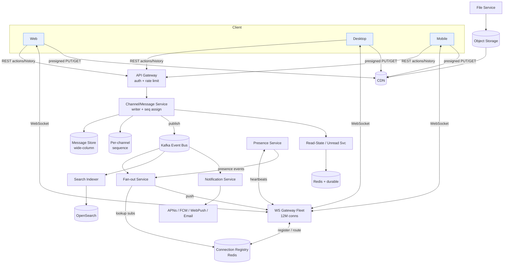
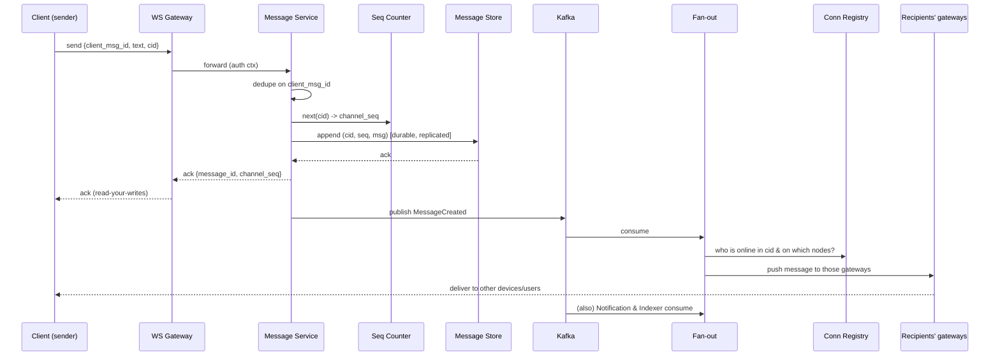

# Design Slack — High-Level Design (Staff-Level Interview Reference)

> A complete, interview-ready HLD for a Slack-style team-messaging product: workspaces, channels, real-time fan-out, history & search, presence, notifications, unread counts, threads, files, and multi-device sync.

---

## 1. Problem & Clarifying Questions

**Restated problem.** Build a team-collaboration messaging platform ("Slack"). Users belong to one or more **workspaces** (an isolated organization/tenant). Within a workspace, communication happens in **channels** (named, persistent, multi-party rooms — public or private), in **direct messages (DMs)** between 1:1 or small groups, and in **threads** (a sub-conversation hanging off a single parent message). Messages must be delivered in **near-real-time** to every connected member, persisted as durable **history**, made **searchable**, and synchronized across a user's **multiple devices** (laptop web, desktop app, phone). The system must show **presence** (online/away), **typing indicators**, **per-channel unread counts and mention badges**, push **notifications** to offline/background devices, and support **file sharing**.

Before drawing a single box, I would interrogate the interviewer. The questions below are the ones that actually move the design; I group them and then commit to assumptions so the rest of the document is concrete.

### 1.1 Functional scope questions
- **Channel types:** Public, private, DMs, group DMs — all four? Shared channels across two workspaces (Slack Connect)? *(I'll include the first four; treat Slack Connect as an extension.)*
- **Threading model:** Are threads a first-class, arbitrarily deep tree, or one level deep (parent → replies) like real Slack? *(Assume one level: a parent message and a flat list of replies, with optional "also send to channel".)*
- **Edit/delete:** Can users edit and delete messages? Tombstones or hard delete? *(Yes — edit + soft-delete with tombstone, for history consistency and audit.)*
- **Reactions:** Emoji reactions with per-message aggregate counts and reactor lists? *(Yes — they're a high-volume write and worth designing for.)*
- **Search scope:** Full-text search over messages and file contents, scoped to channels a user can access? Ranking by recency + relevance? *(Yes — message full-text + filename; file *content* indexing is an extension.)*
- **Read receipts:** Per-message "seen by" like WhatsApp, or just per-channel unread counts? *(Slack does *not* do per-message read receipts; we do **per-channel unread + mention counts** — and that counting problem is a core deep dive.)*
- **Notifications:** Web push, mobile push (APNs/FCM), email digests, with per-channel/per-keyword notification preferences and DND (do-not-disturb)? *(Yes.)*
- **Files:** Upload/download, thumbnails, inline previews, max size? *(Yes; assume 1 GB max per file, object storage + CDN.)*
- **Huge channels:** Do we support announcement channels with 100k+ members? *(Yes — fan-out to very large channels is a deep dive.)*

### 1.2 Non-functional questions
- **Latency target** for message send→delivery to other online members? *(p99 ≤ 500 ms end-to-end; same-region p50 ≤ 100 ms.)*
- **Availability** target? *(99.99% for send/receive; search and history can be 99.9%.)*
- **Consistency:** Is strict global ordering required, or per-channel ordering with eventual cross-channel consistency? *(Per-channel total order is required; cross-channel ordering is not.)*
- **Durability:** Once the server acks a send, can the message ever be lost? *(No — acked ⇒ durable. This drives the write path.)*
- **Retention:** Infinite history or tiered (hot/warm/cold)? *(Tiered: hot 90 days, warm to cold object storage thereafter; configurable per workspace.)*
- **Compliance:** Tenant isolation, data residency (EU data stays in EU), eDiscovery/export, encryption at rest? *(Yes — multi-tenant isolation is a hard requirement.)*

### 1.3 Scale questions
- **DAU / peak concurrency?** *(Assume 50M DAU, ~12M peak concurrent WebSocket connections globally.)*
- **Messages/day?** *(Assume 5B messages/day including system messages.)*
- **Avg workspace size & channel size?** *(Median workspace ~50 users; p99 workspace ~50k users; largest channels ~250k members.)*
- **Devices per user?** *(~2.5 active devices/user.)*

### 1.4 Out of scope (stated explicitly)
Voice/video huddles & calls (WebRTC SFU is a separate system), screen sharing, the Slack app/bot marketplace runtime, workflow automation builder, enterprise key management (BYOK) internals, and billing. I'll mention hooks where these attach.

---

## 2. Requirements (Finalized)

### 2.1 Functional
1. **Workspaces & membership** — users join workspaces; RBAC (owner/admin/member/guest); guests restricted to specific channels.
2. **Channels** — create/archive public & private channels; join/leave; DMs and group DMs (≤ 9 people).
3. **Messaging** — send/edit/delete text messages with rich formatting, mentions (`@user`, `@channel`, `@here`), and links with unfurls.
4. **Threads** — reply to a message; replies form a flat list; optional broadcast to channel.
5. **Reactions** — add/remove emoji reactions; aggregated counts.
6. **Real-time delivery** — online members receive new messages, edits, deletes, reactions, and typing/presence events within the latency budget.
7. **History** — durable, paginated, ordered backscroll per channel/thread; jump-to-date.
8. **Search** — full-text across accessible channels; filter by user/channel/date/has:file.
9. **Unread state** — per-user-per-channel unread message count + unread mention count; "mark as read"; badge totals per workspace.
10. **Presence & typing** — online/away/offline; "X is typing…".
11. **Notifications** — mobile/web push, email fallback, per-channel prefs, keyword alerts, DND, mute.
12. **Files** — upload, store, preview, download, with access control matching channel membership.
13. **Multi-device sync** — a user's read state, drafts, and message stream are consistent across all their devices.

### 2.2 Non-functional
| Property | Target | Notes |
|---|---|---|
| Send→deliver latency | p50 ≤ 100 ms (same region), p99 ≤ 500 ms | Excludes cross-continent network |
| Availability (send/receive) | 99.99% | History/search 99.9% |
| Durability | ≥ 11 nines; acked = never lost | Replicated WAL + object storage |
| Ordering | **Per-channel total order** | Monotonic per-channel sequence |
| Consistency | Read-your-writes for sender; per-channel monotonic for others | Unread counts: eventually consistent, self-healing |
| Scale | 50M DAU, 12M concurrent conns, 5B msgs/day | See §3 |
| Tenant isolation | Hard | Every query is workspace-scoped |
| Retention | Hot 90d, then warm/cold | Configurable |

### 2.3 Key assumptions
- Per-channel **total ordering** via a monotonically increasing per-channel sequence number assigned by a single logical writer for that channel. **No global clock.**
- Read state and unread counts are **eventually consistent and self-correcting** — a stale badge for a few seconds is acceptable; a permanently wrong one is not.
- Average message ≈ 200 bytes payload (text + metadata); media is out-of-band in object storage.
- A persistent connection (WebSocket) is the primary transport; long-poll/SSE fallback exists.

---

## 3. Capacity Estimation (show the arithmetic)

### 3.1 Write QPS (message sends)
- 5B messages/day ÷ 86,400 s ≈ **57,900 msgs/s average**.
- Peak factor ~3× (workday spikes, time-zone overlap) ⇒ **~175k msgs/s peak writes**.
- Add edits/deletes/reactions/typing-acks. Reactions alone are ~2–3× message volume in active channels but are tiny; typing events are ephemeral and **never persisted**. Persisted non-message writes ≈ another ~100k/s peak (reactions, read-state checkpoints). Call it **~280k persisted writes/s peak**.

### 3.2 Read / fan-out QPS (the real load)
The dominant cost is **fan-out**: one send delivered to many connected members.
- Average channel "delivery fan-out" — most messages go to small channels, but a long tail goes to large ones. Assume **average effective fan-out = 30 recipients online per message**.
- Real-time delivery events ≈ 175k msgs/s × 30 = **~5.25M delivery pushes/s peak** over WebSockets.
- History reads (backscroll, app open, channel switch): assume each DAU opens the app ~20×/day and switches channels ~50×/day, each fetching ~50 messages.
  - 50M × 50 = 2.5B channel-loads/day ÷ 86,400 ≈ **29k channel-loads/s avg**, ~90k/s peak, each returning ~50 msgs ⇒ **~4.5M message-rows/s read peak** (served largely from cache).

### 3.3 Connection capacity
- 12M concurrent WebSocket connections. A well-tuned gateway node (epoll/Netty, ~16 vCPU, 64 GB) holds **~250k–500k idle connections**.
- 12M ÷ 300k ≈ **~40 gateway nodes** for steady state; provision **~80–100** for headroom, rolling deploys, and zonal failure (lose a zone, keep capacity).

### 3.4 Storage
- **Messages:** 5B/day × 200 bytes payload ≈ **1 TB/day raw**. With indexes, replication (×3), and metadata overhead, budget **~4–5 TB/day** in the hot store.
  - Annual hot+warm: 5B × 365 ≈ **1.8 trillion messages/yr**; ~365 TB/yr raw, ~1.5 PB/yr replicated. Tiering to cold (compressed object storage, ~5:1) keeps long-term cost sane.
- **Search index:** inverted index ~30–50% of text size ⇒ ~0.3–0.5 TB/day of new indexed content; with replication and per-tenant shards, plan for a multi-PB Elasticsearch/OpenSearch-like fleet for the hot window (90 days searchable by default; older searchable on demand).
- **Files:** assume 5% of messages carry a file, avg 500 KB ⇒ 250M files/day × 500 KB = **125 TB/day** to object storage. This dwarfs text and is why files live in S3-class storage + CDN, never in the message DB.

### 3.5 Bandwidth
- Real-time egress: 5.25M pushes/s × ~300 bytes (framed event) ≈ **~1.6 GB/s ≈ 12.6 Gbps** of WebSocket egress at peak (excludes files/CDN).
- File traffic is served by CDN; origin egress is a fraction of the 125 TB/day after cache hits.

### 3.6 Memory (presence, fan-out routing, unread)
- **Presence + connection registry:** 12M connections × ~200 bytes (user→node, session, last-seen) ≈ **2.4 GB**, trivially held in a sharded in-memory store (Redis cluster), but the *write rate* of presence/last-seen updates is the concern, not size.
- **Channel→subscriber routing** for fan-out: large channels need a fast "who is online in this channel and on which gateway node" lookup. Held in Redis, partitioned by channel.
- **Unread counters:** per (user, channel) last-read sequence + cached unread count. 50M users × ~50 active channels = 2.5B rows × ~40 bytes ≈ **100 GB** of hot counter state — sharded Redis + durable backing store.

### 3.7 Shard/cluster sizing (rule-of-thumb)
- Message store (e.g., Cassandra/Scylla-class wide-column): size by write throughput + storage. At ~280k writes/s and PB-scale storage, plan **hundreds of nodes**, sharded by `(workspace_id, channel_id)`.
- Gateways: ~80–100 nodes (above).
- Fan-out/session services: scale with delivery QPS (~5M/s) — **dozens of stateless workers** behind the connection registry.

> **Headline numbers to remember:** ~175k msg-writes/s peak, ~5M real-time pushes/s, 12M concurrent connections (~80–100 gateway nodes), ~1 TB/day raw text, ~125 TB/day files to object storage, ~12 Gbps WebSocket egress.

---

## 4. API Design

Two transports: **HTTP/REST (or gRPC)** for request/response actions and history, and a **WebSocket** for the bidirectional real-time stream. Auth via short-lived bearer token (OAuth-style) carried on the WS upgrade and on each REST call.

### 4.1 REST / RPC (selected, signatures)

```
POST   /v1/channels                          -> {channel_id}
       body: {workspace_id, type, name, is_private, member_ids[]}
POST   /v1/channels/{cid}/members            -> 200            // join/invite
DELETE /v1/channels/{cid}/members/{uid}       -> 200           // leave/kick

POST   /v1/channels/{cid}/messages
       body: {client_msg_id (UUID, idempotency key), text, thread_parent_id?,
              attachments[], broadcast_to_channel?}
       -> {message_id, channel_seq, server_ts}

PATCH  /v1/messages/{mid}    body:{text}      -> {edited_ts}
DELETE /v1/messages/{mid}                     -> {deleted_ts}   // soft delete

GET    /v1/channels/{cid}/messages?before=<seq>&limit=50
       -> {messages:[...], has_more, next_cursor}              // backscroll
GET    /v1/threads/{parent_mid}/replies?before=<seq>&limit=50  -> {...}

POST   /v1/messages/{mid}/reactions  body:{emoji}  -> {counts}
DELETE /v1/messages/{mid}/reactions/{emoji}        -> {counts}

POST   /v1/channels/{cid}/read   body:{up_to_seq}  -> {unread, unread_mentions}
GET    /v1/workspaces/{wid}/unread                 -> {per_channel:{cid:{unread,mentions}}}

GET    /v1/search?q=...&workspace=<wid>&in=<cid?>&from=<uid?>&after=<date?>
       -> {hits:[{message_id, channel_id, highlight, score}], cursor}

POST   /v1/files/upload-url  body:{filename, size, mime}
       -> {file_id, upload_url (presigned), headers}            // client PUTs to object store directly
POST   /v1/files/{file_id}/complete                -> {file_id, ready:true}

PUT    /v1/notification-prefs  body:{channel_overrides, keywords[], dnd_schedule} -> 200
```

### 4.2 WebSocket protocol (real-time)

Client connects: `wss://gw.slack/ws?token=...`. After auth, the server replays missed events using a client-supplied cursor, then streams live.

**Client → server frames**
```json
{"type":"hello","last_seen":{"<cid>":<seq>}, "device_id":"d-123"}
{"type":"typing","channel_id":"C1","thread_parent_id":null}
{"type":"presence_sub","channel_ids":["C1","C2"]}     // who to track presence for
{"type":"ack","up_to":<server_event_seq>}             // flow control
```

**Server → client frames**
```json
{"type":"message","channel_id":"C1","message":{...},"channel_seq":42}
{"type":"message_edited","message_id":"M9","text":"...","edited_ts":...}
{"type":"reaction","message_id":"M9","emoji":"+1","count":3,"by":["U1"]}
{"type":"typing","channel_id":"C1","user_id":"U7"}
{"type":"presence","user_id":"U7","status":"active"}
{"type":"unread_update","channel_id":"C1","unread":5,"mentions":1}
{"type":"sync","cursor":<server_event_seq>}           // checkpoint for resume
```

**Design choices baked into the API**
- **`client_msg_id`** (idempotency key): client generates a UUID; resends after a network blip are deduped server-side ⇒ exactly-once *effect* despite at-least-once delivery.
- **`channel_seq`** is the per-channel monotonic sequence — clients use it for ordering, gap detection, and resume.
- **Presigned upload URLs**: clients upload bytes *directly* to object storage, never through app servers — keeps the hot path thin (avoids the failure mode of app servers becoming a 125 TB/day bottleneck).
- **Cursored, not offset, pagination**: avoids the deep-pagination failure mode (`OFFSET 100000` table scans) in huge channels.

---

## 5. High-Level Architecture

### 5.1 Component overview
- **Edge / LB + API Gateway** — TLS termination, auth, routing, global rate limiting.
- **WebSocket Gateway fleet** — holds the 12M persistent connections; stateless w.r.t. business logic; knows only "this connection belongs to user U, device D, subscribed to channels {…}". Registers itself in the **connection registry**.
- **Connection Registry (Redis)** — `user_id → {gateway_node, session}` and `channel_id → set<gateway_node>`; the routing table for fan-out.
- **Channel Service / Message Service** — owns sequence assignment, persistence, validation, access checks. The authoritative writer per channel.
- **Fan-out Service** — given a persisted event, looks up online subscribers and pushes to the right gateway nodes; handles large-channel fan-out specially.
- **Message Store (wide-column, e.g., Scylla/Cassandra)** — durable per-channel ordered log + message rows.
- **Sequence/Coordination** — per-channel monotonic counter (see §7.1).
- **Unread/Read-State Service** — last-read pointers + counters (Redis hot + durable backing).
- **Presence Service** — heartbeats, status, fanned out to subscribers.
- **Search Service** — Elasticsearch/OpenSearch fleet fed by a CDC/ingestion pipeline.
- **Notification Service** — decides who to push to (offline/background), talks to APNs/FCM/web push/email.
- **File Service + Object Storage + CDN** — presigned uploads, metadata, virus scan, thumbnails.
- **Event Bus (Kafka)** — the spine connecting write path → fan-out, search indexer, notifications, analytics.

### 5.2 ASCII block diagram

```
                         ┌──────────────────────────────────────────┐
   Clients (web/desktop/mobile)                                      │
        │  REST (actions/history)        WebSocket (real-time)       │
        ▼                                        ▼                    │
 ┌───────────────┐                      ┌──────────────────┐         │
 │  Edge LB +    │                      │  WS Gateway fleet │◄────────┘
 │  API Gateway  │                      │  (12M conns,      │  pushes
 │ (auth,rate)   │                      │   80-100 nodes)   │
 └──────┬────────┘                      └───────┬───────────┘
        │                                       │ register conn / route
        ▼                                       ▼
 ┌───────────────┐                      ┌──────────────────┐
 │ Channel /     │   seq assign         │ Connection       │
 │ Message Svc   │◄────────► (per-chan   │ Registry (Redis) │
 │ (writer)      │           counter)    │ user→node,       │
 └──┬────┬───────┘                      │ chan→nodes       │
    │    │ persist                       └────────▲─────────┘
    │    ▼                                        │ lookup subscribers
    │  ┌──────────────┐    publish events  ┌──────┴─────────┐
    │  │ Message Store │───────────────────►│  Event Bus     │
    │  │ (wide-column) │                    │  (Kafka)       │
    │  └──────────────┘                    └─┬───┬───┬───┬───┘
    │                                         │   │   │   │
    │ read-state                              ▼   ▼   ▼   ▼
    ▼                                   ┌─────┐ ┌────┐ ┌────┐ ┌─────────┐
 ┌──────────────┐                       │Fan- │ │Sear│ │Noti│ │Presence │
 │ Unread/Read  │                       │out  │ │ch  │ │fic.│ │ Service │
 │ State Svc    │                       │Svc  │ │Idx │ │Svc │ │         │
 │ (Redis+DB)   │                       └──┬──┘ └─┬──┘ └─┬──┘ └────┬────┘
 └──────────────┘                          │      ▼      ▼         │
                                           │   ┌────┐ ┌──────────┐ │
        ┌──────────────┐  presign          │   │ES  │ │APNs/FCM/ │ │
        │ File Service │  upload            │   │/OS │ │web/email │ │
        │ + Object Sto │◄─── clients ──────┘   └────┘ └──────────┘ │
        │ + CDN        │   (direct PUT/GET)                         │
        └──────────────┘                       push to gateways ◄──┘
```

### 5.3 Mermaid — component diagram



### 5.4 Send path — sequence diagram



The **ack to the sender happens after durable persistence** but *before* fan-out completes — the sender's send is "safe" the instant it's stored and sequenced; delivery to others is asynchronous via the bus. This decoupling is what lets the system absorb fan-out spikes without slowing down sends.

---

## 6. Data Model & Storage Choices

### 6.1 Entities
- **Workspace**(`workspace_id`, name, plan, region, retention_policy).
- **User**(`user_id`, …) and **Membership**(`workspace_id`, `user_id`, role, joined_ts).
- **Channel**(`channel_id`, `workspace_id`, type{public,private,dm,group_dm}, name, is_archived, created_ts).
- **ChannelMember**(`channel_id`, `user_id`, joined_ts, last_read_seq, notification_pref).
- **Message**(`channel_id`, `channel_seq`, `message_id`, `user_id`, text, thread_parent_id?, edited_ts?, deleted_ts?, attachments[], reactions{}, server_ts).
- **ThreadMeta**(`parent_message_id`, reply_count, last_reply_seq, participant_ids[]).
- **ReadState**(`user_id`, `channel_id`, last_read_seq, unread_count, unread_mentions).
- **File**(`file_id`, `workspace_id`, uploader, size, mime, object_key, thumbnails[], scan_status).

### 6.2 Datastore choices (justified against access patterns)

| Data | Access pattern | Store | Why (and failure mode avoided) |
|---|---|---|---|
| Messages / history | Append-heavy; read recent range by `(channel_id, seq)`; backscroll | **Wide-column (Cassandra/Scylla)**, partition `= (workspace_id, channel_id)`, clustering `= channel_seq DESC` | Linear-scalable writes, locality of a channel's history in one partition, cheap range scans. Avoids the RDBMS single-master write-ceiling failure mode at 280k writes/s |
| Channel/workspace/membership metadata | Strongly-consistent reads, relational, modest volume | **Relational (Postgres) / Spanner-class** | ACID for membership & RBAC; small enough to fit a sharded SQL fleet. Avoids the consistency hazards of eventual stores for access control |
| Read-state / unread counters | Tiny, hot, very high write rate, must self-heal | **Redis (hot) + durable log/DB (backing)** | O(1) counter math; backing store reconstructs on cache loss. Avoids the lost-counter failure mode |
| Connection registry, presence | Ephemeral, high churn, sub-ms lookups | **Redis cluster (sharded), TTL'd** | Volatile by design; rebuilt from heartbeats. Avoids persisting throwaway state |
| Search | Inverted-index full-text + filters | **OpenSearch/Elasticsearch**, per-tenant routing | Purpose-built for ranked text search. Avoids `LIKE '%...%'` table-scan failure mode |
| Files (bytes) | Large blobs, immutable, CDN-served | **Object storage (S3-class) + CDN** | Cheap, durable, offloads bandwidth. Avoids DB-as-blob-store bloat |
| Event spine | Ordered, replayable, multi-consumer | **Kafka**, key = `channel_id` | Per-channel ordering, replay for indexer/notifications, backpressure buffer. Avoids tight coupling and thundering-herd on the write path |

**Why a wide-column store as the message system of record (not Kafka, not Postgres):** Kafka gives us ordering and a replayable spine but is a *transport*, not a queryable history (you can't efficiently "give me messages 5000–5050 of channel C"). Postgres gives us queries and ACID but a single channel's write rate plus 1 TB/day across the fleet exceeds a single-master comfortably; sharded Postgres is viable but operationally heavier for this append/range pattern. A wide-column store nails the dominant pattern — *append, then range-scan by sequence within a partition* — at horizontal scale.

### 6.3 Message table layout (Cassandra-style)
```
TABLE messages (
  workspace_id text, channel_id text,     -- partition key bucket
  bucket int,                              -- time/seq bucket to cap partition size
  channel_seq bigint,                      -- clustering, DESC
  message_id timeuuid, user_id text,
  text text, thread_parent_id bigint,
  attachments list<frozen<file_ref>>,
  reactions map<text,int>, edited_ts ts, deleted_ts ts,
  PRIMARY KEY ((workspace_id, channel_id, bucket), channel_seq)
) WITH CLUSTERING ORDER BY (channel_seq DESC);
```
The **`bucket`** prevents unbounded partitions for hot channels (a Cassandra anti-pattern is the multi-GB partition). We bucket by ranges of `channel_seq` (e.g., 100k messages per bucket) so backscroll reads at most a couple of buckets.

---

## 7. Deep Dives (the bulk)

The genuinely hard sub-problems for Slack: **(7.1) per-channel ordering + idempotent writes**, **(7.2) real-time fan-out, especially to huge channels**, **(7.3) unread counts per user per channel**, **(7.4) multi-device sync & resume**, and **(7.5) presence/typing at scale**. Search, threads, files, and notifications follow.

---

### 7.1 Per-channel ordering & idempotent, durable writes

**The problem.** Every client must see the *same order* of messages in a channel, gaps must be detectable, and a send acked once must never duplicate or vanish — even across client retries and server failovers.

**Why "use a timestamp" fails.** Wall clocks across servers skew by tens of ms; two near-simultaneous sends can interleave differently per observer, and edits/deletes need a stable anchor. We need a **monotonic, gap-free, per-channel sequence**, not a timestamp.

**Options for assigning `channel_seq`:**

| Option | How | Pros | Cons / failure mode |
|---|---|---|---|
| A. Single global sequencer | One service mints all seqs | Simple ordering | Global bottleneck & SPOF; can't do 175k/s; couples all channels |
| B. Per-channel single-writer (sharded) | Route a channel's writes to one owner partition that holds an in-memory counter backed by durable store | Per-channel total order, scales by sharding channels across owners | Requires ownership/leasing & failover; counter must survive owner crash |
| C. DB-native counter (e.g., conditional update / `IF` LWT) | Atomic increment in the store | No separate coordinator | LWT/Paxos per write is slow; hot-channel contention |
| D. Kafka partition offset as seq | One partition per channel, use offset | Free ordering + durability | Per-partition throughput cap; millions of channels ⇒ too many partitions; offsets not user-friendly |

**Decision: B — per-channel single-writer with sharded ownership.** Channels are hashed to **shards**; each shard is owned by one **writer instance** (leader, via a lease in a coordination service like etcd/Zookeeper/Raft group). The writer holds the channel's `next_seq` in memory, durably checkpoints it (e.g., every N or with the message append in the same atomic batch), and assigns sequence numbers without contention. This gives **per-channel total order without a global bottleneck** and avoids the SPOF of option A and the per-write Paxos cost of C.

**Failover correctness.** If a writer dies, its shards' leases expire and a new owner takes over. The new owner recovers `next_seq` from the **max persisted `channel_seq`** in the store (the source of truth) — so even if the in-memory counter is ahead of the last durable checkpoint, recovery from the durable max is always safe. We never reuse a sequence because we read the durable high-water mark, and we tolerate *gaps* (a crash between seq-assign and persist simply skips that number; clients treat gaps as "no message there", not an error).

**Idempotency.** Client supplies `client_msg_id` (UUID). The writer keeps a short-lived dedup cache (`client_msg_id → assigned channel_seq`, TTL minutes) plus a durable uniqueness on `(channel_id, client_msg_id)`. A retried send returns the *same* `channel_seq` — **exactly-once effect over at-least-once delivery**. This avoids the duplicate-message failure mode when a client retries after a lost ack.

**Edits/deletes** are *new* events referencing `message_id`, not in-place mutations of the ordered log — preserving the append-only, replayable property. Clients apply them by id.

---

### 7.2 Real-time fan-out (including 250k-member channels)

**The problem.** A single message must reach every *online* member's every *device*, fast. Most channels are small, but the tail (announcement channels, `@everyone`) is brutal: one message → 250k deliveries in a burst.

**Routing primitive.** The **connection registry** maps `user_id → gateway_node(s)` and, derived from channel membership + presence, `channel_id → set<gateway_node, [user_ids]>`. The **fan-out service** consumes `MessageCreated` from Kafka (keyed by channel for ordering) and:
1. Resolves online members of the channel.
2. Groups them by gateway node.
3. Sends **one batched push per gateway node** (not per user) carrying the message + recipient list; the gateway demuxes locally to each connection.

This **node-level batching** is the key efficiency: a 250k-member channel spread over 80 gateways is ~80 RPCs from fan-out, not 250k.

**Small vs. large channels (tradeoff):**

| Approach | Best for | Mechanism | Failure mode avoided |
|---|---|---|---|
| Push fan-out (eager) | Small/medium channels | On send, immediately push to all online members | Latency low; but on huge channels causes write-amplification storm |
| Pull / lazy | Huge, low-engagement channels | Don't push to everyone; clients poll/get on focus; only push to *active* viewers + bump unread | Avoids 250k-burst write storm |
| Hybrid (chosen) | All | Push to **active subscribers** (channel currently focused or recently active) + to those who need a **notification/unread bump**; lazy-load history for the rest | Combines low latency for engaged users with bounded burst |

**Decision: hybrid, with "active subscriber" sets.** A user who has channel C in the foreground is an *active subscriber* and gets eager push. A member who isn't actively viewing gets only an **unread/mention update** (a tiny event) and, if their prefs warrant, a notification — they pull the actual messages when they next open the channel. For a 250k announcement channel, maybe 5k are active ⇒ we eagerly push 5k messages and 245k lightweight unread bumps (which are themselves coalesced — see §7.3). This avoids the **fan-out storm failure mode** where one `@channel` in a giant room saturates the bus and gateways.

**Backpressure & slow consumers.** Each connection has a bounded send buffer at the gateway. If a client is slow (mobile on a train), the gateway drops to a **"resync needed"** state for that connection: instead of buffering unboundedly (memory-blowup failure mode), it tells the client "you're behind, fetch from cursor X" and the client pulls. Real-time degrades gracefully to catch-up reads.

**Ordering during fan-out.** Because Kafka is keyed by `channel_id`, all events for a channel are consumed in order by one partition consumer, so deliveries preserve `channel_seq` order. Clients additionally use `channel_seq` to detect/repair gaps (if they receive seq 44 after last seeing 42, they fetch 43).

---

### 7.3 Unread counts per user per channel (the hard counting problem)

**Why it's hard.** Naively, unread = (messages in channel since I last read). With 50M users × ~50 channels = **2.5B counters**, each potentially incremented on every send and reset on every read, across multiple devices that must agree, and resilient to cache loss. Per-message increment fan-out to 2.5B counters is infeasible; yet a wrong badge is a top user complaint.

**Core idea: store pointers, not counters.** Maintain per (user, channel) a **`last_read_seq`** (the highest `channel_seq` the user has read). The unread count is *derivable*:
```
unread(user, channel) = count of messages in channel with seq > last_read_seq
                         (and not authored by user, and not deleted)
unread_mentions       = count of those that @-mention the user (or @channel/@here)
```
The channel already knows its **current high-water seq** (`channel_high_seq`). So a cheap, exact-ish unread is:
```
unread ≈ channel_high_seq - last_read_seq   (adjusted for own messages/deletes)
```
This turns 2.5B per-message updates into **two small numbers per (user,channel)** plus a correction. We don't increment a billion counters on each send; each member computes their own unread from the channel's high-water mark and their own pointer.

**Mentions need a real count, not subtraction.** `channel_high_seq - last_read_seq` gives total unread cheaply, but unread *mentions* require knowing which of those messages mention *me*. Options:

| Option | Mechanism | Pros | Cons |
|---|---|---|---|
| Per-message mention fan-out | On send, for each mentioned user, increment their mention counter | Exact, instant | Write per mention; `@channel` in 250k room = 250k writes |
| Mention index by (user, channel) | Append `(user, channel, seq)` to a per-user mention log | Exact, supports "jump to mention" | Storage; still per-mention write but only for *mentioned* users |
| Compute on read | Scan unread range, count mentions when channel opened | No write amplification | Read cost on open; needs message-level mention flags |

**Decision: hybrid.** For **direct mentions** (`@user`) — relatively rare — append to a **per-user mention log** keyed by `(user_id, channel_id, seq)`; the mention badge is the count of entries with `seq > last_read_seq`. For **`@channel`/`@here`** in large channels — the dangerous case — do **not** fan out a write per member; instead store a **channel-level "broadcast mention at seq S"** marker. Each member computes "do I have an unread broadcast mention?" as `exists broadcast_marker with S > last_read_seq` — O(small) per member, zero write amplification. This kills the **`@channel` write-storm failure mode**.

**Multi-device consistency.** `last_read_seq` is **monotonic non-decreasing** and shared across devices. When any device marks read up to seq X, it issues `read(channel, up_to=X)`; the read-state service takes `max(current, X)` (so out-of-order device updates can't *un-read* messages) and emits an `unread_update` event fanned to the user's *other* devices. Monotonic max + idempotency means devices converge without coordination — avoiding the **flapping-badge failure mode** across devices.

**Durability & self-healing.** `last_read_seq` lives in Redis (hot) **and** is written through to a durable store. On cache loss we rebuild from the durable copy; if even that is stale, the count self-corrects on next channel open (we recompute from messages). Because unread is *derived*, it can always be reconstructed — there is no "lost counter" that's gone forever, the failure mode that plagues increment-only designs.

**Workspace badge.** The app-icon badge = sum of unread mentions across the user's channels in a workspace. We keep a small **per-(user,workspace) rollup** updated when channel mention counts change, so the badge is one read, not a scatter-gather over 50 channels.

---

### 7.4 Multi-device sync, resume, and gap repair

**The problem.** A user's laptop, desktop, and phone must show the same messages, read state, and drafts. Devices go offline (sleep, tunnel, airplane mode) and must catch up *exactly* on reconnect without missing or duplicating events.

**Per-channel cursor = `channel_seq`.** Each device tracks, per channel, the highest `seq` it has applied. On (re)connect it sends `hello {last_seen:{cid:seq}}`. The gateway/sync service responds with **missed events since those cursors** (replayed from the message store and/or a short Kafka retention window), then switches to live streaming. Because seqs are monotonic and gap-detectable, the client knows exactly what it's missing.

**Bounded vs. unbounded catch-up:**

| Gap size | Strategy |
|---|---|
| Small (online recently) | Replay missed events from a hot buffer (Kafka/Redis), inline |
| Large (offline days) | Don't replay event-by-event; client does a **state sync**: fetch latest N per visible channel + new unread pointers, lazy-load older on scroll |
| Huge / first install | Cold start: load channel list + latest messages on demand |

This avoids the **infinite-replay failure mode** where a device offline for a week tries to stream a million events on reconnect.

**Read-state, drafts, and prefs sync.** Read state syncs via the monotonic `last_read_seq` (§7.3). **Drafts** are user-private state synced as last-writer-wins per (user, channel, device-aware) with a version vector or simple `updated_ts` — a draft is low-stakes, LWW is fine. Notification prefs are small and read-through cached.

**Exactly-once apply on the client.** Even with at-least-once delivery, the client dedupes by `message_id`/`channel_seq` and applies edits/reactions idempotently (apply by id, last edit wins by `edited_ts`). So a duplicated push is harmless.

---

### 7.5 Presence & typing indicators at scale

**The problem.** Presence (active/away/offline) and typing are **high-churn, low-value-per-event** signals. Done naively (push every user's every status change to everyone who *might* care), it's an O(N²) firehose that dwarfs real messaging.

**Presence design.**
- **Source of truth = connection heartbeats.** A user is "active" if they have a live WS connection sending heartbeats; "away" after an idle timeout; "offline" after all connections drop + grace period.
- **Subscription-scoped, not broadcast.** A client only subscribes to presence for users it can *see* (members of the currently open channel, DM list, sidebar). The presence service maintains `interested_in(user) → subscribers` and pushes changes only to interested parties. This bounds fan-out to the working set, avoiding the broadcast-everything failure mode.
- **Coalescing & debouncing.** Rapid flaps (laptop sleeping/waking) are debounced; we push at most one presence change per user per few seconds.
- **Last-seen** stored in Redis with TTL; refreshed by heartbeat. If the presence node loses state, heartbeats rebuild it within one interval (ephemeral by design — never persisted durably).

**Typing indicators.**
- **Never persisted, never go through Kafka or the message store.** Typing is a transient, best-effort event sent directly via the WS path to the *active subscribers* of that channel (the few people currently looking at it), with a short auto-expire (~3–5 s) on the client.
- **Rate-limited at the source**: a client sends at most one "typing" per few seconds regardless of keystrokes — avoiding a keystroke-per-event flood.
- For huge channels, typing is **suppressed** beyond a member threshold (Slack stops showing "X is typing" in big channels) — bounding the otherwise unbounded typing fan-out.

**Why separate from the durable path:** mixing ephemeral typing/presence into Kafka + message store would (a) bloat durable storage with worthless data and (b) couple a best-effort signal to the must-not-lose path. Keeping them on a separate, lossy, in-memory channel is the correct tradeoff — losing a typing event costs nothing.

---

### 7.6 Search (history full-text)

**Pattern.** Searches are full-text + filters (`in:channel`, `from:user`, `after:date`, `has:file`), **ranked** by relevance + recency, and **scoped by access control** (you can only find messages in channels you can read).

**Pipeline.** Kafka `MessageCreated/Edited/Deleted` → **search indexer** → OpenSearch. We index `text`, `user_id`, `channel_id`, `workspace_id`, `ts`, mentions, and `has_file`. Edits update the doc; deletes remove/tombstone it. **Per-tenant routing** (route by `workspace_id`) keeps a workspace's data co-located and isolates blast radius.

**Access control in search (the subtle part).** A user must not find messages in private channels they're not in. Two options: (a) **post-filter** results against the user's channel membership — simple but can return empty pages after filtering; (b) **constrain the query** with the user's accessible-channel set (a filter clause of allowed `channel_id`s). For users in thousands of channels, the allow-list is large; we cap it and fall back to post-filtering with over-fetch. We choose **query-time constraint with an allowed-channels filter**, refreshed from a cached membership set, falling back to post-filter for outliers — avoiding the **privacy-leak failure mode** of returning then hiding restricted hits inconsistently.

**Scale.** Index the **hot window (90 days)** for instant search; older content is searchable on demand (rehydrate from cold storage into a temporary index, or a slower cold-search path). This bounds the hot index size (§3.4) instead of indexing trillions of messages live.

---

### 7.7 Threads

A thread is a parent message + a flat reply list. Replies are **regular messages** with `thread_parent_id` set; they get their own `channel_seq` for global channel ordering but are *displayed* under the parent. We maintain **ThreadMeta**(`reply_count`, `last_reply_seq`, `participant_ids`) updated on each reply for cheap "N replies / last reply at" rendering without scanning. "Also send to channel" sets `broadcast_to_channel=true`, making the reply appear inline in the main channel too (it already has a channel seq, so this is a display flag). **Unread for threads**: thread participants get unread/mention treatment per thread (a per-(user, thread) `last_read_seq`), so you can have unread thread replies even with a "read" channel — a small extension of §7.3 keyed by thread.

---

### 7.8 File sharing

**Upload (offload the hot path).** Client calls `POST /files/upload-url` → gets a **presigned URL** and `file_id` → **PUTs bytes directly to object storage** (never through app servers). On completion, client calls `/complete`; the File Service triggers **async virus scan** + **thumbnail/preview generation**, sets `scan_status`. The message references `file_id`. Downloads are **CDN-served** with **signed, expiring URLs** scoped to channel membership.

**Access control.** A file inherits the access of the channels it's shared in; the signed URL is minted only after an authz check. This avoids the **public-object-leak failure mode** (publicly readable buckets) — objects are private; access is always brokered.

**Why direct-to-object + CDN:** at 125 TB/day, routing bytes through app servers would require enormous app-tier bandwidth and turn the message path into a file pipe. Presigned URLs + CDN keep the message path lean and push bandwidth to purpose-built infrastructure.

### 7.9 Notifications

The **Notification Service** consumes message/mention events and decides, per recipient: are they **online & active** (no push — they saw it), **online but channel unfocused** (in-app unread bump only), or **offline/background** (push)? It honors **per-channel prefs** (all/mentions/none/mute), **keyword alerts**, and **DND schedules**. Pushes go to **APNs/FCM** (mobile), **web push**, or **email digest** (fallback after a delay if unread+unseen). To avoid notification storms, mentions are **coalesced** (e.g., "3 new messages in #general") and rate-limited per user. Token management handles device registration/expiry.

---

## 8. Scaling & Bottlenecks

**How it scales (each axis):**
- **Connections** → add gateway nodes; registry sharded by user. Linear.
- **Writes** → channels sharded across writer-owners; message store sharded by `(workspace, channel)`. Linear with shards.
- **Fan-out** → stateless workers scaled by delivery QPS; node-level batching caps cost.
- **Search** → OpenSearch sharded by workspace; hot-window bounds index size.
- **Files** → object storage + CDN scale independently.

**Where it breaks first, and the fix:**

| Bottleneck | Symptom | Fix |
|---|---|---|
| Hot channel (single writer) | One huge channel's writer saturates | Sequence is per-channel; a single mega-channel is still one ordered stream — cap with rate limits & "slow-mode"; shard fan-out (not ordering) across workers |
| `@channel` in 250k room | Fan-out & unread storm | Broadcast-mention marker (§7.3) + hybrid fan-out (§7.2) + coalesced notifications (§7.9) |
| Connection registry hot keys | Mega-channel lookup is large | Cache `channel→nodes` aggregates; maintain at node granularity, not per-user |
| Slow consumers | Gateway memory blowup | Bounded buffers + "resync from cursor" degrade-to-pull |
| Kafka partition skew | One channel's partition lags | Key by channel; for mega-channels, allow fan-out to scale horizontally while ordering stays per-partition |
| Search hot tenant | One giant workspace's queries dominate | Per-tenant routing + dedicated shards/clusters for whale tenants |
| Cassandra wide partition | Hot channel partition grows unbounded | `bucket` key caps partition size (§6.3) |
| Cross-region latency | p99 blows past budget | Region-local gateways + writers; cross-region async replication; route users to home region |

**Multi-region.** Pin a workspace to a **home region** (for data residency + ordering simplicity); users connect to the nearest gateway which proxies to the home region's writer. Cross-region members tolerate slightly higher latency. This avoids the **multi-master ordering nightmare** (two regions assigning seqs to the same channel) — ordering authority stays single-region per channel.

---

## 9. Reliability, Consistency & Security

**Consistency model (precise):**
- **Per-channel total order**, monotonic `channel_seq`, gap-detectable (§7.1).
- **Sender:** read-your-writes (acked after durable persist, before fan-out).
- **Other members:** monotonic per-channel delivery; may lag by the fan-out budget (< 500 ms p99).
- **Unread/presence:** eventually consistent, self-healing.

**Durability & failure handling.**
- Message store replicated (RF=3, quorum writes) ⇒ acked = durable across failures.
- **Writer failover:** lease expiry → new owner recovers `next_seq` from durable max (§7.1). Brief unavailability for that shard's channels; clients retry idempotently.
- **Kafka** buffers events so a transient fan-out/indexer/notification outage causes *delay*, not loss — consumers resume from offsets.
- **Gateway crash:** clients reconnect (to another node), `hello` with cursors, replay missed events (§7.4). No message lost because the message store, not the gateway, is the source of truth.
- **At-least-once delivery + idempotent apply** (dedup by `client_msg_id` on write, by `message_id` on client) ⇒ exactly-once *effect*.

**Idempotency** is enforced at three layers: write (`client_msg_id`), read-state (monotonic max), client apply (by id).

**Security & multi-tenancy.**
- **Tenant isolation:** every query carries and is filtered by `workspace_id`; storage partitioned by tenant; search routed per tenant. No cross-tenant reads possible by construction.
- **AuthN:** OAuth-style short-lived bearer tokens; WS upgrade authenticated; tokens refreshed.
- **AuthZ / RBAC:** owner/admin/member/guest; private channels and DMs enforced on every read/write *and* in search.
- **Encryption:** TLS in transit; at-rest encryption for stores and object storage; signed expiring URLs for files; optional enterprise key management (BYOK) as an extension.
- **Abuse / rate limiting:** per-user and per-workspace limits on sends, file uploads, search queries, and connection attempts at the API gateway; typing/presence rate-limited at source; slow-mode for hot channels.
- **Compliance:** soft-delete tombstones for auditability, eDiscovery export, data-residency via home-region pinning, retention enforcement jobs that tier/expire data.

---

## 10. Extensions & Follow-ups

| Extension | How the design changes |
|---|---|
| **Slack Connect (shared channels across workspaces)** | Channel belongs to two tenants; need cross-tenant access checks, dual home-region replication, and a federation layer for ordering — pick one workspace as the channel's ordering authority |
| **Message reactions at extreme scale** | Reactions become their own high-volume aggregated counter; use the same derive-don't-increment trick (store reactor set, aggregate lazily) |
| **Read receipts ("seen by")** | Would require per-message per-user state — expensive; we deliberately avoided it. If demanded, sample/aggregate rather than per-message-per-user |
| **End-to-end encryption (DMs)** | Server can't index/search content; search moves client-side; fan-out delivers ciphertext; changes notification preview content |
| **Huddles / voice / video** | Separate WebRTC SFU subsystem; signaling rides the existing WS; presence integrates |
| **Bots & app platform** | Bots are users with API tokens; events delivered via Events API webhooks + rate limits; needs an outbound delivery queue with retries |
| **Scheduled / edited-history / message pinning** | Scheduled = delayed publish job; pins = small per-channel set; edit history = append edit events, keep versions |
| **Global search over cold history** | Rehydrate cold segments into temporary indexes or a slower cold-search tier |
| **Per-message threading depth > 1** | ThreadMeta becomes a tree; unread/notification logic recurses — we chose flat to avoid this complexity |

---

## 11. Interview Q&A

**Q1. How do you guarantee per-channel message ordering without a global clock?**
Per-channel monotonic sequence assigned by a single writer-owner for that channel (shard leased via a coordination service). Clients order and gap-detect by `channel_seq`. Ordering authority is per-channel, so it scales by sharding channels — no global sequencer bottleneck.
*Probe — what if the writer crashes mid-assign?* New owner recovers `next_seq` from the **durable max** `channel_seq`, so we never reuse a number; a crash may skip a number (a gap), which clients tolerate. Acked-before-persist never happens — we ack only after the durable append.

**Q2. A message is sent to a 250k-member channel with `@channel`. Walk me through it.**
Single durable append + seq assignment (one write). Publish one event to Kafka. Fan-out pushes the message eagerly only to **active subscribers** (those viewing the channel, maybe a few thousand), batched per gateway node (~one RPC/node). Everyone else gets a lightweight **unread + broadcast-mention** signal computed from `channel_high_seq` vs their `last_read_seq` and a single channel-level broadcast marker — **no per-member write**. Notifications are coalesced and rate-limited.
*Probe — why not push to all 250k?* That's the fan-out storm: 250k buffered sends would blow gateway memory and saturate the bus for one message. Hybrid push + lazy pull bounds the burst.

**Q3. How do unread counts work for 2.5B (user, channel) pairs without dying?**
Store **pointers, not counters**: per (user, channel) `last_read_seq`. Unread is *derived* as `channel_high_seq − last_read_seq` (adjusted), and mentions from a per-user mention log (direct) or a channel broadcast marker (`@channel`). No per-send increment to billions of counters; each user computes their own.
*Probe — multi-device flapping?* `last_read_seq` is monotonic `max`, idempotent, and changes are pushed to the user's other devices — they converge, no flap.
*Probe — cache wiped?* It's derivable, so we rebuild from the durable pointer or recompute from messages on next open. No permanently-lost counter.

**Q4. (Senior signal) Why a wide-column store for messages instead of Postgres or just Kafka?**
Dominant pattern is *append then range-scan by sequence within a channel* at 280k writes/s, PB-scale. Wide-column gives linear write scaling + partition locality for a channel's history + cheap range scans. Postgres single-master hits a write ceiling and is heavier to shard for this pattern; Kafka is a transport, not a queryable history (can't fetch "messages 5000–5050"). I use Postgres for ACID metadata/RBAC, Kafka as the event spine, wide-column as the system of record. Right tool per access pattern.

**Q5. How do clients catch up after being offline for a day?**
On reconnect, `hello` with per-channel cursors. Small gaps → replay missed events from a hot buffer. Large gaps → **state sync**: fetch latest messages per visible channel + updated read pointers, lazy-load older on scroll. Avoids infinite event-by-event replay.
*Probe — duplicates?* Clients dedupe by `message_id`/`channel_seq`; apply edits/reactions by id idempotently.

**Q6. Why keep typing/presence off the durable path?**
They're ephemeral, best-effort, and high-churn. Persisting them bloats storage with worthless data and couples a lossy signal to the must-not-lose path. They ride a separate in-memory, subscription-scoped, rate-limited channel; losing one costs nothing.

**Q7. (Senior signal) How do you prevent search from leaking private-channel messages?**
Constrain queries with the user's allowed-channel set (cached membership), falling back to over-fetch + post-filter for users in thousands of channels. Access control is enforced at query time, not just UI — so a user can never surface a hit from a channel they can't read.

**Q8. How do you serve 125 TB/day of files without melting app servers?**
Presigned upload URLs → clients PUT directly to object storage; downloads via CDN with signed expiring URLs after an authz check. Bytes never traverse app servers. Message DB stores only metadata + `file_id`.

**Q9. (Senior signal) What's your consistency contract, and where do you accept eventual consistency?**
Per-channel total order + read-your-writes for senders are **strong**. Delivery to others is monotonic but may lag (<500 ms). Unread counts and presence are **eventually consistent and self-healing** — a few seconds of stale badge is acceptable; permanent wrongness is not, which is why unread is *derived* and reconstructable.

**Q10. How does multi-region work without breaking ordering?**
Each workspace has a **home region** that owns its channels' sequencing (single ordering authority per channel). Users connect to nearest gateway, which proxies writes to the home region; data residency satisfied by pinning. Avoids multi-master seq conflicts.
*Probe — disaster in the home region?* Async cross-region replication + failover to a standby region; brief unavailability, recover seq from durable max in the replica, accept a small RPO unless we run synchronous replication for that tier.

---

## 12. Cheat-Sheet & Self-Test

**Key numbers:** 50M DAU · 12M concurrent WS · ~80–100 gateway nodes · 175k msg-writes/s peak · ~5M real-time pushes/s · ~1 TB/day raw text · 125 TB/day files · ~12 Gbps WS egress · 2.5B unread (user,channel) pairs.

**Key decisions (one-liners):**
- **Ordering:** per-channel monotonic seq, sharded single-writer; recover from durable max.
- **Idempotency:** `client_msg_id` on write, `message_id` on client → exactly-once effect.
- **Fan-out:** hybrid eager-to-active + lazy-pull; node-level batching; bounded buffers, resync-from-cursor on slow consumers.
- **Unread:** store pointers (`last_read_seq`), derive counts; broadcast marker for `@channel`; monotonic max for multi-device.
- **Sync:** per-channel `channel_seq` cursors; small gap = replay, big gap = state sync.
- **Presence/typing:** ephemeral, subscription-scoped, rate-limited, off the durable path.
- **Stores:** wide-column = messages; Postgres = metadata/RBAC; Redis = registry/presence/unread-hot; Kafka = spine; OpenSearch = search; object storage + CDN = files.
- **Files:** presigned direct upload + CDN download; signed URLs after authz.
- **Multi-tenant:** every query workspace-scoped; per-tenant search routing; home-region pinning.

**Diagram-in-words:** Clients hold a WebSocket to a gateway fleet (registered in a Redis connection registry) and hit REST for actions/history. Sends go to the Message Service, which assigns a per-channel seq, durably appends to the wide-column store, acks the sender, then publishes to Kafka. Kafka feeds fan-out (push to online subscribers' gateways), the search indexer (OpenSearch), and notifications (APNs/FCM/web/email). Unread is derived from per-user `last_read_seq` vs channel high-water. Files bypass app servers via presigned URLs to object storage + CDN.

**Self-test (no answers):**
1. Derive the gateway node count if average idle-connection capacity drops to 120k/node and peak concurrency doubles to 24M — and say what *else* breaks first at that point.
2. A user is in 8,000 channels; explain precisely how their search query stays both correct (no private leaks) and fast.
3. Design the exact data you'd store to support "jump to my next unread mention across the whole workspace" in one round trip.
4. Two devices mark the same channel read at nearly the same instant with different `up_to` seqs; trace the state transitions and prove the badge can't flap.
5. The home region for a whale workspace fails. Give the failover sequence, the achievable RPO/RTO under async vs. sync replication, and what users perceive during the switch.
