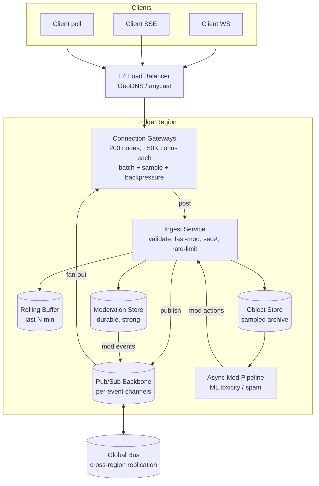
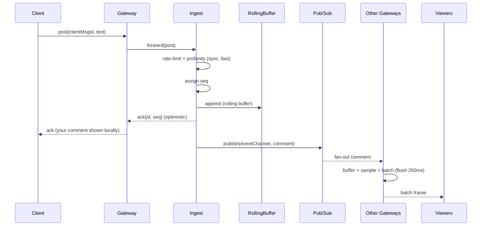
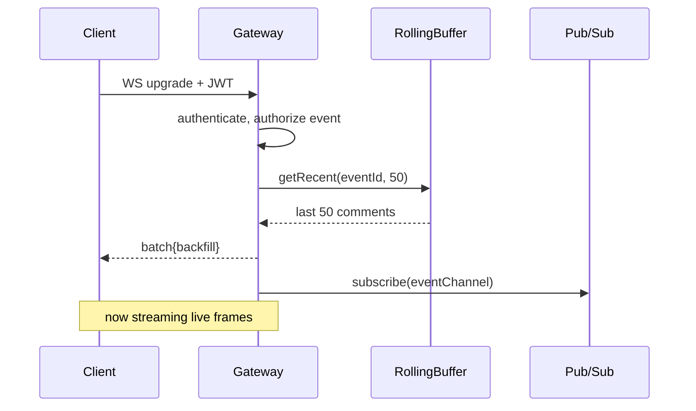

# Design Live Comments / Live Chat (High Fan-Out)

> A staff-level system-design reference for real-time live comments/chat where **one writer's message must fan out to millions of concurrent viewers** with sub-second latency. Think: comments rail on a live sports stream, a celebrity Instagram/YouTube Live chat, an esports tournament, or a flash-sale livestream.

---

## 1. Problem & Clarifying Questions

### 1.1 Restating the problem

We are designing the **live comments / live chat** feature attached to a live event (a video stream, a live shopping show, a sports broadcast). Viewers post short text messages ("comments"); every other viewer of the same event should see new comments appear in near-real-time, ordered roughly by time. The defining characteristic is **extreme read fan-out**: a single comment posted by one user may need to be delivered to **millions of connected clients within ~1 second**. Writes are comparatively cheap; the engineering problem is the **delivery side** — keeping millions of persistent connections alive, broadcasting efficiently, and degrading gracefully when the comment stream is hotter than humans (or clients) can consume.

This is fundamentally different from 1:1 or small-group chat (WhatsApp/Slack), where fan-out is small and *per-user durable history + read receipts* dominate. Here fan-out is enormous, history is mostly disposable, and **the hardest constraint is the number of concurrent persistent connections and the broadcast amplification factor.**

### 1.2 Clarifying questions I'd ask the interviewer

A senior candidate never starts drawing boxes. I'd ask, grouped by category. (I note the answer I'll assume in brackets — in a real interview these are a dialogue.)

**Functional scope**
- Is this **chat tied to a live event** (one room = one stream) or **general group chat**? This changes fan-out topology drastically. [Live event chat, one logical "room" per event.]
- Do comments need **durable, replayable history**, or is it ephemeral "you-had-to-be-there" chat? Can a late joiner scroll back? [Ephemeral primary; we keep a short rolling buffer (last N minutes) for late joiners + a sampled archive for moderation/replay, but full durable per-user history is out of scope.]
- **Ordering guarantee:** must all viewers see comments in the *exact same global order* (strict total order), or is "roughly chronological, eventually consistent" acceptable? [Eventual / approximate ordering globally; we'll discuss where strict ordering matters — e.g. moderation, pinned messages.]
- Do we support **rich features**: emoji, stickers, @mentions, replies/threads, reactions (hearts), gifts/superchats, polls? [Text + emoji + reactions in v1; gifts/superchats as an extension. Threads explicitly out of scope for the hot path.]
- **Moderation**: profanity filter, slow mode, ban/mute, shadow-ban, delete-message, pin-message, slow mode, subscriber-only mode? [Yes — this is mandatory at scale; abuse is a first-class requirement.]
- Read state: do we need "who's typing", presence ("X viewers"), per-user unread counts? [Presence/viewer-count yes (aggregate); per-message read receipts no.]

**Non-functional**
- **Scale**: peak concurrent viewers per event? Number of simultaneous live events? [Single mega-event up to **10M concurrent viewers**; platform-wide up to **50M concurrent connections** across many events.]
- **Latency target** for comment delivery (post → seen by others)? [p50 < 500 ms, p99 < 2 s end-to-end.]
- **Availability**: is brief unavailability of *chat* acceptable if the *video* keeps playing? [Yes — chat is degradable; video is the SLA-critical product. Chat target 99.9%, with graceful degradation rather than hard failure.]
- **Consistency / durability**: is it OK to drop a comment under extreme load? [Yes — best-effort delivery; we may **sample/shed** comments under overload. A dropped comment is far better than a stalled stream. Moderation actions, by contrast, must be reliable.]
- **Geography**: global audience? Multi-region? [Yes, global; edge presence assumed.]

**Out of scope (explicitly stated)**
- The video pipeline itself (encoding, CDN, ABR) — chat is a sidecar.
- Full searchable archival chat history / compliance retention (we'll keep a sampled archive only).
- 1:1 DMs and private group messaging.
- Voice/video calls.

### 1.3 Why these questions matter (design judgment)

The single most consequential answer is **"can we drop comments / approximate ordering?"** If the answer were "no — strict total order, zero loss, durable per-user history" (a financial-grade audit log), the design would invert: we'd need a globally-ordered log (single-writer-per-partition, consensus) and per-recipient durable inboxes — and 10M-fan-out would be near-impossible at <1 s. Because live chat is **human-consumed, ephemeral, and best-effort**, we earn the right to use cheap fan-out (pub/sub broadcast, edge sampling, lossy backpressure). **Pinning down the consistency/durability bar first is what unlocks a tractable design** — that's the senior move.

---

## 2. Requirements (Finalized)

### 2.1 Functional
1. **Post a comment** to an event (text ≤ 280 chars + emoji), authenticated.
2. **Receive comments** from an event in near-real-time over a persistent connection.
3. **Late-join backfill**: on connect, deliver the last N (e.g. 50) recent comments so the rail isn't empty.
4. **Reactions** (lightweight: ❤️/👍 counters) aggregated and broadcast as counts, not per-event.
5. **Presence / viewer count** — approximate concurrent-viewer number, updated periodically.
6. **Moderation**: profanity filtering, rate/slow mode, mute/ban a user, delete a comment, pin a comment, subscriber-only mode.
7. **Multi-event**: many concurrent events, each its own logical room.

### 2.2 Non-functional
- **Latency**: post→broadcast p50 < 500 ms, p99 < 2 s.
- **Concurrency**: 10M concurrent connections on a single hot event; 50M platform-wide.
- **Availability**: 99.9% for chat; never take down video. **Graceful degradation** is a hard requirement, not a nice-to-have.
- **Consistency**: eventual/approximate ordering for comments (per-region monotonic where cheap); **moderation actions are strongly delivered** (a banned user stays banned, a deleted message stays deleted).
- **Durability**: comments are best-effort and may be **sampled/shed** under overload. Moderation state is durable. A short rolling buffer is durable enough to survive a single node failure.
- **Cost**: connection cost dominates; design must keep per-connection cost (CPU/RAM/bandwidth) low.

### 2.3 Explicit assumptions
- Avg comment size on the wire: **~200 bytes** (text + small metadata envelope).
- During a hot event, **1–2% of viewers post**; the rest are read-only lurkers.
- Peak **inbound** comment rate per mega-event: **~10,000 comments/sec** (we'll show this is already too fast for humans and must be **rate-limited at display**).
- Clients can sustain receiving **~20–50 messages/sec** before the UI is useless; humans read far fewer.
- WebSocket is the primary transport; SSE/long-poll are fallbacks.

---

## 3. Capacity Estimation (arithmetic shown)

Let's anchor on the **single mega-event = 10M concurrent viewers**, then platform-wide.

### 3.1 Connections
- 10M concurrent WebSocket connections for one event.
- A well-tuned connection-gateway node (epoll/Netty/Go, ~tens of KB RAM per idle WS, mostly heartbeats) holds **~100K connections/node** comfortably (memory- and FD-bound, not CPU). Conservative for headroom: **~50K/node**.
- **Nodes for one event:** 10M / 50K = **200 gateway nodes**. Platform-wide 50M / 50K = **1,000 gateway nodes**. (Plus N+ redundancy and rolling-deploy headroom → ~1,300.)

> *Term: **connection gateway / edge front-end** — a stateless-ish server whose only job is to terminate millions of long-lived WebSocket/SSE connections and shovel bytes. Sometimes called a "comet" or "push" server.*

### 3.2 Write (ingest) QPS
- 10M viewers × 2% post × posting cadence. If a poster posts once every ~30 s on average: 200K active posters / 30 s ≈ **~6,700 comments/sec**. Round to **~10,000 writes/sec peak** for the hot event.
- This is *trivial* to ingest. 10K writes/sec is a single modest partition of any decent log/queue. **The write side is never the bottleneck.**

### 3.3 Read (fan-out / egress) — the real number
- This is the amplification: each of 10K inbound comments/sec × 10M recipients = **10^11 = 100 billion message-deliveries/sec** if naïvely broadcast 1:1.
- At 200 bytes/message that's 100B × 200 B = **20 TB/sec of egress**. That is absurd and is the entire reason this problem is hard.
- **First mitigation — batching:** we don't push each comment individually; gateways **batch comments into frames** (e.g. flush every 100–250 ms). 250 ms flush → at most 4 frames/sec/client. Within a frame we coalesce all comments that arrived in that window.
- **Second mitigation — display rate limiting / sampling:** humans can't read 10K/sec. We cap what we *display* to, say, **20 comments/sec** (≈ the rest are dropped/sampled — see deep dive §7.6). So each client receives ≤ 20 comments/sec × 200 B = **4 KB/sec**, ≈ 4 frames/sec.
- **Realistic egress:** 10M clients × 4 KB/sec = **40 GB/sec** for the hot event. Across 200 gateways = **200 MB/sec/node ≈ 1.6 Gbps/node**. Achievable on 10/25 GbE NICs with room to spare.
- **The key insight:** egress is bounded by **min(production rate, display cap) × recipients**, not by raw production rate. The display cap (sampling) converts an impossible 20 TB/s into a manageable 40 GB/s — a **500× reduction**. Sampling is not a degradation hack; it's the **core architectural lever.**

### 3.4 Pub/sub backbone fan-out
- The backbone must take 10K comments/sec for the event and deliver each to the **200 gateways** that hold the event's connections (not to 10M endpoints). That's 10K × 200 = **2M internal messages/sec** for the hot event — easily handled by a fan-out tier. After batching/sampling at the gateway, the internal traffic is also batched: 10K/s in, sampled to ~20/s × 200 gateways = **4,000 internal fan-out messages/sec**. Tiny.

### 3.5 Storage
- **Rolling buffer** (last 5 min for late-join backfill): 10K/s × 300 s × 200 B = **600 MB** per event in memory (Redis/in-process ring buffer). Trivial.
- **Sampled archive** (moderation/replay): sample 1-in-10, 1K/s × 200 B = 200 KB/s × 3-hour event = **~2 GB/event**. Append-only object storage. Cheap.
- **Moderation state** (bans, deletes, pins): tiny, KB–MB per event, but must be durable & strongly consistent.

### 3.6 Summary table

| Metric | Hot event (10M) | Platform (50M) |
|---|---|---|
| Concurrent connections | 10M | 50M |
| Gateway nodes (@50K/node) | 200 | 1,000 (+redundancy ~1,300) |
| Inbound comments/sec | ~10K | ~50K |
| Naïve egress (no batching/sampling) | **20 TB/s (impossible)** | 100 TB/s |
| Real egress (sampled to 20/s + batched) | **~40 GB/s** | ~200 GB/s |
| Per-node egress | ~1.6 Gbps | ~1.6 Gbps |
| Rolling buffer RAM/event | ~600 MB | n/a |

**Takeaway:** writes and storage are negligible; **connection count and egress amplification are everything**, and **display-side sampling is the lever that makes it possible.**

---

## 4. API Design

### 4.1 Connection / transport
WebSocket upgrade is the primary path; the URL routes by event.

```
GET /v1/events/{eventId}/stream
  Upgrade: websocket
  Authorization: Bearer <jwt>
  Sec-WebSocket-Protocol: livechat.v1
→ 101 Switching Protocols
```

Fallback (no WS, e.g. restrictive proxy): **Server-Sent Events**:
```
GET /v1/events/{eventId}/sse   (text/event-stream)
```
Last-resort: HTTP **long-poll** `GET /v1/events/{eventId}/poll?cursor=<seq>`.

### 4.2 Client→server messages (over the socket)
```jsonc
// post a comment
{ "type": "post", "clientMsgId": "uuid", "text": "let's go!", "ts": 1719300000 }

// reaction
{ "type": "react", "kind": "heart" }

// heartbeat / keepalive
{ "type": "ping" }

// resync request (after reconnect)
{ "type": "resync", "lastSeq": 84213 }
```
`clientMsgId` is a client-generated UUID for **idempotency** (dedupe on retry).

### 4.3 Server→client messages
```jsonc
// batch of comments (the common case — coalesced over a flush window)
{ "type": "batch", "seq": 84230, "items": [
    { "id": "c_991", "uid": "u_12", "name": "Ann", "text": "🔥🔥", "ts": 1719300001, "seq": 84225 },
    { "id": "c_992", "uid": "u_88", "name": "Bo", "text": "GOAL", "ts": 1719300001, "seq": 84229 }
]}

// aggregated reaction counter (sent at a fixed cadence, e.g. 1 Hz)
{ "type": "reactions", "window": 1719300001, "heart": 5821, "clap": 1203 }

// presence
{ "type": "presence", "viewers": 9831221 }

// moderation events (delivered reliably)
{ "type": "mod", "action": "delete", "id": "c_991" }
{ "type": "mod", "action": "pin",    "item": { ...comment... } }
{ "type": "mod", "action": "banned", "until": 1719303600 }   // sent only to the banned user

// backpressure / mode signal
{ "type": "mode", "sampling": 0.2, "slowMode": 5 }  // showing 20%, 5s slow mode

// control
{ "type": "pong" }
{ "type": "error", "code": "rate_limited", "retryAfterMs": 3000 }
```

### 4.4 REST control plane (moderation, admin)
```
POST /v1/events/{eventId}                  // create event (room)
POST /v1/events/{eventId}/comments         // post via REST (mobile fallback / SDK)
DELETE /v1/events/{eventId}/comments/{id}  // moderator delete
POST /v1/events/{eventId}/pin              // pin a comment
POST /v1/events/{eventId}/ban              // {userId, durationSec}
POST /v1/events/{eventId}/mode             // {slowMode: 5, subOnly: true, samplingHint: ...}
GET  /v1/events/{eventId}/recent?limit=50  // backfill (also pushed on connect)
```

**Design note:** posting is offered **both** over the socket (low latency, no new TLS handshake) and over REST (simpler for SDKs/retries, easier to put behind a standard API gateway with WAF/rate-limit). Internally both land in the same ingest path.

---

## 5. High-Level Architecture

### 5.1 Request flow narrative
1. Client resolves to the **nearest edge region** (GeoDNS/anycast) and opens a WebSocket to a **connection gateway** via a layer-4 LB.
2. On connect, the gateway authenticates the JWT, **subscribes** the connection to the event's channel on the **pub/sub backbone**, and sends a **backfill** (last 50) from the rolling buffer.
3. To **post**, the client sends a `post` frame. The gateway forwards it to the **ingest service**, which validates, runs **synchronous fast moderation** (profanity, rate limit), assigns a **sequence number**, writes to the **rolling buffer + log**, and **publishes** to the event channel.
4. The pub/sub backbone fans the comment out to **all gateways subscribed** to that event (typically the 200 holding its connections).
5. Each gateway **buffers, samples, batches, and flushes** comments to its local connections on a flush timer, applying per-event display-rate caps and per-connection backpressure.
6. **Moderation actions** publish to the same channel as high-priority `mod` events delivered reliably (bypass sampling).

### 5.2 ASCII block diagram

```
                              ┌──────────────────────────────────────────────┐
   Millions of clients        │                  EDGE REGION                  │
   (WS / SSE / poll)          │                                               │
        │  │  │               │   ┌───────────┐                               │
        ▼  ▼  ▼   GeoDNS/anycast   │  L4 LB    │                               │
   ┌──────────────┐  ───────▶ │   └─────┬─────┘                               │
   │   clients    │           │         │                                     │
   └──────────────┘           │   ┌─────▼──────────────────────────────┐      │
                              │   │  CONNECTION GATEWAYS  (200 nodes)    │      │
                              │   │  - terminate WS, hold ~50K conns ea  │      │
                              │   │  - subscribe to event channel        │      │
                              │   │  - batch + SAMPLE + backpressure     │      │
                              │   │  - backfill on connect               │      │
                              │   └───┬───────────────────────▲─────────┘      │
                              │       │ post                   │ fan-out        │
                              │       ▼                        │                │
                              │   ┌────────────┐        ┌──────┴──────────┐     │
                              │   │  INGEST     │ pub    │  PUB/SUB         │    │
                              │   │  SERVICE    │──────▶ │  BACKBONE        │    │
                              │   │  - validate │        │  (per-event chan)│    │
                              │   │  - fast mod │        │  Redis cluster / │    │
                              │   │  - seq #    │◀───────│  Kafka / NATS    │    │
                              │   │  - rate lim │ sub    └──────┬───────────┘    │
                              │   └──┬──────┬───┘               │                │
                              │      │      │                   │ (cross-region) │
                              │      ▼      ▼                   ▼                │
                              │  ┌────────┐ ┌──────────┐  ┌──────────────┐       │
                              │  │ROLLING │ │ MOD STORE │  │  GLOBAL BUS   │      │
                              │  │BUFFER  │ │ (durable, │  │ (Kafka Mirror │      │
                              │  │(Redis  │ │  strong)  │  │  / fan to     │      │
                              │  │ring/   │ └──────────┘  │  other regions)│      │
                              │  │ log)   │                └──────────────┘       │
                              │  └────┬───┘                                       │
                              │       │ sampled archive                          │
                              │       ▼                                           │
                              │  ┌──────────────┐   ┌─────────────────────┐       │
                              │  │ OBJECT STORE  │   │ ASYNC MOD PIPELINE   │      │
                              │  │ (replay/audit)│   │ (ML toxicity, spam)  │      │
                              │  └──────────────┘   └─────────────────────┘       │
                              └──────────────────────────────────────────────────┘
```

### 5.3 Mermaid diagram



### 5.4 Key flow — posting a comment (sequence)



### 5.5 Key flow — connect & backfill



---

## 6. Data Model & Storage Choices

### 6.1 Entities

**Comment**
| field | type | notes |
|---|---|---|
| id | string (snowflake) | globally unique, time-sortable |
| eventId | string | partition key |
| seq | int64 | monotonic per event (ordering) |
| userId | string | author |
| displayName | string | denormalized for fan-out (avoid join on read path) |
| text | string ≤280 | |
| ts | int64 ms | server-assigned |
| flags | bitmask | sampled?, pinned?, fromSubscriber? |

**Event/Room**: `eventId`, status, slowModeSec, subOnly, samplingRate (dynamic), createdAt.

**Moderation**: bans `(eventId, userId) → untilTs`, deletes `set<commentId>`, pins `list<commentId>`, mutes. **Strong consistency required.**

**Reaction aggregate**: `(eventId, window) → {heart: n, clap: n}` — counters, not events.

### 6.2 Datastore choices and *why*

| Data | Store | Why (access pattern) | Rejected alternative |
|---|---|---|---|
| **Rolling buffer** (last N min, backfill) | **Redis** (sorted set per event, keyed by seq) or in-process ring buffer | Read pattern = "last 50 by seq", append-only, ephemeral, hot. O(1) append, O(log n) range. In-memory speed for the backfill path. | A SQL table — too slow/contended for per-connect backfill at this read rate. |
| **Durable comment log / sampled archive** | **Append-only log → object store (S3/parquet)**; Kafka topic per event-shard as the intermediate | Sequential writes, batch reads for replay/analytics/moderation training. Cheap, infinite. | Per-comment row in OLTP DB — write amplification & cost; we don't need point lookups by comment for the hot path. |
| **Moderation state** (bans/deletes/pins) | **Strongly-consistent KV** (e.g. DynamoDB/Spanner/etcd-class) replicated, or a small relational DB | Must be correct: a banned user staying banned is a *safety* requirement. Low volume, read on every post (cache it aggressively). | Eventually-consistent cache as source of truth — a deleted message reappearing is a serious incident. |
| **Reaction counters** | **Redis counters / probabilistic (HLL/CMS)** | Massive volume, only aggregate needed. Approximate is fine. | Storing each reaction as an event — pointless 100B-row firehose. |
| **Pub/sub channel** | **Redis Pub/Sub cluster** *or* **Kafka** *or* **NATS** (see deep dive §7.3) | Fan one comment to ~200 subscribers (gateways) at low latency. | Database polling — latency and load both unacceptable. |

> *Term: **snowflake ID** — a 64-bit ID encoding timestamp + machine + sequence, so IDs are unique and roughly time-ordered without a central counter.*
> *Term: **HLL / CMS** — HyperLogLog (approximate distinct count) / Count-Min Sketch (approximate frequency); fixed-memory probabilistic counters ideal for "roughly how many hearts".*

**Why no single big database for comments?** The access pattern is "write fast, broadcast immediately, read only the recent tail." That's a **log + cache**, not a queryable relational store. Forcing comments into a normalized DB would add latency, cost, and a useless index for data we mostly throw away. We store the **tail in Redis** (hot, backfill) and the **stream in a log** (durable, replay) — matching the shape of the access pattern is the whole game.

---

## 7. Deep Dives (the bulk)

The genuinely hard sub-problems: (1) holding millions of connections & connection sharding; (2) the fan-out / pub-sub backbone topology; (3) ordering — eventual vs strict; (4) backpressure when the stream is hotter than clients; (5) graceful degradation via sampling under extreme load; (6) rate-limiting, spam & abuse; (7) cross-region. I'll spend the most time on 1, 2, 4/5.

---

### 7.1 Deep dive — Holding millions of connections (connection gateways & sharding)

**Problem.** 10M persistent TCP/WebSocket connections for one event. Each connection consumes a file descriptor, kernel socket buffers, and app-level state. The constraints are **file descriptors, memory, and the cost of waking up a thread per connection.**

**Options for the connection tier:**

| Option | Model | Pros | Cons |
|---|---|---|---|
| **Thread-per-connection** (classic blocking) | 1 thread/conn | simple | dies at ~10K conns (thread stacks, context switches). Non-starter. |
| **Event-loop / epoll** (Netty, Go netpoller, Node, nginx) | N threads, M conns via readiness | ~100K+ conns/node, low mem | callback complexity |
| **Userspace stack / kernel bypass** (DPDK) | exotic | extreme conn density | huge complexity; overkill |

**Decision: event-loop gateways (Netty on JVM, or Go).** ~50K–100K conns/node. This avoids the **failure mode of thread exhaustion / context-switch storms** that kills thread-per-connection servers.

**Connection sharding — how do we spread 10M conns and route fan-out?**

- **L4 load balancing** (not L7) for the WS upgrade — we want a raw TCP balancer (consistent-hash or least-conn) because L7 inspection of every frame on a long-lived socket is wasteful. The LB only matters at connect time; after upgrade it's just bytes.
- **Statelessness:** gateways hold connection state but **no authoritative comment state**. Any gateway can serve any connection; the only "stickiness" is the live socket itself. If a gateway dies, its clients reconnect (to *any* gateway) and resync via the rolling buffer + `lastSeq`. This is crucial: **gateways are disposable**, which makes scaling and deploys safe.
- **Subscription routing:** each gateway subscribes once to the event's channel on the backbone (not once per connection!). So 10M connections on 200 gateways = **200 subscriptions**, not 10M. The backbone fans out to 200 endpoints; each gateway re-fans to its ~50K local sockets. This **two-level fan-out** (backbone → gateway → sockets) is the structural key: it bounds backbone fan-out to the node count, not the connection count.

```
   1 comment
      │ publish
      ▼
 [Pub/Sub channel: event-42]   ← 200 subscribers (one per gateway), NOT 10M
      ├──────────┬──────────┬─── ... ──┐
      ▼          ▼          ▼           ▼
   GW#1       GW#2       GW#3   ...   GW#200
   (50K)      (50K)      (50K)        (50K)     ← local re-fan to sockets
```

**Heartbeats & dead connections.** WebSocket ping/pong every ~30 s; reap silent connections to free FDs. Mobile clients drop constantly (network changes), so **fast, cheap reconnection** is mandatory — reconnect carries `lastSeq` for gap-fill. Connection churn ("thundering herd" on reconnect after a gateway dies) is mitigated by **jittered backoff** and spreading reconnects across the fleet via the LB.

**Failure mode avoided:** without two-level fan-out, the backbone would need to push to 10M endpoints (impossible) or every gateway would subscribe per-connection (10M subscriptions, melting the backbone). Without disposable/stateless gateways, a node death would lose data and require complex state migration.

---

### 7.2 Deep dive — Backfill, late-join, and the rolling buffer

When a viewer joins 2 hours into a 3-hour stream, an empty rail looks broken. We push the **last 50 comments** on connect. Source = **rolling buffer** (Redis sorted set keyed by `seq`, TTL'd to last N minutes; or an in-process ring buffer on a designated "buffer" replica per event).

- **Consistency on reconnect:** client sends `lastSeq`; gateway/buffer returns comments with `seq > lastSeq` (up to a cap). If the gap exceeds the buffer (client was offline too long), we send a **"gap" marker** and just resume from current — we don't try to replay 2 hours; this is ephemeral chat.
- **Hot key problem:** every connect for a mega-event reads the same buffer → a Redis hot key. Mitigations: **replicate the buffer** (read replicas), or push the last-50 **down through the gateway's own local cache** (each gateway caches the recent tail it's already receiving from the backbone — so backfill is served *from gateway memory with zero extra backend reads*). This is elegant: the gateway is already seeing the live stream, so it trivially knows the last 50.

**Decision:** gateway-local recent cache for backfill (primary), Redis rolling buffer as durable fallback / for gateways that just started. Avoids the **hot-key meltdown** of 10M connects hammering one Redis key.

---

### 7.3 Deep dive — The pub/sub backbone (fan-out topology)

This is the spine. We need to take one comment and deliver it to ~200 gateway subscribers in <100 ms, reliably enough, cheaply.

**Options:**

| Backbone | Mechanism | Latency | Durability/replay | Fan-out cost | Notes / failure mode |
|---|---|---|---|---|---|
| **Redis Pub/Sub** | fire-and-forget channels | very low (~ms) | **none** (no replay; subscribers miss msgs while disconnected) | cheap | If a gateway briefly disconnects, it drops messages — acceptable for ephemeral chat; backfill covers gaps. Cluster pub/sub fan-out can be a hotspot. |
| **Kafka** (topic per event/shard) | partitioned log, pull | low-moderate (10s ms) | **strong** (offsets, replay) | consumer groups; each gateway is a consumer | Great durability/ordering per partition; heavier; consumer-group rebalances under churn can hurt. |
| **NATS / NATS JetStream** | subject-based pub/sub (+ optional persistence) | very low | optional (JetStream) | excellent fan-out | Purpose-built for high fan-out messaging; good middle ground. |
| **Custom fan-out tier** | bespoke gRPC tree/multicast | lowest possible | as designed | optimal | Most control, most build cost; what hyperscalers do internally. |

**Decision:** **A tiered backbone.** Use a **durable log (Kafka) for ingest + ordering + archive**, and a **low-latency fan-out layer (Redis Pub/Sub or NATS) for delivery to gateways.** Ingest writes the comment to Kafka (assigns offset/seq, durable, feeds the sampled archive and async moderation) **and** publishes to the fast fan-out channel for live delivery. Gateways consume from the fast channel for latency; they reconcile gaps via the rolling buffer (which is fed from Kafka).

Why split them? **One tool can't be both lowest-latency-fan-out and durable-ordered-log without compromise.** Redis pub/sub is fast but lossy; Kafka is durable but its consumer model + rebalance behavior is heavier for 200 ephemeral subscribers that come and go. Splitting lets each do what it's best at: **Kafka = source of truth & ordering; fast bus = delivery.** Live chat tolerates the fast bus being lossy because backfill + ephemerality absorb it.

**Failure mode avoided:** using *only* Redis pub/sub → no ordering/archive/moderation feed and silent loss with no recovery. Using *only* Kafka with 200+ churning consumer-group members → rebalance storms and added latency on the hot delivery path.

**Scaling the backbone for many events:** channel/topic **per event**, sharded across the cluster by `eventId` hash. A mega-event's channel may itself need **partitioning** (split into K sub-channels; gateways subscribe to all K) so no single broker node owns the whole hot event's fan-out. This spreads the 2M internal messages/sec across brokers.

---

### 7.4 Deep dive — Ordering: eventual vs strict

**The tension.** Strict total order (everyone sees identical sequence) requires a single ordering authority per event (single writer / consensus), which caps write throughput and adds latency. Eventual/approximate order is cheap and parallel but viewers in different regions may see slightly different interleavings.

**What humans actually need:** comments to appear **roughly chronological and not jump backwards on one screen**. They do **not** need global byte-for-byte agreement. So:

| Approach | Guarantee | Cost | Use it for |
|---|---|---|---|
| **Per-event monotonic seq from single ingest leader** | total order within event | leader throughput (~fine at 10K/s, one partition) | comment `seq` assignment, backfill cursor |
| **Per-region eventual order** | monotonic per region; cross-region may differ slightly | cheap, parallel | the displayed stream |
| **Strict global total order (consensus/Raft per event)** | identical everywhere | latency + throughput cap | **only** pins / "official" announcements where everyone must agree |
| **Client-side ts sort within a small window** | smooths jitter | none | display polish |

**Decision:** Assign a **per-event monotonic seq at a single ingest leader** (10K/s is one partition — easily handled by one leader; failover via the log). Deliver in seq order; clients sort within a small buffer window by seq to avoid visible reordering. **Cross-region differences are tolerated** for ordinary comments (eventual). **Pins and moderation use the strong path** so everyone agrees a message is pinned/deleted.

**Why a single leader is OK here:** the write rate (10K/s) is tiny; the scaling problem is *reads*, not ordered writes. So we can "afford" strict per-event ordering on the write side without it being a bottleneck — and it makes the seq/backfill/dedupe story clean.

**Failure mode avoided:** chasing global strict order everywhere would throttle the system and add cross-region latency for no human benefit; pure unordered fan-out would make comments visibly jump around and break "delete stays deleted."

---

### 7.5 Deep dive — Backpressure (stream hotter than the client)

**Problem.** Even after sampling, a client on a weak network or slow device may not drain frames as fast as we send them. The gateway's per-connection send buffer grows → memory blows up → the gateway OOMs and **takes down 50K healthy connections** because of a few slow ones. This is the classic **slow-consumer / head-of-line problem** and it's where naïve designs die.

**Strategy — bound every queue, prefer dropping data over dropping connections:**

1. **Per-connection bounded outbound buffer.** Each socket has a small ring buffer (e.g. last K frames / fixed bytes). When full, **drop oldest comments** (chat is lossy by design) — never block the event loop, never grow unbounded.
2. **Coalescing flush.** On each flush tick (250 ms), send the *current* sampled set, not a backlog. If a client missed the last tick, it just gets the next state — no replay of a backlog. This naturally **sheds load for slow clients** while fast clients get everything.
3. **Watermarks → adaptive per-connection rate.** Track each socket's send-queue depth / TCP write readiness. If a connection is consistently backed up, **reduce its sampling rate** (send it fewer comments) or temporarily downgrade it (counts only, not text). Healthy clients are unaffected.
4. **Disconnect the truly stuck.** If a connection's buffer stays full beyond a timeout, **close it**; the client reconnects and resyncs. Better to reset one socket than starve the loop.
5. **Backbone → gateway backpressure.** If a gateway can't keep up consuming from the bus, it **samples on ingest** (drops a fraction before queueing) rather than letting its inbound queue grow. Bounded queues at *every* hop.

**Why drop-oldest, not block:** in a real-time stream, **stale data is worthless** — the newest comments are what matters. Blocking would propagate backpressure up to the backbone and stall *everyone*. Dropping is local, bounded, and aligned with the product (chat is ephemeral).

**Failure mode avoided:** unbounded send buffers → gateway OOM → mass disconnect → reconnect storm → cascading failure. Bounded buffers + drop-oldest contain the blast radius to the slow client.

---

### 7.6 Deep dive — Graceful degradation & sampling under extreme load

This is the headline lever from §3.3. Under a mega-event, **the comment production rate (10K/s) is unconsumable by humans and unaffordable to broadcast 1:1.** We deliberately **don't deliver every comment to every viewer.**

**Tiers of degradation (applied progressively as load rises):**

1. **Display-rate cap (always on).** Cap displayed comments to ~20/s per client. The gateway samples the incoming stream down to the cap.
2. **Representative sampling, not random truncation.** Prefer to keep: comments from people you follow, replies to you, verified/subscriber comments, comments with high engagement — and *deprioritize* near-duplicate spam. So the sampled view is *interesting*, not just the first 20 that arrived. (Twitch/YouTube-style "chat is moving fast" — you see a flavor, not the firehose.)
3. **Aggregate-instead-of-list.** Reactions become **counters** (one number) instead of N events — collapses the highest-volume traffic to ~1 msg/sec.
4. **Slow mode.** When inbound exceeds a threshold, enforce **server-side slow mode** (a user may post at most once per K seconds). Reduces inbound at the source.
5. **Increase flush window.** Under stress, widen flush from 250 ms → 500 ms → 1 s. Fewer, larger frames; less per-frame overhead.
6. **Drop richest content first.** Under severe stress, strip avatars/rich metadata → text only → counts only.
7. **Read-only / posting throttle.** As a last resort for chat (never for video), reject new posts with `rate_limited` and keep delivering at a reduced rate, or shed the lowest-priority connections.

**Control loop.** A per-event **load controller** watches inbound rate, gateway queue depths, and CPU, and broadcasts a `mode` signal (sampling rate, slow-mode seconds, flush window). It's a feedback controller: more load → lower sampling rate → less egress → stable. This makes degradation **graceful and automatic**, not a cliff.

**Decision & defense:** sampling is **product-correct** (humans literally cannot read 10K/s) *and* **the cost lever** (500× egress reduction). The risk is fairness/perception ("my comment didn't show"). We mitigate with **optimistic local echo** (your own comment always shows on *your* screen immediately) and **priority sampling** so meaningful comments survive.

**Failure mode avoided:** trying to deliver every comment to everyone → 20 TB/s egress, melted gateways, and a UI no human can read. Degradation converts a hard failure into a smooth, controllable quality reduction — satisfying the "never take down chat, never take down video" requirement.

---

### 7.7 Deep dive — Rate limiting, spam & abuse

At scale, abuse is constant: spam floods, hate speech, coordinated raids, scams ("DM me to win!").

**Layers:**
1. **Connection/auth gating:** authenticated users only for posting; anonymous read allowed but read-only or heavily limited. Per-IP connection caps at the LB to blunt connection floods (DDoS).
2. **Per-user rate limits (token bucket).** E.g. 1 post / 3 s baseline, tighter under slow mode. Enforced at ingest using a distributed token bucket (Redis). *Term: **token bucket** — you accrue tokens at a fixed rate up to a cap; each post spends one; empty bucket = throttled.*
3. **Synchronous fast moderation** on the post path: profanity/blocklist regex, URL/scam heuristics, duplicate-text detection (a user posting the same string repeatedly). Must be <5 ms — it's on the latency-critical path. Anything heavier goes async.
4. **Asynchronous ML moderation:** the durable log feeds a toxicity/spam classifier; flagged comments trigger `delete`/`ban` mod events (which propagate reliably). Latency here is seconds — fine, because removing a bad comment after a beat is acceptable; we never block the stream on ML.
5. **Shadow-ban:** a banned/abusive user's comments are accepted (so they think they're posting) but **not fanned out** — defeats whack-a-mole reposting.
6. **Slow mode / subscriber-only / followers-only** modes, toggled by mods or auto-triggered by the load/abuse controller.
7. **Idempotency / dedupe:** `clientMsgId` prevents a retried post from double-broadcasting.

**Moderation propagation guarantee.** Bans/deletes use the **strong path** (durable mod store + reliable mod events). Every ingest checks the (cached) ban set before accepting a post. A deleted comment is suppressed at the gateway too (clients receive a `delete` event). This is the one place we **don't tolerate loss** — a banned user slipping through is a safety incident.

---

### 7.8 Deep dive — Multi-region / global

Viewers are global; the stream is global. We want viewers served by their **nearest region** (latency) while comments still cross regions.

- **Per-region gateways + backbone.** Posts ingest locally, get a (region, seq), publish to the **local** fast bus, and replicate to other regions via a **global bus** (Kafka MirrorMaker / cross-region topic). Each region's gateways also subscribe to the **replicated** stream from other regions.
- **Ordering across regions:** eventual. Each region orders its own comments strictly; cross-region interleaving is best-effort, smoothed by client-side `ts` windowing. Acceptable per §7.4.
- **Cost:** cross-region bandwidth carries only the *ingest* stream (10K/s × 200 B = 2 MB/s) — not the fan-out — because re-fan happens locally in each region. Cheap. **Replicate writes, fan out locally** is the key principle.
- **Failure isolation:** a region outage degrades chat for that region's users only; they reconnect to the next-nearest region. Video unaffected.

---

## 8. Scaling & Bottlenecks

| Layer | Scales by | First bottleneck | Fix |
|---|---|---|---|
| Connection gateways | add nodes (linear) | FDs/RAM per node; reconnect storms | more nodes; jittered reconnect; raise ulimits/kernel tuning |
| Egress bandwidth | sampling + batching | NIC saturation on hot node | sampling rate ↓, batch window ↑, spread conns evenly |
| Pub/sub backbone | partition channel per event | single broker owning hot event | split mega-event channel into K sub-channels across brokers |
| Ingest/ordering | one leader/partition per event | leader throughput (~unlikely at 10K/s) | partition event into a few ordered shards; merge on read |
| Rolling buffer | replicas | hot-key on backfill | serve backfill from gateway-local cache |
| Moderation store | low volume | read on every post | cache ban-set at ingest, invalidate on change |
| Cross-region | replicate writes only | WAN bandwidth | only ingest stream crosses, fan-out is local |

**Where it breaks first (honest answer):** the **connection tier + egress** under a viral spike. The mitigations are (a) horizontal gateway scaling with fast autoscaling, (b) the sampling control loop clamping egress, and (c) admission control (cap new connections, queue them) so we degrade rather than crash. The **second** break point is the **backbone fan-out for a single mega-event** — solved by channel partitioning.

---

## 9. Reliability, Consistency & Security

**Reliability / failure handling**
- **Gateway death:** stateless → clients reconnect to any node, resync via `lastSeq` + rolling buffer. No data loss beyond ephemeral in-flight frames (acceptable).
- **Ingest leader death:** failover via the durable log; new leader resumes seq from last committed offset. Brief post-pause; reads continue from buffer.
- **Backbone broker death:** partitioned channels limit blast radius; gateways re-subscribe; gap-fill from buffer. Fast bus loss is tolerated by design.
- **Region outage:** users reroute to nearest region; chat degrades locally, video unaffected.
- **Overload:** the degradation ladder (§7.6) — never a hard crash.

**Consistency model**
- Comments: **eventual / per-event monotonic seq**; clients sort by seq within a window. Best-effort delivery, lossy under load.
- Moderation: **strong** — durable store, reliable propagation, checked on every post. Deletes/bans are not "best effort."
- Reactions: **approximate aggregate** — exactness not required.

**Idempotency**
- `clientMsgId` dedupe at ingest (retried posts don't double-broadcast).
- Mod actions are idempotent (delete twice = deleted; ban twice = banned).

**Security & abuse**
- **Auth:** short-lived JWT for the WS upgrade; re-auth on reconnect. Authorization checks event access (e.g. paid/private streams).
- **Transport:** WSS (TLS) everywhere.
- **DDoS / floods:** per-IP connection caps at L4 LB, SYN-flood protection, geo/WAF on the REST control plane, token-bucket rate limits per user.
- **Input safety:** length caps, content sanitization (no HTML/script injection — render as text), URL/scam heuristics, profanity + ML toxicity, shadow-ban.
- **PII:** denormalized display names only; no sensitive data on the fan-out path. Sampled archive access-controlled.

---

## 10. Extensions & Follow-ups

1. **Superchats / paid pinned messages.** Money path needs **exactly-once, durable, strongly-ordered** handling — route through a transactional service, then publish the pin via the strong mod path. The payment must not be lost even if chat is.
2. **Threaded replies.** Threads explode fan-out complexity; keep them **off the hot rail** — replies render in a side panel fetched on demand, not broadcast to all 10M. Don't let threading reintroduce per-recipient inboxes.
3. **Per-user personalized chat** (only show people you follow). Moves filtering from gateway-global to **per-connection**, increasing gateway CPU. Solve with **per-connection sampling filters** + a "follow graph" cache; cap personalization cost or it eats the savings from global sampling.
4. **Durable, searchable history / compliance.** Promote the sampled archive to a full archive in object storage + a search index (async). Don't put it on the hot path.
5. **Typing indicators / fine presence.** Another huge fan-out firehose — **aggregate only** ("1,204 typing") via probabilistic counters; never broadcast per-user typing at this scale.
6. **End-to-end encryption.** Largely incompatible with server-side moderation/sampling at this scale — for *public* live chat it's not desired; flag the tradeoff if asked (E2EE belongs in private DMs, not high-fan-out public chat).
7. **Polls/Q&A/quizzes.** Use aggregate counters + the strong path for "official" results; same machinery as reactions + pins.
8. **Replay (VOD chat).** Replay the sampled archive synced to video timestamps — a *batch* problem, served from object store, no live infra needed.

---

## 11. Interview Q&A

**Q1. Why is this hard if writes are only 10K/sec?**
Because the difficulty is **read amplification**: one write × 10M readers = up to 10^11 deliveries/sec naïvely (20 TB/s). The engineering problem is connection density and egress, not ingest. *Senior signal: identify that the bottleneck is fan-out, not throughput.*

**Q2. How do you deliver one comment to 10M connections?**
**Two-level fan-out.** The backbone fans one comment to ~200 gateways (one subscription per gateway, not per connection); each gateway re-fans to its ~50K local sockets. Backbone fan-out is bounded by node count, not connection count.
- *Probe: what if one event is so hot it overwhelms a single broker?* Partition the event's channel into K sub-channels across brokers; gateways subscribe to all K.

**Q3. Do all viewers see the same comments in the same order?**
No, and they don't need to. Comments are **eventual / approximately chronological**; each event has a single ingest leader assigning a monotonic `seq` so it's ordered per-event and clients sort within a small window. Strict global order is reserved for **pins and moderation** (the strong path). *Senior signal: distinguish where strict order earns its cost vs where eventual is fine.*

**Q4. A user on a slow connection can't keep up — what happens?**
Per-connection **bounded outbound buffer with drop-oldest**, coalescing flush (send current state, not a backlog), adaptive per-connection sampling, and disconnect-if-stuck. We **drop stale data, never block the event loop**, so one slow client can't OOM the gateway or stall others. *Senior signal: backpressure isolation; stale real-time data is worthless.*

**Q5. 10K comments/sec is unreadable. How do you handle that?**
We **sample** down to a human-readable display cap (~20/s) using **priority sampling** (keep followed/verified/replies, drop near-dupes), aggregate reactions into counters, and apply slow mode. Sampling is both product-correct and a 500× egress cost lever. Your own comment always echoes locally. *Senior signal: degradation as a feature, with the arithmetic.*

**Q6. How do you not lose a moderation action (deleted/banned)?**
Moderation uses the **strong path**: durable strongly-consistent store + reliable propagation; every ingest checks the cached ban-set before accepting; gateways apply `delete` events. This is the one place we forbid loss because it's a safety property. *Senior signal: split the consistency model — best-effort comments, strong moderation.*

**Q7. What happens when a gateway dies?**
Gateways are **stateless/disposable**. Clients reconnect to any node and resync via `lastSeq` + rolling buffer / gateway-local recent cache. We use jittered backoff to avoid a reconnect storm. No durable data lives only on a gateway.

**Q8. Which pub/sub do you use and why?**
A **tiered backbone**: durable log (Kafka) for ingest/ordering/archive + a low-latency fast bus (Redis Pub/Sub or NATS) for delivery. No single system is both lowest-latency-fan-out *and* durable-ordered-log without compromise, and ephemeral chat tolerates the fast bus being lossy because backfill + ephemerality absorb gaps. *Senior signal: right tool per job rather than one-size-fits-all.*

**Q9. WebSocket vs SSE vs long-poll?**
WebSocket primary (bidirectional, low overhead, ideal for both post and receive). SSE fallback (server→client only, fine for read-mostly, survives proxies). Long-poll last resort. Most viewers are read-only, so SSE is a perfectly good degraded mode. *Probe: why not just SSE for everyone?* Posting over the same socket avoids extra round-trips and we want bidirectional control frames (mode signals, pings).

**Q10. How does this go global without 10× the bandwidth?**
**Replicate writes, fan out locally.** Only the ingest stream (≈2 MB/s) crosses regions; each region re-fans to its own connections. Cross-region ordering is eventual, smoothed client-side. *Senior signal: separate the cheap cross-region replication from the expensive local fan-out.*

**Deep-probe follow-ups bank:**
- *How do you tune a Linux box to hold 100K WS connections?* (ulimit/FDs, ephemeral port range, somaxconn, TCP buffer sizing, epoll, reduce per-conn memory, disable Nagle for latency.)
- *How do you make sampling feel fair?* (optimistic local echo + priority sampling + occasionally surfacing a random tail comment.)
- *How do you autoscale the connection tier fast enough for a viral spike?* (pre-warmed pools, admission control / connection queueing, scale on connection count not CPU, fast cold-start gateways.)

---

## 12. Cheat-sheet & Self-test

**Key numbers**
- 10M conns/event, 50M platform; ~50K conns/gateway → **200 / 1,000 gateways**.
- Inbound ~10K comments/s (writes are trivial).
- Naïve egress **20 TB/s (impossible)** → with batch (250 ms) + sampling (20/s cap) → **~40 GB/s** (~500× cut).
- Internal fan-out bounded by **node count (~200)**, not connection count.
- Rolling buffer ~600 MB/event; latency p50 <500 ms, p99 <2 s.

**Key decisions (and the failure each avoids)**
- Event-loop gateways, stateless/disposable → avoids thread exhaustion & stateful-node migration pain.
- **Two-level fan-out** (backbone→gateway→sockets) → avoids 10M subscriptions / 10M-endpoint push.
- **Tiered backbone** (Kafka durable + fast lossy bus) → avoids choosing between no-ordering vs heavy-rebalance.
- **Per-event single-leader seq**, eventual cross-region → avoids visible reordering without global-consensus cost.
- **Bounded buffers + drop-oldest backpressure** → avoids slow-client OOM / cascading disconnect.
- **Sampling + degradation ladder** → avoids 20 TB/s meltdown & unreadable UI; chat never hard-fails.
- **Strong path for moderation** → avoids banned-user-slips-through safety incidents.
- **Replicate writes, fan out locally** → avoids 10× cross-region bandwidth.

**Diagram in words:** Client → L4 LB → connection gateway (holds 50K conns, subscribes once to event channel). Post → ingest (rate-limit, fast-mod, seq#, dedupe) → durable log + rolling buffer + publish to fast bus → fan-out to 200 gateways → each batches/samples/backpressures → frames to clients. Moderation rides the strong path; reactions/presence are aggregated counters; cross-region replicates only the ingest stream.

**Self-test (no answers)**
1. Derive the egress for 5M viewers at a 30/s display cap with a 200 ms flush window and 250-byte messages. Where does this land per gateway at 75K conns/node?
2. A single event channel saturates one Kafka broker. Walk through exactly how you partition it and how gateways re-assemble ordering across partitions.
3. Design the per-connection backpressure state machine: what metrics, what thresholds, what actions, and when do you disconnect?
4. Your priority-sampling keeps "followed + verified + replies." On a 10M-viewer event with 10K/s inbound, estimate the CPU cost of per-connection personalized filtering and propose how to cap it.
5. A deleted comment reappears for 0.3% of viewers after a region failover. Diagnose the consistency gap and fix it without putting moderation on the slow path.
