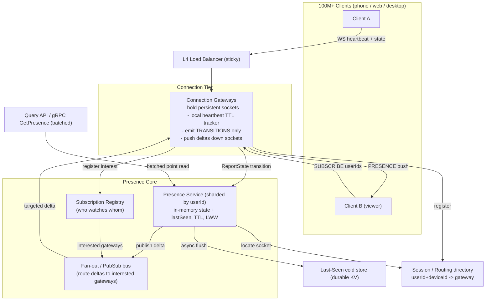
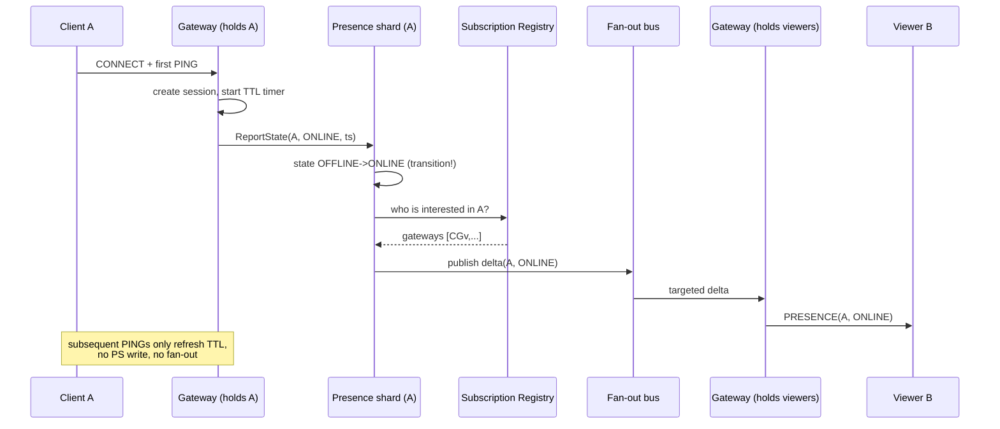
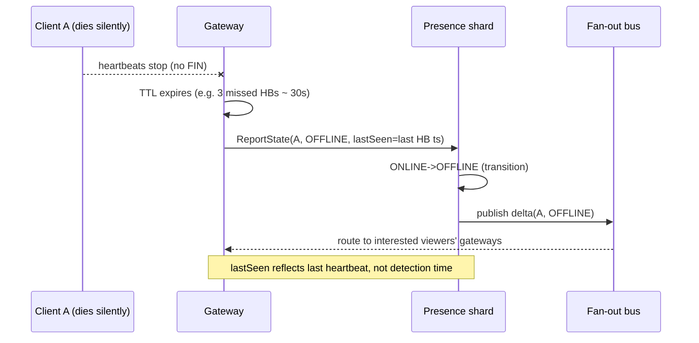

# Design a Presence System (Online / Last-Seen)

> **Category:** Messaging & Real-time
> **Level:** Senior / Staff system-design round
> **Reader:** A senior backend engineer (Java/JVM, distributed systems) who knows the building blocks. This document teaches the *design judgment* — what to clarify, what to trade off, and how to defend each decision.

---

## 1. Problem & Clarifying Questions

### 1.1 Restating the problem

We are designing the **presence subsystem** that powers the little green dot. For every user of a large messaging product (think WhatsApp / Slack / Discord / Teams scale), the system must answer two questions in near-real-time:

1. **Is user X online right now?** (`online | offline | away/idle`)
2. **When was user X last seen?** (`last_seen` timestamp)

And it must **push** state changes to everyone who currently cares — the contacts, group members, or chat partners viewing X — so their UI updates within a second or two.

Presence sounds trivial ("just store a boolean"), but it is one of the classic *write-amplification + fan-out* traps in distributed systems. The naive design works for 10K users and melts down at 100M. The interview is really about (a) controlling the write rate from heartbeats, (b) controlling the fan-out blast radius of every change, and (c) making "offline" detection fast *and* cheap *and* correct under partial failure. Those three tensions are the whole game.

### 1.2 Clarifying questions I would ask first

A senior candidate never opens with boxes and arrows. I'd spend the first 3–4 minutes here.

**Functional scope**
- What presence *states* do we support? Just `online/offline`, or also `away/idle`, `do-not-disturb`, and custom statuses ("In a meeting")? — *This changes the data model from a boolean to a small enum + metadata.*
- Do we need **last-seen** timestamps, or only the live boolean? Last-seen has a separate, gnarlier privacy story (you can hide "online" but leak "last seen 2m ago").
- Is presence **per-user** or **per-device/session**? A user on phone + laptop + web is online if *any* device is connected. Multi-device makes presence an *aggregation* problem, not a single flag.
- Who are the **subscribers** (the "audience") for a user's presence? Their contact list? Everyone in shared groups? Only the people with an open chat window? — *The audience model determines fan-out cost, which is the dominant cost in this whole system.*
- Do we support **typing indicators** and **read receipts**? These are presence-adjacent (same transport, same fan-out) — I'll note where they reuse this infra but treat them as out of scope for the core design.

**Non-functional**
- **Freshness / latency target:** how fresh must "online" be? Is 1–2 seconds of staleness acceptable? (Almost always yes — presence is *soft state*.) How long after a user disconnects can we wait before showing "offline" — 10s? 30s? 60s? — *This is the single most important tradeoff in the system; see §7.2.*
- **Consistency:** is eventual consistency fine? (Yes — there is no correctness disaster if two viewers briefly disagree on a green dot.) This frees us from consensus/quorum machinery.
- **Availability target:** presence is a "nice to have" relative to message delivery. Is 99.9% acceptable, with graceful degradation (show stale/last-known on failure) rather than hard errors? I'll assume yes.
- **Durability:** does `last_seen` need to survive a full datastore loss? It's not financial data — losing a few minutes of last-seen on a crash is tolerable. So we can lean on in-memory stores with periodic/async persistence.

**Scale**
- How many **registered** users and how many **concurrent online** users at peak?
- Average **contacts / audience size** per user? (Drives fan-out.)
- Are there **celebrity / super-node** users with millions of followers/subscribers? (Hotspot problem.)
- Mobile-heavy or desktop-heavy? Mobile means flaky connections, frequent reconnects, push-notification wakeups, and battery constraints on heartbeat frequency.

**Out of scope (confirm with interviewer)**
- The actual chat-message delivery pipeline (we *consume* the persistent connection it owns, but message storage/ordering is separate).
- Auth/identity issuance (assume an upstream auth service hands us a verified `userId`).
- Rich activity feeds ("X is listening to Spotify") — same fan-out machinery, more payload; mention as an extension.

### 1.3 Assumptions I'll proceed with

| Dimension | Assumption |
|---|---|
| Registered users | 1 billion |
| Peak concurrent online | 100 million |
| States | `online`, `offline`, `away` (+ optional custom status string) |
| Granularity | Per-device sessions aggregated into a per-user state |
| Audience model | Contacts/shared-group members, **but pushed only to *interested* subscribers** (people with an active session who currently render X) |
| Avg audience that's *interested at once* | ~10 (we'll fan out only to live, interested viewers, not all 200 contacts) |
| Freshness | "online" appears ≤ 1–2s; "offline" appears ≤ 30s after disconnect |
| Consistency | Eventual; presence is soft state |
| Availability | 99.9%, degrade to last-known on failure |
| Durability | Best-effort; in-memory + async snapshot of `last_seen` |

---

## 2. Requirements (Finalized)

### 2.1 Functional
1. **Report presence:** a connected client periodically signals liveness (heartbeat) so the system marks it online and refreshes `last_seen`.
2. **Detect offline:** when heartbeats stop (clean disconnect *or* silent death), the system marks the user offline within the freshness window and records `last_seen`.
3. **Query presence:** given a list of `userIds`, return current `{state, lastSeen}` for each (used on app cold-start to paint a contact list).
4. **Subscribe / push:** a viewer subscribes to a set of users; the system pushes presence *changes* (deltas) to that viewer in near-real-time.
5. **Multi-device aggregation:** user state = max over devices (online if any device online).
6. **Privacy controls:** user can hide last-seen / online status (selectively).

### 2.2 Non-functional
- **Latency:** query p99 < 200 ms; "online" propagation < 2 s; "offline" propagation < 30 s.
- **Availability:** 99.9% for query; push is best-effort (lossy is OK — UI self-corrects on next snapshot/heartbeat).
- **Consistency:** eventual. Read-your-writes is *not* required across viewers.
- **Durability:** `last_seen` survives single-node failure (replicated in-memory); a total cluster loss may lose a small window — acceptable.
- **Scalability:** linear horizontal scale to 100M concurrent; no single hot shard for ordinary users.
- **Cost:** must control heartbeat write-amplification and fan-out amplification — these dominate spend.

### 2.3 Explicit non-goals
- Strong/linearizable presence. No consensus needed.
- Guaranteed delivery of every presence delta (best-effort + reconcile).
- Message persistence, ordering, or E2E encryption of chat content.

---

## 3. Capacity Estimation

Showing the arithmetic. These are order-of-magnitude numbers to size the fleet and expose the bottlenecks; I'll flag each assumption.

### 3.1 Connections
- **Concurrent online:** 100M.
- Each online user holds **1 persistent connection** (WebSocket/MQTT) per device; assume ~1.3 devices avg → ~130M connections. Round to **130M sockets**.
- A well-tuned connection-gateway node (Netty/epoll, JVM, large heap) holds ~**500K–1M idle sockets** (memory- and FD-bound). Take **500K/node** conservatively.
- **Gateway nodes:** 130M / 500K = **260 nodes** for connections alone. Add 2× headroom for failover/regional spread → **~500 gateway nodes**.

### 3.2 Heartbeat write QPS — *the write-amplification problem*
This is the number that scares people.

- If every device sends a heartbeat every **10 s**:
  130M / 10 = **13M heartbeats/sec**.
- A naive design writes presence to a datastore on *every* heartbeat → **13M writes/sec** of `(userId → online, lastSeen=now)`. That's enormous and almost all of it is redundant (the user was already online).
- **Tighten the interval to 30 s:** 130M / 30 = **~4.3M heartbeats/sec**. Still huge for a DB.
- **Key insight (previewed, deep-dived in §7.3):** heartbeats should *not* hit durable storage. They refresh an in-memory TTL on the node already holding the socket. Cross-node/DB writes happen **only on state transitions** (offline→online, online→offline) and on a coarse `last_seen` flush (every ~30–60 s, or only at disconnect). That collapses 4–13M writes/sec into the **transition rate**, which is far smaller (see §3.4).

### 3.3 Presence query QPS
- App cold-start: a user opens the app and queries presence for ~200 contacts in one batched call.
- Say 100M users open/refresh the app over a busy hour, with bursts. Steady ~100M/3600 ≈ **28K query-calls/sec**, each fanning to ~200 lookups → **~5.6M presence lookups/sec**. Bursty mornings could be 5–10×.
- These are **point reads from an in-memory store** (sub-ms). Easily served by the presence shards; cacheable.

### 3.4 State-transition rate (drives durable writes + fan-out)
- A user toggles online↔offline maybe **~10 times/day** (app foreground/background, network blips, screen lock). Mobile churn is the real driver.
- 100M users × 10 transitions/day = 1B transitions/day = **~11.6K transitions/sec** average; with diurnal peaks (morning commute, evening) call it **~50K transitions/sec peak**.
- *This* is the real durable-write rate and the *event source* for fan-out — **~3 orders of magnitude smaller** than the raw heartbeat rate. Designing so that only transitions are expensive is the whole point.

### 3.5 Fan-out amplification — *the explosion*
- Each transition must notify the *interested* viewers of that user.
- **Naive (push to all contacts):** 50K transitions/sec × 200 contacts = **10M push messages/sec** — and most recipients aren't even looking at that contact right now.
- **Smart (push only to live, interested subscribers, ~10 each):** 50K × 10 = **500K pushes/sec**. 20× cheaper.
- **Celebrity case:** one super-node with 10M subscribers toggling = 10M pushes for *a single transition*. This must be special-cased (poll/pull instead of push, or rate-limit) — see §7.4.

### 3.6 Storage
- Per-user presence record: `userId(8B) + state(1B) + lastSeen(8B) + flags(1B) + devices(small)` ≈ **~50–100 B** with overhead. Call it **100 B**.
- For 100M concurrent (the only ones we must keep hot): 100M × 100 B = **10 GB**. Trivially fits in RAM, spread across shards.
- For 1B registered (to serve `last_seen` of offline users): 1B × 100 B = **100 GB**. Fits in a modest Redis/in-memory cluster; or keep only recently-active in memory and spill cold `last_seen` to disk (e.g., a wide-column store).
- **Shard sizing:** keep ~5–10 GB hot per shard → 100M hot users → **~10–20 in-memory shards** (with replicas, ~40 nodes). Comfortable.

### 3.7 Bandwidth
- Heartbeat frame: ~30–50 B on the wire. 13M/s × 50 B ≈ **650 MB/s ≈ 5.2 Gbps** ingress at 10s interval (a strong reason to relax to 30 s → ~1.7 Gbps). Spread over 500 gateways → ~3–10 Mbps/node. Fine.
- Fan-out frame: ~50–100 B. 500K/s × 100 B = **50 MB/s ≈ 400 Mbps** egress for presence pushes. Cheap.

### 3.8 Summary of the load profile

| Metric | Naive | Engineered | Why it matters |
|---|---|---|---|
| Heartbeat ingest | 4–13M/s | unchanged (terminated at gateway) | absorbed in-memory, never hits DB |
| Durable writes | 4–13M/s | ~50K/s (transitions only) | ~250× reduction |
| Fan-out msgs | ~10M/s | ~500K/s | subscribe-only-interested, ~20× |
| Hot storage | — | ~10 GB | fits in RAM, shardable |
| Gateways | — | ~500 nodes | FD/memory bound |

**Takeaway:** the engineering targets are *not* set by user count; they're set by how well we suppress heartbeat writes and fan-out amplification.

---

## 4. API Design

Two planes: a **client↔gateway** real-time plane (persistent connection) and a **service-internal / query** plane (RPC/HTTP).

### 4.1 Client ↔ Gateway (over WebSocket / MQTT)

**Connect / authenticate**
```
CONNECT { token: JWT, deviceId, clientCaps: {...} }
→ CONNACK { sessionId, heartbeatIntervalMs: 30000, serverTime }
```
*Server dictates the heartbeat interval* so we can globally tune it (and jitter it — see §7.3) without shipping new clients.

**Heartbeat (client → server)**
```
PING { seq }            // tiny, no body; or rely on WS protocol-level ping
→ PONG { seq, serverTime }
```

**Subscribe / unsubscribe to others' presence**
```
SUBSCRIBE   { userIds: [ ... ] }      // "I'm now viewing these people"
→ SNAPSHOT  { [ {userId, state, lastSeen} ] }   // immediate current state
UNSUBSCRIBE { userIds: [ ... ] }
```

**Push (server → client): presence delta**
```
PRESENCE { userId, state, lastSeen, devices?: n }
```
Server sends only *changes* after the initial snapshot.

**Set own status (manual)**
```
SET_STATUS { state: "away"|"dnd", custom?: "In a meeting", privacy?: {...} }
```

### 4.2 Service-internal / query plane (gRPC)

```protobuf
service Presence {
  // Batched point read (app cold-start, server-side joins)
  rpc GetPresence(GetReq) returns (GetResp);

  // Used by gateways to report transitions / heartbeat-derived liveness
  rpc ReportState(ReportReq) returns (ReportResp);

  // Subscription registry management (who-watches-whom)
  rpc Subscribe(SubReq) returns (SubResp);
  rpc Unsubscribe(SubReq) returns (SubResp);

  // Pub/sub of deltas to gateways (server-streaming)
  rpc StreamDeltas(StreamReq) returns (stream PresenceDelta);
}

message GetReq    { repeated string user_ids = 1; string viewer_id = 2; }
message GetResp   { repeated PresenceRecord records = 1; }
message PresenceRecord { string user_id = 1; State state = 2;
                         int64 last_seen_ms = 3; int32 online_devices = 4; }
enum State { OFFLINE = 0; ONLINE = 1; AWAY = 2; DND = 3; }

message ReportReq { string user_id = 1; string device_id = 2;
                    State state = 3; int64 ts_ms = 4; string gateway_id = 5; }
```

**Design notes**
- `GetPresence` is **batched** — never N round-trips for N contacts.
- `ReportState` carries `gateway_id` so the system knows *where* the socket lives (for targeted teardown and for routing pushes back).
- Idempotency: `ReportState` is naturally idempotent on `(userId, deviceId, state)` with last-writer-wins by `ts_ms`.
- Privacy is enforced at read time: `GetPresence(viewer_id)` filters/masks based on the target's privacy settings and the relationship between viewer and target.

---

## 5. High-Level Architecture

### 5.1 Components and request flow

- **Connection Gateways (CG):** terminate the millions of persistent sockets. Stateful w.r.t. *which sockets they hold*. Run the **local heartbeat tracker** (in-memory TTL per session). Emit *transitions* (not heartbeats) upstream. This is where heartbeat write-amplification is killed.
- **Presence Service (PS) shards:** the source of truth for "current state + last_seen", sharded by `userId`. In-memory (Redis-like or custom) with TTL semantics. Serves `GetPresence`. Receives `ReportState`. Publishes deltas.
- **Subscription Registry (SR):** the **who-watches-whom** index. For each user U, which gateways currently hold a viewer interested in U. This is what lets us fan out to *only interested* viewers. Often co-located/sharded with PS by the *watched* user's id.
- **Fan-out / Pub-Sub bus:** routes a transition delta from a PS shard to the set of gateways that have interested viewers, which then push down the sockets. (Kafka for durable transition log + a lightweight in-cluster pub/sub for low-latency delta routing.)
- **Last-Seen store (cold):** durable, eventually-consistent store for `last_seen` of offline users (wide-column / KV on disk), fed asynchronously.
- **Session/Routing directory:** maps `userId/deviceId → gateway` so a transition or targeted message can find the socket. Often a sharded KV or gossip-maintained map.

### 5.2 ASCII block diagram

```
                         ┌──────────────────────────────────────────────┐
   100M+ clients         │                Control / Query                │
  (phone/web/desktop)    │   ┌───────────────┐    ┌──────────────────┐   │
        │                │   │  Query API /  │    │  Privacy / Auth  │   │
        │  WebSocket/    │   │   gRPC GET    │    │   (upstream)     │   │
        │  MQTT (TLS)    │   └──────┬────────┘    └──────────────────┘   │
        ▼                │          │                                    │
 ┌───────────────┐       │          ▼                                    │
 │ Load Balancer │       │   ┌──────────────────────────────────────┐    │
 │  (L4, sticky) │       │   │     Presence Service (sharded by      │    │
 └──────┬────────┘       │   │       userId): state + lastSeen       │    │
        │                │   │   in-memory + TTL; LWW by timestamp   │    │
        ▼                │   └───▲───────────────┬───────────────────┘    │
 ┌───────────────────┐   │      │ReportState     │ publish delta          │
 │ Connection        │   │      │(transitions)   ▼                        │
 │ Gateways (CG)     ├───┼──────┘        ┌───────────────────┐            │
 │ - hold sockets    │   │               │  Fan-out / PubSub │            │
 │ - local HB tracker│◄──┼───────────────┤  bus (route delta │            │
 │ - TTL per session │   │   push down    │  to gateways w/   │            │
 │ - emit transitions│   │   sockets      │  interested subs) │            │
 └──────┬────────────┘   │               └─────────▲─────────┘            │
        │ SUBSCRIBE       │                         │                      │
        ▼                 │               ┌─────────┴─────────┐            │
 ┌───────────────────┐    │               │ Subscription      │            │
 │ Subscription      │────┼──────────────►│ Registry (who     │            │
 │ Registry (SR)     │    │               │ watches whom)     │            │
 └───────────────────┘    │               └───────────────────┘            │
        │ async lastSeen flush                                              │
        ▼                                                                   │
 ┌───────────────────┐    ┌───────────────────┐                            │
 │ Last-Seen cold    │    │ Session/Routing   │                            │
 │ store (durable KV)│    │ directory         │                            │
 └───────────────────┘    └───────────────────┘                            │
                          └──────────────────────────────────────────────┘
```

### 5.3 Mermaid diagram



### 5.4 Two key sequence flows

**A. User comes online (transition + fan-out)**


**B. Silent death → offline detection**


---

## 6. Data Model & Storage Choices

### 6.1 Entities

**PresenceRecord (hot, in-memory, sharded by userId)**
```
userId           : string (shard key)
state            : enum {OFFLINE, ONLINE, AWAY, DND}   // derived = max over devices
lastSeen         : int64 ms
onlineDevices    : map<deviceId, {gatewayId, lastHbTs, deviceState}>
version          : int64 (monotonic, for LWW / delta dedup)
customStatus     : string?  (optional)
ttl              : per-device TTL (heartbeat-driven)
```

**SubscriptionRegistry (sharded by *watched* userId)**
```
watchedUserId  : string (shard key)
watchers       : set<gatewayId>           // coarse: which gateways have ≥1 interested viewer
                 // optionally refcount per gateway, or set<viewerSessionId> if precise teardown needed
```
*Why key by watched user?* Because fan-out asks "for a change to U, which gateways need it?" — that's a lookup by U. Co-locating SR with PS on the same shard makes the publish step a local read.

**SessionDirectory (sharded by userId/deviceId)**
```
userId, deviceId -> {gatewayId, connectedAt}
```

**LastSeen cold store (durable, on disk)**
```
userId -> {lastSeen, lastState}   // wide-column / KV; eventually consistent
```

### 6.2 Which datastore, and why (justified against access patterns)

| Data | Access pattern | Choice | Why / failure avoided |
|---|---|---|---|
| Hot presence (state + TTL) | 13M/s refresh (local), 5M/s point reads, TTL expiry | **In-memory KV with TTL** (Redis / custom JVM in-mem) | Sub-ms reads/writes; native TTL = automatic offline detection without a sweep job. Avoids the *DB-meltdown* failure of writing every heartbeat to disk. |
| Subscription registry | write on subscribe/unsubscribe; read on every transition | **In-memory set, co-sharded with PS** | Local read during publish; avoids a cross-service hop per fan-out. Avoids *fan-out latency blow-up*. |
| Session directory | write on connect/disconnect; read to locate socket | **Sharded KV / gossip** | Moderate write rate (transition-ish), needs fast lookup; avoids *can't-find-the-socket* failure when routing a targeted push. |
| Last-seen (cold/offline) | low write (async flush), occasional read | **Durable wide-column (Cassandra/DynamoDB)** | Cheap, durable, scales to 1B rows; eventual consistency is fine. Avoids *unbounded RAM* from keeping 1B records hot. |
| Transition event log (optional) | append-only, replayable | **Kafka** | Durable transition stream for fan-out, audit, and recovery; decouples PS from gateways. Avoids *lost-delta on gateway restart*. |

**Why not a single relational DB for everything?** A row-per-heartbeat write pattern at 4–13M/s would obliterate any RDBMS (lock contention, WAL pressure, vacuum/compaction storms). Presence is *soft state with TTL semantics* — a textbook fit for in-memory TTL stores, with durability pushed to the async/cold path where it's cheap.

**Why TTL is the elegant core trick:** if "online" is represented as *a key with a short TTL refreshed by heartbeats*, then "offline detection" is *free* — it's just key expiry. No separate scanner, no liveness consensus. The expiry event itself becomes the transition. (Caveat: native Redis key-expiry notifications are best-effort and lazy; for tight timing we run the TTL/timer logic in the gateway and/or a dedicated expiry wheel — see §7.2/§7.3.)

---

## 7. Deep Dives (the bulk)

The genuinely hard parts: (1) **failure detection** — how fast to mark offline; (2) **heartbeat design & write-amplification**; (3) **fan-out without explosion**; (4) **consistency vs cost** (incl. multi-device aggregation); (5) **sharding & hotspots**.

---

### 7.1 (Framing) Why presence is *soft state* — and why that unlocks everything

Presence is **soft state**: it expires unless refreshed, and a brief disagreement between observers causes no harm. Recognizing this lets us:
- Use **TTL** instead of consensus for liveness.
- Use **best-effort, lossy fan-out** instead of guaranteed delivery (the UI re-snapshots and self-corrects).
- Use **eventual consistency** instead of quorum reads.

Every deep dive below leans on this. A junior answer treats the green dot like a bank balance; a senior answer treats it like a TTL cache entry.

---

### 7.2 Deep dive: Failure detection — how fast to mark offline (*the central tradeoff*)

The hardest single decision. You cannot have all three of **fast offline detection**, **low false-positive rate**, and **low heartbeat cost**. Pick the tradeoff explicitly.

**The dilemma.** A clean disconnect (TCP FIN / WS close) is easy — mark offline immediately. The hard case is **silent death**: the phone enters a tunnel, the radio drops, the process is OS-killed. No FIN arrives. We only *know* the user is gone because heartbeats stopped. So offline detection = "we missed N heartbeats."

Define: heartbeat interval `T`, miss threshold `K`. Offline is declared after roughly `K × T`.

| Strategy | Detect-offline latency | False positives (marking a live user offline) | Heartbeat cost (writes/bandwidth/battery) |
|---|---|---|---|
| Aggressive: T=5s, K=2 (~10s) | Fast (~10s) | **High** — one bad cell handoff flaps you offline→online | High (2×/s/user-class) |
| Balanced: T=15–30s, K=2–3 (~30–60s) | Medium (~30–60s) | Low | Moderate |
| Lazy: T=60s, K=3 (~3min) | Slow | Very low | Very low |
| Pure clean-disconnect only | Instant on FIN; **never** on silent death (zombie sockets stay "online" forever) | Catastrophic on mobile | Lowest |

**Failure mode each avoids/causes:**
- *Aggressive* avoids stale "online" but causes **presence flapping**: the green dot blinks every time mobile networks hiccup, which users hate and which *also* generates a fan-out storm (every flap is two transitions × audience). Flapping turns a detection problem into a fan-out problem.
- *Lazy* avoids flapping and cost but leaves **zombie online** state: you message someone shown "online" who left 2 minutes ago.
- *Clean-disconnect-only* is a trap — mobile sockets often die without FIN, so without TTL you accumulate permanent zombies.

**Decision: asymmetric thresholds + hysteresis + server-driven interval.**
1. **Go online instantly** (low threshold, optimistic) but **go offline conservatively** (`~30s`, after `K≈3` missed beats). Rationale: a false "online" is mildly annoying; a false "offline" (telling a chat partner you left when you didn't) is worse and causes flap. *Asymmetry is the key senior move.*
2. **Hysteresis / debounce:** require sustained silence before transitioning offline; if a heartbeat arrives during the grace window, cancel the pending offline. This kills flapping at the source.
3. **Grace on reconnect:** when the same `(userId, deviceId)` reconnects within the window (common on mobile handoff), suppress the offline→online churn entirely — treat it as a continuous session.
4. **Server-controlled `T`:** the gateway tells clients the interval in `CONNACK`, so we can tune globally (e.g., raise `T` under load, lower it for desktop) without client releases.
5. **Distinguish disconnect from offline-intent:** a clean WS close still gets a short grace period (mobile backgrounding ≠ "went offline"), unless the client explicitly sends a logout.

**Why TTL implements this cleanly.** Each device key has TTL = `K×T`. Heartbeat = refresh TTL. Silent death = TTL lapses → expiry → offline transition (with the debounce above applied before publishing). The "30s window" is literally the TTL. No scanner thread polling 100M users.

**Where the timer actually lives.** Don't trust a central store's lazy expiry for tight timing. The **gateway holding the socket** runs a per-session timer wheel (hashed timing wheel: O(1) add/expire, scales to millions of timers per node). On expiry the gateway emits the offline transition. If the *gateway itself* dies (so heartbeats can't even arrive), the **PS-side TTL** is the backstop: the device key in PS also has a TTL refreshed by the periodic `ReportState`/keep-alive, so a dead gateway's sessions expire centrally too. Two-level TTL = no single point that can leave zombies.

---

### 7.3 Deep dive: Heartbeat design & the write-amplification problem

**The problem restated.** 4–13M heartbeats/sec, ~99.9% of which carry *no new information* (the user was already online). Writing each to durable storage is the #1 way this system dies.

**The fix is a layered write-suppression funnel:**

1. **Terminate heartbeats at the gateway.** A heartbeat only *refreshes a local in-memory TTL* on the node that already owns the socket. No network hop, no DB write. Cost = one timer-wheel reset.

2. **Emit only transitions upstream.** The gateway sends `ReportState` to PS **only when the device's state actually changes** (offline→online, online→offline, online→away). Steady-state online users produce **zero** upstream traffic from heartbeats. This is the ~250× reduction (13M/s → ~50K/s).

3. **Coarsen `last_seen` updates.** `last_seen` for an *online* user is "now" by definition — viewers don't need second-precision. So:
   - While online: don't persist `last_seen` at all (it's implied = now).
   - On transition to offline: write `last_seen = timestamp of last received heartbeat` once.
   - Optionally, a low-frequency (60s) coarse flush for analytics. This avoids the trap of "refresh last_seen on every heartbeat," which re-creates the write storm.

4. **Heartbeat jitter / smearing.** If every client beats on a fixed 30s boundary, you get **synchronized thundering herds** — 4M beats land in the same 100ms window. Add **randomized jitter** (`T ± rand(0..T/2)`) so beats are uniformly smeared across the interval. Avoids periodic CPU/network spikes. (Same jitter logic applies to reconnect backoff after a gateway failure, or 130M clients reconnect simultaneously — a reconnect storm that can take down the whole tier.)

5. **Piggyback, don't dedicate.** On an active chat connection, the data frames themselves prove liveness; an explicit PING is only needed during idle gaps. Reduces redundant traffic and mobile battery/radio wakeups (every radio wakeup costs battery — a real constraint that influences `T`).

6. **Adaptive interval.** Foreground app: `T=10–15s` (snappier). Backgrounded/idle: `T=60s+` or rely on the platform push channel (APNs/FCM) to wake the app. Desktop on stable wifi: longer `T`. The server hands the right `T` per client class.

**Tradeoff table for the heartbeat transport:**

| Approach | Pros | Cons | Verdict |
|---|---|---|---|
| App-level PING/PONG over WS | full control, carries metadata, jitterable | reinvents some TCP keepalive | **Primary** |
| TCP/WS protocol keepalive | free, OS-level | coarse, can't carry app state, NAT timers vary | backstop only |
| Pure push-based (APNs/FCM) | battery-friendly when backgrounded | high latency, not for "online now" | use for background wake |
| Long-poll | simple, firewall-friendly | costly at 100M scale, latency | no |

**Decision:** app-level PING/PONG over a persistent WebSocket (MQTT where mobile/battery matters), terminated at the gateway, **jittered**, **adaptive interval**, transitions-only upstream, last_seen written once at offline. This converts the write-amplification problem from a storage problem into a cheap in-memory timer problem.

---

### 7.4 Deep dive: Fan-out — why naive fan-out explodes, and how to contain it

**The explosion.** A transition must reach everyone watching that user. Naive "push to all contacts of everyone who changes state":
- 50K transitions/s × 200 contacts = **10M pushes/s**, and most land on people not even looking at that contact.
- Worse, the message product reuses this for typing/read-receipts, multiplying it further.
- Worst, **celebrities/super-nodes**: a streamer with 10M subscribers toggling once = 10M pushes for one event → instantaneous hotspot that saturates a gateway and the bus.

**Containment strategy — four levers:**

**(1) Push only to *interested* viewers (subscribe-on-view).**
Don't push to all contacts; push to the people who *currently have a session and currently render that user* (chat open, contact list visible). When a viewer opens a chat / contact list, the client `SUBSCRIBE`s those userIds; on close, `UNSUBSCRIBE`. The Subscription Registry tracks this. This is the ~20× cut (200 → ~10). Failure avoided: **wasting 95% of pushes on UIs that aren't showing the dot.**

**(2) Push deltas to *gateways*, not to *connections* — gateway-level coalescing.**
The bus routes a delta to the *set of gateways* that hold ≥1 interested viewer (SR stores `watchedUser → {gatewayId}`). The gateway then locally fans out to its sockets. So the cross-cluster fan-out is bounded by **#gateways (~500)**, not #viewers (millions). A celebrity transition becomes ≤500 inter-node messages, each gateway expanding locally. Failure avoided: **bus/cross-node message count scaling with audience size.**

**(3) Pull instead of push for the super-node / cold-viewer case.**
- **Celebrities:** don't push their presence at all; viewers **poll** (or get it lazily in the `GetPresence` snapshot when they open the app). A user who follows a celebrity rarely needs sub-second updates on that celebrity's dot. Hybrid: push for "small audience" users, pull for "huge audience" users — a threshold (e.g., audience > 10K → pull). This is the classic **push/pull hybrid** that also appears in feed/timeline design. Failure avoided: **single-event 10M-push hotspot.**
- **Cold viewers:** if you're not actively looking, you get presence on next snapshot, not via push.

**(4) Coalesce & rate-limit flapping.**
- **Debounce at source** (from §7.2) so flaps don't even become deltas.
- **Coalesce in the bus/gateway:** if a user toggles online→offline→online within a short window, collapse to the final state before pushing (drop the intermediate). Presence being soft state makes dropping intermediates *correct*, not just allowed.
- **Per-user delta rate cap:** at most N presence deltas/user/second to subscribers. Failure avoided: **a single flapping mobile client generating a fan-out storm.**

**Tradeoff table — fan-out model:**

| Model | Msg volume | Freshness | Complexity | Best for |
|---|---|---|---|---|
| Push-to-all-contacts | 10M/s, explodes on celebs | best | low | toy scale only |
| Push-to-interested (subscribe-on-view) | ~500K/s | best | medium | **the default** |
| Gateway-coalesced push | bounded by #gateways | best | medium-high | **scaling layer** |
| Pull / poll | near-zero push | seconds-stale | low | **celebs, cold viewers** |
| Pure pull everywhere | near-zero push | stale, high read QPS | low | low-realtime apps |

**Decision:** **subscribe-on-view + gateway-level coalescing for the common case, push/pull hybrid with a threshold for super-nodes, plus debounce/coalesce/rate-limit on flaps.** This is the difference between 10M/s and 500K/s, and between a healthy bus and a celebrity-induced meltdown.

**A subtle correctness point — the subscribe race.** Between a viewer's `SUBSCRIBE` and the immediate `SNAPSHOT`, the target might change state. Fix: PS computes the snapshot *after* registering the subscription, and any delta during the gap is still delivered (at-least-once, idempotent by `version`). Viewer dedups by `version`. Without this you get a lost-update where the viewer registers, the change fires, and the snapshot reflects the *old* state → stuck wrong forever until next refresh.

---

### 7.5 Deep dive: Consistency vs cost (and multi-device aggregation)

**Consistency model.** Eventual, last-writer-wins by monotonic `version`/timestamp. Two viewers may briefly see different states; they converge on the next delta or snapshot. We deliberately reject quorum/linearizable presence — it would multiply latency and cost for zero user-visible benefit (no one notices a 1s green-dot disagreement).

**Why LWW is safe here.** Conflicts are between "online at t1" and "offline at t2"; the later timestamp wins, which is exactly the truth. There's no merge problem like a shopping cart. Clock skew across gateways is bounded by NTP; we also include a logical `version` per device to break ties deterministically.

**Multi-device aggregation — the real consistency subtlety.** User state = `OR` over device states (online if *any* device online). The tricky part:
- Each device has its own session on possibly different gateways. Who computes the aggregate? **The PS shard for that userId**, since it owns `onlineDevices`. A device transition updates the map; PS recomputes the aggregate; publishes a delta *only if the aggregate changed*.
- Example: phone goes offline but laptop still online → aggregate stays ONLINE → **no delta** (correct; viewers shouldn't see a flicker). This is another write/fan-out suppression: per-device noise is absorbed into a per-user aggregate.
- `last_seen` aggregation = max across devices' last activity.

**Failure mode avoided:** without server-side aggregation, two devices on two gateways would each publish conflicting per-device deltas and viewers would flap online/offline as the gateways race. Centralizing the aggregate at the userId-owning shard serializes it.

**The cost dimension.** Stronger consistency (read-repair, quorum, anti-entropy on every read) would add hops to the 5M/s read path. We instead:
- Serve reads from the single owning shard (its replica) — cheap, monotonic per user.
- Reconcile lazily: the periodic snapshot a client receives is the self-healing mechanism. Any lost delta is corrected within one refresh cycle.

**Tradeoff:**

| Consistency choice | Cost | User-visible benefit | Decision |
|---|---|---|---|
| Linearizable (consensus) | very high latency, low throughput | none | reject |
| Quorum read/write | 2–3× hops | negligible | reject |
| Eventual + LWW + per-user aggregate | cheap, fast | converges <2s | **adopt** |
| No aggregation (per-device) | cheap | flicker/flap | reject |

---

### 7.6 Deep dive: Sharding the presence service & avoiding hotspots

**Shard key: `userId` (hash-sharded).** Each user's record (state, devices, subscriptions-on-them) lives on one owning shard + replicas. Why hash, not range? Range on userId or geography creates hot ranges (e.g., a new-signup burst, or a regional prime-time). Hashing spreads load uniformly. We use **consistent hashing with virtual nodes** so adding/removing shards moves only `1/N` of keys, not everything — avoiding the **full-reshuffle stall** that plain modulo-hashing causes on resize.

**Co-locate related data by the same key.** PresenceRecord, SubscriptionRegistry (keyed by *watched* user), and last-activity for user U all hash to U's shard. So the fan-out publish step ("for change to U, read U's subscribers") is a **local** operation — no cross-shard fan of the registry. Failure avoided: **fan-out latency dominated by a registry round-trip per transition.**

**Hotspots and how each is handled:**

| Hotspot | Cause | Mitigation |
|---|---|---|
| Celebrity/super-node | millions subscribe to one userId → that shard's SR & fan-out is hot | push/pull hybrid (§7.4): don't store millions of watchers; serve via pull/snapshot. Optionally split the watcher set across shards by hashing `(watchedUser, bucket)`. |
| Thundering herd on reconnect | gateway dies, 500K clients reconnect at once | jittered reconnect backoff; connection-tier admission control; spread reconnects over the recovery window |
| Diurnal peak | morning login surge in one region | per-region capacity + autoscale; transitions-only design keeps even peaks at ~50K/s |
| Synchronized heartbeats | fixed-interval beats align | heartbeat jitter (§7.3) |

**Connection-tier vs presence-tier sharding are *different*.** The gateway a socket lands on is determined by the LB (often by source-IP/affinity), *not* by userId. So the gateway holding user A's socket is usually **not** A's PS shard. That's fine and intentional: gateways are stateless w.r.t. *which user*; they just hold sockets and talk to whichever PS shard owns the userId. The **Session Directory** maps `userId/deviceId → gatewayId` so PS can route a targeted message back to the right socket.

**Rebalancing & ownership.** A coordination layer (e.g., a consistent-hash ring published via a config service / ZooKeeper/etcd, or built into the in-memory cluster like Redis Cluster slots) maps userId → shard. On shard failure, a replica is promoted; presence being soft state means we can even **rebuild from heartbeats**: within one heartbeat interval, every live client re-asserts its presence, repopulating a cold/restarted shard. This is a beautiful property — *the system self-heals its hot state from the clients themselves*. Failure avoided: **needing durable replication of every presence write just to survive a shard restart.**

---

## 8. Scaling & Bottlenecks

**How it scales horizontally:**
- **Connection tier:** add gateways; sockets distribute via LB. Linear to 130M+.
- **Presence tier:** add shards; consistent hashing redistributes `1/N`. State is ~10 GB hot → never memory-bound.
- **Fan-out:** bounded by #gateways via gateway-coalescing; the bus carries transitions (~50K/s) + gateway-level deltas, not per-viewer messages.

**Where it breaks first (in order), and the fix:**

| Rank | Bottleneck | Symptom | Fix |
|---|---|---|---|
| 1 | Heartbeat write-amplification | DB/PS write QPS explodes | terminate HB at gateway, transitions-only (§7.3) |
| 2 | Fan-out amplification | bus/egress saturates, celeb meltdown | subscribe-on-view + gateway-coalesce + push/pull hybrid (§7.4) |
| 3 | Reconnect storms | gateway failover → mass reconnect → cascade | jittered backoff, admission control |
| 4 | Hot shard (celebrity) | one shard CPU-bound on fan-out | pull model + watcher-set sharding (§7.6) |
| 5 | Connection memory/FD limits | gateway OOM / FD exhaustion | cap sockets/node (~500K), more nodes, tune kernel (epoll, FD limits, TCP buffers) |
| 6 | Snapshot read bursts (cold start) | morning query spike | batched reads, per-shard caching, client-side TTL on snapshots |
| 7 | Cross-DC presence | global users, inter-region latency | regional presence with async cross-region delta replication (§9) |

**Multi-region note:** presence is regional-first. A user's owning shard lives in their home region; cross-region viewers either get slightly-staler presence via async replication of transitions or a cross-region snapshot fetch. We do **not** synchronously coordinate presence across oceans — eventual consistency + soft state make ~hundreds of ms of cross-region staleness invisible.

---

## 9. Reliability, Consistency & Security

**Failure handling**
- **Gateway crash:** its sockets drop → clients reconnect (jittered) to another gateway → re-assert presence within one HB interval. PS-side device TTLs expire the dead sessions if reconnection lands elsewhere; aggregate recomputed. Net effect: a brief, self-healing blip, not data loss.
- **PS shard crash:** promote replica; if cold, rebuild hot state from incoming heartbeats within ~1 interval. `last_seen` for currently-offline users is recovered from the durable cold store.
- **Bus outage:** deltas are best-effort; on recovery, clients re-snapshot. We can also replay the Kafka transition log to gateways for catch-up.
- **Graceful degradation:** if PS is unreachable, the query API serves **last-known/stale** presence (with a freshness hint) rather than erroring — presence is non-critical relative to messaging.

**Consistency model (recap):** eventual, LWW by `(timestamp, version)`, per-user aggregate computed at the owning shard. Snapshots are the reconciliation/self-heal mechanism. No consensus, no quorum.

**Idempotency**
- `ReportState` is idempotent on `(userId, deviceId, state, version)` — retries are safe (LWW).
- Deltas carry `version`; clients dedup and drop stale/out-of-order deltas (a lower version never overwrites a higher one). This makes at-least-once fan-out safe.

**Security & privacy**
- **AuthN:** client presents a verified JWT on CONNECT; gateway validates signature/expiry; `userId` is bound to the connection (clients cannot report presence for others).
- **AuthZ / privacy at read time:** `GetPresence(viewer)` enforces the target's privacy settings — e.g., "hide last-seen", "hide online", or whitelist/blacklist. WhatsApp's rule (if you hide your last-seen, you can't see others') can be encoded here. Privacy is applied at the PS read boundary, never trusting the client.
- **Abuse / rate limiting:**
  - Cap heartbeat frequency server-side (ignore beats faster than `T/2`) to stop battery-drain or write-amplification attacks.
  - Cap `SUBSCRIBE` set size and subscribe rate per session (prevent a client from subscribing to millions to scrape presence).
  - Per-user delta rate cap (anti-flap, also anti-DoS).
  - Presence is a known **scraping vector** (inferring someone's daily routine from online patterns) — privacy controls + rate limits on queries mitigate this; consider fuzzing last-seen granularity for privacy-sensitive modes.
- **Transport:** TLS on all client connections; mTLS between internal services.

---

## 10. Extensions & Follow-ups

| Interviewer adds… | How the design changes |
|---|---|
| **Typing indicators** | Reuse the exact transport + subscribe-on-view fan-out, but **don't persist** and use an even shorter TTL (~5s). Higher volume; rely entirely on gateway-coalescing and best-effort. No durable write at all. |
| **Read receipts** | Presence-adjacent fan-out but tied to a specific message id; needs at-least-once + dedup; can ride the same delta bus. |
| **Rich activity** ("playing X", "listening to Y") | Larger payload, same fan-out; treat as presence metadata; push/pull threshold matters more (bigger frames). |
| **Strict "exact online count" for a room** | Now you need a consistent counter — use a per-room CRDT counter or a sharded counter with periodic reconciliation; can't be pure soft-state. |
| **Cross-region active users** | Regional ownership + async transition replication; accept higher cross-region staleness; route viewer to home-region shard or replica. |
| **Offline push (wake a backgrounded app)** | Integrate APNs/FCM: when a message arrives for a user shown offline/backgrounded, push to wake; app reconnects and re-asserts presence. |
| **"Last seen within app" vs global** | Per-surface presence (online *in this chat* vs globally) → extend state to a small set keyed by surface; fan-out scoped per surface. |
| **Stronger durability of last_seen** | Increase flush frequency / WAL the transition log (Kafka) before ack; tradeoff latency vs durability on the cold path only. |
| **Privacy: ghost mode** | Suppress all outbound deltas for that user; serve `offline`/`hidden` to viewers regardless of true state. |

---

## 11. Interview Q&A

**Q1. Why not just write presence to a database on every heartbeat?**
At 130M connections beating every 10–30s you'd push 4–13M writes/sec, ~99.9% redundant. No RDBMS survives that, and even an in-memory store would burn CPU/network needlessly. Heartbeats refresh an in-memory TTL on the gateway; only *state transitions* (~50K/s) become durable writes. *Senior signal: identifying write-amplification as the primary cost and suppressing it at the edge.*

**Q2. How do you detect that a user went offline if they didn't send a clean disconnect?**
TTL on a heartbeat-refreshed key. Missed `K` beats over `K×T` (~30s) → expiry → offline transition. Probe: *Why 30s not 5s?* Because aggressive thresholds cause flapping on mobile network hiccups, and each flap is two transitions × fan-out — a detection problem becomes a fan-out storm. We go **online fast, offline slow** (asymmetric) with debounce/hysteresis. Probe: *Where does the timer live?* In the gateway's timing wheel, with a PS-side TTL backstop so a dead gateway's sessions also expire.

**Q3. Walk me through fan-out. Why does naive fan-out explode?**
Naive = push every transition to all contacts: 50K/s × 200 = 10M/s, mostly to UIs not showing the dot, and celebrities cause 10M pushes per single event. We (a) push only to *interested* viewers (subscribe-on-view), (b) route deltas to *gateways* not connections (bounded by ~500 gateways), and (c) use pull for super-nodes. 10M/s → ~500K/s. *Senior signal: bounding fan-out by #gateways and special-casing super-nodes.*

**Q4. A celebrity with 10M followers toggles online. What happens?**
With naive push: instant 10M-message hotspot, one shard and the bus melt. Fix: above a threshold (e.g., 10K subscribers), switch that user to **pull** — viewers fetch presence in their snapshot/poll instead of receiving pushes; optionally shard the watcher set. Probe: *How pick the threshold?* By the cost of one fan-out vs the read QPS of pull; tune empirically.

**Q5. What's your consistency model and why is it acceptable?**
Eventual, LWW by timestamp+version. Presence is soft state — a 1–2s disagreement on a green dot harms nothing. Quorum/linearizable would add hops to a 5M/s read path for zero user benefit. Snapshots self-heal any lost delta. *Senior signal: matching consistency strength to the actual business cost of being wrong.*

**Q6. How do you handle a user on phone + laptop + web?**
Per-device sessions, aggregated at the userId-owning PS shard: online = OR over devices, last_seen = max. Crucially, publish a delta *only when the aggregate changes* — phone dropping while laptop stays online produces no delta (no flicker). Centralizing aggregation serializes racing per-device updates from different gateways.

**Q7. How do you shard, and how do you avoid hot shards?**
Hash-shard by userId with consistent hashing + vnodes (resize moves 1/N). Co-locate the subscription registry by *watched* userId so fan-out reads are local. Hotspots: celebrities → pull + watcher-set splitting; reconnect storms → jittered backoff; synchronized heartbeats → jitter. *Senior signal: co-location for local fan-out reads, and consistent hashing for cheap resize.*

**Q8. A whole gateway dies with 500K sockets. What happens?**
Clients detect the drop and reconnect with **jittered** backoff to other gateways (un-jittered = a 500K reconnect thundering herd that cascades). They re-assert presence within one heartbeat interval; PS-side TTLs expire the stale sessions; aggregates recompute. The system self-heals from the clients — no durable per-write replication needed for hot state.

**Q9. (Tradeoff) Push vs pull for presence — when each?**
Push for ordinary users with small live audiences (freshest, bounded cost). Pull for super-nodes (avoids per-event explosion) and cold/uninterested viewers (they get it on next snapshot). The hybrid threshold trades freshness for fan-out cost. *Senior signal: not committing to one globally; choosing per-user by audience size.*

**Q10. (Tradeoff) Where do you put durability, and what do you accept losing?**
Durability goes on the cold path: `last_seen` for offline users in a durable KV (async flush), and optionally a Kafka transition log. Hot presence stays in RAM with TTL because it's rebuildable from heartbeats. We accept losing a few minutes of last_seen on a total cluster loss — it's soft state, not money. *Senior signal: spending durability only where it's cheap and where loss actually hurts.*

---

## 12. Cheat-Sheet & Self-Test

### 12.1 Dense recap

**Key numbers**
- 1B registered, 100M concurrent, ~130M sockets, ~500 gateways (~500K sockets/node).
- Heartbeat raw: 4–13M/s → suppressed to **~50K/s transitions** (the only durable writes).
- Fan-out: naive 10M/s → engineered **~500K/s** (subscribe-on-view + gateway-coalesce).
- Hot storage ~10 GB (fits RAM); cold last_seen ~100 GB durable.
- Freshness: online <2s, offline ~30s (K≈3 missed beats × T≈10–30s).

**Decisions (and the failure each avoids)**
- Terminate heartbeats at gateway, **transitions-only** upstream → avoids DB write-amplification meltdown.
- **TTL = offline detection** (gateway timer wheel + PS backstop) → avoids polling 100M users and avoids zombie-online.
- **Asymmetric thresholds + hysteresis** (online fast, offline slow) → avoids presence flapping.
- **Heartbeat jitter** → avoids synchronized thundering herds.
- **Subscribe-on-view + gateway-coalescing + push/pull hybrid** → avoids fan-out explosion & celebrity hotspots.
- **Server-side multi-device aggregation, delta-only-on-aggregate-change** → avoids per-device flicker & racing gateways.
- **Eventual + LWW + snapshot self-heal** → avoids needless consensus cost.
- **Hash + consistent-hashing shards, co-located subscription registry** → avoids reshuffle stalls & remote fan-out reads.
- **Soft state rebuilt from clients** → avoids durable replication of every write.

**Diagram-in-words:** Clients hold persistent sockets to a tier of ~500 gateways behind an L4 LB. Gateways absorb heartbeats locally (TTL timer wheel) and emit only transitions to userId-sharded in-memory Presence shards. Each shard owns state+last_seen and the subscription registry (keyed by watched user), recomputes the multi-device aggregate, and publishes deltas onto a bus that routes to the *gateways* holding interested viewers, which push down sockets. Super-nodes use pull. last_seen for offline users flushes async to a durable KV. Everything is soft state, eventually consistent, and self-heals from heartbeats and snapshots.

### 12.2 Self-test (no answers)
1. You measure that 30% of presence deltas are immediately reversed within 2s. Which mechanism is failing, and what three knobs do you turn?
2. Derive the durable write QPS if transitions rise to 40/user/day at 200M concurrent — and say which subsystem feels it first.
3. Why does keying the subscription registry by the *watched* user (not the viewer) matter for fan-out latency? What breaks if you key it by viewer?
4. A product wants an *exact* live count of users in a 50M-member channel. Explain why the soft-state design can't serve this as-is and what you'd add.
5. Design the cross-region story for a user whose contacts are split across three continents: where does the owning shard live, and what staleness do viewers in other regions see?
