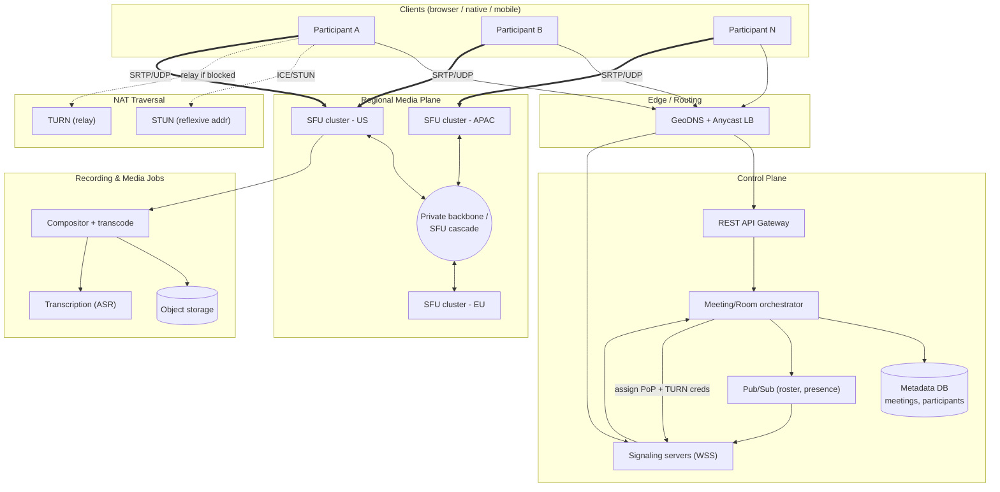
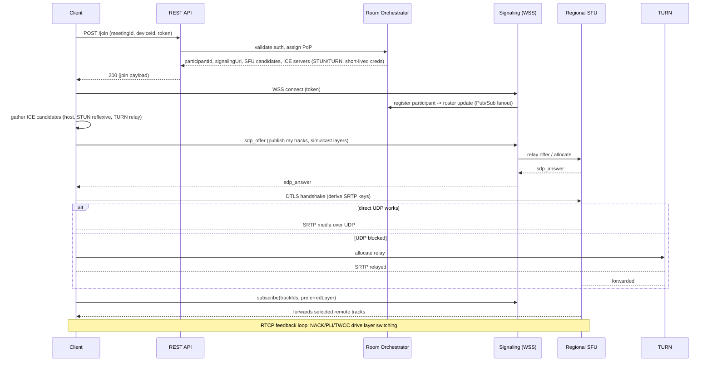
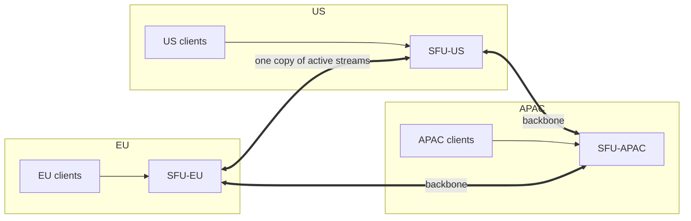

# Design Video Conferencing (Zoom) — High-Level Design

> Staff/principal-level HLD reference and practice artifact. Reader profile: senior backend engineer (Java/JVM, distributed systems) practising system-design rounds. The emphasis throughout is **design judgment** — what to clarify, which tradeoff to make, and the failure mode each decision avoids.

---

## 1. Problem & Clarifying Questions

**Restated problem.** Build a real-time multi-party video conferencing platform — the Zoom/Google Meet/Teams class of product. Multiple participants join a "meeting room" and exchange **live audio and video** with sub-second latency, see/hear each other, share screens, chat, and optionally record. We must support everything from 1:1 calls to 1,000-person all-hands "webinars," across the public internet, on flaky home WiFi and cellular, behind corporate firewalls and home routers (NAT).

This is fundamentally **not** a request/response CRUD system. The hard part is moving continuous, loss-tolerant, latency-sensitive **media streams** between peers in real time, while the control plane (who's in the room, who's muted, signaling) behaves more like a conventional distributed system. Keeping those two planes separate is the central architectural insight.

Before drawing a single box, here is what I'd ask the interviewer.

### 1.1 Functional questions
- **Core media:** Audio + video both required? Do we need **screen sharing**? **Recording** (cloud and/or local)? **Live transcription / captions**? Virtual backgrounds (client-side, usually out of scope server-side)?
- **Meeting sizes:** What's the distribution? Mostly 1:1 and small (≤10)? Or do we need to support **large meetings (100–1,000)** and **webinars (1 → 10,000+ view-only)**? These have radically different architectures.
- **Modes:** Symmetric meetings (everyone can speak/share) vs. webinar (few presenters, many passive viewers)? **Breakout rooms**?
- **Scheduling & lifecycle:** Scheduled meetings with calendar invites, instant meetings, persistent meeting IDs (PMI), waiting rooms, host controls (mute all, eject, lock)?
- **Chat & ancillary:** In-meeting text chat, reactions/emoji, raise hand, polls, Q&A — are these in scope?
- **Telephony bridge (PSTN):** Dial-in by phone number? (Significant subsystem — SIP gateway.) I'll assume **out of scope** unless told otherwise.
- **Clients:** Native desktop (Win/Mac/Linux), mobile (iOS/Android), and **browser (WebRTC)** — all three? Browser support strongly constrains the protocol choice toward WebRTC.

### 1.2 Non-functional questions
- **Latency target:** Interactive conversation requires **end-to-end mouth-to-ear latency < 200 ms** (ITU-T G.114 recommends <150 ms one-way for good quality; up to ~400 ms tolerable). What's our SLO?
- **Availability:** Five-nines on signaling? Media is best-effort by nature; what's the SLO for "successful join"?
- **Quality vs. cost:** Are we optimizing for max quality (more server CPU, simulcast, transcoding) or for cost (mesh for small calls, aggressive downscaling)?
- **Security/compliance:** Is **end-to-end encryption (E2EE)** a hard requirement, or is transport encryption (DTLS-SRTP) + server-side decryption acceptable? E2EE conflicts with server-side recording/transcription and SFU media processing — big tradeoff. HIPAA/GDPR/data-residency constraints?
- **Geographic distribution:** Global users? If so we need **regional media servers** to keep latency low (you cannot beat the speed of light — a NY↔Sydney round trip is ~160 ms RTT minimum).

### 1.3 Scale questions
- **DAU / peak concurrent meetings / peak concurrent participants?** This drives everything (server fleet, bandwidth bill).
- **Average meeting size and duration?**
- **Peak concurrency pattern?** Video conferencing has a brutal **9am / top-of-hour spike** — meetings cluster at :00 and :30. Provisioning for the spike, not the average, is a real cost driver.

### 1.4 Out-of-scope (assumed unless told otherwise)
- PSTN dial-in / SIP, hardware room systems (H.323), enterprise SSO/SCIM provisioning details, billing, the marketing website, and client-side ML (virtual backgrounds, noise suppression run on-device).

---

## 2. Requirements (Finalized)

### 2.1 Functional
1. **Create/schedule/join/leave a meeting** via a unique meeting ID; host controls (mute, eject, lock, waiting room).
2. **Real-time audio + video** among participants, with **active-speaker detection** and adaptive layouts.
3. **Screen sharing** (a high-resolution, low-frame-rate video track).
4. **In-meeting chat, reactions, raise-hand** (control-plane messages).
5. **Recording** to cloud (composited + per-track), retrievable later.
6. **Adaptive quality**: degrade gracefully on poor networks (simulcast / SVC, bandwidth estimation).
7. **Large meetings (up to 1,000 interactive)** and **webinars (1 → 10,000 view-only)**.
8. **Live captions/transcription** (streamed to a speech service).

### 2.2 Non-functional
- **Latency:** mouth-to-ear **p50 < 150 ms, p95 < 250 ms** within a region; cross-region best-effort.
- **Availability:** signaling/control plane **99.99%**; "join success rate" ≥ **99.9%**.
- **Durability:** recordings durable (11 nines, object storage); meeting metadata durable.
- **Consistency:** control plane is **eventually consistent** for roster, **strongly consistent** for "single source of truth" decisions (who is host, is meeting locked). Media plane has **no consistency model** — it's a real-time stream; late packets are useless and dropped.
- **Resilience:** survive a media-server crash by **re-establishing streams** within a couple seconds (reconnect, not perfect continuity); survive an AZ failure with no global outage.
- **Security:** all media encrypted in transit (**DTLS-SRTP**); optional **E2EE** mode; authn/z on join; TURN credentials short-lived.

### 2.3 Assumptions (stated, to proceed)
- **100M registered users, 10M DAU.**
- **Peak concurrent participants: 5M** (top-of-hour spike).
- **Average meeting: 8 participants, 45 min.** Distribution is long-tailed: most meetings are small, but a few are huge.
- Clients are native + browser; **WebRTC** is the baseline media stack (mandatory for browser, and excellent everywhere).
- Default architecture: **SFU (Selective Forwarding Unit)**, with **mesh** for 1:1/tiny calls and **simulcast** for adaptation. (Justified in §7.)
- E2EE is **optional** (default off so we can do server-side recording/SFU); HIPAA tier offers E2EE with feature tradeoffs.

---

## 3. Capacity Estimation

> Goal: size the media fleet, bandwidth bill, and signaling/metadata stores. Media bandwidth dominates everything else by orders of magnitude — that's the headline.

### 3.1 Per-stream bitrates (the load-bearing constant)
Typical WebRTC bitrates (VP8/VP9/H.264 + Opus audio):

| Stream | Resolution | Bitrate |
|---|---|---|
| Audio (Opus) | — | ~40 kbps |
| Video low | 180p | ~150 kbps |
| Video medium | 360p | ~500 kbps |
| Video high | 720p | ~1.5 Mbps |
| Video full | 1080p | ~3 Mbps |
| Screen share | 1080p @ low fps | ~1–2 Mbps |

I'll use **~1.5 Mbps video + 40 kbps audio ≈ 1.5 Mbps per active sending participant** as the working figure for "good quality," and note that simulcast means a sender actually uploads **several** encodings (e.g., 180p+360p+720p ≈ 2.2 Mbps total up).

### 3.2 The N² problem and why topology decides cost
In a meeting of **N** participants where everyone sends and receives:
- **Mesh:** each client sends N−1 copies and receives N−1. Upload per client = (N−1)×1.5 Mbps. For N=8 that's **10.5 Mbps upload per client** — already impossible on home connections. Total streams across the call = N×(N−1) = **O(N²)**.
- **SFU:** each client sends **1** copy up to the server; server forwards. Client upload = 1.5 Mbps (or ~2.2 with simulcast). Client download = (N−1)×(chosen layer). Server carries N up + N×(N−1) down ≈ O(N²) but **on the server's fat pipe**, not the client's.
- **MCU:** server decodes all, composites into one stream, re-encodes; each client sends 1 up, receives **1** down (1.5 Mbps). Client bandwidth is O(1) but server CPU is brutal (decode+encode N streams).

This single table is *why* the topology deep dive (§7.1) is the crux of the whole design.

### 3.3 Aggregate media bandwidth (SFU)
Take peak **5M concurrent participants**. Assume on average each participant **receives** ~4 video streams at medium quality (most large meetings only render a handful of visible tiles + audio for the rest) ≈ **2.5 Mbps downstream** per participant, and **sends ~2 Mbps** (simulcast).

- **Server egress (downstream to clients):** 5M × 2.5 Mbps = **12.5 Tbps**.
- **Server ingress (upstream from clients):** 5M × 2 Mbps = **10 Tbps**.
- **Total media throughput ≈ 22.5 Tbps** at peak.

That is the entire ballgame. At, say, **$0.02/GB** egress (negotiated CDN/transit rate), 12.5 Tbps sustained ≈ 12.5e12/8 = 1.5625e12 bytes/s = ~1.56 TB/s → ~135,000 TB/day → at $0.02/GB ≈ **$2.7M/day** if naively on cloud egress. *This is why every serious provider builds/peers their own backbone and colocation* — egress pricing would bankrupt a naive design. **Flag:** this number is the reason for regional media servers + private backbone + heavy adaptation.

### 3.4 Media server fleet sizing
An SFU node is **packet-forwarding bound** (CPU for SRTP encrypt/decrypt + packet routing, and NIC throughput), not media-decoding bound. A well-tuned SFU on a modern box (say 25–40 Gbps NIC, many cores) can handle on the order of **~5,000–10,000 concurrent forwarded streams** or **~5–10 Gbps** of media depending on packet rates and crypto cost. Conservatively, **~1,000 participants per SFU node** at mixed quality.

- 5M concurrent / 1,000 per node ≈ **5,000 SFU nodes** at peak, before redundancy/headroom.
- With N+ headroom and regional spread, plan **~7,500–10,000 media nodes** globally, distributed across ~20–30 regions/PoPs.

### 3.5 Signaling / control plane
- **Join events:** if average meeting is 45 min and 5M concurrent, churn ≈ 5M/45min ≈ **~1,850 joins/sec average**, with top-of-hour spikes maybe **10–20×** → design signaling for **~30–40k join ops/sec peak**.
- **Persistent signaling connections (WebSocket):** one per participant for control messages → **5M concurrent WebSocket connections**. At ~50k–100k connections per signaling node → **50–100 signaling nodes**.
- Signaling messages are small (KB), low-rate per user (mute, roster updates, ICE candidates during setup). This plane is trivially cheap vs. media.

### 3.6 Storage (recordings + metadata)
- **Recordings:** assume 10% of meetings recorded. Meetings/day: 5M concurrent × (24h/0.75h) × utilization… simpler: assume **2M recorded meetings/day**, avg 45 min. A composited 720p recording ≈ ~1 Mbps → 45 min ≈ **~340 MB**. 2M × 340 MB ≈ **680 TB/day** → **~250 PB/year**. Store in object storage (S3/GCS), tiered to cold storage after 30–90 days. This is large but linear and cheap relative to live bandwidth.
- **Metadata (meetings, participants, chat):** meetings/day ~10M, each a few KB; chat maybe a few MB/meeting peak but mostly small. **Single-digit TB/day**, trivial for a sharded SQL/NoSQL store.

### 3.7 Memory
- SFU per-stream state (jitter buffers, RTP sequence/SSRC mapping, bandwidth estimators, sub/pub maps) is modest — a few hundred KB to low MB per participant. 1,000 participants/node × ~1 MB ≈ ~1 GB working set per node; fine.
- Signaling nodes: per-connection memory ~tens of KB × 100k conns ≈ a few GB.

**Takeaway:** the design is **bandwidth-bound on media**, connection-bound on signaling, and cheap everywhere else. Everything downstream optimizes for that 22.5 Tbps.

---

## 4. API Design

Two distinct API surfaces: **Control/REST + signaling (WebSocket)** and **media (WebRTC, not REST)**. Media is *not* an API in the request/response sense — it's negotiated then flows as RTP/UDP. So the "API" is mostly control plane.

### 4.1 Meeting lifecycle (REST/HTTPS, control plane)
```
POST /v1/meetings
  body: { title, scheduledStart?, settings: {recording, waitingRoom, e2ee, maxParticipants} }
  -> 201 { meetingId, joinUrl, hostKey }

GET  /v1/meetings/{meetingId}
  -> 200 { meetingId, status, settings, hostId, startedAt }

POST /v1/meetings/{meetingId}/join     (idempotent per (user, meeting, deviceId))
  body: { userId, deviceId, displayName, capabilities }
  -> 200 { participantId,
           signalingUrl,                // which signaling cluster
           mediaServer: { region, candidates },  // assigned SFU PoP
           iceServers: [ {stun...}, {turn, username, credential, ttl} ],  // short-lived TURN creds
           token }                      // JWT scoped to meeting+participant

POST /v1/meetings/{meetingId}/leave    { participantId }
DELETE /v1/meetings/{meetingId}        (host ends meeting)
```

### 4.2 In-meeting control (WebSocket signaling, bidirectional)
A single persistent WS carries JSON control messages and the WebRTC signaling exchange:
```
// Client -> Server
{ type: "sdp_offer", sdp, participantId }
{ type: "ice_candidate", candidate, participantId }
{ type: "subscribe", trackIds: [...], preferredLayer: "q|h|f" }   // which streams I want + quality
{ type: "mute", kind: "audio|video", muted: true }
{ type: "host_action", action: "mute_all|eject|lock|spotlight", target? }
{ type: "chat", text, scope: "all|dm:participantId" }
{ type: "raise_hand" } / { type: "reaction", emoji }

// Server -> Client
{ type: "sdp_answer", sdp }
{ type: "ice_candidate", candidate }
{ type: "roster_update", participants: [...], activeSpeaker }
{ type: "track_added"/"track_removed", participantId, trackId, kind }
{ type: "bandwidth_hint", maxBitrate }      // server tells client to back off (REMB/TWCC-derived)
{ type: "layer_switch", trackId, layer }    // SFU tells which simulcast layer it's sending
{ type: "recording_state", state }
```

### 4.3 Media plane (WebRTC — for context, not REST)
- **Transport:** SRTP (Secure RTP) over **UDP**, with DTLS handshake for key exchange. Falls back to **TCP/TLS via TURN** only when UDP is blocked.
- **Feedback:** RTCP — **NACK** (retransmit request), **PLI/FIR** (request keyframe), **REMB/TWCC** (bandwidth estimation), receiver reports.
- The SFU exposes no REST media endpoints; clients **subscribe/publish tracks** via the SDP negotiation and the `subscribe` control messages above.

**Design note (idempotency):** `join` is keyed on `(meetingId, userId, deviceId)` so retries during flaky setup don't create duplicate participants — they return the existing `participantId`. The server holds a join token; reconnects re-present it.

---

## 5. High-Level Architecture

### 5.1 Plane separation (the core idea)
- **Control plane:** stateless-ish HTTP API + stateful signaling (WebSocket) + metadata stores. Cheap, conventional, must be highly available and strongly consistent on critical decisions.
- **Media plane:** WebRTC media servers (SFUs) in regional PoPs, plus STUN/TURN for NAT traversal, plus recording/transcode workers. Best-effort, latency-critical, bandwidth-bound.

### 5.2 ASCII block diagram
```
                          ┌──────────────────────────────────────────────┐
                          │                CLIENTS                         │
                          │  browser(WebRTC) / desktop / mobile            │
                          └───────┬───────────────────────────┬──────────┘
                  HTTPS (REST)    │                            │  WebRTC media
                  + WSS signaling │                            │  (SRTP/UDP, DTLS)
                                  ▼                            ▼
            ┌─────────────────────────────────┐   ┌──────────────────────────────┐
            │        CONTROL PLANE            │   │       NAT TRAVERSAL           │
            │  ┌───────────┐  ┌────────────┐  │   │  ┌────────┐    ┌──────────┐  │
            │  │ API GW /  │  │ Signaling  │  │   │  │ STUN   │    │  TURN    │  │
            │  │ Edge LB   │  │ servers    │  │   │  │(reflex)│    │ (relay)  │  │
            │  │(GeoDNS,   │  │ (WebSocket │  │   │  └────────┘    └──────────┘  │
            │  │ Anycast)  │  │  fanout)   │  │   └──────────────┬───────────────┘
            │  └─────┬─────┘  └─────┬──────┘  │                  │
            │        │              │         │                  │ if direct path fails
            │  ┌─────▼──────────────▼──────┐  │                  ▼
            │  │  Meeting/Room service     │  │   ┌──────────────────────────────┐
            │  │  (orchestrator, host ctl, │  │   │        MEDIA PLANE            │
            │  │   participant roster)     │◄─┼──►│  Regional SFU clusters        │
            │  └─────┬─────────────┬───────┘  │   │  (US-E, US-W, EU, APAC...)    │
            │        │             │          │   │  ┌─────────┐  ┌─────────┐     │
            │  ┌─────▼────┐  ┌─────▼──────┐   │   │  │  SFU    │  │  SFU    │ ... │
            │  │ Metadata │  │  Pub/Sub   │   │   │  │ node    │  │ node    │     │
            │  │ DB(meet, │  │ (roster,   │   │   │  │(forward,│  │         │     │
            │  │ part.)   │  │ presence)  │   │   │  │ simulc.,│  │         │     │
            │  └──────────┘  └────────────┘   │   │  │ BWE)    │  │         │     │
            └─────────────────────────────────┘   │  └────┬────┘  └─────────┘     │
                                                   │       │ cascade (big mtg)    │
            ┌─────────────────────────────────┐   │       ▼                      │
            │      RECORDING / MEDIA JOBS     │◄──┼── tap media tracks            │
            │  compositor + transcode workers │   └──────────────────────────────┘
            │  -> object storage (S3/GCS)     │
            │  -> transcription (ASR) stream  │
            └─────────────────────────────────┘
                Private backbone interconnects all regional media PoPs
```

### 5.3 Mermaid diagram


### 5.4 Request flow — join + first media (sequence)


---

## 6. Data Model & Storage Choices

The control plane has real data; the media plane is largely **ephemeral in-memory state** on the SFU (no DB in the media hot path — a DB write per packet would be absurd).

### 6.1 Entities (control plane)
```
Meeting        { meetingId(PK), hostUserId, status(scheduled|live|ended),
                 settings(json), scheduledStart, startedAt, endedAt, region }
Participant    { participantId(PK), meetingId(FK), userId, deviceId,
                 role(host|cohost|attendee|panelist|viewer),
                 joinedAt, leftAt, assignedSfuNode, connectionState }
User           { userId(PK), name, email, ... }   // identity service
ChatMessage    { msgId(PK), meetingId, senderId, ts, scope, text }
RecordingJob   { recordingId(PK), meetingId, status, storageUri, durationSec, startedAt }
```

### 6.2 Ephemeral runtime state (in-memory, on SFU + signaling)
- **Per-meeting media routing table** on the SFU: SSRC↔track↔participant maps, who-subscribes-to-whom, current simulcast layer per subscription, bandwidth estimates, jitter buffers. Lives in RAM; lost on crash (recovered by client reconnect, see §9).
- **Presence/roster:** authoritative copy in a fast store + broadcast via Pub/Sub.

### 6.3 Datastore choices and why
| Data | Store | Why |
|---|---|---|
| Meetings, Participants (metadata) | **Sharded relational (e.g. Postgres/CockroachDB/Spanner)** keyed by meetingId | Strong consistency for "who is host / is meeting locked / max participants" decisions; relational queries for dashboards; modest volume. Shard by meetingId. |
| Live roster / presence | **In-memory store (Redis)** + **Pub/Sub** | Sub-ms reads, ephemeral, fan-out updates to all signaling nodes hosting that meeting's participants. Don't durably store transient presence. |
| Signaling fan-out | **Pub/Sub (Redis Pub/Sub / Kafka topic per meeting / NATS)** | Participants of one meeting may land on different signaling nodes; need a bus so a `mute_all` or `roster_update` reaches all of them. |
| Chat | **NoSQL (Cassandra/DynamoDB)** or append to durable log | High write fan-out within a meeting, time-ordered, partition by meetingId; cheap horizontal scale. In-meeting chat is usually not deeply queried. |
| Recordings (blobs) | **Object storage (S3/GCS)** + CDN for playback | 11-nines durability, cheap, tiered storage; large sequential blobs. |
| Recording/job metadata | Relational + a **work queue** (SQS/Kafka) | Track job status; queue decouples bursty recording starts from worker capacity. |
| Media routing state | **None (RAM on SFU)** | Per-packet hot path must not touch a DB. Reconstructed on reconnect. |

**Defended decision — metadata in strongly consistent SQL, not eventually consistent:** the decisions that matter (single host, meeting lock, participant cap, billing-minute counting) must not race. The failure mode avoided: two clients both believing they're host and issuing conflicting `mute_all`/`eject`, or a locked meeting admitting an attendee due to stale reads. Volume is tiny, so we pay for consistency cheaply. Roster *display* can be eventually consistent (a name shows up 200 ms late — fine).

---

## 7. Deep Dives

This is the heart of the design. Five hard sub-problems: (1) **topology** (mesh/SFU/MCU), (2) **media transport & WebRTC over UDP**, (3) **NAT traversal (STUN/TURN/ICE)**, (4) **bandwidth adaptation (simulcast/SVC/BWE)**, (5) **scaling large meetings/webinars + regional media + recording**.

---

### 7.1 Deep Dive: Topology — Mesh vs. SFU vs. MCU

**The problem.** How do N participants' media reach each other? This single choice dominates client bandwidth, server cost, latency, and feature feasibility (E2EE, recording).

**Definitions (for the newcomer):**
- **Mesh / P2P full-mesh:** every client connects directly to every other client. No media server.
- **MCU (Multipoint Control Unit):** server **decodes all incoming streams, mixes/composites them into one stream, re-encodes**, and sends each client a single combined stream.
- **SFU (Selective Forwarding Unit):** server receives each client's stream once and **forwards (routes) the packets** to other clients without decoding/re-encoding. It selectively forwards (e.g., only the layers/streams each client needs).

| Dimension | Mesh | SFU | MCU |
|---|---|---|---|
| Client **upload** | (N−1) copies → O(N) | 1 copy (or ~simulcast 3) → O(1) | 1 copy → O(1) |
| Client **download** | (N−1) → O(N) | (subscribed) → O(N) but selectable | 1 composited → O(1) |
| Server CPU | none | low (packet forward + crypto) | **very high** (N decode + 1 encode/recipient) |
| Server bandwidth | none | high (O(N²) on fat pipe) | high |
| Latency | lowest (1 hop) | low (1 relay hop) | higher (decode+mix+encode adds delay) |
| Max practical N | ~3–4 | hundreds–thousands (with cascade) | tens (CPU-bound) |
| Recording | hard (no central point) | easy (tap tracks) | trivial (already composited) |
| E2EE | natural | possible (server forwards opaque media) | **impossible** (server must decode) |
| Per-client layout flexibility | full | full | none (everyone sees same mix) |
| Cost model | $0 server | server bw heavy | server CPU heavy |

**Decision: SFU as the default, mesh for 1:1/tiny, MCU only for niche output (telephony/compositing).**

Reasoning and failure modes avoided:
- **Why not mesh beyond ~3?** Client upload is O(N). At N=8, 10.5 Mbps upstream per client is infeasible on home/cellular; quality collapses and CPU melts (encoding N separate streams). Mesh's failure mode is **the weakest client's uplink throttles everyone**. But for **1:1**, mesh is *optimal* — lowest latency, zero server cost — so we keep it for 2-party calls.
- **Why not MCU as default?** MCU's failure mode is **CPU cost and latency**: decode+mix+re-encode for every meeting is enormously expensive (one core or fraction per active encode) and adds tens-to-hundreds of ms. It also **forecloses per-participant layouts** (you can't show different speaker views) and **kills E2EE**. We use MCU-like compositing **only at the edge** for outputs that genuinely need a single mixed stream: PSTN/telephony, single-stream recording, or a 10,000-viewer webinar broadcast leg.
- **Why SFU wins:** it pushes the O(N²) burden onto the **server's fat pipe and the SFU's cheap forwarding path** instead of the client's thin uplink. Combined with **simulcast** (§7.4), the SFU forwards the *right* layer to each subscriber, so a participant on a phone gets 180p of the speaker while a desktop gets 720p — from the *same* uploaded streams. SFU's failure mode is **server bandwidth at scale**, which we attack with regional PoPs, cascade, and adaptation (§7.5).

**Hybrid policy (defended):** `if N==2: mesh; else: SFU`. Switch from mesh→SFU transparently when a 3rd party joins a 1:1 (re-negotiate to route through the SFU). This optimizes the *common case* (huge volume of 1:1 calls cost $0 in media) without compromising group calls.

---

### 7.2 Deep Dive: Media Transport & WebRTC over UDP

**The problem.** Real-time video is **loss-tolerant but latency-intolerant**. A packet that arrives 300 ms late is garbage — there's nothing to do with it, the moment passed. So the transport must prioritize timeliness over reliability. This is the opposite of TCP's contract.

**Why UDP, not TCP.** TCP guarantees in-order, reliable delivery via **head-of-line blocking** — if packet 5 is lost, packets 6–10 wait in the buffer until 5 is retransmitted. For a file that's correct; for live video it's fatal: you'd freeze the whole stream waiting for a frame that's already too old to show. **UDP** has no retransmit, no ordering, no congestion backoff baked in — it just sends datagrams. WebRTC builds *exactly the reliability it wants* on top of UDP:
- **RTP** (Real-time Transport Protocol) carries media with sequence numbers + timestamps + SSRC (stream id), so the receiver can reorder, detect loss, and sync audio/video.
- **RTCP** carries feedback: **NACK** (please resend packet X — but only if it'll still be useful), **PLI/FIR** (I lost sync, send a fresh **keyframe**), **REMB/TWCC** (here's how much bandwidth I'm seeing — used for congestion control).
- **SRTP** encrypts the RTP payload; keys are established by a **DTLS** handshake (DTLS = TLS over UDP) at session start. This is **DTLS-SRTP**: media is always encrypted in transit.

**Codecs (for context):** audio is **Opus** (great at low bitrate, handles loss via PLC — packet loss concealment). Video is **VP8/VP9/AV1** or **H.264** depending on client support; VP9/AV1 enable **SVC** (§7.4).

**Loss handling tradeoffs (defended):**
- **NACK + selective retransmit:** only retransmit if RTT is small enough that the packet still arrives in time. Failure mode avoided: pointless retransmits congesting an already-bad link.
- **Keyframe (PLI) on bad loss:** if too much is lost, request a full keyframe (a frame decodable on its own, vs. delta frames that depend on prior frames). Tradeoff: keyframes are big and spike bandwidth — request them sparingly (a keyframe storm in a large SFU meeting can melt uplinks; the SFU must **dedupe/throttle** keyframe requests from many subscribers into one upstream request).
- **FEC (Forward Error Correction):** send redundant data so some loss is recoverable without retransmit. Tradeoff: costs bandwidth always, even when no loss; use adaptively on lossy links.
- **Jitter buffer:** small adaptive buffer to smooth out variable arrival times (jitter), trading a little latency for smoothness.

**Why the SFU forwards rather than decodes (failure mode avoided):** if the SFU decoded/re-encoded (MCU-style), it would add latency, cost CPU, and force a single quality. By forwarding opaque RTP, the SFU stays cheap and can even forward **encrypted-to-server-but-opaque** media for E2EE (it routes packets it can't read, using only the unencrypted RTP headers).

**TCP/TLS fallback:** when UDP is entirely blocked (strict corporate firewalls), WebRTC falls back to **TURN over TCP/TLS on port 443** — it *looks like* HTTPS and gets through, at the cost of head-of-line blocking and worse quality. This is the "always connect, even if degraded" safety net (see §7.3).

---

### 7.3 Deep Dive: NAT Traversal (STUN / TURN / ICE)

**The problem.** Most clients are behind **NAT (Network Address Translation)** — a home router gives the device a private IP (e.g., 192.168.x.x) and rewrites ports on the way out. So a client doesn't know its own *public* address, and an unsolicited inbound UDP packet from the SFU has nowhere to go (the router has no mapping for it). Without help, two peers behind NAT simply cannot reach each other.

**The toolkit:**
- **STUN (Session Traversal Utilities for NAT):** the client asks a STUN server "what public IP:port do you see me coming from?" The server replies with the **server-reflexive address**. Now the client knows its public mapping and can advertise it. STUN is cheap (a tiny stateless echo) and works for most NATs.
- **TURN (Traversal Using Relays around NAT):** when STUN isn't enough (symmetric NATs that assign a *different* mapping per destination, or UDP fully blocked), the client uses a **TURN relay** — a public server that relays media on the client's behalf. TURN actually carries the media (bandwidth cost!), so it's a fallback, not a default.
- **ICE (Interactive Connectivity Establishment):** the framework that ties it together. Each peer gathers **candidates** — (a) **host** (local IP), (b) **server-reflexive** (via STUN), (c) **relay** (via TURN) — exchanges them via signaling, then **probes all pairs** with connectivity checks and picks the best working one (prefers host > reflexive > relay, i.e., most direct, lowest latency).

**Connection sequence (failure modes baked in):**
1. Gather host + STUN-reflexive + TURN-relay candidates.
2. Exchange via signaling (SDP).
3. Run ICE connectivity checks on candidate pairs simultaneously.
4. Promote the best pair. **Direct UDP** if possible (lowest latency, no relay cost); **TURN/UDP** if NAT is hostile; **TURN/TCP/443** if UDP blocked entirely.

**Defended decisions:**
- **TURN is provisioned but used sparingly.** Studies (and Google's published WebRTC stats) show **~10–20% of sessions need TURN**. We must size TURN for that fraction at peak — it's real bandwidth (every relayed byte traverses our TURN fleet twice). Failure mode avoided by *not* relaying everyone: paying SFU-scale bandwidth twice over.
- **Short-lived TURN credentials.** Hand out time-limited HMAC credentials in the `join` response. Failure mode avoided: leaked long-lived TURN creds turn your relay fleet into a free open proxy (a classic abuse/cost-explosion vector).
- **TURN over 443/TLS as last resort.** Guarantees connectivity through draconian firewalls at quality cost. The principle: **always connect, degrade gracefully** — a laggy call beats a failed join.
- **Co-locate STUN/TURN near SFUs / in PoPs** so the relay path doesn't add a transcontinental hop.

**In the SFU world, who is "the peer"?** With an SFU, the client doesn't NAT-traverse to *other clients* — it traverses to the **SFU**, which has a public address. This is a big simplification vs. mesh: only N client↔server ICE negotiations, and the server end is always reachable. NAT traversal complexity is *another* quiet point in SFU's favor over mesh.

---

### 7.4 Deep Dive: Bandwidth Adaptation — Simulcast, SVC, and Congestion Control

**The problem.** Participants have wildly different networks: a desktop on fiber and a phone on 3G in the same meeting. A single fixed bitrate either starves the fiber user (too low) or drowns the phone (too high → loss → freezes). And conditions change *mid-call* (you walk into an elevator). We need **per-receiver, dynamically-adapting quality** without the SFU transcoding.

**The mechanisms (for the newcomer):**
- **Simulcast:** the sender encodes the *same* video at **multiple resolutions/bitrates simultaneously** (e.g., 180p / 360p / 720p) and sends all of them up to the SFU as separate streams. The SFU then **forwards the layer best suited to each receiver**. The phone subscriber gets 180p; the desktop gets 720p — from one upload set. Cost: ~2× the sender uplink (sending all layers), but no transcoding anywhere.
- **SVC (Scalable Video Coding):** the sender produces a **single layered bitstream** (e.g., VP9/AV1) where a base layer is independently decodable and enhancement layers add resolution/framerate/quality. The SFU can **drop enhancement layers** by simply not forwarding certain packets — finer-grained and more bandwidth-efficient than simulcast, no separate encodes. Cost: codec complexity, client support.
- **Congestion control / Bandwidth Estimation (BWE):** **TWCC (Transport-Wide Congestion Control)** and **REMB** measure delay/loss to estimate available bandwidth on each link, and the sender/SFU adapts the bitrate (Google's **GCC** algorithm). This is the feedback loop that decides *when* to switch layers.

| Approach | Sender cost | SFU cost | Granularity | Client support | Verdict |
|---|---|---|---|---|---|
| **Single stream** | low | none | none (one quality for all) | universal | only for 1:1 / trivial |
| **Simulcast** | ~2–2.5× uplink (multi-encode) | none (just forward) | coarse (2–3 layers) | broad (VP8/H.264) | **default for group video** |
| **SVC** | ~1.2–1.5× (one layered encode) | none (drop packets) | fine | VP9/AV1 (narrower) | preferred where supported |
| **SFU transcoding** | low (1 stream up) | **very high** (decode+re-encode) | arbitrary | universal | only for interop (legacy/PSTN) |

**Defended decision: Simulcast by default, SVC where the codec is supported, never transcode in the SFU for normal meetings.**
- **Failure mode avoided by simulcast/SVC vs. transcoding:** transcoding in the SFU reintroduces MCU-grade CPU cost and latency, and breaks E2EE. Forwarding pre-encoded layers keeps the SFU a cheap router.
- **Failure mode avoided by adaptation vs. fixed bitrate:** without BWE-driven layer switching, the **weakest link causes cascading packet loss** → the sender backs off globally → *everyone's* quality drops to match the worst receiver. Per-receiver layer selection **isolates the weak receiver**: their tile degrades to 180p while everyone else stays HD. This per-receiver isolation is the entire reason SFUs beat mesh on quality at scale.
- **Active-speaker prioritization:** the SFU forwards full quality for the **active speaker** and low/paused video for others (and audio for all). Pair with **last-N forwarding** in big meetings: only forward video for the N most-recent/loudest speakers; others are audio-only or thumbnails. Failure mode avoided: forwarding 1,000 video streams to every client (impossible) — instead forward ~5–9 visible tiles + audio.
- **Audio is sacred:** audio is tiny (40 kbps) and conversation-critical, so it's never dropped first. On congestion, **video degrades, audio persists**. This priority ordering is a deliberate product decision encoded into the BWE/forwarding policy.

---

### 7.5 Deep Dive: Scaling Large Meetings, Webinars, Regional Media & Recording

This bundles the "scale" hard problems because they interlock.

#### 7.5.1 SFU cascade for large meetings (>1 node capacity)
A single SFU node caps out (~1,000 streams). A 1,000-person interactive meeting, or one spread across continents, won't fit on one node. Solution: **SFU cascade / tree** — multiple SFU nodes interconnect over the **private backbone**, each handling a subset of participants, forwarding only needed streams between nodes.
- A participant in EU connects to the **EU SFU**; a participant in US connects to the **US SFU**; the two SFUs exchange the **active speaker + subscribed** streams over the backbone (one inter-region copy, not N).
- **Failure mode avoided:** routing every EU participant's media across the Atlantic to a single US node — that's N transcontinental copies and 80+ ms of extra latency for everyone. Cascade sends **one** copy between regions and fans out locally. This is the key trick for both **large meetings** and **global meetings**.
- Tradeoff: cascade adds a relay hop (small latency) and routing complexity; a coordinator must decide the tree topology and rebalance on join/leave.



#### 7.5.2 Webinars (1 presenter → 10,000+ viewers)
A webinar is **asymmetric**: a few panelists send media; thousands only watch. Forwarding to 10,000 individual WebRTC subscribers from SFUs is doable via a **fan-out tree of SFUs** (edge SFUs replicate the presenter's stream to clusters of viewers), but at very large scale you switch the **view-only leg to a broadcast/CDN protocol**:
- **Interactive core** (panelists, raise-hand to speak): WebRTC/SFU, low latency.
- **View-only masses:** transcode once into **HLS/LL-HLS or DASH** and distribute via **CDN**, which is built for millions of viewers. Latency rises to ~2–5 s (LL-HLS ~2 s), acceptable for passive viewing.
- Promotion from viewer→panelist re-negotiates them onto the low-latency WebRTC path.
- **Failure mode avoided:** trying to maintain 10,000 stateful WebRTC peer connections per webinar on the SFU fleet — connection state and keyframe management explode. CDN fan-out is the proven path for one-to-many at internet scale.

| Mode | Path | Latency | Scale ceiling |
|---|---|---|---|
| Interactive meeting | SFU (+cascade) | <250 ms | ~1,000 |
| Webinar panelists | SFU | <250 ms | ~50 |
| Webinar viewers | Transcode → LL-HLS/DASH → CDN | ~2–5 s | millions |

#### 7.5.3 Regional media servers & PoP selection
- **GeoDNS / Anycast** routes the client's *signaling* to the nearest control region; the **Room Orchestrator** assigns an **SFU PoP** based on (a) participant geography, (b) PoP load, (c) where the meeting's other participants already are (keep a meeting on one PoP if possible to avoid cascade).
- **Speed of light is the hard floor:** ~5 µs/km in fiber, plus routing overhead → NY↔London ~70–80 ms RTT minimum. You can't beat physics, so **put the media server near the speakers**. Regional PoPs are the single biggest latency lever.
- **Private backbone** between PoPs avoids the jittery public internet and tames egress cost (peering/owned fiber vs. cloud egress pricing — recall §3.3's scary $2.7M/day).

#### 7.5.4 Recording & transcription
- A **recording client/bot** acts as a hidden subscriber on the SFU, receiving all (or selected) tracks. Two flavors:
  - **Composited recording:** a compositor (MCU-style, server-side) lays out tiles + screen share into one video, encodes to MP4, uploads to **object storage**. Used for replay.
  - **Per-track / raw recording:** store each participant's track separately (enables re-compositing, transcript alignment, E2EE-respecting flows).
- **Transcription/captions:** tap the audio tracks, stream to an **ASR (automatic speech recognition)** service, push captions back over signaling and into the recording's metadata.
- **Decoupling:** recording starts/stops are bursty (top-of-hour); buffer jobs through a **queue** and autoscale compositor/transcode workers. Failure mode avoided: a stampede of simultaneous recording starts overwhelming a fixed worker pool and dropping the first minutes of recordings.
- **E2EE tension (explicit):** server-side recording/transcription requires the server to *see* the media, which **breaks E2EE**. So E2EE meetings either disable cloud recording/transcription or do it **client-side** (one participant records locally with their keys). This tradeoff is surfaced to the user, not hidden.

---

## 8. Scaling & Bottlenecks

**Where it breaks first, in order, and the fix:**

| Bottleneck | Symptom | Fix |
|---|---|---|
| **Media egress bandwidth** (the #1 cost & limit) | $$$ egress bill; saturated PoP NICs | Regional PoPs, private backbone/peering, aggressive simulcast/SVC + last-N forwarding, CDN for webinar viewers |
| **Single SFU node stream cap** | meetings can't grow past ~1k; one big meeting starves a node | SFU cascade across nodes; cap meeting size per node; load-aware PoP/node assignment |
| **Top-of-hour join spike** | join failures at :00/:30 | Pre-warm/over-provision media+signaling for spike; rate-limit + queue joins; fast horizontal autoscale (media nodes are stateless-per-meeting and quick to add) |
| **Signaling WebSocket fan-out** | roster/control messages lag in big meetings | Pub/Sub bus partitioned per meeting; coalesce roster updates; shard signaling by meetingId so a meeting's fanout is local where possible |
| **Keyframe storms** | uplink spikes when many subscribers request keyframes | SFU dedupes/throttles PLI to one upstream request; rate-limit keyframe generation |
| **TURN relay load** | the ~15% relayed sessions cost 2× bandwidth | Size TURN for peak relay fraction; prefer direct ICE; co-locate TURN in PoPs |
| **Metadata DB hot meeting** | a 1k-person meeting hammers one shard's participant rows | Cache roster in Redis; write-behind participant churn; don't put per-packet anything in the DB |
| **Recording/transcode workers** | recordings drop frames / start late under burst | Queue + autoscale workers; per-track raw capture (cheap) + async compositing |

**Scaling principle:** the **media plane scales horizontally and statelessly-per-meeting** — add SFU nodes, route new meetings to them. The **control plane** scales like any web system (shard metadata, scale signaling by connection count, Pub/Sub for fanout). Keep the planes independent so a media surge doesn't take down signaling and vice versa.

---

## 9. Reliability, Consistency & Security

### 9.1 Failure handling
- **SFU node crash:** in-RAM media state is lost. Detection via heartbeat/health checks; the orchestrator reassigns affected participants to a healthy node in the same PoP; clients **reconnect** (re-ICE, re-negotiate SDP) — a ~1–3 s blip, not a perfect handoff. We accept "fast reconnect" over "seamless failover" because mirroring per-packet media state across nodes is prohibitively expensive and the recovery is fast enough to be tolerable. **Failure mode avoided:** trying to replicate jitter buffers/SSRC state synchronously (would double bandwidth and add latency to every meeting for a rare event).
- **AZ/region failure:** PoPs are independent; GeoDNS/orchestrator steers new joins to a healthy region; live meetings in the failed region reconnect to the next-nearest PoP (latency rises, call continues).
- **Signaling node failure:** clients reconnect to another signaling node (stateless behind LB + Pub/Sub for shared meeting state); roster is rehydrated from Redis.
- **Graceful degradation ladder:** HD video → lower simulcast layer → audio-only → "reconnecting." Audio is preserved as long as possible.

### 9.2 Consistency model
- **Media plane:** *no* consistency — real-time, lossy, ephemeral; correctness = "fresh enough," not "complete."
- **Roster/presence:** eventually consistent display via Pub/Sub (sub-second convergence).
- **Authoritative meeting state** (host identity, lock, participant cap, recording on/off, billing minutes): **strongly consistent** via the SQL store with conditional updates. **Failure mode avoided:** split-brain host, double-admit past a lock, miscounted billing.
- **Idempotency:** `join` keyed on `(meetingId, userId, deviceId)` + a request token so retries during flaky setup don't duplicate participants or double-count. Host actions carry action IDs to avoid double-eject.

### 9.3 Security
- **Transport encryption always:** **DTLS-SRTP** on all media; **TLS/WSS** on control. No plaintext media on the wire, ever.
- **Optional E2EE:** insertable streams / per-frame encryption with keys exchanged among participants (e.g., MLS-style group key) so the **SFU forwards opaque media it cannot decrypt**. Tradeoff (surfaced): disables server-side recording/transcription/compositing and some SFU optimizations. Default off; on for high-assurance tiers.
- **AuthN/Z:** signed **join tokens (JWT)** scoped to a meeting+participant+role; waiting room + host admit; meeting passcodes; role-based host/cohost/panelist/attendee permissions enforced server-side (never trust the client for `mute_all`/`eject`).
- **TURN abuse prevention:** short-lived HMAC credentials; rate limits; egress quotas. **Failure mode avoided:** open relay used as a free proxy → runaway cost.
- **Abuse / "Zoombombing" controls:** random/long meeting IDs, waiting rooms, lock, host-only screen-share, kick/report, profanity/abuse rate-limiting on chat.
- **Rate limiting:** on join, create-meeting, chat, and reactions to blunt spam and DoS; per-IP and per-user.
- **Data residency:** pin a meeting's media + recordings to a region for GDPR/compliance customers (orchestrator honors residency policy when picking PoP and storage bucket).

---

## 10. Extensions & Follow-ups

Realistic interviewer add-ons and how the design flexes:

1. **PSTN dial-in.** Add a **SIP gateway** that bridges the telephone network to the meeting; it transcodes (G.711 ↔ Opus) and joins as a participant — inherently MCU-style (single mixed audio). Adds a transcoding subsystem and DTMF handling.
2. **End-to-end encryption everywhere.** Switch to per-frame encryption + group key management (MLS). SFU forwards opaque media; **lose** server recording/transcription/server-side layouts → move those client-side or disable. Quantify the feature cost to the interviewer.
3. **Live streaming to YouTube/Facebook.** Add an **RTMP egress** worker that subscribes (like the recorder), composites, and pushes to external platforms.
4. **Breakout rooms.** Sub-meetings within a meeting; orchestrator spins up logical sub-rooms (possibly separate SFU groupings) and moves participants; host can broadcast across rooms.
5. **50,000-person webinar.** Push view-only entirely to **LL-HLS/DASH over CDN**; keep only panelists on WebRTC; promotion path for Q&A.
6. **Noise suppression / virtual backgrounds.** Client-side ML (on-device) — no server impact; mention as a quality lever that *reduces* needed bitrate (clean audio compresses better).
7. **AI features (summaries, action items).** Tap the transcription stream → LLM summarization pipeline; async, off the hot path; respects E2EE constraints.
8. **Lower cost at small scale.** Keep mesh for 1:1; consider P2P for 3-party with strong uplinks; aggressive last-N + audio-only fallback in big meetings.
9. **Multi-cloud / on-prem media.** SFUs are portable; run media in customer data centers for residency while control stays central.

---

## 11. Interview Q&A

**Q1. Why SFU over MCU and mesh as the default?**
SFU pushes the O(N²) media burden onto the server's fat pipe while keeping the server cheap (forward packets, no decode/encode), supports per-receiver quality via simulcast, enables E2EE (forwards opaque media), and makes recording easy (tap tracks). Mesh dies past ~3 participants (O(N) client uplink). MCU is CPU-prohibitive, adds latency, forecloses per-participant layouts, and breaks E2EE. We still use mesh for 1:1 (cheapest, lowest latency) and MCU-style compositing only at the edge (recording, telephony, webinar broadcast).
- *Probe: when would you actually pick MCU?* For single-stream outputs: PSTN audio mixing, composited recording, and the view-only leg of huge webinars where clients can't handle many streams.
- *Probe: how does SFU handle a 1,000-person meeting?* SFU cascade — a tree of SFU nodes over a private backbone, each handling a subset; only active-speaker/subscribed streams cross nodes; last-N forwarding limits per-client downstream.

**Q2. Why UDP, and how do you get reliability without TCP?**
TCP's head-of-line blocking is fatal for real-time media — a late packet is useless, so you never want to stall the stream waiting for a retransmit. UDP + RTP gives sequencing/timing; WebRTC adds *selective* reliability: NACK retransmit only when the packet will still arrive in time, PLI for keyframes on heavy loss, FEC on lossy links, and a jitter buffer to smooth arrival. Audio uses Opus PLC to mask loss. TCP/TLS-443 via TURN is the last-resort fallback when UDP is blocked.
- *Probe: keyframe storms?* Many subscribers requesting keyframes can spike the sender's uplink; the SFU dedupes/throttles PLI into one upstream request and rate-limits keyframe generation.

**Q3. Walk me through NAT traversal.**
NAT hides clients behind a router; unsolicited inbound packets have no mapping. ICE gathers candidates — host (local), server-reflexive (via STUN, "what's my public IP?"), and relay (via TURN) — exchanges them in SDP, probes all pairs, and picks the most direct working path. With an SFU, clients only traverse to the SFU (public address), not to each other, which simplifies everything. ~15% of sessions need TURN relay; TURN over 443/TLS is the final fallback.
- *Probe: STUN vs TURN cost?* STUN is a cheap stateless echo. TURN actually relays media (2× bandwidth), so it's a sized-for-15% fallback, with short-lived HMAC creds to prevent open-proxy abuse.

**Q4. How do you handle participants with very different network conditions?** *(senior-signal)*
Simulcast: senders encode multiple resolutions; the SFU forwards the right layer per receiver, so a phone gets 180p and a desktop gets 720p from the same upload. SVC where the codec supports it (drop enhancement layer packets, finer-grained, no extra encodes). TWCC/GCC bandwidth estimation drives layer switching dynamically. Crucially this **isolates the weak receiver** — without per-receiver selection, the weakest link drags everyone's quality down. Never transcode in the SFU for normal meetings (reintroduces MCU cost + breaks E2EE).

**Q5. How do you keep latency low globally?** *(senior-signal)*
Physics: ~70–80 ms minimum RTT NY↔London. So place media servers near speakers via regional PoPs; route signaling with GeoDNS/Anycast; assign the SFU PoP by participant geography and load; connect PoPs with a private backbone (low jitter, controlled cost). For cross-region meetings, cascade sends one inter-region copy and fans out locally rather than hauling N copies across an ocean.

**Q6. What's your consistency model?** *(senior-signal)*
Three tiers. Media: no consistency, fresh-or-dropped. Roster/presence: eventually consistent via Pub/Sub (sub-second). Authoritative meeting state (host, lock, cap, recording, billing): strongly consistent via SQL with conditional updates — avoids split-brain host, double-admit past lock, and miscounted billing. Join is idempotent on (meeting, user, device) + token.

**Q7. How does recording work, and how does it interact with E2EE?**
A hidden subscriber/bot receives tracks from the SFU; a compositor produces an MP4 (and/or per-track raw), uploaded to object storage; audio is tapped for ASR/captions. Bursty starts are buffered through a queue with autoscaled workers. With E2EE, the server can't see media, so cloud recording/transcription is disabled or moved client-side — an explicit feature tradeoff surfaced to the user.

**Q8. What breaks first at scale, and what does it cost?**
Media egress — ~22.5 Tbps at 5M concurrent; naive cloud egress would be ~$2.7M/day, which is why we build PoPs + private backbone + heavy adaptation + CDN for webinar viewers. Next: single-SFU stream cap (fix with cascade), top-of-hour join spikes (pre-warm + queue), and signaling fan-out (per-meeting Pub/Sub).

**Q9. How do you handle an SFU node crashing mid-meeting?**
Heartbeat detects it; orchestrator reassigns participants to a healthy node in the same PoP; clients reconnect (re-ICE, re-negotiate) — a 1–3 s blip. We deliberately choose fast reconnect over seamless failover because replicating per-packet media state is prohibitively expensive for a rare event.

**Q10. How do you support a 10,000-viewer webinar?** *(scaling probe)*
Split the legs: panelists on low-latency WebRTC/SFU; the view-only masses get the stream transcoded once into LL-HLS/DASH and distributed via CDN (~2–5 s latency, fine for passive viewing). Viewer→panelist promotion re-negotiates onto WebRTC. This avoids maintaining tens of thousands of stateful peer connections on the SFU fleet.

---

## 12. Cheat-Sheet & Self-Test

### 12.1 Dense recap
- **Two planes:** control (REST + WSS signaling + metadata, conventional, consistent) vs. media (WebRTC SFU PoPs, real-time, best-effort). Keep them independent.
- **Topology:** mesh for 1:1; **SFU default** for groups; MCU-style compositing only at the edge (recording, PSTN, webinar broadcast). Mesh is O(N) client uplink; MCU is CPU-prohibitive + breaks E2EE; SFU forwards opaque packets cheaply.
- **Transport:** UDP + RTP/RTCP + **DTLS-SRTP**; selective reliability (NACK if timely, PLI keyframes, FEC, jitter buffer); audio (Opus) protected over video on congestion. TCP/TLS-443 via TURN is last resort.
- **NAT:** ICE = host + STUN-reflexive + TURN-relay candidates → probe → pick most direct. ~15% need TURN. Short-lived TURN creds.
- **Adaptation:** **simulcast** (multi-encode, SFU forwards right layer) / **SVC** (layered bitstream, drop packets); **TWCC/GCC** BWE drives switching; last-N + active-speaker forwarding in big meetings. Never transcode in SFU normally.
- **Scale:** SFU **cascade** for big/global meetings (one inter-region copy); regional PoPs + private backbone for latency and egress cost; **CDN/LL-HLS** for webinar viewers.
- **Key numbers:** ~1.5 Mbps/video stream; 5M concurrent peak; ~22.5 Tbps media; ~5,000+ SFU nodes (~1k participants/node); 5M WS conns (~50–100 signaling nodes); ~250 PB/yr recordings; physics floor ~70–80 ms RTT cross-Atlantic; mouth-to-ear SLO p50<150 ms.
- **Reliability:** fast reconnect on SFU crash (not seamless failover); audio-preserving degradation ladder.
- **Consistency:** media none / roster eventual / meeting-authority strong. Idempotent join.
- **Security:** DTLS-SRTP always, optional E2EE (trades off recording/transcription), JWT join tokens, role-based host controls server-enforced, TURN abuse + rate limits.

### 12.2 Diagram in words
Clients hit GeoDNS → REST `join` returns participant ID, assigned SFU PoP, and short-lived STUN/TURN creds. Client opens WSS to signaling, does WebRTC SDP/ICE with the regional SFU, and streams SRTP/UDP up (simulcast) / down (selected layers). SFU forwards per-receiver; cascades over the private backbone for cross-region/large meetings; a recorder bot taps tracks → compositor → object storage + ASR. Control state lives in SQL (authoritative) + Redis/Pub-Sub (roster fanout). Webinar viewers split off to CDN via LL-HLS.

### 12.3 Self-test (no answers)
1. A meeting has 4 desktop users on fiber and 1 phone on 2G. Walk through exactly how simulcast + BWE keep the desktops in HD while the phone degrades — and what would happen instead under a single fixed bitrate or under mesh.
2. UDP is fully blocked on a corporate network. Trace every fallback step ICE/WebRTC takes to still connect, and quantify the quality/latency cost of the final path.
3. Estimate the media egress (Tbps) and approximate daily cloud-egress cost for 2M concurrent participants averaging 3 received video streams at 500 kbps each, and explain why providers build private backbones.
4. Design the SFU cascade topology and stream-routing rules for a 600-person meeting with participants split 50/50 across US and EU. How many transcontinental media copies cross the backbone, and why not more?
5. The product wants both mandatory E2EE *and* cloud recording with searchable transcripts. Explain why these conflict, and propose two designs that partially satisfy both, naming what each gives up.

---

*End of design.*
