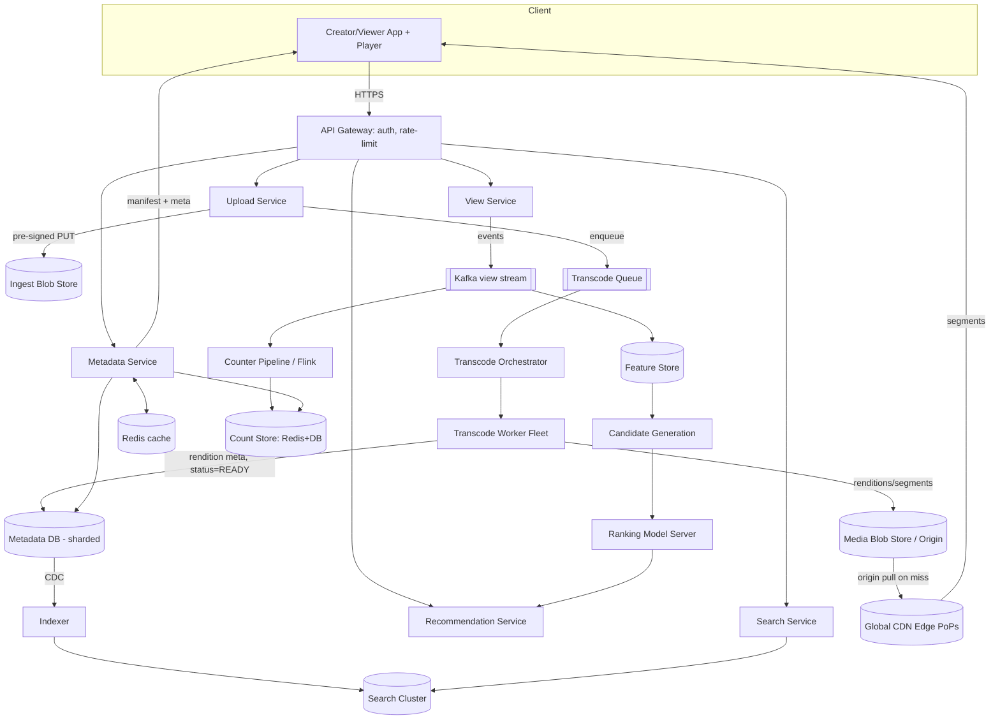
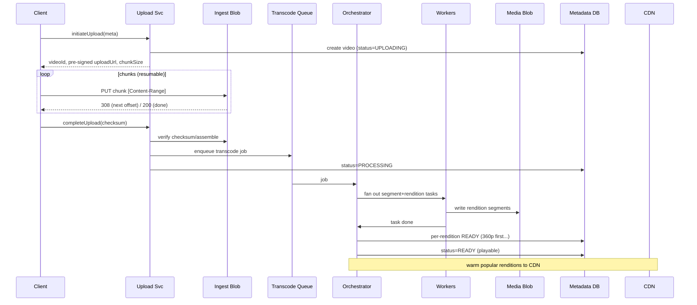
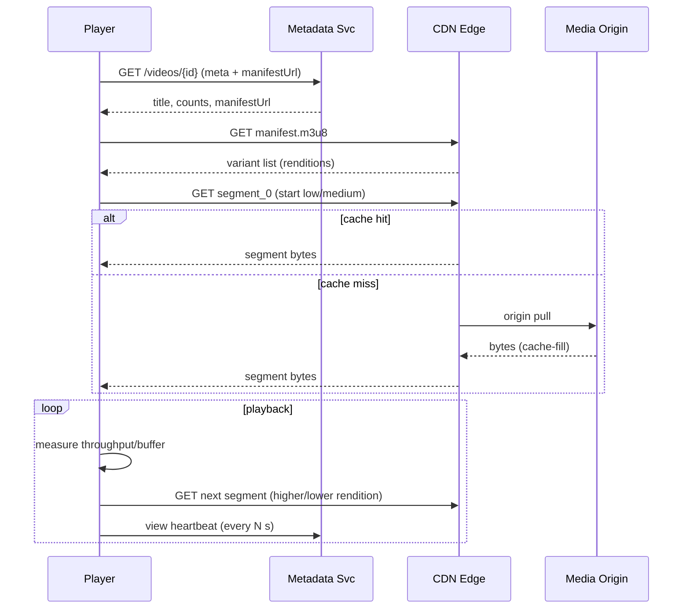

# Design YouTube — High-Level Design

> **Reader profile:** Senior backend engineer (Java/JVM, distributed systems) practising HLD. This document teaches *design judgment* — clarification, tradeoffs, and the deep dives that separate a senior answer from a junior one.

---

## 1. Problem & Clarifying Questions

**Restated problem.** Build a video-sharing platform where creators upload videos that are transcoded into multiple resolutions, stored durably, and streamed globally to a massively read-heavy audience with low startup latency. Users browse, search, watch, like, comment, and see view counts; the system recommends videos. The defining tension is an **enormous write-side processing cost (transcoding) feeding an even more enormous read side (streaming)**, with a global latency requirement.

Before drawing a single box, here is what I'd ask the interviewer. The answers reshape the entire design, so I lead with them.

### 1.1 Functional scope
- **Core loop:** Is it upload + watch + the metadata around it (titles, channels, likes, comments, subscriptions)? Or just the media pipeline?
- **Live streaming** in scope, or VOD (video-on-demand) only? Live changes the transcode path from batch to real-time and is a different beast.
- **Search**: full-text over titles/descriptions, or also semantic / ML-ranked? Auto-complete?
- **Recommendations**: do we design the serving system (candidate generation + ranking), or just acknowledge it? I'll design it at a systems level.
- **View counts**: exact or approximate? Real-time or eventually consistent? This drives the counter design.
- **Monetization / ads**: in scope? (I'll treat as out-of-scope but note hooks.)
- **Comments, likes, subscriptions, watch history, playlists**: which are in scope?
- **Creator analytics** (impressions, watch time, retention curves): in scope?

### 1.2 Non-functional
- **Scale targets**: MAU/DAU, uploads/day, watch sessions/day, peak concurrency?
- **Latency**: target **video start time** (time-to-first-frame)? Industry bar is < 1–2 s. Metadata page load < 200 ms.
- **Availability**: watch path target — 99.99%? Upload path can be lower (99.9%).
- **Consistency**: strong for what (subscriptions, payments)? Eventual acceptable for what (view counts, recommendations)?
- **Durability**: video bytes are irreplaceable to the creator — target 11 nines (`99.999999999%`)?
- **Geography**: global from day one? Regulatory data-residency constraints (GDPR, China)?
- **Max video length / file size**: 12 hours / 256 GB like real YouTube, or smaller?

### 1.3 Out-of-scope (proposed)
I'll propose excluding, unless the interviewer pushes back: live streaming (treat as extension), ads/monetization, DRM specifics (acknowledge), Shorts-specific vertical feed mechanics, content moderation ML (acknowledge the pipeline hook), and the full recommendation *model training* (design the serving, not the training).

### 1.4 Assumptions I'll proceed with
The interviewer typically says "assume reasonable numbers." So:

- **2 B MAU, ~1 B DAU.**
- **Uploads: 500 hours of video per minute** (real YouTube's public figure) ⇒ derive uploads/sec below.
- **Watch: ~5 B video views/day** with heavy skew (Zipfian — a small number of videos get most views).
- **VOD only**, global, multi-region.
- **Video start time target: p50 < 500 ms, p95 < 1.5 s.**
- **Watch-path availability 99.99%; upload 99.9%.**
- **Durability ~11 nines for stored media.**
- **View counts eventually consistent** (seconds–minutes of lag acceptable), with anti-fraud dedup.

---

## 2. Requirements (Finalized)

### 2.1 Functional
1. **Upload**: resumable, chunked upload of large files; show processing status.
2. **Transcode**: produce multiple resolutions (144p–4K) and codecs (H.264 baseline, VP9/AV1 for efficiency), segmented for adaptive streaming.
3. **Store**: video segments in blob storage; metadata in a queryable store.
4. **Stream**: adaptive bitrate (ABR) playback via HLS/DASH over a global CDN.
5. **Watch metadata**: video page (title, channel, description, like count, view count, comments).
6. **Engagement**: like/dislike, comment, subscribe, watch history, playlists.
7. **View counting**: increment a view per qualified watch; display approximate-but-converging counts.
8. **Search**: full-text over title/description/tags with ranking + autocomplete.
9. **Recommendations**: home feed + "up next" (watch-next) given a video/user.

### 2.2 Non-functional
| Property | Target | Applies to |
|---|---|---|
| Video start latency | p50 < 500 ms, p95 < 1.5 s | Watch (read) path |
| Metadata latency | p99 < 200 ms | Video page, search |
| Availability | 99.99% | Watch/read path |
| Availability | 99.9% | Upload/write path |
| Durability | ~11 nines | Stored media bytes |
| Consistency | Strong | Subscriptions, account, comments-after-post |
| Consistency | Eventual (s–min) | View counts, recommendations, search index |
| Scalability | Horizontal everywhere | All tiers |

**Key insight to state aloud:** This is a **read-dominated** system (views ≫ uploads by ~5–6 orders of magnitude per object for hot content) where the **expensive part is a write-side batch job (transcode)** and the **scaling part is read serving (CDN)**. Optimize the two independently.

---

## 3. Capacity Estimation

I'll show arithmetic and flag assumptions. Round generously; the goal is order-of-magnitude correctness.

### 3.1 Upload & ingest
- 500 hours of video uploaded per minute.
- = 500 × 60 = **30,000 video-seconds per second** of ingested content.
- Assume average upload is a **10-minute (600 s) video** ⇒ uploads/sec = 30,000 / 600 = **50 uploads/sec** (sustained avg). Peak ~3–5× ⇒ **~250 uploads/sec peak.**
- **Ingest bytes:** an upload averages, say, **1 GB** of source (creators upload high-bitrate originals). 50 uploads/s × 1 GB = **50 GB/s ingest** at the origin. That's **~4.3 PB/day of raw uploads** before transcoding.

### 3.2 Storage
Each source video is transcoded into N renditions. Take a representative ladder and per-minute sizes:

| Rendition | Approx bitrate | Size per 10-min video |
|---|---|---|
| 144p | 0.1 Mbps | ~7.5 MB |
| 360p | 0.7 Mbps | ~52 MB |
| 480p | 1.2 Mbps | ~90 MB |
| 720p | 2.5 Mbps | ~187 MB |
| 1080p | 4.5 Mbps | ~337 MB |
| 4K | 18 Mbps | ~1.35 GB |

Sum of renditions ≈ **~2 GB per 10-min video** (dominated by 1080p+4K; not every video gets 4K, so call it **~1.5 GB transcoded per video on average**, plus the original we may keep cold).

- Transcoded storage/day = 50 uploads/s × 86,400 s × 1.5 GB ≈ **~6.5 PB/day of deliverable renditions.**
- Keep originals (cold) ≈ 4.3 PB/day. **Total ≈ ~11 PB/day net new.**
- Over a year ≈ **~4 EB/year**. This is why **object storage with tiering** (hot/warm/cold/archive) and aggressive lifecycle policies are non-negotiable.

### 3.3 Read / streaming bandwidth (the dominant cost)
- 5 B views/day. Assume avg watched bitrate **1.5 Mbps** (most viewers are on 480p–720p on mobile) and avg watch duration **5 minutes (300 s)**.
- Bytes per view = 1.5 Mbps × 300 s = 450 Mbit = **~56 MB**.
- Egress/day = 5e9 × 56 MB ≈ **~280 PB/day** delivered.
- Average egress rate = 280 PB / 86,400 s ≈ **~3.2 TB/s sustained**, with peaks (evening, multi-timezone) of **8–10 TB/s**.
- **This must be served by the CDN, not origin.** Origin would melt. Target CDN offload **> 95%**.

**Read:write asymmetry:** ~3.2 TB/s read vs ~50 GB/s write ⇒ **~64:1 by bytes**, and far higher per-object for viral content. Design says: spend engineering on read fan-out (CDN, caching) and on making transcode cheap/parallel.

### 3.4 Metadata QPS
- Watch page loads ≈ views ≈ 5 B/day ⇒ avg **~58,000 metadata reads/sec**, peak **~200K/sec**. Each loads video metadata + channel + counts + comments page + recommendations.
- Writes: likes/comments. Assume 2% of views produce an engagement write ⇒ 100 M/day ⇒ **~1,200 writes/sec avg**, peak ~5K/sec. Modest — metadata DB write load is small vs read.
- **View-count increments:** up to 5 B/day = **~58K/sec avg, ~200K/sec peak.** These are the high-volume write — handled by a dedicated counter pipeline, not the main DB (Deep Dive 4).

### 3.5 Transcoding compute
- 30,000 video-seconds ingested per second. Transcoding is ~real-time-ish per stream on a CPU core for H.264 (1×–several× realtime depending on resolution); AV1 is much slower (can be 0.1× realtime). Say producing the full ladder costs **~10 core-seconds per video-second** (sum across renditions/codecs, with AV1 dominating).
- Compute = 30,000 × 10 = **~300,000 cores busy continuously**, i.e. **thousands of transcode machines**. This is why we (a) parallelize by segment, (b) prioritize cheap codecs first for fast availability, (c) defer/skip expensive codecs (AV1) for low-view videos. (Deep Dive 2.)

### 3.6 Server/shard sizing (rough)
- **Metadata store:** 2 B videos × ~2 KB metadata ≈ 4 TB hot metadata + comments/engagement (much larger). Shard by `video_id`; with ~200K read QPS and per-node ~10K QPS, **~20–40 read replicas/nodes per shard group**, dozens of shards.
- **CDN edge:** thousands of PoPs (points of presence) globally; capacity driven by 8–10 TB/s peak.
- **Transcode fleet:** thousands of workers (above).
- **Object storage:** managed/effectively unbounded (S3/GCS-class), EB-scale.

> **Senior framing:** State explicitly that two numbers drive the whole design: **~3 TB/s read egress** (⇒ CDN-first) and **~300K transcode cores** (⇒ async, parallel, prioritized transcode). Everything else is comparatively easy.

---

## 4. API Design

REST/HTTPS for clients; gRPC internally. Auth via OAuth2 bearer tokens (JWT access tokens). All write endpoints take an **idempotency key**.

### 4.1 Upload (resumable, chunked)
```
POST /v1/videos:initiateUpload
  body: { title, description, visibility, fileSizeBytes, mimeType, checksum }
  resp: { videoId, uploadSessionId, uploadUrl, chunkSizeBytes }
  # uploadUrl is a pre-signed URL to the ingest blob store

PUT  {uploadUrl}                         # resumable, per RFC-style ranged PUT
  headers: Content-Range: bytes 0-8388607/104857600
  body: <chunk bytes>
  resp: 308 Resume Incomplete  (Range: bytes=0-8388607)   # tells client next offset
         or 200/201 when complete

POST /v1/videos/{videoId}:completeUpload
  body: { uploadSessionId, checksum }
  resp: { videoId, status: "PROCESSING" }

GET  /v1/videos/{videoId}/status
  resp: { status: PROCESSING|READY|FAILED, renditionsReady: ["360p","720p"], progressPct }
```
*Resumable upload:* client can query the current offset and resume after a network drop without re-sending bytes — essential for 1 GB uploads on flaky mobile networks.

### 4.2 Playback
```
GET /v1/videos/{videoId}/manifest.m3u8       # HLS master manifest (or .mpd for DASH)
  resp: master playlist listing variant streams (renditions) + their URLs

GET {cdnUrl}/{videoId}/{rendition}/segment_{n}.ts   # served by CDN, not origin
GET /v1/videos/{videoId}                      # metadata for the watch page
  resp: { videoId, title, channel, description, likeCount, viewCount (approx),
          uploadedAt, durationSec, manifestUrl }
```
*Manifest / .m3u8 / .mpd:* a small text file the player fetches first; it lists available bitrates and where each segment lives, so the player can switch quality on the fly (ABR).

### 4.3 Engagement & view
```
POST /v1/videos/{videoId}/views    body:{ sessionId, watchedMs, position }  # heartbeat
POST /v1/videos/{videoId}/like     body:{ action: LIKE|DISLIKE|NONE }   (idempotent)
POST /v1/videos/{videoId}/comments body:{ text, parentId? }
GET  /v1/videos/{videoId}/comments?cursor=&limit=
POST /v1/channels/{channelId}/subscribe   (idempotent)
```

### 4.4 Search & recommendations
```
GET /v1/search?q=&cursor=&filters=          # full-text + ranked
GET /v1/search/autocomplete?prefix=
GET /v1/feed/home?cursor=                    # personalized feed
GET /v1/videos/{videoId}/up-next            # watch-next recommendations
```

---

## 5. High-Level Architecture

### 5.1 Request flows in words
**Upload:** Client → API Gateway → Upload Service → writes chunks to **Ingest Blob Store** via pre-signed URLs → on complete, enqueue a **transcode job** (message queue) → Transcode Orchestrator fans out **segment-level transcode tasks** to a worker fleet → workers write renditions to **Media Blob Store** → on completion, write rendition metadata to **Metadata DB**, set status `READY`, and **warm/prefetch popular content to CDN**.

**Watch:** Client → fetch metadata (Metadata Service, served from cache) → fetch manifest → player requests segments from **CDN edge**; CDN serves from cache or pulls from **Media Blob Store origin** on miss → player runs ABR, switching renditions by measured bandwidth → client sends **view heartbeats** to View Service → counter pipeline aggregates.

### 5.2 ASCII block diagram
```
                                  ┌──────────────────────────────┐
   Creators ──upload──►           │          CLIENTS              │  ◄── Viewers (watch)
                                  └───────────────┬──────────────┘
                                                  │ HTTPS
                                       ┌──────────▼──────────┐
                                       │     API Gateway     │  (auth, rate-limit, routing)
                                       └──┬───────┬───────┬──┘
            ┌─────────────────────────────┘       │       └─────────────────────────────┐
            ▼                                      ▼                                     ▼
   ┌─────────────────┐                  ┌──────────────────┐                  ┌──────────────────┐
   │  Upload Service │                  │ Metadata Service │◄──cache──►Redis  │  View Service    │
   └───────┬─────────┘                  └────────┬─────────┘                  └────────┬─────────┘
           │ pre-signed PUT                       │ read/write                          │ heartbeat
           ▼                                      ▼                                     ▼
   ┌─────────────────┐                  ┌──────────────────┐                  ┌──────────────────┐
   │ Ingest Blob     │                  │  Metadata DB     │                  │  Kafka (views)   │
   │ Store (raw src) │                  │ (sharded SQL/NoSQL)                  └────────┬─────────┘
   └───────┬─────────┘                  └──────────────────┘                           │
           │ enqueue job                          ▲                                     ▼
           ▼                                      │                          ┌──────────────────┐
   ┌─────────────────┐    ┌──────────────────┐    │ rendition meta           │ Counter Pipeline │
   │ Transcode Queue │───►│Transcode Orchestr│────┘ + status=READY            │ (Flink/agg)      │
   └─────────────────┘    └────────┬─────────┘                                └────────┬─────────┘
                                   │ segment tasks                                     │
                                   ▼                                                   ▼
                          ┌──────────────────┐                              ┌──────────────────┐
                          │ Transcode Workers│──renditions──►┌───────────┐  │  Count Store     │
                          │  (GPU/CPU fleet) │               │Media Blob │  │ (Redis + DB)     │
                          └──────────────────┘               │  Store    │  └──────────────────┘
                                                             │ (origin)  │
                                                             └─────┬─────┘
                                                                   │ origin pull (miss)
                                                                   ▼
                                            ┌───────────────────────────────────────┐
                                            │      GLOBAL CDN (edge PoPs)            │ ──► Viewers
                                            └───────────────────────────────────────┘

   Search:  Metadata changes ──CDC──► Indexer ──► Search Cluster (Elasticsearch)
   Recs:    Watch/engagement events ──► Feature Store + Candidate Gen + Ranking ──► Feed
```

### 5.3 Mermaid diagram


### 5.4 Key sequence — Upload → Ready


### 5.5 Key sequence — Watch (ABR)


---

## 6. Data Model & Storage Choices

### 6.1 The blob/metadata split (foundational decision)
**Video bytes go in object storage; everything queryable goes in a database.** Never store video blobs in a relational DB — they're huge, immutable, accessed by key, and served via CDN. Object storage (S3/GCS/Azure Blob-class) gives 11-nines durability, lifecycle tiering, and direct CDN origin integration. The DB stores *pointers* (object keys/URLs) plus searchable metadata.

### 6.2 Entities (logical schema)
```
video(
  video_id PK, channel_id, title, description, tags[], visibility,
  duration_sec, status, uploaded_at, original_object_key, thumbnail_key,
  like_count_cached, view_count_cached     -- denormalized, eventually-consistent snapshots
)
rendition(
  video_id, rendition (e.g. 720p), codec (h264/vp9/av1), container,
  bitrate, manifest_key, segment_prefix, ready_at
)   PK(video_id, rendition, codec)
channel(channel_id PK, owner_user_id, name, subscriber_count_cached, created_at)
user(user_id PK, ...auth/profile...)
subscription(user_id, channel_id, created_at)   PK(user_id, channel_id)
comment(comment_id PK, video_id, user_id, parent_id, text, created_at)   -- sharded by video_id
like(user_id, video_id, value{+1/-1})   PK(user_id, video_id)
watch_history(user_id, video_id, watched_at, position_ms)   -- time-series, by user_id
view_count(video_id, count)             -- in Count Store, not main DB
```

### 6.3 Datastore choices and *why*
| Data | Store | Why (access pattern) | Failure mode avoided |
|---|---|---|---|
| Video segments, manifests, thumbnails | **Object storage** (S3/GCS-class) + CDN origin | Huge immutable blobs, key-access, CDN-served, lifecycle tiering | DB bloat, no durability/tiering |
| Core video/channel metadata | **Sharded SQL (Spanner/Vitess-style) or wide-column (Cassandra)** sharded by `video_id`/`channel_id` | Point lookups by id, high read QPS, horizontal scale | Single-DB hotspot, unscalable joins |
| Comments | **Wide-column (Cassandra/Bigtable)**, partition by `video_id`, clustered by time | Append-heavy, range scan per video, unbounded | RDBMS write hotspot on viral videos |
| View counts | **Redis (hot) + durable DB sink**, dedicated counter pipeline | Extreme write rate, approximate OK | Lock contention / lost updates on a row |
| Likes/subscriptions | **Sharded SQL or wide-column**, strong-ish per-user | Idempotent toggles, exact per user | Double-count toggles |
| Search index | **Elasticsearch/OpenSearch**, fed by CDC | Inverted index, ranking, autocomplete | Slow `LIKE %%` scans in SQL |
| Watch history / events | **Kafka + columnar warehouse** (BigQuery/ClickHouse) | High-volume append, analytics, ML features | OLTP DB drowning in event writes |
| Recommendation features | **Feature store (Redis/Feast-style) + offline warehouse** | Low-latency feature reads, batch training | Recomputing features per request |

*CDC (Change Data Capture):* stream the DB's write log (e.g. Debezium on the binlog) into downstream systems so the search index and caches update automatically without dual-writes.

---

## 7. Deep Dives (the bulk)

I'll go deep on the five genuinely hard sub-problems: **(1) resumable/chunked upload**, **(2) the transcode pipeline**, **(3) adaptive bitrate streaming + CDN strategy**, **(4) view-count aggregation under hot keys**, and **(5) read-heavy metadata scaling + caching**. Then shorter dives on **search** and **recommendations**.

---

### Deep Dive 1 — Resumable, chunked upload of large files

**Problem.** Source files reach hundreds of MB to GBs over mobile networks that drop. A single failed PUT must not force re-uploading 1 GB. Uploads must be idempotent and resumable, and must not pin a stateful app server for minutes.

**Options.**
| Approach | How | Pros | Cons |
|---|---|---|---|
| **A. Single multipart POST through app servers** | Client POSTs whole file to a server which streams to blob store | Simple | App server holds connection for minutes; no resume; memory/disk pressure; one drop = full retry |
| **B. Client → pre-signed URLs, direct-to-blob, multipart** | Server issues pre-signed URLs; client uploads parts directly to object store; resumable via offset query | App tier stateless & cheap; resume; parallel parts; offloads bytes from our servers | Client complexity; must reconcile parts/checksums |
| **C. tus.io resumable protocol via our own ingest gateway** | Standard resumable protocol, our gateway proxies to blob | Standardized resume semantics | We carry the byte traffic; more infra |

**Decision: B — direct-to-blob multipart with pre-signed URLs and resumable offsets.** It removes the upload byte stream from our compute tier entirely (the app server only mints URLs and handles control-plane calls), enables parallel chunk upload and clean resume.

**Mechanics.**
- `initiateUpload` creates a `video` row (`status=UPLOADING`) and an upload session; returns a pre-signed multipart upload handle and `chunkSize` (e.g. 8–16 MB).
- Client uploads chunks; each chunk is independently retryable. On resume, client asks "which parts landed?" (list parts / query offset) and continues from the gap. The blob store, not us, tracks received parts.
- **Idempotency:** chunks are addressed by `(uploadSessionId, partNumber)`; re-uploading a part overwrites the same slot, so retries are safe. The completeUpload carries the full file checksum; we verify before declaring success — **avoids the failure mode of a corrupted/truncated source being transcoded.**
- **Backpressure & abuse:** rate-limit by user; enforce max size; **virus/abuse scan** the source before transcode (hook). Abandoned sessions are GC'd by a TTL lifecycle rule on the ingest bucket — **avoids orphaned-blob storage leak.**

**Failure modes handled:** network drop (resume), duplicate part (idempotent overwrite), truncated upload (checksum gate), abandoned upload (TTL GC), app-server crash mid-upload (no state on app server — client just resumes against blob store).

---

### Deep Dive 2 — Transcode pipeline (multiple resolutions/codecs)

**Problem.** One source must become a *ladder* of renditions (144p→4K) × codecs (H.264, VP9, AV1) × segmented for ABR, durably, fast (creators want it live quickly), and at **~300K cores** of compute — without one 12-hour 4K upload blocking everyone.

**Pipeline.**
1. **Validate & inspect** source (probe codec/duration/resolution); reject corrupt.
2. **Segment the source** into independent chunks (e.g. 2–10 s GOP-aligned segments). *GOP (Group of Pictures):* a self-contained run of frames starting with a keyframe — segmenting on GOP boundaries lets each segment be transcoded independently and lets the player switch bitrates only at segment boundaries.
3. **Fan out**: each (segment × rendition × codec) is an independent task on the worker fleet — **embarrassingly parallel**, so a long video isn't transcoded serially.
4. **Encode** each task (FFmpeg-class), write segment to Media Blob.
5. **Assemble manifests** (HLS `.m3u8` per variant + master; DASH `.mpd`) once a rendition's segments are done.
6. **Publish**: write `rendition` rows, flip `status=READY` per rendition (so 360p can be watchable before 4K finishes), then full READY.
7. **Post-steps**: thumbnails/sprites, captions (ASR hook), content-moderation hook, **CDN warming** for likely-popular content.

**Orchestration choice.**
| Option | Pros | Cons |
|---|---|---|
| **Single monolithic transcode job per video** | Simple | No intra-video parallelism; long tail; one failure restarts all |
| **DAG orchestrator with segment-level tasks** (e.g. Temporal/Airflow-class + queue) | Massive parallelism, retry per task, partial readiness | More moving parts; need a coordinator |
| **Pure queue + idempotent workers, no central DAG** | Simplest scaling | Harder to express dependencies (manifest needs all segments) |

**Decision: DAG orchestrator + segment-level fan-out on a worker fleet pulling from a priority queue.** This delivers fast time-to-first-rendition (publish cheap H.264 360p/720p first) and full parallelism on long videos. **Avoids the failure mode** of a 4K AV1 encode (0.1× realtime) blocking playability for hours.

**Cost/latency controls (senior signal):**
- **Prioritized ladder:** encode H.264 360p/480p/720p **first** → playable in minutes; defer 1080p/4K and VP9/AV1.
- **Lazy expensive codecs:** AV1 is expensive but saves ~30–50% bandwidth. **Only encode AV1/4K for videos that gain views** (popularity-triggered re-encode). Most uploads never get views — encoding AV1 for all is wasteful. **Avoids burning ~300K cores on the long tail.**
- **Per-title encoding:** choose bitrate ladder by content complexity (a static slideshow needs far less than a sports clip) to cut storage/bandwidth.
- **Spot/preemptible instances** for batch transcode; checkpoint per-segment so preemption only loses one segment.
- **Idempotent tasks** keyed by `(video_id, segment, rendition, codec)` so retries/duplicates are safe.

**Failure modes handled:** worker crash (task retried, idempotent), poison input (validation + DLQ — dead-letter queue), partial publish (per-rendition readiness), cost blowup (lazy AV1/4K, spot instances), priority inversion (priority queue so short popular uploads aren't stuck behind a 12-hour movie).

---

### Deep Dive 3 — Adaptive bitrate streaming + global CDN strategy

**Problem.** Serve **~3 TB/s sustained, 8–10 TB/s peak** globally with start latency < 1.5 s, adapting to each viewer's fluctuating bandwidth, at sane cost. Origin cannot serve this.

**ABR (adaptive bitrate).** Player fetches the **master manifest** listing variant streams; it starts at a conservative bitrate, measures **throughput and buffer level**, and requests the next 2–10 s segment from a higher or lower rendition. Quality switches only at segment boundaries (each segment starts with a keyframe). HLS (Apple-origin, `.m3u8` + `.ts`/`fMP4`) and DASH (`.mpd` + `fMP4`) are the two standards; we generate both (or CMAF — common segments usable by both — to avoid double-storing).

| Streaming approach | Pros | Cons | Verdict |
|---|---|---|---|
| Progressive download (one file) | Trivial | No adaptation; rebuffers on bad networks; wastes bandwidth on mobile | No |
| **HLS + DASH (or CMAF)** segmented ABR | Standard, CDN-cacheable static segments, adapts | Manifest/segment complexity | **Yes** |
| Proprietary streaming | Control | Reinventing, device support pain | No |

**Why segments are great for CDN:** segments are **small, immutable, static files** addressed by URL — perfect for caching at edge with long TTLs. The manifest is small and can have a short TTL. **Avoids the failure mode** of dynamic origin computation per request.

**CDN strategy (the cost/latency core).**
- **Edge PoPs worldwide**; viewer is routed (anycast/GeoDNS) to the nearest healthy PoP. *Anycast:* the same IP is announced from many locations; the network routes to the closest.
- **Tiered caching:** edge → regional mid-tier → origin. Mid-tier shields origin: many edges miss → one regional fetch → one origin pull. **Avoids origin-pull stampede.**
- **Cache key** = object URL (immutable segments ⇒ effectively infinite TTL; safe because a re-encode produces a *new* key/version).
- **Hot-content prefetch/warming:** when a video trends or a big channel publishes, **push popular renditions to edges proactively** rather than waiting for the first viewers to suffer cold misses. **Avoids the cold-start thundering herd** on a newly viral video.
- **Cache-hit target > 95%.** The Zipf distribution helps us: a tiny fraction of videos drive most views, so they live hot in cache. The long tail is served from origin/regional tier with higher latency — acceptable because few people watch it.
- **Multi-CDN** (own CDN + commercial) for resilience and cost arbitrage; steer traffic by real-user-measured performance and price.
- **Origin offload:** origin only sees cache-fill traffic (a few % of egress). Compute: if hit rate is 95%, origin serves ~5% × 3 TB/s ≈ 150 GB/s — still large, so origin itself is geo-replicated object storage with read replicas.

**Start-latency tricks:** low-latency start segment, short initial segments, edge-warmed manifest, and beginning playback at a medium rendition that the buffer can sustain. Prefetch the first segment alongside the manifest.

**Failure modes handled:** origin overload (tiered cache + warming + offload), regional CDN outage (multi-CDN failover), viral cold start (prefetch), poor-network rebuffering (ABR steps down), wrong-quality lock-in (ABR steps up as bandwidth recovers).

---

### Deep Dive 4 — View-count aggregation (distributed counter, hot videos)

**Problem.** Up to **~200K view increments/sec peak**, with extreme skew — a viral video can take **millions of increments to a single counter**, which would destroy any single-row update path (lock contention, write amplification). Counts must be roughly real-time, monotonic, fraud-resistant, and durable. Exactness is *not* required (off by a few for a 10 M-view video is fine).

**Why the naive `UPDATE videos SET views=views+1` fails:** every increment locks the same row; a hot video serializes all writes through one lock ⇒ contention collapse. This is the canonical **hot-key / single-counter bottleneck.**

**Options.**
| Option | Mechanism | Pros | Cons |
|---|---|---|---|
| **A. Single DB row increment** | `UPDATE … +1` | Exact, simple | Hot-row lock contention; cannot do 200K/s on one key |
| **B. Sharded counters** | N sub-counters per video; sum on read | Spreads write load; simple-ish | Read fans out; choosing N per video |
| **C. Streaming aggregation** | Emit view events to Kafka; Flink windows aggregate; periodically flush deltas to store | Scales hugely; decouples ingest from store; enables fraud filtering & analytics | Eventual (seconds lag); more infra |
| **D. Probabilistic (HyperLogLog)** for *unique* viewers | Cardinality sketch | Tiny memory, dedup uniques | Approximate; only for unique-count metric |

**Decision: C (streaming aggregation) as the backbone, B (sharded counters in Redis) for the hot serving layer, D for the *unique-viewers* metric.**

**Design.**
1. **View qualification at the client/edge:** a "view" counts only after a watch threshold (e.g. ≥30 s or % watched) and passes anti-fraud (dedup by `(user/device, video, time-window)`, bot heuristics, rate caps). **Avoids fraudulent inflation.**
2. **Emit event to Kafka**, partitioned by `video_id` (so all increments for a video land in order on one partition for clean windowed aggregation, while the topic as a whole is massively parallel).
3. **Flink (or Spark Streaming) windowed aggregation**: per video, sum increments over short windows (e.g. 5–10 s), producing **deltas**, plus a HyperLogLog sketch for unique viewers.
4. **Flush deltas** to a **Count Store**: Redis holds the hot live count (sharded counters for the hottest videos to avoid even a single Redis key being a bottleneck — Redis is fast but a single hot key still serializes); a durable DB/warehouse is the source of truth, periodically reconciled.
5. **Reads** serve `view_count_cached` from Redis (sub-ms), refreshed by the pipeline. Eventually consistent by seconds — within SLA.
6. **Exactly-once-ish:** events carry a dedup key; Flink state + idempotent flush make double-processing safe. **Avoids double counting on retries.**

**Hot-key handling specifically:** for a viral video, split its counter into K Redis sub-keys (`views:{video}:{0..K-1}`); increments hash across sub-keys; the displayed value is the sum (cached). K scales with heat (adaptive). **Avoids single-key serialization** even within Redis.

**Failure modes handled:** hot-row collapse (streaming + sharded counters), retry double-count (idempotent dedup keys), fraud (qualification + heuristics), lag spikes (Redis serves last-known count; converges), durability (Kafka retention + DB sink replays on Redis loss).

---

### Deep Dive 5 — Read-heavy metadata scaling & caching

**Problem.** ~200K metadata reads/sec peak, each watch page assembling video + channel + counts + comments + recs, with p99 < 200 ms — while writes are comparatively rare. Classic read-heavy fan-out.

**Strategy: cache aggressively, shard for scale, isolate hot keys.**
- **Sharding:** shard `video` by `video_id` (hash), `channel`/`subscription`/`watch_history` by their natural owner id. Avoid cross-shard joins by **denormalizing** the watch-page payload (store channel name/avatar alongside video, refreshed via CDC). **Avoids scatter-gather joins on every page load.**
- **Caching tiers:** CDN/edge cache for fully-rendered or near-static fragments (thumbnails, manifests) → **Redis** cluster for hot metadata objects → DB. Cache the assembled watch-page metadata object keyed by `video_id`.
- **Cache strategy:** read-through with TTL + **CDC-driven invalidation** (when metadata changes, evict). For counts, the cache is intentionally stale (eventual). **Avoids the dual-write inconsistency** between cache and DB by invalidating from the DB's change log.
- **Hot-key protection:** a viral video's metadata is read millions of times. Use **request coalescing / single-flight** (one cache-fill in flight per key; concurrent readers wait) to prevent a **cache stampede** on expiry, plus per-key replication of the cache entry across Redis nodes. **Avoids the thundering herd** that would hit the DB when a hot key expires.
- **Read replicas:** Metadata DB has many read replicas per shard; reads go to replicas (accept replica lag for non-critical reads), writes to primary. **Avoids primary read overload.**
- **Comments pagination:** cursor-based (keyset) pagination, not `OFFSET` (which gets slower deeper in). Comments partitioned by `video_id`, clustered by time/score.

**Failure modes handled:** read overload (replicas + cache), cache stampede (single-flight + warm), hot key (per-key replication + coalescing), cache/DB drift (CDC invalidation), deep-pagination slowdown (keyset cursors).

---

### Deep Dive 6 (shorter) — Search

- **Index** title/description/tags/captions into **Elasticsearch/OpenSearch**, fed asynchronously via **CDC** from the Metadata DB (and from the captions/ASR pipeline). Async indexing means search is eventually consistent (a new video is searchable seconds later) — acceptable. **Avoids coupling upload latency to index writes.**
- **Ranking:** blend text relevance (BM25) with signals — view count, recency, watch time, channel authority, personalization. Two-phase: cheap retrieval → expensive ML re-rank on the top-K.
- **Autocomplete:** prefix index / FST (finite-state transducer) or a trie in a fast store, popularity-weighted; served from a dedicated low-latency path.
- **Scale:** shard the index by document; replicate for query throughput; the inverted index is read-optimized.

### Deep Dive 7 (shorter) — Recommendations at a systems level

- **Two-stage:** **candidate generation** (cheaply narrow billions → ~hundreds: collaborative filtering, embeddings/ANN nearest-neighbor over user & video vectors, recent-watch co-occurrence) → **ranking** (a heavier model scores the candidates using rich features for watch-time prediction).
- *ANN (Approximate Nearest Neighbor):* find vectors close to the user's embedding without scanning all of them — how we shortlist from billions fast.
- **Feature store:** low-latency online features (Redis-class) computed from the Kafka event stream; offline features in the warehouse for training. **Avoids recomputing features per request.**
- **Serving:** Recommendation Service calls candidate gen → ranking model server → returns feed; results cached briefly per user. "Up-next" is a lighter, video-conditioned variant.
- **Freshness vs cost:** precompute feeds for less-active users (batch); compute on-the-fly for active sessions. Eventual consistency is fine; recs are best-effort.

---

## 8. Scaling & Bottlenecks

| Tier | Scales by | First bottleneck | Removal |
|---|---|---|---|
| Streaming egress | CDN PoPs, multi-CDN | Origin bandwidth on cache misses | Tiered cache, hot-content warming, >95% offload, multi-CDN |
| Transcode | Worker fleet (spot) | Compute cost / queue backlog | Segment-level parallelism, prioritized + lazy codecs, autoscale |
| Metadata reads | Read replicas + Redis | Hot-key cache stampede | Single-flight, per-key replication, denormalized payloads |
| View counts | Kafka partitions + Flink + sharded Redis | Single hot counter | Streaming agg + sharded counters |
| Search | Index shards/replicas | Query fan-out & re-rank cost | Two-phase retrieval, replicas |
| Object storage | Managed, EB-scale | Cost | Lifecycle tiering (hot→archive), per-title encoding, lazy 4K/AV1 |
| Metadata writes | Sharding | Modest (rare) | Shard by id; usually not the bottleneck |

**Where it breaks first:** the **CDN/origin egress** (cost and cache-miss bandwidth) and the **transcode compute bill**. Both are designed around from day one: CDN-first delivery with high offload, and async/parallel/lazy transcoding. The second-order risk is **hot keys** — for views and for popular-video metadata — handled by sharded counters and single-flight caching.

---

## 9. Reliability, Consistency & Security

**Reliability / failure handling.**
- **Object storage** is multi-AZ/region replicated (11 nines) — the irreplaceable creator bytes.
- **Async everything on the write side:** upload → queue → transcode is decoupled, so a transcode outage doesn't block uploads; the queue buffers. DLQs capture poison jobs.
- **Idempotency** on all writes (idempotency keys; idempotent transcode tasks; idempotent view dedup) — safe retries.
- **Graceful degradation:** if recommendations are down, serve a non-personalized feed; if counts lag, show last-known; if a rendition isn't ready, serve a lower one. The **watch path stays up** even when peripheral systems fail.
- **Multi-region active-active** for read/serving; uploads can be region-pinned then geo-replicated.

**Consistency model.**
- **Strong:** account/auth, subscriptions, a user's own like state, a just-posted comment visible to its author (read-your-writes).
- **Eventual (by design):** view counts, search index, recommendations, denormalized watch-page fields, cross-region metadata replicas. State the tradeoff: we trade global strong consistency for availability and scale (AP-leaning per CAP) where staleness is harmless.
- **Read-your-writes** for the author via session pinning / writing through the cache for that user.

**Security & abuse.**
- **Auth:** OAuth2 + short-lived JWT access tokens; refresh tokens; pre-signed URLs scoped and time-limited so blob access can't be replayed.
- **Authorization:** visibility checks (private/unlisted/age-restricted/geo-blocked) enforced at the metadata + manifest layer; **signed CDN URLs / tokenized segments** so paid/private content can't be hot-linked. *Signed URL:* a time-bounded, cryptographically signed link the CDN validates, preventing unauthorized or expired access.
- **Rate limiting & abuse:** per-user/IP limits at the gateway; upload quotas; bot detection on views; comment spam filters; content-moderation pipeline hook (hash-match for known-bad + ML).
- **Privacy/compliance:** data-residency-aware storage, deletion/GDPR pipelines (purge from DB, blob, caches, CDN), audit logs.
- **DRM** (extension): encrypted segments + license server for premium content.

---

## 10. Extensions & Follow-ups

- **Live streaming:** ingest (RTMP/SRT) → real-time low-latency transcode (LL-HLS/LL-DASH, ~2–5 s glass-to-glass) → CDN; no batch DAG. View counts become real-time concurrency counters. DVR = persist segments for replay.
- **Shorts / vertical feed:** aggressive prefetch of the *next* videos, tiny segments, recommendation-driven autoplay; counts and engagement at higher volume.
- **Monetization/ads:** ad decisioning service, server-side ad insertion (SSAI) splicing ad segments into the manifest, revenue attribution pipeline.
- **DRM / paid content:** Widevine/FairPlay/PlayReady, encrypted segments, license server, signed-segment access.
- **Captions/translations:** ASR pipeline (speech-to-text) + translation; another async post-transcode stage.
- **Creator analytics:** retention curves, traffic sources — built on the event warehouse (Kafka → ClickHouse/BigQuery).
- **Stricter exact view counts:** move from approximate to reconciled exact via the warehouse as source of truth (batch correction).
- **Regional regulation / takedowns:** geo-blocking at manifest + CDN, fast global purge.

---

## 11. Interview Q&A

**Q1. Why not store videos in the database?**
Video bytes are huge, immutable, and accessed by key then served via CDN — object storage gives 11-nines durability, lifecycle tiering, and direct CDN origin integration at a fraction of the cost. The DB stores only pointers + searchable metadata. Putting blobs in the DB bloats it, kills backup/replication, and gains nothing (no querying inside a video).
- *Probe — what's in the DB then?* Metadata, rendition manifest keys, counts (cached), comments, likes.
- *Probe — how do clients get bytes?* Manifest lists CDN URLs; player fetches segments from edge.

**Q2. How do you keep video start latency under ~1.5 s globally?**
Static, immutable, CDN-cached segments + small manifest; route to nearest PoP; tiered caching with >95% offload; **prefetch/warm popular content** to edges; start playback at a medium rendition and prefetch segment 0 with the manifest. ABR then adapts.
- *Probe — newly viral cold video?* Popularity-triggered prefetch to edges + regional mid-tier shielding origin.
- *Probe — origin still gets misses?* Geo-replicated origin + mid-tier coalesces edge misses into one origin pull.

**Q3. (Senior signal) View counts: exact or approximate, and how?**
Approximate-but-converging. Naive single-row increment collapses under a viral video's hot key. Use Kafka (partitioned by video_id) → Flink windowed aggregation → flush deltas to Redis (sharded counters for hot videos) with a durable DB sink. Trade exactness for scale; reconcile in the warehouse if exactness is later required.
- *Probe — double counting on retries?* Dedup keys + idempotent flush.
- *Probe — fraud?* Watch-threshold qualification + bot heuristics + per-device dedup window.
- *Probe — why partition by video_id?* Ordered per-video aggregation while the topic parallelizes across videos.

**Q4. (Senior signal) How do you control the transcode compute bill?**
Most uploads never get views, so don't encode the expensive ladder eagerly. Encode cheap H.264 low/mid renditions first (fast playability); **lazily** encode 4K/VP9/AV1 only when a video gains views; use per-title encoding to right-size bitrates; run on spot instances with per-segment checkpointing. Segment-level parallelism keeps long videos from monopolizing the fleet.
- *Probe — failure mode avoided?* Burning ~300K cores on the long tail and blocking playability behind a 12-hour AV1 encode.

**Q5. How does adaptive bitrate work and why segment the video?**
Player fetches a master manifest of variant streams, starts conservative, measures throughput/buffer, and requests each next segment at a higher/lower bitrate. Segmenting on GOP boundaries makes segments independent, cacheable static files and lets quality switch cleanly at boundaries.
- *Probe — HLS vs DASH?* Generate CMAF so one set of segments serves both; manifests differ.

**Q6. (Senior signal) What's your consistency model and why mixed?**
Strong where correctness is felt (auth, subscriptions, own-like state, read-your-writes comments); eventual where staleness is harmless (counts, search, recs, denormalized fields, cross-region replicas). This buys availability and scale on the read-dominated path; forcing global strong consistency would cap throughput and hurt availability for no user benefit.
- *Probe — author posts a comment and doesn't see it?* Read-your-writes via cache write-through / session pinning.

**Q7. How does search stay fast and current?**
Async CDC from the metadata DB into Elasticsearch; two-phase query (BM25 retrieval → ML re-rank top-K); popularity-weighted autocomplete via a prefix structure. Eventual indexing (seconds) decouples upload latency from search writes.
- *Probe — ranking signals?* Relevance + views + watch time + recency + channel authority + personalization.

**Q8. How do you prevent a cache stampede on a viral video's metadata?**
Single-flight (one cache-fill per key while others wait), per-key replication across cache nodes, TTL + CDC invalidation, and pre-warming. Reads hit replicas, not the primary.
- *Probe — hot key still hot in Redis?* Replicate/shard the entry; for counts, shard sub-keys.

**Q9. How is upload made resilient on flaky networks?**
Direct-to-blob multipart upload via pre-signed URLs with resumable offsets; chunks are idempotent by part number; checksum gate before transcode; abandoned sessions GC'd by TTL. App tier stays stateless — a crash means the client just resumes against the blob store.

**Q10. How do you serve ~3 TB/s of egress affordably?**
CDN-first with >95% offload exploiting Zipfian popularity (few videos = most views, stay hot in cache); tiered caching shields origin; multi-CDN for resilience and cost arbitrage; lifecycle-tier cold content; per-title/lazy encoding to shrink bytes. Origin only sees cache-fill traffic.
- *Probe — long-tail video?* Served from regional tier/origin at higher latency — acceptable since few watch it.

---

## 12. Cheat-Sheet & Self-Test

### Key numbers
- 2 B MAU / 1 B DAU; **500 hrs uploaded/min** ⇒ ~50 uploads/s avg (~250 peak).
- Ingest **~50 GB/s** (~4.3 PB/day raw); transcoded **~1.5 GB/video** ⇒ **~6.5 PB/day** renditions; **~11 PB/day** net new.
- Views **~5 B/day** ⇒ egress **~3.2 TB/s avg, 8–10 TB/s peak** (~280 PB/day) → **CDN-first, >95% offload**.
- Metadata reads **~58K/s avg, ~200K/s peak**; view increments **~200K/s peak**.
- Transcode **~300K cores** ⇒ async, segment-parallel, prioritized, lazy AV1/4K, spot.

### Key decisions
- **Blob/metadata split**: bytes in object storage + CDN; pointers + searchable data in sharded DB.
- **Upload**: resumable multipart, direct-to-blob via pre-signed URLs; checksum gate; stateless app tier.
- **Transcode**: DAG orchestrator, segment×rendition×codec fan-out, cheap codecs first, lazy expensive ones.
- **Streaming**: HLS/DASH (CMAF) ABR over immutable cacheable segments; tiered CDN + warming + multi-CDN.
- **View counts**: Kafka (by video_id) → Flink windows → sharded Redis + DB sink; approximate, fraud-filtered, idempotent.
- **Metadata reads**: shard + replicas + Redis with single-flight and CDC invalidation; denormalized watch-page payload.
- **Search/Recs**: CDC→Elasticsearch two-phase; two-stage candidate-gen + ranking with a feature store.
- **Consistency**: strong where felt, eventual where harmless.

### Diagram in words
Client → Gateway → {Upload→Blob→Queue→Orchestrator→Workers→Media Blob + Metadata DB}; {Metadata Svc↔Redis↔DB}; {View Svc→Kafka→Flink→Count Store}; Media Blob is CDN origin → edge PoPs → viewers; CDC fans metadata into Search; events feed Feature Store → Recs.

### Self-test (no answers)
1. A single video hits 50 M concurrent viewers in an hour — trace exactly which components hot-spot and what saves each.
2. You must guarantee *exact* lifetime view counts for billing. What changes, and what do you give up?
3. Origin egress cost doubled overnight. List five levers, ordered by impact, and the tradeoff of each.
4. Design the change to support live streaming with <3 s glass-to-glass — what in the VOD pipeline is reused vs replaced?
5. A region loses its CDN provider entirely during peak. Walk the failover and the user-visible impact second-by-second.
