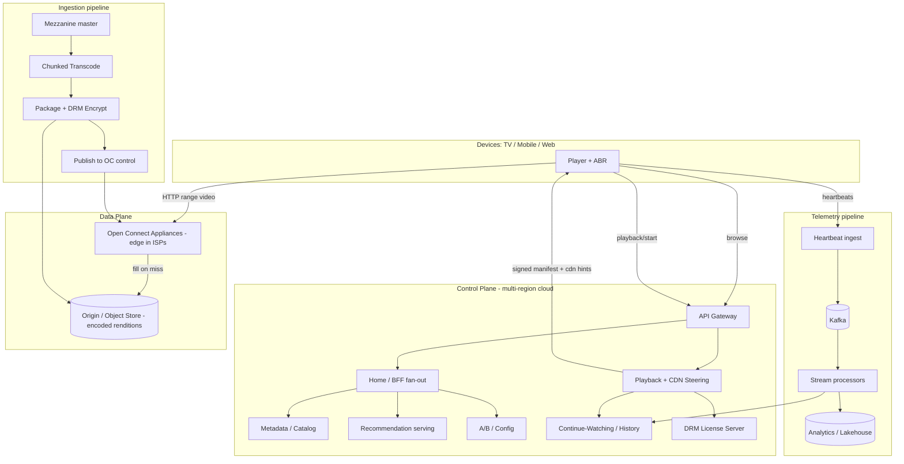
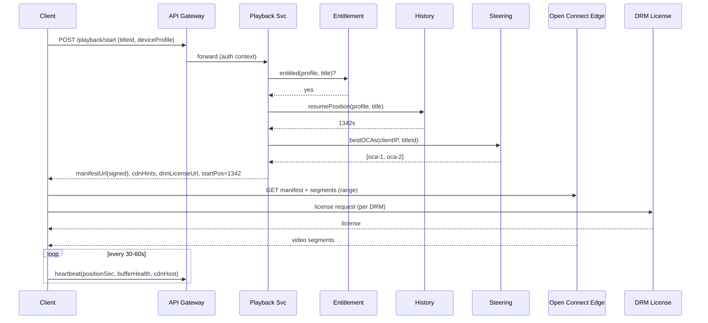

# Design Netflix — High-Level Design (Staff/Principal Interview Reference)

> **Reader profile:** senior backend engineer (Java/JVM, distributed systems) practising HLD. This doc teaches *design judgment* — clarification, tradeoffs, and the deep dives that separate a senior answer from a junior one — not just boxes-and-arrows.

---

## 1. Problem & Clarifying Questions

**Restated problem.** Design a global video-on-demand (VOD) streaming service like Netflix: users browse a catalog of movies/shows, start playback on any device, get smooth adaptive-quality video over unreliable networks, resume where they left off, and receive personalized recommendations. Content is ingested once (mezzanine master) and must be transcoded into many renditions, then distributed worldwide so playback starts in <2s and rarely rebuffers — at a scale of hundreds of millions of subscribers and exabytes of egress.

A staff candidate does **not** start drawing. They first separate the *control plane* (browse, auth, metadata, recommendations, billing — classic request/response web services) from the *data plane* (the actual video bytes — a CDN problem dominated by bandwidth economics). Conflating these is the #1 junior mistake: video bytes never touch your application servers.

### Clarifying questions I'd ask the interviewer

**Functional scope**
- Is this **VOD only**, or also **live streaming** (sports, live events)? Live adds low-latency segmenting, a fan-in ingest path, and DVR — a very different problem. *I'll assume VOD; mention live as an extension.*
- Do we own **content ingestion/transcoding**, or is the encoded catalog handed to us? *I'll assume we own the full pipeline — it's a named deep dive.*
- Do we need **downloads / offline playback**? Affects DRM license issuance and storage on device. *Assume yes, lightly.*
- Scope of **recommendations** — do we build the ML, or just the serving boundary? *I'll design the service boundary and serving path, treat model training as a black box.*
- **Social features** (sharing, profiles per account, kids profiles)? *Assume multiple profiles per account; no social graph.*
- **Billing/subscriptions** in scope? *Assume out of scope beyond an entitlement check; mention it.*
- **A/B testing / experimentation** infra in scope? *Yes — named deep dive.*

**Non-functional**
- **Scale:** how many subscribers, concurrent streams at peak, catalog size, daily new content hours?
- **Latency targets:** time-to-first-frame (TTFF) budget? Browse/catalog API latency? Rebuffer ratio target?
- **Availability:** is playback allowed to degrade gracefully (lower bitrate, stale recommendations) rather than hard-fail? *Assume yes — availability >> strong consistency for almost everything here.*
- **Consistency:** how fresh must viewing history / "Continue Watching" be across devices? Seconds? Minutes? *Assume seconds-ish, eventually consistent is fine.*
- **Geography:** global, multi-region active-active? *Assume yes.*
- **Devices:** smart TVs, mobile, web, set-top boxes — heterogeneous codecs/DRM. *Assume all.*

**Out-of-scope (explicitly parked)**
Payment processing, content licensing/rights management, customer support tooling, ad insertion (the ad-tier is a follow-up), DRM cryptographic internals (we'll use Widevine/FairPlay/PlayReady as black boxes).

---

## 2. Requirements (Finalized)

### Functional
1. **Browse & search** the catalog; render a personalized home page (rows of titles).
2. **Title details** — metadata, artwork, trailers, episode lists.
3. **Playback** — start a stream, adapt bitrate to network/device (ABR), seek, pause/resume.
4. **Continue Watching / bookmarks** — persist playback position; resume cross-device.
5. **Recommendations** — personalized rows, "Because you watched", trending.
6. **Profiles** — multiple per account; per-profile history and recs.
7. **Content ingestion** — accept mezzanine masters, transcode to a ladder of renditions, package + encrypt (DRM), publish to CDN.
8. **A/B testing** — assign users to experiments; route UI/algorithm variants; collect metrics.
9. **Offline downloads** (light).

### Non-functional (targets I'll design to)
| Property | Target | Rationale |
|---|---|---|
| Time-to-first-frame (TTFF) | p95 < 2s | Above ~2s, start abandonment climbs sharply. |
| Rebuffer ratio | < 0.5% of playback time | Rebuffering is the #1 satisfaction killer. |
| Browse/catalog API latency | p99 < 200ms | Home page composes many rows; budget is tight. |
| Playback availability | 99.99% | Degrade quality before failing. |
| Control-plane availability | 99.99% | Multi-region. |
| Viewing-history freshness | eventually consistent, ~seconds | Cross-device resume; staleness tolerable. |
| Durability (content masters) | 11 nines (object store) | Masters are expensive to recreate. |
| Catalog/metadata consistency | read-your-writes within a region; eventual cross-region | Editors publish; users read. |

### Explicit assumptions (scale)
- **300M** subscribers; **~230M** daily active; avg **2** profiles/account.
- **Peak concurrent streams: 100M** (prime-time, overlapping global peaks).
- Catalog: **~100K** titles (movies + episodes), growing **~5K new hours/year** of content ingested.
- Average viewing: **2 hours/subscriber/day**.
- Average stream bitrate (blended across devices/quality): **~5 Mbps** (mix of SD mobile ~1.5, HD ~5, 4K ~15–25).

---

## 3. Capacity Estimation (arithmetic shown)

### Egress bandwidth (the dominant cost — this is the headline number)
- Peak concurrent streams: **100M**.
- Blended bitrate: **5 Mbps** = 5 × 10⁶ bits/s.
- Peak egress = 100M × 5 Mbps = **5 × 10¹⁴ bits/s = 500 Tbps ≈ 0.5 Pbps**.

That's the whole point of Open Connect: **0.5 Pbps cannot flow out of a handful of cloud regions** — it must be served from thousands of edge appliances embedded inside ISPs. (For comparison, total internet peering at a large IXP is tens of Tbps; one company doing 500 Tbps *must* be massively distributed.)

**Daily egress volume:**
- 230M DAU × 2 h/day × 5 Mbps = 230M × 7200 s × 5 × 10⁶ bits
- = 230M × 3.6 × 10¹⁰ bits = 8.28 × 10¹⁸ bits/day = **~1.04 EB/day** (exabytes). Roughly **~1 EB/day** of video egress. This is why >90% of bytes must be served from inside ISP networks for free/cheap, not from cloud egress at ~$0.02–0.08/GB.

> **Cost intuition:** 1 EB/day at even $0.01/GB cloud egress = 10⁹ GB × $0.01 = **$10M/day = $3.6B/yr**. Open Connect (free appliances in ISPs) is what makes the business viable. We'll return to this in Deep Dive 2 and §"cost of bandwidth".

### Storage (encoded catalog + masters)
- A 2-hour 4K title at ~15 Mbps ≈ 15 × 10⁶ × 7200 / 8 bytes ≈ **13.5 GB** for one rendition.
- A full ABR **ladder** (say ~10 renditions across resolutions/bitrates, ×3 codecs H.264/HEVC/AV1, ×3 DRM/packaging variants) easily multiplies a title to **~5–15× the top rendition** ≈ **~70–200 GB per title** of encoded assets.
- 100K titles × ~100 GB avg = **~10 PB** of encoded catalog. Add mezzanine masters (~ProRes, 100s of GB/title) → **tens of PB** in deep object storage.
- This **10 PB encoded catalog is replicated to thousands of edge appliances**, but not fully — popular content is everywhere, long tail is regional. (Deep Dive 2.)

### QPS (control plane)
- **Playback starts:** assume 100M concurrent, avg session ~1h → starts/sec ≈ 100M / 3600 ≈ **~28K starts/s**, peaking higher (prime time, episode auto-advance) → design for **~100K playback-init QPS**.
- **Browse/home-page loads:** 230M DAU, each loading home + a few page views, say 10 page composes/day → 2.3B/day / 86400 ≈ **~27K QPS** average, **~100K+ QPS** peak.
- **Heartbeats / playback telemetry:** each active stream sends a heartbeat every ~30–60s. 100M streams / 30s = **~3.3M events/s**. This is the highest-volume write path — must go through a streaming pipeline (Kafka), never a synchronous DB write.
- **Bookmark/position updates:** ~ same order as heartbeats but can be batched/coalesced → effectively **~1–3M writes/s** smoothed.

### Memory / cache
- Metadata for 100K titles is small (~few KB each enriched) → **~hundreds of MB to a few GB** — fully cacheable in-memory per region. The home page is mostly **CPU + fan-out**, not data volume.
- Recommendation results per user are precomputed (rows) → cache hot users; ~1KB/profile × 300M = ~300 GB if fully materialized → tiered cache, recompute on miss.

### Server/shard counts (rough)
- Control-plane API (browse, playback-init, metadata): assume one modern instance handles ~2K QPS of composed requests → 100K QPS / 2K ≈ **~50 instances per service per region**, ×3–4 regions, ×2 headroom → low hundreds of instances. Cheap relative to video.
- **Telemetry ingest:** 3.3M events/s into Kafka. At ~50–100K msg/s per partition-broker comfortably, that's **~50–100 partitions** minimum, spread over a Kafka cluster of tens of brokers per region.
- **Viewing-history store:** ~1–3M writes/s → a wide-column store (Cassandra) sharded by `(profileId)`; at ~10–20K writes/s per node → **~100–300 nodes** per region for the hot write path (with coalescing this drops substantially).
- **Open Connect Appliances (OCAs):** thousands globally (Netflix runs ~18K+ in reality), each multi-terabyte SSD/HDD, embedded in ISPs and IXPs.

---

## 4. API Design

Two planes. Control-plane APIs are HTTPS/JSON (or gRPC internally) behind an API gateway. The data plane (video bytes) is **not** an API we call per byte — the client gets **signed manifest URLs** and then talks **directly to a CDN edge (OCA)** over HTTP range requests.

### Discovery / catalog
```
GET  /v1/home?profileId=...           → personalized rows (paginated lazy rows)
GET  /v1/title/{titleId}              → metadata, artwork, episode list, availability
GET  /v1/search?q=...&profileId=...   → ranked results
GET  /v1/recommendations?profileId=&context=  → rows (cached, precomputed)
```
`GET /v1/home` response (shape):
```json
{
  "profileId": "p_123",
  "rows": [
    {"id":"continue_watching","title":"Continue Watching","titles":[{"titleId":"t_9","resumeSec":1342}]},
    {"id":"because_you_watched_t5","title":"Because you watched X","titles":[{"titleId":"t_88"}]},
    {"id":"trending","title":"Trending Now","titles":[...]}
  ],
  "experiments": {"home_layout":"variantB"}   // A/B assignment surfaced to client
}
```

### Playback
```
POST /v1/playback/start
  body: {profileId, titleId, deviceProfile:{codecs, drm, maxRes}, networkHint}
  → {
      sessionId,
      manifestUrl,          // signed, expiring URL to ABR manifest (DASH/HLS)
      drmLicenseUrl,        // license server endpoint
      cdnHints:[{host, priority}],   // ranked OCA endpoints (Steering)
      audioTracks, subtitleTracks,
      startPositionSec      // resume point
    }

POST /v1/playback/heartbeat
  body: {sessionId, positionSec, bitrate, bufferHealthMs, droppedFrames, cdnHost}
  → 200 (fire-and-forget; ack only)

POST /v1/playback/stop
  body: {sessionId, positionSec}   → 200
```
- **Manifest** (DASH `.mpd` / HLS `.m3u8`) lists rendition tracks and segment URLs; the **client's ABR algorithm** picks segments. Served from CDN, not origin.
- `playback/start` is the **control-plane orchestration point**: entitlement check, DRM, CDN steering, resume point, experiment assignment — all in one round trip to keep TTFF low.

### Bookmarks / history
```
PUT  /v1/bookmark   {profileId, titleId, positionSec, ts}   → 202 (async, idempotent on (profile,title,ts))
GET  /v1/history?profileId=...   → recent watched + positions
```
*(In practice the heartbeat carries position; an explicit bookmark PUT exists for seek/stop events.)*

### Ingestion (internal/operator API)
```
POST /v1/ingest/source   {titleId, mezzanineUri, metadata}  → {jobId}
GET  /v1/ingest/job/{jobId}  → {status, renditions:[...], errors:[...]}
```

### Design notes
- **Idempotency:** `playback/start` returns a fresh `sessionId`; bookmark writes are idempotent on `(profileId, titleId, ts)` so retries/dupes from flaky mobile networks don't corrupt position.
- **Signed URLs** with short TTL prevent hotlinking/leeching of video and let us rotate CDN steering.
- **gRPC** between internal services (metadata, recs, history) for low latency + schema; **REST/JSON** at the edge for device compatibility.

---

## 5. High-Level Architecture

### Request flows in words
1. **Browse:** Client → CDN (static assets) + API Gateway → BFF/Home-page service → fans out to Metadata, Recommendations, Continue-Watching, A/B assignment → composes rows → returns. Heavy caching at every layer.
2. **Playback start:** Client → API Gateway → Playback service → (Entitlement, DRM license URL, **Steering** for best OCA, resume point from History) → returns signed manifest + CDN hints.
3. **Streaming:** Client → **OCA (Open Connect edge)** directly via HTTP range requests for video segments; client ABR adapts; heartbeats go Client → Telemetry ingest → Kafka → stream processors → History + Analytics.
4. **Ingestion (offline):** Mezzanine master → Object store → Transcode pipeline (chunked, parallel) → Package + DRM → Publish to Open Connect control plane → OCAs pull/pre-position content.

### ASCII block diagram
```
                          ┌─────────────────────────────────────────────┐
   DEVICES                │              CONTROL PLANE (cloud, multi-region)             │
  (TV/mobile/web)         │                                              │
        │                 │   ┌──────────┐    ┌──────────────┐          │
        │  browse/playback │  │   API     │    │   Home/BFF    │          │
        ├─────────────────┼─▶│  Gateway  ├───▶│  (fan-out)    │          │
        │   (HTTPS/JSON)  │   └──────────┘    └──┬───┬───┬────┘          │
        │                 │                       │   │   │              │
        │                 │        ┌──────────────┘   │   └───────────┐  │
        │                 │   ┌────▼─────┐  ┌──────────▼───┐  ┌────────▼──┐
        │                 │   │ Metadata │  │ Recommend.   │  │  A/B /    │
        │                 │   │ /Catalog │  │ (serving)    │  │  Config   │
        │                 │   └────┬─────┘  └──────────────┘  └───────────┘
        │                 │        │
        │                 │   ┌────▼─────┐  ┌──────────────┐  ┌───────────┐
        │                 │   │ Playback │  │ Continue-    │  │  DRM      │
        │   playback/start│──▶│ service  ├─▶│ Watching/    │  │  License  │
        │   (signed URLs) │   │ +Steering│  │ History      │  │  Server   │
        │                 │   └────┬─────┘  └──────┬───────┘  └───────────┘
        │                 │        │               ▲                       │
        │                 └────────┼───────────────┼───────────────────────┘
        │                          │               │
        │  heartbeats              │ steering      │ writes (async)
        │  ┌───────────────────────┼───────────────┼──────────────────┐
        │  │  TELEMETRY: ingest ─▶ Kafka ─▶ stream proc ─▶ History/Analytics
        │  └────────────────────────────────────────────────────────┘
        │
        │  VIDEO BYTES (data plane) — NEVER through control plane
        │           ┌──────────────────────────────────────────┐
        └──────────▶│  OPEN CONNECT EDGE (OCAs in ISPs / IXPs)  │
        HTTP range   │  popular content pre-positioned overnight │
        requests     └───────────────┬──────────────────────────┘
                                     │ fill (pull) from
                          ┌──────────▼───────────┐
                          │  Origin / Object Store│  ◀── INGESTION
                          │  (encoded renditions) │      pipeline writes here
                          └──────────▲───────────┘
                                     │
        ┌────────────────────────────┴───────────────────────────────┐
        │ INGESTION: Mezzanine ─▶ Object store ─▶ Transcode (chunked) │
        │            ─▶ Package + DRM encrypt ─▶ Publish to OC control │
        └─────────────────────────────────────────────────────────────┘
```

### Mermaid diagram


### Key sequence — playback start


---

## 6. Data Model & Storage Choices

Different access patterns → different stores. The staff move is matching each entity's read/write shape to a datastore and *justifying against alternatives*.

### Entities

**Title / Catalog metadata** (titles, episodes, artwork refs, availability windows, cast)
- Access: read-heavy, low write (editors), small total size, complex relationships (series→seasons→episodes), needs search.
- **Store:** source of truth in a relational/document store (e.g., **Cassandra or document DB** for serving, fronted by a heavy in-memory cache). Search served by **Elasticsearch**. The catalog is small enough that the *entire serving copy lives in cache* per region — Netflix's real "EVCache + materialized metadata" pattern. Justification: 100K titles is tiny data but high read fan-out; the cost is *composition latency*, not storage, so we optimize for in-memory reads.

**Encoded content assets** (renditions, manifests, DRM-packaged segments)
- Access: written once by ingestion, read by CDN fill; huge volume; immutable.
- **Store:** **object storage** (S3-class) as origin; segments are immutable blobs keyed by content hash → trivially cacheable, dedup-friendly.

**Viewing history / bookmarks** (per profile: title, position, timestamp, device)
- Access: extremely high write rate (heartbeats), keyed by profileId, time-ordered, eventually consistent, "give me last position for title X" + "recent activity".
- **Store:** **Cassandra** (wide-column). Partition key `profileId`, clustering by `titleId`/`ts`. Justification below in Deep Dive 5; chosen for write throughput, tunable consistency, multi-region replication, and time-series access.

**Recommendations (materialized rows)**
- Access: precomputed offline/nearline, served read-only per profile, ephemeral/regenerable.
- **Store:** **key-value cache** (EVCache/Redis-class) keyed by `profileId`, backed by a serving store; recompute on miss. Regenerable, so durability is cheap.

**Telemetry / events**
- Access: append-only firehose, 3.3M/s.
- **Store:** **Kafka** for transport → stream processors (Flink) → **Cassandra** (history) + **data lake / lakehouse** (Iceberg/Parquet on object store) for analytics/ML training.

**A/B assignments & config**
- Access: read on nearly every request, write rarely (config changes).
- **Store:** in-memory config store with push (versioned), e.g., a config service + local cache. Deterministic hashing means assignment can be computed, not stored, for most experiments.

### Storage-choice table
| Entity | Pattern | Store | Why this, not the obvious alternative |
|---|---|---|---|
| Catalog metadata | read-heavy, small, relational-ish | Doc/Cassandra + in-mem cache + ES | RDBMS fine for truth, but serving needs sub-ms fan-out → cache everything; ES for search |
| Encoded segments | write-once, immutable, huge | Object store (origin) + CDN | Block/file store can't scale egress; CDN+immutable blobs = cache nirvana |
| Viewing history | write-firehose, time-series, per-key | Cassandra | RDBMS can't take 1–3M writes/s; needs multi-region AP + tunable consistency |
| Recommendations | precomputed, regenerable | KV cache + serving store | Don't pay for durability on regenerable data; optimize read latency |
| Telemetry | append firehose | Kafka → Flink → lake | Synchronous DB writes would melt; decouple ingest from processing |
| A/B config | read-everywhere, rare write | Config svc + local cache + deterministic hashing | A DB read per request is wasteful; hash-based assignment is stateless |

---

## 7. Deep Dives (the bulk)

### Deep Dive 1 — Content Ingestion & Transcoding Pipeline

**Problem.** Studios deliver a **mezzanine master** (high-bitrate, lightly compressed source, e.g., ProRes — hundreds of GB for a film). We must produce a full **ABR ladder**: multiple resolution/bitrate **renditions** across multiple **codecs** (H.264 for compatibility, HEVC for HD/4K efficiency, AV1 for bandwidth savings), each **packaged** into segmented formats (DASH/HLS) and **DRM-encrypted**. A single film can take **many CPU-hours** to encode naively, and the catalog grows continuously — so the pipeline must be massively parallel, resumable, and quality-aware.

**Options for parallelism:**
| Approach | How | Pros | Cons |
|---|---|---|---|
| Whole-file encode per rendition | One worker encodes the entire title per rendition | Simple, codec sees full context | Slow (hours per title), one failure restarts whole job, poor utilization |
| **Chunked / scene-based parallel encode** | Split title into chunks (at scene/GOP boundaries), encode chunks in parallel across many workers, stitch | Massive parallelism, fast turnaround, per-chunk retry, spot-instance friendly | Must align at GOP boundaries; risk of quality seams; stitching complexity |
| Per-title optimized encoding | Choose bitrate ladder per title based on content complexity (cartoon vs action) | Big bandwidth savings | Needs analysis pass, more compute upfront |

**Decision: chunked parallel encode + per-title (per-shot) optimized ladders.**
- **Chunking** at GOP (Group of Pictures — a self-contained segment starting with a keyframe) boundaries lets thousands of workers encode chunks concurrently and **retry only the failed chunk** — critical when running on preemptible/spot capacity. *Failure mode avoided:* a single transient worker death no longer forces a multi-hour re-encode.
- **Per-title/per-shot encoding** (analyze content complexity, allocate bitrate where the eye needs it) cuts average bitrate substantially. *Failure mode avoided:* paying for 4K-class bandwidth on a low-complexity cartoon that looks identical at half the bitrate — at exabyte/day egress, a 20% bitrate cut is **hundreds of millions of dollars/year**.

**Pipeline stages (orchestrated as a DAG / workflow engine):**
1. **Inspect/validate** master (codec, audio tracks, captions, integrity checks).
2. **Chunk** at scene/GOP boundaries.
3. **Encode** each chunk × each ladder rung × each codec, in parallel (worker pool, autoscaled, spot).
4. **Assemble/validate** chunks per rendition; run **automated QC** (compare to source via VMAF — a perceptual quality metric — to catch artifacts/seams).
5. **Package** into DASH/HLS segments; generate manifests.
6. **DRM-encrypt** per scheme (Widevine/FairPlay/PlayReady); generate keys, store in key service.
7. **Publish** to origin object store; register with Open Connect control plane for distribution.

**Why a workflow engine (Conductor/Temporal-style):** ingestion is a long-running, multi-stage, fan-out/fan-in DAG with retries, human approval gates, and partial failures. A durable orchestrator gives idempotent step execution and visibility. *Failure mode avoided:* lost jobs / inconsistent partial publishes (e.g., manifest published but a rendition missing → playback errors).

**Idempotency & content addressing:** segments keyed by content hash → re-running a chunk produces the same blob → safe retries, dedup, and cache-friendliness.

---

### Deep Dive 2 — CDN / Open Connect & Edge Caching (the heart of the system)

**Problem.** We computed **~0.5 Pbps peak / ~1 EB/day** egress. No cloud region can emit that, and cloud egress pricing would bankrupt the service. The solution is a **purpose-built CDN — Open Connect — with appliances (OCAs) placed *inside ISP networks and at IXPs***, so most bytes are delivered locally, often without crossing paid transit.

**Why own the CDN vs. use a commercial CDN (Akamai/CloudFront)?**
| Option | Pros | Cons |
|---|---|---|
| Commercial CDN | No hardware to build; global reach instantly | Pay per GB at massive scale → astronomically expensive; less control over pre-positioning; shared cache eviction |
| **Own CDN embedded in ISPs (Open Connect)** | Bytes delivered free/cheap from inside ISP; full control of fill & pre-positioning; predictable workload (VOD is plannable) | Huge capex/ops; only worth it at Netflix scale; logistics of deploying thousands of boxes |
| Hybrid | Cloud CDN for spillover/long tail | Complexity |

**Decision: own embedded CDN (Open Connect) + cloud as control plane.** Justified *because* the workload is uniquely CDN-friendly: VOD content is **immutable, cacheable, and its popularity is predictable a day ahead**. *Failure mode avoided:* per-GB egress economics that make the business non-viable; loss of control over what's cached where.

**The killer property — predictable, pre-positioned caching:**
- Unlike generic web traffic, we **know tonight's likely-popular titles** (new releases, trending, regional preferences) from data.
- During **off-peak hours**, the control plane **proactively fills (pre-positions)** popular content onto each OCA. This is *push during the valley, serve during the peak* — it shifts fill traffic off the congested evening window. *Failure mode avoided:* cache-miss storms at prime time where thousands of clients simultaneously miss and stampede the origin/transit links.

**Cache tiering & hit-rate strategy:**
- **Head (most popular ~small %):** replicated to **every** OCA. A small fraction of titles drives the majority of views (heavy Zipf/long-tail distribution) — caching the head everywhere yields very high hit rates with modest storage.
- **Torso/tail:** cached **regionally** (at IXP-tier OCAs or larger fill clusters); embedded ISP OCAs fetch on miss from a nearby fill tier, not from cloud origin.
- **Cold tail:** served from origin/object store rarely.

This tiering is why ~95%+ of bytes never touch cloud egress.

**Client steering (which OCA does a client use?):**
- `playback/start` returns **ranked CDN hints**. The **Steering service** picks OCAs based on: client IP → ISP/geo, which OCAs hold the title, OCA health/load, and real-time network telemetry.
- If an OCA degrades mid-stream, the client **reselects** from its ranked hints (and the ABR can drop bitrate meanwhile). *Failure mode avoided:* a single hot/failing appliance causing rebuffering for everyone behind it.

**Why range requests + immutable segments:** clients fetch fixed segments via HTTP range/byte requests; segments are immutable and content-addressed → CDN caching is trivial and seek is just "request a different segment". *Failure mode avoided:* cache invalidation complexity (there is none — new encode = new URL).

**ASCII of the fill/serve hierarchy:**
```
Origin (object store, cloud)
   │ overnight fill (pre-position popular)
   ▼
IXP-tier fill OCAs (regional, large storage)
   │ fill on miss
   ▼
ISP-embedded OCAs (close to user, head content)
   │ serve (HTTP range)
   ▼
Client player (ABR picks rendition)
```

---

### Deep Dive 3 — Adaptive Bitrate (ABR) Streaming

**Problem.** Networks fluctuate wildly (mobile, congested Wi-Fi). We must avoid two failures: **rebuffering** (buffer empties → playback stalls — the worst experience) and **starting too low / staying low** (wasting available bandwidth, poor quality). The decision of *which rendition to fetch next* is made **client-side**, per segment.

**Where does ABR logic live?**
| Approach | Pros | Cons |
|---|---|---|
| Server-driven (server picks bitrate) | Central control | Server can't see client buffer/CPU/screen in real time; doesn't scale to 100M independent decisions |
| **Client-driven ABR** (DASH/HLS standard) | Client sees true buffer health, throughput, device; scales infinitely (each client decides) | Each client must implement good logic; "ABR wars" between clients on shared link |
| Server-assisted hints (CMCD/CMSD) | Best of both — client decides, server/CDN gives hints | Extra protocol surface |

**Decision: client-driven ABR with server/CDN hints.** Each client runs an ABR controller; the manifest exposes the ladder; CDN can return congestion hints. *Failure mode avoided:* a central bitrate controller becoming a bottleneck and being blind to per-device conditions.

**ABR algorithm families:**
- **Throughput-based:** estimate recent download speed, pick the highest rung below it. Simple but reacts late to drops → risk of rebuffer.
- **Buffer-based:** drive bitrate from **buffer occupancy** — if buffer is full, push quality up; if draining, drop fast. Robust against throughput estimation noise.
- **Hybrid / model-based (e.g., BOLA-style + control theory):** combine buffer + throughput, optimize a utility (quality minus rebuffer penalty). This is the production choice.

**Decision: hybrid buffer+throughput ABR with an asymmetric penalty** (rebuffering penalized far more than a quality drop). Start conservative for fast TTFF, ramp up as buffer builds. *Failure mode avoided:* the "throughput-only" trap of confidently selecting 4K right before a tunnel and stalling.

**Startup / TTFF tactic:** begin at a low rung for instant first frame, prefetch a few segments, then climb. Combined with OCA proximity (Deep Dive 2), this hits the **<2s TTFF** target.

**Per-title encoding ties back here:** because the ladder is content-optimized, each rung is the most efficient bitrate for *that* content, so ABR's choices are better at every network speed.

---

### Deep Dive 4 — Metadata/Catalog Service & Home-Page Composition

**Problem.** The home page is a **fan-out composition**: many rows, each row a ranked list of titles, each title needing metadata + artwork + availability + the user's resume position + experiment-driven layout — all within a **p99 < 200ms** budget, at ~100K QPS. The naive approach (synchronous calls to a dozen services per request) blows the latency budget and creates a fragility web.

**Pattern: BFF (Backend-for-Frontend) + aggressive materialization + graceful degradation.**
- A **Home/BFF service** orchestrates the page. Recommendation **rows are precomputed** (nearline/offline) and stored per profile → the BFF mostly *reads precomputed rows + hydrates titles from cache*, rather than computing recs on the request path. *Failure mode avoided:* doing ML inference synchronously inside a 200ms web request.
- **Metadata is fully cached in-memory** per region (catalog is tiny). Title hydration is a cache lookup, not a DB round trip.
- **Hedged / parallel fan-out** with per-dependency timeouts; if Recommendations is slow, fall back to a cached/generic row. **Partial results beat a blank page.** *Failure mode avoided:* one slow dependency (tail latency) holding the entire page hostage — the classic "p99 of the page = p99 of the slowest of N calls" trap.

**Consistency model:** read-your-writes within a region for editorial changes (publish a new title → editors see it), eventual cross-region. Users tolerate seconds of staleness on catalog changes.

**Search:** Elasticsearch for full-text + typo tolerance + faceting; kept in sync via change events from the catalog source of truth.

**Tradeoff table — composing the home page:**
| Strategy | Latency | Freshness | Complexity |
|---|---|---|---|
| Synchronous fan-out, compute on request | High (tail-bound) | Fresh | Low code, bad latency |
| **Precompute rows + cache hydrate + BFF** | Low | Slightly stale (mins) | Medium — needs nearline pipeline |
| Fully static per user | Lowest | Stale | Wasteful; ignores context |

Decision: **precompute + cache + BFF with degradation.** Defends the latency SLO while keeping recs reasonably fresh via a nearline update path.

---

### Deep Dive 5 — Viewing History / Bookmarks ("Continue Watching")

**Problem.** Every active stream emits a position heartbeat (~3.3M events/s peak). We must persist "last position per (profile, title)" so users **resume cross-device within seconds**, *and* feed the same events to analytics/recs — without a synchronous DB write per heartbeat (which would require an impossible write rate against a strongly-consistent store).

**Write path:**
1. Heartbeats → **stateless ingest** → **Kafka** (decouple, absorb spikes, replay).
2. **Stream processor (Flink)** consumes, **coalesces** rapid updates per `(profile,title)` (we only need the latest position every few seconds, not every heartbeat), and writes to:
   - **Cassandra** (serving store for "Continue Watching").
   - **Data lake** (raw events for ML/analytics).

**Why Cassandra, not RDBMS or a single Redis?**
| Store | Write throughput | Multi-region | Consistency | Verdict |
|---|---|---|---|---|
| RDBMS (Postgres/MySQL) | Limited (~10s of K/s) | Hard (single-leader) | Strong | Can't take 1–3M writes/s; cross-region is painful |
| **Cassandra** | Very high (linear w/ nodes) | Native multi-DC active-active | Tunable (QUORUM/ONE) | Fits firehose + global resume |
| Redis only | Fast but memory-bound, durability/replication weaker for this volume | Add-on | — | Great as a hot cache, not the system of record |

**Decision: Kafka → Flink (coalesce) → Cassandra (+ hot cache).**
- Partition Cassandra by `profileId` (resume queries are per-profile), cluster by `titleId`/recency. *Failure mode avoided:* hot partitions and unbounded write amplification from un-coalesced heartbeats.
- **Tunable consistency:** write with `LOCAL_QUORUM` (durable within region), replicate cross-region async. Resume cross-device is eventually consistent within seconds — acceptable. *Failure mode avoided:* paying global-strong-consistency latency on a feature that tolerates seconds of lag.
- **Idempotency:** events carry `(profile,title,ts)`; coalescing takes max(ts) → out-of-order/duplicate heartbeats from flaky mobile networks don't rewind your position. *Failure mode avoided:* the dreaded "it forgot where I was / it jumped backward" bug.

**Hot cache for "Continue Watching":** the BFF reads resume positions from a fast cache (warmed by the stream processor) so the home page never blocks on Cassandra. Cassandra is the durable backstop.

---

### Deep Dive 6 — A/B Testing / Experimentation Infrastructure (named focus)

**Problem.** Netflix changes *everything* via experiments — UI layout, artwork, recommendation algorithms, even encode ladders. We need to **assign users to variants deterministically**, **route** the variant, and **measure** impact, at full scale, without leaking assignments or biasing metrics.

**Assignment:** deterministic hashing — `variant = hash(experimentId, profileId) % buckets`. Stateless, reproducible, no per-request DB read. Supports holdbacks, mutual exclusion groups, and gradual rollouts (ramp the bucket fraction). *Failure mode avoided:* a flaky assignment service on the critical path; inconsistent assignment across requests.

**Routing:** the assignment is surfaced to the BFF and clients (see `experiments` in the home response); services read the active config and behave accordingly. Config is versioned and pushed.

**Measurement:** every event in telemetry is tagged with experiment assignments → analytics computes per-variant metrics (engagement, retention, QoE like rebuffer ratio) with proper statistical rigor. Guardrail metrics (e.g., does a new ladder raise rebuffering?) gate rollout.

**Why this matters for the *design*:** experimentation touches metadata (layout variants), recs (algorithm variants), and even Deep Dive 1 (encode-ladder experiments) — so experiment context must thread through the whole stack as a first-class request attribute, not a bolt-on. Decision: **assignment is computed (stateless) and propagated in request context; measurement rides the existing telemetry pipeline.**

---

### Deep Dive 7 — Multi-Region Availability

**Problem.** Global users; a region can fail. Playback must survive a regional control-plane outage (the data plane — OCAs — is already distributed).

**Approach: active-active multi-region control plane** with regional data stores (Cassandra multi-DC, caches per region). Traffic routed by geo-DNS/Anycast to nearest healthy region. *Failure mode avoided:* a single-region outage taking down browse/playback-start globally.

- **Stateless services** replicate trivially across regions.
- **Stateful stores** (history) replicate async cross-region (eventual). On regional failover, a user may see slightly stale resume position — acceptable.
- **Chaos engineering / region-evacuation drills**: regularly fail a region in production to prove failover works (Netflix's actual practice). *Failure mode avoided:* discovering failover is broken *during* a real outage.
- **Cellular isolation:** blast-radius containment so one bad deploy/cell doesn't cascade.

Because the data plane (video bytes) is served from OCAs independent of any single cloud region, even a full control-plane region loss only affects *new* playback starts in that region (mitigated by failover), not in-flight streams.

---

## 8. Scaling & Bottlenecks

| Layer | First bottleneck | How we remove it |
|---|---|---|
| **Egress bandwidth** | Cloud egress would be the binding constraint (~0.5 Pbps) | Open Connect: serve >95% bytes from ISP-embedded OCAs; pre-position popular content off-peak |
| **Origin fill** | Prime-time cache-miss stampede to origin | Off-peak pre-positioning + regional fill tiers + request coalescing on fill |
| **Telemetry writes** | 3.3M events/s would melt any sync DB | Kafka buffer + Flink coalescing → smoothed Cassandra writes |
| **History store** | Hot partitions on popular titles / power users | Partition by profileId; coalesce; hot cache for reads |
| **Home-page fan-out** | Tail latency of slowest dependency | BFF + precomputed rows + in-mem metadata cache + graceful degradation + hedging |
| **Recommendations** | Synchronous ML inference on request path | Precompute rows offline/nearline; serve from cache |
| **DRM license server** | Spike at playback start | Cache/scale stateless license issuance; short-lived licenses |
| **Search** | Query spikes | Elasticsearch cluster scaling + result caching |
| **Transcoding** | Backlog when ingesting large catalog | Chunked parallel encode on autoscaled spot fleet; prioritize by release date |

**Where it breaks first if you do nothing:** bandwidth (the data plane) and telemetry writes. Both are addressed by *not putting them on the synchronous request/DB path* — the recurring senior theme here.

---

## 9. Reliability, Consistency & Security

**Reliability / failure handling**
- **Degrade, don't fail:** ABR drops bitrate before stalling; BFF returns partial pages; recs fall back to generic rows; OCA reselection on edge failure. Availability is prioritized over perfect quality/freshness.
- **Bulkheads & circuit breakers** around every cross-service call (Hystrix-style) so one failing dependency can't exhaust threads and cascade.
- **Timeouts + retries with backoff + idempotency** on all writes.
- **Chaos engineering** (fault injection, region evacuation) as a continuous practice.

**Consistency model (per surface)**
- Catalog/metadata: read-your-writes in-region, eventual cross-region.
- Viewing history: eventual, seconds; idempotent coalescing prevents regressions.
- Entitlement check: must be correct at playback start (strongly consistent read against billing/entitlement) — we *don't* relax this, because serving content to non-entitled users is a licensing/revenue failure.
- Recommendations: eventual, regenerable.

**Security**
- **Auth:** token-based (OAuth/JWT) at the gateway; per-profile context.
- **DRM:** Widevine/FairPlay/PlayReady; content encrypted at packaging; license server issues short-lived, device-bound licenses. Premium tiers/4K gated by hardware-backed DRM levels.
- **Signed, expiring manifest/segment URLs** to prevent hotlinking and unauthorized redistribution.
- **Abuse / rate limiting** at the gateway (per account/IP) for browse/search/login; bot/credential-stuffing protection on auth.
- **Concurrent-stream limits** enforced at playback start per subscription tier.
- **PII / privacy:** viewing history is sensitive; encrypt at rest, access controls, regional data residency where required.

**Idempotency recap:** `playback/start` issues fresh sessionIds; bookmark/heartbeat writes idempotent on `(profile,title,ts)`; ingestion steps idempotent via content-addressed outputs.

---

## 10. Extensions & Follow-ups

| Follow-up | How the design changes |
|---|---|
| **Live streaming (sports)** | Add low-latency packaging (LL-HLS/CMAF), a fan-in ingest path, live transcoding (can't pre-encode), DVR window storage; OCAs serve live segments with very short TTL; ABR tuned for low latency over quality |
| **Ad-supported tier** | Server-side ad insertion (SSAI) stitching ad segments into the manifest; ad decisioning service; new telemetry (impressions); manifest manipulation per user |
| **Downloads/offline** | DRM licenses with offline lease; expiry; device-side storage; sync resume position when back online |
| **Interactive content (Bandersnatch)** | Branching manifest / state machine; prefetch multiple branches; store choice state in history |
| **Spatial/4K/HDR/AV1 rollout** | New ladder rungs/codecs in ingestion; device-capability negotiation in playback/start; gated by DRM level |
| **Cheaper bandwidth still** | More aggressive AV1/per-shot encoding; smarter pre-positioning ML; P2P-assist (controversial) |
| **Stronger personalization freshness** | Move some rec computation nearline (within seconds of a view) via the existing stream pipeline |
| **New device with new codec** | Add codec to encode matrix; expose in manifest; device negotiates — no client of other devices affected (immutable segment URLs) |

---

## 11. Interview Q&A

**Q1. Why build Open Connect instead of using a commercial CDN?**
At ~1 EB/day egress, per-GB CDN pricing is economically impossible and gives no control over pre-positioning. VOD is uniquely CDN-friendly — immutable, cacheable, *predictably* popular — so embedding appliances in ISPs delivers most bytes locally for free and lets us pre-fill popular content off-peak. The capex only pays off at our scale. *Probe: when wouldn't you build your own?* Below a few % of internet traffic, or with unpredictable/uncacheable content — then commercial CDN wins.

**Q2. How do you start playback in under 2 seconds?**
Single orchestrated `playback/start` (entitlement + DRM URL + steering + resume in one round trip), nearest healthy OCA via steering, immutable pre-positioned segments, and ABR that starts at a low rung for instant first frame then ramps. *Probe: what dominates TTFF?* Network RTT to first segment + DRM license + manifest fetch — all minimized by proximity and a single control round trip.

**Q3. Why is ABR client-side?**
Only the client sees true buffer health, throughput, CPU, and screen size in real time, and 100M independent decisions can't funnel through a central controller. We use hybrid buffer+throughput logic with an asymmetric penalty (rebuffer ≫ quality drop). *Probe: downside?* Clients can be unfair on shared links and need good implementations; CMCD/CMSD hints mitigate.

**Q4. How do you persist 3.3M position heartbeats/sec?**
Never synchronously to a DB. Heartbeats → Kafka → Flink coalesces per `(profile,title)` → Cassandra (+ hot cache) and the data lake. Coalescing collapses many heartbeats into one write and idempotency on timestamp prevents rewind bugs. *Probe: why Cassandra not Postgres?* Linear write scaling, native multi-DC active-active, tunable consistency — Postgres can't take the write rate or replicate globally cleanly.

**Q5. (Senior signal) Where do you accept eventual consistency and where do you refuse it?**
Accept it for history (seconds), catalog cross-region, and recommendations — all tolerate staleness and the cost of strong consistency (latency, availability loss) isn't worth it. Refuse it for the **entitlement check** at playback start: serving content to a non-paying/unauthorized user is a licensing and revenue failure, so that read is strongly consistent. The judgment is matching consistency cost to the business cost of being wrong.

**Q6. (Senior signal) Defend chunked transcoding vs whole-file.**
Chunked encode gives massive parallelism, per-chunk retry (spot-friendly), and fast turnaround; the cost is GOP-boundary alignment and stitch/seam QC (handled with VMAF checks). Whole-file is simpler but a single failure restarts hours of work and underutilizes the fleet. At catalog scale, turnaround and resilience win. *Probe: the seam risk?* Encode at aligned GOP boundaries and validate perceptual quality across joins.

**Q7. How does the home page hit p99 < 200ms with a dozen dependencies?**
BFF pattern: recommendation rows precomputed offline, metadata fully cached in-memory, parallel fan-out with per-dependency timeouts, and graceful degradation (partial page / fallback rows). We never compute ML or hit cold storage on the request path. *Probe: the tail-latency trap?* p99 of a synchronous N-call page ≈ p99 of the slowest call; precompute + hedging + fallbacks break that coupling.

**Q8. (Senior signal) How does cost shape the architecture?**
Bandwidth dominates everything — ~1 EB/day. So: (a) Open Connect to avoid cloud egress, (b) per-shot/AV1 encoding to cut average bitrate (a 20% cut ≈ hundreds of millions/yr), (c) pre-positioning off-peak to use cheap capacity, (d) regenerable data (recs) stored cheaply. Cost is a first-class design constraint, not an afterthought. *Probe: next cheapest lever?* Better codecs + ML-driven pre-positioning to raise edge hit rate.

**Q9. How do A/B experiments thread through the stack?**
Deterministic hash assignment (stateless, no DB read), assignment propagated in request context to BFF/recs/encoding, and every telemetry event tagged with assignments for per-variant measurement with guardrail metrics. Experimentation is first-class, touching layout, recs, and even encode ladders. *Probe: avoid bias?* Mutual-exclusion groups, holdbacks, and consistent hashing so a user stays in the same bucket.

**Q10. What happens when an OCA fails mid-stream?**
`playback/start` returned ranked CDN hints; the client reselects the next OCA, and ABR can drop bitrate during the switch to keep the buffer alive — the user sees at worst a brief quality dip, not a stall. *Probe: how is OCA health known?* Steering uses OCA load/health telemetry and real-time network signals to rank and re-rank.

---

## 12. Cheat-Sheet & Self-Test

### Dense recap
- **Two planes:** control plane (browse/playback-init/metadata/recs — cloud, multi-region, request/response) vs **data plane** (video bytes — Open Connect CDN, never through app servers).
- **Headline numbers:** 300M subs, 100M peak concurrent, **~0.5 Pbps / ~1 EB/day egress**, ~3.3M telemetry events/s, ~100K control-plane QPS, ~10 PB encoded catalog.
- **Open Connect:** OCAs embedded in ISPs; **head content replicated everywhere, tail regional**; **pre-position popular content off-peak**; serve via HTTP range on immutable, content-addressed segments; steering ranks OCAs per client.
- **Ingestion:** mezzanine → chunked parallel encode (spot, per-chunk retry) → per-shot optimized ABR ladder × codecs (H.264/HEVC/AV1) → package → DRM → publish; orchestrated as a durable DAG; VMAF QC.
- **ABR:** client-side, hybrid buffer+throughput, asymmetric penalty (rebuffer ≫ quality drop), low-start for fast TTFF.
- **Home page:** BFF + precomputed rec rows + in-mem metadata cache + graceful degradation → p99 < 200ms.
- **History:** heartbeats → Kafka → Flink coalesce → Cassandra (partition by profileId) + hot cache; eventual, idempotent on (profile,title,ts).
- **A/B:** deterministic hash assignment, propagated in context, measured via telemetry tags.
- **Multi-region active-active**, degrade-don't-fail, chaos drills, signed URLs + DRM + entitlement (the one strongly-consistent read).
- **Diagram-in-words:** Client → Gateway → BFF (fan-out to Metadata/Recs/A-B) for browse; Client → Gateway → Playback (entitlement+DRM+steering+resume) returns signed manifest; Client → OCA for bytes; Client → Telemetry → Kafka → Flink → History/Lake.

### Self-test (no answers)
1. Recompute peak egress if average bitrate rises to 8 Mbps and concurrency to 130M — and explain which architectural choices that pressures first.
2. Design the pre-positioning decision: what signals decide which titles get pushed to which OCAs tonight, and how do you handle a surprise viral title not in the plan?
3. A user resumes a show on phone then TV within 10 seconds and the TV starts from the wrong position. Trace every place this bug could originate and how your design prevents each.
4. You must add live sports. List exactly which components change, which stay, and the new failure modes you introduce.
5. Justify, with the failure mode each avoids: client-side ABR, chunked transcoding, eventual-consistent history, and a strongly-consistent entitlement check — then name one place you'd reverse the decision and why.
