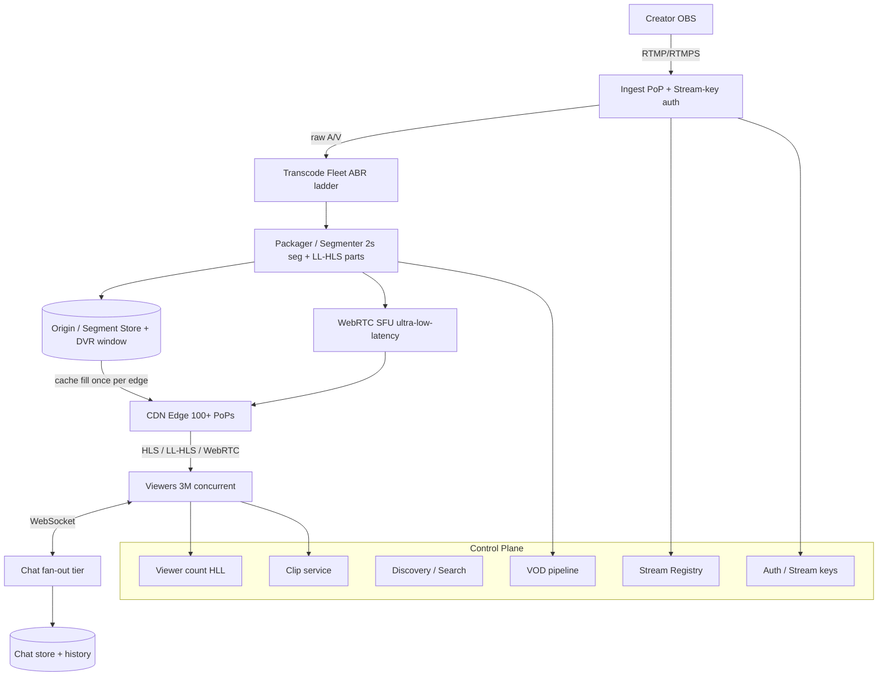
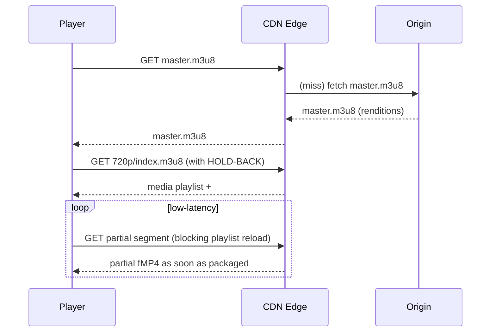

# Design Live Streaming (Twitch) — High-Level Design

> Staff/principal-level HLD reference and practice artifact. The system: a live video streaming platform (Twitch-style) where creators broadcast to millions of concurrent viewers with low latency, alongside real-time chat, DVR/rewind, and clip creation.

---

## 1. Problem & Clarifying Questions

**Restated problem.** Build a platform where a *creator* (broadcaster) pushes a live video+audio feed from their machine, the platform ingests it, transcodes it into multiple qualities (ABR — Adaptive BitRate, i.e. multiple renditions a player can switch between based on bandwidth), and fans it out to potentially **millions of concurrent viewers** with **glass-to-glass latency** (time from camera to viewer's screen) in the low-seconds range. Around the video we need **live chat**, **DVR/rewind** (scrub backward within the live window), and basic discovery (which streams are live).

A senior answer does **not** open with boxes-and-arrows. It scopes the problem first, because the entire architecture pivots on a handful of answers — chiefly *how low must latency be* and *how many concurrent viewers per stream*.

### 1.1 Functional clarifying questions

1. **Who broadcasts?** Long-tail of small creators (0–50 viewers), or a few mega-streams (millions of concurrent viewers on one channel)? → Determines whether the hard problem is *fan-out per stream* or *number of streams*. (Twitch reality: ~100K concurrent live channels, but viewership is extremely skewed — a handful of channels have 100K–1M+ concurrent.)
2. **Latency target?** "Broadcast TV" (~10–30 s is fine), "low latency" (2–5 s), or "ultra/interactive" (sub-second, e.g. for "watch parties," auctions, IRL interaction)? This single answer chooses the delivery protocol (HLS vs LL-HLS vs WebRTC).
3. **Ingest protocol from creators?** RTMP (the de-facto OBS standard), SRT, or WebRTC ingest? Most creators use OBS → assume **RTMP/RTMPS** primary, with WebRTC ingest as an extension.
4. **Is chat in scope?** Yes — real-time chat is core to the Twitch experience and a genuine deep dive (fan-out of millions of messages/sec).
5. **DVR/rewind & VOD?** Can viewers scrub back within the live window (DVR), and is the full stream saved as a Video-On-Demand (VOD) afterward? Assume **DVR within a rolling window** + **optional VOD persistence**.
6. **Clips?** Can viewers cut a 30-second clip and share it? In scope as an extension.
7. **Multi-platform clients?** Web (browser), iOS, Android, TV/console. Assume all → constrains us to widely-supported protocols (HLS plays natively on Safari/iOS).
8. **Monetization / DRM?** Subscriptions, ads (server-side ad insertion), and content protection? Note it but treat DRM as out-of-scope for v1 to keep focus.
9. **Discovery?** Browse/search live channels, categories, recommendations. In scope at a high level; not a deep dive.

### 1.2 Non-functional clarifying questions

- **Availability target?** 99.9%+ for delivery; ingest interruptions are very visible to creators.
- **Consistency needs?** Video delivery is eventually-consistent (segments are immutable once written); chat is best-effort ordered; viewer counts are approximate. Strong consistency is *not* needed on the hot path.
- **Geographic distribution?** Global. Implies edge/CDN and regional ingest PoPs (Points of Presence — edge data centers close to users).
- **Cost sensitivity?** Transcoding (CPU/GPU) and egress bandwidth dominate cost — explicitly optimize both.

### 1.3 Scale clarifying questions

- Peak **concurrent viewers** platform-wide? Assume **3M concurrent** at peak.
- Peak **concurrent live channels**? Assume **100K**.
- **Single-stream fan-out ceiling**? Assume a top stream can hit **1M concurrent viewers**.
- **Chat volume** on a big stream? A 1M-viewer stream can produce **tens of thousands of messages/sec** and must deliver each to all viewers.

### 1.4 Out-of-scope (declared explicitly)

DRM/Widevine, fine-grained ad targeting/billing, recommendation ML ranking, content moderation ML (we'll cover the *hooks*), payments/payouts, and the creator dashboard analytics pipeline beyond what informs the design.

---

## 2. Requirements (Finalized)

### 2.1 Functional

- **Ingest:** Creator pushes a single high-quality feed via RTMP/RTMPS to the nearest ingest PoP.
- **Transcode:** Produce an ABR ladder (e.g. source-passthrough 1080p60, 720p60, 720p30, 480p, 360p, 160p audio-only) plus segmenting.
- **Deliver:** Viewers pull the stream via HLS / LL-HLS (default) and via WebRTC for an "ultra-low-latency" tier.
- **Chat:** Real-time, per-channel chat with fan-out to all viewers; moderation tools (timeout, ban, slow mode).
- **DVR/rewind:** Scrub back within a rolling window (e.g. last 2 hours).
- **VOD:** Optionally persist the full broadcast for later on-demand playback.
- **Clips:** Viewers create short shareable clips.
- **Discovery:** List live channels, by category, with live viewer counts.
- **Presence/metrics:** Approximate concurrent viewer count per channel.

### 2.2 Non-functional

| Property | Target | Notes |
|---|---|---|
| Glass-to-glass latency (default tier) | 2–5 s (LL-HLS) | Acceptable for most live content |
| Glass-to-glass latency (ultra tier) | < 1 s (WebRTC) | For interactive use; higher cost |
| Delivery availability | 99.95% | Viewers tolerate brief rebuffer, not outage |
| Ingest availability | 99.95% | Dropped ingest = creator's stream dies — very visible |
| Startup time (join → first frame) | < 2 s p50, < 4 s p95 | "Time to first frame" is a key UX metric |
| Rebuffer ratio | < 0.5% of watch time | ABR + CDN headroom |
| Chat delivery latency | < 1–2 s | Must feel live alongside video |
| Durability (VOD) | 11 nines (object storage) | Standard S3-class |

### 2.3 Assumptions (the numbers we'll design against)

- 3M peak concurrent viewers; 100K concurrent channels; 1M-viewer ceiling on a single channel.
- Average viewer bitrate **~3 Mbps** (mix of 1080p at 6 Mbps and lower renditions; weighted average ≈ 3 Mbps).
- Average ingest bitrate **~6 Mbps** per channel (1080p60 source).
- Segment duration: **2 s** for LL-HLS (with partial segments ~200–500 ms), **4–6 s** for standard HLS.
- DVR window: **2 hours**.

---

## 3. Capacity Estimation (arithmetic shown)

### 3.1 Ingest

- 100K concurrent channels × 6 Mbps = **600 Gbps aggregate ingest bandwidth**.
- Ingest is geographically spread; if 20 ingest PoPs, ~30 Gbps each — trivial for modern NICs but the *transcode* behind it is the cost.

### 3.2 Transcoding compute

Each ingested stream must be transcoded into ~5 renditions in real time (real-time = at least 1× speed). Software (x264) transcode of one 1080p60→ladder is heavy; assume a modern server (or GPU slice) handles **~5–10 live transcode jobs** depending on whether GPU (NVENC) is used.

- 100K channels / 8 jobs per server = **~12,500 transcode servers** (or far fewer with GPU + per-title tuning + passthrough of the top rendition).
- This is the **single largest cost center** along with egress. We'll deep-dive cost reduction in §7.5.

> *Per-title / per-scene encoding:* tuning the bitrate ladder to the actual content (a static talking head needs far less than a fast FPS game) cuts compute and egress substantially.

### 3.3 Egress / delivery bandwidth

- 3M viewers × 3 Mbps = **9 Tbps aggregate egress**.
- This is served almost entirely from **CDN edge**, not origin. If a video segment is requested by 1M viewers, the origin should serve it **once** per edge PoP (cache fill), and the edge serves the rest. Cache hit ratio target **> 99%** on the hot path.
- Origin egress (cache fills) ≈ (number of edge PoPs × number of active segments × segment size). With ~100 PoPs and 100K channels × 5 renditions, origin pulls are bounded by *distinct content*, not viewer count — this is the whole point of CDN fan-out.

### 3.4 Storage

- **DVR (rolling, in cache/object store):** per channel, 2 h × 6 Mbps (sum of renditions, say ~12 Mbps total ladder) ≈ 2h × 12 Mbps = 86,400 s × 12 Mb = ~1.04 Tbit ≈ **130 GB per channel for 2h of all renditions**. Across 100K channels of DVR ≈ **13 PB** of rolling hot storage. In practice tiered: recent segments in fast storage/cache, older in object storage.
- **VOD (if all broadcasts saved):** a 4-hour broadcast × 12 Mbps ladder ≈ 260 GB. At, say, 50K saved broadcasts/day × 260 GB ≈ **13 PB/day** ingested into object storage — clearly we must let creators opt in / set retention, and store only a subset of renditions for cold VOD.
- **Chat history:** small relative to video; tens of TB/day at most.

### 3.5 Chat throughput

- Worst case: a 1M-viewer stream where 1% of viewers send a message every 10 s → 1,000 msgs/s **inbound**, but each must fan out to 1M viewers → **1M × 1,000 = 10^9 message-deliveries/sec on one channel**. This is the chat deep-dive: inbound is cheap, *fan-out* is the hard part.
- Platform-wide write QPS for chat is modest (maybe 100K–500K msgs/s aggregate); the challenge is per-channel delivery amplification.

### 3.6 Metadata QPS

- Stream-start/stop, viewer joins, heartbeats: 3M viewers with a 30 s heartbeat = **100K QPS** of presence updates — handled by approximate counting (HyperLogLog / sampled counters), not a transactional DB.

### 3.7 Server-count summary

| Tier | Rough count | Driver |
|---|---|---|
| Ingest edge servers | ~few hundred across PoPs | 600 Gbps ingest, connection handling |
| Transcode fleet | ~1,500–12,500 (GPU vs CPU) | 100K live ladders |
| Packaging/origin | hundreds | segment writing + cache fill |
| CDN edge | thousands (often 3rd-party CDN) | 9 Tbps egress |
| Chat fan-out servers | thousands | 10^9 deliveries/s peak per hot channel |
| Control plane / metadata | low hundreds | stateless services + DBs |

---

## 4. API Design

### 4.1 Ingest (creator side)

Creators don't call a REST API to push video — they use **RTMP**. The control surface is:

```
POST /v1/streams                      # create a stream key (one-time, per channel)
  → { stream_key, ingest_url }        # rtmp://ingest.pop.example.com/live/{stream_key}

POST /v1/streams/{id}/start           # (internal) emitted by ingest server on RTMP connect
POST /v1/streams/{id}/stop            # on RTMP disconnect
GET  /v1/streams/{id}                 # status, current viewer count, health
```

The creator's OBS pushes to `rtmp://ingest.../live/{stream_key}`. The ingest server validates the key, then begins the media pipeline.

### 4.2 Playback (viewer side)

```
GET /v1/channels/{channel}/playback
  → { hls_url, llhls_url, webrtc_offer_url, dvr_window_sec }

# HLS: player fetches the master + media playlists, then segments
GET .../master.m3u8                   # lists renditions (ABR ladder)
GET .../720p/index.m3u8               # media playlist: list of segment URIs + #EXT-X-PART (LL-HLS)
GET .../720p/seg_00123.ts             # a media segment (or fMP4 .m4s)
GET .../720p/seg_00124.part_2.m4s     # LL-HLS partial segment

# WebRTC ultra-low-latency path
POST .../webrtc/offer  { sdp }        # SDP offer/answer handshake (WHEP)
  → { sdp }                           # answer; media flows over SRTP
```

> *SDP (Session Description Protocol):* the negotiation blob WebRTC peers exchange to agree on codecs/transport. *WHEP* is the standardized "WebRTC-HTTP Egress Protocol" for pull/playback.

### 4.3 Chat

```
# WebSocket connection, channel-scoped
WS  /v1/chat/{channel}
  → server pushes: { type:"msg", user, text, ts, badges }
  → client sends:  { type:"send", text }
                   { type:"mod", action:"timeout|ban|slow", target, dur }

GET /v1/chat/{channel}/history?before={ts}&limit=50   # backfill on join
```

### 4.4 Clips / VOD

```
POST /v1/clips  { channel, start_ts, end_ts }   → { clip_id, url }   # async
GET  /v1/vod/{id}/master.m3u8                    # on-demand playback of saved broadcast
```

**Idempotency:** `POST /v1/clips` and stream lifecycle calls take an `Idempotency-Key` header so retries don't create duplicates. Segment URLs are immutable and content-addressed by sequence number, so caching is safe.

---

## 5. High-Level Architecture

### 5.1 Request flow narrative

1. **Creator → Ingest PoP** via RTMP. The ingest server authenticates the stream key, demuxes the RTMP into raw audio/video.
2. **Transcode** turns the source into the ABR ladder. Output goes to the **packager**.
3. **Packager/segmenter** chops each rendition into 2 s segments (and LL-HLS partials), generates `.m3u8` playlists, and writes both to a **segment store / origin** (and updates the rolling DVR window).
4. **CDN** pulls segments from origin on first request per edge and caches them; millions of viewers pull from edge.
5. **Players** fetch the master playlist, pick a rendition (ABR), and continuously fetch segments + refreshed media playlists.
6. **Chat** runs on a parallel path: a WebSocket fan-out tier delivers messages per channel.
7. **Control plane** (stream registry, viewer counting, discovery, auth) sits beside the data plane and is mostly stateless services over sharded datastores.

### 5.2 ASCII block diagram

```
                    CREATOR (OBS)
                        | RTMP/RTMPS (6 Mbps)
                        v
   +-------------------------------------------------+
   |  INGEST PoP (nearest edge)                       |
   |  [RTMP server] -> [auth: stream key]             |
   +-------------------------------------------------+
                        | raw A/V
                        v
   +-------------------------------------------------+
   |  TRANSCODE FLEET (CPU/GPU)                        |
   |  source -> 1080p / 720p60 / 720p / 480p / 360p   |
   |           + audio-only  (ABR ladder)             |
   +-------------------------------------------------+
                        | renditions
                        v
   +-------------------------------------------------+
   |  PACKAGER / SEGMENTER                            |
   |  fMP4/TS segments (2s) + LL-HLS parts (~300ms)   |
   |  + .m3u8 playlists + DVR window mgmt             |
   +-------------------------------------------------+
            |                          |
            v                          v
   +-----------------+        +-----------------------+
   | ORIGIN / SEGMENT|        | WebRTC SFU (ultra-LL) |
   | STORE + DVR     |        | (selective forwarding)|
   | (hot cache +    |        +-----------------------+
   |  object store)  |                  |
   +-----------------+                  |
            | cache fill (once/edge)    |
            v                           v
   +-------------------------------------------------+
   |  CDN EDGE (100+ PoPs)  -- 9 Tbps egress          |
   +-------------------------------------------------+
                        |  HLS/LL-HLS / WebRTC
                        v
                 VIEWERS (3M concurrent)
                        ^
                        | WebSocket
   +-------------------------------------------------+
   |  CHAT FAN-OUT TIER (per-channel pub/sub)         |
   |  [WS gateways] <-> [channel router] <-> [store]  |
   +-------------------------------------------------+

   CONTROL PLANE (beside data plane):
   [Stream Registry] [Auth] [Discovery/Search] [Viewer-count (HLL)]
   [VOD pipeline] [Clip service] [Moderation hooks]
```

### 5.3 Mermaid diagram



### 5.4 Sequence — viewer joins a live stream (LL-HLS)



---

## 6. Data Model & Storage Choices

### 6.1 Entities

| Entity | Key fields | Store | Why |
|---|---|---|---|
| **Channel** | channel_id, owner, title, category, is_live | Sharded SQL or wide-column (e.g. Postgres/Vitess or DynamoDB) | low write, high read; secondary index on category |
| **Stream session** | stream_id, channel_id, started_at, ingest_pop, status | SQL + event log | lifecycle/auditable |
| **Stream key** | channel_id → secret key | KV store (encrypted) | auth lookup on RTMP connect, fast |
| **Segment / playlist** | channel, rendition, seq → bytes | Object store + edge cache | immutable, content-addressed, huge volume |
| **DVR index** | channel → ordered list of recent segment URIs | Redis / in-memory + object store | rolling window, fast playlist gen |
| **Chat message** | channel_id, ts, msg_id, user, text | Append-only log (Kafka) + Cassandra/Scylla for history | write-heavy, time-ordered, per-channel partition |
| **Viewer count** | channel → approx count | Redis + HyperLogLog / sketches | approximate, extremely hot |
| **VOD** | vod_id, channel, renditions, retention | Object store + metadata SQL | durable, cheap cold storage |
| **Clip** | clip_id, channel, range, owner | Object store + SQL | async-produced |

### 6.2 Datastore justifications (against access patterns)

- **Segments → object storage + CDN, never a database.** Access pattern is: write-once, read-by-millions, immutable, sequential. A blob store fronted by CDN is the canonical fit; the DVR "index" is just an ordered list of URIs we regenerate into playlists.
- **Chat → Kafka (transport/ordering) + Cassandra/Scylla (history).** Write-heavy, append-only, partitioned by channel, queried by recent time range. Wide-column LSM stores excel at high-write time-series; we never need cross-channel joins on the hot path.
- **Stream-key auth → low-latency KV (Redis/DynamoDB).** Single-key lookup on every RTMP connect; must be fast and globally replicated.
- **Viewer count → approximate, not transactional.** Exact counts across 3M viewers would hammer any DB. Use Redis counters with periodic decay + HyperLogLog for unique viewers; correctness within a few percent is fine.
- **Discovery → search index (Elasticsearch/OpenSearch) + cache.** Browse-by-category and "who's live" is read-heavy; an inverted index with a heavily cached "top live channels" list serves it. The list of live channels changes frequently but tolerates seconds of staleness.

---

## 7. Deep Dives (the bulk)

The genuinely hard sub-problems: **(7.1)** the low-latency ingest→transcode→segment→deliver pipeline; **(7.2)** the latency-vs-scale protocol tradeoff (HLS/LL-HLS vs WebRTC); **(7.3)** CDN fan-out to millions; **(7.4)** live chat fan-out + DVR/rewind; **(7.5)** the thundering herd at stream start + transcoding cost.

---

### 7.1 Deep Dive — Ingest → Transcode → Segment → Deliver Pipeline

**The problem.** Get a creator's feed into the system reliably and turn it into a deliverable ABR ladder with minimal added latency, while tolerating flaky creator uplinks.

**Ingest protocol choice.**

| Option | Latency added | Ubiquity | Loss handling | Verdict |
|---|---|---|---|---|
| **RTMP/RTMPS** | low (~hundreds ms) | universal (OBS default) | TCP retransmit (head-of-line blocking on bad networks) | **Default** — meets creators where they are |
| **SRT** | low, tunable | growing | FEC + ARQ, great on lossy links | **Offer as option** for pro/remote creators |
| **WebRTC ingest** | lowest | needs custom client | built-in congestion control | extension for interactive ingest |

*Decision:* **RTMP/RTMPS as default, SRT as a pro option.** Failure mode avoided: requiring a non-OBS client would lock out the entire long tail of creators. RTMP's weakness — TCP head-of-line blocking on bad uplinks — is mitigated by SRT for those who need it.

**Ingest server responsibilities.** Terminate RTMP, validate the stream key against the KV store, demux into elementary streams, and *immediately* hand off to transcode. The ingest server should be **stateless beyond the live session** so it can be load-balanced; on disconnect it notifies the registry (`/stop`).

**Handling ingest failure / reconnection.** Creator uplinks drop. We want the stream to survive a brief blip:
- **Idempotent reconnect window:** if the same stream key reconnects within N seconds, resume the *same* session rather than ending it (avoids viewers being kicked).
- **Buffer on ingest** a few seconds to smooth jitter (tradeoff: adds latency — keep small).
- Failure mode avoided: treating every TCP blip as "stream ended" would constantly drop viewers.

**Transcode.** The source is transcoded into the ABR ladder. Key decisions:
- **Passthrough the top rendition** when the source is already clean H.264 — saves one encode.
- **GPU (NVENC) vs CPU (x264):** GPU packs far more concurrent live encodes per box and is cheaper per stream at scale, at a small quality cost vs slow x264 presets. *Decision:* GPU for the bulk, with quality-sensitive partner streams on CPU. Failure mode avoided: an all-CPU fleet would be ~5–10× the server count and cost.
- **Keyframe alignment across renditions** (GOP — Group Of Pictures — boundaries identical) so the player can switch renditions cleanly at segment boundaries. Without this, ABR switching causes visible glitches.

**Segmenting/packaging.** Output is chopped into 2 s segments. For LL-HLS we additionally emit **partial segments** (~200–500 ms "parts") and advertise them in the playlist so the player can start rendering before the full segment exists. We write to origin and update the DVR index.

**Where latency comes from (and the budget):**

| Stage | Typical latency contribution |
|---|---|
| Encoder/ingest buffer | 0.2–1 s |
| Transcode | 0.2–0.5 s |
| Segment duration / packaging | 2 s (standard) → ~0.3 s (LL-HLS parts) |
| Player buffer (HOLD-BACK) | 1–3 s (standard) → ~0.5–1 s (LL-HLS) |
| Network/CDN | 0.1–0.3 s |

Total: ~6–10 s standard HLS; ~2–4 s LL-HLS. This is *why* segment length and player buffer dominate the latency story — the encode is cheap latency-wise; the buffer is the lever.

---

### 7.2 Deep Dive — Latency vs Scale: HLS / LL-HLS vs WebRTC

This is the central tradeoff of live streaming. **Latency and scale are in tension** because the technique that gets you the lowest latency (WebRTC, stateful per-viewer connections) is the hardest to fan out to millions, while the technique that fans out trivially (HLS — plain HTTP files on a CDN) is inherently buffered.

| Protocol | Glass-to-glass | Fan-out model | Scales to millions? | Client support | Cost |
|---|---|---|---|---|---|
| **HLS (standard)** | 6–30 s | HTTP files on CDN | Yes, trivially (cacheable GETs) | Native everywhere (Safari/iOS native, hls.js elsewhere) | Cheap (CDN) |
| **LL-HLS** | 2–4 s | HTTP + blocking playlist reload + partial segments | Yes (still HTTP/cacheable) | Broad, maturing | Cheap-ish |
| **WebRTC** | < 1 s | per-viewer media session via SFU | Hard — needs SFU fan-out tier | Browsers, but ops-heavy | Expensive (stateful, more servers) |
| **DASH-LL** | 2–4 s | HTTP, like LL-HLS | Yes | Non-Apple ecosystems | Cheap-ish |

> *SFU (Selective Forwarding Unit):* a media server that receives one stream and forwards copies to many viewers without re-encoding — the WebRTC equivalent of fan-out, but stateful per connection.
>
> *Blocking playlist reload (LL-HLS):* the player requests the next not-yet-available part; the origin holds the request open and responds the instant it's ready — pushing data without a websocket, while staying cacheable.

**Why HLS scales and WebRTC struggles.** HLS delivery is *just HTTP GETs of immutable files*. A CDN edge caches one copy of `seg_00123.ts` and serves it to a million viewers from cache — origin sees one request. WebRTC is a *stateful, per-viewer* SRTP session; a million viewers means a million live sessions held open across an SFU fan-out tree. That's why WebRTC fan-out to millions requires a cascaded SFU mesh and is far costlier.

**Decision: a tiered delivery model.**
- **Default tier → LL-HLS.** Gives 2–4 s latency *and* CDN scale for the 99% case. Failure mode avoided: choosing WebRTC for everyone would blow up cost and ops for streams that don't need sub-second latency.
- **Ultra-low-latency tier → WebRTC (SFU)**, offered only for interactive use cases (e.g. auctions, "hot tub" IRL chat, gaming with audience interaction) and typically only up to moderate concurrency or via SFU cascading. Failure mode avoided: forcing standard HLS on truly interactive content makes the interaction feel laggy and broken.

**Player-side ABR.** The player measures throughput and switches renditions to avoid rebuffering. Defended choice: **start conservative (lower rendition) for fast startup, then ramp up** — startup time is a bigger churn driver than initial quality. Failure mode avoided: starting at 1080p causes a slow first frame and abandonment.

---

### 7.3 Deep Dive — CDN Fan-Out to Millions of Concurrent Viewers

**The problem.** 9 Tbps of egress, with up to 1M viewers on a single stream, all wanting the *same* fresh segment within the same ~2 s window. Naively, origin would be crushed.

**Core technique: immutable, content-addressed segments behind a CDN.** Each segment URL (`.../720p/seg_00123.ts`) is immutable. Once an edge has it, every other viewer at that edge is a cache hit. Origin sees, at most, **one request per segment per edge PoP** — independent of viewer count. This is the single most important scaling property.

**Problem: the live playlist is *not* immutable.** The `.m3u8` media playlist changes every segment. If a million viewers fetch the playlist from origin, that's a hot path.
- *Solution:* cache the playlist at the edge with a very short TTL (≈ segment duration) and use **request coalescing** (a.k.a. "collapsed forwarding"): the edge dedupes concurrent identical requests into a single origin fetch.

**Problem: thundering herd on the newest segment.** When `seg_00123` becomes available, a million players request it within milliseconds. Even one-per-edge can be a burst.
- *Solution:* **request coalescing at the edge** so concurrent misses collapse to one origin fill; **shield/tiered caching** (a mid-tier cache layer between edge and origin) so origin sees one request total, not one-per-edge. Failure mode avoided: origin overload + cache stampede.

**Tiered cache topology.**

```
Origin  <--  Shield (regional mid-tier)  <--  Edge PoPs  <--  Viewers
   1 req            ~few reqs                 100s reqs        millions
```

**Multi-CDN.** Use 2–3 CDNs with a steering layer that routes based on real-time performance and cost. Failure mode avoided: single-CDN outage or regional congestion taking down delivery; also negotiating leverage on egress price.

**Edge selection / GeoDNS + Anycast.** Route viewers to the nearest healthy PoP. Failure mode avoided: a viewer in Asia pulling from a US origin (latency + cross-region egress cost).

**Cache key hygiene.** Strip irrelevant query params (auth tokens, session IDs) from the cache key so a personalized URL doesn't fragment the cache and tank hit ratio. Use signed cookies / signed URL tokens that are *verified* but not part of the cache key. Failure mode avoided: 1% hit ratio because every viewer's URL is unique.

---

### 7.4 Deep Dive — Live Chat Fan-Out + DVR/Rewind

#### 7.4.1 Chat fan-out

**The problem (recap from §3.5).** Inbound chat is cheap (~1K msgs/s on a huge stream). The hard part is **delivery amplification**: each message must reach up to 1M connected viewers → ~10^9 deliveries/sec on one channel.

**Architecture.**
```
Senders --WS--> WS Gateway --> Channel Router (pub/sub) --> WS Gateways --> Receivers
                                     |
                                     v
                              Kafka (durable log) --> Cassandra (history)
```

- **Connection tier:** stateless WebSocket gateways, each holding a slice of the channel's viewers. A 1M-viewer channel's connections are spread across **many gateways** (e.g. 50K conns/gateway → 20 gateways for that channel).
- **Channel router / pub-sub:** a message published once is fanned out to all gateways that have subscribers for that channel. The gateways do the final per-connection write.
- **Fan-out happens at the edge of the connection tier, not centrally** — the router sends one copy per *gateway*, and each gateway multiplies to its local connections. This keeps the central pub/sub load at ~(msgs/s × #gateways), not ×#viewers.

**Backpressure & shedding for mega-channels.** At 1M viewers and high message rate, delivering *every* message to *every* viewer is neither possible nor useful (humans can't read 10K msgs/s).
- **Sampling/rate-limited delivery on huge channels:** above a threshold, deliver a representative sample to each viewer (everyone still sees a fast-scrolling chat; nobody can read all of it anyway). Failure mode avoided: gateway overload and unbounded queues melting the chat tier.
- **Slow mode / per-user send rate limits** reduce inbound.
- **Per-connection bounded queues**: if a viewer's connection can't keep up, drop oldest messages for *that* connection rather than blocking the gateway.

**Ordering & consistency.** Chat needs *approximate* ordering, not total order. Kafka partitioned by channel gives per-channel ordering; cross-user exact ordering isn't required. Best-effort, at-most-once delivery to a given connection is acceptable (it's a chat, not a bank ledger).

**Moderation hooks.** Messages pass through a fast filter (banned words, banned users, slow mode, automod) before fan-out; mod actions (timeout/ban) are control messages on the same channel.

#### 7.4.2 DVR / Rewind

**The problem.** Let a viewer scrub back within a rolling window (2 h) without us storing/serving infinite data, and without breaking live edge.

**Mechanism.** Because segments are immutable and named by sequence, "DVR" is just **keeping the last N segments addressable and listing them in a DVR playlist**.
- The live media playlist lists only recent segments near the live edge.
- A separate **DVR/VOD-style playlist** can list the whole 2 h window; when a viewer scrubs back, the player just fetches older (still-cached or object-store-backed) segments — *the same immutable files*, served by the same CDN. No special "rewind" infrastructure.
- **Window management:** the packager prunes the index beyond 2 h; segments age out of hot cache to object storage (cheaper) or get deleted if no VOD is requested.

**DVR vs VOD distinction.** DVR = rolling window during the live broadcast. VOD = the broadcast persisted permanently (or per retention) after it ends. The VOD pipeline simply concatenates the DVR segments + playlist into a stable, deletable-on-retention object set. Failure mode avoided: building a separate transcoding pass for VOD — we reuse the live segments.

---

### 7.5 Deep Dive — Thundering Herd at Stream Start + Transcoding Cost

#### 7.5.1 Thundering herd at stream start

**The problem.** A huge creator goes live; within seconds, hundreds of thousands of viewers hit "join" simultaneously. This stampedes: (a) the playlist/segment endpoints (covered in §7.3 via coalescing/shield cache), (b) the **chat connection tier** (mass WebSocket connects), and (c) **viewer-count / presence** updates.

- **Playback:** cache coalescing + shield cache + pre-warming. When a known-big creator's `/start` fires, **pre-warm** edge caches and **pre-scale** the relevant CDN/origin capacity (predictive autoscaling based on the creator's historical audience). Failure mode avoided: cold-cache stampede at the exact moment of peak demand.
- **Chat connects:** WebSocket gateways autoscale, and clients use **jittered reconnect/backoff** so a reconnect storm (e.g. after a gateway restart) doesn't synchronize. Connection admission control caps accept rate per gateway. Failure mode avoided: synchronized reconnect storm (a self-inflicted DDoS).
- **Viewer count:** never write per-join to a DB. Use sharded in-memory counters aggregated periodically; the displayed count is approximate and updated every few seconds. Failure mode avoided: 100K+ QPS of exact-count writes serializing on a row.

#### 7.5.2 Transcoding cost (the biggest cost lever besides egress)

From §3.2, naive transcode is ~12,500 servers. Levers:

| Technique | Mechanism | Savings | Tradeoff |
|---|---|---|---|
| **GPU (NVENC) encoding** | hardware encoders, many streams/box | 5–10× density | slight quality vs slow x264 |
| **Top-rendition passthrough** | don't re-encode a clean source | one fewer encode per ladder | only when source codec/quality usable |
| **Per-title / content-aware ladders** | a static webcam needs far less than fast gameplay | fewer/lower renditions | needs scene analysis |
| **Transcode-on-demand for small streams** | the long tail of 0-viewer streams gets passthrough only; full ladder spun up when first viewer arrives | huge — most channels have ~0 viewers | first viewer eats a small startup delay |
| **Spot/preemptible capacity for VOD/clips** | non-live transcode on cheap interruptible instances | big | not for live (interruptible) |

**Defended decision: GPU + on-demand laddering + passthrough.** The killer insight is the **viewership skew** — the vast majority of live channels have a handful of viewers, so eagerly producing a 5-rung ABR ladder for all 100K channels is wasteful. *Transcode the full ladder lazily, scaled to actual audience.* Failure mode avoided: paying full transcode cost for streams nobody watches — which would dominate the bill.

---

## 8. Scaling & Bottlenecks

**How each tier scales:**
- **Ingest:** horizontal, stateless-per-session; scale by adding PoPs/servers; bottleneck is per-stream transcode behind it, not the TCP termination.
- **Transcode:** horizontal; bottleneck is GPU capacity + cost. Scale via autoscaling on live-channel count and on-demand laddering.
- **Origin/packager:** horizontal by channel sharding; segment writes are independent per stream.
- **CDN/delivery:** effectively infinite via multi-CDN + tiered caching; bottleneck is cache hit ratio (protect it: cache-key hygiene, coalescing).
- **Chat:** horizontal connection tier; bottleneck is per-channel fan-out amplification (mitigate: per-gateway local fan-out, sampling on mega-channels).
- **Control plane / metadata:** stateless services over sharded DBs; bottleneck is hot rows (viewer count) — solved with approximate counters.

**Where it breaks *first* (and the fix):**
1. **Cache hit ratio collapse** (personalized URLs / auth in cache key) → origin overload. *Fix:* strict cache-key hygiene, signed-but-not-keyed tokens, coalescing, shield cache.
2. **Chat fan-out on a viral mega-stream** → gateway queues unbounded. *Fix:* per-connection bounded queues, sampling above threshold, slow mode.
3. **Transcode cost/capacity** as concurrent channels spike → can't spin up encoders fast enough. *Fix:* on-demand laddering (only watched streams get full ladder), predictive pre-scale for known big creators, GPU density.
4. **Thundering herd at start** → cold caches + reconnect storm. *Fix:* pre-warm/pre-scale, jittered backoff, admission control.
5. **Hot row on viewer count** → DB contention. *Fix:* approximate sharded counters, HLL.

---

## 9. Reliability, Consistency & Security

**Failure handling.**
- **Ingest drop:** idempotent reconnect window keeps the session alive; viewers see a brief stall, not a stream-ended.
- **Transcode node death:** session re-pinned to a healthy node; a few seconds of buffer covers the gap. Stateless transcode + checkpointed segment sequence allows resume.
- **CDN PoP/CDN outage:** multi-CDN steering reroutes; players retry with backoff and re-resolve.
- **Chat gateway death:** clients reconnect (jittered) to another gateway; brief message gap is acceptable; history backfill on reconnect via `GET /chat/history`.
- **Origin loss:** segments are in durable object storage (11 nines); shield cache + object-store replication keep delivery alive.

**Consistency model.**
- **Video:** segments immutable once written → trivially consistent; eventual consistency of playlist propagation through caches (bounded by TTL).
- **Chat:** per-channel ordering via partitioned log; at-most-once to a connection; not globally totally-ordered (acceptable).
- **Counts/presence:** intentionally approximate.
- **Stream lifecycle (start/stop):** the one place we want stronger consistency — single source of truth in the Stream Registry, with idempotent transitions keyed by stream session id.

**Idempotency.** Stream lifecycle calls, clip creation, and VOD finalization use idempotency keys; segment writes are naturally idempotent (immutable, sequence-numbered). Reconnects resolve to the same session.

**Security & abuse.**
- **Stream keys** are secrets; rotate-able; verified at RTMP connect; use RTMPS (TLS). Leaked-key detection (two simultaneous ingests for one key → reject/alert).
- **Playback auth:** signed URLs / signed cookies for subscriber-only or geo-restricted content; tokens verified at edge but excluded from cache key.
- **Chat abuse:** per-user rate limits, slow mode, automod, ban/timeout, IP/account reputation; jittered backoff prevents reconnect-DDoS; WAF on control APIs.
- **DDoS:** Anycast + CDN absorbs volumetric attacks on delivery; control plane behind rate limiting and bot detection.
- **Content moderation hooks:** real-time stream scanning + report pipeline (the ML is out-of-scope but the hooks exist: a moderation service can kill a stream by signaling the registry, which tears down ingest).
- **DRM (extension):** Widevine/FairPlay if premium content protection is required.

---

## 10. Extensions & Follow-Ups

1. **Sub-second interactive (everyone on WebRTC):** requires SFU cascading mesh; cost and ops jump dramatically; only justified for genuinely interactive products. Changes delivery tier from CDN-default to SFU-default.
2. **Server-Side Ad Insertion (SSAI):** stitch ad segments into the playlist server-side so ad-blockers can't strip them and the player needs no ad SDK. Adds an ad-decisioning + manifest-manipulation service per viewer (fragments cache → use per-cohort manifests).
3. **DRM / premium content:** add license servers + encrypted segments; complicates caching (encryption is fine, keys are per-entitlement).
4. **Co-streaming / multi-host ("squads"):** mix multiple ingests → a compositing/mixing stage before transcode.
5. **Clips at scale:** async pipeline reusing live segments; spot capacity for the cut+repackage.
6. **Global creators, regional ingest:** ingest near creator, transcode regionally, deliver globally — already in the design via PoPs.
7. **Predictive scaling from schedules:** known big events (esports finals) → pre-provision transcode/CDN/chat capacity.
8. **Chat features:** emotes, bits/cheers, polls, predictions — additional message types and a small transactional ledger for monetized actions (this part *does* need strong consistency).
9. **Low-latency + DVR simultaneously:** keep LL-HLS live edge while serving DVR from the same immutable segments — already supported.
10. **Mobile/poor-network viewers:** more conservative ABR ladder, audio-only fallback rendition.

---

## 11. Interview Q&A

**Q1. Why HLS/LL-HLS as the default instead of WebRTC, given WebRTC is lower latency?**
Because delivery to millions hinges on *cacheability*. HLS segments are immutable HTTP files a CDN serves from cache — origin load is independent of viewer count. WebRTC is stateful per viewer; a million viewers means a million SRTP sessions across an SFU mesh — far costlier and harder to operate. We reserve WebRTC for the interactive (< 1 s) tier where the latency is worth the cost.
- *Probe: when would you switch a stream to WebRTC?* When sub-second interaction is core (auctions, audience-driven gameplay) and concurrency is bounded enough to fan out via SFU cascading.
- *Probe: what's LL-HLS doing to get to ~2–4 s?* Partial segments (~300 ms parts) + blocking playlist reloads so the player renders before the full segment exists, plus a smaller player buffer.

**Q2. How do you protect the origin when 1M viewers join a stream at once?**
Immutable, content-addressed segments mean each edge fills once; **request coalescing** collapses concurrent misses to a single origin fetch; a **shield/mid-tier cache** ensures origin sees one request total, not one-per-edge; short-TTL playlist caching; predictive pre-warm/pre-scale for known big creators. The failure mode avoided is a cache stampede on the newest segment.

**Q3. (Senior signal) Chat must reach 1M viewers — walk me through the fan-out and its limits.**
Inbound is cheap (~1K msgs/s); the cost is amplification (10^9 deliveries/s). Spread the channel's connections across many stateless WS gateways; publish each message once to a pub/sub router that delivers one copy per *gateway*, and each gateway multiplies to its local connections. Above a threshold, **sample** messages per viewer (humans can't read 10K msgs/s anyway), enforce **slow mode**, and use **bounded per-connection queues** that drop rather than block. The justification: we trade completeness for survivability and UX, because total delivery is neither feasible nor useful.

**Q4. (Senior signal) Transcoding is your biggest cost — how do you cut it without hurting quality?**
Exploit viewership skew: most channels have ~0 viewers, so do **on-demand laddering** — passthrough until a viewer arrives, then spin up the full ladder scaled to audience. Add GPU (NVENC) density, top-rendition passthrough, and content-aware/per-title ladders. The defended tradeoff: a tiny startup delay for the first viewer of an obscure stream, in exchange for not paying full transcode cost for unwatched streams — which would otherwise dominate the bill.

**Q5. How does DVR/rewind work without separate infrastructure?**
Segments are immutable and sequence-named, so DVR is just keeping the last N segments addressable and listing them in a DVR playlist. Scrubbing back fetches older immutable segments from the same CDN/object store. The packager prunes beyond the 2 h window. VOD is the same segments persisted permanently.

**Q6. (Senior signal) Why approximate viewer counts? Defend it.**
Exact counts across 3M viewers with heartbeats = 100K+ QPS of writes serializing on hot rows — it would topple any transactional store and add zero product value. Approximate sharded counters + HyperLogLog give a count within a few percent, updated every few seconds. The product needs "roughly how many are watching," not a ledger. The failure mode avoided is DB hot-row contention.

**Q7. What's your end-to-end latency budget and where's the slack?**
~2–4 s for LL-HLS. The dominant contributors are segment/part duration and player buffer (HOLD-BACK), not transcode. To go lower you shrink the buffer and part size — trading rebuffer resilience for latency. To go higher (cheaper, more robust) you grow segments/buffer.

**Q8. How do you keep ABR rendition switching seamless?**
Align keyframes/GOP boundaries across all renditions so the player can switch at segment boundaries without artifacts, and start playback at a conservative rendition for fast first frame, then ramp. The failure mode avoided is glitchy switches and slow startup (a top churn driver).

**Q9. What happens when a creator's uplink blips for 3 seconds?**
An idempotent reconnect window resumes the *same* session if the stream key reconnects quickly; a small ingest buffer + player buffer absorb the gap; viewers see a brief stall, not "stream ended." Treating every TCP blip as stream-end would constantly evict viewers.

**Q10. How do you handle multi-CDN and why bother?**
A steering layer routes viewers across 2–3 CDNs by real-time performance/cost. It avoids single-CDN outage/regional congestion taking down delivery and gives egress-pricing leverage. Cache-key hygiene must be consistent across CDNs so hit ratios hold.

---

## 12. Cheat-Sheet & Self-Test

### 12.1 Dense recap

**Key numbers:** 3M peak concurrent viewers · 100K concurrent channels · 1M-viewer single-stream ceiling · ~3 Mbps avg viewer / ~6 Mbps ingest · **9 Tbps egress** · **600 Gbps ingest** · ~1,500–12,500 transcode servers (GPU vs CPU) · 2 s segments / ~300 ms LL-HLS parts · 2 h DVR window · chat peak ~10^9 deliveries/s on a mega-channel.

**Key decisions:** RTMP/RTMPS ingest (SRT optional) · GPU transcode + on-demand laddering + passthrough · **LL-HLS default, WebRTC ultra-tier** · immutable content-addressed segments on multi-CDN with coalescing + shield cache · chat fan-out via stateless WS gateways + per-gateway local multiply + sampling on mega-channels · DVR = immutable segments listed in a playlist · approximate viewer counts (HLL) · idempotent stream lifecycle + reconnect window.

**Diagram in words:** OBS →(RTMP)→ Ingest PoP (key auth) → Transcode (ABR ladder, GPU) → Packager (2 s segments + LL-HLS parts + playlists) → Origin/DVR (hot cache + object store) → CDN edge (cache-once-per-edge, coalesced, shielded) → millions of viewers (LL-HLS / WebRTC). In parallel: viewers ↔ WS chat gateways ↔ pub/sub router ↔ Kafka+Cassandra. Beside it all: stateless control plane (registry, auth, discovery, viewer-count HLL, VOD/clip pipelines).

**Latency lever:** segment/part size + player buffer dominate; transcode/network are minor. Lower latency ⇄ less rebuffer resilience.

**Cost levers:** transcode (GPU + on-demand laddering, exploit viewership skew) and egress (CDN hit ratio + multi-CDN).

### 12.2 Self-test (no answers)

1. Derive the origin egress for a 1M-viewer stream and show why it's bounded by *distinct segments*, not viewers — then state what breaks that property and how you defend it.
2. You must offer sub-second latency to 500K concurrent viewers on one channel. Design the WebRTC SFU fan-out and estimate the server count vs the LL-HLS path.
3. A reconnect storm after a chat-gateway deploy is melting the tier. Walk through every mechanism that prevents and contains it.
4. Justify on-demand laddering with a back-of-envelope on transcode cost given Twitch-like viewership skew (most channels ~0 viewers). At what audience size does eager laddering win?
5. Design DVR + LL-HLS live edge + permanent VOD reusing one set of segments. What metadata and pruning do you need, and where does object-storage tiering kick in?
