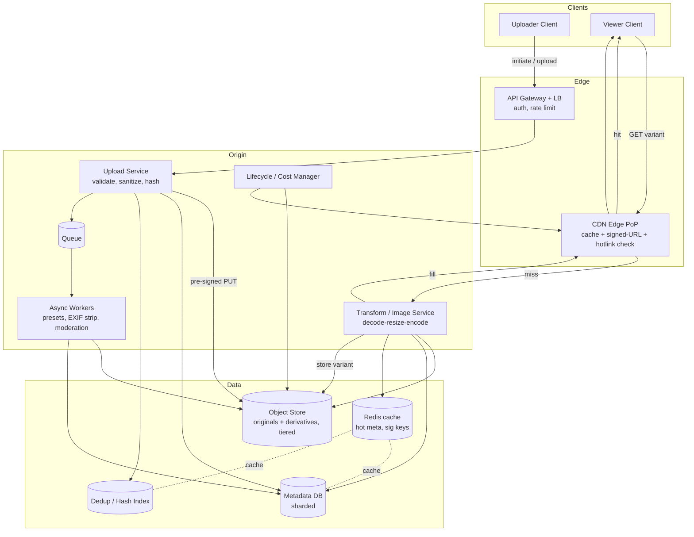
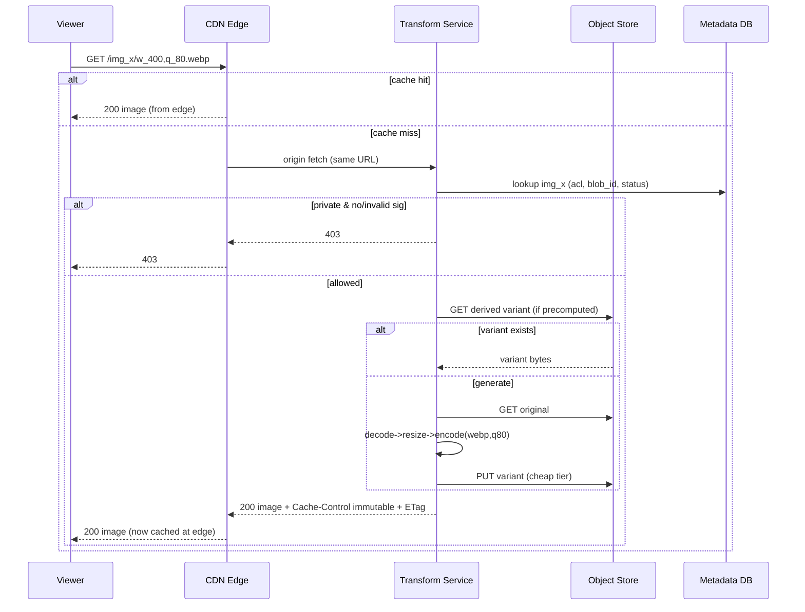

# Design an Image Hosting Service + CDN

> High-Level Design (HLD) reference and practice artifact — senior/staff system-design depth.
> Category: Media & Streaming.

---

## 1. Problem & Clarifying Questions

### 1.1 Restate the problem

We are asked to design an **image hosting service with a CDN** — think Imgur, Cloudinary, or the image platform behind a social network / e-commerce catalog. Users (or services) **upload** original images; the system **stores** them durably and cheaply; serves them **fast and globally** in many sizes/formats; and protects the originals from **abuse, hotlinking, and unauthorized access**. On the serving path, an **on-the-fly or precomputed transformation** layer produces resized/cropped/re-encoded variants, and a **CDN** (Content Delivery Network — a globally distributed cache of edge servers that serve content close to the user) absorbs the overwhelming majority of read traffic.

The interesting engineering is *not* "store a file and return a URL." It is: **deduplication at scale, a blob layout that survives billions of objects, a transformation layer that doesn't melt under a long tail of `?w=` query strings, a CDN cache-key and invalidation strategy that is correct under edits and deletes, and a cost model that doesn't bankrupt you when 90% of images are never viewed after week one.**

### 1.2 Clarifying questions I would ask the interviewer first

A senior answer earns its keep here. I will not draw a box until I know the shape of the load. I group questions into **functional**, **non-functional**, **scale**, and **out-of-scope / constraints**.

**Functional**

1. **Who uploads?** End users via a web/mobile app, or programmatic clients (other backend services, partners with API keys)? This determines auth model (session cookies vs API keys vs signed POST) and abuse surface.
2. **What is uploaded?** Only images, or also short GIFs/animated content? Max file size? Allowed formats on ingest (JPEG, PNG, WebP, HEIC, AVIF, SVG)? SVG is a security landmine (it can carry scripts) — I want to know early.
3. **What transformations must we support?** Just a fixed set of named presets (`thumbnail`, `avatar`, `feed`), or arbitrary on-the-fly params (`?w=&h=&fit=&format=&quality=`)? Arbitrary params explode the cache-key and variant space — this is a top-3 deep dive.
4. **Mutability:** Are images immutable once uploaded, or can a user *replace* the bytes behind a URL (e.g., "update my profile photo at the same URL")? Immutability massively simplifies caching; mutability forces an invalidation strategy.
5. **Deletes:** Hard delete (GDPR "right to be forgotten" — bytes must actually be erased) or soft delete (hide)? Legal deletes complicate dedup and CDN purge.
6. **Access control:** Are all images public (CDN-friendly), or are some private/per-user (requires signed URLs or token auth at the edge)?
7. **Metadata & search:** Do we need tagging, albums, EXIF extraction, search by user? Or is the metadata DB just a thin pointer table?
8. **Originals retrievable?** Must the user be able to download the pristine original, or only derived variants? Affects whether we keep originals hot.

**Non-functional**

9. **Latency targets?** I'll assume p99 < 50 ms for a CDN cache **hit**, and p99 < 300–500 ms for a cache **miss** that triggers an on-the-fly transform. Upload latency target?
10. **Availability?** Reads should be ~99.99% (people notice broken images instantly). Uploads can tolerate slightly less (99.9%) since they're retryable.
11. **Durability?** Originals are precious — target **11 nines (99.999999999%)**, i.e., object-store-grade. Derived variants are *recomputable*, so they can be far cheaper/less durable.
12. **Consistency model:** Read-after-write for *your own* uploads (you uploaded, you expect to see it). Cross-region/global propagation can be eventually consistent.
13. **Geography:** Global serving (multi-region CDN) or single-region? Where are the users concentrated?

**Scale**

14. **How many images uploaded/day, and total corpus size?**
15. **Read:write ratio?** Image platforms are extremely read-heavy.
16. **Average / p95 original file size?**
17. **Variants per image** (how many sizes/formats served per original)?
18. **Growth rate** — is the corpus doubling yearly?

**Out-of-scope / constraints**

19. Video? (Out of scope — different pipeline: transcoding ladders, HLS/DASH, far heavier.)
20. Image *editing UI*, ML tagging, face detection, content moderation pipeline depth — I'll touch moderation as a follow-up but not build the ML.
21. Billing/quotas exactness — I'll design the hooks, not the invoicing.

### 1.3 Assumptions I'll proceed with

Absent a live interviewer, I lock in a concrete, defensible set:

- **Mixed clients:** end users (web/mobile) + programmatic API clients.
- **Images + small animated GIFs.** Max ingest size **25 MB**. Accept JPEG/PNG/WebP/HEIC/GIF; **reject or sanitize SVG**.
- **Both** named presets *and* a constrained set of on-the-fly params (whitelisted width/height buckets, fit mode, format, quality) — not fully arbitrary.
- **Originals are immutable**; "replacing an image" produces a *new* image ID. (Profile-photo-style mutability handled by an indirection layer — covered in deep dives.)
- **Deletes are real** (GDPR-grade hard delete supported) but reference-counted because of dedup.
- **Mostly public images, with an optional private/signed-URL mode.**
- **Global serving** via a third-party or self-built CDN; origin in 2–3 regions.
- Scale (justified in §3): **~10 M uploads/day**, **read:write ≈ 1000:1**, **avg original 1.5 MB**, **~5 served variants/image**, multi-year corpus in the **tens of PB**.

---

## 2. Requirements (Finalized)

### 2.1 Functional

- **F1 — Upload:** Accept an image (direct or via pre-signed URL), validate type/size, strip dangerous metadata, deduplicate by content, persist the original durably, return a stable image ID + canonical URL.
- **F2 — Serve:** Given an image ID and optional transform parameters, return the appropriate variant (correct bytes, content-type, cache headers) with global low latency.
- **F3 — Transform:** Produce resized/cropped/re-encoded/format-converted variants, either precomputed for common presets or generated on demand for the long tail.
- **F4 — Metadata:** Store and return per-image metadata (owner, dimensions, format, size, created-at, content hash, status).
- **F5 — Delete / lifecycle:** Support soft delete (instant hide) and hard delete (true erasure), with reference counting for deduped blobs, and CDN purge.
- **F6 — Access control:** Public images by default; private images served only via short-lived **signed URLs**.
- **F7 — Abuse protection:** Hotlink protection (referer/origin checks, signed URLs), rate limiting, content-type/magic-byte validation, optional moderation hook.

### 2.2 Non-Functional

| Property | Target | Notes |
|---|---|---|
| **Read latency** | p50 < 20 ms, p99 < 50 ms on CDN hit; p99 < 400 ms on miss+transform | Hit path dominates. |
| **Write latency** | p99 < 1.5 s for upload ack (excluding async derivative generation) | Originals stored synchronously; derivatives can be lazy. |
| **Availability** | Reads 99.99%; writes 99.9% | Reads are user-facing and ubiquitous. |
| **Durability** | Originals 11 nines; derivatives recomputable (lower) | Don't pay 11-nine storage for regenerable bytes. |
| **Consistency** | Read-after-write for owner's own uploads; eventual globally | Acceptable: a thumbnail appears in the requesting region first. |
| **Scalability** | Linear with shards/edges; no single global bottleneck | |
| **Cost** | Aggressively tiered storage; CDN offload ≥ 95% | Cost *is* a first-class requirement at this scale. |
| **Security** | Signed URLs, no SVG script execution, metadata stripping (EXIF GPS), TLS everywhere | |

### 2.3 Explicit assumptions

- Read:write ratio **1000:1** (conservative for an image platform; can be higher).
- **95%+ of read bytes are served from the CDN edge** (cache hit ratio), so origin/transform load is a small fraction of nominal QPS.
- Variants are **deterministic** functions of (original bytes, transform spec) — same input → same output bytes. This is what makes content-addressing and caching sound.

---

## 3. Capacity Estimation (with arithmetic)

I always reason in round numbers, then sanity-check against reality. **Flag:** every figure below is an assumption; the *method* matters more than the exact constant in an interview.

### 3.1 Uploads (write path)

- Uploads/day = **10,000,000**.
- Seconds/day ≈ **86,400** ≈ round to **100,000** for mental math (≈ 86.4k).
- **Average write QPS** = 10,000,000 / 86,400 ≈ **116 uploads/sec**.
- **Peak factor** ~5× (diurnal + viral spikes) → **~580 uploads/sec peak**, call it **~600 wQPS**.

That's modest in *request* terms. The cost is in *bytes* and *derivative computation*, not request count.

### 3.2 Reads (serve path)

- Read:write = **1000:1** → reads/day = **10 B (10,000,000,000)**.
- **Average read QPS** = 10,000,000,000 / 86,400 ≈ **115,700/sec** ≈ **~116k rQPS**.
- Peak ~5× → **~580k rQPS**.
- **But ≥95% are CDN hits**, never touching origin. **Origin read QPS** = 5% × 116k ≈ **~5,800/sec average**, peak ~29k/sec. Of *those* misses, only a slice trigger an *on-the-fly transform* (the rest hit a precomputed/already-warm variant at origin) — say half → **~2,900 transforms/sec average, ~14.5k peak**.

This split is the single most important capacity insight: **the CDN converts a 580k-rQPS problem into a ~15k-transforms/sec problem.** Design the CDN tier as the load-bearing wall.

### 3.3 Storage — originals

- Avg original size = **1.5 MB**.
- Per day = 10,000,000 × 1.5 MB = **15,000,000 MB = 15 TB/day** (before dedup).
- **Dedup factor:** assume **15%** of uploads are exact duplicates (re-shares, re-uploads, memes, the same product photo across listings). Net stored ≈ **12.75 TB/day**.
- Per year = 12.75 TB × 365 ≈ **~4.65 PB/year** of originals.
- Over **5 years** ≈ **~23 PB** of originals (ignoring deletes; deletes claw some back but corpus grows).

### 3.4 Storage — derivatives

- ~5 served variants/image, but variants are small (thumbnails/feed sizes). Assume **derivatives total ≈ 0.5 MB/image** across all kept variants (most are tiny; we don't store the long-tail one-off transforms permanently — see deep dive).
- Per day ≈ 10,000,000 × 0.5 MB = **5 TB/day** ≈ **~1.8 PB/year**.
- Derivatives are **recomputable**, so we keep them on cheaper, lower-durability storage and aggressively expire cold ones.

**Total storage trajectory:** originals dominate. **Tens of PB within a few years** → mandates tiered storage (hot/warm/cold/archive) and lifecycle policies. This is deep dive #7 (cost).

### 3.5 Bandwidth

- **Egress (serving):** avg served object ≈ assume **200 KB** (most served bytes are *variants*, not originals — feeds show thumbnails). 116k rQPS × 200 KB ≈ **23.2 GB/s ≈ 185 Gbps average**, peak ~5× ≈ **~925 Gbps**.
- **≥95% from CDN edge**, so **origin egress** ≈ 5% × 23.2 GB/s ≈ **~1.16 GB/s ≈ ~9 Gbps average** (peak ~46 Gbps). Manageable for an origin fleet; the CDN eats the rest.
- **Ingress (uploads):** 600 wQPS peak × 1.5 MB ≈ **900 MB/s ≈ ~7.2 Gbps peak**. Fine.

### 3.6 Memory / cache sizing

- **Metadata cache (hot set):** Suppose 1% of images are "hot" in any window. Daily uploads 10M; active corpus that's frequently read maybe ~1–2 B images. Metadata row ≈ ~300 bytes. Caching 100 M hot metadata rows ≈ 100M × 300 B = **30 GB** — easily fits across a Redis/Memcached cluster.
- **Edge image cache:** governed by CDN provider footprint; we size for the *working set* of recently/frequently requested variants, typically the last few days of hot content.

### 3.7 Server / shard counts (rough)

- **Transform fleet:** ~14.5k transforms/sec peak. A single core doing a JPEG decode→resize→encode runs maybe **20–50 transforms/sec** (CPU-bound; depends on size). At 30/sec/core → **~480 cores peak**, plus headroom (2×) → **~1,000 cores ≈ ~60 machines** of 16 vCPU. Bursty long-tail → autoscale.
- **Metadata DB shards:** 23 PB of originals but metadata is small. ~ (5y × 10M/day × ~85% net) ≈ **~15.5 B image rows** × ~300 B ≈ **~4.6 TB** of metadata (+ indexes, call it ~10–15 TB). Shard into, say, **64–256 shards** of a horizontally scalable store; write QPS 600 peak is trivial; the point of sharding is *data volume + index size*, not QPS.
- **Upload/API tier:** stateless, autoscaled behind a load balancer; size to peak 600 wQPS + signing/validation overhead → tens of instances.
- **Object store:** managed (S3/GCS) or self-hosted Ceph; effectively "infinite" horizontally — we reason about *cost tiers*, not box counts.

**Summary of the numbers to remember:** ~116k avg rQPS / 580k peak; ~116 wQPS / 600 peak; ~95%+ CDN offload → ~6k origin reads/sec, ~3k transforms/sec avg; ~15 TB/day originals (~13 TB net after dedup); tens of PB corpus; ~185 Gbps avg egress (mostly CDN); metadata ~10–15 TB sharded.

---

## 4. API Design

REST/HTTPS for external clients; internal RPC (gRPC) between services. All endpoints are versioned (`/v1/...`), TLS-only, and authenticated (session cookie, API key, or signed URL depending on path).

### 4.1 Upload

Two upload modes. I prefer **direct-to-object-store via pre-signed URL** to keep large bytes off the API tier.

**(a) Request an upload slot (pre-signed):**
```
POST /v1/images:initiate
Authorization: Bearer <token> | ApiKey <key>
Body: {
  "filename": "cat.jpg",
  "content_type": "image/jpeg",
  "byte_size": 1532341,
  "sha256": "<client-computed hash, optional but recommended>"
}
200 OK: {
  "image_id": "img_8f3k...",          // reserved ID (pending)
  "upload_url": "https://uploads.../...",  // pre-signed PUT, short TTL
  "upload_method": "PUT",
  "expires_at": "2026-06-25T12:05:00Z",
  "dedup_hit": false                   // true if sha256 already known → skip upload
}
```
If `sha256` is supplied and already exists, server returns `dedup_hit: true` and **no `upload_url`** — the client skips the upload entirely (saves bandwidth). The client then calls `:finalize`.

**(b) Finalize:**
```
POST /v1/images/{image_id}:finalize
200 OK: {
  "image_id": "img_8f3k...",
  "canonical_url": "https://cdn.example.com/img_8f3k.jpg",
  "status": "processing" | "ready",
  "width": 4032, "height": 3024, "format": "jpeg", "byte_size": 1532341,
  "content_hash": "sha256:..."
}
```

**(c) Simple direct upload (small clients):**
```
POST /v1/images   (multipart/form-data, body = bytes)
202 Accepted: { same shape as finalize }
```

### 4.2 Serve / transform

Serving is a **GET on the CDN hostname**, not the API. The transform spec lives in the **path** (preferred for cache-key cleanliness) or whitelisted query params.

```
GET https://cdn.example.com/{image_id}/{transform}.{ext}
  e.g.  /img_8f3k/w_400,h_400,c_fill,q_80.webp
  or    /img_8f3k.jpg                       (original-ish, capped)

Headers (response):
  Content-Type: image/webp
  Cache-Control: public, max-age=31536000, immutable
  ETag: "sha256-of-variant"
  Vary: Accept            (only if doing content-negotiated format)
```

For **private** images:
```
GET https://cdn.example.com/{image_id}/{transform}.webp?exp=1750000000&sig=<hmac>
  401/403 if sig invalid or expired
```

### 4.3 Metadata & management

```
GET    /v1/images/{image_id}          -> metadata (owner-scoped or public)
DELETE /v1/images/{image_id}          -> soft delete (instant), schedules hard delete
GET    /v1/images?owner=me&cursor=... -> paginated list
POST   /v1/images/{image_id}:purge    -> force CDN purge (admin)
```

### 4.4 Idempotency

- `:initiate` and direct `POST /v1/images` accept an **`Idempotency-Key`** header. Retried with the same key + same body → same `image_id`, no duplicate row. Stored in a short-TTL idempotency table.
- Content addressing (sha256) provides a *second* idempotency layer: same bytes → same blob regardless of how many logical image IDs point at it.

---

## 5. High-Level Architecture

### 5.1 Component overview

- **CDN (edge):** Terminates TLS near users; caches variants; runs lightweight edge logic (signed-URL validation, hotlink referer checks, sometimes edge resizing). Cache hit → never touches origin.
- **Edge / API gateway + Load Balancer:** Routes uploads, signed-URL minting, metadata calls. Rate limiting, auth.
- **Upload Service:** Issues pre-signed URLs, validates, sanitizes, computes/verifies content hash, writes metadata, enqueues processing.
- **Object Store (blob):** Durable home for originals and persisted derivatives (S3/GCS/Ceph). Tiered (hot/warm/cold/archive).
- **Transform/Image Service (origin):** On cache miss, fetches original (or precomputed variant), produces the requested variant, writes it back, returns it. CPU-bound, autoscaled.
- **Metadata DB:** Sharded store of image rows (owner, hash, dims, status, refcount, ACL).
- **Dedup / Hash index:** Maps content hash → blob location + reference count.
- **Cache (Redis/Memcached):** Hot metadata + signed-URL keys + dedup lookups.
- **Async pipeline (queue + workers):** Generates standard presets, runs moderation, EXIF strip, format conversions, lifecycle transitions.
- **Lifecycle/Cost manager:** Moves cold blobs to cheaper tiers; garbage-collects unreferenced blobs after deletes.

### 5.2 ASCII block diagram

```
                                   ┌──────────────────────────────────────┐
        UPLOAD PATH                │              SERVE PATH                │
                                   └──────────────────────────────────────┘

  Client                                  Client (browser / app)
    │  POST :initiate                          │ GET cdn/img/w_400.webp
    ▼                                          ▼
 ┌──────────────┐                        ┌───────────────────────┐
 │ API Gateway  │                        │     CDN  EDGE PoP      │  <-- 95%+ hits stop here
 │ +LB +Auth+RL │                        │  cache + signed-URL    │
 └──────┬───────┘                        │  check + hotlink check │
        │ pre-signed PUT                 └───────────┬───────────┘
        ▼                                            │ MISS (origin fetch)
 ┌──────────────┐   put bytes   ┌──────────────┐     ▼
 │ Upload Svc   │──────────────▶│  OBJECT STORE │◀────────────┐
 │ validate/    │   metadata    │  (originals + │   read orig │
 │ sanitize/hash│──┐            │  derivatives) │   write deriv│
 └──────┬───────┘  │            └──────┬───────┘             │
        │ enqueue  │ write             │ tiered (hot/cold)   │
        ▼          ▼                   │                     │
 ┌──────────────┐ ┌──────────────┐     │            ┌─────────────────────┐
 │  QUEUE        │ │ METADATA DB   │◀───┘            │  TRANSFORM / IMAGE  │
 │ (presets,    │ │ (sharded) +   │   read meta     │  SERVICE (origin)   │
 │ moderation)  │ │ DEDUP/HASH idx│◀───────────────▶│  decode→resize→     │
 └──────┬───────┘ └──────┬───────┘                  │  encode, cache back │
        ▼                ▼                           └─────────────────────┘
 ┌──────────────┐ ┌──────────────┐
 │ Async WORKERS│ │ CACHE (Redis):│
 │ presets,EXIF │ │ hot meta,     │
 │ strip,format │ │ dedup, sigkeys│
 └──────────────┘ └──────────────┘
        │
        ▼
 ┌──────────────────────┐
 │ LIFECYCLE / COST MGR  │  tier transitions, refcount GC, CDN purge
 └──────────────────────┘
```

### 5.3 Mermaid diagram



### 5.4 Key sequence — upload with dedup

```mermaid
sequenceDiagram
  participant C as Client
  participant API as Upload Service
  participant HX as Hash Index
  participant OS as Object Store
  participant MDB as Metadata DB
  participant Q as Queue

  C->>API: POST :initiate {sha256, size, type}
  API->>HX: lookup(sha256)
  alt content already exists
    HX-->>API: blob_id, refcount++
    API-->>C: {image_id, dedup_hit:true}  (no upload_url)
    C->>API: :finalize
    API->>MDB: insert image row -> blob_id (ready)
    API-->>C: canonical_url, status: ready
  else new content
    HX-->>API: miss
    API-->>C: {image_id, upload_url (pre-signed PUT)}
    C->>OS: PUT bytes (direct)
    C->>API: :finalize
    API->>OS: HEAD verify size/type; read header for dims
    API->>API: re-hash bytes -> confirm sha256 (anti-spoof)
    API->>HX: register(sha256 -> blob_id, refcount=1)
    API->>MDB: insert image row (processing)
    API->>Q: enqueue {generate presets, strip EXIF, moderate}
    API-->>C: canonical_url, status: processing
  end
```

### 5.5 Key sequence — serve with on-the-fly transform



---

## 6. Data Model & Storage Choices

### 6.1 Entities

**`images` (logical image — the user-facing object)**

| Field | Type | Notes |
|---|---|---|
| `image_id` | string (ULID/snowflake-ish) | Primary key; opaque, sortable. |
| `owner_id` | string | For ACL & listing; shard key candidate. |
| `content_hash` | string (sha256) | Points into dedup/blob layer. |
| `blob_id` | string | Physical blob reference (object-store key). |
| `width`, `height` | int | From decode at ingest. |
| `format` | enum | jpeg/png/webp/heic/gif. |
| `byte_size` | int | Original size. |
| `status` | enum | pending/processing/ready/quarantined/deleted. |
| `visibility` | enum | public/private. |
| `created_at`, `updated_at` | ts | |
| `metadata` | JSON | EXIF-derived safe subset, caption, etc. |

**`blobs` / dedup index (physical content)**

| Field | Type | Notes |
|---|---|---|
| `content_hash` | string (sha256) | Primary key. |
| `blob_id` | string | Object-store key / location. |
| `byte_size` | int | |
| `refcount` | int (atomic) | Number of `images` rows referencing it. |
| `storage_tier` | enum | hot/warm/cold/archive. |
| `last_access_at` | ts | Drives tiering. |

**`derivatives` (persisted variants — optional table; many systems store these only in the object store keyed by hash)**

| Field | Type | Notes |
|---|---|---|
| `variant_key` | string | `content_hash + normalized_transform_spec`. |
| `blob_id` | string | Variant location. |
| `bytes`, `format` | int/enum | |
| `created_at`, `last_access_at` | ts | For cold-variant GC. |

### 6.2 Object-store key layout

**Critical decision: never store millions of objects in one flat prefix.** Object stores partition by key prefix; a hot prefix throttles. Use **content-hash-derived sharded prefixes**:

```
originals/  ab/cd/abcd1234...{hash}        # first 2-4 hex chars = fan-out
variants/   ab/cd/{hash}/w_400,q_80,webp
```

- **Why hash-prefixed, not date- or user-prefixed:** spreads writes uniformly across partitions (avoids hot-spotting today's date prefix), and makes the layout **content-addressed** — the key *is* the identity, which is exactly what dedup needs. A date prefix would funnel every upload into one partition and throttle.
- Variants are nested under their original's hash so deleting the original GCs its derivatives by prefix scan.

### 6.3 Which datastore, and why

| Concern | Choice | Why (against the access pattern) | Failure mode avoided |
|---|---|---|---|
| **Original/variant bytes** | Object store (S3/GCS/Ceph) | Built for large immutable blobs, 11-nines durability, infinite horizontal scale, native tiering & lifecycle, cheap at PB scale. A DB or filesystem would die at tens of PB. | Running out of inodes/space; no durability guarantees; hot-spotting. |
| **Metadata (`images`)** | Horizontally sharded NoSQL/NewSQL (e.g., DynamoDB, Cassandra, or a Vitess/CockroachDB SQL) keyed by `image_id`, secondary index by `owner_id` | Access is **key-value point lookups** (by image_id) + **owner listing** (by owner, paginated). Tiny rows, huge count (15B+), high read but cache-fronted. Need linear shard scaling, not joins. | A single Postgres can't hold 15B rows + index at this QPS without painful manual sharding; relational joins aren't needed. |
| **Dedup / hash index** | Same sharded KV store (or dedicated table) keyed by `content_hash`; refcount via atomic counter / conditional write | Need fast `exists(hash)` + atomic `refcount++/--`. Strong consistency on the counter is required for correct GC. | Lost-update on refcount → premature delete (data loss) or leaked blobs (cost). Use atomic increments / CAS. |
| **Hot cache** | Redis (or Memcached) | Sub-ms metadata + signed-key + dedup lookups; offloads metadata DB. | Metadata DB read storm; every CDN miss hitting DB. |
| **Async work** | Durable queue (SQS/Kafka/PubSub) | Decouple slow derivative gen/moderation from upload ack. | Upload latency coupled to image processing; lost work on crash. |

**Why content-addressed storage (CAS) is the spine:** by keying blobs on `sha256(bytes)`, dedup, integrity verification (re-hash on read), and idempotency all fall out for free. The only added complexity is **reference counting** for deletes — covered in §7.

---

## 7. Deep Dives (the hard parts)

I spend the bulk of the doc here. Five sub-problems: **(7.1) upload pipeline + dedup**, **(7.2) transform: on-the-fly vs precomputed**, **(7.3) CDN cache keys & invalidation**, **(7.4) hotlinking / abuse / signed URLs**, **(7.5) storage tiering & cost (incl. delete/GC)**.

---

### 7.1 Deep Dive — Upload Pipeline + Deduplication (content hashing)

**Problem:** Accept untrusted bytes, validate and sanitize them, avoid storing the same content twice, and acknowledge the upload quickly — all while keeping originals durable and the system idempotent under retries.

**The pipeline (steps and where each runs):**

1. **Initiate** (API tier): authenticate, rate-limit, optionally accept a client-computed `sha256`.
2. **Dedup pre-check** (against hash index): if hash known, short-circuit — no byte transfer. *Failure mode avoided:* paying ingress + storage for a meme uploaded a million times.
3. **Direct-to-store upload** via pre-signed URL: bytes go **client → object store**, bypassing the API tier. *Failure mode avoided:* API fleet becoming a bandwidth bottleneck / single point of buffering for 25 MB files.
4. **Finalize + verify** (Upload Service):
   - **Re-hash server-side** (or trust object-store's checksum) — never trust client's claimed hash for dedup identity, because a malicious client could claim someone else's hash to "poison"/hijack a blob. *Failure mode avoided:* dedup spoofing / unauthorized content substitution.
   - **Magic-byte / content sniffing:** verify the bytes are actually the declared type (don't trust `Content-Type`). *Failure mode avoided:* an HTML/JS payload served as `image/*` → XSS, or a "decompression bomb."
   - **Decode-bomb guard:** cap decoded pixel dimensions (e.g., reject > 100 MP) before full decode. *Failure mode avoided:* a 50 KB PNG that decodes to 30 GB of pixels OOMs the worker.
   - **EXIF strip / sanitize:** remove GPS and camera serials (privacy) and any embedded thumbnails. *Failure mode avoided:* leaking a user's home coordinates.
   - **SVG handling:** reject, or sanitize with a strict allowlist (no `<script>`, no external refs) and serve with `Content-Disposition`/CSP. *Failure mode avoided:* stored XSS via SVG.
5. **Register**: create/increment `blobs[hash].refcount`; insert `images` row (`status=processing`).
6. **Enqueue** async jobs: generate standard presets, run moderation, produce `webp/avif` variants. Ack to client now (`status=processing`); presets fill in shortly.

**Dedup design choices:**

| Question | Options | Decision & rationale |
|---|---|---|
| Hash algorithm | MD5, SHA-1, SHA-256, BLAKE3 | **SHA-256** (collision-safe; MD5/SHA-1 are broken and an attacker could craft a collision to substitute content). BLAKE3 fine if perf matters. *Avoids:* malicious collision → wrong bytes served. |
| Exact vs perceptual dedup | exact (byte-hash) / perceptual (pHash) | **Exact for storage dedup.** Perceptual hashing is for *similarity*/abuse detection, not storage identity — two visually-identical-but-re-encoded JPEGs are different bytes and must be stored separately (we can't reconstruct one from the other). *Avoids:* lossy "dedup" that corrupts users' originals. |
| Where to dedup | per-user / global | **Global** content store, **per-user logical mapping.** Many users can reference the same blob; ACL lives on the `images` row, not the blob. *Avoids:* N copies of the same viral image. |
| Refcount integrity | best-effort / atomic / transactional | **Atomic conditional increments** (DynamoDB `ADD`, or CAS). On delete, decrement; GC only at refcount==0 after a grace period. *Avoids:* lost-update → deleting a blob still referenced by others (data loss) or leaking blobs forever (cost). |

**Dedup privacy caveat (senior signal):** global cross-user dedup lets a user *probe existence* — "if I claim hash H and get `dedup_hit:true`, someone already uploaded H." For sensitive deployments, either (a) require actual upload + server-side hash before confirming dedup, or (b) scope dedup per-tenant. I'd disable the pre-upload `dedup_hit` shortcut for private/sensitive tiers.

---

### 7.2 Deep Dive — Image Transformation: On-the-fly vs Precomputed

**Problem:** Serve many sizes/formats/crops. Naïvely precomputing every (size × format × quality × crop) combination for every image is a **combinatorial storage explosion**; naïvely transforming everything on the fly **burns CPU and adds latency on every miss**. The art is the hybrid.

**Options:**

| Strategy | How | Pros | Cons / failure mode |
|---|---|---|---|
| **Eager precompute (all variants at upload)** | Generate every preset on ingest | Serve is pure cache hit; predictable CPU at write time | **Storage blowup** + wasted compute for variants never viewed (90% of images barely viewed). Adds upload latency. |
| **Pure on-the-fly** | Generate per request on CDN miss | Zero wasted storage; arbitrary params possible | CPU spikes; **cold-miss latency**; same variant recomputed if cache evicts; long-tail `?w=` params can be weaponized (cache-buster DoS). |
| **Hybrid (precompute hot presets + on-the-fly for tail, cache-back)** | Precompute a *small* set of common presets async; everything else generated on first request and **written back** to object store + CDN | Bounded storage; tail handled; second request is cheap | Slightly complex; needs param whitelist + cold-variant GC |

**Decision: Hybrid, with a whitelisted parameter space and write-back caching.**

- **Precompute** only a handful of universally-needed presets (e.g., feed thumb, avatar, a couple of responsive widths) asynchronously after upload. These are guaranteed warm and cheap.
- **On-the-fly + write-back** for everything else: first request generates, stores the variant under `variants/<hash>/<normalized-spec>`, and fills the CDN. Subsequent requests for the same spec are cache hits. *Failure mode avoided:* recomputing the same popular variant on every edge miss (thundering CPU).
- **Whitelist / bucket the parameters.** Do **not** honor arbitrary `?w=` values. Snap widths to a fixed ladder (e.g., 64, 128, 256, 400, 800, 1080, 1600), restrict formats to {jpeg, webp, avif}, quality to a few buckets, fit modes to an enum. *Failure mode avoided:* an attacker requesting `?w=401, 402, 403...` to (a) bust the CDN cache and (b) force infinite distinct transforms — a **cache-poisoning / compute-DoS**. Requests outside the whitelist → 400 or snap-to-nearest-allowed.

**Where to run transforms:** options are **origin transform fleet**, **edge/serverless functions at the CDN**, or **client-side** (`srcset`). I default to an **origin transform fleet** (predictable libraries — libvips/sharp for memory-efficient streaming resize, NOT ImageMagick which is heavier and historically CVE-prone), with **edge transforms** as an optimization for the very hottest content. *Why libvips:* it streams and uses far less RAM than ImageMagick on large images — important given decode-bomb risk and per-instance memory limits.

**Format negotiation (WebP/AVIF):** modern formats are 25–50% smaller. Two approaches: (a) **explicit format in the URL/path** (`.webp`) — best for cache cleanliness, client picks via `<picture>`/`srcset`; or (b) **content negotiation via `Accept` header + `Vary: Accept`** — convenient but `Vary` fragments the CDN cache and some CDNs handle it poorly. **Decision: prefer explicit format in the path; offer `Accept`-negotiation only where the CDN supports normalized `Vary`.** *Failure mode avoided:* `Vary: Accept` exploding into dozens of cache entries per object and tanking hit ratio.

**Latency budget on a cold miss:** origin fetch original (~10–40 ms) + decode+resize+encode (~30–150 ms for a typical image) + write-back (async, off the critical path) → comfortably under the 400 ms p99 miss target. We keep originals on a **hot tier** specifically so transform inputs are fast to fetch.

---

### 7.3 Deep Dive — CDN Caching, Cache Keys, and Invalidation

**Problem:** The CDN carries 95%+ of traffic. Get the **cache key** wrong and you either serve the wrong image or destroy your hit ratio. Get **invalidation** wrong and deleted/edited images linger globally for a year.

**Cache key design:**

- **Key = normalized request URL** = host + path (`/img_x/w_400,q_80,webp`). Because the transform spec is in the **path** and parameters are **whitelisted/normalized**, the key space is bounded and clean.
- **Strip/ignore unknown query params** at the edge (don't let `?utm=...` or `?cachebust=123` fragment the cache). Configure the CDN to key only on whitelisted params. *Failure mode avoided:* marketing/tracking params silently halving hit ratio.
- **Don't `Vary` on cookies or random headers.** Only `Vary: Accept` if doing format negotiation (and prefer not to — see 7.2).

**Immutability is the superpower:** since originals are immutable and a variant is a pure function of (immutable content + normalized spec), every served object can carry:
```
Cache-Control: public, max-age=31536000, immutable
```
A one-year, immutable cache. The browser and the edge never need to revalidate. *This is what makes 95%+ offload achievable.* But it raises the stakes for **invalidation** — if it's immutable for a year, how do we ever change or remove it?

**Invalidation strategies (the crux):**

| Strategy | Mechanism | Pros | Cons / failure mode |
|---|---|---|---|
| **Versioned/content-addressed URLs (preferred)** | URL embeds content hash or version (`/img_x/v3/...` or `/<hash>/...`) | "Invalidation" = publish a new URL; old one harmlessly expires. No purge needed. Scales infinitely. | Requires the app to reference current URL via an indirection layer. |
| **Explicit purge / invalidation API** | Call CDN purge for a URL or tag | Precise; needed for hard delete / takedowns | Purge is **eventually consistent and slow** (seconds–minutes globally), rate-limited, and can be costly. Don't rely on it for routine updates. |
| **Short TTL + revalidate (ETag)** | Low max-age, conditional GETs | Fresh content quickly | Kills hit ratio; defeats the immutable model. Only for genuinely mutable endpoints. |
| **Cache tags / surrogate keys** | Tag objects (e.g., by owner or campaign), purge by tag | Bulk invalidation (purge all of a user's images) | Provider-specific; still eventually consistent. |

**Decision: version-in-the-URL as the default ("cache-bust by renaming"), explicit purge only for deletes/takedowns/legal, cache tags for bulk owner-level purges.**

- **Mutability handled by indirection:** if a profile photo must "change at the same logical URL," we serve a **short-TTL pointer** (`/users/u123/avatar` → 302/rewrite to the current immutable `/<hash>/...` URL, or an app-level lookup). The *pointer* has a short TTL (or is uncached); the *image* stays immutable and long-cached. *Failure mode avoided:* having to purge billions of immutable objects whenever someone changes an avatar.
- **Hard delete / takedown:** mark `images.status=deleted` (instant logical hide), then **issue a CDN purge** for that object/tag, and finally GC the blob if refcount hits zero. Because purge is eventually consistent, we also have the origin return **404/410** immediately so any edge revalidation or new PoP fetch fails closed. *Failure mode avoided:* a court-ordered takedown still being served from a cold edge for an hour.

**Cache-hierarchy & origin shielding:** put a **mid-tier "origin shield"** (a single regional cache layer between edge PoPs and origin) so a cold object is fetched from origin **once**, not once per PoP. *Failure mode avoided:* a viral image causing 200 edge PoPs to simultaneously stampede the origin (thundering herd). Combine with **request coalescing** (the CDN/origin collapses concurrent identical misses into one origin fetch).

---

### 7.4 Deep Dive — Hotlinking, Abuse Protection, and Signed URLs

**Problem:** Public images are trivially **hotlinked** (embedded on other sites, stealing your bandwidth) and **scraped/DoS'd**. Private images need access control enforced **at the edge** (you can't route every read through your auth service — that defeats the CDN). And the transform endpoint is a tempting **compute-DoS** target.

**Threats & defenses:**

| Threat | Defense | Notes / failure mode avoided |
|---|---|---|
| **Hotlinking** (other sites embed your URLs) | Edge **Referer/Origin allowlist**; **signed URLs** for sensitive assets; per-token bandwidth quotas | Referer is spoofable → not sufficient alone; signed URLs are the real control. *Avoids:* paying egress for someone else's traffic. |
| **Unauthorized access to private images** | **Signed URLs**: HMAC over (path + expiry [+ client IP/UA]); edge validates signature & expiry before serving | No origin/auth round-trip on each read. *Avoids:* private medical/ID photos leaking via guessable URLs. |
| **Compute-DoS via transform params** | Parameter **whitelist + buckets** (7.2); per-IP/key **rate limits**; cost-based throttling; require signed URLs to even request transforms | *Avoids:* `?w=1..10000` forcing 10k unique transforms. |
| **Scraping / enumeration** | **Unguessable image IDs** (random ULID, not sequential); rate limit listing; bot detection | *Avoids:* walking IDs to download the whole corpus. |
| **Malicious uploads** (XSS, bombs) | Magic-byte validation, decode-bomb caps, EXIF strip, SVG sanitize/reject (see 7.1) | Defense at ingest. |
| **CSRF / token replay on upload** | Idempotency keys, short-TTL pre-signed PUTs, scoped credentials | Pre-signed URL is single-use-ish, short TTL, single object. |

**Signed URL design (the centerpiece):**
```
https://cdn.example.com/<hash>/w_400,q_80.webp?exp=<unix>&kid=<keyid>&sig=<HMAC>
sig = HMAC_SHA256( secret[kid], path + "?exp=" + exp [+ allowed_ip] )
```
- **Edge validates** `sig` and `exp` (and optionally client IP) using a shared secret distributed to the CDN edge logic. Invalid/expired → 403. No origin call.
- **Short expiry** (minutes–hours) limits leak window. *Failure mode avoided:* a leaked URL granting permanent access.
- **Key rotation:** `kid` lets us rotate signing keys without invalidating in-flight URLs (verify against current + previous key during overlap). *Failure mode avoided:* a global URL outage on rotation.
- **Tradeoff:** signed URLs are not cacheable across users if the signature is part of the cache key. **Fix:** key the CDN cache on the *path only* (ignore `exp/sig` in the cache key) while still *validating* the signature at the edge. So the bytes are shared in cache, but each viewer needs their own valid signature to be served. *Failure mode avoided:* either (a) un-cacheable private images, or (b) caching by full signed URL → cache misses per signature.

**Rate limiting:** token-bucket per API key and per IP at the gateway for uploads/metadata; at the edge for reads. Separate, stricter budget for transform-triggering (miss-path) requests since they cost CPU. **Abuse/moderation hook:** async classifier flags illegal content → `status=quarantined` → origin returns 451/404 and a purge is issued.

---

### 7.5 Deep Dive — Storage Tiering, Cost Optimization, and Delete/GC

**Problem:** Tens of PB, growing ~5 PB/year, where **~90% of images are barely read after the first week**. Paying hot-tier prices for cold data is the dominant avoidable cost. Meanwhile deletes must be *correct* under dedup.

**Access pattern reality:** image popularity is extremely **long-tailed and time-decaying**. A photo is hot for hours–days, then cold forever (with rare resurgence). This is the textbook case for **tiered storage with lifecycle automation.**

**Tier model:**

| Tier | Use | Latency | Relative cost | Policy |
|---|---|---|---|---|
| **Hot** (standard object store) | New originals + recently/frequently accessed; transform inputs | ms | 1× | First 30–90 days, or `last_access` recent. |
| **Warm** (infrequent-access tier) | Not accessed in ~30–90 days | ms (higher retrieval fee) | ~0.5× storage, retrieval fee | Auto-transition by lifecycle rule. |
| **Cold / Archive** (Glacier-class) | Originals not touched in ~180+ days | minutes–hours to restore | ~0.1–0.2× | Originals only; never variants (variants are recomputable, just delete them). |
| **Derived/variant store** | Generated variants | ms | cheaper, lower durability | Aggressively GC variants not accessed in N days — they're recomputable. |

**Key cost decisions and the failure modes they avoid:**

- **Never archive variants** — they are pure functions of originals; recompute is cheaper than archival storage + retrieval. *Avoids:* paying to keep regenerable bytes.
- **Keep originals on hot tier *only while transform inputs are likely needed.*** Once all standard variants exist and access is cold, the original can go to cold/archive — a cold-tier original is only needed if someone requests a *new* (uncached) variant, which is rare for cold content and can tolerate a restore delay (or we serve a slightly-degraded already-cached variant). *Avoids:* paying hot price for the 90% cold corpus.
- **Lifecycle automation, not manual:** object-store lifecycle policies (age/last-access based) do transitions; a custom **Lifecycle Manager** handles anything policy can't express (e.g., "keep hot if owner is a paying tier"). *Avoids:* humans-in-the-loop at PB scale.
- **Compression at rest:** store originals as-is (already compressed), but generate efficient variant formats (AVIF/WebP) to cut **egress** — which at ~185 Gbps is itself a massive cost line. CDN offload (95%+) is the #1 egress-cost lever; format efficiency is #2.

**Delete & garbage collection under dedup (the tricky correctness part):**

1. **Soft delete:** `images.status=deleted` → instant hide; origin returns 404/410; CDN purge issued. The user perceives immediate deletion.
2. **Refcount decrement:** decrement `blobs[hash].refcount` atomically.
3. **GC eligibility:** only when `refcount == 0` **and** a **grace period** has elapsed (guards against races where a concurrent upload is mid-incrementing the same hash). *Failure mode avoided:* deleting a blob a millisecond before another user's `:finalize` claims it (data loss).
4. **Two-phase GC / tombstone-then-sweep:** a background sweeper finds `refcount==0` blobs older than the grace period, marks a tombstone, double-checks refcount, then deletes bytes + their variant prefix. *Failure mode avoided:* leaked blobs (cost) or premature deletes (loss). Mark-and-sweep with a generous grace window is the safe middle ground vs. immediate delete-on-zero.
5. **GDPR hard delete:** for legal erasure, even deduped content must be removed — but if `refcount>1`, others legitimately reference identical bytes. **Resolution:** legal erasure deletes the *requesting user's logical reference and metadata immediately*; the shared bytes are removed only when the last reference drops (the bytes themselves aren't personal data once detached from the person — but if policy demands, we can **per-user-encrypt** originals with a user-specific key so "delete" = destroy the key, rendering bytes unrecoverable instantly even while shared ciphertext lingers — crypto-shredding). *Failure mode avoided:* either violating "right to be forgotten" or destroying other users' lawful copies.

---

## 8. Scaling & Bottlenecks

**How it scales (each tier independently):**

- **CDN/edge:** scales with provider PoPs; the primary scaling mechanism. Raising hit ratio (immutable caching, normalized keys, origin shield) is cheaper than adding origin capacity.
- **Transform fleet:** stateless, **autoscale on CPU/queue depth**. Scales horizontally; warm-pool for burst.
- **Upload/API tier:** stateless behind LB; autoscale on rQPS.
- **Metadata DB:** shard by `image_id` (point lookups) with a global secondary index / separate table for `owner_id` listings; add shards as row count grows. Cache fronts read load.
- **Object store:** effectively infinite; scale by **key-prefix fan-out** to avoid partition hot spots.

**Where it breaks first, and the fix:**

| Bottleneck | Symptom | Fix |
|---|---|---|
| **Origin thundering herd** on a viral cold image | 200 PoPs stampede origin/transform | **Origin shield** mid-tier + **request coalescing**; precompute hot presets. |
| **Transform CPU saturation** during spikes | rising miss latency, queue backlog | Autoscale; libvips streaming; precompute popular variants; cap/whitelist params. |
| **Cache hit-ratio collapse** | origin egress & cost spike | Normalize cache keys, strip unknown params, avoid `Vary`, immutable headers, version-in-URL. |
| **Object-store prefix hot spot** | write throttling (503s) on a prefix | Hash-prefixed keys (already in design) spread load uniformly. |
| **Metadata hot shard** (a celebrity/owner) | one shard saturates | Cache hot rows in Redis; for listing, paginate; consider key-salting for mega-owners. |
| **Dedup index contention** on a viral hash | refcount counter hotspot | Atomic counters are cheap, but a single super-viral hash can hotspot — shard the counter (N sub-counters summed) if needed. |
| **Egress cost** (not a latency bottleneck but a *cost* bottleneck) | bill grows faster than traffic | Maximize CDN offload; serve AVIF/WebP; right-size default variant. |

**Multi-region:** originals replicated across 2–3 regions (object-store cross-region replication) for durability + locality; metadata DB multi-region with the consistency model from §9. Transform fleets per region. CDN is global by nature.

---

## 9. Reliability, Consistency & Security

### 9.1 Reliability / failure handling

- **Stateless origin tiers** + multiple AZs/regions behind LB; instance death is invisible.
- **Object store** provides durability (11 nines) and cross-region replication; we treat it as the source of truth for bytes.
- **Async pipeline** uses a **durable queue** with retries + **DLQ (dead-letter queue)** for poison messages (e.g., an image that always crashes the encoder). *Failure mode avoided:* one bad image blocking the pipeline forever.
- **Upload acks before derivatives exist** (`status=processing`); serving a not-yet-generated variant triggers on-the-fly generation, so there's no hard dependency on the async pipeline for correctness — only for warmth.
- **Graceful degradation:** if the transform fleet is overloaded, serve the nearest already-cached variant (e.g., a slightly larger size downscaled by the browser) rather than 500. If metadata DB is degraded, serve from cache and fail closed for writes.
- **Idempotent operations** (idempotency keys + content addressing) make all retries safe.

### 9.2 Consistency model

- **Bytes (object store):** read-after-write within a region for new keys (typical of modern object stores); cross-region replication is eventual.
- **Metadata:** **read-your-writes for the owner** is required (you upload, you must see it) — achieve via routing the owner's reads to the primary/leader shard or session-pinned cache, or by returning the freshly-written row from the write path. Cross-region/global visibility is **eventual** (acceptable: a friend in another region sees the image a few seconds later).
- **Dedup refcount:** **strongly consistent** (atomic conditional writes) — correctness of GC depends on it. This is the one place we pay for strong consistency.
- **Cache:** TTL + explicit invalidation on writes/deletes; we accept brief staleness on *mutable pointers* (short TTL) but rely on immutability everywhere else so staleness can't serve *wrong* content.

### 9.3 Security

- **TLS everywhere**; HSTS.
- **Ingest hardening:** magic-byte check, decode-bomb caps, EXIF/GPS strip, SVG sanitize/reject (§7.1).
- **Serving:** signed URLs for private content, edge signature validation, key rotation via `kid`, hotlink referer allowlists, unguessable IDs.
- **AuthN/AuthZ:** sessions/OAuth for users, scoped API keys for services; ACL on `images` row enforced at origin and (for private) at the edge.
- **Rate limiting & quotas:** per key/IP, stricter on miss-path/transform requests.
- **Abuse/moderation:** async classifier → quarantine + purge for illegal content; audit log of takedowns.
- **Tenant isolation & least privilege:** pre-signed URLs scoped to a single object, short TTL; workers have minimal IAM scopes.
- **Privacy / GDPR:** EXIF strip, hard-delete path, optional crypto-shredding for instant erasure of deduped content.

---

## 10. Extensions & Follow-ups

How the design bends when the interviewer adds requirements:

1. **"Now support video."** Different beast: chunked/resumable uploads, **transcoding ladders** (multiple bitrates), packaging into **HLS/DASH** segments, far larger storage/egress, longer processing. Reuse: object store, CDN, metadata, signed URLs, tiering. Add: a transcode pipeline (GPU/CPU farm), segment-aware caching.
2. **"Arbitrary, unbounded transforms (true Cloudinary)."** Relax the whitelist but defend with: signed transform URLs (only your app can mint them, so no attacker-driven param explosion), per-account compute quotas, and aggressive variant GC.
3. **"Strong global consistency for edits."** Move to version-in-URL universally (already the default), making "edit" = new URL; the consistency problem dissolves because nothing mutates in place.
4. **"On-the-fly AI features (auto-crop to face, background removal, alt-text)."** Add ML services invoked on the async pipeline (precompute smart-crop variants) or on-the-fly for premium tiers; cache results like any variant.
5. **"Private-by-default enterprise tenant."** Disable cross-user dedup (privacy probing), per-tenant encryption keys, all serving via signed URLs, tenant-scoped buckets, stricter audit.
6. **"Cut the CDN bill 30%."** Raise hit ratio (key normalization, immutable headers, origin shield), push more traffic to AVIF, right-size default variants, multi-CDN with cost-based steering, tiered originals, regional edge caching of hot working set.
7. **"Resumable / huge uploads (mobile, flaky networks)."** Multipart/resumable upload protocol (tus-style or multipart object-store uploads), client-side chunk hashing for resume.
8. **"Image search / similarity / dedup of near-duplicates."** Add **perceptual hashing (pHash)** + a vector index (ANN) — but keep it *separate* from storage dedup (which stays exact, §7.1).
9. **"Multi-CDN / CDN failover."** DNS- or app-level steering across two CDNs; shared origin shield; health-based failover. Watch cache-warmth fragmentation across CDNs.
10. **"Cost attribution / per-tenant billing."** Tag storage + egress by tenant (cache tags, request logs), meter signed-URL issuance and transform compute.

---

## 11. Interview Q&A

**Q1. Why a CDN, and what hit ratio are you targeting — and how do you hit it?**
A. The CDN converts a ~580k-peak-rQPS, ~185 Gbps problem into a ~6k-origin-reads/sec, ~9 Gbps problem. Target **95%+ offload** via **immutable, year-long `Cache-Control`** (safe because variants are pure functions of immutable content), **normalized cache keys** (whitelisted params, strip tracking query strings, avoid `Vary`), an **origin shield** to prevent per-PoP stampedes, and **version-in-URL** so we never need short TTLs.
*Probe — what kills your hit ratio?* Unbounded `?w=` params (cache-buster DoS), `Vary: Accept` fragmenting per-format, cookies in the cache key, and signing the cache key (fix: key on path, validate signature separately).

**Q2. On-the-fly vs precomputed transforms — defend your choice.**
A. **Hybrid.** Precompute a *small* set of guaranteed-hot presets async; generate the long tail on-the-fly with **write-back** so the second request is a hit. Bound the param space with a **whitelist/ladder**. Pure precompute → storage/compute blowup for the 90% rarely-viewed images; pure on-the-fly → CPU spikes, cold-miss latency, and weaponizable param explosion. The hybrid bounds both storage and compute.
*Probe — what stops a compute-DoS?* Whitelisted size ladder + signed transform URLs + stricter rate limits on the miss path + request coalescing.

**Q3. How does deduplication work, and how do deletes stay correct under it?**
A. **Content-addressed storage:** key blobs by `sha256(bytes)`; many logical `images` point to one blob; `refcount` per blob. Delete = soft-hide + decrement refcount; **GC only at refcount==0 after a grace period** via mark-and-sweep. Use **atomic** counter ops to avoid lost-update races. SHA-256 (not MD5/SHA-1) to prevent collision-based substitution. Re-hash server-side to prevent dedup spoofing.
*Probe — GDPR hard delete of shared bytes?* Delete the user's reference + metadata instantly; for true byte-erasure under sharing, **crypto-shred** (per-user key; destroy key → bytes unrecoverable). *Probe — viral-hash counter hotspot?* Shard the counter into N sub-counters.

**Q4. How do you serve *private* images without an origin round-trip per read?**
A. **Signed URLs**: HMAC over (path + expiry [+ IP]) validated **at the edge**; invalid/expired → 403, no origin call. Short expiry limits leak window; `kid` enables key rotation. **Key the CDN cache on the path only** (ignore `sig/exp`) so identical bytes are shared in cache while each viewer still needs a valid signature — avoids both un-cacheable private images and per-signature cache misses.
*Probe — what if a signed URL leaks?* Short TTL caps exposure; optionally bind to client IP; revoke by rotating `kid`.

**Q5. (Senior-signal) Why object store for bytes and a sharded KV/NewSQL for metadata rather than one database?**
A. Bytes are large, immutable, and number in the tens of PB — object stores give 11-nine durability, native tiering, and infinite horizontal scale; a DB/filesystem dies there. Metadata is tiny rows in the billions with **point lookups + owner listings**, no joins — a sharded KV/NewSQL scales linearly and is cache-frontable. Mixing them would force one store to do something it's bad at (a DB holding PB of blobs, or an object store doing indexed queries). **Right tool per access pattern.**

**Q6. (Senior-signal) Defend immutable originals + version-in-URL vs allowing in-place edits.**
A. Immutability makes variants pure functions of (content, spec), which is what enables year-long immutable CDN caching and content-addressed dedup. In-place edits would force global purges (eventually consistent, slow, rate-limited) on every change and break dedup identity. **Version-in-URL** turns "edit" into "publish a new URL," and a short-TTL **pointer** handles "same logical URL, new bytes" (e.g., avatars). Failure mode avoided: purging billions of objects whenever a user changes a photo.

**Q7. (Senior-signal) Where does this design break first under 10× growth, and what do you change?**
A. First pain is **origin/transform stampede on viral cold content** and **CDN egress cost**, then **metadata hot shards**. Fixes in order: origin shield + request coalescing + precompute hot presets; raise hit ratio + AVIF + multi-CDN cost steering; cache hot metadata + salt mega-owner keys + shard viral dedup counters. Object store and stateless tiers scale by config; the *judgment* is recognizing that the bottleneck is cache-efficiency and stampede control, not raw box count.

**Q8. How do you keep uploads safe and fast?**
A. **Direct-to-store via pre-signed URL** (bytes bypass the API tier); **dedup pre-check** to skip transfer for known content; **server-side re-hash**, **magic-byte validation**, **decode-bomb caps**, **EXIF strip**, **SVG sanitize/reject** at finalize; ack as `processing` and generate presets async. Idempotency keys + content addressing make retries safe.
*Probe — decode bomb?* Cap declared and decoded pixel dimensions before full decode; use streaming libvips with memory limits.

**Q9. What's your consistency model, concretely?**
A. **Read-your-writes for the owner** (route owner reads to leader/cache or return the written row); **eventual** cross-region visibility; **strong consistency only on the dedup refcount** (atomic ops, because GC correctness depends on it). Bytes are read-after-write per region, eventual across regions. We lean on **immutability** so even stale caches never serve *wrong* content — only *missing-yet* content, which the miss path generates.

**Q10. How do you control cost at tens of PB?**
A. **Tiered storage** with lifecycle automation (hot→warm→cold/archive by age/last-access), **never archive recomputable variants** (GC cold ones instead), maximize **CDN offload** (the #1 egress lever), serve **AVIF/WebP** (#2 lever), and right-size the default variant. Originals go cold/archive once their standard variants exist and access decays. Failure mode avoided: paying hot prices for the ~90% of the corpus that's cold.

---

## 12. Cheat-Sheet & Self-Test

### 12.1 Dense recap

**Numbers:** 10M uploads/day → ~116 wQPS (~600 peak). Read:write 1000:1 → ~116k rQPS (~580k peak). **CDN offload ≥95%** → ~6k origin reads/sec, ~3k transforms/sec avg (~15k peak). Originals 1.5 MB avg → ~15 TB/day (~13 TB after 15% dedup) → tens of PB in years. Egress ~185 Gbps avg (mostly CDN; ~9 Gbps origin). Metadata ~15B rows, ~10–15 TB sharded. Transform fleet ~1k cores peak (~60 boxes).

**Key decisions:**
- **Content-addressed storage (sha256)** → free dedup + integrity + idempotency; refcount + grace-period mark-and-sweep GC.
- **Object store** for bytes (11 nines, tiered), **sharded KV/NewSQL** for metadata (point lookups + owner listing), **Redis** hot cache, **durable queue** for async.
- **Hash-prefixed object keys** → no partition hot spots.
- **Hybrid transforms:** precompute few hot presets + on-the-fly write-back for the tail; **whitelist/bucket params**; libvips; explicit format in path (avoid `Vary`).
- **CDN:** immutable year-long cache, normalized path-based keys, **origin shield + request coalescing**, **version-in-URL** for invalidation, explicit purge only for delete/takedown, short-TTL pointers for mutable logical URLs.
- **Security:** signed URLs (HMAC, short TTL, `kid` rotation, cache-key on path only), hotlink referer allowlist, magic-byte/decode-bomb/EXIF/SVG ingest hardening, rate limits stricter on miss path, GDPR crypto-shred option.
- **Cost:** tiered storage + lifecycle, never archive variants, AVIF/WebP, CDN offload.

**Diagram-in-words:** Viewer → CDN edge (95% stop here; validates signature/hotlink). Miss → origin shield → Transform Service → reads original (or precomputed variant) from object store, generates+writes-back variant, fills CDN. Uploader → API gateway → Upload Service → pre-signed PUT direct to object store; metadata + dedup index updated; async workers make presets/moderate; lifecycle manager tiers and GCs.

### 12.2 Self-test (no answers)

1. A user requests `/img_x/w_517,q_83.png` — a width and quality not on your ladder. Walk through exactly what each tier (edge, origin, transform) does and why, and what an attacker hammering random widths would experience.
2. Two users upload byte-identical photos at nearly the same instant, then one deletes. Trace the refcount and GC logic and identify every race you must guard against.
3. A legal takedown demands a specific deduped image be unrecoverable globally within 15 minutes, but three other users legitimately hold identical bytes. Design the exact sequence.
4. Your CDN hit ratio silently drops from 96% to 71% over a week with no traffic change. List the five most likely causes and how you'd confirm each.
5. Estimate the monthly storage + egress cost order-of-magnitude for this system, state your per-GB assumptions, and identify the single change that cuts the bill the most.
