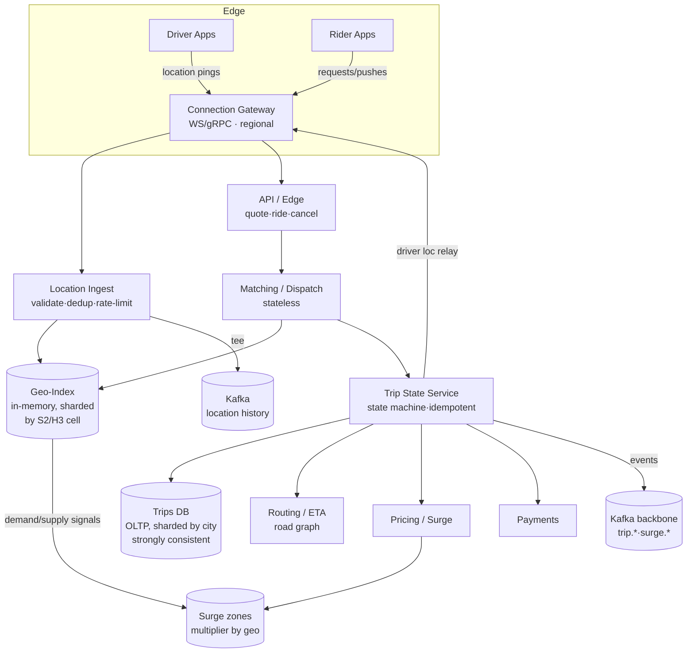
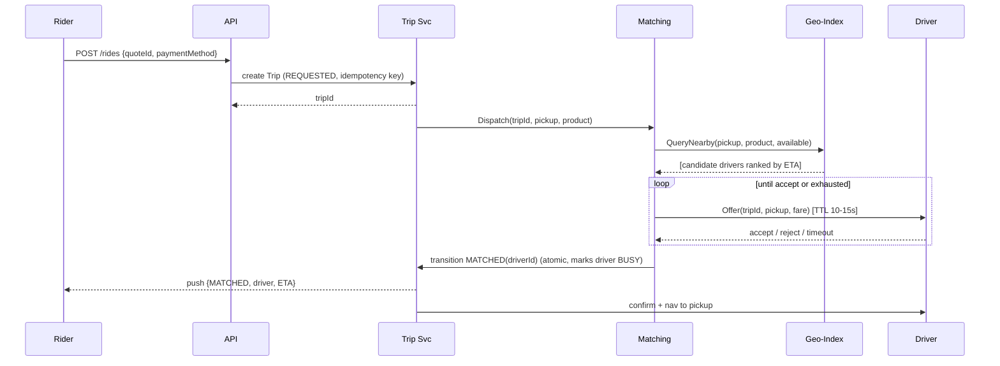
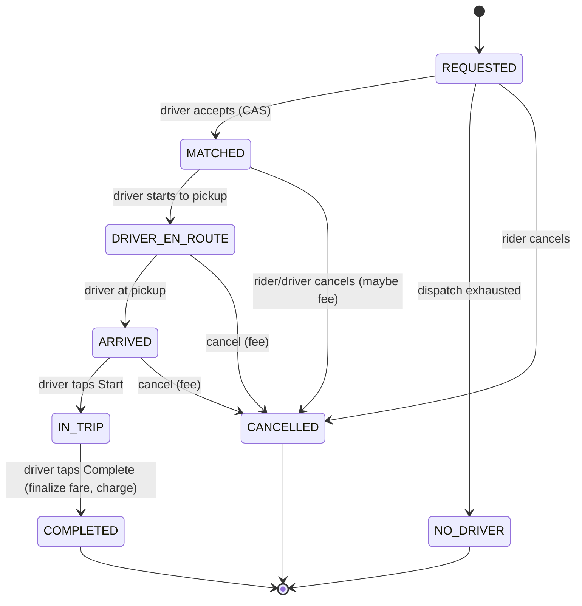

# Design Uber / Ride-Hailing — High-Level Design

> Staff/principal-level HLD reference and interview-practice artifact. Reader profile: senior backend engineer (Java/JVM, distributed systems) who knows the building blocks and wants the *design judgment* — clarification, tradeoffs, and the deep dives that separate a senior answer from a junior one.

---

## 1. Problem & Clarifying Questions

**Restated problem.** Build the backend for a ride-hailing platform like Uber/Lyft/Ola. Riders open an app, see nearby available drivers on a map, request a ride from A→B, get matched to a driver, watch the driver approach in real time, take the trip, and pay. Drivers run an app that streams their location, receives ride offers, accepts/rejects, and navigates. The system must ingest **millions of high-frequency location updates per second**, answer **"who is near me?"** geospatial queries in tens of milliseconds, **match** riders to drivers optimally, compute **ETA and price** (including **surge**), and drive a **trip lifecycle state machine** that survives crashes and never double-charges or double-dispatches.

A real interview begins by *not* drawing boxes. I'd ask the interviewer:

### Functional scope questions
- **Core loop only, or the whole platform?** Are we doing rider request → match → trip → payment, or also driver onboarding, ratings, support, fraud, promotions, multi-modal (Eats, freight)? *I'll assume the core ride loop is the focus, with payment and pricing modeled but not deeply built.*
- **Ride products?** Just single-rider point-to-point (UberX), or also pooling/shared rides (Pool), scheduled rides, multi-stop, airport queues? *Pooling and scheduling change matching dramatically — I'll design for single point-to-point and call out where pooling diverges.*
- **Who picks whom?** Does the system auto-assign one driver (dispatch model), or does it broadcast to many drivers who race to accept (marketplace/broadcast model)? *Uber historically used sequential/auto-dispatch; I'll default to dispatch with a fallback broadcast.*
- **Map/routing in-house or third-party?** Are routing, ETAs, and map tiles ours to build, or do we call Google Maps / Mapbox / an internal OSRM? *I'll assume an internal routing/ETA service backed by a road graph, since "ETA" is an explicit deep dive.*
- **Geography?** Single city, single country, or global with multiple regulatory regimes and currencies? *Global, multi-region — this drives geo-sharding and data residency.*

### Non-functional questions
- **Latency targets?** What's acceptable for "find nearby drivers" and for "rider sees driver dot move"? *I'll target p99 < 100 ms for nearby-search and < 2 s end-to-end for location-dot freshness.*
- **Availability?** Is this a "money + safety" system (people stranded, drivers unpaid) needing 99.99%? *Yes — treat the matching/trip path as tier-0; degrade gracefully (stale driver locations) rather than go down.*
- **Consistency expectations?** Can a driver momentarily appear on two riders' maps (eventually consistent locations OK)? Can a trip ever be in two states at once (must be strongly consistent)? *Location = eventually consistent and best-effort. Trip lifecycle + payments = strongly consistent, exactly-once effects.*
- **Durability?** Must we never lose a completed trip / payment record? *Yes — trips and payments are durable and auditable. Raw location pings are lossy/ephemeral beyond a retention window.*

### Scale questions
- **How many drivers/riders?** *Assume ~10M active drivers globally, ~3M concurrently online at peak; ~100M monthly riders, ~1M concurrent requests at peak.*
- **Location update frequency?** *Drivers ping every ~4 s when online (Uber's real number historically); riders ping less often.*
- **Trips/day?** *~20M trips/day globally.*

### Out-of-scope (explicitly de-scoped to protect time)
Driver onboarding/KYC, fraud/risk engine internals, ratings/reviews storage, in-app chat, promo/coupon engine, accounting/ledger settlement, the native mobile apps. I'll mention where they hook in.

---

## 2. Requirements (Finalized)

### Functional
1. **Driver location ingestion** — online drivers stream GPS (lat, lng, heading, speed, accuracy) every ~4 s; system tracks last-known location and availability state.
2. **Nearby-driver search** — given a rider's location, return candidate available drivers within a radius / k-nearest, ranked, in < 100 ms p99.
3. **Ride request & matching (dispatch)** — rider requests a ride (pickup, dropoff, product); system selects the best driver, offers the trip, handles accept/reject/timeout, and confirms the match.
4. **Trip lifecycle** — a state machine: `REQUESTED → MATCHED → DRIVER_EN_ROUTE → ARRIVED → IN_TRIP → COMPLETED` plus `CANCELLED`/`FAILED`. Transitions are atomic, idempotent, and auditable.
5. **ETA service** — pickup ETA (driver→rider) and trip ETA (pickup→dropoff) from a road-graph routing engine.
6. **Pricing & surge** — fare = base + time + distance + dynamic surge multiplier by geo-zone, computed and *quoted* up-front and *finalized* at completion.
7. **Real-time tracking** — rider sees driver position update live before and during the trip; driver sees route.
8. **Payments** — charge rider, credit driver on completion (modeled; settlement out of scope).

### Non-functional
| Property | Target | Notes |
|---|---|---|
| Nearby-search latency | p99 < 100 ms | Hot path, in-memory geo-index |
| Location-dot freshness | < 2–4 s | Bounded by ping interval + push latency |
| Match decision latency | p99 < 1–2 s per offer round | Excludes driver think-time |
| Availability (match/trip path) | 99.99% | Tier-0; degrade, don't fail |
| Trip/payment consistency | Strong, exactly-once effects | No double-dispatch, no double-charge |
| Location data consistency | Eventual / best-effort | Lossy beyond retention |
| Durability (trips/payments) | 11 9's region-replicated | Never lose a completed trip |
| Geo-correctness | Driver appears in exactly one cell's index at a time | Avoid duplicate/missing dispatch |

### Key assumptions (carried forward)
- 3M concurrent online drivers; 4 s ping → location write QPS ≈ 750K/s baseline, peaks to ~1M/s.
- 20M trips/day; peaks concentrated (commute hours, weather, events) at ~5–10× average.
- Global, multi-region; each region owns its drivers/riders/trips (data residency + locality).
- Internal routing engine with a contracted road graph; ETAs are estimates, not SLAs.

---

## 3. Capacity Estimation (arithmetic shown)

### Location write stream (the dominant load)
- Concurrent online drivers: **3,000,000**.
- Ping interval: **4 s** → updates/sec = 3,000,000 / 4 = **750,000 writes/s** average.
- Peak factor ~1.3× → **~1,000,000 location writes/s**.
- Payload per ping: driverId (8B) + lat/lng (16B) + heading/speed/accuracy (12B) + ts (8B) + framing/overhead ≈ **~100 bytes on the wire**, ~50B useful.
- **Ingest bandwidth:** 1M/s × 100B = **100 MB/s ≈ 800 Mbps** sustained inbound, before TLS/HTTP overhead (call it ~1.5–2 Gbps with framing). Trivial for a fleet of edge nodes; the cost is *write amplification into any index*, not raw bytes.

**Storage for live locations:** we only keep *last-known* per driver in hot store: 3M drivers × ~200B (struct + index pointers) = **600 MB** — fits comfortably in RAM, even with 3–5× headroom and replication. This is the single most important realization: **the live geo-index is small enough to live in memory.** History (for analytics, replay, disputes) is appended to a log/columnar store, not the hot path.

**Location history (optional retention):** 750K/s × 86,400 s = **~65 billion pings/day**. At 50B each = **~3.2 TB/day raw**, ~1 TB/day compressed. Retain 30 days hot-ish → ~30 TB; archive the rest to object storage. This is offline; it does not touch the matching path.

### Read load (nearby search)
- 1M concurrent rider sessions; a rider polls/streams nearby drivers ~every 4–5 s while the app is open and not yet in a trip.
- ≈ **200K–250K nearby-search QPS** average, peaking ~500K/s.
- Each query touches a handful of geo cells (the rider's cell + neighbors). Served from the in-memory index → microsecond-class per shard, dominated by network.

### Trip/match load
- 20M trips/day / 86,400 s = **~230 trips/s** average; peak ~10× = **~2,300 matches/s**.
- Each match: a few index reads + a short state-machine write transaction. Tiny compared to location writes. **Matching is logic-heavy, not throughput-heavy.**

### Storage for trips
- 20M trips/day × ~2 KB/trip (route, timestamps, fare breakdown, state log) = **~40 GB/day** → ~14.6 TB/year. Sharded, replicated, archived after N months. Easily handled by a partitioned OLTP store.

### Server/shard counts (rough)
- **Location ingest + geo-index:** memory-bound and write-bound. If one in-memory shard node comfortably handles ~50K location writes/s and holds ~150K drivers, we need **~20 shards** for 1M writes/s, ×3 replicas ≈ **~60 nodes**. Round up for headroom and uneven geography → ~80–100 nodes.
- **Gateway / connection layer:** 3M + 1M = **4M persistent connections**. At ~100K connections/node (tuned epoll/Netty) → **~40–80 gateway nodes** for connections, ×regions.
- **Matching service:** stateless workers; 2,300 matches/s is small — tens of pods, scaled for burst and per-region isolation.

**Takeaway numbers to memorize:** ~1M location writes/s, ~500K nearby-reads/s, ~2.3K matches/s peak, ~600 MB live geo-index (fits in RAM), ~3 TB/day raw history. The design is shaped by **write-heavy ephemeral location** vs **low-volume but strongly-consistent trips**.

---

## 4. API Design

Mobile apps connect over a **persistent bidirectional channel** (WebSocket / gRPC stream) for location and trip events, with plain HTTPS for request/response endpoints. Auth via short-lived JWT minted from a session; every mutating call carries an **idempotency key**.

### Driver app

```
# Streamed over the persistent connection (high frequency, fire-and-forget-ish)
UpdateLocation(driverId, lat, lng, heading, speed, accuracy, ts) -> Ack{seq}

# Lifecycle (request/response, idempotent)
POST /v1/driver/online      { driverId, vehicleType } -> { sessionId }
POST /v1/driver/offline     { driverId } -> 204
POST /v1/driver/offer/{offerId}/respond  { accept: true|false }  (Idempotency-Key)
                            -> { tripId, status }  // wins the race or 409 if expired
POST /v1/trip/{tripId}/transition  { event: ARRIVED|START|COMPLETE } (Idempotency-Key)
```

### Rider app

```
POST /v1/rides/quote        { pickup{lat,lng}, dropoff{lat,lng}, product }
                            -> { quoteId, fareEstimate, surgeMultiplier, etaPickupSec, etaTripSec, expiresAt }

POST /v1/rides              { quoteId, paymentMethodId } (Idempotency-Key)
                            -> { tripId, status: REQUESTED }

GET  /v1/rides/{tripId}      -> { tripId, status, driver{...}, driverLocation{...}, etaSec, fare }
POST /v1/rides/{tripId}/cancel (Idempotency-Key) -> { status: CANCELLED, cancellationFee }

# Streamed to rider: driver location + trip state pushes
TripStream(tripId) -> stream of { type: LOCATION|STATE, payload }
```

### Internal services (RPC)

```
GeoIndex.QueryNearby(lat, lng, radiusM | k, filters{vehicleType, available}) 
        -> [ {driverId, lat, lng, distanceM, etaHintSec} ]   // p99 < 100ms
GeoIndex.Upsert(driverId, cell, lat, lng, state)             // from ingest pipeline
Routing.ETA(origin, dest, departAt) -> { distanceM, durationSec, polyline }
Pricing.Quote(origin, dest, product, surgeZone) -> { fare breakdown }
Surge.Multiplier(geoZone, ts) -> { multiplier, reason }
Matching.Dispatch(tripId, pickup, product) -> { driverId | NO_DRIVER }
```

**Request/response shape — quote (the rider's first interaction):**
```json
{ "quoteId":"q_8f2","fareEstimate":{"currency":"INR","low":210,"high":240,"surge":1.3},
  "etaPickupSec":240,"etaTripSec":1100,"expiresAt":"2026-06-25T10:32:00Z" }
```
The `quoteId` is the *contract*: when the rider confirms, we honor the quoted surge/fare for a bounded window so price can't jump under them — a UX + trust requirement that also pins the surge value into the trip record.

---

## 5. High-Level Architecture

### Request flow (narrative)
1. Apps hold a **persistent connection** to the **Connection Gateway** (region-local). Drivers stream locations up; riders/drivers receive pushes down.
2. Location pings flow into the **Location Ingest pipeline** → write to the in-memory **Geo-Index** (sharded by geo cell) and tee a copy to a **Kafka topic** for history/analytics.
3. A rider's **quote** call hits the **Pricing/ETA** services (Routing + Surge).
4. A **ride request** creates a `Trip` (strongly consistent OLTP) in state `REQUESTED`, then invokes the **Matching/Dispatch** service.
5. Matching queries the **Geo-Index** for nearby available drivers, ranks them (ETA, accept-rate, fairness), and sends an **offer** to the top driver via the gateway. On accept → `Trip` transitions to `MATCHED`; on reject/timeout → next driver.
6. The **Trip State Service** owns lifecycle transitions and emits events; **Tracking** relays the matched driver's locations to the rider's `TripStream`.
7. On `COMPLETED`, **Pricing** finalizes fare and **Payments** charges the rider.

### ASCII block diagram

```
                        ┌──────────────────────────────────────────────┐
   Driver Apps  ───►     │           Connection Gateway (region)         │   ◄─── Rider Apps
   (loc stream)          │   WebSocket/gRPC · auth · pub/sub fanout       │   (trip stream)
                        └───────┬───────────────────────────┬──────────┘
                                │ location pings              │ requests / pushes
                                ▼                             ▼
                  ┌───────────────────────────┐     ┌────────────────────────┐
                  │   Location Ingest          │     │     API / Edge          │
                  │   (validate, dedup,        │     │  quote · ride · cancel  │
                  │    rate-limit, route)      │     └───────┬─────────────────┘
                  └───────┬────────────┬───────┘             │
                          │            │ tee                  ▼
                          ▼            ▼               ┌───────────────┐   ┌──────────────┐
            ┌──────────────────────┐  Kafka           │  Matching /   │──►│  Geo-Index    │
            │   GEO-INDEX (in-mem) │  (history,        │  Dispatch     │   │ (sharded by   │
            │  sharded by S2/H3    │   analytics)      │  (stateless)  │◄──│  geo cell,    │
            │  cell → driver set   │                   └───┬───────────┘   │  in-memory)   │
            └──────────┬───────────┘                       │               └──────────────┘
                       │ QueryNearby                        ▼
                       │                            ┌──────────────────┐   ┌──────────────┐
                       └───────────────────────────►│  Trip State Svc  │──►│  Trips DB     │
                                                    │  (state machine, │   │ (OLTP, sharded│
                                                    │   idempotent)    │   │  by region/   │
                                                    └───┬─────────┬────┘   │  city, strong)│
                                                        │         │        └──────────────┘
                              ┌─────────────┐           │         ▼
                              │  Routing/ETA │◄──────────┘   ┌──────────────┐  ┌───────────┐
                              │  (road graph)│               │  Pricing /   │  │ Payments  │
                              └─────────────┘               │  Surge       │  │ (charge)  │
                                                            └──────────────┘  └───────────┘
                              (Kafka backbone for events: trip.*, surge.*, location.*)
```

### Mermaid diagram



### Key sequence — request to match



---

## 6. Data Model & Storage Choices

### Entities

**Driver (profile + session)** — `driverId, name, vehicleType, rating, status{OFFLINE|AVAILABLE|OFFERED|BUSY}, currentTripId, lastLocation`. Profile in an OLTP store; **live session state + lastLocation in the in-memory geo-index** (the authoritative *availability* lives where matching reads it).

**DriverLocation (ephemeral, hot)** — `driverId → {lat, lng, heading, speed, accuracy, ts, cellId, state}`. Lives in the in-memory geo-index, optionally backed by Redis for restart warmth. Not durably persisted on the hot path.

**LocationHistory (cold)** — append-only stream in Kafka → columnar/object store (Parquet on S3, queried via a warehouse). For replay, disputes, ML, demand forecasting.

**Rider** — `riderId, name, rating, paymentMethods[], homeCity` — OLTP.

**Trip (durable, strongly consistent)** —
```
tripId (PK), riderId, driverId, product, status,
pickup{lat,lng,addr}, dropoff{lat,lng,addr},
quoteId, surgeMultiplier, fare{base,time,dist,surge,total,currency},
route{polyline,distanceM,durationSec},
timestamps{requested,matched,arrived,started,completed,cancelled},
stateLog[] (event-sourced audit), version (optimistic lock)
```
Sharded by **city/region** (pickup geography), strongly consistent within a shard.

**Surge zone state** — `zoneId → {multiplier, supply, demand, updatedAt}`, recomputed on a short cadence; cached and gossiped to pricing.

**Offer (transient)** — `offerId, tripId, driverId, expiresAt, status` — short-lived; in Redis with TTL.

### Datastore choices, justified against access patterns

| Data | Access pattern | Store | Why (failure mode avoided) |
|---|---|---|---|
| Live driver locations + availability | 1M writes/s, k-NN reads, ephemeral | **In-memory geo-index** (custom, sharded), Redis-backed | Disk/OLTP can't take 1M writes/s of throwaway data; memory is small (600 MB). Avoids write-amplification meltdown and stale matching. |
| Location history | Append-only, batch analytics | **Kafka → Parquet/object store** | Decouples ingest from analytics; lossy-tolerant. Avoids coupling hot path to a warehouse. |
| Trips | OLTP, strong consistency, transactional state transitions, range queries by city/time | **Partitioned relational/NewSQL** (e.g., sharded Postgres / CockroachDB / Spanner-like) | ACID + exactly-once transitions; double-dispatch and double-charge are catastrophic. Avoids the eventual-consistency-causes-two-drivers bug. |
| Offers | Short TTL, high churn, atomic CAS | **Redis** (TTL + Lua CAS) | Need atomic "first acceptor wins" with auto-expiry. Avoids leaked/stuck offers. |
| Surge zones | Frequent recompute, hot reads | **Redis / in-memory + Kafka** | Fast reads on quote path; tolerates slight staleness. |
| Profiles | Read-heavy, low write | **Relational + cache** | Standard. |
| Routing graph | Read-mostly, huge, in-memory per node | **Sharded graph in routing service memory** | Pathfinding needs the graph resident; avoids per-query DB latency. |

**The core storage insight:** split the world into **ephemeral/eventual/in-memory location** and **durable/strong/OLTP trips**. Conflating them (e.g., writing every ping to Postgres, or matching off an eventually consistent store) is the classic junior mistake.

---

## 7. Deep Dives (the bulk)

### 7.1 Geospatial indexing — "who is near me?"

**Problem.** Given a rider at (lat, lng), return available drivers within ~radius / k-nearest, in <100 ms p99, while drivers move and the index takes ~1M writes/s. Naïve `SELECT * WHERE distance < r` over 3M rows per query is impossible at this rate.

**The core trick: map 2D space to a 1D, range-queryable key.** A space-filling curve assigns every point on Earth a hierarchical cell ID such that nearby points usually share a prefix. Then "nearby" becomes "same cell + neighbor cells," and the index is a `cellId → set<driverId>` map.

**Candidate schemes (explained):**

- **Geohash** — interleaves lat/lng bits into a base-32 string; shared prefix ≈ nearby. *Simple, human-readable, prefix queries.* Weakness: rectangular cells of uneven real-world size, and the **"edge problem"** — points just across a cell boundary have totally different hashes, so you must always query the cell **plus its 8 neighbors**. Also distortion near poles.
- **Quadtree** — recursively subdivide space into 4 quadrants until each leaf holds ≤ N points; adapts density (dense downtown = deep tree, empty desert = shallow). *Adaptive to density.* Weakness: it's a mutable tree — rebalancing under 1M writes/s and concurrent reads is painful; hot cells need careful locking.
- **S2 (Google)** — projects the sphere onto a cube, then Hilbert-curve-orders cells. **Hilbert curve** keeps locality better than Z-order (geohash) — consecutive cells are physically adjacent — and cells are near-equal area. Hierarchical levels (0–30) give controllable cell size. *Excellent locality, equal-ish area, great library support.*
- **H3 (Uber)** — hexagonal grid. **Hexagons have uniform distance to all neighbors** (a square has diagonal vs edge neighbors at different distances), which makes "expanding ring" k-NN and travel-distance reasoning cleaner. *Best for ride-hailing's "expand the search radius" semantics; designed by Uber for exactly this.* Weakness: hexagons can't perfectly subdivide into smaller hexagons (slight parent/child imperfection), and it's a bit more complex.

| Scheme | Cell shape | Locality | Density-adaptive | Edge handling | Best fit |
|---|---|---|---|---|---|
| Geohash | Rectangle | Z-order (jumpy) | No (fixed levels) | Query 9 cells | Simple/legacy |
| Quadtree | Square (variable) | Good | **Yes** | Tree traversal | Skewed density, lower write rate |
| S2 | Quadrilateral | **Hilbert (smooth)** | No (pick level) | Neighbor cells | General geo |
| **H3** | **Hexagon** | Good | No (pick res) | **Uniform rings** | **Ride-hailing** |

**Decision: H3 (resolution ~8–9 for matching) for the index, with quadtree-style adaptive resolution for hot zones.** Hex uniform-neighbor distance makes the "expand by one ring until enough drivers found" loop clean, and Uber's production validation matters. We pick a base resolution where a typical cell holds a few-hundred meters — small enough for fast queries, large enough that an urban cell usually has candidate drivers. *Failure mode avoided:* the geohash edge problem (missing a driver one meter across a boundary) and quadtree rebalance contention under write storm.

**How writes update it:** each ping computes its cell. If the driver changed cells, we do `oldCell.remove(driverId); newCell.add(driverId)`; otherwise just update the stored lat/lng. Most pings (driver near-stationary or moving slowly) don't change cell → cheap in-place update. **Sharding:** partition cells across nodes by cell-ID prefix so a city's cells co-locate; replicate each shard 3× for read scaling and failover. The index is a CRDT-friendly set-of-sets; staleness of a few seconds is acceptable because matching re-confirms availability transactionally.

**Query:** compute rider's cell, gather rider cell + ring-1 (and ring-2 if sparse), union the driver sets, filter to AVAILABLE + product type, compute true haversine distance, return top-k. All in-memory → microseconds of CPU, dominated by network. *Failure mode avoided:* unbounded scans and cross-shard fan-out by keeping a city's geography on a few co-located shards.

**Hot-cell problem (deep-dive-within-deep-dive):** an airport or stadium cell can hold thousands of drivers and take huge read/write traffic. Mitigations: dynamically **split hot cells into finer resolution** (adaptive, quadtree-like), add read replicas for hot shards, and rate-limit driver ping frequency for stationary drivers (a parked driver doesn't need 4 s updates).

### 7.2 Real-time location ingestion at ~1M writes/s

**Problem.** 3M drivers × ping/4s, peaking ~1M/s, must reach the geo-index with <2–4 s freshness, survive bursts, and not lose so many pings that the map stutters — while *not* synchronously writing each ping to durable storage.

**Connection layer.** Drivers hold persistent **WebSocket/gRPC** streams to **region-local gateways** (Netty/epoll, ~100K conns/node). Persistent connections avoid TLS-handshake-per-ping cost and let us push offers back down the same channel. Gateways do auth once, then cheap framing.

**Ingest pipeline options:**

| Option | How | Pros | Cons |
|---|---|---|---|
| Direct write to geo-index | Gateway → shard RPC per ping | Lowest latency, freshest | Couples ingest to index availability; bursts hit index directly |
| **Kafka buffer → consumers → index** | Ping → partitioned Kafka → consumer upserts index | Absorbs bursts, replay, decoupled, tee to history free | +tens of ms latency; needs partition = geo affinity |
| Edge aggregation | Gateway batches N pings/window, sends deltas | Fewer RPCs, less amplification | Slightly staler; complexity |

**Decision: a hybrid.** For the **hot path** (updating the live geo-index), gateways write **directly to the owning geo-shard** by cell, *with a short local batch* (coalesce a driver's pings within a 1–2 s window, keep only the latest — older pings are worthless). For **durability/analytics**, tee every ping asynchronously to **Kafka** partitioned by geo region. *Failure mode avoided:* (a) routing every ping through Kafka adds latency to the freshness-critical path; (b) writing every ping durably wastes IO on throwaway data; (c) not batching causes needless write amplification. Coalescing leans on the truth that **only the latest location matters** — location is last-writer-wins.

**Backpressure & overload.** If a geo-shard saturates: shed by *increasing the effective ping interval* for stationary/parked drivers (server tells driver "ping every 10s"), drop stale-by-arrival pings (a ping older than the last applied one is discarded by sequence number), and isolate per-region so one city's surge doesn't starve another. *Failure mode avoided:* a city-wide event (concert lets out) creating a thundering herd that takes the global index down — region isolation + adaptive ping caps it.

**Idempotency/ordering.** Each ping carries a monotonically increasing `seq` per driver; the index applies last-writer-wins by `seq`/`ts`, so out-of-order or duplicate pings (mobile networks reorder) can't move a driver backward.

### 7.3 Matching / Dispatch — riders ↔ drivers

**Problem.** Pick the *right* driver and bind them to the trip **exactly once**, handling accept/reject/timeout, concurrent requests competing for the same drivers, and marketplace goals (low rider ETA, high driver utilization, fairness).

**Models:**

| Model | Mechanism | Pros | Cons |
|---|---|---|---|
| **Sequential auto-dispatch** | Offer to best driver, TTL ~10–15s, fall to next | Predictable, no driver-side races, good driver UX | Slower if early drivers reject; needs good ranking |
| Broadcast/marketplace | Offer to many; first to accept wins | Fast fill, driver choice | Race conditions, drivers cherry-pick, wasted offers |
| Batch matching | Accumulate requests + drivers over a short window, solve assignment (Hungarian/min-cost flow) globally | **Globally optimal** ETAs, great in dense markets | Adds latency (window), complex, needs density |

**Decision: sequential auto-dispatch as default, batch-window matching in dense markets.** In a dense city, collecting requests/drivers over a ~2–5 s window and solving a **min-cost bipartite assignment** (minimize total pickup ETA, weighted by fairness/driver-acceptance) beats greedy per-request matching — greedy can strand a request whose perfect driver got grabbed by a worse-fit request. In sparse markets, just dispatch sequentially to the nearest viable driver. *Failure mode avoided:* greedy local optimization producing globally bad ETAs and "no cars available" while cars sit one street over.

**Ranking signal:** primarily **pickup ETA** (from Routing, not straight-line — a driver across a river is far by road), then driver acceptance rate, idle time (fairness — spread work), rating, and product match. We score candidates and offer to the top.

**Exactly-once binding (the hard part).** When a driver accepts, two things must be atomic: (1) the Trip transitions `REQUESTED→MATCHED` and (2) the driver's availability flips `AVAILABLE→BUSY` so no other request can grab them.
- Use a **conditional/CAS transition**: `UPDATE trip SET status=MATCHED, driverId=? WHERE tripId=? AND status=REQUESTED` and `UPDATE driver SET status=BUSY WHERE driverId=? AND status=AVAILABLE` — both must succeed. If the driver was already grabbed, the second CAS fails → release the offer, return 409, move on.
- The **offer in Redis** has a TTL and an atomic Lua CAS so the *first acceptor wins* and late acceptances are rejected. *Failure mode avoided:* **double-dispatch** — two riders matched to one driver — which would be a real-world disaster (one rider stranded, driver confused).
- **Driver appears in two riders' candidate sets** is fine (eventual location); the *binding* is what's serialized. We mark a driver `OFFERED` (soft hold) the instant we send an offer to reduce wasted parallel offers, releasing on reject/timeout.

**Timeouts/retries.** Offer TTL ~10–15 s. On timeout, ding the driver's acceptance metric, release, offer next. Cap total dispatch time (e.g., 60–90 s) before telling the rider "no cars available" (with surge-incentive to drivers). All idempotent: a retried dispatch for the same trip is a no-op if already matched.

### 7.4 Trip lifecycle as a consistent state machine

**Problem.** A trip moves through states driven by *both* parties' actions and the system, across network partitions and crashes, and must never be in an inconsistent state, never double-charge, and be fully auditable for disputes/safety/regulators.

**States & transitions:**


**Design choices:**
- **Single authoritative writer per trip.** All transitions go through the **Trip State Service**, which holds the trip row in a strongly consistent store and uses **optimistic concurrency** (`version` column) — every transition is `UPDATE ... WHERE tripId=? AND version=? AND status IN (validFromStates)`. A stale client's transition fails and is rejected. *Failure mode avoided:* two concurrent transitions (e.g., rider cancel races driver start) producing an impossible state.
- **Event-sourced audit log.** Each transition appends to `stateLog` and emits a Kafka event (`trip.matched`, `trip.completed`, …). The log is the source of truth for disputes, analytics, and rebuilding read models. *Failure mode avoided:* "he said / she said" disputes and inability to reconstruct what happened.
- **Idempotency.** Every transition API carries an idempotency key; replays (network retries, mobile reconnects) are deduped. Completing a trip twice must charge once. *Failure mode avoided:* double-charge on retry.
- **Crash recovery.** Because state is durable per transition, a service crash mid-trip recovers by reading the trip row; in-flight side effects (charge, payout) are driven by an **outbox pattern** — the state change and an outbox row commit in one transaction, and a relay publishes the event/triggers payment at-least-once with idempotent consumers. *Failure mode avoided:* a crash after charging but before recording it (or vice versa) → lost/duplicate money.
- **Timeouts as states.** A driver who goes offline mid-trip, a rider who never shows: handled by timers that emit transition events (auto-cancel, no-show fee), all through the same machine.

### 7.5 ETA, pricing & surge

**ETA.** Straight-line distance lies (rivers, one-ways). The **Routing service** holds a road graph in memory and runs **contraction-hierarchies / A\*** for fast shortest-path with live traffic speeds layered on edges. ETA = pickup ETA (driver→rider, used in ranking) + trip ETA (pickup→dropoff). Traffic speeds come from aggregating *our own fleet's* GPS history (a virtuous loop: drivers' pings feed the speed model). ETAs are estimates, cached per (cell-pair, time-bucket) to avoid recomputation. *Failure mode avoided:* ranking by crow-flies distance and dispatching a driver who's 30 min away by road but 500 m away as the bird flies.

**Pricing.** `fare = base + perMinute×durationEst + perKm×distanceEst, then × surgeMultiplier`, clamped to a quoted range. Quoted **up-front** (riders demand price certainty) and **finalized** at completion using actual route (with caps so traffic doesn't surprise the rider). The quoted surge is pinned into the trip at request time.

**Surge (deep).** Surge balances supply/demand per geo-zone. Compute, per zone, a multiplier as a function of `(open requests / available drivers)` over a short window, smoothed to avoid flapping.
- **Why surge:** raise price when demand ≫ supply → suppresses some demand and lures nearby/idle drivers in → restores balance. It's a control loop.
- **Zones:** reuse H3 cells (coarser resolution, e.g., res 6–7) as surge zones; aggregate demand (quotes/requests) and supply (available drivers) per zone from the geo-index + request stream.
- **Computation:** a streaming job consumes request + supply signals, updates `zone→multiplier` every ~few-to-30 seconds, publishes to a cache the Pricing service reads on the quote path.
- **Stability:** hysteresis/smoothing so the multiplier doesn't oscillate 1.0↔2.0 each tick (which would enrage users and create gaming). Cap maximums for regulatory/ethical reasons. *Failure mode avoided:* jittery prices and feedback-loop oscillation; and stale surge that over/under-prices.

| Surge design choice | Option A | Option B | Decision |
|---|---|---|---|
| Update cadence | Real-time per request | Periodic batch (10–30s) | **Periodic streaming** — stable, cheap, fresh enough |
| Zone definition | Fixed admin zones | H3 cells | **H3 cells** — consistent with index, adaptive |
| Quote validity | Recompute at confirm | Pin at quote | **Pin at quote** (bounded TTL) — price certainty/trust |

---

## 8. Scaling & Bottlenecks

**Where it breaks first, in order:**

1. **Location write throughput into the geo-index.** *First bottleneck.* Mitigations already in design: shard by geo cell, coalesce pings (latest-wins), adaptive ping intervals for stationary drivers, region isolation. Scale by adding shards (cells repartition by prefix). The index is memory-bound, not CPU/disk-bound, so we scale horizontally and keep replicas for reads.
2. **Connection fan-out / gateway.** 4M persistent connections. Scale gateways horizontally; use a pub/sub fabric so any gateway can push to any session via a session-locator (sticky by connection, lookup by riderId/driverId). Bottleneck = file descriptors + memory per conn → tune kernel, use efficient framing.
3. **Hot geo cells (airports, stadiums, events).** Adaptive sub-cell splitting, dedicated replicas for hot shards, and pre-provisioning around known events.
4. **Matching in dense markets.** Batch-window assignment is CPU-heavier; partition the assignment problem by city/region so each solver handles a bounded set; it's still only thousands of matches/s globally.
5. **Trips DB write contention** during peaks. Shard by city; within a shard, transactions are tiny and short. Read models (rider's "your trips" list) served from replicas/derived stores fed by Kafka, keeping the OLTP write path lean.
6. **Routing/ETA compute.** Cache ETAs by (cell-pair, time-bucket); precompute popular corridors; scale routing nodes horizontally with the graph replicated.

**Geo-sharding as the organizing principle.** Drivers, riders, trips, index cells, and surge zones all shard by **geography**. A ride is almost always local (pickup and dropoff in the same region), so geo-sharding gives **locality** (no cross-shard joins on the hot path), **isolation** (one city's storm doesn't cascade), and **data residency** (regulatory). Cross-region is rare (border rides) and handled explicitly. *Failure mode avoided:* a global hot partition and cross-shard transactions on every match.

**Multi-region.** Each region is largely self-contained (gateways, index, matching, trips). Global services (account, payments) are replicated. Failover within a region across AZs; cross-region failover for disaster is slower and accepts some data-residency complexity.

---

## 9. Reliability, Consistency & Security

**Consistency model (deliberately split):**
- **Location/geo-index:** eventual, best-effort, last-writer-wins. A driver dot may lag a few seconds or briefly appear in two riders' candidate sets — acceptable, because the *binding* is serialized.
- **Trip lifecycle & payments:** strong consistency, optimistic-locked transitions, exactly-once effects via idempotency + outbox. *This is non-negotiable: it's money and safety.*

**Failure handling:**
- **Geo-shard down:** read from a replica; new pings buffer/retry. Stale locations degrade match quality, not availability — we keep matching on slightly old data rather than refusing rides.
- **Gateway down:** apps reconnect to another gateway; session-locator re-routes pushes; trip state is recoverable from the durable store, so a reconnect resumes seamlessly.
- **Matching/dispatch failure mid-offer:** offer TTL expires, dispatch is idempotent and retried for the still-`REQUESTED` trip.
- **Trip service crash mid-transition:** durable per-transition + outbox → recover by reading the row; at-least-once event delivery with idempotent consumers.
- **Payment failure:** trip completes (rider isn't held hostage), payment retried asynchronously with idempotency; reconciliation flags persistent failures.

**Idempotency everywhere mutating:** ride creation, transitions, offer responses, charges — all carry idempotency keys deduped at the service boundary. Retries (ubiquitous on mobile networks) never double-act.

**Security & abuse:**
- **Auth:** session → short-lived JWT; gateway verifies once per connection; mTLS service-to-service.
- **Authorization:** a driver can only transition trips they're assigned; a rider only their own trips.
- **Location spoofing / GPS fraud:** validate plausibility (speed/teleport checks: a driver can't jump 50 km in one ping), cross-check with cell-tower/IP hints, flag anomalies to the (out-of-scope) fraud engine.
- **Rate limiting:** per-driver ping caps (also a scaling lever), per-rider request caps to stop quote-spamming and DoS.
- **PII & residency:** location and trip data are sensitive; encrypt at rest/in transit, region-pin per regulation, redact in logs.
- **Safety:** trip state log + live location enable emergency features (share-trip, panic button) — they hook into the same event stream.

---

## 10. Extensions & Follow-ups

- **Pooling / shared rides.** Matching becomes multi-objective: insert a new rider into an existing trip's route with bounded detour. Requires online route re-optimization, capacity tracking, and fairer pricing splits. The geo-index and trip machine extend; matching gets much harder (it's a dynamic vehicle-routing problem).
- **Scheduled rides.** A reservation system that pre-commits supply near the pickup time; dispatch fires ahead of schedule using predicted ETAs. Adds a scheduler and supply-forecasting.
- **Multi-stop / waypoints.** Trip model carries a stop list; routing chains legs; pricing sums legs.
- **Driver-side heatmaps / incentives.** Surface predicted-demand (from surge/forecast) to drivers to pre-position supply — closes the supply loop.
- **ETA via ML.** Replace/augment graph routing with learned models on historical trip durations per corridor/time — better tail accuracy.
- **Global riders / cross-border.** Cross-region trips need a coordinator and currency/regulatory handling; rare but must not be impossible.
- **Offline / poor-connectivity.** Client buffers pings and trip actions, replays on reconnect (idempotency makes this safe).
- **Fairness & marketplace health.** Beyond ETA, optimize for driver earnings equity, rider wait-time fairness, and long-term supply retention — turns matching into an economics problem.

---

## 11. Interview Q&A

**Q1. Why not just store driver locations in Postgres with PostGIS and query by distance?**
At ~1M writes/s of throwaway data plus k-NN reads at <100 ms p99, a disk-backed OLTP store would thrash on write amplification and index maintenance. The live set is only ~600 MB — it belongs **in memory**, sharded by geo cell, with history teed to Kafka. Postgres/PostGIS is fine at small scale or for non-real-time geo, not for the hot matching path.
- *Probe — what if the in-memory node restarts?* Back it with Redis or rebuild from the latest pings within seconds; staleness during warm-up degrades match quality, not correctness, since binding is transactional.
- *Probe — how do you shard?* By cell-ID prefix so a city co-locates; replicate 3× for reads/failover.

**Q2. How do you guarantee a driver is never matched to two riders?**
The driver-availability flip and the trip transition are an **atomic conditional update** (CAS on `status=AVAILABLE` and `status=REQUESTED`). The Redis offer has a TTL + atomic first-acceptor-wins. Two riders may *see* the driver (eventual location), but only one *binds* — the loser gets 409 and re-dispatches.
- *Probe — what consistency does that require?* Strong consistency on the trip/driver state store; this is why trips live in a strongly consistent OLTP store, not the eventual geo-index.

**Q3. Geohash vs S2 vs H3 — what would you pick and why?**
H3 (hexagons) for ride-hailing: uniform neighbor distance makes the "expand the search ring until enough drivers" loop clean and avoids the geohash boundary problem; Uber validated it in production. S2 (Hilbert curve) is a great general alternative with better locality than geohash's Z-order. Geohash is simplest but has uneven cells and the edge problem requiring 9-cell queries.
- *Probe — what about dense vs sparse areas?* Use adaptive resolution / split hot cells, quadtree-style, so airports don't become a single mega-cell.

**Q4. Walk me through the location write path and how it survives a city-wide spike.**
Persistent connections → gateway → coalesce a driver's pings to latest-wins over 1–2 s → write to the owning geo-shard; tee to Kafka for history. Spikes are absorbed by **region isolation** (a concert in city A can't starve city B), **adaptive ping intervals** for stationary drivers, and **stale-ping rejection** by seq. Durability isn't on this path, so we don't pay IO for throwaway data.

**Q5. How do you compute ETA, and why does it matter for matching?**
A road-graph routing engine (contraction hierarchies / A\*) with live speeds from our own fleet's GPS. Matching ranks by **road ETA, not straight-line** — otherwise we'd dispatch a driver who's 500 m away across a river but 30 min by road. ETAs cached per (cell-pair, time-bucket).

**Q6. Explain surge pricing as a system, not a slogan. (senior-signal)**
It's a control loop: per H3 zone, multiplier ≈ f(open demand / available supply), updated by a streaming job every ~10–30 s, smoothed with hysteresis to prevent oscillation, capped for regulation, and **pinned into the quote** so the rider's price can't jump after confirming. Higher price suppresses some demand and pulls in idle drivers, restoring balance.
- *Probe — why not recompute at confirm time?* Price certainty/trust; pin at quote with a TTL.
- *Probe — how avoid oscillation?* Smoothing/hysteresis and minimum dwell time per multiplier level.

**Q7. How do you keep a trip's state consistent across crashes and retries? (senior-signal)**
Single authoritative writer, optimistic-locked transitions (`WHERE version=? AND status IN(valid)`), event-sourced audit log, idempotency keys on every mutation, and an **outbox** so the state change and the event/payment trigger commit atomically and deliver at-least-once to idempotent consumers. A crash recovers from the durable row; money is charged exactly once.

**Q8. Why geo-shard everything, and what breaks at the boundaries?**
Rides are local, so geo-sharding gives locality (no cross-shard joins), isolation (storms don't cascade), and data residency. Boundaries (cross-region rides) are rare and handled by an explicit coordinator. The failure mode avoided is a global hot partition and per-match cross-shard transactions.

**Q9. Greedy nearest-driver vs batch assignment — when and why? (senior-signal)**
Greedy is fine in sparse markets and is simplest. In dense markets, a short batching window + min-cost bipartite assignment minimizes *total* ETA and avoids greedy stranding a request whose ideal driver got grabbed by a worse-fit request. The tradeoff is added latency (the window) and compute, partitioned per city to bound it.
- *Probe — how big a window?* ~2–5 s; tuned so the optimization gain outweighs the wait.

**Q10. What's eventually consistent vs strongly consistent here, and why split them?**
Locations = eventual/best-effort (a dot lagging seconds is fine; matching re-confirms transactionally). Trips/payments = strong + exactly-once (double-dispatch/double-charge are catastrophic). Splitting lets the high-volume throwaway data run cheap and fast while the low-volume money/safety data gets full ACID.

---

## 12. Cheat-sheet & Self-test

**Numbers to know:**
- 3M concurrent drivers, ping/4s → **~1M location writes/s** peak.
- Live geo-index ≈ **600 MB** → fits in RAM (the key insight).
- ~**500K** nearby-reads/s; nearby-search p99 **< 100 ms**.
- 20M trips/day → **~2.3K matches/s** peak (logic-heavy, not throughput-heavy).
- ~**3 TB/day** raw location history (offline, lossy-tolerant).

**Decisions to know:**
- **H3** geo-index, sharded by cell prefix, in-memory, 3× replicas; adaptive split for hot cells.
- Location ingest: persistent conns → coalesce latest-wins → direct shard write + **Kafka tee**; region isolation + adaptive ping for overload.
- Matching: **sequential dispatch** default, **batch min-cost assignment** in dense markets; ranking by **road ETA**.
- Exactly-once binding via **atomic CAS** on driver-availability + trip-state; Redis offer TTL first-acceptor-wins.
- Trip lifecycle: single writer, **optimistic locking**, event-sourced audit, **idempotency + outbox** for exactly-once side effects.
- Surge: per-H3-zone control loop, streaming recompute ~10–30s, smoothed, **pinned at quote**.
- Storage split: **eventual/in-memory locations** vs **strong/OLTP trips**, both **geo-sharded**.

**Diagram in words:** Apps hold persistent connections to regional gateways. Driver pings flow to an in-memory H3 geo-index (sharded by cell) and tee to Kafka. A rider quote hits Pricing/ETA/Surge. A ride request creates a strongly consistent Trip, then Matching queries the geo-index, ranks by road ETA, offers to drivers (TTL, first-acceptor-wins, atomic bind). The Trip State Service drives an optimistic-locked, event-sourced lifecycle and relays driver location to the rider until completion and payment. Everything shards by geography.

**Self-test (no answers):**
1. Your in-memory geo-index node for downtown SF dies during rush hour. Trace exactly what happens to in-flight pings, ongoing matches, and active trips — and what the rider/driver experiences.
2. Derive the location write QPS, index memory, and shard count for 8M concurrent drivers pinging every 3 s, and say which component you'd scale first.
3. A rider cancels at the exact instant the driver taps "Start trip." Show the concurrent transitions and prove your design picks one deterministic outcome.
4. Compare H3 and S2 for a market with extreme density skew (a tiny dense core, vast sparse suburbs). Which, why, and what adaptation do you add?
5. Design surge so it cannot oscillate and cannot be gamed by drivers toggling availability — specify the update rule, smoothing, and the anti-gaming guard.
