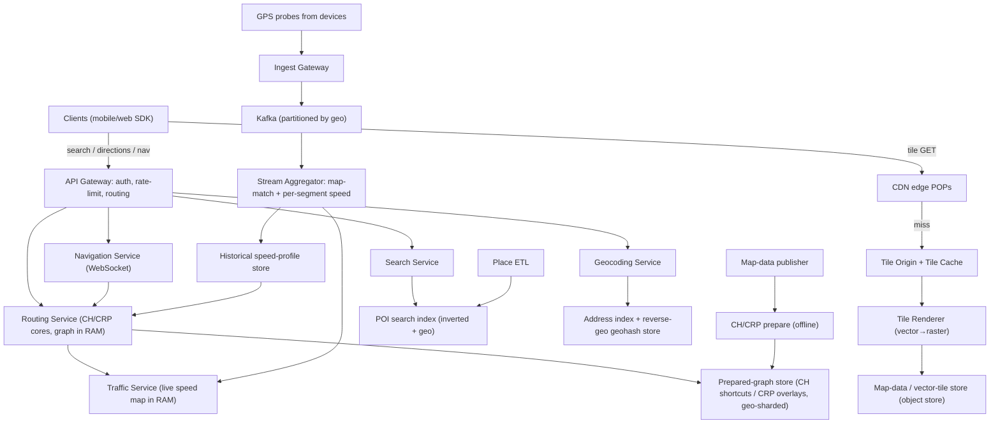
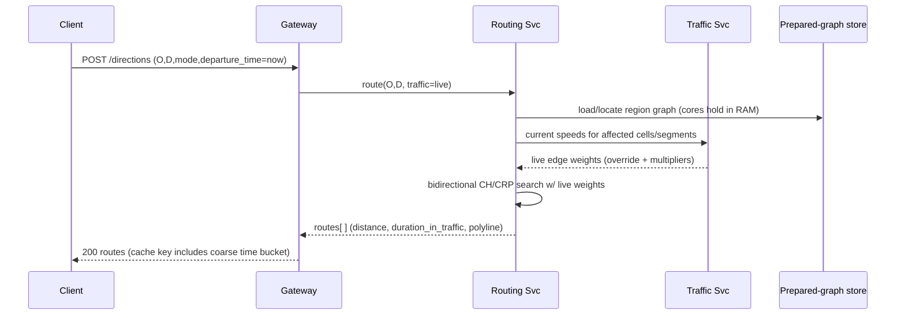

# Design Google Maps — High-Level Design

> A staff-level, interview-ready HLD. We lead with requirements clarification, do real back-of-the-envelope math, draw the architecture, and spend most of the document deep-diving the genuinely hard parts: **map tiling & serving, planet-scale routing (Contraction Hierarchies / Customizable Route Planning), real-time traffic ingestion → ETAs, geocoding/place search, and the road-network store.**

---

## 1. Problem & Clarifying Questions

**Restated problem.** Build the backend (and the API surface) for a Google-Maps-class product. At minimum a user can: (a) **view a map** by panning/zooming anywhere on Earth; (b) **search for a place** ("Blue Tokai, Koramangala") or convert an address ↔ coordinates (geocoding / reverse-geocoding); (c) **get directions** between two points for driving/walking/transit, with a realistic **ETA** (estimated time of arrival) that reflects **live traffic**; and (d) get **turn-by-turn navigation** with rerouting. The system serves a planetary road network, billions of map views, and hundreds of millions of routing requests per day at low latency.

Before drawing a single box, here is what I'd ask the interviewer. The *answers reshape the whole design*, so I clarify first.

### 1.1 Functional scope — what features are in?

- **Which surfaces?** Map *display* (tiles), *search/geocoding*, *directions/ETA*, *turn-by-turn navigation*, *Street View*, *Places details (hours, reviews, photos)*? I'll assume the first four are core; Street View and Places content are out-of-scope adjacencies I'll mention but not design deeply.
- **Travel modes?** Driving, walking, cycling, two-wheeler, transit (buses/trains)? Transit is a *fundamentally different* routing problem (time-dependent timetables, RAPTOR/CSA algorithms) — I'll design driving deeply and note where transit diverges.
- **Live traffic in ETAs?** Yes — this is the marquee deep dive. Do we also do **historical/predictive** traffic (e.g., "leave at 5pm Friday, expect 45 min")? Assume yes.
- **Rerouting during navigation?** Yes — recompute when the driver deviates or when traffic changes materially.
- **Editing the map** (user-submitted road closures, business edits)? Out of scope for the hot path; mention as an ingestion pipeline.
- **Offline maps**? Out of scope for core, mentioned in extensions.

### 1.2 Non-functional — what are the bars?

- **Latency targets?** Tile fetch p99 < 100 ms (it's effectively a CDN object). Search/autocomplete p99 < 200 ms (feels interactive). A directions request p99 < 1 s end-to-end; the routing core itself should be tens of ms so we have budget for traffic overlay and alternatives.
- **Availability?** Maps display and search should be ~99.99%. Routing can degrade gracefully (serve a slightly stale-traffic route) rather than fail.
- **Consistency?** **Eventual consistency is fine almost everywhere.** Map tiles, place data, and traffic are read-mostly and tolerate staleness of seconds-to-hours. There's no "bank balance" correctness requirement; an ETA off by 30 s is acceptable. The one place we care about freshness is **live traffic propagating into ETAs** (target: incidents reflected within ~1–2 min).
- **Durability?** The *authoritative road network* and place catalog must be durable (it's expensive to regenerate). Live traffic is ephemeral and reconstructable.
- **Read/write ratio?** Overwhelmingly read. Writes are (1) GPS probe ingestion (high volume but append-only telemetry) and (2) infrequent map/place edits.

### 1.3 Scale — what numbers do we design for?

- **MAU / DAU?** Assume ~**1B DAU**.
- **Map views per day?** Each session pans/zooms → many tile requests. Assume ~**5B map sessions/day**, each pulling ~**20 tiles** average after caching.
- **Directions requests/day?** Assume ~**1B routing requests/day**.
- **GPS probes?** Hundreds of millions of devices reporting location every few seconds while navigating — order **10–50B location pings/day**.
- **Road network size?** Planet OSM-scale: ~**O(10^8–10^9) nodes** (intersections) and a similar count of edges (road segments). Concretely we'll use ~**60M road segments** for a country-scale figure and scale up.

### 1.4 Out of scope (stated explicitly)

Street View imagery pipeline, satellite/aerial imagery processing, Places reviews/photos/ratings UGC, ads/sponsored pins, indoor maps, and the map-data *editing/curation* workflow (we assume a periodic published snapshot of the road graph). I'll reference these as integration points.

**Assumptions I'll proceed with** (call out so they're falsifiable): 1B DAU; 1B directions/day; ~100B tile requests/day pre-CDN with ~95%+ CDN hit; 60M-segment country graph scaling to ~1B-edge planet graph; eventual consistency acceptable except traffic freshness (~1–2 min); driving mode is primary.

---

## 2. Requirements (finalized)

### 2.1 Functional

| # | Capability | Notes |
|---|-----------|-------|
| F1 | **Map display** | Serve raster/vector tiles for any (z, x, y) tile coordinate, zoom 0–22. |
| F2 | **Geocoding** | Address string → lat/lng (+ structured components). |
| F3 | **Reverse geocoding** | lat/lng → nearest address/place. |
| F4 | **Place search / autocomplete** | Prefix and full-text search over POIs (points of interest), ranked by relevance + distance + popularity. |
| F5 | **Directions** | (origin, dest, mode, departure_time) → one or more routes with geometry, distance, **ETA**. |
| F6 | **Live-traffic ETAs** | ETA reflects current congestion and incidents. |
| F7 | **Predictive ETAs** | "Depart Friday 17:00" uses historical speed profiles. |
| F8 | **Turn-by-turn + reroute** | Maneuver list; recompute on deviation or major traffic change. |

### 2.2 Non-functional

| Attribute | Target | Rationale |
|---|---|---|
| Tile latency | p99 < 100 ms | Pure CDN object; pan/zoom must feel instant. |
| Autocomplete latency | p99 < 200 ms | Per-keystroke; must beat the next keystroke. |
| Directions latency | p99 < 1 s (route core tens of ms) | Leaves budget for traffic overlay + alternatives + serialization. |
| Availability | 99.99% display/search; routing degrades gracefully | A failed map is a dead product; a slightly stale route is fine. |
| Consistency | Eventual everywhere; traffic freshness ~1–2 min | No transactional correctness need. |
| Durability | Road graph & place catalog: 11 9's (object store); traffic: ephemeral | Graph is expensive to rebuild; traffic is reconstructable. |
| Scalability | Horizontal everywhere; geo-sharded | Planet-scale, traffic-spiky (rush hour, events). |

**Adjacent terms inline:** *Tile* = a fixed-size square image/vector chunk of the map at a given zoom level. *POI* = point of interest (a business/landmark). *Geocoding* = text→coords; *reverse* is coords→text. *ETA* = estimated time of arrival. *Probe/ping* = an anonymized GPS report from a device. *CDN* = content delivery network, edge caches near users.

---

## 3. Capacity Estimation (arithmetic shown)

I use 1 day = ~86,400 s ≈ 10^5 s for round numbers, and "average QPS = daily/10^5, peak ≈ 3–5× average."

### 3.1 Tile serving (the dominant read traffic)

- 5B sessions/day × ~20 tiles fetched/session (post client-cache) = **100B tile requests/day**.
- Average QPS = 100B / 10^5 = **~1M tile QPS**. Peak (5×) ≈ **5M QPS**.
- **CDN absorbs ~95–99%.** At 97% hit, origin sees ~3% → 100B × 0.03 = 3B/day → **~30K QPS** to origin, peak ~150K QPS. Very manageable for an object store + tile renderers.
- **Tile storage.** Vector tiles average ~**30–50 KB**; raster ~**20–100 KB**. Total tiles across zooms 0–22: a full raster pyramid is famously huge (zoom *z* has 4^z tiles; z=20 alone = ~10^12 tiles), so **we do NOT pre-render the whole planet at all zooms.** We pre-render *vector* base tiles (much smaller and style-agnostic) for common zooms and lazily render/cache rarer ones. Practical footprint for a pre-rendered planet vector set: **O(10–100 TB)**; with raster styles and history it's **O(PB)**. Flag: exact number depends on vector-vs-raster and zoom coverage policy.
- **Bandwidth.** 1M tile QPS × 40 KB = **40 GB/s = 320 Gbps** average egress, mostly served from CDN edges. Peak ~1.6 Tbps. This is why tiles MUST live behind a CDN.

### 3.2 Directions / routing

- 1B directions/day → avg **10K QPS**, peak (5×) **~50K QPS**.
- Each route core query on a Contraction-Hierarchies / CRP index returns in **single-digit to tens of ms** (that's the whole point of those algorithms — see §7.2). Add traffic overlay + alternatives → tens of ms compute.
- **Compute sizing.** If one routing core handles ~500 QPS comfortably (CPU-bound graph search with the prepared index in RAM), 50K peak QPS / 500 = **~100 routing cores**, call it **~200 with headroom + multi-region**. Each core holds the regional graph in memory.
- **Graph memory.** Planet routing graph: ~1B edges. With CH, you add *shortcut* edges (often 1–2× the original). Storing per edge ~ (head, tail, weight, flags) ≈ 16–32 bytes → ~1B × 3 (with shortcuts) × 24 B ≈ **~70 GB** for the prepared structure. This fits on a single large box per region, or we **partition by region** so each shard holds a continent/country.

### 3.3 GPS probe ingestion (the write firehose)

- Say 50M devices actively navigating at peak, each emitting 1 ping / 3 s → **~17M pings/s** at the extreme; more realistically aggregate over a day to ~**10–30B pings/day** → avg **100K–300K writes/s**, peak into the **millions/s**.
- Each ping ~ (device_token, lat, lng, ts, heading, speed) ≈ **40–60 bytes**. 20B/day × 50 B = **1 TB/day** raw. We don't store raw forever — we **aggregate to per-segment speed samples** and **drop raw after a short retention** (privacy + cost). Aggregated traffic state is tiny: 1B segments × (speed, confidence, ts) ~ 16 B = **~16 GB**, fully cacheable in RAM.

### 3.4 Search / geocoding

- Autocomplete: suppose 500M searches/day, ~5 keystrokes each that hit the server (after client debounce) → 2.5B autocomplete QPS-events/day → avg **25K QPS**, peak **~125K QPS**.
- POI catalog: ~**200M–500M places** worldwide. Each doc with name/address/geo/metadata ~ 1–2 KB → **~0.5–1 TB** in the search index (sharded inverted index + geo index). Replicated for read throughput.

**Estimation summary:** reads dominate (1M+ tile QPS, 25K+ search QPS, 10K directions QPS); the heavy *write* is telemetry (100K–millions pings/s) that we **aggregate, not store raw**. Tiles → CDN + object store; routing → in-RAM prepared graph on ~200 cores; traffic → streaming aggregation into an in-RAM speed map.

---

## 4. API Design

REST/HTTP shown for clarity; in practice these are gRPC internally with protobuf, fronted by an API gateway. All calls authenticated by API key/OAuth and rate-limited.

### 4.1 Tiles

```
GET /v1/tiles/{style}/{z}/{x}/{y}.{fmt}?ratio={1|2}
  style: "roadmap" | "satellite" | "terrain"
  z: 0..22 (zoom), x,y: tile coords (Web Mercator / XYZ scheme)
  fmt: "pbf" (vector) | "png" | "webp"
→ 200 binary tile, Cache-Control: public, max-age=..., ETag
→ 304 if If-None-Match matches
```

`(z,x,y)` is the standard **slippy-map** tiling scheme: the world is a square in **Web Mercator** projection; at zoom z it's split into a 2^z × 2^z grid.

### 4.2 Geocoding

```
GET /v1/geocode?address={string}&region={cc}&bounds={bbox}
→ { results: [ { formatted_address, location:{lat,lng},
                 location_type, place_id, components:[...], confidence } ] }

GET /v1/reverse?lat={}&lng={}&result_types={street_address|poi|...}
→ { results: [ { formatted_address, place_id, distance_m, ... } ] }
```

### 4.3 Place search / autocomplete

```
GET /v1/autocomplete?input={prefix}&lat={}&lng={}&radius={}&session={token}
→ { predictions:[ { description, place_id, types:[...], distance_m } ] }

GET /v1/place/{place_id}
→ { name, location, address, types, viewport, ... }
```

`session` token groups keystrokes of one search so billing/ranking treats them as a unit.

### 4.4 Directions / ETA

```
POST /v1/directions
{
  "origin":      {"lat":..,"lng":..} | place_id | address,
  "destination": ...,
  "waypoints":   [...],
  "mode":        "driving"|"walking"|"cycling"|"transit",
  "departure_time": "now" | epoch_seconds,   // enables predictive/live traffic
  "traffic_model":  "best_guess"|"optimistic"|"pessimistic",
  "alternatives":   true,
  "avoid":          ["tolls","highways","ferries"]
}
→ {
  "routes": [{
     "summary": "NH 44",
     "distance_m": 18450,
     "duration_s": 1320,                 // no-traffic
     "duration_in_traffic_s": 1980,      // with live traffic
     "polyline": "<encoded>",            // geometry
     "legs": [{ "steps": [ { "maneuver":"turn-left","instruction":"...",
                             "distance_m":..,"duration_s":.. } ] }],
     "warnings": [...]
  }],
  "geocoded_waypoints": [...]
}
```

### 4.5 Navigation streaming (turn-by-turn)

```
POST /v1/navigation/session         → { nav_session_id, route }
WS   /v1/navigation/{id}/updates     // client streams GPS pings up; server pushes
                                      // reroutes/ETA refreshes/incident alerts down
```

**Idempotency:** GETs are naturally idempotent/cacheable. `POST /directions` is read-only (no side effects) so it's safely retryable; if we ever attach billing, we add an `Idempotency-Key` header so retries don't double-charge.

---

## 5. High-Level Architecture

Requests fan out to **independent subsystems** (tiles, search, routing, traffic) behind one gateway. They're decoupled because their workloads differ wildly (CDN object serving vs. CPU-bound graph search vs. streaming aggregation).

### 5.1 ASCII block diagram

```
                         ┌───────────────────────────────────────────┐
        Clients          │      CDN (edge) — tiles, static, geo POPs   │
   (mobile / web /  ─────▶│   95–99% of tile bytes served here          │
    Android SDK)         └───────────────┬─────────────────────────────┘
        │  (API for search/routing/nav)  │ origin miss
        ▼                                 ▼
 ┌───────────────┐               ┌──────────────────┐
 │  API Gateway  │  auth, rate   │   Tile Origin     │
 │  / Edge LB    │  limit, route │  ┌─────────────┐  │
 └──────┬────────┘               │  │Tile Cache(RAM/SSD)│
        │                        │  └─────┬───────┘  │
   ┌────┼─────────────┬──────────┴────────┼──────────┴───┐
   ▼    ▼             ▼                    ▼              │
┌──────┐ ┌──────────┐ ┌───────────────┐ ┌──────────────┐ │
│Search│ │Geocoding │ │ Routing Svc    │ │Tile Renderer │ │
│ Svc  │ │  Svc     │ │ (CH/CRP cores) │ │ (vector→raster)│
└──┬───┘ └────┬─────┘ └───┬───────┬────┘ └──────┬───────┘ │
   │          │           │       │             │         │
   ▼          ▼           │       ▼             ▼         │
┌─────────┐ ┌──────────┐  │  ┌─────────────┐ ┌──────────────┐
│ POI/Geo │ │ Address  │  │  │ Traffic Svc │ │ Map-data store│
│ Search  │ │ index    │  │  │ (live speed │ │ (vector tiles,│
│ index   │ │          │  │  │  map in RAM)│ │  road graph)  │
│(inverted│ └──────────┘  │  └──────┬──────┘ └──────────────┘
│ +geo)   │               │         │  ▲
└─────────┘               │         │  │ aggregated speeds
                          │         ▼  │
                   ┌──────┴─────────┴──────────────────────┐
                   │  Routing prepared-graph store (per     │
                   │  region: CH shortcuts / CRP overlays)  │
                   └────────────────────────────────────────┘

  GPS probes ─▶ [Ingest Gateway] ─▶ [Kafka] ─▶ [Stream Aggregator] ─▶ Traffic Svc
                                                  │
                                                  ▼
                                         [Historical speed-profile store]
                                         (predictive ETAs, batch)

  Offline pipelines:  Map-data publisher  ─▶  CH/CRP "prepare" job  ─▶ graph store
                      Place ETL           ─▶  Search index build
```

### 5.2 Mermaid diagram



### 5.3 Request flow — directions with live traffic (sequence)



---

## 6. Data Model & Storage Choices

Different subsystems want different stores; we pick per access pattern rather than forcing one DB.

### 6.1 Road network (routing graph)

Entities:
- **Node** = `{node_id, lat, lng}` (an intersection or shape point).
- **Edge / segment** = `{edge_id, from_node, to_node, length_m, free_flow_speed, road_class, oneway, turn_restrictions, flags}`.
- **Turn cost** = penalty for a (from_edge → to_edge) transition (no-left-turn, signal delay).
- **CH shortcut** / **CRP overlay** = derived structures from the prepare phase.

**Storage choice:** the *authoritative* graph lives in an **object store / columnar files** (durable, cheap, versioned snapshots). The *serving* representation is a **compact in-memory adjacency structure** (CSR — compressed sparse row — arrays) loaded into the routing cores' RAM. **Why:** routing is a tight CPU loop doing millions of edge relaxations per query; a database round-trip per edge would be fatal. We trade *write flexibility* (graph rarely changes; rebuilt by an offline job) for *blazing read locality*. Failure mode avoided: per-edge DB latency turning a 10 ms route into seconds.

### 6.2 Map tiles

- **Vector tiles** (`pbf`, Mapbox-Vector-Tile-style) stored as immutable objects keyed by `(style?, z, x, y)` in an **object store (S3/GCS-like)** fronted by **CDN**. Raster tiles are rendered from vectors on demand and cached.
- **Why object store + CDN, not a DB:** tiles are large, immutable, read-mostly blobs with extreme read fanout — exactly the CDN sweet spot. A relational DB would melt. Immutability lets us cache aggressively with long TTLs and bust via versioned URLs on map updates.

### 6.3 POI / place catalog & search index

- **Source of truth:** a document store (e.g., a wide-column or document DB) keyed by `place_id` with `{name, geo, address, types, popularity, hours,...}`.
- **Search index:** an **inverted index** (Elasticsearch/Lucene-class) for name/text + a **geo index** (geohash / S2 cell / R-tree) for "near me" filtering and ranking by distance.
- **Why:** autocomplete needs prefix + fuzzy text ranking (inverted index strength) **and** spatial proximity (geo index). One engine that supports both (ES with geo_point) gives us combined scoring: `score = f(text_relevance, distance, popularity)`.

### 6.4 Geocoding / reverse-geocoding

- **Forward (address→coord):** an address index (parsed components → interpolated coordinates), plus the POI index.
- **Reverse (coord→address):** a **spatial index over street segments and POIs** using **S2 cells / geohash** for fast nearest-neighbor. Why S2: it maps the sphere to 1-D cell IDs preserving locality, so a range scan finds neighbors — ideal for "what's the nearest address to this pin."

### 6.5 Traffic state

- **Live speed map:** an **in-memory key-value store** (Redis-class / sharded) keyed by `edge_id` (or S2 cell) → `{current_speed, confidence, ts}`. ~16 GB, fully RAM-resident, geo-sharded. Why RAM: routing reads it on the hot path; it's small and reconstructable, so durability isn't required.
- **Historical profiles:** for each `(edge_id, day_of_week, time_bucket)` a typical speed. Stored columnar (for batch reads at prepare time) and loaded as **time-dependent edge weights** for predictive ETAs.

### 6.6 GPS probe ingest

- **Kafka** (partitioned by geo cell) as the durable buffer; **stream processor** (Flink-class) does **map-matching** (snapping noisy GPS to the most likely road segment) and per-segment speed aggregation. Raw pings retained briefly then dropped (privacy + cost); aggregates flow to the live + historical stores.

| Subsystem | Store | Why (access pattern) |
|---|---|---|
| Road graph (serve) | In-RAM CSR on cores | Millions of edge relaxations/query; need locality |
| Road graph (truth) | Object store / columnar | Durable, versioned, rebuilt offline |
| Tiles | Object store + CDN | Immutable blobs, extreme read fanout |
| POI / search | Inverted + geo index (ES) | Prefix/fuzzy text + spatial proximity scoring |
| Reverse geo | S2/geohash spatial index | Nearest-neighbor on sphere |
| Live traffic | In-RAM KV (Redis-class) | Hot-path read, tiny, reconstructable |
| Historical traffic | Columnar / TSDB | Batch read at prepare; predictive weights |
| Probe ingest | Kafka + stream processor | High-volume append, map-match, aggregate |

---

## 7. Deep Dives (the bulk)

Five hard sub-problems. Each: options, tradeoff table, defended decision, and the failure mode the decision avoids.

---

### 7.1 Deep dive #1 — Map tiling and serving

**Problem.** Render and serve the Earth's map at 23 zoom levels to ~1M+ tile QPS with p99 < 100 ms, without storing a quadrillion images.

**The tiling scheme.** Use **Web Mercator** projection and the **slippy-map XYZ** scheme: zoom z splits the world into a 2^z × 2^z grid; each tile is 256×256 (or 512 for HiDPI). A tile is addressed `(z,x,y)`. Zoom 0 = 1 tile (whole world); each zoom in quadruples the tile count.

**Raster vs. vector — the core decision.**

| Approach | Pre-render all raster | Vector tiles, render client-side | Vector tiles + server raster fallback |
|---|---|---|---|
| Storage | Catastrophic (z20 alone ~10^12 tiles) | Small (one geometry set, style-agnostic) | Small + cached rasters |
| Restyle/relabel | Re-render the planet | Free (client restyles) | Cheap |
| Client CPU | None (just paint) | Needs GPU/CPU to render | Mixed |
| Rotation/3D/labels | Baked in, fixed | Dynamic, smooth | Dynamic |
| Old/low-end clients | Easy | Harder | Fallback covers them |

**Decision: serve VECTOR tiles as primary, render raster on the server only as a fallback (old clients / static images), all behind a CDN.**

- **Why vector:** a single vector tile encodes geometry + feature attributes; the client styles it (day/night/traffic overlay) without new downloads, supports smooth zoom/rotate, and the storage is style-independent. **Failure mode avoided:** the storage and re-render explosion of maintaining the full raster pyramid for every style — economically and operationally impossible.
- **Why CDN + immutable + versioned URLs:** tiles change rarely; we set long TTLs and bust the cache by bumping a version in the URL/key when map data updates. **Failure mode avoided:** origin meltdown (1M QPS hitting renderers) and stale tiles after a map update.
- **Why lazy render for rare tiles:** we pre-render hot zooms/areas (cities at z10–16) and render-on-miss for obscure tiles, caching the result. **Failure mode avoided:** paying to pre-render empty ocean at z20.

**Level-of-detail / generalization.** At low zoom we drop minor roads and simplify geometry (e.g., Douglas-Peucker line simplification) so a zoomed-out tile isn't a hairball. This is precomputed per zoom.

**Serving path:** client → CDN (hit ~97%) → on miss, Tile Origin checks RAM/SSD tile cache → on miss, Tile Renderer reads vector geometry from the map-data store, produces the tile, writes back to cache. Hot tiles are effectively always warm.

---

### 7.2 Deep dive #2 — Planet-scale routing (shortest path)

**Problem.** Find the fastest route on a graph with ~10^8–10^9 edges in **tens of ms**, supporting **live + predictive traffic**, at ~50K peak QPS.

**Why naive Dijkstra/A\* fails.** Plain Dijkstra explores outward from the origin and can touch a large fraction of the graph for a cross-country route — easily **hundreds of ms to seconds** per query. A\* with a geographic heuristic helps but still explores too much at planet scale. **Failure mode:** can't hit the latency or QPS budget.

**Speed-up techniques (the menu).**

| Technique | Idea | Query speed | Preprocessing | Dynamic weights (traffic)? |
|---|---|---|---|---|
| Dijkstra | Plain BFS-by-cost | Slow (100s ms+) | None | Trivial |
| A\* + landmarks (ALT) | Geometric/landmark heuristic prunes search | Faster | Light | Yes, but limited |
| **Contraction Hierarchies (CH)** | Precompute "shortcut" edges skipping unimportant nodes; query is bidirectional, only goes "upward" | **µs–ms** | Heavy (orders nodes by importance, adds shortcuts) | **Painful** — weight change can invalidate shortcuts |
| **Customizable Route Planning (CRP)** | Partition graph into cells; precompute cell-boundary overlays; weights live in a thin "customization" layer | ms | Heavy *metric-independent* partition; cheap *customization* per weight change | **Yes — re-customize cheaply on new traffic** |
| Hub Labeling / CRP+SHARC | Even faster labels | sub-ms | Very heavy | Varies |

**Adjacent terms:** *Contraction* = remove a node and add shortcut edges preserving shortest paths through it. *Bidirectional search* = search simultaneously from origin and destination, meet in the middle. *Cell/overlay (CRP)* = the graph is cut into regions; we precompute shortest paths between a region's border nodes so long-distance queries hop region-to-region.

**Decision: CRP-style architecture (metric-independent partition + fast customization), with CH-style techniques inside the serving cores.** Concretely:
1. **Partition** the planet graph into a multi-level hierarchy of cells (continent → country → metro), *independent of edge weights*. This expensive step changes only when the road topology changes.
2. **Customize**: compute the within-cell and cell-overlay shortest distances for the *current weights*. Crucially this is **cheap** (minutes, not days), so when **traffic** shifts the edge weights, we re-run customization frequently and push new overlays.
3. **Query** uses the overlays to route long distances in few hops + detailed search only near origin/dest → tens of ms.

- **Why CRP over pure CH:** **CH's shortcuts are baked against fixed weights.** Live traffic changes weights constantly; recomputing CH for the whole planet on every traffic update is infeasible. CRP separates the expensive *topology* prep from the cheap *weight* customization. **Failure mode avoided:** either stale traffic (if we froze CH) or unaffordable recompute storms (if we rebuilt CH).
- **Why partition by geography:** real routes are mostly local; the partition lets us load **continent/country shards** into separate routing cores and keep each shard's prepared structure in RAM. Cross-shard routes stitch via boundary overlays. **Failure mode avoided:** one machine trying to hold and search the entire planet graph.
- **Alternatives & avoids (tolls/highways)** are handled by running the search with modified weights / penalty multipliers and via *k-shortest-path*-style diversification with overlap penalties.

**Predictive ETAs (time-dependent routing).** For "depart Friday 17:00," edges carry **time-dependent weights** (historical speed by time bucket). We use **time-dependent CRP/CH** variants: the customization bakes in the relevant time profile, or the query carries a clock that picks the right bucket as it advances along the route. **Failure mode avoided:** computing a route on free-flow speeds that's wildly optimistic at rush hour.

---

### 7.3 Deep dive #3 — Real-time traffic ingestion → ETAs

**Problem.** Turn a firehose of noisy GPS pings (100K–millions/s) into a fresh, accurate per-segment speed map, and fold it into ETAs within ~1–2 min, privately and cheaply.

**Pipeline stages.**

1. **Ingest:** devices POST batched pings to an **Ingest Gateway** → **Kafka**, partitioned by **geo cell** (S2/geohash) so all pings for an area land on the same partition for locality. Backpressure and load-shedding live here.
2. **Map-matching:** a **stream processor** snaps each noisy GPS trace to the most-likely **road segment** sequence. Naive nearest-edge fails at parallel roads/overpasses; we use a **Hidden Markov Model (HMM)** map-matcher: hidden states = candidate segments, emissions = GPS proximity, transitions = road-network reachability. **Failure mode avoided:** assigning highway speed to a service road running alongside it, poisoning the ETA.
3. **Aggregation:** per `(segment, short time window)`, compute a robust speed estimate (e.g., median of matched traverse speeds), with a **confidence** based on sample count. Sparse segments fall back to **historical profile** or road-class default.
4. **Incident detection:** sudden drops vs. expected speed → flag congestion/incident; also ingest authoritative feeds (DOT, partner reports) and user reports.
5. **Publish:** write `(segment → speed, confidence, ts)` to the **in-RAM live speed map** and append to the **historical store**. The Routing Service reads the live map as an **edge-weight override** during search.

**How traffic enters the ETA — three design choices.**

| Strategy | How | Freshness | Cost |
|---|---|---|---|
| Per-query lookup of live speeds | Routing reads live map for edges it relaxes | Always fresh | Hot-path reads, but tiny RAM lookups |
| Re-customize CRP overlays periodically | Bake current speeds into overlays every N min | ~N min stale | Cheap customization; clean long-distance routes |
| Hybrid (chosen) | Long-distance via re-customized overlays; near origin/dest use live per-edge overrides | ~1–2 min | Best of both |

**Decision: hybrid.** Re-run CRP **customization** every ~1–2 minutes with the latest aggregated speeds (cheap), and let the detailed local search apply **live per-edge overrides** for the freshest segments near the endpoints (where the user actually feels delays). **Failure mode avoided:** either ignoring fresh local congestion (overlay-only) or paying per-edge live lookups across an entire cross-country search (per-query-only).

**Privacy & cost.** Pings are anonymized/tokenized, aggregated, and **raw traces dropped** after short retention; we publish only **segment-level aggregates** with a minimum sample threshold (k-anonymity-style) so individual trips can't be reconstructed. **Failure mode avoided:** storing identifiable movement histories (privacy + regulatory disaster) and unbounded storage growth.

**Spiky load.** Rush hour and big events 10× the probe volume in a region. Kafka geo-partitions + autoscaled stream workers absorb it; if we fall behind, we **shed** (sample) low-value pings and rely on historical profiles, degrading freshness gracefully rather than dropping the pipeline.

---

### 7.4 Deep dive #4 — Geocoding, reverse-geocoding, and place search

**Problem.** "Blue Tokai near me" as someone types, "MG Road, Bengaluru" → coordinates, and a dropped pin → "12 MG Road" — at p99 < 200 ms over ~500M places.

**Place search / autocomplete.**
- **Index:** an **inverted index** over place names/aliases (prefix + fuzzy/typo tolerance via edge-n-grams and fuzzy matching) plus a **geo index** (geo_point / S2) for proximity.
- **Ranking:** `score = w1·text_relevance + w2·proximity(query_lat/lng) + w3·popularity(prominence) + w4·personalization`. Proximity uses the request location; popularity uses query/visit counts. **Why combined scoring:** "Blue Tokai" should surface the *nearest popular* one, not a random match across the country.
- **Latency:** autocomplete must beat the next keystroke. We **shard** the index, **replicate** for read throughput, cache hot prefixes, and use a **session token** so we can short-circuit repeated prefixes. **Failure mode avoided:** scanning a 500M-doc index per keystroke (too slow) — sharding + caching + prefix structures keep it interactive.

**Forward geocoding (address → coords).** Parse the address into components (country/state/city/street/number), match against an address index; for a house number, **interpolate** along the street segment's address range. Handle ambiguity (many "Main St") by biasing to `region`/`bounds`/user location. Return a **confidence/location_type** (rooftop vs. interpolated vs. approximate).

**Reverse geocoding (coords → address).** Use the **S2/geohash spatial index**: from the query cell, range-scan neighboring cells, find the nearest street segment / POI, and format the address. **Why S2:** it linearizes the sphere preserving locality, so nearest-neighbor becomes a bounded range scan — fast and shard-friendly. **Failure mode avoided:** brute-force distance to every feature (impossible at scale) or projection distortions of a flat-grid index near the poles.

| Option for spatial index | Geohash | S2 cells | R-tree / quadtree |
|---|---|---|---|
| Locality on sphere | Good (string prefix) | Excellent (Hilbert curve) | Good |
| Range-scan friendly | Yes | Yes | Less so |
| Pole/antimeridian distortion | Some | Minimal | N/A |
| Easy sharding by key | Yes | Yes | Harder |

**Decision: S2 cells** for spatial indexing (live traffic keys, reverse-geo, proximity) — best sphere fidelity + clean 1-D keys for sharding/range scans; geohash acceptable as a simpler fallback.

---

### 7.5 Deep dive #5 — Caching popular routes & graph storage at scale

**Problem.** Many requests repeat (commuters, airport→downtown). Recomputing each costs CPU; but routes depend on **live traffic**, so caching is subtle.

**What's cacheable?**
- **Static, no-traffic routes** (geometry + free-flow duration): cache aggressively keyed by `(snapped_origin, snapped_dest, mode, avoid)`. Snap endpoints to nearby graph nodes so near-identical requests share a key. **Failure mode avoided:** recomputing identical popular routes millions of times.
- **Live-traffic ETAs:** **cache with a coarse time bucket** in the key (e.g., 1–2 min) and short TTL, so within a freshness window we reuse the answer but never serve stale-by-hours ETAs. The route *geometry* often stays the same even when the *duration* updates, so we can cache geometry long and re-stamp duration from the live speed map cheaply.
- **Tile-of-corridors:** popular corridors' segment speeds are hottest in the live map; keep them in the fastest cache tier.

**Graph storage at scale.**
- **Geo-sharded prepared graph:** each routing core holds a continent/country shard's CRP structures in RAM (~tens of GB/shard). Cross-shard routes use boundary overlays. **Replicate each shard** ≥3× for availability and read throughput; route requests to the shard owning the origin region, then stitch.
- **Versioned snapshots:** map updates and re-partitions publish a new immutable graph version; cores hot-load it and atomically switch (blue/green) so a bad graph build can roll back. **Failure mode avoided:** a corrupt incremental update bricking live routing.
- **Customization layer push:** the cheap CRP customization output (current weights/overlays) is distributed to cores every 1–2 min via a fast fan-out (pub/sub), decoupled from the heavy topology snapshot.

| Cache concern | Approach | Failure mode avoided |
|---|---|---|
| Identical popular routes | Snap endpoints + cache static route | Redundant CPU |
| Traffic staleness | Coarse-time-bucket key + short TTL | Serving hours-old ETAs |
| Cache stampede on miss | Single-flight / request coalescing | Thundering herd on a hot corridor |
| Graph update safety | Versioned snapshot, atomic switch, rollback | Bad build taking down routing |

---

## 8. Scaling & Bottlenecks

**How it scales.** Every tier is horizontal and mostly **stateless on the hot path** except for in-RAM datasets that we shard and replicate:
- **Tiles:** scale by adding CDN POPs and origin renderers; storage scales in the object store.
- **Search/geocoding:** shard the index by term/geo, replicate read replicas, add nodes.
- **Routing:** geo-shard the prepared graph; add cores per region; replicate shards.
- **Traffic ingest:** Kafka partitions + autoscaled stream workers per region.

**Where it breaks first, and the fix:**

| Bottleneck | Symptom | Fix |
|---|---|---|
| Origin tile renderers on CDN cold-start (new map version busts cache) | Origin QPS spikes, p99 climbs | Staged rollout of versioned tiles, pre-warm hot tiles, request coalescing at origin |
| Routing CPU at rush-hour peak | Directions p99 > 1 s | Autoscale cores, prioritize navigation over speculative requests, serve cached static route + re-stamp duration |
| Traffic pipeline lag | ETAs go stale | Geo-partition Kafka, autoscale Flink, shed low-value pings, fall back to historical profiles |
| Hot geo shard (a mega-city) | One routing/search shard saturates | Sub-partition that metro, add replicas, route by finer cell |
| Live speed-map hot keys (a viral incident corridor) | Redis hot shard | Replicate hot keys, local in-core cache of nearby segments |
| Search index hot prefix ("res" → restaurants) | Autocomplete latency | Cache hot prefixes, precomputed top-completions per region |

**Geo-sharding is the backbone.** Because both traffic and queries are spatially local, partitioning by S2 cell / region gives near-linear scaling and isolates blast radius (a Mumbai traffic spike doesn't perturb São Paulo).

---

## 9. Reliability, Consistency & Security

**Failure handling & graceful degradation.**
- **Routing:** if the **live traffic** service is unavailable, fall back to **historical profiles**, then to **free-flow** weights — return *a* route with a flagged-lower-confidence ETA rather than failing. If a region shard is down, serve from a replica; if a customization push is late, use the previous (slightly staler) overlay.
- **Tiles:** CDN serves stale-while-revalidate on origin failure; clients render last-good tiles.
- **Search:** degrade to fewer shards / cached top results.
- **Multi-region active-active:** users hit the nearest region; each region holds its local graph + a replica of neighbors for cross-border routes.

**Consistency model.** **Eventual everywhere.** Tiles/places/traffic are read-mostly and tolerate staleness; we expose freshness via TTLs and `ts` fields. The strongest freshness requirement — traffic into ETAs — is met by the 1–2 min customization loop, not by strong consistency. There's **no distributed transaction** on the hot path, which is what lets us scale reads so hard. The road-graph snapshot is **immutable and versioned**, so all cores eventually converge to the same version (atomic switch), avoiding split-brain routing.

**Idempotency.** Reads are idempotent/cacheable. `POST /directions` has no side effects → safely retryable. Probe ingestion is **append-only and dedup-tolerant** (we aggregate; duplicate pings barely move a median). If billing is attached, an `Idempotency-Key` guards against double-charge on retry.

**Security, auth, abuse, rate limiting.**
- **AuthN/Z:** API keys / OAuth at the gateway; per-key scopes (tiles vs. directions vs. nav).
- **Rate limiting & quotas:** token-bucket per key/IP at the gateway; protects routing CPU and search from scraping. Tighter limits on expensive endpoints (directions, autocomplete bursts).
- **Abuse:** bot detection on autocomplete (scraping the place catalog), signed/expiring tile URLs to prevent hot-linking, anomaly detection on probe ingest (spoofed GPS / fake-traffic attacks — we weight by device reputation and require min sample counts so a few spoofers can't fabricate a jam).
- **Privacy:** probe data anonymized, aggregated, min-k thresholds, short raw retention, regional data residency where required.
- **Transport:** TLS everywhere; PII minimized (location is sensitive — we tokenize devices and never join raw traces to identity).

---

## 10. Extensions & Follow-ups

| Extension | How the design changes |
|---|---|
| **Transit routing** | Different algorithm class — **RAPTOR / Connection Scan (CSA)** over timetables (time-dependent, schedule-based), not road-graph CH/CRP. Separate index of stops/trips; multimodal stitching (walk→bus→walk). |
| **Multi-stop optimization (delivery)** | Becomes a **TSP/VRP** (vehicle routing) on top of pairwise CRP distances; use the routing core to build a distance matrix, then a VRP solver. |
| **Offline maps** | Ship a packaged regional vector tile set + a *compressed prepared graph* to the device; on-device routing with stale traffic; sync deltas when online. |
| **Lane-level / live navigation guidance** | Higher-fidelity geometry, lane attributes, speed cameras; tighter map-matching loop in the nav session; sub-second reroute on deviation. |
| **EV routing** | Add charging-stop planning: edges carry energy cost (elevation, speed), constraints on battery range → constrained shortest path with charger waypoints. |
| **Predictive "leave by" / traffic forecasting** | ML models on historical + real-time features predict speeds forward; feed predicted weights into time-dependent routing. |
| **Eco-friendly routing** | Optimize for fuel/CO₂ (a different edge cost), offered alongside fastest. |
| **Personalization / history** | Bias autocomplete and routes by user history (home/work), privacy-gated. |
| **Map editing / community edits** | A moderation + publish pipeline feeding versioned graph snapshots; not on the hot path. |

---

## 11. Interview Q&A

**Q1. Why not store the whole raster map pyramid?**
Because tile count is 4^z per zoom; z20 alone is ~10^12 tiles — petabytes per style and a full re-render on any style change. Vector tiles are style-independent and tiny; clients render and restyle them. We render raster only as a fallback and cache it. *(Senior signal: storage/economics tradeoff.)*

**Q2. Why CRP over Contraction Hierarchies for a traffic-aware planet router?**
CH bakes shortcuts against fixed weights; live traffic changes weights constantly, and re-preparing CH planet-wide per update is infeasible. CRP separates the *expensive metric-independent partition* (rebuild only on topology change) from *cheap customization* (re-run in minutes when weights change). So we get fast queries **and** affordable traffic updates. *(Senior signal: decoupling expensive prep from cheap updates.)*

**Q3. How does live traffic actually reach the ETA, and how fresh is it?**
GPS pings → Kafka (geo-partitioned) → HMM map-matching → per-segment median speed + confidence → live in-RAM speed map + historical store. Routing re-customizes CRP overlays every ~1–2 min and applies live per-edge overrides near the endpoints. Freshness ≈ 1–2 min, degrading gracefully to historical/free-flow on pipeline lag.

**Q4. Why map-matching with an HMM instead of nearest-edge?**
Parallel roads, overpasses, and GPS noise make nearest-edge assign wrong segments (e.g., highway speed to a frontage road). The HMM jointly considers GPS proximity (emission) and road-network reachability (transition) to pick the most-likely *path*, not just the nearest point. Failure mode avoided: poisoning segment speeds.

**Q5. How do you keep autocomplete under 200 ms over 500M places?**
Sharded inverted index (prefix/edge-n-grams) + geo index, replicated for read throughput, hot-prefix caching, precomputed top-completions per region, and a session token to coalesce keystrokes. Combined scoring (text × proximity × popularity) returns the *nearest popular* match.

**Q6. What's your consistency model and why is eventual OK?**
Eventual everywhere. Tiles/places/traffic are read-mostly with no transactional correctness need; an ETA off by tens of seconds is fine. Freshness is bounded by TTLs and the 1–2 min traffic loop. Avoiding distributed transactions on the hot path is exactly what lets us scale reads to millions of QPS. *(Senior signal: justify the relaxed model by the absence of a correctness invariant.)*

**Q7. How do you cache routes when traffic constantly changes them?**
Cache the **geometry** long (it rarely changes) keyed by snapped endpoints; cache **duration** with a coarse time-bucket key + short TTL, re-stamping it from the live speed map. Single-flight on misses to avoid stampedes on hot corridors.

**Q8. How do you scale and isolate blast radius?**
Geo-shard everything by S2 cell/region — queries and traffic are spatially local, so this gives near-linear scaling and isolation (a Mumbai spike doesn't touch São Paulo). Replicate each shard ≥3×; multi-region active-active with cross-border stitching via boundary overlays.

**Q9. How do you prevent fake-traffic / GPS-spoofing attacks?**
Minimum sample thresholds per segment (k-anonymity-style), device reputation weighting, anomaly detection on sudden implausible speed shifts, and authoritative incident feeds as corroboration. A handful of spoofers can't move a robust median past the confidence gate. *(Senior signal: abuse + statistical robustness.)*

**Q10. Where does the design break first under 10× load, and what do you do?**
Routing CPU at rush hour and the traffic pipeline lag are first. Fixes: autoscale routing cores and prioritize active navigation over speculative previews; for the pipeline, autoscale stream workers, shed low-value pings, and fall back to historical profiles — degrading freshness, never availability.

**Deep-probe follow-ups the interviewer may chain:**
- "Walk me through a *cross-continent* route end-to-end across shards." → boundary-node overlays stitch shard-local searches.
- "How do *turn restrictions* and *signal delays* enter the cost?" → turn-cost tables on (from_edge→to_edge) transitions, folded into CRP customization.
- "How would you A/B a new ranking/ETA model safely?" → shadow traffic + holdback regions + guardrail metrics on ETA error and route acceptance.

---

## 12. Cheat-sheet & Self-test

**Key numbers.** 1B DAU · ~100B tile req/day → ~1M QPS avg / 5M peak, 95–99% CDN-absorbed (~30K–150K origin QPS) · 1B directions/day → 10K avg / 50K peak → ~200 routing cores · planet graph ~10^9 edges, ~70 GB prepared, geo-sharded · 10–30B probes/day → aggregate, don't store raw · live speed map ~16 GB in RAM · 200–500M places, ~1 TB search index · traffic freshness ~1–2 min.

**Key decisions.** Vector tiles + CDN (not full raster pyramid). CRP-style routing (metric-independent partition + cheap customization) over pure CH, to fold in live traffic affordably. HMM map-matching. S2 cells for all spatial indexing/sharding. In-RAM CSR graph on cores (no per-edge DB). Hybrid traffic-in-ETA (re-customized overlays + live local overrides). Eventual consistency; graceful degradation (live→historical→free-flow). Cache geometry long, duration short (time-bucketed).

**Diagram in words.** Clients hit a CDN for tiles (origin renders vector→raster on miss from an object-store map-data set) and an API gateway for search/geocoding/routing/nav. Routing cores hold geo-sharded CRP-prepared graphs in RAM and read a live in-RAM speed map; that map is fed by a probe pipeline (Ingest → Kafka → HMM map-match → per-segment aggregation → live + historical stores). Search/geocoding use sharded inverted + S2 spatial indexes. Everything is geo-sharded, multi-region active-active, eventually consistent, and degrades gracefully.

**Self-test (no answers):**
1. Derive origin tile QPS for 80B tile requests/day at a 96% CDN hit rate, average and 4× peak.
2. Explain precisely why a single CH planet index can't absorb minute-by-minute traffic, and what CRP changes.
3. Design the exact cache key(s) for a live-traffic directions response so geometry is reused but ETA never goes stale beyond 2 min.
4. You see a phantom traffic jam appear on one segment from 6 spoofed devices. Trace every defense in the pipeline that should have stopped it.
5. Sketch how a cross-continent driving route is computed across geo-shards, naming the structure that stitches shards together.

*(Document complete.)*
