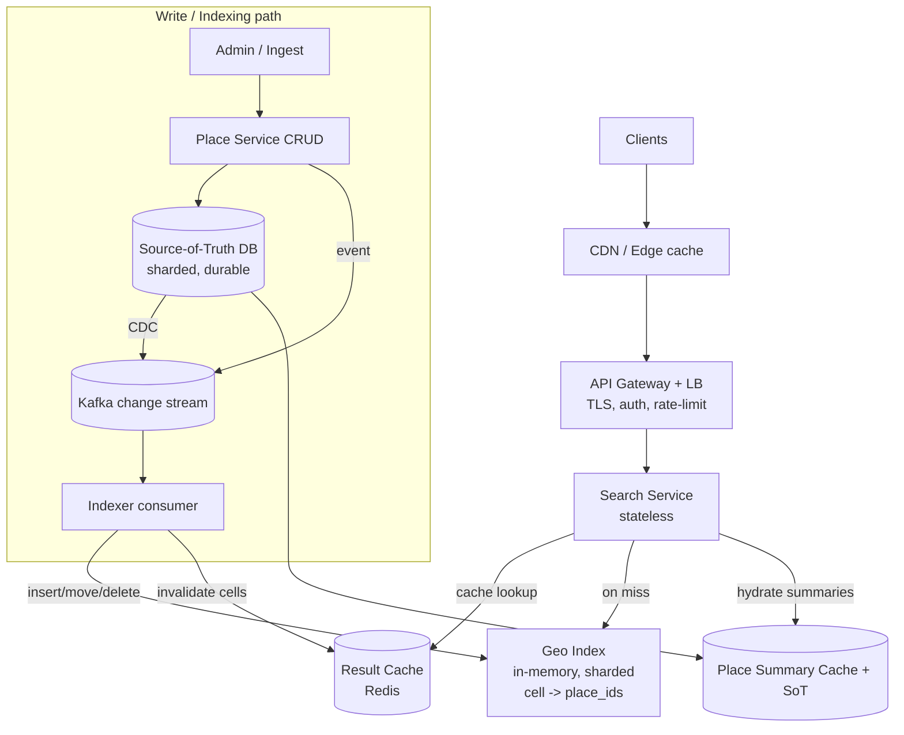
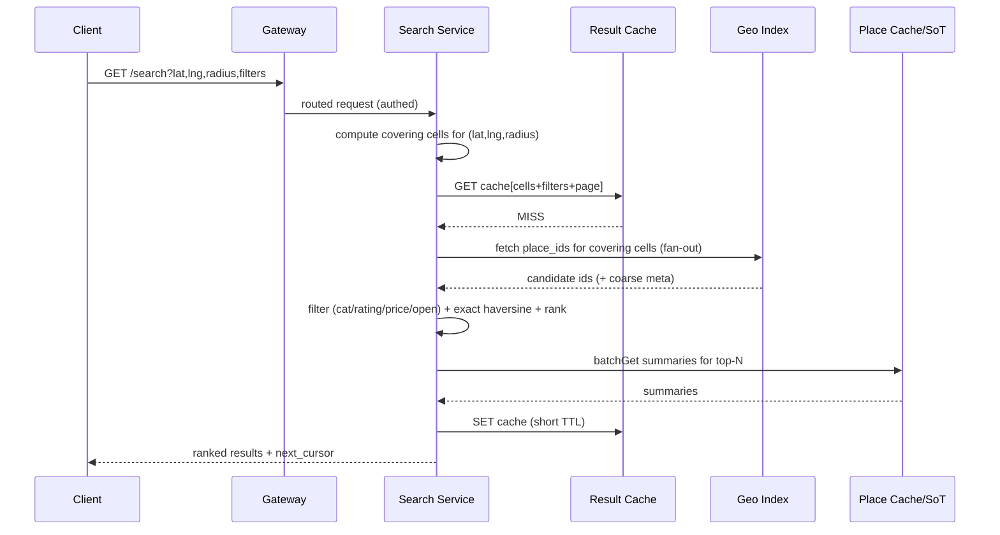
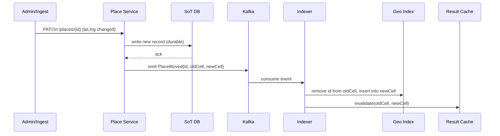

# Design a Proximity Service (Yelp / Nearby Places) — High-Level Design

> Staff-level HLD reference and interview-practice artifact. The goal is not just "an answer" but the *design judgment*: how to clarify, estimate, choose a geospatial index, and defend it under pressure.

---

## 1. Problem & Clarifying Questions

### 1.1 Restating the problem

Build the backend service that powers "find places near me" in an app like Yelp, Google Maps, or a food-delivery app. A user opens the app at some `(lat, lng)`, optionally types a query ("coffee", "italian") and/or filters (rating, price, open-now), and the service returns a ranked list of nearby businesses — typically the top N within some radius, ordered by distance and/or relevance. The business catalog itself (name, address, hours, photos, reviews) is maintained out of band; our job is the **spatial search + serving layer**, plus the path that keeps the spatial index fresh as business data changes.

This is, at its core, a **read-heavy geospatial range/k-NN query system** sitting in front of a moderately-sized, slowly-changing dataset. The hard part is almost never raw throughput — it is choosing the spatial index, handling **dense vs sparse regions** uniformly, and trading **freshness against read latency and cost**.

### 1.2 Questions I'd ask the interviewer first

A senior answer never jumps to boxes-and-arrows. I'd spend the first 3–5 minutes pinning down scope. Grouped:

**Functional scope**
- What exactly does "nearby" mean — fixed radius (e.g. within 5 km), **k-nearest** regardless of radius, or both? (They have different index/query implications.)
- Is this **search** (free-text query + category filters) or **pure spatial browse** ("show me everything around this pin")? Do we own ranking/relevance or just spatial retrieval that another service ranks?
- Do we return a **page** of results (pagination / "load more") or just the first N?
- Filters required at launch: category, rating, price, open-now, distance? Are filters AND-combined?
- Do we need **"places I'm passing"** along a route, or only point-radius? (Route corridor search is a different problem — flag as out-of-scope unless asked.)
- Who writes business data — internal ops tooling, business owners self-serving, or a third-party feed? How often does a business's **location** change vs its metadata (hours, rating)?

**Non-functional**
- **Latency target?** Nearby search is interactive: I'll assume **p99 < 200 ms** server-side.
- **Availability?** This is a discovery feature, not a payments path. I'll assume **99.9%** ("three nines") is fine; stale-but-up beats fresh-but-down.
- **Consistency / freshness?** When a business updates its hours or a new place is added, how fast must it appear in results — **seconds, minutes, or hours**? Reads can tolerate eventual consistency; the question is the staleness *budget*.
- **Geographic distribution?** Single region or global? Global means multi-region replication and edge serving.

**Scale**
- How many businesses total? (Tens of millions globally for a Yelp-scale catalog.)
- How many users / searches per day? Peak QPS? Read:write ratio?
- Catalog growth rate and update rate (writes/sec to business data)?

**Out-of-scope (confirm)**
- Reviews, photos, ratings *computation* (we consume a precomputed rating).
- Routing/directions, ETA, turn-by-turn.
- Real-time moving objects (drivers/users moving) — that's a *location tracking* problem (different design: hot writes, TTL'd positions). Here objects are mostly **static businesses**.
- Personalization/ML ranking beyond simple distance+rating (mention as an extension).

### 1.3 Assumptions I'll proceed with (stated, so they can be challenged)

- **~200M businesses** worldwide (generous; Yelp is ~tens of millions, but design for headroom).
- **~100M searches/day**, bursty, with a peak-to-average factor of ~5×.
- Read:write ratio **~1000:1** — the catalog changes slowly relative to how often it's read.
- Two query modes: **radius search** (within R km) and **k-nearest** (top-k by distance). We own spatial retrieval and a simple distance+rating ranking; full relevance/ML ranking is an extension.
- Freshness budget: new/changed places visible within **~minutes** (not sub-second). Strong consistency is *not* required for reads.
- Global service, multi-region read replicas; **p99 < 200 ms**, **99.9% availability**.

---

## 2. Requirements (Finalized)

### 2.1 Functional

1. **Search nearby** — given `(lat, lng, radius)` or `(lat, lng, k)`, return businesses, ranked.
2. **Filter** — by category, min rating, price tier, open-now.
3. **Rank** — primarily by distance, with rating as a tie-breaker / blend (configurable weight).
4. **Place CRUD** — add / update / remove a business; location changes must re-index spatially.
5. **Get place details** — fetch full metadata for a business by ID (read path that bypasses spatial search).

### 2.2 Non-functional

| Attribute | Target | Rationale |
|---|---|---|
| Read latency | p99 < 200 ms, p50 < 50 ms | Interactive feature; users abandon slow lists. |
| Write/index latency | New/changed place visible in < ~minutes | Catalog is slow-moving; freshness budget is generous. |
| Availability | 99.9% (reads); writes can be lower | Discovery, not transactional. Degrade gracefully (serve stale). |
| Consistency | Eventual for reads; read-your-writes not required | A new café not appearing for 2 minutes is acceptable. |
| Durability | High — don't lose business records | Source-of-truth DB must be durable + backed up. |
| Scalability | Horizontal on both read and index | Global traffic, regional skew (cities are dense). |

### 2.3 Key insight that shapes everything

The dataset is **large but slowly changing**, and reads dominate by 1000:1. That means: it is cheap to **precompute and heavily cache** spatial structures, and we can tolerate eventual consistency. The whole design leans into "build a read-optimized spatial index, keep it warm, refresh it asynchronously." The interview tension is **which spatial index** and **how to refresh it without serving badly stale or imbalanced results**.

---

## 3. Capacity Estimation (show the arithmetic)

> Numbers are illustrative; the point is the *method* and the conclusions (it fits in memory; reads dominate; index size is small).

### 3.1 Traffic / QPS

- Searches/day = 100M.
- Average QPS = 100M / 86,400 s ≈ **1,160 QPS**.
- Peak (5×) ≈ **~5,800 QPS** of search reads.
- Detail fetches (tap into a place) — assume ~3× search volume since users browse multiple → ~3,500 avg, ~17,000 peak QPS (cache-friendly, by ID).
- Writes: read:write 1000:1 → ~1,160 / 1000 ≈ **~1 write/sec** average to business data; bursty during bulk imports. **Writes are negligible** versus reads — this is the defining fact.

**Conclusion:** ~6K peak search QPS is modest. A handful of stateless query servers handle it. The challenge is latency consistency under regional skew, not aggregate QPS.

### 3.2 Storage — business records (source of truth)

Per business record:
- IDs, name, address: ~0.5 KB
- `(lat, lng)` (2× 8 bytes) + geohash/cell IDs: ~0.1 KB
- Category tags, price, hours, rating, counts: ~0.5 KB
- Misc / overhead: ~0.4 KB
- ≈ **1.5 KB / business** (excluding photos/reviews, which live elsewhere).

Total = 200M × 1.5 KB = **300 GB**. With replication (×3) and indexes, call it **~1 TB**. This is small — fits comfortably in a single sharded SQL/NoSQL cluster; no exotic storage needed.

### 3.3 Spatial index size (the part that must be fast)

The spatial index only needs `(place_id, lat, lng, cellID/geohash)` + maybe category bitset for pre-filtering:
- ~50 bytes/entry × 200M = **~10 GB**.

**This is the headline number:** the entire spatial index is **~10 GB**, which **fits in RAM** on a single large box, and certainly across a small cluster. That unlocks an in-memory index design (e.g., per-cell inverted lists in memory, backed by durable storage) — no disk seeks on the hot path.

### 3.4 Bandwidth

- A search response ≈ top 20 results × ~0.5 KB summary each ≈ **10 KB**.
- Peak egress = 5,800 QPS × 10 KB ≈ **58 MB/s ≈ 0.46 Gbps**. Trivial. CDN/edge can absorb cacheable variants.

### 3.5 Memory / cache

- Hot index in RAM: ~10 GB (above).
- Query-result cache: cache popular `(cell, query, filters)` tuples. Cities are Pareto-distributed — a small set of dense urban cells serves most traffic. Even 10–50 GB of result cache covers the long tail of repeat queries. **Cache hit ratio realistically 70–90%** for the "browse downtown" pattern.

### 3.6 Server / shard count

- Query tier: ~6K peak QPS, each result needing an in-memory range scan + ranking of maybe a few hundred candidates → a single modern core does thousands of such ops/sec. **~10 query nodes** per region (for headroom + HA), behind a load balancer, replicated.
- Index nodes: 10 GB fits on one node; shard for HA and write-fanout, say **3–6 index shards** + replicas.
- SoT DB: 1 TB → modest sharded cluster (e.g., **8–16 shards** with replicas), but mostly idle on writes.

**Takeaway for the interviewer:** "This system is not throughput-bound or storage-bound. The index fits in RAM. The real engineering is (a) choosing a spatial index that handles dense and sparse regions uniformly, (b) caching the read path, and (c) refreshing the index within the freshness budget without rebuild storms." That framing earns senior signal.

---

## 4. API Design

REST-ish over HTTPS; gRPC internally between services. All search endpoints are idempotent reads.

### 4.1 Search nearby

```
GET /v1/places/search
  ?lat=37.7749&lng=-122.4194
  &radius_m=2000                  # OR k=20 for k-nearest mode
  &category=coffee                # optional, repeatable
  &min_rating=4.0                 # optional
  &price=1,2                      # optional ($, $$)
  &open_now=true                  # optional
  &limit=20&cursor=<opaque>       # pagination
  &rank=distance|relevance        # ranking mode
```

Response:
```json
{
  "results": [
    {
      "place_id": "ChIJ...",
      "name": "Blue Bottle Coffee",
      "lat": 37.7765, "lng": -122.4233,
      "distance_m": 412,
      "rating": 4.5, "review_count": 1203,
      "price": 2, "categories": ["coffee","cafe"],
      "open_now": true
    }
  ],
  "next_cursor": "eyJjZWxsIjoi...",
  "search_origin_cell": "9q8yyk8"
}
```

Notes:
- `cursor` is opaque and encodes "where we left off" (e.g., last cell + last distance + tie-break id) so pagination is **stateless** and stable even as the index updates — don't use raw offset (offsets shift when data changes).
- Returning `distance_m` precomputed saves the client work and makes results explainable.

### 4.2 Place details (by ID — bypasses spatial search)

```
GET /v1/places/{place_id}        -> full metadata
GET /v1/places:batchGet          -> body: {place_ids:[...]}  (for hydrating search results)
```

### 4.3 Write / admin (internal, authenticated)

```
POST   /v1/places                 # create  {name, lat, lng, categories, ...}
PUT    /v1/places/{place_id}      # full update
PATCH  /v1/places/{place_id}      # partial (e.g., hours, rating)
DELETE /v1/places/{place_id}
```

Writes go to the **source-of-truth DB**, then asynchronously propagate to the spatial index (Section 7.4). A location change is special: it must **remove** the place from its old cell and **insert** into the new cell.

### 4.4 Why split search vs detail

Search returns lightweight summaries from the (cacheable) spatial layer; detail fetches the heavy record by primary key from the SoT/cache. This keeps search responses small and lets the two paths scale and cache independently. Hydration (`batchGet`) lets the client fetch full data only for what's actually shown.

---

## 5. High-Level Architecture

### 5.1 Request flow (in words)

1. Client → **CDN/Edge** (caches cacheable detail + some coarse search variants) → **API Gateway / LB** (TLS, auth, rate-limit).
2. Gateway → **Search Service** (stateless). It computes the query's covering cells (Section 7), checks the **Result Cache** (Redis), and on miss queries the **Geo Index** (in-memory, sharded).
3. Geo Index returns candidate `place_id`s for the covering cells. Search Service applies **filters** (category/rating/price/open-now), computes exact distances, **ranks**, paginates, and hydrates summaries (from a place-summary cache / SoT).
4. Response cached (short TTL) and returned.
5. **Write path (separate):** Admin/Ingest → **Place Service** → **SoT DB** (durable) → emits change event → **CDC/Stream (Kafka)** → **Indexer** updates Geo Index + invalidates affected cache cells.

### 5.2 ASCII block diagram

```
                       ┌─────────────┐
        Clients ─────▶ │   CDN/Edge  │  (cache: details, coarse search)
                       └──────┬──────┘
                              ▼
                       ┌─────────────┐   TLS, authN/Z,
                       │ API Gateway │   rate limit, routing
                       │     + LB    │
                       └──────┬──────┘
                              ▼
        ┌───────────────────────────────────────────────┐
        │              Search Service (stateless)        │
        │  cover-query → cache lookup → index fan-out     │
        │  → filter → exact-distance → rank → paginate    │
        └───┬──────────────┬───────────────────┬─────────┘
            │ miss         │                   │ hydrate
            ▼              ▼                   ▼
     ┌────────────┐  ┌──────────────────┐  ┌──────────────┐
     │ Result     │  │  Geo Index       │  │ Place Summary│
     │ Cache      │  │  (in-mem, shard) │  │ Cache + SoT  │
     │ (Redis)    │  │  cell→[place_ids]│  │              │
     └────────────┘  └─────▲────────────┘  └──────▲───────┘
                           │ updates              │ reads
                           │                      │
   WRITE PATH              │                      │
   ┌──────────┐   ┌──────────────┐   ┌──────────────────────┐
   │ Admin /  │──▶│ Place Service│──▶│  Source-of-Truth DB   │
   │ Ingest   │   │ (CRUD)       │   │  (sharded, durable)   │
   └──────────┘   └──────┬───────┘   └──────────┬───────────┘
                         │ change event          │ CDC
                         ▼                        ▼
                  ┌─────────────────────────────────────┐
                  │  Kafka (change stream)              │
                  └──────────────┬──────────────────────┘
                                 ▼
                          ┌──────────────┐
                          │   Indexer    │ updates Geo Index,
                          │  (consumer)  │ invalidates cache cells
                          └──────────────┘
```

### 5.3 Mermaid diagram



### 5.4 Sequence — radius search (cache miss)



### 5.5 Sequence — location update (re-index)



---

## 6. Data Model & Storage Choices

### 6.1 Entities

**Business / Place (source of truth):**
```
place_id        (string, PK)        -- stable external id
name            text
address         struct
lat, lng        double
geocell         string/int64        -- precomputed cell id (geohash or S2 cell token)
categories      set<string>
price           tinyint (1..4)
rating          float                -- precomputed; fed in from review service
review_count    int
hours           json                 -- weekly schedule, used for open_now
status          enum(active, closed, hidden)
version         int64                -- monotonic, for idempotent indexing
updated_at      timestamp
```

**Spatial index entry (derived, in-memory + durable backup):**
```
cell_id -> [ {place_id, lat, lng, category_bits, rating, price} ... ]
```
A compact per-cell **inverted list** of place stubs, enough to filter + rank without touching SoT, then hydrate only the survivors.

### 6.2 Which datastore, and why

| Need | Choice | Why (and the failure mode it avoids) |
|---|---|---|
| Source-of-truth catalog | **Sharded RDBMS or document store** (Postgres / Cassandra / DynamoDB) keyed by `place_id` | Strong durability + simple PK lookups for details. Avoids losing canonical data and avoids complex spatial logic in the SoT. |
| Spatial index | **Custom in-memory index** (cell → list), sharded by cell prefix, replicated; backed by a durable copy (e.g., periodically snapshotted, rebuildable from SoT) | Fits in RAM (~10 GB), giving sub-ms candidate retrieval. Avoids per-query disk seeks and avoids coupling read latency to the SoT. |
| Result cache | **Redis** (TTL'd, keyed by cells+filters+page) | Absorbs the Pareto "downtown" traffic. Avoids re-scanning the index for identical popular queries. |
| Change stream | **Kafka** | Decouples writes from indexing; replayable for rebuilds. Avoids losing updates and avoids synchronous coupling between Place Service and Indexer. |

**Why not just use a database's native geo support?** PostGIS (`GiST` spatial index), MongoDB `2dsphere`, Elasticsearch `geo_point`, or Redis `GEOSEARCH` are all *legitimate* answers and I'd name them. For a senior round I'd say: "I'd **start** with PostGIS or Elasticsearch geo for time-to-market — they implement R-trees / BKD-trees and handle radius + k-NN out of the box. I'd move to a custom in-memory cell index only when (a) the dataset is provably RAM-sized, (b) read latency p99 must be tight and predictable, and (c) I need fine control over dense-region behavior and caching." Naming the off-the-shelf option *and* the threshold to outgrow it is the senior move — it shows I'm not building NIH infrastructure for its own sake.

> *Term:* an **R-tree** groups nearby objects into nested bounding rectangles for range search; **BKD-tree** is a disk-friendly variant used by Lucene/Elasticsearch. **GiST** is Postgres's generalized search-tree framework that PostGIS uses.

---

## 7. Deep Dives (the bulk)

The genuinely hard sub-problems: **(7.1)** choosing the geospatial index; **(7.2)** translating "within radius / k-nearest" into index operations; **(7.3)** dense vs sparse regions (the failure mode of naive grids); **(7.4)** keeping the index fresh without rebuild storms; **(7.5)** read-path caching & ranking. These are where the interview is won or lost.

---

### 7.1 Geospatial index: Geohash vs Quadtree vs S2 (vs raw grid)

The core question: **how do we map 2D space onto a 1D key (or tree) so that "near in space" ≈ "near in index", enabling efficient range scans?**

> *Terms.* **Geohash:** encodes `(lat,lng)` into a base-32 string by recursively bisecting lat/lng ranges; common prefix length ≈ spatial proximity. **Quadtree:** a tree that recursively splits each region into 4 quadrants, subdividing only where density is high — naturally **adaptive**. **S2:** Google's library that projects the sphere onto 6 cube faces and uses a **Hilbert space-filling curve** to assign each cell a 64-bit ID, so 1D-adjacent IDs are 2D-adjacent. A **space-filling curve** is a path that visits every cell of a grid while keeping consecutive cells spatially close.

#### Options compared

| Property | **Uniform grid** | **Geohash** | **Quadtree** | **S2 (Hilbert)** |
|---|---|---|---|---|
| Cell shape | Fixed squares | Lat/lng rectangles (varying size by latitude) | Adaptive squares | Near-equal-area sphere cells |
| Adaptive to density | No | No (fixed precision) | **Yes** (subdivides dense areas) | Partly (choose cell level per query; cells can be capped) |
| Key type | (x,y) | **Sortable string prefix** | Tree path | **Sortable 64-bit int** |
| Range scan friendliness | Poor (no locality) | **Good** (prefix range) | Needs tree traversal | **Excellent** (Hilbert preserves locality better than Z-order/geohash) |
| Distortion at poles / antimeridian | High | High (rectangles stretch) | High | **Low** (sphere-aware) |
| "Edge problem" (neighbors across boundary) | Yes | Yes — must query 8 neighbors | Mitigated by traversal | Mitigated — `getCovering` returns all touching cells |
| Implementation effort | Trivial | Low (easy to explain) | Medium (rebalancing) | Medium-high (library, but battle-tested) |
| Used by | — | Many tutorials, some prod | Older map systems, Uber early | Google Maps, Uber H3-adjacent ecosystems, Pokémon GO-style |

> *Z-order / Morton code:* an alternative space-filling curve (interleave bits of x and y). Geohash is essentially a base-32 Z-order curve. Hilbert (S2) has *better* locality — fewer "long jumps" where 1D-adjacent cells are spatially far — which means fewer wasted scans.

#### The two real problems any choice must solve

1. **The boundary/edge problem.** A point near a cell's edge has its nearest neighbors in the *adjacent* cell. With geohash, the canonical fix is to query the center cell **plus its 8 neighbors** (compute neighbor geohashes), union the candidates, then filter by true distance. S2's `RegionCoverer` directly returns the set of cells that cover a cap (circle), sidestepping manual neighbor math. **Failure mode avoided:** missing the closest restaurant because it sits 30 m away but across a geohash boundary.

2. **Fixed precision vs density (the killer).** A fixed geohash precision is a tradeoff you can't win globally: precision-6 (~1.2 km cells) means a single downtown cell holds *tens of thousands* of restaurants (slow scan), while a rural precision-6 cell holds *zero* (you must expand outward and re-query). See 7.3.

#### Decision

**Use S2 (or an equivalent hierarchical cell system like H3) as the primary index, with the spatial layer storing cell→place inverted lists.** Reasoning:

- **Hierarchy gives variable resolution for free.** S2 cells exist at 30 levels; I can index each place at a fine level and **query at a coarse level**, or use a **covering** that mixes levels. This is the cleanest tool for dense/sparse (7.3).
- **Sortable 64-bit IDs** make range scans and sharding trivial, and Hilbert locality minimizes scan waste.
- **`RegionCoverer`** cleanly turns "circle of radius R" into "this set of cells to scan," solving the edge problem without hand-rolled neighbor logic.
- **Sphere-aware**: no antimeridian/pole hacks.

**Why I'd still *mention* geohash:** it's trivially explainable, debuggable (you can read the string), and stores naturally as a DB column with prefix indexing. For a smaller/simpler system I'd happily use geohash + 8-neighbor expansion. I name it to show I'm choosing S2 for *reasons*, not cargo-culting. **Quadtree** I'd reserve for in-memory adaptive structures where I control the tree and want true density adaptation without level bookkeeping; its weakness is harder horizontal sharding (tree nodes are awkward to distribute and rebalance under concurrent writes).

---

### 7.2 Translating "within radius" and "k-nearest" into index ops

**Radius search (within R):**
1. Build a **cap** (spherical circle) of radius R around `(lat,lng)`.
2. `RegionCoverer.getCovering(cap)` → set of cells `{c1..cn}` at an appropriate level (choose level so each cell is small relative to R, e.g., a handful of cells cover the cap).
3. For each cell, fetch its inverted list (fan-out to the right index shards).
4. **Union** candidates, compute **exact haversine distance**, drop those > R (covering cells overflow the circle slightly), apply filters, rank, paginate.

> *Haversine:* the standard formula for great-circle distance between two lat/lng points on a sphere. Cheap; we only run it on the few hundred candidates a covering yields, not the whole DB.

**k-nearest (top-k by distance, no fixed radius):**
- Start with a covering at a level whose cells are expected to contain ≥ k places (estimate from density stats). Fetch, compute distances, take top-k.
- If fewer than k candidates (sparse region), **expand**: go to a coarser cell level or add ring(s) of neighboring cells, re-fetch, until ≥ k. This is an **expanding-ring search**.
- Stop condition: once you have k candidates whose max distance is ≤ the distance to the nearest *unscanned* cell boundary, you're guaranteed correct (no closer point can hide outside).

**Pagination:** the cursor encodes `(last_cell_scanned, last_distance, last_place_id)`. Resuming continues the distance-ordered merge from there. Because results are ordered by a stable composite key, inserts/deletes between pages don't cause duplicates or skips the way numeric offsets would. **Failure mode avoided:** "load more" showing the same restaurant twice because a new place shifted the offset.

---

### 7.3 Dense vs sparse regions — the make-or-break deep dive

This is the problem that separates a real design from a tutorial. **Manhattan and the Mojave cannot share one fixed cell size.**

**The failure modes:**
- *Dense cell (downtown):* one cell holds 50,000 places. Scanning + ranking 50,000 to return 20 is slow and memory-heavy; the cache entry is huge; every "coffee near Times Square" hammers the same hot shard.
- *Sparse cell (rural):* the user's cell and its 8 neighbors are empty; you must keep **expanding** outward, issuing several index round-trips before you find anything → high tail latency exactly where you'd least expect it.

**Strategies (and tradeoffs):**

| Strategy | How it works | Pros | Cons / failure mode |
|---|---|---|---|
| **Fixed precision** | One geohash/S2 level globally | Simple, predictable keys | Fails both extremes (above). Reject. |
| **Adaptive subdivision (quadtree / S2 with cap)** | Subdivide a cell into children once it exceeds a max count (e.g., 1000 places); merge children when sparse | Each leaf holds a bounded count → bounded scan; sparse areas use big leaves → fewer round-trips | Bookkeeping; rebalancing on writes; sharding the tree is harder |
| **Multi-resolution index** | Index every place at *several* S2 levels (coarse..fine); query picks the level matching local density | No rebalancing; query-time choice | More storage (place appears in multiple level lists); pick-level logic needs density stats |
| **Per-cell overflow lists / capacity caps** | Hard cap candidates scanned per cell; rank within | Bounds work | Can miss results if cap too low — correctness risk |

**Decision: adaptive cells with a max-occupancy threshold (quadtree-style splitting on top of S2 cells), plus a precomputed density map.**

- Maintain a **density map**: how many places per coarse cell. Query-time, the Search Service uses it to choose the covering **level**: dense area → finer cells (small lists, scan few); sparse area → coarser cells (one fetch likely yields enough).
- For extremely dense cells, **subdivide** so no leaf exceeds ~1000 places; this bounds per-cell scan cost and keeps per-cell cache entries small and individually invalidatable.
- For sparse regions, the density map lets us start the covering at a coarse level so the *first* fetch usually returns candidates — avoiding the multi-round expanding-ring latency spike.

**Failure modes this avoids:** (1) the "Times Square hot cell" — 50k-place scans become 20× ~1k-place scans across child cells, parallelizable and individually cacheable; (2) the "Mojave tail latency" — coarse-first covering means we don't do 4 sequential expansions to find the one gas station.

**Hot-shard mitigation for dense cells:** the busiest cells (downtowns) are also the most-queried. Two defenses: (a) **replicate hot shards** more aggressively (more read replicas for cells above a query-rate threshold); (b) the **result cache** absorbs near-identical "browse downtown" queries (high hit rate). Together they keep a viral location from melting one node. **Failure mode avoided:** a single trending neighborhood saturating one index shard while the rest of the fleet idles.

---

### 7.4 Keeping the index fresh — consistency vs freshness without rebuild storms

The SoT changes ~1 write/sec average but bursts during bulk imports. We need the spatial index + caches to reflect changes within the **~minutes** budget, without (a) tightly coupling writes to reads or (b) periodic full rebuilds that cause "rebuild storms."

**Approach: event-driven incremental indexing via CDC/Kafka.**

1. Place Service writes to SoT (durable, source of truth).
2. SoT emits a change event (via **CDC** — change-data-capture, reading the DB's replication log — or the service double-writes an event). Event carries `place_id`, `version`, and for location changes both `oldCell` and `newCell`.
3. **Indexer** consumes the stream and applies the delta to the in-memory index: insert / update-in-place / **move** (delete from old cell list, add to new) / delete.
4. Indexer **invalidates** affected cache cells (old + new).

**Idempotency & ordering:** events carry a monotonic `version`. The Indexer applies an event only if `version > current` for that place — so duplicate or out-of-order deliveries (Kafka is at-least-once) don't corrupt the index. Partition Kafka by `place_id` so all events for one place are ordered on one partition. **Failure mode avoided:** a stale "move" event arriving after a newer one and teleporting a business back to its old location.

**Why not periodic full rebuild?** Rebuilding 200M entries on a schedule is wasteful, spikes load ("rebuild storm"), and the freshness is bounded by the rebuild interval. Incremental keeps the index continuously fresh at constant low cost.

**But keep rebuild as a safety net.** The index is *derived* — we must be able to reconstruct it from SoT (or a snapshot + Kafka replay). Use cases: bringing up a new index shard/replica, recovering a corrupted node, or after a bad deploy. Strategy: load the latest **snapshot**, then **replay Kafka** from the snapshot's offset to catch up. **Failure mode avoided:** an unrecoverable index because we treated derived state as precious.

**Consistency model spelled out:** reads are **eventually consistent**. A write is durable immediately in SoT; it becomes visible in search after the indexer lag (seconds) + cache TTL/invalidation. We **do not** promise read-your-writes for search (a business owner editing hours may not see it in nearby-search for a minute, though `GET /places/{id}` — which reads SoT/summary cache — can be made read-your-writes if needed). This is the correct tradeoff for a discovery feature: **availability and read latency over immediate consistency.** I'd state this explicitly and tie it to the requirement in 2.2.

---

### 7.5 Read-path: caching, ranking, and keeping p99 tight

**Caching layers (top to bottom):**
- **CDN/edge:** cache `GET /places/{id}` details (long TTL, invalidate on update) and possibly coarse, filter-less "browse this area" responses keyed by a snapped, low-precision cell.
- **Result cache (Redis):** key = hash(covering-cells + normalized filters + page). Short TTL (e.g., 30–120 s) bounds staleness; invalidation on cell change provides freshness. Normalize filters (sort, canonicalize) so equivalent queries hit the same key. **Snap the origin** to a coarse cell so two users 50 m apart share a cache entry — huge hit-rate win for "downtown" without meaningfully changing results (we still compute exact distance from their true point on the candidate set; or accept coarse distance for the cached browse case).
- **In-memory index:** the candidate fetch itself (no disk).
- **Place-summary cache:** small per-place stubs for hydration, hot in Redis.

> Caching insight: the *candidate set* for a coarse cell is far more cacheable than the *final ranked list* for an exact point. A good design caches the **cell candidate lists** (change rarely) and does the cheap per-request exact-distance + filter on top. This maximizes hit rate while keeping per-user accuracy.

**Ranking.** Default: distance-first, then rating. A blended score, e.g.:
```
score = w_d * distance_decay(distance_m) + w_r * normalize(rating) * log(review_count) - w_p * price_penalty
```
where `distance_decay` falls off smoothly (closer is better but a 4.8-star place 600 m away can beat a 3.2-star place 200 m away if `w_r` is tuned). Keep weights server-configurable; this is also the natural hook for the **ML-ranking extension** (8.x). Ranking runs on the small candidate set (hundreds), so it's cheap.

**Tail-latency tactics:** fan-out to index shards in parallel with a **hedged request** (send a duplicate to a replica if the first is slow) and a per-shard timeout; if one shard is slow, return partial results rather than blocking the whole query (degrade gracefully). **Failure mode avoided:** one slow shard dragging p99 for all queries that happen to touch it.

---

## 8. Scaling & Bottlenecks

**How it scales.**
- *Query tier:* stateless → scale horizontally behind LB; autoscale on QPS. Multi-region: route users to nearest region; each region has full index replica (10 GB is cheap to replicate).
- *Index tier:* shard by cell-ID range (Hilbert/S2 IDs sort spatially, so a range maps to a contiguous region). Replicate each shard for HA and read throughput.
- *SoT:* shard by `place_id`; mostly read for details, trivially scaled with replicas + cache.
- *Cache:* Redis cluster, sharded by key; scales with traffic.

**Where it breaks first, and the fix:**

| Bottleneck | Symptom | Fix |
|---|---|---|
| **Hot dense cell / trending area** | One index shard saturates; p99 spikes for that region | Subdivide dense cells (7.3); extra replicas for hot shards; result cache absorbs repeats |
| **Cache stampede on invalidation** | Popular cell invalidated → thundering herd recomputes | Request coalescing (single-flight) + soft TTL / stale-while-revalidate |
| **Indexer lag during bulk import** | Freshness budget blown; index behind | Scale Indexer consumers (more Kafka partitions); throttle/prioritize location-changes over metadata-only |
| **Cross-region replication lag** | Region B shows older data than A | Acceptable per eventual-consistency model; monitor lag, alert if > budget |
| **Fan-out width** (huge covering) | Many shards hit per query | Choose covering level via density map to bound cell count; cap covering size |
| **SoT write bursts** | Import floods DB | Batch writes; backpressure on ingest; the read path is unaffected (decoupled) |

**Sharding choice defended:** shard the index by **spatial cell range**, not by hashing place_id. A single query touches a contiguous spatial region, so spatial sharding keeps a query's fan-out to a small number of *adjacent* shards. Hash sharding would scatter one neighborhood across all shards → every query fans out to everything. The risk of spatial sharding is **hotspots** (dense regions) — mitigated by 7.3 (subdivision + replication). **Failure mode avoided:** N-way fan-out per query that makes p99 = the slowest of N shards.

---

## 9. Reliability, Consistency & Security

**Failure handling.**
- *Index node down:* replicas serve; a recovering node loads snapshot + replays Kafka. Serving continues on degraded redundancy.
- *Cache down:* fall through to index (slower but correct); circuit-break to avoid amplifying load.
- *Indexer down:* Kafka retains events; on recovery, consume from last committed offset — **no lost updates**, just temporary staleness.
- *SoT down:* writes pause (acceptable — writes are rare); reads continue from index + caches (stale-but-up). This is the deliberate "discovery over transactional" stance.
- *Region down:* DNS/LB fails users over to another region; that region's full replica serves them.

**Consistency model (restated crisply).** SoT is strongly consistent and durable. Search is **eventually consistent** with a bounded staleness (indexer lag + cache TTL). Per-place detail reads can be read-your-writes by hitting SoT/summary cache directly. We explicitly trade immediate global consistency for availability and low read latency — appropriate because a 1-minute delay in a café appearing is harmless.

**Durability.** SoT replicated (×3) + backups + point-in-time recovery. The spatial index is **derived and rebuildable**, so it needs only snapshot + Kafka retention, not the same durability guarantees.

**Idempotency.** Writes carry client-supplied request IDs (dedupe retries at Place Service); index events carry monotonic `version` (Indexer applies highest-wins). Search reads are naturally idempotent.

**Security & abuse.**
- *AuthN/Z:* gateway terminates TLS, validates API keys / OAuth tokens; admin/write endpoints require elevated scopes + audit logging.
- *Rate limiting:* per-API-key and per-IP token buckets at the gateway; protects against scraping the entire catalog via systematic radius walks. Detect **scraping patterns** (sequential grid-walking) and throttle/captcha.
- *Input validation:* clamp `radius_m` and `limit` (a 50,000 km radius would force a global scan — reject/clamp); validate lat∈[-90,90], lng∈[-180,180].
- *PII:* user query locations are sensitive; log coarsely (snap to cell), short retention, don't tie precise traces to user IDs longer than needed.
- *Tenant isolation / poisoning:* validate business writes (a malicious or buggy import shouldn't relocate every business to (0,0) — the "Null Island" classic; sanity-check coordinate distributions on ingest).

---

## 10. Extensions & Follow-ups

| Interviewer asks… | How the design changes |
|---|---|
| **Real-time moving objects** (drivers, friends) | Different beast: high write rate, TTL'd ephemeral positions. Use an in-memory geo store (Redis `GEO` / a quadtree refreshed every few seconds), short TTLs, no durable SoT per position. Static-business index unchanged. |
| **Personalized / ML ranking** | Insert a ranking service after candidate retrieval; features = distance, rating, user history, time-of-day, embeddings. Retrieval (S2) stays the same; only the scoring step changes. Cache becomes user-segment-aware. |
| **Search-as-you-type / autocomplete** | Add a separate text index (Elasticsearch/Lucene) for name/category prefix; intersect with spatial candidates, or geo-filter the text results. Two indexes, combined at query time. |
| **"Open now" correctness across time zones** | Store hours in local time + tz; evaluate `open_now` at query time using the place's tz, not the server's. Precompute next-open transitions to make it filterable cheaply. |
| **Global, multi-region writes** | Move from single-writer SoT to multi-region with conflict resolution (last-writer-wins on `version`, or CRDTs for additive fields). Index replicates per region via regional Kafka. |
| **Polygon / "is this address in delivery zone?"** | Point-in-polygon queries — index polygons by their covering S2 cells, then exact point-in-polygon test on candidates. Reuses the cell machinery. |
| **Heatmaps / "how busy is this area"** | Precompute aggregates per cell (counts, avg rating) — already have the density map; extend it. |
| **Radius along a route** ("places on my drive") | Cover the route's buffer (a corridor polygon) with S2 cells; same retrieval, different region shape. |

---

## 11. Interview Q&A

**Q1. Why S2 over geohash?**
Hierarchy (variable resolution for dense/sparse), sortable 64-bit IDs for clean sharding, Hilbert-curve locality (less scan waste than geohash's Z-order), and sphere-aware cells (no pole/antimeridian distortion) with `RegionCoverer` solving the edge problem natively. I'd still ship geohash for a smaller system because it's trivially debuggable and stores as a DB-prefix column. *Senior signal: names the threshold to choose one over the other.*
*Probe — what's the geohash edge problem?* A point near a cell boundary has neighbors in the adjacent cell; you must query the 8 neighboring geohashes and union, or you miss the closest result.
*Probe — what is Hilbert vs Z-order locality?* Both are space-filling curves; Hilbert has fewer "long jumps" where 1D-adjacent cells are spatially far apart, so contiguous index ranges map to more compact regions → fewer wasted reads.

**Q2. How do you handle a downtown cell with 50,000 places?**
Subdivide adaptively so no leaf cell exceeds ~1,000 places (bounded scan), parallelize the fan-out across child cells, replicate the hot shard for read throughput, and lean on the result cache (near-identical "browse downtown" queries hit it). Failure avoided: one hot shard melting while the fleet idles.
*Probe — won't subdivision hurt sparse areas?* That's why we use a **density map** to pick the covering level per query: coarse cells in the Mojave, fine cells in Manhattan.

**Q3. Radius search vs k-nearest — how do the queries differ?**
Radius: cover a cap of radius R with cells, fetch, exact-distance filter ≤ R. k-NN: start with a covering expected to hold ≥ k, and **expand** (coarser level or neighbor rings) until you have k whose max distance ≤ distance to nearest unscanned boundary (correctness guarantee).

**Q4. What's your consistency model and why is it acceptable?**
SoT strongly consistent/durable; search eventually consistent with bounded staleness (indexer lag + cache TTL). A new café appearing a minute late is harmless, so we trade immediate consistency for availability and low read latency. Detail-by-id can be read-your-writes by hitting SoT. *Senior signal: ties the choice to the product, not dogma.*

**Q5. How do you keep the index fresh without full rebuilds?**
Event-driven incremental indexing: SoT change → CDC/Kafka → Indexer applies the delta (insert/move/delete) + invalidates affected cache cells. Monotonic `version` per event gives idempotency under at-least-once delivery; partition by place_id for ordering. Full rebuild is kept only as a recovery path (snapshot + Kafka replay). Failure avoided: rebuild storms and stale "move" events teleporting businesses.

**Q6. Why shard the index spatially instead of by place_id hash?**
A query touches a contiguous region; spatial (cell-range) sharding keeps fan-out to a few adjacent shards. Hash sharding scatters one neighborhood across all shards, so p99 becomes the slowest of N. The cost — hotspots — is mitigated by subdivision + hot-shard replication. *Senior signal: states the tradeoff and the mitigation, not just the choice.*

**Q7. Where does this system break first under 10× load?**
Hot dense/trending cells (one shard saturates) before aggregate QPS matters, because the index is tiny and the tier is stateless. Fix: subdivide + replicate hot shards + result cache + request coalescing on invalidation.

**Q8. How do you make pagination stable while data changes?**
Opaque cursor encoding `(last_cell, last_distance, last_place_id)` and a stable composite sort order, not numeric offsets — so inserts/deletes between pages don't duplicate or skip results.

**Q9. Off-the-shelf or build? When would you just use PostGIS / Elasticsearch?**
Start with PostGIS/ES geo for time-to-market (they implement R-tree/BKD and do radius + k-NN out of the box). Move to a custom in-memory cell index only when the dataset is provably RAM-sized, p99 must be tight and predictable, and you need fine control over dense-region behavior + caching. *Senior signal: resists NIH; defines the migration threshold.*

**Q10. How do you protect the catalog from scraping?**
Per-key/IP token-bucket rate limits, clamp radius/limit (reject global-scan requests), detect sequential grid-walking patterns and throttle/captcha, audit-log writes, and validate ingest coordinates (guard against the "Null Island" mass-relocation bug).

---

## 12. Cheat-Sheet & Self-Test

### 12.1 Dense recap

**Key numbers:** 200M places; ~1,160 avg / ~5,800 peak search QPS; read:write ≈ 1000:1 (~1 write/s); SoT ≈ 300 GB (~1 TB replicated); **spatial index ≈ 10 GB → fits in RAM**; response ≈ 10 KB; peak egress < 0.5 Gbps; p99 < 200 ms; freshness budget ≈ minutes; 99.9% availability.

**Defining facts:** not throughput- or storage-bound; index fits in memory; reads dominate 1000:1. The engineering is index choice, dense/sparse handling, caching, and async freshness.

**Decisions:** S2/H3 hierarchical cells (over geohash/quadtree/grid) for variable resolution + sortable IDs + Hilbert locality + native covering. Custom in-memory cell→place index, sharded by cell-range, replicated. SoT in sharded durable DB. Redis result cache (snapped coarse cell + normalized filters, short TTL). Event-driven incremental indexing via CDC/Kafka, idempotent by version; rebuild = snapshot + replay. Adaptive subdivision (≤~1k/leaf) + density-map level selection for dense vs sparse. Eventual consistency for search; read-your-writes available on detail-by-id. Hedged parallel fan-out + graceful partial results for tail latency.

**Diagram in words:** Client → CDN → Gateway(LB/auth/rate-limit) → stateless Search Service → [Result Cache | Geo Index (in-mem, cell-sharded) | Place-summary cache/SoT]. Write path: Admin → Place Service → SoT(durable) → CDC/Kafka → Indexer → updates Geo Index + invalidates cache cells.

**Failure modes avoided (one-liners):** geohash boundary miss → S2 covering; Times-Square hot cell → subdivide+replicate+cache; Mojave tail latency → coarse-first via density map; stale "move" event → version-monotonic idempotency; rebuild storm → incremental indexing; N-way fan-out → spatial range sharding; slow shard → hedged requests/partial results; offset pagination drift → cursor on stable sort key.

### 12.2 Self-test (no answers)

1. Derive why the spatial index fits in RAM, and explain how that single fact changes the architecture versus a disk-resident index.
2. A trending festival makes one S2 cell receive 40% of global query traffic for 6 hours. Walk through every layer's behavior and what saturates first.
3. Compare the correctness guarantees of expanding-ring k-NN vs fixed-radius search at a cell boundary. When can each return a wrong result, and how do you prevent it?
4. Design the exact Kafka event schema and Indexer apply-logic to make location moves idempotent and correctly ordered under at-least-once, out-of-order delivery.
5. The interviewer says freshness must drop from "minutes" to "sub-second" for newly opened businesses. What breaks, and what would you change (caching, indexing, consistency) to meet it — and what does it cost?
