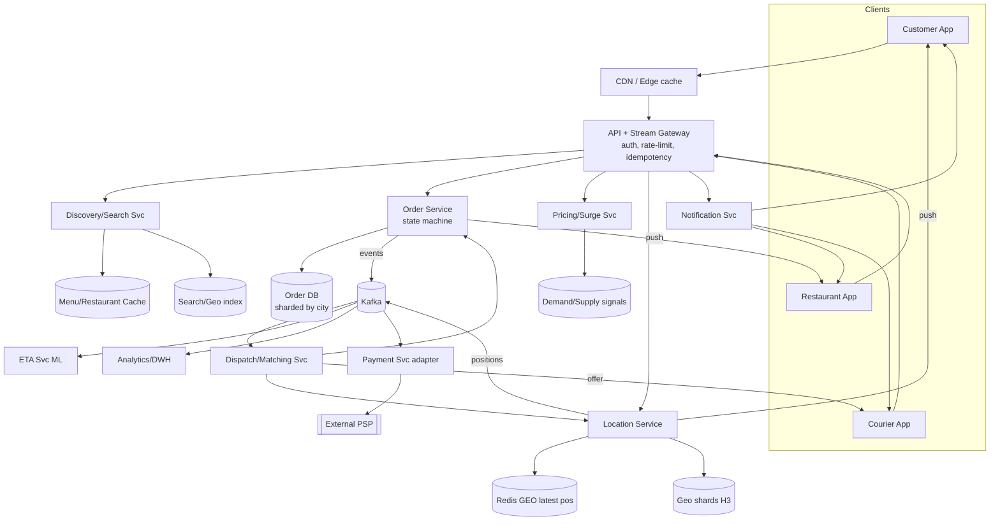
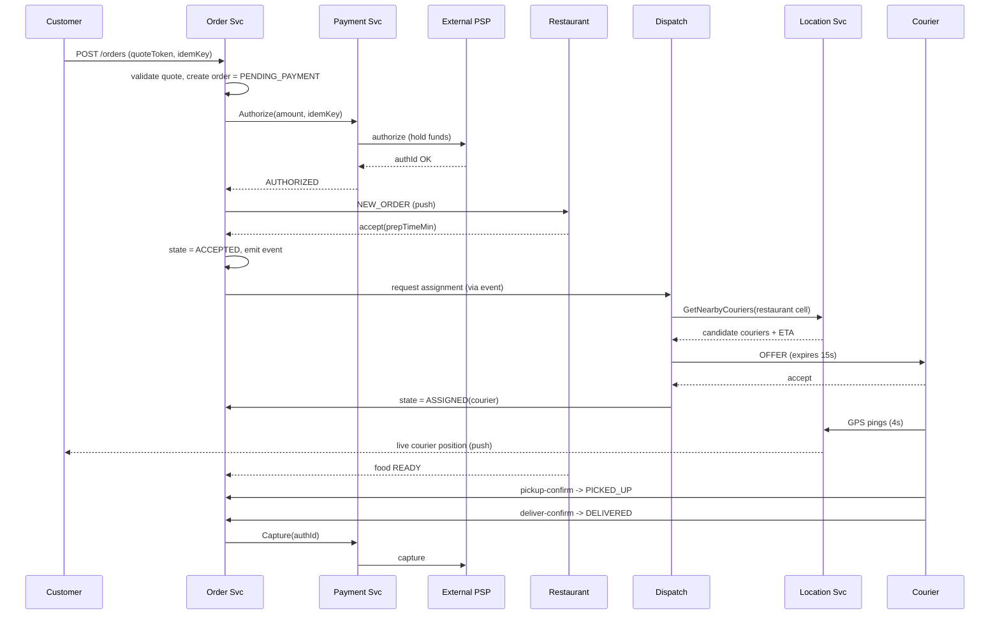
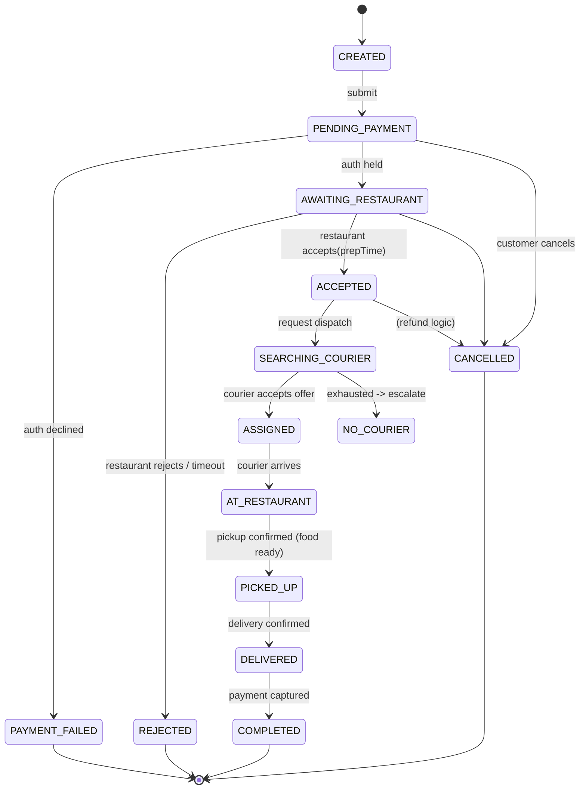
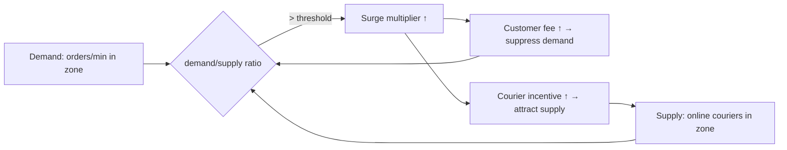

# Design a Food Delivery System (Swiggy / DoorDash)

> **Format:** Staff/principal-level HLD reference + interview practice artifact.
> **Reader:** senior backend engineer (Java/JVM, distributed systems) practising HLD. We assume the building blocks (LBs, caches, queues, sharding, replication, consensus) are known — the value here is *design judgment*: what to clarify, what to trade off, and how to defend each call by naming the failure mode it avoids.

---

## 1. Problem & clarifying questions

### 1.1 Restate the problem

Build a platform that connects **three independent actors** in a single transaction:

1. **Customer** — browses nearby restaurants, places an order, pays, and tracks it live until it arrives.
2. **Restaurant (merchant)** — publishes a menu, accepts/rejects orders, marks food ready.
3. **Delivery partner (courier / rider)** — is dispatched to a restaurant, picks up the order, and delivers it to the customer.

The defining property is that this is a **three-sided real-time marketplace with a physical fulfillment leg**. Unlike Amazon (warehouse → days) or Uber (one pickup, one drop, no third party preparing goods), a food order has a **perishable SLA measured in minutes**, a **prep step we don't control** (the kitchen), and a **courier whose travel we must overlap with cooking** to hit a 30-minute promise. The system is "correct" only if all three sides converge in space and time. That tension — coordinating three parties with independent, noisy, partially-observable timing — is the heart of the design.

### 1.2 Clarifying questions I'd ask the interviewer first

A senior candidate never opens with boxes. I'd ask these, grouped, and *state why each answer changes the design*.

**Functional scope**
- Are we building **all three apps** (customer, restaurant, courier) plus backend, or only the backend services? *(Affects API surface and whether we own the courier mobile SDK that streams GPS.)*
- Is **menu/restaurant discovery** (search, browse, filters) in scope, or do we assume the customer already knows the restaurant? *(Search is a large subsystem — geo + relevance + availability.)*
- Do we own **dispatch/assignment** of couriers (the matching algorithm), or is that a given black box? *(This is the single hardest optimization problem; I'd push to keep it in scope.)*
- Is **payments** in scope end-to-end, or do we integrate a PSP (payment service provider like Stripe/Razorpay/Adyen) and treat the boundary as an integration? *(Strong opinion: integrate a PSP; never build a card vault.)*
- **Order batching** (one courier carrying 2–3 orders) and **surge pricing** — in scope? *(They materially change dispatch and ETA.)*
- Scheduled/pre-orders, group orders, multi-restaurant carts, refunds/disputes, ratings — in or out for v1?

**Non-functional**
- What's the **delivery-time promise** and how strictly is it an SLA? *(30 min target; this sets ETA accuracy and dispatch aggressiveness.)*
- **Read vs write latency budgets?** Browsing should feel instant (<200 ms p99); placing an order can tolerate ~1 s; live tracking should update every few seconds.
- **Availability target** — is the whole platform 99.9% or 99.99%? Which flows are most critical? *(Order placement and active-order tracking must be more available than menu editing.)*
- **Consistency expectations** — can the customer briefly see a stale menu/price? *(Yes for browse.)* Can two writers ever double-charge or double-assign a courier? *(Absolutely not — those need strong guarantees.)*

**Scale**
- Geographies: single metro, single country, or global multi-region? *(Drives sharding by city vs region, and data residency.)*
- DAU / orders per day / peak concurrency, # restaurants, # active couriers? *(Drives every estimate.)*
- Peak shape — is it spiky (lunch 12–2pm, dinner 7–10pm)? *(Yes — this is the defining capacity-planning fact.)*

**Out-of-scope (proposed)**
- Building the PSP / card vault, the routing/maps engine (use a maps provider), fraud-ML internals, the recommendation ranker internals, accounting/GST/invoicing back office, and the courier-payout/settlement ledger beyond its API boundary. I'll *name the boundaries* but won't design their internals.

### 1.3 Assumptions I'll proceed with (stated, not silent)

- **Full backend + thin clients** for all three apps; we own the courier GPS-streaming SDK.
- **In scope:** discovery (geo + availability), order lifecycle, dispatch/assignment, live tracking, ETA, batching, surge, and the **payments integration boundary** (PSP integrated, not built).
- **Scale anchor:** a large region like India or a US metro cluster — **20M DAU**, **10M orders/day**, peak ~3× average concentrated in lunch/dinner windows, **500K restaurants**, **2M registered couriers / ~300K concurrently online at peak**.
- **Delivery promise:** ~30 min target; ETA shown to ±5 min.
- **Multi-region active-active eventually; single logical region for the core estimate**, sharded by **city/zone**.

---

## 2. Requirements (finalized)

### 2.1 Functional

**Customer**
- Discover nearby, *currently open & serviceable* restaurants (geo + filters + availability).
- View menu with live prices and item availability.
- Build a cart, see fees/taxes/surge and an **upfront ETA**, place an order, pay.
- Track the order live: state transitions + **courier location on a map** until delivery.
- Cancel (within rules), rate, get support/refund.

**Restaurant**
- Manage menu (items, prices, availability, hours), toggle "accepting orders."
- Receive new orders, **accept/reject**, set/adjust prep time, mark **food ready**.

**Courier**
- Go online/offline; receive **dispatch offers**, accept/decline.
- Navigate to restaurant → confirm pickup → navigate to customer → confirm delivery.
- Stream GPS continuously while on an active task.

**Platform**
- **Assignment/dispatch:** match each accepted order to the best courier (possibly batched).
- **ETA:** predict prep + travel time, recompute as reality unfolds.
- **Pricing:** base + distance + **surge** when demand > supply.
- **Order state machine** that is the single source of truth, coordinating all three sides.

### 2.2 Non-functional

| Property | Target | Rationale |
|---|---|---|
| **Browse/menu latency** | p99 < 200 ms | Discovery is the highest-QPS, "feels instant" path. |
| **Order placement latency** | p99 < 1 s (excluding 3-D Secure redirect) | Synchronous money + inventory check; correctness over speed. |
| **Tracking update freshness** | courier loc ≤ 3–5 s old | Map must feel live without melting batteries/backends. |
| **Availability — order & active-order paths** | 99.99% | An in-flight order failing = lost food, lost money, lost trust. |
| **Availability — menu edit / analytics** | 99.9% | Tolerable; not on the customer's critical path. |
| **Consistency — money & assignment** | strong (linearizable per order/courier) | No double-charge, no two couriers for one order. |
| **Consistency — browse/menu/ETA** | eventual (seconds) | Stale-but-fast is acceptable for discovery. |
| **Durability — orders & payments** | no loss; RPO≈0 | Financial + legal record. |
| **Durability — raw GPS pings** | lossy-tolerant | Latest position matters; we can drop old pings. |

### 2.3 Explicit assumptions

- Average order value irrelevant to capacity but ~₹400 / $20; **average ticket = 2.5 items**.
- A courier on an active task pings GPS every **4 s**; while idle-online, every **15–30 s**.
- A live order's tracking session lasts ~**30 min**.
- **Browse:sessions per order ≈ 10:1** (many people browse, fewer order).

---

## 3. Capacity estimation (arithmetic shown)

### 3.1 Orders & write QPS

- 10M orders/day ÷ 86,400 s ≈ **116 orders/s average**.
- Peak ≈ 3× average and concentrated: assume **~350 orders/s peak** order-creation.
- Each order generates a *burst* of state-write events across its lifecycle: created → paid → accepted → assigned → picked-up → delivered + dispatch attempts + ETA recomputes ≈ **~20 state writes/order**.
  - 10M × 20 = **200M order-state writes/day ≈ 2,300 writes/s avg, ~7K/s peak**. Modest; the order DB is not the scary part.

### 3.2 Browse / read QPS

- 10:1 browse:order ⇒ **100M discovery sessions/day**; each session ~5 read calls (list, filters, 2–3 menus) ⇒ **500M reads/day ≈ 5,800 reads/s avg, ~17K/s peak**.
- This is **cache-dominated** (menus, restaurant lists). Target >95% cache hit ⇒ origin DB sees <1K reads/s. **Reads are an edge/caching problem, not a DB problem.**

### 3.3 Location streaming — the real firehose

- Concurrent online couriers at peak: **300K**.
- Of those, say **150K on active tasks** pinging every 4 s ⇒ 150K ÷ 4 = **37.5K pings/s**.
- Idle 150K pinging every 20 s ⇒ **7.5K/s**.
- **≈ 45K location writes/s at peak.** This is the dominant write workload by an order of magnitude.
- **Fan-out:** each active order has ~1 customer watching + dispatch logic. ~150K active orders, each pushing an update every ~4 s ⇒ ~37.5K outbound tracking messages/s to customers (plus dispatch consumers). Designed as a **push/streaming** problem, not request-per-second polling.

**Payload sizing:** a GPS ping ≈ `{courierId, lat, lng, ts, accuracy, speed, heading}` ≈ **~60–100 bytes** on the wire (binary/protobuf). 45K/s × 80 B ≈ **3.6 MB/s ≈ 29 Mbps** ingest. Trivial bandwidth; the cost is **connection count + write amplification**, not bytes.

### 3.4 Storage

| Data | Per-unit | Volume | Daily/Total |
|---|---|---|---|
| Orders | ~2 KB (items, addresses, prices, fks) | 10M/day | **~20 GB/day → ~7 TB/yr** (keep hot 90d, archive rest) |
| Order events (audit log) | ~300 B × 20 | 200M/day | **~60 GB/day** (TTL 30–90d in hot store, cold archive) |
| GPS pings (if persisted raw) | ~80 B | 45K/s ≈ 3.9B/day | **~310 GB/day raw** → we **don't keep raw**; keep latest in memory + downsampled "breadcrumb" trail per order (~1 point/15 s ≈ 120 pts × 80 B ≈ **10 KB/order → 100 GB/day**, TTL'd) |
| Menus/restaurants | ~50 KB/restaurant (items, images-by-ref) | 500K | **~25 GB** total, fits in cache comfortably |
| Courier/customer profiles | ~2 KB | 22M | **~44 GB** |

**Takeaway:** orders + events are the durable financial core (TB scale, easy). GPS is huge but **mostly ephemeral** — the design trick is *not persisting the firehose*.

### 3.5 Memory & shard/server counts

- **Live state in memory:** 300K online couriers' latest position + 150K active orders' state. ~450K entries × ~1 KB ≈ **<1 GB** of genuinely hot state. Fits in a sharded in-memory grid (Redis cluster) with room to spare; we shard for **throughput and locality**, not size.
- **Location ingest tier:** 45K writes/s. A single well-tuned Redis/geo node handles ~50–100K ops/s, but we shard **by geo (city/H3 cell)** for blast-radius isolation and locality ⇒ ~**8–16 shards** per large region, generously over-provisioned.
- **Order DB:** ~7K writes/s peak, 7 TB/yr. Comfortably **a sharded SQL/NewSQL cluster sharded by city** — say **16–32 shards**, each modest.
- **Connection tier (gateways for streaming):** 300K courier WS + ~150K customer tracking WS ≈ **~450K concurrent connections**. At ~50–100K connections/node, that's **~6–10 gateway nodes** (plus headroom and AZ spread → ~16).
- **Stateless app tier:** size to ~17K read-QPS + ~7K write-QPS peak with margin; ~30–50 mid-size pods autoscaled by city traffic. Not the constraint.

---

## 4. API design

Conventions: REST/HTTPS for request/response; **WebSocket / gRPC streaming** for live channels; all mutating calls take an **`Idempotency-Key`**. Auth via OAuth2/JWT, role-scoped.

### 4.1 Customer

```
GET  /v1/discovery/restaurants?lat=&lng=&radius=&cuisine=&open_now=true&sort=relevance
     → 200 { restaurants:[{id,name,rating,etaMin,deliveryFee,distanceM,isOpen,promoTags}], nextCursor }

GET  /v1/restaurants/{id}/menu
     → 200 { restaurantId, sections:[{name, items:[{id,name,price,available,addons}]}], version, prepTimeMin }

POST /v1/cart/quote                      # price + ETA preview before commit
     body { restaurantId, items:[{itemId,qty,addons}], deliveryAddrId }
     → 200 { subtotal, taxes, deliveryFee, surgeMultiplier, total, etaMin, quoteToken }

POST /v1/orders                          # place order (idempotent)
     headers { Idempotency-Key }
     body { quoteToken, paymentMethodId, deliveryAddrId, notes }
     → 201 { orderId, state:"PENDING_PAYMENT", paymentIntent:{clientSecret|redirectUrl} }

GET  /v1/orders/{id}                      # current snapshot
     → 200 { orderId, state, restaurant, courier:{name,vehicle,phoneMasked}, etaMin, timeline:[...] }

WS   /v1/orders/{id}/track                # live channel
     ← server push { type:"COURIER_LOC", lat,lng,heading,etaMin }
     ← server push { type:"STATE", state:"PICKED_UP", at }

POST /v1/orders/{id}/cancel  { reason }   → 200 { state, refund:{eligible,amount} }
POST /v1/orders/{id}/rating  { stars, tags, comment }
```

### 4.2 Restaurant

```
PUT  /v1/restaurants/{id}/menu/items/{itemId}   { available, price }   # menu edits
PUT  /v1/restaurants/{id}/accepting-orders      { accepting: true|false }
WS   /v1/restaurants/{id}/orders                 # inbound order stream
     ← { type:"NEW_ORDER", orderId, items, customerNote, expiresAt }
POST /v1/orders/{id}/accept   { prepTimeMin }    → 200
POST /v1/orders/{id}/reject   { reason }         → 200
POST /v1/orders/{id}/ready                       → 200   # food ready for pickup
```

### 4.3 Courier

```
POST /v1/courier/status        { online:true, lat, lng }
WS   /v1/courier/stream        # bi-directional: offers down, GPS up
     ↑ { type:"PING", lat,lng,ts,accuracy,speed,heading }      # every 4s on task
     ← { type:"OFFER", offerId, orderId|batchId, pickup, drop, payout, expiresInS:15 }
POST /v1/courier/offers/{offerId}/accept   (idempotent)   → 200 { task }
POST /v1/courier/offers/{offerId}/decline
POST /v1/orders/{id}/pickup-confirm                       → 200
POST /v1/orders/{id}/deliver-confirm   { proof? }         → 200
```

### 4.4 Internal RPCs (service-to-service, gRPC)

```
Dispatch.RequestAssignment(orderId) → assignmentDecision
Location.GetNearbyCouriers(geoCell, radius, filters) → [courierId, pos, etaToPickup]
ETA.Predict(restaurantId, prepFeatures, route) → {prepMin, travelMin, p50, p90}
Pricing.Quote(cart, geo, demandSignal) → {fees, surgeMultiplier, quoteToken}
Payment.Authorize(orderId, amount, paymentMethod, idemKey) → {authId, status}
Payment.Capture(authId) / Payment.Refund(authId, amount)
```

---

## 5. High-level architecture

### 5.1 Request flow narrative

Clients hit a global **CDN/edge** then an **API gateway** (auth, rate-limit, routing). Reads (discovery/menu) are served largely from **edge + read caches**. Writes route to domain services. The **Order Service** owns the lifecycle state machine and is the transactional spine; it emits events to **Kafka**, which fans out to **Dispatch**, **ETA**, **Notification**, **Analytics**. The **Location Service** is a separate high-throughput plane: courier GPS flows in via **streaming gateways** into a sharded **geo-index + in-memory latest-position store**, and out to watching customers and to Dispatch. **Payments** sits behind a clean adapter to an external PSP.

### 5.2 ASCII block diagram

```
                         ┌───────────────────────────────────────────────┐
   Customer App ─┐       │                  CDN / Edge                    │
 Restaurant App ─┼──────▶│         (static, menu read-cache, TLS)         │
   Courier App ──┘       └───────────────────────┬───────────────────────┘
                                                  │
                                       ┌──────────▼──────────┐
                                       │     API Gateway      │  auth, rate-limit,
                                       │  + WS/Stream Gateway │  routing, idempotency
                                       └───┬───────────┬──────┘
              request/response (REST)      │           │   live channels (WS/gRPC stream)
        ┌───────────────┬──────────────────┘           └─────────────┬──────────────┐
        ▼               ▼                  ▼                          ▼              ▼
 ┌─────────────┐ ┌─────────────┐   ┌──────────────┐         ┌────────────────┐ ┌──────────┐
 │ Discovery / │ │   Order     │   │  Pricing /   │         │   Location     │ │  Notif.  │
 │  Search Svc │ │  Service    │   │  Surge Svc   │         │   Service      │ │  Service │
 │ (geo+avail) │ │ (state mc)  │   │              │         │ (geo-index,    │ │ (push)   │
 └──────┬──────┘ └──────┬──────┘   └──────┬───────┘         │  latest pos)   │ └────┬─────┘
        │               │                 │                 └───┬───────┬────┘      │
   ┌────▼────┐    ┌──────▼───────┐    ┌────▼────┐               │       │           │
   │ Menu    │    │  Order DB    │    │ Demand/ │          ┌────▼──┐ ┌──▼─────┐     │
   │ Cache   │    │ (sharded SQL │    │ Supply  │          │ Redis │ │ Geo    │     │
   │ (Redis) │    │  by city)    │    │ signals │          │ GEO   │ │ shards │     │
   └─────────┘    └──────┬───────┘    └─────────┘          │(latest│ │(H3)    │     │
                         │ events                          │ pos)  │ └────────┘     │
                  ┌──────▼───────────────────────────────────────────────┐         │
                  │                    Kafka (event bus)                  │◀────────┘
                  └──┬───────────────┬───────────────┬───────────────┬────┘
                     ▼               ▼               ▼               ▼
              ┌────────────┐  ┌────────────┐  ┌────────────┐  ┌────────────┐
              │  Dispatch  │  │    ETA     │  │ Analytics/ │  │  Payment   │
              │  Service   │  │  Service   │  │   DWH      │  │  Service   │──▶ external PSP
              │ (matching) │  │ (ML infer) │  │            │  │ (adapter)  │   (Stripe/
              └────────────┘  └────────────┘  └────────────┘  └────────────┘    Razorpay)
```

### 5.3 Mermaid diagram



### 5.4 Key sequence — place order → dispatch → deliver



---

## 6. Data model & storage choices

### 6.1 Core entities

```
Order
  order_id (PK, snowflake)      city_id (shard key)     customer_id
  restaurant_id                 courier_id (nullable)   batch_id (nullable)
  state (enum)                  state_version (int)     items (json/normalized)
  subtotal, taxes, fees, surge_mult, total
  delivery_addr (lat,lng,text)  prep_time_min
  payment_auth_id               created_at, updated_at
  eta_promised_at, eta_current

OrderEvent  (append-only)
  event_id  order_id  seq  type  payload(json)  actor  at

Restaurant
  restaurant_id  name  geo(lat,lng, h3_cell)  hours  accepting_orders(bool)
  rating  avg_prep_min  service_zone_polygon

MenuItem
  item_id  restaurant_id  name  price  available(bool)  addons(json)  version

Courier
  courier_id  status(online/offline/on_task)  vehicle  current_zone
  rating  active_task_id

CourierPosition   (ephemeral, in-memory)
  courier_id -> {lat,lng,ts,heading,speed,accuracy}

Assignment
  assignment_id  order_id|batch_id  courier_id  offered_at  accepted_at  state
```

### 6.2 Datastore choices — justified against access patterns

| Data | Store | Why (access pattern → choice) | Rejected alt & failure it avoids |
|---|---|---|---|
| **Orders + Events** | **Sharded relational / NewTQL (PostgreSQL sharded by `city_id`, or CockroachDB/Spanner)** | Money + lifecycle need **ACID transactions, strong per-order consistency, secondary indexes** (by customer, by courier, by state). Sharding by city gives locality (a city's orders, couriers, restaurants co-locate) and bounded blast radius. | Pure NoSQL (Dynamo/Cassandra) → loses multi-row transactions; you'd hand-roll double-charge protection. Avoids the **double-capture / lost-update** failure. |
| **Menu / Restaurant catalog** | **Source-of-truth in SQL/doc store + aggressive Redis + CDN read cache**, versioned | Read-heavy (17K QPS peak), edit-rare, **stale-tolerant for seconds**. Cache + version stamp gives <200 ms reads. | Serving menus straight from primary DB → DB meltdown at lunch. Avoids the **read-hot-spot brownout**. |
| **Discovery / geo search** | **Geo-capable search index (Elasticsearch/OpenSearch) + H3 cell index**, fed async from catalog | "Open + serviceable + near me + ranked" is a **multi-attribute geo query**; a search engine does geo-distance + filters + relevance scoring far better than a relational `WHERE`. | `SELECT … ORDER BY distance` on primary → slow, can't rank, hot-spots. Avoids **slow/limited discovery**. |
| **Latest courier position** | **Redis (GEO + hash), sharded by H3/city, in-memory** | Write 45K/s, read by radius, **lossy-tolerant, must be fast**. `GEOADD/GEOSEARCH` does nearest-neighbor in-memory. | Persisting every ping to disk DB → write amplification, IOPS death. Avoids the **firehose-to-disk blowup**. |
| **Order timeline / breadcrumb trail** | **Time-series or downsampled append in cache, TTL'd; cold archive to object store** | Trail is for replay/support, not hot reads; downsample to 1 pt/15 s. | Keeping raw 4 s pings forever → 310 GB/day waste. Avoids **storage cost explosion**. |
| **Events / async fan-out** | **Kafka**, partitioned by `order_id` (ordering per order) | Decouples producers from Dispatch/ETA/Notif/Analytics; replayable; per-key ordering. | Synchronous service calls → tight coupling, cascading failures. Avoids **fan-out outage propagation**. |
| **Sessions / rate-limit / quotes** | **Redis** | TTL'd, ephemeral, fast. | DB-backed sessions → latency + load. |

**Sharding key decision (defended):** shard the order/courier/restaurant data by **`city_id` (or a small set of operational zones)**. A food-delivery transaction is **inherently geo-local** — customer, restaurant, and courier are within a few km. City-sharding keeps a whole transaction on one shard → **single-shard transactions, local dispatch queries, and a city outage can't take down others**. The failure it avoids: **cross-shard distributed transactions on the hot path** (slow, lock-heavy, hard to make exactly-once). The cost: cross-city analytics needs fan-out/aggregation (fine, it's async), and a few mega-cities become hot shards → we further split mega-cities into sub-zones.

---

## 7. Deep dives (the bulk)

I'll deep-dive the five sub-problems that actually separate a staff answer: **(7.1) order lifecycle state machine & consistency**, **(7.2) live location streaming & fan-out**, **(7.3) courier dispatch/assignment optimization**, **(7.4) ETA prediction**, and **(7.5) batching & surge**. Payments boundary and restaurant availability are folded in where they touch these.

---

### 7.1 Deep dive — Order lifecycle state machine & consistency

**The problem.** One order is mutated by **three independent actors plus the platform**, often nearly simultaneously: the restaurant accepts while dispatch is searching; the customer cancels while the courier is picking up; payment capture races with delivery confirmation. We need a **single, authoritative, auditable** notion of "what state is this order in," with **no illegal transitions** and **no lost updates**.

**The state machine.**



**Design decisions.**

1. **Single writer per order via the Order Service, guarded by optimistic concurrency.** Every transition is `UPDATE orders SET state=?, state_version=version+1 WHERE order_id=? AND state_version=?`. If the version moved, the writer **reloads and re-validates** the transition against the allowed-transition table. This gives **lost-update protection without long locks**. *Failure avoided:* two concurrent transitions (e.g., cancel + accept) silently overwriting each other.

2. **Transition table as code + DB constraint.** Illegal transitions (e.g., `DELIVERED → AWAITING_RESTAURANT`) are rejected at the service and (defensively) by a CHECK/trigger. *Failure avoided:* a buggy client or retried message driving the order into an impossible state.

3. **Event sourcing-lite: append-only `OrderEvent` log + materialized current state.** We keep both: the authoritative current row (fast point read) and the immutable event log (audit, dispute resolution, replay, analytics). The current state is derivable from events, but we materialize it for latency. *Failure avoided:* "we don't know why this order ended up refunded" — every change is attributable.

4. **Exactly-once *effect* via idempotency, not exactly-once delivery.** Kafka and retried RPCs give at-least-once. Each state-changing handler keys on `(order_id, event_type, source_event_id)`; replaying an event is a no-op because the version guard + dedupe table reject duplicates. *Failure avoided:* a redelivered "capture payment" event charging twice.

5. **The payments boundary — saga, not 2PC.** Authorize-on-place, **capture-on-delivery** (hold funds, capture when food lands; release/refund on cancel). This is a **saga**: each step has a compensating action (auth↔void, capture↔refund). We deliberately *avoid distributed two-phase commit across our DB and the PSP* — the PSP isn't a transaction participant we control. The order state + payment state are reconciled via events with **idempotent compensations**. *Failure avoided:* a 2PC blocking on a third-party coordinator, or a partial commit (charged-but-no-order).

**Tradeoff table — coordinating order state across three parties:**

| Approach | Consistency | Latency | Complexity | Verdict |
|---|---|---|---|---|
| **Single-writer Order Svc + OCC + saga (chosen)** | Strong per order, eventual across services | Low (single-shard) | Medium | ✅ Best balance; financial correctness, no global locks |
| Distributed 2PC across order DB + PSP + dispatch | Strong everywhere | High (blocking) | High | ❌ Blocks on slow/owned-by-others participants; poor availability |
| Fully event-sourced, no materialized state | Strong (replay) | High reads (rebuild) | High | ❌ Read latency unacceptable for tracking screen |
| Last-writer-wins, no version guard | Weak | Lowest | Low | ❌ Double-charge / illegal-state bugs — disqualifying for money |

**Why strong consistency *here* but eventual elsewhere:** money and assignment are **non-reversible-cheaply** and legally sensitive → linearizable. Menu/ETA/position are **cheap to be briefly wrong** → eventual, in exchange for latency and availability.

---

### 7.2 Deep dive — Live location streaming & fan-out

**The problem.** 300K couriers pinging up to every 4 s = ~45K writes/s, and ~150K customers each need their courier's position pushed every few seconds — all feeling "live" on a map, without (a) hammering a disk DB, (b) holding half a million expensive connections on app servers, or (c) draining phone batteries.

**Pipeline.**

```
Courier app ──WS──▶ Stream Gateway ──▶ Location ingest ──▶ Redis GEO (sharded by H3 cell)
                                              │                     │
                                              └──▶ Kafka (positions) │ latest pos in-mem
                                                        │            │
                          ┌─────────────────────────────┘            │
                          ▼                                           ▼
                  Dispatch (nearby query)                  Tracking fan-out svc
                                                                    │ push
                                                          Customer WS (per active order)
```

**Design decisions.**

1. **Separate the location plane from the order plane.** Location is high-throughput, lossy-tolerant, ephemeral; orders are low-throughput, durable, transactional. Co-mingling them makes the GPS firehose threaten the financial core. *Failure avoided:* a GPS spike browning out order placement.

2. **In-memory geo-index, not a disk DB, for "latest position" and "who's nearby."** Redis `GEOADD`/`GEOSEARCH` over **H3 cells** (Uber's hexagonal hierarchical geo-grid — splits the globe into addressable hex cells at multiple resolutions). Latest position is a hash `courier:{id} → {lat,lng,ts,…}` with short TTL. Sharded by H3 prefix / city so each shard owns a contiguous region → **local nearest-neighbor queries stay on one node**. *Failure avoided:* IOPS death from persisting the firehose, and cross-shard scatter for "nearby" queries.

3. **Don't persist raw pings; persist a downsampled breadcrumb only for active orders.** While an order is active we keep ~1 point/15 s in a TTL'd structure for the live trail + post-hoc support; raw 4 s pings are dropped after updating latest position. *Failure avoided:* 310 GB/day of write-once-read-never data.

4. **Push, not poll, with connection offloading to a dedicated gateway tier.** Customers and couriers hold **WebSocket** (or gRPC server-streaming) connections on **stateless stream-gateway nodes** decoupled from app logic; a customer's tracking session subscribes to its order's courier topic. The gateway tier scales connections independently of compute. *Failure avoided:* polling (`GET /orders/{id}` every 3 s × 150K = 50K QPS of wasteful reads) and pinning connections to business-logic pods.

5. **Adaptive ping rate + client-side interpolation.** Courier pings every 4 s only **on an active task and moving**; idle/stationary back off to 15–30 s; the customer app **interpolates the marker between pings along the route** so the map looks smooth at 1 Hz visual while the network does 0.25 Hz. *Failure avoided:* battery drain + unnecessary 3–4× ingest load.

6. **Backpressure & shedding.** If ingest saturates, drop *stale* pings (keep newest per courier — "latest wins"), and degrade fan-out frequency before dropping connections. Position is idempotent-by-latest, so dropping intermediate pings is safe. *Failure avoided:* queue blowup / OOM under a peak surge.

**Tradeoff table — delivering live position to the customer:**

| Approach | Freshness | Server cost | Battery | Verdict |
|---|---|---|---|---|
| HTTP polling every 3 s | OK | High (wasted reads) | High | ❌ Wasteful at scale |
| **WebSocket push + interpolation (chosen)** | High | Medium | Low | ✅ Live feel, efficient |
| SSE (server-sent events) | High (1-way) | Medium | Low | ◑ Fine for customer (one-way), but courier needs bi-directional → WS |
| MQTT broker | High | Medium | Low | ◑ Great for IoT-style fan-out; viable alternative to WS; more infra |

---

### 7.3 Deep dive — Courier dispatch / assignment optimization

**The problem — the crown jewel.** When an order is accepted, *which courier* should carry it? Naively "nearest courier" is wrong: the nearest courier may finish another delivery in 2 min and then be closer; assigning greedily per-order leaves the global system worse off (a courier grabbed for a short trip when a long trip needed them). This is an **online assignment problem under uncertainty**: orders and couriers arrive continuously, the food isn't ready yet (so we shouldn't send a courier to wait 15 min), and we want to optimize a global objective (low ETA, high courier utilization, low cost) — not per-order greed.

**Objective (what "best" means):** minimize a weighted cost ≈ `α·customerETA + β·courierIdle/deadhead + γ·latePenalty + δ·cost`. We optimize **batches of orders against batches of couriers over short windows**, not one-at-a-time.

**Approach — windowed batch assignment with a matching solver.**

1. **Candidate generation (cheap, geo-pruned).** For an order's restaurant cell, query the geo-index for couriers within an expanding radius, filtered by vehicle/availability/rating. This narrows millions to ~tens of candidates. *(H3 cell lookup, not a global scan.)*

2. **Cost scoring per (order, courier) pair.** Compute estimated **pickup ETA** (courier→restaurant travel via maps/route-ETA), **food-ready time** (so we don't dispatch too early), drop ETA, current courier load (for batching), and historical reliability. The score blends these into the objective above.

3. **Batch optimization over a short window (e.g., 5–15 s).** Instead of assigning each order the instant it's ready, accumulate orders/couriers for a few seconds and solve a **bipartite min-cost matching** (Hungarian algorithm / min-cost-max-flow / LP relaxation) over the candidate edges. This finds a globally better assignment than greedy. *Failure avoided:* **greedy myopia** — grabbing the nearest courier for order A and forcing order B onto a far courier when swapping would help both.

4. **Offer + accept protocol with timeout & fallback.** The chosen courier gets a **time-boxed offer (≈15 s)**. On decline/timeout, re-run matching excluding them. Cap retries; if exhausted → `NO_COURIER` → escalate (widen radius, raise payout/surge, or notify ops). *Failure avoided:* an order stuck forever because the "optimal" courier declined.

5. **Timing the dispatch relative to food-ready.** We **delay dispatch** so the courier arrives ~as food is ready, using the ETA service's prep prediction, but **with a safety margin** because prep is noisy. Dispatch too early → courier waits (wasted capacity); too late → food sits cold and ETA blows. We tune the lead time per restaurant from its prep-time distribution. *Failure avoided:* both courier idling and cold food.

6. **Two-tier architecture for the solver.** A **fast greedy path** for low-demand cells/instant assignment, and the **batch optimizer** when demand density makes batching pay off. The optimizer runs per geo-cell/city shard so each instance solves a bounded problem (tens–hundreds of nodes) → millisecond solves. *Failure avoided:* a single global NP-hard solve that never returns; we exploit geo-locality to keep each problem tiny.

**Tradeoff table — assignment strategy:**

| Strategy | ETA / quality | Throughput | Complexity | Failure mode it avoids |
|---|---|---|---|---|
| Greedy nearest-courier | Poor globally | Highest | Low | — (this *is* the failure: global myopia) |
| **Windowed batch min-cost matching (chosen)** | Best global | High | Medium-High | Greedy myopia, courier idling, cold food |
| Full global LP every tick | Optimal | Low (slow) | Very High | Solver latency; doesn't scale |
| Pure auction (couriers bid) | Market-fair | Medium | Medium | Manipulable; unstable ETAs |

**Why a few-second window is the sweet spot:** batching window = latency vs optimality knob. Zero window = greedy. Long window = better matches but customers/couriers wait. 5–15 s captures most of the optimization gain (enough orders/couriers accumulate in a dense cell at peak) while staying invisible to users. The window is **adaptive**: short when demand is thin, longer at peak density.

---

### 7.4 Deep dive — ETA prediction

**The problem.** We show an ETA *before* the order exists (discovery), *at checkout* (commitment), and *continuously* during fulfillment. It's the sum of noisy components: **prep time** (kitchen, varies by item/load/time-of-day), **assignment delay** (how long to find a courier), **travel-to-restaurant**, **wait-at-restaurant**, **travel-to-customer**, plus handoff. Each component has a distribution, not a point.

**Design decisions.**

1. **Decompose, then sum distributions — don't predict one black-box number.** `ETA = prep + dispatch + pickup_travel + restaurant_wait + drop_travel`. Each is modeled separately (some from a maps/route provider, some from our own ML). We can attribute and recompute components independently as reality lands. *Failure avoided:* an opaque model we can't debug when ETAs are systematically wrong for one restaurant.

2. **Prep time = ML regression on features:** restaurant historical prep distribution, current kitchen load (open orders), item complexity, hour/day, weather. Restaurants self-report prep on accept, but we **blend their estimate with our prediction** (they're optimistic). *Failure avoided:* trusting restaurant self-reports → chronic under-promise → late deliveries.

3. **Predict percentiles, show conservative.** Show the customer ~p75–p90 (slightly pessimistic) so we **beat the promise more often than break it** — late hurts trust far more than early. Internally use p50 for dispatch timing. *Failure avoided:* over-optimistic ETAs that erode trust and trigger refunds.

4. **Continuous recomputation, pushed live.** As state advances (accepted, food ready, picked up) and as courier position updates, recompute and push a refreshed ETA. The travel legs use **live route ETA** (traffic-aware) from the maps provider. *Failure avoided:* a stale "arriving in 10 min" that's been true for 25 min.

5. **Serving path.** ETA service consumes order + position events from Kafka, runs cached model inference (features pre-aggregated; per-restaurant prep stats kept warm), returns within tens of ms. Discovery uses a **cheaper precomputed ETA** (zone-level averages) since per-order accuracy isn't needed before the cart exists. *Failure avoided:* running the full model 17K times/s for browse — wasteful; tier the accuracy to the need.

**Tradeoff:** point estimate (simple, but no risk control) vs **distributional/percentile prediction (chosen)** — the latter lets us trade off lateness risk explicitly, at the cost of model and serving complexity. For a system whose entire value prop is "30 minutes," that complexity is justified.

---

### 7.5 Deep dive — Batching & surge

**Batching (order pooling).** At peak density, one courier can carry **2–3 orders** picked from the same/nearby restaurants dropped along a corridor, cutting cost-per-delivery and freeing capacity.

- **When to batch:** only when the **added detour ETA penalty < threshold** for each affected customer, and orders are spatio-temporally compatible (close pickups, compatible drop directions, similar ready times). This folds into the dispatch optimizer: a "courier" node can be matched to a small *set* of orders, edge cost includes detour penalty.
- **Tradeoff:** batching trades **customer ETA** for **system efficiency / courier earnings**. We **cap detour** (e.g., the second order can't push the first's ETA past X) so we never sacrifice a paying customer's promise badly. *Failure avoided:* a customer's food going cold because their courier took a 12-min detour for someone else.
- **Decision:** batching is **opt-in by economics**, gated per-order by an ETA-impact budget, and only triggers above a demand-density threshold where compatible orders actually exist.

**Surge pricing.** When **demand (orders) outpaces supply (online couriers)** in a zone, ETAs blow out and the marketplace fails. Surge is a **control loop**: raise delivery fee (and courier incentive) to (a) suppress marginal demand and (b) pull more couriers online / into that zone.



- **Computed per geo-cell on a short cadence** (e.g., every 1–2 min) from the demand/supply signals (recent order rate, accept rate, available couriers, current ETAs).
- **Smoothing & caps** to avoid oscillation and PR disasters (no 10× during a storm). Hysteresis so the multiplier doesn't flap.
- **Consistency note:** surge is **eventually consistent and quote-locked** — the customer sees a multiplier captured in their `quoteToken` (short TTL), so price can't change between quote and pay. *Failure avoided:* a price that jumps mid-checkout (trust + legal issue).
- **Tradeoff:** surge improves marketplace balance and ETA reliability at the cost of customer goodwill and regulatory scrutiny; hence caps, transparency, and demand-suppression-first tuning.

---

## 8. Scaling & bottlenecks

**How it scales (axes):**
- **Stateless services** (discovery, order API, pricing, ETA serving) scale horizontally behind the gateway; autoscale by city traffic.
- **Order DB** scales by **city sharding**; mega-cities split into sub-zones. Read replicas absorb dashboards/analytics.
- **Location plane** scales by **H3/city shards** of Redis; add shards as a region's courier density grows.
- **Stream gateways** scale by connection count (add nodes; ~50–100K conns each).
- **Kafka** scales by partitions (keyed by order_id / geo-cell).

**Where it breaks first, and the fix:**

| Bottleneck (first to break) | Symptom | Fix |
|---|---|---|
| **Lunch/dinner peak (3× + concentrated)** | Brownouts at 12–2 / 7–10 | Pre-scale on schedule + reactive autoscale; surge sheds marginal demand; degrade gracefully (lower tracking freshness before dropping orders). |
| **Menu/discovery read hot-spot** | Cache miss storm at peak | Multi-tier cache (edge + Redis), request coalescing, versioned menus, stale-while-revalidate. |
| **Hot city shard (mega-metro)** | One shard saturated | Sub-zone sharding within the city; isolate hot restaurants. |
| **Location ingest firehose** | Redis CPU / network bound | Adaptive ping rate, latest-wins shedding, more H3 shards, edge aggregation. |
| **Dispatch solver latency at density** | Slow assignments at peak | Per-cell bounded problems, fast greedy fallback, time-boxed solves. |
| **Connection limits on gateways** | WS connection refusals | Horizontal gateway tier, connection draining, sticky-by-order routing. |
| **Hot order/event partition** | Kafka lag for a viral restaurant | Key by order_id (spreads); throttle/queue offers for one restaurant. |

**Graceful degradation ladder (shed least-critical first):** reduce tracking update frequency → serve cached/zone ETAs → pause new-restaurant onboarding writes → disable non-essential reads (recommendations) → **never** degrade order placement or active-order integrity.

---

## 9. Reliability, consistency & security

**Reliability / failure handling**
- **Multi-AZ everywhere; multi-region active-active** with city-sharding aligned to region (a city is "owned" by its nearest region; failover promotes a replica). RPO≈0 for orders/payments via synchronous replication within region + async cross-region.
- **Circuit breakers + timeouts + retries with jittered backoff** on every inter-service and PSP call. **Bulkheads** isolate the location plane from the order plane.
- **Outbox pattern** for order→Kafka: write the event to an `outbox` table in the *same transaction* as the state change, a relay publishes it. *Failure avoided:* dual-write inconsistency (DB committed, event lost).
- **Dead-letter queues** for poison events; **reconciliation jobs** sweep stuck orders (e.g., AUTHORIZED but never captured, ASSIGNED but courier offline) and drive compensations.
- **PSP outage:** authorize is on the critical path; on PSP failure, **fail the order cleanly** (don't accept money we can't hold) rather than risk inconsistency. Capture is async/retryable.

**Consistency model (recap)**
- **Strong (linearizable):** order state transitions, courier assignment (one courier ↔ one task), payment auth/capture. Enforced by single-writer + OCC + saga + idempotency.
- **Eventual (seconds):** menu, discovery, ETA, surge multiplier (quote-locked at checkout), courier position.
- **Idempotency:** client `Idempotency-Key` on all mutations; server dedupe table; version-guarded transitions; latest-wins for positions.

**Security & abuse**
- **AuthN/Z:** OAuth2 + short-lived JWTs, role-scoped (customer/restaurant/courier/ops); the courier streaming token is scoped to its active task.
- **PCI:** card data never touches our servers — **PSP tokenization** (we store opaque `paymentMethodId`/`authId`). This keeps us out of PCI-DSS scope for the card vault. *Failure avoided:* a breach exposing card numbers.
- **PII / location privacy:** mask courier↔customer phone numbers (proxy/relay numbers), expose courier live location only during the active order and only to that customer, purge breadcrumb trails on TTL.
- **Rate limiting & abuse:** per-user/IP limits at the gateway; bot detection on discovery; promo/refund-abuse and fake-GPS (courier spoofing) detection (speed/teleport heuristics, accuracy checks). Fraud signals fed to a (out-of-scope-internals) fraud service.
- **Audit:** immutable order-event log for disputes, chargebacks, and regulatory needs.

---

## 10. Extensions & follow-ups

| Extension interviewer may add | How the design changes |
|---|---|
| **Scheduled / pre-orders** | Add a `scheduled_for`; a scheduler enqueues dispatch+prep so food is ready at the slot; ETA model conditions on the slot, not "now." |
| **Multi-restaurant / group carts** | Order becomes a parent with per-restaurant sub-orders; dispatch may need multi-pickup batching; payment splits but stays one auth. |
| **Grocery / pharmacy (Q-commerce)** | Dark stores instead of restaurants, inventory becomes real stock (strong consistency on item counts), picking step added to the lifecycle. |
| **Global multi-region + data residency** | City-shards pinned to in-region storage; cross-region only for global analytics; GDPR/data-localization per geo. |
| **Live ETA for *browse* (per-restaurant real ETA)** | Move from zone-average to lighter real-time model precomputed per restaurant; cache aggressively. |
| **Courier shift planning / supply forecasting** | Add a demand-forecast service feeding surge + incentives proactively rather than reactively. |
| **Refunds / disputes / partial cancellations** | Extend the saga with partial-refund compensations; the event log drives adjudication. |
| **Tipping / split payments / wallets** | Payment adapter grows methods; capture amount may change post-delivery (tip) → re-capture/auth-increment. |
| **Drone/robot delivery** | Dispatch gains a new "courier" type with different speed/route constraints; same matching framework. |

---

## 11. Interview Q&A

**Q1. Why shard by city instead of by user or by hash of order_id?**
A food transaction is geo-local: customer, restaurant, courier are co-located. City-sharding keeps the whole transaction (order, dispatch query, courier lookup) on **one shard → single-shard ACID, local nearest-courier queries, and city-level blast-radius isolation**. Hash sharding scatters a transaction across shards forcing distributed transactions and cross-shard "nearby" scans. *Follow-up: hot mega-city?* Split that city into operational sub-zones; isolate hot restaurants.

**Q2. How do you guarantee a customer is never double-charged or an order never double-assigned?**
Single-writer Order Service with **optimistic concurrency (state_version guard)**, an **allowed-transition table**, idempotency keys on all mutations + a dedupe table, and a **payment saga** (authorize→capture with compensations) rather than 2PC with the PSP. Redelivered events are no-ops. *Follow-up: what if capture succeeds but our DB write fails?* The outbox + reconciliation job detects "captured-but-not-COMPLETED" and replays the idempotent completion; capture itself is idempotent via the PSP's idempotency key.

**Q3. Walk me through the location pipeline at 45K pings/s. Why not store them in your SQL DB?**
Separate location plane: WS stream gateways → in-memory **Redis GEO sharded by H3** for latest position + nearest-neighbor; positions also flow to Kafka for dispatch/ETA. Raw pings aren't persisted (lossy-tolerant, latest-wins); we keep a downsampled breadcrumb only for active orders. SQL persistence would cause IOPS death and write amplification for data that's read approximately never. *Follow-up: how does the customer get live updates?* WS push from a fan-out service subscribed to the courier's position topic, plus **client-side interpolation** for smoothness at low ping rates.

**Q4. (Senior signal) Why a windowed batch matching instead of just assigning the nearest courier?**
Greedy nearest is **globally myopic** — it can grab a courier for a short trip and strand a long trip on a far courier. A short (5–15 s) window lets orders/couriers accumulate so we solve a **min-cost bipartite matching** over the objective (ETA + idle + late-penalty + cost), yielding better global assignments and enabling batching. The window is the latency-vs-optimality knob, adaptive to demand density. *Follow-up: solver scalability?* Geo-locality bounds each cell's problem to tens of nodes → millisecond solves; fast greedy fallback in thin demand.

**Q5. (Senior signal) Where do you choose strong vs eventual consistency, and why?**
Strong (linearizable) for **money and assignment** — non-reversible-cheaply and legally sensitive. Eventual (seconds) for **menu, discovery, ETA, surge, position** — cheap to be briefly wrong, and we want their latency/availability. The discipline is: pay for consistency only where being wrong is expensive. *Follow-up: surge changing mid-checkout?* Quote-lock the multiplier in a short-TTL `quoteToken`; eventual-consistency of surge never leaks into a price change between quote and pay.

**Q6. How is ETA computed and why show a pessimistic number?**
Decompose into prep + dispatch + travel legs; model prep with ML (blending the restaurant's optimistic self-report), use traffic-aware route ETA for travel, predict **percentiles**, and **show ~p75–p90** so we beat the promise more often than break it — lateness damages trust far more than earliness. Recompute continuously and push live. *Follow-up: discovery ETA at 17K QPS?* Use cheaper precomputed zone-level ETAs for browse; full per-order model only after the cart exists.

**Q7. What happens when no courier accepts?**
Time-boxed offers (~15 s); on decline/timeout, re-match excluding them; expand radius and raise incentive/surge; cap retries; if exhausted → `NO_COURIER` → ops escalation / customer notification. The order state machine has an explicit terminal/escalation path so nothing hangs. *Follow-up: restaurant never responds?* `AWAITING_RESTAURANT` timeout → auto-reject + full refund (auth void).

**Q8. (Senior signal) How do you keep the GPS firehose from threatening order placement?**
**Bulkheading**: physically separate location and order planes (different services, datastores, scaling). Location is lossy-tolerant with latest-wins shedding and adaptive ping rates; orders are durable/transactional. A GPS spike degrades tracking freshness, never order integrity. Graceful-degradation ladder sheds tracking frequency before touching the order path. *Follow-up: prove the bulkhead?* No shared DB/connection pool/thread pool between planes; independent autoscaling; chaos tests that flood location and assert order p99 unaffected.

**Q9. How do you handle the payment integration boundary cleanly?**
A thin **Payment Service adapter** wraps the external PSP (authorize/capture/refund), exposes idempotent RPCs, and participates in the order **saga** with compensating actions. Card data is **tokenized by the PSP** — never on our servers (keeps us out of PCI scope). Auth on place (fail order if it fails), capture on delivery, refund/void as compensations. *Follow-up: PSP latency/outage?* Timeouts + circuit breaker; authorize failures fail the order cleanly; captures are async and retryable with idempotency keys.

**Q10. How do batching decisions interact with the ETA promise?**
Batching is gated by an **ETA-impact budget per order**: a second order can only join if the detour keeps the first customer within its promise margin. It folds into the matching solver (a courier node matched to a small order set, detour as edge cost) and triggers only above a demand-density threshold. *Follow-up: who pays for the tradeoff?* The system captures efficiency/courier-earnings gains while capping the customer cost — we never let one customer's food go cold for another's batch.

---

## 12. Cheat-sheet & self-test

### Key numbers
- **20M DAU, 10M orders/day → ~116 orders/s avg, ~350/s peak.**
- **Reads ~17K QPS peak (cache-dominated, >95% hit).**
- **Location ~45K pings/s peak — the dominant write load; not persisted raw.**
- **Live state hot set < 1 GB; ~450K concurrent WS connections → ~6–16 gateway nodes.**
- **Orders ~20 GB/day (7 TB/yr); events ~60 GB/day TTL'd; raw GPS NOT stored.**
- **Shard order/courier/restaurant by city (~16–32 shards); location by H3 cell (~8–16/region).**

### Key decisions (one-liners)
- **City sharding** → single-shard ACID + local dispatch + blast isolation.
- **Single-writer Order Svc + OCC + saga + idempotency** → no double-charge / double-assign, no 2PC.
- **Separate location plane (bulkhead)**; in-memory Redis GEO/H3; latest-wins; no raw persistence.
- **WS push + client interpolation + adaptive ping** → live feel, low cost/battery.
- **Windowed (5–15 s) min-cost matching** → beats greedy; geo-bounded for fast solves; greedy fallback.
- **ETA = decomposed percentile model**, show p75–p90, recompute live.
- **Surge = per-cell control loop**, quote-locked, capped/hysteresis.
- **Batching gated by per-order ETA budget**, only at density.
- **Payments = PSP-tokenized adapter in a saga**; card data never on our servers.
- **Strong consistency only for money/assignment; eventual for everything cheap-to-be-wrong.**

### Diagram in words
Clients → CDN/edge → API + Stream gateway. Reads served from menu/discovery caches; writes to Order Service (state-machine spine, city-sharded SQL) which emits events via outbox → Kafka → Dispatch (geo-bounded min-cost matching, queries Location), ETA (ML, percentiles), Notification, Payment (PSP saga). A **separate location plane**: courier GPS → stream gateways → Redis GEO (H3-sharded, latest-only) → Dispatch + tracking fan-out → customer WS. Degrade tracking before ever touching order integrity.

### Self-test (no answers)
1. Derive the peak location-ingest QPS from your own assumptions about online couriers, active-task fraction, and ping interval — then justify why you would or wouldn't persist it.
2. A mega-city's single shard is at 90% CPU during dinner. Give two distinct mitigations and the failure mode each avoids.
3. The customer cancels at the exact moment the courier confirms pickup. Trace the state-machine and payment-saga outcome and prove no double-charge.
4. Your batching is increasing courier earnings but customer complaints about late food are rising. What knob do you turn, and what's the new failure mode you must watch?
5. Design the reconciliation job that finds and repairs orders stuck in `AWAITING_RESTAURANT`, `SEARCHING_COURIER`, and `AUTHORIZED-but-not-COMPLETED`. What's the safe (idempotent) action for each?
