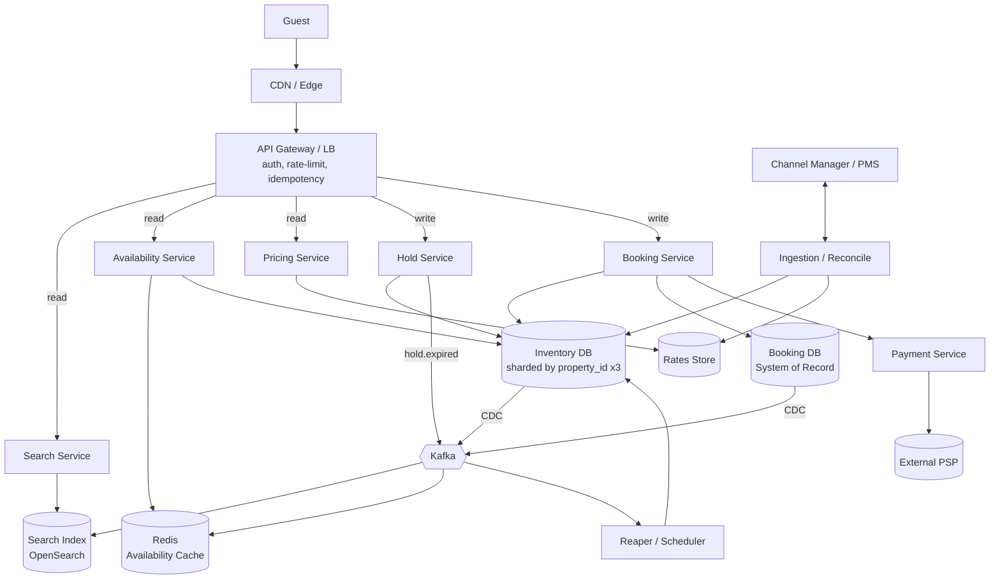
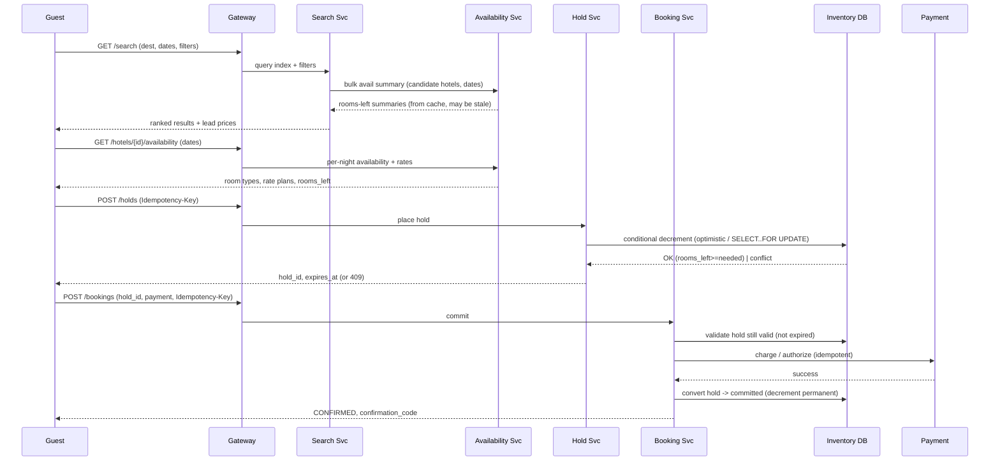
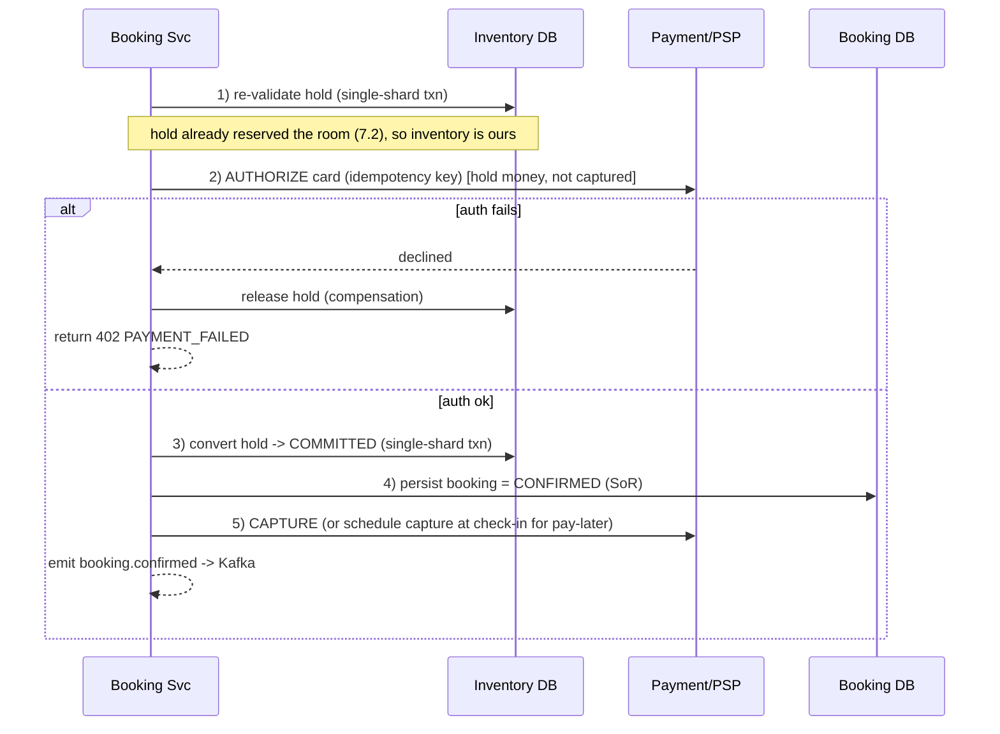

# Design Hotel Booking (Booking.com) — High-Level Design

> **Reader:** senior backend engineer (Java/JVM, distributed systems) practising HLD.
> **Goal:** an interview-ready, staff/principal-level design that teaches *design judgment* — not just boxes and arrows. The hard parts here are **availability/inventory modeling**, **preventing double-booking**, **search with availability filters**, **pricing/rate plans**, and the **booking + payment transaction**.

---

## 1. Problem & Clarifying Questions

### 1.1 Restating the problem

Build the backend for a global online travel agency (OTA) like **Booking.com**: a two-sided marketplace where **guests** search for hotels by city + date range + occupancy, see **available rooms with prices**, and **book** them; while **hotels (property managers / channel managers)** manage their **inventory (room availability), rates (prices), and bookings**.

The genuinely hard requirement that makes this *not* an e-commerce clone: **inventory is date-ranged and perishable**. A "room" is not a single SKU you decrement once — it is a calendar of room-nights, and a single booking consumes a *contiguous range* of nights. You must never sell the same physical room twice for an overlapping date range (**double-booking**), yet you must keep search fast across hundreds of millions of room-nights.

### 1.2 Clarifying questions I'd ask the interviewer first

A senior answer never jumps to architecture. I'd spend the first 3–5 minutes establishing scope. Below are the questions, grouped, with the answer I'll *assume* if the interviewer defers.

**Functional scope**
1. **Search axes** — Do we support free-text ("hotels near Eiffel Tower") + geo + filters (price, stars, amenities, guest rating)? *Assume: city/geo + date range + occupancy + filters. Free-text autocomplete is a bonus.*
2. **Booking unit** — Are we booking a **room type** (e.g., "Deluxe King") with N interchangeable physical rooms, or a **specific physical room**? *Assume: room **type** with an inventory count per night — this is how real OTAs work; the hotel's PMS assigns the physical room at check-in.*
3. **Inventory ownership** — Do *we* own the source-of-truth inventory, or does the hotel's **Property Management System (PMS)** / **Channel Manager** (software hotels use to push availability to many OTAs at once)? *Assume: we hold a cached/synced copy and reconcile via the channel manager; we are the source of truth for bookings made through us, against an allocation the hotel grants us.*
4. **Payments** — Do we collect payment (merchant of record) or does the hotel (pay-at-property)? *Assume: both models exist; design for "pay now" (we charge card) and "pay at property" (we hold card as guarantee).*
5. **Cancellation/refund** — Free cancellation windows, partial refunds, non-refundable rates? *Assume: yes — rate plans carry cancellation policy.*
6. **Out of scope (explicitly):** loyalty/rewards, reviews/ratings ingestion, flights/cars bundling, the hotel-side analytics dashboard, fraud-ML internals (we'll expose the hook). State this so we're not graded on them.

**Non-functional scope**
7. **Scale** — How many properties, searches/sec, bookings/day? *Assume the numbers in §3.*
8. **Read/write ratio** — Heavily read-skewed (browsing >> booking)? *Assume ~1000:1.*
9. **Latency** — Search p99 target? Booking p99? *Assume search p99 < 300 ms, booking commit p99 < 1 s (payment dominates).*
10. **Consistency** — Is it acceptable to *show* a room as available that's actually just sold (eventual consistency in search), as long as the **booking commit is strongly consistent** (never double-book)? *Assume: yes — this asymmetry is the key insight.*
11. **Availability/SLA** — Search must stay up even if booking is degraded? *Assume: 99.9% booking, 99.99% search.*
12. **Global** — Multi-region, data residency (GDPR)? *Assume: multi-region active-active for read, with inventory homed per-region/per-property.*

### 1.3 The single most important framing

I'll state this up front because the whole design pivots on it:

> **Search can be eventually consistent and stale; the booking commit must be linearizable per (room-type, date-range).**

Showing a stale "available" badge costs us one disappointed user at checkout (recoverable). Selling the same room twice costs us a guaranteed real-world failure — an angry guest with no room, a chargeback, and a regulatory/brand hit. So we spend our consistency budget *only* at the commit, and let search ride a fast, relaxed read path.

---

## 2. Requirements (finalized)

### 2.1 Functional

- **Search:** by geo/city + check-in/check-out dates + occupancy (adults/children/rooms) + filters (price range, star rating, guest score, amenities, free cancellation). Return ranked, paginated hotels, each with a **lead price** (cheapest available room for those dates).
- **Property detail:** for a chosen hotel + dates, list **room types**, each with **rate plans** (price, board type, cancellation policy) and **availability** for the range.
- **Hold/Reserve:** place a short-lived **hold** on a room-type for a date range while the user enters guest + payment details (TTL, e.g., 10 min).
- **Book:** convert a hold into a confirmed booking, charge/guarantee payment, decrement inventory atomically, emit confirmation.
- **Cancel/Modify:** cancel per policy (refund computation), or modify dates/occupancy (re-price, re-check availability).
- **Hotel-side:** ingest/update inventory (rooms available per night) and rates from channel manager; view/manage bookings.
- **Reconciliation:** sync inventory both ways with external channel managers; handle overbooking signals.

### 2.2 Non-functional

| Property | Target | Rationale |
|---|---|---|
| Search latency | p99 < 300 ms | Browsing UX; high fan-out |
| Booking commit latency | p99 < 1 s (excl. 3rd-party payment tail) | User waiting on a spinner |
| Search availability | 99.99% | Top of funnel; revenue-critical |
| Booking availability | 99.9% | Can degrade gracefully |
| Double-booking | **Zero tolerance** | Hard correctness invariant |
| Search consistency | Eventual (seconds of staleness OK) | Asymmetry from §1.3 |
| Booking consistency | **Strong / linearizable** per (room-type, date) | Money + physical scarcity |
| Durability | No confirmed booking ever lost | Financial record |

### 2.3 Explicit assumptions

- **2M properties**, avg **20 room-types**? No — avg **5 room-types** per property; avg **20 physical rooms** per type → ~**40M room-types**, and an inventory horizon of **500 days** ahead → **20B room-night rows** if materialized (we'll question whether to materialize all of them).
- **500M searches/day**, **5M property-detail views/day**, **500K bookings/day**, **~50K cancellations/day**.
- Read:write ≈ **1000:1**.
- Money handled by an external **PSP (Payment Service Provider)** like Stripe/Adyen; we never store raw PANs (we store tokens) — PCI scope minimized.

---

## 3. Capacity Estimation (show the arithmetic)

### 3.1 QPS

- **Searches:** 500M/day ÷ 86,400 s ≈ **5,800 search QPS** average. Peak ≈ 3× average ≈ **~17K QPS**.
  - Each search fans out: it hits a search index, then must *check availability* for the candidate set. If a city returns 200 candidate hotels and we availability-check each, that's 200 sub-lookups → **~3.4M availability lookups/sec at peak** if naive. (This number is a red flag — §7.3 fixes it by pushing availability into the index / caching.)
- **Property-detail views:** 5M/day ≈ **58 QPS** avg, ~**175 peak**. Each fetches room-types × rate-plans × per-night availability for the range.
- **Bookings (writes):** 500K/day ≈ **5.8 booking writes/sec** avg, peak ~**20–30/sec**. *Bookings are tiny in volume but huge in correctness cost.*
- **Holds:** more numerous than bookings (many holds expire). Say 4× bookings → **~25/sec avg holds**, peak ~**100/sec**.

**Takeaway:** This is a **read-heavy, write-light** system where the writes are *correctness-critical and contended on hot inventory*. Most engineering effort goes to (a) making search fast at 17K QPS and (b) making the rare booking write bulletproof.

### 3.2 Storage

- **Properties metadata:** 2M × ~20 KB (description, amenities, photos-metadata, geo) ≈ **40 GB**. Trivial; fits in a replicated SQL/doc store + cache.
- **Room-types:** 40M × ~2 KB ≈ **80 GB**.
- **Inventory (the big one):** if fully materialized per room-night: 40M room-types × 500 nights × ~40 bytes/row (date, available_count, version, price-ref) ≈ **20B rows × 40 B = 800 GB** raw. With indexes + replication (×3) ≈ **~2.4 TB**. Manageable but argues for **range-encoding** (store availability as date ranges with a count, not one row per night) to shrink hot data — see §6.3.
- **Rates/prices:** rate plans × date ranges. Prices change far less often than they're read; store as ranged rows. Order **~hundreds of GB**.
- **Bookings:** 500K/day × 365 × ~3 KB ≈ **~550 GB/year**. Keep hot (1–2 yr) in primary store, archive older to cold storage (S3/Glacier). This is the **system of record** — never deleted, append-only state transitions.
- **Photos/media:** offloaded to object storage + CDN; not in our DB.

### 3.3 Bandwidth

- Search response ~50 KB (25 hotels × ~2 KB card). 5,800 QPS × 50 KB ≈ **290 MB/s** ≈ 2.3 Gbps avg, ~7 Gbps peak — served largely from CDN/edge cache for the static parts; only availability/price is dynamic.
- Booking payloads are small (KB); negligible bandwidth.

### 3.4 Memory / cache

- **Hot availability cache:** the most-searched destinations (top cities × near-term dates) dominate. Top ~10K destinations × next ~90 days of availability for candidate hotels — keep in a distributed cache (Redis). Estimate hot working set ~**tens of GB** of availability summaries — comfortably cacheable. This is what saves us from the 3.4M lookups/sec.

### 3.5 Server / shard counts

- **Search/availability service:** at ~5K QPS/node sustainable (in-memory index lookups), 17K peak → **~6–10 nodes** + headroom → run **~20** across regions for HA.
- **Inventory DB shards:** shard by **property_id** (or property hash). 2.4 TB / (≈300 GB per shard working hot set) → **~8–16 shards**, each replicated ×3 → **~24–48 inventory DB nodes**. Sharding by property co-locates all room-types + nights of a hotel, so a booking touches **one shard** (no cross-shard transaction). This choice is load-bearing — defended in §6 and §7.
- **Booking service:** stateless, scales horizontally; modest count (~10–20 nodes) since write QPS is low; sized for burst + per-shard lock contention.

---

## 4. API Design

REST-ish over HTTPS; internal RPCs can be gRPC. Auth via OAuth2 bearer token; all mutating calls require an **Idempotency-Key** header.

### 4.1 Search

```
GET /v1/search
  ?dest=geo:48.8584,2.2945            // or dest=city:paris
  &checkin=2026-08-10&checkout=2026-08-14
  &adults=2&children=1&rooms=1
  &price_min=50&price_max=300
  &stars=4,5&amenities=wifi,pool&free_cancel=true
  &sort=recommended|price_asc|rating_desc
  &page_token=...&limit=25

200 →
{
  "results": [
    { "hotel_id":"h_123", "name":"Hotel Lutetia", "stars":5,
      "guest_score":9.1, "lead_price":{"amount":21400,"currency":"EUR"},
      "thumbnail":"https://cdn/...", "free_cancellation":true,
      "availability":"AVAILABLE",          // best-effort, may be stale
      "geo":{"lat":..,"lng":..} },
    ...
  ],
  "next_page_token":"...",
  "search_id":"srch_abc"   // for ranking/observability + later calls
}
```
*Note:* `lead_price` and `availability` are **best-effort from the read path** — authoritative pricing/availability is re-resolved at hold time.

### 4.2 Property detail (availability + rates for a range)

```
GET /v1/hotels/{hotel_id}/availability
  ?checkin=...&checkout=...&adults=2&children=1&rooms=1

200 →
{
  "hotel_id":"h_123",
  "room_types":[
    { "room_type_id":"rt_55", "name":"Deluxe King", "max_occupancy":2,
      "rate_plans":[
        { "rate_plan_id":"rp_9", "board":"breakfast",
          "cancellation":{"type":"free_until","date":"2026-08-08"},
          "total_price":{"amount":21400,"currency":"EUR"},
          "nightly":[{"date":"2026-08-10","amount":5200}, ...],
          "rooms_left": 3 } ]      // authoritative-ish; small int triggers urgency
    } ]
}
```

### 4.3 Hold (reserve with TTL)

```
POST /v1/holds
Idempotency-Key: <uuid>
{ "hotel_id":"h_123","room_type_id":"rt_55","rate_plan_id":"rp_9",
  "checkin":"2026-08-10","checkout":"2026-08-14","rooms":1,
  "guests":{"adults":2,"children":1} }

201 →
{ "hold_id":"hold_xyz","expires_at":"2026-06-25T12:10:00Z",
  "price":{"amount":21400,"currency":"EUR"}, "status":"HELD" }

409 → { "error":"NO_AVAILABILITY" }   // someone took the last room first
```

### 4.4 Book (commit hold + pay)

```
POST /v1/bookings
Idempotency-Key: <uuid>
{ "hold_id":"hold_xyz",
  "guest":{"name":"...","email":"...","phone":"..."},
  "payment":{"method":"card","token":"pm_tok_...","mode":"pay_now|pay_at_property"} }

201 →
{ "booking_id":"bkg_001","status":"CONFIRMED",
  "confirmation_code":"BKG-7F3A","total":{"amount":21400,"currency":"EUR"} }

402 → { "error":"PAYMENT_FAILED", "hold_status":"RELEASED" }
410 → { "error":"HOLD_EXPIRED" }
```

### 4.5 Cancel / Modify

```
POST /v1/bookings/{booking_id}/cancel
Idempotency-Key: <uuid>
→ 200 { "status":"CANCELLED","refund":{"amount":21400,"currency":"EUR"} }

POST /v1/bookings/{booking_id}/modify
{ "checkin":"...","checkout":"...","rooms":1 }
→ 200 confirmed-new-state | 409 NO_AVAILABILITY (original stays intact)
```

### 4.6 Hotel-side inventory/rate ingest

```
PUT /v1/admin/inventory
{ "property_id":"h_123","room_type_id":"rt_55",
  "ranges":[{"from":"2026-08-01","to":"2026-08-31","available":20}] }

PUT /v1/admin/rates
{ "rate_plan_id":"rp_9",
  "ranges":[{"from":"2026-08-10","to":"2026-08-14","nightly":5200,"currency":"EUR"}] }
```

---

## 5. High-Level Architecture

### 5.1 Component overview

- **API Gateway / LB** — TLS, auth, rate limiting, routing.
- **Search Service** — queries the **Search Index** (Elasticsearch/OpenSearch) for geo + filter matching + ranking; merges in availability summaries.
- **Availability Service** — authoritative-ish reads of per-night availability/rooms-left for a hotel+range; backed by the **Inventory DB** (sharded SQL) + **Availability Cache** (Redis).
- **Pricing Service** — resolves rate plans + nightly prices for a range; owns rate rules, taxes, currency.
- **Hold Service** — places TTL holds; decrements *effective* availability; emits hold-expiry events.
- **Booking Service** — the transactional core: converts hold→booking, orchestrates payment, commits inventory atomically (the **system of record**).
- **Payment Service** — wraps the external **PSP**; tokenization, charge, refund; idempotent.
- **Inventory DB (sharded)** — source of truth for availability counts + version (sharded by property_id).
- **Booking DB** — source of truth for bookings (can co-shard with inventory by property, or shard by booking_id with cross-ref).
- **Search Index** — denormalized, eventually consistent projection for fast search.
- **Ingestion / Channel-Manager Connector** — bidirectional sync with external PMS/channel managers.
- **Event Bus (Kafka)** — change data capture (CDC) from Inventory/Booking DBs → updates Search Index + Availability Cache; carries hold-expiry, booking-confirmed, cancellation events.
- **Scheduler/Reaper** — releases expired holds.

### 5.2 ASCII block diagram

```
                         ┌──────────────┐
        Guests ────────► │  CDN / Edge   │  (static + cached search fragments)
                         └──────┬───────┘
                                ▼
                       ┌──────────────────┐
                       │  API Gateway /LB  │  auth, rate-limit, idempotency
                       └───┬───────┬───────┘
            ┌──────────────┘       └───────────────┐
            ▼                                       ▼
   ┌─────────────────┐  READ PATH        WRITE PATH ┌────────────────┐
   │ Search Service  │                              │ Hold Service   │
   │  └─►Search Index│◄──CDC── Kafka ──CDC──────────┤ Booking Service│
   └───────┬─────────┘            ▲                 │ Payment Svc ───┼──► PSP
           ▼                      │                 └───────┬────────┘
   ┌─────────────────┐            │                         ▼
   │ Availability Svc│──► Redis (avail cache)      ┌──────────────────────┐
   │ Pricing Svc     │            ▲                │  Inventory DB (sharded│
   └───────┬─────────┘            │                │  by property_id, ×3)  │
           └──────────────────────┴───────────────►│  + Booking DB (SoR)   │
                                                    └───────────▲──────────┘
                                                                │
            ┌────────────────────────┐   sync     ┌─────────────┴─────────┐
            │ Channel Manager / PMS  │◄──────────►│ Ingestion / Reconcile  │
            └────────────────────────┘            └────────────────────────┘
                                  ┌──────────────────┐
                                  │ Reaper/Scheduler │ releases expired holds
                                  └──────────────────┘
```

### 5.3 Mermaid — component graph



### 5.4 Sequence — search → detail → hold → book



---

## 6. Data Model & Storage Choices

### 6.1 Entities

- **Property** (`property_id`, name, geo, stars, amenities[], policies, region).
- **RoomType** (`room_type_id`, property_id, name, max_occupancy, total_rooms).
- **RatePlan** (`rate_plan_id`, room_type_id, board, cancellation_policy, currency).
- **InventoryRange** (`property_id`, `room_type_id`, date_from, date_to, available_count, version) — **range-encoded** availability.
- **RateRange** (`rate_plan_id`, date_from, date_to, nightly_amount, currency).
- **Hold** (`hold_id`, room_type_id, rate_plan_id, checkin, checkout, rooms, status, expires_at, idempotency_key).
- **Booking** (`booking_id`, property_id, room_type_id, rate_plan_id, guest, checkin, checkout, rooms, total, status, payment_ref, confirmation_code, created_at, state_history[]).

### 6.2 Datastore choices (justified against access patterns)

| Data | Store | Why (access pattern) | Failure mode avoided |
|---|---|---|---|
| Inventory (source of truth) | **Sharded relational (PostgreSQL/MySQL or Spanner)** | Booking needs **ACID** + row-level locking / atomic conditional decrement on a *single shard* (sharded by property). | Double-booking from lost updates; cross-shard 2PC complexity. |
| Bookings (SoR) | **Relational, co-sharded by property_id** | Strong durability, transactional with inventory; state machine. | Lost/duplicated financial records. |
| Search projection | **OpenSearch/Elasticsearch** | Geo + multi-filter + text + ranking at 17K QPS; can be stale. | Slow filtered scans on SQL; coupling search load to the SoR. |
| Availability summary | **Redis (cache)** | Sub-ms `rooms_left` reads for hot dest×dates; absorbs the 3.4M-lookup explosion. | Hammering inventory DB on every search. |
| Rates | **Relational range rows + cache** | Read-heavy, changes infrequently; range-queryable. | N/A |
| Media | **Object store + CDN** | Large blobs, static. | DB bloat. |
| Events/CDC | **Kafka** | Decouple SoR from projections; replayable. | Dual-write inconsistency between DB and index. |

**Polyglot persistence is deliberate:** one store cannot be both the strongly-consistent transactional ledger *and* the 17K-QPS fuzzy search engine. We use SQL for the ledger and a search index + cache as **eventually consistent read projections fed by CDC** (Change Data Capture — streaming the DB's commit log as events).

### 6.3 Why range-encoding for inventory (not one row per night)

Materializing 20B room-night rows is wasteful because availability changes in *ranges* (a hotel sets "20 rooms available Aug 1–31"). We store:

```
(property_id, room_type_id, [Aug1..Aug31), available=20, version=7)
```

A booking for Aug 10–14 **splits** the range:
```
[Aug1..Aug10) avail=20 | [Aug10..Aug14) avail=19 | [Aug14..Aug31) avail=20
```
This keeps the hot dataset small and makes a date-range availability check a small set of contiguous rows. The tradeoff: range splits/merges are more complex than a counter decrement — so the decrement logic lives in a well-tested stored procedure / service method, and we periodically **merge** adjacent equal-count ranges (compaction). Alternative considered: one-row-per-night is simpler to reason about and lock, at the cost of 20B rows + 4 row-locks per 4-night stay. For very high-contention hot inventory, per-night rows can actually reduce lock scope; we keep this as a tunable per property tier (§7.5).

---

## 7. Deep Dives (the bulk)

The five hardest sub-problems: **(7.1) preventing double-booking**, **(7.2) holds with TTL**, **(7.3) search with availability**, **(7.4) the booking + payment transaction**, **(7.5) read/write scaling of inventory**, plus **(7.6) cancellation/refund** and **(7.7) channel-manager reconciliation / overbooking**.

---

### 7.1 Deep Dive: Preventing Double-Booking

**The invariant:** for any (room_type, night), `committed_bookings(night) ≤ total_rooms(night)`. Equivalently, every decrement must be **conditional** and **atomic** against concurrent decrements over the *same overlapping nights*.

**The failure mode we must kill — the lost update / race:**
Two users both see "1 room left" for Aug 10–14. Both read `available=1`, both write `available=0`. Result: two bookings, one room. Classic read-modify-write race.

**Options:**

| Approach | Mechanism | Pros | Cons / failure mode |
|---|---|---|---|
| **A. Pessimistic lock** | `SELECT ... FOR UPDATE` on the affected inventory rows, then decrement, then commit | Simple, correct, serializes contenders | Holds DB row locks across the txn; under hot contention (a sold-out concert weekend) it serializes and can deadlock if ranges locked in inconsistent order |
| **B. Optimistic concurrency (OCC)** | Read `available` + `version`; `UPDATE ... WHERE version = $v AND available >= $n`; retry on 0 rows affected | No long locks; great when contention is low (the common case) | Wasted retries under high contention; needs careful retry/backoff |
| **C. Atomic conditional decrement** | Single statement: `UPDATE inv SET available = available - $n WHERE ... AND available >= $n` (no read-then-write) | One round trip, no lost update, no explicit version | Range-split makes "the rows" span multiple rows — must touch all overlapping ranges in one txn |
| **D. Distributed lock (Redis/ZK) per (room_type,date-range)** | Acquire lock key before decrement | Decouples from DB lock | Lock store becomes critical path + SPOF; lock-expiry vs. work-time races; we'd still need DB correctness |
| **E. Event-sourced / append-only ledger** | Append "reserve" events; a projector computes balance; reject if oversold | Auditable, no in-place mutation | Read-your-write latency; needs a serialization point per key anyway |

**Decision:** **Combine B + C with the shard as the serialization point.** Because we shard by `property_id`, *all* of a hotel's room-types and nights live on **one shard**, so a booking is a **single-shard ACID transaction** — no 2PC. Within the transaction:

1. `BEGIN`
2. For each overlapping inventory range covering [checkin, checkout): `UPDATE ... SET available = available - rooms WHERE ... AND available >= rooms` (range-split as needed).
3. If any update affected 0 rows → `ROLLBACK` → `409 NO_AVAILABILITY`.
4. `COMMIT`.

This is **atomic conditional decrement** (C) — no read-then-write window, so no lost update — wrapped in a single-shard transaction, with **OCC-style retry** (B) only if range-split races a concurrent split. We **lock ranges in a deterministic order (ascending date)** to prevent deadlocks.

**Why not pessimistic-only (A)?** Under the common low-contention case, OCC/conditional-decrement avoids holding locks and scales better. We *fall back* to `FOR UPDATE` ordering for the range-split critical section, getting A's safety only where needed.

**Why this avoids double-booking specifically:** the decrement and the guard (`available >= rooms`) are in the *same atomic statement on a single node*, so two concurrent commits cannot both see "1 left" and both succeed — the database serializes the row update; the second sees `available=0` and its `WHERE` fails.

**Hot-row contention mitigation:** a sold-out marquee property on NYE is a single hot row. Mitigations: (a) shorter transactions (do payment *before* the final decrement — see §7.4), (b) per-night rows reduce the lock to the exact contended nights, (c) optional **inventory sharding by room_type** within a property for ultra-hot venues, (d) a small in-process queue per hot key to convert contention into a fast serial stream rather than a thundering retry storm.

---

### 7.2 Deep Dive: Holds / Reservations with TTL

A user needs time to enter details + pay, but we mustn't let them "park" inventory forever, nor let two users race for the last room during checkout.

**Design:** A **hold decrements *effective* availability** but is **reversible** and **time-bounded**.

Model availability as two quantities (or one count plus a holds ledger):
```
effective_available = total - committed - active_holds
```

**Placing a hold** (`POST /holds`) runs the *same* atomic conditional decrement as booking, but marks the consumed unit as `HELD` with `expires_at = now + 10m`, recorded in a `holds` table keyed by `hold_id` and `idempotency_key`.

**Releasing a hold** happens via three independent paths (belt and suspenders, because a single reaper is a SPOF for correctness):

1. **Lazy/just-in-time:** any decrement that finds `effective_available` insufficient first **sweeps expired holds for that key** (reclaim) before failing. So even if the reaper is down, a contending buyer reclaims expired inventory.
2. **Reaper job:** scans `holds WHERE status=HELD AND expires_at < now`, releases them, emits `hold.expired` to Kafka (which updates the cache/index). Runs frequently (e.g., every few seconds, partitioned by shard).
3. **TTL in cache:** the Redis effective-availability entry carries a TTL-aware structure so stale holds self-expire in the cache layer.

**Why TTL holds and not "decrement only at payment"?** Without a hold, every user races at the final commit; a slow card form means the last room is taken from under someone who "had it." Holds give a fair, bounded window and a clean UX ("we're holding this room for 9:58"). Failure mode avoided: **checkout-time disappointment / race** and **inventory parking**.

**Idempotency of holds:** the `Idempotency-Key` means a retried hold request (flaky network) returns the *same* `hold_id` rather than consuming a second room. The key is stored with the hold and checked first.

**Edge case — hold expires mid-payment:** at `POST /bookings`, the Booking Service re-validates the hold is still `HELD` and not expired *inside the commit transaction*. If expired, it tries to **re-acquire** atomically; if the room is gone, return `410 HOLD_EXPIRED` and do **not** charge. Critically, **charge happens only after** we can confirm we can still commit the inventory — or we charge with an authorization we can void (§7.4).

---

### 7.3 Deep Dive: Search With Availability Filters

**The problem:** Search must filter by geo + amenities + price *and* by availability for a date range, at 17K QPS. The naive "find candidate hotels, then call Availability Service per hotel" blows up to millions of lookups/sec (§3.1).

**Why this is hard:** availability is **date-ranged and volatile**, but search indexes (Elasticsearch) love **static, denormalized documents**. Indexing 40M room-types × 500 nights of availability as searchable fields, updated on every booking, is a write-amplification nightmare.

**Options:**

| Approach | Where availability lives | Pros | Cons |
|---|---|---|---|
| **A. Post-filter** — search index returns candidates, then availability service filters | Inventory DB / cache | Index stays simple/static | Fan-out explosion; over-fetch then drop most |
| **B. Index availability per night as doc fields** | In the search index | One query does everything | Massive update churn on every booking; huge index |
| **C. Index a coarse "available bitmap/summary"** updated via CDC | Summary in index + cache | Filterable in one query; bounded update rate | Slightly stale; coarse granularity |
| **D. Two-phase: index for geo/filters (no avail) → bulk availability check from cache for top-K only** | Cache for top-K | Bounds lookups to K (e.g., 200), cache is fast | Still a second step; needs hot cache |

**Decision: C + D.** 
- Keep the **search index static-ish** for geo/text/amenities/price-band/rating ranking. 
- Maintain a compact **availability summary** per (hotel, date-bucket) — e.g., a **roaring bitmap** of "has any availability on day D" plus a min-price hint — **fed by CDC** so it updates seconds after a booking, not synchronously. Coarse availability (`AVAILABLE` / `LIMITED` / `SOLD_OUT`) can even be a filter field in the index, refreshed by CDC at bounded rate.
- At query time, retrieve **top-K candidates** (K≈200), then do a **single batched availability lookup from Redis** for exactly those K + dates to compute the **lead price** and a fresh `rooms_left`. K is bounded → lookups/sec collapse from millions to `17K × K_batched / batch_efficiency` ≈ very manageable.

**Staleness is acceptable here** (per §1.3): if the summary says "available" but it just sold out, the user discovers it at the detail/hold step, which *is* authoritative. We never *over-sell* because of stale search — we only occasionally *over-show*. The reverse error (showing SOLD_OUT when available) is worse for revenue, so we bias the CDC refresh to quickly *re-open* availability after cancellations.

**Lead-price computation:** the cheapest available room-type×rate-plan for the queried dates. Precompute a per-hotel per-date-bucket min-price into the cache/index; refine for exact dates in the top-K batch step.

**Geo search:** index lat/lng as geo_point; query with geo_distance / geohash bucketing; rank with a blend of relevance, price, conversion, and commercial signals (kept as a pluggable ranker — interviewers love asking about ranking, but it's secondary to correctness here).

---

### 7.4 Deep Dive: The Booking + Payment Transaction

**The crux:** booking spans **two systems that cannot share a single ACID transaction** — our Inventory DB and an external **PSP**. We must avoid both "charged but no room" and "room held but never charged."

**Anti-pattern:** charge first, then decrement; if decrement fails (room gone), we've charged with no room → refund mess + angry user. Or decrement first, then charge; if charge fails, we've over-reserved → must reliably release.

**Decision: a SAGA with payment *authorization* (not capture) and idempotent compensations.** Sequence inside Booking Service (orchestration-style saga):



Key points:
- The **hold already owns the inventory** (decremented in 7.2), so step 3 is a state flip (HELD→COMMITTED) that cannot fail on availability — eliminating the "charged but no room" race for the common path.
- **Authorize-then-capture:** we *authorize* (place a hold on funds) before flipping inventory; capture after we've durably recorded the booking. If anything between auth and capture fails, we **void the authorization** (compensation) — the guest is never actually charged.
- **Idempotency everywhere:** every step keyed by the request's Idempotency-Key. A retried `POST /bookings` re-finds the in-flight saga and resumes/returns the existing result — never double-charges, never double-commits. The PSP call carries its own idempotency key so a retried authorize is deduped by the PSP.
- **Durable saga state:** the saga's progress is persisted (saga log / outbox), so a Booking Service crash mid-flow is recovered by a saga coordinator that resumes from the last completed step.
- **Transactional outbox:** booking-confirmed events are written to an **outbox table in the same DB transaction** as the booking, then relayed to Kafka — avoiding the dual-write problem (DB committed but event lost).

**Why saga, not 2PC across PSP?** The PSP doesn't speak XA; 2PC across an external HTTP service is infeasible and would couple our availability to their latency/uptime. A saga with compensations gives us **eventual consistency with explicit, auditable rollback** and keeps our inventory transaction local + fast. Failure mode avoided: **charged-with-no-room** and **stuck/leaked inventory**.

**Pay-at-property mode:** instead of capture, we store the tokenized card as a **no-show guarantee**; capture only triggers on no-show per policy. Same saga, capture step deferred.

---

### 7.5 Deep Dive: Read vs Write Scaling of Inventory

**Reads dominate ~1000:1**, but reads must not slow writes, and hot writes (popular property/date) must not melt a single shard.

**Read scaling:**
- **Availability Cache (Redis):** serves search + most detail reads from `effective_available` summaries; updated via CDC + hold events. Cache miss falls through to a **read replica** of the inventory shard, never the primary.
- **Read replicas** per shard for the long-tail detail reads; primaries reserved for writes (holds/commits).
- **CDN/edge** for static property content.

**Write scaling / sharding:**
- **Shard key = `property_id` (hashed).** All room-types + nights + bookings of a hotel co-locate → **single-shard transactions** for holds and commits → no distributed transactions, simple correctness. This is the single most important scaling decision.
- **Why not shard by date?** Tempting (range queries are date-bound), but a single popular hotel's booking would then span multiple date-shards → cross-shard 2PC → reintroduces the distributed-transaction nightmare we worked to avoid. Rejected.
- **Hot-property mitigation:** for a tiny set of mega-properties or event weekends, optionally **sub-shard by room_type** (still within property's transactional needs since a booking targets one room_type) and use the **per-key serialization queue** from §7.1 to convert retry storms into orderly throughput.
- **Resharding:** consistent hashing / vnodes so adding shards moves a bounded fraction of properties; do it via dual-write + backfill + CDC catch-up, cut over per shard.

**Where it breaks first (and the fix):**

| Bottleneck | Symptom | Fix |
|---|---|---|
| Search fan-out availability | Search p99 spikes on popular cities | Top-K + batched cache lookup (§7.3); pre-warm hot dest cache |
| Hot inventory row | 409 storms + lock waits on event weekend | Per-night rows + ascending-date locking + per-key serialization queue |
| Inventory primary write IOPS | Booking latency climbs | More shards (hash by property); offload all reads to replicas/cache |
| CDC lag | Search shows stale availability | Scale Kafka consumers; partition CDC by shard; monitor lag SLO |
| PSP latency tail | Booking p99 blown by 3rd party | Authorize async with timeout + retry; circuit-breaker; fall back to "pending" booking with later confirm email |
| Reaper falling behind | Held inventory not reclaimed | Lazy reclaim on contention (§7.2) makes correctness independent of reaper |

---

### 7.6 Deep Dive: Cancellation & Refunds

- **Cancel** = state transition `CONFIRMED → CANCELLED` (single-shard txn on booking) + **re-increment inventory** (atomic add back the range) + **refund computation** per rate plan's cancellation policy (free-until date, partial, non-refundable).
- **Idempotent:** retried cancel returns the same result; refund is keyed by booking_id + a refund idempotency key so we never double-refund.
- **Refund via PSP** is itself a saga step with compensation/retry; refund state tracked on the booking (`refund_pending → refunded`).
- **Inventory re-open** is published via CDC so search/cache quickly show the room available again (bias toward fast re-open, §7.3) — recovering revenue.
- **Modify** = effectively atomic (cancel-and-rebook) but we **hold the new availability before releasing the old**, so a modify that can't get new dates leaves the original booking intact (`409`, original preserved). Re-price and adjust charge/refund delta.

---

### 7.7 Deep Dive: Channel-Manager Reconciliation & Overbooking

Real hotels sell on many OTAs simultaneously via a **channel manager**. Even with perfect internal correctness, the *same physical room* can be sold by us and by a competitor at nearly the same instant — true real-world overbooking we can't fully prevent.

- **Allocation model:** the hotel grants us an **allocation** (e.g., "you may sell up to 10 of these 30 rooms"); we enforce against *our* allocation. Reduces cross-OTA collisions.
- **Free-sell vs. allotment:** for free-sell rooms, we sync near-real-time and accept a small overbook risk, handled by **policy** (walk the guest / upgrade / compensation) rather than by an impossible global lock.
- **Bidirectional sync:** inbound (hotel updates availability/rates) and outbound (our bookings reduce availability the channel pushes to others). Use **idempotent, versioned** updates; **last-writer-with-version-wins** plus reconciliation jobs that detect drift between our committed bookings and the channel's counts and alarm/auto-correct.
- **Conflict/overbook handling:** detect via reconciliation; resolve with a defined business policy and customer-service workflow, logged for audit. Engineering's job is **detection + bounded blast radius + clean compensation**, not pretending distributed physical scarcity is solvable with a mutex.

---

## 8. Scaling & Bottlenecks (summary)

- **Scales horizontally:** stateless services behind LB; inventory/booking sharded by property; search index sharded by geo; cache cluster sharded by key.
- **First bottleneck under load:** search-time availability fan-out → solved by top-K + cache (§7.3).
- **Second:** hot inventory rows on event dates → per-night rows + serialization queue (§7.1, §7.5).
- **Third:** CDC lag making search stale → scale consumers, partition by shard, SLO on lag.
- **Capacity headroom:** size for 3× peak; auto-scale stateless tiers on QPS; pre-warm caches for known demand spikes (holidays, events).

---

## 9. Reliability, Consistency & Security

**Consistency model (the asymmetry, restated):**
- **Strong/linearizable** per (room_type, date-range) at hold + commit (single-shard ACID).
- **Eventual** for search/availability projections (CDC-fed cache + index), staleness measured in seconds, biased toward not-oversold.
- **Read-your-writes** for a user's own booking (route to primary or read from booking SoR after commit).

**Reliability / failure handling:**
- **No double-booking** even under crashes: holds + lazy reclaim + idempotent commits + durable saga log.
- **Transactional outbox + CDC** removes the dual-write inconsistency between DB and Kafka/index.
- **Idempotency keys** on every mutating endpoint and every PSP call → safe retries; exactly-once *effect* despite at-least-once delivery.
- **Compensating actions** for every saga step (void auth, release hold, re-open inventory, refund).
- **Replication ×3 per shard**, automated failover; bookings never lost (durable + replicated before ACK).
- **Multi-region:** inventory homed per property/region (write locality); search active-active read; bookings replicated for DR. Avoid cross-region writes to the same inventory (would need consensus latency).
- **Graceful degradation:** if booking is degraded, search stays up (read path independent); if PSP is down, queue authorizations / mark booking PENDING and confirm async.
- **Circuit breakers + timeouts + bulkheads** around PSP and channel-manager calls.

**Security & abuse:**
- **AuthN/Z:** OAuth2/JWT for users; mTLS + scoped service identities internally; signed admin/channel APIs.
- **PCI:** never store raw card data — tokenize at PSP; minimize PCI scope to the Payment Service.
- **Rate limiting** at the gateway per user/IP/API key; stricter limits on `holds` to prevent **inventory-locking abuse** (a bot parking inventory via holds) — short TTLs, per-user concurrent-hold caps, CAPTCHA on anomalies.
- **Fraud hook:** payment fraud scoring before capture; velocity checks.
- **Idempotency** also defends against duplicate-submit abuse.
- **Audit log** of all booking/inventory state transitions (immutable, for disputes/compliance/GDPR).
- **PII / GDPR:** encrypt PII at rest, regional data residency, right-to-erasure on guest records (booking financial record retained per legal hold, PII redacted).

---

## 10. Extensions & Follow-ups

| Interviewer adds… | How the design changes |
|---|---|
| **Dynamic / surge pricing** | Pricing Service consumes demand/occupancy signals; rate ranges become rule-driven; cache TTLs shorten; A/B testing on price. Booking still locks the *quoted* price via the hold. |
| **Multi-room / group bookings** | Hold/commit must atomically reserve N rooms across possibly multiple room-types in one single-shard txn; partial-availability policy (all-or-nothing). |
| **Free-text + autocomplete search** | Add an autocomplete service (prefix trie / completion suggester) + NLP geo-resolution; feeds dest into existing search. |
| **Personalized ranking / ML** | Pluggable ranker reading user features; ranking is read-path only, doesn't touch correctness core. |
| **Loyalty / wallet / partial pay** | Payment Service composes multiple tenders; saga gains steps + compensations. |
| **Flights/cars bundling (packages)** | Cross-domain saga reserving multiple inventories; package atomicity via orchestrated saga with compensations. |
| **Waitlist for sold-out** | On `hold.expired`/cancellation events, notify waitlisted users; first-come hold. |
| **Stronger cross-OTA consistency** | Deeper channel-manager integration / direct PMS connection; still bounded by physical reality → policy-based overbook handling. |
| **Global write locality + GDPR** | Region-homed inventory; geo-routing; per-region SoR with async DR replication. |

---

## 11. Interview Q&A

**Q1. How do you prevent double-booking?**
Single-shard ACID transaction (we shard inventory by property_id so all of a hotel's data co-locates) with an **atomic conditional decrement** (`UPDATE ... SET available=available-n WHERE available>=n`). No read-then-write window → no lost update. Holds reserve inventory before checkout so the final commit is a state flip that can't lose the race. *Probe:* hot row on NYE? → per-night rows to shrink lock scope + per-key serialization queue + payment-before-final-flip to keep the txn short.

**Q2. Why is search allowed to be inconsistent but booking isn't?**
(Senior-signal) Showing a stale "available" is recoverable — the user hits the authoritative hold step and re-resolves; we *over-show*, never *over-sell*. Double-booking is an irrecoverable real-world failure (money + physical scarcity). So we spend the consistency budget at the commit and let search ride a fast eventually-consistent CDC-fed projection. The reverse error (false SOLD_OUT) loses revenue, so we bias CDC to re-open availability fast after cancellations.

**Q3. Why shard by property_id and not by date?**
(Senior-signal) Date-sharding makes range queries neat but turns a single hotel's multi-night booking into a **cross-shard transaction** → 2PC → latency, locking, and failure complexity. Property-sharding keeps every hold/commit/cancel a **single-shard ACID txn** with zero distributed coordination — correctness for free. The cost is that a single mega-property is a hot shard, mitigated by room_type sub-sharding + serialization queues.

**Q4. How do holds work and what happens when they expire?**
A hold atomically decrements *effective* availability with a TTL. Release via three paths: **lazy reclaim** (a contending buyer sweeps expired holds before failing), a **reaper** job, and **cache TTL**. Lazy reclaim makes correctness independent of the reaper being healthy. *Probe:* hold expires mid-payment? → re-validate inside the commit txn; if gone, return 410 and **don't capture** (we only authorize, then capture after inventory is secured).

**Q5. Inventory DB and the PSP can't share a transaction. How do you avoid "charged but no room"?**
(Senior-signal) A **saga** with **authorize-then-capture**: the hold already owns the inventory, we authorize funds, flip hold→committed (can't fail on availability), persist the booking, then capture. Any failure between voids the authorization (compensation) so the guest is never truly charged. Idempotency keys on every step + the PSP call; durable saga log for crash recovery; transactional outbox to publish events without dual-write inconsistency.

**Q6. How does search handle availability filters at 17K QPS without exploding into millions of DB lookups?**
Keep the search index static for geo/text/filters; maintain a **coarse availability summary** (bitmap + min-price) updated via CDC; at query time fetch **top-K (~200)** candidates then a **single batched Redis lookup** for exact dates → bounds availability lookups to K, not the whole candidate universe. Stale summaries only over-show; the detail/hold step is authoritative.

**Q7. Walk the booking sequence end to end.**
Search (index + cache) → detail (availability + rates) → hold (atomic decrement, TTL) → book (re-validate hold → authorize PSP → flip hold→committed → persist booking SoR → capture → emit booking.confirmed via outbox/Kafka → update cache/index via CDC). Each mutating step idempotent.

**Q8. How do cancellations restore availability and refunds?**
State flip CONFIRMED→CANCELLED + atomic re-increment of the inventory range + refund per policy (saga step to PSP, idempotent). CDC re-opens availability quickly in search/cache to recover revenue. Modify = hold-new-before-release-old so a failed modify preserves the original.

**Q9. What's your data store stack and why polyglot?**
Sharded SQL (or Spanner) for inventory + bookings (ACID, single-shard txns); OpenSearch for search (geo/filter/rank at scale, can be stale); Redis for the hot availability summary cache; Kafka for CDC/events; object store + CDN for media. One engine can't be both the strongly-consistent ledger and the 17K-QPS fuzzy searcher.

**Q10. How do you handle the channel-manager / cross-OTA overbooking problem?**
Sell against an **allocation** the hotel grants us, enforce internally, sync bidirectionally with versioned idempotent updates, run reconciliation to detect drift, and handle residual physical overbooking by **business policy** (walk/upgrade/compensate) — distributed physical scarcity across independent OTAs isn't solvable by a lock, so engineering focuses on detection, bounded blast radius, and clean compensation.

*Deep-probe follow-ups bundled above (italicized under Q1, Q4) plus:* "What's your idempotency-key TTL and storage?" (store keyed result for 24–48h in a fast store, return cached response on replay); "How do you reshard live?" (consistent hashing + dual-write + backfill + CDC catch-up + per-shard cutover); "How do you test the no-double-book invariant?" (deterministic concurrency tests + property-based fuzzing + a continuous invariant checker comparing committed bookings vs. capacity per night).

---

## 12. Cheat-Sheet & Self-Test

**Key numbers:** 2M properties · ~40M room-types · 500-day horizon · ~500M searches/day (~5.8K QPS avg, ~17K peak) · 500K bookings/day (~6 writes/sec avg) · read:write ≈ 1000:1 · search p99 < 300 ms · booking p99 < 1 s · double-booking tolerance = 0.

**Key decisions (and the failure each avoids):**
- Shard inventory **by property_id** → single-shard ACID; *avoids* cross-shard 2PC.
- **Atomic conditional decrement** in one txn → *avoids* lost-update double-booking.
- **TTL holds** + lazy reclaim → *avoids* checkout race + inventory parking + reaper-SPOF.
- **Saga + authorize/capture + idempotency + outbox** → *avoids* charged-but-no-room and dual-write loss.
- **Search = static index + coarse avail summary + top-K batched cache** → *avoids* the million-lookup fan-out.
- **Consistency asymmetry** (eventual search, strong commit) → *avoids* spending latency budget where it doesn't matter.
- **Allocation + reconciliation + policy** for cross-OTA → *avoids* pretending physical scarcity is lockable.

**Diagram in words:** Guest → CDN → Gateway (auth, rate-limit, idempotency) → {Search Svc→OpenSearch + batched Redis avail} for reads; {Hold/Booking Svc → single-shard Inventory/Booking SQL, Payment Svc → PSP saga} for writes; Inventory/Booking → CDC → Kafka → updates Redis + OpenSearch; Reaper + lazy reclaim free expired holds; Ingestion/Reconcile syncs with Channel Manager.

**Self-test (no answers):**
1. Two requests hit the last room for overlapping dates 5 ms apart — trace exactly which DB statement makes one fail, and prove no third outcome exists.
2. The reaper has been down for an hour during a flash sale. How is correctness still preserved, and what's the user-visible effect?
3. The PSP authorize succeeds but your Booking Service crashes before capture. What recovers it, and how do you guarantee no double charge and no leaked inventory?
4. A city search returns 5,000 candidate hotels for a long weekend. Walk the data path that keeps p99 < 300 ms and quantify the availability lookups performed.
5. A hotel reduces its allocation from 10 to 3 rooms while 6 of your holds are active for those dates. What happens to the holds, the in-flight bookings, and the numbers you report to the channel manager?
```
