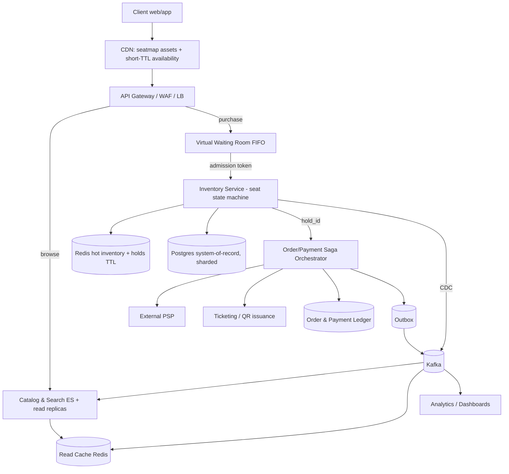
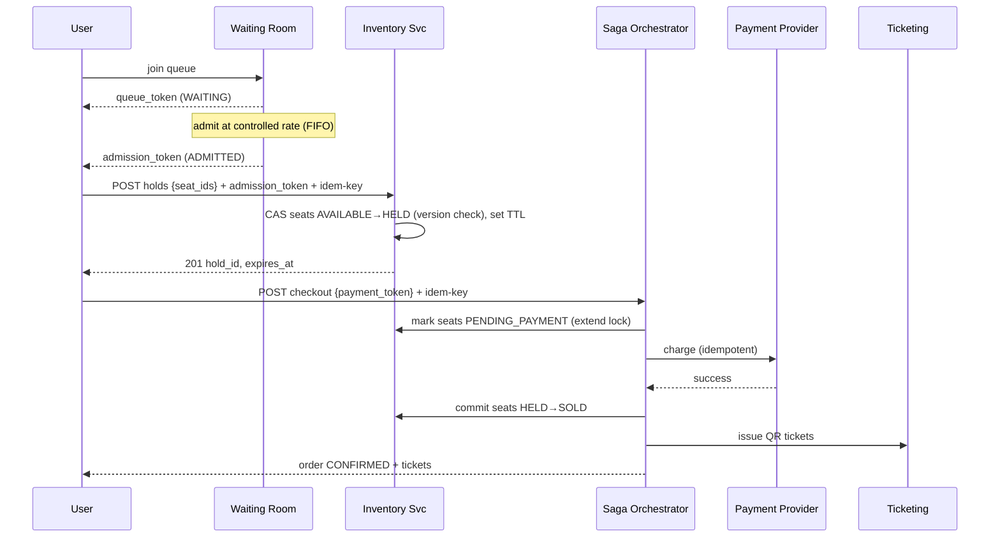

# Design Ticketmaster / Event Booking — Staff-Level HLD

> A reference + practice artifact for a senior/staff system-design round. The hard part of this system is not "store events and sell tickets" — it is **selling a finite, indivisible inventory (seats) to a stampede of buyers without ever double-selling a seat, while keeping the experience fair and the database alive during a flash sale.** Everything below is organized around that tension.

---

## 1. Problem & Clarifying Questions

**Restate the problem.** Build the backend for an event-ticketing platform (Ticketmaster / BookMyShow / SeatGeek style). Organizers list events (concerts, sports, theatre) with a seating layout and inventory. Users browse/search events, pick seats (or a quantity in general-admission), **hold** them while they pay, and receive a confirmed ticket. The defining workload is the **on-sale**: when a popular event opens, millions of users converge in the same minute, all competing for the same few thousand seats. We must never sell the same seat twice, and we should be fair and stay up.

Before drawing a single box, I'd ask the interviewer the following. The answers materially change the design, so I call out *why* each matters.

### Functional scope questions
1. **Reserved seating, general admission (GA), or both?** Reserved seating ("seat 12, row F") requires per-seat state and a seat-map UI; GA is just a counter (`tickets_remaining`). The contention model differs sharply — GA can be a single atomic decrement; reserved seating is N independent locks. *I'll assume both, with reserved seating as the hard case.*
2. **Do we own the on-sale flow end-to-end, including payments?** Or do we delegate to a payment provider (Stripe/Adyen) and just orchestrate? *Assume we orchestrate a payment via an external PSP (payment service provider) and own the saga.*
3. **Is there a "hold while you decide" step**, or is it buy-now-or-lose-it? Holds (a temporary reservation with a TTL — time-to-live, an expiry) are standard and are the crux of double-booking prevention. *Assume holds with a TTL of ~7–10 minutes.*
4. **Do we need a virtual waiting room / queue** for high-demand on-sales? This is the standard flash-sale mitigation. *Assume yes — it's a named focus.*
5. **Resale / secondary market, dynamic pricing, ticket transfer?** These are large subsystems. *Assume out of scope for v1; revisit in extensions.*
6. **Refunds / cancellations / event rescheduling?** Needed for completeness but not the core difficulty. *Assume basic refund supported.*
7. **What does "a ticket" mentally map to** — a barcode/QR for gate entry, with anti-fraud (rotating barcodes)? *Assume QR issuance, rotating-barcode anti-screenshot is an extension.*

### Non-functional questions
8. **Strong vs eventual consistency for inventory?** This is the single most important question. Selling a seat twice is a correctness violation, not a UX glitch. *I'll assume **strong consistency / linearizability for the seat-state transition**, and eventual consistency for everything else (search index, browse counts, analytics).*
9. **Availability target?** Browse/search should be highly available (99.99%); the purchase path can tolerate slightly lower availability but must never be *wrong*. We prefer to **fail closed** (refuse a sale) over double-selling.
10. **Latency targets?** Browse/search p99 < 200 ms. Seat-hold acquisition p99 < 300 ms (users are impatient during on-sale). Checkout (payment) is seconds — bounded by the PSP.
11. **Fairness definition?** Is it FIFO (first-come-first-served by arrival), lottery (random selection among registrants), or best-effort? *Assume FIFO via the waiting room, with the option of a lottery mode.* Fairness also means resisting bots/scalpers.

### Scale questions
12. **How many events, how big are venues, what's the peak on-sale concurrency?** A stadium is ~50k–100k seats; the peak concurrency for a megastar on-sale can be **1–3 million concurrent users** hitting in the first minutes for tens of thousands of seats — a ~50:1 to 100:1 demand-to-supply ratio. This number drives the entire flash-sale design.
13. **Read:write ratio?** Browsing dwarfs buying. Assume ~1000:1 in steady state; during an on-sale the *interest* is huge but successful *writes* are capped by inventory.
14. **Global or single region?** *Assume multi-region for browse/CDN, but inventory for a given event is anchored to one region* (the venue's region) to keep the strongly-consistent write path local — cross-region consensus on every seat would blow latency.

### Out of scope (explicitly)
Recommendations/personalization, ad serving, organizer payout accounting, tax/compliance engines, live-streaming. Mentioned so the interviewer knows I'm scoping deliberately, not forgetting.

---

## 2. Requirements (Finalized)

### Functional
- **Catalog & search:** browse events by city/date/genre/artist/venue; full-text + faceted search; event detail page with seat map and live availability.
- **Seat selection & hold:** user selects specific seats (or quantity for GA); system places a **hold with TTL**. Held seats are invisible/locked to others.
- **Checkout (saga):** user pays via PSP within the hold window; on success → confirmed booking + ticket(s) issued; on failure/timeout → hold released, seats returned to inventory.
- **Virtual waiting room:** for designated high-demand on-sales, admit users into the purchase area at a controlled rate, fairly (FIFO token).
- **My tickets:** view/download QR tickets, transfer (extension), request refund.
- **Organizer:** create event, define seat map & inventory, set on-sale time, view sales.

### Non-functional
- **Consistency:** **linearizable seat-state transition** — a seat goes `AVAILABLE → HELD → SOLD` (or back to `AVAILABLE` on expiry) with no two users ever both reaching `HELD/SOLD` for the same seat. Everything else (search, counts shown to users, dashboards) is eventually consistent.
- **Durability:** confirmed bookings and payments must be durable (no lost sales, no charged-but-no-ticket). RPO ≈ 0 for the order/payment ledger.
- **Availability:** browse/search 99.99%; purchase path 99.9%, **fail-closed** on doubt.
- **Latency:** search p99 < 200 ms; hold p99 < 300 ms; checkout bounded by PSP (target < 5 s end-to-end excluding user think time).
- **Idempotency:** every mutating call (hold, confirm, pay, refund) is idempotent under retries.
- **Fairness & abuse resistance:** FIFO/lottery admission; per-user purchase caps; bot/scalper mitigation.

### Key assumptions to proceed
- Reserved seating is the hard case; GA is a degenerate (counter) case.
- Hold TTL = 8 minutes. Per-user cap = 8 seats per order. Waiting-room admit rate is tunable per event.
- Inventory for an event lives in **one home region**; reads are served globally from caches/replicas.
- Payments via external PSP; we own orchestration but not card storage (PCI scope minimized).

---

## 3. Capacity Estimation

I'll show the arithmetic and flag assumptions. Numbers are order-of-magnitude; the goal is to size components and find the bottleneck.

### Catalog & steady-state browse
- Assume **2M daily active users**, each doing ~20 catalog/search requests per active session → **40M reads/day**.
- 40M / 86,400 s ≈ **~460 read QPS average**, peak ~5× ≈ **~2,300 read QPS**. Trivial for a cache + read replicas.
- Catalog size: ~500k active events × ~5 KB metadata ≈ **2.5 GB** — fits in memory; fully cacheable. Search index a few tens of GB. Not a scaling concern.

### The on-sale (the real workload)
This is what we design for. Consider one megastar on-sale:
- **Inventory:** 50,000 seats (large stadium).
- **Demand:** 2,000,000 users converge in the first ~2 minutes. Demand:supply ≈ **40:1**.
- **Naive request rate:** if all 2M users retry seat-map/hold every ~3 s, that's 2,000,000 / 3 ≈ **~667,000 req/s** just on this one event. This is the thundering herd we must tame — it would melt any single inventory store.
- **With a virtual waiting room** admitting, say, **1,000 users/second** into the purchase area: the *inventory write path* sees at most a few thousand QPS, not 667k. The waiting room absorbs the herd at the edge.
- **Successful sales are bounded by inventory:** 50,000 seats. If average hold→confirm takes 90 s and ~60% of holds convert, we need ~50,000 / 0.6 ≈ 83k holds to sell out, served over a few minutes. So the **hold write QPS** on inventory is roughly `admit_rate × seats_per_hold` ≈ 1,000 users/s × (1 hold attempt each) ≈ **~1,000–3,000 hold ops/s** to the inventory store — very manageable for a sharded, in-memory-backed store.

**Key insight from the math:** the system has a *huge* incoming interest rate (~10^5–10^6 req/s) but a *tiny* legitimate write rate (~10^3 ops/s) because inventory is finite. The architecture's job is to **convert the herd into a trickle** before it reaches the strongly-consistent inventory store.

### Storage
- **Seat inventory state:** 50k seats/event × (seat_id, status, hold_owner, version, ttl) ≈ ~200 B/seat → ~10 MB/event. Across 500k active events with seats ≈ a few TB, but only *on-sale* events are hot. Hot working set is small enough to live in a sharded in-memory store (Redis) backed by a durable system of record.
- **Orders/bookings ledger:** assume 100M bookings/year × ~2 KB ≈ **200 GB/year**. Append-mostly; goes to a durable RDBMS/ledger, partitioned by event/time.
- **Tickets (QR):** ~300M tickets/year × ~1 KB metadata ≈ **300 GB/year**.

### Bandwidth
- Seat map for a stadium ≈ 200 KB–1 MB (rendered client-side from a compact JSON of seat coordinates + a delta of availability). Served from CDN; only the **availability delta** is dynamic. If 1M users pull a 50 KB availability delta in the first minute: 1M × 50 KB ≈ **50 GB/min ≈ ~6.7 Gb/s** — heavy but CDN-cacheable with short TTL (1–2 s) + collapsing. We avoid per-user dynamic generation.

### Server / shard counts (rough)
- **Waiting-room / edge admission:** the herd lands here. Stateless front fleet behind a CDN/LB; sized for ~10^5–10^6 connection req/s with long-poll/SSE. Say a few hundred edge nodes during a mega on-sale (autoscaled / event-scheduled).
- **Inventory service:** because legitimate write rate is ~10^3 ops/s and operations are short, a **handful of inventory shards per hot event** (sharded by section/seat-range) suffices. The constraint isn't throughput; it's *correctness under contention on a single seat*.
- **Order/payment services:** sized to the admit rate (~10^3 saga starts/s) — a modest stateless fleet plus the durable ledger.

**Takeaway for the interviewer:** "This is not a throughput problem on the write path; it's a *contention + correctness + admission-control* problem. The estimation tells me to spend my engineering on the waiting room, the seat-hold mechanism, and the payment saga — not on scaling a high-QPS write database."

---

## 4. API Design

REST/HTTPS for clients; internal services use gRPC. All mutating endpoints take an **`Idempotency-Key`** header. Auth via short-lived JWT; waiting-room admission via a signed **admission token**.

### Browse / search
```
GET /v1/events?city=&date_from=&date_to=&genre=&q=&cursor=&limit=
  → 200 { events: [{event_id, title, venue, date, min_price, status}], next_cursor }

GET /v1/events/{event_id}
  → 200 { event_id, title, venue, sections:[...], seatmap_url(CDN), on_sale_at, status }

GET /v1/events/{event_id}/availability?section=
  → 200 { version, available_seat_ids:[...], updated_at }   // short-TTL cacheable delta
```

### Waiting room
```
POST /v1/events/{event_id}/queue/join        // returns a position + poll token
  → 200 { queue_token, position, eta_seconds }
GET  /v1/events/{event_id}/queue/status?queue_token=
  → 200 { state: "WAITING"|"ADMITTED", position?, admission_token? }
```
- `admission_token`: short-lived (e.g., 10 min), signed, scoped to this event+user. Required by all purchase-path calls. This is how the waiting room "gates" inventory access.

### Seat hold (the critical write)
```
POST /v1/events/{event_id}/holds
  Headers: Authorization, X-Admission-Token, Idempotency-Key
  Body: { seat_ids:[...] }            // or { section, quantity } for GA
  → 201 { hold_id, seat_ids, expires_at }                 // success
  → 409 { conflict_seat_ids:[...], available_alternatives? } // someone beat you
  → 429 { retry_after }                                      // shed / rate limited

DELETE /v1/holds/{hold_id}            // explicit release (idempotent)
POST   /v1/holds/{hold_id}/extend     // optional: extend TTL once (policy-gated)
```

### Checkout / payment saga
```
POST /v1/holds/{hold_id}/checkout
  Headers: Idempotency-Key
  Body: { payment_method_token }      // tokenized at PSP; we never see PAN
  → 202 { order_id, status: "PENDING" }      // saga started

GET  /v1/orders/{order_id}
  → 200 { order_id, status: "PENDING"|"CONFIRMED"|"FAILED", seat_ids, tickets?[] }
```
- Returns **202 + polling/webhook** because payment is async (PSP round-trip, 3-D Secure, etc.). The client polls `GET /orders` or receives a push.

### Tickets / post-purchase
```
GET    /v1/orders/{order_id}/tickets   → QR payloads
POST   /v1/orders/{order_id}/refund    (Idempotency-Key)
```

**Response-shape note:** the `409` on hold returns *alternatives* so the client can instantly retry nearby seats — this both improves UX and reduces retry storms on the contended seats.

---

## 5. High-Level Architecture

Request flow at a glance: clients → CDN/edge → API gateway → either the **browse path** (cache + search + read replicas, eventually consistent) or the **purchase path** (waiting room → admission token → inventory service (strongly consistent) → order/payment saga → ticketing). Inventory is the single source of truth for seat state; the order ledger is the source of truth for money.

### ASCII block diagram
```
                         ┌─────────────────────────────────────────────┐
   Clients (web/app) ───►│  CDN  (seat-map assets, short-TTL avail.)     │
                         └───────────────┬─────────────────────────────┘
                                         │
                                  ┌──────▼───────┐
                                  │ API Gateway  │  auth, rate-limit, routing
                                  │  + WAF/LB    │
                                  └───┬──────┬───┘
                  BROWSE PATH (eventual)│      │ PURCHASE PATH (strong)
            ┌──────────────────────────┘      └───────────────────────────┐
            │                                                              │
   ┌────────▼─────────┐   ┌──────────────┐                    ┌───────────▼───────────┐
   │ Catalog/Search   │   │  Read Cache  │                    │   Virtual Waiting Room │
   │ (ES + replicas)  │◄──┤  (Redis/CDN) │                    │  (queue, FIFO tokens)  │
   └──────────────────┘   └──────────────┘                    └───────────┬───────────┘
                                                                  admission │ token
                                                              ┌────────────▼─────────────┐
                                                              │   Inventory Service       │
                                                              │  (seat state machine,     │
                                                              │   holds+TTL, sharded)     │
                                                              │  Redis (hot) ⇄ Postgres   │
                                                              │  system-of-record         │
                                                              └────────────┬─────────────┘
                                                                  hold_id   │
                                                              ┌────────────▼─────────────┐
                                                              │   Order/Payment Saga      │
                                                              │  (orchestrator + ledger)  │
                                                              └──┬──────────┬────────┬────┘
                                                                 │          │        │
                                                          ┌──────▼──┐  ┌────▼───┐ ┌──▼─────┐
                                                          │  PSP    │  │Ticketing│ │ Outbox │
                                                          │(Stripe) │  │  (QR)   │ │ → Kafka│
                                                          └─────────┘  └─────────┘ └────────┘
                         (Kafka backbone: inventory CDC → search/cache invalidation, analytics)
```

### Mermaid diagram


### Key sequence — hold then pay (happy path)


---

## 6. Data Model & Storage Choices

### Entities
- **Event** `(event_id, title, venue_id, starts_at, on_sale_at, status, home_region)`
- **Venue / SeatMap** `(venue_id, sections[], rows[], seats[])` — seat geometry is **static**, versioned, immutable per event; perfect for CDN.
- **Seat (per event)** `(event_id, seat_id, section, price_tier, status, hold_id?, owner_user?, version, hold_expires_at?)` — `status ∈ {AVAILABLE, HELD, PENDING_PAYMENT, SOLD}`.
- **Hold** `(hold_id, event_id, user_id, seat_ids[], state, created_at, expires_at)`
- **Order** `(order_id, user_id, event_id, hold_id, seat_ids[], amount, status, idempotency_key, created_at)` — `status ∈ {PENDING, CONFIRMED, FAILED, REFUNDED}`.
- **Payment** `(payment_id, order_id, psp_ref, amount, status, idempotency_key)`
- **Ticket** `(ticket_id, order_id, seat_id, qr_payload, state)`
- **QueueEntry** `(event_id, user_id, position, joined_at, state)`

### Datastore choices (justified against access patterns)

| Data | Store | Why | Failure mode avoided |
|---|---|---|---|
| Seat state (hot, on-sale) | **Redis** (in-memory, single-key atomic ops / Lua) backed by Postgres SoR | Need single-digit-ms CAS on a single seat under contention; per-seat or per-section key gives natural sharding | Avoids row-lock contention storms in an RDBMS hot row |
| Seat state (system of record) | **Postgres**, sharded by event | Durable truth; transactions for commit; survives Redis loss | Avoids losing inventory truth if cache dies |
| Order/payment ledger | **Postgres** (or a ledger DB) with strong tx | Money must be ACID, auditable, durable; RPO≈0 | Avoids charged-but-no-ticket / lost orders |
| Catalog / event metadata | **Postgres** + heavy **Redis/CDN** cache | Read-heavy, rarely mutated | Avoids DB overload on browse |
| Search | **Elasticsearch/OpenSearch** | Full-text + faceted + geo | Avoids `LIKE %%` scans on RDBMS |
| Async fan-out (CDC, invalidation, analytics) | **Kafka** | Decouple, replay, ordered per-partition | Avoids tight coupling & sync fan-out latency |
| Tickets / QR | **Postgres / object store** | Durable, occasional reads | — |

**Why not one big RDBMS for everything including inventory?** During an on-sale, thousands of buyers contend on the *same* hot seats/section. In an RDBMS this becomes a row-lock convoy: writers serialize on the same rows, lock waits pile up, p99 explodes, and connections exhaust. Redis with per-seat keys + atomic Lua gives O(1) compare-and-set without a heavyweight transaction per attempt, and shards contention across keys/sections. Postgres remains the durable backstop, updated asynchronously/transactionally on commit. (See Deep Dive 1 for the full tradeoff, including why a pure-Redis design is risky and how we reconcile.)

**Sharding:** partition inventory by `(event_id, section)`. A given seat lives on exactly one shard → all CAS for that seat are local and linearizable. Hot event → spread sections across shards so no single node is the whole stadium.

---

## 7. Deep Dives (the bulk)

The five genuinely hard sub-problems: (1) preventing double-booking under extreme contention; (2) seat holds with TTL & expiry; (3) the flash-sale virtual waiting room; (4) the payment + confirmation saga; (5) consistency, fairness & bots. Each: options → tradeoff table → defended decision → failure mode avoided.

### Deep Dive 1 — Preventing double-booking under extreme contention

**The problem.** Two users click "seat F12" within milliseconds. Exactly one must win; the loser must get an immediate, clean `409` with alternatives. No interleaving may ever produce two winners. This is a **linearizable single-object state transition** under high contention.

**Options.**

| Approach | How it works | Pros | Cons / failure mode |
|---|---|---|---|
| **A. RDBMS row lock** (`SELECT … FOR UPDATE`) | Lock the seat row, check status, update, commit | Simple, ACID, one source of truth | Hot-row lock convoys; lock waits → p99 spikes; connection pool exhaustion under stampede; deadlocks across multi-seat orders |
| **B. Optimistic concurrency (CAS on version)** | Read seat + version; `UPDATE … WHERE seat_id=? AND version=?`; retry on 0 rows | No long-held locks; high throughput when contention is *moderate* | Under *extreme* contention on one seat, most CAS fail → retry storm, wasted work |
| **C. Distributed lock** (Redis Redlock / ZooKeeper / etcd) | Acquire lock on seat key, then mutate | Works across services | Lock service is now critical path & SPOF; clock-skew/lease bugs (Redlock is contentious); lock + DB write isn't atomic |
| **D. In-memory atomic CAS in Redis (Lua), DB as SoR** | Seat status held in Redis; a Lua script does check-and-set atomically per key; commit persisted to Postgres | Single-threaded Redis = serialization per key with no lock convoy; µs-scale; natural sharding by key | Redis durability/HA must be handled; need reconciliation with SoR |

**Decision: D (Redis Lua CAS as the contention front, Postgres as durable SoR), with B (optimistic CAS) semantics inside it.** Rationale:
- Redis executes commands/Lua **single-threadedly per node**, so two concurrent `HELD` attempts on the same seat key are *serialized for free* — the first wins, the second sees `status != AVAILABLE` and is rejected. No external lock, no convoy. This is the cleanest linearizable single-key primitive available at µs latency.
- A multi-seat hold is done in **one Lua script** that checks *all* requested seats and either holds all or none → all-or-nothing without a distributed transaction, and no deadlock (single-threaded, no lock ordering issues).
- **Durability:** Redis AOF (append-only file, fsync per write or per second) + replication; on commit (`HELD→SOLD`), we write through to Postgres in the saga (Deep Dive 4), so money-bearing state is ACID-durable. If Redis is lost, we **rebuild hot inventory from Postgres** (the SoR), accepting a brief on-sale pause — we *fail closed*, never double-sell.

**Why not A?** It double-sells nothing, but it dies under load (the failure mode: lock convoy → timeouts → mass `500`s mid-on-sale). **Why not C?** Redlock's correctness under partition/clock-skew is disputed, and "lock + then write to a different store" is not atomic — a crash between them leaks. **Why not pure B on Postgres?** Fine at moderate contention, but on the single hottest seat nearly every CAS fails, generating retry amplification right where we can least afford it.

**Multi-seat atomicity (the deadlock trap).** Junior answer: lock seats one by one → classic deadlock when two orders grab overlapping seats in opposite order. Senior answer: acquire all seats in **one atomic operation** (single Lua script, sorted seat order) so it's all-or-nothing with no partial holds and no lock ordering.

**Reconciliation.** A background job continuously reconciles Redis ↔ Postgres (and replays the CDC stream) so that `SOLD` in Postgres and `SOLD` in Redis never diverge; any drift resolves toward the **durable ledger** (money wins over cache).

**GA degenerate case.** General admission is just `DECR remaining IF remaining>0` — a single atomic Redis op. Same engine, simpler key.

### Deep Dive 2 — Seat holds with TTL and reliable expiry

**The problem.** A hold reserves seats for ~8 minutes while the user pays. If the user abandons or crashes, the seats **must** return to inventory automatically — otherwise inventory silently leaks and the event "sells out" while seats sit dead. Expiry must be **reliable, exactly-once-ish, and race-free with payment** (we must never release a seat the user just paid for).

**Options for expiry.**

| Approach | Mechanism | Pros | Cons |
|---|---|---|---|
| **Redis key TTL only** | `EXPIRE` on the hold key | Built-in, cheap | On expiry Redis just deletes the key — but we must also flip seat `HELD→AVAILABLE` and update Postgres; a raw TTL doesn't run that logic |
| **Redis keyspace notifications** | Subscribe to `expired` events, run release logic | Reactive | Notifications are best-effort (lost on disconnect / under load); not durable |
| **Lazy expiry on read** | When anyone touches a seat, check `now > expires_at` and reclaim | No background infra | Held-but-untouched seats stay locked invisibly; unfair |
| **Sweeper / delay queue** | A scheduled job (or a delay queue / sorted-set of `expires_at`) actively reclaims expired holds | Deterministic, durable, observable | Need to make reclaim idempotent and race-safe vs payment |

**Decision: a combination — authoritative `expires_at` timestamp + active sweeper, with lazy check as a fast path, and a state guard against the payment race.** Concretely:
- Each seat carries `status`, `hold_id`, `hold_expires_at`. Truth is the timestamp, **not** a fragile TTL deletion.
- A **sweeper** (driven by a Redis sorted-set keyed on `expires_at`, or a partitioned delay queue) periodically pops entries whose time has come and runs an **idempotent reclaim**: "if seat is still `HELD` by this `hold_id` and `now ≥ expires_at`, set `AVAILABLE`." The `hold_id` + status guard is what prevents reclaiming a seat that already advanced to `PENDING_PAYMENT`/`SOLD`.
- **Lazy fast-path:** any hold attempt that finds a seat `HELD` but expired reclaims it inline (same idempotent op) so users don't wait for the sweeper.

**The critical race — expiry vs payment.** The user pays at second 479; the sweeper fires at second 480. We must not release seats the PSP just charged. Resolution: the **state machine itself is the lock.** Before charging, the saga transitions seats `HELD → PENDING_PAYMENT` (a status the sweeper refuses to reclaim) via the same atomic CAS. The sweeper's reclaim is conditional on `status == HELD AND hold_id matches AND expired`. So:
- If checkout wins the CAS first → seats are `PENDING_PAYMENT` → sweeper no-ops. 
- If sweeper wins first → seats are `AVAILABLE` → checkout's CAS to `PENDING_PAYMENT` fails → user gets "your hold expired, please reselect" *before* we ever call the PSP. **No charge without a held seat.**

This ordering (acquire/confirm seat state *before* charging money) is the single most important rule and is reinforced in the saga (Deep Dive 4).

**Failure mode avoided:** inventory leakage (seats stuck `HELD` forever → phantom sellout) and the nightmare of charging a customer for a seat that was already released.

### Deep Dive 3 — Flash sale / thundering herd: the virtual waiting room

**The problem.** At `on_sale_at`, ~2M users hit in seconds for 50k seats. Capacity math (Section 3) shows a naive design faces ~10^5–10^6 req/s on one event. We must **absorb the herd at the edge** and feed the inventory store a controlled trickle, **fairly**, while keeping waiting users informed so they don't hammer retry.

**Design.** A **virtual waiting room** (a.k.a. queue/lobby):
1. **Pre-queue / enqueue at the edge.** When a user requests the on-sale, the gateway/edge issues a **`queue_token`** and places them in a FIFO queue *before* any inventory access. Implemented as a Redis sorted-set / stream per event, or a dedicated queue service. The token encodes position + a signed nonce (prevents queue-jumping by forging tokens).
2. **Controlled admission.** A token-bucket admitter releases users into the purchase area at a **tunable rate** (e.g., 1,000/s) sized to what inventory + saga can comfortably serve. Admitted users receive a short-lived signed **`admission_token`** required by `POST /holds`. No token → `403` at the inventory edge. This is the valve that converts 667k req/s into ~1–3k hold ops/s.
3. **Status polling that doesn't stampede.** Waiting clients poll `queue/status` (or hold an SSE/long-poll connection). Responses carry `eta_seconds` and a server-dictated `retry_after`, so clients back off; the edge can serve these from cache. The queue itself is cheap (position math), so it scales horizontally and statelessly except for the ordered store.
4. **Anti-abuse at the door.** Rate-limit by IP/device, require auth before queueing, drop obvious bots (WAF, proof-of-work or CAPTCHA on suspicious clients) — fairness and bot defense start here, not at checkout.

**Options for the admission model.**

| Model | Behavior | Pros | Cons |
|---|---|---|---|
| **FIFO (arrival order)** | First to arrive, first admitted | Intuitively "fair", simple | Rewards fast connections/bots; "join the line at the millisecond it opens" |
| **Lottery / randomized admission** | Register in a window, randomly admit | Neutralizes connection-speed advantage; bot-resistant | Less intuitive; some users wait then lose despite being "first" |
| **Hybrid** | Pre-register window → lottery for order → FIFO drain | Best fairness + bot resistance | More moving parts |

**Decision: FIFO by default, with a configurable lottery (hybrid) mode for the highest-demand on-sales.** Pure FIFO is what users expect and is simplest; but for megastar drops where bots weaponize FIFO, a **pre-registration + lottery** mode (register in a window, then randomly assign queue order) removes the speed advantage. The admit *rate* is always the safety valve regardless of ordering.

**Why a separate waiting room rather than "just scale inventory"?** You cannot scale your way past a 40:1 demand:supply ratio — 1.95M of the 2M users will fail no matter how big the database is. The honest move is to (a) protect the system from collapse, (b) make failure *fair and fast*, and (c) keep inventory access at a rate it can serve correctly. **Failure mode avoided:** total meltdown (DB/connection exhaustion, cascading timeouts, the whole site down) plus the unfairness of "whoever has the fastest bot wins."

**Graceful shedding.** If even the admitted rate overwhelms downstream, the admitter slows; if a downstream is unhealthy, the gateway sheds with `429 + retry_after` rather than queueing infinitely. We protect correctness over throughput.

### Deep Dive 4 — Payment + confirmation saga (distributed transaction)

**The problem.** A purchase spans multiple systems — inventory (our store), PSP (external), ticketing, ledger — with no global ACID transaction. We need: **never charge without delivering tickets; never deliver tickets without charging; never leave seats stranded.** Payment is slow and can fail/timeout/retry; the PSP may be uncertain (network blip after charge). Classic distributed-transaction territory → use a **saga** (a sequence of local transactions with compensations).

**Saga steps (orchestrated; one orchestrator owns the order state machine):**
```
1. Reserve money intent:  Inventory: HELD → PENDING_PAYMENT   (CAS, refuses if hold expired)
2. Charge:                PSP.charge(idempotency_key)          (idempotent at PSP)
3a. On success:           Inventory: PENDING_PAYMENT → SOLD;  issue tickets; ledger: CONFIRMED
3b. On failure/timeout:   Compensate: Inventory → AVAILABLE;  ledger: FAILED; (no charge stands)
```

**Why orchestration over choreography?** Choreography (services react to each other's events) is loosely coupled but here the flow is short, money-critical, and needs a clear owner of "what state is this order in and what's the next/compensating step." An **orchestrator** (a durable workflow — e.g., a state machine persisted in Postgres, or a workflow engine like Temporal) makes the saga **resumable after crash**, auditable, and timeout-aware. Tradeoff: the orchestrator is a critical component (mitigated by durability + idempotency).

**Idempotency everywhere.** The client's `Idempotency-Key` flows to the order, the PSP charge, and ticket issuance. A retried `checkout` returns the *same* `order_id`/result rather than charging twice. The PSP charge uses an idempotency key so a retry after an ambiguous timeout doesn't double-charge — the cornerstone of payment correctness.

**The ambiguous-PSP case (the hard one).** We call `charge`, the network drops before the response. Did it charge? Resolution: (a) the charge carried an idempotency key, so we **safely retry / query** the PSP for that key's outcome; (b) the order stays `PENDING` and the orchestrator reconciles via the PSP webhook + a polling job; (c) we only flip seats to `SOLD` and issue tickets after a **confirmed** charge. If unresolved past a deadline → compensate (release seats, mark `FAILED`), and if a late "succeeded" arrives we auto-refund. **We never optimistically issue tickets on an unconfirmed charge.**

**Outbox + events.** Confirmed orders write tickets and an event in the *same DB transaction* via an **outbox** (a table written transactionally, then relayed to Kafka), guaranteeing "ticket issued ⇔ event emitted" without dual-write inconsistency. Downstream (email/QR delivery, search count updates, analytics) consume from Kafka.

**Ordering rule restated (load-bearing):** *seats are locked before money moves; money is confirmed before tickets are minted; compensation always returns seats.* This avoids the two cardinal failures: **charged-but-no-ticket** and **ticket-but-no-charge**, and prevents stranded inventory.

### Deep Dive 5 — Consistency, fairness, and abuse/bot resistance

**Consistency model (CAP-aware).** For the **seat-state transition** we choose **CP** — linearizable, fail-closed: under partition we'd rather refuse a sale than risk a double-sale, because two people in one seat is a real-world, money-back, reputation-damaging failure. Single-key serialization (Deep Dive 1) within one home region keeps this cheap; we deliberately **avoid cross-region consensus per seat** (latency too high). Everything *user-facing-but-not-money* (availability counts on the seat map, search results, "12 left!" badges) is **eventually consistent**, served from caches/replicas updated via CDC — a slightly stale count is fine; a double-sold seat is not. This split (strong where it counts, eventual elsewhere) is the senior signal.

**Fairness.** Beyond the waiting room ordering (Deep Dive 3): per-user purchase caps enforced atomically at hold time (count this user's active holds+orders for the event in the same Lua/transaction), so a single account can't sweep a section. Per-payment-instrument and per-device heuristics catch sybils.

**Bot / scalper resistance (layered):**
- **At the door:** auth required to queue; device fingerprinting; WAF rules; velocity limits per IP/account; optional CAPTCHA/proof-of-work for suspicious sessions.
- **In the queue:** signed `queue_token` (no forging position); lottery mode neutralizes raw speed.
- **At hold/checkout:** per-user caps; mismatched billing/shipping heuristics; rate limits; ban lists.
- **Post-sale:** anomaly detection (many accounts → one card/device), retroactive cancellation of flagged orders.

**Failure mode avoided:** the "all tickets vanished in 4 seconds to resellers" PR disaster, and inventory correctness violations under network partition.

---

## 8. Scaling & Bottlenecks

**How it scales.**
- **Browse/search:** scale out read replicas + cache + CDN; near-infinite read headroom because content is cacheable and rarely mutated. Search scales by ES sharding.
- **Waiting room:** stateless admitters scale horizontally; the ordered store is a per-event Redis stream/sorted-set, itself shardable by event. Connection load (SSE/long-poll) scales with edge nodes.
- **Inventory:** shard by `(event_id, section)`; a hot event spreads across shards so no single node owns the whole stadium. Per-seat single-key ops keep each shard's work tiny.
- **Saga/orders:** stateless orchestrator fleet sized to admit rate; ledger partitioned by event/time.

**Where it breaks first (in order), and the fix:**
1. **The single hottest seat/section** — everyone wants front-row-center. Even with sharding, one section is a hotspot. *Fix:* finer-grained keys (per-seat, not per-section) so contention serializes per *seat* not per *section*; immediate `409`+alternatives to disperse demand; and accept that contention on one physical seat is inherently serial — we make it µs-fast, not parallel.
2. **Waiting-room connection storm** — millions of poll/SSE connections. *Fix:* CDN-cached status, server-dictated backoff, long-poll over busy-poll, edge autoscaling pre-warmed on a schedule (we know `on_sale_at` in advance — **pre-scale**, don't reactively scale).
3. **Seat-map availability fan-out** — millions pulling the delta. *Fix:* CDN with 1–2 s TTL + request collapsing; clients pull compact deltas, not full maps; map geometry is static and fully cached.
4. **PSP throughput / latency** — external dependency caps checkout rate. *Fix:* the admit rate is tuned *below* PSP capacity; async saga + queue smooths bursts; multiple PSPs / failover.
5. **Postgres SoR write rate on commit** — sustained sellouts. *Fix:* commits are at the *sale* rate (~10^3/s, bounded by inventory), batched/partitioned by event; the hot path is Redis, Postgres absorbs the durable write asynchronously within the saga transaction.

**Pre-scaling is a first-class strategy:** unlike organic traffic, on-sales are *scheduled*. We provision capacity, warm caches, pre-shard the event's inventory, and pre-spin the waiting room **minutes before** `on_sale_at`. Reactive autoscaling is too slow for a 2-second herd.

---

## 9. Reliability, Consistency & Security

**Failure handling.**
- **Inventory (Redis) node loss:** replica promotes; if state is suspect, rebuild hot inventory from Postgres SoR and replay CDC. During rebuild we **pause new holds for that event** (fail closed) rather than risk double-sell. Confirmed sales are safe (in ledger).
- **Saga orchestrator crash:** durable workflow state → resume from last completed step; idempotent steps make replay safe.
- **PSP outage:** orders sit `PENDING`; on recovery, reconcile via webhook/poll; deadline → compensate. Optional PSP failover.
- **Region failure:** browse fails over globally (replicas/CDN). The *purchase* path for an event is anchored to its home region; cross-region failover for active on-sales is a hard tradeoff — we'd prefer a brief pause + controlled cutover (replicated SoR) over risking inventory split-brain.

**Consistency (recap):** linearizable seat transition (CP, fail-closed) in one region; eventual elsewhere via CDC/Kafka. Money is ACID in the ledger; "ticket issued ⇔ event emitted" via outbox.

**Idempotency:** every mutating endpoint takes `Idempotency-Key`; PSP charge + ticket issuance keyed; reclaim/expiry idempotent and state-guarded; retries are always safe.

**Security & auth.** TLS everywhere; short-lived JWT for users; signed waiting-room/admission tokens (prevent queue-jumping & inventory bypass); **PCI minimization** — card data is tokenized at the PSP, we never store PANs; least-privilege between services; audit log on the money ledger. Rate limiting at gateway (per IP/user/device). WAF + bot defense as in Deep Dive 5.

**Observability:** per-event dashboards (queue depth, admit rate, hold success/conflict rate, conversion, sweeper lag, PSP latency); alarms on sweeper lag (leak risk), conflict-rate spikes (hotspot), saga `PENDING` backlog (PSP trouble).

---

## 10. Extensions & Follow-ups

- **General admission only:** collapse seat state to a counter; `DECR IF >0`. Simpler; same waiting room.
- **Dynamic / surge pricing:** price service consulted at hold/checkout; price snapshotted into the hold so it can't change mid-checkout (consistency for the user). Adds a pricing read on the hot path — cache it.
- **Resale / secondary market:** a marketplace where a `SOLD` ticket re-enters inventory as a listing; transfer = atomic ownership change on the ticket + new QR issuance (invalidate old). Anti-fraud heavy.
- **Ticket transfer / gifting:** ownership change + QR re-issue; revoke prior QR to prevent duplication.
- **Rotating / cryptographic QR (anti-screenshot):** QR rotates every few seconds via a seed; gate scanner validates server-side. Defeats screenshot resale at the gate.
- **Best-available auto-pick:** instead of a seat map, "give me 4 best together" → server finds contiguous available seats and holds them atomically (one Lua over a section).
- **Multi-region active inventory:** partition events by region (already our model). True multi-region for one event needs consensus (Raft/Spanner-like) — call out the latency cost and that we'd only do it for global-audience events with regional sub-allocations.
- **Refunds & rescheduling:** refund = saga in reverse (PSP refund + ticket void + optional seat re-list); reschedule = bulk event update + notify + optional auto-refund window.
- **Waitlist on sellout:** users queue for released holds (expired/abandoned seats) — the sweeper feeds reclaimed seats to a waitlist before general availability.

---

## 11. Interview Q&A

**Q1. How do you prevent two users from buying the same seat?**  
Model the seat as a single object with a state machine (`AVAILABLE→HELD→PENDING_PAYMENT→SOLD`). Make the transition a **linearizable single-key compare-and-set** — in our design a Redis Lua script (single-threaded per key) so concurrent attempts serialize and exactly one wins; the loser gets an immediate `409` with alternatives. Postgres is the durable SoR; commit writes through transactionally. *Probe — why not `SELECT FOR UPDATE`?* It works but creates hot-row lock convoys under stampede → p99 blowup and connection exhaustion. *Probe — multi-seat order?* One atomic Lua over all seats (all-or-nothing) to avoid lock-ordering deadlocks.

**Q2. Walk me through the flash-sale design.**  
A virtual waiting room enqueues users at the edge with a signed `queue_token` *before* any inventory access, then admits at a tunable rate (e.g., 1k/s) with a short-lived signed `admission_token` required by `/holds`. This converts ~667k req/s of interest into ~1–3k legitimate hold ops/s. Status polling is cached with server-dictated backoff. *Probe — why not just scale the DB?* Can't beat a 40:1 demand:supply ratio; the job is to protect correctness and make failure fast and fair, not to serve 2M writes. *Probe — fairness?* FIFO default, lottery mode for megastar drops to neutralize bots' speed advantage.

**Q3. How do holds expire without leaking inventory or racing payment?**  
Authoritative `hold_expires_at` + an active sweeper (delay queue / sorted-set) running an **idempotent, state-guarded reclaim** ("release only if still `HELD` by this `hold_id` and expired"), plus a lazy inline check. The payment race is solved by transitioning `HELD→PENDING_PAYMENT` (a non-reclaimable state) **before** charging; if the sweeper already released it, the checkout CAS fails and we never charge. *Probe — why timestamp not Redis TTL?* TTL deletion doesn't run the seat-release + SoR-update logic and notifications are best-effort; the timestamp + sweeper is deterministic and observable.

**Q4. Describe the payment flow across services.**  
An orchestrated **saga**: lock seats (`PENDING_PAYMENT`) → charge PSP (idempotency key) → on success commit `SOLD` + issue tickets + ledger `CONFIRMED`; on failure compensate (release seats, mark `FAILED`). Ambiguous PSP timeouts are resolved by idempotent retry/query + webhook reconciliation; tickets are only minted after a confirmed charge. Outbox guarantees ticket+event atomicity. *Probe — orchestration vs choreography?* Orchestration: short, money-critical flow needs a durable owner of order state and clear compensations. *Probe — double charge on retry?* Idempotency keys at order, PSP, and ticketing.

**Q5. (Senior signal) Where do you put strong vs eventual consistency, and why?**  
Strong/linearizable only on the seat-state transition and the money ledger (a double-sold seat or a lost charge is a real failure → fail closed, CP). Eventual for search, availability counts, dashboards (stale-by-seconds is fine). Justification: pay the consistency cost exactly where correctness is non-negotiable; everywhere else, buy availability and scale. *Probe — partition behavior?* Refuse sales rather than risk a double-sell.

**Q6. (Senior signal) Redis as inventory truth — isn't that risky?**  
Redis is the *contention front*, Postgres is the *system of record*. Redis gives µs single-key serialization that an RDBMS hot row can't; durability comes from AOF+replication and write-through on commit to Postgres within the saga. On Redis loss we rebuild from Postgres and pause holds (fail closed) — we trade a brief pause for guaranteed correctness, never a double-sale. *Probe — drift?* Continuous reconciliation; the durable ledger wins.

**Q7. (Senior signal) Why a separate waiting room instead of generic rate limiting?**  
Rate limiting alone sheds randomly and *unfairly* (whoever retries luckiest wins) and gives users no signal, causing retry storms. A waiting room makes shedding **ordered, fair, and communicative** (position + ETA → backoff), and provides a clean valve to match downstream capacity, plus a natural place for bot defense. The tradeoff is added stateful infra, justified by the fairness and stability gains.

**Q8. How do you stop scalpers/bots?**  
Layered: auth-to-queue + WAF + device fingerprint + velocity limits at the door; signed queue tokens + lottery mode in the queue; per-user/per-card caps enforced atomically at hold; anomaly detection + retroactive cancellation post-sale. No single layer is sufficient; defense-in-depth.

**Q9. How is the seat map served to millions without melting?**  
Static geometry → CDN (immutable, fully cached). Only the **availability delta** is dynamic → short-TTL (1–2 s) CDN cache + request collapsing; clients pull compact deltas, not full maps. The dynamic byte volume is tiny relative to the static map.

**Q10. What breaks first at 10× scale and how do you fix it?**  
The single hottest seat/section (inherently serial contention) and the waiting-room connection storm. Fixes: per-seat keys + instant `409`+alternatives to disperse; pre-scaled edge with cached status + backoff; finer inventory sharding. PSP is the next ceiling — admit below its capacity and add failover.

---

## 12. Cheat-sheet & Self-test

**Key numbers (one mega on-sale):** 50k seats; ~2M users in ~2 min; demand:supply ≈ 40:1; naive ~667k req/s; waiting-room admit ~1k/s → inventory sees ~1–3k hold ops/s; hold TTL 8 min; per-user cap 8. Browse steady-state ~2.3k read QPS (trivial). Inventory ~10 MB/event; orders ~200 GB/yr.

**Key decisions (and the failure each avoids):**
- Seat = single-key linearizable CAS in Redis, Postgres SoR → avoids hot-row lock convoys *and* double-selling.
- Multi-seat hold = one atomic Lua → avoids lock-ordering deadlock.
- Holds via `expires_at` + idempotent state-guarded sweeper, `PENDING_PAYMENT` before charge → avoids inventory leak *and* charge-without-seat.
- Virtual waiting room (FIFO/lottery) + admission token valve → avoids meltdown *and* unfair bot wins.
- Orchestrated saga + idempotency keys + outbox → avoids charged-but-no-ticket / ticket-but-no-charge / double charge.
- CP+fail-closed on seats & money, eventual elsewhere → avoids double-sale under partition while keeping browse highly available.
- Pre-scale on schedule → avoids slow reactive autoscaling missing a 2-second herd.

**Diagram in words:** Client → CDN → Gateway splits into (browse: search/ES + cache + replicas, eventual) and (purchase: Waiting Room → admission token → Inventory single-key CAS [Redis hot + Postgres SoR] → Saga [PSP + Ticketing + Ledger + Outbox] → Kafka fan-out to search/cache/analytics).

**Self-test (no answers):**
1. Draw the seat state machine and mark every transition that requires a linearizable CAS and what guards it.
2. Trace exactly what happens when the hold expiry sweeper and the payment checkout fire within the same 50 ms — for both interleavings — and prove no charge can occur without a held seat.
3. The single front-row-center seat is wanted by 200k users. What is the theoretical max throughput on that one seat, and what is your client-side strategy to keep those 200k users from a retry storm?
4. Redis loses the hot inventory for a live on-sale at minute 1. Write the recovery runbook and justify why it never double-sells.
5. The interviewer adds a global multi-region on-sale (one event, audiences in 3 regions, one shared pool of 50k seats). What changes, what's the new consistency cost, and how would you partition to avoid per-seat cross-region consensus?
