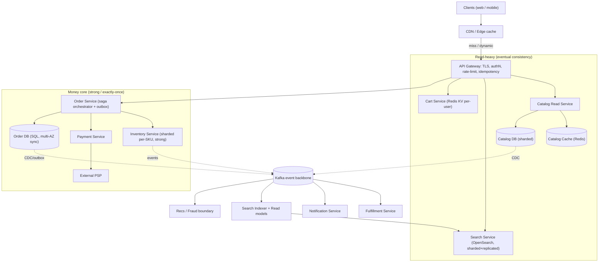

# Design an E-commerce Platform (Amazon) — High-Level Design

> Staff/principal-level HLD reference and interview-practice artifact. Audience: a senior backend engineer (Java/JVM, distributed systems) who knows the building blocks and wants the *design judgment* — clarification, tradeoffs, and the deep dives that separate a senior answer from a junior one.

---

## 1. Problem & clarifying questions

### 1.1 Restating the problem

Design the backend for an Amazon-scale **e-commerce platform**: a catalog of hundreds of millions of products that users browse and search, add to a cart, and check out; an **inventory system** that must never oversell scarce stock; an **order pipeline** that coordinates payment, inventory, fulfillment, and notifications across many services; plus **reviews/ratings** and a **recommendations** boundary. The system must stay available and correct under normal traffic and survive **Black-Friday / Prime-Day** spikes (10–50× normal load on hot items).

The hard part of e-commerce is *not* "store products and take orders." It is that the system is a **read-heavy catalog** (browse/search dominate by 100:1) bolted onto a **write-critical, money-touching order/inventory core** that demands correctness — and these two halves want opposite consistency, caching, and scaling strategies. A senior answer treats the platform as a **federation of services with different consistency contracts**, not one monolith.

### 1.2 Clarifying questions I would ask the interviewer

I never jump to boxes-and-arrows. First I scope the problem. Grouped by category, with *why each matters*:

**Functional scope**
1. **Which surfaces?** Catalog browse + search, product detail page (PDP), cart, checkout/order placement, payment, order tracking, reviews/ratings, recommendations? Or a subset? (Determines service count and which deep dives matter.)
2. **Marketplace or first-party?** Multiple third-party sellers per product (like real Amazon) or a single seller? (Marketplace adds seller onboarding, per-seller inventory, payouts, and the "buy box" — choosing which seller fulfills.)
3. **Single warehouse or multi-warehouse fulfillment?** Multi-warehouse means inventory is *distributed* and order routing must pick a fulfillment center. (Changes the inventory model from a single counter to per-location stock.)
4. **Digital goods, physical goods, or both?** Physical needs shipping, returns, RMA; digital needs entitlement/license delivery. (Assume physical-dominant.)
5. **Do we own payments or integrate a PSP** (payment service provider like Stripe/Adyen/Braintree)? (We almost always integrate a PSP and keep money-movement *outside* our trust boundary; we design the *boundary*, not a card processor.)
6. **Is recommendations in-scope to build, or just a boundary** we call? (Recsys is a whole system; treat as a boundary that consumes our event stream and serves an API.)

**Non-functional**
7. **Latency targets?** PDP and search p99? Checkout p99? (Browse must be tens of ms from cache; checkout can be hundreds of ms — users tolerate a spinner when money moves.)
8. **Availability targets per subsystem?** Is "browse must stay up even if checkout is degraded" acceptable? (Yes — graceful degradation; catalog read path is the most important to keep alive.)
9. **Consistency expectations?** Can product price/availability shown on PDP be slightly stale? Must inventory-at-checkout be exact? (Browse = eventual; checkout decrement = strong/linearizable on the hot key.)
10. **Correctness bar on money & stock:** Is **oversell** ever acceptable (we can oversell and cancel) or strictly forbidden? Is double-charge forbidden? (Oversell tolerance is a *business* decision; double-charge is always forbidden → idempotency mandatory.)

**Scale**
11. **DAU / MAU,** peak concurrent users, catalog size, orders/day, normal vs peak multiplier?
12. **Read:write ratio** on catalog vs orders?
13. **Geographic distribution** — single region or global (multi-region active-active)?

**Out-of-scope (confirm)**
14. Confirm we exclude: building the recsys models, the payment processor internals, the warehouse robotics/WMS, seller analytics dashboards, tax/duty calculation engine internals (we call a tax service), and fraud-ML internals (we call a fraud-scoring boundary).

### 1.3 Assumptions I'll proceed with (stated, defensible)

- **Marketplace, physical-goods-dominant, multi-warehouse.** Multiple sellers possible; inventory tracked per (SKU, fulfillment center).
- **We integrate an external PSP**; we own the *order/payment-intent boundary, idempotency, and reconciliation*.
- **Recommendations & fraud are boundaries** (event consumers + request/response APIs), not built here.
- **Scale:** 300M registered users, **100M DAU**, ~**10M peak concurrent** sessions on Prime Day. Catalog **500M products**. **~3M orders/day** normal, **~15M orders/day** peak. Read:write on catalog **≈ 100:1**.
- **Latency:** PDP p99 ≤ 200 ms, search p99 ≤ 300 ms, add-to-cart p99 ≤ 150 ms, checkout submit p99 ≤ 800 ms (it touches multiple services).
- **Availability:** catalog/browse 99.99%; checkout 99.95%; graceful degradation — browse survives even if checkout/payment are down.
- **Consistency contract (the key senior insight):** browse/search/reviews/recs = **eventual**; cart = **read-your-writes** per user; **inventory decrement & payment = strong / exactly-once**.
- **Global, multi-region**, but treat the primary region as the source of truth for orders; catalog is replicated read-everywhere.

---

## 2. Requirements (finalized)

### 2.1 Functional
- **Catalog & PDP:** fetch product detail (title, images, price, attributes, seller offers/buy-box, availability, aggregate rating).
- **Search & browse:** full-text + faceted search (filters: category, brand, price, rating, Prime-eligible), sort (relevance, price, rating, newest), pagination, autocomplete.
- **Cart:** add/update/remove items; cart persists across devices (server-side, keyed by user); guest carts merge on login.
- **Checkout / Order placement:** select address + shipping + payment, place order; **reserve inventory**, **authorize payment**, **create order**, kick off fulfillment, send confirmation.
- **Inventory:** track available/reserved stock per SKU per warehouse; reserve at checkout; commit on payment capture; release on timeout/cancel; **prevent oversell** of items we choose to protect.
- **Payments:** create payment intent, authorize, capture, refund — via PSP, behind an idempotent boundary.
- **Order management:** view orders, status, tracking, cancellations, returns/refunds.
- **Reviews & ratings:** submit (verified-purchase preferred), list paginated, aggregate score; moderation hooks.
- **Recommendations boundary:** "customers also bought," "recommended for you," "frequently bought together" — served via a recs API fed by our event stream.

### 2.2 Non-functional
| Property | Target | Notes |
|---|---|---|
| **Latency** | PDP p99 ≤ 200 ms; search p99 ≤ 300 ms; add-to-cart p99 ≤ 150 ms; checkout submit p99 ≤ 800 ms | Browse from cache/edge; checkout fans out across services |
| **Availability** | Catalog 99.99%; checkout 99.95% | Browse must survive checkout/payment outages (graceful degradation) |
| **Consistency** | Eventual for browse/search/reviews/recs; read-your-writes for cart; **strong/exactly-once** for inventory decrement & payment | Different contracts per subsystem — central tradeoff |
| **Durability** | Orders, payments, inventory ledger: 99.999999999% (no lost orders/charges) | Multi-AZ sync replication + WAL; event log retained |
| **Scalability** | 100M DAU, 10M peak concurrent, 15M orders/day peak | Horizontal everywhere; isolate hot keys |
| **Security** | TLS, authN/Z, PCI-DSS scope minimization (no raw PAN in our systems), idempotency, rate limiting, fraud boundary | Money & PII are the crown jewels |

### 2.3 Explicit non-goals
Recsys model training, PSP internals, WMS/robotics, tax-engine internals, fraud-ML internals, seller financial reporting. We design the **boundaries** to each.

---

## 3. Capacity estimation (arithmetic shown)

### 3.1 Traffic — reads vs writes
- **100M DAU.** Assume an active user does **~30 catalog/PDP/search reads per active day** and the busy window is ~6 hours (peaky), so use **peak factor 5× over a naive uniform average**.
- Naive average read QPS = 100M × 30 / 86,400 ≈ **34.7K reads/s**.
- **Peak browse/search QPS ≈ 34.7K × 5 ≈ 175K reads/s.** On Prime Day apply another 3× event spike → **~500K reads/s** to handle. Call it **~500K catalog reads/s peak**.

- **Writes (orders):** 3M orders/day normal → 3M / 86,400 ≈ **35 orders/s** average; peak factor 8× → **~280 orders/s**. Prime Day 15M/day with bursts → assume **~2,000 orders/s peak** at the spike. Each order = several writes (order row, items, payment intent, inventory reservation, ~6–10 outbox/event writes) → **~20K order-related writes/s peak**.

- **Cart writes:** add-to-cart and updates. Assume each DAU does ~5 cart mutations/day busy → 100M×5/86,400 ≈ **5.8K/s** avg, **~30K/s peak**.
- **Reviews:** ~1% of orders leave a review → ~150K reviews/day → trivial write rate (~2/s avg, ~50/s peak); but reviews are **read-heavy** (shown on every PDP).

**Read:write on catalog ≈ 500K : (a few K) ≈ 100:1+.** This is the defining shape: **cache-dominated reads, correctness-dominated writes.**

### 3.2 Storage
- **Catalog:** 500M products × ~5 KB structured metadata (title, attrs, offers, denormalized rating) = **2.5 TB** of hot metadata. Images/media stored in object storage (S3-like) + CDN, not in the DB — assume **~30 images × 200 KB × 500M = 3 PB** of media in object storage (cheap, cold-tiered). DB stores only URLs.
- **Search index:** inverted index ≈ 1–2 KB/doc effective × 500M ≈ **~0.75–1 TB** per replica; sharded + replicated → multiply by replica count.
- **Inventory:** 500M SKUs × ~200 B (counts per warehouse, but most SKUs in 1–3 FCs) ≈ **~150 GB** of hot inventory state. Tiny — fits in memory across a sharded store.
- **Orders:** 3M/day avg × 365 = ~1.1B orders/yr × ~2 KB (order + items denormalized) = **~2.2 TB/yr**; keep 7 yrs hot-ish for legal/returns → ~15 TB, then archive cold.
- **Reviews:** ~150K/day × 365 ≈ 55M/yr × ~1 KB = **~55 GB/yr** — small.
- **Cart:** 100M users × ~2 KB × (only a fraction active) ≈ a few hundred GB; ephemeral, TTL'd — fits in a memory-backed KV store.

### 3.3 Bandwidth
- **Read egress:** 500K reads/s × ~20 KB JSON (PDP payload) = **10 GB/s** at the application tier — but **most of this is served from CDN/edge cache**, so origin sees a fraction (cache hit ratio target ≥ 95% on catalog → origin ≈ 0.5 GB/s).
- **Media:** dominated by images, fully on CDN; origin only on cache miss.

### 3.4 Memory / cache sizing
- **Hot catalog cache:** Pareto — ~5% of products drive ~80% of traffic. 5% × 500M = 25M hot products × 5 KB = **125 GB** of hot metadata to keep in a distributed cache (Redis/Memcached cluster). Round to a **~256–512 GB cache tier** (replicated) for headroom + faceted/search result caching.
- **Inventory** (~150 GB) lives in a sharded in-memory-durable store (e.g., Redis with AOF, or a sharded SQL with row-level locks + cache).

### 3.5 Server / shard counts (rough)
- **Catalog read service:** if one node serves ~5K req/s of cache-fronted PDP assembly, 500K/s ÷ 5K = **~100 nodes**; add headroom → **~150 stateless nodes** across AZs.
- **Search:** index sharded into, say, **~16 shards** (1 TB / ~64 GB per shard) × **3 replicas** = **~48 search nodes**; query fan-out scatter-gather.
- **Order/checkout service:** writes are cheaper in volume; ~2K orders/s with multi-service fan-out → **~40–60 nodes** with strong isolation (own DB).
- **Inventory service:** sharded by SKU; **~16–32 shards** to spread hot keys, each multi-AZ replicated.
- **Cache tier:** ~512 GB ÷ ~64 GB/node = **~8 primary shards × replicas** ≈ **~24 cache nodes**.
- **Kafka (event backbone):** sized for ~50–100K events/s peak → tens of brokers, partitioned per topic.

These are order-of-magnitude; the interviewer cares that you can derive them and that you **isolate hot keys** rather than scale uniformly.

---

## 4. API design

REST/JSON at the edge (gRPC internally between services). All authenticated calls carry a session/JWT; all writes carry an **`Idempotency-Key`** header.

### 4.1 Catalog & search
```
GET /v1/products/{productId}
  -> 200 { productId, title, brand, attributes{}, images[], offers[ {sellerId, price, currency, prime, availability:"in_stock|low|out", fcCount} ], buyBox{sellerId, price}, rating{avg, count} }

GET /v1/search?q=...&category=...&brand=...&minPrice=&maxPrice=&minRating=&prime=&sort=relevance|price_asc|rating&page=&size=
  -> 200 { results:[ {productId, title, image, price, rating, prime} ], facets{ brand:[{v,count}], priceBuckets:[...], rating:[...] }, page, totalEstimate }

GET /v1/autocomplete?q=ip   -> 200 { suggestions:[ "iphone", "ipad", ... ] }
```

### 4.2 Cart
```
GET    /v1/cart                 -> 200 { cartId, items:[{productId, sellerId, qty, priceSnapshot}], subtotal }
POST   /v1/cart/items           { productId, sellerId, qty }  -> 200 cart   (Idempotency-Key)
PATCH  /v1/cart/items/{itemId}  { qty }                       -> 200 cart
DELETE /v1/cart/items/{itemId}                                -> 200 cart
POST   /v1/cart/merge           { guestCartId }               -> 200 cart   (on login)
```
> Cart prices are **snapshots for display only**; authoritative price is re-fetched at checkout (prices change; you cannot trust a 3-day-old cart price).

### 4.3 Checkout / Orders
```
POST /v1/checkout                      (Idempotency-Key REQUIRED)
  { cartId, addressId, shippingOptionId, paymentMethodToken }
  -> 202 { orderId, status:"PENDING" }     // async saga; client polls or subscribes

GET  /v1/orders/{orderId}              -> 200 { orderId, status, items[], total, payment{status}, shipments[] }
GET  /v1/orders                        -> 200 { orders:[...] , page }
POST /v1/orders/{orderId}/cancel       (Idempotency-Key) -> 202
POST /v1/orders/{orderId}/returns      { items[], reason } -> 202
```
`status` lifecycle: `PENDING → RESERVED → PAYMENT_AUTHORIZED → CONFIRMED → FULFILLING → SHIPPED → DELIVERED` with branches `→ FAILED`, `→ CANCELLED`, `→ REFUNDED`.

### 4.4 Inventory (internal)
```
POST /internal/v1/inventory/reserve   { reservationId, items:[{sku, fc?, qty}], ttlSeconds }  (idempotent on reservationId)
  -> 200 {status:"RESERVED", fcAllocations:[...]} | 409 {status:"INSUFFICIENT", sku}
POST /internal/v1/inventory/commit     { reservationId }   (idempotent)
POST /internal/v1/inventory/release    { reservationId }   (idempotent)
GET  /internal/v1/inventory/{sku}      -> { available, reserved, perFc:[...] }
```

### 4.5 Payments (internal, behind PSP)
```
POST /internal/v1/payments/intent      { orderId, amount, currency, paymentMethodToken }  (idempotent on orderId)
  -> { paymentIntentId, status:"AUTHORIZED|REQUIRES_ACTION|FAILED" }
POST /internal/v1/payments/capture     { paymentIntentId }  (idempotent)
POST /internal/v1/payments/refund      { paymentIntentId, amount }  (idempotent)
```

### 4.6 Reviews
```
POST /v1/products/{id}/reviews   { rating:1..5, title, body }  (Idempotency-Key; verified-purchase checked server-side)
GET  /v1/products/{id}/reviews?sort=helpful|recent&page=  -> { reviews:[...], aggregate{avg,count,histogram} }
POST /v1/reviews/{reviewId}/helpful  -> {helpfulCount}
```

---

## 5. High-level architecture

### 5.1 Components and request flow

Clients hit a **CDN/edge** (static + cached PDP/search fragments), then an **API Gateway** (TLS termination, authN, rate limiting, routing). The gateway fans out to independently-scaled services, each owning its datastore. A **Kafka event backbone** decouples write-side services from read-side projections and downstream consumers (recs, fraud, search indexer, analytics).

**Read path (browse):** Edge cache → Gateway → Catalog read service → Catalog cache (Redis) → Catalog DB (miss only). Search served by a dedicated search cluster (Elasticsearch/OpenSearch) fed asynchronously from catalog changes.

**Write path (checkout):** Gateway → Order service (the **saga orchestrator**) → Inventory service (reserve) → Payment service (authorize via PSP) → Order confirmed → events emitted → Fulfillment, Notification, Inventory-commit, Search/recs projections consume.

### 5.2 ASCII block diagram

```
                          ┌───────────────────────────────┐
        Clients ───────►  │   CDN / Edge cache (media,     │
   (web, mobile, app)     │   cached PDP & search frags)   │
                          └───────────────┬───────────────┘
                                          │ (cache miss / dynamic)
                                  ┌───────▼────────┐
                                  │  API Gateway   │  TLS, authN, rate-limit,
                                  │  + Auth/BFF    │  routing, idempotency check
                                  └───┬───┬───┬────┘
            ┌─────────────────────────┘   │   └───────────────────────────┐
            ▼                             ▼                               ▼
   ┌─────────────────┐          ┌──────────────────┐           ┌──────────────────┐
   │ Catalog Read    │          │ Search Service   │           │  Cart Service    │
   │ Service         │◄────────►│ (OpenSearch,     │           │ (Redis-backed    │
   │  + Catalog Cache│  scatter │  sharded+repl.)  │           │  KV, per-user)   │
   └───────┬─────────┘  gather  └───────┬──────────┘           └──────────────────┘
           │ miss                       ▲ async index
           ▼                            │
   ┌─────────────────┐                  │
   │ Catalog DB      │──CDC/outbox──────┘
   │ (products,offers│
   │  sharded SQL/   │
   │  document store)│
   └─────────────────┘

   ===================  WRITE / MONEY CORE  ==========================
                                  ┌──────────────────┐
                          ┌──────►│  Order Service    │  ◄── saga orchestrator
                          │       │  (own SQL DB,     │
                          │       │   outbox table)   │
                          │       └──┬───────┬────────┘
                          │          │       │
            ┌─────────────┘          ▼       ▼
            │              ┌──────────────┐ ┌──────────────────┐
   API GW ──┘              │ Inventory    │ │ Payment Service  │──► PSP
                           │ Service      │ │ (intent/auth/    │   (Stripe/
                           │ (sharded,    │ │  capture/refund) │    Adyen)
                           │  per-SKU,    │ └──────────────────┘
                           │  strong)     │
                           └──────────────┘
   ===================================================================
                                  │  domain events (outbox→CDC)
                                  ▼
        ┌───────────────────────────────────────────────────────────┐
        │                  Kafka event backbone                       │
        └──┬───────────┬───────────────┬───────────────┬─────────────┘
           ▼           ▼               ▼               ▼
   ┌────────────┐ ┌──────────┐  ┌──────────────┐ ┌──────────────┐
   │ Fulfillment│ │Notif.    │  │ Search Indexer│ │ Recs / Fraud │
   │ Service    │ │Service   │  │ + Read models │ │  boundary    │
   └────────────┘ └──────────┘  └──────────────┘ └──────────────┘
```

### 5.3 Mermaid diagram



### 5.4 Checkout sequence (happy path)

```mermaid
sequenceDiagram
  participant C as Client
  participant GW as API Gateway
  participant O as Order Service (Saga)
  participant I as Inventory
  participant P as Payment
  participant PSP as PSP
  participant K as Kafka

  C->>GW: POST /checkout (Idempotency-Key)
  GW->>O: createOrder(cart, addr, payMethod, idemKey)
  Note over O: dedupe on idemKey; persist Order=PENDING + saga state
  O->>I: reserve(reservationId, items, ttl)
  I-->>O: RESERVED (fc allocations)
  O->>P: createIntent+authorize(orderId, amount, token)
  P->>PSP: authorize
  PSP-->>P: AUTHORIZED
  P-->>O: AUTHORIZED
  Note over O: Order=CONFIRMED; write to outbox in same txn
  O-->>C: 202 {orderId, PENDING->CONFIRMED}
  O->>K: OrderConfirmed event (via outbox/CDC)
  K->>I: commit(reservationId)   %% async, idempotent
  K->>P: capture(intent)         %% at ship or now per policy
  K->>Fulfill: create shipment
  K->>Notif: send confirmation email
```

---

## 6. Data model & storage choices

The thesis: **one datastore does not fit all access patterns.** Each subsystem picks storage by its read/write shape and consistency need.

### 6.1 Catalog
- **Entities:** `Product(productId, title, brand, category, attributes JSON, mediaUrls[], status, ratingAvg, ratingCount)`, `Offer(offerId, productId, sellerId, price, currency, condition, primeEligible)`. Buy-box is computed (price + seller rating + shipping speed).
- **Store:** **document-oriented** (DynamoDB-style KV or MongoDB) or **sharded SQL with a JSON column** for attributes. Reason: PDP is a **single-key lookup by productId** returning a denormalized blob — exactly what a KV/document store serves cheaply, and product attributes are heterogeneous (a book vs a TV have different fields → schemaless JSON wins over rigid columns).
- **Sharding:** by `productId` hash. Read replicas + heavy caching. Writes (catalog edits) are rare → no write contention.
- **Why not pure RDBMS normalized?** Joins across attribute tables on the hottest path (PDP) at 500K/s is wasteful; denormalize and accept that catalog edits fan out to update the blob + reindex.

### 6.2 Search
- **Store:** **OpenSearch/Elasticsearch** (inverted index) — purpose-built for full-text, faceting, relevance scoring. Fed **asynchronously** from catalog changes via CDC → indexer. Search is **eventually consistent** with catalog (a price edit appears in search seconds later — acceptable).
- Sharded by document, replicated for query throughput + HA; queries scatter-gather across shards.

### 6.3 Cart
- **Store:** **Redis** (in-memory KV) keyed by `userId`, with periodic snapshot to a durable store (or Redis AOF) so a cache eviction doesn't lose carts. **Read-your-writes** per user. TTL on inactive carts. Cart is low-value, high-churn → in-memory is ideal; losing a guest cart occasionally is tolerable, but we still persist logged-in carts durably.

### 6.4 Inventory
- **Store:** **sharded strongly-consistent store** keyed by `sku` (or `(sku, fc)`): either (a) **SQL row with `SELECT ... FOR UPDATE`** / conditional `UPDATE ... WHERE available >= qty`, or (b) **Redis with Lua** for atomic check-and-decrement plus a durable ledger. The state per SKU: `available`, `reserved`, plus a **reservation ledger** (append-only) for auditing and TTL-based release. This is the **strong-consistency island** — see Deep Dive 2.
- Sharded by SKU so different SKUs scale independently; **hot SKUs get extra treatment** (Deep Dive 5).

### 6.5 Orders & Payments
- **Store:** **relational (PostgreSQL/MySQL), multi-AZ synchronous replication**, sharded by `userId` (or `orderId`). Orders are money/legal records → ACID, durability 11 nines, auditable. Tables: `orders`, `order_items`, `payments`, `saga_state`, **`outbox`** (transactional outbox for reliable event emission). Strong consistency here is non-negotiable.
- **Why relational, not NoSQL?** Orders need multi-row transactions (order + items + payment intent + outbox in one atomic commit), strong invariants, and ad-hoc operational queries (support, finance). NoSQL's eventual writes are wrong for money.

### 6.6 Reviews
- **Store:** write to a **document/SQL store** (`reviews(reviewId, productId, userId, rating, body, verifiedPurchase, helpfulCount, status)`); **aggregate rating** (avg, count, histogram) is a **denormalized read model** updated asynchronously via events and **cached on the product**. Reviews are read-heavy (every PDP), eventual consistency fine.

### 6.7 Storage choice summary
| Subsystem | Store | Consistency | Why |
|---|---|---|---|
| Catalog | Document/KV (sharded) + cache | Eventual | Single-key denormalized reads, heterogeneous attrs, 100:1 reads |
| Search | OpenSearch | Eventual | Inverted index, faceting, relevance; async-fed |
| Cart | Redis (+ durable snapshot) | Read-your-writes | Hot, ephemeral, per-user |
| Inventory | Sharded SQL/Redis-Lua + ledger | **Strong** | Oversell prevention demands atomic decrement |
| Orders/Payments | Relational, multi-AZ sync | **Strong/ACID** | Money/legal, multi-row txns, outbox |
| Reviews | Document/SQL + cached aggregate | Eventual | Read-heavy, low write rate |

---

## 7. Deep dives (the bulk)

I spend the depth on the five genuinely hard sub-problems: **(1) read-heavy catalog scaling & caching**, **(2) inventory reservation & oversell prevention**, **(3) the order-placement saga across services**, **(4) the payment boundary, idempotency & reconciliation**, and **(5) Black-Friday hot-key / hot-partition survival**. Each names the **failure mode the chosen design avoids**.

---

### Deep Dive 1 — Read-heavy catalog scaling & caching

**Problem:** 500K PDP/search reads/s at p99 ≤ 200 ms against a 500M-product catalog. Going to the DB on every read both blows latency and melts the DB.

**The layered cache strategy (multi-tier):**

1. **CDN / edge cache** for media and *cacheable PDP fragments*. PDPs are mostly static (title, images, attributes); the *volatile* bits are price and availability. Strategy: cache the static PDP shell at the edge with a long TTL; **render price/availability via a small dynamic call (ESI / client-side fetch)** so we don't invalidate the whole page on every price change.
2. **Distributed application cache (Redis/Memcached)** holding ~25M hot product blobs (~125 GB). **Cache-aside** pattern: read cache → miss → read DB → populate cache with TTL + jitter.
3. **Local (in-process) cache** on catalog nodes for the *very* hottest items (top-N) to absorb the thundering herd and cut even the Redis round-trip.

**Invalidation — the hard part.** Caches lie when data changes. Options:

| Approach | How | Pro | Con / failure mode avoided |
|---|---|---|---|
| **TTL only** | Expire after N seconds | Simple, no plumbing | Stale up to TTL; fine for attrs, **bad for price** |
| **Event-driven invalidation** | Catalog change → CDC event → invalidate/refresh cache key | Fresh within seconds | Plumbing; risk of missed event → use **versioned keys** |
| **Write-through** | Write updates cache + DB together | Always warm | Couples write path to cache; cache outage stalls writes |
| **Versioned/immutable keys** | Key = `product:{id}:v{n}`; bump version on change | No invalidation race | Must propagate version (carry in CDC) |

**Decision:** **TTL + event-driven refresh, with versioned keys for price.** Static attributes use TTL (minutes). Price/availability use a **short TTL (seconds) + event-driven proactive refresh** so a price change propagates fast. Versioned keys eliminate the classic **stale-write race** (where a slow miss-fill overwrites a newer value). **Failure mode avoided:** showing a wrong price (legal/trust risk) and the **thundering herd** on popular-item TTL expiry — mitigated by *request coalescing* (single-flight: one miss fills, others wait) + TTL jitter so keys don't all expire simultaneously.

**Search scaling:** index sharded + replicated; query nodes scatter-gather. Cache *frequent query+facet results* (e.g., "category=phones sort=popular page=1") with short TTL — these repeat enormously. Autocomplete served from an in-memory prefix structure (trie / FST), not the main index.

**Consistency stance:** catalog reads are **eventually consistent** — a few seconds of staleness on attributes is invisible to users; price staleness is bounded to seconds and *re-validated at checkout* (the cart never trusts the displayed price). This is the senior move: **push the only correctness-critical price check to checkout**, freeing the entire browse path to be aggressively cached.

---

### Deep Dive 2 — Inventory reservation & oversell prevention

**Problem:** When 50,000 people try to buy the last 1,000 PS5s in 2 seconds, we must sell exactly ≤ 1,000 and never charge for stock we don't have. **Oversell = refunds, angry customers, regulatory pain.** Yet inventory is the **hottest write key on Earth** during a drop.

**Core invariant:** `reserved + sold ≤ on_hand` per (SKU, FC). Decrement must be **atomic and linearizable** on the key.

**Reserve-commit-release model (two-phase):**
- **Reserve** at checkout start: atomically `available -= qty`, `reserved += qty`, write a reservation row with **TTL** (e.g., 15 min). If `available < qty` → reject (`409 INSUFFICIENT`).
- **Commit** on payment capture: `reserved -= qty`, `sold += qty`. Reservation consumed.
- **Release** on timeout/cancel/payment-fail: `reserved -= qty`, `available += qty`. A **reaper** job releases expired reservations (handles abandoned checkouts — the failure mode where reserved stock leaks and the item looks sold out while nobody's buying).

**How to make the decrement atomic — options:**

| Mechanism | How | Pro | Con / failure mode |
|---|---|---|---|
| **DB row lock** (`SELECT FOR UPDATE` / conditional `UPDATE ... WHERE available>=qty`) | Pessimistic / atomic conditional update | Strong, simple, durable, auditable | Lock contention on a single hot row → throughput collapse under a drop |
| **Optimistic concurrency** (version/CAS, retry) | Read version, update if unchanged | No locks; great under low contention | **Retry storms** under high contention on hot SKU |
| **Redis + Lua atomic decrement** + durable ledger | In-memory atomic check-decr; async persist to DB ledger | Very high throughput on hot key | Must guarantee durability (AOF) + reconcile with ledger; node failure window |
| **Partitioned/segmented counters** | Split the 1,000 units into N buckets (e.g., 10×100), route by hash, sum for availability | Spreads contention N-fold | Skew (a bucket empties first); needs rebalancing/borrowing |

**Decision:** **Conditional atomic `UPDATE ... WHERE available >= qty` as the source of truth**, fronted for *hot SKUs* by **segmented counters** and an **in-memory atomic layer (Redis-Lua)** with a **durable append-only ledger** reconciled to the SQL row. Normal SKUs (the 99.99%) just use the conditional SQL update — zero contention, perfectly correct. **Only hot SKUs** get segmentation + the Redis fast path. **Failure modes avoided:** (a) **oversell** — the conditional update / Lua script is atomic so two buyers can't both pass the `available >= qty` check; (b) **single-row lock meltdown** during a drop — segmentation spreads the contention; (c) **reservation leak** — TTL + reaper returns abandoned stock.

**Why reserve-then-charge, not charge-then-decrement?** If you charge first and then find no stock, you must refund and apologize. Reserving first means the **only** way to be charged is to hold a valid reservation → no charge without stock. This ordering is the heart of correctness.

**Consistency stance:** inventory is the **strong-consistency island**. We *do not* eventualize the decrement. The tradeoff — strong consistency limits per-key throughput — is bought back with **segmentation + hot-key isolation** rather than by weakening correctness.

**Edge cases discussed in an interview:** multi-FC allocation (reserve across nearest FCs, fall back to farther ones), backorder policy (allow oversell with explicit promise date for chosen SKUs — a *business* toggle), and "low stock" UI hints driven from eventually-consistent reads while the *decrement* stays strong.

---

### Deep Dive 3 — Order-placement saga across services

**Problem:** Placing an order touches **Order, Inventory, Payment, Fulfillment, Notification** — separate services with separate databases. There is **no distributed ACID transaction** across them (2PC is fragile and blocks). We need a way to keep the world consistent *without* a global lock.

**Why not 2PC (two-phase commit)?** A coordinator that holds locks across Inventory + Payment + Order while waiting for all to "prepare" blocks every participant if the coordinator dies, and PSPs simply don't speak 2PC. **Failure mode of 2PC:** coordinator failure → stuck locks → frozen inventory. Reject it.

**Solution: the Saga pattern** — a sequence of **local transactions**, each with a **compensating action** to undo it if a later step fails. Two styles:

| Style | How | Pro | Con |
|---|---|---|---|
| **Orchestration** | A central Order saga orchestrator calls each step and drives compensation | Explicit, debuggable, clear state machine | Orchestrator is a component to make HA |
| **Choreography** | Services react to each other's events, no central brain | Loosely coupled | Emergent logic hard to trace; cyclic event spaghetti |

**Decision: orchestration.** Money flows demand an explicit, auditable state machine; "who's compensating what" must be obvious to on-call. The orchestrator is made HA by persisting **saga state in the Order DB** and resuming on restart. **Failure mode avoided:** the untraceable choreography tangle where a stuck order has no owner.

**The saga steps & compensations:**
1. **Create order (PENDING)** + persist saga state — *compensation:* mark FAILED.
2. **Reserve inventory** — *compensation:* release reservation.
3. **Authorize payment** — *compensation:* void/refund authorization.
4. **Confirm order (CONFIRMED)**, write **OrderConfirmed** to the **transactional outbox** in the *same DB transaction*.
5. Downstream (async, via Kafka): **commit inventory**, **capture payment** (at ship time per policy), **create shipment**, **send notification**.

If step 3 fails → run compensations for 2 and 1 (release stock, mark order FAILED, notify user). If a *downstream* async step fails, it **retries** (it's past the point of no return; we don't un-charge a confirmed order — we retry fulfillment / alert ops).

**Reliable event emission — the transactional outbox.** Problem: "update Order DB *and* publish to Kafka" is itself a dual-write that can half-fail (DB commits, Kafka publish drops → lost event). Solution: write the event into an **`outbox` table in the same DB transaction** as the order state change; a **CDC/relay** process tails the outbox and publishes to Kafka **at-least-once**. **Failure mode avoided:** lost OrderConfirmed events (silent order black-holes). Consumers must be **idempotent** to tolerate at-least-once redelivery.

**Idempotency & exactly-once-effect.** Each saga step is keyed by `reservationId` / `orderId` / `paymentIntentId` and is **idempotent** — retrying a step produces the same effect once. The orchestrator persists step status, so on crash-recovery it re-drives from the last committed step without double-acting. This converts at-least-once delivery into **exactly-once *effect*** (true exactly-once *delivery* is impossible in distributed systems; idempotent effects is the achievable goal).

**Saga state machine:**
```mermaid
stateDiagram-v2
  [*] --> PENDING
  PENDING --> RESERVED: inventory reserved
  PENDING --> FAILED: reserve failed (no stock)
  RESERVED --> AUTHORIZED: payment authorized
  RESERVED --> FAILED: auth failed (release stock)
  AUTHORIZED --> CONFIRMED: order confirmed + outbox event
  CONFIRMED --> FULFILLING: shipment created (async)
  FULFILLING --> SHIPPED --> DELIVERED
  CONFIRMED --> CANCELLED: user cancel pre-ship (refund + release)
  FAILED --> [*]
  CANCELLED --> [*]
  DELIVERED --> [*]
```

---

### Deep Dive 4 — Payment boundary, idempotency & reconciliation

**Problem:** Money is the unforgiving part. We must **never double-charge**, never charge without an order, never lose a charge, and minimize PCI scope. The PSP is an external system over a flaky network — timeouts are ambiguous (did the charge happen?).

**PCI scope minimization (security-critical):** the client tokenizes the card directly with the PSP (PSP-hosted fields / SDK) → we receive a **payment-method token**, never the raw PAN (card number). Our systems therefore **never store or transit card data**, slashing PCI-DSS scope. **Failure mode avoided:** a breach exposing card numbers.

**Idempotent payment operations:** every payment call carries an **idempotency key** (we use `orderId` for intent/authorize, `paymentIntentId` for capture/refund). The PSP and our Payment service both dedupe on it. **Failure mode avoided:** the timeout-retry double-charge — if `authorize` times out and we retry, the same idempotency key guarantees a single charge; the PSP returns the original result.

**Authorize vs capture (two-step):** **Authorize** holds funds at checkout (proves the card is good and funds exist) without moving money; **capture** actually charges, typically at **ship time** (you shouldn't take money for goods you haven't shipped). Auth has an expiry (~7 days) → if we can't ship in time, re-authorize. **Failure mode avoided:** charging for an order we then can't fulfill.

**Handling the ambiguous timeout (the classic):** if `authorize` returns a network timeout, we **don't assume failure**. We **query the PSP by idempotency key** to learn the true state, or rely on the PSP's idempotent replay. The saga step stays in a `PENDING_PAYMENT` state and a reconciler resolves it. **Failure mode avoided:** marking an order failed (and releasing stock) when the customer *was* actually charged.

**Reconciliation:** a periodic job compares **our payment ledger vs the PSP's settlement report**. Mismatches (we think AUTHORIZED, PSP says nothing; or PSP captured, we didn't record) are flagged and auto-corrected or escalated to finance. This is the **safety net for all the half-failures** the happy path misses. **Failure mode avoided:** silent money drift between us and the PSP.

**Webhooks for async results:** some payment methods (3-D Secure, bank redirects) complete asynchronously; the PSP **webhooks** us the result. Webhooks are at-least-once and must be **signature-verified** (to prevent forged "payment succeeded" calls) and **idempotently processed**.

| Concern | Mechanism | Failure mode avoided |
|---|---|---|
| Double charge | Idempotency key on every PSP op | Timeout-retry double charge |
| Charge w/o fulfillment | Authorize at checkout, capture at ship | Paying for unshippable goods |
| Lost/ambiguous charge | Query-by-key + reconciliation job | Silent money drift; false failure |
| Card data breach | PSP tokenization, no PAN in our systems | PCI breach |
| Forged success | Signed, idempotent webhooks | Order confirmed without real payment |

---

### Deep Dive 5 — Black-Friday / Prime-Day hot-key & hot-partition survival

**Problem:** Traffic spikes 10–50×, concentrated on a few hot products and a few hot SKUs (the "drop"). Uniform scaling doesn't help when **all the load lands on one key/partition** — you can't shard a single PS5 SKU's counter across 100 machines for free.

**Read side (hot product):**
- **Local in-process cache** for the top-N hottest products (absorbs reads before they hit Redis).
- **Request coalescing / single-flight:** on a cache miss for a hot key, only one request hits the DB; the rest wait for that fill → prevents the **thundering herd**.
- **TTL jitter** so hot keys don't all expire at the same instant.
- **Edge caching** of the static PDP shell; only price/availability is dynamic.

**Write side (hot SKU inventory):**
- **Segmented counters** (split N units into K buckets) to spread the atomic-decrement contention K-fold; combine with **in-memory Redis-Lua** atomic decrement + durable ledger for raw throughput, reconciled to the SQL source of truth.
- **Admission control / virtual waiting room:** for extreme drops, gate users into a **queue** (token-bucket admission). Only admitted users reach checkout; this *flattens* the spike into a sustainable rate and gives a fair, predictable experience. **Failure mode avoided:** the entire checkout path collapsing because 5M people hit "buy" in the same second.
- **Load shedding:** if a service is saturated, shed *non-essential* load first (recs, related-items) to protect the critical path (cart/checkout).

**Cross-cutting resilience patterns:**
- **Graceful degradation:** if recs/reviews are down, render the PDP without them; if search relevance service degrades, fall back to a simpler ranking. **Browse never goes down because checkout did.** Services are isolated so failure doesn't cascade.
- **Bulkheads & circuit breakers:** each downstream dependency has its own thread pool / connection pool (bulkhead) and a circuit breaker that trips on sustained errors, failing fast instead of piling up threads. **Failure mode avoided:** one slow dependency (e.g., a struggling recs service) exhausting all gateway threads and taking the whole site down (cascading failure).
- **Autoscaling stateless tiers** (catalog read, gateway) on QPS/CPU; **pre-scale** ahead of a known event rather than reacting.
- **Backpressure** on Kafka consumers; partition hot topics adequately so the indexer/notifier don't lag into hours.

**The senior insight:** Black-Friday survival is *not* "add more servers." It's **(a) keep the read path entirely in caches**, **(b) isolate and specially handle the handful of hot keys**, **(c) flatten the spike with admission control**, and **(d) shed and degrade non-critical paths to protect the money path**.

---

## 8. Scaling & bottlenecks

**How it scales:**
- **Stateless tiers** (gateway, catalog read, search query, order service) scale horizontally behind load balancers; autoscale on QPS/CPU.
- **Catalog reads** scale via cache layers (edge → Redis → local) so the DB sees a tiny fraction; DB itself is sharded by productId with read replicas.
- **Search** scales by adding shards (more index capacity) and replicas (more query throughput).
- **Inventory** scales by sharding on SKU; hot SKUs get segmentation.
- **Orders/Payments** scale by sharding on userId; write volume is modest vs reads.
- **Event backbone** scales by topic partitioning; consumers scale per partition.

**Where it breaks first, and the fix:**

| Bottleneck | Symptom | Fix |
|---|---|---|
| **Hot product cache miss storm** | DB CPU spikes on a viral item | Request coalescing, local cache, TTL jitter |
| **Hot SKU inventory row** | Lock contention, checkout latency on a drop | Segmented counters + Redis-Lua fast path + admission control |
| **Order DB write hotspot** | Single shard saturates if userId skews | Shard by orderId hash; isolate; add capacity |
| **Kafka consumer lag** | Notifications/search updates fall hours behind | More partitions, more consumer instances, backpressure |
| **Search shard skew** | One shard (popular category) hot | Re-shard, route, add replicas to hot shard |
| **PSP rate limits / latency** | Checkout p99 balloons | Async capture, queue + retry, multiple PSPs, circuit breaker |
| **Cross-region replication lag** | Stale catalog far from origin | Accept eventual; pin orders to primary region |

**The first thing to break under a real Prime-Day surge is the hot-SKU inventory key** — which is exactly why Deep Dive 2 and 5 spend the most effort there.

---

## 9. Reliability, consistency & security

### 9.1 Failure handling & reliability
- **Multi-AZ** for every stateful store; **multi-region** for catalog (read-everywhere) and DR. Orders/payments have a primary region with synchronous multi-AZ replication and async cross-region for DR (RPO seconds, RTO minutes).
- **Retries with exponential backoff + jitter** on transient failures; **idempotency keys** make retries safe.
- **Circuit breakers + bulkheads** isolate failing dependencies; **timeouts everywhere** (no unbounded waits).
- **Graceful degradation:** non-critical features (recs, reviews, related items) fail open; critical path (cart, inventory, checkout, payment) protected by load shedding.
- **Saga compensations + reconciliation jobs** clean up partial failures.
- **The reaper** releases expired inventory reservations.
- **Dead-letter queues** for poison events; alerting on consumer lag and saga stuck-states.

### 9.2 Consistency model (per subsystem — the central theme)
- **Eventual:** catalog browse, search, reviews/aggregates, recommendations. Staleness bounded to seconds; invisible or acceptable.
- **Read-your-writes:** cart (a user always sees their own latest cart).
- **Strong / linearizable:** inventory decrement, payment authorize/capture, order state transitions. Bought with hot-key isolation, not weakened correctness.
- **Re-validation at the boundary:** price and stock displayed during browse are eventually consistent, but **re-checked authoritatively at checkout** — the design's way of keeping the read path cheap while the money path stays correct.

### 9.3 Idempotency
- Mandatory `Idempotency-Key` on all mutating public endpoints (checkout, cart writes, reviews) and on all internal money/stock ops (reserve, commit, authorize, capture, refund).
- Dedupe store maps key → result; replays return the stored result, never re-execute. This is the single most important correctness mechanism in the write path.

### 9.4 Security & abuse
- **TLS** everywhere; mTLS between internal services.
- **AuthN:** OAuth2/OIDC + JWT/session at the gateway; **authZ** per resource (a user can only read their own cart/orders).
- **PCI scope minimization:** PSP tokenization, no PAN in our systems.
- **PII protection:** encryption at rest, field-level encryption for sensitive PII, tight access controls, audit logs.
- **Rate limiting** at the gateway per-user and per-IP (token bucket) to stop scraping and brute force; stricter limits on checkout/login.
- **Fraud boundary:** checkout calls a fraud-scoring service (async or inline) that can hold/deny suspicious orders; velocity checks on payment attempts.
- **Bot defense** on hot drops (CAPTCHA / proof-of-work / device fingerprinting) to stop scalpers; the admission-control waiting room doubles as a bot dampener.
- **Webhook signature verification** for PSP callbacks.
- **Input validation** and output encoding to prevent injection/XSS in reviews and search.

---

## 10. Extensions & follow-ups

| Follow-up the interviewer adds | How the design changes |
|---|---|
| **Flash sales / lightning deals** | Pre-warm caches, dedicated inventory pool with segmented counters, virtual waiting room, aggressive admission control. |
| **Multi-region active-active for checkout** | Hard: inventory & payment need a global source of truth. Either pin a SKU's inventory to a home region (route orders there) or use a consensus store (Spanner-like) for global linearizable counters — accept higher write latency. |
| **Personalized search/ranking** | Recs/ML ranking layer re-orders search results per user; fed by event stream; cache per-user-segment, not per-user, to keep cache hit rates sane. |
| **Subscriptions / recurring (Prime, Subscribe & Save)** | Add a billing/scheduler service issuing recurring payment intents idempotently; entitlement service for Prime perks. |
| **Returns & refunds at scale** | RMA workflow, partial refunds (idempotent), inventory restock events, fraud checks on serial returners. |
| **Digital goods** | Replace shipping with entitlement/license delivery; capture immediately (no ship delay). |
| **Seller-facing inventory feeds** | Bulk ingestion pipeline, validation, eventual reflection in catalog + search; per-seller rate limits. |
| **GDPR / right-to-be-forgotten** | Crypto-shredding of PII, propagate deletion across services + event log via tombstones; reviews anonymized. |
| **Recommendations real-time** | Stream-process the event backbone (clicks, purchases) into near-real-time recs; the boundary stays an API. |
| **Internationalization** | Per-locale catalog, currency, tax (call tax service), localized search analyzers. |

---

## 11. Interview Q&A

**Q1. Why different consistency models for different subsystems instead of one?**
Because the cost/benefit differs. Browse/search are read-dominated (100:1) and tolerate seconds of staleness, so eventual consistency lets us cache aggressively and serve 500K reads/s cheaply. Inventory decrement and payment touch money/scarcity where a wrong answer means oversell or double-charge, so they must be strongly consistent. Forcing strong consistency on browse would destroy throughput; forcing eventual on inventory would cause oversell. *Probe — "where's the seam?"* At checkout: displayed price/stock are eventual, **re-validated authoritatively** before we reserve/charge.

**Q2. How do you prevent overselling the last item under massive concurrency?**
Atomic conditional decrement (`UPDATE ... WHERE available >= qty`) or a Redis-Lua atomic check-decrement as the linearizable operation — two buyers cannot both pass the check. Reserve-then-charge ordering ensures no charge without a held reservation. For hot SKUs, segment the counter to spread contention and front it with admission control. *Probe — "what if the reservation is abandoned?"* TTL on reservations + a reaper releases them. *Probe — "what about the DB row lock melting down?"* Segmented counters + in-memory fast path; only hot SKUs need it.

**Q3. Walk me through order placement when payment authorization times out.**
We don't assume failure. The saga step enters `PENDING_PAYMENT`; we query the PSP by idempotency key (or rely on idempotent replay) to discover the true outcome, and a reconciler resolves it against the PSP settlement report. We keep the inventory reserved until resolved. *Probe — "could you double-charge on retry?"* No — the idempotency key dedupes at the PSP, so a retry returns the original result.

**Q4. Why a saga instead of a distributed transaction (2PC)?**
2PC requires a coordinator holding locks across all participants; if it dies, participants block indefinitely (frozen inventory), and PSPs don't speak 2PC. A saga uses local transactions with compensations — no global locks, no blocking, and each service stays autonomous. The cost is we accept temporary inconsistency between steps and must write compensations, which is acceptable and explicit.

**Q5. How do you reliably emit events when you update the order DB? (Senior signal — dual-write problem)**
Transactional outbox: write the event into an `outbox` table in the *same* DB transaction as the state change, then a CDC relay publishes it to Kafka at-least-once. This avoids the dual-write failure where the DB commits but the Kafka publish drops (lost event). Consumers are idempotent to tolerate redelivery, giving exactly-once *effect*.

**Q6. How do you keep the catalog fast and fresh at 500K reads/s? (Senior signal — caching tradeoffs)**
Layered caches (edge → distributed Redis → local), cache-aside with TTL+jitter, request coalescing to kill thundering herds, and event-driven refresh with versioned keys for price. Static attributes use longer TTL; price/availability use short TTL + proactive refresh and are re-validated at checkout. The tradeoff is bounded staleness (seconds), which is invisible for browse and corrected at the money boundary.

**Q7. How does the system survive a 50× Prime-Day spike? (Senior signal — capacity & isolation)**
Keep reads in caches (origin sees <5%), isolate the handful of hot keys (segmented counters, local cache, single-flight), flatten the write spike with a virtual waiting room / admission control, and shed/degrade non-critical features (recs, reviews) to protect cart/checkout. Pre-scale stateless tiers ahead of the known event. The key realization: uniform scaling fails when load concentrates on one key.

**Q8. What's the consistency story for the cart, and why?**
Read-your-writes per user, backed by Redis with durable snapshots. The cart is hot and high-churn; in-memory gives sub-ms latency. Cart prices are display snapshots only — the authoritative price is re-fetched at checkout, so a stale cart price never results in a wrong charge.

**Q9. Why authorize and capture separately instead of charging at checkout? (Senior signal)**
Authorization proves funds exist and reserves them without moving money; capture (at ship time) takes the money. Capturing only when we ship avoids charging for goods we can't fulfill and simplifies cancellations (void an auth vs refund a charge). The tradeoff is auth expiry (~7 days) — we re-authorize if fulfillment is slow.

**Q10. How do you stop scalpers/bots from sweeping a hot drop?**
Gateway rate limiting (per-user/IP token buckets), device fingerprinting, CAPTCHA/proof-of-work on the drop, a fair virtual waiting room (also dampens bots), purchase-quantity limits, and a fraud-scoring boundary at checkout. None of these is perfect alone; layered defense raises the cost of abuse.

---

## 12. Cheat-sheet & self-test

### 12.1 Dense recap (key numbers)
- **Scale:** 100M DAU, 10M peak concurrent, 500M products, 3M→15M orders/day, **read:write ≈ 100:1**.
- **Peak read QPS ≈ 500K/s** (Prime Day); **peak order writes ≈ 2K orders/s**, ~20K order-related writes/s.
- **Hot catalog cache:** 5% of products → ~25M items → ~125 GB (size cache ~256–512 GB).
- **Inventory state:** ~150 GB (fits in memory, sharded by SKU). **Orders:** ~2.2 TB/yr. **Search index:** ~1 TB/replica.
- **Latency targets:** PDP p99 ≤ 200 ms, search ≤ 300 ms, add-to-cart ≤ 150 ms, checkout ≤ 800 ms.

### 12.2 Key decisions (and the failure mode each avoids)
- **Per-subsystem consistency** (eventual browse, strong money) — avoids both throughput collapse and oversell/double-charge.
- **Layered cache + coalescing + versioned keys** — avoids thundering herd and stale-price display.
- **Reserve-then-charge + atomic conditional decrement + segmentation** — avoids oversell and hot-row meltdown.
- **Saga (orchestration) + transactional outbox + idempotency** — avoids 2PC blocking and lost/duplicated events/charges.
- **Authorize/capture split + idempotency keys + reconciliation** — avoids double-charge, unshippable charges, money drift.
- **Admission control + degradation + bulkheads** — avoids Black-Friday checkout collapse and cascading failure.
- **PSP tokenization** — avoids PCI breach.

### 12.3 Diagram-in-words
Clients → edge cache → gateway (authN, rate-limit, idempotency). Read path: catalog read (cache → DB) and search (OpenSearch) and cart (Redis) — all eventual/RYW. Money core: order service (saga orchestrator + outbox) calls inventory (strong, sharded per-SKU) and payment (PSP boundary), writes to ACID order DB. Outbox → Kafka → fulfillment, notification, search indexer, recs/fraud. Strong-consistency islands (inventory, payment, orders) isolated from the eventually-consistent read sea.

### 12.4 Self-test (no answers)
1. Derive peak read QPS and the hot-cache size from first principles; how does changing the Pareto assumption (5%→1%) change the cache tier?
2. A reservation is created but the user's checkout crashes mid-payment. Trace every state and the exact mechanism that returns the stock.
3. Why does the transactional outbox give exactly-once *effect* but not exactly-once *delivery*? What must consumers do?
4. Design the global active-active variant: how do you keep inventory linearizable across regions, and what latency do you pay?
5. Search shows a product price that the catalog DB no longer has. Identify every place staleness entered and where it's corrected before money moves.

---

*End of design.*
