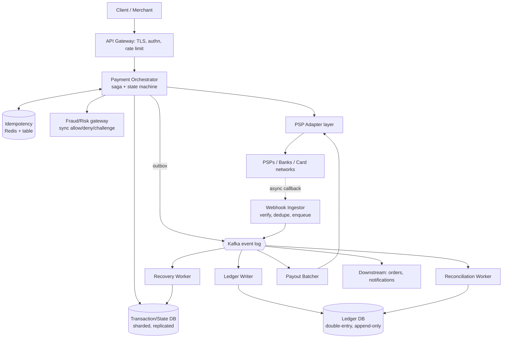
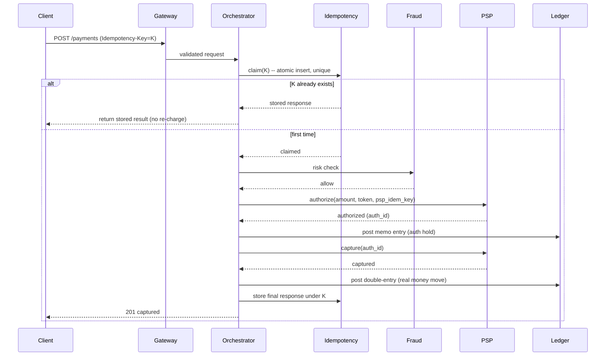
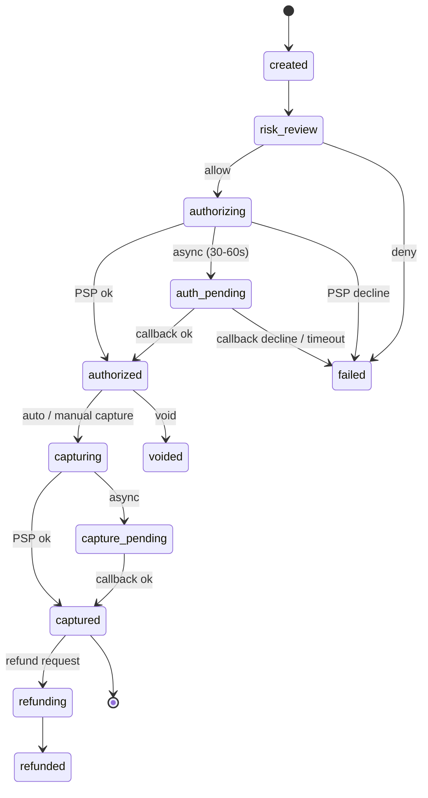

# Design a Payment System — High-Level Design

> Staff/principal-level HLD reference and practice artifact. Reader profile: a senior backend engineer (Java/JVM, distributed systems) practising for a senior/staff system-design round.

---

## 1. Problem & Clarifying Questions

### 1.1 Restating the problem

We are designing a **payment system** — the backend platform that moves money between a payer (a customer) and a payee (a merchant or the platform itself), through external money-movement rails (card networks, banks, wallets) brokered by **PSPs** (Payment Service Providers — companies like Stripe, Adyen, Razorpay, or a direct acquiring bank that connect us to card networks like Visa/Mastercard).

The system must:
- Accept a payment request, **authorize** it (reserve funds), **capture** it (move the funds), and **settle** it (reconcile what actually landed in the bank account).
- Never **lose** a charge (we said money moved but it didn't) and never **duplicate** a charge (we moved money twice for one intent). This is the single hardest correctness property — money is not idempotent by nature, so we must *make* it idempotent.
- Maintain an **immutable, auditable ledger** that is the source of truth for every cent, and reconcile it against external PSP/bank statements.
- Tolerate the fact that external rails are **slow and asynchronous** — a card authorization can take 30–60 seconds, callbacks can be delayed, dropped, or duplicated, and the network can fail between "we sent the charge" and "we learned the result."

This is fundamentally a **distributed-systems consistency problem wrapped around legally-binding money movement**, where the authoritative state lives in systems we do not control (banks). The interesting engineering is almost entirely in failure handling, not the happy path.

### 1.2 Clarifying questions I would ask the interviewer first

A senior answer never jumps to boxes-and-arrows. Here is what I'd ask, grouped, with *why each matters* (the design forks on the answer).

**Functional scope**
1. **What payment methods?** Cards only, or also wallets (Apple/Google Pay, PayPal), bank transfers/ACH (Automated Clearing House — slow batch bank-to-bank transfers in the US), UPI (India's instant rail), BNPL (Buy-Now-Pay-Later)? *Each rail has a different latency, finality, and reversal model.*
2. **Are we the PSP, or do we sit in front of PSPs?** I.e., do we connect directly to card networks and hold an acquiring license, or do we orchestrate third-party PSPs? *This decides whether we're in deep PCI scope and whether we own settlement.*
3. **Auth-and-capture, or auth-then-later-capture?** E-commerce often authorizes at checkout and captures at ship time (up to 7 days later). Ride-hailing/hotels authorize an estimate then capture a different amount. *This decides whether we model auth and capture as separate first-class state transitions.*
4. **Refunds, partial refunds, chargebacks, disputes?** *These are reverse money flows with their own state machines and ledger entries.*
5. **Payouts / disbursements** (paying merchants or sellers), or only **pay-ins** (collecting from customers)? *Marketplace platforms need both, with a float/escrow model.*
6. **Recurring/subscription billing, saved cards, tokenization?** *Storing card credentials pulls us into the deepest PCI tier.*
7. **Multi-currency / FX?** *Adds a currency dimension to every ledger entry and a rate-locking problem.*

**Non-functional**
8. **Latency budget** for the synchronous portion of checkout? (User is waiting.) Authorization itself is bounded by the PSP, but our orchestration overhead should be small.
9. **Availability target** — 99.95%? 99.99%? Payments are revenue-critical; downtime is lost sales and reputational.
10. **Consistency expectation** — I'll assert this rather than ask: the ledger must be **strongly consistent**; there is no acceptable "eventually we'll figure out if we charged you."
11. **Durability** — ledger and transaction records: effectively zero tolerance for loss; we need durable, replicated, point-in-time-recoverable storage.
12. **Compliance** — PCI-DSS (card data), SOX (financial reporting), regional rules (PSD2/SCA in EU, RBI in India). *Compliance dictates network segmentation and data handling.*

**Scale**
13. **Throughput** — peak transactions per second (TPS)? Black Friday / festival-sale spikes? *Drives sharding and PSP rate-limit handling.*
14. **Geographic distribution** — single region, multi-region, global? *Drives data residency and active-active design.*

**Out of scope (confirm)**
15. Fraud *scoring/ML models* themselves (we integrate with a fraud service but don't build the model); the *PSP's* internal processing; *issuing* (we're acquiring/processing, not issuing cards); the *checkout UI*; *KYC/onboarding* of merchants.

### 1.3 Assumptions I'll proceed with

Given a top-tier e-commerce/marketplace context, I'll assume:
- We are a **payment orchestration + ledger platform that sits in front of multiple PSPs** (not a card network ourselves). We tokenize cards via PSP-hosted fields so we minimize PCI scope.
- Methods: **cards (primary), wallets, UPI/bank rails (secondary)**. Saved cards via tokenization.
- **Auth then capture** are distinct steps; capture may be immediate or deferred (ship-time).
- We support **pay-ins, refunds, payouts, chargebacks**.
- Multi-currency, with FX handled at the boundary.
- Targets: **p99 orchestration overhead < 200 ms** (excluding PSP round-trip), **99.99% availability**, **strongly consistent ledger**, **no lost/duplicate money movement**.
- **Peak 5,000 TPS** of payment attempts, with festival spikes to ~10,000 TPS.

---

## 2. Requirements (Finalized)

### 2.1 Functional

- **F1 — Create payment intent:** client creates a payment for an order with amount, currency, method, and a client-supplied **idempotency key**.
- **F2 — Authorize:** reserve funds on the payer's instrument via a PSP; result may be sync or async (the 30–60s problem).
- **F3 — Capture:** move the authorized funds; supports full, partial, and deferred capture.
- **F4 — Void/cancel:** release an authorization that won't be captured.
- **F5 — Refund:** return captured funds, full or partial.
- **F6 — Chargeback/dispute handling:** ingest issuer-initiated reversals, post them to the ledger, drive an evidence/representment workflow.
- **F7 — Payouts/settlement to merchants:** disburse collected funds minus fees.
- **F8 — Ledger:** every money movement produces immutable double-entry records; full audit trail.
- **F9 — Reconciliation:** match internal ledger against PSP/bank settlement files daily; surface mismatches.
- **F10 — Webhooks/callbacks:** ingest async PSP notifications idempotently; emit our own events to downstream (orders, notifications).
- **F11 — Fraud check boundary:** synchronously consult a fraud/risk service before authorizing.
- **F12 — Stuck-transaction recovery:** detect and resolve transactions left in-flight by failures (the recovery worker).

### 2.2 Non-functional

| Property | Target | Rationale |
|---|---|---|
| Latency (our overhead) | p99 < 200 ms excluding PSP/fraud RTT | User waits at checkout; we don't add bloat |
| Availability | 99.99% (≈52 min/yr) | Revenue-critical; degraded modes over hard down |
| Ledger consistency | **Strong / linearizable** on a single account's balance | No lost or duplicate charges |
| Durability | RPO ≈ 0 for ledger; replicated, PITR | Money records can never be lost |
| Idempotency | Exactly-once *effect* per intent | Retries are guaranteed; double-charge is unacceptable |
| Auditability | Immutable, append-only, signed | SOX/PCI, dispute defense, debugging |
| Security/compliance | PCI-DSS, encryption at rest/in transit, least PCI scope | Legal requirement |

### 2.3 Explicit assumptions
- PSPs expose idempotency keys (most do). Where one doesn't, we dedupe via our own request-fingerprint table.
- A single payment intent maps to **one** instrument/PSP attempt at a time, though we may retry across PSPs ("PSP failover") — each attempt is its own idempotent operation.
- The "user waiting" window only spans authorization. Capture/settlement/payout are asynchronous.
- We control the orchestration and ledger; PSP is a black box reachable over HTTPS.

---

## 3. Capacity Estimation

### 3.1 Traffic

- Peak payment attempts: **5,000 TPS** (spikes 10,000 TPS).
- Each payment attempt fans out into several internal writes and external calls. Per attempt:
  - 1 fraud check (sync external)
  - 1 authorize (sync/async external)
  - ~1 capture (could be deferred; assume ~0.9× attempts eventually capture)
  - ledger postings: auth (memo), capture (real), fees — say **3–6 ledger rows** per successful payment
  - state-machine transitions, each persisted: **~5–8 writes**
  - 1+ webhook ingest per attempt (PSP callback)

- **Internal write QPS** at peak ≈ 5,000 attempts × ~8 writes = **~40,000 writes/sec** to the transaction/state store.
- **Ledger write QPS** ≈ 5,000 × ~5 rows × ~0.9 success = **~22,500 ledger rows/sec**.
- **Read QPS:** status polling (clients/ops dashboards), idempotency-key lookups, reconciliation reads. Idempotency lookups happen on **every** attempt and retry; assume 1.5× attempts ≈ **7,500 idempotency reads/sec**, plus status polling ~3× = **15,000 reads/sec**. Total reads ~**25,000 QPS**, read:write ≈ 1:1.6 (write-heavy, which is unusual and important — this is *not* a read-heavy social feed; it's a write-and-correctness system).

### 3.2 Storage

Per payment, aggregate record sizes:
- Payment/transaction row + state history: ~2 KB
- Ledger entries: 5 rows × ~300 B = ~1.5 KB
- Webhook/event log: ~1 KB
- ⇒ **~4.5 KB per payment**, round to **5 KB**.

Volume:
- 5,000 TPS sustained is unrealistic 24/7; assume average **~500 TPS** sustained → 500 × 86,400 ≈ **43.2M payments/day**.
- Per day: 43.2M × 5 KB ≈ **~216 GB/day** of primary records.
- Per year: ~**79 TB/year** of online transactional data.
- **Ledger** (immutable, must retain 7–10 yrs for compliance): ledger alone ≈ 43.2M × 1.5 KB ≈ **65 GB/day → ~24 TB/yr**, retained 7 yrs ≈ **~165 TB** (cold/archival tiers acceptable for old data, but immutable).

### 3.3 Bandwidth
- External: each attempt ~ a few KB request/response × ~3 external calls (fraud, auth, capture) ≈ ~10 KB. At 5,000 TPS peak ≈ **~50 MB/s** egress to PSPs/fraud. Trivial.
- Internal: dominated by DB replication of ~40k writes/sec; at ~1 KB/write WAL ≈ **~40 MB/s** of replication traffic. Manageable.

### 3.4 Memory / cache
- Idempotency keys are hot. Keep recent keys (last ~24h) in a fast store. 43.2M/day × key(~64 B) + small metadata(~256 B) ≈ 43.2M × ~320 B ≈ **~14 GB/day** of idempotency state; keep ~24–48h hot ≈ **~30 GB** in Redis (sharded). Cheap.
- PSP routing config, fee schedules, currency rates: tiny, cache fully in-process.

### 3.5 Server / shard counts
- **Transaction/state DB:** 40k writes/sec is beyond a single Postgres primary (~tens of k writes/sec with tuning, but headroom matters). **Shard by payment_id / merchant_id.** Budget ~8–16 shards (each ~2.5–5k writes/sec) for headroom + spike absorption + failover capacity. Each shard a primary + 2 replicas (sync to 1, async to 1) → ~24–48 DB nodes.
- **Ledger DB:** 22.5k rows/sec, append-only, partitioned by account + time. Similar sharding, ~8 shards, append-optimized. Append-only is friendlier than random updates, so fewer nodes needed; ~16–24 nodes with replicas.
- **App/orchestration tier:** stateless. If each node handles ~1,000 attempts/sec comfortably, peak 10k TPS ⇒ ~10 nodes + N+2 redundancy + headroom ⇒ ~16–20 nodes per region.
- **Workers** (recovery, reconciliation, webhook processing, payout batch): ~10–20 nodes.
- **Redis (idempotency/cache):** sharded cluster, ~6 shards (primary+replica) for 30 GB + throughput.
- **Kafka** (event backbone): a modest cluster, ~6–9 brokers, partitioned by payment_id for ordering.

> Sanity check: this is a **write-heavy, correctness-critical, moderate-throughput** system. The cost is not raw scale — 5k TPS is not Twitter-firehose — the cost is **redundancy, durability, and the machinery to guarantee exactly-once money movement**.

---

## 4. API Design

All money-mutating endpoints **require** an `Idempotency-Key` header (client-generated UUID, unique per logical operation). All are authenticated (mTLS service-to-service, or signed merchant API keys + OAuth for partners).

### 4.1 Core endpoints

```
POST /v1/payments
  Headers: Idempotency-Key: <uuid>, Authorization: <merchant key/OAuth>
  Body:
  {
    "amount": 49900,                 // minor units (cents/paise) — integers only, never floats
    "currency": "INR",
    "order_id": "ord_8f...",         // merchant's order reference
    "method": { "type": "card", "token": "tok_..." },  // tokenized, never raw PAN
    "capture": "automatic" | "manual",
    "customer_id": "cus_...",
    "metadata": { ... }
  }
  Response 201:
  {
    "payment_id": "pay_...",
    "status": "requires_action" | "processing" | "authorized" | "captured" | "failed",
    "amount": 49900, "currency": "INR",
    "next_action": { "type": "redirect"|"otp"|null, "url": "..." },  // for 3DS/SCA
    "created_at": "..."
  }
```

```
POST /v1/payments/{payment_id}/capture        // for manual/deferred capture
  Headers: Idempotency-Key
  Body: { "amount": 49900 }                    // <= authorized amount; supports partial
  Response 200: { "payment_id", "status": "captured", "captured_amount": ... }

POST /v1/payments/{payment_id}/void           // release uncaptured auth
  Headers: Idempotency-Key

POST /v1/payments/{payment_id}/refund
  Headers: Idempotency-Key
  Body: { "amount": 20000, "reason": "..." }    // <= captured; full/partial
  Response 201: { "refund_id", "status": "pending"|"succeeded" }

GET  /v1/payments/{payment_id}                 // status; safe to poll
GET  /v1/payments/{payment_id}/timeline        // state-machine + ledger view (ops)

POST /v1/payouts                               // disburse to a merchant/seller
  Headers: Idempotency-Key
  Body: { "destination": "acct_...", "amount": ..., "currency": ... }

POST /v1/webhooks/psp/{psp_name}               // INBOUND from PSP (signed)
  // verify signature, dedupe by event_id, enqueue, ack fast
```

### 4.2 Idempotent semantics of `POST /v1/payments`

- First call with key `K`: create payment, persist `(K → payment_id, request_fingerprint, response)` atomically; process.
- Repeat with same `K` **and same fingerprint**: return the **stored response** (same status), do **not** re-charge.
- Repeat with same `K` but **different body**: return `409 Conflict` — the key is being reused for a different operation (a client bug; better to fail loudly than silently double-charge or silently ignore).
- Concurrent duplicate (race): the unique constraint on `K` lets exactly one writer win; the loser returns the winner's result (poll/wait briefly).

### 4.3 Status model returned to clients

`requires_action` (3DS/OTP needed) → `processing` (async auth in flight) → `authorized` → `captured` → terminal. Failure terminals: `failed`, `canceled`. Refund/chargeback are separate sub-resources so the original payment record stays clean.

---

## 5. High-Level Architecture

### 5.1 Components

- **API Gateway / Edge:** TLS termination, authn, rate limiting, request validation, routing. Strips/never logs sensitive fields.
- **Payment Orchestrator (the brain):** stateless service that runs the **payment saga** — the ordered, compensatable sequence of steps (fraud → authorize → capture). Owns the per-payment **state machine**.
- **Idempotency service / store:** Redis + a durable backing table; gatekeeps every money-mutating request.
- **PSP Adapter layer:** per-PSP connectors normalizing each PSP's API into a common interface; handles auth, retries, signature verification, and the async-callback contract.
- **Fraud/Risk gateway:** synchronous call-out to the risk service; returns allow/deny/challenge.
- **Ledger service:** double-entry, append-only; the financial source of truth. Strongly consistent per account.
- **Transaction/State store:** sharded OLTP DB holding payment records + state history.
- **Event backbone (Kafka):** durable, partitioned event log connecting orchestrator, ledger, webhook processor, reconciliation, downstream consumers. Enables the **outbox pattern** (see deep dive).
- **Webhook ingestor:** receives PSP callbacks, verifies, dedupes, enqueues.
- **Workers:** recovery (stuck txns), reconciliation (vs PSP files), payout batcher, dispute workflow.
- **Caches/config:** PSP routing rules, fee schedules, FX rates.

### 5.2 ASCII block diagram

```
                          ┌───────────────────────────────────┐
   Client / Merchant ───► │           API Gateway / Edge        │
   (checkout, server)     │  TLS · authn · rate limit · valid.  │
                          └──────────────────┬──────────────────┘
                                             │
                              ┌──────────────▼───────────────┐
                              │     Payment Orchestrator      │  (stateless, saga engine,
                              │   state machine + saga steps  │   N replicas behind LB)
                              └───┬────────┬────────┬────────┬┘
                  idempotency     │        │        │        │   emits events (outbox)
            ┌───────────────┐ ◄───┘        │        │        └────────────► ┌──────────┐
            │ Idempotency   │              │        │                       │  Kafka   │
            │ Redis + table │              │        │                       │ (events) │
            └───────────────┘              │        │                       └────┬─────┘
                                           ▼        ▼                             │
                              ┌────────────────┐  ┌───────────────┐    ┌──────────▼─────────┐
                              │  Fraud/Risk     │  │  PSP Adapters │    │  Consumers/Workers │
                              │  gateway (sync) │  │  (per PSP)    │    │  · webhook proc    │
                              └────────────────┘  └───────┬───────┘    │  · ledger writer   │
                                                          │            │  · recovery        │
                                                  ┌───────▼────────┐   │  · reconciliation  │
                                                  │ PSPs / Banks / │   │  · payout batch    │
                                                  │ Card networks  │   └─────────┬──────────┘
                                                  └───────┬────────┘             │
                                                          │ async callbacks      ▼
                                              ┌───────────▼──────────┐   ┌────────────────┐
                                              │   Webhook Ingestor    │   │ Ledger DB      │
                                              │ verify · dedupe · enq │   │ double-entry,  │
                                              └───────────┬──────────┘   │ append-only    │
                                                          └─────────────►│ (sharded)      │
                                                                         └────────────────┘
   ┌──────────────────┐
   │ Transaction/State│  ◄── orchestrator persists payment + state history (sharded OLTP, replicated)
   │ store (sharded)  │
   └──────────────────┘
```

### 5.3 Mermaid diagram



### 5.4 Key flow — authorize then capture (happy path) sequence



The async-callback variant (the 30–60s problem) and the saga-with-compensation variant are detailed in the deep dives.

---

## 6. Data Model & Storage Choices

### 6.1 Entities

**Payment (transaction/state store):**
```
payment {
  payment_id        PK
  merchant_id, customer_id
  amount_minor, currency
  method_type, instrument_token
  status            -- state machine enum
  capture_mode      -- automatic | manual
  authorized_amount, captured_amount, refunded_amount
  psp_name, psp_auth_id, psp_capture_id
  idempotency_key   -- unique
  created_at, updated_at, version  -- version for optimistic locking
}
payment_state_event {        -- append-only history of transitions
  id PK, payment_id FK, from_state, to_state, reason, actor, at
}
idempotency_record {
  key PK, request_fingerprint, payment_id, response_blob, status, created_at, expires_at
}
psp_event {                  -- raw inbound webhooks, deduped
  event_id PK (from PSP), psp_name, payload, received_at, processed
}
outbox {                     -- events to publish atomically with txn write
  id PK, aggregate_id, type, payload, published bool, created_at
}
```

**Ledger (immutable double-entry):**
```
ledger_account {
  account_id PK, owner_type (merchant|platform|psp_clearing|customer),
  owner_id, currency, account_kind (asset|liability|revenue|...)
}
ledger_transaction {         -- a balanced group of postings
  txn_id PK, idempotency_key UNIQUE, type, ref_payment_id, created_at
}
ledger_entry {               -- the immutable postings; SUM(debits)=SUM(credits)
  entry_id PK, txn_id FK, account_id FK, direction (DR|CR),
  amount_minor, currency, created_at
}
```
Double-entry means **every** money movement is recorded as equal-and-opposite debits and credits across accounts, so the books always balance — `Σ debits = Σ credits` for each `ledger_transaction`. A balance is `Σ credits − Σ debits` over an account's entries. Entries are **append-only**: corrections are made by posting *reversing* entries, never by mutating or deleting — this preserves the audit trail (critical for SOX and dispute defense).

### 6.2 Datastore choices (justified against access patterns)

| Data | Access pattern | Choice | Why / failure mode avoided |
|---|---|---|---|
| Payment + state | High write, point reads by id, sharded by payment/merchant, needs ACID transactions for state transitions | **Sharded relational (Postgres/Spanner/CockroachDB)** | Need ACID + unique constraints (idempotency); avoids lost-update races on state. Spanner/CRDB if multi-region strong consistency is required. |
| Idempotency keys | Very high read/write, TTL'd, low latency | **Redis (hot) + durable table (truth)** | Redis for speed; durable table so a Redis flush can't cause a double-charge. Avoids "cache loss → re-charge." |
| Ledger | Append-only writes, range reads by account, strong consistency on balances, immutable, long retention | **Relational, append-only, partitioned by account+time; or a purpose-built ledger DB (e.g., TigerBeetle-style)** | Balance correctness needs serializable balance updates; append-only fits SOX immutability. Avoids "balance read sees half a transaction." |
| Events | Ordered, durable, replayable, high throughput | **Kafka** (partition by payment_id) | Ordering per payment + replay for recovery/reconciliation. Avoids lost callbacks and enables outbox. |
| Raw webhooks / events store | Write-once, dedupe by event_id, occasional read | Same OLTP or an append store | Dedupe inbound PSP events; avoids double-processing a re-sent callback. |
| Analytics / recon staging | Bulk scans, joins over a day's data | **Columnar warehouse / object storage** (S3 + Spark/Athena) | Heavy scans don't belong on the OLTP/ledger primaries. |

> Why **not** a single NoSQL key-value store for everything? Because the core invariants — uniqueness of idempotency key, balanced double-entry, atomic state transition with outbox — all want **transactions and constraints**. We'd be reimplementing ACID badly. NoSQL is fine for the *raw event* and *cache* layers, not for money truth.

---

## 7. Deep Dives (the bulk)

This is where a staff answer earns its keep. Five sub-problems: **(7.1)** idempotency & exactly-once money movement; **(7.2)** the saga + auth/capture/settle state machine with compensation; **(7.3)** the async PSP callback / 30–60s problem; **(7.4)** the immutable double-entry ledger + reconciliation; **(7.5)** stuck-transaction recovery & consistency.

---

### 7.1 Idempotency & exactly-once money movement

**The problem.** Networks fail. A client sends `POST /payments`, the request reaches us, we charge the PSP, then the response is lost on the way back. The client times out and **retries**. Without protection, we charge twice. Conversely, if we don't process because we *assume* it was a duplicate, we lose the charge. Money movement is the canonical case where **exactly-once effect** matters, and true exactly-once *delivery* is impossible in a distributed system — so we engineer exactly-once **effect** via idempotency + dedup at every hop.

**Three boundaries to make idempotent:**

1. **Client → us.** Client sends an `Idempotency-Key`. We atomically `INSERT` a row keyed by it before doing any work. The DB unique constraint is the synchronization primitive: exactly one request wins the insert; duplicates and concurrent racers read the winner's stored response. We store a **request fingerprint** (hash of the canonical body) so a key reused with a *different* body fails closed (409) rather than returning the wrong stored result.

2. **Us → PSP.** Every PSP call carries a **deterministic idempotency key derived from our payment attempt** (e.g., `pay_<id>:auth:attempt_1`). If we retry the PSP call after a timeout, the PSP recognizes the key and returns the original result instead of charging again. For PSPs lacking idempotency support, we maintain a local "PSP request" record and, on retry, first **query** the PSP for the prior result (e.g., by our reference) before re-sending.

3. **PSP → us (callbacks).** Inbound webhooks carry a PSP `event_id`. We dedupe on `event_id` (unique insert into `psp_event`); a re-sent callback is acknowledged but processed only once.

**Options for the client-side idempotency store:**

| Option | Mechanism | Pros | Cons / failure mode |
|---|---|---|---|
| Redis only | `SETNX key` with TTL | Fast, simple | A Redis flush/eviction loses the key → retry double-charges. **Unacceptable as sole truth.** |
| Durable DB unique constraint | `INSERT ... ON CONFLICT` | Strong, survives crashes | DB write on hot path; mitigated by sharding |
| Redis fast-path + DB truth | Check Redis; on miss, DB insert; backfill Redis | Fast + safe | Slightly more code; correct |

**Decision:** **Redis fast-path + DB durable truth.** Redis short-circuits the common "already processed" check cheaply; the **durable unique constraint is the real guarantee** so an infra blip can never cause a double charge. The failure mode this avoids is the catastrophic "cache flushed → all in-flight retries become duplicate charges."

**Subtlety — the "claim then process" window.** Between claiming the key and finishing, we might crash. So the idempotency record has a **status** (`in_progress`, `completed`). A retry that finds `in_progress` must not assume success — it either **waits** (short poll) for completion or, if the original is stale (past a timeout), the **recovery worker** reconciles the actual PSP state (did the charge happen?) before deciding. We never guess. This couples idempotency to the recovery deep dive (7.5).

**Money as integers.** All amounts are **minor units as integers** (cents/paise). Never floats — `0.1 + 0.2 != 0.3` in IEEE-754, and silent rounding loses or invents money. This is a small decision with a large failure mode (penny drift across millions of transactions, books that don't balance).

---

### 7.2 The saga + auth/capture/settle state machine with compensation

**The problem.** A payment is a **multi-step distributed transaction** spanning systems we don't control. We can't hold a database lock across "call fraud, call PSP authorize, post to ledger, call PSP capture" — those take seconds and cross trust/network boundaries. A classic 2-phase-commit (a blocking protocol where a coordinator gets all participants to "prepare" then "commit") is infeasible: PSPs won't enlist in our transaction, and a coordinator crash blocks everyone. So we use the **Saga pattern**: a sequence of local transactions, each with a **compensating action** that semantically undoes it if a later step fails.

**The steps and their compensations:**

| Forward step | Compensation if a later step fails |
|---|---|
| Reserve idempotency / create payment (state: `created`) | Mark `failed` |
| Fraud check (allow) | none (read-only) |
| Authorize at PSP (state: `authorized`) | **Void** the authorization |
| Post auth memo to ledger | Post reversing memo |
| Capture at PSP (state: `captured`) | **Refund** the capture |
| Post capture to ledger | Post reversing entry |

**Orchestration vs choreography:**

| Approach | How | Pros | Cons / failure mode |
|---|---|---|---|
| **Choreography** | Each service reacts to events, emits next event | Loosely coupled, no central brain | Logic smeared across services; hard to see "where is this payment?"; compensation ordering implicit and error-prone |
| **Orchestration** | A central orchestrator drives steps & compensations | Explicit state machine, one place to reason about money, easy to audit/recover | Orchestrator is critical (make it stateless + persistent state machine + HA) |

**Decision: orchestration.** For money, **explicitness and auditability beat decoupling**. A staff engineer wants one diagram that says exactly what state a payment is in and what happens next. The failure mode choreography invites — *partial compensation in the wrong order, or an orphaned authorization nobody voids* — is exactly what we cannot afford. The orchestrator is stateless; the **authoritative state lives in the DB state machine** (`payment.status` + `payment_state_event` history), so any orchestrator instance can pick up any payment after a crash.

**The state machine (persisted, with optimistic concurrency):**



Every transition: read row with `version`, validate the transition is legal, write new state + append `payment_state_event`, bump `version` — `UPDATE ... WHERE version = $v`. If zero rows updated, someone else moved it; reload and re-decide. This **optimistic concurrency** prevents two orchestrator instances (or an orchestrator and a callback) from both advancing the same payment and, say, capturing twice. The failure mode avoided: **lost updates / double state transitions** under concurrency.

**Compensation correctness.** Compensations are themselves **idempotent and retried** (a void or refund can fail too). They run as saga steps with their own idempotency keys. We never "rollback" a captured payment by deleting records — we **refund forward** and the ledger records both the capture and the reversal. This is "semantic compensation," the only kind possible when the side effect already left our system.

---

### 7.3 The async PSP callback / the 30–60s problem

**The problem.** Card authorization is often **not synchronous**. The PSP returns `202 processing` and promises a **webhook callback** seconds to minutes later (3DS/SCA challenges, issuer latency, batch rails like ACH take *days*). Meanwhile the user is at checkout. And callbacks can be **late, lost, duplicated, or out-of-order**. We must give the user a timely answer *and* converge to the truth even if the callback never arrives.

**Design:**

1. **Decouple the user response from finality.** When the PSP says `processing`, we move the payment to `auth_pending` and return `status: processing` (or `requires_action` for 3DS) to the client with a poll URL / push channel. The user UI shows "confirming payment…". We do **not** block a thread for 60s.

2. **Two convergence paths, whichever fires first:**
   - **Push:** PSP sends a webhook → ingestor verifies signature → dedupes by `event_id` → enqueues to Kafka → orchestrator consumes and advances the state machine.
   - **Pull (safety net):** a **poller** queries the PSP for the status of any payment stuck in `*_pending` beyond a threshold (e.g., 10s, then backoff). This guards against **lost webhooks** — never trust the callback as the *only* path.

   Both paths funnel through the **same idempotent state transition**, so if both the webhook and the poll resolve the same payment, optimistic concurrency makes exactly one win and the other becomes a harmless no-op.

3. **Webhook ingestion contract.** Verify the PSP signature (HMAC/asymmetric) to reject spoofed callbacks — a forged "payment succeeded" must never move money. Persist the raw event, dedupe by `event_id`, **ack the PSP fast (200) before heavy processing** so the PSP doesn't retry-storm us; do the real work async off Kafka. If we can't process yet, we still have the durable event to replay.

4. **Out-of-order handling.** A `captured` callback might arrive before the `authorized` one (or a stale duplicate after). The state machine only accepts **legal** transitions for the current state + version; illegal/stale events are logged and dropped (or buffered keyed by payment, then re-evaluated). We rely on the state machine, not on callback arrival order.

5. **Slow rails (ACH/UPI mandates).** For rails where finality is hours/days, the payment legitimately lives in `pending` for a long time; the user flow returns "payment initiated," and downstream (order fulfillment) waits on the eventual `captured` event. We surface clear pending semantics rather than faking success.

| Convergence strategy | Pros | Cons | Decision |
|---|---|---|---|
| Webhook only | Simple, low load | Lost webhook ⇒ payment stuck forever | ✗ |
| Polling only | Robust to lost callbacks | High PSP load, slower, rate limits | ✗ |
| **Webhook + polling safety net + recovery worker** | Fast when callbacks arrive, correct when they don't | More moving parts | ✓ |

**Decision:** webhook-primary with a polling/recovery safety net, all funneling through one idempotent transition. Failure mode avoided: **a payment silently stuck in `pending` because a single webhook was dropped** — the most common real-world payment incident.

---

### 7.4 The immutable double-entry ledger & reconciliation

**The problem.** We need an unimpeachable record of every cent: who was debited, who was credited, when, why — that always balances, is never mutated, and can be reconciled against what banks actually report. Bugs elsewhere are recoverable; **a ledger that disagrees with the bank or with itself is a financial and legal incident.**

**Double-entry mechanics.** Each money movement is a `ledger_transaction` containing ≥2 `ledger_entry` rows that **sum to zero** (Σ debits = Σ credits). Example — capturing ₹499 with a ₹15 fee:

```
ledger_transaction txn_abc (type=capture, ref=pay_123)
  DR  customer_clearing        499.00
  CR  merchant_payable         484.00
  CR  platform_revenue (fee)    15.00
  -> debits 499 == credits 484+15 = 499  ✓ balanced
```

A balance is a **derived aggregate** (`Σ CR − Σ DR` over an account). For hot accounts we maintain a **materialized balance** updated within the same serializable transaction as the entries (so the balance is never seen mid-transaction), and we can always **recompute from entries** to verify — the entries are the truth, the balance is a cache.

**Immutability & corrections.** Entries are **append-only**. A mistake is fixed by a **reversing transaction**, never by `UPDATE`/`DELETE`. This gives a perfect audit trail and lets us prove, at any historical point, what the books said. We can additionally **hash-chain** transactions (`hash_n = H(hash_{n-1} ∥ entry_data)`) so tampering is detectable — useful for compliance and forensic trust.

**Consistency requirement.** Writing the entries of one transaction must be **atomic and serializable** w.r.t. that account's balance: no transaction may observe a half-posted set. Options:

| Ledger store option | Consistency | Throughput | Notes |
|---|---|---|---|
| Single Postgres primary, serializable | Strong, simple | ~tens of k/s | Single-writer ceiling; shard to scale |
| Sharded relational by account | Strong per account | High | Cross-account txns need care (most are 2–3 accounts; co-locate or 2-phase within our own DB) |
| Purpose-built ledger DB (TigerBeetle-style) | Strong, designed for double-entry | Very high | Excellent fit; operationally newer |
| Eventually-consistent NoSQL | Weak | Very high | **✗** — balances could be wrong; unacceptable |

**Decision:** **append-only relational ledger, sharded by account, serializable transactions, recomputable balances, hash-chained, with reversing-entry corrections.** Most transactions touch 2–3 accounts; we **co-locate the customer-clearing / merchant-payable / platform accounts that frequently transact** on the same shard where possible, and use a single ACID transaction. Cross-shard cases are rare and use our own internal 2-phase commit *within our DBs only* (we control both sides, unlike with PSPs). Failure mode avoided: **unbalanced or non-reproducible books** that fail an audit or hide lost/duplicated money.

**Reconciliation.** Daily, each PSP/bank provides a **settlement file** (the money that actually moved and fees charged). The reconciliation worker:
1. Ingests the file into a staging area (warehouse/object store).
2. **Matches** each settlement line to our ledger transactions (by PSP reference id).
3. Classifies exceptions: **in our ledger but not settled** (charge we think succeeded but bank didn't move — investigate, possibly reverse), **settled but not in ledger** (we missed a callback — backfill), **amount mismatch** (fees differ from expected — adjust), **timing differences** (in transit).
4. Emits a recon report; auto-resolves known categories (fee true-ups via reversing/adjusting entries), escalates the rest.

Reconciliation is the **independent check on every other component** — it's how we *discover* a lost or duplicated charge that all the inline guards somehow missed. A staff answer treats recon as a first-class subsystem, not an afterthought.

---

### 7.5 Stuck-transaction recovery & end-to-end consistency

**The problem.** Despite idempotency and sagas, the orchestrator can crash mid-saga, a webhook can be lost, a PSP can be unreachable during a compensation. Some payments will be left **in-flight** (`authorizing`, `auth_pending`, `capturing`, or "claimed idempotency key, no result"). We must **detect and resolve** every one of these — the alternative is money in limbo and angry customers.

**Mechanisms:**

1. **Persistent state + outbox (no in-memory truth).** Every saga step is committed to the DB *with* an outbox row in the **same local transaction** (the **transactional outbox pattern** — write the business change and the "to-publish event" atomically, then a relay publishes the event to Kafka). This guarantees we never "do the work but lose the event," and a relay restart just re-publishes (consumers dedupe). Failure mode avoided: **dual-write inconsistency** (DB updated but event lost, or vice versa).

2. **Recovery worker (the sweeper).** Periodically scans for payments stuck in non-terminal states past an SLA (e.g., `auth_pending > 2 min`). For each, it **queries the PSP for the authoritative status** (the bank/PSP is the source of truth for whether money moved) and drives the state machine to convergence:
   - PSP says authorized but we're stuck → advance to `authorized`/`captured`.
   - PSP says declined → mark `failed`, compensate ledger memo.
   - PSP has no record (our call never landed) → safe to **retry** the original idempotent call.
   - PSP says captured but we have no capture record → backfill ledger and state.

3. **Orphaned-authorization sweeper.** Authorizations that were never captured or voided (e.g., merchant abandoned manual capture) expire; we **void** them before the issuer's auth-hold lapses, freeing the customer's funds. Failure mode avoided: customer's money held hostage by a forgotten auth.

4. **Timeouts & retries with backoff.** Every external call has a deadline. On timeout we **do not assume failure** — we mark the step uncertain and let recovery query the truth. Retries use exponential backoff + jitter and a **circuit breaker** per PSP (stop hammering a downed PSP; fail fast or route to a backup PSP). Failure mode avoided: **retry storms** that turn a PSP blip into an outage, and **assuming-failure-then-retrying** which double-charges.

5. **Dead-letter & manual ops.** Events that can't be processed after N attempts go to a DLQ with full context; an ops console lets a human resolve true edge cases (with every manual action also posting auditable ledger/state events — never a raw DB edit).

**Consistency model, stated plainly:**
- **Within a single payment / single account balance:** strong / linearizable (state machine + serializable ledger).
- **Across the whole system:** the saga gives us **eventual consistency with guaranteed convergence** — at any instant a payment may be mid-flight, but it is *guaranteed to reach a correct terminal state* via webhook, poll, or recovery, and the ledger will balance. We trade momentary "processing" visibility for never losing/duplicating money.

This is the senior insight: **you cannot have synchronous strong consistency end-to-end across systems you don't own; you engineer convergent eventual consistency with strong invariants at the points that matter (idempotency key, account balance) and a recovery loop that makes the bank the tiebreaker.**

---

## 8. Scaling & Bottlenecks

**How it scales.**
- **Orchestrator** is stateless → scale horizontally behind a load balancer; autoscale on TPS. State lives in the DB.
- **Transaction/state DB**: shard by `payment_id` (or `merchant_id` for merchant-scoped queries). Reads off replicas; writes to shard primary.
- **Ledger**: shard by `account_id`; append-only writes parallelize well; balances materialized per account.
- **Idempotency/Redis**: sharded cluster, TTL'd.
- **Kafka**: partition by `payment_id` → per-payment ordering, parallel consumers.

**Where it breaks first, and the fix:**

| Bottleneck | Symptom | Fix |
|---|---|---|
| Single ledger primary write ceiling | Ledger write latency climbs | Shard by account; co-locate frequently-transacting accounts; consider purpose-built ledger DB |
| Hot account (platform fee account every txn touches it) | Lock contention on one balance row | **Aggregate/batch** postings to hot accounts (sum fees per window into periodic entries), or shard the hot account into sub-accounts and roll up |
| Idempotency DB hot rows on retries | Contention on a key under retry storm | Redis fast-path absorbs reads; key is single-writer by design (that's the point) |
| PSP rate limits during festival spike | PSP throttles us | Per-PSP token-bucket throttling, queue + smooth, multi-PSP routing/failover |
| Webhook ingestor burst | Callback storm after PSP recovery | Ack fast + enqueue; process async; the DB/Kafka absorb the burst |
| Reconciliation batch over a day's data | Long recon jobs | Run on warehouse/columnar store, not OLTP; parallelize by PSP/shard |
| Cross-region latency (if global) | Auth latency for distant region | Region-local orchestrators + DBs; route by merchant region; ledger per-region with global rollup |

**Multi-region:** active-active with **region-pinned payments** (a payment is owned by one region's shard) avoids cross-region write coordination on the hot path. The ledger can be regional with an asynchronous global consolidation for reporting. If true global strong consistency on accounts is required (rare), use Spanner/CockroachDB with the latency cost acknowledged.

---

## 9. Reliability, Consistency & Security

**Failure handling (recap of the guarantees).**
- Idempotency at all three boundaries → no duplicate charges under retries.
- Saga + compensation → partial failures unwind semantically; no orphaned auths.
- Outbox → no lost events / dual-write skew.
- Recovery worker + polling → no payment stuck forever; the PSP is the tiebreaker for "did money move."
- Circuit breakers + multi-PSP failover → a single PSP outage degrades, doesn't down us.

**Replication & durability.** Sync replication to ≥1 replica per shard for RPO≈0 on the ledger and transaction store; async replica for read scaling / DR. Point-in-time recovery (WAL archiving) for the ledger. Cross-region async DR with tested failover runbooks.

**Consistency model (stated).** Linearizable per-payment state transition and per-account balance; convergent eventual consistency across the saga. No read-your-own-write surprises for clients because they poll the authoritative payment record.

**Idempotency (recap).** Client key + fingerprint (fail closed on mismatch), deterministic PSP keys, webhook `event_id` dedupe, idempotent compensations.

**Security & PCI scope.**
- **Minimize PCI scope:** raw card data (PAN) should **never** touch our servers. Use **PSP-hosted fields / client-side tokenization** so the browser sends the PAN directly to the PSP, which returns a **token** we store. This keeps most of our infrastructure **out of PCI-DSS cardholder-data-environment (CDE) scope** (SAQ A territory) — the single biggest scope-reducing decision.
- If we must touch card data (e.g., we are the PSP), isolate the CDE: a **segmented network**, tokenization vault, HSM-backed encryption, strict access control, logging, and annual QSA audit. Everything else stays outside the CDE boundary.
- **Encryption:** TLS 1.2+ everywhere; data encrypted at rest; KMS/HSM for keys; tokens are useless if exfiltrated.
- **Authn/z:** merchant API keys + OAuth scopes; mTLS service-to-service; least privilege; no human has raw DB write on the ledger (only via audited service actions).
- **Webhook authenticity:** verify PSP signatures; reject unsigned/forged callbacks — a spoofed "success" must never move money.
- **Secrets:** in a vault, rotated; never in code/logs.
- **PII/log hygiene:** never log PAN/CVV/tokens-in-clear; redact at the edge.

**Abuse & rate limiting.**
- Per-merchant and per-IP/per-customer rate limits at the gateway (token bucket) — protect PSPs and ourselves.
- **Card-testing / enumeration defense:** velocity checks (many small auths from one source), integration with the **fraud gateway** which scores each attempt allow/deny/challenge *before* we authorize. The fraud boundary is **synchronous and in front of authorize** so we never spend money on an obviously fraudulent attempt; the fraud *model* itself is out of scope (we integrate, we don't build it).
- **3DS/SCA**: trigger step-up authentication (the `requires_action` state) for risky or regulation-mandated (EU PSD2) transactions, shifting liability and reducing fraud.

---

## 10. Extensions & Follow-ups

Realistic variations an interviewer adds, and how each changes the design:

1. **Recurring / subscription billing.** Need stored, reusable tokens (network tokenization), a scheduler that triggers off-session charges (no user present → handle declines/retries with **dunning** logic: retry on a schedule, notify, eventually cancel). Saved-card flows raise PCI considerations (use network tokens, not stored PANs).

2. **Marketplace / split payments.** One charge funds multiple sellers + platform fee. The ledger already models this (multi-leg double-entry). Adds **payout scheduling**, seller balances, holds/escrow, and **negative-balance** handling (refunds after payout). Introduces a **float** model and seller-payable accounts.

3. **Multi-currency & FX.** Each entry carries a currency; cross-currency payments need a **rate lock** at authorize time, an FX provider, and FX gain/loss ledger accounts. Reconciliation must match in settlement currency.

4. **Refund after payout / chargeback after settlement.** Money already left to the merchant. Need to claw back from seller balance or future payouts, or carry a negative balance. The ledger records the chargeback as a forward reversing transaction; a **dispute workflow** gathers evidence (representment) within issuer deadlines.

5. **New rails (UPI, ACH, BNPL, crypto).** Each is a new PSP adapter with its own finality/latency/reversal semantics. The state machine generalizes; the differences are in pending-duration and refund mechanics. Slow rails lean harder on the pending/recovery machinery.

6. **Higher scale / global.** Region sharding, per-region ledgers + global rollup, Spanner/CRDB if global strong consistency is mandated. PSP capacity planning and multi-acquirer routing for resilience and cost (route to cheapest/highest-success PSP per BIN/region — **intelligent routing**).

7. **Stronger fraud / 3DS everywhere.** More `requires_action` flows, liability shift, friction-vs-conversion tradeoffs.

8. **Exactly-once payouts at scale.** Payout batching with idempotency, bank file generation, and reconciliation of disbursements — symmetric to pay-in but outbound.

---

## 11. Interview Q&A

**Q1. How do you guarantee a customer is never double-charged?**
Idempotency at three boundaries: a client `Idempotency-Key` enforced by a **durable unique constraint** (Redis fast-path, DB truth) with a request-fingerprint check; **deterministic idempotency keys on every PSP call** so retries don't re-charge; and **`event_id` dedupe** on inbound webhooks. Crucially, on timeout we never *assume*: the recovery worker asks the PSP what actually happened before retrying. Exactly-once *delivery* is impossible, so we engineer exactly-once *effect*.

**Q2. Why a saga and not 2-phase commit?**
2PC needs all participants to enlist and blocks on coordinator failure — PSPs/banks won't enlist, and seconds-long blocking locks are infeasible. A saga is a sequence of local transactions with **compensating actions** (void, refund). We use **orchestration** (a central state machine) over choreography for auditability and to make compensation ordering explicit — the failure mode we avoid is orphaned authorizations from smeared, implicit choreography logic.

**Q3. A PSP webhook is lost. What happens?**
Nothing is lost permanently. The payment sits in `*_pending`; a **poller/recovery worker** queries the PSP after a threshold and drives the state machine to convergence through the *same idempotent transition* the webhook would have used. Webhook-primary, poll-as-safety-net — never trust the callback as the only path. This is the most common real incident, and the safety net is the senior signal.

**Q4. Walk me through the ledger. Why double-entry and immutable?**
Every movement posts balanced debits/credits (Σ=0) across accounts, so the books always balance and a balance is reproducible from entries. Append-only with **reversing entries** for corrections (never UPDATE/DELETE) preserves a perfect audit trail for SOX/disputes, and hash-chaining makes tampering detectable. Mutating ledger rows would destroy auditability and let bugs silently lose money.

**Q5. (Senior signal — tradeoff) Where do you accept eventual consistency and where do you insist on strong?**
**Strong/linearizable** at the two points that matter: the idempotency-key uniqueness and the per-account balance (serializable transactions, optimistic concurrency on state transitions). **Convergent eventual** across the saga, because you *cannot* hold a synchronous strong-consistency boundary across systems you don't own (banks). The recovery loop makes the bank the authoritative tiebreaker, guaranteeing convergence to a correct terminal state.

**Q6. (Senior signal — tradeoff) How do you minimize PCI scope, and what's the cost?**
Use **PSP-hosted fields / client-side tokenization** so the PAN goes browser→PSP directly and we only ever store a token — keeping most infrastructure out of the cardholder-data environment (SAQ A). The cost is a tighter coupling to PSP front-end SDKs and slightly less control over the input UX. If we were the PSP, we'd accept a segmented CDE, HSM/vault, and annual QSA audits. The failure mode avoided: the enormous blast radius and audit burden of holding raw card data.

**Q7. How do you handle a stuck transaction after an orchestrator crash mid-capture?**
State is persisted per step (with an **outbox** so the event and DB change commit atomically), so any orchestrator can resume. The **recovery worker** detects the non-terminal state past SLA, **queries the PSP** for the real outcome, and converges: advance if captured, retry if the PSP never received it, compensate if declined. On timeouts we mark "uncertain" and let the truth-query decide — we never assume failure and re-charge.

**Q8. The platform fee account is touched by every transaction — isn't that a hotspot?**
Yes — a single hot balance row serializes writes. Mitigate by **batching/aggregating** postings to the fee account (periodic rollup entries) or **sharding the hot account into sub-accounts** that roll up. The entries remain correct and reproducible; we just avoid per-transaction contention on one row.

**Q9. (Senior signal — tradeoff) Webhook-only vs polling-only vs both — defend your choice.**
Webhook-only is fast but a single dropped callback strands a payment forever. Polling-only is robust but loads the PSP and is slow/rate-limited. **Both** — webhook-primary for latency, polling+recovery as the correctness safety net, funneling through one idempotent transition so duplicates are harmless no-ops. We pay extra moving parts to avoid the single most common production failure (silent pending payments).

**Q10. How does reconciliation catch what the inline guards miss?**
Daily settlement files from each PSP are matched against our ledger by reference id. Exceptions are classified — *in-ledger-not-settled*, *settled-not-in-ledger*, *amount mismatch*, *in transit* — auto-resolving known categories (fee true-ups via adjusting entries) and escalating the rest. Recon is the **independent check** that discovers a lost/duplicated charge that slipped past idempotency and sagas; treating it as first-class is a staff-level move.

**Deep-probe follow-ups an interviewer may chain:**
- *"What if the client reuses an idempotency key with a different amount?"* → 409 fail-closed; never return the stored result or silently re-charge.
- *"Two webhooks arrive out of order."* → state machine only accepts legal transitions for current state+version; stale/illegal events are no-ops; we never rely on arrival order.
- *"Refund requested after the merchant was already paid out."* → claw back from seller balance / future payouts or carry negative balance; ledger records a forward reversing transaction; dispute workflow if it's a chargeback.

---

## 12. Cheat-sheet & Self-test

**Key numbers (assumed):** peak 5,000 TPS (spike 10k); ~500 TPS avg → ~43M payments/day; ~5 KB/payment → ~216 GB/day, ~79 TB/yr online; ledger ~24 TB/yr, 7-yr retention ~165 TB. ~40k internal writes/sec, ~22.5k ledger rows/sec, ~25k reads/sec (write-heavy, ~1:1.6). 8–16 transaction shards, ~8 ledger shards, ~16–20 orchestrator nodes/region. p99 overhead < 200 ms; 99.99% availability; RPO≈0 ledger.

**Decisions (one-liners):**
- Money = **integer minor units**, never floats.
- Idempotency at **3 boundaries**; Redis fast-path + **durable unique constraint** truth; fingerprint → fail closed.
- **Saga + orchestration** (not 2PC, not choreography); persisted state machine + optimistic concurrency.
- **Transactional outbox** → no dual-write loss.
- Async PSP: **webhook-primary + polling/recovery safety net**, one idempotent transition.
- Ledger: **double-entry, append-only, reversing-entry corrections, hash-chained, serializable balances, sharded by account**.
- **Reconciliation** as a first-class independent check.
- **Recovery worker** + PSP-as-tiebreaker for stuck txns; circuit breakers + multi-PSP failover.
- PCI: **client-side tokenization / hosted fields** to stay out of CDE scope; verify webhook signatures.
- Fraud check **synchronous, in front of authorize**; 3DS/SCA via `requires_action`.

**Diagram-in-words:** Client → Gateway → Orchestrator (state machine + saga). Orchestrator checks Idempotency (Redis+DB), calls Fraud (sync) then PSP Adapter (authorize/capture). PSPs reply async via Webhook Ingestor → Kafka. Orchestrator persists state to sharded Transaction DB and emits events via outbox → Kafka. Consumers: Ledger Writer (double-entry, append-only DB), Reconciliation, Recovery, Payout. Bank settlement files reconcile against the ledger daily.

**Consistency model in one line:** strong/linearizable at idempotency-key uniqueness and per-account balance; convergent eventual consistency across the saga with the bank as authoritative tiebreaker.

**Self-test (no answers):**
1. Draw the payment state machine including async `*_pending` states and every compensation edge. Which transition does optimistic concurrency protect, and why?
2. A retry arrives while the original is still `in_progress` on the idempotency record. Enumerate the three things you might do and the correctness/latency tradeoff of each.
3. The platform-fee ledger account is a write hotspot at 22k rows/sec. Give two distinct mitigations and explain how each keeps balances reproducible.
4. A PSP sends a `captured` webhook for a payment your records show as `failed`. What do you do, and what does reconciliation say the next day?
5. You must add ACH (settles in 2–3 days) without breaking the existing card flow. Which components change, which stay, and what new failure modes appear?

---

*End of design.*
