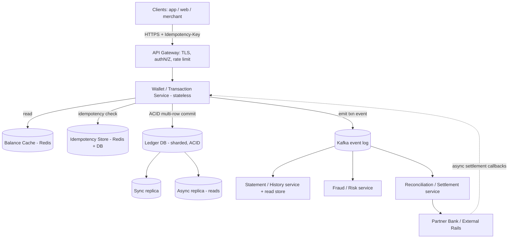

# Design a Digital Wallet — High-Level Design (Staff/Principal Level)

> **Reader:** senior backend engineer (Java/JVM, distributed systems) practising HLD.
> **Goal:** not just "boxes and arrows," but the *design judgment* — what to clarify, what to trade off, and how to defend the hard calls about **money**.

---

## 1. Problem & Clarifying Questions

### 1.1 Restating the problem

Design a **Digital Wallet**: a system that holds a per-user monetary balance and lets users **load money in** (top-up from a bank/card), **pay out** (send to merchants or other users), **transfer** between wallets, and **withdraw** back to a bank. Think of the wallet inside PayPal, Paytm, Venmo, Cash App, PhonePe, or an in-app "store credit" balance.

The defining characteristic — and the reason this is a *hard* design and not a CRUD app — is that we are storing and moving **money**. Money has three brutal properties that a feed or a chat system does not:

1. **It must never be created or destroyed by accident.** Every credit must have a matching debit (the *conservation of money*). The total in the system must be explainable at all times.
2. **It must be exactly correct under concurrency and failure.** No double-spend (spending the same balance twice), no double-credit (a retried request crediting twice), no "lost update" where two concurrent transfers both succeed against a balance that could only cover one.
3. **It must be auditable forever.** Regulators, fraud teams, and angry customers will all ask "where did my money go?" months later. We need an immutable record.

So the real problem statement is: **build a system of record for money that is correct under concurrency, durable through failure, idempotent against retries, and auditable forever — while still being fast and scalable.**

### 1.2 Questions I'd ask the interviewer first

I never start drawing. I start by scoping. Here are the questions, grouped, with *why each matters* (because the interviewer is grading whether you know which answers change the design).

**Functional scope**
- **What operations?** Top-up (load), withdraw, peer-to-peer (P2P) transfer, pay a merchant, refund, hold/authorization (like a card pre-auth), recurring/scheduled payments? *Holds and refunds dramatically change the ledger model.*
- **Single currency or multi-currency?** Does a wallet hold USD only, or USD + EUR + INR + crypto? *Multi-currency means one wallet = many balances and FX (foreign-exchange) conversions become first-class transactions.*
- **Closed-loop or open-loop?** Closed-loop = money only moves between wallets inside our system (like store credit). Open-loop = money flows to external banks/cards/networks. *Open-loop forces us to integrate asynchronous, eventually-settled external rails (ACH, UPI, card networks) that can fail/reverse hours later.*
- **Do we own the money or does a bank?** Are we a regulated bank, or do we sit on top of a partner bank that holds a pooled "for-benefit-of" (FBO) account? *This decides whether the bank's ledger or ours is the source of truth, and how reconciliation works.*
- **Transaction history / statements?** Do users get a full statement, monthly PDF, search, filters? Over what retention window?

**Non-functional**
- **Consistency expectations:** Must a balance read *immediately after* a write reflect the write (read-your-writes)? Can a transfer be eventually consistent, or strictly atomic? *Money strongly biases to strong consistency on the write path.*
- **Latency target** for a payment? (Users expect sub-second confirmation at a checkout.)
- **Availability target?** 99.9%? 99.99%? *Money systems often prefer "fail closed" — refuse the transaction — over "fail open." A few seconds of unavailability is better than a wrong balance.*
- **Durability:** zero tolerance for losing a committed transaction. RPO (recovery point objective) effectively zero.

**Scale**
- How many users / wallets? Daily active? Peak transactions per second (e.g., festival/sale spikes, payday)?
- Read:write ratio? (Balance checks vastly outnumber transfers.)
- Are there **hot wallets** — a few accounts (a big merchant, a promotions/cashback account, the company's own settlement account) that receive thousands of transactions per second? *This is the single hardest scaling problem and almost always present.*

**Out of scope (confirm)**
- KYC/onboarding identity verification, fraud-ML scoring, lending/credit, interest accrual, full accounting/GL (general ledger) integration, tax reporting. We'll design *hooks* for fraud and reconciliation but not the ML models themselves.

### 1.3 Assumptions I'll proceed with

Stated explicitly so I can be held to them:

- **Open-loop wallet** backed by a partner bank's pooled FBO account. We are the **system of record for user-level balances**; the bank is the system of record for the *pooled* cash. We reconcile against the bank daily.
- **Multi-currency-capable** design, but I'll mostly illustrate single currency for clarity and note where multi-currency changes things.
- Operations supported: **top-up, withdraw, P2P transfer, merchant payment, refund, and authorization holds.**
- **Strong consistency on the write path** (balances must be exactly correct, no double-spend). Reads can tolerate slightly stale balances *except* read-your-writes for the acting user.
- **Scale:** 100M registered users, 20M daily active, peak **~10,000 money-moving transactions/sec**, balance-read QPS ~10x that. (Justified in §3.)
- **Latency:** P99 < 300ms for a transfer commit; P99 < 50ms for a balance read.
- **Availability:** 99.99% for reads, 99.95% for writes, with a hard preference to **fail closed** on ambiguity.

---

## 2. Requirements (Finalized)

### 2.1 Functional

1. **Create wallet** (one or more currency sub-balances per user).
2. **Top-up:** move money from an external source (card/bank) into the wallet.
3. **Withdraw / cash-out:** move money from wallet to external bank.
4. **Transfer:** atomic debit of sender, credit of receiver (P2P or wallet→merchant).
5. **Authorization hold:** reserve funds without moving them (e.g., a ride/hotel pre-auth), then later **capture** (settle) or **release** (void).
6. **Refund / reversal:** move money back, referencing the original transaction.
7. **Balance query:** current available balance and held/pending amounts.
8. **Statement / history:** paginated, filterable transaction history; downloadable statements.
9. **Idempotency:** any client request can be safely retried without double-applying.
10. **Reconciliation:** internal totals must reconcile to themselves (double-entry) and to the partner bank daily.

### 2.2 Non-functional

| Property | Target | Rationale |
|---|---|---|
| **Correctness** | Absolute. No double-spend, no money created/destroyed. | This is the product. A wrong balance is worse than downtime. |
| **Consistency (write)** | Strong / linearizable per wallet. | Concurrent debits on the same wallet must serialize. |
| **Consistency (read)** | Read-your-writes for the actor; bounded staleness for others. | Cheap to serve, acceptable for a third party's balance. |
| **Durability** | RPO ≈ 0. Committed = never lost. | Losing a committed money movement is unacceptable / illegal. |
| **Latency** | Transfer commit P99 < 300ms; balance read P99 < 50ms. | Checkout UX. |
| **Availability** | Writes 99.95%, reads 99.99%; fail closed on ambiguity. | Prefer refusal over incorrectness. |
| **Auditability** | Immutable ledger retained ≥ 7 years (regulatory). | Disputes, regulators, fraud. |
| **Throughput** | 10k TPS sustained, 30k+ peak. | Sale events, payday. |

### 2.3 Key explicit assumptions

- Each money movement is **double-entry**: every transaction has at least one debit and one matching credit, and `sum(debits) == sum(credits)`. This is non-negotiable and shapes the whole data model.
- A wallet's **balance is a derived/cached value** of its ledger; the **ledger is the source of truth**.
- We will use a **relational, ACID datastore for the ledger** (transactions span two accounts atomically). We'll justify this hard in §6 and §7.

> **ACID** = Atomicity, Consistency, Isolation, Durability — the guarantees a transactional database gives: a multi-row update either fully happens or not at all, isolated from concurrent updates, and survives crashes.

---

## 3. Capacity Estimation

Let me do the arithmetic. I'll flag every assumption.

### 3.1 Traffic / QPS

- **Users:** 100M registered, 20M daily active (DAU).
- **Money-moving transactions/day:** assume each DAU does ~3 money operations/day (a payment, a check-out, a transfer) → `20M × 3 = 60M transactions/day`.
- **Average write QPS:** `60M / 86,400s ≈ 695 TPS`.
- **Peak factor:** money traffic is *spiky* (lunch rush, payday, flash sales). Use a **peak factor of 10–15×** average → **~7,000–10,000 write TPS peak**. I'll design for **10k sustained, 30k burst**.
- **Reads (balance checks, history views):** every app open checks balance; assume **read:write ≈ 10:1** → **~100k read QPS peak**. History/statement reads are heavier but rarer; bundle them in.

### 3.2 Storage

The dominant store is the **immutable ledger of entries** (we never delete; we retain 7+ years).

- **Entries per transaction:** double-entry → at least 2 ledger entries (one debit, one credit). Many transactions (fees, FX) have 3–4. Use **avg 3 entries/transaction**.
- **Entries/day:** `60M txns × 3 = 180M entries/day`.
- **Bytes per entry:** id (16B), txn_id (16B), account_id (16B), amount (8B), currency (3B), direction (1B), timestamp (8B), type/status (8B), metadata/refs (~80B), indexing overhead (~50B) → call it **~200 bytes/entry** logically, **~300B with index amplification**.
- **Daily ledger growth:** `180M × 300B ≈ 54 GB/day`.
- **Annual:** `54 GB × 365 ≈ 19.7 TB/year`. Over 7 years (with compression of cold data ~3:1): roughly **45–55 TB** of hot+warm+cold ledger. Add the **transaction header table** (1 row/txn, ~300B): `60M × 300B = 18 GB/day ≈ 6.6 TB/year`.
- **Balances/accounts table:** 100M users × (say 2 currency accounts) × ~200B = **~40 GB** — tiny, fits in memory/cache easily.

So: **multi-terabyte, append-heavy, growing ~70 GB/day (ledger + headers)**. This says: shard the ledger, tier hot/warm/cold storage, and keep balances/accounts small and fast.

### 3.3 Bandwidth

- **Write payloads:** a transfer request ~1KB in, ~1KB out. At 10k TPS → `10k × 2KB = 20 MB/s` ≈ trivial.
- **Read payloads:** balance read ~300B. At 100k QPS → `100k × 300B ≈ 30 MB/s`. Also trivial network-wise.
- The bandwidth constraint is **not** the bottleneck; **write contention and durability fsyncs are.**

### 3.4 Memory (cache)

- Cache **balances** for active wallets: 20M DAU × ~100B/balance row ≈ **2 GB** — fits comfortably in a Redis cluster.
- Cache **idempotency keys** (recent request IDs → result) with TTL: at 10k TPS × 24h retention = 864M keys × ~100B ≈ **86 GB** if we kept a full day; in practice we keep ~24–48h with TTL, sharded across the cluster, or push older keys to the durable store. (We'll keep the idempotency record durably in the DB too — cache is just a fast-path.)

### 3.5 Server / shard counts

- **Ledger DB writes:** a well-tuned Postgres/MySQL node handles ~5–15k simple write txns/sec, but our txns are multi-row + fsync-durable, so assume **~2–3k money-txns/sec per primary shard** to leave headroom. For **10k sustained / 30k peak**, we need **~6–12 write shards**. Start with **16 shards** (power of two, room to grow, see §8).
- **App/API tier:** stateless. If one service instance handles ~2k req/s, then `(100k reads + 10k writes) / 2k ≈ 55 instances`; run **~80–100** across AZs for headroom + failover.
- **Cache tier:** a Redis cluster of ~6–12 nodes handles 100k+ ops/s easily.

**Summary of the shape:** read-heavy on balances (cacheable), write path is modest QPS but *expensive per write* (multi-row, durable, contended), storage grows fast and must be retained forever. The engineering is in the **write path correctness and the hot-wallet contention**, not raw throughput.

---

## 4. API Design

All money-moving endpoints take a client-supplied **idempotency key** (a UUID the client generates once per logical operation and reuses on retries).

### 4.1 Core endpoints

```
POST /v1/wallets
  → create a wallet (optionally with currency sub-accounts)
  Req:  { userId, currencies: ["USD","EUR"] }
  Res:  { walletId, accounts: [{accountId, currency, balance:0}] }

GET  /v1/wallets/{walletId}/balance?currency=USD
  → fast balance read (available + held)
  Res:  { accountId, currency, available: 12500, held: 500, version: 91 }
        // amounts in minor units (cents). version = optimistic-concurrency token.

POST /v1/transfers
  Headers: Idempotency-Key: <uuid>
  Req:  {
          sourceAccountId, destAccountId,
          amount: 5000, currency: "USD",
          type: "P2P" | "MERCHANT_PAYMENT" | "TOPUP" | "WITHDRAWAL" | "REFUND",
          reference: "order_12345",
          metadata: { note: "dinner" }
        }
  Res:  { transactionId, status: "COMPLETED" | "PENDING" | "FAILED",
          sourceBalanceAfter, destBalanceAfter, ledgerEntries:[...] }

POST /v1/holds
  → authorization hold (reserve funds)
  Headers: Idempotency-Key: <uuid>
  Req:  { accountId, amount, currency, expiresAt, reference }
  Res:  { holdId, status:"ACTIVE", available, held }

POST /v1/holds/{holdId}/capture
  Req:  { amount }   // capture ≤ held amount; releases remainder
  Res:  { transactionId, status:"COMPLETED" }

POST /v1/holds/{holdId}/release
  Res:  { status:"RELEASED" }

POST /v1/transactions/{txnId}/refund
  Headers: Idempotency-Key: <uuid>
  Req:  { amount, reason }
  Res:  { refundTransactionId, status }

GET  /v1/wallets/{walletId}/transactions?cursor=&limit=50&from=&to=&type=
  → paginated statement/history (cursor-based)
  Res:  { items:[...], nextCursor }
```

### 4.2 Design notes on the API

- **Amounts are integers in minor units** (cents, paise). **Never use floats for money** — IEEE-754 floats can't represent 0.10 exactly, leading to rounding errors that destroy reconciliation. Use `BIGINT` minor units, or `DECIMAL` for currencies needing it; the application layer enforces a fixed scale per currency.
- **Idempotency-Key header** on every mutating call. The server stores `(idempotency_key → first_result)`; a retry returns the *stored* result, never re-executing. (Deep dive in §7.3.)
- **`version` / optimistic-concurrency token** returned on balance reads, used in conditional updates (deep dive §7.2).
- **Status is explicit and may be `PENDING`** — for open-loop ops (top-up, withdrawal) the external rail settles asynchronously, so the wallet moves through a state machine (§7.5), not an instant flip.
- **Cursor-based pagination** for history (not offset) — offset pagination over an append-only multi-TB table is O(n) and breaks under inserts; cursors (e.g., `(created_at, entry_id)`) are stable and seekable via index.

---

## 5. High-Level Architecture

### 5.1 Request flow (narrative)

A transfer enters through the **API Gateway** (TLS termination, authN/authZ, rate limiting). It hits the stateless **Wallet/Transaction Service**, which:
1. Checks the **idempotency store** — if this key was already processed, return the stored result.
2. Resolves which **ledger shard(s)** hold the source and destination accounts.
3. Opens a **DB transaction** that, atomically, (a) verifies/decrements the source's available balance, (b) increments the destination, and (c) appends double-entry **ledger entries** plus a **transaction header** — all in one ACID commit.
4. Records the idempotency result, updates the **balance cache**, and emits a **transaction event** to a durable log (Kafka) for downstream consumers (notifications, statements, fraud, reconciliation).

Balance reads hit the **cache** first (Redis), falling back to the ledger DB and repopulating.

### 5.2 ASCII block diagram

```
                          ┌──────────────────────────────────────┐
   Mobile / Web / Merchant│              CLIENTS                   │
                          └───────────────────┬──────────────────┘
                                              │ HTTPS (idempotency-key)
                                     ┌────────▼─────────┐
                                     │   API Gateway    │  TLS, authN/Z,
                                     │  + Rate Limiter  │  rate limit, WAF
                                     └────────┬─────────┘
                                              │
                       ┌──────────────────────▼───────────────────────┐
                       │        Wallet / Transaction Service           │  (stateless, N replicas)
                       │  idempotency check → shard route → ACID txn   │
                       └───┬───────────┬───────────────┬───────────┬───┘
            read path      │           │ write path    │           │ async
           ┌───────────────▼──┐   ┌────▼─────────┐  ┌──▼────────┐  └──────────────┐
           │  Balance Cache   │   │ Idempotency  │  │  LEDGER DB (sharded, ACID)│  │
           │   (Redis)        │   │   Store      │  │  ┌──────┐ ┌──────┐ ┌─────┐ │  │
           └──────────────────┘   │ (Redis + DB) │  │  │shard0│ │shard1│ │ ... │ │  │
                                   └──────────────┘  │  └──────┘ └──────┘ └─────┘ │  │
                                                     │  accounts | ledger_entries│  │
                                                     │  txn_headers | holds      │  │
                                                     │  (primary + sync replicas)│  │
                                                     └───────────────────────────┘  │
                                                                                     │
                                              ┌──────────────────────────────────────▼┐
                                              │     Event Log (Kafka, partitioned)     │
                                              └───┬─────────┬──────────┬───────────────┘
                                                  │         │          │
                                       ┌──────────▼┐ ┌──────▼────┐ ┌───▼───────────────┐
                                       │Statement / │ │ Fraud /   │ │ Reconciliation /  │
                                       │History svc │ │ Risk svc  │ │ Settlement svc    │
                                       │(read store)│ │           │ │ (vs partner bank) │
                                       └────────────┘ └───────────┘ └─────────┬─────────┘
                                                                              │
                                                                    ┌─────────▼─────────┐
                                                                    │  Partner Bank /   │
                                                                    │  External Rails   │
                                                                    │ (ACH/UPI/card net)│
                                                                    └───────────────────┘
```

### 5.3 Mermaid diagram



### 5.4 Sequence diagram — a P2P transfer (same currency)

```mermaid
sequenceDiagram
    participant Client
    participant Gateway
    participant WalletSvc
    participant Idem as Idempotency Store
    participant DB as Ledger DB (shard)
    participant Cache
    participant Kafka

    Client->>Gateway: POST /transfers (Idempotency-Key K)
    Gateway->>WalletSvc: forward (authenticated)
    WalletSvc->>Idem: get(K)
    alt key seen before
        Idem-->>WalletSvc: stored result
        WalletSvc-->>Client: same result (no re-execute)
    else new key
        WalletSvc->>DB: BEGIN
        WalletSvc->>DB: UPDATE accounts SET balance=balance-amt WHERE id=src AND balance>=amt AND version=v
        Note over WalletSvc,DB: 0 rows updated => insufficient funds or stale => abort
        WalletSvc->>DB: UPDATE accounts SET balance=balance+amt WHERE id=dst
        WalletSvc->>DB: INSERT txn_header; INSERT 2 ledger_entries (debit+credit)
        WalletSvc->>DB: INSERT idempotency(K -> txnId)
        WalletSvc->>DB: COMMIT (single atomic, durable)
        WalletSvc->>Cache: update src & dst balances
        WalletSvc->>Kafka: emit TransactionCompleted
        WalletSvc-->>Client: {txnId, COMPLETED, balances}
    end
```

### 5.5 Sequence diagram — top-up (open-loop, async settlement)

```mermaid
sequenceDiagram
    participant Client
    participant WalletSvc
    participant DB
    participant Bank as Partner Bank/Card
    Client->>WalletSvc: POST /transfers type=TOPUP (Idempotency-Key)
    WalletSvc->>DB: create txn PENDING; ledger entries in "pending" sub-account
    WalletSvc->>Bank: initiate pull from card/bank
    WalletSvc-->>Client: {status: PENDING}
    Bank-->>WalletSvc: webhook: SETTLED (or FAILED) [hours later]
    alt settled
        WalletSvc->>DB: move pending->available; txn COMPLETED (atomic)
    else failed
        WalletSvc->>DB: reverse pending entries; txn FAILED
    end
```

---

## 6. Data Model & Storage Choices

### 6.1 The core idea: the ledger is the source of truth; balance is a materialization

The single most important data-modeling decision: **we do not store "balance" as the authoritative number you mutate.** We store an **append-only, immutable ledger of double-entry entries.** The `balance` column on the account is a **cached materialization** — a running total kept in sync inside the same transaction that writes the entries. Why:

- **Auditability:** the ledger is the proof. You can always recompute any balance as `sum(credits) − sum(debits)` for an account. Disputes are answerable.
- **Correctness invariant:** because every transaction writes balanced debits and credits, `sum(all entries) == 0` system-wide forever. That's the property reconciliation checks.
- **No destructive updates to truth:** you never overwrite money; you only append. An immutable log can't be silently corrupted by a bad UPDATE.

> **Double-entry bookkeeping** = every movement is recorded twice, as a debit from one account and a credit to another, so the books always balance. It's a 700-year-old accounting invariant; we encode it in the schema.

### 6.2 Entities / schema

```
accounts                          -- one per (wallet, currency); "balance" is materialized
  account_id      PK (UUID)
  wallet_id       (UUID, indexed)
  user_id         (UUID, indexed)
  currency        CHAR(3)
  type            ENUM(USER, MERCHANT, PENDING, FEE, SETTLEMENT, SYSTEM)
  balance         BIGINT          -- available, minor units, materialized
  held            BIGINT          -- reserved by active holds
  version         BIGINT          -- optimistic-concurrency token (bumped each write)
  status          ENUM(ACTIVE, FROZEN, CLOSED)
  shard_key       -- = function(wallet_id)

transaction_headers               -- one per logical money movement
  txn_id          PK (UUID)
  type            ENUM(TRANSFER, TOPUP, WITHDRAWAL, REFUND, FEE, HOLD_CAPTURE)
  status          ENUM(PENDING, COMPLETED, FAILED, REVERSED)
  amount          BIGINT
  currency        CHAR(3)
  idempotency_key (UUID, UNIQUE)  -- enforces exactly-once
  reference       VARCHAR         -- external order/ride id
  created_at      TIMESTAMP
  metadata        JSONB

ledger_entries                    -- immutable, append-only, ≥2 per txn
  entry_id        PK (UUID / sequential snowflake)
  txn_id          FK -> transaction_headers
  account_id      FK -> accounts
  direction       ENUM(DEBIT, CREDIT)
  amount          BIGINT          -- always positive; direction gives sign
  currency        CHAR(3)
  balance_after   BIGINT          -- snapshot of account balance after this entry (for fast statements/audit)
  created_at      TIMESTAMP
  -- INVARIANT per txn: sum(CREDIT.amount) == sum(DEBIT.amount)

holds                             -- authorization reservations
  hold_id         PK
  account_id      FK
  amount          BIGINT
  status          ENUM(ACTIVE, CAPTURED, RELEASED, EXPIRED)
  expires_at      TIMESTAMP
  reference       VARCHAR

idempotency_records
  idempotency_key PK (UUID)
  request_hash    -- hash of request body, to detect key reuse with different payload
  txn_id          -- the result to return on retry
  status, created_at
```

### 6.3 Which datastore, and why

**Decision: a sharded, ACID relational database (PostgreSQL or MySQL/InnoDB) as the ledger system of record.** Defended:

| Store | Pros for a ledger | Cons | Verdict |
|---|---|---|---|
| **Relational (Postgres/MySQL), sharded** | Real **multi-row ACID transactions** (debit+credit in one atomic commit); strong isolation (serializable/RR); mature replication; constraints enforce invariants; secondary indexes for history. | Horizontal scaling needs app-level sharding; cross-shard txns need 2PC/sagas. | **Chosen.** ACID is exactly what money needs. |
| **Wide-column NoSQL (Cassandra/Dynamo)** | Huge write throughput, easy horizontal scale, great for append-only logs. | **No cross-row/cross-partition ACID** by default; tunable but eventual consistency; lightweight transactions (LWT/CAS) are single-partition only and slow. Atomic debit+credit across two accounts is painful. | Reject for the *ledger of record*. (Great for the **history/read store** in §7.6.) |
| **NewSQL (CockroachDB/Spanner/TiDB/YugabyteDB)** | Distributed **ACID + serializable** transactions across shards, horizontal scale, no manual sharding. | Higher write latency (consensus per commit), operational complexity/cost, cross-region commit latency. | **Strong alternative**, especially if cross-shard transfers dominate or you want to avoid sharding ops. Pick this if the team can't operate manual sharding. |
| **Event store / append-only log only** | Pure immutability, perfect audit. | Reading current balance requires fold/replay or a separate projection; concurrency control still needed at the account level. | Use the **concept** (immutable entries) on top of relational, not as the sole store. |

**Why relational wins for the system of record:** the central operation — *atomically debit one account and credit another, only if the source has funds* — is the textbook use case for a multi-row ACID transaction. NoSQL forces you to reinvent atomicity (sagas, compensations, application-level locks) and you'll get it subtly wrong; with money, "subtly wrong" is a headline. We pay for sharding complexity, but we get correctness for free from the engine.

**Why not float / why integer minor units (restated as storage rule):** store `BIGINT` cents. A single `0.1 + 0.2 != 0.3` float error, multiplied across billions of entries, makes reconciliation impossible.

**Supporting stores:**
- **Redis** for balance cache and idempotency fast-path.
- **Cassandra/ScyllaDB or a columnar/OLAP store** for the **statements/history read model** (write-once, read-many, huge volume, no transactional needs) — populated asynchronously from Kafka.
- **Kafka** as the durable event log connecting ledger commits to downstream consumers.
- **Object storage (S3) + Parquet** for cold ledger archival and analytics/reconciliation jobs.

---

## 7. Deep Dives (the bulk)

These are the genuinely hard sub-problems. Each: the problem, the options, a tradeoff table, the defended decision, and **the failure mode the decision avoids.**

### 7.1 Transactional correctness: atomic debit/credit with no double-spend

**Problem.** A transfer must do three things as one indivisible unit: (1) confirm the source has funds, (2) decrement source, (3) increment destination, plus append ledger entries. If any partial state can be observed or persisted — money is created or destroyed. And two concurrent transfers on the same source must not *both* succeed if only one is affordable (the **double-spend / lost-update** problem).

> **Lost update** = two transactions both read balance=100, both subtract 80, both write 20 — the second silently overwrites the first, so 160 left the account against a 100 balance. Classic concurrency bug; catastrophic for money.

**Approach.** Wrap the whole movement in **one ACID database transaction** on the shard that owns the source account (same shard for both accounts in the common case — see §7.7 for cross-shard). Within it, write the debit and credit ledger entries and update both materialized balances. The DB's atomicity guarantees all-or-nothing; durability guarantees the commit survives crash. The remaining question is **how to prevent the lost update under concurrency** — covered in §7.2.

**Failure mode avoided:** partial application (money lost/created) on crash mid-operation, and inconsistent intermediate states being read.

### 7.2 Concurrency control on a single wallet: optimistic (CAS) vs pessimistic locking

This is *the* interview centerpiece. Two correct families of solutions; the right answer is "it depends on contention," and a senior answer says *why*.

> **Pessimistic locking** = grab a lock on the row first (`SELECT ... FOR UPDATE`), so no one else can touch it until you commit. **Optimistic concurrency / CAS (compare-and-swap)** = don't lock; read a version, do your work, then update *only if* the version is unchanged; if it changed, you lost the race — retry.

**Option A — Pessimistic row lock (`SELECT ... FOR UPDATE`)**
```sql
BEGIN;
SELECT balance, version FROM accounts WHERE id = :src FOR UPDATE;  -- row locked
-- app checks balance >= amount
UPDATE accounts SET balance = balance - :amt, version = version+1 WHERE id = :src;
UPDATE accounts SET balance = balance + :amt WHERE id = :dst;
INSERT ledger_entries ...; INSERT txn_header ...;
COMMIT;  -- lock released
```
Serializes all writers on that wallet. Correct and simple. Under high contention on one wallet, writers queue → latency grows, throughput on that wallet is capped by lock hold time.

**Option B — Optimistic / CAS (conditional UPDATE on version + balance)**
```sql
BEGIN;
-- read version v (or skip read, do it in one shot):
UPDATE accounts
   SET balance = balance - :amt, version = :v + 1
 WHERE id = :src AND version = :v AND balance >= :amt;   -- atomic guard
-- if rowsAffected == 0  -> either stale version (lost race) or insufficient funds
UPDATE accounts SET balance = balance + :amt WHERE id = :dst;
INSERT ledger_entries ...; INSERT txn_header ...;
COMMIT;
```
No explicit lock held across the read+think time. The `WHERE version = :v AND balance >= :amt` makes the check-and-set atomic. On `rowsAffected == 0`, the app distinguishes insufficient-funds (re-read; if still short, reject) from a concurrency miss (retry with the new version). Excellent under **low contention**; under high contention on one wallet, retries thrash (each retry re-races and fails) → wasted work.

**Option C — Serializable isolation, let the DB abort**
Run at `SERIALIZABLE`; the DB detects conflicting schedules and aborts one; app retries. Strongest guarantee, but most aborts under contention; you still need a retry loop.

**Option D — Sharded sub-balances / accumulator pattern (for hot wallets)** — see §7.4.

| Dimension | Pessimistic (FOR UPDATE) | Optimistic (CAS) | Serializable |
|---|---|---|---|
| Correctness | Strong | Strong | Strongest |
| Low-contention perf | Good | **Best** (no lock wait) | Good |
| High-contention perf | Predictable but queued | **Poor (retry storms)** | Poor (abort storms) |
| Holds locks during app logic | Yes (risk if logic slow) | No | No |
| Deadlock risk | Yes (order locks consistently!) | No | Possible |
| Complexity | Low | Medium (retry loop) | Low (DB does it) |

**Decision.** **Use optimistic/CAS as the default** for normal wallets (most wallets have *zero* concurrent writes; CAS avoids paying for locks you don't need and keeps the hot path lock-free). **Escalate to pessimistic `FOR UPDATE` for known-hot accounts** or after N optimistic retries, and **use the sharded-balance accumulator (§7.4) for the truly hot wallets.** Always **acquire locks in a deterministic order** (e.g., by `account_id`) to avoid deadlocks when a transfer touches two rows.

**Failure modes avoided:** lost updates / double-spend (both A and B prevent it via the atomic guard or the lock); deadlocks (deterministic lock ordering); and, by defaulting to CAS, the *latency tax* of locking the 99% of wallets that have no contention.

### 7.3 Idempotency: exactly-once under retries

**Problem.** Networks fail. A client sends "transfer $50," times out, and retries — but the first request *did* commit. Without protection, the user is debited twice. Money systems must be **idempotent**: the same logical request applied any number of times has the effect of applying it once.

**Mechanism.**
1. Client generates an **idempotency key** (UUID) per logical operation, reused across retries.
2. We store it in `transaction_headers.idempotency_key` with a **UNIQUE constraint**, *inside the same transaction* that moves the money. This is the airtight version: if a retry races, the second `INSERT` violates the unique constraint → the transaction aborts → we look up and return the original result. The DB, not application logic, guarantees exactly-once.
3. We also keep a Redis fast-path (`key → result`) to short-circuit retries without hitting the DB, but **the DB unique constraint is the real guarantee** — Redis is an optimization (it can be stale or evicted).
4. **Bind the key to the request payload** (`request_hash`). If the same key arrives with a *different* body (client bug or attack), reject with `409 Conflict` rather than silently returning the wrong stored result.
5. **TTL/retention:** keep idempotency records long enough to outlast all client retry windows (e.g., 24–72h hot, then they're effectively encoded by the txn header forever).

**Why inside the transaction (the subtle bit):** if you check-then-insert in two steps, two concurrent retries can both pass the check and both insert. Putting the uniqueness check *in the committing transaction* makes "did this already happen?" and "do the money movement" a single atomic decision.

**Failure mode avoided:** double-charging on retry; and the TOCTOU (time-of-check-to-time-of-use) race where two retries both think they're first.

### 7.4 Scaling hot wallets

**Problem.** A big merchant, the cashback/promotions account, or the system settlement account may receive **thousands of credits/sec**. Every writer wants to update the *same* `accounts` row. Whether CAS or lock, that single row is a **serialization point** — throughput on it is capped by `1 / (commit latency)`. At ~5ms/commit that's ~200 writes/sec; we need thousands. This is the **hot-row / hot-partition** problem.

**Options.**

| Option | How | Pros | Cons |
|---|---|---|---|
| **A. Sharded sub-balances (accumulator)** | Split the hot account into N "stripe" sub-accounts (`acct#0..#N`). A credit goes to a random/round-robin stripe → contention spread across N rows. Real balance = sum of stripes. | Linear throughput scaling (N× writes). | Reading the true balance must sum N rows; debits need a strategy (drain stripes or maintain a "master" rollup). |
| **B. Async accumulation / write-behind** | Write each credit as an immutable ledger entry only (cheap append, no hot row); update the materialized balance periodically by aggregating. | Append is contention-free; ledger stays the truth. | Materialized balance is slightly stale; not OK if the hot wallet also *spends* in real time. Great for receive-only accounts. |
| **C. Queue + single-writer (serialize through a partition)** | Route all writes for the hot account to one Kafka partition; a single consumer applies them sequentially. | No contention (one writer), ordered, batchable. | Adds latency; single consumer is a throughput ceiling and a failure point (need failover). |
| **D. Batching/coalescing** | Group many small credits into one periodic netted entry. | Fewer writes. | Loses per-txn immediacy; only for tolerant cases (e.g., fee sweeps). |

**Decision.** For **receive-heavy accounts that rarely spend** (merchant settlement, promo source): **(A) sharded sub-balances** as the primary technique, often combined with **(B) async rollup** for the displayed balance. The ledger entries themselves are appended (contention-free), and the N stripes absorb the write fan-out. For debits, drain from stripes or net against a periodically-computed master. For an account that must both receive *and* spend at high rate in real time, combine A with a **reservation/rollup master** updated via the write-behind in B, and accept bounded staleness on the *displayed* number while keeping the ledger exact.

**Failure mode avoided:** the single-row serialization ceiling that would make a popular merchant's checkout fall over during a sale — the textbook "hot partition meltdown."

### 7.5 Open-loop / async settlement and the transaction state machine

**Problem.** Top-ups and withdrawals touch **external rails** (ACH takes days; card auths settle later; UPI is fast but can still fail/reverse). The money isn't *ours* the instant the user clicks — it may settle, fail, or be **reversed/charged-back hours or days later.** A naive "credit immediately" lets users spend money that never arrives.

**Approach — a transaction state machine with pending sub-accounts.**
- A top-up creates a `PENDING` transaction crediting a **pending sub-account**, not the spendable balance. The user sees "pending."
- On the bank's **SETTLED** webhook, an atomic transaction moves funds `pending → available`, txn → `COMPLETED`.
- On **FAILED**, we reverse the pending entries, txn → `FAILED`.
- **Reversals/chargebacks** (money clawed back later) are modeled as **new compensating transactions** that reference the original (never edits to history). If the user already spent it, the account can go negative → triggers a collections/risk flow.
- **Webhook idempotency:** bank callbacks can arrive multiple times / out of order; key them by the provider's reference and apply the same exactly-once discipline (§7.3).
- **Outbox pattern** for emitting events: write the "event to publish" into an `outbox` table *in the same DB transaction* as the ledger commit; a relay publishes to Kafka and marks it sent. Guarantees the event is published iff the money moved — no lost or phantom events.

> **Outbox pattern** = instead of writing to the DB and then publishing to Kafka (two systems that can fail independently → dual-write problem), you write the event to a table atomically with your data, then a separate process ships it. Avoids "committed money but never told downstream" or vice versa.

**Failure mode avoided:** crediting spendable money for funds that never settle (fraud/loss), lost or duplicated downstream events (dual-write problem), and double-applied bank webhooks.

### 7.6 Statements & history at scale

**Problem.** History is **write-once, read-many, append-only, and huge** (54 GB/day of entries). Serving rich, filterable, paginated statements directly off the transactional ledger DB would (a) compete with the latency-critical write path and (b) require expensive secondary indexes on a multi-TB hot table.

**Approach — CQRS (Command Query Responsibility Segregation): separate write model from read model.**
- The **ledger DB** is the write model (small, hot, ACID-correct).
- Asynchronously (via Kafka, using the outbox), project entries into a **read-optimized store**: Cassandra/ScyllaDB or Elasticsearch/OLAP, partitioned by `account_id` and clustered by time, denormalized for the statement view. This store is eventually consistent (seconds behind) — acceptable for *history* (the user's *current balance* still comes from the strongly-consistent path).
- **Cursor pagination** keyed on `(created_at, entry_id)` — stable under inserts, seekable via the clustering key, O(limit) per page.
- **Tiering:** hot (last 90 days) in the fast store; warm/cold archived to **S3/Parquet** for cheap retention and analytics; cold reads served via a slower path (e.g., Athena/Presto) or async statement generation.

> **CQRS** = use one model optimized for writes (correctness) and a different, denormalized model optimized for reads (speed/flexibility), kept in sync asynchronously. Common when read and write access patterns diverge sharply.

**Failure mode avoided:** the read traffic (and its index bloat) degrading the money-critical write path, and unbounded growth of the transactional store.

### 7.7 Cross-shard transfers (when source and destination live on different shards)

**Problem.** We sharded by `wallet_id`, so a transfer between two users often spans two shards. A single local ACID transaction can't atomically touch both. Distributing the commit is the classic distributed-transaction problem.

**Options.**

| Option | Mechanism | Pros | Cons |
|---|---|---|---|
| **Two-phase commit (2PC)** | Coordinator: prepare on both shards, then commit both. | Atomic, strongly consistent. | **Blocking** if coordinator dies mid-commit (participants hold locks); latency; operational fragility. |
| **Saga (orchestrated, with compensation)** | Step 1: debit source (commit). Step 2: credit dest (commit). On failure, compensate (credit source back). | Non-blocking, scalable, resilient. | Eventually consistent; money is momentarily "in flight"; needs careful compensation + idempotency. |
| **Co-locate via a transit/clearing account on each shard** | Debit source → credit a *transit* account on source shard (atomic, local). A reliable async process debits transit and credits dest on the other shard (atomic, local). | Each leg is a clean local ACID txn; double-entry preserved at every step; transit account makes "in-flight money" explicit and reconcilable. | Eventually consistent; transit balance must be monitored/swept. |

**Decision.** **Saga via a transit/clearing account** (a blend of saga + the co-location trick). Each leg is a *local* atomic double-entry transaction, so we never need cross-shard atomicity. The money provably exists at all times — it's in the **transit account** between legs (which reconciliation watches). A durable worker (driven by the outbox/Kafka) completes the second leg with idempotency and retries; if the destination is permanently unreachable, a compensation returns funds to the source. We avoid 2PC's blocking-coordinator failure mode entirely.

> **Saga** = a long-running operation split into local transactions, each with a compensating transaction to undo it; instead of one big atomic commit, you get a sequence of committed steps plus rollback logic. Trades atomicity for availability.

**Failure mode avoided:** a wedged 2PC coordinator holding locks across shards and stalling everyone; and "money vanished mid-transfer" — the transit account makes in-flight funds explicit and recoverable.

### 7.8 Reconciliation (the safety net for everything above)

**Problem.** Bugs, partial failures, and external-rail mismatches happen. We need an **independent check** that the books are right and that our ledger matches reality (the partner bank).

**Two layers.**
1. **Internal reconciliation (continuous):** the double-entry invariant `sum(all credits) == sum(all debits)` and per-transaction `sum(credits)==sum(debits)` must hold at all times. A periodic job sums the ledger (or trial-balances per account type) and alerts on any nonzero drift. Also: `account.balance` (materialized) must equal `sum(entries)` for that account — a job recomputes and flags divergence (catches a bug in the materialization path).
2. **External reconciliation (daily):** pull the partner bank's statement of the pooled FBO account; assert `our total user balances + pending + transit == bank's pooled cash` (minus fees/floats we model). Investigate breaks: missing settlements, duplicate webhooks, chargebacks not yet booked.

**Tooling:** reconciliation runs off the **read store / S3 Parquet snapshots** (not the hot DB), produces a **break report**, and feeds an ops dashboard. Breaks are triaged by severity; some auto-heal (replay a missed webhook), others go to a human.

**Failure mode avoided:** silent, compounding corruption — the worst outcome for a money system. Reconciliation turns "we think it's right" into "we can prove it's right, daily."

---

## 8. Scaling & Bottlenecks

**How it scales.**
- **App tier:** stateless → scale horizontally behind the gateway; trivially add instances.
- **Reads (balances):** served from Redis; scale the cache cluster and add read replicas. Read QPS is not the constraint.
- **Writes (ledger):** scale by **sharding the ledger by `wallet_id`** (16 shards initially, each primary + sync replica). Most transfers are intra-shard. Add shards by **consistent hashing / range with resharding** as TPS grows.
- **Hot wallets:** handled by §7.4 (sub-balance striping) independent of the global shard count.
- **History:** scales independently in the CQRS read store + S3 tiering.

**Where it breaks first, and the fix.**

| Bottleneck | Symptom | Fix |
|---|---|---|
| **Hot wallet single-row contention** | One merchant's checkout latency spikes during a sale; retry storms. | Sub-balance striping + async rollup (§7.4). The earliest and sharpest break. |
| **Write-shard CPU/IO + fsync** | Commit latency rises with TPS. | Add shards; batch group-commit; faster storage; keep transactions short (no app logic inside locks). |
| **Cross-shard transfer volume** | Saga workers backlog; transit accounts grow. | More saga workers (idempotent, parallel by account); monitor/sweep transit; consider co-locating frequently-transacting pairs. |
| **Idempotency store growth** | Redis memory pressure. | TTL eviction; the durable unique constraint remains the guarantee. |
| **Resharding** | Need to split a hot shard. | Consistent hashing with virtual nodes; double-write + backfill + cutover; or adopt NewSQL to push this to the engine. |
| **Cache stampede on a popular account** | Many concurrent misses hammer DB. | Request coalescing / single-flight; short TTL + async refresh. |

**Removing the bottleneck order:** hot-wallet striping → shard the ledger → scale saga workers → tier history → reshard. Each is independent, so we attack them as metrics demand rather than over-engineering up front.

---

## 9. Reliability, Consistency & Security

### 9.1 Consistency model
- **Per-wallet writes: linearizable.** Achieved by single-shard ACID transactions + CAS/locking (§7.2). A debit and the funds check are one atomic decision.
- **Cross-shard transfers: eventual** (saga), but with **no money lost** — funds are always accounted for, including in the transit account.
- **Reads:** the actor's own balance is **read-your-writes** (read from primary or from the just-updated cache); third-party/history reads tolerate **bounded staleness** (replica/CQRS lag of seconds). The materialized balance is updated *in the same commit* as the ledger entries, so it's never internally inconsistent with the truth on its own shard.

### 9.2 Durability & replication
- Ledger primary writes are **synchronously replicated** to at least one replica before acknowledging commit (RPO ≈ 0). Async replicas serve reads.
- Multi-AZ deployment; automated failover with **fencing** (the old primary is demoted and cannot accept writes — prevents split-brain double-writes).
- WAL/binlog archived to object storage for point-in-time recovery.
- Kafka with replication factor ≥ 3, `acks=all` for the event log.

### 9.3 Failure handling
- **Fail closed:** if the ledger shard is unavailable or the result is ambiguous, **reject** the transaction (return retryable error) rather than guess. A declined payment is recoverable; a wrong balance is not.
- **Idempotency everywhere** (§7.3) makes client and worker retries safe.
- **Outbox + saga** make downstream effects exactly-once and recoverable.
- **Reconciliation** (§7.8) is the backstop that catches anything the above missed.
- **Holds expiry:** a sweeper releases expired authorization holds so funds aren't reserved forever.

### 9.4 Security & abuse
- **AuthN/AuthZ** at the gateway (OAuth2/OIDC, mTLS for service-to-service); per-endpoint authorization (a user can only move money out of *their* account).
- **Encryption:** TLS in transit; encryption at rest; field-level encryption / tokenization for PII and bank/card numbers; **PCI-DSS** scope minimization (don't store raw PANs — use a vault/tokenization).
- **Rate limiting & velocity checks** at the gateway and per-account (max transfers/min, max amount/day) — both for abuse and as a fraud signal.
- **Fraud hooks:** the Kafka event stream feeds a risk service that can flag/hold suspicious transactions (e.g., sudden large transfer to a new payee). Risky txns can be created in a `HELD/REVIEW` state.
- **Audit log:** every state change is immutable and attributable; admin actions are themselves logged and dual-controlled (maker-checker) for sensitive operations like freezing/adjusting balances.
- **Negative-balance & adjustment controls:** manual balance adjustments (e.g., to fix a break) are special transactions requiring elevated approval and reason codes, recorded in the ledger like everything else — never raw `UPDATE`s.

---

## 10. Extensions & Follow-ups

Realistic things the interviewer will add, and how the design flexes:

1. **Multi-currency + FX.** A wallet holds N currency sub-accounts. A cross-currency transfer is modeled as **two transactions through an FX account**: debit USD account → credit FX account (USD) at the buy rate; debit FX (EUR) → credit EUR account at the sell rate; the spread is a fee entry. Double-entry still balances *per currency*; FX accounts hold the conversion and are reconciled separately. Rates are snapshotted on the transaction for auditability.
2. **Interest / cashback / promotions.** Modeled as scheduled transactions from a funding (promo/treasury) account → user accounts. The funding account is a **hot wallet** → apply §7.4. Idempotent batch jobs prevent double-payouts.
3. **Scheduled / recurring payments.** A scheduler creates transactions at due time with idempotency keys derived from `(schedule_id, period)` so a retried scheduler tick can't double-pay.
4. **Refunds / partial refunds / disputes.** Compensating transactions referencing the original; partial refunds track remaining refundable amount on the txn header. Chargebacks are external-rail-initiated reversals (§7.5).
5. **Real bank / regulated entity (we hold the money).** Now *our* ledger is the legal record of cash; reconciliation shifts to internal GL integration, and regulatory reporting (e.g., daily settlement, AML/CTR thresholds) becomes a first-class consumer of the event stream.
6. **Global / multi-region.** Pin each wallet's shard to a home region for low-latency strong writes; cross-region transfers use the saga path. Avoid multi-region synchronous commits on the money path (latency). Or adopt **Spanner/CockroachDB** for global ACID at the cost of commit latency.
7. **Spending limits / parental controls / sub-wallets.** Add policy checks pre-commit; model sub-wallets as child accounts with their own ledger.
8. **Real-time fraud / AML.** Promote the risk service to inline (synchronous) scoring on high-value transfers, with a strict latency budget and a fail-closed default.

---

## 11. Interview Q&A

**Q1. Why store an immutable ledger instead of just a balance column?**
Because money must be auditable and provably conserved. The ledger lets you recompute any balance, answer disputes, and run reconciliation; an overwriteable balance column can be silently corrupted and leaves no trail. The balance column exists, but only as a *materialization* updated atomically with the entries.

**Q2. Optimistic (CAS) or pessimistic locking for the wallet — which and why?** *(senior-signal)*
Default optimistic/CAS: most wallets have no concurrent writes, so paying for a lock is wasteful, and a conditional `UPDATE ... WHERE version=:v AND balance>=:amt` makes the funds-check and debit atomic. Escalate to `SELECT ... FOR UPDATE` for known-hot accounts (CAS retry-storms under high contention) and to sub-balance striping for truly hot wallets. The tradeoff is lock-wait latency (pessimistic) vs retry waste (optimistic); contention level decides.
*Deep probes:* (a) How do you tell "insufficient funds" from "lost the CAS race" when `rowsAffected==0`? Re-read the row: if balance still < amount → reject; else retry. (b) How do you avoid deadlocks when locking two rows? Lock in deterministic order (by account_id).

**Q3. How do you guarantee a retried request doesn't double-charge?**
Client-supplied idempotency key with a **UNIQUE constraint inside the committing transaction**. A retry that races loses on the unique insert and we return the original result. Redis is a fast-path optimization, not the guarantee. Bind the key to a request hash to reject key reuse with a different body.

**Q4. Why a relational DB and not Cassandra/Dynamo for the ledger?** *(senior-signal)*
The core operation is an atomic multi-row transaction (debit+credit, with a funds guard). Relational engines give that for free via ACID; NoSQL forces you to hand-roll atomicity (sagas/locks) and you'll get it subtly wrong — fatal for money. We use NoSQL for the *history read model* (append-only, read-heavy), where eventual consistency is fine.

**Q5. How do you scale a hot wallet receiving thousands of credits/sec?**
The single row is a serialization point. Stripe it into N sub-balances; route credits across stripes (contention spread N×); real balance = sum of stripes, often with an async rollup for display. Ledger entries are appended (contention-free) regardless. For receive-only accounts this scales linearly; spend-and-receive accounts combine striping with a reservation master.

**Q6. How do transfers across shards stay correct?** *(senior-signal)*
Avoid cross-shard atomic commits. Use a saga via a transit/clearing account: debit source → credit transit (local atomic), then a durable idempotent worker debits transit → credits dest (local atomic). Money is always accounted for — in transit between legs. We avoid 2PC's blocking-coordinator failure. It's eventually consistent, which is acceptable because no money is ever lost and reconciliation watches the transit balance.
*Deep probe:* What if the second leg permanently fails? Compensate: return funds from transit to source; alert ops; the transit account makes the stuck funds visible.

**Q7. A top-up's bank settlement fails after you credited the user — what happens?**
We never credit spendable balance on initiation; we credit a *pending* sub-account and only move pending→available on the SETTLED webhook. On FAILED we reverse the pending entries. If a *chargeback* claws back already-spent funds, a compensating transaction can drive the account negative, triggering a collections/risk flow.

**Q8. How do you keep the published event consistent with the committed money movement?**
Outbox pattern: write the event to an `outbox` table in the *same* transaction as the ledger commit; a relay ships it to Kafka and marks it sent. The event is published iff the money moved — no dual-write inconsistency.

**Q9. How do you prove the system isn't quietly losing money?**
Continuous internal reconciliation: per-transaction and global `sum(credits)==sum(debits)`, plus `materialized balance == sum(entries)` per account. Daily external reconciliation against the partner bank's pooled account. Breaks raise alerts and feed an ops triage flow. This is the backstop for any bug the hot path missed.

**Q10. What's your consistency model and why fail closed?** *(senior-signal)*
Per-wallet writes are linearizable (single-shard ACID + CAS); cross-shard is eventual via saga but loss-free; the actor gets read-your-writes; third-party/history reads tolerate bounded staleness. We fail closed because a declined transaction is recoverable while a wrong balance is not — for money, correctness dominates availability on the write path.

---

## 12. Cheat-sheet & Self-test

### 12.1 Dense recap

**Key numbers:** 100M users, 20M DAU; ~60M money txns/day → ~700 TPS avg, **10k peak (design), 30k burst**; reads ~100k QPS (10:1). Ledger grows **~54 GB/day entries + ~18 GB/day headers** (~70 GB/day, ~25 TB/yr), 7-yr retention. **16 ledger shards** to start (~2–3k txns/s each). Balance cache ~2 GB. Amounts in **integer minor units** — never floats.

**Key decisions:**
- **Immutable double-entry ledger = source of truth; balance = materialization** updated in the same commit.
- **Relational ACID DB** for the ledger (atomic debit/credit + funds guard); NoSQL for the **history read model** (CQRS).
- **CAS/optimistic concurrency by default**, pessimistic `FOR UPDATE` for hot rows, **sub-balance striping** for hot wallets.
- **Idempotency via UNIQUE key inside the committing transaction** (exactly-once).
- **Open-loop = pending sub-accounts + state machine + webhooks**; **outbox** for event publishing.
- **Cross-shard = saga via transit/clearing account**, not 2PC.
- **Reconciliation** (internal continuous + external daily) as the safety net.
- **Fail closed**; per-wallet linearizable; cross-shard eventual but loss-free.

**Diagram in words:** Clients → Gateway (auth, rate limit) → stateless Wallet Service → {Redis balance cache, idempotency store, sharded ACID ledger DB (accounts + immutable ledger_entries + txn_headers + holds)} → Kafka (via outbox) → {history/CQRS read store, fraud, reconciliation → partner bank}. Hot wallets striped; cross-shard via transit account + saga; reconciliation proves conservation daily.

### 12.2 Self-test (no answers)

1. Walk through exactly what happens, row by row and lock by lock, when two P2P transfers hit the *same* source wallet at the same millisecond — for both the CAS and the `FOR UPDATE` strategies. Where does each serialize?
2. Your materialized `balance` column has drifted from `sum(ledger_entries)` for 0.001% of accounts. What are the plausible root causes, how does reconciliation catch it, and how do you safely repair it without breaking double-entry?
3. Design the exact idempotency-key lifecycle for a *scheduled recurring* payment so that neither a scheduler retry nor a manual re-trigger can double-pay. What's the key derived from?
4. A merchant settlement account is striped into 32 sub-balances and now needs to *spend* (withdraw) at 2k TPS while still receiving at 5k TPS. Sketch the read/debit strategy and where bounded staleness is acceptable vs not.
5. The partner bank sends a duplicate "SETTLED" webhook for a top-up, out of order, after you already booked a FAILED for the same reference due to a timeout. Trace the state machine and the idempotency/reconciliation handling that keeps the ledger correct.
