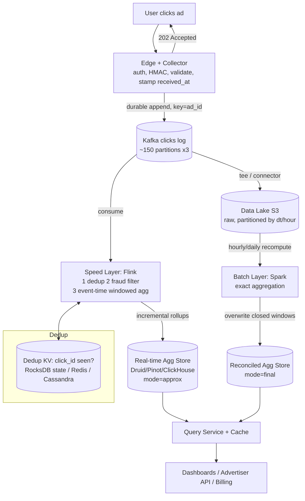
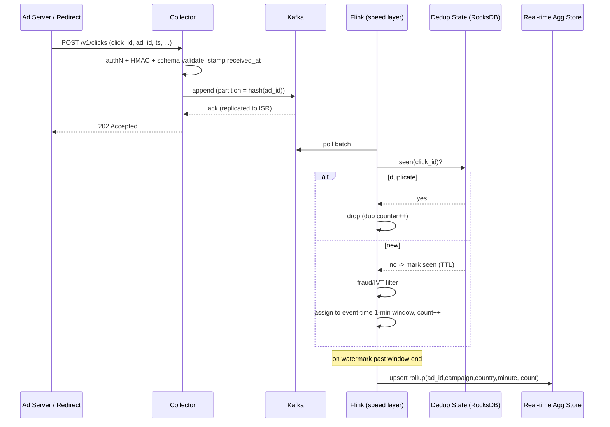
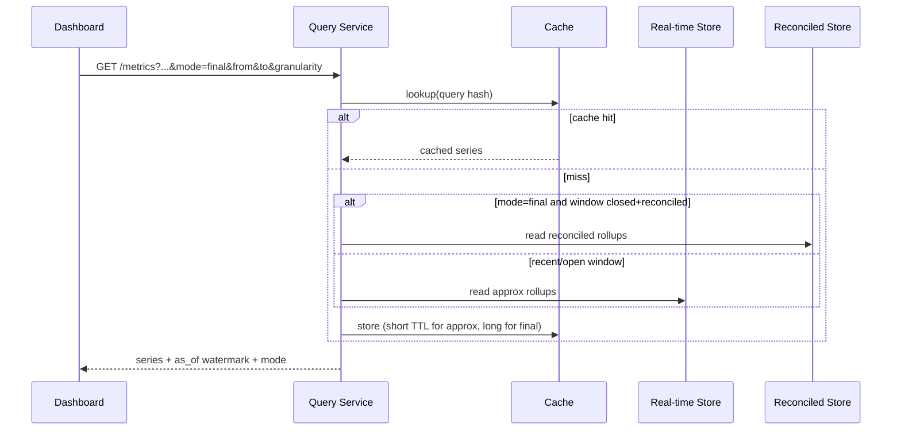

# Design an Ad Click Aggregator — High-Level Design (HLD)

> **Reader profile:** senior backend engineer (Java/JVM, distributed systems) practising for a staff/principal system-design round.
> **Goal of this doc:** teach the *design judgment* — what to clarify, what to estimate, which tradeoffs to defend, and which deep dives separate a senior answer from a junior one.

---

## 1. Problem & Clarifying Questions

### 1.1 Restating the problem

We are asked to design an **Ad Click Aggregator**: a system that sits behind an ad-serving platform, ingests a very high-volume stream of **click events** (a user clicked on an ad), and produces **aggregated metrics** — counts of clicks bucketed by `ad_id`, `campaign_id`, geography, device, time window, etc. Advertisers and internal dashboards then query those aggregates ("how many clicks did campaign X get in the last hour / today / this month?") with low latency.

The classic ad-tech pipeline is **impression → click → conversion**. We focus on **clicks** here, but the architecture generalizes. The interesting tension is that this system must be simultaneously:

- **High-throughput** on ingest (millions of events/sec at peak).
- **Low-latency** on serve (dashboards want sub-second reads).
- **Near-real-time** *and* **eventually exact** — advertisers are billed on clicks, so the numbers must reconcile to the penny, but a marketing dashboard also wants "roughly now."
- **Robust against duplicates and fraud** — a click that is double-counted or fraudulent is money lost or money over-charged.

That last point is what makes this a *commerce* problem, not just a metrics problem. **Accuracy has dollar consequences.**

### 1.2 Questions I'd ask the interviewer first

A staff answer does not jump to boxes-and-arrows. I'd lead with these, grouped.

**Functional scope**
1. What's the **billing relationship**? Are we the source of truth for advertiser billing, or just analytics? (This determines whether "exactly-once-ish" is a nice-to-have or a hard requirement.)
2. What **dimensions** must aggregates be sliceable by — `ad_id`, `campaign_id`, `advertiser_id`, geo, device, OS, publisher/placement? How many dimensions, and what cardinality each?
3. What **time granularities** do consumers query — per-minute, per-hour, per-day, lifetime? What's the smallest bucket we must support?
4. Do we need **real-time** numbers (seconds-fresh dashboards) *and* **historical** numbers (months back), or just one?
5. Do we serve **ad-hoc OLAP queries** (arbitrary group-by / filters) or only a **fixed set of pre-defined rollups**?
6. Is **deduplication** in scope, and what defines a duplicate — same `click_id`, or same `(user, ad, timestamp-window)`?
7. Is **fraud / invalid-traffic (IVT) filtering** in scope, or handled by a separate team whose output we consume?

**Non-functional**
8. **Latency budgets**: ingest-to-queryable freshness target? Read latency p99 for dashboards?
9. **Availability** target — 99.9%? 99.99%? Is ingest more critical than serve (can we tolerate stale reads but never dropped clicks)?
10. **Durability**: can we ever lose a click? (For billing: essentially no.)
11. **Consistency**: is it acceptable that the real-time number is approximate and the "final" number lands minutes/hours later after reconciliation?
12. **Retention**: how long do we keep raw clicks vs aggregates? (Legal/audit often forces raw retention.)

**Scale**
13. Peak and average **clicks/sec**. Number of active ads/campaigns. Read QPS on the serving side.
14. Geographic distribution — single region or global? (Affects ingest topology and clock skew.)

**Out-of-scope confirmation**
15. Are **ad serving / auction / bidding**, **impression tracking**, and **conversion attribution** out of scope? (I'll assume yes — we ingest clicks that the ad server emits.)

### 1.3 Assumptions I'll proceed with

Where the interviewer doesn't pin it down, I commit to these (and flag them as assumptions so we can renegotiate):

- We **are** part of the billing path → accuracy is a hard requirement; we need an **exact, reconciled** number eventually, plus a **fast approximate** number now. (This is the canonical justification for a **Lambda/Kappa** architecture.)
- Aggregation dimensions: `ad_id`, `campaign_id`, `advertiser_id`, `country`, `device_type`. We support **pre-defined rollups** at **1-minute** base granularity, rolled up to hour/day/month. Ad-hoc OLAP is a *follow-up* (see §10).
- We must **deduplicate** on a producer-supplied `click_id` and also defend against replays.
- Basic **fraud filtering** is in scope at a coarse level (bot/IVT signals, rate anomalies); sophisticated ML fraud scoring is a downstream consumer we feed.
- **Global** scale, multi-region ingest, single logical analytics store.
- Raw clicks retained **30–90 days**; aggregates retained **years**.

---

## 2. Requirements (finalized)

### 2.1 Functional requirements

- **FR1 — Ingest clicks.** Accept click events from ad servers / redirect endpoints at very high throughput, durably, without losing events.
- **FR2 — Aggregate.** Maintain windowed counts of clicks keyed by `(ad_id, campaign_id, advertiser_id, country, device_type)` over tumbling windows (1-min base), rolled up to hour/day/month/lifetime.
- **FR3 — Deduplicate.** Count each genuine click exactly once despite retries, replays, and at-least-once delivery in the pipeline.
- **FR4 — Filter invalid traffic.** Drop / quarantine clicks flagged as fraudulent or invalid before they hit billable aggregates.
- **FR5 — Serve metrics.** Answer queries like "clicks for campaign C between T1 and T2 grouped by country" with low latency, for both **real-time** (last few minutes) and **historical** ranges.
- **FR6 — Reconcile.** Provide an authoritative, batch-corrected number that consumers (billing) can trust, distinct from the fast approximate number.

### 2.2 Non-functional requirements

| Property | Target | Notes |
|---|---|---|
| **Ingest durability** | No click loss once acknowledged | Billing path; acked write must survive broker failure. |
| **Ingest availability** | 99.99% | Dropping clicks = lost revenue + advertiser trust. Ingest > serve in priority. |
| **Read latency (serve)** | p99 < 200 ms for dashboard queries | Pre-aggregated rollups make this achievable. |
| **Freshness (real-time)** | Aggregates queryable within ~5–30 s of event | Stream layer. |
| **Reconciliation lag** | Exact numbers within ~1–6 h (and a daily final close) | Batch layer. |
| **Consistency** | Real-time = eventually consistent / approximate; reconciled = exact | Two numbers, clearly labeled. |
| **Scale** | See §3 — design for ~1M clicks/sec peak | Headroom to 2–3M. |
| **Retention** | Raw 30–90d, aggregates multi-year | Audit + reprocessing. |

### 2.3 Key non-goals

- Ad auction / serving / bidding logic.
- Conversion attribution modeling (we feed it, don't compute it).
- Full ad-hoc OLAP across arbitrary dimensions on day one (follow-up).

---

## 3. Capacity Estimation

I'll show arithmetic and round to memorable numbers. **Flagging:** these are interview-realistic figures; in a real role we'd profile.

### 3.1 Write (ingest) QPS

Assume a large ad platform:

- **Average** clicks/sec: take a big platform doing **~50 billion clicks/day**.
  `50e9 / 86,400 s ≈ 580,000 clicks/sec` average.
- **Peak** is typically **2–3×** average (daily cycle, regional prime time): call it **~1.5M clicks/sec peak**.

> Sanity note: impressions massively outnumber clicks (CTR ~0.1–1%). If we were also ingesting impressions, multiply by ~100–1000×. We're scoping to **clicks**, so ~1.5M/s peak is our design point, with headroom to **3M/s**.

### 3.2 Event size & ingest bandwidth

A click event payload (compact JSON / protobuf):

- `click_id` (UUID, 16B), `ad_id`, `campaign_id`, `advertiser_id`, `user_id`/`device_id`, `timestamp`, `ip`, `geo`, `device_type`, `user_agent`, `referrer`, `placement`. Realistically **~300–500 bytes** raw, **~150–250 B** compressed/protobuf.

Use **400 B/event** raw:

- Ingest bandwidth (peak): `1.5e6 events/s × 400 B ≈ 600 MB/s ≈ 4.8 Gbps`.
- Average: `580e3 × 400 B ≈ 232 MB/s ≈ 1.85 Gbps`.

This is comfortably within a fleet of ingest nodes + a partitioned log; no single box.

### 3.3 Raw storage

- Per day (raw, compressed at ~200 B): `50e9 × 200 B = 1e13 B = 10 TB/day`.
- Retain **90 days**: `~900 TB ≈ ~0.9 PB` of raw clicks. With replication ×3 → **~2.7 PB**. Lives in object storage (cheap) + a hot window in the stream/lake.

### 3.4 Aggregate storage

This is the *small* data — that's the whole point of aggregation.

- Cardinality of the key: suppose **1M active ads** × **a handful of dims** that actually co-occur. Pure Cartesian product is huge, but real key-space is sparse. Estimate **~10M distinct aggregation keys** active per minute (generous).
- Per 1-min bucket row: key + counters ≈ **~100 B**.
- Per minute: `10M × 100 B = 1 GB/min` worst case → `1.44 TB/day` at minute granularity.
- Realistically far sparser (most ads get few clicks); but we **roll up** minute→hour→day, so the minute table is short-lived (kept days), and hour/day tables are 60×/1440× smaller. Total aggregate footprint: **tens of TB**, trivially handled by a columnar/time-series store. Replicated ×3 still cheap.

### 3.5 Read QPS (serve)

- Dashboards + advertiser UI + internal tools + API consumers. Assume **~50k read QPS** peak (dashboards poll, APIs query). Each read hits **pre-aggregated** rollups → cheap.
- With caching of hot queries, backend read QPS to the store is much lower.

### 3.6 Server / shard counts (order-of-magnitude)

| Tier | Sizing logic | Count |
|---|---|---|
| **Ingest / collector nodes** | 1.5M/s ÷ ~50k req/s/node (with batching) | **~30–50 nodes** + autoscale headroom |
| **Kafka partitions** | Target ≤ ~50k events/s/partition for headroom → 1.5M ÷ 50k = 30; ×4 for parallelism/skew | **~120–200 partitions** per topic |
| **Stream processors** | One+ task per partition; Flink slots | **~200 parallel tasks**, ~30–60 TaskManagers |
| **Aggregate store nodes** | Tens of TB, 50k read QPS | **~10–20 nodes** (e.g., Druid/Pinot/ClickHouse cluster) |
| **Dedup store (KV)** | Hold N-minute window of click_ids | **~10–20 nodes** (Redis/Cassandra) |

**Takeaway:** the firehose is on ingest + stream; the serve side is small because we pre-aggregate.

---

## 4. API Design

Two surfaces: **ingest** (write, internal/edge) and **query** (read, advertiser/dashboard).

### 4.1 Ingest API

In practice clicks arrive via a **click-redirect endpoint** (the ad's href points at our tracker, we log then 302 to the landing page) and/or a server-to-server event from the ad server. Both normalize to one internal event.

```
POST /v1/clicks
Headers: Authorization: <service token>, Idempotency-Key: <click_id>
Body (protobuf/JSON):
{
  "click_id":   "c7f3...uuid",      // producer-generated, unique per click
  "ad_id":      "ad_98213",
  "campaign_id":"camp_551",
  "advertiser_id":"adv_77",
  "user_id":    "u_hash_or_device",
  "ts":         "2026-06-25T12:34:56.123Z", // event time, from edge
  "ip":         "203.0.113.7",
  "geo":        {"country":"IN","region":"KA"},
  "device":     {"type":"mobile","os":"android"},
  "placement":  "pub_42/slot_3",
  "user_agent": "...",
  "signature":  "hmac(...)"          // anti-tamper for redirect links
}
Response: 202 Accepted { "status":"queued" }   // we durably enqueue, not synchronously aggregate
```

Redirect variant (for click-through tracking):

```
GET /r?cid=<signed-blob>      // signed click metadata
→ log event durably → 302 Found, Location: <advertiser landing URL>
```

**Design choices baked into the API:**
- **`click_id` is producer-generated and carried as `Idempotency-Key`.** This is our dedup anchor (see §7.3). The producer (ad server) is the only party that can mint a stable id at the moment of click.
- We **ack after durable enqueue (202)**, not after aggregation. Ingest path stays fast and decoupled; aggregation is async.
- The redirect must respond in **single-digit ms** because a user is waiting to be sent to the landing page — so the log write must be to a fast append (local agent → log), never a synchronous DB write.

### 4.2 Query API

```
GET /v1/metrics?
    metric=clicks
    &group_by=campaign_id,country
    &filter=advertiser_id:adv_77
    &from=2026-06-25T00:00:00Z
    &to=2026-06-25T12:00:00Z
    &granularity=hour
    &mode=approx|final          // real-time approximate vs reconciled exact

Response:
{
  "mode": "final",
  "as_of": "2026-06-25T11:00:00Z",   // watermark / reconciliation point
  "series": [
    {"campaign_id":"camp_551","country":"IN","bucket":"2026-06-25T09:00Z","clicks":120345},
    ...
  ]
}
```

- **`mode`** exposes the Lambda duality: `approx` reads the stream/real-time table (fresh, may be revised), `final` reads the reconciled table (lags but authoritative). The `as_of` field tells the consumer how fresh/trustworthy the number is — critical for billing UIs.
- Range + granularity + group_by map directly onto pre-computed rollup tables.

---

## 5. High-Level Architecture

### 5.1 Request flow in words

1. **Click happens** → ad server / redirect endpoint emits a click event to the **Collector** (edge ingest service) over the Ingest API.
2. Collector does **cheap validation + auth + signature check**, attaches `received_at`, and **durably appends** the event to a partitioned **log (Kafka)**. Returns `202`.
3. The **stream processor (Flink)** consumes the log, performs **dedup + fraud filtering + windowed aggregation by event time with watermarks**, and writes incremental rollups to the **real-time aggregate store** (low-latency, approximate).
4. In parallel, the raw log is **archived to the data lake (object storage)**. A **batch job (Spark)** periodically reprocesses the raw data to produce **exact, reconciled** aggregates, which **overwrite** the real-time numbers for closed windows.
5. The **Query service** serves dashboards by reading the appropriate store (`approx` → real-time table; `final` → reconciled table), fronted by a cache.

This is the **Lambda architecture**: a fast **speed layer** (stream) for freshness and a slow **batch layer** for correctness, unified at the serving layer. (We discuss Lambda-vs-Kappa as a deep dive in §7.5.)

### 5.2 ASCII block diagram

```
                          (user clicks ad)
                                 │
        ┌────────────────────────▼─────────────────────────┐
        │   Edge / Redirect + Collector (stateless, autoscaled) │
        │   - authN, signature/HMAC check, schema validate      │
        │   - stamp received_at, normalize → durable append     │
        └───────────────┬───────────────────┬──────────────────┘
                        │ 202 Accepted        │ append (keyed by ad_id)
                        ▼                     ▼
                   (client/302)        ┌──────────────────────┐
                                       │   Kafka  (clicks log) │
                                       │   ~150 partitions, ×3  │
                                       └─────┬───────────┬──────┘
                              consume         │           │  tee
                  ┌───────────────────────────▼──┐        ▼
                  │   SPEED LAYER  (Flink)        │   ┌──────────────────┐
                  │  1. dedup (click_id, RocksDB) │   │  Data Lake (S3)  │
                  │  2. fraud/IVT filter          │   │  raw clicks,     │
                  │  3. windowed agg (event time, │   │  partitioned by  │
                  │     watermark, tumbling 1-min)│   │  dt/hour         │
                  └───────────────┬───────────────┘   └─────┬────────────┘
                                  │ incremental rollups       │  (hourly/daily)
                                  ▼                           ▼
                    ┌──────────────────────────┐   ┌─────────────────────────┐
                    │ Real-time Aggregate Store │   │ BATCH LAYER (Spark)     │
                    │ (Druid/Pinot/ClickHouse)  │   │ exact recompute over raw │
                    │   mode = approx           │   │  → reconciled rollups    │
                    └──────────────┬────────────┘   └───────────┬─────────────┘
                                   │                            │ overwrite closed windows
                                   │        ┌───────────────────▼──┐
                                   │        │  Reconciled Aggregate  │
                                   │        │  Store (mode = final)  │
                                   │        └───────────┬────────────┘
                                   ▼                    ▼
                          ┌───────────────────────────────────┐
                          │   Query Service  (+ cache CDN/Redis)│
                          │   approx | final, range+groupby     │
                          └────────────────┬────────────────────┘
                                           ▼
                              Dashboards / Advertiser API / Billing
```

### 5.3 Mermaid diagram



### 5.4 Sequence diagram — ingest + real-time aggregation



### 5.5 Sequence diagram — query (approx vs final)



---

## 6. Data Model & Storage Choices

### 6.1 Entities

**Raw click event** (immutable, append-only — the source of truth for reconciliation):

```
click_id        string  (PK / dedup key)
ad_id           string
campaign_id     string
advertiser_id   string
user_id         string  (hashed device/user)
event_ts        timestamp (event time, from edge)
received_at     timestamp (ingest time)
ip              string
country, region string
device_type, os string
placement       string
is_valid        bool    (set by fraud filter)
```

**Aggregate rollup** (one row per key per window):

```
PK / dimensions: (granularity, bucket_start, ad_id, campaign_id, advertiser_id, country, device_type)
metrics:         clicks (count), valid_clicks, dedup_dropped, fraud_dropped
meta:            window_state (open|closed), version (for reconciliation overwrite)
```

We maintain **multiple rollup tables** at different granularities (minute, hour, day, month). Minute is short-lived; coarser ones are durable and queried for ranges.

### 6.2 Storage choices and *why*

| Concern | Choice | Why (vs alternatives) | Failure mode avoided |
|---|---|---|---|
| **Ingest buffer / log** | **Kafka** (partitioned, replicated log) | Durable, replayable, high-throughput, ordered per-partition; partition by `ad_id` keeps a key's events ordered and co-located. Alternatives: SQS (no replay/order), Kinesis (similar, cloud-locked), Pulsar (viable). | Losing acked clicks on broker crash; inability to **replay** for reprocessing/backfill. |
| **Raw archive (batch source)** | **Object store (S3/GCS) as a data lake**, partitioned `dt=/hour=` | Cheap, infinitely scalable, the canonical input for Spark recompute and audits. Parquet columnar for fast batch scans. | Expensive raw retention in a hot DB; no cheap reprocessing substrate. |
| **Dedup state** | **Embedded RocksDB in Flink** (per-key state, TTL'd) + optional external **Redis/Cassandra** for cross-job dedup | Local state = no network hop per event at 1.5M/s; TTL bounds memory to the dedup window. | Per-event remote lookups becoming the bottleneck; unbounded dedup memory. |
| **Real-time aggregate store** | **Apache Druid / Pinot** (or ClickHouse) | Purpose-built **time-series OLAP**: ingests from Kafka, does sub-second group-by/range scans on pre-aggregated data, supports rollup-at-ingest. | Slow scatter-gather aggregations in a row store (Postgres/MySQL) at read time. |
| **Reconciled aggregate store** | Same family (Druid/Pinot/ClickHouse) — segment **overwrite** by time window | Batch layer rewrites closed-window segments → exact numbers atomically swapped in. | Mutating individual counters in place (lost-update races); inability to correct after fraud is detected. |
| **Hot-query cache** | **Redis / CDN** in front of Query service | Dashboard reads are repetitive (same campaign, same range); cache absorbs read QPS. | Read storm on the OLAP store from polling dashboards. |

**Why a dedicated time-series OLAP store (Druid/Pinot) instead of a general DB?** Our queries are *always* "range over time, grouped by a few dimensions, summing a metric." These stores pre-roll data into time-partitioned segments, keep dimension indexes/bitmaps, and parallelize scatter-gather across segments. A row-oriented RDBMS would scan/aggregate at query time and fall over at 50k read QPS over billions of rows. The cost is **eventual consistency on writes** and **append/overwrite-by-segment** semantics — which fits our Lambda model perfectly (we overwrite closed windows from batch).

---

## 7. Deep Dives (the hard parts)

This is the bulk of the design. Five sub-problems: **(7.1)** high-throughput ingest without loss, **(7.2)** real-time windowed aggregation with event time & watermarks, **(7.3)** deduplication & exactly-once-ish counting, **(7.4)** fraud/IVT filtering, **(7.5)** batch+stream reconciliation (Lambda vs Kappa), plus **(7.6)** hot keys and **(7.7)** time-series serving.

---

### 7.1 Deep dive — Ingesting a massive click stream without loss

**Problem.** At ~1.5M clicks/sec peak, the ingest path must be (a) fast (redirect users wait), (b) durable (no acked click lost), (c) horizontally scalable, and (d) resilient to downstream slowness (the aggregator must never back-pressure the user).

**Design.**
- **Stateless collectors behind an L7 load balancer**, autoscaled on CPU/queue depth. Each collector does only cheap work: authN, HMAC signature check on redirect links (prevents click-injection/tampering), schema validation, normalization, stamping `received_at`.
- **Decouple via a durable log (Kafka).** Collector's only job after validation is `produce()` to Kafka and return `202`. We **ack only after the record is replicated to the in-sync replicas (ISR)** — `acks=all`, `min.insync.replicas=2`. This is the durability guarantee: an acked click survives a single broker loss.
- **Partition by `ad_id`** (or `campaign_id`). This (1) keeps a given key's events ordered and (2) co-locates them on one stream task, simplifying per-key aggregation and dedup state locality. We accept that this can create **hot partitions** for viral ads (addressed in §7.6).
- **Local write-ahead for the redirect path.** For the latency-critical 302 redirect, the collector can append to a **local durable buffer / agent** (e.g., a local log shipper) and respond immediately, with the shipper forwarding to Kafka. This removes Kafka latency from the user-facing path. Tradeoff: a node crash before forwarding risks a tiny window of loss → mitigate with `fsync` of the local WAL and short flush intervals.

**Tradeoff table — durability vs latency on ack**

| Option | Latency | Durability | When chosen |
|---|---|---|---|
| Ack after `acks=all`, ISR≥2 | +few ms | Strong (survives 1 broker) | Server-to-server click events (billing path) — **default** |
| Ack after `acks=1` (leader only) | Lowest | Weak (leader crash → loss) | Never for billing; only telemetry |
| Local WAL → async ship to Kafka | Lowest user-facing | Strong if WAL fsync'd | Redirect path where user latency matters |

**Failure modes avoided:** redirect latency spikes (we don't block on Kafka for the user); silent click loss (replicated ack); back-pressure cascading to the ad server (the log absorbs bursts; consumers lag without dropping).

**Capacity check:** 150 partitions × ~50k events/s headroom each = 7.5M/s capacity — 5× our peak. Good headroom.

---

### 7.2 Deep dive — Real-time windowed aggregation with event time & watermarks

**Problem.** We must count clicks into **time windows** (1-minute tumbling). But *which* time — when the click happened (**event time**) or when we processed it (**processing time**)? Networks delay events; mobile clients buffer offline clicks and replay them minutes later. If we bucket by processing time, a click that happened at 11:59 but arrived at 12:03 lands in the wrong minute → wrong billing per window.

**Decision: event-time semantics with watermarks** (Flink/Beam model).

Key concepts (defining inline for newcomers):
- **Event time** = timestamp the click occurred (stamped at the edge). **Processing time** = when our pipeline sees it. We aggregate by **event time** so windows are deterministic and correct regardless of pipeline lag.
- **Watermark** = a moving assertion "we believe we've seen all events with event-time ≤ W." When the watermark passes a window's end, the window is **complete** and can be emitted/closed. Watermarks are typically `max_event_time_seen − allowed_lateness`.
- **Tumbling window** = fixed, non-overlapping intervals (every 1 minute).
- **Allowed lateness** = grace period after the watermark during which late events still update an already-emitted window (then a correction is emitted).
- **Late event** = arrives after watermark + allowed lateness; routed to a **side output** for the batch layer to absorb (so we never silently drop billable clicks).

**Mechanism.**
1. Flink keys the stream by the aggregation key (`ad_id, campaign, country, device`), assigns each event to its event-time 1-min window.
2. Maintains incremental per-window counters in **managed keyed state** (RocksDB-backed, checkpointed).
3. On watermark crossing window end + allowed lateness, **emits** the rollup to the real-time store.
4. Events later than allowed lateness → side output → fed to the batch reconciliation path (they'll be counted in `final`, even if missed in `approx`).

**Watermark tuning — the central tradeoff**

| Allowed lateness / watermark delay | Freshness | Completeness of `approx` | Risk |
|---|---|---|---|
| Tight (e.g., 5 s) | Very fresh | Misses straggler/mobile-replay clicks | `approx` undercounts; more corrections |
| Moderate (e.g., 1–2 min) | Slightly delayed | Captures most stragglers | Balanced — **chosen** |
| Loose (e.g., 10 min) | Stale real-time | Near-complete | Defeats purpose of speed layer |

We pick **~1–2 min** allowed lateness for the speed layer and rely on the **batch layer to be authoritative** for anything later. The speed-layer number is explicitly **approximate**; that's the contract (`mode=approx`).

**Exactly-once internal state.** Flink's **checkpointing** (periodic consistent snapshots of operator state + Kafka offsets) gives **exactly-once *state* updates** within the pipeline: on failure, Flink restores state and rewinds Kafka offsets so counts aren't double-applied internally. Combined with **idempotent/transactional sink writes** (upsert by `(key, window)` with a version, or Kafka transactions), we get end-to-end **effectively-once** counting *inside the stream layer*. (Dedup of the *source* duplicates is separate — §7.3.)

**Failure modes avoided:** mis-bucketed clicks from network delay (event time); double-counting on operator restart (checkpoint + idempotent sink); silently dropped late clicks (side output → batch).

---

### 7.3 Deep dive — Deduplication & exactly-once-ish counting

**Problem.** Duplicates arise from many places: client retries the redirect, the ad server resends on timeout, Kafka producer retries create duplicate records, a user double-clicks, or a malicious party replays a click URL to inflate (fraud) or a competitor replays to drain budget. Counting a click twice = over-billing the advertiser. This is the most commercially sensitive correctness problem.

**Defining the dedup key.** We dedup on the **producer-generated `click_id`** (a UUID minted at the moment of the genuine click and carried through retries). Same `click_id` = same logical click, no matter how many times it's delivered. For redirect links, `click_id` is embedded in the **signed** URL so it can't be forged to look distinct.

**Two layers of dedup:**

1. **Pipeline-level (at-least-once → effectively-once).** Flink keeps a **keyed state set of seen `click_id`s** in RocksDB with a **TTL** equal to our dedup window (say, 24 h — generous beyond any realistic retry/replay). On each event: check membership; if present, **drop and increment `dedup_dropped`**; else mark seen and proceed. State is local (no per-event network hop) and checkpointed.

2. **Cross-boundary / replay defense.** Click ids older than the in-memory TTL window, or replays across pipeline restarts, are caught at the **batch layer**: the batch recompute does a **global `DISTINCT click_id`** over the raw lake, which is *inherently* dedup-correct for the reconciled number. So even if the stream layer's bounded-memory dedup misses an old replay, the **authoritative number is still exact**.

**Tradeoff table — dedup state strategy**

| Approach | Throughput | Memory | Completeness | Failure mode |
|---|---|---|---|---|
| **Local RocksDB keyed-state + TTL** | High (no net hop) | Bounded by TTL window | Catches all in-window dups | Misses dups outside TTL → caught by batch. **Chosen for speed layer.** |
| External Redis/Cassandra "seen set" | Lower (net hop/event) | Large, shared | Longer window, cross-job | Becomes the bottleneck at 1.5M/s; SPOF risk |
| Bloom filter (approximate) | Very high | Tiny | **False positives drop real clicks** | Unacceptable for billing (we'd undercount). Could use as a pre-filter only |
| Batch `DISTINCT click_id` | N/A (offline) | N/A | **Exact** | Slow (hours) — that's why it's the *reconciler*, not the live path |

We explicitly **reject Bloom filters as the primary dedup** for billable counts because their false positives would *drop genuine clicks* (under-billing + advertiser disputes). We may use one as a cheap pre-check to reduce RocksDB lookups, but a positive must be confirmed against exact state.

**"Exactly-once-ish" — being honest about the term.** True end-to-end exactly-once across an unreliable internet is impossible (the client may never know if its first request succeeded). What we deliver:
- **At-least-once delivery** into Kafka (never lose a click).
- **Idempotent dedup** by `click_id` → each logical click counted once.
- **Exactly-once state** within Flink (checkpoints) + **idempotent sinks** (upsert by `(key, window, version)`).
- **Exact reconciliation** offline via `DISTINCT`.
Net: the **final** number is exact; the **approx** number is at-least-once-deduped within the live window. We label the two clearly.

**Failure modes avoided:** over-billing from delivery retries (idempotent by click_id); double-count on pipeline restart (checkpointed dedup state + idempotent sink); under-billing from probabilistic dedup (no Bloom filter on the billable path); budget-drain replay attacks (signed click_id + batch DISTINCT).

---

### 7.4 Deep dive — Fraud / invalid-traffic (IVT) filtering

**Problem.** A large fraction of raw ad clicks are invalid: bots, click farms, accidental double-taps, data-center IPs, and adversaries draining a competitor's budget. Billing on these is fraud exposure and advertiser-trust damage. We must filter **before** clicks enter billable aggregates, but cannot afford heavy ML inline at 1.5M/s.

**Layered approach (cheap → expensive):**

1. **Inline, deterministic filters (in the stream, microseconds):**
   - Known **bot user-agents** and **data-center / VPN IP ranges** (lookup against a periodically refreshed set held in broadcast state).
   - **Rate anomalies**: > N clicks from the same `user_id`/`ip`/`device` per minute on the same ad (sliding-window counters in keyed state) → flag.
   - **Signature/timing checks**: click with no preceding impression, or click timestamp impossibly close to impression (humanly impossible reaction time) → flag.
   These flag/quarantine but don't necessarily drop hard — we set `is_valid=false` and route to a **quarantine stream** so we keep an audit trail.

2. **Near-real-time scoring (separate consumer):** a fraud-scoring service/ML model consumes the same Kafka topic asynchronously, assigns risk scores, and emits **invalidation events** keyed by `click_id`. These feed back to **subtract** from aggregates during reconciliation.

3. **Batch IVT pass:** the daily batch recompute applies the latest fraud rulesets/models over the full raw set (it has global context: cross-device patterns, conversion-correlation) and produces the **clean reconciled** number. This is why **fraud is fundamentally a reconciliation problem** — definitive fraud labels often arrive *after* the click, so the authoritative number must be recomputable.

**Key design judgment:** keep the **inline** filter cheap and *conservative* (only drop the obvious), and let the **batch** layer apply the expensive, retroactive, high-precision labeling. We never let fraud labels block ingest. The aggregate exposes `valid_clicks` (billable) separately from total `clicks` (analytics).

**Tradeoff:** inline-strict vs inline-lenient. Strict inline risks dropping genuine clicks (advertiser under-delivery complaints); lenient inline risks transient over-counting in `approx`. We choose **lenient inline + strict batch**, accepting that `approx` may overstate slightly and the `final` number trues it down — consistent with our "approx is not billable" contract.

**Failure modes avoided:** billing on bot traffic; inline ML latency choking ingest; irreversibly dropping clicks later found valid (we quarantine, not delete).

---

### 7.5 Deep dive — Batch + stream reconciliation (Lambda vs Kappa)

**Problem.** The stream layer is fast but approximate (bounded dedup window, lenient fraud, late events). Billing needs **exact**. How do we reconcile, and what architecture?

**Lambda architecture (what we chose):**
- **Speed layer (Flink):** fresh, approximate, `mode=approx`.
- **Batch layer (Spark over the raw lake):** periodically (e.g., hourly + a daily "close") recomputes aggregates with **global DISTINCT dedup**, **full fraud labeling**, and **all late events** included. Writes **`mode=final`** by **overwriting closed-window segments**.
- **Serving layer:** routes `approx` reads to the real-time store and `final` reads to the reconciled store; once a window is reconciled, queries for that window prefer `final`.

**Why overwrite closed windows works cleanly:** time windows become **immutable after a cutoff** (no more late events accepted past, say, 24–48 h). The batch job rewrites those segments atomically (write new segment version → atomic swap → drop old). No in-place counter mutation, no lost updates.

**Lambda vs Kappa — the tradeoff:**

| Dimension | **Lambda** (stream + batch) | **Kappa** (stream only, replay log to recompute) |
|---|---|---|
| Correctness | Batch gives exact, easy global DISTINCT/fraud | Must achieve exactness purely in stream + replay |
| Code duplication | Two codebases (stream + batch logic can drift) | Single codebase — simpler to reason about |
| Reprocessing | Re-run Spark over lake | **Replay Kafka** through a new stream job |
| Operational cost | Two systems to run | One system |
| Late/retroactive fraud | Natural fit (recompute) | Needs long retention + replay |
| Maturity for **billing** | Battle-tested in ad-tech | Possible but harder to *prove* exactness for audits |

**Decision:** **Lambda**, because billing/audit demands a provably exact, recomputable number with arbitrary retroactive corrections (fraud found days later, dispute resolution). The code-duplication cost is real; we mitigate it by sharing aggregation logic via a common library (e.g., Apache Beam, which compiles the *same* pipeline to both Flink and Spark runners — effectively a "Lambda with one codebase," capturing much of Kappa's simplicity).

**Reconciliation flow:**
1. Hour H closes; watermark + allowed-lateness passes.
2. Batch job reads raw lake partitions for hour H, dedups by `DISTINCT click_id`, applies latest fraud labels, aggregates.
3. Computes per-key counts; writes **versioned** reconciled segment for hour H.
4. Serving layer flips hour H to prefer `final`; `approx` for H may be discarded.
5. A **discrepancy monitor** alerts if `|approx − final| / final` exceeds a threshold (e.g., >2%) — early signal of pipeline bugs, fraud spikes, or watermark misconfiguration.

**Failure modes avoided:** billing on approximate numbers; inability to retroactively correct for late-discovered fraud; silent drift between fast and exact numbers (discrepancy monitor).

---

### 7.6 Deep dive — Hot keys (viral ads / celebrity campaigns)

**Problem.** Partitioning by `ad_id` means a single viral ad's clicks all hash to **one Kafka partition** and **one Flink key/task** → that partition/task becomes a hotspot, lagging while others idle. Same for the aggregate store (one key/segment hammered on read).

**Mitigations:**
- **Salted/two-phase aggregation (key splitting).** For detected hot keys, append a random salt: aggregate by `(ad_id, salt∈[0..N))` in the first stage (spreads across N tasks), then **re-aggregate the N partials** in a second stage to get the true per-`ad_id` count. This is the standard **two-level aggregation** for skew.
- **Local pre-aggregation / combiners.** Each task locally pre-sums within a window before the shuffle, so even a hot key sends one partial per task per window, not millions of events, downstream. (Flink's `aggregate()` / mini-batch; Beam's `Combine`.)
- **Adaptive partition assignment.** Detect hot partitions (lag metrics) and rebalance; or use a custom partitioner that splits known-hot `ad_id`s across multiple partitions.
- **Read-side hot keys:** cache the hot campaign's aggregates aggressively (short TTL) so dashboard polling doesn't stampede the OLAP store; replicate hot segments.

**Tradeoff:** salting adds a second aggregation stage (latency + complexity) and is only worth it for genuinely hot keys → apply **selectively** (detect-then-salt), not globally.

**Failure modes avoided:** single-partition lag stalling freshness for everyone; one task OOMing on a viral ad's state; read hotspot melting an OLAP node.

---

### 7.7 Deep dive — Time-series storage & low-latency serving

**Problem.** Serve "range + group_by + sum" at p99 < 200 ms over billions of rows and 50k read QPS.

**Design.**
- **Pre-aggregated rollups at multiple granularities** (minute/hour/day/month). A "last 6 months by day" query reads ~180 day-rows per key, not raw clicks.
- **Time-partitioned, columnar OLAP store (Druid/Pinot).** Segments partitioned by time → range queries prune to relevant segments; columnar + bitmap dimension indexes make group-by/sum fast; scatter-gather across nodes parallelizes.
- **Rollup-at-ingest:** the store itself can pre-roll on ingest (Druid `queryGranularity`), reducing row count.
- **Tiered storage / retention:** recent data on hot nodes (SSD), older on cheaper tiers/object storage with on-demand load.
- **Query cache** (Redis/CDN) for repetitive dashboard queries; short TTL for `approx`, long/indefinite for reconciled `final` (immutable once reconciled).
- **Materialized "top" views** for common dashboards (top campaigns by clicks today) so the heaviest UI views are O(1) reads.

**Tradeoff — granularity vs storage vs flexibility:** finer base granularity (per-second) = more rows/storage but more flexible queries; coarser = cheaper but loses resolution. We pick **1-min base** (good enough for ad dashboards), roll up upward, and keep raw in the lake for any future re-granulation.

**Failure modes avoided:** query-time aggregation timeouts; read storms; paying hot-storage prices for cold historical data.

---

## 8. Scaling & Bottlenecks

**How it scales (each tier independently):**
- **Collectors:** stateless → horizontal autoscale behind LB. Scale on CPU/req-rate.
- **Kafka:** add partitions + brokers; partition count sets max consumer parallelism. Plan partition count *ahead* (repartitioning is disruptive).
- **Flink:** scale parallelism = partitions; add TaskManagers; RocksDB state scales with disk.
- **OLAP store:** add nodes (data nodes + query/broker nodes); segments shard by time.
- **Batch:** Spark scales elastically with the lake.

**Where it breaks first, and the fix:**

| Bottleneck | Symptom | Fix |
|---|---|---|
| **Hot Kafka partition** (viral ad) | Consumer lag on one partition | Key salting / split hot keys (§7.6) |
| **Dedup state size** | RocksDB disk/GC pressure | Tighten TTL; offload old to batch DISTINCT |
| **Stream stragglers (late events)** | Windows held open, freshness drops | Bounded allowed-lateness + side-output to batch |
| **OLAP read hotspots** | p99 spikes on popular campaigns | Cache + materialized views + segment replication |
| **Cardinality explosion** | Too many distinct keys → huge agg tables | Limit dimension combinations; pre-define rollups; cap high-cardinality dims |
| **Cross-region clock skew** | Mis-bucketed event times | Stamp event time at edge with synced clocks (NTP/PTP); watermark tolerance |
| **Batch job runtime grows** | Reconciliation lag exceeds SLA | Incremental batch (only changed partitions); partition pruning; more executors |

**The single biggest scaling lever** is *aggregation itself*: every layer downstream of Flink operates on rolled-up data that's orders of magnitude smaller than the firehose. Protect that property — resist unbounded dimension cardinality.

---

## 9. Reliability, Consistency & Security

### 9.1 Reliability / failure handling
- **No click loss:** `acks=all`, ISR≥2, replicated Kafka; local WAL with fsync on redirect path.
- **Stream recovery:** Flink checkpoints (state + offsets) → restart from last consistent snapshot; idempotent sinks prevent double-apply.
- **Replayability:** raw log + lake means we can **reprocess** from any point (new fraud rules, bug fix, schema migration).
- **Multi-region:** ingest in-region (low latency, survive region outage); replicate logs to a central analytics region (or aggregate per-region then merge). Region failure degrades freshness, not durability.
- **Graceful degradation:** if the OLAP store is down, serve from cache; if the speed layer is down, `approx` goes stale but `final`/historical still serves; ingest never blocks on downstream.

### 9.2 Consistency model
- **Ingest:** durable, ordered per-partition (per `ad_id`).
- **Real-time aggregates:** **eventually consistent / approximate** — explicitly labeled `mode=approx`, with `as_of` watermark.
- **Reconciled aggregates:** **exact**, immutable per closed window, `mode=final`.
- This is **read-your-final-eventually**: the same query returns approx now and final later; the API surfaces which.

### 9.3 Idempotency
- End-to-end keyed on **`click_id`**: idempotent ingest (Idempotency-Key), idempotent dedup, idempotent sink upserts by `(key, window, version)`. Replays and retries cannot inflate counts.

### 9.4 Security & abuse
- **Signed click links (HMAC)** so click URLs/`click_id`s can't be forged or tampered (prevents click-injection and budget-drain replays).
- **AuthN/Z** on ingest (service tokens / mTLS between ad server and collector) and on the query API (advertiser scoped to their own campaigns).
- **Rate limiting / WAF** at the edge against floods; per-IP/per-device anomaly detection feeds the fraud layer.
- **PII handling:** hash/pseudonymize `user_id`/IP; honor regional privacy (GDPR/CCPA) — short raw retention, dimension-only aggregates.
- **Audit trail:** quarantine (don't delete) flagged clicks; keep versioned reconciliations for billing disputes.

---

## 10. Extensions & Follow-ups

| The interviewer adds… | How the design changes |
|---|---|
| **"Also count impressions & conversions, do attribution."** | Same pipeline, ~100–1000× more impression volume → bigger ingest tier, sampling for impressions. Attribution = stateful join of clicks↔conversions over a window (Flink interval join) — a new stream job; raw retention long enough for the attribution window. |
| **"Support arbitrary ad-hoc OLAP (any group-by/filter)."** | Can't pre-roll every combination. Add a **columnar query engine over the raw/lake** (Druid with high-cardinality dims, or Presto/Trino over Parquet) for ad-hoc; keep pre-rolled tables for the hot, fixed dashboards. Tradeoff: ad-hoc is slower/costlier. |
| **"Numbers must be exact in real time (no approx)."** | Push toward **Kappa with stronger guarantees**: transactional sinks, full dedup in stream, longer watermarks — at the cost of freshness. Or accept that "exact + instant + cheap" can't all be true (pick two). |
| **"Global, strict per-region data residency."** | Aggregate **per region**, never ship raw cross-border; merge only aggregates centrally. Reconciliation per region. |
| **"Detect fraud in real time and block budgets instantly."** | Inline scoring becomes heavier → feature store + lightweight model in stream, with async deep model correcting in batch. Risk-budget circuit breakers. |
| **"Advertisers want alerting (spend pacing, anomaly)."** | Add a rules/alerting consumer on the aggregate stream (e.g., clicks > threshold → notify). |
| **"Backfill historical data / new metric."** | Replay from lake through a new batch/stream job → reconciled tables; no ingest change. |
| **"Cut cost — we're over-provisioned."** | Sample impressions (not clicks); tier old segments to cold storage; coarsen base granularity; TTL real-time tables aggressively. |

---

## 11. Interview Q&A

**Q1. Why a Lambda architecture and not just a stream?**
Billing requires a *provably exact, recomputable* number with retroactive corrections (late events, fraud found days later, disputes). The stream layer is bounded (finite dedup window, lenient inline fraud, watermark cutoffs) so it's approximate by construction. Batch over the immutable raw lake gives global `DISTINCT click_id` dedup and full fraud labeling. We label `approx` vs `final`. *Senior signal:* I'd note we can collapse the two codebases via Beam (one pipeline, two runners) to get Kappa-like simplicity without losing batch exactness.

**Q2. How do you avoid double-counting?**
`click_id` minted at the genuine click, carried through all retries; signed so it can't be forged. Stream-layer dedup = RocksDB keyed-state seen-set with TTL (no per-event network hop, bounded memory). Flink checkpoints + idempotent `(key, window, version)` sink upserts give effectively-once *internally*. The authoritative number comes from batch `DISTINCT click_id`, which is exact regardless of stream-layer TTL misses.
*Probe — why not a Bloom filter?* False positives would **drop genuine clicks** → under-billing and advertiser disputes. Unacceptable on the billable path; usable only as a pre-filter confirmed against exact state.

**Q3. Event time vs processing time — which and why?**
Event time, with watermarks. A click at 11:59 arriving at 12:03 (mobile offline replay) must bill to 11:59, not 12:03. Watermarks let us decide when a window is "complete enough" to emit; late events go to a side output and are picked up by batch so they're never lost.
*Probe — what allowed-lateness?* ~1–2 min for the speed layer (freshness vs completeness balance); anything later is the batch layer's job. The speed number is explicitly approximate.

**Q4. Walk me through reconciliation overwriting live data.**
Windows become immutable after a cutoff (e.g., 24–48 h). Batch reads the hour's raw partitions, dedups, applies fraud labels, aggregates, and writes a **new versioned segment**, atomically swapped in. No in-place counter mutation → no lost updates. A discrepancy monitor alerts if `|approx−final|` exceeds a threshold.

**Q5. How do you handle hot keys (a viral ad)?**
Detect hot partitions via lag metrics, then **salt** the key (`ad_id, salt`) for two-stage aggregation spreading load across tasks, plus local pre-aggregation/combiners so each task emits one partial per window. On reads, cache the hot campaign and replicate its segments. Apply salting *selectively* — it adds a stage, only worth it for genuinely hot keys.

**Q6. What's your durability guarantee on ingest, exactly?**
A click is durable once Kafka acks with `acks=all` and `min.insync.replicas≥2` — it survives a single broker loss. We ack the producer after that. For the latency-critical redirect, we can fsync a local WAL first and ship async, trading a tiny crash window for sub-ms user latency.
*Senior signal:* note that "no loss" depends on the producer actually receiving the ack; on ad-server timeout it retries with the same `click_id`, and dedup absorbs the duplicate — so retry-for-durability and dedup-for-accuracy are two halves of the same idempotency design.

**Q7. Why Druid/Pinot and not Postgres or Cassandra for aggregates?**
Our queries are always time-range + small group-by + sum. Time-series OLAP stores pre-roll into time-partitioned columnar segments with dimension bitmap indexes and scatter-gather parallelism → sub-second at 50k QPS. A row store aggregates at query time and dies at this scale; Cassandra is great for point lookups but weak at ad-hoc range group-bys.

**Q8. How does fraud filtering fit without slowing ingest?**
Layered: cheap deterministic inline filters (bot UAs, datacenter IPs, rate anomalies) that *flag/quarantine* (never block ingest), then async near-real-time scoring, then a definitive batch IVT pass with global context. Fraud is fundamentally a reconciliation problem — definitive labels often arrive after the click — so the authoritative number must be recomputable. We expose `valid_clicks` separately from `clicks`.

**Q9 (senior). What are the failure modes of your watermark choice, and how do you defend the number?**
Too tight → `approx` undercounts stragglers and emits many corrections; too loose → real-time goes stale, defeating the speed layer. I bound lateness (~1–2 min), route later events to batch, and treat `approx` as non-billable. The defense is the contract: only `final` (batch-reconciled, late-events-included, exact-dedup) is billable, and a discrepancy monitor catches misconfiguration.

**Q10 (senior). Where does this design cost the most, and what would you cut under budget pressure?**
Cost concentrates in ingest + stream (the firehose) and hot OLAP storage. Levers: sample impressions (never clicks); tier old segments to object storage; coarsen base granularity (per-min not per-sec); aggressive TTL on real-time tables; selective (not global) hot-key salting. The non-negotiable: never sample or lossy-dedup the billable click path.

**Q11 (senior). Lambda's code duplication risk — how real, how mitigated?**
Real: stream and batch aggregation logic can drift, producing subtly different `approx` vs `final` (and the discrepancy monitor would just keep alerting). Mitigation: share one aggregation library, ideally Apache Beam compiling the same pipeline to Flink (stream) and Spark (batch). It's the pragmatic middle between Lambda's correctness and Kappa's single-codebase simplicity.

---

## 12. Cheat-Sheet & Self-Test

### 12.1 Dense recap
- **Shape:** Lambda. Collectors → Kafka (partition by `ad_id`) → {Flink speed layer (approx) + S3 lake → Spark batch (final)} → Druid/Pinot OLAP → cached Query API. Two numbers: `approx` (fresh) and `final` (exact, reconciled).
- **Numbers:** ~580k clicks/s avg, ~1.5M/s peak (design to 3M); ~400 B/event raw → ~600 MB/s peak ingest; ~10 TB/day raw, ~0.9 PB/90d (×3 replicated); aggregates tens of TB; ~50k read QPS; ~150 Kafka partitions; ~200 Flink tasks; ~10–20 OLAP nodes.
- **Dedup:** by producer `click_id` (signed). Stream = RocksDB keyed-state seen-set + TTL (effectively-once); batch = `DISTINCT click_id` (exact). **No Bloom filter on billable path** (false positives drop clicks).
- **Aggregation:** event-time tumbling 1-min windows + watermarks (~1–2 min allowed lateness); late events → side output → batch; checkpoints + idempotent `(key,window,version)` sink.
- **Reconciliation:** batch overwrites immutable closed-window segments atomically (versioned); discrepancy monitor on `|approx−final|`.
- **Fraud:** lenient inline (flag/quarantine, never block ingest) + async scoring + strict batch IVT; `valid_clicks` vs `clicks`.
- **Hot keys:** detect → salt (two-stage agg) + local combiners + read cache.
- **Serving:** pre-rolled multi-granularity time-series OLAP, columnar + time-partitioned, cache hot queries.
- **Durability:** `acks=all`, ISR≥2; redirect via fsync'd local WAL.
- **Consistency:** ingest ordered per-partition; aggregates eventually consistent (approx) → exact (final), surfaced via `mode` + `as_of`.

### 12.2 Diagram-in-words
User → Collector (auth/HMAC/validate/stamp, 202) → Kafka log → tee into (Flink dedup+fraud+windowed-agg → real-time store) and (S3 lake → Spark exact recompute → reconciled store) → Query service (+cache) chooses approx vs final → dashboards/billing.

### 12.3 Self-test (no answers)
1. Your `approx` number is consistently 8% higher than `final` for one advertiser. List four distinct root causes and how you'd tell them apart.
2. A bug shipped a wrong event-time stamp at the edge for 3 hours yesterday. Walk through exactly how you correct the billable numbers.
3. Kafka partition count is fixed at 64 but a campaign now sends 300k clicks/sec to one `ad_id`. Detail your remediation without dropping clicks.
4. Design the exactly-once contract between Flink and the OLAP sink if the sink supports only upserts (no transactions). What can still go wrong?
5. Privacy regulation now forbids storing raw IP and requires 24-h raw deletion. How do fraud filtering and reconciliation survive, and what do you lose?
