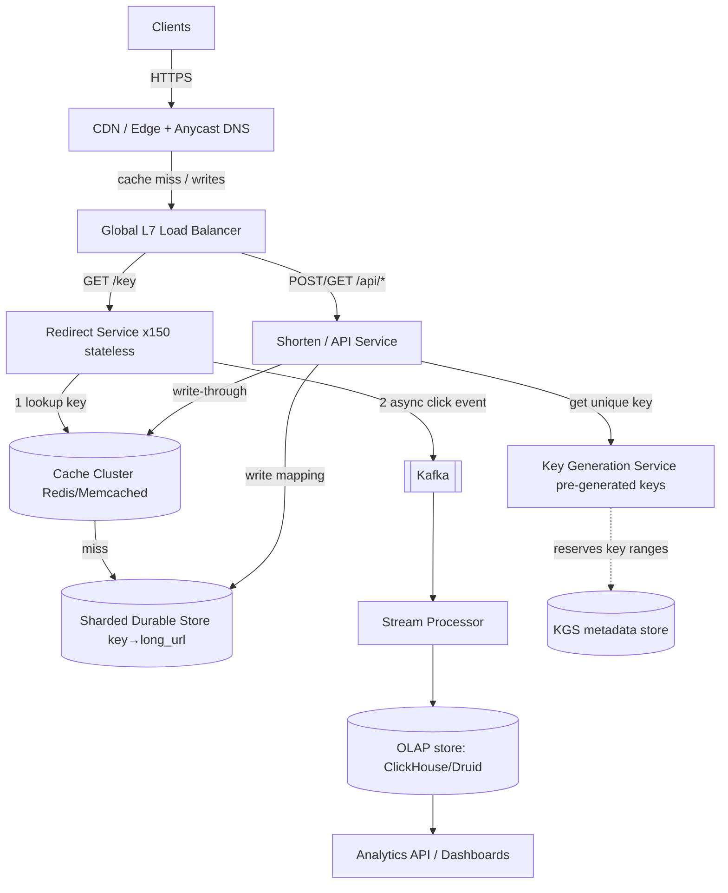
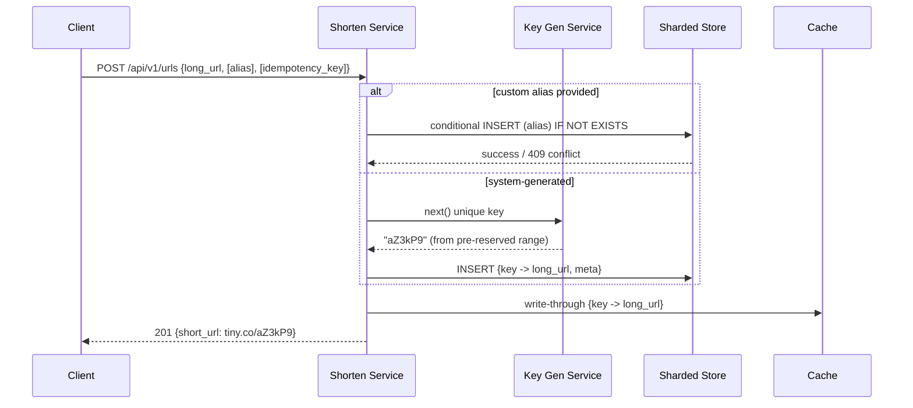
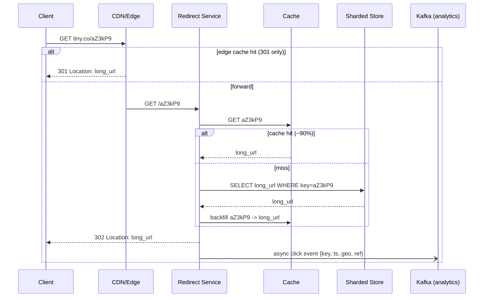
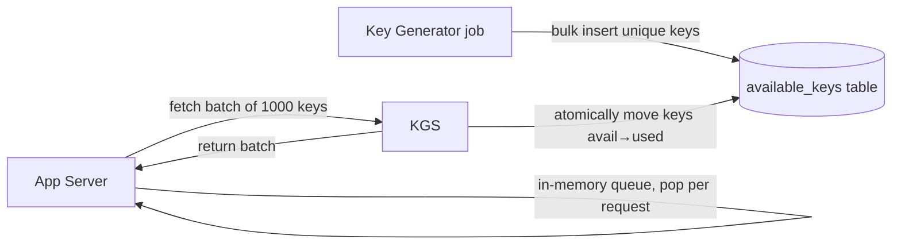
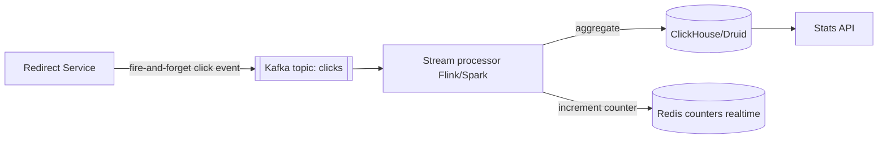

# Design TinyURL / URL Shortener — Staff-Level HLD

> A reference + practice artifact for a senior/staff system-design round. The system: a URL shortener (TinyURL / bit.ly / goo.gl class). We lead with requirements clarification, do real back-of-the-envelope math, draw the architecture, then spend the bulk of the doc on the genuinely hard sub-problems.

---

## 1. Problem & Clarifying Questions

**Restated problem.** Build a service that takes a long URL (e.g. `https://www.example.com/articles/2026/06/distributed-consensus?utm_source=newsletter`) and returns a short URL (e.g. `https://tiny.co/aZ3kP9`). When a user hits the short URL, redirect them to the original long URL. Optionally support custom aliases, expiration, and click analytics.

A URL shortener is the canonical "deceptively simple" interview problem. The naïve version — a hash map behind an HTTP server — is something a junior can build in an afternoon. The *senior* version is about the consequences of scale: a read:write ratio of ~100:1 or worse, billions of stored mappings, sub-50ms redirect latency at the 99th percentile globally, key-generation that never collides and never coordinates on the hot path, and graceful behavior when shards, caches, or regions fail. The judgment is in *where you spend your complexity budget*.

**Clarifying questions I would ask the interviewer first** (before drawing a single box). I group them so the interviewer can answer in batches.

### Functional scope

1. **Core operations** — Is it just (a) shorten a URL and (b) redirect? Or do we also need (c) custom aliases (vanity URLs like `tiny.co/my-brand`), (d) expiration/TTL, (e) deletion/editing of links, (f) link preview pages?
2. **Custom aliases** — If supported, who picks the alias — the user, or the system? Can two users request the same alias (first-come-first-served)? Is there a reserved-word blocklist (e.g. `admin`, `api`, `login`)?
3. **Analytics** — Do we track clicks? At what granularity — total count, or per-click events with geo/referrer/device/timestamp? Real-time dashboards or batch reports? This is often a *separate* sub-system and a common follow-up.
4. **Auth & accounts** — Anonymous shortening, or must users be logged in? Do authenticated users get a dashboard of "my links"? This changes the data model (we need an `owner_id` and a secondary access pattern "list links by owner").
5. **Redirect semantics** — `301` (permanent) or `302` (temporary)? This is a *deep* tradeoff (browser caching vs. analytics vs. revocability) — I'll cover it in the deep dives, but I want to know if the business needs click counts (pushes us to `302`).
6. **Link mutability** — Once created, can a short link be re-pointed to a different long URL? Can it be deleted? This affects caching and consistency.

### Non-functional scope

7. **Scale** — How many *new* URLs per day/month? How many *redirects* (reads) per second at peak? What's the read:write ratio? What's the retention horizon (do links live forever, or expire)?
8. **Latency** — Target p50/p99 for the redirect path? (I'll assume redirect is the SLO-critical path; shortening can be slower.)
9. **Availability** — What's the SLA? Redirects failing is very visible (broken links everywhere). Is 99.9% (~8.8h/yr down) enough, or do we need 99.99% (~52min/yr)?
10. **Consistency** — Is read-after-write required (immediately after I shorten a URL, must the short link work everywhere)? Or is a few seconds of propagation acceptable?
11. **Durability** — Can we ever *lose* a mapping? (Generally no — a lost mapping is a dead link forever. This pushes us to durable, replicated storage.)
12. **Geographic distribution** — Global user base? Multi-region active-active, or single-region with CDN edge caching?

### Out-of-scope (confirm with interviewer)

13. Do we need to **detect/block malicious URLs** (phishing, malware)? Often out of scope for the core design but a great extension and a real-world necessity.
14. **Billing, quotas, enterprise multi-tenancy** — assume out of scope unless raised.
15. **Frontend / web UI** — assume out of scope; we expose APIs.

---

## 2. Requirements (Finalized)

Based on typical interviewer answers, I'll proceed with the following. (In a real interview, state these and get a nod.)

### Functional requirements (FR)

- **FR1** — Given a long URL, return a short URL with a unique short key. Idempotency is optional (a request to shorten the same long URL *may* return a new key — we'll discuss the "dedup" variant in extensions).
- **FR2** — Given a short URL, redirect (`HTTP 302`) to the original long URL.
- **FR3** — Support **custom aliases** (user-supplied short keys), first-come-first-served, with a reserved-word blocklist.
- **FR4** — Support **expiration**: an optional TTL after which the link returns `404`/`410 Gone`. Default: links live "forever" (we'll define a practical 5-year default).
- **FR5** — Track **click analytics** (at least a click count; ideally per-click events) — designed as a decoupled, asynchronous sub-system so it never slows the redirect.
- **FR6** — Authenticated users can list and delete their own links (lightweight; the core design works for anonymous too).

### Non-functional requirements (NFR)

- **NFR1 — Read-heavy.** Redirects dominate. Assume **100:1 read:write**. The entire architecture optimizes the read path.
- **NFR2 — Latency.** Redirect p99 < **50ms** (server-side, excluding client network). Shorten p99 < 200ms is fine.
- **NFR3 — Availability.** **99.99%** for the *redirect* path (it's the visible, business-critical path). Shortening can tolerate slightly lower (99.9%).
- **NFR4 — Durability.** Mappings must never be lost. Replicated storage, multi-AZ, backups. Target 11 nines of durability (think S3/replicated DB class).
- **NFR5 — Consistency.** Read-after-write for the *creator* (when I shorten, my link must work for me immediately). Globally, eventual consistency of a few seconds for replication/cache propagation is acceptable. Custom-alias *uniqueness* must be strongly consistent (no two owners get the same alias).
- **NFR6 — Scalability.** Horizontally scalable; no single component is a hard ceiling. Key-space should not require global coordination on the write hot path.
- **NFR7 — Security.** Rate limiting / abuse prevention, no enumeration of others' links, optional malicious-URL screening.

### Explicit assumptions

- **Scale target:** **100M new URLs/day** (≈ a large public shortener at peak — deliberately aggressive so the math forces real decisions). Read:write 100:1 → **10B redirects/day**.
- **Retention:** 5 years of active links by default.
- **Short key:** alphanumeric, **base62** (`[a-zA-Z0-9]`), length **7** (we'll prove this is enough).
- **Domain:** single short domain `tiny.co` (the short domain itself is small — fewer chars = shorter URL).

> *Term: **base62*** — encoding numbers using 62 symbols (0–9, a–z, A–Z). Each character carries log2(62) ≈ 5.95 bits. It avoids URL-unfriendly characters and is denser than hex (base16) or base36.

---

## 3. Capacity Estimation

Show the arithmetic; round generously; flag assumptions.

### 3.1 Write (shorten) QPS

```
New URLs/day        = 100,000,000
Seconds/day         = 86,400
Average write QPS   = 100,000,000 / 86,400 ≈ 1,157  ≈ 1.2K writes/sec
```

Traffic is bursty. Assume **peak = 3× average** (diurnal + campaign spikes):

```
Peak write QPS      ≈ 3 × 1,200 ≈ 3,500 writes/sec
```

### 3.2 Read (redirect) QPS

```
Read:write          = 100:1
Average read QPS    = 100 × 1,157 ≈ 115,700  ≈ 116K reads/sec
Redirects/day       = 100 × 100M = 10,000,000,000  (10B/day)
Peak read QPS       ≈ 3 × 116K ≈ 350K reads/sec
```

This is the headline number: **~350K redirect QPS at peak**. The read path is where the architecture lives or dies.

### 3.3 Storage

How big is one record? Estimate the fields:

| Field            | Notes                              | Bytes (approx) |
|------------------|------------------------------------|----------------|
| `short_key`      | 7 chars base62                     | 7              |
| `long_url`       | URLs vary; assume avg 100, cap 2KB | 100 (avg)      |
| `created_at`     | timestamp                          | 8              |
| `expires_at`     | timestamp (nullable)               | 8              |
| `owner_id`       | optional                           | 8              |
| `is_custom`/flags| metadata                           | ~10            |
| Row overhead     | indexes, padding                   | ~60            |
| **Total/row**    |                                    | **≈ 200 bytes**|

```
Records/year   = 100M/day × 365 ≈ 36.5 billion/year
Records/5yr    ≈ 182.5 billion ≈ ~1.8 × 10^11 records
Storage/5yr    = 1.8 × 10^11 × 200 bytes
               = 3.65 × 10^13 bytes
               ≈ 36.5 TB of raw row data
```

Add indexes (primary key on `short_key`, secondary on `owner_id`), replication factor 3, and headroom → call it **~150–200 TB** of provisioned storage over 5 years. This is comfortably in the range of a sharded SQL cluster or a wide-column/key-value store; it is **not** "fits on one box."

### 3.4 Key space — is 7 chars enough?

```
62^7 = 3,521,614,606,208 ≈ 3.5 × 10^12  (3.5 trillion keys)
```

We consume ~1.8 × 10^11 (180 billion) keys in 5 years. So 7 chars covers us **~19×** over → keyspace is **~5% utilized** at 5 years. Good: low utilization keeps random-generation collision probability tiny (relevant for the hashing approach). If we ever need more, **8 chars = 62^8 ≈ 218 trillion** — practically unbounded. We'll standardize on **7 chars** and note we can grow to 8 without migration (keys are variable-length; the system reads whatever length it's given).

### 3.5 Bandwidth

**Redirect responses are tiny** — an HTTP 302 with a `Location` header, no body. Estimate ~500 bytes/response (headers).

```
Read egress = 350K QPS × 500 bytes ≈ 175 MB/sec ≈ 1.4 Gbps at peak
```

Write requests carry the long URL (~200 bytes req + small resp):

```
Write ingress ≈ 3,500 QPS × 300 bytes ≈ ~1 MB/sec  (negligible)
```

Bandwidth is modest; the challenge is *QPS and latency*, not bytes. Redirects are CDN-cacheable, which slashes origin bandwidth further.

### 3.6 Memory (cache sizing)

The redirect path should be served from cache. Click distribution is heavily **Zipfian** (a small fraction of links get the vast majority of traffic — a viral link, a campaign). Assume the **hot 20% of links serve ~80–95% of reads** (Pareto / power-law). But "hot set" by *recency* matters more: most redirects hit links created in the last few days/weeks.

Cache the **hot working set**, say the most-recently-active **~1 billion** mappings:

```
Cache entry ≈ key(7B) + long_url(100B) + overhead ≈ ~150 bytes
1B entries × 150 bytes ≈ 150 GB
```

A distributed Redis/Memcached cluster of **~150–300 GB** (with replication) absorbs the hot set. Even sized for the top 100M links (~15–30 GB) we'd get a very high hit ratio; we'll size generously. Target cache hit ratio **> 90%**, so origin DB sees < 35K read QPS — manageable.

### 3.7 Server / shard counts (sanity)

- **Redirect tier (stateless app servers):** if one server handles ~5K redirect QPS (mostly a cache lookup + 302), peak 350K / 5K ≈ **70 servers**, plus 2× headroom and multi-region → ~150 app instances. Trivially horizontally scalable.
- **Cache tier:** ~150–300 GB / ~30 GB per node ≈ **6–10 cache nodes** + replicas.
- **DB shards:** 180B rows / ~few-billion rows per shard. If a shard holds ~5–10B rows comfortably, that's **~20–40 shards** (×3 replicas). Sized by write throughput too: 3,500 write QPS spread over 20+ shards = < 200 writes/sec/shard — easy.

These numbers tell us: **the write side is small; the read side needs caching + CDN + horizontal app tier; storage needs sharding.**

---

## 4. API Design

REST over HTTPS. Two core endpoints + admin/analytics.

### 4.1 Create short URL

```
POST /api/v1/urls
Authorization: Bearer <token>        (optional for anonymous)
Content-Type: application/json

Request:
{
  "long_url": "https://example.com/very/long/path?x=1",
  "custom_alias": "my-brand",         // optional
  "expires_at": "2027-06-25T00:00:00Z", // optional
  "idempotency_key": "uuid-abc"       // optional, for safe retries
}

Response 201 Created:
{
  "short_url": "https://tiny.co/aZ3kP9",
  "short_key": "aZ3kP9",
  "long_url": "https://example.com/very/long/path?x=1",
  "expires_at": "2027-06-25T00:00:00Z",
  "created_at": "2026-06-25T10:00:00Z"
}

Errors:
  400  invalid URL / malformed alias
  409  custom_alias already taken
  422  alias is a reserved word
  429  rate limit exceeded
```

> *Term: **idempotency key*** — a client-supplied unique token; the server records it so a retried request (e.g. after a network timeout) returns the *same* result instead of creating a duplicate. Critical because POST is not naturally idempotent.

### 4.2 Redirect (the hot path)

```
GET /{short_key}                      // e.g. GET /aZ3kP9  on host tiny.co

Response 302 Found:                   // (or 301 — see deep dive 4)
  Location: https://example.com/very/long/path?x=1
  Cache-Control: private, max-age=0   // for 302; different for 301
  (no body)

Errors:
  404  unknown key
  410  Gone (expired/deleted)
```

We serve the redirect on the **bare path** of the short domain (`tiny.co/aZ3kP9`), not under `/api/...`, to keep the short URL short. A lightweight routing rule sends bare-path GETs to the redirect service and `/api/*` to the management service.

### 4.3 Management / analytics

```
GET    /api/v1/urls/{short_key}        // metadata (owner only)
DELETE /api/v1/urls/{short_key}        // soft-delete (owner only)
GET    /api/v1/urls?owner_id=...&cursor=...   // list my links (paginated)
GET    /api/v1/urls/{short_key}/stats  // click count, timeseries, geo, referrers
```

Cursor-based pagination (not offset) for the "list my links" endpoint to stay performant at scale.

---

## 5. High-Level Architecture

### 5.1 Request flows in words

- **Write path:** Client → CDN/edge (pass-through for POST) → Global LB → API/Shorten service → Key Generation Service (gets a guaranteed-unique short key) → write `{key → long_url}` to sharded DB → (write-through) populate cache → return short URL.
- **Read path (hot):** Client → CDN edge (may serve cached 301; for 302 it forwards) → Global LB → Redirect service → Cache lookup (hit ≈ 90%+) → return 302. On cache miss → read from DB shard (by key) → backfill cache → return 302 → fire async click event to analytics pipeline.

### 5.2 ASCII block diagram

```
                                  ┌─────────────────────────────────────────┐
                                  │              Clients (browsers,          │
                                  │           mobile apps, API users)        │
                                  └───────────────┬───────────────────────────┘
                                                  │  HTTPS
                                   ┌──────────────▼───────────────┐
                                   │   CDN / Edge (CloudFront,     │  ← caches 301s & static
                                   │   Cloudflare) + Anycast DNS   │     near users (geo)
                                   └───────┬───────────────┬───────┘
                                  reads/   │               │  writes (pass-through)
                                  cached   │               │
                                   ┌───────▼───────────────▼───────┐
                                   │   Global Load Balancer (L7)    │
                                   │   route: "/" → redirect svc    │
                                   │          "/api/*" → API svc    │
                                   └───────┬───────────────┬───────┘
                          ┌───────────────▼──┐         ┌───▼────────────────────┐
                          │  REDIRECT SERVICE │         │   SHORTEN / API SERVICE │
                          │  (stateless, x150)│         │   (stateless)           │
                          └───┬───────────┬──┘          └──┬──────────────┬───────┘
                              │ 1.lookup  │ 4.async         │ get key      │ write
                              │           │ click event     │              │
                    ┌─────────▼───────┐   │        ┌────────▼─────────┐   │
                    │  CACHE CLUSTER  │   │        │ KEY GENERATION   │   │
                    │ (Redis/Memcache)│   │        │ SERVICE (KGS)    │   │
                    │  hot set ~150GB │   │        │ pre-generated    │   │
                    └─────────┬───────┘   │        │ keys, ranges     │   │
                       miss   │           │        └──────────────────┘   │
                    ┌─────────▼───────────▼───────────────────────────────▼──┐
                    │            SHARDED DURABLE STORE  (key → long_url)       │
                    │   ~20-40 shards × 3 replicas; partitioned by hash(key)   │
                    │   (Cassandra / DynamoDB / Vitess-sharded MySQL)          │
                    └──────────────────────────┬───────────────────────────────┘
                                               │
                              ┌────────────────▼─────────────────┐
                              │   ANALYTICS PIPELINE (async)       │
                              │   Kafka → stream proc → OLAP store │
                              │   (ClickHouse / Druid / BigQuery)  │
                              └────────────────────────────────────┘
```

### 5.3 Mermaid diagram



### 5.4 Sequence diagram — shorten (write)



### 5.5 Sequence diagram — redirect (read, hot path)



---

## 6. Data Model & Storage Choices

### 6.1 Entities & schema

**Primary entity — `url_mapping`:**

| Column        | Type            | Notes                                            |
|---------------|-----------------|--------------------------------------------------|
| `short_key`   | string (PK)     | 7-char base62; the partition/primary key         |
| `long_url`    | string          | up to ~2 KB                                      |
| `owner_id`    | string (null)   | for authenticated users                          |
| `is_custom`   | bool            | true if user-chosen alias                        |
| `created_at`  | timestamp       |                                                  |
| `expires_at`  | timestamp (null)| TTL; null = effectively permanent                |
| `is_deleted`  | bool            | soft delete                                      |

**Secondary access — "list my links":** needs lookup by `owner_id`. Options: a secondary index on `owner_id`, or a separate table/GSI `owner_id → [short_keys]`. Keep this off the hot path.

**Analytics events** live in a *separate* OLAP store, not in the primary mapping store (different access pattern, different lifecycle).

### 6.2 The access patterns drive the choice

The dominant pattern by 100:1 is: **point lookup by `short_key` → return `long_url`.** This is a pure key-value access. The write pattern is: **insert by `short_key`** (and conditional insert for aliases). Secondary patterns (list by owner, stats) are low-volume.

> *Term: **point lookup*** — fetching exactly one row by its primary key. The cheapest possible read; no scan, no join.

### 6.3 Datastore comparison

| Option | Model | Read by key | Write scale | Sharding | Consistency for aliases | Verdict |
|---|---|---|---|---|---|---|
| **Single RDBMS (MySQL/Postgres)** | relational | fast (PK index) | vertical ceiling | manual | easy (UNIQUE constraint) | Fine at small scale; **won't hold 180B rows / 350K read QPS** on one node |
| **Sharded RDBMS (Vitess/Citus)** | relational | fast | horizontal | app/proxy-managed | strong per-shard | Good; operationally heavier; transactions you don't need |
| **Wide-column (Cassandra)** | key→columns | fast point read | excellent, write-optimized | built-in (consistent hashing) | needs LWT for alias uniqueness | Strong fit for KV at scale; tunable consistency |
| **Managed KV (DynamoDB)** | key-value | fast | excellent, auto-scaling | automatic | conditional writes give uniqueness | Excellent fit; least ops; cost at scale |
| **Pure cache only (Redis)** | KV | fastest | RAM-bound | manual | N/A | **Not durable** — only a cache, never the source of truth |

**Decision:** Use a **horizontally-sharded key-value / wide-column store** as the **source of truth** (DynamoDB if cloud-managed is acceptable; Cassandra if self-hosted; Vitess-sharded MySQL if the org standard is relational). **Partition key = `short_key`**, so reads and writes are single-partition point operations that scale linearly with shard count.

**Why this and not a single SQL box:** A single SQL instance fails NFR6 (scalability) and NFR2 (latency at 350K QPS) — it becomes the bottleneck and a single point of failure. The failure mode avoided: **DB saturation / hotspotting** as one node tries to serve all reads. Sharding by `hash(short_key)` spreads load uniformly because short keys are effectively random (base62 of a counter/random space), so **no natural hot shard**.

**Why not relational features:** we have no joins, no multi-row transactions on the hot path, no complex queries. Paying for ACID transactions and relational overhead buys nothing for the dominant access pattern. The one place we *do* need a uniqueness guarantee (custom aliases) is handled by **conditional writes / `INSERT ... IF NOT EXISTS`** at the partition level — cheap and strongly consistent for that single key.

**Caching layer:** Redis/Memcached cluster in front, keyed by `short_key`, holding the hot set (§3.6). Source of truth stays in the durable store; cache is disposable.

---

## 7. Deep Dives (the bulk)

These are the sub-problems that separate a senior answer from a junior one.

---

### Deep Dive 1 — Short-Key Generation (the heart of the design)

We must produce a unique 7-char base62 key per URL. Three families of approaches.

#### Option A — Counter + base62 encode

Maintain a global monotonically increasing 64-bit counter. Encode the counter value in base62 → that's the key. Counter `125` → `cb`, counter `3,521,614,606,207` → a 7-char string.

- **Pros:** Guaranteed unique (counter never repeats). No collisions ever. Compact (counter starts short, grows). Trivial to reason about.
- **Cons:** A *single global counter* is a coordination bottleneck and SPOF. **Sequential keys are enumerable** — `aaaaab` follows `aaaaaa`, so anyone can scrape all links (security/privacy problem) and infer your traffic volume (business-intelligence leak). Distributing the counter is the real work.

> *Term: **enumerable*** — keys that follow a predictable sequence, so an attacker can iterate them to discover URLs they were never given.

**How to distribute the counter (avoid the SPOF / coordination on every write):**
- **Range allocation (the good answer):** A central allocator hands out *ranges* (e.g. server A gets [1, 1,000,000], server B gets [1,000,001, 2,000,000]). Each app server then increments locally with **zero coordination** until it exhausts its range, then requests another. The allocator is hit once per *million* writes, not once per write. This is essentially how Flickr's ticket servers and many ID services work.
- **Counter store options:** a strongly-consistent store (ZooKeeper/etcd counter, a single auto-increment row, or DynamoDB atomic counter) updated only at range-grant time.
- **Fix enumerability:** don't expose the raw counter. **Scramble** it — e.g. a reversible bijection (multiply by a large coprime mod 62^7, or a Feistel/format-preserving permutation) so consecutive counters map to scattered keys. Keys stay unique (bijection) but un-enumerable.

#### Option B — Hashing (MD5/SHA of the long URL, take a prefix)

Hash the long URL, base62-encode, take the first 7 chars.

- **Pros:** Stateless — no counter, no coordination. Same URL → same key (free dedup, if desired).
- **Cons:** **Collisions** — two different URLs (or two truncated hashes) can map to the same 7-char prefix. Birthday-bound: with 3.5×10^12 keyspace and 1.8×10^11 inserts, expected collisions are non-trivial and *grow* as we fill. Must check-and-retry on collision (read-before-write → extra latency and a race). Same-URL-same-key also breaks per-user custom links and leaks that two users shortened the same URL. Truncation throws away hash bits, raising collision odds.

**Collision handling:** on insert, attempt write `IF NOT EXISTS`; on conflict, perturb input (append a salt/counter) and rehash, retry. This adds an extra round-trip and a retry loop precisely when the system is busy.

#### Option C — Pre-generated Key Service (KGS) — the recommended approach

A standalone **Key Generation Service** pre-computes a large pool of unique random 7-char base62 keys **offline/ahead of time** and stores them in a "available keys" table. App servers request keys in **batches** (e.g. 1,000 at a time), mark them "used," and hand them out with no per-write coordination.



- **Generation:** randomly generate candidate 7-char keys, dedup against the keyspace (since utilization is ~5%, random generation almost never collides; rejection sampling is cheap). Or generate by permuting a counter (bijection) so they're guaranteed unique by construction *and* non-sequential.
- **Handing out:** KGS keeps two tables (or two states): `available` and `used`. A batch fetch atomically moves keys from available→used. App server caches the batch in memory; each shorten request pops one key — **O(1), no I/O, no coordination on the hot path.**
- **Concurrency:** the only contention is the periodic batch fetch (once per 1,000 writes per server), guarded by an atomic update / transaction in the KGS store. No two servers ever get the same key because keys are moved to `used` atomically when fetched.
- **Edge cases:** if an app server crashes after fetching a batch but before using all keys, those keys are *lost* (marked used but never assigned). That's fine — we have 3.5 trillion keys; leaking a few thousand on each crash is negligible. **No correctness problem, just a tiny, bounded waste.**
- **Running out:** monitor `available` count; a background job replenishes it well ahead of exhaustion. With 7 chars we have 19× headroom; we can also expand to 8 chars seamlessly.

#### Tradeoff table

| Dimension | A: Counter+base62 | B: Hashing | C: Pre-gen KGS |
|---|---|---|---|
| Uniqueness guarantee | Yes (counter) | No (collisions) | Yes (by construction) |
| Coordination on hot path | None *if* range-allocated | None | None (batch fetch only) |
| Collision handling | N/A | Required (retry loop) | N/A |
| Enumerable / leaks volume | Yes unless scrambled | No | No (random) |
| Read-before-write needed | No | Yes (collision check) | No |
| Statefulness | Counter + ranges | Stateless | Key pool store |
| Custom-alias coexistence | Easy | Awkward (same URL→same key) | Easy |
| Operational complexity | Medium (range allocator) | Low | Medium (KGS + replenish) |

**Decision: Pre-generated Key Service (C),** with keys generated as a **bijection of a counter** (so they are both guaranteed-unique and non-sequential). 

- **Why over B (hashing):** avoids the **collision-retry failure mode** — read-before-write on the busy path, which causes a thundering-herd of retries under load and a latency cliff exactly when traffic spikes. KGS removes collisions by construction.
- **Why over plain A:** avoids the **SPOF/coordination failure mode** and the **enumeration leak**. (Range-allocated + scrambled counter, Option A done well, is genuinely close to KGS — I'd accept it as an alternative and would say so in the interview. KGS edges it out because handing out a pre-built pool isolates generation from serving and makes the hot path a pure in-memory `pop()`.)

The defended bottom line: **the hot write path must be a coordination-free, collision-free O(1) operation.** KGS delivers exactly that.

---

### Deep Dive 2 — The Read-Heavy Redirect Path (caching + CDN)

350K peak read QPS, p99 < 50ms. The DB alone can't (and shouldn't) absorb this.

**Layered caching, outermost first:**

1. **CDN / edge caching (geo-local).** Place the redirect behind a CDN with PoPs near users. For **`301` (permanent)** redirects, the CDN (and the browser) can cache the `Location` itself — subsequent hits never reach our origin at all. This is the single biggest lever: a viral link served almost entirely from the edge. *Caveat:* caching at the edge kills per-click analytics and makes the link uneditable until caches expire — see Deep Dive 4 (301 vs 302).
2. **Application-tier distributed cache (Redis/Memcached).** For `302` flows (which forward to origin), the redirect service does a cache `GET short_key`. Hit ratio target > 90% (Zipfian + recency working set, §3.6). Hit → return 302 in single-digit ms. Miss → fall through to DB, then backfill.
3. **Local in-process cache (optional).** A small LRU on each redirect server for the *extremely* hot keys (top-N viral links) avoids even a network hop to Redis. Guarded TTL to bound staleness.

> *Term: **cache stampede / thundering herd*** — when a popular key expires or a cold cache restarts, thousands of concurrent requests all miss and hit the DB simultaneously, possibly overwhelming it.

**Cache strategy details:**
- **Population:** *write-through* on shorten (so the creator's own immediate redirect is a hit — satisfies read-after-write NFR5) plus *read-through* backfill on miss.
- **Eviction:** LRU. The working set is recency-skewed, so LRU naturally keeps hot links.
- **TTL:** for 302 flows, a modest TTL (e.g. minutes–hours) bounds staleness if a link is edited/deleted; combine with explicit invalidation on edit/delete.
- **Stampede protection:** use *request coalescing* (single-flight) so only one request per key repopulates on miss; the rest wait for that result. Optionally *probabilistic early expiration* to refresh hot keys before they expire.
- **Negative caching:** cache 404s briefly so a flood of requests for a non-existent key doesn't all hammer the DB (defends against enumeration scans). Bound the TTL so a newly-created key isn't masked.

**Why caching here (failure mode avoided):** Without it, 350K QPS hits the DB directly → DB CPU/IO saturation → latency blows past 50ms → cascading timeouts. The cache turns 350K QPS into < 35K DB QPS. The CDN can drop that further for 301-cacheable links.

**Latency budget (302, cache hit):**
```
client→edge          ~ varies (geo)
edge→LB→redirect svc ~ few ms
cache GET            ~ 1-2 ms
build 302 + return   ~ <1 ms
async fire to Kafka  ~ off the critical path (fire-and-forget)
-------------------------------------------
server-side p99 target < 50ms  ✓ (typically <10ms on hit)
```

---

### Deep Dive 3 — Sharding the Key Space & Storage at Scale

180B rows, 350K read / 3.5K write QPS. One node can't hold it.

**Partitioning scheme.** Partition by **`hash(short_key)`** (consistent hashing / managed auto-partitioning).

- **Why hash, not range:** Range-partitioning by key prefix (`a*` on shard 1, `b*` on shard 2…) creates **hot shards** if generation isn't uniform, and worse, sequential/counter keys would all land on the *current* shard — a write hotspot. Hashing the (random, KGS-generated) key spreads reads and writes **uniformly** across shards. Failure mode avoided: **hot-shard saturation** under correlated traffic.
- **Reads & writes are single-partition point operations** → linear scale-out. Add shards → capacity grows; no cross-shard joins exist on the hot path.

> *Term: **consistent hashing*** — a hashing scheme where adding/removing a node remaps only a small fraction of keys (≈ 1/N), instead of reshuffling everything. Enables smooth horizontal scaling.

**Custom aliases on a sharded store.** The alias *is* the key, so it lands on `hash(alias)`'s shard. Uniqueness is enforced **per-partition** via conditional write (`PutItem ... attribute_not_exists`, or `INSERT IF NOT EXISTS` / Cassandra LWT). Because the alias maps to exactly one shard, this is a **single-shard strongly-consistent operation** — no distributed transaction needed. Failure mode avoided: two users racing for `tiny.co/sale` — the conditional write makes exactly one win, the other gets 409.

**Resharding / rebalancing.** Use a managed store (DynamoDB) or consistent hashing (Cassandra) so adding capacity doesn't require a stop-the-world migration. With Vitess, use its resharding workflow. Plan shard count with headroom (start at, say, 32 shards) so we resize rarely.

**Replication for durability & availability.** RF = 3 across AZs. Reads can use a replica (tunable consistency); writes go to the leader/quorum. Loss of one replica/AZ doesn't lose data or take the system down (NFR3, NFR4).

**Storage tiering / cost.** Old, expired, or never-clicked links can be moved to cheaper cold storage and purged after TTL (Deep Dive 5). Keeps the hot store lean and fast.

---

### Deep Dive 4 — 301 vs 302 Redirects (a genuine tradeoff)

This looks trivial and isn't. It's a direct collision between **performance**, **analytics**, and **control**.

| | **301 Moved Permanently** | **302 Found (temporary)** |
|---|---|---|
| Browser/CDN caching | Aggressively cached; future hits skip our server | Not cached (by default); every hit reaches us |
| Server load | **Much lower** (edge/browser serve repeats) | Higher (we see every click) |
| Click analytics | **Lost** for cached hits (we never see them) | **Captured** (every click hits us) |
| Editability / revocation | Hard — cached 301 sticks until cache expires; can't easily re-point or kill a link | **Easy** — every hit re-checks the DB, so edits/deletes take effect immediately |
| SEO link equity | Passes more | Passes less |

> *Term: **301 vs 302*** — `301` tells clients "this move is permanent, cache it." `302` says "temporary, ask again next time." The status code dictates whether intermediaries cache the redirect.

**Decision: default to `302`** for a feature-rich shortener.

- **Why:** Most product requirements (FR5 analytics, FR4 expiration, link editing/revocation, abuse takedown) **require that we see every click and retain control**. A cached `301` makes a link essentially immortal and invisible to us — we couldn't kill a phishing link or count clicks. Failure mode avoided: **an un-revocable, un-measurable link** that, once cached widely, we can no longer change or take down.
- **When to choose `301`:** if a deployment cares only about raw redirect performance and not analytics/editability (e.g. a permanent internal link service), `301` + CDN caching gives the cheapest, fastest path. We could even offer per-link choice: "permanent" links use `301`, default links use `302`.

We pair `302` with our own caching (Deep Dive 2) to recover most of the performance `301` would have given us, without surrendering control.

---

### Deep Dive 5 — Analytics & Expiration (decoupled subsystems)

#### Analytics (FR5) — never slow the redirect

The redirect must return in < 50ms. Recording a click must therefore be **asynchronous and fire-and-forget**.



- On each redirect, the service emits a click event `{short_key, ts, ip→geo, user_agent→device, referrer}` to **Kafka** (a durable, high-throughput log). This is non-blocking; if Kafka is briefly unavailable we can drop or buffer locally — losing a few analytics events is acceptable, **never block the redirect**.
- A **stream processor** consumes the topic, enriches (GeoIP, UA parsing), and writes (a) real-time counters to Redis (live click count) and (b) aggregated rows to an **OLAP store** (ClickHouse/Druid/BigQuery) for time-series, geo, and referrer breakdowns.
- **Why a separate OLAP store:** analytics queries (group-by, time-bucketing, top-N) are scans/aggregations — the opposite of the point-lookup pattern of the mapping store. Mixing them would pollute the hot path's cache and IO. Failure mode avoided: **analytics queries starving the redirect path.**
- **Scale:** 10B clicks/day = ~116K events/sec avg (350K peak). Kafka and ClickHouse handle this comfortably; we partition Kafka by `short_key`.

#### Expiration (FR4)

- Store `expires_at`. On redirect, the service checks it; if expired → return `410 Gone` and (lazily) evict from cache.
- **Active purge:** a background job sweeps expired rows (or rely on the store's native TTL — DynamoDB TTL, Cassandra TTL) to reclaim storage. Lazy check on read + TTL-driven physical delete = no expensive global scans.
- **Cache coherence:** when a link is edited/deleted/expired, **explicitly invalidate** the cache entry (and short cache TTLs bound the window). For 302 flows the next read re-checks the DB anyway.

---

## 8. Scaling & Bottlenecks

How it scales, **where it breaks first**, and how each bottleneck is removed.

| Component | Breaks first when… | Symptom | Fix |
|---|---|---|---|
| **DB read load** | Cache hit ratio drops / cold cache | DB CPU & latency spike | Bigger cache, request coalescing, more read replicas, CDN 301 caching |
| **Single counter (if Option A)** | Every write coordinates | Write throughput ceiling, SPOF | Range allocation / KGS (we chose KGS) |
| **Hot shard** | Range-partitioning or popular alias prefix | One shard saturates | Hash-partition (we do); cache the hot key in-process |
| **Cache node** | A single hot key all on one node | That node's CPU/NIC saturates | Replicate hot keys; local in-process LRU; consistent-hash spread |
| **Redirect app tier** | QPS exceeds instances | Latency/queueing | Stateless → autoscale horizontally |
| **Analytics pipeline** | Click spike | Kafka lag, consumer backlog | Scale partitions/consumers; it's async so redirects unaffected |
| **Key pool exhaustion** | Available keys run low | Shorten failures | Replenish job + alert; expand to 8 chars |
| **Cross-region latency** | Global users hit one region | High p99 far from origin | Multi-region active-active + Anycast + edge cache |

**Scaling story in one breath:** redirect tier is stateless (scale out), reads are absorbed by CDN + cache (90%+), the durable store is hash-sharded (linear scale-out), key generation is coordination-free (KGS batches), and analytics is decoupled (async, independently scalable). The first thing to watch is **cache hit ratio** — it's the lever that keeps DB load sane.

**Multi-region.** For a global audience: replicate the mapping store across regions (active-active KV with eventual consistency works because mappings are immutable after creation — a created key's `long_url` rarely changes). Route users to the nearest region via Anycast/GeoDNS. Custom-alias uniqueness across regions needs care: either route all writes for alias-uniqueness through a primary region, or accept a tiny conflict window and resolve deterministically. System-generated keys never conflict (KGS partitions the keyspace per region — e.g. region A draws from one counter range, region B from another).

---

## 9. Reliability, Consistency & Security

### Reliability / failure handling

- **Stateless app tiers** → any instance can serve any request; health-checked behind the LB; autoscaled.
- **Storage RF=3 across AZs** → tolerate node/AZ loss without data loss or downtime (NFR3/NFR4).
- **Cache failure is survivable** → cache is not the source of truth; a cache outage degrades to higher DB load (we size DB to survive a cache cold-start, or shed/rate-limit during recovery). *Defensive:* warm the cache progressively; use request coalescing to prevent stampede on cold start.
- **KGS failure** → app servers hold an in-memory batch (buffer) of keys, so a brief KGS outage doesn't stop shortening; KGS itself is replicated. Lost batches are harmless (bounded keyspace waste).
- **Graceful degradation** → if analytics (Kafka) is down, drop click events; redirects keep working. If the DB is degraded, serve from cache; fail shorten before failing redirect (protect the read SLO).

### Consistency model

- **Mappings are effectively immutable** after creation (long_url rarely changes), which is why eventual consistency across replicas/regions is acceptable for reads.
- **Read-after-write for the creator** (NFR5) satisfied by **write-through cache** + writing to the leader/quorum the creator's read will hit.
- **Custom-alias uniqueness is strongly consistent** via single-shard conditional write (the alias maps to one partition).
- **Cache staleness** bounded by TTL + explicit invalidation on edit/delete.

### Security & abuse

- **Rate limiting** on the shorten API (token bucket per API key / per IP) — prevents a single actor from minting millions of links or exhausting the key pool. **Sliding-window / token-bucket** at the edge.
- **No enumeration:** keys are random (KGS), not sequential — attackers can't iterate to discover links. Negative caching + rate limiting blunt scanning. Management endpoints require auth and scope to `owner_id` (you can't read someone else's link metadata).
- **Malicious URL screening (extension):** check submitted URLs against safe-browsing/phishing feeds at creation time and asynchronously; quarantine or block. Provide an interstitial warning page for suspicious links. Allow takedown (delete + cache-invalidate) — which is *why* we chose 302 (revocability).
- **Input validation:** validate the long_url scheme (`http/https` only — block `javascript:`, `data:` URIs to prevent XSS via redirect), cap length, reject self-referential loops (`tiny.co` → `tiny.co`).
- **HTTPS everywhere; HSTS.** Don't leak the long_url in logs at non-debug levels (privacy).
- **Idempotency** on POST via idempotency key → safe client retries without duplicate links.
- **DDoS:** CDN/edge absorbs volumetric attacks; rate limit + autoscale the origin.

---

## 10. Extensions & Follow-ups

Realistic variations an interviewer adds and how each changes the design.

1. **"Dedup — same long URL should return the same short key."** Add a reverse index `hash(long_url) → short_key`; on shorten, look it up first. Tradeoff: extra write/read and a uniqueness constraint; breaks per-user vanity links and leaks that two users shortened the same URL. Often *not* desired (each user/campaign wants its own trackable link). I'd default to **no dedup** unless asked.
2. **"Per-user link expiration & editing."** Already supported via `expires_at` + 302 (re-checks DB). Editing a link's target: update the row, invalidate cache. The 302 choice pays off here.
3. **"Real-time top-N trending links."** Stream processor maintains a sliding-window top-N (count-min sketch / approximate heavy hitters) in Redis. Approximate is fine and far cheaper than exact.
4. **"Geo-targeted redirects."** Same key redirects to different targets by user geo/device. Store a small rules table per key; redirect service evaluates rules. Adds branching to the hot path — keep rules in cache with the mapping.
5. **"Vanity domains / multi-tenant (custom branded domains)."** Key becomes `(domain, short_key)`; partition by `hash(domain, key)`. Per-tenant blocklists and quotas.
6. **"What if a single link goes mega-viral (1M QPS on one key)?"** Hot-key problem. Solution: replicate that key across all cache nodes / pin to local in-process LRU on every redirect server; serve from edge with short-TTL 301 if analytics can tolerate sampling. The DB never sees it.
7. **"Guarantee exactly-once analytics."** Hard and usually unnecessary; at-least-once + idempotent aggregation (dedup by event id) gives accurate-enough counts. Push back: is exact count worth the cost? Usually no.
8. **"Strong global consistency for aliases."** Route alias-creation through a single primary region (or a global coordination service) to serialize uniqueness; accept slightly higher write latency for aliases only. System keys stay region-local.
9. **"Shorten in offline/mobile clients."** Pre-issue key batches to trusted clients from KGS (same batch model), so they can mint links offline and sync later.

---

## 11. Interview Q&A

**Q1. Why not just hash the URL to make the key?**
Hashing collides — two URLs (or two truncated hashes) can produce the same 7-char prefix, forcing a read-before-write collision check and a retry loop that thunders under load. It also makes "same URL → same key," which leaks information and breaks per-user vanity links. A pre-generated key service gives uniqueness by construction with no hot-path coordination.
*Probe — "But hashing is stateless; isn't that simpler?"* Yes, simpler, but the collision-retry latency cliff under load is a worse failure mode than running a small KGS. If they insist on stateless, I'd use a counter-bijection (unique by construction, non-sequential) which is also coordination-light.

**Q2. How do you avoid a single-counter bottleneck/SPOF?**
Don't increment a global counter per write. Either (a) range allocation — servers grab a million-key range and increment locally, hitting the allocator once per million writes — or (b) a KGS handing out pre-built key batches. Both make the hot path coordination-free.
*Probe — "What if a server dies mid-range?"* The unused keys in its range are wasted. With 3.5T keys that's negligible; no correctness impact.

**Q3. 301 or 302, and why?**
Default 302. We want every click (analytics) and the ability to edit/expire/revoke links (abuse takedown). A cached 301 makes links immortal and invisible to us. We recover performance with our own CDN/cache layer. Offer 301 only for "permanent, analytics-not-needed" links.
*Probe — "Doesn't 302 cost more server load?"* Yes, which is why we cache aggressively (90%+ hit) and put it behind a CDN; we accept the cost to keep control and analytics.

**Q4. How do you serve 350K redirect QPS at < 50ms?**
Layered caching: CDN/edge (geo-local), distributed Redis (hot set ~150GB, >90% hit), optional in-process LRU for viral keys. Cache miss falls through to a hash-sharded KV store (point lookup). Stateless redirect tier autoscales. The DB sees < 35K QPS.
*Probe — "Cold cache after a deploy?"* Request coalescing (single-flight) per key prevents stampede; warm progressively; DB sized to survive the spike.

**Q5. How do you shard the storage, and why hash not range?**
Partition by `hash(short_key)`. Random keys + hashing → uniform load, no hot shard. Range-partitioning would concentrate sequential/counter keys on one shard (write hotspot) and risk hot prefixes. Reads/writes stay single-partition point ops → linear scale-out.
*Probe — "How do custom aliases stay unique when sharded?"* The alias is the key, so it maps to exactly one shard; a single-shard conditional write (`IF NOT EXISTS`) enforces uniqueness strongly without a distributed transaction.

**Q6. How does analytics not slow redirects?**
Fire-and-forget click event to Kafka; a stream processor aggregates into an OLAP store and Redis counters. Redirect never blocks on it; if Kafka is down we drop events rather than block. Analytics queries live in a separate OLAP store so they never touch the hot path's cache or IO.
*Probe — "Exactly-once counts?"* At-least-once + idempotent aggregation by event id; exact is rarely worth the cost.

**Q7. (Senior signal) Where does this design break first, and what do you do?**
Cache hit ratio is the canary. If it drops (cold cache, working-set shift), DB load surges. Mitigations: bigger/replicated cache, request coalescing, more read replicas, push more to CDN via 301-eligible links. The single most important metric to alert on.

**Q8. (Senior signal) What's your consistency model and why is eventual consistency safe here?**
Mappings are effectively immutable after creation, so replica/region lag doesn't cause wrong answers for reads. We give the creator read-after-write via write-through cache. The only place we need strong consistency is alias uniqueness, which is a single-shard conditional write. We deliberately don't pay for global strong consistency we don't need.

**Q9. (Senior signal) Why a separate OLAP store instead of counting clicks in the main DB?**
Access patterns are opposite: mapping store does point lookups (latency-critical); analytics does scans/aggregations/group-bys. Co-locating them would let heavy analytic queries evict hot mapping cache entries and contend for IO, blowing the redirect SLO. Decoupling isolates failure and lets each scale on its own axis.
*Probe — "Isn't two stores more ops?"* Yes, but the isolation is worth it; managed OLAP (BigQuery/ClickHouse Cloud) keeps the ops cost low.

**Q10. How do you prevent abuse and link enumeration?**
Keys are random (KGS), so not enumerable. Rate-limit the shorten API (token bucket per key/IP), negative-cache 404s, require auth + owner-scoping on management endpoints, validate/screen submitted URLs (block `javascript:`/`data:`, check phishing feeds), and support takedown — which 302 makes effective.

---

## 12. Cheat-Sheet & Self-Test

### Dense recap

- **Scale:** 100M new URLs/day → ~1.2K avg / 3.5K peak **write** QPS. 100:1 reads → 10B/day → ~116K avg / **350K peak read** QPS.
- **Key:** 7-char **base62**; `62^7 ≈ 3.5×10^12` keys; 5-yr use ~1.8×10^11 → **~5% utilized** (19× headroom; grow to 8 chars if needed).
- **Storage:** ~200 B/row × 180B rows ≈ **36.5 TB raw**, ~150–200 TB with replication/indexes.
- **Cache:** hot set ~1B entries × ~150 B ≈ **~150 GB**; target **>90% hit** → DB sees <35K read QPS.
- **Key gen:** **Pre-generated Key Service** (keys = bijection of a counter → unique + non-sequential), batch-fetched → **coordination-free, collision-free O(1)** on the hot path. (Range-allocated scrambled counter is the acceptable alternative.)
- **Storage choice:** hash-sharded **KV / wide-column** (DynamoDB / Cassandra / Vitess), partition by `hash(short_key)`; point lookups; conditional write for alias uniqueness (single-shard, strongly consistent).
- **Redirect:** **302** by default (analytics + editability + revocation); recover perf with CDN + Redis + in-process LRU. 301 only for permanent/no-analytics links.
- **Analytics:** async **Kafka → stream proc → OLAP (ClickHouse/Druid)**; never blocks redirect.
- **Expiration:** `expires_at` + lazy check on read + native TTL purge; cache invalidation on edit/delete.
- **Scaling order of failure:** cache hit ratio → DB read load → hot key/shard → app tier. Fixes: cache/CDN, replicas, hot-key replication, autoscale.
- **Consistency:** eventual (mappings immutable); read-after-write via write-through; strong only for alias uniqueness.
- **Security:** random keys (no enumeration), rate limiting, owner-scoped management, URL scheme validation + phishing screening, idempotent POST.

### Diagram-in-words

Client → CDN/Anycast → Global L7 LB → {Redirect svc → Cache → (miss) Sharded KV → backfill; async click → Kafka → OLAP} for reads; {API svc → KGS for key → Sharded KV → write-through cache} for writes.

### Self-test (no answers)

1. Derive the peak write and read QPS from 50M new URLs/day at a 200:1 read:write ratio with a 4× peak factor. How many cache GB for the top 500M links at 180 B/entry?
2. An interviewer mandates strict read-after-write **globally** (any region, immediately). What breaks in the eventual-consistency design, and what would you change?
3. A single short link is featured on a TV ad and spikes to 2M QPS on that one key. Trace exactly which components see load and how you keep p99 < 50ms.
4. You must guarantee that two users in two regions can never both claim the alias `tiny.co/superbowl`. Design the uniqueness mechanism and state its latency cost.
5. The product wants exact (not approximate) click counts per link, never over- or under-counting, even across retries and consumer restarts. Sketch the pipeline and call out where it gets expensive.
