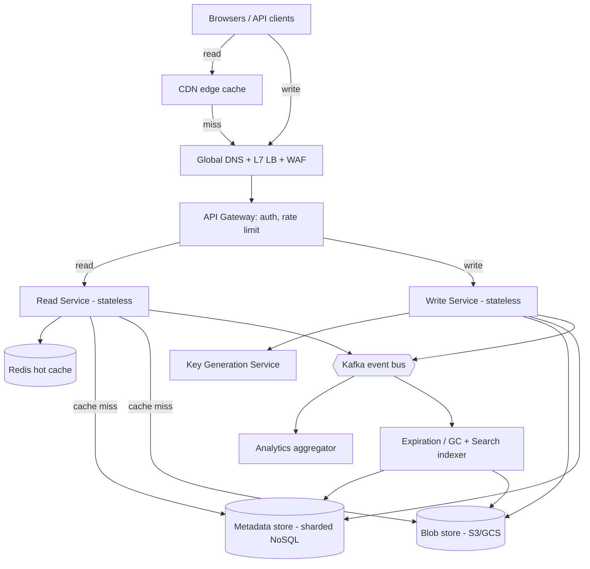
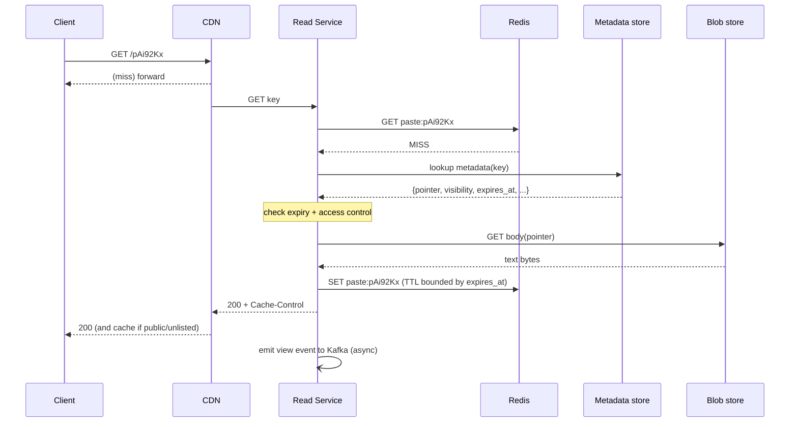
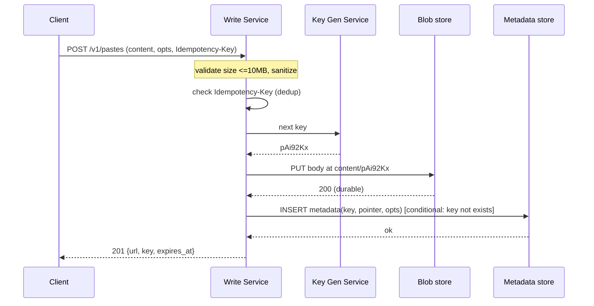

# Design Pastebin — High-Level Design (Staff/Principal Interview Reference)

> **Category:** Storage & Infrastructure
> **System:** Pastebin — a service where a user submits a block of text (a "paste"), receives a short shareable URL, and anyone with the URL can read the paste back. Think `pastebin.com`, `gist.github.com`, `hastebin`, `dpaste`.

This document is written as a *senior/staff system-design round* answer. It leads with requirements clarification, shows the back-of-the-envelope arithmetic, draws the architecture two ways, and then spends most of its length on the genuinely hard sub-problems with defended decisions.

---

## 1. Problem & Clarifying Questions

### 1.1 Restating the problem

Pastebin is, at its core, a **write-once-read-many key/value store with a human-shareable handle**. A user pastes text, we mint a short opaque key (e.g. `pAi92Kx`), persist the text plus some metadata, and return a URL like `https://pb.io/pAi92Kx`. Subsequent `GET`s on that key return the text (rendered as HTML or as raw bytes). Pastes may expire, may be private/unlisted, and we want view analytics.

The deceptively simple part is the CRUD. The interesting parts — the parts a staff interview actually probes — are:

- **Where does the blob live?** A 1 KB tweet and a 10 MB log dump are both "a paste." Storing both rows in a relational DB is wrong.
- **How do we mint keys** that are short, collision-free, unguessable-enough, and generatable at high QPS without a coordination bottleneck?
- **The read path is the whole product.** Reads dominate writes by ~10–100×. Caching, CDN, and read replicas are where the design lives or dies.
- **Expiration/TTL at scale** — deleting billions of objects lazily without a sweeper meltdown.
- **Access control** — private vs unlisted vs public, and the subtle security difference between them.

### 1.2 Clarifying questions I'd ask the interviewer first

Before drawing a single box, I'd establish scope. I'd group questions and explicitly say "I'll assume X unless you steer me otherwise," so the interview keeps moving.

**Functional scope**
1. Is this **anonymous-first** (like pastebin.com) or **account-required** (like GitHub gists)? This decides whether we even have a user/auth subsystem in v1.
2. Do we need **edit/update** of an existing paste, or is a paste **immutable** once created? (Immutability dramatically simplifies caching and consistency.)
3. **Visibility levels:** public (listed/searchable), unlisted (link-only), private (owner-only)? Do we need a public "recent pastes" feed?
4. Do we need **syntax highlighting / language detection**, or is raw text enough for v1?
5. **Expiration:** user-selectable TTL (10 min / 1 day / 1 month / never)? "Burn after reading" (delete on first view)?
6. Do we need **view analytics** (view count, geo, referrer), and how real-time must they be?
7. **Deletion:** can a user delete their own paste? Do we need a delete-key for anonymous pastes?

**Non-functional scope**
8. What's the **read:write ratio**? (I'll assume heavily read-skewed.)
9. **Latency target** for reads? (Pastebin is content; I'll target p99 < 100–200 ms.)
10. **Availability target?** Is a few minutes of read-unavailability acceptable, or is this 99.99%?
11. **Consistency:** is **read-after-write** required for the *creator* (they paste, immediately open the link)? Is eventual consistency fine for *other* readers?
12. **Durability:** can we ever lose a paste? (I'll assume durability is important — losing user content is a trust killer — target ≥ 99.999999999% / "11 nines" via the blob store.)

**Scale**
13. **DAU and pastes/day?** Expected **max paste size** (KB? MB? 10 MB?)?
14. **Retention** — how long do non-expiring pastes live? Forever?
15. **Geographic distribution** — single region or global? (Affects CDN, multi-region replication.)

**Out of scope (confirm)**
16. Rich collaboration / real-time co-editing (that's a different system — Google Docs / OT/CRDT). Confirm out.
17. Full-text search across all pastes (huge feature; confirm out for v1, note as extension).
18. File uploads / binary attachments (confirm text-only v1).

### 1.3 Assumptions I'll proceed with

If the interviewer is hands-off, I lock these:

- **Anonymous-first**, optional accounts. Pastes are **immutable** (edit = create-new + redirect). This is the single most important simplifying assumption — see deep dives.
- Visibility: **public / unlisted / private**. Private requires auth.
- **TTL** selectable: `10m`, `1h`, `1d`, `1w`, `1M`, `1y`, `never`. Plus **burn-after-reading**.
- **Max paste size: 10 MB** (hard cap). Typical paste ~ 10 KB.
- **Reads dominate:** 10:1 read:write at minimum, often higher for viral pastes.
- **Latency:** read p99 < 150 ms (cache/CDN hit < 30 ms). Write p99 < 300 ms.
- **Availability:** 99.99% for reads (≈ 52 min/yr), 99.9% for writes (writes can degrade more gracefully).
- **Consistency:** read-after-write for the creator's own paste (strong-ish for the create→read flow); eventual for everyone else and for analytics.
- **Durability:** 11 nines on blob content (object storage gives this).
- **Global** audience; CDN-fronted reads; primary writes in one region with async cross-region replication in v2.

---

## 2. Requirements (finalized)

### 2.1 Functional

- **FR1 — Create paste:** accept text (≤ 10 MB) + options (TTL, visibility, optional language, optional title, optional custom alias for premium). Return a short URL.
- **FR2 — Read paste:** given a key, return the content (HTML-rendered or raw via `?raw=1` or `Accept: text/plain`).
- **FR3 — Expiration:** paste becomes unreadable (404/410) after its TTL; burn-after-reading deletes on first successful read.
- **FR4 — Visibility:** public (may appear in feeds), unlisted (link-only, not listed/indexed), private (owner-authenticated only).
- **FR5 — Delete:** owner (or holder of delete-key for anon) can delete a paste.
- **FR6 — Analytics:** per-paste view count (eventually consistent), basic aggregates.
- **FR7 — Optional accounts:** see own pastes, manage them.

### 2.2 Non-functional

| Property | Target | Rationale |
|---|---|---|
| **Read latency** | p99 < 150 ms; cache/CDN hit < 30 ms | Content product; reads are the experience |
| **Write latency** | p99 < 300 ms | Acceptable to do slightly more work on the rarer path |
| **Read availability** | 99.99% | Broken links erode trust fast |
| **Write availability** | 99.9% | Create can fail-retry; less critical than read |
| **Durability** | ≥ 11 nines for blob content | Never silently lose user content |
| **Consistency** | Read-after-write for creator; eventual elsewhere | Creator must see their own paste immediately |
| **Scalability** | Horizontal on every tier | No single vertical bottleneck |
| **Security** | Unlisted = unguessable keys; private = authz on every read | Different threat models per visibility |

> **Term — read-after-write consistency:** after a successful write, a subsequent read by the same client is guaranteed to see that write. We need it for the *creator opening their own new link* but can relax it for third parties.

### 2.3 Explicit assumptions (recap, load-bearing)

- Pastes immutable. Max 10 MB. Reads ≫ writes. Global, CDN-fronted. 11-nines durability on content via object storage. Eventual consistency on analytics.

---

## 3. Capacity Estimation

I'll size for a **mid-large public Pastebin**. I'll flag every assumed input.

### 3.1 Traffic (assumed inputs in **bold**)

- **New pastes/day = 10 million** (≈ pastebin.com order of magnitude).
- Writes/sec (avg) = 10,000,000 / 86,400 ≈ **116 writes/sec**.
- **Peak factor = 5×** → **~580 writes/sec peak**.
- **Read:write = 100:1** (content goes viral; many reads per paste).
- Reads/sec (avg) = 116 × 100 ≈ **11,600 reads/sec**.
- Reads/sec (peak) = 580 × 100 ≈ **58,000 reads/sec** ≈ **~60K RPS read peak**.

> Reads dominate by two orders of magnitude. **Every architectural dollar goes to the read path.**

### 3.2 Storage

- **Average paste size = 10 KB** (most pastes are small snippets; the 10 MB cap is the tail).
- Content/day = 10M × 10 KB = **100 GB/day**.
- Metadata/day: key, owner, visibility, ttl, created_at, size, content_pointer, language, title ≈ **~500 bytes/paste** → 10M × 500 B = **5 GB/day** metadata.
- **Annual content:** 100 GB × 365 ≈ **36.5 TB/year** raw. With **3× replication** in object storage (it does erasure coding internally, effectively ~1.4×; I'll budget 1.5×) → **~55 TB/year** physical content.
- **5-year horizon (assuming "never-expire" pastes persist):** ~36.5 TB × 5 ≈ **~180 TB logical**, ~270 TB physical content.
- **Metadata 5-year:** 5 GB/day × 365 × 5 ≈ **9 TB** logical. With replication ~27 TB. Easily fits a sharded NoSQL or partitioned SQL cluster.

> **Reality check:** TTL'd pastes don't all live 5 years. If, say, 60% of pastes carry a TTL ≤ 1 month, steady-state live content is far smaller than the naïve 5-year sum. So **~180 TB is a generous upper bound**; effective hot set is much smaller.

### 3.3 Bandwidth

- **Write ingress:** 116 writes/sec × 10 KB ≈ **1.16 MB/s** avg (~9.3 Mbps). Trivial. Peak ~5.8 MB/s.
- **Read egress:** 11,600 reads/sec × 10 KB ≈ **116 MB/s** avg (~930 Mbps). Peak 58K × 10 KB ≈ **580 MB/s (~4.6 Gbps)**.

> **The CDN is what makes read egress affordable.** Serving 4.6 Gbps peak directly from origin is wasteful; offloading the long tail of popular pastes to a CDN cuts origin egress by (often) 80–95%.

### 3.4 Memory / cache sizing

- We want to cache the **hot read set**. Apply a Pareto assumption: **20% of pastes drive 80% of reads**, and within a day the active set is dominated by recent pastes.
- Hot working set estimate: cache the **most-read ~1–2 days of small pastes + viral pastes**. If active hot set ≈ **50 GB of content** (5M pastes × 10 KB), that fits comfortably in a Redis cluster.
- **Cache memory budget: ~64 GB usable** (e.g., a small Redis cluster, or 6 × 16 GB nodes with replication). We cache **metadata always** (tiny) and **small paste bodies** (skip caching > 1 MB bodies — see deep dive).
- **Target cache hit ratio ≥ 90%** on reads → origin read QPS drops from 60K to ~6K peak.

### 3.5 Server / shard counts (order-of-magnitude)

- **Stateless app/read servers:** assume one server handles ~2,000 RPS of cached reads. Origin read QPS after cache ≈ 6K peak → **~3–4 read servers**, run **~8** for HA + headroom across AZs.
- **Write servers:** 580 writes/sec peak; ~5K writes/sec/server easily → **2–3 servers**, run for HA.
- **Metadata store shards:** 9 TB over 5 years / (say 1 TB usable per shard) → **~9 shards**; but QPS-driven sizing matters more. Run **~12 shards** with replicas for QPS headroom and rebalancing room.
- **Cache nodes:** 64 GB / 16 GB per node = 4 primaries + 4 replicas = **~8 nodes**.
- **Object storage:** managed (S3/GCS) — effectively infinite; no node math.

| Resource | Peak load | Per-unit capacity | Units (w/ HA) |
|---|---|---|---|
| Read app servers | 6K RPS (post-cache) | ~2K RPS | ~8 |
| Write app servers | 580 WPS | ~5K WPS | ~3 |
| Cache nodes | 64 GB hot set | 16 GB/node | ~8 |
| Metadata shards | 9 TB + QPS | ~1 TB + QPS | ~12 |
| Blob store | 180 TB logical | managed | n/a |

---

## 4. API Design

REST over HTTPS. JSON for control plane; raw text bodies for content where convenient. All endpoints versioned under `/v1`.

### 4.1 Create paste

```
POST /v1/pastes
Content-Type: application/json
Idempotency-Key: <client-generated-uuid>     # for safe retries

Request:
{
  "content": "....up to 10 MB....",
  "title": "optional",
  "language": "python" | null,                # for highlighting; null = autodetect/plain
  "visibility": "public" | "unlisted" | "private",
  "expires_in": "1d" | "10m" | "never" | ...,
  "burn_after_read": false,
  "custom_alias": null                          # premium; null = system-generated key
}

Response 201:
{
  "key": "pAi92Kx",
  "url": "https://pb.io/pAi92Kx",
  "raw_url": "https://pb.io/pAi92Kx/raw",
  "delete_key": "d_9fK2...",                     # only for anonymous pastes
  "expires_at": "2026-06-26T10:00:00Z" | null,
  "size_bytes": 10240
}
```

- **`Idempotency-Key`** makes create safe under retry: a duplicate key returns the *same* paste rather than minting a new one (see Reliability).
- **`delete_key`** is the anonymous owner's capability token; without accounts, this is how an anonymous user deletes their paste.

### 4.2 Read paste

```
GET /v1/pastes/{key}            # JSON metadata + content (rendered context)
GET /{key}                      # HTML page (browser) — rendered, highlighted
GET /{key}/raw                  # text/plain, no markup
GET /v1/pastes/{key}?raw=1      # content only

Response 200 (JSON):
{
  "key": "pAi92Kx",
  "content": "...",
  "title": "...",
  "language": "python",
  "visibility": "unlisted",
  "created_at": "...",
  "expires_at": "...",
  "view_count": 421                # eventually consistent
}

Errors:
404 Not Found       # never existed
410 Gone            # existed but expired / burned / deleted
401/403             # private paste, missing/insufficient auth
```

> **Term — 410 Gone vs 404 Not Found:** `404` = we have no record; `410` = it existed and is now permanently gone (expired/deleted). Returning `410` for expired pastes is friendlier and discourages key-reuse probing.

### 4.3 Delete

```
DELETE /v1/pastes/{key}
# Auth: Bearer token (owner) OR  X-Delete-Key: d_9fK2...  (anonymous)
Response 204
```

### 4.4 List own pastes (authed)

```
GET /v1/users/me/pastes?cursor=...&limit=50
Authorization: Bearer <token>
-> cursor-paginated list of the caller's paste metadata
```

### 4.5 Analytics (read)

```
GET /v1/pastes/{key}/stats
-> { "views": 421, "unique_estimate": 310, "last_24h": 87 }   # eventually consistent
```

---

## 5. High-Level Architecture

### 5.1 Request flow narrative

- **Reads** hit the **CDN** first. CDN miss → **Load Balancer** → **Read service** → **Cache (Redis)** → on miss, **Metadata store** (for the pointer + access rules) and **Blob store** (for the body) → populate cache → respond. CDN caches the response for cacheable (public/unlisted, non-burn) pastes.
- **Writes** skip the CDN: **LB** → **Write service** → validate & size-check → **mint key** (Key Generation Service / KGS) → write **body to Blob store** → write **metadata to Metadata store** → enqueue analytics/indexing events → return URL.
- **Async workers** consume queues for analytics aggregation, search indexing (v2), and expiration cleanup.

### 5.2 ASCII block diagram

```
                                  ┌─────────────────────────────────────────┐
   Browsers / API clients         │                  CDN                    │
        │  reads ▲                 │  (caches public/unlisted paste responses)│
        │        └────────────────►│                                         │
        ▼ writes (no CDN)          └───────────────┬─────────────────────────┘
 ┌───────────────────┐                  CDN miss   │
 │  Global Anycast    │◄─────────────────────────────┘
 │  DNS + L7 LB / WAF │
 └─────────┬─────────┘
           │
   ┌───────┴────────────────────────────────────────────────┐
   │                  API Gateway (auth, rate limit)         │
   └───────┬───────────────────────────────┬─────────────────┘
           │ READ path                       │ WRITE path
           ▼                                 ▼
   ┌────────────────┐                ┌────────────────┐      ┌─────────────────┐
   │  Read Service  │                │  Write Service │────► │  Key Gen Service │
   │  (stateless)   │                │  (stateless)   │      │  (KGS, pre-mints │
   └───┬───────┬────┘                └───┬───────┬────┘      │   key batches)   │
       │       │                         │       │           └─────────────────┘
       │       │                         │       │
       ▼       ▼                         ▼       ▼
 ┌─────────┐ ┌──────────────┐     ┌──────────────┐ ┌─────────┐
 │  Redis  │ │  Metadata    │◄────│  Metadata    │ │  Blob   │
 │  Cache  │ │  Store (NoSQL│     │  Store       │ │  Store  │
 │ (hot)   │ │  /sharded)   │     │  (write)     │ │ (S3/GCS)│
 └─────────┘ └──────────────┘     └──────────────┘ └────┬────┘
       ▲            ▲                                     │
       │            │                                     │ body fetch on miss
       └────────────┴─────────────────────────────────────┘
                                 │
                    ┌────────────┴───────────────┐
                    │   Async Event Bus (Kafka)   │
                    └───┬───────────┬─────────────┘
                        ▼           ▼
              ┌──────────────┐ ┌──────────────────┐
              │ Analytics    │ │ Expiration / GC  │
              │ Aggregator   │ │ + Search Indexer │
              └──────────────┘ └──────────────────┘
```

### 5.3 Mermaid diagram



### 5.4 Key read sequence (CDN miss, cache miss)



### 5.5 Key write sequence



> **Ordering matters:** write the **body to blob first**, then the **metadata**. If we crash between, we leak an orphan blob (cleaned by GC) but never expose a metadata row pointing at a non-existent body. The reverse order would produce *dangling metadata* → user-visible 500s on read. **Write the dependency before the reference.**

---

## 6. Data Model & Storage Choices

### 6.1 Entities

**Paste metadata** (the control-plane row — small, hot, queried by key):

| Field | Type | Notes |
|---|---|---|
| `key` (PK) | string (7–8 chars) | shareable handle; partition key |
| `content_pointer` | string | blob path, e.g. `content/pAi92Kx` |
| `size_bytes` | int | for limits/analytics |
| `visibility` | enum | public / unlisted / private |
| `owner_id` | string \| null | null for anonymous |
| `delete_key_hash` | string \| null | hashed capability token (anon delete) |
| `language` | string \| null | highlighting hint |
| `title` | string \| null | |
| `created_at` | timestamp | |
| `expires_at` | timestamp \| null | null = never; drives TTL index |
| `burn_after_read` | bool | |
| `content_inline` | bytes \| null | **small bodies (< 16 KB) stored inline** — optimization |
| `is_deleted` | bool / tombstone | soft-delete flag |

**Paste body** — the text itself. For small pastes, optionally inlined (above). For larger ones, stored as an object in the **blob store** at `content/{key}`.

**View events / analytics** — append-only, aggregated asynchronously. Stored in a time-series / columnar store (or Kafka → aggregator → counters).

### 6.2 The blob-vs-DB split (core storage decision)

This is the crux. We have two extremes and a hybrid:

| Approach | Pros | Cons |
|---|---|---|
| **All-in-RDBMS** (content as BLOB/TEXT column) | One store, transactional, simple read (single query) | Huge rows bloat the DB; backups/replication move TB of cold text; buffer-pool pollution kills metadata cache hit rate; 10 MB rows are an anti-pattern; expensive per-GB |
| **All-in-blob-store** (metadata as a JSON object too) | Cheapest storage; infinite scale | Listing/querying metadata (by owner, by expiry) is painful; no secondary indexes; can't do `WHERE expires_at < now`; two round-trips even for tiny pastes |
| **Hybrid: metadata in DB, body in blob store** | DB stays small & fast (indexable, queryable); blob store is cheap, durable (11 nines), scales infinitely; clean separation of hot control-plane vs cold data-plane | Two systems to operate; read may need two fetches (mitigated by inlining small bodies + caching) |

**Decision: Hybrid — metadata in a sharded NoSQL store, body in object storage, with an inline-small-bodies optimization.**

- **Failure mode avoided (all-in-RDBMS):** *buffer-pool / cache pollution.* If 10 MB text columns share the DB's memory with metadata rows, your hot metadata lookups start missing cache and the whole read path slows. Keeping the DB to ~500-byte rows keeps millions of hot rows resident.
- **Failure mode avoided (all-in-blob):** *un-queryable metadata.* Expiration sweeps (`expires_at < now`), per-owner listing, and access-control checks all need indexed predicates. Object stores don't give you that.
- **Inline-small-bodies (< 16 KB):** because **most pastes are small**, inlining the body in the metadata row collapses the common read to a *single* lookup and lets the cache return everything in one hop. We only round-trip to blob store for the large tail. This is the single biggest read-latency win for the median request.

> **Term — buffer pool:** the in-memory region a database uses to cache pages of table/index data. If oversized rows evict hot index pages, lookups that should be memory-fast hit disk.

### 6.3 Which datastore for metadata, and why

Access pattern is overwhelmingly **point lookup by `key`** (the read path) plus **secondary scans** (`expires_at`, `owner_id`). It's high-write, high-read, key-addressed, schema-light.

| Option | Fit | Verdict |
|---|---|---|
| **Single RDBMS (Postgres/MySQL)** | Great for queries/indexes; but vertical scaling ceiling at our write volume + global scale | Fine for v1/MVP; risky at 10M writes/day + global |
| **Sharded RDBMS (Vitess/Citus)** | Keeps SQL, scales horizontally | Strong choice if team prefers SQL; more operational care for resharding |
| **Wide-column NoSQL (Cassandra/DynamoDB/Bigtable)** | Perfect for key-addressed, write-heavy, horizontally sharded, TTL-native | **Chosen** — point lookups by partition key are O(1)-ish, linear write scaling, native per-row TTL |

**Decision: a wide-column / managed key-value store (e.g., DynamoDB or Cassandra) for metadata.** Partition key = `key`. This gives O(1) lookups on the hot path, linear horizontal scaling, and — critically — **native TTL** (the store auto-expires rows), which we lean on heavily in the expiration deep dive.

- **For `owner_id` listing and `expires_at` scans**, add a **Global Secondary Index** (DynamoDB) or a secondary table / materialized view (Cassandra). These are off the hot path.
- **Failure mode avoided:** *single-master write bottleneck.* A single RDBMS primary funnels all writes through one node; at sustained high write QPS + future growth, that's a cliff. Sharded KV spreads writes by partition.

**For the body:** **object storage (S3/GCS/Azure Blob)** — 11-nines durability, pay-per-GB, lifecycle policies for auto-deletion, and it's CDN-friendly (read service or even CDN can fetch directly with signed URLs for large bodies).

---

## 7. Deep Dives (the bulk)

I'll deep-dive the five problems that separate a senior answer: **(A) Key generation**, **(B) Read path + caching**, **(C) Expiration/TTL at scale**, **(D) Access control & the unlisted-vs-private security model**, **(E) Analytics & scaling reads**. Each has options, a tradeoff table, and a defended decision naming the failure mode avoided.

---

### Deep Dive A — Key Generation

We must mint short, opaque, collision-free keys at up to ~580/sec peak (and bursty), without a coordination bottleneck.

**Key length / space.** Using base62 (`[A-Za-z0-9]`): 62⁷ ≈ **3.5 trillion**, 62⁸ ≈ **218 trillion**. At 10M/day, in 5 years we mint ~18B keys. With **8 chars (218T space)** the keyspace is ~12,000× larger than 5-year usage → collision probability negligible, and it stays unguessable (sparse occupancy). **Choose 8-char base62** (7 as a tighter alternative if space matters more than guess-resistance).

**Options:**

| Strategy | How | Pros | Cons / failure mode |
|---|---|---|---|
| **Hash(content) → truncate** (e.g., MD5/SHA → base62, take 8) | Deterministic | Natural dedup of identical pastes; no coordination | **Collisions** on truncation need a resolution loop (read-before-write → race); identical content from two users shares a key (bad for private/analytics); leaks "same content exists" |
| **Auto-increment ID → base62 encode** | DB sequence, encode the integer | Guaranteed unique, compact, dense | **Sequential & guessable** (`...Kx`, `...Ky`) → enumeration attack on unlisted pastes; the **sequence is a single coordination point** (write bottleneck / SPOF) |
| **Random key + conditional insert** | Generate random 8-char, INSERT IF NOT EXISTS, retry on the rare clash | Unguessable; no central counter | Tiny retry cost (negligible at sparse occupancy); needs a CAS/conditional-put — supported by our KV store |
| **Pre-generated Key-Gen Service (KGS)** | A service pre-computes a large pool of unique random keys into a "available keys" table; servers fetch batches | Mint is O(1), no per-write generation/clash logic on hot path; unguessable; decoupled | Extra service; must replicate the keys table; must avoid double-handing out a key (atomic batch fetch) |

**Decision: Random 8-char base62 keys, served from a Key-Generation Service (KGS) that pre-mints batches, with a conditional-insert safety net.**

- The KGS owns a table of **pre-generated unused keys**. Write servers grab a **batch of ~1,000 keys** atomically (mark them `used` in one transaction) and hand them out from local memory. This removes per-write key generation and DB round-trips from the hot write path.
- On the actual metadata insert we still use **`INSERT IF NOT EXISTS`** (conditional put) as a belt-and-suspenders guard; a failure means "extremely rare clash or KGS bug" → drop the key, take the next.
- **Failure modes avoided:**
  - *Enumeration of unlisted pastes* — random (not sequential) keys mean an attacker can't walk `key+1`. This is the security backbone of "unlisted."
  - *Central-counter bottleneck/SPOF* — no global monotonic sequence on the write path. KGS hands out batches; if KGS is briefly down, servers still have a local buffer of keys.
  - *Collision races* — conditional insert makes the write atomic; we never silently overwrite someone else's paste.
- **KGS HA:** the keys table is replicated; KGS is stateless beyond it. Batches handed to a server that then crashes "waste" ~1,000 keys — fine, the keyspace is effectively infinite. We never re-hand a used key (the batch-claim is atomic), so **we never collide due to KGS**.

> **Term — conditional put / CAS (compare-and-set):** an atomic write that succeeds only if a condition holds (e.g., the key doesn't already exist). Prevents two concurrent writers from clobbering each other.

---

### Deep Dive B — Read Path + Caching (the product)

Reads are ~60K peak and define the experience. The read path is a **cache hierarchy**: CDN → Redis → (inline metadata or blob). Goal: ≥ 90% served before touching the DB/blob.

**Layered caching:**

1. **CDN (edge):** For **public and unlisted, non-burn** pastes, the rendered/raw response is **cacheable**. Set `Cache-Control: public, max-age=...` bounded by remaining TTL. CDN absorbs the viral long tail — this is what keeps origin egress at ~6K instead of 60K and slashes bandwidth cost.
   - **Private pastes:** `Cache-Control: private, no-store` — never cache at shared CDN (would leak content). Burn-after-read: `no-store` (caching defeats the burn).
2. **Application cache (Redis):** keyed `paste:{key}` → serialized `{metadata + inline body if small}`. TTL bounded by `expires_at`. Hot working set ~50 GB fits the cluster.
3. **Inline-small-body** (from §6.2): the metadata row itself carries bodies < 16 KB, so a cache/DB hit returns the *entire* response in one shot for the median paste.
4. **Blob store** only for the large tail; large bodies served via **signed URL redirect** so the client streams from object storage / CDN directly, off our read servers.

**Cache write/invalidation strategy:**

| Strategy | Behavior | Fit here |
|---|---|---|
| **Cache-aside (lazy)** | Read miss → load from DB/blob → populate cache | **Chosen** — natural for read-heavy, immutable content; first reader pays, everyone else hits cache |
| **Write-through** | Write also writes cache | Optional: warm cache on create so the **creator's immediate read** is a hit (helps read-after-write) |
| **Write-back** | Write to cache, flush later | No — risks losing writes; content durability matters |

**Decision: cache-aside as the default, plus optional write-through warming on create for read-after-write smoothness.** Because **pastes are immutable**, we have **no cache-invalidation problem for content** — the body never changes. The only invalidation events are **expiry** (handled by TTL) and **delete** (we issue an explicit cache `DEL` + CDN purge for that key). Immutability is the gift that keeps the read path simple.

- **Failure mode avoided (thundering herd / cache stampede):** when a paste suddenly goes viral and the cache entry is cold/expired, thousands of concurrent misses could hammer the DB/blob simultaneously. Mitigate with **request coalescing / single-flight** (only one miss per key fetches the origin; others wait on it) and **stale-while-revalidate** at the CDN. For immutable content we can also use a **long lock-free TTL** so entries rarely expire mid-flight.
- **Failure mode avoided (large-body cache pollution):** we **don't cache bodies > ~1 MB** in Redis (one 10 MB paste would evict ~1,000 hot 10 KB pastes). Large bodies go via signed-URL/CDN. This keeps cache hit ratio high for the common case.
- **Negative caching:** cache 404/410 results briefly (e.g., 10 s) so repeated probes for non-existent/expired keys don't hammer the DB.

**Read-after-write for the creator:** when the user pastes and immediately opens the link, we must not 404. Options: (a) write-through warm the cache on create (chosen); (b) route the creator's first read to the primary/leader of the metadata store, not a replica. With a managed strongly-consistent KV (e.g., DynamoDB strong-read) the create is durable before we return 201, so a follow-up read against the primary is consistent anyway. **We return 201 only after the metadata insert is durable**, so the link is valid the instant the user has it.

---

### Deep Dive C — Expiration / TTL at Scale

Billions of objects, many with TTLs. The naïve "cron job scans the table for `expires_at < now` and deletes" **melts down** at scale (full-table scans, delete storms, replication lag). We need lazy + native + lifecycle deletion.

**Three complementary mechanisms:**

1. **Native store TTL (primary):** our KV store (DynamoDB TTL / Cassandra TTL) **auto-expires the metadata row** at `expires_at`. The store removes it in the background with no scan from us. This is the workhorse — **let the database delete itself.**
2. **Lazy / read-time expiry (correctness guard):** native TTL deletion is *eventually* applied (DynamoDB may take up to ~48h to physically purge). So **on every read we re-check `expires_at` vs now**; if expired, we return **410 Gone** and don't serve it, even if the row physically lingers. This makes expiry *immediately correct from the user's perspective* regardless of background-delete lag.
3. **Blob lifecycle policies (storage cleanup):** the body in object storage is deleted via **bucket lifecycle rules** (e.g., "expire objects after N days") for TTL'd content, and via the **GC worker** for `never`/explicit-delete cases. We tag objects with their expiry class so lifecycle rules can act per-class.

**Burn-after-read** is special: on the first successful read we must atomically mark it consumed. Use a **conditional update** (`SET consumed=true WHERE consumed=false`) — exactly one reader wins; subsequent reads get 410. Then async-delete the body. We **do not CDN-cache** burn pastes (caching would let many read the "burned" content). Concurrency: two simultaneous first-readers — the conditional update guarantees only one sees content; the loser gets 410. (We accept that under a true race the content was already disclosed once; "burn after read" means "after *a* read," and we serve it to exactly one winner.)

**Options for the sweep of `never`-but-deleted / orphans:**

| Approach | Pros | Cons |
|---|---|---|
| **Full-table scan cron** | Simple | O(N) scans, delete storms, replication lag, doesn't scale |
| **Native TTL + lazy read check** | No scans, instantly correct to users | Background purge lag (handled by lazy check) — **chosen primary** |
| **Time-bucketed deletion (partition by day)** | Drop an entire partition/table at once (cheap) | Works best when most pastes share coarse TTLs; more schema work |
| **Lifecycle policies on blob store** | Storage layer self-cleans bodies | Metadata still needs its own TTL — **used for bodies** |

**Decision: native KV TTL + read-time lazy expiry check + blob lifecycle policies, with an optional low-rate GC worker for orphaned blobs.**

- **Failure mode avoided (delete storm / scan meltdown):** no service-driven full-table scan. Deletion is amortized by the storage engine and by lifecycle policies. The lazy read-check costs nothing extra (we already loaded `expires_at`).
- **Failure mode avoided (serving expired content):** the read-time check guarantees we never serve a paste past `expires_at`, even during the background-purge window.
- **Orphan handling:** if a write crashed after blob PUT but before metadata insert, a **GC worker** periodically reconciles (list blobs with no metadata older than a grace window → delete). Low-rate, off the hot path.

---

### Deep Dive D — Access Control: unlisted vs private (the subtle security one)

Three visibilities, **two different threat models**. Conflating them is a classic junior mistake.

- **Public:** anyone may read; may appear in feeds / be indexed by search engines. Cacheable at CDN.
- **Unlisted:** **security by unguessable URL.** No auth; anyone with the link reads it. Not listed in feeds, `X-Robots-Tag: noindex` so search engines don't index it. Its entire protection is that the **key is unguessable** (Deep Dive A's random 8-char keys). Cacheable at CDN as `public` (the URL is the secret).
- **Private:** **security by authorization.** Every read checks `owner_id == authenticated_user` (or an explicit ACL/share-grant). Even with the URL, an unauthenticated/unauthorized request gets **403**. Never cached at shared CDN (`Cache-Control: private`).

**Why this distinction matters (failure mode avoided):** if you implement "unlisted" with **sequential keys**, an attacker enumerates `pAi92Kx`, `pAi92Ky`, … and harvests every "hidden" paste — a real-world breach class. Unlisted *requires* the random-key design; that's why Deep Dive A rejected auto-increment. Conversely, treating "private" as "just unlisted" leaks confidential pastes to anyone who guesses or is shared the link by mistake — private must enforce authz on the server for every read, with **no CDN caching**.

**Auth & sharing:**
- Accounts authenticate via OAuth/OIDC or username+password → **JWT/session token**; the API gateway validates and passes `user_id` to services.
- Private sharing (v2): owner grants read to specific users → an `acl(paste_key, grantee_id)` table checked on read. Or **signed, expiring share links** (capability URLs) for "share privately without an account."
- **Anonymous delete capability:** the `delete_key` returned at create is a bearer capability; we store only its **hash** (`delete_key_hash`) and compare on delete — so a metadata-store breach doesn't leak working delete tokens.

**Decision:** visibility is a first-class metadata field enforced **at the read service** (not just the UI). Unlisted ⇒ unguessable-key protection + `noindex`; private ⇒ authz check on every read + `Cache-Control: private, no-store`; public ⇒ cacheable + feed-eligible.

---

### Deep Dive E — Analytics & Scaling Reads

**Analytics (view counts) without killing the write path.** A naïve `UPDATE pastes SET views = views+1 WHERE key=?` on **every read** turns our read-heavy system into a **write-heavy** one at 60K WPS — and creates a **hot-row contention** point on viral pastes (every read contends on one counter row). Bad.

| Approach | Pros | Cons |
|---|---|---|
| **Synchronous increment in metadata store** | Exact, real-time | 60K extra writes/sec; hot-row contention on viral pastes; couples read latency to a write |
| **Fire-and-forget event → Kafka → aggregator** | Read path emits one async event, never blocks; aggregator batches counts; horizontally scalable | Eventually consistent counts (acceptable per requirements); needs a streaming pipeline |
| **Local in-memory counters + periodic flush** | Cheap | Lossy on crash; per-server fragmentation |
| **Probabilistic (HyperLogLog) for uniques** | Tiny memory for unique-visitor estimates | Approximate (fine for "unique_estimate") |

**Decision: async, event-driven analytics.** Each read emits a lightweight **view event** to Kafka (sampled if extreme). An **aggregator** consumes, batches, and updates counters (in a separate analytics store or as periodic merges back into a `view_count`), and uses **HyperLogLog** for unique-visitor estimates. The read path never blocks on analytics, and viral hot-row contention disappears because counting is decoupled and batched.

- **Failure mode avoided (read→write inversion):** keeps reads cheap; analytics never throttles content delivery.
- **Failure mode avoided (hot-row write contention):** batched, sharded counters instead of one contended row.

**Scaling reads (beyond caching):**
- **Stateless read service** → scale horizontally behind the LB; autoscale on RPS.
- **CDN** absorbs the viral tail (the dominant read load).
- **Metadata read replicas** for the post-cache misses; route reads to replicas, writes to primary (the rare creator-read goes to primary for read-after-write).
- **Geo / multi-region (v2):** replicate metadata cross-region (active-active or active-passive), and replicate/replicate-on-demand blobs; serve reads from the nearest region. CDN already gives most of the geo benefit for cacheable pastes.
- **Where it breaks first:** the **cache hit ratio**. If hot set grows beyond cache memory, origin read QPS spikes → DB/blob saturate. Remedy: grow cache, tighten what we cache (skip big bodies), and lean harder on CDN TTLs (safe because content is immutable).

---

## 8. Scaling & Bottlenecks

**How it scales:**
- **Reads:** CDN → Redis → replicas → blob. Each layer is independently scalable; CDN + cache do the heavy lifting (≥ 90%+ offload).
- **Writes:** stateless write servers + sharded KV (partition by `key`) scale linearly; KGS removes per-write coordination.
- **Storage:** object store is effectively infinite; metadata sharded by `key`.

**Where it breaks first, and the fix:**

| Bottleneck | Symptom | Fix |
|---|---|---|
| **Cache hit ratio drops** | Origin read QPS spikes; DB/blob latency climbs | Grow Redis; exclude large bodies; longer CDN TTLs (safe — immutable); request coalescing |
| **Thundering herd on viral paste** | Spike of concurrent misses on one cold key | Single-flight/request coalescing; stale-while-revalidate at CDN |
| **Hot shard** (a viral key's shard) | One metadata shard hot | Reads served from cache/CDN anyway; add replicas; the key is random so writes spread evenly |
| **Analytics write storm** | Read latency rises if counting is sync | Async Kafka pipeline (Deep Dive E) |
| **Expiration delete storm** | DB/replication lag during sweeps | Native TTL + lazy read check + lifecycle policies (Deep Dive C) |
| **KGS unavailable** | Writes can't get keys | Local key buffer per server; replicated keys table; conditional-insert fallback |
| **Large-body egress** | Read servers saturate on 10 MB pastes | Signed-URL redirect to blob/CDN; don't proxy big bodies through app tier |

---

## 9. Reliability, Consistency & Security

**Failure handling:**
- **Stateless services** (read/write) → any instance can die; LB reroutes; autoscaling replaces.
- **Write ordering** (blob before metadata) ensures no dangling metadata; **GC reconciles orphan blobs**.
- **Idempotent create** via `Idempotency-Key`: a retried POST (client timeout, network blip) returns the original paste instead of minting a duplicate. We store a short-lived `idempotency_key → result` mapping.
- **Multi-AZ** for cache, metadata store, services. **Object storage** is inherently multi-AZ/region durable.
- **Graceful degradation:** if analytics pipeline is down, reads/writes continue (counts lag). If cache is down, reads fall through to DB/blob (slower, but correct).

**Replication & consistency model:**
- **Metadata:** strongly-consistent writes (return 201 only after durable, replicated commit), so the creator's link is immediately valid. Other readers may hit a replica (eventual) — acceptable since content is immutable and the only freshness concern is "does the row exist yet," which we solve by committing before returning.
- **Blob:** object store gives read-after-write consistency for new objects (modern S3/GCS).
- **Analytics:** explicitly eventual.
- **Immutability** means we sidestep the hardest consistency problems entirely: no update conflicts, no cache-coherence on content, no last-writer-wins. The only mutations are create, delete, and the burn flag — each handled with conditional writes.

**Security & abuse:**
- **HTTPS everywhere; WAF** at the edge.
- **Visibility enforcement at the server** (Deep Dive D): unlisted = unguessable keys + `noindex`; private = authz on every read + no shared caching.
- **Rate limiting** at the API gateway: per-IP and per-account token buckets on **create** (spam/abuse prevention) — e.g., N pastes/min/IP; stricter for anonymous. Read rate limits per-IP to blunt enumeration/scraping.
- **Size limits** enforced early (reject > 10 MB before buffering; stream-and-count, fail fast).
- **Content safety:** scan for malware/abuse (async); honor takedown/DMCA via delete + CDN purge; optional CSAM/illegal-content scanning hooks; spam/phishing URL detection on public pastes.
- **Secrets in pastes:** optionally scan for leaked credentials/keys and warn (many real Pastebins do this).
- **Delete-key hashing:** store only the hash of anonymous delete tokens.
- **DDoS:** CDN + WAF + rate limiting absorb volumetric and enumeration attacks.

> **Term — token bucket:** a rate-limiting algorithm where each client has a bucket of tokens refilled at a fixed rate; each request consumes a token; an empty bucket means "rate limited (429)." Allows short bursts while bounding sustained rate.

---

## 10. Extensions & Follow-ups

| Extension | How the design changes |
|---|---|
| **Custom aliases / vanity URLs** | `custom_alias` taken as the key if available (conditional insert); namespace-collision with random keys handled by a reserved prefix or a separate alias table mapping alias→key |
| **Edit / versioning** | Drop immutability for owned pastes → introduce `version` rows (append-only), CDN/cache invalidation on update (purge by key), revision history. Significantly complicates caching — defend keeping immutability if possible (edit = new paste + redirect) |
| **Full-text search** | Async indexer (Kafka → Elasticsearch) for **public** pastes only (never index private/unlisted). Adds an index store and eventual-consistency search |
| **Syntax highlighting / language detection** | Render server-side (cache the rendered HTML) or client-side; auto-detect via a lightweight classifier; cache highlighted output keyed by `(key, theme)` |
| **Folders / collections / gists (multi-file)** | A paste becomes a set of files under a parent key; metadata gains a parent relation; body becomes N blobs |
| **Public "recent/trending" feed** | Materialized feed table fed from the event bus; only public pastes; cache the feed page; rank by recency + views |
| **Multi-region active-active** | Cross-region metadata replication (conflict-free since keys are unique & content immutable), regional blob replication or on-demand fetch, geo-routing; analytics aggregated globally |
| **Premium tiers** | Higher size limits, longer/never TTL by default, private pastes, custom aliases, API quotas, no ads |
| **Webhooks / API** | Event bus already exists; expose webhook subscriptions for create/expire/view-threshold events |
| **Encryption / zero-knowledge pastes** | Client-side encryption (key in the URL fragment `#`, never sent to server); server stores ciphertext only — strongest privacy; breaks server-side search/highlighting/preview |

---

## 11. Interview Q&A

**Q1. Why split the body into a blob store instead of storing it in the database?**
Because the body is large, cold, and write-once, while metadata is small, hot, and queried by key. Mixing them pollutes the DB buffer pool (10 MB rows evict hot index pages), bloats backups/replication with TB of cold text, and is expensive per-GB. The blob store gives 11-nines durability cheaply and infinite scale. We keep the DB to ~500-byte rows so millions stay cache-resident.
- *Probe — but now reads need two fetches?* For the median small paste we **inline bodies < 16 KB** into the metadata row, so the common read is a single lookup; only the large tail round-trips to blob (served via signed-URL redirect).
- *Probe — what about a crash between the two writes?* Write **blob before metadata**, so a crash leaves an orphan blob (GC-reclaimed), never dangling metadata that 500s on read.

**Q2. How do you generate keys, and why not auto-increment?**
Random 8-char base62 (218T space; ~12,000× our 5-year usage → negligible collisions, sparse → unguessable), served from a KGS that pre-mints batches, with a conditional-insert guard. Auto-increment is **sequential and guessable** — it breaks "unlisted" via enumeration — and the global counter is a write bottleneck/SPOF.
- *Probe — KGS goes down?* Servers buffer a local batch of keys; the keys table is replicated; conditional insert is the fallback. Writes survive a brief KGS outage.
- *Senior-signal — defend 8 vs 7 chars.* 7 chars (3.5T) is enough on collision grounds, but 8 keeps occupancy sparser (better guess-resistance for unlisted) at one extra character — cheap insurance; I'd pick 8.

**Q3. Walk me through the read path and how you hit your latency target.**
CDN edge first (absorbs viral public/unlisted). CDN miss → read service → Redis (`paste:{key}`) → on miss, metadata lookup (with inline body if small) → blob fetch only for large bodies → populate cache → respond, emitting an async view event. Target ≥ 90% pre-DB. Immutability means no content cache-invalidation, so we can use long TTLs safely.
- *Probe — viral paste, cold cache, thundering herd?* Request coalescing/single-flight (one miss fetches origin, others wait) + stale-while-revalidate at CDN.
- *Probe — why not cache the 10 MB pastes?* One big body evicts ~1,000 hot small pastes; we cap cached body size (~1 MB) and serve big bodies via signed URL/CDN to protect hit ratio.

**Q4. How does expiration work at billions-of-objects scale?**
Native store TTL (DB auto-expires rows) as the workhorse, a **read-time lazy check** (`expires_at < now` → 410) so we're instantly correct despite background-purge lag, and **blob lifecycle policies** for bodies. No service-driven full-table scan → no delete storm.
- *Probe — burn-after-read concurrency?* Conditional update (`SET consumed WHERE NOT consumed`) → exactly one reader wins; never CDN-cached.

**Q5. (Senior-signal) Unlisted vs private — what's the real difference, and where do most designs go wrong?**
Different threat models. Unlisted = security-by-unguessable-URL (no auth; requires random keys + `noindex`; CDN-cacheable since the URL is the secret). Private = security-by-authorization (authz on every read, 403 otherwise, never shared-cached). The classic mistake is using sequential keys for "unlisted" → trivial enumeration breach; or caching private content at a shared CDN → leak. Visibility must be enforced server-side, not in the UI.

**Q6. How do you count views without turning a read-heavy system into a write-heavy one?**
Fire-and-forget view events to Kafka; an aggregator batches counts and updates a separate counter (HyperLogLog for unique estimates). The read path never blocks on a counter write, and viral hot-row contention disappears. Counts are eventually consistent — acceptable per requirements.
- *Probe — exact real-time counts needed?* Then accept higher cost: sharded atomic counters (split one logical count across N shard rows, sum on read) to avoid single-row contention.

**Q7. (Senior-signal) Why immutable pastes? What does it buy you, and what would change if edits were required?**
Immutability eliminates the hardest consistency and caching problems: no update conflicts, no content cache-coherence, no last-writer-wins, infinitely long CDN/cache TTLs. Edits would force per-key cache/CDN purges, versioning, and read-after-update consistency — a large complexity tax. I'd push to model "edit" as create-new + redirect, and only add true versioning if the product genuinely needs revision history.

**Q8. How do you guarantee the creator sees their own paste immediately (read-after-write)?**
Return 201 only after the metadata write is durably committed (and replicated for strong read), and optionally write-through-warm the cache on create. So the link is valid the instant the user holds it. Third-party readers can hit replicas (eventual) — fine, because the only freshness question is row existence, which we've already committed.

**Q9. How do you make create safe under client retries?**
`Idempotency-Key` header: we store `key → result` for a window; a retried POST returns the original paste instead of minting a duplicate. Combined with conditional inserts, we never create two pastes for one logical request or clobber an existing key.

**Q10. (Senior-signal) Where does this system break first as it grows, and how do you push the ceiling?**
The **cache/CDN hit ratio**. When the hot set outgrows cache, origin read QPS spikes and DB/blob saturate. I push the ceiling by: growing Redis, excluding large bodies from cache, extending CDN TTLs (safe because immutable), request coalescing, and adding metadata read replicas. The write side scales by sharding on the random key (even distribution) and offloading key minting to KGS.

---

## 12. Cheat-Sheet & Self-Test

### Dense recap

- **Shape:** write-once-read-many KV with a shareable handle. Reads ≫ writes (100:1). Reads are the product.
- **Numbers:** 10M pastes/day → ~116 W/s avg, ~580 peak; ~11.6K R/s avg, ~60K peak. ~10 KB avg body → 100 GB/day content (~36.5 TB/yr), ~5 GB/day metadata. Read egress ~580 MB/s peak (CDN offloads). Hot cache set ~50 GB; target ≥ 90% hit. ~8 read servers, ~3 write servers, ~8 cache nodes, ~12 metadata shards.
- **Storage split:** metadata in **sharded KV (Dynamo/Cassandra)** keyed by `key`, native TTL, GSIs for owner/expiry; **body in object storage** (11 nines); **inline bodies < 16 KB** into metadata for single-hop median reads.
- **Keys:** random **8-char base62** (218T space), pre-minted by **KGS** in batches, conditional-insert guard. Random ⇒ unguessable ⇒ "unlisted" works; no central counter ⇒ no write SPOF.
- **Read path:** CDN → Redis → inline/metadata → blob (big tail via signed URL). Cache-aside + optional write-through warm. Immutable ⇒ no content invalidation. Single-flight + stale-while-revalidate kill the herd.
- **Expiry:** native TTL + **read-time lazy 410 check** + blob lifecycle + low-rate orphan GC. No scan, no delete storm. Burn-after-read = conditional consume, never cached.
- **Access control:** public (cacheable, feed/index) / unlisted (unguessable key + noindex, cacheable) / private (authz every read, never shared-cached). Different threat models.
- **Analytics:** async Kafka events → batched aggregator + HyperLogLog. Never block reads, never hot-row-contend.
- **Reliability:** blob-before-metadata write order; idempotency keys; conditional inserts; multi-AZ; graceful degradation.
- **Diagram in words:** Client → CDN → LB/WAF → Gateway (auth, rate limit) → Read service (Redis → metadata/blob) or Write service (KGS → blob → metadata) → Kafka → analytics/GC/indexer workers.

### Self-test (no answers)

1. Estimate the metadata-store QPS at peak **after** a 92% cache hit ratio, and decide how many read replicas you'd run and why.
2. A single paste goes viral (1M reads in 60 s) right as its cache entry expires. Trace exactly what happens at the CDN, Redis, and DB layers, and name every mechanism that prevents an origin meltdown.
3. The product now requires **exact, real-time** view counts visible to the owner. Redesign the analytics path and state the new failure mode you've introduced.
4. You must add **client-side encrypted ("zero-knowledge") pastes**. Which features break, and how does the read path, search, and highlighting change?
5. Justify choosing a sharded relational store (Vitess) over a wide-column KV for metadata in a shop with deep SQL expertise — what do you gain, what do you give up, and how do you handle resharding under load?
