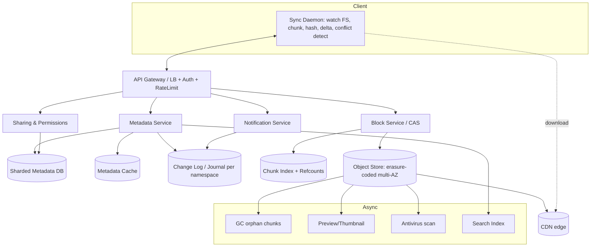

# Design Dropbox / Google Drive — High-Level Design

> **Reader:** senior backend engineer practising HLD. The goal here is not just the boxes-and-arrows but the **design judgment** — what to clarify, what to trade off, and why. Adjacent terms are defined inline the first time they appear.

---

## 1. Problem & Clarifying Questions

### 1.1 Restating the problem

Design a cloud file storage and synchronization service like **Dropbox** or **Google Drive**. Users store files and folders in the cloud; the service keeps a local copy on one or more of their devices in sync with the canonical cloud copy, lets them share files/folders with other users, keeps version history, and handles edits made while a device is offline. It must be durable (never silently lose a byte), available, and efficient with bandwidth and storage (no re-uploading data the system already has).

This is fundamentally a **sync** problem layered on top of a **storage** problem. The storage part (durably keep blobs) is largely solved by object stores; the genuinely hard parts are: (1) detecting *what changed* cheaply, (2) transferring *only the delta*, (3) deduplicating identical content across the fleet, (4) resolving *conflicts* when two devices edit the same thing, and (5) keeping a coherent, fast view of the **file tree** (the namespace of folders/files) under concurrent mutation.

### 1.2 Questions I'd ask the interviewer first

A senior answer never jumps to architecture. I'd scope these explicitly:

**Functional scope**
1. Is this **file-level sync** (whole file is the unit, like classic Dropbox) or **collaborative real-time co-editing** of document *content* (like Google Docs OT/CRDT)? These are radically different problems. *I'll assume file-level sync; real-time co-editing is a separate system I'll touch in extensions.*
2. Which clients: desktop daemon (Windows/macOS/Linux), mobile, web? Desktop sync daemon is the hard one (filesystem watching, offline edits), so I'll center on that.
3. Do we need **selective sync** (user picks which folders sync to a given device) and **smart sync / streaming** (placeholder files that download on access)? Assume yes for selective sync.
4. Sharing model: share a file? a folder (and its subtree)? public links? Granular permissions (viewer/commenter/editor)? Assume folder sharing with role-based permissions and public links.
5. Versioning: how many versions, retained how long? Assume version history with a retention window (e.g., 30–180 days, configurable by tier).
6. Max file size? Single-file uploads can be 50 GB+ (video). This forces **resumable, chunked uploads**. Assume up to ~50 GB per file.
7. Search inside files (full-text)? Assume out of scope for v1 (mention as extension).

**Non-functional**
8. **Durability** target — this is the headline. Assume **11 nines (99.999999999%)** durability, the de-facto bar for object storage (means expected loss of ~1 object in 10^11 per year).
9. **Availability** — assume 99.99% for the metadata/API plane.
10. **Consistency** — for the file tree, do we need strong consistency (a rename is immediately visible to all my devices) or is read-your-writes + eventual consistency acceptable? Assume **strong/linearizable for metadata of a single user's namespace**, eventual for cross-device propagation latency.
11. **Latency** — sync propagation: a change on device A should appear on device B within a few seconds when both online. API p99 < 200 ms.
12. **Geography** — global users, multi-region? Assume yes; data residency requirements (GDPR) may pin some users' data to a region.

**Scale**
13. How many users? DAU? Assume **500M registered, 100M DAU**.
14. Average storage per user, average file size, files per user? Assume **~50 GB stored per active user**, average file **~500 KB** but heavy tail (lots of small files + few huge ones).
15. Read/write ratio? Storage is read-heavy at the byte level (downloads ≫ uploads for shared/popular content) but the *metadata* plane is write-heavy from sync polling/notifications.

**Out of scope (stated explicitly)**
- Real-time character-by-character collaborative editing (OT/CRDT inside a doc).
- Full-text content search and OCR.
- Billing, payments, admin consoles.
- Native preview/thumbnail rendering pipelines (mention briefly).

I'll proceed with the assumptions in bold above.

---

## 2. Requirements (finalized)

### 2.1 Functional
- **Upload / download** files of arbitrary size (up to ~50 GB), resumable.
- **Folder hierarchy**: create/rename/move/delete folders and files; the namespace is a tree per user (plus shared subtrees).
- **Sync**: a desktop daemon mirrors a chosen set of folders bidirectionally with the cloud. Changes propagate both directions, near-real-time when online, and reconcile after offline periods.
- **Delta sync**: transfer only changed *chunks*, not whole files.
- **Deduplication**: never store or transfer content the system already has (global dedup across users, subject to privacy constraints — see §9).
- **Versioning**: retain previous versions; allow restore.
- **Sharing & permissions**: share files/folders with users or via link; roles: owner / editor / viewer.
- **Conflict handling**: detect concurrent divergent edits; resolve deterministically (conflicted copies), never silently lose data.
- **Selective sync** and (extension) **smart/streaming sync**.
- **Trash / soft delete** with a recovery window.

### 2.2 Non-functional
| Property | Target | Rationale |
|---|---|---|
| Durability | 11 nines | Files are irreplaceable; this is the product promise. |
| Availability (API/metadata) | 99.99% | Sync degrades gracefully but should rarely be fully down. |
| Availability (download) | 99.99%+ | Served from object store + CDN. |
| Metadata consistency | Strong within a user's namespace (linearizable ops on the tree) | Avoids "ghost files," lost renames, divergent tree views. |
| Sync propagation latency | < 5 s online, eventual after offline | UX expectation. |
| API p99 latency | < 200 ms (metadata ops) | Interactivity. |
| Upload throughput | Saturate client bandwidth; resumable | Large files. |

### 2.3 Key assumptions (numbers)
- 500M registered users, 100M DAU.
- ~50 GB stored / active user (avg), heavy-tailed.
- Avg file 500 KB; chunk size **4 MB** (Dropbox uses 4 MB blocks).
- Dedup ratio ~30% globally (common installers, libraries, shared docs, OS files).
- Each active user edits/creates ~100 files/day generating sync events.

---

## 3. Capacity Estimation (show the arithmetic)

### 3.1 Storage
- Logical stored bytes = 100M active users × 50 GB = **5 × 10^9 GB = 5 EB (exabytes)** logical.
- After dedup (~30% saved): physical ≈ 5 EB × 0.70 = **3.5 EB**.
- With erasure coding overhead (say 1.4× for a 10-of-14 code — store 14 fragments to survive loss of any 4; overhead = 14/10 = 1.4): physical raw ≈ 3.5 EB × 1.4 = **~4.9 EB raw**.
- Plus versioning: assume versions add ~25% logical → physical raw ≈ **~6 EB raw**.

At ~20 TB per disk, that's 6 EB / 20 TB = **300,000 disks** of usable capacity, before spares/JBOD overhead. This is "build your own object store or rent S3/GCS" territory; for the design we treat object storage as a managed/abstracted layer but design *around* its semantics.

### 3.2 Write QPS (uploads + metadata mutations)
- 100M DAU × 100 sync events/day = 10^10 events/day.
- /day → /sec: 10^10 / 86,400 ≈ **115,000 metadata writes/sec average**.
- Peak factor ~3× → **~350K metadata writes/sec peak**.
- Actual *block uploads* are far fewer because of dedup + delta (most edits touch a few chunks, many writes are no-ops at the block layer). Estimate block uploads ≈ 30% of events → ~35K block writes/sec avg, ~100K peak.

### 3.3 Read QPS
- Sync clients poll/listen for changes. With **long-poll / push notifications** (not tight polling), reads are event-driven. Say each DAU's devices receive notifications and pull metadata ~ a few hundred times/day plus downloads.
- Downloads (bytes) dominate bandwidth but go to object store / CDN, not the metadata DB.
- Metadata reads ≈ 5–10× writes → **~600K–1M metadata reads/sec average**, peak ~3M/sec. Cache aggressively (see §8).

### 3.4 Bandwidth
- Uploads: 35K block writes/sec × 4 MB = 140 GB/sec ingress at the block layer... that's huge, so reality is most events are small deltas. Use avg delta 256 KB: 115K events/sec × 0.3 (actual transfers) × 256 KB ≈ **~9 GB/sec ingress**.
- Downloads typically 2–4× uploads for a sharing-heavy product → **~25–35 GB/sec egress**, much served by CDN.

### 3.5 Metadata DB sizing
- File/folder rows: 100M users × (50 GB / 500 KB) ≈ 100M × 100,000 files = **10^13 files**?? That's 10 trillion rows — unrealistic; real avg files/user is lower. Recalibrate: assume **avg 25,000 files/user** → 100M × 25,000 = **2.5 × 10^12 = 2.5 trillion file rows**.
- At ~1 KB metadata/file (path, sizes, chunk list pointer, perms, timestamps) → 2.5 PB of metadata. This **must be sharded** (no single DB). Shard by user/namespace (see §6, §8).
- Block/chunk index: dedup keyed by content hash. Distinct chunks ≈ logical chunks × (1 − dedup). Logical chunks = 5 EB / 4 MB ≈ 1.25 × 10^12 chunks; distinct ≈ 0.875 × 10^12 ≈ **~10^12 chunk-index entries**. At ~100 B each (hash + location + refcount) → ~100 TB chunk index → sharded by hash prefix.

### 3.6 Server/shard counts (rough)
- Metadata DB: 2.5 trillion rows, 350K writes/s peak. A well-tuned sharded SQL/NewSQL node handles ~5–10K writes/s and ~few hundred GB hot. Need on the order of **~hundreds to low thousands of metadata shards** (e.g., 1,024 logical shards mapped onto a few hundred physical nodes + replicas).
- Notification/sync servers (long-poll connections): 100M DAU × ~1.5 devices, say 50M concurrent connections peak; ~100K connections/server → **~500 notification servers** (plus headroom).
- Stateless API/app tier: size to 350K writes + ~3M reads/s; ~5K rps/node → **~700 nodes** + headroom, autoscaled.

These are order-of-magnitude; the point in interview is the method and the conclusion: *metadata must be sharded, blocks live in an object store, and reads are cache- and notification-driven.*

---

## 4. API Design

All authenticated via OAuth2 bearer tokens; mutating calls carry an **idempotency key** (a client-generated UUID so retries don't double-apply). REST/JSON shown; production may use gRPC for the daemon.

### 4.1 Block (content) layer — content-addressable
```
POST /v1/blocks/check
  body: { hashes: ["sha256:ab12...", ...] }            # which chunks already exist?
  resp: { missing: ["sha256:..."], present: ["sha256:..."] }

PUT  /v1/blocks/{hash}                                   # upload one 4MB chunk
  body: <binary>  (server verifies hash == content; rejects mismatch)
  resp: 201 { hash, stored: true }                       # or 200 if already present (dedup)
```

### 4.2 File/commit layer — metadata
```
POST /v1/files/commit
  body: {
    path: "/proj/report.pdf",
    parent_id: "fol_123",
    block_list: ["sha256:...","sha256:..."],            # ordered chunk hashes = the file content
    expected_version: 42,                                # optimistic concurrency (see §7)
    mtime, size, idempotency_key
  }
  resp: { file_id, version: 43, conflict?: {...} }       # may return a conflict resolution

GET  /v1/files/{file_id}                                 # metadata: block_list, version, perms
GET  /v1/files/{file_id}/download                        # 302 to signed object-store/CDN URL
POST /v1/files/{file_id}/move    { new_parent_id, new_name, expected_version }
POST /v1/files/{file_id}/delete  { expected_version }    # soft delete → trash
GET  /v1/files/{file_id}/versions
POST /v1/files/{file_id}/restore { version }
```

### 4.3 Resumable upload session (large files)
```
POST /v1/uploads/start  { path, total_size }  → { session_id, chunk_size: 4MB }
PUT  /v1/uploads/{session_id}/chunk/{index}   <binary>  (resumable; idempotent per index)
GET  /v1/uploads/{session_id}/status          → { received_indices: [...] }   # resume after crash
POST /v1/uploads/{session_id}/finish { block_list, mtime } → commit
```

### 4.4 Sync / change feed (the heart of the daemon)
```
GET  /v1/delta?cursor=<opaque>     # "what changed since cursor?"
  resp: {
    entries: [ {path, file_id, change: "add|modify|delete|move", metadata...} ],
    cursor: "<new opaque cursor>",
    has_more: bool
  }

# Push: server notifies device of new changes so it can call /delta promptly
GET  /v1/longpoll?cursor=<opaque>  → 200 { changes: true } | timeout 30s { changes: false }
```
The **cursor** is an opaque, server-controlled position in the user's change log — clients never parse it (lets us change internal representation freely).

### 4.5 Sharing
```
POST /v1/share        { node_id, principal: user|group|"public", role: viewer|editor }
GET  /v1/share/{node_id}
POST /v1/links        { node_id, expiry, password? } → { url }
```

---

## 5. High-Level Architecture

### 5.1 Component roles
- **Client / Sync daemon** — watches the local filesystem (OS file events), chunks files, hashes chunks, computes deltas, uploads missing blocks, commits metadata, applies remote deltas locally, detects/resolves conflicts.
- **API Gateway / LB** — TLS termination, auth, routing, rate limiting.
- **Metadata Service** — owns the file tree, versions, permissions; the source of truth for the namespace; sharded SQL/NewSQL.
- **Block Service** — content-addressable storage front for chunks; talks to the object store; maintains the chunk index + refcounts.
- **Object Store** — the durable blob backend (erasure-coded, multi-AZ/region). Stores chunks keyed by content hash.
- **Notification Service** — maintains long-poll/push connections; fans out "your namespace changed" signals.
- **Change Log / Journal** — per-namespace ordered log of mutations; powers /delta and cursors.
- **Metadata Cache** — hot file-tree and permission reads.
- **CDN** — caches popular/public downloads at the edge.
- **Async workers** — dedup garbage collection, thumbnail/preview generation, antivirus, indexing.

### 5.2 ASCII block diagram
```
                         +---------------------------+
   Desktop daemon /      |        API Gateway /       |
   Mobile / Web   <----> |     Load Balancer + Auth   |
   (watch FS, chunk,     +-------------+--------------+
    hash, delta, sync)                 |
                 +-------------+--------+--------+----------------+
                 |             |                 |                |
                 v             v                 v                v
         +--------------+ +------------+  +----------------+ +-------------+
         |  Metadata    | |   Block    |  | Notification   | |  Sharing /  |
         |  Service     | |  Service   |  |  Service       | |  Perms Svc  |
         | (file tree,  | | (CAS,      |  | (longpoll/push,| |             |
         |  versions)   | |  chunk idx,|  |  fan-out)      | +------+------+
         +------+-------+ |  refcount) |  +-------+--------+        |
                |        +-----+-------+          |                 |
                v              |                  v                 |
       +----------------+      v          +---------------+         |
       | Metadata DB    | +-----------+   | Change Log /  |<--------+
       | (sharded by    | | Object    |   | Journal       |
       |  namespace) +  | | Store     |   | (per-ns       |
       | Metadata Cache | | (erasure  |   |  ordered)     |
       +----------------+ |  coded,   |   +---------------+
                          |  multi-AZ)|
                          +-----+-----+
                                |
                                v
                            +-------+
                            |  CDN  |  (popular/public downloads)
                            +-------+

   Async: GC (orphan chunks), preview/thumbnail, AV scan, search index
```

### 5.3 Mermaid diagram


### 5.4 Key flow — upload a modified file (sequence)
```mermaid
sequenceDiagram
    participant FS as Local FS
    participant Daemon
    participant Block as Block Svc (CAS)
    participant Meta as Metadata Svc
    participant Note as Notification Svc
    participant B as Device B

    FS->>Daemon: file changed event
    Daemon->>Daemon: split into 4MB chunks, hash each (sha256)
    Daemon->>Daemon: diff vs last-known block_list -> changed chunks
    Daemon->>Block: POST /blocks/check {hashes}
    Block-->>Daemon: {missing:[h3], present:[h1,h2]}  (dedup!)
    Daemon->>Block: PUT /blocks/h3 (only missing chunk)
    Block->>Block: verify hash, write to object store, refcount++
    Daemon->>Meta: POST /files/commit {block_list,[h1,h2,h3], expected_version}
    Meta->>Meta: check version (optimistic), bump to v+1, append to change log
    Meta-->>Daemon: {version:v+1}
    Meta->>Note: namespace changed
    Note-->>B: longpoll wakes
    B->>Meta: GET /delta?cursor
    Meta-->>B: {file modified, new block_list}
    B->>Block: download missing chunk h3
    B->>FS: reconstruct file
```

---

## 6. Data Model & Storage Choices

### 6.1 Entities
**Namespace** — the root of a sync scope. Each user has a personal namespace; each shared folder is its own namespace mounted into members' trees. *Why a separate namespace per shared folder?* It localizes change logs, permissions, and cursors — sharing a folder = mounting a namespace, not copying rows. This is the single most important modeling decision.

**File node / Folder node** (the tree):
```
node_id        (PK)
namespace_id   (shard key)
parent_id      (FK -> node, for tree)
name
type           (file | folder)
version        (monotonic per node, for optimistic concurrency)
block_list_id  (-> ordered chunk hashes; null for folders)
size, mtime, ctime
is_deleted     (soft delete / trash)
created_by, perms_inherited
```

**Block list** — ordered list of chunk hashes that make a file: `(file_version_id, index, chunk_hash)`. Immutable per version (enables cheap versioning: a new version = new block_list, mostly sharing chunks with the old one).

**Chunk index (CAS)** — `chunk_hash (PK) -> {storage_locator, length, refcount}`. The dedup table. Sharded by hash prefix.

**Version row** — `(node_id, version, block_list_id, mtime, author, timestamp)`; keep last N or last T days.

**Change log entry** — `(namespace_id, seq, node_id, op, payload)`; the ordered journal that powers `/delta` and cursors. The cursor = `(namespace_id, seq)` encoded opaquely.

**Permission / share** — `(node_id, principal, role, inherited_from)`.

### 6.2 Which datastore, and why
| Data | Store | Why | Failure mode avoided |
|---|---|---|---|
| File tree + versions + perms | **Sharded relational / NewSQL** (e.g., MySQL-sharded à la Dropbox's "Edgestore"/Magic Pocket metadata, or Spanner/CockroachDB) | Needs **transactions** (move = update parent + bump versions atomically), strong consistency per namespace, secondary indexes | Lost renames, orphaned subtrees, divergent tree views |
| Chunk content (blobs) | **Object store**, erasure-coded, multi-AZ | Cheap, durable, immutable blobs; content-addressed keys | Byte loss; expensive random writes |
| Chunk index / refcounts | **Sharded KV** keyed by hash | Point lookups by hash, high write throughput, sharded by hash prefix | Hot-shard from skewed paths (hash spreads load) |
| Change log | **Append-only log per namespace** (Kafka-like or a log table) | Ordered, append-only, replayable for /delta | Missed/duplicated change notifications |
| Hot metadata reads | **Cache** (Redis/memcached) | Offload read-heavy tree/perms lookups | Metadata DB read overload |
| Popular downloads | **CDN** | Edge caching for shared/public content | Origin egress saturation |

**Why NewSQL/sharded-SQL over a single big NoSQL for metadata?** The file tree needs *multi-row transactions* (move a folder = retarget parent, bump versions, append change-log atomically) and strong per-namespace consistency. A KV store would push all that consistency logic into the app and invite races. We shard by `namespace_id` so a user's (or shared folder's) operations are co-located and transactional within one shard. Cross-namespace operations (move a file from personal folder into a shared folder = move across namespaces) are the rare hard case — handled as a two-phase, idempotent "remove from A, add to B" with the change logged on both (see §7.5).

---

## 7. Deep Dives (the bulk)

I'll deep-dive the five hardest sub-problems: (A) **chunking + content-addressable storage + dedup**, (B) **sync protocol & delta sync**, (C) **conflict detection & resolution**, (D) **metadata vs block split + file-tree consistency**, (E) **resumable large-file upload**. Sharing/versioning are woven in.

---

### 7.A Chunking, Content-Addressable Storage (CAS) & Deduplication

**Goal:** never store or transfer content the system already has, and address content by *what it is*, not *where it is*.

**Content-addressable storage (CAS):** store each chunk under a key derived from its content hash (e.g., `sha256(chunk)`). Two identical chunks → identical key → stored once. This gives free dedup and integrity verification (re-hash on read to detect bit rot).

#### Chunking strategy — fixed vs content-defined
The deciding question for delta efficiency: **how do we split a file into chunks?**

| Strategy | How | Pros | Cons | Failure mode |
|---|---|---|---|---|
| **Fixed-size** (e.g., 4 MB) | Cut every 4 MB | Simple, predictable, cheap to compute | **Boundary-shift problem**: insert 1 byte at the start and *every* subsequent chunk changes → near-zero dedup on edited files | Delta sync degenerates to full re-upload for prepend/insert |
| **Content-defined chunking (CDC)** (rolling hash, e.g., Rabin fingerprint) | Cut at positions where a rolling hash hits a pattern → boundaries follow content | Insert/delete only affects local chunks; great dedup across versions and files | More CPU; variable chunk sizes; needs min/max bounds | None major; CPU cost |
| **Hybrid** | Fixed for whole-file replace workloads; CDC for documents | Tune per workload | Complexity | — |

**Decision:** Use **fixed 4 MB blocks** as the *baseline* (Dropbox's documented choice — simple, fast, and most sync events are whole-file saves where boundary-shift doesn't bite), and offer **CDC** for large append/insert-heavy files where it materially improves delta sync. *Failure mode each avoids:* fixed avoids CPU overhead and complexity for the common case; CDC avoids the catastrophic "1-byte insert re-uploads the whole file" failure for the cases that need it. State the tradeoff explicitly in interview — knowing *why Dropbox picked fixed 4 MB* (their workload is dominated by full saves, and they layer compression/delta at other levels) is senior signal.

#### The upload/dedup handshake
1. Client chunks + hashes locally.
2. Client asks Block Service `POST /blocks/check {hashes}` → server returns which hashes are **missing**.
3. Client uploads only missing chunks (`PUT /blocks/{hash}`). Server **re-verifies** `hash == sha256(body)` (never trust the client's hash — defends against poisoning the CAS).
4. Block Service writes to object store, increments **refcount** in the chunk index.

This makes re-uploading an unchanged file nearly free (a few small `check` calls), and sharing a popular file (installer, attachment) cost one physical copy.

#### Reference counting & garbage collection
Chunks are shared, so we can't delete a chunk when one file referencing it is deleted. Options:

| GC approach | How | Pros | Cons |
|---|---|---|---|
| **Synchronous refcount** | inc on commit, dec on delete; delete chunk at 0 | Immediate space reclaim | Refcount contention on hot chunks; correctness fragile under retries |
| **Mark-and-sweep** | Periodically scan all block_lists, mark reachable chunks, sweep unmarked | Robust, self-healing | Expensive at exabyte scale; needs full scan |
| **Refcount + delayed sweep** (chosen) | Maintain approximate refcounts; periodic sweeper double-checks reachability before physical delete, with a **grace period** | Cheap common case + correctness backstop | Eventual space reclaim, not instant |

**Decision:** approximate refcounts for fast-path + a **conservative mark-and-sweep with a grace window** (never delete a chunk uploaded in the last, say, 24h, and only delete after confirming no live block_list references it). *Failure mode avoided:* deleting a chunk that's actually still referenced (data loss) — the cardinal sin. We bias 100% toward "keep a maybe-orphan" over "delete a maybe-live chunk." Storage waste from delayed GC is acceptable; data loss is not.

#### Privacy caveat on cross-user dedup
Global dedup leaks information: if uploading a file returns "already present," an attacker learns someone else has that exact file (a known-plaintext / "confirmation-of-a-file" attack). Mitigations: dedup **per-account or per-trust-domain** for sensitive tiers, or only dedup *after* the client has proven possession of the full file (not just the hash). For consumer scale we typically dedup globally but disable the client-side "already present, skip upload" optimization for unproven hashes (require the upload, then dedup server-side) — trading some bandwidth for privacy. Flag this tradeoff explicitly.

---

### 7.B Sync Protocol & Delta Sync

**Goal:** keep N devices and the cloud convergent, transferring minimal data, with bounded propagation latency.

#### Detecting change on the client
The daemon watches the OS filesystem event API (inotify/FSEvents/ReadDirectoryChangesW) for cheap "something changed here" signals, then **verifies** by hashing — FS events are lossy and can be missed (e.g., during daemon downtime), so we also do **periodic full reconciliation scans** keyed by `(path, size, mtime)` and, on mismatch, content hash. *Failure mode avoided:* trusting FS events alone → missed changes after a crash; trusting mtime alone → mtime can be unreliable, so confirm with hash when in doubt.

#### Detecting change from the server: the change-log cursor model
Two designs:

| Approach | How | Pros | Cons | Failure mode |
|---|---|---|---|---|
| **Polling full state** | Client periodically lists the whole tree, diffs | Simple | O(tree) every poll; doesn't scale | Bandwidth/CPU blowup, slow propagation |
| **Cursor + change log** (chosen) | Server keeps an ordered per-namespace change log; client holds an opaque cursor; `/delta?cursor` returns only entries after it | O(changes), efficient, resumable | Must persist/order the log; cursor management | — |
| **Push-only** | Server pushes diffs | Low latency | Lost pushes if device offline; needs reconciliation anyway | Missed updates while offline |

**Decision:** **cursor + change log**, with **long-poll/push** for low-latency wakeups. Client holds cursor; Notification Service long-polls and signals "changes available"; client calls `/delta?cursor`, applies entries, advances cursor. Long-poll = client opens a request the server holds open until there's news or a timeout (~30s), then reconnects — gives push-like latency over plain HTTP without persistent infra everywhere. *Failure mode avoided:* the polling blowup and the lost-push problem — the cursor guarantees no missed change because the durable log is the source of truth; push is just an optimization to avoid waiting.

#### Delta sync (transfer only changed chunks)
On modify, the daemon computes the new block_list and uploads only chunks not already present (the §7.A handshake). On the *download* side, the client compares the new block_list to what it has locally and fetches only missing chunks, then reconstructs the file. For very large files with internal edits, this is where **CDC** pays off (boundary-stable chunks). Optionally layer **binary delta** (rsync-style or bsdiff) *within* a chunk for tiny edits to huge chunks — but at 4 MB chunks this is usually unnecessary.

#### Ordering & atomicity of applied deltas
Applying a "move folder then add file under it" in the wrong order corrupts the local tree. The change log is **ordered per namespace**, and clients apply entries strictly in sequence; the daemon stages changes and applies them transactionally to the local DB-of-record (a local SQLite catalog mirroring server state) before touching the actual files. *Failure mode avoided:* partial/torn application leaving the local tree inconsistent with the server.

---

### 7.C Conflict Detection & Resolution

**Goal:** two devices edit the same file (or one offline) — converge deterministically, **never lose data silently**.

#### Detection — version vectors / optimistic concurrency
Each node has a monotonic `version`. A commit carries `expected_version`. The server accepts the commit only if `expected_version == current_version` (compare-and-swap). If not, it's a **conflict**: someone else committed in between.

For multi-device offline scenarios, a single integer version is insufficient to know *who diverged from whom*; a **version vector** (a map device_id → counter) captures causality precisely — vector A dominates B (A saw everything B saw) → fast-forward; neither dominates → true conflict.

| Detection | Mechanism | Catches | Limits |
|---|---|---|---|
| **Single version + CAS** | integer compare-and-swap on commit | concurrent online edits | can't tell "stale but causally-ancestor" from true fork after long offline |
| **Version vector** | per-device counters | true causal conflicts incl. offline | bigger metadata; vector pruning needed |
| **Content hash equality** | if both sides produced identical bytes | "false conflicts" (same edit) → auto-merge | only when bytes match |

**Decision:** version vectors for conflict *detection* (with vector pruning to bound size), plus content-hash equality to auto-resolve false conflicts (if both edits produced identical content, no conflict).

#### Resolution policy
For opaque files (a .psd, a .pdf), the system **cannot merge content**. The safe, deterministic policy:

- **Last-writer-wins on the canonical name** is unacceptable alone — it loses the other edit. Instead: keep one version as the file and materialize the other as a **conflicted copy**: `report (Alice's conflicted copy 2026-06-25).pdf`. Both edits survive; the human resolves. This is exactly Dropbox's behavior. *Failure mode avoided:* silent data loss.
- For *folders* and tree ops (move/rename/delete vs edit), apply deterministic rules: e.g., "delete vs edit" → resurrect the file (edit wins, the delete is treated as moving to trash but the live edit takes precedence), logged so user can review.
- Versioning underpins all of this: every accepted commit is a new version, so even a clobber is recoverable via version history.

#### CRDTs / OT?
For *file-level* sync of opaque blobs, CRDTs (Conflict-free Replicated Data Types — data structures that merge automatically) don't help: you can't auto-merge a binary. They *do* apply to the **file-tree metadata** (a tree CRDT can resolve concurrent moves) and to *real-time text co-editing* (Google Docs uses OT/CRDT) — which is a different product (extension §10). State this distinction clearly: **content-level conflicts → conflicted copies; metadata/tree conflicts → deterministic rules or tree-CRDT; real-time text → OT/CRDT, separate system.**

---

### 7.D Metadata Service vs Block Storage; File-Tree Consistency

**Why split metadata from blocks at all?** They have opposite profiles: metadata is small, transactional, strongly-consistent, frequently mutated, needs indexes and tree operations; blocks are large, immutable, append-only, content-addressed, served via CDN. Coupling them forces one store to be bad at one job. Splitting lets metadata use NewSQL and blocks use an object store. *Failure mode avoided:* a single store that's neither transactional enough for the tree nor cheap/durable enough for exabytes of blobs.

#### Sharding the metadata
Shard by `namespace_id`. Properties:
- A user's whole personal tree is on one shard → tree ops are single-shard transactions (move/rename/delete are local).
- A shared folder is its own namespace → mounted into many users' views without row duplication; its change log and perms are localized.
- Hot namespace (huge team folder) can be split further or get a dedicated shard.

| Shard key | Pros | Cons |
|---|---|---|
| **By namespace/user** (chosen) | tree ops are single-shard txns; clean sharing via mounts | a single huge shared folder can be a hot shard |
| By node_id (random) | even load | every tree op is cross-shard → distributed txns everywhere (bad) |
| By path | path-prefix locality | renames move data across shards (path is mutable!) |

**Decision:** shard by namespace. Path is *not* a shard key because paths change on rename/move; identity (`node_id`/`namespace_id`) is stable.

#### Consistency of the file tree
The tree must stay **acyclic and connected** under concurrent mutation. Hard cases:
- **Concurrent move creating a cycle**: A moves /X into /Y while B moves /Y into /X → would create a cycle. Resolve by serializing tree-structure ops within a namespace (single-shard transaction with a cycle check) — reject the second op or apply tree-CRDT semantics.
- **Move across namespaces** (personal → shared): two-shard operation. Use a **saga / two-phase idempotent** sequence: tentatively add to destination namespace, then remove from source, both change-logged with the same operation id so a crash leaves a recoverable, idempotent-replayable state. Avoid a generic distributed 2PC if possible (latency/locking) — prefer the idempotent saga with reconciliation. *Failure mode avoided:* a crash mid-move leaving the file in both or neither namespace (duplicate or lost).

#### Read scaling for the tree
- Cache the tree and permission resolution per namespace; invalidate on change-log append.
- Permission checks walk up the tree to the nearest inherited grant — cache the resolved effective permission per node to avoid repeated walks.

---

### 7.E Resumable, Chunked Large-File Upload

**Goal:** upload a 50 GB file over a flaky connection without restarting from zero, idempotently.

- Client opens an **upload session** (`/uploads/start`) → gets `session_id`, `chunk_size`.
- Uploads chunks by **index**; each `PUT .../chunk/{index}` is **idempotent** (re-PUT same index = no-op). Server tracks received indices.
- On crash/reconnect, client calls `/uploads/{session}/status` → list of received indices → upload only the gaps. *Failure mode avoided:* restarting a 50 GB upload from byte 0 after a blip.
- Each chunk also flows through the CAS dedup check, so resuming a file that overlaps existing content skips those chunks.
- `/finish` validates all indices present, assembles the ordered block_list, then does a single metadata **commit** (atomic file creation/version bump). The metadata becomes visible only on finish → no one sees a half-uploaded file (*atomicity*).
- **Parallelism:** upload multiple chunks concurrently to saturate bandwidth; server reassembles by index.
- **Integrity:** per-chunk hash verified on receipt; a whole-file hash in `/finish` cross-checks assembly.

| Concern | Mechanism |
|---|---|
| Resumability | session + per-index idempotent PUT + status query |
| Atomic visibility | metadata commit only on /finish |
| Bandwidth | parallel chunk upload, dedup skip |
| Integrity | per-chunk + whole-file hash verification |
| Abandoned sessions | TTL + GC of orphan staged chunks |

---

## 8. Scaling & Bottlenecks

**Where it breaks first, and the fix:**

1. **Metadata DB write/connection hotspots.** A viral shared folder (10k members editing) hammers one namespace shard.
   - Fix: split hot namespaces; read replicas + cache for reads; batch/coalesce change-log appends; rate-limit pathological clients.
2. **Notification fan-out.** A change in a folder shared with 10k users → 10k longpoll wakeups.
   - Fix: hierarchical fan-out, debounce/coalesce (one wakeup per device per window), per-namespace pub/sub topics.
3. **Chunk index hot keys.** A few ultra-popular chunks (common installer) get massive refcount churn.
   - Fix: shard by hash (spreads naturally); use approximate/sharded counters (sum partial counts) instead of one row; cache "present" results.
4. **Object store egress / origin load.** Popular public links.
   - Fix: CDN with signed URLs; cache by content hash (immutable → infinitely cacheable).
5. **Long-poll connection count.** 50M concurrent connections.
   - Fix: dedicated, lightweight notification tier (event-driven, epoll/Netty), horizontal scale, sticky-by-namespace routing.
6. **Cursor/change-log growth.** Logs grow unbounded.
   - Fix: compact/snapshot per namespace; cursors reference snapshots; prune applied history beyond retention.
7. **Cross-namespace moves.** Saga overhead.
   - Fix: keep them rare; co-locate related namespaces; idempotent reconciliation worker.

**Scaling levers (recap):** shard metadata by namespace; stateless app/API tier autoscaled; cache hot tree+perms; CDN for downloads; object store scales horizontally; notification tier scales with connections; async workers (GC, previews) off the critical path.

---

## 9. Reliability, Consistency & Security

**Durability (11 nines):** erasure coding across AZs (store 14 fragments, any 10 reconstruct → survive 4 simultaneous failures), multi-region replication for critical data, periodic **scrubbing** (re-hash stored chunks vs CAS key to catch bit rot and repair from parity). CAS keys make integrity self-verifying. *Failure mode avoided:* silent corruption and correlated AZ loss.

**Availability:** stateless tiers behind LB across AZs; metadata DB with replicas + automatic failover; degrade gracefully — if metadata write plane is impaired, sync queues client-side and retries (idempotency keys make retries safe).

**Consistency model:** strong/linearizable within a namespace (single-shard transactions for tree ops); the change-log cursor gives clients **read-your-writes** and ordered application; cross-device propagation is eventually consistent but bounded by notification latency. Cross-namespace ops use idempotent sagas with reconciliation.

**Idempotency:** every mutating call carries a client UUID; the server dedups so retries (the norm on flaky networks) don't double-apply (no duplicate files, no double version bumps). Chunk PUTs are naturally idempotent (content-addressed).

**Conflict safety:** never silently drop data — conflicted copies + full version history make every state recoverable.

**Security & privacy:**
- **AuthN/Z:** OAuth2; device tokens revocable; per-request permission checks resolved against the tree (inherited grants), effective-perm cache.
- **Encryption:** TLS in transit; **encryption at rest** in the object store; for sensitive tiers, client-side/end-to-end encryption — note this **breaks cross-user dedup** (encrypted-with-different-keys identical files won't dedup) and breaks server-side preview/AV; convergent encryption is a partial answer but has its own leakage. State the tradeoff.
- **Dedup privacy:** require proof-of-possession or upload-then-dedup to avoid the "confirm a file exists" oracle (§7.A).
- **Sharing:** signed, expiring URLs for links; optional password; granular roles; audit log of access.
- **Abuse / rate limiting:** per-user and per-IP quotas; detect mass-download/exfil patterns; malware scanning of uploaded content; storage quotas enforced at commit.
- **Tenant isolation:** namespace boundaries enforce that a permission check can't traverse into someone else's tree.

---

## 10. Extensions & Follow-ups

| Follow-up | How the design changes |
|---|---|
| **Real-time collaborative editing (Google Docs)** | Different system: model the doc as an OT/CRDT-synced sequence with an authoritative edit server; file-sync only sees periodic snapshots/exports. Don't conflate with blob sync. |
| **Smart/streaming sync (placeholders)** | Local placeholders (zero-byte stubs with metadata); hydrate on file open via FS filter driver; dehydrate cold files. Changes the daemon, not the backend. |
| **Full-text search** | Async indexing pipeline (extract text from blobs → inverted index, e.g., Elasticsearch); access-controlled at query time. |
| **Previews/thumbnails** | Async render workers write derived blobs to object store; served via CDN. |
| **Block-level binary diff for huge files** | Add CDC + rsync-style rolling-checksum delta; reduces bandwidth for big edited files. |
| **End-to-end encryption** | Client-held keys; lose dedup/preview/AV; need secure key sharing for shared folders (key wrapping). |
| **Multi-region / data residency (GDPR)** | Pin a user's namespace + blocks to a region; route by namespace home region; replicate metadata cross-region read-only. |
| **Team admin, retention/legal hold** | Policy layer over versioning/trash; immutable retention buckets. |
| **Bandwidth/cost optimization** | Tiered storage (hot SSD vs cold/archive for old versions), compression, cold-version migration. |
| **Mobile camera-roll backup** | Background chunked resumable upload; battery/data-aware scheduling. |

---

## 11. Interview Q&A

**Q1. Why split metadata and block storage?**
Opposite profiles: metadata is small, transactional, mutable, strongly consistent, indexed; blocks are large, immutable, content-addressed, CDN-served. One store can't be great at both. Splitting lets metadata use NewSQL (transactions for tree ops) and blocks use an object store (cheap, durable, cacheable). *Probe — what breaks if you put blocks in the SQL DB?* Exabyte-scale blobs blow up the DB, kill cache locality, and you lose CDN-cacheable immutable URLs.

**Q2. Fixed vs content-defined chunking — which and why?**
Fixed 4 MB by default (Dropbox's choice) because most sync events are whole-file saves and it's cheap; CDC for insert/append-heavy large files to avoid the boundary-shift problem where a 1-byte prepend re-uploads everything. *Probe — when does fixed hurt badly?* Logs/DB files with prepends or mid-file inserts → near-zero dedup; switch those to CDC.

**Q3. How do you detect what changed without re-listing the whole tree?**
Server keeps an ordered per-namespace **change log**; client holds an opaque **cursor**; `/delta?cursor` returns only entries after it; long-poll/push gives low-latency wakeups. O(changes) not O(tree). *Probe — what if a push is lost?* Doesn't matter: the durable log is the source of truth; the cursor guarantees the client catches up; push is only an optimization.

**Q4. Two devices edit the same file — what happens?**
Optimistic concurrency: commit carries `expected_version`; mismatch = conflict. For opaque content we can't merge, so we keep one as canonical and write the other as a **conflicted copy**; both survive, version history backs everything. Identical content auto-resolves via hash equality. *Probe — why not last-writer-wins?* It silently loses an edit — the cardinal data-loss sin.

**Q5. How does dedup work and what's the privacy risk? (senior-signal)**
CAS: chunks keyed by content hash; client asks which hashes are missing, uploads only those; server verifies the hash and refcounts. Risk: a naive "already present, skip" leaks that someone else has that exact file (existence oracle). Mitigate with proof-of-possession or upload-then-dedup, trading bandwidth for privacy. *Probe — how does E2E encryption interact?* It defeats cross-user dedup (different keys → different ciphertext); convergent encryption partially restores it but leaks equality.

**Q6. How do you garbage-collect shared chunks safely? (senior-signal)**
Refcount fast path + conservative mark-and-sweep with a grace window; never delete a chunk that any live block_list references, and never delete recently-uploaded chunks. Bias entirely toward keeping a maybe-orphan over deleting a maybe-live chunk. *Probe — why not pure synchronous refcounting?* Hot-chunk contention and retry/race fragility make it unsafe alone; the sweep is the correctness backstop.

**Q7. How do you shard metadata, and why not by path? (senior-signal)**
By `namespace_id`: a user's tree and a shared folder are each a namespace, so tree ops are single-shard transactions and sharing is a mount, not a copy. Not by path because paths are mutable (rename/move would relocate data across shards); identity is stable. *Probe — what about a giant shared folder?* It's a hot shard; split it or give it dedicated capacity, coalesce notifications.

**Q8. How do you handle a 50 GB upload on a flaky link?**
Resumable session: chunked, per-index idempotent PUTs, status query to find gaps and resume; dedup skips overlapping content; metadata commit only on finish (atomic visibility); per-chunk + whole-file hash integrity. *Probe — how do you avoid showing a half-uploaded file?* Metadata is committed atomically only at /finish; before that the file doesn't exist in the namespace.

**Q9. What consistency does a user actually get across devices?**
Strong/linearizable within a namespace (single-shard txns); read-your-writes + ordered application via the cursor; cross-device propagation eventually consistent but bounded by notification latency (seconds). *Probe — concurrent folder moves creating a cycle?* Serialize tree-structure ops within the namespace with a cycle check (or tree-CRDT); cross-namespace moves use an idempotent saga.

**Q10. How do you hit 11 nines durability?**
Erasure coding across AZs (e.g., 10-of-14), multi-region replication, scrubbing that re-hashes against CAS keys to detect/repair bit rot. Content-addressing makes integrity self-checking. *Probe — cost of erasure coding vs replication?* EC gives durability at ~1.4× overhead vs 3× for triple replication — cheaper for cold/large blobs, at the cost of more CPU on reconstruct.

---

## 12. Cheat-Sheet & Self-Test

**Key numbers:** 500M users / 100M DAU; ~50 GB/user → ~5 EB logical, ~3.5 EB post-dedup, ~6 EB raw with EC+versions; **4 MB** chunk; ~115K metadata writes/s avg (~350K peak), ~1M reads/s avg; ~50M concurrent long-poll connections; metadata sharded into ~1,024 logical shards by namespace.

**Key decisions (one line each):**
- Split **metadata (NewSQL, sharded by namespace, transactional)** from **blocks (object store, content-addressed, erasure-coded)**.
- **CAS + refcount + conservative sweep GC** for dedup; verify hashes server-side; mind the existence-oracle privacy risk.
- **Fixed 4 MB** chunks by default; **CDC** for insert-heavy large files.
- Sync via **per-namespace ordered change log + opaque cursor + long-poll**; delta = upload/download only missing chunks.
- Conflicts: **optimistic version (vectors) → conflicted copies**, never silent loss; version history everywhere.
- Large files: **resumable chunked sessions**, idempotent per-index PUT, atomic commit on finish.
- Sharing = **mount a namespace**, not copy rows; permissions inherited down the tree with effective-perm cache.
- Durability via **EC across AZs + multi-region + scrubbing**; idempotency keys make all retries safe.

**Diagram-in-words:** Daemon watches FS → chunks+hashes → asks Block Service which chunks are missing → uploads only those (dedup) → commits block_list to Metadata Service (optimistic version, append to change log) → Notification Service wakes other devices → they pull `/delta` by cursor and download only missing chunks → reconstruct. Blocks live in an erasure-coded object store fronted by CDN; metadata lives in a namespace-sharded NewSQL store fronted by a cache.

**Self-test (no answers):**
1. Derive the metadata DB size and shard count from scratch for 200M DAU, 30K files/user, 1.2 KB/file row — and justify the shard key.
2. Walk through exactly what happens when device A (offline 3 days) and device B both renamed *and* edited the same file; what does each device see after reconnect?
3. Design the GC sweep so it can never delete a live chunk even under concurrent uploads, refcount races, and a mid-sweep crash. What invariants do you maintain?
4. A folder shared with 50K editors is causing a hot metadata shard and notification storms. Give three independent mitigations and their tradeoffs.
5. Explain how end-to-end encryption changes dedup, preview generation, AV scanning, and shared-folder key management — and what you'd give up to keep E2E.
