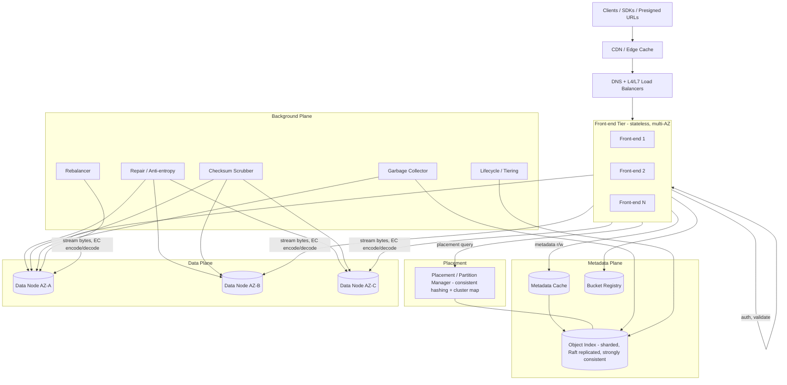
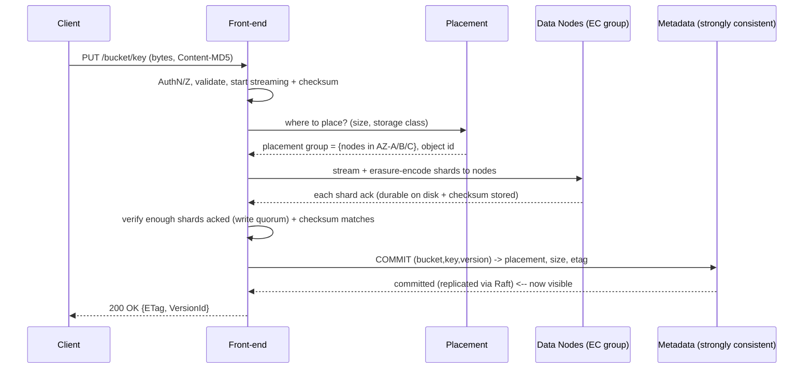
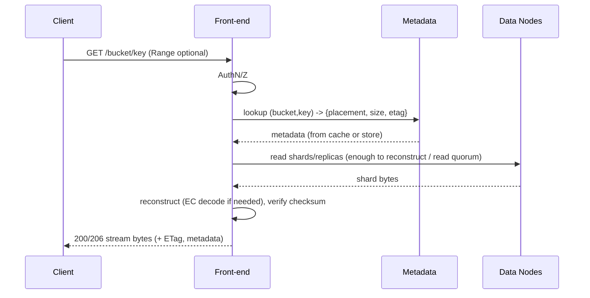
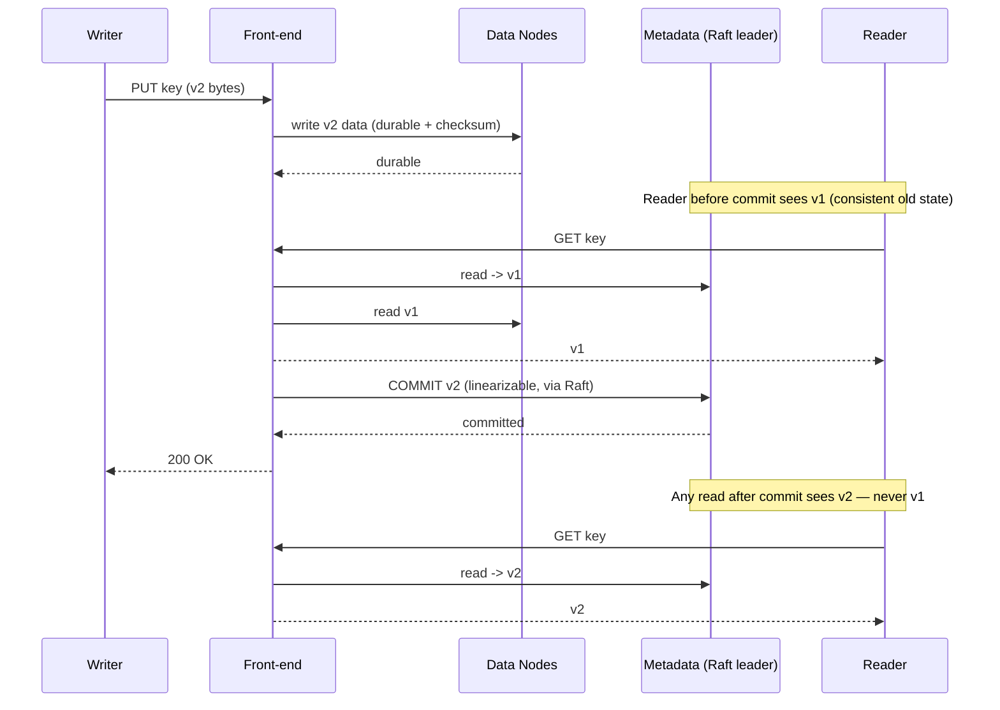

# Design S3 / an Object Store — Staff-Level HLD

> **Category:** Storage & Infrastructure
> **System:** A massively scalable, durable, highly-available object store (think Amazon S3, Google Cloud Storage, Azure Blob).
> **Reader:** Senior backend engineer practising HLD. We optimize for *design judgment*: what to clarify, what to trade off, and why each hard decision is defensible.

---

## 1. Problem & Clarifying Questions

### 1.1 Restate the problem

Build an **object store**: a service that stores opaque blobs ("objects") of arbitrary size — from a few bytes to terabytes — addressed by a key inside a flat namespace ("bucket"). It exposes a simple HTTP API (`PUT`, `GET`, `DELETE`, `LIST`) over the public internet, must be **extremely durable** (you do not lose customer data, ever), **highly available** (always able to serve reads/writes), and must scale to **exabytes** of data and **millions of requests per second** across millions of tenants.

An object store is *not* a file system and *not* a block store. Three distinctions worth stating up front, because they drive every later decision:

- **Object store vs file system:** No nested directories with rename/move semantics, no partial in-place writes (you cannot seek into an object and overwrite 4 KB at offset 8192 — you replace the whole object or upload a new version). The namespace is *flat*: `s3://bucket/a/b/c.jpg` — the `/` is just a character in the key, not a real directory.
- **Object store vs block store:** A block store (EBS, a SAN LUN) hands you a raw device you format and mount; it has low-level read/write of fixed-size blocks and is attached to *one* machine. An object store is multi-tenant, network-addressable via HTTP, and self-describing (each object carries metadata).
- **Immutability bias:** Objects are typically write-once / read-many. We exploit this heavily (it makes durability, caching, and erasure coding far easier than a mutable system).

### 1.2 Functional clarifying questions (what I'd ask the interviewer)

1. **Core operations:** Just `PUT / GET / DELETE / LIST`? Do we need **multipart upload** (uploading a huge object in parts in parallel)? Do we need **range GETs** (fetch bytes 0–1 MB of a 5 GB object)? *(Assume: yes to all — table stakes for an object store.)*
2. **Object size range:** Min and max object size? This decides whether we need multipart and chunking. *(Assume: 0 bytes to 5 TB per object, with multipart required above ~100 MB and mandatory above 5 GB.)*
3. **Consistency model:** Read-after-write? Do we need **strong read-after-write consistency** (a `GET` immediately after a successful `PUT` returns the new data) or is eventual consistency acceptable? *(Assume: strong read-after-write for new objects and overwrites — S3 moved to this in Dec 2020 and customers now expect it.)*
4. **Versioning:** Do overwrites replace the object or keep prior versions? *(Assume: versioning is supported but off by default per bucket.)*
5. **Mutability:** Append? In-place edit? *(Assume: no — objects are immutable; "edit" = full re-upload.)*
6. **Listing semantics:** Sorted by key? Prefix + delimiter listing (to fake directories)? Pagination? *(Assume: lexicographically sorted keys, prefix/delimiter listing, paginated at 1,000 keys.)*
7. **Multi-tenancy & access control:** Per-bucket ownership, IAM-style policies, presigned URLs (a time-limited URL that grants temporary access without credentials)? *(Assume: yes — bucket policies, ACLs, presigned URLs.)*
8. **Storage tiers / lifecycle:** Hot vs cold (infrequent access, archival/Glacier)? Lifecycle rules (auto-transition to cold after N days, auto-delete)? *(Assume: in scope as an extension; design the hooks, deep-dive the hot tier.)*
9. **Encryption:** At rest? In transit? Customer-managed keys? *(Assume: TLS in transit, AES-256 at rest by default; KMS-managed keys as an extension.)*
10. **Region/geo model:** Single region, multi-region replication, global namespace? *(Assume: design one region deeply; cross-region replication as async extension. Bucket names are globally unique.)*

### 1.3 Non-functional clarifying questions

1. **Durability target?** This is *the* number for a storage system. *(Assume: 99.999999999% — "eleven nines" — annual durability. This means for 10 million objects you'd expect to lose one object every ~10,000 years.)*
2. **Availability target?** *(Assume: 99.99% for the standard tier on the API — ~52 min/year of downtime budget; reads can be more available than writes.)*
3. **Latency targets?** *(Assume: first-byte latency p50 ~20–50 ms, p99 < 200 ms for small objects; throughput-oriented for large objects.)*
4. **Scale?** Total stored bytes, object count, request rate, ingest rate. *(Quantified below — exabytes, trillions of objects, millions of QPS.)*
5. **Read/write ratio?** *(Assume: read-heavy, ~10:1 read:write for the request count, though large-object writes dominate bandwidth.)*

### 1.4 Explicitly out of scope (for this round)

- Full IAM/policy engine internals (we assume an auth service exists and treat it as a dependency).
- Billing/metering pipeline internals (we note where usage events are emitted).
- The deep cold archive tape/optical robotics (we design the API and lifecycle hooks; the archival storage engine is a separate system).
- CDN edge design (we note where a CDN integrates).

---

## 2. Requirements (Finalized)

### 2.1 Functional

- **F1.** `PUT object` — create/overwrite an object under `bucket/key`, with user metadata and content type.
- **F2.** `GET object` — retrieve full object or a byte range; return metadata.
- **F3.** `DELETE object` — remove an object (or create a delete marker if versioned).
- **F4.** `LIST` — list keys in a bucket, filtered by prefix/delimiter, paginated, lexicographically sorted.
- **F5.** **Multipart upload** — initiate, upload parts (parallel, out of order), complete/abort.
- **F6.** **Bucket ops** — create/delete bucket, configure (versioning, lifecycle, policy).
- **F7.** **Strong read-after-write consistency** for objects.
- **F8.** **Versioning** (optional per bucket), **presigned URLs**, **access control**.

### 2.2 Non-functional

| Property | Target | Notes |
|---|---|---|
| **Durability** | 11 nines (99.999999999%) | The defining requirement. Achieved by replication / erasure coding across many failure domains. |
| **Availability** | 99.99% writes, 99.999% reads | Reads can survive more failures than writes. |
| **Latency** | p50 20–50 ms TTFB, p99 < 200 ms (small obj) | Large objects are throughput-bound. |
| **Scale** | Exabytes, trillions of objects, millions QPS | Must scale horizontally without re-architecting. |
| **Consistency** | Strong read-after-write per object | Newly written/overwritten object is immediately readable. |
| **Multi-tenancy** | Millions of tenants, fair isolation | No noisy-neighbor takedown. |
| **Cost** | Storage cost dominates; minimize overhead | Erasure coding chosen largely for cost. |

### 2.3 Key assumptions

- Objects immutable; overwrite = new object version (logical or physical).
- Single region designed in depth; cross-region async replication is an add-on.
- Bucket namespace global; key namespace per-bucket.
- We control the datacenter topology (multiple **Availability Zones** — physically isolated datacenters with independent power/cooling/network within a region).

---

## 3. Capacity Estimation

We'll size a single large region. All numbers are illustrative-but-realistic; the point is the arithmetic and the conclusions it forces.

### 3.1 Storage

Assume:
- **Total logical data stored:** 1 exabyte (EB) = 10^18 bytes in this region.
- **Average object size:** This matters enormously. Object stores have a *bimodal* distribution: zillions of tiny objects (thumbnails, JSON, logs) and a smaller number of huge objects (videos, backups, datasets). Take a blended **average of 1 MB** for sizing object *count*, but model both ends in deep dives.

**Object count:**
```
1 EB / 1 MB = 10^18 / 10^6 = 10^12 objects = 1 trillion objects.
```
This single number kills any "store metadata in one SQL row table" idea — the **metadata store must itself be a horizontally sharded distributed database** holding ~10^12 rows in this region.

**Raw physical storage with redundancy:** With **3x replication** you'd need 3 EB raw. With **erasure coding at, say, 10+4** (10 data shards + 4 parity shards; explained in Deep Dive 2) the overhead is 14/10 = **1.4x**, so **1.4 EB raw**. The cost difference — 3 EB vs 1.4 EB of disk — is colossal at exabyte scale, which is why we'll choose erasure coding for the bulk tier.

**Disk count:** With ~20 TB HDDs:
```
1.4 EB / 20 TB = 1.4 × 10^18 / 2 × 10^13 = 70,000 drives (just for one region's data).
```
Plus spares, OS disks, and growth headroom → on the order of **~100k drives**, spread across thousands of storage servers.

### 3.2 Request rate (QPS)

Assume **2 million requests/sec** aggregate at peak in this region, read-heavy at ~10:1:
```
Reads:  ~1.8M GET/s
Writes: ~0.2M PUT/DELETE/s   (plus multipart part-uploads)
```

A single front-end (API/proxy) box handling small-object requests can do maybe ~10k req/s (TLS, auth, routing, streaming). So:
```
2,000,000 / 10,000 = 200 front-end servers (plus N+ headroom → ~300+).
```

### 3.3 Bandwidth (the bottleneck people forget)

If average GET is 1 MB:
```
1.8M GET/s × 1 MB = 1.8 TB/s read egress.
0.2M PUT/s × 1 MB = 0.2 TB/s write ingress.
```
1.8 TB/s = **14.4 Tbps** of read traffic. A 100 Gbps NIC = 12.5 GB/s. So:
```
1.8 TB/s / 12.5 GB/s ≈ 144 NICs saturated end-to-end on the read path
```
— meaning the network fabric (top-of-rack, spine) and disk read throughput, not CPU, dominate large-object cost. **This argues for a fat, flat datacenter network and for keeping the data path lean** (no extra hops, stream don't buffer). It's also why a **CDN / edge cache** in front of hot, public objects is so valuable: it removes read bandwidth from the origin.

### 3.4 Metadata store sizing

Per-object metadata (key, bucket id, size, etag/checksum, content-type, timestamps, placement pointers, version id, ACL ref) ≈ **1 KB/object** (generous):
```
10^12 objects × 1 KB = 10^15 bytes = 1 PB of metadata.
```
Even *metadata* is a petabyte. It must be a **sharded, replicated, indexed key-value/wide-column store**, not a single relational DB. Metadata QPS roughly tracks request QPS (each op is ≥1 metadata read/write): ~2M+ metadata ops/sec.

### 3.5 Memory / cache

Caching tiny hot objects and metadata in RAM is high-leverage. If 0.1% of objects are hot and avg 100 KB:
```
10^12 × 0.001 × 100 KB = 10^11 × 10^5 = 10^... → 10^9 hot objects × 100 KB = 10^14 bytes = 100 TB hot set.
```
That's too big for a single cache but fine across a distributed cache fleet; in practice you cache the *hottest* slice plus metadata. Metadata caching is even higher leverage (small entries, accessed on every request).

### 3.6 Sizing summary

| Resource | Estimate | Forcing conclusion |
|---|---|---|
| Objects | ~1 trillion / region | Metadata must be a sharded distributed DB |
| Metadata size | ~1 PB | Cannot live in one node; KV/wide-column, sharded |
| Raw storage | ~1.4 EB (EC) vs 3 EB (3x) | Erasure coding for bulk tier (cost) |
| Drives | ~100k | Failures are constant → background repair is mandatory |
| QPS | ~2M (1.8M read) | ~300 front-ends; horizontal everywhere |
| Bandwidth | ~1.8 TB/s read | Fat network; CDN for hot reads; lean data path |

The recurring theme: **at exabyte scale, hardware failure is not an event, it is a constant.** With 100k drives and an AFR (annualized failure rate) of ~2%, you lose ~2,000 drives/year ≈ **~5–6 drive deaths per day, every day**. The system must treat continuous failure and continuous repair as the normal operating mode.

---

## 4. API Design

HTTP/REST, S3-compatible shape. All requests authenticated (signature v4-style: HMAC over canonical request using a secret key; the server recomputes and compares — the secret never crosses the wire). Bucket may be in the host (`bucket.s3.example.com`) or path (`/bucket/key`).

### 4.1 Object operations

```
PUT /{bucket}/{key}
  Headers: Content-Length, Content-Type, Content-MD5 (or x-amz-content-sha256),
           x-amz-meta-* (user metadata), Authorization, x-amz-storage-class
  Body:    raw object bytes
  → 200 OK  { ETag: "<md5-or-composite>", VersionId?: "<id>" }
  → 400/403/409/500

GET /{bucket}/{key}
  Headers: Range: bytes=0-1048575 (optional), If-None-Match (conditional)
  → 200 / 206 (partial)  Body: bytes
     Headers: ETag, Content-Length, Content-Type, Last-Modified, x-amz-meta-*
  → 304 (not modified), 404, 403

HEAD /{bucket}/{key}          # metadata only, no body — cheap existence/size check

DELETE /{bucket}/{key}
  → 204 No Content  (creates a delete marker if versioning on)
```

### 4.2 Listing

```
GET /{bucket}?prefix=photos/2024/&delimiter=/&max-keys=1000&continuation-token=<tok>
  → 200 XML/JSON:
     {
       Contents: [ {Key, Size, ETag, LastModified, StorageClass}, ... ],
       CommonPrefixes: [ "photos/2024/jan/", ... ],   # the "folders"
       IsTruncated: true,
       NextContinuationToken: "<tok>"
     }
```
`delimiter=/` rolls up everything after the next `/` into `CommonPrefixes`, which is how clients render "folders" over a flat namespace.

### 4.3 Multipart upload

```
POST /{bucket}/{key}?uploads
  → 200 { UploadId: "<id>" }

PUT /{bucket}/{key}?partNumber=<n>&uploadId=<id>
  Body: part bytes (each part ≥ 5 MB except the last; parts uploaded in parallel, any order)
  → 200 { ETag: "<part-etag>" }

POST /{bucket}/{key}?uploadId=<id>     # complete
  Body: { Parts: [ {PartNumber, ETag}, ... ] }   # client declares the assembly order
  → 200 { ETag: "<composite-etag>", Location, VersionId? }

DELETE /{bucket}/{key}?uploadId=<id>   # abort → frees parts (lifecycle also auto-aborts stale ones)
```

### 4.4 Bucket & control plane

```
PUT  /{bucket}                      # create bucket (globally unique name)
DELETE /{bucket}                    # delete (must be empty)
PUT  /{bucket}?versioning           # enable/suspend versioning
PUT  /{bucket}?lifecycle            # transition/expire rules
PUT  /{bucket}?policy               # access policy
GET  /{bucket}?location | ?acl | ...
```

### 4.5 Presigned URL

A presigned URL embeds the signature, an expiry, and the operation in query params, so a client without credentials can `GET`/`PUT` directly until expiry. The server validates the embedded signature exactly as for a normal request. This offloads bytes from the app server — the browser talks straight to the object store.

**Idempotency note:** `PUT object` is naturally idempotent on `(bucket, key)` — re-issuing the same PUT yields the same final state (last writer wins, or same version content). Multipart `complete` is made idempotent by keying on `uploadId` (completing twice with the same parts list returns the same result).

---

## 5. High-Level Architecture

### 5.1 The fundamental split: metadata plane vs data plane

The single most important architectural decision in an object store is **separating the metadata layer from the data layer**:

- **Data layer** stores the actual object bytes on a huge fleet of storage nodes (disks). Optimized for throughput, durability, cheap bytes.
- **Metadata layer** stores the *index*: "object `bucket/key@version` lives at these placement locations, has this size/etag/checksum, these ACLs." Optimized for low-latency lookups, strong consistency, and listing.

Why separate them? Because their requirements diverge sharply. Metadata is small, must be strongly consistent and richly indexed (for `LIST`), and is read on *every* request. Data is enormous, append/immutable, throughput-bound, and read only when the object itself is fetched. Coupling them would force one storage technology to be good at two contradictory jobs and would make scaling them independently impossible. (S3's real "strong consistency" launch in 2020 was fundamentally a story about strengthening the *metadata* layer.)

### 5.2 Components

- **Front-end / API tier (stateless):** Terminates TLS, authenticates/authorizes, validates the request, computes checksums, and orchestrates the read/write across metadata + data. Stateless and horizontally scaled behind L4/L7 load balancers + DNS.
- **Load balancer + DNS:** Spreads traffic across front-ends across AZs; health-checks; sheds load.
- **Metadata service:** Sharded, replicated, strongly consistent store mapping `(bucket, key, version) → {placement, size, checksum, acl, ...}`, plus the bucket registry and the listing index.
- **Placement service / partition manager:** Decides *where* new object data goes (which storage nodes / placement groups), using consistent hashing + capacity/health awareness. Maintains the cluster map.
- **Data nodes (storage nodes):** Own disks; store chunks/shards; serve byte reads/writes; report health and run local scrubbing.
- **Background services:** Repair/anti-entropy, garbage collector, lifecycle/tiering engine, checksum scrubber, rebalancer.
- **Caches:** Metadata cache (hot index entries); object cache / CDN (hot small objects).

### 5.3 ASCII block diagram

```
                         Internet (clients, SDKs, presigned URLs)
                                       |
                            DNS  +  L4/L7 Load Balancers
                                       |
        +------------------------------+------------------------------+
        |                              |                              |
   [Front-end]                    [Front-end]                    [Front-end]   (stateless, many, multi-AZ)
   TLS, AuthN/Z, validate,        ...                            ...
   checksum, orchestrate
        |            \                                   /
        |  (1) metadata lookup/commit                   |  (2) data read/write (streamed, EC encode/decode)
        v             \                                /  v
+------------------+   \                              /  +--------------------------------------------+
|  METADATA PLANE  |    \                            /   |               DATA PLANE                   |
|------------------|     \                          /    |--------------------------------------------|
| Bucket registry  |      \    +-----------------+ /     |  Placement svc (consistent hashing,        |
| Object index     |       +-->| Placement /     |<------|   cluster map, capacity/health)            |
| (sharded KV/     |           | Partition mgr   |       |                                            |
|  wide-column,    |           +-----------------+       |  Data nodes (disks) in placement groups,   |
|  strongly        |                                     |   spread across AZs / racks:               |
|  consistent,     |     [Metadata cache]                |   [Node][Node]...  shards/replicas         |
|  Raft groups)    |                                     |   local scrub + checksums                  |
+------------------+                                     +--------------------------------------------+
        ^                                                          ^
        |                                                          |
        +------------------ BACKGROUND PLANE ----------------------+
          Repair/anti-entropy | GC | Scrubber | Lifecycle/Tiering | Rebalancer | Metering

   [CDN / Edge cache] sits in front of the LBs for hot, public, cacheable GETs.
```

### 5.4 Mermaid diagram



### 5.5 Write path (PUT) — sequence



The **commit ordering** is the crux of strong consistency (Deep Dive 4): data is made durable *first*, then the metadata commit is the **atomic, linearizable point** at which the object becomes visible. No reader can see the object before that commit, and every reader sees it immediately after.

### 5.6 Read path (GET) — sequence



---

## 6. Data Model & Storage Choices

### 6.1 Logical entities

- **Bucket:** `{ bucket_name (globally unique PK), owner_id, region, created_at, versioning_state, policy_ref, lifecycle_rules, default_storage_class }`
- **Object (version):** `{ bucket_id, key, version_id, size, etag, content_type, user_metadata[], storage_class, created_at, is_delete_marker, placement_descriptor, acl_ref }`
- **Placement descriptor:** the durable pointer into the data plane: `{ placement_group_id, encoding=EC(10,4)|REPLICA(3), shard_locations[], chunk_map (for large/multipart objects) }`
- **Multipart upload (in-progress):** `{ upload_id, bucket_id, key, initiated_at, parts[{part_no, etag, placement, size}] }`
- **Data chunk/shard:** physical unit on a data node: `{ chunk_id, bytes, checksum, ... }`

### 6.2 Metadata store: choice and justification

**Access patterns:**
- Point lookup by `(bucket, key, version)` on *every* request → needs fast, sharded key lookups.
- `LIST` by prefix in **sorted key order**, paginated → needs an **ordered/range index** within a bucket (or bucket-prefix).
- Strong, linearizable consistency for the commit point.
- ~1 PB, ~2M+ ops/sec, ~1 trillion rows.

**Options:**

| Option | Strengths | Weaknesses | Verdict |
|---|---|---|---|
| Single relational DB (Postgres/MySQL) | Strong consistency, rich indexes, easy | Cannot hold 1 PB / 1T rows / 2M QPS on one node; vertical limit | ❌ |
| Sharded relational (Vitess-style) | Familiar, ordered indexes, sharded | Cross-shard listing/txn complexity; ops heavy at this scale | ⚠️ viable but heavy |
| Wide-column / ordered KV (Bigtable, Cassandra, HBase, ScyllaDB, FoundationDB) | Horizontally scalable, **ordered rows → range scans for LIST**, tunable consistency | Eventual-by-default needs care for strong R-A-W; ops complexity | ✅ leading choice |
| Plain hash KV (Dynamo-style, no order) | Massive scale, simple | **No efficient ordered LIST** without a secondary index | ⚠️ needs add-on index |

**Decision:** A **sharded, ordered, strongly-consistent metadata store** — modeled as a partitioned **key-value/wide-column store with per-shard consensus (Raft/Paxos)** for linearizable commits, with the **row key chosen as `(bucket_id, key)`** so that keys for a bucket sort lexicographically and `LIST` becomes a **range scan**. FoundationDB or a Bigtable/Spanner-class store are the canonical real-world picks; the design point is: *ordered keys + per-partition consensus + horizontal sharding.*

**Sharding key — the trap:** If you shard purely by `bucket_id`, a single huge bucket (one customer with a trillion objects) becomes a hotspot and can't be split → **partition by `(bucket_id, key-range)`** and allow a bucket's key-space to be split across many shards. This makes one big bucket scale, at the cost that `LIST` of a whole bucket may fan out across shards (handled by merging sorted sub-ranges).

**Why the failure mode matters:** Sharding by bucket alone avoids no real failure — it *creates* one (the hot bucket). Range-splitting the keyspace avoids the **unsplittable-hot-partition** failure where one tenant saturates one shard.

### 6.3 Data store: choice and justification

The data plane is a **custom distributed blob store**: data nodes own raw disks and store **chunks/shards** addressed by an internal `chunk_id` (not the user key). Objects are split into chunks; each chunk is either **replicated** (small/hot, low-latency tier) or **erasure-coded** (bulk tier, cost). We do *not* put object bytes in the metadata DB — blobs there would wreck its performance and cost.

Large objects are split into **chunks** (e.g., 64 MB–256 MB) precisely so that: (a) each chunk is independently placed and repaired; (b) range GETs touch only the relevant chunks; (c) parallel read/write across many disks gives throughput; (d) a single drive failure only loses one shard of one chunk, repaired locally.

---

## 7. Deep Dives (the bulk)

We deep-dive the five genuinely hard sub-problems: (1) durability via replication vs erasure coding; (2) placement via consistent hashing; (3) the metadata layer & listing; (4) strong read-after-write consistency; (5) multipart upload, hot objects, and background repair/anti-entropy.

---

### Deep Dive 1 — Durability: Replication vs Erasure Coding

**The problem:** Achieve 11 nines of durability on ~100k unreliable drives where ~6 die every day, *and* do it cheaply. Durability is about surviving *correlated* and *independent* failures: a single drive (independent), a whole rack (shared power/switch), a whole AZ (datacenter event), and bit rot (silent corruption).

#### Option A — N-way Replication

Store N full copies on N different failure domains (different nodes, racks, AZs). With **3x replication across 3 AZs**, you survive the loss of any 2 copies and any single-AZ outage.

- **Pros:** Dead simple. Reads can come from any copy (great for hot objects and read availability). Repair = copy one surviving replica to a new node (cheap, just a copy). Low read/write latency.
- **Cons:** **200% storage overhead** (3x raw). At exabyte scale that's the difference between 1.4 EB and 3 EB of disk — enormous cost.

#### Option B — Erasure Coding (EC)

**What erasure coding is (explain it):** Split an object (or chunk) into **k data shards**, then compute **m parity shards** using Reed–Solomon coding (math over a finite/Galois field — think of parity as generalized, recoverable "checksums" computed so that *any* k of the (k+m) shards can reconstruct the original). You store all **n = k+m** shards on **n distinct failure domains**. You can lose **any m shards** and still rebuild the data.

Example **EC(10,4)**: 10 data + 4 parity = 14 shards. Storage overhead = 14/10 = **1.4x** (vs 3.0x). Durability: survives loss of **any 4** of 14 shards. Spread those 14 shards across AZs/racks and you tolerate an AZ loss too (if no AZ holds more than 4 shards).

- **Pros:** **Massive cost savings** (1.4x vs 3x). Higher *fault tolerance per byte stored*: EC(10,4) tolerates 4 simultaneous losses for 40% overhead; matching that with replication would need 5 copies (400% overhead). This is why every large object store uses EC for the bulk/cold tier.
- **Cons:**
  - **Compute cost** to encode on write and **decode on read when a shard is missing** (CPU/finite-field math).
  - **Repair amplification:** to rebuild one lost shard you must read **k shards** (e.g., read 10 to rebuild 1) → repair traffic and I/O are amplified ~k×. With thousands of drive failures, this is real network/disk load.
  - **Worse small-object economics:** splitting a 4 KB object into 10 shards of ~400 B each is wasteful (per-shard overhead, more seeks, more metadata). EC shines for *large* chunks.
  - **Higher read latency tail** when reconstruction is needed (must gather k shards, possibly cross-AZ).

#### Tradeoff table

| Dimension | 3x Replication | EC(10,4) | EC(6,3) |
|---|---|---|---|
| Storage overhead | 3.0x (200%) | 1.4x (40%) | 1.5x (50%) |
| Failures tolerated (simultaneous) | 2 | 4 | 3 |
| Read latency (healthy) | Low (read 1 copy) | Higher (gather 10 shards) or read systematic data shards | Medium |
| Read on shard loss | Read another copy | Decode from k shards (CPU + I/O) | Decode |
| Repair cost | 1x copy | ~k× read amplification | ~k× |
| Best for | Small / hot / low-latency | Large / bulk / cold | Medium objects |
| Cost at EB scale | Very high | Low | Low-medium |

#### Decision (defended)

**Tiered durability strategy:**
- **Small and/or hot objects → 3x replication across AZs.** Failure mode avoided: the *latency and repair-amplification penalty* and *small-shard waste* of EC. You pay storage to get simple, fast, any-copy reads.
- **Large and/or cold objects → erasure coding (e.g., EC(10,4) or wider for cold) across AZs/racks**, with shards placed so no single AZ holds more than `m` shards. Failure mode avoided: the *crippling storage cost* of replicating exabytes, while still surviving an AZ loss.
- **Always:** every shard/replica carries an **end-to-end checksum**; the system places replicas/shards across **independent failure domains** (node → rack → AZ) so a correlated outage cannot exceed the tolerance. Spreading across failure domains is what turns "tolerates m drive failures" into "tolerates an AZ failure."

**Why this hits 11 nines:** Durability math is dominated by the probability that more than `m` failure domains are lost faster than repair completes. With independent placement, fast detection, and aggressive background repair (Deep Dive 5) that rebuilds within hours, the window for compounding failures is tiny — pushing the modeled annual loss probability to ~10^-11. The two levers are **redundancy width (m)** and **mean-time-to-repair**; we tune both.

---

### Deep Dive 2 — Placement via Consistent Hashing

**The problem:** Given a new object/chunk, decide *which* nodes store its replicas/shards, such that (a) data is balanced across the fleet, (b) adding/removing nodes moves as little data as possible, (c) placement respects failure domains, and (d) the mapping is computable without a central bottleneck on the hot path.

#### Why not naive hashing?

`node = hash(chunk_id) % N` balances well — until `N` changes. Add or remove one node and `% N` becomes `% (N±1)`, **remapping nearly every key** → a storm of data movement. With 100k drives churning daily this is catastrophic. We need a scheme where a topology change moves only ~`1/N` of the data.

#### Option A — Consistent Hashing (ring)

Hash both **nodes** and **keys** onto a ring (e.g., 0..2^64). A key is owned by the next node clockwise; replicas go to the next distinct nodes (skipping to satisfy failure-domain rules). Adding a node only steals a slice from its ring neighbor → only ~`1/N` of keys move.

- **Virtual nodes (vnodes):** Give each physical node many points on the ring so load is smooth and heterogeneous drive sizes are handled by assigning more vnodes to bigger nodes. Without vnodes, the ring is lumpy and one node can get a huge arc.
- **Pros:** Minimal data movement on change; decentralized; well understood (Dynamo, Cassandra, Ceph's CRUSH is a cousin).
- **Cons:** Hard to express "exactly 3 copies in 3 distinct AZs" purely from a ring; needs constraint logic layered on top. Pure client-side ring math can drift from reality (a node is "up" on the ring but actually full or degraded).

#### Option B — Centralized placement service with a cluster map

A **placement/partition manager** keeps the authoritative **cluster map** (which nodes exist, their AZ/rack, capacity, health) and assigns each new object to a **placement group** (a pre-formed set of nodes spanning failure domains), recording the assignment in the placement descriptor.

- **Pros:** Full control — capacity-aware, health-aware, failure-domain-aware placement; easy to drain/rebalance; placement is *recorded* (in metadata) so reads don't recompute it and topology can change freely without affecting existing objects.
- **Cons:** The placement service must be HA and not on the critical byte path; it's another system to scale (handled by caching the cluster map at front-ends and sharding the manager).

#### Tradeoff table

| Dimension | Consistent hashing (computed) | Centralized placement + recorded map |
|---|---|---|
| Data movement on topology change | ~1/N (minimal) | Decoupled — old objects keep recorded placement; only new/rebalanced data moves |
| Failure-domain constraints | Bolted on | Native (placement groups span AZs by construction) |
| Capacity/heterogeneity awareness | Via vnodes (approx) | Exact (manager sees free space) |
| Hot-path dependency | None (pure math) | Must cache map; not on byte stream |
| Hotspot avoidance | Vnodes smooth it | Manager can actively avoid/drain |

#### Decision (defended)

**Use a hybrid: consistent hashing (with vnodes) as the *balancing primitive*, wrapped in a placement service that records placement in the metadata and enforces failure-domain + capacity constraints.** Concretely: the placement service forms **placement groups** of nodes across AZs/racks (using consistent-hashing/CRUSH-style math to pick candidates), assigns new data to a group, and **writes the placement descriptor into the object metadata**. Reads then follow the *recorded* placement — they never recompute it.

**Failure modes avoided:**
- *Naive `% N`*: avoids the **re-shuffle-the-world** storm on every node change.
- *Pure client-side ring*: avoids **placing all 3 copies in one AZ** (no failure-domain guarantee) and avoids **drift** (the ring saying a full/dead node is fine).
- *Recording placement in metadata* avoids the **"recompute placement on every read"** brittleness: you can change hashing/topology without orphaning existing data, because each object already knows where it lives.

This is essentially how Ceph (CRUSH map), Dynamo/Cassandra (ring + vnodes), and S3-class systems all converge: a deterministic spreading function constrained by a topology/failure-domain map, with placement durably recorded.

---

### Deep Dive 3 — The Metadata Layer & Listing

**The problem:** The metadata layer must (a) do a strongly-consistent point lookup on every request at ~2M+ QPS, (b) support **`LIST` with prefix + delimiter in sorted order**, paginated, even for buckets with a trillion keys, and (c) not become a hotspot for a single huge bucket.

#### Point lookups

Row key = `(bucket_id, key, version_id)`. A `GET`/`HEAD`/`DELETE` is a single point read on the owning shard. Cache hot entries in a **metadata cache** (the same object is often fetched repeatedly). Because metadata entries are tiny, caching is extremely high-leverage: a cache hit avoids a metadata-store round trip entirely.

#### Listing — the hard part

`LIST bucket?prefix=photos/2024/&delimiter=/` must return, in sorted order, all keys under the prefix, rolling up sub-"folders" into `CommonPrefixes`. Because we chose an **ordered row key**, this is a **range scan** from `photos/2024/` to the prefix's upper bound — efficient on an ordered store, impossible-cheap on a pure hash store (which would have to scan everything). This is the decisive reason we did *not* pick a pure hash KV for metadata.

**Delimiter rollup:** scan keys in order; for each key, find the next `/` after the prefix. If present, emit the truncated string into `CommonPrefixes` (dedup consecutive) and skip ahead past that sub-prefix; otherwise emit the key into `Contents`. **Pagination** uses a `continuation-token` that encodes the last key returned, so the next page resumes the scan deterministically (cursor-based, not offset-based — offsets are O(n) and break under concurrent writes).

**The hot/large-bucket problem:** A trillion-key bucket can't live on one shard. We **range-split** the bucket's keyspace across shards (Deep Dive 6 in §6.2). `LIST` then becomes a **merge of sorted sub-ranges** across the relevant shards (a streaming k-way merge), still returning globally sorted results. Splitting is automatic when a shard exceeds size/QPS thresholds (à la Bigtable tablet splits / HBase region splits).

#### Consistency of listing

`LIST` is typically only **eventually consistent** with respect to very recent writes in many real systems — but with our strongly-consistent metadata commit, a key that was successfully `PUT` and committed is in the index and *will* appear in subsequent lists once the index entry is committed (we discuss the nuance in Deep Dive 4). The key design choice: **the listing index and the point-lookup index are the same ordered structure**, so there's no separate, lagging "secondary index" to keep in sync — a frequent source of bugs in designs that bolt a search index onto a hash store.

#### Tradeoff: separate listing index vs unified ordered store

| Approach | Pros | Cons |
|---|---|---|
| Hash KV for lookups + separate sorted/search index for LIST | Each optimized | Two stores to keep consistent; index lag; more failure modes |
| **Unified ordered store (chosen)** | One source of truth; LIST = range scan; no index lag | Ordered store slightly more complex to shard (range splits) |

**Decision:** unified ordered, range-split metadata store. **Failure mode avoided:** the **dual-write / index-skew** failure where the lookup store and the list index disagree (object exists on GET but missing from LIST, or vice versa) — a classic, painful inconsistency that erodes the "it's in there" trust contract.

---

### Deep Dive 4 — Strong Read-After-Write Consistency

**The problem:** A client `PUT`s an object and immediately `GET`s it (or `LIST`s it). It **must** see the new data — and after an *overwrite*, it must see the *new* version, never a stale one. This is harder than it sounds in a distributed, cached, multi-AZ system, and it was the single biggest correctness upgrade in S3's history (eventual → strong, 2020).

**Why eventual consistency leaks:** With replicated/cached metadata, a write might commit on one replica while a read hits a lagging replica or a stale cache → the reader sees "not found" or old data. Caches that store *negative* results ("this key doesn't exist") are especially dangerous: a GET-before-PUT can cache a 404 that then masks the subsequent PUT.

#### Mechanism

The design makes the **metadata commit the single linearization point**:

1. **Data first, then metadata.** Object bytes are made durable (write quorum / enough EC shards acked + checksum verified) *before* the metadata commit. The object does not "exist" to any reader until the metadata commit lands.
2. **Linearizable metadata commit.** The metadata shard owning `(bucket, key)` uses **consensus (Raft/Paxos)**: the commit is agreed by a quorum of the shard's replicas and is *linearizable* — once acknowledged, every subsequent read of that key (routed to the leader or a quorum read) sees it. We **read through the leader (or do a quorum/lease read)** for object lookups so reads never observe a state older than the latest commit.
3. **No stale negative caching.** The metadata cache must be **invalidated or versioned on commit**, and we **never cache negative lookups in a way that outlives a subsequent write** (e.g., very short TTL on negatives, or write-through invalidation). This closes the "cached 404 masks new object" hole.
4. **Overwrite ordering.** Overwrites bump a monotonically increasing version/sequence on commit; readers always resolve to the highest committed version. Concurrent PUTs to the same key are linearized by the consensus log → deterministic last-writer-wins (or distinct versions if versioning is on).

#### Sequence (overwrite with concurrent reader)



#### Tradeoff: where to pay the consistency tax

| Choice | Pros | Cons / failure mode avoided |
|---|---|---|
| Eventual (read any replica, lazy caches) | Lowest latency, highest read availability | Stale reads, cached 404s — **breaks the R-A-W contract** |
| **Strong via leader/quorum reads + commit-as-linearization-point (chosen)** | Correct R-A-W; predictable | Slightly higher read latency / lower write availability during leader election |
| Strong via global transaction across data+metadata (2PC) | Atomic | Heavy, slow, blocking; coordinator failures stall writes |

**Decision:** **Two-phase in spirit but not 2PC:** make data durable first, then use a **single linearizable metadata commit** as the visibility point, with **leader/quorum metadata reads** and **commit-driven cache invalidation**. This gives strong read-after-write without a distributed transaction across two systems.

**Failure modes avoided:**
- **Stale-replica read** → quorum/leader reads.
- **Cached-404 masking a new write** → no durable negative caching / write-through invalidation.
- **Torn write visible** (metadata points at data that isn't fully durable) → data-before-metadata ordering.
- **Lost-update on concurrent overwrite** → consensus log linearizes commits.

**Availability tradeoff (state it honestly):** strong consistency on writes means a write to a key is unavailable during that shard's brief leader election (a few seconds). Reads remain available from any in-sync replica via quorum. This is the deliberate CAP posture: for the *metadata commit* we choose consistency over availability during partitions, because silently serving stale/lost data in a storage system is worse than a brief, retryable write error. The *data plane* (bytes) can favor availability because immutable bytes never go stale.

---

### Deep Dive 5 — Multipart Upload, Hot Objects, and Background Repair/Anti-Entropy

This deep dive bundles three operationally critical mechanisms.

#### 5A. Multipart Upload

**The problem:** Uploading a 5 TB object in one HTTP request is fragile (one network blip = restart from zero), slow (single TCP stream), and bounded by one front-end's throughput.

**Mechanism:**
1. `Initiate` → server allocates an `upload_id` and a metadata record for the in-progress upload.
2. Client uploads **parts in parallel**, in any order, each ≥5 MB (except the last). Each part is independently made durable (chunked + replicated/EC) and returns a **part ETag**. Parts can be **retried independently** — a failed part doesn't touch the others.
3. `Complete` → client sends the ordered list of `{part_no, ETag}`. The server **verifies each part's ETag** (detects corruption/missing parts), **stitches the chunk map** into a single object placement descriptor, and does the **single linearizable metadata commit** that makes the assembled object visible (reusing Deep Dive 4's commit point — completion is the atomic visibility moment, so a half-completed multipart upload is never readable as a partial object).
4. `Abort` (or lifecycle auto-abort of stale uploads) frees orphaned parts.

**Why it's a deep-dive, not trivia:**
- **Throughput:** parallel parts saturate many disks/NICs → multi-GB/s uploads.
- **Resumability:** retry only the failed part; survive client/network failures.
- **Composite ETag:** the object ETag becomes a hash of part ETags (`md5-of-md5s-N`), which is why a multipart object's ETag isn't the MD5 of the whole object — an interview gotcha.
- **GC interaction:** aborted/incomplete uploads leave **orphan parts** that the garbage collector must reclaim (see 5C); lifecycle rules auto-abort uploads older than N days.

#### 5B. Hot Objects (the thundering herd on one key)

**The problem:** A single object goes viral (a celebrity photo, a popular release binary). Millions of GETs/sec for *one key* would hammer the few nodes holding its data and the one metadata shard owning its key → hotspot, latency spike, possible overload of those nodes.

**Mitigations (layered):**

| Technique | What it does | Failure mode avoided |
|---|---|---|
| **CDN / edge cache** | Serve hot, public, cacheable objects from edge POPs; origin sees a trickle | Origin meltdown from viral read fan-out |
| **Metadata caching** | Cache the hot key's metadata at front-ends so the metadata shard isn't hammered | Hot metadata-shard overload |
| **Replication of hot data** | Hot objects use 3x (or more) replication; reads spread across copies & AZs | Single-node read saturation |
| **Dynamic replica fan-out** | Detect a hot object, *add extra read replicas on the fly* | Sustained hotspot exceeding fixed replica count |
| **Request coalescing** | On a cache miss storm, one fetch fills the cache; concurrent requests wait on it | Cache-stampede (N identical origin fetches) |
| **Read from EC systematic shards** | For EC objects, the k data shards alone reconstruct the object without parity math when healthy | Decode CPU cost on every hot read |

**Decision:** Hot objects naturally belong on the **replicated tier** (any-copy reads) and behind a **CDN**; detect hotness via request counters and **auto-scale replicas + cache TTL**. The combination removes nearly all hot-key load from the durable origin.

**Hot *writes* to one key** (everyone overwriting the same key) are inherently serialized by the metadata consensus group → that key's write throughput is bounded by one Raft group. This is acceptable (concurrent writes to the *same* key are rare and semantically must serialize anyway), but worth naming: the fix is application-level key spreading, not a storage trick.

#### 5C. Background Repair, Anti-Entropy, Scrubbing & GC

**The problem:** With ~6 drives dying daily plus silent bit rot, the system must continuously detect and repair loss to keep durability at 11 nines. **Durability is not a static property — it's the outcome of detection speed and repair speed.**

**Mechanisms (the background plane):**

1. **Checksum scrubbing (anti-entropy for bit rot):** Every shard/replica stores a checksum. A background **scrubber** continuously re-reads data and re-verifies checksums to catch **silent data corruption** (a disk returning wrong bytes without an error). On mismatch, the bad shard is treated as lost and repaired from the others. Failure mode avoided: **silent corruption that goes undetected until the user reads it and finds garbage.**
2. **Replica/shard repair:** When a node/drive fails (heartbeat lost) or a scrub finds corruption, the **repair service** reconstructs the missing replicas/shards:
   - Replicated data → copy from a surviving replica to a fresh node.
   - EC data → read `k` surviving shards, recompute the lost shard, write it to a fresh node (the `k×` read amplification from Deep Dive 1).
   The placement service picks repair targets respecting failure domains. **Repair speed is a durability lever** — faster repair shrinks the window for compounding failures, so repair I/O is prioritized and parallelized across many nodes (declustered placement means a failed drive's data is spread over thousands of nodes, so thousands repair it in parallel → minutes-to-hours, not days).
3. **Anti-entropy / consistency reconciliation:** Periodically compare replica sets (e.g., via **Merkle trees** — hash trees that let two nodes find diverging ranges with minimal data exchange) to catch divergence that heartbeats miss. Failure mode avoided: **slow drift between replicas after transient failures.**
4. **Garbage collection:** Deletes, overwrites (old versions), and aborted multipart parts create **unreferenced data**. The GC walks placement references vs stored chunks and reclaims orphans. This is done **carefully and lazily** with grace periods to avoid the catastrophic failure mode of **deleting data still referenced by a concurrent operation** — typically a mark-and-sweep with a quarantine window and a final cross-check against committed metadata before physical deletion. **Failure mode avoided:** GC racing a commit and deleting live data (the worst bug a storage system can have).
5. **Rebalancer:** As nodes are added/drained or capacity skews, move data to even out utilization, again respecting failure domains.

**Decision (defended):** A dedicated **background plane** runs scrub + repair + anti-entropy + GC + rebalance continuously, **declustered** so failures are repaired in parallel by the whole fleet. This is what actually delivers 11 nines: the static redundancy (EC/replication) sets the *ceiling*, but fast detection + parallel repair determine whether you live near that ceiling. **The failure mode it avoids is the silent erosion of durability** — where redundancy quietly decays after each unrepaired failure until two more failures lose the data.

---

## 8. Scaling & Bottlenecks

**How it scales:** Every tier is horizontal and stateless-where-possible.
- **Front-ends:** stateless → add boxes behind the LB; scale with QPS.
- **Metadata:** range-sharded → split hot shards; scale with object count and metadata QPS.
- **Data nodes:** add racks/AZs; placement service spreads new data; rebalancer evens it.
- **Background plane:** scales with fleet size (more nodes = more repair workers).

**Where it breaks first, and the fix:**

| Bottleneck | Symptom | Fix |
|---|---|---|
| **Hot metadata shard** (one giant/hot bucket) | One shard at 100% CPU, listing slow | Range-split keyspace; metadata cache; spread bucket keyspace |
| **Hot object / key** | One key's nodes saturated | CDN + replica fan-out + request coalescing (Deep Dive 5B) |
| **Read bandwidth** (1.8 TB/s) | Network fabric / NICs saturated | Fat-tree network; CDN offload; lean data path (stream, no buffering); read from local AZ |
| **Repair I/O storm** (mass drive failure) | Repair traffic crowds out user I/O | Declustered placement (parallel repair); throttle/prioritize repair; rate-limit |
| **Placement service** | Slow placement decisions on writes | Cache cluster map at front-ends; shard the manager; placement off the byte path |
| **Cross-AZ latency for EC reads** | p99 spikes when gathering shards across AZs | Prefer same-AZ shards; read systematic data shards first; replicate hot data |
| **Small-object overhead** | Metadata/op cost dwarfs tiny payloads | Small-object packing (coalesce many tiny objects into larger physical blobs); replication not EC for tiny objects |
| **LB / connection limits** | Connection table exhaustion | Multiple LB layers, connection reuse, DNS-based spreading |

**The two scaling axes to always name:** *object count* (stresses metadata) and *bytes* (stresses data plane + network). They scale independently — a trillion 1 KB objects and a million 1 PB objects are completely different load profiles, and the design must handle both because real workloads are bimodal.

---

## 9. Reliability, Consistency & Security

### 9.1 Failure handling

- **Drive failure (~6/day):** detected by heartbeat/scrub → repair from redundancy. Normal, automated.
- **Node/rack failure:** placement spans failure domains → tolerated; repair re-spreads.
- **AZ failure:** redundancy spread so no AZ holds more than `m` shards (or all replicas) → reads/writes continue from other AZs; degraded but available.
- **Metadata shard leader failure:** Raft re-elects in seconds; brief write unavailability for that key range, reads continue via quorum.
- **Front-end failure:** stateless → LB routes around it.
- **Network partition:** metadata side favors consistency (write to the minority side fails, retryable); data reads of immutable bytes can continue from the reachable side.

### 9.2 Consistency model (recap)

- **Objects:** strong read-after-write (Deep Dive 4), linearized at the metadata commit.
- **Listing:** consistent with committed writes (unified ordered index — no lagging secondary index).
- **Cross-region replication (extension):** **asynchronous, eventually consistent** — you cannot have synchronous strong consistency across regions without paying inter-region RTT on every write; we accept eventual cross-region and surface replication lag metrics.
- **CAP posture:** within a region, metadata commits choose **CP** (consistency over availability during partitions); the immutable data plane leans **AP** for reads.

### 9.3 Durability (recap)

11 nines via EC/replication across failure domains + checksums + continuous scrub + fast declustered repair + careful GC. Static redundancy sets the ceiling; repair speed keeps you near it.

### 9.4 Idempotency

- `PUT object` idempotent on `(bucket, key)` (deterministic final state).
- Multipart `complete` idempotent on `upload_id` + parts list.
- `DELETE` idempotent (deleting a missing object → success/204).
- Clients should **retry with backoff**; the metadata commit's linearizability makes retries safe (no double-create of distinct objects for the same key).

### 9.5 Security

- **In transit:** TLS everywhere (public API + internal where crossing trust boundaries).
- **At rest:** AES-256 server-side encryption by default; KMS-managed and customer-provided keys as options. Encryption keys never stored next to the data they protect.
- **AuthN:** request signing (HMAC over canonical request; secret never transmitted) and/or presigned URLs (time-boxed, scoped).
- **AuthZ:** bucket policies + object ACLs + IAM, evaluated at the front-end before any data access. Default-deny.
- **Tenant isolation:** per-tenant quotas and **rate limiting** to prevent noisy-neighbor / abuse; per-key and per-bucket throttles.
- **Abuse / DDoS:** rate limiting at the LB/front-end, anomaly detection, WAF for the public endpoint, request-cost accounting (a `LIST` of a huge bucket is expensive — meter and throttle it).
- **Integrity:** end-to-end checksums (client → durable storage → client) catch corruption anywhere in the pipeline; the `Content-MD5`/`x-amz-content-sha256` header lets the server verify the upload matched what the client intended.
- **Audit:** access logging and (optionally) object-lock/WORM (write-once-read-many) for compliance/immutability guarantees.

---

## 10. Extensions & Follow-ups

| Extension | How the design changes |
|---|---|
| **Versioning** | Already modeled: `version_id` in the row key; delete creates a delete marker; GC reclaims non-current versions per lifecycle. List shows current versions by default. |
| **Lifecycle & tiering (hot→cold→archive)** | Lifecycle engine scans metadata, transitions objects between storage classes (re-encodes replicated→wider-EC for cold, moves to slow/cold media or tape/archive subsystem), or expires them. Restore from archive is async (retrieval job). |
| **Cross-region replication (CRR)** | Async replicator tails the metadata commit log, ships objects + metadata to the peer region. Eventually consistent; conflict resolution by version/timestamp. Adds disaster recovery + read locality. |
| **Strong global namespace / global bucket** | Requires a global consensus or a designated "home region" per bucket; usually solved by making bucket *names* globally unique but bucket *data* regional. |
| **Object-level events / notifications** | Emit events on PUT/DELETE to a queue/stream (for downstream pipelines, lambda triggers). Hook at the commit point. |
| **Select / in-place query (S3 Select)** | Push down filtering (e.g., SQL over CSV/Parquet) to the storage side to avoid transferring whole objects — compute near data. |
| **Requester-pays / metering** | Emit usage events (bytes stored, requests, egress) at the front-end for billing; meter expensive LISTs. |
| **WORM / Object Lock / legal hold** | Compliance immutability: block deletes/overwrites for a retention period; enforced at the metadata layer. |
| **Smaller p99 / acceleration** | Transfer acceleration via edge ingest (upload to nearest POP, backhaul on the backbone); CDN for reads. |
| **Strongly consistent cross-region** | Honestly: only via synchronous quorum across regions (high write latency) or by routing all writes for a key to one region. Tradeoff: latency vs global strong consistency — usually not worth it. |

---

## 11. Interview Q&A

**Q1. Why separate the metadata layer from the data layer?**
Their requirements diverge: metadata is small, strongly consistent, richly indexed (for LIST), read on every request; data is enormous, immutable, throughput-bound. Separating lets each use the right storage tech and scale independently. The metadata layer is where strong consistency and listing live; the data layer is where durability and cheap bytes live. *(Senior signal: this is the single most important decision and it's a tradeoff-driven one.)*

**Q2. Replication or erasure coding — which and why?**
Both, tiered. EC (e.g., 10+4 → 1.4x overhead) for large/cold/bulk data because at exabyte scale 3x replication's 200% overhead is prohibitively expensive, and EC tolerates more simultaneous failures per byte. Replication (3x across AZs) for small/hot data because EC wastes space on tiny objects and adds read latency + repair amplification. *Probe: how does EC reach 11 nines?* — Redundancy width sets the ceiling; fast declustered repair + scrubbing keep you near it by shrinking the multi-failure window.

**Q3. How do you get strong read-after-write consistency?**
Make data durable first, then perform a single **linearizable metadata commit** (via Raft/Paxos on the owning shard) as the visibility point; read via leader/quorum; never durably cache negative lookups. The commit is the linearization point — no read sees the object before it, every read sees it after. *Probe: what about a cached 404?* — Don't cache negatives beyond a short TTL / invalidate on commit; that's exactly the hole that breaks naive R-A-W. *Probe: concurrent overwrites?* — Serialized by the consensus log → deterministic LWW or distinct versions.

**Q4. How does consistent hashing help, and why not `hash % N`?**
`% N` remaps almost all keys when N changes → data-movement storm (fatal with daily node churn). Consistent hashing (with vnodes) moves only ~1/N on a change. But we wrap it in a placement service that enforces failure-domain/capacity constraints and **records** placement in metadata, so reads follow recorded placement and topology can change without orphaning data. *(Senior signal: naming the failure mode `% N` causes.)*

**Q5. Walk me through a multipart upload and why it exists.**
Initiate → parallel part uploads (each independently durable, retryable) → complete (verify part ETags, stitch chunk map, single linearizable commit). It exists for throughput (parallel streams saturate many disks/NICs), resumability (retry one part, not the whole TB), and to bound failure blast radius. Gotcha: the resulting ETag is a hash-of-hashes, not the whole-object MD5.

**Q6. How do you handle a viral hot object?**
Layered: CDN/edge for public reads, metadata caching, hot objects on the replicated tier with reads spread across copies/AZs, dynamic replica fan-out on detected hotness, and request coalescing to prevent cache stampedes. Removes nearly all hot-key load from the durable origin. *Probe: hot writes to one key?* — Serialized by the metadata consensus group; bounded by design; fix is app-level key spreading.

**Q7. With 100k drives, ~6 die daily. How is data not lost?**
Continuous detection (heartbeats + checksum scrubbing for silent corruption) + fast **declustered** repair (a failed drive's data is spread over thousands of nodes, so thousands repair in parallel → hours not days) + anti-entropy (Merkle-tree reconciliation) + careful GC. Durability is the *outcome* of repair speed, not just static redundancy. *(Senior signal: durability = redundancy × repair speed.)*

**Q8. How does `LIST` work efficiently for a bucket with a trillion keys?**
Ordered metadata row key `(bucket_id, key)` makes LIST a **range scan**; delimiter rollup produces CommonPrefixes; cursor-based pagination via continuation token. Huge buckets are **range-split** across shards, and LIST becomes a streaming k-way merge of sorted sub-ranges. *Probe: why not a hash KV?* — No efficient ordered scan; you'd need a separate, lagging secondary index → index-skew bugs.

**Q9. What's your CAP posture and where do you make the tradeoff?**
Within a region: metadata commits are **CP** (we'd rather return a retryable write error than serve stale/lost data); the immutable data plane is **AP** for reads (immutable bytes can be served from any reachable copy). Cross-region replication is async/eventual because synchronous strong consistency across regions costs inter-region RTT on every write. *(Senior signal: a defended, asymmetric CAP choice rather than a blanket answer.)*

**Q10. How do you guarantee an object I read is exactly what I wrote (integrity)?**
End-to-end checksums: client sends Content-MD5/SHA256, server verifies on ingest, stores per-shard checksums, the scrubber continuously re-verifies, and the read path verifies before returning. Corruption anywhere in the pipeline is detected and (on storage) repaired from redundancy. *(Probe: silent disk corruption?)* — That's exactly what scrubbing catches; a disk can return wrong bytes with no error, so you cannot trust the device — you trust the checksum.

---

## 12. Cheat-Sheet & Self-Test

### 12.1 Key numbers
- Durability **11 nines**; availability ~**99.99%** writes / higher reads.
- ~**1 EB** logical, **~1 trillion** objects, **~1 PB** metadata, **~100k** drives, **~2M QPS** (1.8M read), **~1.8 TB/s** read bandwidth.
- **EC(10,4)** = 1.4x overhead, tolerates 4 losses vs **3x replication** = 3.0x, tolerates 2.
- ~6 drive deaths/day → repair speed is a durability lever.

### 12.2 Key decisions (one-liners)
- **Split metadata plane (strong, ordered, sharded) from data plane (immutable, cheap, throughput).**
- **Tiered durability:** replication for small/hot, erasure coding for large/cold.
- **Consistent hashing + placement service**, placement **recorded** in metadata (not recomputed).
- **Ordered metadata row key `(bucket_id, key)`** → LIST = range scan; range-split for huge buckets.
- **Strong R-A-W via data-then-linearizable-metadata-commit**, leader/quorum reads, no durable negative caching.
- **Multipart** for throughput/resumability; **CDN + replica fan-out + coalescing** for hot objects.
- **Background plane:** scrub + declustered repair + anti-entropy (Merkle) + careful GC = the thing that actually delivers 11 nines.

### 12.3 Diagram in words
Client → CDN → LB → stateless front-end. Front-end authenticates, then (1) talks to the **metadata plane** (sharded, Raft-replicated, ordered, strongly consistent) for the index, and (2) streams bytes to/from the **data plane** (data nodes, EC or replicated, spread across AZs) using placement decided by the **placement service** (consistent hashing + cluster map, recorded in metadata). A **background plane** continuously scrubs checksums, repairs lost shards in parallel, reconciles via Merkle trees, garbage-collects orphans, and rebalances. Writes are durable-then-committed (the commit is the consistency point); hot reads are absorbed by the CDN and replicas.

### 12.4 Self-test (no answers)
1. You must support **append** to existing objects. Where does the immutability assumption break, and what changes in the data + metadata layers?
2. A customer reports a `GET` returning an *old* version seconds after a successful overwrite `PUT`. List every place in this design that could cause it and how you'd rule each out.
3. Derive the storage overhead and failure tolerance of EC(12,4) vs EC(6,3) vs 3x replication, and pick a scheme for a 1 KB-average-object bucket. Justify.
4. A single bucket grows to 50 trillion keys with a write-heavy prefix (`logs/YYYY-MM-DD-HH/...`). What hotspot appears, and how do you redesign the keyspace/sharding to fix it?
5. Estimate the repair traffic generated when an entire 40-node rack fails simultaneously under EC(10,4), and explain how declustered placement changes both the traffic pattern and the time-to-repair.
