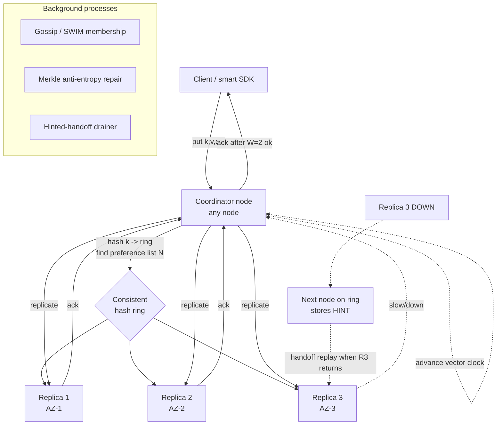
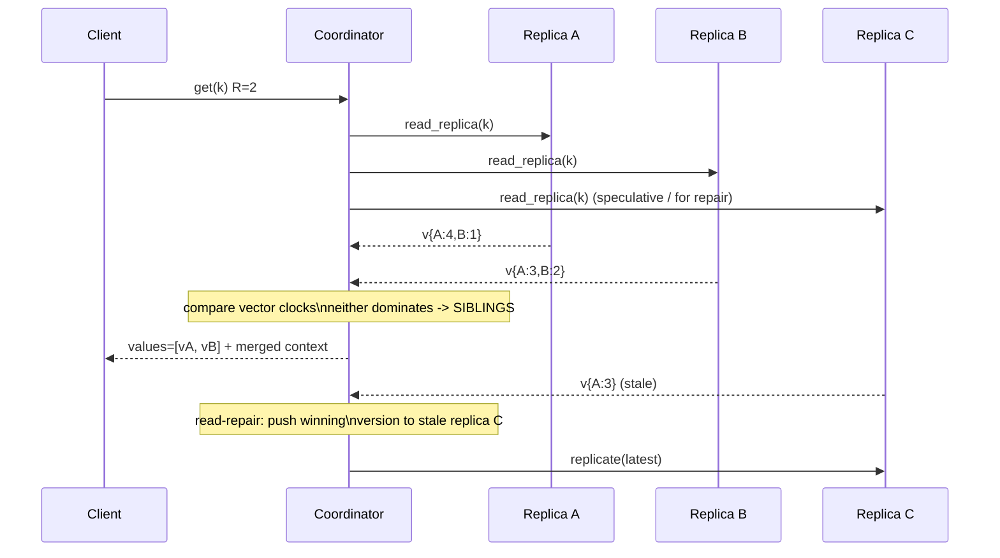
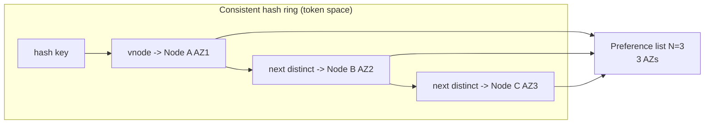
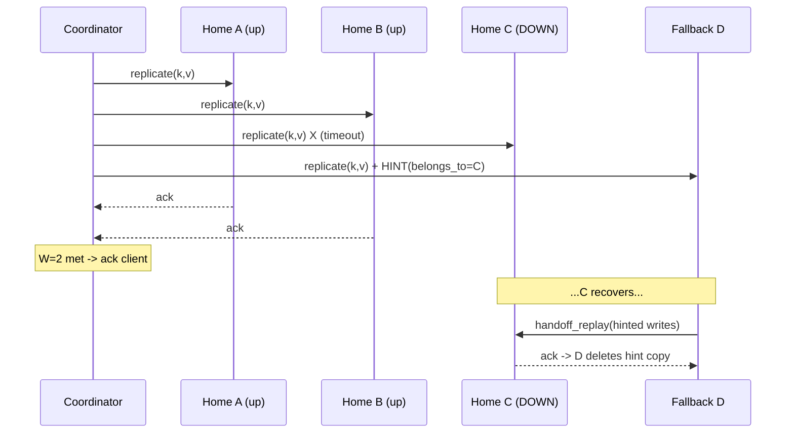
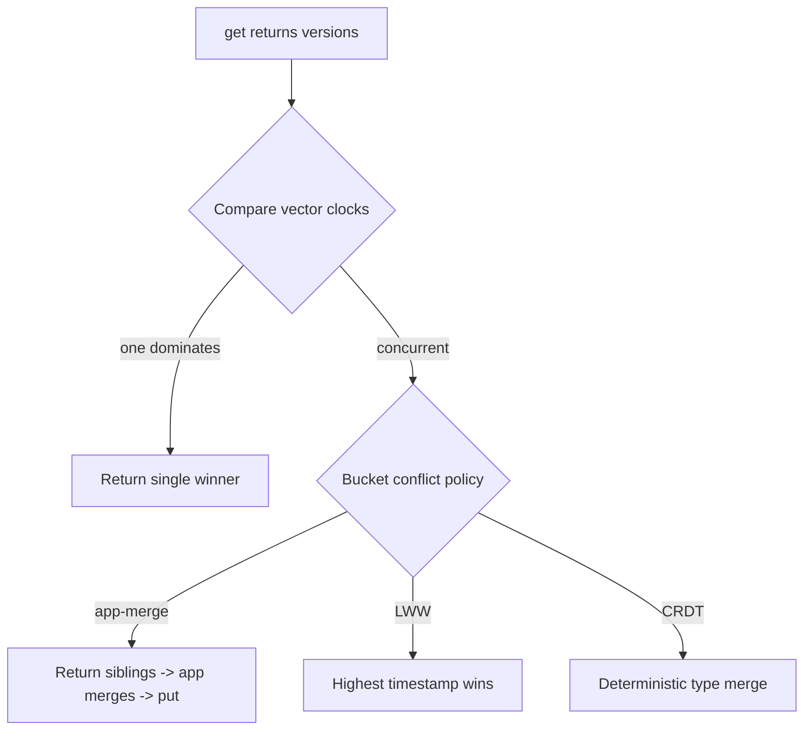
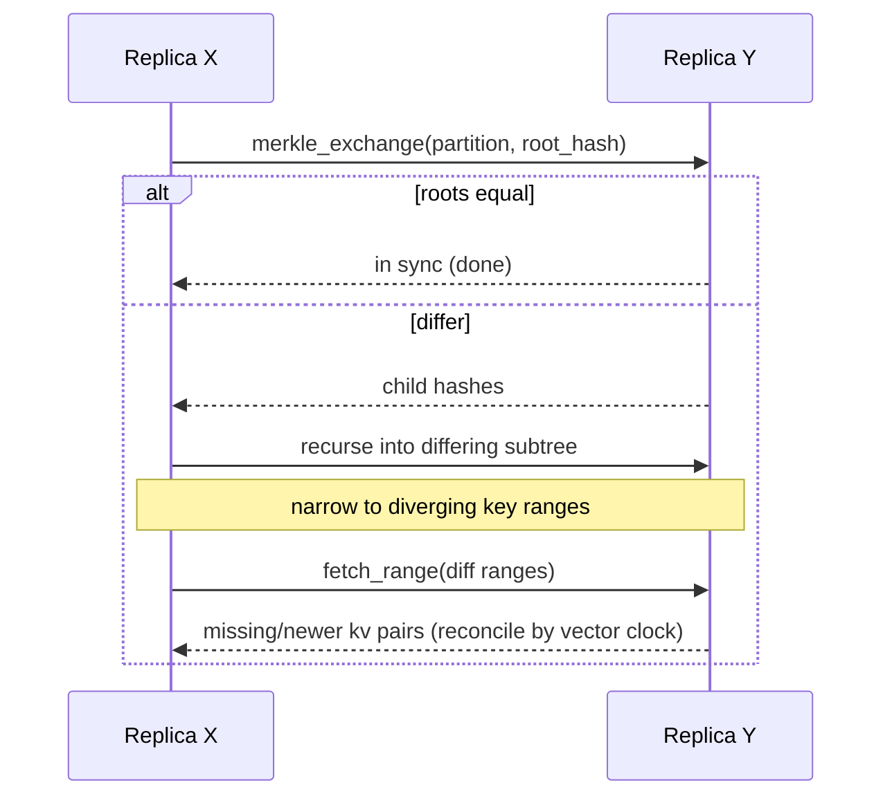

# Design a Distributed Key-Value Store (Dynamo-style)

> **Reader:** senior backend engineer (JVM, distributed systems) practising HLD. This document teaches *design judgment* — clarification, tradeoffs, and the deep dives that separate a staff answer from a junior one.

---

## 1. Problem & clarifying questions

### 1.1 Restating the problem

Design a **distributed key-value (KV) store** in the style of Amazon Dynamo (the 2007 paper, not DynamoDB the managed product). A KV store is the simplest possible database: a giant distributed hash map exposing `get(key)` and `put(key, value)`. There are no joins, no secondary indexes (initially), no SQL. The hard part is not the data model — it is making that hash map **horizontally scalable to thousands of nodes, always-writable even during failures, and self-healing** without a single coordinator that can become a bottleneck or a single point of failure (SPOF).

The Dynamo design philosophy is deliberate and opinionated:

- **Availability over consistency.** The system must accept writes even during network partitions, node failures, and even an entire datacenter outage. This is a deliberate **AP** choice in CAP terms (defined below).
- **Decentralized, symmetric, peer-to-peer.** Every node has the same responsibilities; there is no master, no config server, no leader. This avoids the SPOF and the operational asymmetry of master/replica systems.
- **Tunable consistency** via quorums (N/R/W), so the *same* system can be configured per-workload from "fast and eventually consistent" to "read-your-writes strong-ish."
- **Conflict resolution pushed to the application** when the infrastructure cannot decide (e.g., concurrent writes to the same key during a partition).

> **CAP theorem (1-line):** during a network **P**artition you must choose between **C**onsistency (every read sees the latest write) and **A**vailability (every request gets a non-error response). You cannot have both while partitioned. Dynamo chooses **A** — it stays writable and reconciles later.

### 1.2 Questions I'd ask the interviewer first

A senior candidate never jumps to boxes-and-arrows. I'd spend the first 3–5 minutes scoping. The questions below are grouped; I've italicized *why each matters* because the answer changes the design.

**Functional scope**
1. **What operations?** Just `get`/`put`/`delete`, or also conditional puts (compare-and-set), batch ops, range scans, TTL/expiry? *Range scans rule out pure hash partitioning and push toward order-preserving partitioning or a sorted layer.*
2. **Value model & size.** Opaque blobs or structured? What is the max value size — KB, MB? *MB-scale values change the storage engine, the replication bandwidth math, and whether we chunk.*
3. **Secondary access patterns.** Will we ever query by value or by attribute (secondary indexes)? *Dynamo-style stores deliberately don't; if required, this is a separate subsystem.*
4. **Multi-tenancy / namespaces.** One logical store or many isolated "tables"/buckets? *Affects key namespacing and quota enforcement.*

**Non-functional**
5. **Consistency expectation.** Is eventual consistency acceptable to the product, or do some workloads need read-your-writes / linearizability? *This is the whole ballgame. If they need strict linearizability everywhere, Dynamo is the wrong tool — I'd pitch Raft/Spanner-style instead.*
6. **Latency target.** What p99/p99.9 for reads and writes? Dynamo's famous internal SLA was **p99.9 < 300ms** under peak. *Tail-latency SLOs drive the quorum tuning and the "sloppy quorum + hinted handoff" choice.*
7. **Availability target.** Three nines, four, five? Must we survive a full-AZ or full-region loss? *Drives replica count N, cross-AZ placement, and whether we do multi-region.*
8. **Durability.** Can we ever lose an acknowledged write? What's the acceptable data-loss window? *Drives W, fsync policy, and whether writes are durable-before-ack.*

**Scale**
9. **Dataset size & growth.** Total keys and bytes today and in 2 years? *Drives node count and partition count.*
10. **Throughput.** Peak read/write QPS, read:write ratio? *Drives capacity math and quorum sizing.*
11. **Key distribution.** Uniform, or are there hot keys (celebrity problem)? *Hot keys break naive consistent hashing; needs virtual nodes + possibly per-key replication or caching.*

**Operational / out-of-scope**
12. **Deployment surface.** Single region multi-AZ, or global? On-prem or cloud? *Multi-region is a different conflict-resolution problem.*
13. **Out of scope?** I'll propose we exclude: transactions across keys, strong global secondary indexes, full-text search, and a SQL layer — unless told otherwise. *Naming the exclusions shows judgment and keeps the round focused.*

### 1.3 Assumptions I'll proceed with

For a concrete, defensible design I'll assume (and state these aloud):

- **API:** `get`, `put`, `delete`, plus conditional `put` (CAS). No range scans in v1 (pure hash partitioning). TTL supported.
- **Values:** opaque blobs, typical 1 KB, max 1 MB.
- **Consistency:** **tunable** per-bucket via N/R/W; default eventually consistent, with the option of `R+W>N` for strong-ish reads. Application-assisted conflict resolution available; LWW (last-writer-wins) as a default fallback.
- **Latency:** p99.9 ≤ 300 ms for both reads and writes (the classic Dynamo SLA).
- **Availability:** "always writable" — target **99.99%+**; survive single node, rack, and AZ failures within a region. Multi-region is an extension (Section 10).
- **Durability:** no loss of an acknowledged write under single-AZ failure; W writes are durable (to commit log / fsync’d) before ack.
- **Scale (working target):** **100 TB** logical data, **1 M write QPS** + **5 M read QPS** at peak (read:write = 5:1), tens of millions of keys/sec churn, single region with 3 AZs.

---

## 2. Requirements (finalized)

### 2.1 Functional

| # | Requirement | Notes |
|---|---|---|
| F1 | `put(bucket, key, value, [context])` | Stores/overwrites a value. `context` carries causality (vector clock / version) for conflict handling. |
| F2 | `get(bucket, key)` | Returns value(s) + a `context`. **May return multiple sibling values** if concurrent conflicting writes exist. |
| F3 | `delete(bucket, key, [context])` | Tombstone-based delete (a delete is a special write). |
| F4 | Conditional `put` (CAS) | Write only if current version matches supplied context. Best-effort under AP. |
| F5 | TTL / expiry | Per-key optional expiry; lazy + background reclamation. |
| F6 | Tunable N/R/W per bucket | Operator chooses replication factor and read/write quorum sizes. |
| F7 | Self-service buckets/namespaces | Logical isolation, per-bucket config and quotas. |

### 2.2 Non-functional

| Attribute | Target | Rationale |
|---|---|---|
| **Latency** | p99.9 ≤ 300 ms read & write; p50 ≤ 10 ms | Dynamo SLA; tail latency is the product metric, not the average. |
| **Availability** | ≥ 99.99% ("always writable") | Shopping-cart-like workloads: a failed write = lost revenue. |
| **Durability** | No loss of acked write under single-AZ failure | W replicas durable before ack. |
| **Consistency** | Eventual by default; tunable to `R+W>N` | Application can opt into stronger reads. |
| **Scalability** | Linear to thousands of nodes; incremental scale-out | Add nodes without downtime or rehashing the world. |
| **Partition tolerance** | Mandatory | Networks fail; we choose A over C while partitioned. |
| **Operability** | Self-healing, decentralized, symmetric nodes | No SPOF, no manual failover, homogeneous fleet. |

### 2.3 Explicit assumptions (restated for the design)

- Single region, 3 AZs, replica factor **N = 3** by default, **R = 2**, **W = 2** (so `R+W=4 > N=3` → strong-ish reads with one-node fault tolerance for writes).
- Average value 1 KB; 100 TB logical → ~300 TB physical at N=3.
- Commodity nodes: ~16 cores, 64 GB RAM, ~4 TB NVMe SSD each.

---

## 3. Capacity estimation

I'll show the arithmetic and flag assumptions. Round numbers; the goal is the *shape*, not false precision.

### 3.1 Throughput (QPS)

- Read:write = 5:1. Peak total = 6 M QPS → **5 M read QPS, 1 M write QPS**.
- Each client `get` fans out to **R** node reads internally; each `put` fans out to **N** node writes (coordinator sends to all N, waits for W).
  - Internal **read** ops = 5 M × R = 5 M × 2 = **10 M internal reads/sec**.
  - Internal **write** ops = 1 M × N = 1 M × 3 = **3 M internal writes/sec**.
  - Total internal storage-engine ops ≈ **13 M ops/sec** across the fleet.

### 3.2 Per-node capacity → node count for throughput

- Assume a well-tuned LSM-based engine (defined in §6) sustains ~**50 K ops/sec/node** at our value sizes with p99 headroom (conservative; SSDs can do more, but we leave headroom for compaction, anti-entropy, GC).
- Nodes for throughput = 13 M / 50 K ≈ **260 nodes**.

### 3.3 Storage → node count for capacity

- Logical data = **100 TB**. With N = 3 → **300 TB** raw replicated.
- Overheads: LSM write amplification & space amplification (~1.3×), metadata, vector clocks, tombstones → call it **~400 TB physical**.
- Usable per node: 4 TB SSD × 70% (leave room for compaction) ≈ **2.8 TB/node**.
- Nodes for capacity = 400 TB / 2.8 TB ≈ **145 nodes**.

### 3.4 Reconcile & headroom

- Throughput-bound (260) dominates capacity-bound (145). Take the max, add ~30% headroom for failures/compaction/growth → **~340 nodes**.
- Spread across 3 AZs → ~**113 nodes/AZ**. Round to **~120/AZ, ~360 total**.

> **Sanity check:** 360 nodes × 50 K ops = 18 M ops/sec capacity vs 13 M needed → ~28% headroom. Good. Storage: 360 × 2.8 TB = ~1 PB physical vs 400 TB needed → comfortable, room for 2.5× data growth.

### 3.5 Bandwidth

- **Client-facing:** writes 1 M/s × 1 KB = **1 GB/s** in; reads 5 M/s × 1 KB = **5 GB/s** out. ~**6 GB/s** (~48 Gbps) aggregate edge bandwidth.
- **Internal replication:** each write replicated to N=3 nodes → 1 M/s × 1 KB × 3 = **3 GB/s** internal write traffic; plus read fan-out 10 M/s × 1 KB = 10 GB/s internal read. Internal east-west ≈ **13 GB/s** (~100 Gbps). Per node ≈ 13 GB/s ÷ 360 ≈ **36 MB/s/node** — trivial for 10/25 GbE NICs. Anti-entropy (Merkle sync) and hinted-handoff replay add bursty overhead; budget +20%.

### 3.6 Memory

- Per node: block cache + memtables + bloom filters + index blocks. With 64 GB: ~40 GB usable cache → fleet cache ≈ 360 × 40 GB ≈ **14 TB hot cache**, ~3.5% of dataset cacheable. Bloom filters keep disk reads low for the rest.

### 3.7 Partition (virtual node) count

- We want partitions ≫ nodes so load rebalances smoothly (see §7.1). Rule of thumb: **128–256 vnodes per physical node**. With 360 nodes × ~128 → ~**46 K virtual nodes / token ranges**. We'll fix a logical ring of, say, **2^16 = 65,536 tokens** and map vnodes onto it.

> **Estimation summary:** ~**360 nodes**, 3 AZs, **N/R/W = 3/2/2**, ~46K vnodes, ~13M internal ops/sec, ~13 GB/s east-west. These are the load-bearing numbers I'll defend.

---

## 4. API design

Thin, RPC-style. Two surfaces: **client API** (external) and **internal node-to-node API** (replication/gossip/anti-entropy).

### 4.1 Client API

```
# Read. Returns value(s) and an opaque context (causal version).
get(bucket: string, key: bytes, options?: {R?: int, consistency?: enum})
  -> {
       values: [{ value: bytes, context: VersionContext }],  # >1 means unresolved siblings
       coordinator: nodeId,
       quorum_met: bool
     }

# Write. context echoes what a prior get returned, for causality.
put(bucket: string, key: bytes, value: bytes,
    context?: VersionContext, options?: {W?: int})
  -> { context: VersionContext, quorum_met: bool }

# Delete = write of a tombstone, also causal.
delete(bucket: string, key: bytes, context?: VersionContext)
  -> { quorum_met: bool }

# Conditional put (compare-and-set).
put_if(bucket, key, value, expected_context) -> { ok: bool, context }
```

- **`VersionContext`** is the opaque blob the client must round-trip: it encodes the **vector clock** (or version vector) for the key. Clients treat it as a cookie; only the server interprets it. This is how the system tracks causality across distributed writes without a clock (defined in §7.4).
- **Returning siblings (`values: [...]` with length > 1)** is the key Dynamo API quirk: when concurrent writes conflict and can't be auto-merged, `get` hands *all* conflicting versions back so the application can reconcile (e.g., merge two shopping carts). The next `put` with the merged value + combined context resolves it.

### 4.2 Request/response shape (example)

```jsonc
// PUT /v1/buckets/carts/keys/user-42
// body:
{ "value": "<base64 cart blob>",
  "context": "djE6e2E6MyxiOjF9" }   // base64 vector clock {A:3, B:1}
// 200:
{ "context": "djE6e2E6NCxiOjF9", "quorum_met": true }  // {A:4, B:1}

// GET /v1/buckets/carts/keys/user-42  -> conflict case
// 200:
{ "values": [
    { "value": "...cartX...", "context": "...{A:4,B:1}..." },
    { "value": "...cartY...", "context": "...{A:3,B:2}..." } ],
  "quorum_met": true }
// two siblings: neither dominates the other -> app must merge
```

### 4.3 Internal API (node-to-node)

```
replicate(partition, key, value, context, ttl)        # coordinator -> replica
read_replica(partition, key) -> {value, context}      # quorum read fan-out
gossip(membership_delta, heartbeats)                  # SWIM/gossip exchange
merkle_exchange(partition, tree_root) -> diff_ranges  # anti-entropy
fetch_range(partition, range) -> [kv...]              # repair transfer
handoff_replay(targetNode, hinted_writes[])           # hinted handoff drain
```

---

## 5. High-level architecture

### 5.1 Request flow (words)

1. Client sends `put`/`get` to **any node** (or a smart client picks one) — every node is symmetric and can act as a **coordinator**.
2. The coordinator hashes the key onto the **consistent-hashing ring**, finds the **N preference-list** nodes (the N distinct physical nodes that own that key's range, skipping over vnodes that map to already-chosen physical nodes / same AZ).
3. **Write:** coordinator generates/advances the vector clock, sends the write to all N preference nodes, **acks after W respond**. If a preference node is down, it routes to the next healthy node on the ring with a **hint** (sloppy quorum + hinted handoff).
4. **Read:** coordinator requests from N (or first R), waits for **R** responses, reconciles versions (returns winner, or siblings if conflicting), and optionally triggers **read repair** to push the latest version to stale replicas.
5. **Background:** nodes continuously **gossip** membership/health, run **Merkle-tree anti-entropy** to repair divergence, and **replay hinted handoffs** when downed nodes return.

### 5.2 ASCII block diagram

```
                         ┌───────────────────────────────────────────┐
   Clients (smart SDK    │            REGION (3 Availability Zones)     │
   or via LB) ─────────► │                                              │
                         │   ┌──────────┐   gossip   ┌──────────┐       │
        get/put          │   │  Node A  │◄──────────►│  Node B  │       │
   ─────────────────────►│   │ (coord)  │            │          │       │
                         │   │ ┌──────┐ │            │ ┌──────┐ │       │
                         │   │ │Engine│ │            │ │Engine│ │       │
                         │   │ │ LSM  │ │            │ │ LSM  │ │       │
                         │   │ └──────┘ │            │ └──────┘ │       │
                         │   │ VClock   │            │ VClock   │       │
                         │   │ Merkle   │            │ Merkle   │       │
                         │   └────┬─────┘            └────┬─────┘       │
                         │        │  replicate (N)        │             │
                         │        ▼        ▲              ▼             │
                         │   ┌──────────┐  │ read-repair ┌──────────┐   │
                         │   │  Node C  │◄─┴────────────►│  Node D  │   │
                         │   │  ...     │   anti-entropy │  ...     │   │
                         │   └──────────┘                └──────────┘   │
                         │        ▲ hinted handoff replay ▲             │
                         │        └───────────────────────┘             │
                         └───────────────────────────────────────────┘

   Consistent-hash ring (logical):   0 ─► token space (2^64) ─► wraps to 0
     keyhash(k) ──► walk clockwise ──► first N distinct physical nodes = preference list
```

### 5.3 Mermaid — component & write path



### 5.4 Mermaid — read path with reconciliation



### 5.5 Components

- **Coordinator role** (any node): parses request, locates preference list, drives quorum, reconciles versions, triggers read repair.
- **Storage engine** (per node): LSM-tree (memtable + SSTables + WAL/commit log + bloom filters). Stores `key -> {value, vector_clock, ttl, tombstone?}`.
- **Partitioner**: consistent hashing with virtual nodes; owns token→node mapping.
- **Membership/failure detector**: gossip protocol (SWIM-style) maintaining the ring view and node health.
- **Anti-entropy**: per-partition Merkle trees + repair transfers.
- **Hinted-handoff store**: durable queue of writes destined for temporarily-down nodes.
- **Smart client / request router**: optional client library that caches the ring and routes directly to a preference node, saving a hop (the "zero-hop DHT" optimization).

---

## 6. Data model & storage choices

### 6.1 Logical model

A single conceptual map: `(bucket, key) -> value`, where each stored record is:

```
Record {
  key:           bytes
  value:         bytes (opaque, ≤1 MB)
  version:       VectorClock      # causality metadata
  ttl:           optional epoch_ms
  tombstone:     bool             # deletes are tombstones
  last_modified: epoch_ms         # for LWW fallback
}
```

No schema, no relations, no secondary indexes in v1. The **bucket** is a namespace carrying its own N/R/W config and quotas.

### 6.2 Why a Dynamo-style KV (vs the building blocks the candidate knows)

| Option | Fits? | Why / why not |
|---|---|---|
| **RDBMS (e.g., MySQL) + read replicas** | No | Single-writer primary is a write SPOF; failover is seconds-to-minutes of unavailability; scaling writes means manual sharding. Strong consistency but **not always-writable**. |
| **RDBMS with sharding middleware** | Partly | Gets horizontal scale but reintroduces operational pain, cross-shard transactions, and a config tier. Overkill for pure KV. |
| **Raft/Paxos-replicated KV (e.g., etcd, ZooKeeper)** | No (for this workload) | Strongly consistent (**CP**) — *blocks writes* during leader election / partition. Great for config/coordination (KBs of data), wrong for high-throughput always-writable KV at 100 TB. |
| **Spanner/CockroachDB (CP, external consistency)** | No | Excellent global ACID but trades availability/latency for consistency (TrueTime / consensus on the write path). Conflicts with our "always-writable, p99.9<300ms" SLA. |
| **Cassandra/Dynamo-style (AP, leaderless quorum)** | **Yes** | Leaderless, masterless, tunable consistency, linear scale, always-writable. Exactly our requirements. |

**Decision:** leaderless, **AP**, quorum-replicated KV. **Failure mode avoided:** the *write unavailability window* of any single-writer/leader system during failover or partition — for a cart/session workload that window is lost revenue.

### 6.3 Storage engine: LSM-tree, not B-tree

> **LSM-tree (Log-Structured Merge tree):** writes go to an in-memory **memtable** + an append-only **commit log (WAL)**; when the memtable fills it's flushed to an immutable on-disk **SSTable**; background **compaction** merges SSTables. Reads check memtable then SSTables (accelerated by **bloom filters** — probabilistic membership tests that say "definitely not here" to skip files).

| Engine | Write path | Read path | Verdict |
|---|---|---|---|
| **B-tree (update-in-place)** | Random writes, write amplification on SSD, page locking | Fast point reads | Good for read-heavy/OLTP; **poor for write-heavy + SSD wear**. |
| **LSM-tree** | Sequential appends, high write throughput, SSD-friendly | Point reads via bloom + index; can suffer read & space amplification | **Best fit:** write-optimized, sequential I/O, compresses well. |

**Decision: LSM-tree.** Our 1 M write QPS + N=3 fan-out = 3 M internal writes/sec; sequential append + bloom-accelerated reads is the right shape. **Failure mode avoided:** the random-write IOPS wall and write amplification that a B-tree hits under high write fan-out, which would blow the p99.9 budget.

### 6.4 Why store vector clocks alongside values

Because we're AP, two clients can write the same key concurrently on different replicas during a partition. We need per-key causality metadata to detect "these versions are concurrent (conflict)" vs "this one supersedes that one." That metadata is the **vector clock** (§7.4), stored in the record.

---

## 7. Deep dives

This is the bulk. Five hard sub-problems: (1) partitioning via consistent hashing, (2) replication & N/R/W quorums + tunable consistency, (3) sloppy quorum + hinted handoff, (4) conflict detection & resolution (vector clocks vs LWW), (5) anti-entropy (Merkle) + gossip membership. Plus CAP positioning woven throughout.

---

### 7.1 Deep dive — Partitioning via consistent hashing

**Problem.** Spread 100 TB and 6 M QPS across ~360 nodes so that (a) any key maps deterministically to its owners, (b) adding/removing a node moves *only a small fraction* of keys, and (c) load is even with no hot node.

**Naive approach: `node = hash(key) mod N`.** Works until N changes. Going from 360→361 nodes remaps **almost every key** (the modulus changed), triggering a fleet-wide data shuffle and cache invalidation storm. Disqualified.

> **Consistent hashing (1-line):** map both keys and nodes onto the same circular hash space (a "ring", e.g. `[0, 2^64)`). A key is owned by the first node clockwise from `hash(key)`. Adding/removing a node only affects keys between it and its predecessor — **~1/N of keys move**, not all of them.

**Two problems with vanilla consistent hashing, and the fixes:**

1. **Uneven load** — random node positions cluster, so some nodes own huge arcs. **Fix: virtual nodes (vnodes).** Each physical node is assigned many (say 128) tokens scattered around the ring. Now load averages out, and a powerful node can be given more vnodes (heterogeneity-aware). When a node joins, it takes a *slice from many* existing nodes (parallel, fast rebalance) rather than dumping a giant arc onto one neighbor.
2. **Replica placement & locality** — the next N-1 clockwise nodes might land in the same AZ. **Fix:** when building the **preference list**, walk the ring clockwise but **skip vnodes that resolve to a physical node already chosen, and prefer spreading across AZs**, so N=3 lands in 3 distinct AZs.

**Preference list construction (pseudo):**
```
pos = hash(key)
list = []
seen_nodes = {}; seen_azs = {}
walk ring clockwise from pos:
    n = physical_node(vnode)
    if n in seen_nodes: continue
    if az(n) in seen_azs and we still can spread: skip (best-effort)
    add n; seen_nodes.add(n); seen_azs.add(az(n))
    if len(list) == N: stop
return list   # the N owners + extra for sloppy quorum fallback
```

**Tradeoff table — partitioning strategies:**

| Strategy | Rebalance cost on node change | Load evenness | Range scans | Hot-key handling | Verdict |
|---|---|---|---|---|---|
| `hash mod N` | Catastrophic (≈all keys) | Even | No | No | Reject |
| Consistent hashing, no vnodes | ~1/N keys, but to one neighbor | Poor (clustering) | No | No | Reject |
| **Consistent hashing + vnodes** | ~1/N keys, spread across many nodes | Good (tunable) | No | Partial (see below) | **Choose** |
| Range partitioning (ordered) | Splits/merges, hotspot at range edges | Variable | **Yes** | Manual splits | Only if range scans required |

**Decision: consistent hashing + virtual nodes (128/node), AZ-aware preference list.** **Failure modes avoided:** (a) the full-fleet reshuffle of `mod N`; (b) the single-neighbor overload + lumpy load of vnode-less hashing; (c) correlated replica loss from co-locating replicas in one AZ.

**Hot-key caveat.** Even perfect hashing can't fix a *single* white-hot key (e.g., a viral product). Mitigations: (1) front with a cache (read-through) and serve from R replicas; (2) for hot reads, increase that key's effective replica spread; (3) detect and split at the application layer (key suffixing/sharding the value). Worth naming proactively — interviewers probe it.



---

### 7.2 Deep dive — Replication, N/R/W quorums & tunable consistency

**Problem.** Replicate each key to N nodes for durability/availability, and let operators trade latency vs consistency without re-architecting.

> **N/R/W:** **N** = number of replicas per key. **W** = replicas that must ack a write before the client gets success. **R** = replicas that must respond to a read before the coordinator answers. The magic inequality: **if `R + W > N`, the read and write sets overlap by at least one node**, so a read is guaranteed to *see* at least one replica that has the latest write → "strong-ish" (read-your-writes within a partition-free window).

**Worked configs (N=3):**

| Config | R+W vs N | Guarantee | Latency profile | Use case |
|---|---|---|---|---|
| W=3, R=1 | 4>3 | Read sees latest; **slow durable writes** | Fast reads, slow writes | Read-heavy, write-rare config data |
| **W=2, R=2** | 4>3 | Overlap; tolerate 1 node down on each path | **Balanced** | **Our default** |
| W=1, R=1 | 2<3 | Eventual only; fastest | Lowest latency, may read stale | Logging, metrics, cache-like |
| W=1, R=3 | 4>3 | Fast write, read reconciles all | Slow reads | Write-heavy, can afford read fan-out |

**Why W=2, R=2 for us:** with N=3 across 3 AZs, W=2 means a write survives losing **one full AZ** and still acks (the other two ack). R=2 + W=2 → overlap → a read after a successful write sees it (absent an ongoing partition). p99.9 budget: waiting for the 2nd-of-3 ack is cheap; waiting for the slowest (W=3) would tie us to tail latency of the worst replica.

**The coordinator write algorithm:**
```
ctx' = advance_vector_clock(ctx, coordinator_id)
send replicate(k, v, ctx') to all N preference nodes
start timer
on each ack: count++
if count == W: return success(ctx')   # don't wait for the rest
if timer expires before W: 
   if sloppy-quorum enabled: route remaining to fallback nodes w/ hints (§7.3)
   else: return failure  # rare; surfaces only if <W nodes reachable
```

**Tradeoff: strict quorum vs sloppy quorum.** A *strict* quorum requires W of the *home* N nodes. If 2 of 3 home nodes are down, a strict quorum write **fails** — violating "always writable." Dynamo relaxes this: see §7.3.

**Decision:** tunable N/R/W, default **3/2/2**, `R+W>N`. **Failure mode avoided:** the false dichotomy of "either fast-but-stale or strong-but-fragile" — by making it a per-bucket dial, the cart bucket can run 3/2/2 while a metrics bucket runs 3/1/1.

**CAP positioning here:** during a partition, a strict `R+W>N` quorum can't be met on the minority side → that side becomes unavailable for those keys (a CP-leaning slice). Sloppy quorum (next) pulls us back to AP by accepting writes on substitute nodes. **The dial literally moves us along the CAP spectrum.**

---

### 7.3 Deep dive — Sloppy quorum + hinted handoff

**Problem.** A home replica is temporarily down (deploy, GC pause, network blip). A *strict* quorum would reject writes that can't reach W home nodes — unacceptable for "always writable."

> **Sloppy quorum:** if a home preference node is unreachable, the coordinator writes to the **next healthy node on the ring** instead, so W is still met by *some* N healthy nodes (not necessarily the home N).
> **Hinted handoff:** that substitute node stores the write tagged with a **hint** ("this really belongs to Node C"). When Node C recovers, the substitute **replays** the hinted writes to it, then deletes its copy.

**Sequence:**


**Why this matters / failure mode avoided:** without sloppy quorum, a brief blip on 2 of 3 home nodes (e.g., a rolling deploy hitting two AZs near-simultaneously, or one AZ partitioned) would make writes fail — the exact unavailability we promised to avoid. Hinted handoff guarantees the down node *catches up* once healthy, preserving durability and convergence.

**Tradeoffs / risks:**

| Concern | Detail | Mitigation |
|---|---|---|
| Durability gap | If fallback D *also* dies before replaying the hint, the write may be lost from C's perspective | Anti-entropy (§7.5) is the backstop; hints are durable (on disk) |
| Stale reads | A read hitting home nodes might miss writes parked on a fallback | Read repair + sloppy reads can include fallbacks |
| Hint storms | Long outage → huge hint backlog → recovery thundering herd | Rate-limit replay; cap hint retention; rely on Merkle repair for old data |
| Membership confusion | Coordinator must know who's "down" | Gossip failure detector (§7.5) feeds this |

**Decision:** enable sloppy quorum + hinted handoff by default; hints are persisted and rate-limited on replay. **This is the mechanism that makes the system genuinely AP** rather than merely "quorum with extra steps."

---

### 7.4 Deep dive — Conflict detection & resolution (vector clocks vs LWW)

**Problem.** AP + always-writable ⇒ the same key can be written concurrently on different replicas (e.g., during a partition, or two coordinators racing). When they reconverge, which value wins? We must (a) *detect* whether two versions are causally ordered or genuinely concurrent, and (b) *resolve* concurrent ones.

> **Vector clock / version vector:** a map `node_id -> counter` attached to each value. When node X writes, it increments its own counter. Version V1 **dominates** V2 (is strictly newer) iff every counter in V1 ≥ V2 and at least one is greater. If neither dominates the other, they are **concurrent (a conflict / siblings)**.

**Examples:**
```
V1 = {A:2, B:1}   V2 = {A:2, B:2}   -> V2 dominates V1 (B advanced)  => keep V2
V1 = {A:3, B:1}   V2 = {A:2, B:2}   -> neither dominates             => SIBLINGS (conflict)
```

**Three resolution strategies:**

| Strategy | How | Pros | Cons | When |
|---|---|---|---|---|
| **Vector clocks + app merge (Dynamo classic)** | Detect concurrency exactly; on conflict, `get` returns siblings; app merges semantically | Never silently loses a write; semantic merges (cart union) | App complexity; client must round-trip context; clock can grow | Carts, sets, counters, any mergeable state |
| **Last-Writer-Wins (LWW)** | Tag each write with a timestamp; highest timestamp wins; discard rest | Dead simple; no siblings; no client merge logic | **Silently drops** concurrent writes; clock-skew dependent | Idempotent/overwrite-y data where loss is acceptable (session refresh, last-known location) |
| **CRDTs** | Use conflict-free replicated data types (G-Counter, OR-Set) that merge deterministically | Auto-merge, no app conflict callback, provably convergent | Restricts value types; metadata overhead | Counters, sets, presence — when the type fits |

> **CRDT (1-line):** a Conflict-free Replicated Data Type has a built-in, commutative, associative, idempotent merge so any two replicas converge to the same value without coordination (e.g., a grow-only counter sums per-node maxes).

**Vector clock growth problem & fix.** If many distinct coordinators touch a key, the clock grows unbounded. **Fix:** cap the clock size and, when exceeded, drop the **oldest (by attached timestamp) entries**. This risks rare false-concurrency but bounds metadata. Dynamo used a (node, counter, timestamp) triple and a truncation threshold (e.g., 10 entries).

**Decision:** **vector clocks as the detection mechanism (always on), with pluggable resolution per bucket** — default to **app-assisted sibling merge** for mergeable buckets, **LWW** for buckets that opt in (and accept the loss semantics), and offer **CRDT value types** for counters/sets. **Failure mode avoided:** the silent-write-loss of naive LWW for cart-like data (the canonical Dynamo motivating example — a user re-adds an item, it vanishes). We surface conflicts instead of pretending they don't exist, *but* let simple workloads opt into LWW to avoid the merge tax.



---

### 7.5 Deep dive — Anti-entropy (Merkle trees) + gossip membership

Two background subsystems keep the cluster healthy and convergent: **anti-entropy** (data repair) and **gossip** (membership/failure detection).

#### 7.5.1 Anti-entropy with Merkle trees

**Problem.** Hinted handoff and read repair fix *recent* divergence. But replicas can drift for subtler reasons (a dropped replicate, a node down longer than hint retention, bit rot). We need a cheap way for two replicas of the same partition to find and repair *exactly the keys that differ* — without shipping the whole dataset.

> **Merkle tree (hash tree):** a binary tree where each leaf is the hash of a key-range's data and each internal node is the hash of its children. Two replicas compare **root hashes first**; if equal, they're identical and we're done (one comparison for a whole partition). If different, recurse only down the **differing subtrees**, narrowing to the exact ranges that diverge. Sync cost ∝ amount of *divergence*, not dataset size.

**Repair flow:**


**Tradeoffs:**

| Aspect | Detail | Mitigation |
|---|---|---|
| Tree rebuild cost | Updates invalidate hashes; rebuilding per-partition trees is CPU/IO | Maintain per-vnode trees; rebuild incrementally; throttle |
| Granularity | Too-coarse leaves over-transfer; too-fine bloats the tree | Tune leaf range (e.g., per few-MB of keyspace) |
| Frequency | Too often = overhead; too rare = long inconsistency window | Periodic + triggered on node rejoin |

**Decision:** per-vnode Merkle trees, periodic + rejoin-triggered comparison, repair by vector-clock reconciliation. **Failure mode avoided:** O(dataset) full-replica comparison (which would be infeasible at 100 TB) and permanent silent divergence after a long outage.

**Layered repair (defense in depth):**
1. **Read repair** — fix divergence opportunistically on the read path (cheap, only for hot/read keys).
2. **Hinted handoff** — fix divergence from short outages.
3. **Merkle anti-entropy** — the periodic backstop catching everything else.

#### 7.5.2 Gossip membership & failure detection

**Problem.** No master, so every node must independently learn the ring (who owns what) and who's up/down — and converge on this even as nodes join/leave/fail. A central membership server would be a SPOF and a bottleneck.

> **Gossip protocol:** each node periodically picks a few random peers and exchanges its view of membership + heartbeats; information spreads epidemically (O(log N) rounds to reach everyone). **SWIM** (Scalable Weakly-consistent Infection-style Membership) adds *indirect probing*: if A can't reach B directly, A asks a few other nodes to ping B before declaring it dead — cutting false positives from transient blips.

**What gossip carries:** ring/token assignments, node states (alive/suspect/dead/joining/leaving), versioned via per-node incarnation numbers so stale rumors lose to fresh ones.

**Failure detection nuance.** A node isn't marked dead on one missed ping (that would over-react to GC pauses and blips). **Suspect → indirect probe → confirm** reduces false positives. Misclassifying a live node as dead triggers needless rebalancing/hinting; misclassifying dead as live parks writes on a black hole — both costly, hence the careful state machine.

**Tradeoffs:**

| Approach | Pros | Cons | Verdict |
|---|---|---|---|
| Central config/membership server (e.g., ZK) | Strong, simple consistency of membership | SPOF, bottleneck, scaling tier to operate | Reject (violates decentralization) |
| **Gossip/SWIM** | No SPOF, scales to thousands, eventually-consistent view | Membership is *eventually* consistent (brief stale ring views) | **Choose** |
| Seed-based static config | Trivial | No dynamic membership/healing | Only bootstrap seeds |

**Decision:** gossip/SWIM with suspicion mechanism, seed nodes for bootstrap, incarnation-versioned states. **Failure mode avoided:** the SPOF and scaling ceiling of a centralized membership service, plus failure-detector flapping from transient pauses.

> **Why brief membership inconsistency is OK:** if two nodes momentarily disagree on the ring, a write may go to a slightly-wrong node — caught and corrected by hinted handoff + anti-entropy. The system tolerates eventual membership convergence precisely because data convergence is also eventual. The pieces are designed to be consistent *with each other*.

---

## 8. Scaling & bottlenecks

### 8.1 How it scales

- **Throughput & storage:** add nodes; consistent hashing + vnodes moves ~1/N of data to the newcomer (drawn from many nodes in parallel) with no downtime. Linear scaling is the whole point.
- **Read scaling:** raise N and/or serve reads from more replicas; cache hot keys.
- **Geographic scaling:** multi-region replication (extension §10).

### 8.2 Where it breaks first, and the fix

| Bottleneck | Symptom | Fix |
|---|---|---|
| **Hot key** | One vnode/node saturates; consistent hashing can't help a single key | Read-through cache; replicate hot key wider; app-level key splitting |
| **Compaction storms** | LSM compaction spikes I/O → p99.9 breach | Throttle/schedule compaction; size-tiered vs leveled tuning; provision IOPS headroom (we left 30%) |
| **Tail latency on quorum** | Slowest of W/R replicas drags p99.9 | Speculative/hedged reads (issue R+1 and take first R); W=2 not 3; per-node load shedding |
| **Anti-entropy / hint replay overhead** | Background traffic competes with foreground | Rate-limit; off-peak scheduling; per-node concurrency caps |
| **Coordinator hop** | Extra network hop to the right node | Smart client caches ring → routes directly (zero-hop) |
| **Vector clock bloat** | Many writers → large metadata | Truncate to N most-recent entries |
| **Membership convergence at huge scale** | Gossip rounds slow with thousands of nodes | Tune fanout; hierarchical/zone-aware gossip |
| **Tombstone accumulation** | Deletes never reclaim; reads scan dead data | GC tombstones after a grace window > max outage (so a returning node doesn't resurrect deleted data) |

> **Tombstone GC gotcha:** if you purge a tombstone before a long-down replica returns, that replica re-replicates the *old* (undeleted) value via anti-entropy → **deleted data resurrects**. So tombstone retention must exceed the maximum tolerated outage. Classic distributed-systems trap; name it.

---

## 9. Reliability, consistency & security

### 9.1 Failure handling matrix

| Failure | Behavior |
|---|---|
| Single node down | Sloppy quorum + hinted handoff keep writes flowing; reads served by remaining R; repaired on return |
| Full AZ down | N=3 across 3 AZs → still 2 replicas live; W=2 still met → **stays writable** |
| Network partition | Both sides accept writes (AP); reconcile via vector clocks + anti-entropy when healed |
| Disk failure / bit rot | Anti-entropy detects checksum/hash mismatch; re-replicate from healthy replicas |
| Coordinator crash mid-write | No 2PC; replicas that got the write keep it (vector clock), client retries idempotently |

### 9.2 Consistency model

- **Default:** eventual consistency; **opt-in** read-your-writes via `R+W>N` (3/2/2).
- **Convergence guarantee:** all replicas of a key converge given enough time and no permanent loss, via read repair + hinted handoff + Merkle anti-entropy.
- **No transactions across keys** (out of scope); single-key conditional put (CAS) is best-effort under AP.
- **Monotonic read / session guarantees:** a smart client can pin to the same coordinator/replica set for session stickiness if needed.

### 9.3 Idempotency & retries

- Writes carry the **vector clock context**; a retried `put` with the same context is naturally reconciled (no duplicate version explosion). Clients use **idempotency keys** for true exactly-once semantics where required.
- Deletes are idempotent tombstones.

### 9.4 Security

| Concern | Control |
|---|---|
| **AuthN** | mTLS between nodes; token/API-key or signed requests from clients |
| **AuthZ** | Per-bucket ACLs; tenant isolation by bucket namespace |
| **Encryption** | TLS in transit (client↔node and node↔node); at-rest encryption on SSTables/WAL |
| **Multi-tenancy abuse** | Per-bucket/per-tenant **rate limiting** and quotas (QPS, storage); fair-share scheduling on coordinators |
| **Hot-tenant noisy neighbor** | Per-tenant token buckets; admission control / load shedding (429s) before the engine saturates |
| **Audit** | Structured access logs; gossip/membership change audit trail |
| **DoS / abusive keys** | Value-size caps (1 MB), key-length caps, request-rate caps; detect and isolate hot keys |

---

## 10. Extensions & follow-ups

| Extension | How the design changes |
|---|---|
| **Multi-region / global** | Async cross-region replication; conflicts now span regions → CRDTs or app-merge become essential; consider per-region home + global anti-entropy. Latency-aware routing (write to nearest region). |
| **Range scans / ordered queries** | Switch (or add a layer) to **order-preserving partitioning** (range partitions) — reintroduces hotspot risk at range edges, needs split/merge. Or layer a secondary sorted index. |
| **Secondary indexes** | Maintain inverted-index buckets keyed by attribute; async, eventually consistent; or a separate search subsystem. |
| **Stronger consistency for some keys** | Per-bucket switch to a **Raft/Paxos-replicated** partition group (CP) for the few keys needing linearizability — hybrid system. |
| **Transactions** | Layer optimistic CAS chains, or a lightweight 2PC/Percolator-style protocol over a CP subset — explicitly trades availability. |
| **TTL at scale** | Lazy expiry on read + background sweeper; ensure expired-key tombstones respect the anti-entropy resurrection rule. |
| **Tiered storage / cost** | Cold SSTables to object storage; hot in NVMe; index stays local. |
| **Backpressure & SLAs** | Per-tenant priority classes; isolate compaction/anti-entropy I/O from foreground. |

---

## 11. Interview Q&A

**Q1. Why leaderless/AP instead of a Raft-based CP store?**
Because the SLA is "always writable" with p99.9 ≤ 300 ms even during failures. A leader-based CP system blocks writes during leader election/partition (seconds of unavailability) — unacceptable for cart/session-like workloads. We accept eventual consistency and reconcile, gaining availability. *(Senior signal: I'd add — if the product needed linearizable reads everywhere, I'd switch tools; AP is a deliberate fit to the requirement, not a default.)*
- *Probe:* "What if they later need strong consistency for a few keys?" → Hybrid: route those buckets to a Raft replica group (CP), keep the rest AP.

**Q2. Walk the write path.**
Coordinator hashes key → preference list of N across 3 AZs → advances vector clock → replicates to all N → acks after W=2. If a home node is down, sloppy quorum routes to a fallback with a hint; hinted handoff replays on recovery.
- *Probe:* "What if only 1 of N is reachable and W=2?" → With sloppy quorum we use healthy fallbacks to still reach W; if fewer than W nodes total are reachable across the whole ring neighborhood, the write fails (extremely rare; that's a major outage).

**Q3. Two clients write the same key during a partition. What happens?**
Both succeed on their side. Vector clocks record concurrent versions. On the next read, neither dominates → coordinator returns **siblings**; the app merges (e.g., cart union) and writes back the merged value with combined context. Anti-entropy converges replicas in the background.
- *Probe:* "When would you use LWW instead?" → For overwrite-semantics data where losing a concurrent write is acceptable (e.g., last-seen timestamp). Never for additive data like carts.

**Q4. Why virtual nodes?**
They smooth load (avoid arc-clustering), enable fast parallel rebalancing (a joiner pulls slices from many nodes), and allow heterogeneous capacity (give beefier nodes more vnodes). **Senior signal:** without them a single joining node dumps its entire arc onto one neighbor — a load spike and slow rebalance.
- *Probe:* "How many vnodes?" → ~128/node as a balance: enough for even load, not so many that membership metadata explodes.

**Q5. How do replicas re-sync after a long outage?**
Merkle-tree anti-entropy: compare root hashes per vnode; recurse only into differing subtrees; transfer just the diverging ranges and reconcile by vector clock. Read repair and hinted handoff handle the short-outage cases.
- *Probe:* "Why not just diff the whole dataset?" → O(100 TB) is infeasible; Merkle makes cost ∝ divergence, often a single root-hash comparison.

**Q6. Explain `R+W>N`. (Senior signal: justification)**
It forces read and write quorums to overlap by ≥1 replica, so a read sees at least one node with the latest write → read-your-writes within a partition-free window. With N=3, W=2, R=2 we tolerate one node down on each path while still overlapping. **Tradeoff:** higher W/R = stronger but slower; it's a per-bucket dial, not a global truth.
- *Probe:* "Does R+W>N give linearizability?" → No — it's *not* linearizable (no single order across concurrent writes; siblings can still arise during partitions). It gives strong-ish read-your-writes, not strict consistency.

**Q7. How do you avoid a SPOF in membership? (Senior signal: tradeoff)**
Gossip/SWIM — fully decentralized, symmetric, no master. Tradeoff: membership is eventually consistent (brief stale ring views), which we tolerate because hinted handoff + anti-entropy correct any misrouted writes. A central membership server would be simpler but a SPOF and scaling bottleneck.
- *Probe:* "How do you avoid flapping?" → Suspicion mechanism: suspect → indirect probes via peers → confirm dead, so GC pauses/blips don't trigger false failures and needless rebalancing.

**Q8. What's the deleted-data-comes-back bug?**
Deletes are tombstones. If you GC a tombstone before a long-down replica returns, anti-entropy sees the live node "missing" a value the returned replica still has → re-replicates the old value → resurrection. Fix: retain tombstones longer than the max tolerated outage before purging.
- *Probe:* "How long?" → Greater than your worst recovery SLA (e.g., days), bounded so storage doesn't grow unbounded.

**Q9. Where does this break at scale, and how do you fix it? (Senior signal)**
First failure points: hot keys (cache + key-splitting), compaction storms (throttle + IOPS headroom), tail latency on quorum (hedged reads, W=2 not 3), and tombstone/vector-clock bloat (GC + truncation). I provisioned ~30% headroom precisely to absorb compaction/anti-entropy bursts.

**Q10. How do you hit p99.9 ≤ 300 ms specifically?**
W=2/R=2 avoids waiting on the slowest replica; **hedged/speculative reads** (issue an extra request, take the first R) cut tail latency; smart-client zero-hop routing removes a hop; per-node load shedding prevents one overloaded node from dragging the tail; isolate background I/O (compaction/anti-entropy) from foreground.

---

## 12. Cheat-sheet & self-test

### 12.1 Dense recap

- **Shape:** leaderless, masterless, symmetric, **AP** KV. CAP: choose **A** over **C** under partition; reconcile later.
- **Numbers:** 100 TB, 5 M read + 1 M write QPS, **N/R/W = 3/2/2**, ~**360 nodes** / 3 AZs, ~46K vnodes (128/node), ~13 M internal ops/s, ~13 GB/s east-west, p99.9 ≤ 300 ms.
- **Partitioning:** consistent hashing + virtual nodes + AZ-aware preference list. (~1/N keys move on change; no `mod N`.)
- **Replication:** quorum N/R/W; `R+W>N` → read-your-writes (not linearizable). W=2 survives one AZ loss.
- **Availability glue:** sloppy quorum + hinted handoff (stay writable when home nodes blip).
- **Conflicts:** vector clocks **detect** concurrency; resolve by app-merge (default), LWW (opt-in, lossy), or CRDT (typed).
- **Healing:** read repair → hinted handoff → Merkle-tree anti-entropy (cost ∝ divergence).
- **Membership:** gossip/SWIM, suspicion mechanism, no central server.
- **Storage:** LSM-tree (memtable + WAL + SSTables + bloom filters + compaction).
- **Traps to name:** hot keys, tombstone resurrection (GC after max outage), vector-clock bloat (truncate), compaction storms, tail latency (hedged reads).
- **Diagram-in-words:** client → any node (coordinator) → hash to ring → preference list of N across AZs → write to N, ack at W (route to fallback + hint if a node's down) → read from R, reconcile by vector clock, read-repair stale replicas → background gossip + Merkle repair + hint replay keep everything converging.

### 12.2 Self-test (no answers)

1. With N=5, you want to survive 2 simultaneous node failures on the write path *and* guarantee read-your-writes. What W and R do you pick, and what does it cost in latency?
2. A key is written by 6 different coordinators over its lifetime. What happens to its vector clock, what problem arises, and how do you bound it without breaking conflict detection?
3. An entire AZ partitions away for 30 minutes, then rejoins. Trace exactly which mechanisms bring its replicas back in sync, and in what order.
4. You're asked to add `range scan by key prefix`. What changes in the partitioning scheme, and what new failure mode do you introduce?
5. Explain precisely why `R+W>N` does **not** give linearizability, with a concrete interleaving of two clients during a partition.
