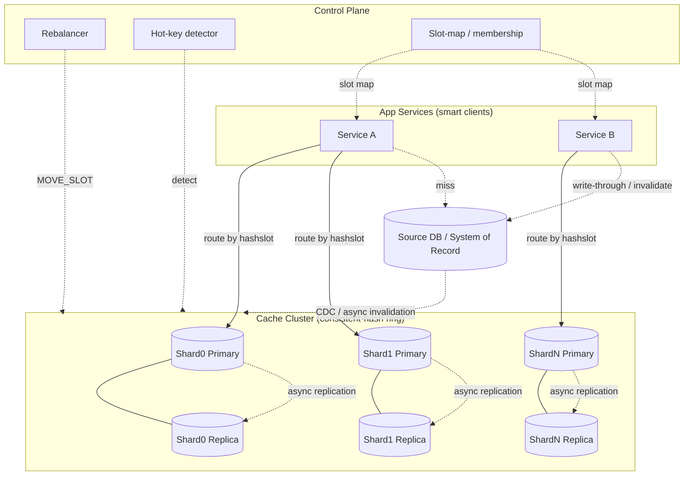
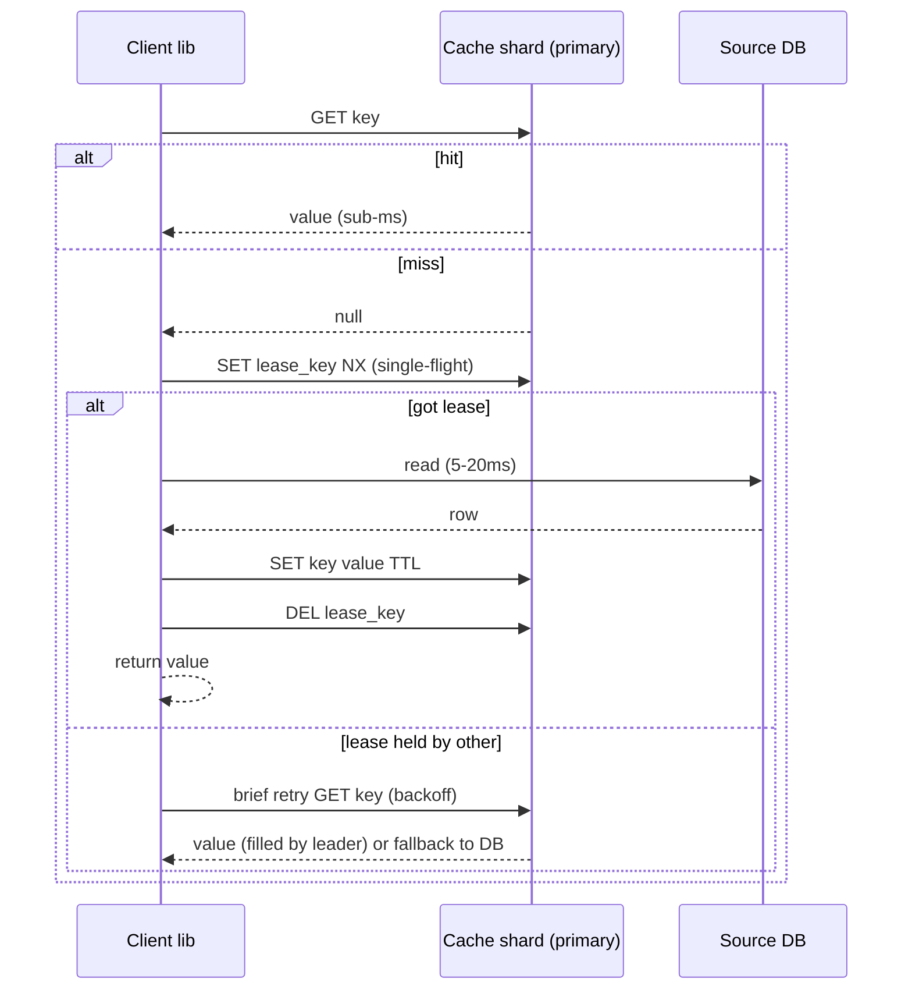

# Design a Distributed Cache — High-Level Design

> **Reader:** senior backend engineer (Java/JVM, distributed systems) practising HLD.
> **Goal:** a staff/principal-level, interview-ready design that teaches *design judgment*, not just the building blocks.
> **System:** an in-memory, horizontally-scalable, low-latency key/value cache fronting a slower system of record (SQL/NoSQL), à la Redis/Memcached at fleet scale.

---

## 1. Problem & Clarifying Questions

**Restating the problem.** Build a *distributed cache*: a fleet of in-memory key/value servers that sits between application services and a slower backing store (relational DB, document store, object store). It must absorb the bulk of read traffic at sub-millisecond–to–low-millisecond latency, scale horizontally to terabytes of hot data and tens of millions of operations per second, survive node failures without losing the whole keyspace, and degrade gracefully (never become a single point of failure that takes the application down with it).

A *cache* trades **freshness for speed**: it stores a copy of data closer to the consumer (in RAM) so reads avoid the expensive path to the source of truth. *Distributed* means the data set is **partitioned (sharded)** across many machines because it does not fit in the RAM of one box and one box cannot serve the traffic.

Before drawing any boxes, here are the questions I'd put to the interviewer. The answers swing the design hard, so I clarify first.

### 1.1 Functional questions
1. **What is the access pattern — pure cache, or also a primary store?** Is this a *look-aside / cache-aside* cache (app reads cache, falls back to DB on miss) or a *cache-as-system-of-record* with its own durability guarantees? This decides whether we need persistence and write-through.
2. **What operations beyond GET/SET?** Just string KV, or also data structures (counters/INCR, lists, sets, sorted sets, hashes), TTL/expiry, atomic compare-and-swap, pub/sub, batch/multi-get? Data structures change the wire protocol and the eviction accounting.
3. **TTL semantics?** Per-key TTL? A global default? Is expiry *lazy* (on access), *active* (background sweeper), or both?
4. **What is the consistency contract with the source DB?** Is stale data acceptable for N seconds? Must writes invalidate the cache synchronously? Do we need read-your-writes for the same user?
5. **Item size distribution?** Tiny (counters, session tokens, 50–500 B) vs large (rendered HTML fragments, serialized objects, 10–100 KB)? This drives memory layout, fragmentation, and whether large values need compression or a separate tier.
6. **Single region or multi-region / geo?** Does a user in EU read the same logical key as one in US? Active-active across regions changes everything about consistency.
7. **Who are the clients?** Internal microservices only (we control the client library) or also third parties (then we need a proxy and auth)?

### 1.2 Non-functional questions
8. **Latency target?** p50 and p99 — e.g. p99 < 1 ms intra-AZ for a single GET? Tail latency is where caches earn their keep.
9. **Availability target?** 99.9% vs 99.99%? And critically: *what is the failure semantics on cache unavailability* — fail open (fall through to DB) or fail closed (error)?
10. **Durability requirement?** On a node crash, is losing that node's keyspace acceptable (re-warmed from DB) or must data survive (RDB/AOF persistence, replicas)?
11. **Scale ceiling and growth?** Peak QPS, working-set size in GB/TB, and 1–3 year growth so we don't design for today only.
12. **Read/write ratio?** Caches are usually 90/10 or 99/1 read-heavy; a write-heavy workload (e.g. rate-limit counters) flips the design.

### 1.3 Scale & out-of-scope questions
13. **Hot keys?** Are there celebrity/viral keys (a trending product, a flash-sale SKU) that concentrate traffic on one shard? Hot-key mitigation is a named deep dive.
14. **Out of scope?** I'll assume **out of scope:** full SQL query caching, secondary indexes inside the cache, cross-key transactions spanning shards, and the application's own business logic. **In scope:** KV + common data structures, TTL, partitioning, replication, eviction, hot-key handling, and DB consistency.

### 1.4 Assumptions I'll proceed with (stated, so the interviewer can correct me)
- **Cache-aside (look-aside)** is the primary integration mode, with **write-through invalidation** as an option for write-sensitive keys.
- **Fail-open** on cache miss/unavailability: the app falls back to the DB. The cache is a *performance* component, not a *correctness* component, except where explicitly noted.
- **Single logical region** for the core design; multi-region is an extension in §10.
- Workload: **read-heavy, ~95% reads / 5% writes**, item sizes **~1 KB average** (mix of small counters and a few KB objects).
- **Eventual consistency** with the DB is acceptable within a short window (seconds); we offer stronger options per key class.
- We **control the client library** (internal services), so a smart-client topology is viable; we'll also discuss a proxy tier for polyglot/third-party clients.

---

## 2. Requirements (Finalized)

### 2.1 Functional
- **F1.** `GET(key)`, `SET(key, value, ttl?)`, `DELETE(key)`, `MGET([keys])` / `MSET`.
- **F2.** Atomic numeric ops: `INCR/DECR(key, delta)` for counters and rate limiters.
- **F3.** Per-key **TTL** with both lazy (on-access) and active (background) expiry.
- **F4.** Common data structures: hashes, lists, sets, sorted sets (offered, but the design focus is the KV/partition/replication substrate that underpins them).
- **F5.** **Cache-aside** read path and **invalidate-on-write** for the application; optional **write-through**.
- **F6.** Configurable **eviction policy** per namespace (LRU / LFU / TTL-only / no-eviction).
- **F7.** Observability: per-key/namespace hit ratio, latency histograms, memory pressure, evictions, hot-key detection.

### 2.2 Non-functional
| Attribute | Target | Note |
|---|---|---|
| **Latency** | p99 < 1 ms intra-AZ for single GET/SET on cache hit; p99 < 5 ms cross-AZ | Tail matters more than mean |
| **Throughput** | 10M ops/s aggregate at peak, headroom to 20M | Horizontal scale |
| **Availability** | 99.99% for the *service* (fail-open keeps app at 99.99%+) | No single point of failure |
| **Durability** | Best-effort; single-node loss ⇒ that shard re-warms from DB. Optional persistence for "warm-restart" | Cache is replaceable |
| **Consistency** | Eventual w.r.t. DB; bounded staleness (seconds) via TTL + invalidation; stronger per key class | Tunable |
| **Scalability** | Add/remove nodes with minimal key movement (consistent hashing) | Elastic |

### 2.3 Explicit assumptions
- Working set **2 TB** of hot data (the part worth caching), out of a much larger DB.
- Average item **1 KB**; ~**2 billion** live keys.
- Peak **10M ops/s**, 95% reads.
- Network intra-AZ RTT ~0.1–0.25 ms; cross-AZ ~0.5–1 ms; DB read ~5–20 ms (this 10–100× gap is *why the cache exists*).

---

## 3. Capacity Estimation (arithmetic shown)

### 3.1 Memory / storage
- Items: **2 × 10⁹** keys × **1 KB** value = **2 TB** of raw value bytes.
- **Overhead per entry:** key string (~40 B), value pointer/length, TTL timestamp (8 B), LRU/LFU metadata (~16 B), hash-table slot & allocator rounding. Realistic overhead ≈ **80–120 B/entry**. Take **100 B**.
  - Overhead = 2×10⁹ × 100 B = **0.2 TB**.
- **Allocator fragmentation** (jemalloc-style slab classes): budget **~25%** waste ⇒ multiply by 1.25.
- Usable data + overhead = 2.2 TB; with fragmentation ≈ **2.75 TB**.
- **Headroom** so eviction isn't constant and to absorb spikes: target **70% max memory utilization** ⇒ provisioned RAM = 2.75 / 0.7 ≈ **~3.9 TB** of cache RAM (single copy, no replicas yet).

**Node sizing.** Use boxes with **64 GB usable cache RAM** each (e.g. a 128 GB instance, half reserved for OS/buffers/COW-fork headroom — see persistence deep dive).
- Primaries for 3.9 TB / 64 GB ≈ **61 primary shards** → round to **64 primaries** (power-of-two friendly).

**Replication.** With **1 replica per primary** (RF=2) for availability: **128 nodes**. For 99.99% and cross-AZ safety, many fleets run **2 replicas** (RF=3) → **192 nodes**. I'll proceed with **RF=2 (128 nodes)** as the baseline and call out where RF=3 buys you.

### 3.2 Throughput / QPS per node
- 10M ops/s across 64 primaries (reads served by primaries; replicas optionally serve reads) = **156K ops/s per primary**.
- A single Redis-class thread does ~**100K–200K** simple ops/s; the newer multi-threaded I/O or Memcached's multi-threading pushes well past that. 156K/primary is comfortable on modern hardware with replica read-offload. **Headroom check:** if a replica also serves reads, effective read capacity per shard pair ~doubles. ✓

### 3.3 Bandwidth
- Reads: 0.95 × 10M = 9.5M reads/s × (1 KB value + ~100 B framing) ≈ 9.5M × 1.1 KB ≈ **10.5 GB/s** egress aggregate ≈ **84 Gbps** across the fleet.
- Per node: 84 Gbps / 64 ≈ **1.3 Gbps** — trivial for 10/25 GbE NICs. The cache is **not** network-bound at the node; it's bound by *per-key concentration* (hot keys) and *CPU per op*.
- Writes: 0.05 × 10M = 500K writes/s; with RF=2 replication each write is sent to 1 replica ⇒ +500K replication ops/s, +~0.5 GB/s. Negligible vs reads.

### 3.4 Connections
- Suppose **2,000 app instances**, each pooling **~20 connections per shard** in a smart-client topology. Naively that's 2,000 × 64 = **128K connections per... ** no — per *shard*: 2,000 × 20 = **40K connections per shard**, ×64 shards = 2.56M sockets fleet-wide. This is a real problem (file descriptors, kernel memory, accept overhead) and is the core argument for a **proxy tier** or **connection multiplexing** — see §7.5.

### 3.5 Summary table
| Quantity | Value | Derivation |
|---|---|---|
| Hot working set | 2 TB | 2B keys × 1 KB |
| Provisioned cache RAM | ~3.9 TB | (2 TB + overhead + frag) / 0.7 util |
| Primary shards | 64 | 3.9 TB / 64 GB-per-node |
| Total nodes (RF=2) | 128 | 64 × 2 |
| Aggregate QPS | 10M (peak), 20M ceiling | given |
| QPS per primary | 156K | 10M / 64 |
| Egress bandwidth | ~84 Gbps | 9.5M reads × 1.1 KB |
| Connections risk | millions of sockets | 2K apps × pools × shards |

---

## 4. API Design

The cache exposes a binary wire protocol (RESP-style for Redis-likeness; or memcached binary). I'll express it as logical RPCs.

### 4.1 Core KV
```
GET(key: bytes) -> { value: bytes|null, hit: bool, ttl_remaining_ms: int }
SET(key: bytes, value: bytes, ttl_ms?: int, flags?: {NX|XX, KEEPTTL}) -> OK | NOT_SET
DELETE(key: bytes) -> { deleted: int }            // 0 or 1
MGET(keys: bytes[]) -> { value|null }[]           // grouped by shard internally
MSET(pairs: {key,value,ttl?}[]) -> OK
INCRBY(key: bytes, delta: int) -> { new_value: int }   // atomic; creates at 0 if absent
EXPIRE(key, ttl_ms) / PERSIST(key) / TTL(key)
```
- `NX` = set only if not exists (used for distributed locks / cache-fill leasing). `XX` = only if exists.
- **CAS / leasing:** `GET_WITH_CAS(key) -> {value, cas_token}` and `SET_IF_CAS(key, value, cas_token)` to avoid the *thundering-herd* / stale-write race on cache fill (see §7.6).

### 4.2 Cache-aside helper (client library, not server)
```
get_or_load(key, loader: () -> value, ttl):
  v = GET(key); if v.hit: return v.value
  # acquire fill lease to dedupe concurrent misses (single-flight)
  if SET(lease_key(key), me, ttl=Lk, NX):
       val = loader()                 # hit the DB
       SET(key, val, ttl); DELETE(lease_key(key)); return val
  else: wait/retry GET briefly, else loader()   # bounded
```

### 4.3 Admin / control plane
```
ADD_NODE(node) / REMOVE_NODE(node) / GET_TOPOLOGY() -> slot_map_version + ranges
MOVE_SLOT(slot, from, to)        // rebalancing primitive
STATS(node) -> {mem_used, hit_ratio, evictions/s, hot_keys[], conn_count}
```
- `GET_TOPOLOGY` returns a **versioned slot map**; clients cache it and refresh on `MOVED`/`ASK` redirects (Redis-Cluster style).

**Request/response shape (example GET on miss → fill):**
```
Client -> Cache: GET user:42:profile
Cache -> Client: {hit:false}
Client -> DB:    SELECT ... WHERE id=42          (~10 ms)
Client -> Cache: SET user:42:profile <bytes> TTL=300000
Cache -> Client: OK
```

---

## 5. High-Level Architecture

### 5.1 Components
- **Smart client library** (in each app): owns the **hash ring / slot map**, routes ops to the right shard, pools connections, retries, and implements cache-aside + single-flight.
- **Cache nodes** (primaries + replicas): in-memory store, hash table + eviction + expiry, replication, optional persistence.
- **Optional proxy tier** (e.g. twemproxy/Envoy-style): terminates many client connections, fans out to shards — used for polyglot/third-party clients and connection consolidation.
- **Cluster coordinator / membership:** gossip among nodes (Redis Cluster) *or* an external coordinator (ZooKeeper/etcd) holding the authoritative slot map (twemproxy needs an external config; Redis Cluster is self-coordinating via gossip).
- **Source DB** (system of record): SQL/NoSQL behind the cache.
- **Control plane:** rebalancer, autoscaler, hot-key detector, metrics/observability.

### 5.2 ASCII block diagram
```
                         +-------------------------------------+
                         |            Control Plane            |
                         |  rebalancer | autoscaler | hotkeys  |
                         |  metrics/alerting | slot-map mgr    |
                         +------------------+------------------+
                                            | (admin/gossip/etcd)
   +----------------+                       v
   |  App Service   |  smart client    +----------+   +----------+   +----------+
   |  (2000 inst.)  +----ring/route--->|  Shard 0 |   |  Shard 1 | . |  Shard N |
   |  cache-aside   |                  | Primary  |   | Primary  |   | Primary  |
   +-------+--------+                  |   RAM    |   |   RAM    |   |   RAM    |
           |  (miss / write-through)   +----+-----+   +----+-----+   +----+-----+
           |                                | repl          | repl        | repl
           v                                v               v             v
   +----------------+                  +----------+   +----------+   +----------+
   |   Source DB    |<--- fill on ---  | Replica0 |   | Replica1 | . | ReplicaN |
   | (SQL / NoSQL)  |     miss         +----------+   +----------+   +----------+
   +----------------+
        ^
        |  invalidate/upsert on writes (write-through or CDC)
        +--------------------------------------------------------------------
```

### 5.3 Mermaid diagram


### 5.4 Read flow (cache-aside, sequence)


---

## 6. Data Model & Storage Choices

### 6.1 Logical model
- **Namespace : key → value (+ metadata).** Keys are opaque byte strings, conventionally `namespace:entity:id:field` (e.g. `prod:sku:12345:price`). Namespaces let us set per-namespace TTL, eviction policy, and quotas.
- **Value:** opaque bytes (app serializes — protobuf/JSON/MessagePack). For data structures, the value is a typed container (hash/list/zset).
- **Per-entry metadata:** TTL/expiry timestamp, LRU clock or LFU counter, optional CAS version token, size.

### 6.2 In-node storage engine
- **Primary index:** an open-addressing or chained **hash table** mapping key→entry. O(1) average GET/SET. Incremental **rehashing** when the load factor grows (rehash a few buckets per op to avoid stop-the-world resize — exactly why Redis keeps two hash tables during resize).
- **Memory allocator:** slab/size-class allocator (jemalloc or memcached slabs) to bound fragmentation. Trade: slab classes waste space within a class but avoid fragmentation churn from a general malloc.
- **Eviction structures:** intrusive LRU list or an approximated LRU/LFU sampling pool (see §7.4) — exact LRU's doubly-linked list costs ~16 B/entry and pointer-chasing; sampling avoids that.
- **Expiry:** expiry timestamps + an **active sampler** (probabilistically scan and reap expired keys) plus **lazy** deletion on access.

### 6.3 Why in-memory KV, not a "real" datastore?
The access pattern is **point lookups by exact key, latency-critical, read-heavy, replaceable data.** That rules in an in-memory hash map and rules out anything with disk-seek tail latency or query planning.

| Option | Fit | Why / why not |
|---|---|---|
| **In-memory KV (Redis/Memcached-class)** ✅ | Best | RAM-resident hash table = sub-ms point reads; horizontal sharding; mature eviction/TTL |
| Disk KV (RocksDB/LSM) | Poor for hot path | Disk + compaction = ms+ tail, write amplification; good as an L2 *spill* tier only |
| Relational DB | No | It's the thing we're caching; query overhead, buffer-pool churn |
| Wide-column (Cassandra) | No | Durable store, not a microsecond cache; we may use it as the *source* |
| Local in-process cache (Caffeine/Guava) | Complement | Great as L1 per-instance, but no shared state, no cross-instance invalidation alone |

**Decision:** an **in-memory, sharded KV** as the shared L2, optionally fronted by a **per-instance L1** (Caffeine) for the very hottest keys (multi-tier — §7.6). Persistence is *optional* and only for warm-restart, not as the durability story (the DB is).

---

## 7. Deep Dives (the bulk)

### 7.1 Deep Dive — Partitioning keys with consistent hashing

**Problem.** Spread 2B keys over 64 shards so that (a) load is even, (b) adding/removing a node moves *few* keys (not the whole map), and (c) the client can compute the owner locally with no central lookup on the hot path.

**Why not modulo hashing?** `shard = hash(key) % N`. Simple, but when `N` changes from 64→65, *almost every key* remaps (because the modulus changes for nearly all keys). That triggers a fleet-wide cache stampede against the DB the moment you scale. **Failure mode avoided by not using it: rehash storm / mass cold-start on resize.**

**Options:**

| Scheme | Key movement on add/remove | Balance | Lookup cost | Notes |
|---|---|---|---|---|
| **Modulo `% N`** | ~all keys | even | O(1) | catastrophic on resize — reject |
| **Consistent hashing (ring)** | ~K/N keys | uneven without vnodes | O(log V) | classic; needs virtual nodes |
| **Consistent hashing + virtual nodes** ✅ | ~K/N keys, smooth | even | O(log V) | each physical node owns many points on the ring |
| **Rendezvous (HRW) hashing** | minimal | even | O(N) per key | no ring state; great for small N |
| **Fixed hash slots (16384), mapped to nodes** ✅ | move whole slots | even | O(1) table lookup | **Redis Cluster's** model; easy rebalancing/observability |

**Decision: fixed hash slots (16384) over a consistent-hashing foundation, with virtual nodes.**
- Keys map to a slot: `slot = CRC16(key) mod 16384`. Slots map to nodes via a **slot map**. Rebalancing = moving whole slots between nodes (`MOVE_SLOT`), which is observable, resumable, and rate-limitable.
- **Virtual nodes / many slots per physical node** smooth the distribution: with 16384 slots over 64 nodes, each owns ~256 slots; load variance is low. (Pure consistent hashing with one point per node has up to ~2× imbalance; vnodes/slots fix that — *failure mode avoided: hot, oversized shards from uneven ring placement.*)
- **Hash tags:** `{user42}:profile` and `{user42}:cart` hash on the substring in braces ⇒ co-locate related keys on one slot so `MGET`/multi-key ops stay single-shard. *Failure mode avoided: cross-shard multi-key ops that need scatter-gather and lose atomicity.*

**Client routing.** The smart client caches the slot map (version-stamped). On a `MOVED <slot> <node>` redirect (slot permanently moved) it updates its map; on `ASK` (slot mid-migration) it retries the *specific* op at the target without updating the map. This keeps the hot path lookup-free while tolerating live rebalancing.

**Rebalancing safely.** Move slots **a few at a time**, throttled, copying keys then atomically flipping ownership. During migration, the source serves reads and forwards `ASK` for keys already moved. *Failure mode avoided: a big-bang move that saturates the network and starves live traffic.*

---

### 7.2 Deep Dive — Replication & failure handling

**Goal.** Survive node loss without losing a whole slice of the keyspace or taking the app down, while keeping reads fast.

**Replication model.** Each primary has **N replicas (RF=2 baseline)**. Replication is **asynchronous**: the primary acks the client immediately and streams the write to replicas. *Trade:* async = low write latency but a small window of possible data loss on primary crash; **synchronous** replication (wait for replica ack) closes the window but adds RTT to every write. For a *cache*, async is the right default — the source of truth is the DB, so a lost write just becomes a cache miss, not data loss.

| Replication choice | Latency | Loss window | When |
|---|---|---|---|
| **Async (default)** ✅ | lowest | small (acked-but-not-replicated) | cache semantics; DB is truth |
| Semi-sync (wait for 1 replica) | +1 RTT | near-zero | when cache *is* the store |
| Sync to all (RF replicas) | high | none | rarely worth it for a cache |

**Placement.** Put primary and its replicas in **different AZs** (and racks). *Failure mode avoided: an AZ outage taking out both primary and replica of the same shard.* With RF=2 across 2 AZs you survive one AZ; for AZ-outage-proof *and* node-failure-proof simultaneously, RF=3 across 3 AZs.

**Failure detection & failover.**
- Nodes gossip heartbeats (Redis-Cluster style) or report to a coordinator (etcd lease). A primary is declared **PFAIL** (possibly failed) by one node, promoted to **FAIL** when a quorum of primaries agrees — this quorum step **avoids split-brain** from a single flapping link.
- On `FAIL`, a replica is **promoted** (it has the most recent replication offset wins) and the slot map is updated; clients pick it up via `MOVED`.
- **Fencing / epoch:** each failover bumps a config epoch; stale primaries that come back see a newer epoch and demote themselves. *Failure mode avoided: a recovered old primary accepting writes (split-brain double-master).*

**Failure semantics to the app (fail-open).** If the whole shard pair is unreachable, the client **falls through to the DB** and serves the request (slower, but correct). It also **circuit-breaks**: after K consecutive errors it stops hammering the dead shard and periodically probes. *Failure mode avoided: a cache outage cascading into an app outage, and a thundering herd melting the DB.* We must then **rate-limit the DB fallback** (see §7.6 herd control) so a cache loss doesn't translate into a DB meltdown.

**Sequence — failover:**
```mermaid
sequenceDiagram
  participant N as Peer nodes
  participant P as Primary (dying)
  participant R as Replica
  participant CL as Client
  N->>P: heartbeat (timeout)
  N->>N: mark PFAIL, gossip
  N->>N: quorum agrees -> FAIL, bump epoch
  R->>N: request promotion (highest offset)
  N-->>R: elected -> becomes primary
  CL->>P: GET key (conn refused / timeout)
  P-->>CL: error
  CL->>R: retry; gets MOVED -> update slot map
  R-->>CL: value
```

---

### 7.3 Deep Dive — Eviction (LRU / LFU) at scale

**Problem.** Memory is finite; when a shard hits its `maxmemory`, it must evict to admit new writes — *choosing wisely* so we keep the keys most likely to be re-read, without an eviction step that itself is expensive.

**Why not exact LRU?** A true LRU needs a doubly-linked list updated on *every* access (move-to-front). That's pointer churn, cache-line misses, and ~16 B/entry — at 156K ops/s × 64 nodes it's pure overhead, and the list is contended under multithreading. **Failure mode avoided: eviction bookkeeping becoming the bottleneck.**

**Options:**

| Policy | Keeps | Cost | Weakness |
|---|---|---|---|
| **Exact LRU** | recently used | high (linked list per op) | overhead, contention |
| **Approximated LRU (sampling)** ✅ | ~recently used | low (sample K, evict oldest) | not perfectly accurate |
| **LFU (frequency)** | frequently used | counter per key | slow to adapt; aging needed |
| **LFU with decay (e.g. Morris counters + aging)** ✅ | hot over time | low | tuning the decay |
| **W-TinyLFU (admission filter + window)** ✅ best hit-ratio | smartest | moderate | more complex (Caffeine uses it) |
| **FIFO / random** | nothing smart | trivial | poor hit ratio |
| **TTL-only / no-eviction** | nothing | none | OOM or rejects writes |

**Decision: approximated LRU by sampling for the general case; LFU-with-decay for skewed/Zipfian namespaces; W-TinyLFU in the per-instance L1.**
- **Sampled LRU (Redis-style):** on eviction, sample K random keys (K≈5–10), evict the one with the oldest access clock. With K=10 you approximate true LRU closely at O(1) cost. *Why it works:* you don't need the global oldest, just to avoid evicting hot keys.
- **LFU with aging:** maintain a small (e.g. 8-bit, logarithmic/Morris) frequency counter per key; **decay** it over time so a once-popular-now-cold key can be evicted. *Failure mode avoided (plain LFU):* a key that was hot at launch but is now dead never getting evicted because its counter is sky-high.
- **W-TinyLFU at L1 (Caffeine):** an **admission filter** decides whether a newly-fetched key is even *worth* caching (using a frequency sketch) before it can evict an incumbent. This crushes **cache pollution** from one-hit-wonder scans. *Failure mode avoided: a batch scan flushing all the hot keys out of cache.*

**Operational guardrails.** Per-namespace `maxmemory` and policy; alert on eviction rate (a spike means under-provisioned RAM or a scan polluting cache); separate "no-eviction" namespaces (e.g. distributed locks) from "volatile" ones so a flood in one can't evict the other.

---

### 7.4 Deep Dive — Hot-key mitigation

**Problem.** A *hot key* (trending product during a flash sale, a viral tweet, a global feature flag) concentrates a huge fraction of traffic onto the **single shard** that owns its slot. Consistent hashing distributes *keys* evenly, not *traffic per key* — so one key can saturate one node's CPU/NIC while 63 others idle. **This is the classic single-shard hotspot.**

**Detection.** Per-node, sample request keys (count-min sketch / top-K heavy hitters) and emit `hot_keys[]` to the control plane when a key exceeds, say, 1% of node traffic.

**Mitigations (layered):**

| Technique | How | Cost / trade |
|---|---|---|
| **Client-side L1 (per-instance)** ✅ | cache hot key in app memory with short TTL (e.g. 1–5 s) | brief staleness; but kills 99% of reads to that key |
| **Key replication / fan-out** ✅ | store `key#0..key#K` copies across shards; client reads a random replica | writes must update all K copies; staleness across copies |
| **Read from replicas** | serve the hot key's reads from its shard's replicas too | bounded replica lag; only multiplies by RF |
| **Request coalescing** | a node coalesces many concurrent identical GETs into one internal lookup | helps CPU, not NIC |
| **Dedicated shard / isolation** | pin known hot namespaces to beefier or isolated nodes | manual; reactive |

**Decision: per-instance L1 with short TTL as the first line, plus hot-key *fan-out replication* for sustained hotspots, driven by the detector.**
- The **L1** turns 1M reads/s of one key into ~(#app-instances) reads/s to the cluster — a 1000×+ reduction. Short TTL bounds staleness. *Failure mode avoided: a single key melting a single shard.*
- **Fan-out:** when the detector flags a sustained hot key, the client library starts reading `key#{rand(0..K-1)}`; writes update all K. This spreads the *one* key across K shards. *Trade:* write amplification ×K and cross-copy staleness — acceptable for read-dominated hot keys (a price, a flag), not for hot counters.
- **Hot *write* keys** (e.g. a viral post's like-counter) need a different tool: **sharded counters** — keep `likes#0..likes#K` and sum on read; writes hit a random shard. This trades read cost (K reads + sum) for write scalability. *Failure mode avoided: write contention serializing on one key/one shard.*

---

### 7.5 Deep Dive — Topology: smart client vs proxy (Redis Cluster vs twemproxy style)

**Problem.** Who owns routing, and how do we keep millions of connections from crushing the nodes?

**Options:**

| Topology | Routing owner | Pros | Cons |
|---|---|---|---|
| **Smart client (Redis Cluster)** ✅ for internal | client lib holds slot map | one fewer hop = lowest latency; no proxy SPOF | every language needs a smart client; N×M connections; slot-map churn on clients |
| **Proxy tier (twemproxy / Envoy)** ✅ for polyglot/3p | proxy holds map | thin/dumb clients; **connection consolidation**; central auth/observability; can do request batching | +1 hop (+0.1–0.3 ms); proxy must scale & not be SPOF; twemproxy lacks live resharding |
| **Coordinator-driven (proxy + etcd/ZK)** | external config | clean topology source of truth | extra moving part; coordinator availability |

**The connection math (from §3.4) is the deciding factor.** 2,000 apps × pools × 64 shards = millions of sockets in a pure smart-client model — file-descriptor and kernel-memory pressure that hurts tail latency. 

**Decision: hybrid.**
- **Smart clients** for our own latency-critical internal services (we control the lib; we accept the connection count or use a connection-multiplexed client).
- **A horizontally-scaled, stateless proxy tier** for (a) polyglot/third-party clients that can't embed a smart client, and (b) **connection consolidation** — the proxy keeps a small, warm pool to each shard and multiplexes thousands of client connections onto it. *Failure mode avoided: socket/FD exhaustion and accept-storm latency on cache nodes.*
- Proxies are **stateless and behind an LB**, so no proxy SPOF; the **authoritative slot map** lives in the coordinator (etcd) and is pushed to both proxies and smart clients. *Trade accepted:* the proxy adds a hop, so we keep the *hottest* internal paths on smart clients and route the long tail through proxies.

---

### 7.6 Deep Dive — Consistency with the source DB, herd control & cold start

**Problem.** The cache holds a *copy*. Writes to the DB make that copy stale; misses cause stampedes; a cold/empty cache can melt the DB.

**Integration patterns:**

| Pattern | Read | Write | Consistency | Use |
|---|---|---|---|---|
| **Cache-aside (look-aside)** ✅ default | app reads cache, on miss reads DB and fills | app writes DB then **invalidates** (delete) cache key | eventual; simple | general |
| **Write-through** | read cache | app writes cache *and* DB synchronously | cache always fresh; higher write latency | write-sensitive keys |
| **Write-behind (write-back)** | read cache | write cache, async flush to DB | fast writes; risk of loss on crash | only when cache is durable |
| **Read-through** | cache library loads from DB on miss | — | hides fill logic | when cache lib owns DB access |

**Why delete (invalidate) on write, not update?** Updating the cache on every DB write races with concurrent reads filling stale values and doubles write work. **Delete-on-write** + lazy refill is simpler and avoids the **stale-overwrite race**: a slow reader that fetched the *old* DB value can `SET` it *after* the writer's invalidate, re-poisoning the cache. We mitigate that residual race with:
- **CAS/lease tokens on fill** (`GET_WITH_CAS` then `SET_IF_CAS`): the reader only writes if the slot wasn't touched since its read. *Failure mode avoided: stale-set after invalidate.*
- **Short TTL as a backstop**: even if a stale value sneaks in, it self-heals within the TTL. (TTL is the *floor* on staleness; invalidation is the *fast path*.)
- **Versioned keys** for strong cases: `key@v{version}`; a write bumps the version, so old reads can't collide with new ones (immutable-by-version).

**Stronger freshness via CDC.** For keys that must reflect DB writes from *any* writer (not just app-mediated ones — e.g. batch jobs, other services), tail the DB **change-data-capture** stream (binlog/WAL → Kafka) and invalidate cache keys from there. *Failure mode avoided: a non-app writer leaving the cache silently stale forever.* Trade: invalidation lag = CDC pipeline latency (tens of ms–seconds).

**Thundering herd / cache stampede.** When a hot key expires, thousands of concurrent misses hit the DB at once.
- **Single-flight / fill lease** (§4.2): the first miss takes a `SETNX` lease and loads; others wait briefly or serve slightly stale. *Failure mode avoided: N parallel DB loads for one key.*
- **Probabilistic early expiration:** refresh a key slightly *before* its TTL with a small random probability proportional to recompute cost, so it never all-expires-at-once.
- **Stale-while-revalidate:** serve the stale value while one worker refreshes in the background — bounded staleness, zero user-facing latency spike.

**Cold start / warming.** A fresh/empty cluster (deploy, region failover, flush) means ~100% miss → DB overload.
- **Warm-restart persistence:** optional **RDB snapshot** (point-in-time fork+dump; fork uses copy-on-write, hence the RAM headroom budgeted in §3.1) and/or **AOF** (append-only log of writes) lets a node reload its keyspace on restart instead of cold. This is for *availability/warmth*, not as the durability story.
- **Pre-warming:** replay a recent access log or run a warm-up job to load the top-N keys before taking traffic.
- **Admission throttle on cold start:** cap concurrent DB fills (a global semaphore / token bucket) so a cold cache *trickles* into warmth instead of stampeding the DB. *Failure mode avoided: cold-cache-induced DB outage (a real cause of major incidents).*
- **Gradual traffic ramp:** route a small % of traffic to a newly-added/restarted node first.

---

## 8. Scaling & Bottlenecks

**How it scales.** Add shards → the rebalancer reassigns slots → near-linear capacity and throughput growth, with only the moved slots' keys cold-starting (consistent hashing/slots, §7.1). Add replicas → more read capacity + availability.

**Where it breaks first, and the fix:**

| Bottleneck | Symptom | Fix |
|---|---|---|
| **Hot key** (single-shard hotspot) | one node CPU/NIC pegged, rest idle | L1 + fan-out + sharded counters (§7.4) — *the most common real-world cache failure* |
| **Connection explosion** | FD exhaustion, accept latency | proxy tier / multiplexed clients (§7.5) |
| **Memory pressure / eviction storms** | hit ratio drops, eviction/s spikes | bigger nodes, more shards, per-namespace caps, admission filter |
| **Big values / fat keys** | one key dominates a shard's RAM | size limits, compression, external blob store + pointer |
| **Rehash / migration pauses** | latency blips during resize | incremental rehash, throttled slot moves |
| **DB on miss surge** (cold start, mass eviction, expiry sync) | DB overload | single-flight, fill throttle, jittered TTL, warming (§7.6) |
| **Cross-shard MGET** | scatter-gather tail latency | hash tags to co-locate; client-side fan-out with partial results |
| **GC/allocator pauses** (JVM-based) | p99 spikes | off-heap storage, slab allocator, tuned GC; or C-based engine |

**Multi-tier scaling.** L1 (in-process Caffeine, ~µs, tiny) → L2 (distributed cache, sub-ms, TB) → optional **L3 disk/SSD spill** (RocksDB, ms, cheap, for the warm-but-not-hot tail) → DB. Each tier absorbs the misses of the one above; the L1 specifically neutralizes hot keys.

---

## 9. Reliability, Consistency & Security

**Reliability / failure handling.**
- **Fail-open** to the DB on cache unavailability + **circuit breaker** + **DB-fallback rate limiter** so a cache outage degrades latency, not correctness, and doesn't cascade into a DB meltdown (§7.2, §7.6).
- **Replication across AZs**, quorum-gated failover with config epochs to prevent split-brain (§7.2).
- **Backpressure:** reject/queue with bounded depth under overload; shed load gracefully rather than collapse.
- **Bulkheads:** per-namespace memory/quota isolation so one tenant's flood can't evict another's working set.

**Consistency model.**
- **Default: eventual w.r.t. DB**, bounded by TTL and accelerated by delete-on-write invalidation (and CDC for non-app writers).
- **Within the cache:** primary is the consistency point; replicas are async (read-from-replica gives *bounded-stale* reads — acceptable for caches, configurable per call).
- **Read-your-writes:** for the same user, write-through (or write + immediate cache update) on that user's keys; or route that session's reads to the primary.
- **Tunable per key class:** strong (versioned keys, CAS, write-through) vs relaxed (long TTL, replica reads). *Idempotency:* `SET` is naturally idempotent; `INCR` is not — use idempotency keys or CAS for at-least-once clients to avoid double-increment.

**Security.**
- **AuthN/Z:** mutual TLS between clients/proxies/nodes; per-namespace ACLs (which service can touch which key prefixes). Third parties only via the proxy (which enforces auth and never exposes the cluster directly).
- **Encryption:** TLS in transit; if persistence is on, encrypt RDB/AOF at rest.
- **Multi-tenancy isolation:** namespace quotas + rate limits per tenant; key-prefix sandboxing so tenants can't read/scan each other's keys (disable `KEYS`/`SCAN` for tenants — *failure mode avoided: a tenant scanning the whole keyspace*).
- **Abuse / rate limiting:** per-client token-bucket at the proxy; cap value size and `MGET` fan-out; cap connections per client. Defends against a noisy/malicious client degrading the shared fleet.
- **DoS via hot key:** the hot-key detector + L1 doubles as abuse mitigation.

---

## 10. Extensions & Follow-ups

1. **Multi-region / geo.** *Active-passive:* one region is authoritative, others read-replicate (CRDT or async); accept stale cross-region reads. *Active-active:* per-region caches each backed by their region's DB; cross-region invalidation via a global CDC/pub-sub bus; conflicts resolved by versioning/LWW. Latency wins (local reads) at the cost of cross-region consistency complexity.
2. **Cache as primary store (durability).** Now write-behind + AOF/RDB + RF=3 sync replication matter; the design shifts from "fail-open, DB is truth" to "the cache *is* truth," raising the bar on replication and persistence.
3. **Data structures & server-side compute.** Lists/sets/sorted-sets, Lua/functions on the server, pub/sub, streams. Changes the protocol and the per-op CPU cost; sorted-sets enable leaderboards/rate-limiters server-side.
4. **TTL-heavy / streaming workloads.** Sliding-window rate limiters, ephemeral sessions — active expiry tuning and memory reclamation dominate.
5. **Tiered storage (SSD spill).** Keep hot in RAM, warm on NVMe (RocksDB), cold in DB — cuts cost for huge but skewed keyspaces.
6. **Client-side caching with invalidation push** (RESP3 client-side caching / tracking): the server notifies clients to invalidate L1 entries, getting near-strong freshness without polling.
7. **Auto-scaling & cost.** Scale shards on memory + QPS signals; spot/burstable nodes for replicas; right-size per namespace.
8. **Encryption / compliance.** Per-tenant encryption keys, audit logs, key-prefix-level access policies.

---

## 11. Interview Q&A

**Q1. Why consistent hashing instead of `hash % N`?**
Because `% N` remaps almost every key when `N` changes, triggering a fleet-wide cache miss storm against the DB on every scaling event. Consistent hashing (or fixed slots) moves only ~K/N keys. *Senior signal:* I'd actually use **16384 fixed slots** mapped to nodes — it gives consistent-hashing's minimal-movement property *plus* observable, throttle-able, whole-slot rebalancing, and virtual-node-like balance.

**Q2. How do you keep the cache consistent with the DB?**
Cache-aside with **delete-on-write** (not update-on-write, to avoid the stale-overwrite race), **short TTL** as a self-healing backstop, **CAS/lease tokens** on fill to prevent stale-set-after-invalidate, and **CDC-driven invalidation** for writers that bypass the app. It's eventual consistency, bounded by TTL; I tune per key class (versioned keys + write-through for the strict ones).
- *Probe — the stale-set race?* A reader fetches old DB value, the writer invalidates, then the slow reader `SET`s the old value. Fixed by CAS-on-fill and/or versioned keys.
- *Probe — read-your-writes?* Write-through that user's keys or pin their reads to the primary.

**Q3. A single product goes viral during a sale — one shard is melting. What do you do?**
That's a hot key; consistent hashing balances keys, not per-key traffic. Layered fix: **per-instance L1** with a 1–5 s TTL (turns millions of reads into ~#instances reads), **read from replicas**, and for sustained heat **fan-out replication** (`key#0..#K` across shards). For a hot *counter*, **sharded counters** instead. *Failure mode avoided:* single-shard CPU/NIC saturation.

**Q4. What happens when a cache node dies?**
Gossip/heartbeat marks it PFAIL→FAIL on quorum; a replica with the highest replication offset is promoted, config epoch bumps (prevents split-brain), slot map updates, clients pick up via `MOVED`. Meanwhile clients **fail open** to the DB with a circuit breaker and a **DB-fallback rate limiter** so the cache loss doesn't cascade into a DB outage.

**Q5. (Senior) Smart client or proxy — which and why?**
Hybrid. Smart clients on our latency-critical internal paths (one fewer hop) where we control the library; a **stateless, LB'd proxy tier** for polyglot/third-party clients and, crucially, **connection consolidation** — the connection math (thousands of apps × dozens of shards = millions of sockets) makes a pure smart-client model exhaust FDs and hurt tail latency. The proxy adds a hop, so it's the *trade* I accept only off the hottest path.

**Q6. (Senior) Exact LRU vs what you'd actually ship?**
Not exact LRU — its per-access linked-list update is overhead and contention at 150K ops/s/node. I ship **sampled (approximated) LRU** (sample ~10, evict oldest) for general namespaces, **LFU with decay** for Zipfian ones (decay so once-hot-now-cold keys can leave), and **W-TinyLFU** at the L1 (admission filter prevents scan pollution). *Failure mode avoided:* eviction bookkeeping or scan traffic becoming the bottleneck.

**Q7. The cache is empty after a deploy/failover — won't the DB fall over?**
Yes, cold start is a top cause of cache-induced outages. Mitigations: **warm-restart persistence** (RDB/AOF reload), **pre-warming** the top-N keys, a **global fill-concurrency throttle** so misses trickle to the DB, **jittered TTLs** to avoid synchronized expiry, and a **gradual traffic ramp** to new nodes.

**Q8. How do you handle the thundering herd when a hot key expires?**
**Single-flight fill lease** (`SETNX`) so only one loader hits the DB while others wait/serve stale, **probabilistic early refresh** (refresh slightly before TTL with cost-weighted probability), and **stale-while-revalidate** (serve stale, refresh in background).

**Q9. (Senior) Async vs sync replication — defend your choice.**
**Async**, because for a *cache* the DB is the source of truth: a write lost in the ack-but-not-replicated window just becomes a cache miss (correctly refilled), not data loss — so I won't pay a per-write RTT for sync. I'd switch to semi-sync only if the cache becomes the system of record (an explicit requirement change), and place replicas across AZs regardless so one AZ failure never loses a whole shard.

**Q10. How do you detect and not over-react to failures (avoid split-brain)?**
PFAIL requires **quorum agreement** before FAIL, so one flapping link can't trigger a failover; promotion picks the highest-offset replica; **config epochs** fence a returning old primary (it sees a newer epoch and demotes). Clients get redirected via `MOVED`/`ASK` and tolerate live migration without a central lookup on the hot path.

---

## 12. Cheat-sheet & Self-test

### 12.1 Dense recap
- **Numbers:** 2 TB hot set, 2B keys × 1 KB; ~3.9 TB provisioned (overhead + 25% frag + 70% util); **64 primaries × 64 GB**; RF=2 ⇒ **128 nodes**; **10M ops/s** (95% read) ⇒ ~156K/primary; ~84 Gbps egress; connection blow-up = millions of sockets ⇒ proxy tier.
- **Partitioning:** 16384 **fixed slots** = consistent-hashing's minimal movement + observable rebalancing; `CRC16(key) mod 16384`; **hash tags** `{x}` co-locate; never `% N` (rehash storm).
- **Replication:** async, replicas across AZs, quorum failover, config-epoch fencing; **fail-open** + circuit breaker + DB-fallback throttle.
- **Eviction:** sampled LRU (general) / LFU-with-decay (Zipfian) / W-TinyLFU (L1 admission); per-namespace caps.
- **Hot keys:** L1 + fan-out replication + sharded counters; detector via count-min/top-K.
- **Topology:** hybrid — smart clients on hot internal paths, stateless proxies for connection consolidation + polyglot/3p.
- **Consistency:** cache-aside, **delete-on-write**, short TTL backstop, CAS/lease on fill, CDC invalidation; tunable per key class.
- **Cold start / herd:** single-flight lease, jittered/probabilistic refresh, stale-while-revalidate, warm-restart RDB/AOF, fill throttle, gradual ramp.
- **Diagram in words:** smart clients hold a versioned slot map → route to one of 64 primary shards (each with cross-AZ replicas) → miss falls to the DB (rate-limited, single-flighted) → writes invalidate via app or CDC; control plane rebalances slots, detects hot keys, and manages membership; optional proxy tier consolidates connections.

### 12.2 Self-test (no answers)
1. Derive node count if the hot set grows to 6 TB, average item drops to 400 B, and you move to RF=3 across 3 AZs — show the arithmetic including overhead and fragmentation.
2. Walk through exactly what a smart client does on a `MOVED` vs an `ASK` redirect, and why the distinction matters during live resharding.
3. Explain the stale-set-after-invalidate race in cache-aside and three independent mechanisms that close it.
4. You see one shard at 95% CPU while the other 63 are at 20%. Diagnose, then give a detection method and three mitigations ranked by staleness cost.
5. Your cache cluster restarts empty during peak and the DB starts timing out. List, in order of impact, the five mechanisms you'd rely on to recover without a DB outage.
