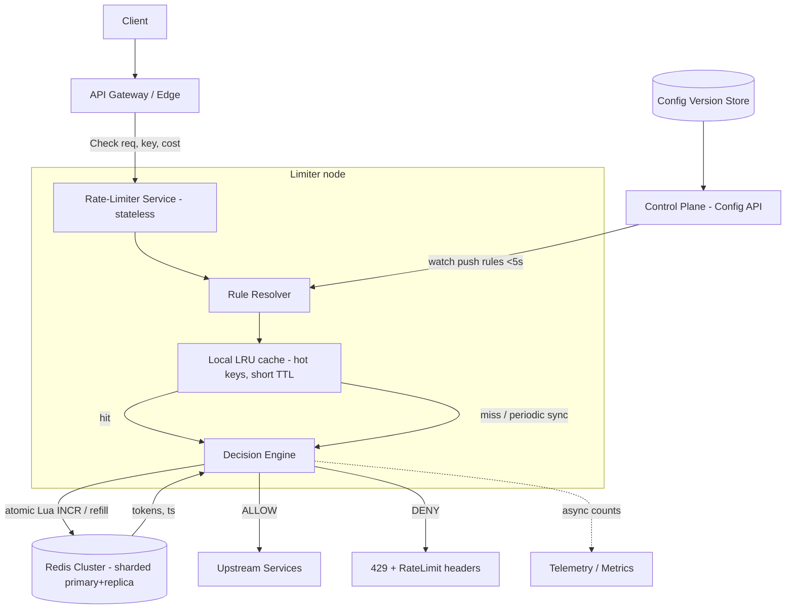

# Design a Distributed Rate Limiter

> Staff/principal-level HLD reference and interview-practice artifact.
> Reader profile: senior backend engineer (Java/JVM, distributed systems) practising HLD.

---

## 1. Problem & clarifying questions

### 1.1 Restating the problem

Design a **distributed rate limiter**: a service (or shared library + backing store) that decides, for every incoming request, whether to **allow** it or **reject/throttle** it, based on configurable limits such as "1000 requests per minute per API key". It must work correctly when enforcement happens across **many machines** in **many data centers**, under **high QPS**, with **low added latency**, and it must degrade gracefully when its own dependencies fail.

A rate limiter is a *control-plane decision on the hot path of the data plane*. That phrasing captures the central tension: the decision logic wants global, perfectly consistent state, but the hot path demands single-digit-millisecond latency and near-100% availability. Almost every deep dive below is a negotiation between those two forces.

### 1.2 Clarifying questions I'd ask the interviewer

A senior answer never jumps to boxes-and-arrows. I'd spend the first 3-5 minutes establishing scope. Grouped by category:

**Functional scope**
1. **Where does enforcement sit?** At the **API gateway / edge** (in front of all services), as a **sidecar / library** embedded in each service, or as a **standalone rate-limiter service** called via RPC? This single answer reshapes the entire design.
2. **What are we keying on?** Per-API-key, per-user-ID, per-IP, per-tenant, per-endpoint, or arbitrary composite keys (e.g. `user:endpoint`)? Do we need **multiple simultaneous limits** on one request (a per-user *and* a global limit)?
3. **What's the limit shape?** Fixed "N per window"? Burst allowance plus sustained rate? Tiered by plan (free vs enterprise)? Do limits change dynamically at runtime?
4. **What happens on a block?** Reject with HTTP 429, queue/delay (shaping), or just *count and report* (monitor mode)? Do we need `Retry-After` and quota headers?
5. **Hard vs soft limits?** Is a small overshoot acceptable (most web APIs) or is this protecting something where every unit matters (billing, payments, regulatory quotas)? This sets the **accuracy budget**.

**Non-functional**
6. **Latency budget?** How many milliseconds may we add to p99? (Typical answer: ≤ 1-2 ms p99 for an edge limiter; the limiter must be far cheaper than the work it gates.)
7. **Availability target?** If the limiter is down, do we **fail open** (allow traffic, risk overload) or **fail closed** (block traffic, risk outage)? This is the single most consequential reliability decision.
8. **Scale?** Total QPS across the fleet? Number of distinct keys (cardinality)? Number of regions/DCs? Read:write ratio (for a counter, every check is also a write).
9. **Consistency requirement?** Is "approximately N per window, ±few %" fine, or must it be exact? Global limit enforced across regions, or per-region budgets summing to a global target?

**Out-of-scope confirmation**
10. Are DDoS mitigation, WAF rules, bot detection, and L3/L4 volumetric defense **out of scope** (handled upstream by the network/CDN layer)? I'll assume the rate limiter handles **L7 application-level** limiting and is *complementary* to, not a replacement for, volumetric DDoS protection.
11. Is **billing/metering** out of scope (we limit, we don't bill)? I'll assume yes, though the counting machinery overlaps.

### 1.3 Assumptions I'll proceed with (stated, then defended later)

- **Deployment:** standalone **rate-limiter service** fronted by / embedded near an **API gateway**, with a **shared Redis** tier as the source of truth and an optional **local in-process cache** for hot keys. This is the most interesting design to discuss because it forces the centralized-vs-local tradeoff.
- **Keying:** flexible composite keys; support **per-key, per-tenant, and global** limits, with **multiple rules** evaluable per request.
- **Limit shape:** **token bucket** semantics (sustained rate + burst), configurable per rule, with tiers.
- **Accuracy budget:** **soft limits** — small overshoot (a few %) acceptable; we optimize for latency and availability over perfect precision. (I'll show what changes if the interviewer demands exactness.)
- **Latency:** add ≤ **1 ms p50 / ≤ 2 ms p99** on the hot path.
- **Availability:** limiter availability target **99.99%**; default **fail-open** for availability-protecting limits, **fail-closed** for abuse/security-critical limits (configurable per rule).
- **Scale (working numbers):** **1,000,000 QPS** aggregate across the fleet, **50 million** distinct active keys, **3 regions**.

---

## 2. Requirements (finalized)

### 2.1 Functional

- **F1 — Decision API:** given a request descriptor (key(s), cost, ruleset), return `ALLOW` or `DENY` plus metadata (remaining quota, reset time, retry-after).
- **F2 — Multiple limit dimensions per request:** evaluate several rules atomically (e.g. per-user 100/s AND per-tenant 10,000/s AND global 500,000/s); deny if *any* rule denies. Most-restrictive-wins.
- **F3 — Configurable algorithms:** token bucket (default), plus sliding-window-counter where smoother enforcement is needed.
- **F4 — Variable cost ("weight"):** a request may cost N tokens (a bulk endpoint costs more than a cheap GET).
- **F5 — Dynamic configuration:** rules (rate, burst, tier mappings) updatable at runtime without redeploy; propagation within seconds.
- **F6 — Tiering:** limits vary by plan (free/pro/enterprise) resolved from key metadata.
- **F7 — Observability:** per-rule allow/deny counts, near-limit alerts, top-talker identification.
- **F8 — Response contract:** standard `429 Too Many Requests` with `Retry-After`, `RateLimit-Limit`, `RateLimit-Remaining`, `RateLimit-Reset` headers (IETF draft `RateLimit` fields).

### 2.2 Non-functional

| Property | Target | Notes |
|---|---|---|
| **Added latency** | ≤ 1 ms p50, ≤ 2 ms p99 | Limiter must be cheaper than gated work by ~100×. |
| **Availability** | 99.99% | ~52 min/yr downtime; degradation must not cascade. |
| **Throughput** | 1M decisions/s aggregate, headroom to 3M | Horizontally scalable. |
| **Consistency** | Eventually/approximately consistent (soft) | Bounded overshoot, configurable to strong per rule. |
| **Durability** | Low — counter state is ephemeral | Losing a window's counters is acceptable; rebuilds within one window. |
| **Config propagation** | < 5 s | Runtime rule changes. |
| **Accuracy** | ±5% overshoot acceptable (soft mode) | Tightenable at latency cost. |

**Terms inline:** *p99 latency* = the 99th-percentile response time (1 in 100 requests is slower). *Fail-open* = if the limiter can't decide, allow the request. *Fail-closed* = if it can't decide, reject. *Token bucket* = a bucket holds up to B tokens, refills at R tokens/sec; each request removes `cost` tokens; empty bucket → deny. *Sliding window* = counts requests over the trailing T seconds, continuously, avoiding the boundary spike of fixed windows.

### 2.3 Explicit assumptions

1. Clients are mostly cooperative (we limit, not defend against a coordinated L3 flood — that's upstream).
2. Clock skew between nodes is bounded (NTP-synced, < 50 ms typical) — relevant for window math.
3. The gated services can absorb the soft overshoot we permit.
4. Most traffic is concentrated on a **small fraction of hot keys** (Zipfian) — this drives the local-cache optimization.

---

## 3. Capacity estimation

I'll show the arithmetic and flag assumptions. (Assumptions in *italics*.)

### 3.1 QPS

- Aggregate gated traffic: **1,000,000 req/s**.
- Each request triggers **≥ 1 rate-limit decision**; with multiple rules (per-user + per-tenant + global), assume *avg 3 rule evaluations per request* → **3,000,000 rule evaluations/s**.
- **Key property:** a rate-limit "read" (check counter) is *also a write* (decrement/increment). There is no read-only path. So this is a **3M read-modify-write ops/s** workload — write-heavy, which strongly constrains datastore choice.
- Peak factor: *design for 3× headroom* → target **9M ops/s** ceiling.

### 3.2 State / storage

- Distinct active keys: **50,000,000**.
- Per-key state (token bucket): `tokens` (8 B float/long) + `last_refill_ts` (8 B) + key overhead. In Redis, a small hash or a packed string ≈ *~100 B including key string and Redis object overhead*.
- Raw counter state: 50M × 100 B = **5 GB**. With multiple rule-scopes (user, tenant, global, plus per-endpoint composites), *multiply by ~4* → **~20 GB** of hot counter state.
- This **fits comfortably in RAM** across a small Redis cluster. Storage is *not* the binding constraint; **op throughput and latency** are.

### 3.3 Memory & cluster sizing (Redis tier)

- A single Redis instance handles *~100k-200k ops/s* for simple atomic ops with low latency (conservative; pipelined/Lua can exceed this but we budget conservatively for p99 under load).
- Need **9M ops/s ceiling ÷ 150k per node ≈ 60 shards/primaries**. Round to **64 primaries** (power of two eases hash-slot mapping).
- Replication: 1 replica each → **128 Redis nodes**. Memory per shard: 20 GB ÷ 64 ≈ **0.31 GB/shard** — trivial; nodes are CPU/network-bound, not memory-bound. Use modest instances; over-provision count for throughput, not RAM.
- **Local cache deflation:** if 90% of decisions are served/short-circuited locally for hot keys (see Deep Dive 2), Redis op load drops ~10× → **~6 shards** suffice for steady state, with the larger fleet as burst headroom. I'll size for **16 primaries + 16 replicas** as a balanced steady-state target, autoscaling up.

### 3.4 Bandwidth

- Each Redis op: request ~150 B + response ~100 B ≈ **250 B on the wire**.
- 3M ops/s × 250 B = **750 MB/s ≈ 6 Gbps** of intra-DC traffic to the Redis tier (pre-local-cache). With local caching → **~0.6 Gbps**. Well within DC fabric; but it argues for **co-locating** limiter and Redis in the same AZ to avoid cross-AZ latency and egress cost.

### 3.5 Limiter compute fleet

- The decision logic itself is cheap (a few hash lookups + one Redis round-trip or local check). A modern core handles *~50k decisions/s* including network. 1M req/s × 3 rules ÷ 50k ≈ **60 cores** → ~**8 nodes** (8-core). With headroom and HA across 3 AZs: **~24 limiter nodes**. Stateless → trivially autoscaled.

**Summary of the napkin math:** write-heavy 3M ops/s, ~20 GB hot state (RAM-resident), ~6 Gbps Redis traffic (cut 10× by local cache), ~64-primary Redis ceiling (16 steady), ~24 stateless limiter nodes. **The constraint is op-throughput-at-low-latency, not storage.**

---

## 4. API design

### 4.1 Decision RPC (the hot path)

gRPC (binary, multiplexed, low-overhead) is preferred over REST for the internal hot path; REST/HTTP shown for the edge-gateway integration.

```protobuf
service RateLimiter {
  // Single round trip; evaluates all matching rules.
  rpc Check(CheckRequest) returns (CheckResponse);
  // Batched for gateways aggregating many subrequests.
  rpc CheckBatch(BatchCheckRequest) returns (BatchCheckResponse);
}

message CheckRequest {
  string domain      = 1; // namespace, e.g. "api" or "login"
  repeated Descriptor descriptors = 2; // the keys/dimensions to check
  uint32 cost        = 3; // tokens to consume (default 1)
}

message Descriptor {
  // ordered key-value pairs that identify the bucket(s), e.g.
  // [{"key":"user_id","value":"u123"}, {"key":"endpoint","value":"/search"}]
  repeated Entry entries = 1;
}

message CheckResponse {
  enum Code { OK = 0; OVER_LIMIT = 1; ERROR = 2; }
  Code code = 1;
  repeated Status statuses = 2; // per-descriptor outcome
}

message Status {
  Code   code            = 1;
  uint64 limit           = 2; // configured limit for this rule
  uint64 remaining       = 3; // tokens/quota left
  uint64 reset_after_ms  = 4; // until window/bucket refills
  uint64 retry_after_ms  = 5; // hint when OVER_LIMIT
}
```

### 4.2 Edge / HTTP semantics

When integrated at the gateway, the limiter's verdict maps to:

```
HTTP/1.1 429 Too Many Requests
Retry-After: 2
RateLimit-Limit: 1000
RateLimit-Remaining: 0
RateLimit-Reset: 14        # seconds until reset
Content-Type: application/json

{ "error": "rate_limited", "retry_after_ms": 2000,
  "rule": "per_user", "request_id": "..." }
```

On `ALLOW`, the same `RateLimit-*` headers are returned (200/2xx) so well-behaved clients can self-throttle proactively — cheaper for everyone than discovering the limit by getting rejected.

### 4.3 Config / admin API (control plane, not hot path)

```
PUT  /v1/rules           # upsert a ruleset (rate, burst, algorithm, tier map)
GET  /v1/rules/{domain}
POST /v1/rules/validate  # dry-run a config before applying
GET  /v1/usage/{key}     # current consumption (read-only, for dashboards)
```

Config is versioned; pushes are validated, canaried, and watch-distributed to limiter nodes (see §5).

---

## 5. High-level architecture

### 5.1 Components and request flow

1. **Client** sends a request to the **API Gateway / Edge**.
2. The gateway (or an embedded **limiter library**) builds a `CheckRequest` and either evaluates locally (library mode) or calls the **Rate-Limiter Service**.
3. The limiter resolves the applicable **rules** (from a hot, watch-updated **config cache**), checks/decrements the relevant **token buckets**, consulting first the **local cache** (for hot keys) and then the **Redis cluster** (source of truth) via **atomic Lua scripts**.
4. Verdict returns; gateway forwards to **upstream services** on ALLOW or returns **429** on DENY.
5. **Async telemetry** (allow/deny counts, top-talkers) flows to a metrics pipeline.
6. A **control plane** distributes rule config and watches Redis health.

### 5.2 ASCII block diagram

```
                         ┌─────────────────────────────────────────┐
            client       │            CONTROL PLANE                 │
              │          │  Config API → validate → version store   │
              ▼          │        │ (watch / push, <5s)              │
      ┌───────────────┐  └────────┼─────────────────────────────────┘
      │  API Gateway  │           │ rules
      │   / Edge LB   │           ▼
      └───────┬───────┘   ┌───────────────────────────────────────┐
              │ Check()   │      RATE-LIMITER SERVICE (stateless)  │
              ├──────────▶│  ┌─────────────┐   ┌────────────────┐  │
              │           │  │ rule resolver│  │  local LRU cache│  │
              │           │  └──────┬──────┘   │ (hot keys,      │  │
              │           │         │          │  short TTL)     │  │
              │           │         ▼          └───────┬────────┘  │
              │           │   decision engine ─────────┘ miss/sync │
              │           └─────────────┬─────────────────────────┘
              │                         │ atomic Lua (INCR/refill)
              │                         ▼
              │                 ┌───────────────────────────┐
              │                 │   REDIS CLUSTER (sharded)  │
              │                 │  primary+replica per shard │
              │                 │  source of truth for counts│
              │                 └───────────────────────────┘
              │
   ALLOW ─────┴────▶ upstream services        DENY ──▶ 429 + RateLimit-* headers
                                              (+ async telemetry pipeline)
```

### 5.3 Mermaid diagram



### 5.4 Sequence diagram — single decision (centralized, atomic)

```mermaid
sequenceDiagram
    participant G as Gateway
    participant L as Limiter node
    participant R as Redis shard
    G->>L: Check(key=u123, cost=1, rules)
    L->>L: resolve rules from config cache
    L->>L: check local cache for u123
    alt local cache fresh & has budget
      L-->>G: ALLOW (served locally)
    else miss / needs source of truth
      L->>R: EVALSHA token_bucket.lua(key, rate, burst, now, cost)
      R->>R: refill = min(burst, tokens + elapsed*rate); if refill>=cost: tokens-=cost
      R-->>L: {allowed, remaining, reset_ms}
      L->>L: update local cache
      L-->>G: ALLOW / DENY + headers
    end
```

---

## 6. Data model & storage choices

### 6.1 Entities

- **Rule / RuleSet** (config plane): `domain`, `match` (key pattern), `algorithm`, `rate`, `burst`, `window`, `tier_overrides`, `fail_mode`. Read-mostly, tiny, versioned. Lives in a **config store** (e.g. etcd/ZooKeeper/Consul or a versioned object in S3 + watch), cached in-process on every limiter node.
- **Bucket / Counter** (data plane): the live state per `(rule, key)`. For **token bucket**: `{ tokens: float, last_refill_ts: epoch_ms }`. For **sliding-window-counter**: `{ current_count, prev_count, window_start }`. High-churn, ephemeral, read-modify-write on every request.
- **Tier metadata:** `key → plan` mapping (which limit applies). Read-mostly; cache aggressively.

### 6.2 Where each lives, and why

**Bucket state → Redis (in-memory KV with atomic scripting).** Defended against the access pattern:
- Pattern is **3M read-modify-write/s, sub-ms, ephemeral, RAM-fitting (~20 GB)**.
- A disk-backed RDBMS (Postgres/MySQL) cannot sustain millions of atomic RMW/s at sub-ms p99 — the write path hits WAL/fsync and lock contention. **Failure mode avoided:** datastore becomes the latency bottleneck and the limiter violates its own latency SLO, or worse, becomes a source of incidents.
- A wide-column store (Cassandra) is tuned for high write throughput but offers **eventual consistency and no cheap atomic read-modify-write**; you'd need lightweight transactions (Paxos) per op, which are slow. **Avoided:** lost-update races (two nodes both read 5, both write 6, one increment vanishes).
- **Redis** gives single-threaded-per-shard atomicity, **Lua scripts** for compound atomic operations, ~sub-ms ops, and trivial horizontal sharding by key. Durability is *not* required (a lost window is fine), which is exactly Redis's weak spot — so the mismatch doesn't hurt us. This is a near-textbook fit.

**Rule config → strongly-consistent config store (etcd/Consul) + in-process cache.** Small, read-mostly, must be consistent across nodes; watch semantics give <5 s propagation. **Avoided:** split-brain where two nodes enforce different limits.

**Telemetry → async pipeline (Kafka → OLAP / time-series).** Never on the hot path; sampled/aggregated. **Avoided:** logging blocking the decision.

### 6.3 Key / sharding design

- Redis key = `rl:{domain}:{ruleHash}:{userKey}` — the `{userKey}` portion is the **hash tag** so Redis Cluster routes all of a key's state to one slot (multi-key Lua scripts require same slot).
- Sharding by `userKey` spreads load and naturally co-locates the buckets that a single Lua call must touch.
- TTL on every bucket key (e.g. 2× window) so idle keys self-evict — this caps memory at *active* cardinality, not lifetime cardinality. **Avoided:** unbounded memory growth from one-shot keys.

---

## 7. Deep dives

This is the bulk. Five hard sub-problems, each with options, a tradeoff table, and a defended decision naming the failure mode avoided.

### Deep Dive 1 — Algorithm choice: token bucket vs sliding window (and the also-rans)

**The question:** what counting model decides allow/deny? It governs burst behavior, memory, and accuracy at window boundaries.

**Candidates explained:**
- **Fixed window counter:** count requests in the current calendar window (e.g. per minute); reset at the boundary. Cheapest (one integer + `INCR`).
- **Sliding window log:** store a timestamp per request; count those within the trailing window. Exact, but O(N) memory per key.
- **Sliding window counter:** approximate the sliding window using the current + previous fixed-window counts, weighted by how far into the current window we are. Two integers, near-exact.
- **Token bucket:** bucket of capacity B refills at R tokens/s; consume `cost` per request; deny when empty. Natural burst support.
- **Leaky bucket:** requests enter a fixed-rate queue; overflow is dropped/delayed. Smooths output to a constant rate (traffic *shaping*, not just policing).

| Algorithm | Memory/key | Burst handling | Boundary accuracy | Atomic cost | Best for |
|---|---|---|---|---|---|
| Fixed window | 1 int | Poor (allows 2× at boundary) | Bad (spike at edges) | 1 op (`INCR`+TTL) | Crude, cheap, internal |
| Sliding window log | O(N) ts | Exact | Exact | Heavy (sorted set ops) | Low-cardinality, exactness-critical |
| Sliding window counter | 2 ints | Smooth | ~Exact (±~1%) | Small Lua | Smooth API limits |
| **Token bucket** | 2 fields | **Configurable burst** | N/A (rate-based) | Small Lua | **General API limiting (our default)** |
| Leaky bucket | queue/2 fields | Shapes to constant | N/A | Small Lua | Egress shaping, fairness |

**The fixed-window boundary problem (why we avoid it as default):** with a 100/min fixed window, a client can send 100 at 00:59 and 100 at 01:00 — **200 requests in ~1 second**, double the intended rate. **Failure mode:** burst overload exactly when you thought you were protected.

**Decision:** **Token bucket as the default**, with **sliding-window-counter** available per rule for endpoints that need smooth enforcement without configured burst.

*Why token bucket:* it natively expresses the two parameters product owners actually care about — *sustained rate* (R) and *burst* (B) — and the math is a cheap atomic update: on each request, `tokens = min(B, tokens + (now - last_refill) * R)`, then if `tokens >= cost`, `tokens -= cost; allow`. Memory is two fields; no per-request timestamps. It avoids the fixed-window boundary spike (rate is continuous, not stepwise) and the sliding-log memory blowup. **Failure mode avoided:** both the boundary-doubling of fixed windows and the unbounded memory of the log approach.

*Why offer sliding-window-counter too:* token bucket *permits* bursts by design; for an endpoint where you want "no more than 100/min, smoothly, ever" without a burst allowance, the sliding-window-counter approximates a true rolling window with two integers and ~1% error. Giving rule authors the choice is a one-line config switch and the engine already speaks Lua.

*Rejected leaky bucket as default:* it *shapes* (delays/queues) rather than *polices* (allow/deny). Queuing on the hot path adds latency and statefulness we don't want for a synchronous gateway check; we keep it as an option for explicit egress shaping use cases.

---

### Deep Dive 2 — Where state lives: centralized Redis vs local + sync (the accuracy/latency tradeoff)

**The question:** every node must agree on "how many tokens are left." Do nodes share one authoritative counter, or keep local counters and reconcile?

**Options:**

**(A) Pure centralized (every decision hits Redis).** Exactly one source of truth. Accurate, simple to reason about. But: a network round trip per decision (adds ~0.3-1 ms intra-AZ, more cross-AZ), Redis becomes the throughput bottleneck and a hard dependency on the hot path.

**(B) Pure local (each node enforces limit/N independently).** Divide the global limit by the node count; each node enforces its slice with zero network calls. Lowest latency, no shared dependency. But: badly inaccurate when traffic is uneven — a key that hits only 3 of 20 nodes gets 3/20 of its quota; and node-count changes (autoscaling) silently change everyone's effective limit. **Failure mode:** under- or over-enforcement that swings with deployment topology — invisible and maddening to debug.

**(C) Local + periodic sync (hybrid / "approximate global").** Each node keeps a **local token budget** for hot keys and **periodically reconciles** with Redis (e.g. every 50-200 ms, or after consuming a batch of tokens). Two common flavors:
- **Local fast-path with central settle:** decide locally from a cached allowance, asynchronously decrement the central counter, and refresh the local allowance on each sync. Hot keys are served from RAM; Redis load drops ~10×.
- **Lease / batch acquisition:** a node *leases* a block of K tokens from the central bucket in one round trip, then spends them locally until exhausted, then leases again. Amortizes the network cost over K requests.

| Approach | Added latency | Redis load | Accuracy | Topology sensitivity | Complexity |
|---|---|---|---|---|---|
| (A) Centralized | High (1 RTT/req) | Highest | Exact-ish (atomic) | None | Low |
| (B) Pure local | ~0 | None | Poor under skew | High | Low |
| (C) Local + sync | ~0 for hot keys | ~10× lower | Bounded overshoot | Low | Medium-High |

**Decision:** **Hybrid (C), tunable toward (A).** Default to **lease/batch acquisition for hot keys** with a **short local TTL**, falling through to **centralized atomic checks** for cold keys and for rules flagged `strict`.

*Why:* the workload is **Zipfian** — a few keys carry most traffic. Those hot keys are exactly where a network RTT per request hurts and where local serving pays off; cold keys are rare enough that a direct Redis hit is cheap and keeps them accurate. The **accuracy cost** of leasing is bounded: with lease size K and N nodes, worst-case overshoot is ≈ `K × N` tokens if all nodes hold full unused leases at a window edge — so we cap K small for tight limits and larger for loose ones. **Failure mode avoided:** the centralized-only latency tax on hot keys *and* the topology-dependent inaccuracy of pure-local. The tunability means a `strict` billing limit can opt into pure-centralized atomic mode while a best-effort abuse limit uses aggressive local leasing.

*The crisp tradeoff sentence for the interviewer:* "I trade a **bounded, known overshoot of ~K×N tokens** for an **~10× reduction in central load and a sub-millisecond hot-key path**, and I make the knob (lease size) per-rule so strictness is a config choice, not an architecture rewrite."

---

### Deep Dive 3 — Race conditions & atomicity (the lost-update killer)

**The question:** two limiter nodes check the same key concurrently. Naive `GET` then `SET` loses updates.

**The race:** node A reads `tokens=1`, node B reads `tokens=1`, both see "enough," both decrement to 0 and allow — **two requests admitted on one token**. Under high concurrency this leaks far past the limit. This is a classic **read-modify-write lost update**.

**Options:**

| Mechanism | How it's atomic | Latency | Caveats |
|---|---|---|---|
| `INCR` + `EXPIRE` (fixed window) | `INCR` is atomic | 1-2 ops | TTL set must not race the first INCR; only works for plain counters |
| `WATCH`/`MULTI`/`EXEC` (optimistic) | abort+retry on contention | retries under contention | Hot keys = high abort rate → latency spikes |
| Distributed lock (Redlock) | mutual exclusion | high (lock acquire) | Lock per decision is far too expensive; avoid |
| **Lua script (`EVAL`/`EVALSHA`)** | **runs atomically on the shard** | **1 RTT, server-side** | Script must be O(1); keys must share a slot |

**Decision:** **Lua scripts executed atomically on the Redis shard.** Redis runs a Lua script to completion single-threaded on the owning shard, so the entire **read-refill-check-decrement** sequence is one indivisible operation — no other command interleaves. One round trip, no lock, no retry storm.

Token-bucket Lua sketch:

```lua
-- KEYS[1]=bucket, ARGV: rate, burst, now_ms, cost
local b = redis.call('HMGET', KEYS[1], 'tokens', 'ts')
local tokens = tonumber(b[1]) or tonumber(ARGV[2])   -- start full
local ts     = tonumber(b[2]) or tonumber(ARGV[3])
local rate, burst, now, cost = tonumber(ARGV[1]), tonumber(ARGV[2]),
                               tonumber(ARGV[3]), tonumber(ARGV[4])
local refill = math.min(burst, tokens + (now - ts) * rate / 1000.0)
local allowed = refill >= cost
if allowed then refill = refill - cost end
redis.call('HMSET', KEYS[1], 'tokens', refill, 'ts', now)
redis.call('PEXPIRE', KEYS[1], math.ceil(burst / rate * 2000))
return { allowed and 1 or 0, math.floor(refill) }
```

*Why not optimistic `WATCH`:* on a **hot key**, every concurrent transaction sees the value change and aborts/retries, producing a **retry storm** that *raises* latency precisely under the load you most need to handle. **Failure mode avoided:** convoy/retry amplification on hot keys. *Why not Redlock per decision:* acquiring a distributed lock for each of millions of ops/s is orders of magnitude too slow and itself a failure source. **The Lua approach avoids the lost-update race with zero added round trips and no lock.**

**Cross-shard atomicity caveat:** a single Lua call can only touch keys in **one slot**. When one request must check **multiple rules whose keys live on different shards** (per-user on shard 7, global on shard 12), we cannot do it in one atomic script. Resolution: evaluate per-shard scripts and **compose with most-restrictive-wins + compensation** — if a later rule denies after an earlier rule already consumed a token, we **refund** the earlier consumption (issue a credit op). Refunds are best-effort and the small window of inconsistency is within our soft budget. For `strict` global limits, we co-locate the global counter on a dedicated shard and check it *last* so a deny needs no refund of the global token. **Failure mode avoided:** silently over-counting a user against a rule that ultimately denied them.

---

### Deep Dive 4 — Per-user / global / tenant limits and multi-dimensional rules

**The question:** a single request may be subject to several limits at once (per-API-key 100/s, per-tenant 10k/s, global 500k/s). How do we evaluate them correctly, cheaply, and fairly?

**Model:** each rule produces a `(key, rate, burst)` bucket. A request resolves to an **ordered list of buckets** from cheapest/most-specific to broadest. **Most-restrictive-wins:** deny if *any* bucket denies.

**Evaluation order matters for two reasons:**
1. **Short-circuit cost:** check the **cheapest, most-likely-to-deny** bucket first when possible to avoid touching others. But:
2. **Refund cost (from DD3):** if you consume from bucket 1 then bucket 2 denies, you must refund bucket 1. So the *safest* order is to check (peek) all without consuming, then consume only if all pass.

**Decision:** **two-phase evaluate within a shard, refund across shards.** When all of a request's buckets are co-located (we engineer this by hashing related dimensions to the same slot where feasible — e.g. tenant + its users share a hash tag prefix), run a **single Lua that peeks all buckets, and only decrements if all allow** — fully atomic, no refunds, no race. When buckets span shards, use the **check-then-refund** compensation from DD3, checking the **global/broadest bucket last** so the most expensive-to-refund consumption is the one most likely to succeed.

**The global limit's hot-shard problem:** a single global counter is touched by *every* request → one shard sees the entire fleet's QPS → hotspot. Two fixes:
- **Approximate global via local leasing (DD2):** nodes lease global tokens in batches; the global counter sees `QPS / K` ops, not full QPS.
- **Sharded global counter ("N counters summing to one limit"):** split the global limit L into N sub-counters of L/N, route by `hash(request) % N`. Each sub-shard handles QPS/N. Drift between sub-counters is bounded; periodic rebalancing corrects it. **Failure mode avoided:** the global rule turning one Redis shard into a melting hotspot that caps total system throughput.

| Limit type | Cardinality | Hotspot risk | Strategy |
|---|---|---|---|
| Per-API-key/user | Very high (50M) | Low (spread) | Direct shard by key; local cache hot ones |
| Per-tenant | Medium (10s of k) | Medium | Hash-tag with users for co-located atomic check |
| Global | One (or few) | **High** | Leasing + sharded sub-counters |

**Fairness within a tenant:** a single noisy user shouldn't starve a tenant's whole budget. We support **hierarchical limits** (per-user *and* per-tenant) so the per-user cap protects siblings, and optionally **weighted fair queuing**-style allocation for premium tenants. **Failure mode avoided:** one abusive user consuming the tenant's entire shared quota.

---

### Deep Dive 5 — Failure modes: fail-open vs fail-closed, and scaling the limiter itself

**5a. What happens when Redis (the source of truth) is unreachable?**

This is the question every staff interviewer drills. There is **no universally correct answer** — it's per-rule policy:

| Failure policy | Behavior on Redis outage | Risk | Use when |
|---|---|---|---|
| **Fail-open** | Allow all traffic | Backend overload, abuse slips through | The limit protects *fairness/cost*, and an outage of the limiter must not take down the product |
| **Fail-closed** | Reject all traffic | Self-inflicted outage | The limit protects *safety/security/correctness* (e.g. login brute-force, billing) |
| **Degrade-local** | Fall back to local-only counters (DD2-B) | Approximate, topology-sensitive | Default best-effort — keep limiting *roughly* even without Redis |

**Decision:** **per-rule fail mode, defaulting to degrade-local then fail-open.** For an availability-protecting API limit, the worst outcome is the limiter taking down a healthy service, so on Redis loss we first **degrade to local counters** (each node enforces limit/N from cached config) and, if even that is unavailable, **fail open** — *a rate limiter should rarely be the reason the product is down.* For security-critical rules (auth, payment), we **fail closed**. We make this an explicit per-rule field so the choice is a product decision, reviewed, not an accident.

*Crucial nuance — fail-open's hidden danger:* if you fail open during a Redis outage that was *caused by* a traffic surge, you remove the brake exactly when overload hits. Mitigations: (1) **local degrade first** keeps a coarse brake on; (2) a **circuit breaker** trips after K consecutive Redis errors to stop hammering a dying Redis; (3) **load-shedding** at the gateway as a separate, limiter-independent safety net. **Failure mode avoided:** a cascading failure where the limiter's own outage amplifies the overload it was meant to prevent.

**5b. Scaling the limiter itself — where it breaks first and what breaks next.**

- **Limiter compute:** stateless → autoscale horizontally; no bottleneck. Breaks only if config cache or telemetry pushes back-pressure — keep both async/cached.
- **Redis throughput (first hard ceiling):** a hot shard caps out at ~150k ops/s. *Removed by:* sharding by key (spreads cold keys), local caching/leasing (cuts hot-key load ~10×), and sub-counter sharding for the global rule.
- **Single hot key (the celebrity problem):** one key (a viral tenant, a global limit) can exceed a single shard's capacity even with sharding, because all its state is on one slot. *Removed by:* splitting that key into N sub-buckets (`key#0..key#N`), checking a random sub-bucket, summing for reporting — converts one hot slot into N warm slots. **Failure mode avoided:** a single popular key bottlenecking the whole limiter.
- **Cross-AZ/region latency:** if limiter and Redis span AZs, the RTT blows the latency budget. *Removed by:* co-locating limiter + Redis per AZ; per-region Redis with **per-region budgets** that sum to the global target, reconciled asynchronously. Strong global limits across regions are inherently slow (speed of light) — we make global limits *approximate across regions* and exact *within* a region. **Failure mode avoided:** paying inter-region RTT (tens of ms) on every decision.
- **Config push storm:** pushing a rule change to thousands of nodes at once. *Removed by:* watch-based pull with jittered staggering and version checks.

---

## 8. Scaling & bottlenecks

**How it scales:** the limiter tier is stateless → add nodes linearly behind the gateway. The Redis tier scales by adding shards (re-hashing slots) and by reducing per-shard load via local caching/leasing. State is RAM-bounded by *active* key cardinality (TTLs evict idle keys), so memory grows with concurrent active users, not lifetime users.

**Where it breaks, in order:**
1. **Hot single key** (global limit or celebrity tenant) → split into N sub-buckets.
2. **Hot Redis shard** → reshard + local leasing to cut central ops ~10×.
3. **Cross-AZ latency** → co-locate; per-region budgets.
4. **Config propagation latency** → watch/pull with jitter.
5. **Telemetry back-pressure** → sample + async + bounded buffers (drop telemetry before dropping decisions).

**Removing each:** summarized above; the throughline is *move work off the central hot path* — cache hot keys locally, shard hot counters, keep cross-region limits approximate.

---

## 9. Reliability, consistency & security

**Failure handling:** per-rule fail-open/closed/degrade (DD5); circuit breaker on Redis errors; gateway-level load-shedding as an independent backstop; Redis primary→replica failover (Sentinel/Cluster) — note a failover loses in-flight counter state, but that's within our durability tolerance (a partial window resets).

**Replication & consistency model:** Redis primary with async replica per shard. Counters are **not** strongly durable — acceptable, since the worst case is a single window's worth of state loss (we re-establish within one window). Consistency is **approximate/eventual within the soft budget**; `strict` rules opt into centralized atomic checks and dedicated co-located counters for near-exactness. Across regions, limits are **eventually consistent** (per-region budgets reconciled async) — we explicitly do not promise exact global limits across continents.

**Idempotency:** the decision RPC is *not* naturally idempotent (it consumes a token). Gateways must not blindly retry a `Check` that may have already consumed — we tag each check with a **request ID**; a retried check with the same ID within a short window returns the **memoized verdict** instead of double-decrementing. **Failure mode avoided:** client/gateway retries silently burning quota.

**Auth & multi-tenancy isolation:** the limiter trusts only authenticated identity from the gateway (signed key/JWT claims) for keying — never raw client-supplied headers, or a client spoofs another tenant's key to drain their quota. Tenant counters are namespaced; no cross-tenant key collisions. The admin/config API is RBAC-gated and audited.

**Abuse / the limiter defending itself:** the limiter is a security control *and* a target. It must (1) cap per-key memory (TTL + max sub-buckets) so an attacker can't OOM Redis by minting infinite distinct keys — **failure mode avoided:** cardinality-bomb DoS on the limiter; (2) treat unauthenticated traffic with a separate, tighter IP-based pre-limit; (3) coordinate with upstream volumetric DDoS protection (out of scope but assumed present) — the L7 limiter is not a flood defense.

---

## 10. Extensions & follow-ups

- **"Make the global limit exact across 3 regions."** Now you need either a single global counter (cross-region RTT on every decision — kills latency) or a consensus/CRDT-based global counter reconciled continuously. Honest answer: exact + global + low-latency + multi-region is the CAP/physics trilemma — pick two. I'd negotiate per-region budgets summing to global with fast async reconciliation and accept bounded overshoot.
- **"Add request *shaping* (delay, not reject)."** Switch the rule to leaky-bucket semantics with a bounded queue at the edge; adds latency and statefulness — only for specific endpoints.
- **"Dynamic limits / adaptive throttling."** Feed backend health (latency, error rate) into rule rates — *concurrency limiting* / AIMD (additive-increase/multiplicative-decrease) so limits tighten automatically under stress. Turns a static limiter into an adaptive load controller.
- **"Quota-based monthly limits (not per-second)."** Long windows shift the bottleneck from throughput to durable accounting — now you *do* need a durable store (the counter must survive restarts) and possibly billing-grade exactness; Redis becomes a cache in front of a durable ledger.
- **"Limit by cost/weight that's unknown until after execution."** Reserve an estimate, reconcile actual cost afterward (refund/charge) — the same compensation machinery as DD3's cross-shard refunds.
- **"Multi-region active-active with one identity hitting different regions."** Sticky routing by key, or accept that each region enforces its slice; reconcile.

---

## 11. Interview Q&A

**Q1. Token bucket or sliding window — which and why?**
Token bucket as default: it expresses sustained rate + burst (what product owners want), is O(1) memory (two fields), and avoids the fixed-window boundary doubling. Sliding-window-counter offered per rule for smooth, burst-free enforcement.
*Probe — when would you switch?* For an endpoint that must never burst (e.g. an expensive report generator), sliding-window-counter; for exact low-cardinality cases, sliding-window-log.

**Q2. Where does the counter state live and why Redis?**
RAM-fitting (~20 GB), ephemeral, 3M atomic RMW/s — Redis is single-threaded-atomic per shard, has Lua for compound atomic ops, sub-ms, trivially sharded; durability (its weakness) isn't required. An RDBMS chokes on RMW throughput; Cassandra lacks cheap atomic RMW.
*Probe — what if it must survive restarts?* Then it's a quota/ledger problem; put a durable store behind Redis and treat Redis as a cache.

**Q3. (Senior signal) Centralized vs local state — defend your choice.**
Hybrid: lease batches of tokens locally for hot (Zipfian) keys, centralized atomic for cold/strict keys. I trade a bounded ~K×N overshoot for ~10× less central load and a sub-ms hot path, and expose lease size per rule so strictness is config, not architecture.
*Probe — quantify the overshoot.* Worst case ≈ lease_size × node_count unused leased tokens at a window edge; cap lease_size small for tight limits.

**Q4. How do you prevent two nodes double-spending the same token?**
Atomic Lua on the owning shard: read-refill-check-decrement runs indivisibly, one RTT, no lock, no retry storm. Avoids the lost-update race that optimistic WATCH (retry storm on hot keys) and Redlock (too slow) would mishandle.
*Probe — multi-rule across shards?* Can't be one atomic script; peek-then-consume when co-located, check-then-refund (compensation) when cross-shard, checking the broadest limit last.

**Q5. (Senior signal) Redis is down — fail open or closed?**
Per-rule policy. Default: degrade to local counters, then fail open, because a limiter shouldn't take the product down. Security-critical rules (auth/payment) fail closed. Mitigate fail-open's danger (removing the brake during a surge) with local degrade + circuit breaker + independent gateway load-shedding.
*Probe — fail-open during a surge-caused Redis outage?* Exactly why local-degrade-first keeps a coarse brake and load-shedding exists as a separate net.

**Q6. The global limit is a single hot counter — how do you scale it?**
Local leasing (global counter sees QPS/K) plus sharded sub-counters (split L into N counters of L/N, route by hash). Converts one melting shard into N warm shards; drift is bounded and periodically rebalanced.

**Q7. How much latency do you add and how do you keep it low?**
≤1 ms p50 / ≤2 ms p99. Local cache for hot keys (no network), single Lua RTT for cold keys, co-locate limiter+Redis in-AZ, gRPC binary protocol, EVALSHA (cached script).

**Q8. (Senior signal) How do you stop a noisy user from starving a tenant?**
Hierarchical limits: per-user cap protects siblings, per-tenant cap protects the global pool; optionally weighted allocation for premium tenants. Most-restrictive-wins composition.
*Probe — fairness implementation?* Per-user buckets nested under tenant buckets; the per-user limit is the fairness guarantee.

**Q9. How is config distributed without a restart, consistently?**
Versioned config in a strongly-consistent store (etcd/Consul), watch-based pull to in-process caches with jittered staggering, validate + canary before apply, <5 s propagation.

**Q10. How do you keep the limiter itself from being a DoS target?**
TTL + max sub-buckets cap memory against cardinality bombs; tighter IP pre-limit for unauthenticated traffic; key only off authenticated identity (never spoofable headers); coordinate with upstream volumetric DDoS defense.

---

## 12. Cheat-sheet & self-test

### Dense recap

- **Shape:** standalone limiter service near the gateway; Redis source of truth; local cache/leasing for hot keys; control plane pushes rules.
- **Numbers:** 1M req/s → 3M atomic RMW/s; ~20 GB hot state (RAM); ~6 Gbps Redis traffic (→0.6 with local cache); ~64-primary Redis ceiling (16 steady); ~24 stateless limiter nodes; ≤1 ms p50 / ≤2 ms p99; 99.99% availability.
- **Algorithm:** token bucket default (`tokens = min(burst, tokens + elapsed*rate)`, then `if tokens>=cost: tokens-=cost`); sliding-window-counter optional.
- **State:** hybrid — lease locally for hot Zipfian keys, centralized atomic for cold/strict; overshoot bounded ≈ lease×nodes.
- **Atomicity:** Lua on the owning shard (no lock, no retry storm); cross-shard = peek-then-consume or check-then-refund, broadest limit last.
- **Multi-dim:** per-user + per-tenant + global, most-restrictive-wins; global counter sharded into sub-counters + leasing to kill the hotspot.
- **Failure:** per-rule fail mode; default degrade-local → fail-open; auth/payment fail-closed; circuit breaker + independent load-shedding.
- **Consistency:** approximate within soft budget; strict opt-in; cross-region eventually consistent (per-region budgets).
- **Security:** key off authenticated identity only; TTL + sub-bucket caps stop cardinality-bomb DoS; idempotent retries via request-ID memoization.
- **Diagram in words:** client → gateway → limiter (resolve rules → local cache → atomic Lua on sharded Redis) → allow to upstream or 429 with RateLimit-* headers; control plane watches config; telemetry async.

### Self-test (no answers)

1. Derive the worst-case overshoot for the leasing scheme with lease size K, N nodes, and a window edge — and show how you'd bound it for a strict 100/s limit.
2. A single Lua script can't span Redis shards. Walk through evaluating per-user + per-tenant + global limits when all three keys land on different shards, including the refund logic and ordering.
3. Your limiter fails open during a Redis outage that was itself triggered by a 5× traffic surge. Trace what happens to the protected backend and name three independent mechanisms that prevent a cascade.
4. The "global 500k/s" rule makes one shard hit 100% CPU at 1M req/s. Compute how many sub-counters you need and describe the drift between them and how you'd correct it.
5. Compare token bucket vs sliding-window-counter for an endpoint specified as "exactly 60 requests per minute, no bursts" — which do you pick, what error does each introduce, and what memory does each cost per key?
