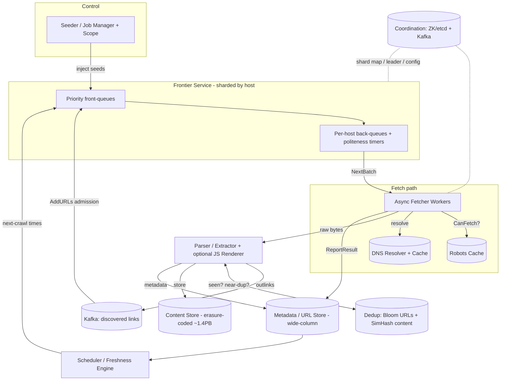
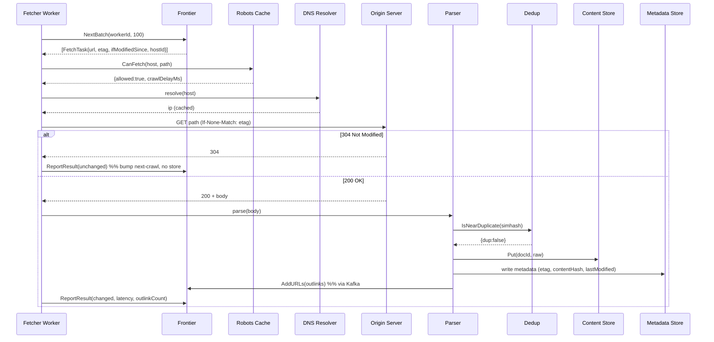

# Design a Web Crawler — Staff-Level HLD

> Category: Storage & Infrastructure. Target: a senior backend engineer practising for a staff/principal system-design round. The goal is not just *a* working crawler, but the design **judgment** — what to clarify, what to estimate, which tradeoffs win and why, and which failure mode each decision avoids.

---

## 1. Problem & Clarifying Questions

**Restated problem.** Build a system that, starting from a set of seed URLs, discovers and downloads web pages at internet scale, extracts links to discover more pages, stores the content for downstream consumers (a search index, an LLM training pipeline, a copyright/plagiarism scanner, etc.), and keeps that content reasonably fresh over time — all while being a *polite* and *robust* citizen of the web (honouring `robots.txt`, not hammering any single site, not getting stuck in traps).

A web crawler is deceptively simple ("BFS over a graph of hyperlinks") and genuinely hard at scale: the graph has ~billions of nodes, is adversarial (spam, crawler traps, cloaking), is constantly changing (freshness), and you must be polite to hundreds of millions of independently-owned servers while saturating tens of Gbps of your own bandwidth.

Before drawing a single box, I'd interrogate the interviewer. The *shape* of the answers radically changes the design.

### 1.1 Functional scope

1. **What is the crawl for?** A search engine index (need broad coverage + freshness + full text), an LLM training corpus (need broad one-time coverage, dedup matters enormously, freshness matters little), a price/news monitor (need narrow but *very fresh* recrawl of a known set), or a vertical crawler (only one domain/type)? This dictates the entire prioritization and freshness strategy.
2. **What content types?** HTML only, or also PDFs, images, JS-rendered SPAs (Single Page Applications — pages whose content is built client-side by JavaScript, so the raw HTML is nearly empty)? JS rendering is ~10–50× more expensive per page (you must run a headless browser), so this is a major fork.
3. **Do we need the link graph** (for PageRank-style ranking) or just the content?
4. **Scope of the crawl** — the entire public web, a country/language subset, or a curated allowlist of domains?
5. **One-shot vs. continuous?** A one-time snapshot is far simpler than a perpetually-running, recrawling system.

### 1.2 Non-functional

6. **Scale & timeline:** how many pages total, and in what time window? "1B pages in 30 days" and "100B pages, continuously" are different machines.
7. **Freshness SLOs:** how stale can content be? News in minutes, a static encyclopedia in months. Is there a tiered policy?
8. **Politeness constraints:** must we honour `robots.txt` and `Crawl-delay`? (For any reputable operation: yes, hard requirement.) Any contractual rate limits with specific partners?
9. **Availability/durability:** the crawler can tolerate downtime (it's a background batch system, not user-facing), but the **crawled corpus** is expensive to reproduce — what's its durability target? I'll assume 11 nines (S3-class) for stored content.
10. **Consistency:** does anyone read crawl state in real time, or is eventual consistency fine? Almost always eventually consistent is fine.

### 1.3 Out-of-scope (confirm with interviewer)

- Building the **search index / ranking** itself — we produce the corpus + link graph; indexing is downstream.
- **Parsing semantics** beyond link extraction and basic content extraction.
- **Login-walled / paywalled** content and CAPTCHAs (we crawl the public web).
- **Legal/ToS** adjudication (assume a policy layer hands us an allow/deny list).

### 1.4 Assumptions I'll proceed with

> **Use case:** general-purpose crawler feeding a search index — so we need broad coverage, the link graph, *and* a tiered freshness policy. This is the hardest, most general variant, so it exercises every deep dive.
> **Scale:** crawl and maintain **~10 billion pages**, refreshing the whole corpus on average roughly monthly (with hot pages far more often, cold pages far less).
> **Content:** HTML primarily; a JS-rendering path exists but is gated to a small high-value subset.
> **Politeness:** strict `robots.txt` + adaptive per-host rate limiting are hard requirements.
> **Time:** continuously running; design for steady-state throughput, not a one-shot burst.

---

## 2. Requirements (finalized)

### 2.1 Functional

- **F1 — Seeding:** accept seed URLs and a domain allow/deny policy.
- **F2 — Fetch:** download pages over HTTP(S), following a bounded number of redirects.
- **F3 — Parse & extract:** extract outlinks, canonical URL, last-modified/ETag, content type, and (optionally) main text.
- **F4 — Frontier management:** maintain the set of URLs yet to crawl, with **prioritization** (importance) and **politeness** (per-host pacing) decoupled.
- **F5 — Dedup:** avoid re-fetching the same URL; avoid storing duplicate *content* (mirrors, syndicated articles, URL aliases).
- **F6 — Politeness:** honour `robots.txt`, `Crawl-delay`, and adaptive backoff; never overwhelm a host.
- **F7 — Storage:** persist raw content (or a normalized form) + metadata, durably and cheaply, in a way downstream jobs can scan.
- **F8 — Freshness/recrawl:** schedule re-crawls per a tiered policy driven by observed change rate and page importance.
- **F9 — Trap avoidance:** detect and escape infinite URL spaces, calendar loops, session-id explosions, and malicious traps.
- **F10 — Observability:** per-host stats, crawl rate, error rates, queue depths, freshness lag.

### 2.2 Non-functional

| Property | Target | Notes |
|---|---|---|
| Throughput | ~**4,000–5,000 pages/sec** sustained (see §3) | The dominant design driver. |
| Politeness | ≤ 1 request / host / `Crawl-delay` (default ~1–2 s) | Hard requirement; reputational + legal risk. |
| Corpus durability | ~11 nines | Re-crawling 10B pages is expensive; don't lose them. |
| Crawler availability | ~99% (best-effort) | Background system; brief downtime just slows progress. |
| Freshness | Tiered: hot ≤ hours, warm ≤ days, cold ≤ weeks/months | Driven by change-rate model. |
| Consistency | Eventual everywhere | No strong-consistency need in the hot path. |
| Latency (per page) | Not user-facing; optimize throughput, not p99 latency | A slow page just yields to others. |

### 2.3 Why these numbers (preview)

10B pages, recrawled ~monthly → 10e9 / (30·86400 s) ≈ **3,860 fetches/sec** average just for refresh, before counting first-time discovery growth. Round up to ~**5,000 pages/sec** to absorb growth and bursts. Everything else (storage, bandwidth, machine count) flows from this, derived in §3.

---

## 3. Capacity Estimation (show the arithmetic)

Let me anchor on the throughput target and derive the rest. I'll state every constant I assume.

### 3.1 Throughput

- Corpus: `P = 10e9` pages.
- Average refresh period: `T = 30 days = 2.592e6 s`.
- Average refresh rate: `P / T = 10e9 / 2.592e6 ≈ 3,858 pages/s`.
- Add discovery + headroom (×1.3): **≈ 5,000 pages/s** target. Call it **5k pps**.

Peak is not really "peak" for a background system — we run flat-out continuously — but we size for ~**7k pps** burst to absorb the recrawl scheduler bunching work.

### 3.2 Bandwidth

- Average HTML page on the wire (gzip-compressed): assume **~100 KB** fetched (uncompressed HTML averages ~100–500 KB; compressed transfer ~30–100 KB; I'll use 100 KB transferred to be safe).
- Download bandwidth: `5,000 pps × 100 KB = 500 MB/s = 4 Gbps`.
- At peak 7k pps → **~5.6 Gbps**. Add DNS, robots fetches, TLS overhead, retries (~20%): **~7 Gbps ingress** to provision.
- Outbound (requests) is tiny by comparison (~a few hundred bytes/request → tens of Mbps).

> *Sanity check:* 7 Gbps is comfortably within a handful of modern NICs (25–100 Gbps each). Bandwidth is **not** the binding constraint; politeness and DNS/connection concurrency are.

### 3.3 Storage

Two layers: **content** and **metadata**.

**Raw/compressed content store:**
- Per page, store ~100 KB compressed HTML. (We could store *less* — just extracted text — but for a search corpus keep raw for reprocessing.)
- `10e9 × 100 KB = 1e15 B = 1 PB` for one copy of the corpus.
- Keep ~2 historical versions for diffing/freshness analysis on a hot subset (say 20% of pages, 2 extra versions): `+ 0.2 × 10e9 × 2 × 100 KB = 4e13 B = 40 TB` — negligible vs. 1 PB.
- With 3× replication (or erasure coding ≈ 1.4× — see §6): replicated ≈ **3 PB**; erasure-coded ≈ **1.4 PB**. We'll choose erasure coding for cold content.

**Metadata / URL store (the crawl-state DB):**
- Per URL row: normalized URL (~80 B avg after hashing — store a 128-bit URL hash as key + the URL ~100 B), last-crawl time (8 B), ETag/Last-Modified (~40 B), content hash (16 B), importance score (8 B), status, host id, next-crawl time, change-rate estimate. Call it **~300 B/URL** with indexing overhead.
- We also track *discovered-but-not-yet-crawled* URLs. The frontier can be much larger than the crawled set — the web has far more URLs than useful pages. Assume frontier ≈ 5× crawled = 50B URL entries known.
- `50e9 × 300 B = 1.5e13 B = 15 TB` for URL metadata (sharded KV / wide-column). Modest.

**Dedup structures (in-memory, hot path):**
- **Seen-URL set:** a Bloom filter (a probabilistic set that says "definitely not seen" or "probably seen", using a bit array + k hash functions — small per element, tiny false-positive rate, no false negatives). At ~10 bits/element for ~1% FPR: `50e9 × 10 bits = 5e11 bits ≈ 62.5 GB`. Sharded across the fleet, this is fine in RAM (or use a scalable/partitioned Bloom variant). To drive FPR to ~0.1% use ~14–15 bits/elem → ~90 GB.
- **Content fingerprint set** (for near-dup detection, §7.3): SimHash 64-bit per page; storing 10B fingerprints for blocking lookups = `10e9 × 8 B = 80 GB` (plus index).

### 3.4 Compute / fleet sizing

The binding constraint is **concurrent in-flight fetches**, because each fetch is mostly *waiting* (network RTT, server think time), not CPU.

- Average fetch wall-time (connect + TLS + first byte + body): assume **~500 ms** end-to-end (many sites are slow; tail is long).
- Required concurrency `C = throughput × latency = 5,000 pps × 0.5 s = 2,500` simultaneous in-flight fetches at average; for the long tail and peak, provision **~10,000–20,000 concurrent connections**.
- One async fetcher process (epoll/Netty/async-IO, *not* thread-per-connection) handles ~5,000–10,000 concurrent sockets comfortably given enough RAM and a fast DNS/TLS path. So **~2–4 fetcher nodes** would suffice for raw fetching — but we run **more (say 20–50)** for: per-host politeness spreading, fault tolerance, parsing/rendering CPU, and headroom.
- **Parsing** (HTML parse + link extraction + text extraction) costs ~1–5 ms CPU/page. `5,000 pps × 5 ms = 25 CPU-seconds/sec = ~25 cores`. A couple of machines. JS rendering, if used on even 1% of pages (50 pps) at ~1–2 s of a headless browser each, needs `50 × 1.5 = 75` concurrent browser instances ≈ several beefy nodes — hence we **gate** it.
- **Frontier + dedup services:** a sharded cluster (say 10–30 nodes) holding the URL store, Bloom filters, and per-host queues in RAM/SSD.

**Fleet, order-of-magnitude:** ~**50–100 nodes** total (fetchers, parsers, frontier/dedup shards, schedulers, storage front-ends), plus the PB-scale object store (managed/erasure-coded). The headline cost is **storage (1+ PB)** and **egress/ingress bandwidth**, not CPU.

> **Estimation takeaways to say out loud:** (1) bandwidth ~7 Gbps — easy; (2) concurrency ~10–20k sockets — the real fetch constraint; (3) storage ~1.4 PB erasure-coded; (4) dedup Bloom filter ~60–90 GB RAM; (5) the *hard* limit is **politeness**, not hardware — you physically cannot crawl one slow site faster than its `Crawl-delay`, so throughput comes from *breadth* (many hosts in parallel), not depth.

---

## 4. API Design

A crawler is mostly internal services, but it has a clean internal RPC surface plus an operator/control API. I'll define both.

### 4.1 Control / operator API (external)

```
POST /v1/crawl-jobs
  body: {
    seeds: ["https://a.com", ...],
    scope: { allow: ["*.gov"], deny: ["*.example-spam.com"] },
    policy: { maxDepth: 20, jsRender: false, freshnessTier: "auto" },
    budget: { maxPages: 1_000_000_000, maxBytes: null }
  }
  -> 202 { jobId, status: "ACCEPTED" }

GET  /v1/crawl-jobs/{jobId}            -> { status, pagesCrawled, frontierSize, errors, freshnessLag }
PATCH /v1/crawl-jobs/{jobId}           -> pause | resume | adjust budget
GET  /v1/hosts/{host}/stats            -> { reqRate, crawlDelay, robotsStatus, errorRate, lastCrawl }
POST /v1/urls:submit                   -> manually inject high-priority URLs (e.g., sitemap, news ping)
```

### 4.2 Internal service RPCs (the hot path)

**Frontier service** — the brain of "what to fetch next":

```
// Workers pull a batch of fetch-ready URLs (already politeness- and priority-gated).
Frontier.NextBatch(workerId, max=100) -> [ FetchTask{ url, hostId, scheme,
                                                      ifModifiedSince, etag,
                                                      priority, attempt } ]

// Discovered links flow back in for admission control + dedup + scheduling.
Frontier.AddURLs(parentUrl, [ DiscoveredUrl{ url, anchorText } ]) -> { admitted, dropped }

// Report the outcome so we update next-crawl time, change-rate, error backoff.
Frontier.ReportResult(FetchResult{ url, status, fetchedAt, contentHash,
                                   etag, lastModified, latencyMs,
                                   outlinkCount, error? }) -> ack
```

**Dedup service:**

```
Dedup.SeenURL(urlHash128) -> bool          // Bloom-backed; "probably seen"
Dedup.MarkURLSeen(urlHash128) -> ack
Dedup.IsNearDuplicate(simhash64) -> { dup: bool, canonicalDocId? }
```

**Robots/politeness service:**

```
Robots.CanFetch(host, path, userAgent) -> { allowed: bool, crawlDelayMs, cacheTtl }
```

**Content store:**

```
Store.Put(docId, rawBytes, metadata) -> { offset, version }   // append-mostly
Store.GetMeta(urlHash128) -> { etag, lastModified, contentHash, version }
```

**Design choices in the API:**
- `NextBatch` returns work that is *already* politeness- and priority-resolved — workers stay dumb; intelligence lives in the frontier. This prevents workers from independently hammering a host (a classic distributed-politeness bug).
- `ReportResult` is **idempotent** keyed on `(urlHash, attempt)` — re-delivery of a result must not corrupt change-rate estimates.
- Batched pulls (`max=100`) amortize RPC overhead at 5k pps.

---

## 5. High-Level Architecture

### 5.1 Component overview

- **Seeder / Job manager** — accepts jobs, injects seeds, enforces scope & budget.
- **Frontier service (sharded)** — the URL queue. Two-stage design (priority front-queues → per-host back-queues; see §7.1). Decides *what* and *when*.
- **DNS resolver (with cache)** — resolves hostnames; a major hidden bottleneck (recursive DNS is slow & rate-limited), so we cache aggressively and run our own resolvers.
- **Robots cache service** — fetches/caches `robots.txt` per host; answers `CanFetch`.
- **Fetcher workers (async)** — pull tasks, do conditional GETs, stream bodies, handle redirects/timeouts.
- **Parser/extractor** — parse HTML, extract outlinks + canonical + metadata + main text; optional **renderer** (headless browser) for JS pages.
- **Dedup service** — URL-seen Bloom filter + content fingerprint (SimHash) near-dup detection.
- **Content store** — PB-scale object store (raw + extracted), append-mostly, erasure-coded.
- **Metadata/URL store** — sharded wide-column/KV for per-URL crawl state.
- **Scheduler / freshness engine** — computes next-crawl times from change-rate model + importance.
- **Coordination** — ZooKeeper/etcd for shard assignment, leader election, config; a durable queue (Kafka) for the discovered-links and result streams.
- **Observability** — metrics, per-host dashboards, freshness-lag tracking.

### 5.2 ASCII block diagram

```
                         +------------------+
   seeds / job API  -->  |  Seeder / Job    |
                         |  Manager + Scope |
                         +---------+--------+
                                   | inject seeds
                                   v
   +-----------------------------------------------------------------+
   |                      FRONTIER SERVICE (sharded by host)         |
   |   [priority front-queues]  -->  [per-host back-queues + timers] |
   |        ^                                       |                |
   |        | AddURLs (admission + dedup gate)      | NextBatch      |
   +--------|---------------------------------------|----------------+
            |                                       v
            |                          +-------------------------+
            |                          |   FETCHER WORKERS (async)|
            |                          |  conditional GET, retries|
            |  discovered links        +-----+--------------+-----+
            |  (Kafka topic)                 |              |
            |                          robots?|          DNS?|
            |                    +-----------v---+   +------v-------+
            |                    | ROBOTS CACHE  |   | DNS RESOLVER |
            |                    +---------------+   |  + cache     |
            |                                        +--------------+
            |                                 | raw bytes
            |                                 v
   +--------+--------+    +-------------------------------+
   |  DEDUP SERVICE  |<-->|   PARSER / EXTRACTOR          |
   |  Bloom (URLs)   |    |   (+ optional JS renderer)    |
   |  SimHash (dups) |    +---------------+---------------+
   +-----------------+                    |
                                          v
   +--------------------+     +-----------------------------+
   | METADATA/URL STORE |<--> |  CONTENT STORE (object,     |
   | (wide-column KV)   |     |  erasure-coded, ~1.4 PB)    |
   +---------+----------+     +-----------------------------+
             ^
             |
   +---------+-----------+      +-----------------------+
   | SCHEDULER /         |      | COORDINATION          |
   | FRESHNESS ENGINE    |<---->| (ZooKeeper/etcd,Kafka)|
   +---------------------+      +-----------------------+
```

### 5.3 Mermaid diagram



### 5.4 Sequence — fetch one URL



### 5.5 Request flow in words

1. Scheduler emits due URLs into the **frontier**; the seeder injects seeds and new jobs.
2. Frontier resolves **priority** (which front-queue) and **politeness** (which per-host back-queue and when), and hands ready batches to fetchers via `NextBatch`.
3. A fetcher checks the **robots cache**, resolves DNS (cached), issues a **conditional GET** (using stored ETag/Last-Modified to get cheap `304`s), follows bounded redirects, and streams the body.
4. The **parser** extracts outlinks, canonical URL, and metadata; the **dedup** service filters already-seen URLs (Bloom) and near-duplicate content (SimHash).
5. Novel content goes to the **content store**; metadata to the **URL store**; new outlinks flow back to the frontier (via Kafka) through **admission control**.
6. The fetcher reports the result; the **freshness engine** updates the change-rate estimate and computes the next-crawl time.

---

## 6. Data Model & Storage Choices

### 6.1 Entities

**URL / page record (crawl state)** — the per-URL row in the metadata store:

| Field | Type | Purpose |
|---|---|---|
| `url_hash` (PK) | 128-bit | Stable, fixed-size key for the normalized URL. |
| `url` | string | The normalized URL (canonical form). |
| `host_id` | 64-bit | Politeness/sharding key. |
| `status` | enum | NEW, CRAWLED, ERROR, DISALLOWED, DEAD. |
| `last_crawl_at` | ts | For freshness/backoff. |
| `next_crawl_at` | ts | Set by freshness engine; drives scheduling. |
| `etag`, `last_modified` | string | For conditional GETs (cheap `304`s). |
| `content_hash` | 128-bit | Exact-dup detection; "did it change?". |
| `simhash` | 64-bit | Near-dup detection. |
| `importance` | float | Priority (e.g., PageRank-ish, domain authority). |
| `change_rate` | float | Estimated update frequency (for recrawl). |
| `crawl_count`, `error_count` | int | Backoff, trap detection. |
| `depth` | int | Distance from seed (trap mitigation). |

**Content blob** — `docId -> { raw_bytes, http_headers, fetched_at, version }` in the object store.

**Link / web graph** — edges `(from_url_hash -> to_url_hash, anchor_text)`. Stored as an adjacency list, partitioned by `from` host, append-only. Used downstream for ranking; we just emit it.

**Host record** — `host_id -> { robots_txt, robots_fetched_at, crawl_delay, ip(s), error_rate, ip_block }` to centralize politeness.

### 6.2 URL normalization (critical, easy to under-specify)

Before hashing/dedup, **normalize**: lowercase scheme+host, strip default ports, resolve `.`/`..`, sort or drop tracking query params (`utm_*`, `sessionid`), strip fragments (`#...`), apply `rel="canonical"` when present, decode/normalize percent-encoding. Without this, `http://A.com/`, `https://a.com/?utm=x#frag`, and `a.com/index.html` look like four pages — exploding the frontier and storage. **Failure mode avoided:** frontier bloat and duplicate storage from URL aliasing.

### 6.3 Which datastore, and why

| Data | Access pattern | Choice | Why / failure avoided |
|---|---|---|---|
| URL crawl-state (15 TB, 50B rows) | Point read/write by `url_hash`; range scan by `next_crawl_at` per shard; very high write rate | **Sharded wide-column / LSM KV** (Cassandra/Bigtable/RocksDB-backed) | LSM tree = log-structured merge tree, write-optimized (buffers writes in memory, flushes sorted runs) — perfect for our write-heavy churn. Avoids B-tree write amplification on a workload that's mostly updates. |
| Content blobs (~1.4 PB) | Write-once, read-rarely (reprocessing), large objects | **Object store + erasure coding** (S3-class / HDFS+EC) | Cheapest durable PB-scale store. **Erasure coding** (split into k data + m parity shards; survive m losses) gives ~1.4× overhead vs. 3× replication's 3×, saving ~1.5 PB — huge at this scale. Tradeoff: slower/CPU-heavier reconstruction, fine for cold archival reads. |
| Web graph (edges) | Bulk append; batch scan downstream | **Append-only files / columnar (Parquet) on object store** | Graph is consumed in batch (ranking jobs), not point-queried in the hot path. Avoids paying for a graph DB we don't need online. |
| Seen-URL set | Membership test, billions, hot path | **Sharded Bloom filter in RAM** (+ authoritative URL store behind it) | O(1), ~10–15 bits/elem, no false negatives. Avoids a DB round-trip on every single discovered link (50B+ checks). |
| Frontier queues | FIFO-ish per host + priority | **In-memory queues backed by the KV store / Kafka** | Must be fast and recoverable; persisted so a frontier node crash doesn't lose the queue. |
| Coordination | Shard map, leader election, config | **ZooKeeper / etcd** | Strongly-consistent small state; the *only* place we want strong consistency. |
| Result/link streams | High-throughput, replayable, decoupling | **Kafka** | Backpressure + replay; decouples fetch rate from frontier write rate; avoids cascading failure if the frontier stalls. |

**Key judgment:** strong consistency is confined to the coordination layer (shard assignment, leader election). Everywhere else, **eventual consistency is correct and cheaper** — re-crawling a page a bit early/late, or briefly double-fetching a URL, is harmless; it doesn't justify the cost of distributed transactions.

---

## 7. Deep Dives (the bulk)

The five genuinely hard sub-problems: (7.1) the **frontier** design (priority + politeness), (7.2) **politeness & robots** at scale, (7.3) **URL & content dedup**, (7.4) **distributed coordination & sharding**, (7.5) **freshness/recrawl**, plus (7.6) **trap avoidance** which interleaves with all of them.

---

### 7.1 Deep dive — The crawl frontier (URL queue + prioritization)

The frontier is the heart of the crawler. It must simultaneously satisfy two goals that are *in tension*:

- **Priority:** crawl important/fresh pages first.
- **Politeness:** never exceed one host's allowed rate — even if 10,000 of its URLs are high-priority.

A naïve single priority queue **fails politeness**: pop the top-10k, they're all from `cnn.com`, and you DOS the site. A naïve per-host round-robin **fails priority**: you spend equal effort on a spam blog and on Wikipedia.

**The canonical solution (Mercator-style two-stage queues):**

```
Discovered URL
     |
     v
[ Prioritizer ]  --assign priority p in 1..N-->  +---------------------+
                                                  | Front-queues F1..FN |  (one per priority band)
                                                  +----------+----------+
                                                             | router (biased pull: higher band more often)
                                                             v
                                                  +---------------------+
                                                  | Back-queues B1..BM  |  (one per active host)
                                                  +----------+----------+
                                                             | each back-queue has a "next-fetch-time" timer
                                                             v
                                                  [ Priority heap of (host, nextFetchTime) ]
                                                             |
                                                             v
                                                  Fetcher pulls the host whose timer is due
```

- **Front-queues (priority):** N bands (e.g., 10). A biased router pulls more often from high-priority bands. This is *where importance lives*.
- **Back-queues (politeness):** M queues, **one per active host**. A URL is routed to its host's back-queue. Each back-queue carries the host's `crawl_delay`. A **min-heap keyed on `nextFetchTime`** tells fetchers which host is due. After fetching from a host, set `nextFetchTime = now + crawl_delay`. This *guarantees* per-host pacing while letting priority decide *which* URL within the band gets queued.
- **Mapping invariant:** keep `M` (back-queues) roughly ≥ number of fetcher threads so workers rarely idle waiting on timers; a host-to-queue map ensures one host occupies exactly one back-queue (so politeness is enforced per host, not per queue).

**Prioritization signals** (combine into the band score):
- **Importance:** domain authority / approximate PageRank / inbound-link count.
- **Freshness urgency:** `now - last_crawl > expected_change_interval`.
- **Discovery value:** new domains, high outdegree pages.
- **Depth penalty:** deeper-from-seed → lower priority (also trap mitigation).

**Persistence:** the frontier is *huge* (50B URLs) — it cannot live purely in RAM. Design: keep the **active working set** (hosts currently due + a buffer) in memory; spill the long tail to the KV store / disk, refilling front-queues from disk as bands drain. **Failure mode avoided:** OOM from trying to hold the whole frontier in RAM.

**Frontier options compared:**

| Option | Politeness | Priority | Scalability | Verdict |
|---|---|---|---|---|
| Single global priority queue | Broken (host bunching) | Excellent | Poor (hot key) | Reject — DOSes hosts. |
| Per-host FIFO round-robin | Excellent | None | Good | Reject — wastes effort on junk. |
| **Two-stage front+back queues** | **Guaranteed** | **Tunable** | **Sharded by host** | **Adopt** — decouples the two concerns. |
| External durable queue (Kafka) per host | Good | Weak (Kafka isn't a priority queue) | Excellent throughput | Use as the *transport/buffer*, not the priority logic. |

**Defended decision:** two-stage queues, **sharded by host** so politeness is locally enforceable, with Kafka as the durable buffer feeding admission. Sharding by host (not by URL) is essential — it co-locates all of a host's URLs so a single shard can enforce that host's rate without cross-shard coordination. **Failure mode avoided:** distributed politeness violations where two shards independently fetch the same host.

---

### 7.2 Deep dive — Politeness, robots.txt, and adaptive rate limiting

Politeness is the constraint that makes web crawling *hard* rather than just *big*. You cannot brute-force throughput by adding machines — a host's capacity is fixed and not yours to spend.

**`robots.txt`:**
- Fetch `http://host/robots.txt`, parse `User-agent`, `Disallow`/`Allow`, `Crawl-delay`, and `Sitemap:` directives. Honour the most specific `User-agent` block matching our agent.
- **Cache** per host with a TTL (e.g., 24 h); refetch on expiry. Cache *failures* too (404 robots = "allowed all" per convention; 5xx/timeout = be conservative, back off and retry later, don't assume "allowed").
- The **robots cache is a shared service** so every fetcher sees a consistent policy for a host — otherwise two workers race and one violates a freshly-tightened rule.
- Respect `Sitemap:` to seed discovery cheaply (sitemaps list URLs + lastmod — great freshness signal).

**Per-host rate limiting — how fast is "polite"?**
- Default: 1 request per `Crawl-delay` (or ~1 req/1–2 s if unspecified). Some operators key politeness off the *origin server's response time*: if a host responds in 200 ms, wait `k × 200 ms` before the next request (adaptive — fast sites get crawled faster, slow/struggling sites get backed off). This is the **politeness-by-RTT** policy and it's the senior answer: it protects fragile servers automatically.
- **Per-IP, not just per-hostname:** many hosts share an IP (virtual hosting / CDNs), and one IP = one physical server you can overload. Track politeness at **both** host and IP granularity; the binding limit is the IP. **Failure mode avoided:** crawling 500 vhosts on one shared IP at "1 req/host/sec" and accidentally sending 500 req/sec to one box.
- **Adaptive backoff on errors:** on 429 (Too Many Requests), 503, or rising latency, **exponentially back off** that host and honour `Retry-After`. This both respects the server and avoids wasting fetch slots on a struggling host.

**DNS — the hidden politeness/throughput trap:**
- DNS resolution is slow (tens of ms, sometimes hundreds) and recursive resolvers rate-limit you. At 5k pps with cold DNS you'd be DNS-bound.
- Mitigation: run **dedicated caching resolvers**, honour TTLs, prefetch DNS for hosts about to be crawled, and cache negative results. **Failure mode avoided:** DNS becoming the global throughput ceiling and getting you throttled by upstream resolvers.

**Politeness policy options:**

| Policy | Pros | Cons | Use when |
|---|---|---|---|
| Fixed delay per host (e.g., 1s) | Simple, predictable | Ignores host capacity; too slow for big sites, too fast for fragile ones | Baseline / unknown hosts |
| Honour `Crawl-delay` | Respects operator intent | Many sites omit it | Always, when present |
| **Adaptive (k × response time)** | Protects fragile servers, exploits fast ones | More state per host | **Adopt as default** |
| Per-IP token bucket on top | Prevents shared-IP overload | Need IP↔host mapping | **Always, as a hard ceiling** |

**Defended decision:** **adaptive per-host delay (k × measured RTT)** with a **per-IP token-bucket hard ceiling** and **exponential backoff on 429/503**, all governed by a **shared robots/politeness service**. This maximizes throughput on healthy big sites while making it nearly impossible to overload any single server — the reputational/legal failure mode that gets a crawler IP-banned across the web.

---

### 7.3 Deep dive — Dedup of URLs and content

Two distinct dedup problems, often conflated:

#### (a) URL dedup — "have I already queued/seen this URL?"
Every parsed page yields ~10–100 outlinks; at 5k pps that's ~250k–500k membership tests/sec against a set of 50B URLs. A DB lookup per link is infeasible.

**Solution: Bloom filter.** A bit array + k independent hash functions; `add` sets k bits, `contains` checks k bits. Says "definitely not present" or "probably present" — **no false negatives** (we never re-queue a truly new URL by mistake... wait, careful: a false *positive* means we *skip* a genuinely new URL). At 1% FPR we'd silently drop ~1% of new URLs — for broad coverage, tune to ~0.1% (≈14–15 bits/elem, ~90 GB) or use a **counting/scalable Bloom filter** that grows.

| Dedup structure | Memory | False neg? | False pos? | Notes |
|---|---|---|---|---|
| Hash set of URLs | Huge (TBs) | No | No | Exact but doesn't fit RAM |
| **Bloom filter** | ~90 GB @0.1% | **No** | Yes (drops some new URLs) | Adopt for hot-path gate |
| Scalable/partitioned Bloom | Grows | No | Yes | Handles unbounded growth |
| Cuckoo filter | Similar, supports delete | No | Yes | Use if we must *delete* (e.g., URL expiry) |

**Two-tier check:** Bloom filter (fast, in-RAM, may say "probably seen") → on "not seen", it's definitely new, queue it; on "probably seen", we *can* (optionally) confirm against the authoritative URL store for high-value URLs to recover the rare false positive. This bounds the cost: the cheap filter handles 99%+ of links; the expensive confirm is rare. **Failure mode avoided:** either re-crawling the same URLs forever (no dedup) or silently losing coverage (Bloom FP without a recovery path).

**Sharding the Bloom filter:** partition by `url_hash` prefix so each frontier shard owns its slice; this keeps it in RAM per node and parallelizes the 500k tests/sec.

#### (b) Content dedup — "is this *content* a duplicate of something I already stored?"
The same content appears under many URLs: mirrors, syndicated news, printer-friendly versions, URL params, www vs non-www. Without content dedup, we waste storage and pollute the corpus.

- **Exact dup:** compute a strong content hash (e.g., SHA-256 / MD5 over normalized body). Identical hash ⇒ identical bytes ⇒ store once, alias the URL. Catches mirrors and `?utm=` variants.
- **Near-dup:** pages that differ only in ads/timestamps/boilerplate. Use **SimHash** (a *locality-sensitive* hash — similar documents get hashes with small Hamming distance, unlike a crypto hash where one byte change scrambles everything). Generate a 64-bit SimHash from token shingles; two docs within Hamming distance ≤ 3 are near-dups. For 10B fingerprints, block by SimHash prefix tables to make lookup sublinear (the standard Manku et al. trick: store fingerprints in several tables permuted so candidates share a prefix).

| Method | Catches | Cost | Verdict |
|---|---|---|---|
| Exact content hash | Byte-identical dups | Cheap | Always |
| **SimHash (LSH)** | Near-dups (boilerplate diffs) | Moderate (blocking) | Adopt for corpus quality |
| MinHash/Jaccard shingling | Near-dups, tunable | Heavier | Use if SimHash recall insufficient |
| Full pairwise compare | Everything | O(n²) | Reject — infeasible at 10B |

**Defended decision:** **content hash for exact dups + SimHash with prefix-blocking for near-dups.** This keeps the corpus clean (critical for a search index or LLM corpus where dup content skews everything) without the impossible O(n²) cost. **Failure mode avoided:** storing the same article 50× and ranking/training on duplicates.

---

### 7.4 Deep dive — Distributed workers & coordination

We have 50–100 nodes that must share work without (a) duplicating fetches, (b) violating per-host politeness across nodes, or (c) losing work on crash.

**Sharding strategy — shard by host, via consistent hashing.**
- Map `host_id -> shard` with **consistent hashing** (hash hosts and nodes onto a ring; each host owned by the next node clockwise) plus **virtual nodes** (each physical node owns many ring points) for even load. Adding/removing a node remaps only ~`1/N` of hosts, not everything. **Failure mode avoided:** a full reshuffle (and cold caches everywhere) every time the fleet scales.
- **Why shard by host, not URL?** Politeness is per-host. Co-locating all of a host's URLs + its robots policy + its rate-limit state on one shard means that shard alone enforces the host's rate — **no cross-node coordination on the hot path**. Sharding by URL would scatter a host across nodes and require distributed rate-limit consensus per request (a latency and correctness nightmare).

**Coordination service (ZooKeeper/etcd):**
- Holds the **shard map** (host-range → owning node), elects a **leader** per role (e.g., the scheduler), stores config (politeness defaults, agent string), and detects node failure via **ephemeral nodes / leases** (a key that disappears when the node's session dies → triggers reassignment).
- When a node dies, its host shards are reassigned to neighbors on the ring; the new owner reloads those hosts' frontier slices from the durable KV store. Because frontier state is **persisted** (not RAM-only), no URLs are lost — at worst a few in-flight fetches are retried (safe, since fetches are idempotent).

**Decoupling with Kafka:**
- Discovered links and fetch results flow through Kafka topics, **partitioned by host** so all of a host's events land in order on the right shard. Kafka gives **backpressure** (if the frontier lags, links buffer rather than getting dropped) and **replay** (reprocess after a bug). **Failure mode avoided:** a slow frontier causing fetchers to drop discovered links (silent coverage loss) or cascade-failing the whole pipeline.

**Worker liveness & work assignment:**
- Workers are **stateless pullers** — they ask the frontier `NextBatch`. There's no static URL→worker assignment, so a dead worker just stops pulling and others absorb the slack. This is far more robust than pushing fixed work to workers.

| Coordination choice | Alternative | Why chosen |
|---|---|---|
| Consistent hashing by host | Static range partitioning | Minimal remap on scale events; even load via vnodes |
| Stateless pull workers | Push assignment | No orphaned work on worker death |
| Persisted frontier | RAM-only queues | Crash safety; node failover without coverage loss |
| Kafka by-host partitions | Direct RPC fan-in | Backpressure + replay + ordering per host |
| ZK/etcd for shard map | Gossip-only | Need strongly-consistent membership to avoid two owners of one host (double-politeness bug) |

**Defended decision:** consistent-hash by host + ZK/etcd for membership + Kafka (by-host) for transport + stateless pull workers + persisted frontier. The unifying principle: **make host the unit of ownership** so politeness is a *local* invariant, and **persist state** so node failure costs latency, never correctness or coverage.

---

### 7.5 Deep dive — Freshness & recrawl policy

We can't recrawl 10B pages uniformly — a news homepage changes hourly, an archived PDF never changes. Uniform recrawl wastes the entire budget on stable pages and lets hot pages go stale.

**Model the change rate.** Treat each page's change events as a **Poisson process** with rate λ (changes/time). Observe inter-crawl changes (did `content_hash` change since last crawl?) and update λ. The classic result (Cho & Garcia-Molina): to maximize freshness under a fixed crawl budget, you should **not** simply crawl the fastest-changing pages most — pages that change *too* fast can't be kept fresh at any feasible rate and yield diminishing returns, so the optimal policy crawls *moderately* changing pages preferentially. The practical takeaway: **recrawl interval is a function of estimated λ and page importance**, capped at sane min/max bounds.

**Tiered policy (pragmatic):**

| Tier | Examples | Recrawl | How assigned |
|---|---|---|---|
| Hot | News homepages, forums, stock tickers | Minutes–hours | High λ + high importance |
| Warm | Active blogs, product pages | Hours–days | Moderate λ |
| Cold | Static docs, archives | Weeks–months | Low/zero observed λ |
| Dead | 404/410, gone N times | Stop / rare probe | error_count threshold |

**Mechanism:** the freshness engine computes `next_crawl_at` per URL from `(λ estimate, importance, time since last change)` and writes it to the metadata store. The scheduler range-scans `next_crawl_at <= now` per shard and feeds due URLs into the frontier. Use **conditional GETs** (`If-None-Match`/`If-Modified-Since`) so an unchanged hot page costs a cheap `304` instead of a full download — this lets us "check" hot pages often without paying full bandwidth. Sitemaps' `lastmod` and HTTP `Last-Modified` are strong, cheap freshness signals.

| Recrawl strategy | Pro | Con | Verdict |
|---|---|---|---|
| Uniform interval | Trivial | Wastes budget; stale hot pages | Reject |
| Crawl-fastest-changing first | Intuitive | Provably suboptimal; chases un-keepable pages | Reject (alone) |
| **λ + importance, tiered, conditional GET** | Maximizes useful freshness per byte | Needs change-rate estimation + history | **Adopt** |

**Defended decision:** per-page Poisson change-rate estimation feeding a tiered `next_crawl_at`, with conditional GETs to make frequent freshness checks cheap. **Failure mode avoided:** burning the entire ~5k-pps budget re-downloading unchanged archives while breaking-news pages sit stale for weeks.

---

### 7.6 Deep dive — Trap avoidance & adversarial defense

The web is adversarial. Without defenses, a single site can consume the whole crawler.

- **Infinite URL spaces / calendar traps:** `/calendar?date=...` generates infinitely many "next month" links; faceted-search URLs combinatorially explode. **Defenses:** cap **depth from seed**; cap **URLs per host**; detect **high-fanout low-content** subtrees and deprioritize; respect `robots.txt`/`nofollow`; canonicalize away query-param explosions; learn URL **templates** that yield only dup content and stop expanding them.
- **Session-id / param explosion:** `?sid=...` makes every URL unique. **Defense:** URL normalization strips known session params; content-hash dedup catches the rest (all the `sid` variants hash identically → store once).
- **Spider traps & soft-404s:** pages that return 200 with "not found" text, or that link in cycles. **Defense:** content-dedup + per-host budget + anomaly detection on error/dup ratio.
- **Crawler cloaking / poisoning:** sites serving different content to crawlers. Mostly a downstream-ranking concern; we flag UA-conditional behavior when detectable.
- **Decompression bombs / huge bodies:** cap response size (e.g., 10 MB) and decompressed size; stream and abort oversized bodies. **Failure mode avoided:** one malicious gzip exhausting a fetcher's memory.
- **Politeness as a self-defense:** per-host/IP budgets mean even a hostile site can only ever consume its fair share of the crawl budget.

**Defended principle:** **bound everything per host** (depth, URL count, bytes, fanout) and **rely on content-dedup to neutralize unique-but-identical URL explosions.** No single decision; it's a layered budget that caps the blast radius of any one site.

---

## 8. Scaling & Bottlenecks

**How it scales:** the system is **horizontally scalable by host-shard.** Add fetcher nodes for more concurrency/bandwidth; add frontier/dedup shards (consistent hashing remaps only `1/N` of hosts) for more URL state; the content store (object/EC) scales independently. Throughput grows with breadth (more hosts in flight), *not* by hitting any one host harder.

**Where it breaks first, in likely order:**

1. **Politeness ceiling (fundamental).** You cannot exceed `Σ_hosts (1 / crawl_delay_host)`. If your crawl is concentrated on few hosts, you're capped regardless of hardware. *Remove by:* widening host coverage; you can't "fix" it by scaling — it's physics. This is the #1 thing to say.
2. **DNS.** Cold DNS at 5k pps melts recursive resolvers. *Remove by:* dedicated caching resolvers, prefetch, honour TTL, negative caching.
3. **Frontier hot shard.** A megasite (millions of URLs) creates a hot shard. *Remove by:* sub-sharding a giant host across queues *while still serializing its fetch rate* (split the storage, not the politeness), and capping per-host URL budget.
4. **Dedup memory.** Bloom filter grows with discovered URLs (50B+). *Remove by:* sharding the filter, scalable/partitioned Bloom variants, periodic compaction, aging out dead URLs (cuckoo filter if deletes needed).
5. **Content store write throughput / cost.** 500 MB/s sustained writes, PB-scale. *Remove by:* batched/append writes, compression, erasure coding for cost, tiering cold versions to cheaper storage.
6. **Parser/render CPU.** JS rendering is 10–50× costlier. *Remove by:* gating rendering to a high-value allowlist; render-on-demand, not by default.
7. **Kafka backlog.** If the frontier lags, discovered-link topics grow. *Remove by:* backpressure (let it buffer), autoscale frontier consumers, shed low-priority discovery first.

**Multi-region / multi-DC:** place fetchers near target geographies to cut RTT and respect locality (a crawler in the EU crawling EU sites). Frontier/dedup can be regional with a global coordination layer; or globally sharded by host with regional fetcher pools. Keep the **politeness state authoritative per host** (one owner) to avoid two regions racing on the same host.

---

## 9. Reliability, Consistency & Security

**Failure handling:**
- **Fetcher crash:** stateless; its in-flight tasks time out in the frontier and are re-leased to another worker. Idempotent fetches → safe retries.
- **Frontier/dedup node crash:** consistent-hash neighbor takes over the host range; reloads persisted frontier slice + Bloom shard (or rebuilds the Bloom from the URL store). Brief latency, no coverage loss.
- **Content-store node loss:** erasure coding survives `m` shard losses; background repair rebuilds. 11-nines durability.
- **Poison URLs/pages:** size caps, timeouts, body-type checks, per-host budgets contain damage; a circuit breaker quarantines a host that produces persistent errors.
- **Retries:** bounded with exponential backoff + jitter; permanent failures (DNS NXDOMAIN, 410 Gone) mark the URL DEAD to stop wasting budget.

**Consistency model:**
- **Strong consistency** only in coordination (shard map, leader election) via ZK/etcd — needed so a host has exactly one owner (else double-politeness).
- **Eventual consistency** everywhere else. Re-crawling slightly early/late or a rare double-fetch is harmless. We do **not** pay for distributed transactions.
- **Idempotency:** `ReportResult` keyed on `(url_hash, attempt)`; content `Put` keyed on `content_hash` (dedup-on-write); `AddURLs` gated by the seen-Bloom. A message replayed by Kafka is a no-op.

**Security & abuse (mostly *we* must not be abusive):**
- **Be a good citizen:** honour `robots.txt`, send an honest `User-agent` with a contact URL, respect `Crawl-delay`/`Retry-After`, never crawl behind logins/paywalls without permission, obey `noindex`/`nofollow` where policy dictates.
- **Rate limiting (inbound to us):** the control API is authenticated (mTLS/OAuth between internal services; API keys + RBAC for operators).
- **SSRF / internal-network protection:** crawlers fetch arbitrary URLs — block fetches to private IP ranges (RFC1918), link-local, and metadata endpoints (`169.254.169.254`) so a malicious link can't make the fetcher exfiltrate cloud credentials. **Critical, often-missed.**
- **Content safety:** sandbox the parser/renderer (headless browser in a locked-down container, no outbound except the fetch) to contain exploits in malicious HTML/JS.
- **TLS:** validate certs (or log and proceed per policy); avoid being tricked by malformed responses.
- **Privacy/legal:** respect takedown/opt-out lists; maintain an allow/deny policy layer; honour `Cache-Control: no-store` where required.

---

## 10. Extensions & Follow-ups

- **"Now crawl JavaScript-rendered SPAs."** Add a **headless-browser render farm** (Chromium pool). It's 10–50× costlier, so gate it: detect JS-dependency (sparse raw HTML + script-heavy), render only high-value pages, cache rendered output. Changes capacity (CPU dominates), and parser path forks into raw vs rendered.
- **"Make it a focused/topical crawler."** Add a relevance classifier at parse time; prioritize outlinks predicted relevant (e.g., by anchor text + URL features). Frontier prioritization signal changes; coverage shrinks dramatically (easier scale).
- **"Real-time/near-real-time crawl of news."** Add a push path: WebSub/PubSubHubbub, RSS/Atom polling, sitemap `lastmod` pings, and a fast-lane frontier band. Freshness engine gets a hot tier with minute-level intervals.
- **"Deduplicate at web scale across the whole corpus, not just per page."** Strengthen near-dup: MinHash + LSH bands; cluster mirror sites; canonicalize syndicated content to one doc with URL aliases.
- **"Respect a strict crawl budget / cost cap."** Add budget accounting per job (bytes, pages, $), and an optimizer that allocates the budget across freshness vs. coverage vs. discovery.
- **"Build the link graph for ranking."** We already emit edges; downstream runs iterative PageRank (e.g., on Spark/Pregel). Feed approximate PageRank *back* into frontier prioritization (a feedback loop — careful to avoid rich-get-richer starvation of new sites).
- **"Multi-tenant crawler-as-a-service."** Per-tenant scope, budget, and isolation; fair-share scheduling across tenants; per-tenant politeness still rolls up to a **global** per-host limit (you can't let two tenants jointly DOS one site).
- **"Handle the deep web / forms."** Out of general scope; would need form-filling heuristics — flag as a separate, much harder problem.

---

## 11. Interview Q&A

**Q1. Why decouple priority and politeness into two queue stages instead of one priority queue?**
A single priority queue bunches all high-priority URLs — which are often from the same big site — and DOSes that host. The two-stage design (priority front-queues → per-host back-queues with timers) lets importance decide *which* URLs to favor while a per-host timer *guarantees* you never exceed a host's rate. They're orthogonal concerns; conflating them breaks one or the other.
- *Probe: where does the host timer live?* In a min-heap keyed on `nextFetchTime`; the fetcher pulls the host whose timer is due, then resets it to `now + crawl_delay`.
- *Probe: what if one host has millions of high-priority URLs?* They still drain at the host's rate; priority only reorders within the politeness envelope. You'd also cap per-host URL budget to prevent one site starving others.

**Q2. Why a Bloom filter for URL dedup, and what's the danger?**
50B URLs and ~500k membership tests/sec can't hit a DB per link. A Bloom filter is O(1), in-RAM (~90 GB at 0.1% FPR), with **no false negatives**. The danger is **false positives**: it can say "seen" for a genuinely new URL, silently dropping coverage. Mitigate by tuning FPR low, sharding the filter, and optionally confirming "probably seen" against the authoritative store for high-value URLs.
- *Probe: deletes?* Standard Bloom can't delete; use a counting or cuckoo filter if you must age URLs out.

**Q3. (Senior) Why shard the whole system by host rather than by URL?**
Because politeness is a per-host invariant. Sharding by host co-locates all of a host's URLs, robots policy, and rate-limit state on one node, so that node alone enforces the host's rate — no cross-node coordination per request. Sharding by URL scatters a host everywhere and would require distributed rate-limit consensus on the hot path, which is slow and error-prone. Tradeoff: a megasite makes a hot shard, which we handle by sub-sharding its *storage* while still serializing its *fetch rate*.

**Q4. (Senior) Erasure coding vs. 3× replication for the content store — defend your choice.**
At 1 PB, 3× replication = 3 PB; erasure coding (e.g., 10+4) ≈ 1.4 PB — saving ~1.5 PB of storage cost, which dominates at this scale. The tradeoff is reconstruction cost and latency: rebuilding a lost shard requires reading many others (CPU + IO heavy). For our workload — write-once, read-rarely cold content — slow reconstruction is acceptable, so EC's cost win is decisive. For hot, frequently-read metadata we'd keep replication.

**Q5. How do you keep content fresh without recrawling everything constantly?**
Estimate each page's change rate as a Poisson λ from observed content-hash changes, combine with importance, and compute a per-page `next_crawl_at` (hot=minutes, cold=months). Use conditional GETs (`If-None-Match`/`If-Modified-Since`) so checking an unchanged page costs a cheap 304, not a full download. This maximizes useful freshness per byte of budget.
- *Probe: why not just crawl the fastest-changing pages most?* Cho/Garcia-Molina showed that's suboptimal — pages changing faster than you can ever crawl them waste budget; the optimum favors moderately-changing pages.

**Q6. How do you avoid crawler traps?**
Layered per-host budgets: cap depth from seed, URLs per host, body size, and fanout; normalize URLs to collapse session-id/param explosions; rely on content-dedup so infinitely many unique URLs serving identical content get stored once and stop expanding; respect `robots.txt`/`nofollow`; deprioritize high-fanout low-content subtrees. No single fix — bound everything to cap blast radius.

**Q7. (Senior) What's the *fundamental* throughput limit, and why can't you scale past it with hardware?**
Politeness. Total throughput ≤ `Σ_hosts (1 / crawl_delay_host)`. If the crawl is concentrated on few hosts, more machines just sit idle waiting on per-host timers. The only way to go faster is breadth — crawl more hosts in parallel. This is the key senior insight: a crawler's bottleneck is usually *politeness and DNS*, not bandwidth or CPU.

**Q8. How do you guarantee a host isn't crawled by two nodes simultaneously?**
Consistent hashing maps each host to exactly one owning shard, with membership held in strongly-consistent ZK/etcd. One owner ⇒ one rate-limiter ⇒ no double-politeness. On node failure, the ring reassigns the host to a neighbor that reloads persisted state. Also enforce a **per-IP** ceiling because many hosts share an IP.

**Q9. How is the system reliable against node crashes?**
Workers are stateless pullers (a dead worker just stops pulling; others absorb slack). Frontier state is persisted (KV + Kafka), so a frontier node's host range fails over without losing URLs. Fetches are idempotent, so re-leasing in-flight tasks is safe. Content is erasure-coded for durability. The only strongly-consistent state (shard map) lives in ZK/etcd.

**Q10. (Senior) What security risks does a crawler create *for its operator*, and how do you mitigate?**
Mainly **SSRF**: a malicious link could point at internal IPs or the cloud metadata endpoint (`169.254.169.254`) to exfiltrate credentials — so block private/link-local ranges. Parsing/rendering untrusted HTML/JS risks exploits — sandbox the renderer in a locked-down container. Decompression bombs — cap response and decompressed size. Plus being abusive (DOSing sites) is a *reputational/legal* risk mitigated by politeness, robots, and honest UA.

---

## 12. Cheat-sheet & Self-test

**Key numbers (memorize):**
- 10B pages, ~monthly refresh → **~3.9k pps avg, design for 5k (peak 7k)**.
- Bandwidth: 5k pps × 100 KB = **500 MB/s ≈ 4 Gbps** (provision ~7 Gbps).
- Storage: **1 PB** one copy → **~1.4 PB erasure-coded** (vs 3 PB replicated).
- Metadata: 50B URLs × ~300 B = **~15 TB** wide-column.
- Concurrency: 5k pps × 0.5 s = **2.5k in-flight; provision 10–20k sockets**.
- Bloom (URLs): **~60–90 GB** RAM (sharded), 0.1% FPR.
- Fleet: **~50–100 nodes** + PB object store.

**Key decisions (and the failure each avoids):**
- Two-stage frontier (priority front + per-host back queues) → avoids DOSing hosts *and* wasting effort on junk.
- Shard by **host** (consistent hashing) → politeness is a local invariant; avoids cross-node double-fetch.
- Bloom (URL) + content-hash + SimHash (content) → avoids re-crawling forever and a corpus full of dups.
- Adaptive (k×RTT) + per-IP ceiling + robots + backoff → avoids overloading fragile/shared-IP servers (IP bans).
- Persisted frontier + stateless pull workers + Kafka by-host → avoids coverage loss on crashes.
- Erasure coding for cold content → avoids 2× storage cost at PB scale.
- Poisson λ + tiered recrawl + conditional GETs → avoids burning budget on unchanged pages.
- ZK/etcd only for shard map → strong consistency exactly where (and only where) needed.
- Block private IPs + sandbox renderer + size caps → avoids SSRF/exploit/bomb self-pwn.

**Diagram in words:** Job manager seeds the **host-sharded frontier** (priority front-queues feed per-host back-queues with politeness timers). Stateless async **fetchers** pull due batches, check the shared **robots/DNS caches**, do conditional GETs, stream bodies to the **parser** (optional JS renderer). Parser extracts links → **dedup** (Bloom for URLs, SimHash for content) → novel content to the **erasure-coded object store**, metadata to the **wide-column URL store**, new links back to the frontier via **Kafka**. A **freshness engine** estimates per-page change rates and sets next-crawl times; **ZK/etcd** holds the shard map and leadership.

**Self-test (no answers):**
1. Derive the fleet size if average fetch latency is 1.5 s (not 0.5 s) and you must sustain 8k pps — what changes, and what becomes the binding constraint?
2. A single host has 50M high-priority URLs and `Crawl-delay: 2s`. How long to fully crawl it, and what design changes keep it from starving everything else?
3. Your Bloom filter is sized for 50B URLs at 0.1% FPR but the frontier grows to 200B. What breaks, and what are your two best mitigations?
4. Design the recrawl scheduler's data layout so the "due now" scan is cheap at 50B URLs — what's the index, and how do you avoid a thundering herd at tier boundaries?
5. Two regions both discover the same host's URLs. Describe exactly how you guarantee a single global per-host rate limit without a hot-path cross-region call on every fetch.
