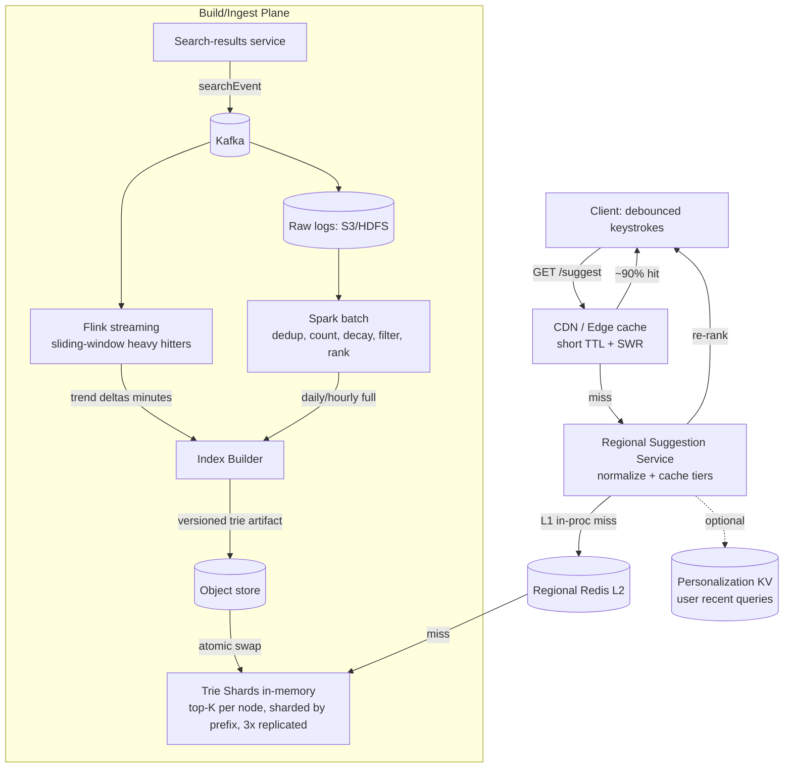
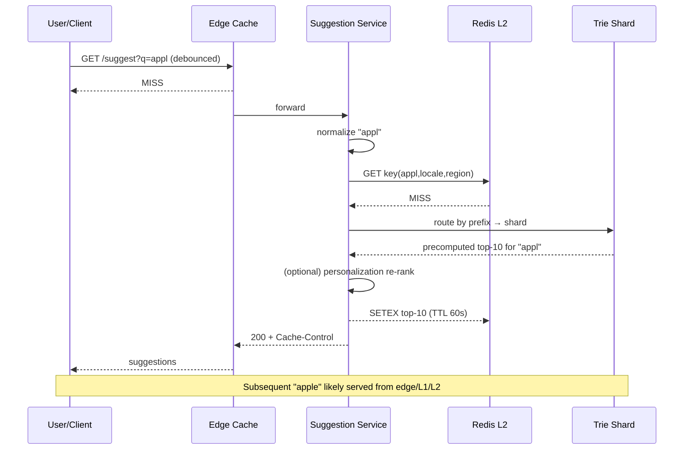
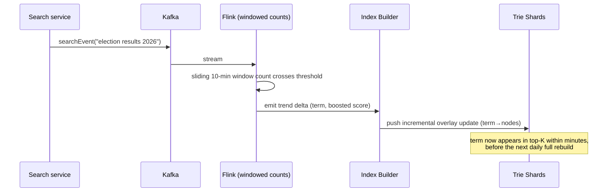

# Design Search Autocomplete / Typeahead

> **Category:** Storage & Infrastructure
> **Level:** Senior / Staff system-design round
> **Format:** Interview-ready HLD — requirements-first, numbers-driven, deep-dive heavy.

---

## 1. Problem & Clarifying Questions

### 1.1 Restating the problem

Build the **search autocomplete (a.k.a. typeahead / search-as-you-type / query suggestion)** system: as a user types characters into a search box, after each keystroke we return the **top-K ranked completions** for the prefix they've typed so far. Think of the dropdown under Google search, Amazon's product search, or YouTube's search bar.

The core difficulty is **not** "find strings that start with this prefix" — that's a trie lookup. The difficulty is the combination of:

1. **Latency** — the dropdown must update *between* keystrokes. A fast typist hits ~5–8 keys/sec, so the budget per request is brutally tight (we'll target **p99 < 100 ms end-to-end**, with the server slice well under that).
2. **Scale** — billions of queries/day, a vocabulary of hundreds of millions of distinct query strings, served globally.
3. **Ranking** — "ap" should suggest *apple* before *aptitude test* if apple is searched 1000× more. Ranking is what makes suggestions *useful*, and it changes constantly.
4. **Freshness** — a breaking-news term ("election results 2026") must appear within minutes, not on the next monthly rebuild.

So this is fundamentally a **read-heavy, latency-critical, precomputation + caching** problem layered on a **streaming-aggregation** problem (how do we keep counts fresh).

### 1.2 Clarifying questions I'd ask the interviewer

I never jump to boxes-and-arrows. Here's what I'd nail down first, grouped.

**Functional scope**
- *What exactly are we autocompleting?* — full search **queries** (multi-word phrases like "cheap flights to tokyo") vs. single **entities** (product names, usernames)? This changes the data model. **Assume: general web/product search queries (multi-word phrases).**
- *Top-K size?* — how many suggestions in the dropdown? **Assume K = 5–10 shown; we'll precompute top-10.**
- *Prefix or infix matching?* — do we match only from the start of the query ("ap" → "apple") or also mid-phrase / per-word ("ap" → "snapchat")? Per-word/infix is much harder. **Assume: prefix on the whole query string for v1, with a per-word index as an extension.**
- *Personalization?* — same suggestions for everyone, or tailored to user history/location/language? **Assume: a global ranking baseline + a personalization layer as a deep dive.**
- *Typo tolerance?* — "amazn" → "amazon"? **Assume: yes, fuzzy matching is in scope (deep dive).**
- *Languages / scripts?* — English only, or CJK (Chinese/Japanese/Korean), RTL (Arabic/Hebrew), emoji? CJK input-method composition is a whole sub-problem. **Assume: multilingual support required, but deep-dive English-style tokens; flag CJK as an extension.**

**Non-functional**
- *Latency target?* **Assume: p99 ≤ 100 ms end-to-end (client→edge→server→client); server compute p99 ≤ 25 ms.**
- *Availability?* **Assume: 99.9%+ (typeahead is a UX enhancement; degrade gracefully — a slow/failed suggestion call must never block the actual search).**
- *Consistency / freshness?* How fresh must counts be? **Assume: eventual consistency is fine for the long tail (hours/days lag tolerable), but trending terms should surface within ~minutes.**
- *Read:write ratio?* Reads = suggestion lookups (huge). Writes = the search events we aggregate. Both are large but reads dominate the serving path.

**Scale**
- *DAU / queries per day?* **Assume: 500M DAU, ~5B searches/day.** Each search produces multiple keystroke-level autocomplete requests.
- *Vocabulary size?* **Assume: ~500M–1B distinct historical query strings, of which the "useful" head/torso is ~50–100M.**
- *Geographic distribution?* **Assume: global, multi-region, with edge presence.**

**Out of scope (explicitly parked)**
- The actual **search results** ranking/serving (that's a different system; we only suggest *what to search*).
- **Spell-correction of results** (we do query-prefix typo tolerance, not result correction).
- **Voice / image** search input.
- Ad injection into suggestions (commercial overlay — noted as an extension).

---

## 2. Requirements (finalized)

### 2.1 Functional
1. Given a prefix `p` (and optional context: userId, locale, region), return the **top-K (≤10) ranked query completions** that start with `p`.
2. Suggestions ranked primarily by **popularity (frequency)**, adjustable by recency/trending, locale, and personalization.
3. **Typo tolerance**: tolerate 1 (sometimes 2) edit-distance errors in the prefix.
4. Suggestions update **per keystroke** (debounced client-side).
5. The suggestion **corpus updates continuously**: new queries enter, stale ones decay, trending ones rise — within minutes for trends, daily for the bulk.
6. Support **multiple locales/languages**; suggestions filtered/biased by the user's locale.
7. **Filtering**: block disallowed/unsafe suggestions (profanity, PII, legally suppressed terms).

### 2.2 Non-functional
| Attribute | Target | Rationale |
|---|---|---|
| **Latency** | p99 ≤ 100 ms E2E; server p99 ≤ 25 ms | Must beat human inter-keystroke time |
| **Availability** | ≥ 99.9% serving | UX feature; fail soft, never block search |
| **Consistency** | Eventual for counts; strong not required | Slightly stale popularity is invisible to users |
| **Durability** | Source query logs durable (11 9's tier); serving indexes are rebuildable | Indexes are *derived* — recoverable from logs |
| **Freshness** | Trends ≤ minutes; bulk ≤ 24 h | Mix of streaming + batch |
| **Throughput** | ~hundreds of K suggestion QPS sustained, peaks higher | Derived in §3 |
| **Scalability** | Horizontal on both serve and build paths | Vocabulary + traffic grow |

### 2.3 Key assumptions
- 500M DAU, 5B searches/day.
- Avg query length ~20 chars; users type ~4 prefix-request-eligible keystrokes per search after debouncing.
- Vocabulary: ~1B distinct strings total; serving set ("head + torso") ~100M strings.
- top-K precomputed = 10.
- Multi-region, edge caching available.
- The suggestion service is **separate** from the search-results service.

---

## 3. Capacity Estimation (show the arithmetic)

### 3.1 Request QPS (the read path)

Searches/day = 5B.
A user types a query, but the client **debounces** (waits ~150–300 ms of typing pause before firing) and fires only on meaningful prefix changes. Empirically that's ~**4 autocomplete requests per completed search** (not one per keystroke).

```
Autocomplete requests/day = 5B searches × 4 = 20B requests/day
Average QPS = 20B / 86,400 s ≈ 231,500 ≈ 230K QPS
Peak factor (diurnal, ~3–5×) → peak ≈ 230K × 4 ≈ ~1M QPS
```

So we design the serving tier for **~1M QPS peak**. This is the number that dominates everything: it forces aggressive caching and in-memory serving.

### 3.2 Write QPS (the ingest path — search events to aggregate)

We only persist/aggregate **completed searches** (5B/day), not every keystroke (we don't need to count partial prefixes; the trie derives those).

```
Write (search event) QPS avg = 5B / 86,400 ≈ 57,900 ≈ 58K QPS
Peak ≈ 58K × 4 ≈ ~230K events/sec into the streaming pipeline
```

Each event ~200 bytes (query text, userId, locale, region, timestamp, sessionId).

```
Raw log ingest/day = 5B × 200 B = 1 TB/day (compresses ~5–10× → ~100–200 GB/day stored)
```

### 3.3 Storage — the trie / serving index

Serving vocabulary ≈ 100M distinct query strings. We do **not** store one trie node per character naively; we use a compressed (radix/Patricia) trie and store **precomputed top-10 per useful prefix node**.

Rough sizing for the in-memory serving structure:

```
Distinct queries (serving) = 100M
Avg query length = 20 chars
Naive char count = 100M × 20 = 2B chars (shared prefixes collapse this a lot)
```

The dominant cost is **top-K cached at each node**. Not every node caches; we cache at "branching" / popular nodes. Estimate ~**300M prefix nodes** carry a cached top-10 list. Each cached entry ≈ a pointer/id (8 B) + score (4 B) ≈ 12 B; with the query string deduped into a string pool (referenced by id).

```
Top-K cache = 300M nodes × 10 entries × 12 B = 36 GB
String pool = 100M queries × 20 chars × 1 B (UTF-8 head) ≈ 2 GB
Trie structure overhead (edges, node metadata) ≈ ~20–40 GB
Total serving index ≈ ~60–80 GB per full replica
```

A full replica fits in the RAM of a small cluster (e.g. 4–8 hosts at 16–32 GB each), so we can **shard by prefix** *and* **replicate** for QPS. (Detailed shard math in §3.5.)

### 3.4 Bandwidth

Each suggestion response: 10 suggestions × ~30 B + framing ≈ ~500 B–1 KB on the wire (with gzip/brotli, smaller).

```
Outbound at peak = 1M QPS × 0.7 KB ≈ 700 MB/s ≈ 5.6 Gbps
```

Comfortably handled by a CDN/edge fleet; most of this is absorbed by edge caches (see §3.6), so origin egress is a fraction.

### 3.5 Server / shard counts (serving tier)

Per host capacity for an in-memory trie lookup + top-K read is high — call it **~20K–30K QPS/host** at p99 < 10 ms compute (a trie traversal + return precomputed list is microseconds; the cost is network + serialization + concurrency).

```
Hosts for raw QPS = 1M / 25K ≈ 40 hosts (per region) for the lookup tier
```

But we also shard the index for memory and isolation:

```
Index ~80 GB. If we want each shard ≤ ~10 GB resident → ~8 shards by prefix.
Replicate each shard ~3× for HA + QPS → 24 serving processes minimum per region,
rounded up with headroom to ~40–60 hosts/region.
Across 4 regions → ~200 serving hosts globally.
```

Plus the **build pipeline** (Spark/Flink cluster), the **streaming counters** (Flink/Kafka Streams), and the **cache fleet**.

### 3.6 Cache hit ratio (this is the whole ballgame)

Prefixes are *extremely* head-heavy: a tiny set of short popular prefixes ("a", "ap", "fa", "yo", "ne") account for a huge share of requests. With an edge + in-memory LRU on prefixes:

```
Assume 85–95% of requests hit a cached prefix response at edge/regional cache.
Origin (trie service) QPS = 1M × (1 − 0.90) = ~100K QPS → easily served by ~40-60 hosts.
```

**Takeaway numbers to memorize:** ~1M peak suggestion QPS, ~230K events/sec ingest, ~80 GB serving index, ~90% cache hit, p99 budget 100 ms E2E / ~25 ms server.

---

## 4. API Design

Keep it tiny and cacheable. The hot endpoint is a **GET** so CDNs/edges cache it natively.

### 4.1 Suggestion lookup (hot path)

```
GET /v1/suggest?q={prefix}&k={K}&locale={loc}&region={r}&ctx={opaqueUserCtxToken}

200 OK
{
  "prefix": "ap",
  "suggestions": [
    { "text": "apple",        "score": 0.97, "type": "query" },
    { "text": "apple watch",  "score": 0.91, "type": "query" },
    { "text": "apartments",   "score": 0.88, "type": "query" },
    { "text": "april",        "score": 0.74, "type": "query" },
    { "text": "apps",         "score": 0.70, "type": "query" }
  ],
  "ts": 1750000000,           // build/version stamp for cache reasoning
  "corrected": false          // true if we typo-corrected the prefix
}
```

Design notes:
- **GET, not POST** — idempotent, cacheable by CDN/edge/browser. Cache key = normalized `(prefix, locale, region, k)`. Personalization is handled *out-of-band* (see §7.4) so the base call stays cacheable.
- `ctx` is an **opaque, short-lived token** carrying coarse personalization signals (recent categories, locale) without PII — used only when personalization re-ranking is enabled; cache then keys on a bucketed version of it, not raw userId, to keep hit ratio sane.
- `Cache-Control: public, max-age=60, stale-while-revalidate=300` — short TTL so trends propagate, SWR so we never block on a refresh.
- Normalization (lowercasing, trimming, Unicode NFKC, diacritic folding) happens **before** caching so equivalent prefixes share a cache entry.

### 4.2 Event ingestion (write path — internal)

Not called by clients directly for autocomplete; emitted by the **search-results service** when a search actually executes (or when a suggestion is *selected*).

```
POST /internal/v1/searchEvent      (async, fire-and-forget to Kafka)
{
  "query": "apple watch",
  "selectedSuggestion": true,   // did the user pick a suggestion vs type freehand?
  "userId": "u_hash",
  "locale": "en-US",
  "region": "us-east",
  "ts": 1750000000123
}
```

### 4.3 Admin / ops

```
POST /admin/v1/blocklist        { "pattern": "...", "scope": "global|locale" }
POST /admin/v1/forceIndexSwap   { "buildId": "..." }     // promote a new trie build
GET  /admin/v1/buildStatus
```

---

## 5. High-Level Architecture

### 5.1 Two planes

The system splits cleanly into a **serving plane** (read, latency-critical) and a **build/ingest plane** (write, throughput-critical, latency-tolerant). They are decoupled by an immutable, versioned **index artifact**.

```
                         ┌──────────────────────────────────────────┐
                         │              CLIENTS (web/app)             │
                         │  debounce keystrokes, render dropdown      │
                         └───────────────┬──────────────────────────┘
                                         │ GET /suggest?q=ap
                                         ▼
                         ┌──────────────────────────────────────────┐
                         │   CDN / EDGE CACHE  (short-TTL, SWR)       │  ~90% hit
                         └───────────────┬──────────────────────────┘
                                         │ miss
                                         ▼
        ┌───────────────────────────────────────────────────────────────────┐
        │   REGIONAL SUGGESTION SERVICE (stateless front)                     │
        │   - normalize prefix (lowercase, NFKC, fold)                        │
        │   - L1 in-proc cache  → L2 regional Redis  → trie shard            │
        │   - optional personalization re-rank                                │
        └───────────────┬───────────────────────────┬───────────────────────┘
                        │                             │
            (cache miss)│                             │(personalization)
                        ▼                             ▼
        ┌───────────────────────────┐     ┌───────────────────────────────┐
        │  TRIE SHARDS (in-memory)   │     │  PERSONALIZATION STORE         │
        │  sharded by prefix range   │     │  (user recent queries, KV)     │
        │  each holds top-K/node     │     └───────────────────────────────┘
        │  3× replicas per shard     │
        └────────────▲──────────────┘
                     │ atomic swap of new index version
                     │
        ┌────────────┴───────────────────────────────────────────────────────┐
        │                          BUILD / INGEST PLANE                        │
        │                                                                      │
        │  search events ─► KAFKA ─►  ┌── STREAMING (Flink): trending counts ──┐
        │                             │   sliding-window heavy hitters         │
        │                             └─────────────────┬──────────────────────┘
        │                                               │ deltas (minutes)     │
        │  KAFKA ─► raw logs ─► HDFS/S3 ─► BATCH (Spark):│                      │
        │     dedup, count, decay, filter, rank ─► build trie + top-K ─────────┤
        │                              (daily / hourly)  │                      │
        │                                                ▼                      │
        │                            INDEX BUILDER ─► versioned trie artifact   │
        │                            ─► object store ─► pushed to shards        │
        └──────────────────────────────────────────────────────────────────────┘
```

### 5.2 Mermaid — component view



### 5.3 Sequence — a single keystroke lookup (cache miss)



### 5.4 Sequence — trend propagation (write → fresh suggestion)



---

## 6. Data Model & Storage Choices

### 6.1 Entities

**1. Raw search event (immutable log)**
```
searchEvent { query, userId, locale, region, ts, selectedSuggestion, sessionId }
```
Stored in Kafka (transient, ~7-day retention) then archived to object store (S3/HDFS) as columnar Parquet for batch.

**2. Aggregated query frequency (the build input)**
```
queryStat { query, locale, region, count_total, count_decayed, last_seen_ts }
```
Computed by batch; keyed by `(normalized_query, locale)`.

**3. Trie serving artifact (the heart)**
- A **compressed radix (Patricia) trie** — a trie where chains of single-child nodes are merged into one edge labeled with a substring, so "a-p-p-l-e" with no branches becomes one edge "apple". Saves memory.
- At each **branching node** (and selected popular nodes), store a **precomputed top-K list**: the K highest-scored complete queries in that node's subtree, as `(queryId, score)` pairs.
- A separate **string pool**: `queryId → query text`, so the trie stores compact ids, not repeated strings.

**4. Trending overlay (streaming)**
```
trend { term, locale, region, boost, expiry_ts }
```
A small, hot, mutable layer applied on top of the immutable trie at serve time or via incremental push.

**5. Personalization store**
```
userRecent { userId → [recent queries with recency weights] }   (KV, TTL'd)
```

**6. Blocklist**
```
blocklist { pattern, scope, type(exact|prefix|regex) }
```

### 6.2 Which datastore, and why

| Data | Store | Why (vs. alternatives) |
|---|---|---|
| Raw search events (in-flight) | **Kafka** | Need a durable, replayable, high-throughput log to fan-out to both streaming and batch; replay lets us rebuild indexes after bugs. A DB queue can't sustain 230K msg/s cheaply. |
| Raw events (archive) | **S3 / HDFS (Parquet)** | Cheap, durable, columnar for Spark scans of trillions of rows. A row store (Postgres) would be insane at this volume. |
| Aggregated query stats | **Columnar / data-lake table (Iceberg/Hive on S3)** | Batch read-mostly; we scan + aggregate, not point-lookup. No need for an OLTP DB. |
| **Serving index (trie + top-K)** | **In-memory, in-process, custom structure** (built artifact, memory-mapped) | This is the latency-critical part. p99 < 25 ms forbids a network DB hop per lookup. A trie *is* the right structure for prefix queries; we serve it from RAM. Loaded from an immutable artifact in object store. |
| Hot prefix responses | **CDN/edge + Redis (L2)** | Absorbs ~90% of QPS; Redis is in-memory KV with sub-ms reads, perfect for `prefix→top-K` caching. |
| Trending overlay | **Redis / in-proc map** | Small, mutable, hot; must update every few minutes. |
| Personalization | **KV store (DynamoDB/Cassandra/Redis)** | Point lookup by userId, high write volume, TTL'd, eventual consistency fine. |
| Blocklist | **Replicated KV / config service** | Small, read at serve time, must propagate fast on takedown. |

**Why not just a search engine (Elasticsearch) for everything?** ES *can* do prefix/edge-ngram autocomplete and is a great v0/MVP. But at 1M QPS with p99 < 25 ms and a 100M-term vocabulary with per-keystroke ranking, a general inverted index + query parser is heavier than a purpose-built trie that returns *precomputed* top-K with zero ranking work at query time. ES also makes top-K-per-prefix precomputation awkward. We'd use ES for the *infix/per-word* extension and for the build-time analysis, but the hot path is the custom trie. (I'd say this explicitly in the interview: "ES is the right MVP and the right tool for fuzzy/infix; the custom trie is the right tool for head-prefix latency at scale.")

---

## 7. Deep Dives (the bulk)

The genuinely hard sub-problems: **(7.1)** the trie structure + top-K precomputation, **(7.2)** sharding & serving the trie, **(7.3)** building & updating it (batch + streaming freshness), **(7.4)** ranking & personalization, **(7.5)** typo tolerance, and **(7.6)** the latency budget. Each ends with a defended decision and the failure mode it avoids.

---

### 7.1 The trie + top-K precomputation

**The naive approach and why it fails.** A plain trie supports "find all strings under prefix `p`": walk to `p`'s node, then DFS the whole subtree collecting matches, then sort by score, take top-K. For a short popular prefix like "a", that subtree contains *millions* of queries. Doing a DFS + sort *per keystroke* at 1M QPS is hopeless — you'd burn CPU and blow the latency budget on the very prefixes that are most requested.

**The key insight: precompute top-K at each node.** At build time, for every node `n`, store the **top-K complete queries in n's subtree, already sorted by score**. Then a lookup is: walk to the prefix node (O(len(prefix))), return its cached list (O(K)). No subtree traversal, no sort, at query time. This trades **memory + build time** for **query latency** — exactly the trade we want for a read-heavy system.

How to compute top-K per node efficiently at build time: do a **post-order traversal**. A node's top-K is the merge of (its own terminal entry, if any) + the top-K lists of its children. Merging sorted lists of size K with C children is O(C·K) per node; since we keep only K, it stays bounded. Total build is roughly linear in trie size × K.

**Where to store top-K — every node, or some?** Storing top-K at *every* character node is wasteful (long non-branching chains repeat the same list). Options:

| Option | Memory | Query work | Notes |
|---|---|---|---|
| **A. Top-K at every node** | High (worst) | O(K), trivial | Simplest; redundant on chains |
| **B. Top-K only at branching nodes** (radix trie) | Medium | O(K), trivial | Chains collapsed; the natural fit |
| **C. Top-K only at "popular" nodes**, else compute on miss | Low | O(K) hot / O(subtree) cold | Risky: cold prefixes get slow |
| **D. No precompute; sort at query time** | Lowest | O(subtree·logK) | Fails latency on hot prefixes |

**Decision: B — compressed radix trie with precomputed top-K at every branching node, plus a string pool of ids.** This collapses long chains (memory win), gives O(prefix + K) lookups (latency win), and the per-node lists are small (K=10). We *also* cache top-K at a curated set of short high-traffic prefixes regardless of branching, so "a"/"ap" are O(K) too.
**Failure mode avoided:** the **hot-prefix latency cliff** — without precompute, the most-requested short prefixes trigger the most expensive subtree scans, so latency is worst exactly where load is highest.

**Memory micro-optimizations worth mentioning:** memory-map the artifact (mmap) so the OS page cache backs it and process restarts are fast; use a **double-array trie** or **DAWG/MARISA-trie** representation for the structure (very compact, succinct), with the top-K cache as a side array indexed by node id; intern query strings in a pool referenced by 4-byte ids.

---

### 7.2 Sharding & serving the trie

We need (a) the index to fit and stay warm in RAM, (b) to serve ~1M QPS with HA, and (c) routing that doesn't fan out.

**How to shard?** The natural key is the **prefix**. Options:

| Strategy | Pros | Cons |
|---|---|---|
| **By first letter / prefix-range** ("a–c", "d–f", …) | Single shard answers a query; no scatter-gather; trivial routing | **Hot-shard skew** — "a", "s", "t" prefixes carry far more traffic than "x","z" |
| **Hash(prefix) → shard** | Even load distribution | Adjacent prefixes scatter; doesn't matter since each query has one prefix → still single-shard! |
| **Replicate full index everywhere** | No routing logic; any host answers anything | 80 GB per host; fine today, but caps growth |

**Decision: shard by prefix-range with *uneven, traffic-balanced* boundaries, full replication of each shard (≥3×), and a thin routing layer.** Because a single autocomplete query touches exactly **one** prefix, we never need scatter-gather — the request goes to exactly one shard. We balance the *hot-shard skew* by sizing shard ranges by **expected traffic**, not alphabet evenness: "a" might be its own shard while "q,x,z" share one. Replicate each shard 3× for HA and to absorb QPS; the stateless front routes by prefix → shard → pick a healthy replica (with load-aware/least-outstanding selection).

**Why not hash-shard?** Hashing distributes load evenly but buys nothing here (still single-shard per query) while losing the ability to keep related prefixes co-resident and to do range-based hot-shard tuning. Either works; range-by-traffic gives us a knob for skew.

**Failure modes avoided:**
- *Scatter-gather latency* — by sharding on the exact lookup key (prefix), every request is single-shard, so we avoid the tail-latency-amplifying fan-out where p99 = max of N shard latencies.
- *Hot-shard meltdown* — traffic-weighted ranges + 3× replicas + load-aware routing prevent one shard (e.g. all "s" prefixes) from saturating.

**Index distribution / atomic swap.** Builds produce an **immutable, versioned artifact** (`trie-build-2026-06-25T03`). The build system pushes it to object store; serving hosts download, mmap, and **atomically swap** the pointer from old→new index (read-copy-update style) with zero downtime, keeping the old one until in-flight requests drain. Roll out region-by-region; on regression, swap the pointer back instantly. **Failure mode avoided:** a bad build taking down serving — we never mutate a live index in place; we promote a vetted new one and can roll back atomically.

---

### 7.3 Building & updating the trie (batch + streaming)

The corpus must reflect "what people search" and stay fresh. Two timescales: **bulk** (the long tail, rebuilt periodically) and **trends** (must surface in minutes). A single mechanism can't do both well, so we use **two pipelines that converge on the same serving structure** — the **Lambda architecture** pattern (a batch layer for completeness/correctness + a speed layer for freshness).

**Batch layer (Spark, hourly/daily).**
1. Read raw events (Parquet on S3) for the window.
2. **Normalize**: lowercase, NFKC, trim, fold diacritics, collapse whitespace.
3. **Aggregate**: count per `(query, locale)`.
4. **Decay**: apply time-decay so last-month's counts don't dominate forever — e.g. exponential decay `score = Σ count_i · e^(−λ·age_i)`, or a weighted blend of (all-time, 30-day, 7-day). This keeps suggestions current without a hard cutoff.
5. **Filter**: drop below-threshold long-tail noise, drop blocklisted/unsafe terms, drop PII-looking strings (emails, card numbers via regex), drop one-off queries (count < N).
6. **Rank**: compute the final score (see §7.4).
7. **Build** the radix trie + per-node top-K (§7.1), serialize the versioned artifact, push to object store.

This produces a *complete, correct, deduped* index but is **stale by up to the rebuild interval**.

**Speed layer (Flink/Kafka Streams, seconds–minutes).**
- Consume the same Kafka event stream.
- Maintain **sliding-window counts** (e.g. 10-min and 1-hour windows) using an approximate heavy-hitters sketch — **Count-Min Sketch** (a compact probabilistic counter that estimates frequencies with bounded over-count) + a **Space-Saving / top-k** structure to track the current top trending terms cheaply, instead of an exact map over millions of terms.
- When a term's windowed velocity crosses a threshold (it's *trending*), emit a **boost delta**: `(term, locale, boost, expiry)`.
- Apply boosts as a **mutable overlay** on top of the immutable trie — either (a) the serving node merges overlay boosts into the top-K at query time for affected prefixes, or (b) the builder does an **incremental push**: insert/adjust the trending term into the relevant nodes' top-K lists in the live structures via a small RCU update.

**Reconciliation.** The next batch build incorporates the now-confirmed trend into the base, and the overlay entry expires. So the speed layer is a short-lived, self-healing approximation; the batch layer is the source of truth. **This is the essence of Lambda: speed layer for latency, batch layer for correctness; they converge.**

| Approach to freshness | Latency to surface a trend | Correctness | Complexity |
|---|---|---|---|
| Batch-only (daily rebuild) | Up to 24 h (too slow) | Exact | Low |
| Streaming-only (counts live) | Seconds | Approximate, drifts, hard to decay/dedup fully | High |
| **Batch + streaming overlay (chosen)** | Minutes for trends, exact base daily | Exact base + approx trends, self-healing | Medium-high |

**Decision: Lambda (batch base + streaming trend overlay) with incremental overlay push and atomic version swaps for the base.**
**Failure modes avoided:**
- *Staleness* — daily-only rebuilds miss breaking news; the speed layer fixes that.
- *Drift / unbounded approximation* — streaming-only counts drift and can't cleanly apply decay/dedup/filtering across all history; the batch layer re-establishes ground truth and expires overlays.
- *Build-time explosion* — heavy-hitter sketches let the speed layer track trends in bounded memory instead of an exact billion-key counter.

*(Aside: a Kappa architecture — streaming-only with replay — is a legitimate alternative if you can express decay/dedup as stream ops; I'd mention it but defend Lambda for the simpler correctness story on a 1B-key vocabulary.)*

---

### 7.4 Ranking & personalization

A suggestion's value = how likely *this user* wants *this completion now*. Layered scoring:

**1. Base popularity (global).** `freq_score = decayed_count` (from §7.3). Normalize per prefix so scores are comparable. This is the backbone.

**2. Recency / trend boost.** Add the speed-layer boost for trending terms; weight recent windows higher. Prevents the index from being a museum of last year's hits.

**3. Locale / region bias.** Multiply by a locale affinity so "football" suggests differently in the US (NFL) vs UK (soccer); region narrows the candidate set and re-weights.

**4. Personalization (the hard, cache-unfriendly part).** Tailor to the user's history/context. The tension: **personalization kills cacheability** (per-user responses → near-zero edge hit ratio → blows latency/QPS budget). Resolution strategies:

| Strategy | Cache impact | Quality | Notes |
|---|---|---|---|
| **A. No personalization** | Best (fully cacheable) | Baseline | Fine for many; loses upside |
| **B. Bucketed/cohort personalization** | Good (cache keys on cohort, not user) | Medium | Bucket users by locale + coarse interest cohort; precompute per-cohort top-K |
| **C. Client-side re-rank** | Best (base call stays cacheable) | Medium-high | Server returns top-N (e.g. 20); client re-ranks using *local* history. Privacy bonus: history never leaves device |
| **D. Server per-user re-rank** | Worst (per-user, uncacheable) | Highest | Only for logged-in, low-cardinality hot users; do it on cache *miss* path only |

**Decision: serve a **cacheable global+locale base**, then layer personalization as **(C) client-side re-rank** for the common case and **(B) cohort buckets** server-side, reserving **(D) per-user re-rank** for a thin slice (e.g. blend in the user's own recent queries that *match the prefix*).** Concretely: the server returns top-20 cacheable suggestions; the client (or an edge worker) re-ranks the top-20 by blending in the user's matching recent searches (from local storage or a small KV lookup). The base call still hits the edge cache.

**Failure mode avoided:** the **cacheability collapse** — naively personalizing every response makes the cache useless, which at 1M QPS would require ~10× the serving fleet and still miss the latency budget. By keeping the base cacheable and personalizing *thinly* on top, we keep ~90% hit ratio.

**Scoring formula sketch (interview-friendly):**
```
score(q | prefix, user, locale) =
   w1·log(decayed_freq(q))
 + w2·trend_boost(q)
 + w3·locale_affinity(q, locale)
 + w4·personal_match(q, user_recent)        // applied in re-rank layer
 - w5·penalty(q)                            // length/quality/abuse penalties
```
Weights tuned offline via A/B on **suggestion-acceptance rate** and **time-to-first-result**; ML model (gradient-boosted / learning-to-rank) can replace the hand-weights at maturity, scoring the candidate top-N from the trie rather than the whole vocabulary.

---

### 7.5 Typo / fuzzy tolerance

"amazn" should still suggest "amazon". Exact-prefix trie walk fails on the typo. This is genuinely hard because fuzzy matching is expensive and we have a tight budget.

**Options:**

| Technique | What it does | Cost / fit |
|---|---|---|
| **Edit-distance trie walk (Levenshtein automaton)** | Walk trie allowing ≤d edits; a Levenshtein automaton is a state machine accepting strings within edit distance d | Accurate, supports prefix; costlier than exact walk but bounded by branching × d |
| **n-gram / fuzzy index (ES)** | Index character n-grams; match by n-gram overlap | Robust, but heavier and ranks less precisely for prefixes |
| **Symmetric Delete (SymSpell)** | Precompute deletions of dictionary terms; match by deletion-neighborhood | Very fast lookups, large precompute memory |
| **Phonetic (Soundex/Metaphone)** | Match by sound | Cheap, but only catches phonetic typos |
| **Keyboard-aware correction** | Weight edits by key adjacency ("m"↔"n") | Great signal, layered on top of edit distance |

**Decision: two-tier.** Tier 1: **exact-prefix trie** (the fast 99% path). Tier 2 (only when exact path yields too few results, or as a parallel low-priority lookup): a **bounded Levenshtein-automaton walk (d=1, occasionally d=2 for longer prefixes)** over the trie, **biased by keyboard adjacency and by candidate popularity** so we surface "amazon" not "amazen". We also fold in **SymSpell-style precomputed deletions for high-frequency terms** to make the common-typo case O(1). Corrections are flagged (`corrected: true`) and gently de-prioritized vs exact matches.

**Why not fuzzy-everything?** Running edit-distance on every keystroke for every prefix would blow the latency budget and surface noisy suggestions. Gate it on low exact-result count.

**Failure modes avoided:**
- *Latency blowup* — fuzzy only fires when needed, with bounded edit distance, so the common exact case stays microseconds.
- *Garbage suggestions* — popularity- and keyboard-biased correction prevents matching a typo to a rare term that happens to be edit-distance-1 away.

---

### 7.6 The latency budget (<100 ms E2E)

We must account for *every* millisecond. Budget decomposition (p99 targets):

```
Client debounce (intentional)          ~ (not counted; before request fires)
Network client→edge (RTT)              ~ 20–40 ms   (dominated by geography → edge POPs)
Edge cache lookup (hit)                ~ 1–2 ms
  ---- on cache hit (90%): total ≈ ~25–45 ms, done ----
Edge→regional service (miss)           ~ 5–15 ms
Service normalize + L1/L2 cache        ~ 1–3 ms
Trie shard RPC + lookup (miss)         ~ 2–8 ms     (in-RAM walk + return top-K)
(optional) personalization re-rank     ~ 1–3 ms
Serialize + return                     ~ 1–2 ms
Network back to client                 ~ 20–40 ms
  ---- on miss: total ≈ ~50–90 ms, within budget ----
```

**Levers we pull to protect the budget:**
- **Edge/CDN caching** with short TTL + SWR — turns most requests into a ~1-region-RTT hit. This is the single biggest lever.
- **In-memory, in-process trie** — no DB hop on the hot path; lookups are microseconds of CPU.
- **Single-shard routing** (§7.2) — no scatter-gather, so p99 isn't the max of N shards.
- **Connection reuse / HTTP-2-3, keep-alive** — avoid TCP/TLS handshake per keystroke; persistent connection from client.
- **Client-side prefetch & debounce** — debounce ~150 ms so we don't fire on every key; optionally prefetch likely next-char suggestions; cache prior prefixes locally (typing "appl" after "app" can reuse the narrowed set client-side).
- **Compression** (brotli) + small payloads (ids, short strings).
- **Tail-latency hedging** — on the miss path, if a shard replica is slow past pX, send a **hedged request** to a second replica and take the first to respond (cuts p99 tail). Budget the extra load (~5%).
- **Geo-routing** — anycast/GeoDNS sends users to the nearest edge/region.

**Failure mode avoided:** *the inter-keystroke deadline miss* — if responses lag behind typing, the dropdown feels broken (stale or flickering). Every lever above is about keeping the *common* path tens of milliseconds and the *tail* bounded, since at 1M QPS even 1% slow = 10K slow requests/sec.

---

## 8. Scaling & Bottlenecks

**Where it breaks first, in order, and the fix:**

1. **Serving QPS / cache hit ratio.** First pressure point at peak. *Breaks:* origin trie fleet saturates if cache hit drops. *Fix:* multi-tier cache (edge → regional Redis → in-proc L1), short-TTL + SWR, generous edge presence; monitor hit ratio as a top SLI. If personalization erodes hits, push it client-side (§7.4).

2. **Hot shard / hot prefix.** *Breaks:* the "s"/"a" shard saturates. *Fix:* traffic-weighted shard ranges, ≥3× replicas, load-aware routing, and the hottest short prefixes effectively always cache-resident at the edge so they barely reach origin.

3. **Index size vs host RAM.** *Breaks:* as vocabulary grows past a host's RAM. *Fix:* shard the index more finely (more prefix ranges), compress (radix/succinct trie, mmap + page cache), and prune the long tail aggressively (only "useful" terms with count ≥ threshold enter the serving set).

4. **Ingest throughput.** *Breaks:* Kafka/Flink at peak event rate. *Fix:* partition Kafka by `hash(query)` for parallelism, scale Flink operators, use sketches (Count-Min) to bound streaming state.

5. **Build time / freshness.** *Breaks:* daily build can't keep up; trends lag. *Fix:* incremental builds (only changed subtrees), more frequent partial rebuilds, and the streaming overlay for sub-minute trends.

6. **Index distribution storm.** *Breaks:* pushing an 80 GB artifact to hundreds of hosts simultaneously saturates network. *Fix:* staged rollout, peer-to-peer/torrent-style distribution or pull-from-CDN, delta artifacts (ship only changed shards).

7. **Cross-region / global growth.** *Fix:* regional autonomy — each region has its own serving fleet + cache + (optionally locale-specialized) index; builds are global but artifacts are regionalized to bias by locale.

**Scaling summary:** the read path scales horizontally via **cache tiers + replicated single-shard serving**; the write/build path scales via **partitioned streaming + distributed batch**; they're decoupled by the immutable artifact so neither blocks the other.

---

## 9. Reliability, Consistency & Security

### 9.1 Reliability & failure handling
- **Fail soft, always.** Autocomplete is an enhancement — if the suggestion service is down/slow, the client renders no dropdown and the user still searches. Client uses a **short timeout (e.g. 80 ms) and silently drops** late responses. Never block the search box.
- **Graceful degradation tiers:** (1) full personalized suggestions → (2) global cached suggestions → (3) stale-but-served (SWR) → (4) empty dropdown. Each tier is strictly more available.
- **Replica failure:** 3× replicated shards + health-checked, load-aware routing; a dead replica is routed around instantly.
- **Region failure:** GeoDNS/anycast fails over to the next-nearest region (slightly higher latency, still functional). Indexes are present in every region.
- **Bad build:** vetted via canary (serve to 1% and compare acceptance metrics) before promotion; atomic version swap enables instant rollback; old artifact retained.
- **Source of truth recovery:** the serving index is *derived* and fully rebuildable from durable Kafka/S3 logs — a corrupted index is never a data-loss event, just a rebuild.

### 9.2 Consistency model
- **Eventual consistency** for popularity counts — slightly stale ranking is invisible to users; we don't need strong consistency. Acceptable lag: trends ≤ minutes (speed layer), bulk ≤ 24 h (batch).
- **Read-your-writes** is *not* required (a user searching "foo" needn't instantly see "foo" suggested), which is what lets us cache aggressively.
- The **immutable, versioned index** gives a clean consistency story: every serving host runs a known build version; we know exactly what's live and can pin/rollback.

### 9.3 Idempotency & dedup (write path)
- Search events carry a `(sessionId, ts, query)` natural key; the batch dedups, so **duplicate event delivery is harmless** (we aggregate counts; over-counting from at-least-once Kafka delivery is bounded and washed out by decay/normalization). Streaming heavy-hitters tolerate approximate counts by design.
- The **suggest GET is naturally idempotent** (pure read), so client retries are free.

### 9.4 Security, privacy & abuse
- **PII scrubbing at build time:** drop queries that look like emails/phone numbers/credit cards/SSNs (regex + entropy heuristics); never suggest one user's private query to another. This is a *correctness-critical* filter — leaking a personal query as a public suggestion is a serious incident.
- **Profanity / unsafe / legally suppressed terms:** blocklist applied at build *and* serve time (so takedowns propagate fast without a full rebuild).
- **k-anonymity threshold:** only surface a query as a suggestion if it was searched by ≥ N distinct users — prevents a rare/personal query from ever becoming a public suggestion.
- **Personalization privacy:** prefer **client-side re-rank** so history stays on-device; server-side personal data is TTL'd, encrypted, and access-controlled. Honor "no history" / incognito by skipping personalization.
- **Auth:** suggest endpoint is typically public (rate-limited by IP/device), personalization requires an authenticated, scoped token (`ctx`).
- **Abuse / rate limiting:** per-IP/device token-bucket at the edge to stop scraping/DoS; bot detection; cap suggestion QPS per client. **Poisoning defense:** an attacker spamming a query to inflate its rank is mitigated by per-user counting (k-anonymity), velocity anomaly detection in the speed layer, and decay.
- **TLS everywhere**, signed index artifacts (verify checksum/signature before swap) to prevent a tampered index from being served.

---

## 10. Extensions & Follow-ups

Realistic curveballs an interviewer adds, and how the design flexes:

1. **Per-word / infix matching ("ap" → "snapchat").** Build a secondary index keyed on *each word's prefix* (or character n-grams), or use ES edge-ngrams for this tier. Increases index size and ranking complexity; merge results from whole-prefix trie + word-prefix index. Defend the extra memory as the cost of the feature.

2. **CJK / multilingual input.** Chinese/Japanese/Korean use input-method editors (IME) where the user types romanized/phonetic input that maps to characters — autocomplete must work on *both* the phonetic input and the target script. Build locale-specific tries; for CJK, index on Pinyin/romaji *and* the characters. Tokenization differs (no spaces in Chinese). RTL scripts need bidi handling in the UI.

3. **Entity / rich suggestions.** Beyond plain text, suggest entities (a product card, a person, with image/price). Trie nodes point to entity records; ranking blends entity popularity. Payload grows; consider a two-step (suggest text → hydrate entity).

4. **Ads / sponsored suggestions.** Commercial overlay injected at re-rank with clear labeling; must not degrade relevance/latency; auction logic lives in the re-rank layer.

5. **Multi-tenant (autocomplete-as-a-service).** Isolate per-tenant vocabularies/tries, per-tenant rate limits and blocklists; shard by tenant.

6. **Pure ML ranking (learning-to-rank).** Replace hand-tuned weights with a model scoring the trie's candidate top-N (not the whole vocabulary) using features (freq, recency, locale, personal signals, session context). Keep the trie for *candidate generation*, ML for *re-ranking* — classic retrieve-then-rank.

7. **Session-aware suggestions.** Use the user's *current* session queries ("flights to tokyo" → next suggest "hotels in tokyo"). Session context flows into the re-rank layer.

8. **Voice / speech prefix.** Streaming ASR produces partial transcripts that feed the same prefix lookup; more typo tolerance needed.

9. **Stricter freshness (seconds, not minutes).** Push more work into the speed layer, finer overlay granularity; trades correctness/complexity for latency.

10. **Spell-correction + "did you mean".** Extend §7.5's fuzzy tier into a full correction suggestion ("Showing results for amazon").

---

## 11. Interview Q&A

**Q1. Why a trie and not Elasticsearch / a SQL `LIKE 'prefix%'`?**
A. `LIKE 'ap%'` is a range scan that returns *all* matches with no precomputed ranking — fine for a tiny dataset, hopeless at 100M terms / 1M QPS / p99 25 ms. ES is a strong MVP and the right tool for fuzzy/infix, but a general inverted index + query parser is heavier than a purpose-built trie that returns *precomputed top-K* with zero query-time ranking. The trie matches the access pattern (prefix → top-K) exactly and serves from RAM.
*Deep-probe:* What does ES still earn a place for? — build-time analysis, the infix/per-word tier, and fuzzy matching.

**Q2. How do you keep p99 under 100 ms at 1M QPS?**
A. Most of the budget is network RTT, so edge/CDN caching (short TTL + SWR) absorbs ~90% of requests near the user. Misses hit an in-memory, single-shard, replicated trie (microsecond lookups, no DB hop, no scatter-gather). Plus connection reuse, compression, client debounce/prefetch, and hedged requests to bound the tail.
*Deep-probe:* Why single-shard routing? — because each query has exactly one prefix, so we avoid scatter-gather where p99 = max over N shards.

**Q3. Trends must appear in minutes but the index rebuilds daily — how?**
A. Lambda architecture: batch layer (Spark, daily) builds the complete, decayed, deduped base; speed layer (Flink, sliding-window heavy-hitters via Count-Min + Space-Saving) detects trending terms and pushes a mutable boost overlay applied on top of the immutable trie within minutes. Next batch absorbs the confirmed trend; overlay expires. Speed layer = latency, batch = correctness, they converge.
*Deep-probe 1:* Why not streaming-only (Kappa)? — counts drift, and full decay/dedup/PII-filtering over a 1B-key history is cleaner in batch.
*Deep-probe 2:* How do sketches bound memory? — Count-Min estimates frequencies in fixed space with bounded over-count; Space-Saving tracks current top-k cheaply instead of an exact billion-key map.

**Q4. How does personalization not destroy your cache hit ratio? (senior-signal)**
A. Naive per-user responses make the edge cache useless → ~10× fleet and still a latency miss. So we keep a **cacheable global+locale base** and personalize *thinly* on top: client-side re-rank (history stays on device) for the common case, cohort/bucket personalization server-side, and per-user re-rank only on the miss path for a thin slice. Base stays ~90% cacheable.
*Deep-probe:* What's the quality cost? — slightly less tailored than full server-side re-rank, but the latency/cost math forces it; you can A/B the tradeoff on acceptance rate.

**Q5. How do you handle typos like "amazn"? (senior-signal — defend the gate)**
A. Two-tier: fast exact-prefix trie for the 99%, and a *gated* bounded Levenshtein-automaton walk (d=1, sometimes 2) only when exact results are too few — biased by keyboard adjacency and popularity so we surface "amazon" not a rare edit-neighbor. SymSpell-style precomputed deletions make common typos O(1). Gating protects the latency budget and avoids noisy corrections.
*Deep-probe:* Why not fuzzy on every keystroke? — it blows the budget and surfaces garbage; gate on low exact-result count.

**Q6. What's your sharding key and why? (senior-signal)**
A. Shard by **prefix range, with traffic-weighted boundaries**, fully replicated ≥3×. Single autocomplete query → one prefix → one shard, so no scatter-gather. Traffic-weighted ranges + replicas + load-aware routing tame hot-shard skew (the "s"/"a" problem). Hash-sharding distributes evenly but buys nothing (still single-shard) while losing the hot-shard tuning knob.
*Deep-probe:* What if one prefix alone is too hot? — its short forms live in the edge cache and barely reach origin; the shard is replicated and the prefix can be split further.

**Q7. How do you deploy a new index without downtime or risk?**
A. Builds are **immutable, versioned artifacts**. Hosts download, mmap, and atomically swap the live pointer (RCU), draining old in-flight requests. Canary to 1%, compare acceptance metrics, then staged region rollout; instant rollback by swapping the pointer back. Artifacts are signed and checksum-verified before swap.
*Deep-probe:* How do you ship 80 GB to hundreds of hosts? — staged + peer-to-peer/CDN pull + delta artifacts (only changed shards).

**Q8. How do you prevent leaking a private query as a public suggestion?**
A. **k-anonymity** (a query must be searched by ≥ N distinct users to be eligible) + build-time PII regex/entropy filters + a blocklist applied at build *and* serve time for fast takedowns. Personalization keeps personal history client-side. Per-user counting also blunts rank-poisoning attacks.
*Deep-probe:* How do you stop someone gaming a term into the trending list? — per-user (not per-event) counting, velocity anomaly detection, decay.

**Q9. The suggestion service goes down — what does the user experience?**
A. Nothing breaks. The client uses a short timeout (~80 ms), drops late/failed responses, and renders no dropdown; the user still types and searches normally. Graceful tiers: personalized → global cached → stale (SWR) → empty. Fail soft is a hard requirement.

**Q10. Why precompute top-K per node instead of computing at query time? (senior-signal)**
A. Computing top-K at query time means a subtree DFS + sort, and that's most expensive exactly for short popular prefixes ("a") which are also the most requested — a latency cliff under load. Precomputing top-K per node makes lookup O(prefix + K) regardless of subtree size, trading build-time memory for query latency, which is the right trade for a read-heavy system.
*Deep-probe:* Memory cost? — bounded: K=10 small entries per branching node, ids interned in a string pool, radix-compressed chains; ~tens of GB, shardable.

---

## 12. Cheat-Sheet & Self-Test

### 12.1 Dense recap

**The numbers:**
- 500M DAU, 5B searches/day → ~**4 autocomplete reqs/search** → **20B reqs/day** → ~**230K avg QPS, ~1M peak QPS**.
- Ingest: **5B events/day ≈ 58K avg / 230K peak events/sec**; ~1 TB/day raw logs.
- Vocabulary ~1B distinct, serving set ~**100M**; serving index ~**60–80 GB**.
- Cache hit ~**90%** → origin ~100K QPS. p99 budget **100 ms E2E / 25 ms server**.
- Serving fleet ~**40–60 hosts/region**, ~8 prefix shards × 3 replicas.

**The decisions (and the failure each avoids):**
- **Compressed radix trie + precomputed top-K per branching node** → avoids the hot-prefix latency cliff.
- **Shard by traffic-weighted prefix range, replicated 3×, single-shard routing** → avoids scatter-gather tail and hot-shard meltdown.
- **Lambda: Spark batch base + Flink streaming trend overlay (Count-Min / Space-Saving)** → avoids staleness *and* streaming drift.
- **Cacheable global base + thin (client-side/cohort) personalization** → avoids cacheability collapse.
- **Gated bounded-Levenshtein fuzzy + SymSpell** → avoids latency blowup and garbage corrections.
- **Edge/CDN cache + in-memory in-process trie + hedged requests** → avoids the inter-keystroke deadline miss.
- **Immutable versioned artifact + atomic RCU swap + canary** → avoids a bad build taking down serving.
- **k-anonymity + PII filter + blocklist (build & serve)** → avoids private-query leakage.
- **Fail-soft client (short timeout, drop late)** → never blocks the actual search.

**The diagram in words:** Client (debounced) → Edge cache (90% hit) → Regional stateless service (normalize, L1/L2 cache, optional re-rank) → single prefix shard of an in-memory radix trie holding precomputed top-K, 3× replicated. Separately, the search service emits events → Kafka → (a) Flink speed layer pushes trend boosts in minutes, (b) S3 + Spark batch layer rebuilds the immutable versioned trie artifact daily → atomically swapped into the shards.

### 12.2 Self-test (no answers)
1. Recompute peak QPS if DAU doubles to 1B and debounced requests rise to 6/search — does your shard count change, and what breaks first?
2. A single prefix ("co" during an election) suddenly takes 30% of all traffic for an hour. Walk through exactly what saturates and every mitigation in order.
3. The product team demands trends within **5 seconds**, not minutes. What in the build/serve path changes, and what correctness/cost do you trade?
4. Design the exact cache key and `Cache-Control` policy when cohort-based personalization is enabled — how do you keep hit ratio high while honoring per-cohort differences?
5. Your k-anonymity threshold is N=50. A journalist reports a private medical query appeared as a public suggestion. Diagnose every place the pipeline could have failed and how you'd add defense-in-depth.

---

*End of document.*
