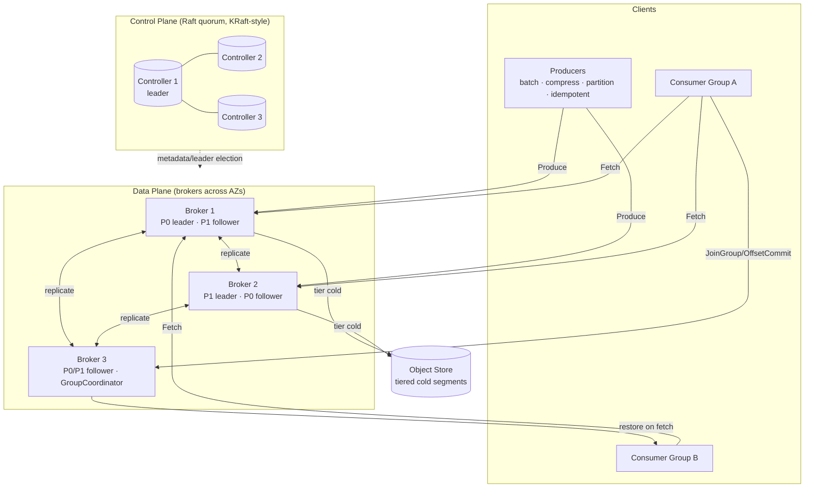

# Design a Distributed Message Queue (like Kafka)

> **Category:** Storage & Infrastructure
> **Level:** Senior / Staff system-design round
> **Format:** Interview-ready HLD — clarify, estimate, architect, deep-dive, defend.

---

## 1. Problem & clarifying questions

### 1.1 Restating the problem

We are asked to design a **distributed message queue** in the style of Apache Kafka: a horizontally-scalable, durable, high-throughput system that lets **producers** publish streams of records and lets **consumers** read them, decoupled in time and space. The system must persist data, survive node failures, preserve ordering within a partition, support replay, and scale to millions of messages per second.

The crucial framing point — and the first thing I'd say out loud in an interview — is that "message queue like Kafka" is **not a classic queue** (RabbitMQ/SQS semantics where a message is consumed and deleted). It is a **distributed, replicated, append-only commit log** with consumer-managed read positions (offsets). Messages are *retained* after consumption and can be re-read. That distinction drives almost every downstream design decision, so I want to confirm which semantics the interviewer wants before drawing a single box.

> **Term — commit log:** an append-only, ordered sequence of records. "Commit" here means "durably recorded"; readers move a cursor forward over the log rather than popping items off it.

### 1.2 Questions I'd ask the interviewer

**Functional scope**

1. **Log vs. classic queue semantics?** Do consumers *delete* messages on read (SQS/RabbitMQ model), or do we *retain* messages and track per-consumer offsets (Kafka model)? I'll assume the Kafka/log model unless told otherwise — it's the harder and more general design.
2. **Ordering guarantee?** Total order across the whole topic, or per-partition (per-key) order only? Global total order kills horizontal scalability, so I expect **per-partition ordering**. Confirm.
3. **Delivery semantics?** At-most-once, at-least-once, or exactly-once? Each has very different cost. I'll design for **at-least-once by default with an exactly-once path** available.
4. **Pub/sub fan-out?** Multiple independent consumer groups reading the same stream at their own pace? (Yes for Kafka-style.)
5. **Message size & schema?** Small JSON/Avro records (~1 KB) or large blobs (MB)? Do we own schema validation, or is the payload opaque bytes?
6. **Retention model?** Time-based (e.g., keep 7 days), size-based (keep 1 TB/partition), or **compacted** (keep only the latest value per key)? Likely we need all three.
7. **Replay / seek?** Must consumers be able to rewind to an arbitrary offset or timestamp? (Yes — this is a headline feature.)
8. **Ordering across produce retries?** Do we need idempotent producers and transactions spanning multiple partitions?
9. **Priority, delay, dead-letter queues?** These are RabbitMQ/SQS features. Are they in scope, or out? (I'll treat as extensions.)

**Non-functional**

10. **Throughput target?** Peak messages/sec and bytes/sec — both matter (count drives metadata/index cost, bytes drive disk/network).
11. **Latency target?** End-to-end produce→consume p99. Streaming systems usually tolerate 10–100 ms, not sub-millisecond.
12. **Durability requirement?** Can we lose the last few un-replicated messages on a hard crash, or is zero data loss on `acks=all` a hard requirement?
13. **Availability target?** Three nines, four nines? Tolerate single-AZ loss? Multi-region/disaster recovery?
14. **Consistency on reads?** Must a consumer only read fully-replicated (committed) records, or can it read uncommitted leader-only data?
15. **Multi-tenancy & isolation?** One shared cluster with quotas per tenant, or dedicated clusters?

**Scale & constraints**

16. **Number of topics/partitions?** Tens, thousands, or millions of partitions? This drives the metadata-plane design enormously (the classic ZooKeeper bottleneck).
17. **Number of producers/consumers?** Connection count drives broker memory and the networking model.
18. **Retention horizon × throughput** = total stored bytes. Need this to size disks and decide on tiered storage.
19. **Geographic distribution?** Single region first, multi-region later?

**Out-of-scope (I'll state and park)**

- Stream processing (joins, windowing, SQL) — that's Kafka Streams/Flink, layered on top.
- Connectors/ETL framework (Kafka Connect).
- Exactly-once *across external sinks* (that's a transactional-sink problem).
- Schema registry internals (I'll mention it as an adjacent service).

### 1.3 Assumptions I'll proceed with

| Dimension | Assumption |
|---|---|
| Semantics | Distributed log; retain after read; per-consumer-group offsets |
| Ordering | **Per-partition** total order; no cross-partition order |
| Delivery | **At-least-once** default; idempotent producer + transactions for exactly-once |
| Fan-out | Multiple independent consumer groups |
| Message size | Avg **1 KB**, p99 ~ 10 KB; opaque bytes + optional key |
| Retention | Time + size based; **log compaction** for changelog topics |
| Replay | Seek by offset and by timestamp |
| Throughput | **1 M msg/s** sustained peak, ~1 GB/s ingest (designed below) |
| Latency | p99 produce→consume **< 50 ms** within a region |
| Durability | **Zero loss** of acknowledged (`acks=all`) records on single-node failure |
| Availability | **99.95%**, survive single-broker and single-AZ loss |
| Consistency | Consumers read only **committed** (replicated) records (read-committed high-water-mark) |

---

## 2. Requirements (finalized)

### 2.1 Functional requirements

- **FR1 — Publish:** Producers append records to a named **topic**. Records carry an optional **key**, a **value** (bytes), a timestamp, and headers.
- **FR2 — Partitioning:** Each topic is split into N **partitions**; records with the same key always land in the same partition (so per-key order is preserved).
- **FR3 — Consume:** Consumers read records sequentially from a partition starting at an **offset**. The system tracks committed offsets per **consumer group**.
- **FR4 — Consumer groups:** A group of consumers cooperatively divides a topic's partitions among its members (each partition consumed by exactly one member of the group at a time) for horizontal read scaling. Different groups read independently.
- **FR5 — Durability & replication:** Each partition is replicated across R brokers; an acknowledged write survives broker failures up to the configured tolerance.
- **FR6 — Ordering:** Strict order within a partition; no ordering guarantee across partitions.
- **FR7 — Retention:** Delete records older than a time/size threshold; optionally **compact** to keep only the latest value per key.
- **FR8 — Replay / seek:** Consumers can reset to an arbitrary offset or to the first offset at/after a given timestamp.
- **FR9 — Delivery semantics:** At-least-once by default; idempotent producer (no duplicates on retry within a partition); transactional writes (atomic multi-partition append + offset commit) for exactly-once stream processing.
- **FR10 — Admin:** Create/delete topics, change partition count and replication factor, set retention/quotas.

### 2.2 Non-functional requirements

| NFR | Target | Rationale |
|---|---|---|
| **Throughput** | 1 M msg/s, ~1 GB/s ingest, multiple GB/s egress (fan-out) | Headline scaling requirement |
| **Latency** | Produce ack p99 < 10 ms (acks=1), < 30 ms (acks=all); end-to-end p99 < 50 ms | Near-real-time pipelines |
| **Durability** | No loss of `acks=all` records on single AZ failure; RPO ≈ 0 in-region | Financial/audit-grade pipelines need this |
| **Availability** | 99.95% writes; survive single broker + single AZ | Tolerate routine hardware churn |
| **Consistency** | Read-your-committed: consumers only see records at/below the high-water-mark | Avoid exposing data that could be lost on leader failover |
| **Scalability** | Linear: add brokers → more partitions/throughput; thousands of brokers, millions of partitions | Multi-tenant platform |
| **Retention** | Configurable hours→weeks; tiered storage to object store for long retention | Replay + cost control |

### 2.3 Key vocabulary (for the newcomer)

- **Topic:** a named stream of records (like a table name).
- **Partition:** one ordered, append-only log file-set; the unit of parallelism and ordering.
- **Offset:** a monotonically increasing integer position of a record within a partition. The reader's cursor.
- **Broker:** a server that hosts partitions (stores their data, serves reads/writes).
- **Replica / Leader / Follower:** each partition has one **leader** replica (handles all reads/writes) and R−1 **follower** replicas that copy from the leader.
- **ISR (In-Sync Replicas):** the set of replicas currently caught up to the leader. Only ISR members are eligible to become leader without data loss.
- **High-water-mark (HWM):** the highest offset that has been replicated to all ISR members; consumers can only read up to the HWM.
- **Consumer group:** a set of cooperating consumers that share the work of reading a topic.
- **Controller:** the cluster's brain — assigns partitions to brokers, elects leaders, tracks membership. (ZooKeeper/KRaft.)
- **Producer / Consumer:** client libraries that publish / subscribe.

---

## 3. Capacity estimation

I'll work from the headline target — **1,000,000 messages/sec sustained**, average message **1 KB**, retention **7 days**, replication factor **3** — and derive everything.

### 3.1 Ingest throughput & bandwidth

```
Write QPS (msg/s)        = 1,000,000 msg/s
Avg message size         = 1 KB (payload + key + headers + log overhead ~ call it 1 KB net)
Ingest bytes/s (client)  = 1,000,000 × 1 KB = 1 GB/s  (≈ 8 Gbps)
```

Replication multiplies what hits disk and the *internal* network:

```
Replication factor R     = 3  (1 leader + 2 followers)
Disk write bytes/s       = 1 GB/s × 3 = 3 GB/s (each record stored 3×)
Internal replication net = leader ships each record to 2 followers
                         = 1 GB/s × 2 = 2 GB/s east-west traffic
```

Egress depends on **fan-out** (how many consumer groups read the stream). Assume an average of **3 consumer groups** per stream:

```
Read bytes/s (egress)    = 1 GB/s × 3 groups = 3 GB/s (≈ 24 Gbps) to clients
Total broker network     ≈ 1 (ingest) + 2 (replication out) + 2 (replication in) + 3 (egress)
                         ≈ 8 GB/s aggregate across the cluster (≈ 64 Gbps)
```

### 3.2 Storage

```
Daily raw bytes          = 1 GB/s × 86,400 s = 86.4 TB/day (single copy)
Retention                = 7 days
Stored (single copy)     = 86.4 TB × 7 ≈ 605 TB
With replication × 3      = 605 TB × 3 ≈ 1.82 PB on disk
Add 25% headroom/index    ≈ 2.3 PB provisioned
```

**Takeaway:** ~2.3 PB of replicated disk. This is the number that justifies **tiered storage** (offload cold segments to S3/object storage), which can cut local SSD/HDD by an order of magnitude for long-retention workloads.

### 3.3 Partition & broker count

Partitions are the parallelism unit. Rule of thumb: a single partition leader sustains ~**10 MB/s** comfortably (commodity, with headroom; raw can be higher but you size for safety + replication + GC).

```
Partitions for ingest    = 1 GB/s ÷ 10 MB/s ≈ 100 leader partitions (minimum)
Over-provision for skew/growth × 5–10 → ~512–1024 partitions for the hot topic
Total partition replicas = partitions × R = 1024 × 3 ≈ 3072 replicas to place
```

Broker sizing — assume a broker NIC of 25 Gbps (≈ 3 GB/s usable) and ~20 TB usable disk after RAID/overhead:

```
By network: 8 GB/s aggregate ÷ 3 GB/s per broker ≈ 3 brokers (network-bound minimum)
By disk:    2.3 PB ÷ 20 TB per broker ≈ 115 brokers (storage-bound)
By partition leadership: keep ≤ ~1–4k partition replicas per broker
            3072 replicas ÷ ~1000 per broker ≈ 3–4 brokers (metadata-bound minimum)
```

**Storage dominates.** We need **~115–150 brokers** to hold the data with headroom, and they're far from network-saturated — meaning the cluster is **disk-capacity-bound**, not throughput-bound, at 7-day retention. This is the single most important capacity insight, and it's the lever for tiered storage:

```
With tiered storage (keep 1 day hot locally, 6 days in S3):
Hot local single-copy   = 86.4 TB; × 3 = 260 TB; ÷ 20 TB ≈ 13 brokers + headroom → ~16–20 brokers
```

So tiered storage shrinks the fleet from ~120 brokers to ~20 — a 6× cost reduction — at the price of higher-latency historical reads.

### 3.4 Memory & connections

```
Page cache is king: brokers serve recent reads from OS page cache, not heap.
Want hot working set (last few minutes) in RAM: 1 GB/s × ~60 s ≈ 60 GB resident → 128 GB+ RAM/broker.
Connections: say 10,000 producers + 30,000 consumers = 40,000 TCP connections,
spread over 120 brokers ≈ 350/broker — trivial with an epoll/NIO event loop.
JVM heap kept modest (6–12 GB) on purpose; data lives in page cache, not heap, to avoid GC pauses.
```

### 3.5 Offset-commit & metadata write rate

```
Consumers commit offsets periodically (say every 5 s per partition per group).
1024 partitions × 3 groups ÷ 5 s ≈ 614 offset commits/s — tiny.
These go to an internal compacted topic (__consumer_offsets), not the metadata store.
```

### 3.6 Estimation summary

| Quantity | Value |
|---|---|
| Ingest | 1 M msg/s, 1 GB/s |
| Disk write (×3) | 3 GB/s |
| Egress (×3 groups) | 3 GB/s |
| Stored (replicated, 7 d) | ~2.3 PB |
| Partitions (hot topic) | ~1024 |
| Brokers (full local retention) | ~120 |
| Brokers (1-day hot + tiered) | ~20 |
| RAM/broker | 128 GB (page cache) |
| Heap/broker | 6–12 GB |

---

## 4. API design

The API splits into a **data plane** (produce/fetch, hot path, custom binary protocol over TCP) and a **control plane** (admin, metadata).

### 4.1 Wire protocol notes

We use a **custom length-prefixed binary protocol over persistent TCP** rather than HTTP/REST per message. Reason: at 1 M msg/s, per-message HTTP framing/headers and connection churn are prohibitively expensive; a binary protocol with **request batching and pipelining** (multiple in-flight requests per connection) amortizes overhead. (A REST proxy can sit in front for low-throughput clients.)

### 4.2 Producer API

```
// Metadata discovery
Metadata(topics: [string])
  -> { brokers: [{id, host, port}],
       topics: [{name, partitions: [{id, leaderId, replicas, isr}]}] }

// Produce a batch to one partition (client picks/derives the partition)
Produce(
  topic: string,
  partition: int,
  acks: enum { NONE=0, LEADER=1, ALL=-1 },
  timeoutMs: int,
  producerId: int64,        // assigned for idempotency/transactions (optional)
  producerEpoch: int16,
  baseSequence: int32,      // monotonic per (producerId, partition)
  records: RecordBatch      // compressed, batched
) -> {
  partition: int,
  baseOffset: int64,        // offset assigned to first record in batch
  logAppendTime: int64,
  error?: enum
}
```

`RecordBatch` (compressed block — the unit of compression, replication, and storage):
```
RecordBatch {
  baseOffset, batchLength, partitionLeaderEpoch,
  attributes (compression codec: none|gzip|lz4|zstd, timestampType, isTransactional),
  lastOffsetDelta, firstTimestamp, maxTimestamp,
  producerId, producerEpoch, baseSequence,
  records: [ { lengthDelta, timestampDelta, offsetDelta, keyLen, key, valueLen, value, headers } ]
}
```

### 4.3 Consumer API

```
// Find the group's coordinator broker
FindCoordinator(groupId) -> { broker: {id, host, port} }

// Join a group; coordinator returns assignment after rebalance
JoinGroup(groupId, memberId?, topics: [string], sessionTimeoutMs)
  -> { generationId, memberId, leaderId, members?, assignment }

SyncGroup(groupId, generationId, memberId, assignments?)
  -> { assignment: [{topic, partitions:[int]}] }

Heartbeat(groupId, generationId, memberId) -> { error? /* REBALANCE_IN_PROGRESS */ }

// Pull records (long-poll). Consumer drives the cursor.
Fetch(
  replicaId: -1,            // -1 = ordinary consumer
  maxWaitMs, minBytes, maxBytes,
  isolationLevel: enum { READ_UNCOMMITTED, READ_COMMITTED },
  topics: [{ topic, partitions: [{ partition, fetchOffset, maxBytes }] }]
) -> {
  topics: [{ topic, partitions: [{
    partition, highWatermark, lastStableOffset, logStartOffset,
    abortedTransactions?, records: RecordBatch
  }]}]
}

// Offset management
OffsetCommit(groupId, generationId, memberId,
             offsets: [{topic, partition, offset, metadata}]) -> { error? }
OffsetFetch(groupId, topics) -> { offsets: [{topic, partition, committedOffset}] }
ListOffsets(topic, partition, timestamp | EARLIEST | LATEST)
             -> { offset, timestamp }   // for seek-by-time and replay
```

**Why pull (Fetch), not push?** A consumer-driven pull model lets each consumer read at its own pace, gives natural **backpressure** (a slow consumer simply fetches less often — the broker never overwhelms it), and enables large sequential reads. The cost is polling latency, mitigated by **long-poll** (`maxWaitMs` + `minBytes`): the broker holds the request until enough data accumulates or the timer fires.

### 4.4 Admin / control plane (REST or RPC, low rate)

```
POST   /topics            { name, partitions, replicationFactor, configs{retentionMs, cleanupPolicy} }
DELETE /topics/{name}
POST   /topics/{name}/partitions  { count }      // increase partitions (cannot decrease)
PUT    /topics/{name}/config      { retentionMs, retentionBytes, minInsyncReplicas, ... }
GET    /topics/{name}             // describe: partitions, leaders, ISR, offsets
PUT    /quotas                    { principal, produceBytesPerSec, fetchBytesPerSec }
POST   /reassign-partitions       { plan }        // rebalance replicas across brokers
```

---

## 5. High-level architecture

### 5.1 Components

- **Producers** — client libraries. Partition, batch, compress, retry, optionally idempotent/transactional.
- **Brokers** — stateful servers hosting partition replicas. Append to local log, replicate, serve fetches. The data plane.
- **Controller (quorum)** — cluster brain. Owns metadata: topic→partition→replica placement, leader election, ISR membership, config. We use a **Raft-based metadata quorum (KRaft-style)** instead of an external ZooKeeper.
- **Consumers / Consumer groups** — pull records; coordinate via a **Group Coordinator** (a broker role) for partition assignment and offset storage.
- **Internal topics** — `__consumer_offsets` (compacted, stores committed offsets) and `__transaction_state` (transactional metadata).
- **Tiered storage backend** — object store (S3/GCS) for cold log segments.
- **Schema Registry** (adjacent, optional) — validates/evolves record schemas.

### 5.2 ASCII block diagram

```
                         ┌──────────────────────────────────────────────┐
                         │            METADATA / CONTROLLER QUORUM         │
                         │   (Raft: 3–5 controller nodes, KRaft-style)     │
                         │  topic/partition map · leader election · ISR    │
                         │  configs · broker registration/heartbeats       │
                         └───────────────▲───────────────▲────────────────┘
                                         │ metadata        │ metadata
                                         │ pushes          │ heartbeats
        PRODUCERS                        │                 │                 CONSUMERS (groups)
   ┌──────────────┐   produce     ┌──────┴───────┐  ┌──────┴───────┐   fetch  ┌──────────────┐
   │ batch/compress├─────────────▶│   BROKER 1   │  │   BROKER 2   │◀─────────┤ group A: c1  │
   │ partitioner   │              │  P0(L) P1(F) │  │  P0(F) P1(L) │          │ group A: c2  │
   │ idempotent    │   produce    │  P2(F)       │  │  P2(L)       │   fetch  │ group B: c1  │
   │ tx coordinator├─────────────▶│              │  │              │◀─────────┤              │
   └──────────────┘              └──────┬───────┘  └──────┬───────┘          └──────┬───────┘
                                        │ replicate (followers fetch from leader)    │
                                        │◀──────────────────────────────────────────┘
                                 ┌──────┴───────┐         (Group Coordinator role lives on a broker;
                                 │   BROKER 3   │          stores offsets in __consumer_offsets topic)
                                 │  P0 P1 P2(F) │
                                 └──────┬───────┘
                                        │ tier cold segments
                                        ▼
                                 ┌──────────────┐
                                 │ OBJECT STORE │  (S3 / GCS — cold log segments, long retention)
                                 └──────────────┘

Legend: P0(L)=partition 0 leader, P1(F)=partition 1 follower.
Each partition: 1 leader + 2 followers spread across brokers/AZs.
```

### 5.3 Mermaid — component view



### 5.4 Sequence — produce with `acks=all`

```mermaid
sequenceDiagram
    participant Pr as Producer
    participant L as Leader (Broker 1, P0)
    participant F1 as Follower (Broker 2)
    participant F2 as Follower (Broker 3)

    Pr->>Pr: accumulate batch, compress (lz4/zstd)
    Pr->>L: Produce(P0, acks=all, batch, seq=N)
    L->>L: validate seq (idempotency), append to log, assign offsets
    L-->>F1: followers Fetch from leader (replica fetch)
    L-->>F2: followers Fetch from leader (replica fetch)
    F1->>F1: append to local log, advance LEO
    F2->>F2: append to local log, advance LEO
    F1-->>L: fetch reports LEO (ack via fetch position)
    F2-->>L: fetch reports LEO (ack via fetch position)
    L->>L: all ISR >= batch end → advance High-Water-Mark
    L-->>Pr: ack { baseOffset } (only after HWM advances)
    Note over Pr,L: Record now durable on all ISR; visible to consumers
```

### 5.5 Sequence — consume within a group

```mermaid
sequenceDiagram
    participant C1 as Consumer c1
    participant C2 as Consumer c2
    participant GC as Group Coordinator
    participant L as Partition Leader

    C1->>GC: FindCoordinator(groupId)
    C1->>GC: JoinGroup(groupId)
    C2->>GC: JoinGroup(groupId)
    GC->>C1: you are leader; members=[c1,c2]
    C1->>C1: compute assignment (e.g. range/sticky)
    C1->>GC: SyncGroup(assignment)
    GC->>C1: assigned P0
    GC->>C2: assigned P1
    loop steady state
      C1->>L: Fetch(P0, offset=last+1, maxWait=500ms, minBytes=1MB)
      L-->>C1: records up to HWM (READ_COMMITTED)
      C1->>C1: process records
      C1->>GC: OffsetCommit(P0, offset=processedEnd)
      C1->>GC: Heartbeat (keep membership alive)
    end
```

---

## 6. Data model & storage choices

### 6.1 Logical entities

```
Topic        { name, numPartitions, replicationFactor, configs }
Partition    { topicName, partitionId, leaderBrokerId, replicaSet[], isrSet[], logStartOffset, HWM, leaderEpoch }
Record       { offset, timestamp, keyBytes?, valueBytes, headers[] }
ConsumerGroup{ groupId, members[], state, generationId, coordinatorBrokerId }
OffsetCommit { groupId, topic, partition, committedOffset, metadata, commitTimestamp }
ProducerState{ producerId, producerEpoch, lastSequence per partition }   // for idempotency
TxnState     { transactionalId, producerId, epoch, state, partitions[] } // for transactions
```

### 6.2 The on-disk partition log (the core data structure)

A partition is **not** a database table — it's a directory of **immutable, append-only segment files** plus indexes.

```
/data/topicA-0/
  00000000000000000000.log      ← segment: records 0 .. 1.04M  (immutable once rolled)
  00000000000000000000.index    ← offset → byte-position (sparse)
  00000000000000000000.timeindex← timestamp → offset (sparse)
  00000000000001048576.log      ← active segment (currently being appended)
  00000000000001048576.index
  00000000000001048576.timeindex
  leader-epoch-checkpoint        ← (leaderEpoch → startOffset) for truncation safety
  partition.metadata
```

- **Segment:** the log is chunked into segments (e.g., 1 GB or time-rolled). Old segments are deleted/compacted/tiered as whole units — cheap retention.
- **`.log`:** the actual record batches, in offset order, never modified after append.
- **`.index`:** a **sparse** map from logical offset → physical byte position (one entry every ~4 KB). Lets a Fetch binary-search to the right byte without scanning. Sparse = small enough to mmap into memory.
- **`.timeindex`:** sparse timestamp → offset, powering `ListOffsets(timestamp)` for seek-by-time and time-based retention.
- **`leader-epoch-checkpoint`:** maps each leadership term to the offset where it began — essential for correct follower truncation after a leader change (prevents log divergence; explained in the replication deep dive).

**Why a custom append-only log instead of a database (PostgreSQL/Cassandra/RocksDB)?**

| Option | Write pattern | Read pattern | Verdict |
|---|---|---|---|
| **Append-only segment log (chosen)** | Pure sequential append → ~disk-sequential throughput; zero-copy sendfile to consumers | Sequential range scan from offset; sparse index for seek | **Best fit** — access pattern is *append + sequential scan*, exactly what disks (even spinning) do fastest |
| RDBMS (Postgres) | Random B-tree writes, WAL, MVCC overhead | Index lookups | Wrong shape — pays for random I/O & transactions we don't need; ~10× slower for this pattern |
| LSM KV (RocksDB/Cassandra) | Sequential-ish (memtable→SSTable) but compaction amplifies writes | Point/range by key | Closer, but read-by-offset and zero-copy egress are awkward; write amplification hurts at 3 GB/s |
| Object store only (S3) | High-latency PUT, no append | High-latency GET | Great for *cold* tier, terrible for the hot path's low-latency append/fetch |

**Decision:** purpose-built append-only log on local disk for the hot tier; object store for the cold tier. The log's superpower is that **producer writes, replication, retention, and consumer reads are all sequential**, so we ride the disk's sequential bandwidth (hundreds of MB/s per disk even on HDD) and use **`sendfile()` zero-copy** to push bytes from page cache straight to the consumer socket without copying into user space — the single biggest reason Kafka-style systems hit such high egress.

> **Term — zero-copy / `sendfile`:** an OS syscall that transfers file data directly from the page cache to a network socket inside the kernel, skipping the usual copy into and out of the application's memory. Cuts CPU and memory bandwidth on the read path dramatically.

### 6.3 Where metadata lives

- **Cluster metadata** (topic/partition/replica map, ISR, configs, broker registry): in the **Raft metadata log** owned by the controller quorum. It's itself an event log replicated by Raft.
- **Committed offsets:** in the internal **`__consumer_offsets`** topic (compacted), keyed by `(group, topic, partition)`. Storing offsets *in a topic* (not the controller) keeps the high-frequency commit traffic on the scalable data plane.
- **Producer/transaction state:** `__transaction_state` topic + in-memory producer-id maps on the leader.

---

## 7. Deep dives

This is the heart of the design. Five hard sub-problems: **(7.1) the partitioned log + ordering + offsets; (7.2) replication, ISR & durability; (7.3) consumer groups & rebalancing; (7.4) delivery semantics — at-least-once, idempotent, exactly-once; (7.5) the metadata/controller plane.** Plus shorter dives on retention/compaction, backpressure, and tiered storage.

---

### 7.1 Deep dive — Partitioned log, ordering, and offsets

**Problem.** We need a total order (so consumers see records in a deterministic sequence) AND horizontal scalability (so we exceed any single machine's throughput). These conflict: a single global ordered log can't scale past one leader's write rate.

**Resolution — partition the ordering domain.** A topic is split into **partitions**; we guarantee **total order within a partition** and *no* order across partitions. Each partition has its own leader on (potentially) a different broker, so write throughput scales linearly with partition count. Ordering is "scoped" to whatever the application keys on.

**How records map to partitions.**

| Strategy | Behavior | When to use | Failure mode avoided |
|---|---|---|---|
| **Key hash** `hash(key) % N` (chosen default) | Same key → same partition → per-key order | Need per-entity ordering (per user, per account) | Out-of-order events for a single entity |
| Round-robin / sticky (no key) | Even spread, no per-key order | Pure throughput, order irrelevant | Hot-partition skew |
| Custom partitioner | App-defined (e.g., geo, tenant) | Co-locate related data | Cross-partition joins needing locality |

**Critical pitfall — changing partition count.** `hash(key) % N` means **increasing N reshuffles keys** to new partitions, so a key's history is split across old and new partitions → **ordering breaks** for in-flight keys. Mitigations: (a) over-provision partitions up front (you can't decrease them); (b) for compacted/keyed topics, avoid repartitioning, or accept a one-time reshuffle with downstream re-keying. I'd call this out as a deliberate operational constraint: **partition count is hard to change for keyed topics — size it for years of growth.**

**Offsets.** Within a partition, the leader assigns each appended record a **monotonically increasing offset** (a 64-bit counter, no gaps). Offsets are *positions*, not IDs — they're meaningful only within `(topic, partition)`. Properties:

- **Append assigns the offset** — the leader is the single sequencer per partition, so ordering is trivially correct without distributed consensus on every write (consensus is only needed for *leadership*, not per-record).
- **Consumers store their position** as the next offset to read. Replay = set offset backward. Skip = set forward.
- **Sparse offset index** (`.index`) turns "read from offset O" into a binary search + short scan, O(log segment) not O(n).

**Why offsets beat per-message acknowledgment (the classic-queue contrast).** In SQS/RabbitMQ, the broker tracks per-message delivery/ack state — expensive bookkeeping that grows with in-flight count and forces random access. Here, **the consumer owns a single integer** per partition. The broker is stateless about consumer progress (except the committed-offset topic). This is what makes fan-out to many groups nearly free and replay trivial — and it's the cleanest one-line answer to "how is this different from a normal queue."

**Defended decision.** Per-partition ordering + leader-assigned offsets + consumer-owned cursor. Avoids the failure modes of (1) global ordering (throughput ceiling), and (2) broker-side per-message state (memory blowup, random I/O, no cheap replay).

---

### 7.2 Deep dive — Replication, ISR, and durability

**Problem.** A partition lives on one leader; if that broker dies we must not lose acknowledged data and must keep serving. We need replication that's **fast on the hot path** yet **safe on failover**.

**Mechanism — leader/follower with ISR.**

- Each partition has R replicas: 1 **leader** (handles all produce/fetch) + R−1 **followers**.
- **Followers replicate by *fetching* from the leader** — they run the same Fetch protocol as a consumer. This reuses the read path and gives followers natural backpressure.
- The leader tracks each replica's **LEO (Log End Offset)** — how far it has copied.
- **ISR (In-Sync Replicas):** replicas whose LEO is within `replica.lag.time.max.ms` of the leader. A follower that falls behind (slow disk, GC, network) is **kicked out of ISR**; when it catches up, it rejoins.
- **High-Water-Mark (HWM):** the minimum LEO across the current ISR. The leader advances the HWM only when **all ISR members** have the record. **Consumers can only read up to the HWM** → they never see a record that could be lost if the leader dies.

**The `acks` knob — the durability/latency dial producers control.**

| `acks` | Leader waits for | Durability | Latency | Failure mode |
|---|---|---|---|---|
| `0` (none) | nothing (fire-and-forget) | Lowest — may lose on any hiccup | Lowest | Silent data loss; no retries |
| `1` (leader) | leader local write | Survives follower loss, **not** leader loss | Low (~few ms) | Lose un-replicated tail if leader dies before followers copy |
| `-1`/`all` (ISR) | all ISR have it | **No loss while ≥1 ISR survives** | Higher (~tens of ms) | Latency/throughput cost; blocks if ISR shrinks |

**`min.insync.replicas` — the safety floor.** With `acks=all`, also set `min.insync.replicas = 2` (for R=3). If ISR shrinks below 2 (e.g., two brokers down), the leader **rejects writes** (`NotEnoughReplicas`) rather than accept a write that lives on only one node. This is the explicit **availability-vs-durability tradeoff**: we choose to *stop accepting writes* rather than risk data loss. (Producers buffer/retry; the partition is read-only until ISR recovers.)

**Leader election & the unclean-leader question.**

- When a leader dies, the controller elects a **new leader from the current ISR** — guaranteed to have all committed (HWM) data → **no loss**.
- If **all ISR are gone**, you face a choice encoded in `unclean.leader.election.enable`:

| Policy | Behavior | Tradeoff |
|---|---|---|
| **Clean only (chosen)** | Partition stays offline until an ISR member returns | **No data loss**, but reduced availability |
| Unclean allowed | Elect an out-of-sync replica → restore availability | **Data loss** (records past that replica's LEO vanish) |

We default to **clean-only**: durability wins. (Expose unclean as a per-topic escape hatch for availability-over-correctness streams like metrics.)

**The log-divergence trap and how leader epochs fix it.** Suppose leader L1 had records up to offset 100, followers had 95, then L1 crashes and a follower becomes L2 at offset 95. Later L1 returns with offsets 96–100 that were never committed. If L1 naïvely keeps them, the logs **diverge**. The fix: every leadership term has a **leader epoch** (monotonic number). The `leader-epoch-checkpoint` records `(epoch → start offset)`. On rejoining, a replica asks the current leader for the **end offset of its last epoch** and **truncates anything beyond it** before resuming fetch. This guarantees all replicas converge to a single history. (Older "truncate to HWM" logic had subtle data-loss/divergence bugs; epoch-based truncation is the correct mechanism — worth naming in an interview.)

**Replica placement.** Spread the R replicas across **different brokers and different AZs** (rack-awareness) so a single AZ loss never takes out a whole partition's ISR. This is what makes the "survive single-AZ" NFR true.

**Defended decision.** Leader/follower with ISR, HWM-gated reads, `acks=all` + `min.insync.replicas=2`, clean leader election, epoch-based truncation. This combination gives **RPO≈0 in-region** while keeping the hot path a simple sequential append + pipelined replication. The failure mode it avoids: acknowledging a write that exists on only one node and then losing it on that node's crash.

---

### 7.3 Deep dive — Consumer groups & rebalancing

**Problem.** A single consumer can't keep up with a high-throughput topic. We want to parallelize consumption across many consumers *while preserving per-partition order and processing each record once per group*.

**Model.** A **consumer group** is a set of consumers sharing a `groupId`. The group's **partitions are distributed among members so each partition is owned by exactly one member at a time.** Order is preserved because a partition has a single reader within the group. Parallelism is capped at the partition count (extra consumers idle) — another reason to size partitions generously.

**Group Coordinator.** One broker acts as the **coordinator** for a group (chosen by hashing `groupId` into a `__consumer_offsets` partition). It manages membership, runs rebalances, and stores committed offsets.

**Rebalancing — the hard part.** When membership changes (a consumer joins, leaves, or fails its heartbeat) or partitions change, the group must **reassign** partitions:

1. Members send `JoinGroup` → coordinator picks one member as **group leader** and bumps `generationId`.
2. The group leader computes the assignment (using a pluggable strategy) and sends it via `SyncGroup`.
3. Coordinator distributes each member its partitions. Members resume fetching from their last committed offsets.

**Assignment strategies:**

| Strategy | How | Pro | Con |
|---|---|---|---|
| Range | Per-topic, assign contiguous partition ranges | Simple | Skews load if topics differ |
| Round-robin | Spread all partitions evenly | Balanced | Reassigns nearly everything on change |
| **Sticky / Cooperative-sticky (chosen)** | Keep existing assignments where possible; move only what's needed; rebalance *incrementally* without a full stop | Minimal disruption; avoids "stop-the-world" | More complex |

**The stop-the-world problem and cooperative rebalancing.** Naïve (eager) rebalancing makes **every** consumer revoke **all** partitions, then rejoin — the whole group pauses consumption during the rebalance ("stop-the-world"). With large groups this causes latency spikes and even cascading rebalances. **Cooperative (incremental) rebalancing** revokes only the partitions that must move and keeps the rest flowing, dramatically shrinking the pause. We choose **cooperative-sticky** as the default. Failure mode avoided: consumption stalls and latency spikes during routine scaling/deploys.

**Static membership & session timeouts.** Transient consumer restarts (deploys) shouldn't trigger rebalances. **Static group membership** gives each consumer a stable `group.instance.id`; if it rejoins within the session timeout, it reclaims its **same** partitions with **no rebalance**. Tune `session.timeout.ms` (failure detection) vs. `max.poll.interval.ms` (max processing time before the member is considered dead) carefully:
- Too low → false failures, churn.
- Too high → slow failure detection, lag spikes.

**Offset commit semantics drive delivery guarantees.** Where you commit decides duplicates vs. loss on crash:
- **Commit *after* processing** → at-least-once (crash after process, before commit → reprocess).
- **Commit *before* processing** → at-most-once (crash after commit, before process → record skipped/lost).
- **Auto-commit on a timer** → convenient but blurs the boundary; can cause both duplicates and (with careless threading) loss.

**Defended decision.** Coordinator-managed groups, partition-exclusive ownership, **cooperative-sticky** assignment, **static membership** for deploys, offsets committed **after** processing for at-least-once. This maximizes parallelism and minimizes rebalance disruption while keeping ordering intact.

---

### 7.4 Deep dive — Delivery semantics: at-least-once, idempotent producer, exactly-once

**Problem.** Networks and processes fail mid-flight. We must define what "delivered" means and how to avoid duplicates and loss.

**The three guarantees:**

- **At-most-once:** never reprocess; may lose. (Commit offset before processing; `acks` low.)
- **At-least-once (default):** never lose acknowledged data; may duplicate. (Retry on failure; commit after processing.)
- **Exactly-once:** no loss, no duplicates — the hard one.

**Why duplicates happen even at `acks=all`.** Producer sends a batch, leader appends and replicates, but the **ack is lost** on the network. The producer times out and **retries** → the same batch is appended twice. At-least-once accepts this; we want to eliminate it.

**Idempotent producer (dedup within a partition).** Assign each producer a unique **`producerId` (PID)** and an **epoch**, and number each record batch with a **monotonic sequence** per `(PID, partition)`. The leader tracks the **last sequence** it accepted per `(PID, partition)`:
- A retry carries the **same sequence** → leader recognizes the duplicate and **ack's without re-appending**. No duplicate.
- An out-of-order sequence → `OutOfOrderSequence` error → producer can detect a gap.
- The **epoch** fences a **zombie** producer: if a new instance starts with the same transactional id, its higher epoch invalidates the old one's writes.

This gives **exactly-once *into a single partition*** despite retries — cheaply, since it's just a per-PID counter on the leader. Failure mode avoided: retry-induced duplicates.

**Transactions (exactly-once across partitions + offset commit).** Idempotency fixes one partition. Stream processing needs more: read from input partitions, write to output partitions, and **commit input offsets** — all **atomically** (the classic "consume-transform-produce" loop). We add:

- A **`transactional.id`** (stable across restarts) mapped to a PID/epoch by the **Transaction Coordinator** (a broker role backed by `__transaction_state`).
- Producer flow: `initTransactions` → `beginTransaction` → produce to several partitions + `sendOffsetsToTransaction` (the consumed offsets are written *as part of the transaction*) → `commitTransaction` (or `abort`).
- The coordinator runs a **two-phase commit**: it writes **transaction markers** (commit/abort control records) into every partition the transaction touched.
- **Read-committed consumers** (`isolation.level=read_committed`) only return records up to the **Last Stable Offset (LSO)** — the offset before the first still-open transaction — and **filter out aborted** records using the abort list. So uncommitted/aborted data is never seen.

Result: **exactly-once *within the Kafka system*** for consume-transform-produce pipelines. (True end-to-end EOS to an *external* sink still needs an idempotent or transactional sink — call this out; the broker can't make an arbitrary database idempotent.)

**Tradeoff table:**

| Guarantee | Mechanism | Overhead | When to use |
|---|---|---|---|
| At-most-once | acks=1, commit-before-process | Lowest | Lossy-OK telemetry |
| **At-least-once** | acks=all, retries, commit-after-process | Low | **Default** for most pipelines |
| EOS into 1 partition | Idempotent producer (PID+seq) | ~free | Always enable; no real downside |
| EOS multi-partition + offsets | Transactions + markers + read-committed | ~10–20% throughput, higher latency | Financial/critical stream processing |

**Defended decision.** Always-on **idempotent producer** (cheap, kills retry dups), **at-least-once** as the cluster default, and **transactions** as an opt-in for EOS pipelines. Avoids both silent loss and the much costlier blanket exactly-once tax on workloads that don't need it.

---

### 7.5 Deep dive — Metadata & controller plane

**Problem.** Something must hold the authoritative cluster state — which broker leads each partition, ISR membership, configs, broker liveness — and make **fast, consistent leader-election decisions** on failure. At millions of partitions this metadata plane becomes the scaling bottleneck.

**The classic bottleneck (ZooKeeper era).** Early designs stored metadata in **ZooKeeper** (external consensus service) and had a single elected controller read/write it. Problems: (1) every leadership change touched ZK; (2) **controller failover** meant reloading *all* partition state from ZK — O(partitions) and slow (minutes at scale); (3) ZK watch storms and a second system to operate. This capped clusters at ~200k partitions.

**Chosen approach — self-managed Raft metadata quorum (KRaft-style).**

- A dedicated set of **3 or 5 controller nodes** run **Raft** and store cluster metadata as **its own replicated event log** (a metadata topic).
- The **active controller is the Raft leader**; metadata changes are appended as events and replicated by Raft (majority quorum commit).
- Brokers are **replicas of the metadata log** — they *subscribe* to the metadata stream and apply changes incrementally, keeping a local cached view. No giant reload.
- **Controller failover is fast**: the new active controller already has the metadata log in memory (it was a Raft follower); it just resumes from the last committed offset — O(recent changes), not O(all partitions).

> **Term — Raft:** a consensus algorithm where a leader is elected by majority vote and replicates an ordered log to followers; a write commits once a majority has it. Gives a single consistent history with automatic leader failover.

**Why fold the log model back onto metadata?** Metadata changes *are* an event stream; representing them as a replicated log gives the same benefits we built for data (ordered, durable, incrementally consumable) and lets brokers stay in sync by tailing it. It eliminates the external dependency and the reload cliff. Failure mode avoided: minutes-long controller failover and the ~200k-partition ceiling.

**What the controller does:**
- Broker registration & **heartbeat/liveness** (a broker that misses heartbeats is fenced).
- **Leader election** for partitions whose leader died — pick an ISR member, bump the **leader epoch**, broadcast via the metadata log.
- **ISR changes** — shrink/expand ISR as followers lag/recover.
- **Topic/partition create/delete**, replica **reassignment** plans, config changes, quotas.

**Tradeoff vs. alternatives:**

| Metadata store | Failover speed | Partition ceiling | Ops burden | Verdict |
|---|---|---|---|---|
| External ZooKeeper | Slow (full reload) | ~200k | Extra system | Legacy |
| **Self-managed Raft log (chosen)** | Fast (already in memory) | Millions | One system | **Best** |
| etcd/Consul (external KV) | Medium | Limited by KV write rate | Extra system | OK but external dependency |
| Gossip (no strong consensus) | N/A | High | Low | **Rejected** — leader election needs strong consistency; gossip risks split-brain dual leaders |

**Defended decision.** Self-managed Raft metadata quorum. Strong consistency for leader election (no split-brain), fast failover, and a single operational system that scales to millions of partitions.

---

### 7.6 Deep dive (shorter) — Retention, compaction & tiered storage

**Retention policies:**
- **Time-based** (`retention.ms`): delete whole segments older than T. Cheap — drop files, no scanning.
- **Size-based** (`retention.bytes`): keep at most B bytes/partition; delete oldest segments.
- **Log compaction** (`cleanup.policy=compact`): for **keyed/changelog** topics, keep only the **latest value per key** (and a tombstone for deletes). Turns an event log into a "current-state snapshot you can replay." A background **log cleaner** merges old segments, dropping superseded keys. Used by `__consumer_offsets` itself.

> **Term — tombstone:** a record with a key and a *null* value meaning "this key is deleted." Compaction keeps it long enough for consumers to observe the delete, then removes it.

**Tiered storage (the cost lever from §3.3).** Hot, recent segments live on local SSD (low-latency fetch). Once a segment rolls and ages past a threshold, the broker **uploads it to object storage** and keeps only metadata + index locally. A consumer fetching old offsets triggers a transparent **restore/stream-from-S3**. Tradeoffs:

| | Local-only | **Tiered (chosen)** |
|---|---|---|
| Hot read latency | Lowest | Same (hot stays local) |
| Cold read latency | Lowest | Higher (S3 fetch) |
| Disk cost | High (full 2.3 PB) | ~6× lower |
| Retention horizon | Bounded by disk | Effectively unlimited |
| Failure mode | Disk-bound fleet, costly long retention | Slower historical replay |

Defended: tiered storage. Most reads are recent (consumers tail the head); cold replay tolerates higher latency. We turn a 120-broker disk-bound fleet into ~20 brokers.

### 7.7 Deep dive (shorter) — Backpressure & flow control

The pull model is the primary backpressure mechanism: a slow consumer simply fetches less; the broker never pushes. But we still protect the broker and other tenants:
- **Producer side:** bounded client buffer (`buffer.memory`); when full, `send()` **blocks** (or throws) — backpressure propagates to the application. `max.in.flight.requests` bounds un-acked batches (and must be ≤5 with idempotence to preserve ordering on retry).
- **Broker quotas:** per-principal **byte-rate quotas** (produce and fetch). Over-quota clients get their responses **throttled** (delayed) — protecting noisy-neighbor isolation in a multi-tenant cluster.
- **Replication throttling** during reassignment so rebalancing doesn't starve live traffic.
- **Request queues & purgatory:** the broker holds long-poll fetch/produce requests in a delayed-operation structure ("purgatory") and completes them when data/acks arrive, instead of busy-waiting or unbounded threads.

Failure mode avoided: an unbounded fast producer or a noisy tenant OOMing brokers or starving others.

---

## 8. Scaling & bottlenecks

**How it scales (the levers):**
- **Throughput:** add partitions and brokers; leadership spreads, ingest/egress scale ~linearly until disk or NIC saturates.
- **Consumers:** add members to a group up to the partition count; add independent groups for fan-out (nearly free thanks to offset-based reads + page cache + zero-copy).
- **Storage/retention:** tiered storage decouples retention horizon from local disk.

**Where it breaks first, and the fix:**

| Bottleneck | Symptom | Fix |
|---|---|---|
| **Disk capacity** (our §3.3 binding constraint) | Brokers fill up; fleet huge | Tiered storage to object store; shorter local retention |
| **Hot partition (key skew)** | One partition's leader saturates; lag on that partition | Better key design / custom partitioner; split hot key; more partitions |
| **Partition count too low** | Can't add consumers; ingest ceiling | Over-provision partitions at creation (can't shrink) |
| **Metadata plane** | Slow failover, control-op latency | Raft metadata quorum (§7.5); cap partitions/broker |
| **Rebalance storms** | Consumption stalls on deploys/scaling | Cooperative-sticky + static membership (§7.3) |
| **Replication lag** | ISR shrinks, HWM stalls, writes blocked (min.isr) | Faster follower disks/network; throttle reassignment; reduce R for non-critical topics |
| **GC pauses** | Latency spikes, ISR flaps | Keep heap small; rely on page cache; G1/ZGC tuning; no large on-heap buffers |
| **Network egress (high fan-out)** | NIC saturated on popular topics | Read-from-follower (fetch from nearest replica); more brokers; rack-aware reads |
| **Tail latency from cold reads** | p99 spikes when consumers seek old offsets | Keep hot set local; cache restored segments; pre-warm |
| **Small messages** | Per-record overhead dominates CPU | Producer batching + compression; larger `linger.ms`/`batch.size` |

**Multi-region scaling.** Within a region we replicate synchronously (ISR). Across regions, **asynchronous mirroring** (a MirrorMaker-style consumer→producer bridge) copies topics to a remote cluster. Cross-region sync replication is rejected for the hot path: WAN RTT (tens of ms) would dominate produce latency and a partition can't keep an ISR member across an unreliable WAN without stalling. So: **sync in-region (RPO≈0), async cross-region (RPO = mirror lag)** — an explicit DR tradeoff.

---

## 9. Reliability, consistency & security

### 9.1 Failure handling

- **Broker crash:** controller detects via missed heartbeat → for each partition it led, elects a new leader from ISR (bumps leader epoch) → producers/consumers refresh metadata and reconnect to the new leader. In-flight `acks=all` writes that reached ISR are safe; un-acked ones are retried (idempotence dedups).
- **Follower crash/lag:** dropped from ISR; HWM advancement now needs only the surviving ISR. On recovery, follower truncates to its last epoch's end offset and re-fetches.
- **Controller crash:** Raft elects a new active controller from the quorum; metadata already in memory → fast failover.
- **AZ loss:** rack-aware placement guarantees ≥1 ISR replica survives per partition → no data loss; degraded capacity until AZ returns.
- **Disk failure:** that replica is lost; treated as a follower failure; re-replicate from leader to a fresh broker.
- **Network partition:** the minority side can't make progress (no quorum for metadata; `min.insync.replicas` blocks writes) → we **sacrifice availability to preserve consistency/durability** on the partition's behalf.

### 9.2 Consistency model

- **Per-partition linearizable append order**, single leader = single sequencer.
- **Read-committed (HWM-gated) reads**: consumers never see records that aren't on all ISR, so a failover never "un-reads" data. With transactions, read-committed also hides aborted/open-transaction records (via LSO + abort list).
- **No cross-partition consistency** by default; transactions provide atomic multi-partition commit when needed.
- This is a **CP-leaning** system per partition: on partition/quorum loss we stop accepting writes (CP) rather than risk divergence (AP). Unclean leader election is the opt-in AP escape hatch per topic.

### 9.3 Idempotency & exactly-once (recap)

Idempotent producer (PID+epoch+sequence) kills retry duplicates within a partition; transactions + markers + read-committed give EOS for consume-transform-produce. Epochs **fence zombies** so a restarted/duplicated producer can't corrupt the log.

### 9.4 Security

- **Authentication:** mutual **TLS** and/or **SASL** (SCRAM, Kerberos, OAUTHBEARER) for both client↔broker and broker↔broker.
- **Authorization:** **ACLs** per principal on resources (topic read/write, group, cluster admin), enforced by a pluggable authorizer.
- **Encryption:** TLS in transit; encryption at rest via disk/volume encryption (or envelope encryption for object-store tier).
- **Multi-tenancy isolation:** per-principal **quotas** (byte-rate, request-rate) + ACLs + optional dedicated clusters for noisy/high-trust tenants.
- **Abuse / rate limiting:** quotas throttle over-aggressive clients; connection limits per IP/principal; request-rate quotas guard the broker's request handler threads.
- **Auditing:** authorizer + controller emit an audit trail of admin and access events.

---

## 10. Extensions & follow-ups

| Interviewer adds… | How the design changes |
|---|---|
| **Classic queue semantics (delete-on-consume, per-message ack, priority, delay, DLQ)** | This is RabbitMQ/SQS territory. Layer it: a "queue" becomes a single-partition (or competing-consumer) topic; emulate delete via per-message acks tracked in a separate store; **DLQ** = route poison messages (after N retries) to a `*.DLQ` topic; **delay** = a delay topic + scheduler; **priority** = separate topics per priority polled in order. Note the throughput cost of per-message state. |
| **Exactly-once to an external DB sink** | Broker EOS isn't enough; the sink must be idempotent (upsert by key) or participate via the transactional outbox / two-phase commit pattern. |
| **Millions of partitions / huge multi-tenant** | Lean harder on Raft metadata plane; cap partitions/broker; consider partition-less or share-group designs (Kafka KIP-932 "queues for Kafka" — multiple consumers per partition with broker-tracked acks) for queue-like fan-in. |
| **Geo-replication / active-active** | Async mirroring; conflict handling for active-active (offset translation, dedup by key, consider per-region key ownership). Accept RPO = mirror lag. |
| **Schema evolution** | Schema Registry with compatibility rules (backward/forward); producers register, consumers validate; payload carries schema id. |
| **Tiered storage cold-read latency SLA** | Cache restored segments; pre-fetch on seek; separate read-path thread pool so cold reads don't block hot fetches. |
| **Smaller latency (sub-ms)** | Reduce `linger.ms`, `acks=1` for non-critical, more partitions, co-locate clients; acknowledge the durability tradeoff. |
| **Backfill a new consumer from day 0 without hurting live consumers** | Read-from-follower / dedicated read replicas; throttle the backfill via fetch quotas; serve cold from tiered storage. |
| **Compaction + GDPR delete** | Tombstones for key deletion; ensure compaction + tiered tier both honor deletes; track delete propagation. |
| **Queue depth / consumer lag monitoring** | Lag = HWM − committedOffset per partition/group; expose as first-class metric; alert + autoscale consumers. |

---

## 11. Interview Q&A

**Q1. How is this different from a traditional message queue (RabbitMQ/SQS)?**
A traditional broker tracks per-message delivery/ack state and *deletes* on consume; it's optimized for task queues with per-message routing, priority, and DLQs. This is a **distributed, replicated commit log**: messages are *retained*, ordering is **per-partition**, consumers track a single **offset** cursor, and many independent groups can replay the same stream. The broker holds almost no per-consumer state, which makes fan-out and replay cheap and throughput enormous — at the cost of native priority/per-message-ack features.
*Probe — when would you pick the traditional broker instead?* When you need per-message acknowledgment, priorities, complex routing, or low-volume task distribution where replay/throughput aren't the point.
*Probe — can you emulate a queue here?* Yes: competing consumers in a group, plus a DLQ topic and retry topics; but you re-implement per-message ack state and pay for it.

**Q2. Why partition, and what do you lose?**
Partitioning is how we scale past a single leader's throughput and parallelize consumers. We lose **global ordering** — only per-partition (per-key) order survives. Choose the key so that anything needing order shares a key.
*Probe — what breaks if you raise partition count on a keyed topic?* `hash(key)%N` changes, so keys remap to new partitions and per-key ordering breaks for in-flight keys; over-provision instead.

**Q3. Walk me through `acks=all`. What exactly is durable when the producer gets the ack?**
The leader appends, followers fetch and append, and once **all ISR** members have the batch the leader advances the **HWM** and only then acks. So an acknowledged record is on every in-sync replica and is readable. With `min.insync.replicas=2` (R=3), if fewer than 2 are in sync the leader **rejects** the write rather than risk single-copy data.
*Probe — what if an ISR member is slow?* It's dropped from ISR after the lag timeout; HWM then advances on the smaller ISR; the slow one rejoins after catching up.

**Q4. (Senior signal) Durability vs. availability — defend your `min.insync.replicas` / unclean-leader choices.**
I choose `min.insync.replicas=2` and **clean-only** leader election: if ISR shrinks too far we **stop accepting writes** and keep a partition offline until an in-sync replica returns — sacrificing availability to guarantee **no acknowledged data is ever lost** (RPO≈0). The failure mode I'm avoiding is acknowledging a write that lives on one node, then losing it on that node's crash, or electing a stale replica that silently drops committed records. For loss-tolerant streams (metrics), I'd expose unclean election per-topic as an availability-over-correctness escape hatch.

**Q5. (Senior signal) Why a custom append-only log instead of an existing database?**
The access pattern is **append + sequential scan from an offset**, with massive fan-out reads. A segmented append-only log gives sequential disk I/O (near disk bandwidth even on HDD), whole-segment retention (cheap deletes), a sparse offset index for O(log) seeks, and **`sendfile` zero-copy** egress straight from page cache. An RDBMS pays for random B-tree writes and MVCC we don't need; an LSM store adds compaction write-amplification and awkward read-by-offset. The log matches the workload's shape, which is the whole performance story.

**Q6. How do you achieve exactly-once?**
Two layers. **Idempotent producer**: a `producerId` + per-partition **sequence** lets the leader dedupe retries → exactly-once into a single partition, cheaply. **Transactions**: a transaction coordinator + commit/abort **markers** make a multi-partition produce *plus* the input-offset commit atomic; **read-committed** consumers skip aborted/open records via the Last Stable Offset. That's EOS for consume-transform-produce *within* the system. End-to-end to an external sink still needs an idempotent/transactional sink.
*Probe — what does the epoch do?* It **fences zombies**: a restarted producer with the same transactional id gets a higher epoch, invalidating the old instance's writes so a duplicate process can't corrupt the log.

**Q7. Push or pull for consumers, and why?**
**Pull (long-poll Fetch).** Pull gives consumers control of their rate (natural backpressure — a slow consumer simply fetches less; the broker never overwhelms it), enables big sequential reads and replay, and keeps the broker stateless about consumer speed. The downside is polling latency, which long-poll (`maxWaitMs`+`minBytes`) hides.

**Q8. Explain a consumer-group rebalance and how you minimize its pain.**
On membership/partition change, the coordinator bumps the generation and reassigns partitions so each is owned by one member. Naïve (eager) rebalancing is **stop-the-world** — everyone revokes everything and pauses. I use **cooperative-sticky** assignment (move only what must move, keep the rest flowing) and **static membership** (stable instance ids so a redeploy reclaims the same partitions with no rebalance). That avoids consumption stalls during routine scaling/deploys.
*Probe — session.timeout vs max.poll.interval?* Session timeout is the heartbeat-based liveness window (failure detection); max.poll.interval bounds how long processing a batch may take before the member is considered dead. Tune to balance false failures vs. slow detection.

**Q9. (Senior signal) Where does this system bottleneck first at your stated scale, and how do you remove it?**
**Disk capacity**, not throughput: 1 GB/s × 7 days × RF 3 ≈ 2.3 PB → ~120 storage-bound brokers while the NICs sit idle. The fix is **tiered storage** — keep ~1 day hot locally and offload the rest to object storage — cutting the fleet to ~20 brokers (~6×) at the cost of higher cold-read latency. Secondary bottlenecks: hot partitions from key skew (fix with key design / more partitions) and rebalance storms (cooperative-sticky + static membership).

**Q10. How do you handle a poison message that keeps crashing a consumer?**
Bounded retries with backoff; after N failures, route the record to a **dead-letter topic** with its error metadata and **commit past it** so the partition keeps flowing. Operators inspect/replay the DLQ. The key is not to block a whole partition forever on one bad record.

**Q11. What's the controller and why did you avoid ZooKeeper?**
The controller owns cluster metadata and leader election. External ZooKeeper meant slow controller failover (reload all partition state) and a ~200k-partition ceiling. I store metadata as a **Raft-replicated event log** (KRaft-style): brokers tail it, the active controller is the Raft leader, and failover is fast because the metadata is already in memory. One fewer system, scales to millions of partitions, strong consistency for elections (no split-brain).

---

## 12. Cheat-sheet & self-test

### 12.1 Dense recap

**Numbers:** 1 M msg/s · 1 KB avg · 1 GB/s ingest · ×3 disk write = 3 GB/s · 7-day retention · RF 3 → **~2.3 PB**, **~120 brokers (storage-bound)** → **~20 with tiered storage**. ~1024 partitions for the hot topic. 128 GB RAM/broker (page cache), small heap. Produce ack p99 < 30 ms (`acks=all`), e2e p99 < 50 ms.

**Core model:** topic → N **partitions** (append-only segment logs) → each record gets a leader-assigned **offset**; **per-partition order only**; consumers own an **offset cursor**; multiple **groups** fan out.

**Storage:** segmented immutable `.log` + sparse `.index` (offset→byte) + `.timeindex` (ts→offset) + leader-epoch checkpoint. Sequential writes, **`sendfile` zero-copy** reads. Retention: time / size / **compaction** (latest value per key, tombstones). **Tiered storage** to object store for cold.

**Replication:** 1 leader + R−1 followers (followers *fetch*). **ISR** = caught-up replicas; **HWM** = min ISR LEO; consumers read ≤ HWM. **acks=all** + **min.insync.replicas=2** = no loss while ≥2 in sync; ISR-only (clean) election; **leader epochs** prevent log divergence on failover.

**Delivery:** at-least-once default; **idempotent producer** (PID+epoch+seq) kills retry dups in a partition; **transactions** (coordinator + commit/abort markers + read-committed/LSO) give EOS for consume-transform-produce.

**Groups:** coordinator-managed; partition owned by one member; **cooperative-sticky** assignment + **static membership** to avoid stop-the-world rebalances. Commit offsets **after** processing for at-least-once. Lag = HWM − committed.

**Control plane:** **Raft metadata quorum (KRaft-style)** — metadata as a replicated log, fast failover, millions of partitions, no ZooKeeper. Controller = leader election + ISR + configs + broker liveness.

**Backpressure:** pull model; producer buffer blocks; broker **byte/request quotas**; purgatory for delayed ops.

**Consistency:** CP-per-partition (stop writes on quorum loss); read-committed; async cross-region (RPO = mirror lag), sync in-region (RPO≈0).

**Diagram in words:** producers → batch/compress → produce to **partition leader** on a broker → leader appends, followers fetch-replicate → HWM advances when ISR caught up → consumers in groups pull (long-poll) up to HWM, commit offsets to `__consumer_offsets` → **Raft controller quorum** assigns leaders/ISR via a metadata log brokers tail → cold segments tiered to object store.

### 12.2 Decisions at a glance

| Decision | Choice | Why (failure avoided) |
|---|---|---|
| Order vs. scale | Per-partition order | Global order caps throughput |
| Storage engine | Append-only segment log | Random-I/O DBs too slow for append+scan |
| Read path | Pull + long-poll + zero-copy | Push overwhelms slow consumers; copies waste CPU |
| Durability | acks=all + min.isr=2, clean election | Single-copy loss; stale-leader loss |
| Failover correctness | Leader epochs + truncate | Log divergence |
| Dedup | Idempotent producer | Retry duplicates |
| EOS pipelines | Transactions + markers | Partial writes / double-counting |
| Rebalance | Cooperative-sticky + static | Stop-the-world stalls |
| Control plane | Raft metadata log (KRaft) | Slow failover, partition ceiling, split-brain |
| Cost at retention | Tiered storage | Disk-bound 120-broker fleet |

### 12.3 Self-test (no answers)

1. A producer has `acks=all`, `max.in.flight.requests=5`, and **idempotence disabled**, and a batch times out and is retried. Describe two distinct things that can go wrong, and how enabling idempotence fixes each.
2. You raise a keyed topic from 12 to 24 partitions to scale consumers. Walk through exactly what happens to ordering for an active key, and propose a migration that preserves per-key order.
3. ISR for a partition is {L, F1, F2}; F1 starts GC-pausing for 2 s while `replica.lag.time.max.ms=10s`. Trace what happens to ISR, HWM, and a concurrent `acks=all` produce — then F1 pauses for 15 s instead.
4. Estimate the broker count and decide whether you're disk- or network-bound for: 3 M msg/s, 2 KB avg, RF 3, 14-day retention, 5 consumer groups, 25 Gbps NICs, 30 TB usable disk/broker. Show the arithmetic and name the bottleneck.
5. Design end-to-end exactly-once from this system into a sharded relational database, given the broker only guarantees EOS *within* itself. What must the sink and the consumer do, and where can duplicates still sneak in?

---

*End of design.*
