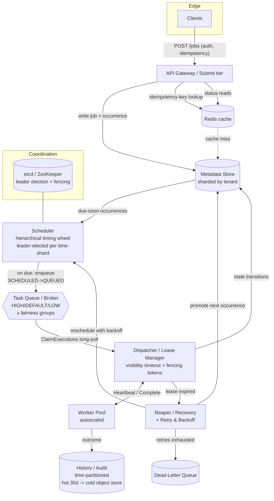

# Design a Distributed Job Scheduler / Task Queue

> Staff/principal-level HLD reference. Reader profile: senior backend engineer (Java/JVM, distributed systems) who knows the building blocks and wants the *design judgment* — requirements framing, tradeoffs, and deep dives.

---

## 1. Problem & Clarifying Questions

### 1.1 Restating the problem

We need to build a **distributed job scheduler / task queue**: a service that lets clients submit **work to be executed** — either **immediately** (enqueue-and-run-now), **at a future time** ("run this at 02:00 tomorrow"), or on a **recurring schedule** (cron-style, "every 5 minutes"). The system reliably dispatches each job to a pool of **workers**, tracks its lifecycle (pending → running → succeeded/failed), retries on failure, and exposes status to clients.

This is two systems fused into one, and a good interview answer separates them:

1. **A time-based scheduler** — the part that decides *when* a job becomes runnable. The hard problem here is efficiently tracking millions of future "fire times" and waking up exactly when each is due (the **time-wheel / priority-queue** problem).
2. **A task queue + execution fabric** — the part that takes runnable jobs and gets them executed *exactly once* (or at-least-once with idempotency), with leasing, visibility timeouts, retries, backoff, dead-letter queues, and worker-failure recovery.

The genuinely difficult sub-problems — and where a senior answer earns its signal — are: **exactly-once-effective execution**, **lease/visibility-timeout design** for worker failure, **preventing duplicate runs of scheduled jobs** (distributed locking / leader election), **fairness across tenants**, and **at-scale storage** of hundreds of millions of jobs.

### 1.2 Clarifying questions I would ask the interviewer

A senior candidate never jumps to boxes-and-arrows. I'd spend the first 5 minutes asking these, because the answers change the architecture substantially.

**Functional scope:**

- **Job types:** Do we need all three — one-off immediate, delayed/scheduled (run-at), and recurring (cron)? Or just a subset? *(This determines whether we need the time-wheel at all, or just a queue.)*
- **Execution model:** Do *we* execute the work (we own the worker pool running arbitrary code/containers), or do we just **trigger** an external endpoint (webhook / publish to a queue) and the customer runs their own logic? *(Webhook-trigger is far simpler — no sandboxing, no resource isolation. Owning execution means we're basically a serverless platform.)*
- **Delivery semantics:** Is **at-least-once** acceptable (jobs must be idempotent), or is **exactly-once-effective** a hard requirement? *(True exactly-once doesn't exist across a network; we approximate it. I want to know how much the interviewer cares.)*
- **Ordering:** Do jobs within a tenant/queue need to run in order (FIFO), or is unordered fine? *(Ordering kills parallelism and is expensive.)*
- **Job payload size:** Tiny metadata (a URL + JSON args), or large blobs? *(Large payloads → store in object storage, pass a pointer.)*
- **Cancellation / dedup:** Can clients cancel a scheduled job? Update it? Submit with a client-supplied idempotency key to dedup?
- **Visibility:** What status/history do clients need — last run, next run, full execution log, retry count?
- **Priorities:** Are there priority tiers (a high-priority job should preempt a backlog of low-priority ones)?

**Non-functional:**

- **Scale:** How many jobs scheduled per second? How many *concurrently executing*? How many *recurring* schedules registered? *(10K cron jobs vs. 1B is a different DB.)*
- **Scheduling precision:** How tight must firing be — "within 1 second of the target time" or "within a minute is fine"? *(Sub-second precision is much harder and limits batching.)*
- **Latency:** For immediate jobs, what's the acceptable enqueue→start-executing latency (p99)?
- **Availability:** Target — 99.9%? 99.99%? Is the *scheduler* allowed brief downtime if no jobs are due, or must it be always-on?
- **Durability:** If a job is accepted (we return 200), must it *never* be lost, even on full datacenter failure? *(Almost always yes — this is the whole point.)*
- **Multi-tenancy:** Single internal team, or many external tenants needing isolation + fairness + quotas?
- **Max job runtime:** Seconds, minutes, hours? *(Long-running jobs change lease design — you need heartbeats.)*

**Out of scope (confirm):**

- Workflow orchestration / DAGs (job B runs after job A) — is that needed, or are jobs independent? *(DAGs = a whole orchestration layer like Airflow/Temporal; I'll assume independent jobs unless told otherwise, and mention DAGs as an extension.)*
- The actual business logic of jobs (we provide the platform, not the work).
- Billing/metering UI.

### 1.3 Assumptions I'll proceed with

Given a top-tier-company "build the platform" framing, I'll assume the **harder, more interesting** version:

- We support **all three** job types: immediate, delayed/run-at, and recurring (cron).
- We **own the worker pool** and execute jobs (run a handler / invoke a container), but I'll design so the same core works for webhook-triggering.
- **At-least-once delivery with exactly-once-effective** via idempotency keys — we promise the job *runs to a successful completion at least once* and we *strongly avoid* duplicate side effects, but we tell clients to make handlers idempotent.
- **No strict global ordering**; best-effort priority tiers (HIGH/DEFAULT/LOW).
- **Multi-tenant** with per-tenant fairness and quotas.
- **Scheduling precision:** fire within ~1s of target (good enough for almost everything; we'll note how to tighten).
- Payloads are small metadata (≤256 KB); larger → S3 pointer.
- Max job runtime configurable, default 5 min, hard cap 1 hour with heartbeats.

---

## 2. Requirements (Finalized)

### 2.1 Functional

- **FR1 — Submit job:** `submitJob(payload, schedule_spec, options)`. `schedule_spec` is one of: `run_now`, `run_at(timestamp)`, `cron(expr, timezone)`.
- **FR2 — Idempotent submission:** optional client `idempotency_key`; resubmits within a TTL return the original job rather than creating a duplicate.
- **FR3 — Cancel / pause / resume / update** a scheduled or recurring job.
- **FR4 — Execute** the job on a worker: deliver the payload, run the handler, capture result.
- **FR5 — Retry on failure** with configurable policy (max attempts, backoff strategy).
- **FR6 — Dead-letter** jobs that exhaust retries to a DLQ for inspection/replay.
- **FR7 — Status & history:** query a job's current state, next run time, attempt count, last error, execution log.
- **FR8 — Recurring jobs** materialize the *next* occurrence after each run; "missed fire" policy (catch-up vs. skip).
- **FR9 — Priority tiers** and **per-tenant fairness** so one tenant can't starve others.
- **FR10 — Visibility timeout / leasing** so a job claimed by a dead worker is re-dispatched.

### 2.2 Non-functional

| Property | Target | Notes |
|---|---|---|
| **Durability** | No accepted job ever lost | Survive single-AZ loss; RPO ≈ 0 for accepted jobs. |
| **Availability** | 99.95% for submit/status API; 99.99% for the dispatch path | Dispatch must keep running even during deploys. |
| **Scheduling precision** | Fire within p99 ≤ 1s of target | Tunable; relax to batch. |
| **Enqueue→start latency** | p99 ≤ 2s for immediate jobs | Under normal load. |
| **Throughput** | ~50K job-submits/s peak; ~200K executions/s steady | See capacity section. |
| **Consistency** | Strong for job *metadata* (state transitions); the dispatch decision must be **linearizable enough** to avoid double-dispatch beyond idempotency tolerance. | |
| **Delivery** | At-least-once; exactly-once-effective via idempotency | True exactly-once is impossible across failures. |
| **Isolation** | Per-tenant quotas + fairness; noisy-neighbor protection | |
| **Security** | AuthN/Z per tenant, payload encryption at rest, audit log | |

### 2.3 Key explicit assumptions

- A "successful execution" = handler returns success and we durably record completion. Side-effects beyond our boundary (e.g., the handler charges a credit card) are the handler's responsibility to make idempotent; we *help* by passing a stable `execution_id`.
- Clock skew across our fleet is bounded (NTP/PTP-synced, < ~250 ms). We never rely on wall-clock comparisons between machines for correctness — only for *scheduling* decisions, and correctness comes from leases + versioned CAS (compare-and-set), not clocks.

---

## 3. Capacity Estimation

I'll size for a large multi-tenant platform. All numbers flagged as assumptions; the *method* matters more than the exact figures.

### 3.1 Workload assumptions

- **Registered recurring schedules:** 50M (each tenant has cron jobs; e.g., 500K tenants × 100 avg).
- **Total executions/day:** Recurring + one-off. Say recurring jobs average **every 15 min** → 50M × 96 fires/day = **4.8B/day** from recurring alone. Add one-off/immediate: assume **1.2B/day**. Total ≈ **6B executions/day**.
- **Average execution rate:** 6B / 86,400 s ≈ **~70K/s average**.
- **Peak factor:** ~3× (top-of-minute and top-of-hour cron alignment causes huge spikes — see §7.3). Peak ≈ **200K executions/s**.
- **Submit API (new one-off + schedule edits):** ~1.2B one-off/day / 86,400 ≈ **14K/s avg**, peak **~50K/s**.
- **Status reads:** assume 5× the executions in dashboard/poll traffic → bursty; cache-served. Budget **~300K reads/s** peak, mostly cache hits.

### 3.2 Storage

**Job/occurrence record.** Fields: `job_id` (16B), `tenant_id` (8B), `payload_ref or inline` (avg 1 KB), `schedule_spec` (200B), `state` (4B), `attempt` (4B), `next_run_at` (8B), `lease_owner`/`lease_expiry` (32B), timestamps, idempotency_key (64B), indexes overhead. Call it **~1.5 KB/record** with index amplification.

- **Recurring definitions:** 50M × 1.5 KB ≈ **75 GB** (small, easily fits, heavily cached).
- **Live/in-flight occurrences (the hot set):** at any instant, occurrences due in the next, say, 1 hour plus currently-running. If 70K/s become runnable and live ~ a few minutes each in queue+exec, in-flight ≈ 70K/s × 60s × few ≈ **tens of millions** of records. Budget **~50M hot records × 1.5 KB ≈ 75 GB** of *hot* state.
- **Execution history / audit:** 6B/day × (≈500B per history row) = **3 TB/day**. Retain 30 days hot = **~90 TB**, then tier to cold object storage (cheap, compressed) for 1 year+. History is the storage hog, not the live state.

So: **hot operational data ≈ 150–200 GB** (very cacheable, fits in a modest sharded cluster), and **history ≈ tens of TB** (append-only, time-partitioned, tierable). This split is the key storage insight: *the scheduler's working set is tiny; the audit trail is what's huge.*

### 3.3 Bandwidth

- **Ingress (submits):** 50K/s × ~1.5 KB ≈ **75 MB/s** peak.
- **Dispatch to workers:** 200K/s × ~1.5 KB ≈ **300 MB/s** (intra-DC, cheap).
- **History writes:** 6B/day × 500B = 3 TB/day ≈ **~35 MB/s** sustained.
- All comfortably within a single DC's east-west bandwidth; nothing exotic.

### 3.4 Memory / cache

- Hot live state ~150 GB. If we keep the **next-N-minutes time-wheel** in memory across the scheduler fleet, that's only the occurrences due soon — say 70K/s × 300s = ~21M entries × (≈100B in-memory) ≈ **~2 GB per full minute-horizon**, easily partitioned across ~10 scheduler nodes (~200–400 MB each). Cache (Redis) for status reads + idempotency keys: budget **~200 GB** Redis (sharded).

### 3.5 Server / shard counts

- **Metadata store (jobs):** ~200 GB hot + write rate ~250K writes/s (each execution is several state transitions). A single primary won't do 250K writes/s. Shard by `tenant_id`/`job_id`. If a shard handles ~20K writes/s comfortably → **~16 shards** for write headroom, round to **24 shards** (3× replication = 72 nodes). This is the dominant fleet.
- **Scheduler nodes (time-wheel owners):** partitioned by time-shard; ~10–20 nodes for the working horizon + standbys.
- **Dispatcher / queue brokers (e.g., Kafka/Pulsar or SQS-like):** sized for 200K msg/s × replication; ~20–40 broker nodes.
- **Workers:** depends on job duration. If avg job = 200 ms CPU and we need 200K/s → 40K job-seconds/s of work → with ~50 jobs/worker concurrency → **~800 workers** baseline, autoscaled. Long jobs balloon this; that's a customer-cost dimension.
- **API gateway / submit tier:** 50K/s, stateless, ~20 nodes behind LB.

**Takeaway numbers to remember:** ~70K exec/s avg, ~200K peak; ~50M live records / ~150–200 GB hot; ~3 TB/day history; ~24 metadata shards; ~800+ autoscaled workers; spikes at top-of-minute are the #1 capacity hazard.

---

## 4. API Design

External clients use HTTPS/REST (or gRPC internally). All calls are tenant-authenticated.

### 4.1 Job submission

```
POST /v1/jobs
Authorization: Bearer <tenant-token>
Idempotency-Key: <optional client key>     # dedup window, e.g., 24h

{
  "type": "run_at" | "run_now" | "cron",
  "schedule": {                              # one of:
     "run_at": "2026-06-26T02:00:00Z",       # for run_at
     "cron":   "*/5 * * * *",                # for cron
     "timezone": "America/New_York"          # cron only; DST-aware
  },
  "target": {                                # how the work is invoked
     "kind": "http" | "handler" | "queue",
     "url":  "https://tenant.example/run",   # for http (webhook) targets
     "handler": "image:tag / function-id",   # for owned-execution
     "queue":   "tenant-queue-name"          # for fan-out-to-queue
  },
  "payload": { ... } | "payload_ref": "s3://...",   # inline ≤256KB else ref
  "priority": "HIGH" | "DEFAULT" | "LOW",
  "retry": { "max_attempts": 5,
             "backoff": "exponential",
             "base_ms": 1000, "max_ms": 300000, "jitter": true },
  "timeout_ms": 300000,
  "dedup_ttl_s": 86400,
  "missed_fire_policy": "skip" | "catch_up"   # cron only
}

200 OK
{ "job_id": "job_01H...", "state": "SCHEDULED",
  "next_run_at": "2026-06-26T02:00:00Z", "created": true }
```

`created: false` is returned (with the existing job) if the `Idempotency-Key` matched a recent submit — the dedup guarantee.

### 4.2 Lifecycle management

```
GET    /v1/jobs/{job_id}                 -> job + current state + next_run_at
DELETE /v1/jobs/{job_id}                 -> cancel (terminal)
POST   /v1/jobs/{job_id}:pause           -> recurring: stop materializing
POST   /v1/jobs/{job_id}:resume
PATCH  /v1/jobs/{job_id}                 -> update schedule/payload/retry
GET    /v1/jobs/{job_id}/executions      -> paginated history
GET    /v1/jobs/{job_id}/executions/{exec_id}  -> single attempt detail
POST   /v1/executions/{exec_id}:replay   -> re-run a DLQ'd execution
```

### 4.3 Internal worker-facing RPCs (the dataplane)

These are the heart of the leasing protocol:

```
// Worker pulls work (long-poll). Returns leased executions.
ClaimExecutions(worker_id, queue, max=N, lease_ms=30000)
  -> [ { exec_id, job_id, payload, attempt, lease_token, lease_expiry } ]

// Worker extends lease for a still-running job (heartbeat).
HeartbeatLease(exec_id, lease_token, extend_ms)
  -> { ok, new_lease_expiry } | { lost: true }   // lost == someone else owns it

// Worker reports terminal outcome.
CompleteExecution(exec_id, lease_token, status=SUCCESS|FAILURE, result, error)
  -> { ok } | { lost: true }                      // fenced if lease expired

// Worker voluntarily gives up (e.g., shutting down).
NackExecution(exec_id, lease_token, requeue_delay_ms)
```

The `lease_token` is a **fencing token** (a monotonically increasing number issued per lease) — see §7.2; it's how we reject a zombie worker's late `Complete`.

---

## 5. High-Level Architecture

### 5.1 Component responsibilities

- **API Gateway / Submit tier (stateless):** auth, validation, quota check, idempotency-key lookup, writes the job record, returns. Pure CRUD over the metadata store.
- **Metadata store (sharded, durable):** source of truth for jobs, occurrences, leases, history pointers. Strongly consistent per shard.
- **Scheduler (time-wheel owners):** for each time-shard, holds the upcoming due times in memory (hierarchical timing wheel + a durable backing table). When an occurrence becomes due, it **enqueues** the execution into the task queue and transitions state SCHEDULED → QUEUED.
- **Task queue / broker:** durable, partitioned queues (per priority, per fairness-group). Holds runnable executions until a worker claims one.
- **Dispatcher / Lease manager:** mediates `ClaimExecutions`/`Heartbeat`/`Complete`; owns visibility-timeout and re-dispatch of expired leases. (Often co-located with the broker or implemented atop it.)
- **Worker pool (autoscaled):** pulls leased executions, runs handlers, heartbeats, reports outcome.
- **Reaper / Recovery service:** scans for expired leases and stuck states, re-queues them; also "promotes" recurring jobs to their next occurrence.
- **Retry/Backoff controller:** on failure, computes next attempt time and re-schedules (back into the time-wheel) or moves to DLQ.
- **History/audit store:** append-only, time-partitioned (e.g., Cassandra/columnar + object storage tiering).
- **Coordination service (etcd/ZooKeeper):** leader election for scheduler shards, fencing tokens, config.
- **Cache (Redis):** idempotency keys, hot status reads, rate-limit counters.

### 5.2 ASCII block diagram

```
                         ┌───────────────────────────┐
        clients ───────► │   API Gateway / Submit      │  auth, quota, idempotency
                         │       (stateless)           │
                         └───────────┬─────────────────┘
                                     │ write job + occurrence
                                     ▼
                  ┌─────────────────────────────────────────┐
                  │     Metadata Store (sharded by tenant)    │  source of truth
                  │   jobs | occurrences | leases | history*  │  strongly consistent/shard
                  └───┬───────────────┬───────────────┬──────┘
                      │ due-soon scan  │ promote next  │ status reads (cached)
                      ▼                │               ▼
        ┌──────────────────────┐      │        ┌───────────────┐
        │  Scheduler (per       │      │        │  Redis cache   │◄── status/idemp
        │  time-shard):         │      │        └───────────────┘
        │  hierarchical timing  │      │
        │  wheel in memory      │      │
        │  + leader-elected     │◄─────┘ (etcd: leader election + fencing)
        └──────────┬────────────┘
                   │ on due: enqueue execution (SCHEDULED→QUEUED)
                   ▼
        ┌──────────────────────────────────────────────┐
        │  Task Queue / Broker (durable, partitioned)    │
        │  [HIGH] [DEFAULT] [LOW]  × fairness groups      │
        └──────────┬─────────────────────────────────────┘
                   │ ClaimExecutions (long-poll, lease)
                   ▼
        ┌──────────────────────┐   Heartbeat / Complete   ┌──────────────────┐
        │  Dispatcher / Lease   │◄────────────────────────►│  Worker Pool      │
        │  Manager (visibility  │   fencing tokens          │  (autoscaled)     │
        │  timeout, fencing)    │                           │  run handler      │
        └──────────┬────────────┘                           └──────────────────┘
                   │ lease expired → re-queue
                   ▼
        ┌──────────────────────┐         exhausted retries       ┌──────────┐
        │  Reaper / Recovery     │────────────────────────────────►│   DLQ     │
        │  + Retry/Backoff ctrl  │  failure → reschedule(backoff)   └──────────┘
        └────────────────────────┘
                   │
                   ▼ append outcome
        ┌──────────────────────────────┐
        │  History/Audit (time-part.,    │  hot 30d → object storage cold tier
        │  append-only, columnar)        │
        └────────────────────────────────┘
```

### 5.3 Mermaid architecture diagram



### 5.4 Sequence — immediate job, happy path

```mermaid
sequenceDiagram
  participant Cl as Client
  participant API as API Gateway
  participant M as Metadata Store
  participant B as Broker
  participant W as Worker
  participant D as Lease Mgr
  participant H as History

  Cl->>API: POST /jobs (run_now, idempotency-key)
  API->>M: check idemp-key; INSERT job state=QUEUED (CAS)
  API-->>Cl: 200 {job_id, QUEUED}
  API->>B: enqueue execution(exec_id, attempt=1)
  W->>D: ClaimExecutions(lease=30s)
  D->>M: CAS QUEUED->RUNNING, set lease_owner, lease_token, expiry
  D-->>W: {exec_id, payload, lease_token}
  W->>W: run handler (idempotent on exec_id)
  W->>D: Heartbeat (if long) ...
  W->>D: CompleteExecution(SUCCESS, lease_token)
  D->>M: CAS RUNNING->SUCCEEDED (fenced by lease_token)
  D->>H: append outcome
```

### 5.5 Sequence — worker dies mid-job (lease expiry → re-dispatch)

```mermaid
sequenceDiagram
  participant W1 as Worker A (dies)
  participant D as Lease Mgr
  participant M as Metadata Store
  participant W2 as Worker B

  W1->>D: ClaimExecutions -> lease_token=7, expiry=T+30s
  W1->>W1: starts running... then CRASHES (no heartbeat)
  Note over D: visibility timeout elapses (T+30s)
  D->>M: find RUNNING with lease_expiry < now
  D->>M: CAS RUNNING->QUEUED, attempt unchanged, bump lease epoch
  D->>W2: redeliver exec to Worker B (lease_token=8)
  W2->>W2: run handler (same exec_id -> idempotent)
  W1-->>D: (zombie) CompleteExecution(lease_token=7)
  D-->>W1: REJECTED (stale fencing token; 8 > 7)
  W2->>D: CompleteExecution(SUCCESS, lease_token=8) -> accepted
```

---

## 6. Data Model & Storage Choices

### 6.1 Entities

**`jobs`** (the definition — one row per submitted job/schedule):

| Field | Type | Notes |
|---|---|---|
| `job_id` | ULID (PK) | sortable, time-prefixed |
| `tenant_id` | string | shard key component |
| `type` | enum | run_now / run_at / cron |
| `schedule_spec` | json | cron expr + tz, or run_at ts |
| `target` | json | http/handler/queue + ref |
| `payload` / `payload_ref` | blob / string | inline ≤256KB else S3 |
| `priority` | enum | HIGH/DEFAULT/LOW |
| `retry_policy` | json | max_attempts, backoff |
| `state` | enum | ACTIVE/PAUSED/CANCELLED |
| `idempotency_key` | string | unique per (tenant, key) within TTL |
| `next_run_at` | ts | for recurring/run_at |
| `created/updated_at` | ts | |
| `version` | int | optimistic concurrency (CAS) |

**`occurrences`** (one row per *scheduled run* — the unit the scheduler/queue tracks):

| Field | Type | Notes |
|---|---|---|
| `occ_id` / `exec_id` | ULID (PK) | the execution instance |
| `job_id` | FK | |
| `tenant_id` | string | fairness/quota |
| `due_at` | ts | when it should fire |
| `state` | enum | SCHEDULED→QUEUED→RUNNING→SUCCEEDED/FAILED/DLQ |
| `attempt` | int | retry counter |
| `lease_owner` | worker_id | |
| `lease_token` | int64 | **fencing token**, monotonic per occurrence |
| `lease_expiry` | ts | visibility timeout deadline |
| `priority`, `fairness_group` | | |
| `version` | int | CAS guard |

**`executions_history`** (append-only audit, one row per attempt): `exec_id, attempt, worker_id, started_at, finished_at, status, result_ref, error`. Time-partitioned.

**`idempotency_keys`**: `(tenant_id, key) -> job_id, created_at` with TTL.

### 6.2 State machine

```
                cancel
   SCHEDULED ───────────► CANCELLED
      │ due_at reached
      ▼
   QUEUED ──claim──► RUNNING ──success──► SUCCEEDED ──(cron)──► (new SCHEDULED)
      ▲                 │
      │ lease expiry /   │ failure (attempts left)
      │ nack / retry     ▼
      └───────────── compute backoff ──► SCHEDULED(due=now+backoff)
                        │ attempts exhausted
                        ▼
                       DLQ (FAILED-terminal)
```

Every transition is a **versioned CAS** (compare-and-set on `version`/`lease_token`): you can only move RUNNING→SUCCEEDED if you present the lease_token that currently owns the row. This is what makes duplicate completions safe.

### 6.3 Which datastore, and why

The access patterns split cleanly, so we use **different stores for different jobs** (a senior signal — don't force one DB to do everything):

**(a) Operational metadata (jobs + occurrences + leases).** Access pattern: high write rate of small records, point reads/updates by `occ_id`, frequent CAS, range scans by `due_at` within a time-shard, sharded by `tenant_id`. Needs strong per-key consistency (CAS) and low-latency writes.

| Option | Pros | Cons | Verdict |
|---|---|---|---|
| **Single RDBMS (Postgres/MySQL)** | ACID, easy CAS, rich queries, `SELECT ... FOR UPDATE SKIP LOCKED` is a great queue primitive | Single-primary write ceiling; 250K writes/s needs heavy sharding/Vitess; ops complexity at scale | Great up to mid-scale; shard for huge scale |
| **Sharded NewSQL (Spanner/CockroachDB/TiDB/Vitess)** | Horizontal writes, ACID, CAS, range scans, survives AZ loss | Cost, latency tax of distributed txns, operational maturity | **Chosen** for the metadata source-of-truth at this scale |
| **Wide-column (Cassandra/DynamoDB)** | Massive write throughput, easy sharding | Weaker multi-row transactions; CAS exists (LWT/conditional writes) but contention is costly; range-scan-by-time needs careful partitioning | Viable; LWT contention on hot leases is a risk |
| **Pure Redis** | Blazing fast | Durability/HA caveats for source-of-truth; not for billions of rows | No (use as cache only) |

**Decision:** **NewSQL (e.g., CockroachDB/Spanner-class) sharded by `tenant_id`** for the source of truth. Rationale: we need cheap per-row CAS for the lease protocol, range scans by `due_at` for the scheduler, horizontal write scaling for 250K writes/s, and AZ-failure survival for the durability SLA. *Failure mode avoided:* a single-primary RDBMS would hit a write ceiling and a single-AZ outage would lose the source of truth — violating both the throughput and durability NFRs. (If the interviewer constrains us to "no exotic DB," I fall back to **sharded MySQL/Vitess with `SKIP LOCKED`**, accepting more app-level sharding work.)

**(b) Task queue / broker.** Needs durable, partitioned, replayable delivery with consumer offsets, and per-partition ordering. Options: **Kafka/Pulsar** (high throughput, durable log, great for fan-out and replay) vs. **SQS-style hosted queue** (built-in visibility timeout + DLQ, less ops) vs. **Redis Streams** (fast, weaker durability). **Decision:** a **durable log broker (Pulsar or Kafka)** with one partition set per priority/fairness group. *Why a log, not a classic queue:* replay-ability (reprocess after a bug), high partition counts for fairness, and we layer our *own* lease/visibility on top via the Lease Manager + metadata CAS so we keep precise exactly-once-effective control. (If asked to minimize ops, SQS-FIFO/standard gives visibility-timeout + DLQ for free at the cost of less control and FIFO throughput limits.)

**(c) History/audit.** Append-only, time-series, huge volume, mostly written-once read-rarely. **Cassandra/ScyllaDB** (or BigQuery/columnar) partitioned by `(job_id, day)` with TTL, tiering cold data to **S3/object storage** (Parquet) after 30 days. *Why not the NewSQL store:* 3 TB/day would blow up cost and compaction on a transactional store; audit data needs cheap append + tiering, not CAS.

**(d) Cache & counters.** **Redis (clustered)** for idempotency keys (TTL), hot status reads, and rate-limit token buckets.

**(e) Coordination.** **etcd or ZooKeeper** for scheduler-shard leader election, fencing-token generation, and config/feature flags.

---

## 7. Deep Dives

This is the bulk. Five hard sub-problems.

---

### 7.1 Deep Dive A — Scheduling: the time-wheel vs. priority queue vs. DB-poll

**Problem.** We may have **tens of millions of future fire times**. When each becomes due (within ~1s), we must enqueue it. Naively, "store `due_at`, poll `SELECT * WHERE due_at <= now`" works but has nasty failure modes at scale.

**Option 1 — DB polling (`SELECT ... WHERE due_at <= now LIMIT N`).** Simple, durable, survives restart trivially (state is in the DB). But: (i) **polling interval vs. precision tradeoff** — poll every 1s for 1s precision = constant scan pressure; (ii) **thundering herd** — top-of-minute cron alignment means millions of rows become due in the same second, one giant scan + giant enqueue burst; (iii) needs a good index on `due_at` and partitioning to avoid scanning the world.

**Option 2 — In-memory priority queue (min-heap by `due_at`).** O(log n) insert, O(1) peek-min. A single scheduler thread sleeps until the head's `due_at`, fires it, pops, repeats. Precise and cheap *per fire*. But: (i) **memory bound** — can't hold 50M+ far-future timers; (ii) **not durable** — crash loses the heap, so it must be a *cache* over a durable table; (iii) **re-heapify cost** under churn; (iv) **single-owner** — needs partitioning + failover.

**Option 3 — Hierarchical Timing Wheel (the classic).** A timing wheel is an array of "buckets" representing time slots; a cursor advances one slot per tick (e.g., per second). Inserting a timer = O(1) (compute bucket = `due_at` mod wheel size). On each tick, you fire everything in the current bucket. **Hierarchical** wheels chain multiple wheels (seconds → minutes → hours → days) so far-future timers live in coarse upper wheels and get "cascaded down" into finer wheels as they approach — giving O(1) insert/delete and bounded per-tick work regardless of horizon. This is how Kafka's `DelayQueue`/purgatory, Netty's `HashedWheelTimer`, and Linux kernel timers work.

| Approach | Insert | Per-tick work | Memory | Precision | Durability | Spike behavior |
|---|---|---|---|---|---|---|
| DB poll | O(log n) index | full scan of due rows | low (in DB) | = poll interval | excellent (in DB) | bad (giant scans) |
| Min-heap PQ | O(log n) | O(1) peek + O(log n) pop | all timers in RAM | excellent | none (volatile) | medium |
| Hierarchical timing wheel | **O(1)** | **O(bucket size)** | only near-horizon in RAM | tick granularity | none (volatile) | **good (work spread across slots)** |

**Decision — Hybrid: hierarchical timing wheel (near horizon, in memory) backed by the durable occurrences table (far horizon).**

- The **far horizon** (jobs due > T_horizon away, e.g., > 5 min) lives **only in the DB**, indexed by `(time_shard, due_at)`.
- A **loader** periodically (every ~30s) pulls the next window `due_at ∈ [now, now+5min]` for its time-shard into the **in-memory timing wheel**, then transitions them so the loader and wheel don't double-load.
- The wheel fires with **second-level precision**; on fire it does the QUEUED transition + broker enqueue.
- **Durability:** the wheel is pure cache. On crash, a new owner reloads the window from the DB (occurrences still in SCHEDULED). *Failure mode avoided:* losing in-flight timers on crash (pure PQ) and scanning the whole table every second (pure poll).
- **Spike handling (top-of-minute):** rather than fire all million same-second timers literally simultaneously, we **spread within a tolerance window** — add deterministic jitter (e.g., bucket into the 1000 ms of that second by `hash(occ_id)`), and let the broker absorb the burst. *Failure mode avoided:* a 200K→2M instantaneous enqueue spike toppling the broker (see also §8 backpressure).

**Partitioning the scheduler.** We **time-shard + tenant-shard**: each scheduler node is the **leader** (via etcd) for a set of `(time_shard)` partitions and owns the wheel for them. Leader election ensures exactly one owner per partition (see §7.3 for the duplicate-run guarantee). Adding nodes rebalances partitions. *Why partition by time-shard derived from `occ_id` hash rather than tenant:* avoids hot tenants creating a hot scheduler; spreads top-of-minute load.

**Cron specifics.** A cron job's row stores the cron expr + IANA timezone. After each fire, the **Reaper/promoter** computes the *next* occurrence (DST-aware via the tz database — e.g., "2:30 AM daily" during spring-forward must skip or shift, never double-fire) and writes a new SCHEDULED occurrence. **Missed-fire policy:** if the scheduler was down across a fire time, on recovery either (a) `skip` to the next future occurrence, or (b) `catch_up` and fire the missed ones (capped, to avoid a recovery stampede). This is a per-job option (FR8).

---

### 7.2 Deep Dive B — Exactly-once-effective execution, leasing & visibility timeout

**Problem.** Networks partition, workers crash, messages get redelivered. We promised at-least-once with exactly-once-*effective*. The two enemies are: **(1)** a job that's claimed but never completed (worker died) — we must redeliver; **(2)** a redelivered job that a *zombie* original worker *also* still completes — we must not let stale work corrupt state or double-count.

**Leasing / visibility timeout.** When a worker claims an execution, we don't delete it from the queue; we **lease** it: set `state=RUNNING, lease_owner, lease_token, lease_expiry=now+visibility_timeout`. The execution is invisible to other workers until `lease_expiry`. If the worker completes before expiry → done. If not → the **Reaper** flips it back to QUEUED and it's redelivered. This is exactly SQS/DynamoDB's "visibility timeout" model, built here on metadata CAS.

**Choosing the visibility timeout.** Too short → false expiry of slow-but-alive jobs → duplicate runs. Too long → slow recovery from real crashes. So we make it **dynamic via heartbeats**: start with a modest timeout (e.g., 30s) and let the worker **extend** it via `HeartbeatLease` every ~10s while genuinely running. A job that needs 1 hour heartbeats its way there; a crashed worker stops heartbeating and gets reaped in ~30s. *Failure mode avoided:* picking one static timeout that's wrong for both 200 ms and 1-hour jobs.

**Fencing tokens — the crux of correctness.** A heartbeat/timeout alone doesn't stop a **paused** zombie: Worker A stalls (GC pause, network blackhole) past its lease, the job is reassigned to Worker B, then A wakes up and calls `Complete`. Without protection, A's stale `Complete` (or worse, A's stale *side-effect write*) clobbers B's work. The fix is a **fencing token**: a monotonically increasing `lease_token` issued each time the lease is (re)granted. Every state-changing operation must present its token, and the store rejects any token **less than the current** one. So A holds token 7, B holds token 8; A's late `Complete(7)` is rejected because the row now requires ≥ 8. (This is the canonical pattern from Martin Kleppmann's distributed-lock analysis.) *Failure mode avoided:* the "zombie completion" / lost-update problem that pure leases can't solve.

**Where exactly-once breaks (be honest in the interview).** We can make *our* state transitions exactly-once via CAS+fencing. We **cannot** make the *handler's external side effects* exactly-once if the handler is non-idempotent and the network can fail after the side effect but before `Complete`. Therefore:

- We pass a stable **`execution_id` (occ_id + attempt)** to the handler and **strongly recommend** handlers dedupe on it (e.g., insert-if-not-exists keyed by execution_id in their own DB, or use it as the idempotency key for downstream APIs).
- For *our* bookkeeping (history, counters, completion), exactly-once-effective is guaranteed by CAS+fencing.

**Idempotency at submission** (separate from execution idempotency): the client `Idempotency-Key` is stored uniquely per tenant; a duplicate submit returns the original `job_id` (FR2). This protects against client retries creating duplicate schedules.

**Comparison of duplicate-suppression mechanisms:**

| Mechanism | Stops worker-crash dup? | Stops zombie-completion dup? | Stops client-retry dup? | Stops handler side-effect dup? |
|---|---|---|---|---|
| Visibility timeout / lease | re-dispatches (causes a controlled dup attempt) | no | no | no |
| Fencing token + CAS | n/a | **yes** | no | no (only our state) |
| Submission idempotency key | no | no | **yes** | no |
| Handler dedup on execution_id | n/a | n/a | n/a | **yes (handler-side)** |

The full guarantee is the **stack** of all four, not any one.

---

### 7.3 Deep Dive C — Preventing duplicate runs of scheduled jobs (leader election & coordination)

**Problem.** The execution path is protected by leases. But the *scheduling* path has its own duplicate hazard: if **two scheduler nodes both think they own the same time-shard**, both will fire the same occurrence and double-enqueue. We need *exactly one* scheduler enqueuing each occurrence.

**Why "just use a distributed lock" is naive.** A lock with a TTL has the same zombie problem as a lease: node A holds the lock, GC-pauses past the TTL, node B grabs it, A wakes and acts — now both act. So locks alone don't give safety; you again need **fencing**.

**Design — partition ownership via consensus + idempotent enqueue:**

1. **Partition assignment.** Time-shards (say 4096 of them, hash of occ_id) are assigned to scheduler nodes via a **consensus-backed coordinator (etcd/ZooKeeper)** using leases with fencing epochs. Each node knows the partitions it owns and its current **epoch number**.
2. **Even if ownership briefly overlaps** (the unavoidable lock-zombie window), the **enqueue step itself is idempotent**: enqueuing transitions the occurrence `SCHEDULED → QUEUED` via **CAS on the occurrence row**. Only one CAS wins; the loser sees the row already QUEUED and drops it. So *correctness does not depend on perfect ownership* — it depends on the CAS being the single serialization point.
3. **Fencing on enqueue (defense in depth):** the QUEUED transition records the scheduler epoch; the broker/metadata rejects enqueues from a stale epoch. This stops a zombie scheduler from enqueuing a *new* occurrence after losing ownership.

So we use **two independent safety nets**: leader/partition election to *normally* prevent overlap, and **CAS-based idempotent enqueue** to *guarantee* no double-dispatch even when election is briefly wrong. *Failure mode avoided:* relying on TTL locks alone (which the lock-zombie scenario breaks) — we make the DB row the arbiter.

**Why not a single global leader scheduler?** Simpler (no overlap possible) but it's a **throughput and availability bottleneck** — one node can't fire 200K/s, and its failure stalls all scheduling until re-election. Partitioning gives horizontal scale and isolates failures to a fraction of shards. The cost is the coordination complexity above, which the CAS net makes safe.

| Approach to single-dispatch | Safe under GC/partition? | Scales? | Complexity |
|---|---|---|---|
| Single global leader | yes (no overlap) | no (one node) | low |
| TTL distributed lock only | **no** (zombie) | yes | low |
| Partition leases + CAS-idempotent enqueue (chosen) | **yes** | yes | medium |
| Partition leases + fencing + CAS | yes (belt & suspenders) | yes | medium-high |

---

### 7.4 Deep Dive D — Retries, backoff, and dead-letter queue (DLQ)

**Problem.** Handlers fail — transiently (downstream blip) or permanently (bad payload). We must retry the transient ones without (a) hammering a struggling downstream, (b) retrying forever, or (c) creating retry storms that take the system down.

**Backoff strategy.** On failure, compute `next_attempt_at = now + min(base * 2^(attempt-1), max) ± jitter`. **Exponential backoff** spaces retries out; **jitter** (randomization) prevents *synchronized* retries (the "retry storm" where 10K failed jobs all retry at the exact same future instant and re-overwhelm the downstream). We use **full jitter** (`random(0, computed_backoff)`) — the standard AWS recommendation — to maximally decorrelate. *Failure mode avoided:* thundering-herd retries amplifying an outage.

**Mechanism.** A retry is *not* a special path — it's just a **reschedule**: we set `state=SCHEDULED, due_at=next_attempt_at, attempt+=1` and the timing wheel handles it like any other future occurrence. This reuses all the scheduling machinery (one fewer subsystem to build/operate).

**Retry budget / circuit breaking per target.** Beyond per-job retries, we track **per-target failure rate** (e.g., this tenant's webhook URL is 95% failing). When a target trips a circuit breaker, we **pause dispatch to it** and back off globally for that target, rather than letting every job independently hammer it. *Failure mode avoided:* a single broken downstream consuming the whole worker pool and broker capacity with doomed retries.

**Distinguishing retryable vs. terminal failures.** Handlers return a classification (or we infer from HTTP status): 5xx/timeouts → retryable; 4xx/validation → terminal (skip retries, straight to DLQ). This avoids wasting attempts on a permanently bad payload.

**Dead-letter queue.** When `attempt > max_attempts` (or a terminal failure), the occurrence moves to **DLQ** state — it stops retrying, stays durably stored, emits an alert/metric, and is queryable + **replayable** (`POST /executions/{id}:replay`) after the operator fixes the root cause. *Failure mode avoided:* silently dropping failed jobs (data loss) **or** retrying poison messages forever (resource exhaustion). The DLQ is the pressure-relief valve that lets the rest of the system stay healthy.

**Poison-pill protection.** A job that *crashes the worker* (not just fails) is dangerous: it could be redelivered and crash worker after worker. We track **delivery count** separately from logical attempt; if an occurrence has been *delivered* far more than `max_attempts` (indicating repeated worker crashes, not handler failures), we DLQ it defensively. *Failure mode avoided:* one poison job rolling through and killing the entire worker fleet.

---

### 7.5 Deep Dive E — Fairness across tenants & at-scale storage

**Problem (fairness).** One tenant submits 10M jobs in a burst. Naively, those flood the shared queue and **starve** every other tenant's jobs behind them (head-of-line blocking). We need **fairness**: no tenant can monopolize execution capacity.

**Options:**

| Approach | Mechanism | Pros | Cons |
|---|---|---|---|
| Single shared FIFO | one queue | trivial | total starvation by a burst |
| Per-tenant queues + round-robin | one logical queue per tenant, scheduler picks round-robin | strong isolation | millions of queues = overhead; idle queues |
| Weighted fair queuing (WFQ) / DRR | virtual queues, dispatch in proportion to weights/quotas | bounded fairness, weights for tiers | more complex scheduler |
| Token-bucket admission per tenant | rate-limit *enqueue* per tenant | simple, protects backend | doesn't reorder existing backlog |

**Decision — layered:**

1. **Admission control (token bucket per tenant)** at submit time: each tenant has a refill rate + burst capacity. Excess submits are throttled (429) or queued at low priority. This caps how fast one tenant can *inject* work. *Failure mode avoided:* a single tenant filling durable storage / the broker.
2. **Deficit Round Robin (DRR) dispatch** across tenant *sub-queues* within each priority class: the Dispatcher cycles tenants, granting each a "deficit" quantum of dispatch slots proportional to its weight (paid tiers get more). A backlogged tenant gets its fair share but **cannot block** others. We avoid the "millions of physical queues" cost by using **virtual** per-tenant queues over a smaller number of broker partitions, with the DRR logic in the Dispatcher selecting which tenant's messages to lease next.
3. **Priority** is the *outer* loop (HIGH drained before DEFAULT before LOW, with anti-starvation aging so LOW eventually runs), and **fairness** is the *inner* loop within each priority.

*Failure mode avoided overall:* head-of-line blocking and noisy-neighbor starvation, while still honoring priority tiers.

**Problem (at-scale storage).** We computed ~50M live occurrences (~150–200 GB hot) and ~3 TB/day history. Keys to scaling storage:

- **Separate hot from cold (already chosen).** Live occurrences in NewSQL; history in Cassandra→S3. The hot set is small and cacheable; never let history bloat the transactional store.
- **Sharding key.** Shard occurrences by `tenant_id` for isolation/locality, *sub-sharded* by `occ_id` hash to avoid a mega-tenant hot shard. The scheduler's range scans are by `(time_shard, due_at)` — a **secondary index / dedicated table** keyed by time so we never scan a tenant's whole history to find due jobs.
- **Avoid index hot-spots.** A monotonically increasing `due_at` index can hot-spot the "now" end. Mitigate by **time-bucketing** (`due_minute` bucket + hash prefix) so writes/reads spread across the keyspace — the standard "salt the timestamp" technique.
- **TTL + tiering.** Occurrences in terminal states (SUCCEEDED/CANCELLED) are summarized into history and **TTL-expired** from the hot store within hours. History rolls to **Parquet on S3** after 30 days, queried via a batch engine when needed. *Failure mode avoided:* unbounded growth of the hot store eventually killing write latency and cost.
- **Big payloads** go to object storage with a pointer in the record, keeping rows small and the hot store dense.

---

## 8. Scaling & Bottlenecks

**How it scales (each tier independently):**

- **Submit API:** stateless → scale horizontally behind an LB. Bottleneck is downstream writes, not the API itself.
- **Metadata store:** sharded by tenant/occ_id hash; add shards for write throughput. This is the **primary scaling axis** and the most expensive.
- **Scheduler:** partitioned by time-shard; add nodes to own more partitions. CPU/memory bound by near-horizon timer count.
- **Broker:** add partitions/brokers for throughput; fairness groups map to partition sets.
- **Workers:** autoscale on queue depth + age-of-oldest-message (not just CPU) — the most important worker autoscaling signal.

**Where it breaks first, in order:**

1. **Top-of-minute / top-of-hour cron spikes (#1 hazard).** Millions of jobs share aligned fire times. *Fix:* deterministic intra-second jitter on `due_at` (§7.1), broker as a shock absorber, and **backpressure** — if the broker is saturated, the scheduler *slows enqueue* and lets the time-wheel hold (jobs fire a few seconds late, within tolerance) rather than topple downstream. We *shed precision before we shed reliability*.

2. **Hot tenant / hot shard.** One tenant or one `due_at` bucket overwhelms a shard. *Fix:* sub-shard by occ_id hash, salt the time index, DRR fairness + token-bucket admission (§7.5).

3. **Metadata write amplification.** Each execution causes multiple CAS writes (QUEUED→RUNNING→SUCCEEDED + heartbeats + history). At 200K/s that's ~1M+ writes/s. *Fix:* batch heartbeats, write history asynchronously to the cheap store (not the transactional one), and coalesce transitions where safe.

4. **Reaper scan cost.** Scanning for expired leases across 50M rows is expensive if done naively. *Fix:* index/partition by `lease_expiry`, scan only the "expiring soon" window, and shard the reaper by partition.

5. **Status-read storm.** Dashboards polling job status. *Fix:* serve from Redis cache; push updates via webhooks/SSE instead of polling where possible.

6. **Worker pool saturation by long/poison jobs.** *Fix:* per-tenant concurrency caps, timeouts, circuit breakers, poison-pill detection (§7.4).

---

## 9. Reliability, Consistency & Security

**Durability.** Every accepted job is written to a **replicated, multi-AZ** store before we return 200. Broker messages are replicated (RF≥3, acks=all). RPO ≈ 0 for accepted jobs; surviving single-AZ loss is built into the NewSQL + broker replication. The timing wheel is *never* the source of truth — it's reconstructable from the DB.

**Availability.** Stateless tiers behind LBs across AZs. Scheduler partitions fail over via etcd leader election (seconds). Brokers tolerate node loss. The **dispatch path** (broker + workers + lease manager) is decoupled from the **submit path**, so a submit-tier outage doesn't stop already-scheduled jobs from running, and a scheduler hiccup doesn't lose state (jobs just fire slightly late). Deploys are rolling; partition ownership drains gracefully.

**Consistency model.** Job/occurrence **state transitions are linearizable per occurrence** (single-row CAS in the NewSQL store with fencing). Across occurrences, no global ordering is promised. Reads of status may be **eventually consistent** when served from cache (acceptable for dashboards); the authoritative read goes to the store. This is the right tradeoff: correctness lives in per-row CAS; staleness is confined to non-critical status reads.

**Idempotency (recap, end-to-end).**
- *Submit:* client `Idempotency-Key` dedups job creation.
- *Schedule→enqueue:* CAS SCHEDULED→QUEUED dedups double-dispatch.
- *Execute:* lease + fencing token dedups zombie completions.
- *Handler:* stable `execution_id` enables handler-side dedup of external side effects.

**Failure handling matrix:**

| Failure | Detection | Response |
|---|---|---|
| Worker crash mid-job | lease_expiry passes, no heartbeat | Reaper re-queues; fencing rejects zombie Complete |
| Scheduler node crash | etcd lease loss | partitions reassigned; new owner reloads window from DB |
| Broker node loss | replication | partition leadership moves; no message loss (acks=all) |
| Metadata shard down | health checks | reads from replica; writes pause for that shard (degrade, don't corrupt) |
| Poison job crashing workers | delivery-count threshold | DLQ defensively |
| Downstream target failing | per-target error rate | circuit breaker pauses dispatch to it |
| Whole AZ loss | infra signal | multi-AZ replicas keep serving; RPO≈0 |

**Security.**
- **AuthN:** tenant API tokens / mTLS for internal RPCs; workers authenticate to the lease manager.
- **AuthZ:** per-tenant scoping — a tenant can only see/modify its own jobs; RBAC for admin/replay operations.
- **Multi-tenant isolation:** quotas, fairness (§7.5), and *payload sandboxing* if we run arbitrary code (gVisor/Firecracker microVMs, network egress controls) — critical when "we own execution."
- **Data protection:** payloads encrypted at rest (KMS-managed keys, per-tenant), TLS in transit. Secrets in payloads referenced, not stored inline where avoidable.
- **Abuse / rate limiting:** token-bucket admission per tenant (also a fairness mechanism); global circuit breakers; audit log of all submit/cancel/replay actions for forensics and compliance.
- **SSRF guard:** for `http`-target jobs (webhooks), validate/deny-list internal IP ranges so a tenant can't make us call internal services.

---

## 10. Extensions & Follow-ups

Realistic curveballs an interviewer adds, and how each changes the design:

1. **Workflow DAGs (job B after job A; fan-out/fan-in).** Adds an **orchestration layer** (a workflow engine like Temporal/Cadence or Step Functions) on top: jobs become *activities*; the engine tracks DAG state and schedules downstream nodes when upstreams complete. Our scheduler/queue becomes the *activity executor*. Requires durable workflow state + event sourcing for replay.

2. **Exactly-once *side effects* (not just effective).** Generally impossible without cooperation, but achievable via the **transactional outbox** pattern (handler writes its side-effect + a dedup record in one local transaction) or **two-phase commit** with cooperating downstreams. Cost: tighter coupling, latency. We'd document the limits honestly.

3. **Sub-second / real-time precision.** Shrink the wheel tick to milliseconds, reduce batching, possibly dedicate hot partitions, and tighten clock sync (PTP). Tradeoff: less batching → higher per-fire cost → lower max throughput.

4. **Geo-distribution / multi-region.** Either **regional sharding** (jobs pinned to a home region, fail over to a paired region) or **active-active** with a global metadata store (Spanner-class) — the latter pays a write-latency tax for cross-region consensus. Cron timezone handling and "where does it run" become first-class.

5. **Backfills / catch-up after long downtime.** A flood of missed cron fires. Per-job `missed_fire_policy` (skip vs. capped catch-up) + global rate-limit on catch-up enqueues so recovery doesn't stampede.

6. **Job priorities with preemption.** Today HIGH drains first; true preemption (kill a running LOW to free a slot for HIGH) needs cancellable workers + checkpointing — usually not worth it; we'd push back unless there's a hard SLA reason.

7. **Per-job concurrency limits / singleton jobs** ("only one instance of job X running at a time"): enforce via a per-job CAS lock on a `running_count`, or a distributed semaphore keyed by job_id.

8. **Webhook-only mode (we don't own execution).** Drops the worker pool + sandboxing entirely; the "worker" becomes an HTTP caller fleet with the same lease/retry/backoff/DLQ semantics. Much simpler; common for products like cron-as-a-service.

9. **Exactly-once *delivery* requirement.** Push back: it's at-least-once + idempotency in practice; explain why and where the impossibility bites (the gap between side effect and ack).

---

## 11. Interview Q&A

**Q1. Why a timing wheel instead of just polling the DB by `due_at`?**
Polling forces a precision-vs-load tradeoff (poll every second for second-precision = constant heavy scans) and behaves terribly under top-of-minute cron spikes (one giant scan + burst). A **hierarchical timing wheel** gives O(1) insert/delete, bounded per-tick work independent of horizon, and second-level precision cheaply — but it's volatile, so we back it with the durable occurrences table and only load the near horizon into memory. We get the wheel's efficiency *and* the DB's durability.
*Probe — what if the scheduler crashes?* The wheel is pure cache; a new partition owner reloads the `[now, now+horizon]` window from the DB (jobs still in SCHEDULED). No timers lost.
*Probe — how do you handle 5M jobs all due at 00:00:00?* Deterministic intra-second jitter spreads them across the second; the broker absorbs the burst; if downstream saturates we apply backpressure and fire a few seconds late (within tolerance) — shedding precision before reliability.

**Q2. How do you prevent the same scheduled job from running twice?**
Two layers. (1) **Partition ownership** via consensus (etcd) so normally one scheduler owns each time-shard. (2) Critically, the enqueue is an **idempotent CAS** SCHEDULED→QUEUED on the occurrence row — even if ownership briefly overlaps (the unavoidable lock-zombie window), only one CAS wins. Correctness lives in the CAS, not in the lock.
*Probe — why isn't a distributed lock enough?* A TTL lock has the zombie problem: a GC-paused holder can act after its lock expired and another node took over. We add **fencing tokens** + CAS so stale actors are rejected.

**Q3. Walk me through exactly-once execution. Is it really exactly-once?**
We provide **at-least-once with exactly-once-effective**. Our *state transitions* are exactly-once via per-row CAS + fencing tokens (a zombie worker's late `Complete` is rejected because its token is stale). But the *handler's external side effects* can't be exactly-once if the network fails between the side effect and the ack — so we pass a stable `execution_id` and require handlers to dedup on it. True exactly-once delivery across a network is impossible; we're honest about where the seam is.
*Probe — give the zombie scenario.* Worker A leases (token 7), GC-stalls past its lease, job reassigned to B (token 8), A wakes and calls Complete(7) → rejected since the row requires ≥8. B's Complete(8) wins.

**Q4. How do you handle a worker that dies mid-execution?**
**Visibility timeout / leasing:** a claimed job stays in the store as RUNNING with a `lease_expiry`. Live workers **heartbeat** to extend it (so a legit 1-hour job survives). A dead worker stops heartbeating; after the timeout the **Reaper** flips it back to QUEUED and it's redelivered to another worker, idempotent on `execution_id`.
*Probe — short vs long timeout?* Dynamic: short base timeout (~30s) extended by heartbeats — so we recover fast from real crashes without falsely expiring slow-but-alive jobs.

**Q5. (Senior signal — tradeoff) Why NewSQL for metadata instead of Cassandra/Dynamo, given the write volume?**
The lease protocol needs cheap, frequent **single-row CAS** with strong consistency, plus range scans by `due_at`. Wide-column stores do CAS (LWT/conditional writes) but contention on hot lease rows is expensive and multi-row consistency is weak. NewSQL gives ACID CAS, range scans, horizontal write scaling, and AZ-failure survival in one package. The tradeoff is cost and distributed-transaction latency, which we accept because correctness (no double-dispatch, no lost updates) is the core value. If forced off exotic DBs, I'd shard MySQL/Vitess and use `SELECT ... FOR UPDATE SKIP LOCKED`.

**Q6. (Senior signal — tradeoff) Why not one global leader scheduler — it trivially prevents duplicates?**
It does prevent overlap, but it's a throughput ceiling (one node can't fire 200K/s) and an availability single point (its failure stalls all scheduling until re-election). Partitioning by time-shard scales horizontally and isolates failures, and the **CAS-idempotent enqueue** makes partitioning *safe* even when ownership briefly overlaps. We trade simplicity for scale + availability, buying back safety with the CAS.

**Q7. How does fairness work — stop one tenant starving others?**
Layered: **token-bucket admission** per tenant caps injection rate; **Deficit Round Robin** across virtual per-tenant queues dispatches each tenant its fair share within a priority class, so a backlogged tenant can't head-of-line-block others; **priority tiers** are the outer loop with aging so LOW doesn't starve forever.
*Probe — millions of tenants = millions of queues?* Virtual queues over a bounded set of broker partitions; the DRR selection logic lives in the dispatcher, not in physical queues.

**Q8. Retries — how do you avoid a retry storm taking down a flaky downstream?**
**Exponential backoff with full jitter** decorrelates retries so failed jobs don't all retry at the same instant. A retry is just a reschedule back into the timing wheel. **Per-target circuit breakers** pause dispatch to a downstream that's broadly failing instead of letting every job hammer it. Exhausted/terminal failures go to a **DLQ** (durable, alertable, replayable) so we neither drop jobs nor retry poison forever.
*Probe — poison pill crashing workers?* Track delivery count separately from logical attempts; if a job is delivered far more than max_attempts (repeated worker crashes), DLQ it defensively so it can't roll through the fleet.

**Q9. (Senior signal — tradeoff) What's your consistency model, and where do you accept staleness?**
**Linearizable per-occurrence** for state transitions (single-row CAS + fencing) — that's where correctness must be exact. **No global ordering** across occurrences (would kill parallelism). **Eventually consistent** status reads from cache for dashboards (staleness is harmless there); authoritative reads hit the store. We concentrate strong consistency exactly where double-runs/lost-updates would hurt and relax it everywhere it's safe.

**Q10. How do you store billions of jobs cost-effectively?**
Split hot from cold: the **working set is tiny** (~150–200 GB of live occurrences, heavily cacheable) in NewSQL; the **3 TB/day history** is the hog and goes to a cheap append-only store (Cassandra) tiering to **Parquet on S3** after 30 days. Terminal occurrences TTL out of the hot store within hours. Salt the `due_at` time index to avoid the "now"-end hot spot, and store large payloads in object storage with a pointer.

---

## 12. Cheat-Sheet & Self-Test

**Key numbers:** ~6B exec/day → ~70K/s avg, **~200K/s peak** (3× from cron alignment). Submit ~14K/s avg, ~50K peak. Hot live state ~50M records / **~150–200 GB** (cacheable). History **~3 TB/day** → 30d hot → S3 cold. ~**24 metadata shards** (RF3), ~10–20 scheduler nodes, ~20–40 brokers, **~800+ autoscaled workers**.

**Key decisions (one-liners):**
- **Scheduling:** hierarchical timing wheel (near horizon in RAM) backed by durable occurrences table (far horizon). O(1) insert, durable on crash, spike-jittered.
- **No-double-dispatch:** partition ownership (etcd) **+ idempotent CAS** SCHEDULED→QUEUED. CAS is the arbiter, not the lock.
- **Exactly-once-effective:** lease + **fencing token** (reject stale tokens) for our state; stable `execution_id` for handler-side dedup. Honest about the network seam.
- **Worker failure:** visibility timeout + heartbeats (dynamic lease) + Reaper re-dispatch.
- **Retries:** exponential backoff + **full jitter**, reschedule via the wheel, per-target circuit breaker, **DLQ** for exhausted/poison.
- **Fairness:** token-bucket admission + **Deficit Round Robin** over virtual tenant queues, priority outer loop with aging.
- **Storage:** NewSQL (CAS + range scans + AZ-survival) for hot metadata; Cassandra→S3 for history; Redis for cache/idempotency/rate-limits; durable log broker for the queue.

**Diagram in words:** Clients → stateless API (auth/quota/idempotency) → NewSQL source-of-truth (sharded). A leader-elected, time-sharded **scheduler** keeps the near-future fire times in an in-memory **timing wheel**; when a job is due it **CAS-enqueues** it into a partitioned durable **broker** (priority × fairness groups). Autoscaled **workers** long-poll, **lease** with a **fencing token**, **heartbeat** while running, and report outcome via CAS (stale tokens rejected). A **Reaper** re-dispatches expired leases, applies **backoff retries** through the wheel, promotes the next **cron** occurrence, and dead-letters exhausted/poison jobs. Outcomes append to a tiered **history** store; status reads serve from **Redis**.

**Self-test (no answers):**
1. Your timing wheel holds the next 5 minutes. A client submits a job due in 5 minutes + 1 second, then immediately cancels it. Trace exactly which components touch which rows, and where the cancel could race the loader.
2. A tenant registers a cron `"0 2 * * *"` in `America/New_York`. Walk through what happens on the spring-forward DST night when 02:00–02:59 doesn't exist, and on the fall-back night when it occurs twice.
3. The metadata store's `due_at` index becomes a write hot-spot at exactly the top of every minute. Propose two independent mitigations and state the read-path cost each imposes.
4. A worker is network-partitioned from the lease manager but *can still reach the downstream*. It completes the side effect, then its lease expires and the job is re-run elsewhere. Exactly what prevents a double charge, and what doesn't?
5. You must add "no more than one instance of job X may run concurrently" without a global scheduler. Design the mechanism and identify its failure mode under a GC pause.

---

*End of design.*
