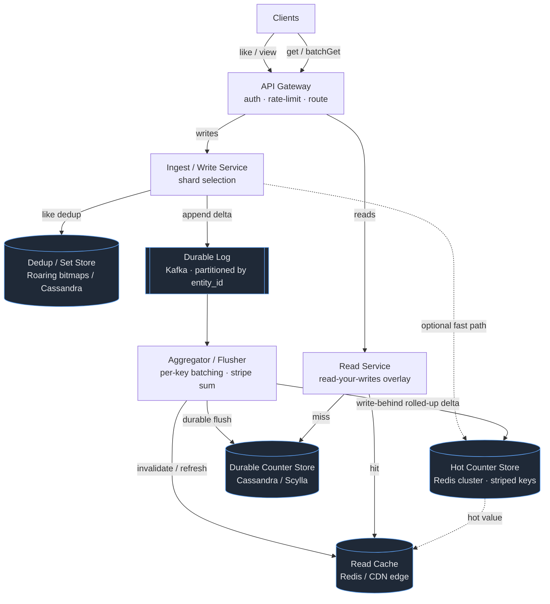
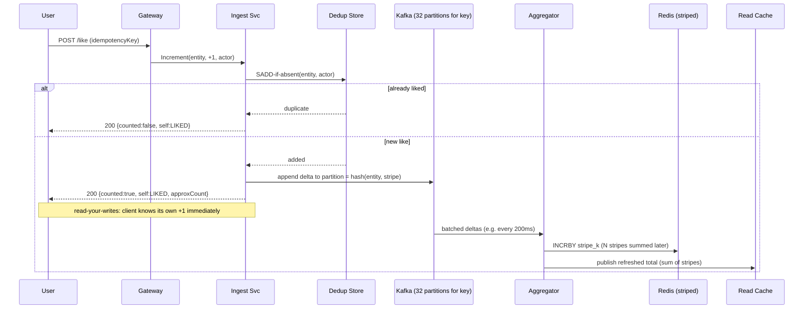

# Design a Distributed Counter (Likes / Views)

> **Category:** Storage & Infrastructure
> **Level:** Senior / Staff system-design round
> **Reader:** Senior backend engineer (Java/JVM, distributed systems) practising HLD.

This document teaches the *design judgment* behind a distributed counter: what to clarify, where the real difficulty lives (hot keys, contention, durability, eventual consistency of a displayed number), and how to defend every decision against a named failure mode.

---

## 1. Problem & Clarifying Questions

### 1.1 Restating the problem

We need a service that **counts events at massive scale** — likes on a post, views on a video, claps, retweet counts, reaction tallies — and **serves the current count back** to clients with low latency. The canonical hard example is the **celebrity post**: a single entity (a tweet, a Reels video, a Cricket World Cup live stream) receiving **hundreds of thousands of increments per second** against *one logical key*, while simultaneously being read by tens of millions of viewers.

A naive `UPDATE counters SET value = value + 1 WHERE id = ?` works fine for a blog with 12 likes and collapses immediately for a key with 500K writes/sec — every writer contends on the same row lock. The art of this design is **decomposing one hot logical counter into many independent physical counters**, batching writes, and choosing exactly how *stale* and *approximate* the displayed number is allowed to be.

### 1.2 Questions I'd ask the interviewer (before drawing anything)

A senior candidate spends the first 3–5 minutes here. The answers reshape the entire design.

**Functional scope**
1. **What are we counting?** Likes (idempotent per user — a user can like once), views (often *non*-idempotent or loosely deduped), or both? Idempotency requirements change the data model dramatically. *(Likes need per-user dedup; views usually don't.)*
2. **Can a count go down?** Unlikes / un-reactions mean we need increment **and** decrement, which rules out some monotonic-only optimizations (e.g., naive HyperLogLog, append-only logs that only ADD).
3. **Do we need the *set of who liked*, or just the *number*?** "Who liked this" (the member list) is a fundamentally different and heavier problem than "how many liked this" (the scalar). I'll assume **scalar count is the primary product**, with the member set being a secondary, lower-SLA feature.
4. **One counter per entity, or many dimensions?** e.g., views *per country*, *per hour*, likes *per reaction-type* (👍 ❤️ 😂). Dimensionality multiplies the key space.
5. **Exact or approximate?** Is "1.2M likes" acceptable when the true value is 1,203,847? Display tolerance for large numbers is usually generous; for small numbers (a post with 3 likes shown as 5) it is not.

**Non-functional**
6. **Read latency / freshness SLA?** Is a 1–5 second lag on the displayed count acceptable? (Almost always yes for social counters.) What about the *liking user's own view* — must they see their own like reflected instantly (read-your-writes)?
7. **Write durability:** if we lose 50 ms of buffered increments during a crash, is that tolerable? For likes on a celebrity post, losing a few hundred out of millions is usually fine; for "number of paid purchases" it is **not** (different system — that's a ledger, not a counter).
8. **Availability target?** 99.9% vs 99.99%? Counters are typically *availability-over-consistency* (AP) — better to show a slightly stale number than to error out.
9. **Scale:** peak global write QPS, peak read QPS, number of distinct counted entities, hottest single-key write rate.

**Out-of-scope confirmation**
10. Are **financial/ledger counters** (wallet balance, inventory decrement) in scope? These demand exact, strongly-consistent, auditable accounting — a different design. I'll **exclude** them.
11. Is the **anti-fraud / bot-filtering** of fake likes in scope? I'll treat it as an upstream concern feeding our ingest, not our core.

### 1.3 Assumptions I'll proceed with

| # | Assumption | Rationale |
|---|------------|-----------|
| A1 | We serve **scalar counts** (likes, views) for social content. Member-set ("who liked") is a secondary feature. | Keeps the core problem crisp. |
| A2 | **Approximate + eventually consistent** display is acceptable for large counts; **exact** for small counts. | Matches real products (Twitter/X, YouTube, Instagram). |
| A3 | **Read-your-writes** required for the *acting user* (you must see your own like instantly), but global propagation can lag 1–10 s. | The single most important UX nuance. |
| A4 | Likes are **idempotent per (user, entity)**; views are **fire-and-forget** with optional coarse dedup. | Two ingest paths. |
| A5 | Losing a small fraction (<0.01%) of in-flight increments on a node crash is tolerable for views; likes get higher durability. | Drives buffering/WAL choices. |
| A6 | Not a ledger. No money. | Excludes exact-accounting requirements. |

---

## 2. Requirements (Finalized)

### 2.1 Functional
- **FR1 — Increment:** `incr(entity_id, type, delta)` where delta is typically +1 (like/view) or −1 (unlike). Must support high concurrency on a single `entity_id`.
- **FR2 — Read:** `get(entity_id, type) → count` returning the current (eventually consistent) total.
- **FR3 — Idempotent likes:** a given `(user_id, entity_id)` like contributes **at most once**, even under client retries.
- **FR4 — Read-your-writes** for the acting user immediately after their action.
- **FR5 — Batch read:** `getMany([entity_ids])` for a feed/timeline rendering 50 posts at once.
- **FR6 (secondary) — Dimensional counts:** views per time-bucket / per region (lower SLA).

### 2.2 Non-functional

| Property | Target | Notes |
|----------|--------|-------|
| **Read latency** | p99 < 10 ms (from cache) | Reads dominate; must be cache-served. |
| **Write latency** | p99 < 50 ms (accepted into buffer) | "Accepted" ≠ "globally visible". |
| **Display freshness** | ≤ 1–10 s lag for global count | Tunable; tighter for the acting user. |
| **Availability** | 99.99% on read, 99.9% on write | AP system — degrade to stale reads, never hard-fail. |
| **Durability** | likes: lose < 1 in 10⁶; views: lose < 1 in 10⁴ | Tiered by event type. |
| **Consistency** | Eventual (global), read-your-writes (self) | Convergent, monotonic where possible. |
| **Hot-key ceiling** | sustain ≥ 1M incr/sec on a single logical key | The defining requirement. |

### 2.3 Explicit non-goals
- Exact financial accounting (ledgers).
- Storing/serving the full member list as primary (offered as a degraded secondary feature).
- Real-time fraud detection (assumed upstream).

---

## 3. Capacity Estimation

I'll size for a large social platform. **All numbers are assumptions flagged as such; the arithmetic is what matters in the interview.**

### 3.1 Inputs (assumed)
- **Daily Active Users (DAU):** 500M.
- **Likes per user per day:** 20 → **10B likes/day**.
- **Views per user per day:** 200 (videos, images, profile views) → **100B views/day**.
- **Reads (count displays):** every feed item rendered shows a count. Assume 30 feed-item renders/user/day × 500M = **15B count-reads/day**, but feeds batch 50 at a time, so individual count fetches ≈ same order. We'll treat **reads ≈ 10× writes** at the count-fetch layer, but most are cache hits.

### 3.2 Write QPS

```
Total write events/day = 10B likes + 100B views = 110B/day
Seconds/day            = 86,400
Average write QPS      = 110e9 / 86,400 ≈ 1.27M writes/sec
Peak factor            = 3×  (evening prime time, viral events)
Peak write QPS         ≈ 3.8M writes/sec
```

### 3.3 Read QPS

```
Count-reads/day ≈ 10 × writes  (conservative; feeds re-render)
                ≈ 1.1 trillion/day  → average ≈ 12.7M reads/sec
Peak read QPS   ≈ 38M reads/sec
Cache hit ratio target ≥ 99%  → backend (origin) reads ≈ 380K/sec at peak
```

**Takeaway:** reads are ~10× writes and *must* be served almost entirely from an in-memory cache; only a sliver (~1%) ever touches durable storage.

### 3.4 Hot-key estimation (the real constraint)

A viral video during a major live event:
```
Single video: 50M concurrent viewers, 30% like it within 10 minutes
Likes        = 15M over 600 s → 25K likes/sec average on ONE key
Peak burst   = 5× → 125K likes/sec on ONE key
Views on same key: 50M viewers refreshing → easily 200K–1M view-incr/sec
```
A single Redis node tops out around **100K–200K ops/sec** for simple commands; a single relational row under contention manages **maybe a few thousand serialized updates/sec**. So **one key can exceed one node's capacity by 5–50×** → we *must* shard a single logical counter across many physical counters. This is the central design driver.

### 3.5 Storage

**Counter values (the scalars):**
```
Distinct counted entities (lifetime): say 50B (posts/videos/comments × counter types)
Per entity: key (~40 B) + count (8 B) + metadata/TTL (~30 B) ≈ 80 B
Hot/warm working set: ~5% active = 2.5B entities
Cache memory (active): 2.5e9 × 80 B ≈ 200 GB  → with sharding & overhead ~ 400 GB across cluster
Durable store (all 50B): 50e9 × ~100 B ≈ 5 TB (before replication)
                         × 3 replicas ≈ 15 TB
```

**Idempotency / dedup data (likes only — "who liked"):**
```
Total like edges (lifetime): say 5 trillion (10B/day × ~years, but assume 5e12)
Per edge (compact): (user_id 8B, entity_id 8B) packed ≈ 20 B w/ overhead
Storage: 5e12 × 20 B = 100 TB before replication → ~300 TB replicated
```
This dwarfs the scalar store. **Decision implication:** keep the *scalar count* and the *membership/dedup set* in **separate stores** — they have different size, access, and SLA profiles. (Deep dive §7.4.)

### 3.6 Bandwidth

```
Write ingest: 3.8M writes/sec × ~120 B/event (over wire incl. headers) ≈ 456 MB/sec ≈ 3.6 Gbps
Read serve:   38M reads/sec × ~60 B/response ≈ 2.3 GB/sec ≈ 18 Gbps (mostly from cache/CDN edge)
```
Reads dominate bandwidth → push counts to **edge caches/CDN** where freshness SLA allows.

### 3.7 Server / shard counts (rough)

- **Write ingest tier:** each stateless ingest node handles ~50K req/sec → 3.8M / 50K ≈ **76 nodes** + headroom → ~120 nodes across regions.
- **Counter store (Redis-like) for hot/warm scalars:** 400 GB working set, but sized by **ops** not memory at peak. 3.8M writes/sec aggregated + internal fan-out. With per-node ~150K ops/sec and replication, ≈ **40–80 shards** (primary) × replicas.
- **Durable store (Cassandra/Scylla):** sized for 15 TB + ~380K origin-read/sec + write-back flushes. ~**30–60 nodes**.
- **Dedup set store (likes membership):** 300 TB → the largest fleet, ~**hundreds of nodes** (Cassandra/Scylla or a bitmap/Roaring store).

These are order-of-magnitude; the interviewer wants to see you derive them, not memorize them.

---

## 4. API Design

Internal RPCs (gRPC-style) behind an API gateway. Counts are exposed to clients via a thin read API + CDN.

### 4.1 Write path

```
// Idempotent like (dedup by user)
POST /v1/counters/{entityId}/like
Body: { "userId": "u_123", "type": "LIKE", "op": "ADD" | "REMOVE", "idempotencyKey": "uuid" }
→ 200 { "counted": true|false, "selfState": "LIKED"|"UNLIKED", "approxCount": 1203847 }
   // counted=false means this like was a duplicate (already liked)

// Fire-and-forget view (non-idempotent or loosely deduped)
POST /v1/counters/{entityId}/view
Body: { "type": "VIEW", "viewerHint": "anon_or_user", "sessionId": "..." }
→ 202 Accepted   // async, no count returned by default
```

`incr` RPC (internal):
```
rpc Increment(IncrementReq) returns (IncrementResp)
message IncrementReq {
  string entity_id = 1;
  string counter_type = 2;   // LIKE | VIEW | CLAP ...
  sint64 delta = 3;          // +1 / -1
  string idempotency_key = 4;
  string actor_id = 5;       // for dedup + read-your-writes
}
message IncrementResp {
  bool   applied = 1;        // false if deduped
  int64  approx_count = 2;   // best-effort current value
}
```

### 4.2 Read path

```
GET /v1/counters/{entityId}?type=LIKE&actorId=u_123
→ 200 {
    "entityId": "p_999",
    "type": "LIKE",
    "count": 1203847,          // eventually-consistent global total
    "selfState": "LIKED",      // actor's own state (read-your-writes)
    "asOf": "2026-06-25T10:00:01Z",
    "exact": false             // signals UI to render "1.2M"
  }

// Batch (feed rendering)
POST /v1/counters:batchGet
Body: { "actorId":"u_123", "keys":[ {"entityId":"p_1","type":"LIKE"}, ... up to 100 ] }
→ 200 { "results":[ {"entityId":"p_1","type":"LIKE","count":42,"selfState":"NONE"}, ... ] }
```

**Design notes:**
- **`idempotencyKey`** lets clients safely retry a like over a flaky mobile network without double-counting.
- **`actorId` on reads** is what powers read-your-writes: the read path overlays the actor's own pending action on top of the (possibly stale) global count.
- Views return **202 Accepted** — we don't make the client wait on a count they rarely read precisely.

---

## 5. High-Level Architecture

### 5.1 Request flow (narrative)

1. **Client** issues a like/view → **API Gateway** (auth, rate-limit, routing).
2. Gateway routes to the **Ingest/Write service** (stateless). For likes it first checks the **Dedup layer** (has this user already liked?). If new, it emits an increment.
3. Increment is **not** applied directly to one row. It is either (a) appended to a **durable log (Kafka)** partitioned by `entity_id`, and/or (b) applied to a **sharded in-memory counter** (one of N stripes for that key). This is the contention-killer.
4. **Aggregator/Flusher** consumers read the log / scan the stripes, **batch** increments per key, and write rolled-up deltas to the **Counter Store** (Redis cluster for hot, Cassandra/Scylla for durable cold).
5. **Read service** serves counts from a **read cache** (Redis/edge), falling back to the durable store. It overlays the actor's read-your-writes state.
6. A **CDN/edge cache** absorbs the bulk of read traffic for popular entities with a short TTL.

### 5.2 ASCII block diagram

```
                           ┌──────────────────────────────────────────────┐
                           │                    CLIENTS                     │
                           └───────────────┬───────────────┬───────────────┘
                                 writes     │               │   reads
                                            v               v
                                  ┌───────────────────────────────────┐
                                  │            API GATEWAY              │
                                  │  (auth, rate-limit, routing)        │
                                  └───────┬─────────────────┬───────────┘
                              like/view   │                 │  get/batchGet
                                          v                 v
                       ┌───────────────────────┐   ┌────────────────────────┐
                       │   INGEST / WRITE SVC   │   │      READ SERVICE       │
                       │  - like dedup check    │   │  - cache lookup         │
                       │  - shard selection     │   │  - read-your-writes     │
                       │    (key -> stripe)     │   │    overlay              │
                       └───┬───────────┬────────┘   └──────┬───────────┬─────┘
                  dedup    │           │ increments        │ hit       │ miss
                  check    v           v                   v           v
            ┌──────────────────┐  ┌──────────────────┐  ┌────────┐  ┌──────────────────┐
            │  DEDUP / SET STORE│  │  DURABLE LOG     │  │ READ   │  │  COUNTER STORE   │
            │  (who liked:      │  │  (Kafka,         │  │ CACHE  │  │  hot: Redis      │
            │   Roaring bitmaps │  │   part. by       │  │ Redis/ │  │  cold: Cassandra │
            │   / Cassandra)    │  │   entity_id)     │  │ CDN    │  │  / Scylla        │
            └──────────────────┘  └────────┬─────────┘  └───▲────┘  └────────▲─────────┘
                                           │                │                │
                                           v                │ refresh        │ flush
                                  ┌──────────────────────┐  │ (pub/sub)      │ rolled-up
                                  │  AGGREGATOR / FLUSHER │  │                │ deltas
                                  │  - per-key batching   │──┴────────────────┘
                                  │  - stripe summation   │
                                  │  - write-behind       │
                                  └──────────────────────┘
```

### 5.3 Mermaid diagram



### 5.4 Sequence — like a celebrity post (hot key)



---

## 6. Data Model & Storage Choices

### 6.1 Entities

**Scalar counter (the number):**
```
CounterKey   = (entity_id, counter_type)         // e.g. ("p_999","LIKE")
StripedValue = (entity_id, counter_type, stripe_id) -> int64   // physical sub-counter
LogicalCount = SUM over stripe_id of StripedValue
```

**Dedup / membership (likes only):**
```
Membership   = set of user_id per (entity_id, counter_type)
               stored as Roaring bitmap (compressed) OR row-per-edge
```

**Time/dimension buckets (secondary):**
```
BucketCounter = (entity_id, counter_type, dim) -> int64
                dim = "hour=2026062510" | "country=IN" ...
```

### 6.2 Which datastore, and why

I deliberately use **different stores for different jobs** because their access patterns diverge:

| Data | Store | Why | Failure mode it avoids |
|------|-------|-----|------------------------|
| **Hot scalar counts** | **Redis Cluster** (with `INCRBY`, striped keys) | In-memory atomic increments at 100K+/node; pub/sub for cache refresh. | Row-lock contention of a single RDBMS row under a viral key. |
| **Durable scalar counts** | **Cassandra / ScyllaDB** (or DynamoDB) | LSM-tree, high write throughput, tunable consistency, horizontal scale; survives Redis flush loss. | Total loss of counts if Redis (memory-only) crashes. |
| **Dedup membership** | **Roaring bitmaps** per entity (hot) + **Cassandra rows** (cold) | Bitmaps give O(1) membership + compressed cardinality for popular posts; rows scale for the long tail. | Storing 5T edges in Redis (memory blowout) or scanning a SQL table per like (latency). |
| **Durable write log** | **Kafka** (partitioned by entity_id+stripe) | Ordered, replicated, replayable buffer that decouples ingest spikes from store throughput. | Losing buffered increments on aggregator crash; backpressure collapse. |
| **Read cache / edge** | **Redis read replicas + CDN** | Absorb 38M read QPS; short TTL trades freshness for origin protection. | Origin (durable store) meltdown under read fan-out. |

**Why *not* a single relational DB with `value = value + 1`?** Every increment to a hot key serializes on the **same row lock** (or MVCC version chain), capping throughput at low thousands/sec and creating lock convoys. It's perfectly fine for cold keys; it dies on celebrity keys. We keep RDBMS-style only as an option for low-traffic deployments (see §7.6 comparison).

**Cassandra counter columns — a caveat:** Cassandra *does* offer a native `counter` type, but counters there are **not idempotent on retry** (a failed-then-retried increment can double-count or under-count because they're implemented as read-then-write under the hood, without a commit-log-based idempotent path pre-3.0, and even after, retries are unsafe). For exactness we prefer **delta rows we sum** (idempotent via dedup keys) over native counter columns. (Deep dive §7.5.)

---

## 7. Deep Dives (the bulk)

The hard parts: (1) killing single-key write contention via **sharded/striped counters**; (2) **write batching/buffering** for throughput and durability; (3) **eventual consistency + read-your-writes** of the displayed number; (4) **hot-key detection & dynamic resharding**; (5) **idempotency & dedup at scale**; plus (6) the **DB vs Redis vs CRDT** comparison and (7) **approximate vs exact**.

---

### 7.1 Deep Dive — Sharded / striped counters (killing contention)

**Problem:** One logical counter, millions of writers, one place to add → lock contention / single-node hot spot.

**Core idea — striping:** Split one logical counter into **N physical stripes**. Each increment lands on `stripe = hash(writer_or_random) mod N`. The **logical count = Σ stripes**. Writers spread across N independent cells → contention drops by ~N×. (This is the distributed analog of Java's `LongAdder`, which internally maintains a striped `Cell[]` to avoid CAS contention on one `long`.)

```
write:  stripe = pick()                 // random, or hash(actor) for some affinity
        INCRBY counter:{entity}:{stripe}  by delta
read:   total = SUM over s in [0..N) of counter:{entity}:{s}
```

**Choosing N (the central tradeoff):**

| Strategy | Pros | Cons |
|----------|------|------|
| **Static N for all keys** (e.g., 16) | Simple; predictable read cost (16 GETs). | Cold keys waste 16 cells; super-hot keys still bottleneck if 16 stripes < needed parallelism. |
| **Per-key adaptive N** (1 for cold, scale to 256+ for hot) | Matches resources to heat; cold keys stay cheap (1 cell, 1 GET). | Need hot-key detection + reshard logic; read must know current N. |
| **Stripes spread across *nodes*** (each stripe on a different Redis shard) | True horizontal write parallelism beyond one node. | Read fans out across nodes (N network hops) → batch with pipelining/MGET. |

**Defended decision:** **Per-key adaptive striping**, default `N=1`, auto-promote a key to `N∈{16,64,256}` when a **hot-key detector** sees its write rate cross thresholds; stripes distributed across nodes for the hottest tier. This avoids two failure modes simultaneously:
- *Wasted resources / read amplification* on the 99.9% of keys that are cold (they stay N=1, one GET).
- *Single-node saturation* on the 0.1% viral keys (they fan out to many nodes).

**Read cost tradeoff:** reading a logical count now requires **N reads + a sum**. We hide this by **caching the summed total** (the aggregator periodically sums stripes and writes `counter:{entity}:total`), so the *read path* sees one value while *writers* still hit cheap stripes. The freshness of `:total` = the aggregation interval (e.g., 200 ms–2 s) — exactly the eventual-consistency lag we already agreed to.

**Decrement caveat:** unlikes must subtract from *some* stripe. We allow negative stripe values (the sum is still correct). We never let an individual stripe drive a display; only the sum is meaningful.

---

### 7.2 Deep Dive — Write batching / buffering (throughput + durability)

Even with striping, hammering the store with one network round-trip *per like* is wasteful at 3.8M/sec. We **coalesce** many increments into few store writes.

**Two complementary buffers:**

**(a) Edge/local in-memory aggregation (ingest node):**
Each ingest node keeps a per-key in-memory accumulator and flushes a **rolled-up delta** every `T` ms (e.g., 50–200 ms) or every `K` increments.
```
local:  acc[entity] += delta             // O(1), no network
flush:  every 200ms → store.INCRBY(entity_stripe, acc[entity]); acc.clear()
```
This turns 50,000 individual `+1`s on a hot key into **one `+50000`** per flush per node → store write QPS collapses by orders of magnitude.

**(b) Durable log (Kafka) for crash-safety:**
The in-memory accumulator is **lossy on crash**. For likes (higher durability tier), we also append each increment to **Kafka partitioned by `(entity_id, stripe)`**. The aggregator consumes Kafka, batches, and writes to the durable store with **at-least-once** semantics made **idempotent** via dedup keys (§7.5). Kafka's replicated, ordered log is our **buffer + replay** mechanism: if an aggregator dies, another resumes from the last committed offset — no lost likes.

**The durability/latency/throughput triangle:**

| Buffering policy | Durability | Throughput | Visible-latency |
|------------------|-----------|------------|-----------------|
| Write-through (every incr → store) | Highest | Lowest (contention) | Highest |
| In-memory batch only | Low (crash loses buffer) | Highest | Low |
| In-memory batch + Kafka log | High (replay) | High | Low-medium |
| Kafka-only, batched consume | Highest (replicated) | High | Medium (consume lag) |

**Defended decision:**
- **Views (lossy-tolerant):** in-memory batch + periodic flush, **no Kafka** for the value path (we may sample). Avoids the failure mode of *Kafka cost/throughput dominated by low-value view events*.
- **Likes (durability-tier):** in-memory batch **+** Kafka log + idempotent aggregator. Avoids the failure mode of *losing user-visible likes on a node crash* and *double-counting on retry*.

**Backpressure:** if the durable store can't keep up, Kafka absorbs the lag (it's a buffer). We alert on consumer lag and the displayed count simply lags further — degrade freshness, not availability.

---

### 7.3 Deep Dive — Eventual consistency + read-your-writes

The displayed number is **eventually consistent**: writes flow through buffers/log/aggregation, so a global reader may see a value that's 1–10 s stale. That's acceptable per our SLA — **except** for the user who just acted. If I like a post and the count doesn't move (or my heart doesn't fill in), the product feels broken.

**The read-your-writes mechanism:**
1. On a successful like, the **client** records its own action locally and the API echoes `selfState: LIKED` + `approxCount` immediately. The UI optimistically shows the heart filled and `count+1`. This alone solves 90% of the UX.
2. On the **server read path**, when `actorId` is supplied, the Read Service checks a **per-actor recent-action store** (short-TTL Redis, keyed `actor:{id}:{entity}`) written synchronously at like-time. It **overlays** the actor's own state and adjusts the displayed count so the actor never sees their action "disappear."

```
read(entity, actor):
  base   = cache.get(entity:total)                 // eventually-consistent global
  selfOp = recentActions.get(actor, entity)        // strongly-consistent self state
  if selfOp == LIKED and not already_in(base): show base+1, self=LIKED
  if selfOp == UNLIKED:                             show base-1, self=UNLIKED
```

**Monotonicity / "count went backwards":** Because stripes flush independently and caches refresh at intervals, a reader can observe **non-monotonic** counts (1,000 then 998 then 1,005). Two mitigations:
- **Read your own monotonic max per session:** track the highest count a given client has seen for an entity and never render lower (clamp). Avoids the *count flickering down* failure mode.
- **Server-side smoothing:** the aggregator publishes monotonically-increasing totals for like-only (non-decrementing) counters; for like/unlike we accept small dips but clamp on the client.

**Consistency model in one line:** *causally consistent for the actor (read-your-writes, monotonic-per-session), eventually convergent globally.* We chose **AP** (availability + partition-tolerance) over CP: under a partition we serve a stale count rather than erroring — appropriate because a slightly-old like count is harmless.

---

### 7.4 Deep Dive — Hot-key detection & dynamic resharding

Static striping either wastes resources or under-provisions. We need to **detect heat and react**.

**Detection:** ingest nodes maintain a lightweight **Count-Min Sketch** (a probabilistic frequency estimator — small fixed memory, gives approximate per-key write rates without storing every key) or a sliding-window top-K (Space-Saving algorithm). When a key's estimated write rate crosses a threshold (say > 5K/sec), it's flagged **hot**.

**Reaction (promotion):**
1. Controller increases the key's stripe count `N: 1 → 16 → 64 → 256`, distributing new stripes across nodes.
2. The **stripe map** (`entity → N, node placement`) lives in a fast config store (Redis/ZooKeeper/etcd) and is cached at ingest/read nodes with short TTL + invalidation. Readers must learn the new N to sum correctly.
3. **Resharding is additive and safe:** we only *increase* N. Old stripes keep their values; new stripes start at 0; the sum is still correct. No data migration needed — a key property that avoids the *reshard data-movement* failure mode.
4. **Demotion (cooldown):** when a key cools, we *merge* stripes lazily (sum them into stripe 0, then shrink N). Merge is the only delicate op; do it during low traffic with a brief read-lock on that key's map entry, or simply leave N elevated (cheap — a cold key with 16 zero-stripes costs almost nothing).

**Why not just shard everything by 256 up front?** Read amplification: every cold read becomes 256 GETs. The whole point is to pay striping cost only where heat justifies it. **Defended decision:** adaptive promotion driven by Count-Min Sketch, additive-only resharding, lazy demotion — avoids both *read amplification on cold keys* and *single-node saturation on hot keys*, with no risky data migration.

**Cache-side hot-key protection:** the same detection promotes a hot entity's count into a **dedicated local cache** on read nodes and a longer-lived CDN entry, preventing a single celebrity read from stampeding the origin (request coalescing / single-flight on cache miss).

---

### 7.5 Deep Dive — Idempotency & dedup at scale (likes)

A like must count **once per user**, and a retried request (mobile network!) must not double-count.

**Two layers of idempotency:**

**(a) Request-level idempotency key:** client sends `idempotencyKey` (UUID). Ingest stores it in a short-TTL set; a repeat with the same key is a no-op returning the prior result. Protects against *retry storms double-counting*.

**(b) Per-user membership dedup (the real semantics):** "has user U already liked entity E?" The data structure choice:

| Approach | Membership check | Memory | Cardinality (count) | Notes |
|----------|------------------|--------|---------------------|-------|
| **Row per edge** (Cassandra `(entity,user)`) | Read row | ~20 B × edges | needs counter/aggregation | Scales to long tail; per-like read latency. |
| **Redis SET / SADD** | O(1) | Large in RAM for big posts | `SCARD` exact | RAM blowout for 15M-like posts. |
| **Roaring bitmap** (compressed bitset of user-ids) | O(1) bit test | Highly compressed | exact `cardinality()` | Excellent for dense, popular posts; needs user-id → dense-int mapping. |
| **HyperLogLog** | n/a (no membership) | ~12 KB fixed | **approximate** count (~0.8% err) | Great for *views* unique-count; **cannot** dedup individuals or decrement. |

**Defended decision:**
- **Likes:** **Roaring bitmaps** for hot/popular entities (compact, exact membership + exact cardinality, supports remove for unlike) backed by **Cassandra edge rows** for the cold long tail. The bitmap *is* the source of truth for the count of likes on popular posts, so the scalar and the dedup set stay consistent. Avoids the *SADD RAM blowout* and the *per-like row-read latency* failure modes at once.
- **Unique views (if required):** **HyperLogLog** per (entity, time-bucket) — 12 KB gives unique-viewer estimates within ~1% for arbitrarily many viewers, and HLLs **merge** (union across buckets/nodes) cheaply. We accept approximation (we already said views can be approximate).

**Increment idempotency through Kafka:** because the aggregator consumes at-least-once, a redelivered increment could double-count. We make application idempotent by **carrying the idempotencyKey/edge into the delta**: the durable store applies "add user U to entity E's bitmap" which is **naturally idempotent** (setting a bit twice = set once), and the scalar is derived from bitmap cardinality. For pure scalar deltas (views) we tolerate the tiny double-count (within view error budget) or dedupe by `(producer, offset)` markers.

---

### 7.6 Deep Dive — DB increment vs Redis vs CRDT (the comparison)

This is the classic "which technology" question. Decide by access pattern + scale + consistency.

| Approach | How it counts | Single-key write ceiling | Durability | Consistency | Best for | Key failure mode |
|----------|---------------|--------------------------|------------|-------------|----------|------------------|
| **RDBMS `value = value + 1`** | One row, row-lock per incr | ~1–5K/sec (lock convoy) | Strong (committed) | Strong/serializable | Low-traffic, exact, transactional counters | **Lock contention** melts hot keys |
| **RDBMS + striping** (N rows summed) | N rows, lock spread | ~N × few-K/sec | Strong | Strong on sum | Mid-scale exact counters | Read = N rows (join/sum); still IO-bound |
| **Redis `INCRBY` (single key)** | Atomic in-mem incr | ~100–200K/sec (one node) | Weak (memory; AOF/RDB lag) | Strong on that node, async to replicas | Hot scalar counts, caching | **Node crash loses recent**; single-key still caps at one node |
| **Redis striped + cluster** | N keys across shards | ~N × 150K/sec | Weak (needs WAL/backing store) | Eventual on sum | Massive hot keys (our choice for hot tier) | Memory-only durability → pair with Cassandra |
| **Cassandra `counter` column** | Distributed, read-modify-write | High (many nodes) | Strong-ish (replicated) | Tunable; **non-idempotent on retry** | Durable distributed counts | **Retry double/under-count**; can't always trust exactness |
| **Cassandra delta-rows + sum** | Append delta rows, periodic compaction/rollup | Very high (append-only) | Strong | Eventual on rollup | Durable, idempotent counts | Read = aggregate many rows until rollup |
| **CRDT counters (G-Counter / PN-Counter)** | Per-replica sub-counters, merge by max-per-replica (G) or pos/neg pairs (PN) | Effectively unbounded (per-replica local incr) | Per-replica durability | **Strong eventual** (conflict-free convergence) | Multi-region, partition-heavy, offline | Read = sum across all replicas; metadata growth per replica |

**What's a CRDT counter?** A **Conflict-free Replicated Data Type**. A **G-Counter** keeps one sub-counter per replica; each replica only increments its own; the value is the **sum** of all replicas' sub-counters; replicas merge by taking the **element-wise max** — guaranteeing they converge regardless of message order/duplication. A **PN-Counter** is two G-Counters (one for increments P, one for decrements N); value = P − N, enabling decrements (unlikes). CRDTs are essentially **striping where each "stripe" is a replica/region**, with a principled merge that tolerates network partitions and duplicate delivery.

**Defended decision (our blend):**
- **Hot tier:** **Redis striped cluster** (lowest read latency, highest single-key throughput) — *but* memory-only, so always **paired** with a durable backing store. This is, internally, a G/PN-counter pattern (stripes = sub-counters, sum = value, additive merge).
- **Durable tier:** **Cassandra/Scylla delta-rows + rollup** (idempotent, replicated), *not* native counter columns, to avoid retry mis-counts.
- **Multi-region:** treat each region as a **PN-Counter replica** — each region increments locally (no cross-region write latency on the hot path), regions **anti-entropy merge** asynchronously; global count = Σ regions. This avoids the *cross-region write-latency / split-brain over-count* failure mode: merges are commutative/idempotent so concurrent likes in different regions can never double-count or be lost.

---

### 7.7 Deep Dive — Approximate vs exact (display policy)

Not all counts need to be exact, and exactness has a cost (more reads, stronger consistency, more storage).

| Count regime | Policy | Why |
|--------------|--------|-----|
| **Small counts (< ~1K)** | **Exact**, monotonic, fast-converging | Users can mentally verify; "3 likes shown as 5" is a visible bug. Small keys are cold → cheap to keep exact. |
| **Large counts (≥ ~1K)** | **Approximate** ("1.2M"), short freshness lag OK | No human counts 1.2M; rounding hides convergence lag and saves reads. |
| **Unique views** | **HyperLogLog approximate** (~1% error) | Exact unique-cardinality at billions of viewers is prohibitively expensive. |
| **Acting user's own state** | **Exact + immediate** (read-your-writes) | UX correctness for the individual. |

**Display rounding doubles as a consistency hider:** rendering "1.2M" instead of "1,203,847" means the small per-stripe flush lag (a few thousand) is **invisible** to the user. This is a deliberate product/engineering co-design: *approximation buys us cheaper consistency.* The API returns `exact: false` so the client knows to round.

---

## 8. Scaling & Bottlenecks

**How it scales:**
- **Reads** scale horizontally via cache replicas + CDN; origin sees ~1% of traffic. Add read replicas / edge POPs to grow.
- **Writes** scale via stateless ingest fleet + Kafka partitions + striping. Add partitions/stripes and aggregator consumers.
- **Storage** scales via Cassandra/Scylla horizontal partitioning (consistent hashing) and bitmap sharding.

**Where it breaks first, and the fix:**

| Bottleneck | Symptom | Fix |
|------------|---------|-----|
| **Single hot key** | One Redis shard / one row saturates | Adaptive striping across nodes (§7.1, §7.4) |
| **Cache stampede on viral read** | Origin hammered on a popular miss | Request coalescing / single-flight, CDN with stale-while-revalidate, hot-key promotion |
| **Aggregator lag** | Displayed count falls behind | Scale consumers, increase Kafka partitions, widen freshness SLA temporarily |
| **Dedup store size (likes membership)** | 100s of TB, slow membership checks | Roaring bitmaps for hot, sharded Cassandra for cold, TTL/archival of ancient edges |
| **Cross-region write latency** | Likes slow for far users | PN-Counter per region, local writes + async merge (§7.6) |
| **Fan-out on batch feed reads** | 50 counters/feed × millions | `batchGet` with MGET pipelining; co-locate counts with feed cache |
| **Idempotency-key store growth** | Memory creep | Short TTL (minutes) — retries happen quickly or not at all |

**Capacity headroom:** keep each Redis shard < 60% of single-key throughput and cluster CPU < 50% so a promotion event (sudden viral key) has room before resharding completes.

---

## 9. Reliability, Consistency & Security

### 9.1 Failure handling
- **Ingest node crash:** in-memory accumulator for *views* may lose a few ms of increments (within error budget). *Likes* are protected by Kafka — replay from offset, no loss.
- **Redis (hot tier) loss:** values are rebuildable from the **durable store + Kafka replay**; readers fall back to Cassandra (higher latency) until warm. We treat Redis as a cache, never sole truth.
- **Aggregator crash:** consumer group rebalances; another consumer resumes from committed Kafka offset (at-least-once + idempotent apply).
- **Region outage:** other regions keep serving; the dead region's last-merged sub-counter remains in the global sum (slightly stale) until it returns and re-syncs (PN-counter convergence).

### 9.2 Replication & consistency model
- **Durable store:** RF=3, quorum or `LOCAL_QUORUM` writes for likes; reads can be `ONE`/`LOCAL_ONE` (we tolerate staleness).
- **Model:** AP, eventually convergent globally; read-your-writes + monotonic-per-session for the actor (§7.3). Convergence guaranteed by additive/commutative merge (CRDT property).
- **Durability tiers:** likes (Kafka + quorum) vs views (best-effort, sampleable).

### 9.3 Idempotency
- Request-level idempotency keys (short TTL) + edge-bitmap natural idempotency (set-a-bit) ensure retries and at-least-once delivery never double-count likes (§7.5).

### 9.4 Security & abuse
- **AuthN/AuthZ:** gateway validates user tokens; only authenticated users can like; views may be anonymous but rate-limited by IP/device.
- **Rate limiting:** per-user and per-IP token buckets at the gateway to stop *like-bombing* and view inflation.
- **Bot / fraud:** upstream anti-abuse (assumed) feeds a reputation signal; suspicious increments can be routed to a *shadow counter* (counted for analytics, excluded from public display) — avoids the *fake-engagement inflates public count* failure mode.
- **Replay protection:** idempotency keys + signed requests prevent replayed like packets from inflating counts.
- **PII:** the membership set ("who liked") is sensitive — access-controlled; we expose count freely but gate the member list.

---

## 10. Extensions & Follow-ups

| Interviewer adds… | Impact on design |
|-------------------|------------------|
| **"Show who liked, not just count"** | Promote dedup set to a first-class, paginated read API; member list served from bitmap/Cassandra with cursoring; higher storage + privacy controls. |
| **"Counts per country / per hour"** | Dimensional bucket counters `(entity,type,dim)`; multiplies key space; roll up with time-series compaction (e.g., keep minute buckets 24h, hour buckets 90d). |
| **"Real-time live count on a livestream"** | Push via WebSocket/SSE from the aggregator's published total; tighten freshness SLA; sample/throttle update frequency (e.g., max 1 update/sec to clients). |
| **"Exact counts, no approximation"** | Drop HLL for unique views (use exact bitmaps — costlier); tighten flush interval; accept higher read amplification. Likely renegotiate scale or cost. |
| **"Counter must never go backwards"** | Like-only (monotonic) counters; for like/unlike use PN-counter but clamp display to session-max; or model unlike as a separate metric. |
| **"Make it a wallet/inventory counter"** | **Different system** — strong consistency, transactions, audit log/ledger; single-row or partitioned ledger with serializable isolation. State clearly this isn't a social counter. |
| **"Multi-region active-active"** | PN-counter per region, async anti-entropy merge; covered in §7.6. |
| **"Cost is too high"** | Sample views (count 1-in-N, multiply), lengthen flush/freshness, demote cold-key striping, TTL old edges, push reads to CDN. |

---

## 11. Interview Q&A

**Q1. Why not just `UPDATE counters SET c = c + 1 WHERE id = ?`?**
Every increment on a hot key serializes on the same row lock, capping at ~1–5K/sec and creating lock convoys. It's fine for cold keys, fatal for celebrity keys. We stripe one logical counter into N physical sub-counters summed on read. *Probe — when is the simple version actually right?* Low-traffic apps where no single key exceeds a few hundred writes/sec and exactness/transactions matter; don't over-engineer.

**Q2. How do you handle the celebrity post at 125K likes/sec on one key?**
Adaptive striping: detect the hot key (Count-Min Sketch), promote N to 64–256 stripes spread across Redis shards, batch increments at the ingest node (one rolled-up `+K` per flush), buffer in Kafka for durability, sum stripes asynchronously into a cached total. *Probe — read cost of striping?* N reads + sum; we hide it by caching the summed total at the agreed freshness lag.

**Q3. The user likes a post but the count doesn't move — what's wrong, and how do you prevent it? (senior signal)**
Eventual consistency lag. Fix with **read-your-writes**: client optimistically renders its own +1, and the server overlays the actor's strongly-consistent self-state (from a short-TTL per-actor store) on top of the eventually-consistent global count. Global propagation can lag; the actor's own view never does.

**Q4. Why approximate counts? Isn't that wrong? (senior signal — tradeoff)**
For large numbers, approximation is a *feature*: nobody reads "1,203,847," and rounding to "1.2M" hides per-stripe flush lag, cuts read cost, and lets us run AP with relaxed consistency. We keep small counts exact (users can verify them) and the actor's own state exact. Approximation buys cheaper consistency.

**Q5. Redis is in-memory — what happens on crash? Doesn't that lose counts?**
Redis is a cache, never sole truth. Durable truth lives in Cassandra (delta-rows + rollup) and the Kafka log. On Redis loss we replay/rebuild; reads fall back to the durable store. Likes are Kafka-backed (replay, no loss); views tolerate tiny loss within budget. *Probe — why not Cassandra counter columns?* They're not idempotent on retry (read-modify-write), risking double/under-count; we use idempotent delta-rows + bitmap cardinality instead.

**Q6. Compare DB increment vs Redis vs CRDT. When each? (senior signal)**
DB increment: exact/transactional, low-traffic. Redis striped: highest single-key throughput + lowest latency, but memory-only → pair with durable store. CRDT (PN-counter): conflict-free convergence across regions/partitions, decrement-capable, sum-of-replicas read. We blend: Redis hot tier (a G/PN-counter in disguise), Cassandra durable tier, PN-counter semantics across regions for active-active.

**Q7. How do you ensure a like counts exactly once under retries and at-least-once delivery?**
Two layers: request idempotency keys (short TTL) defeat client retries; per-user membership dedup via Roaring bitmap makes the increment naturally idempotent (setting a bit twice = once), and the scalar is the bitmap's cardinality. Kafka redelivery is safe because the apply ("add user U to E") is idempotent.

**Q8. How do you count *unique* views of a video with billions of viewers?**
HyperLogLog per (entity, bucket): ~12 KB fixed memory, ~1% error, mergeable across nodes/time-buckets. We accept approximation for views. It can't dedup individuals or decrement, which is fine — views are fire-and-forget. *Probe — why not a set?* A set of billions of IDs is gigabytes per popular video; HLL is constant-size.

**Q9. The displayed count flickers downward sometimes — why, and fix?**
Stripes flush independently and caches refresh at intervals, so partial sums can momentarily read lower. Fix: client clamps to the max count it has seen this session (monotonic-per-session); server publishes monotonic totals for like-only counters.

**Q10. How do you stop a viral read from melting your origin? (senior signal — failure mode)**
Hot-key detection promotes the entity into dedicated read-cache + CDN with stale-while-revalidate; cache misses use single-flight/request-coalescing so only one origin fetch happens per key per interval. Reads are 99%+ cache-served by design; origin sees ~1%.

---

## 12. Cheat-sheet & Self-test

### 12.1 Dense recap

**Key numbers (assumed):** 500M DAU · 10B likes/day + 100B views/day · avg ~1.27M write QPS, peak ~3.8M · reads ~10× writes, peak ~38M (99%+ cache hits) · hot single key up to ~125K likes/sec and ~1M view-incr/sec · scalar store ~5–15 TB · dedup membership ~100–300 TB · single Redis node ~100–200K ops/sec.

**Core decisions:**
1. **Stripe one logical counter into N physical sub-counters** (LongAdder pattern); logical = Σ stripes. Adaptive N (1 → 256) via Count-Min Sketch hot-key detection; **additive-only resharding** (no migration).
2. **Batch writes** at ingest (rolled-up delta every ~200 ms) + **Kafka** durable log for likes; aggregator sums stripes, write-behind to stores.
3. **Eventual consistency globally + read-your-writes for the actor** (optimistic client + server self-state overlay); clamp monotonic-per-session.
4. **Approximate large counts** ("1.2M"), exact small counts, exact self-state; HLL for unique views.
5. **Tiered stores:** Redis (hot, in-mem) + Cassandra/Scylla delta-rows (durable, idempotent — *not* native counter columns) + Roaring bitmaps (likes dedup/membership) + Kafka (buffer/replay). PN-counter semantics per region for active-active.
6. **AP over CP:** serve stale rather than error; convergence via commutative/idempotent merges.

**Diagram in words:** Client → Gateway → {Ingest (dedup-check → stripe-select → in-mem batch → Kafka), Read (cache → RYW overlay)}. Aggregator consumes Kafka, sums stripes, write-behind to Redis + Cassandra, refreshes read cache/CDN. Reads 99% from cache; writes never touch one row.

### 12.2 Self-test (no answers)
1. Derive the peak write QPS and the hottest single-key rate from a different input set (e.g., 1B DAU, 5 likes/user/day, a video with 100M concurrent viewers). What changes about N and the store fleet?
2. A reshard promotes a key from N=1 to N=64 mid-spike. Walk through exactly how readers learn the new N and why no count is lost or double-counted during the transition.
3. Cassandra's native counter columns are tempting. Construct a concrete retry scenario that makes them under- or over-count, and show how delta-rows + bitmap cardinality avoid it.
4. Design the read-your-writes overlay's data structure and TTL. What breaks if the per-actor self-state store is unavailable, and how do you degrade?
5. You must now support *active-active multi-region* with offline mobile clients that like while disconnected. Specify the CRDT type, the merge function, and how you bound metadata growth.

---

*End of design.*
