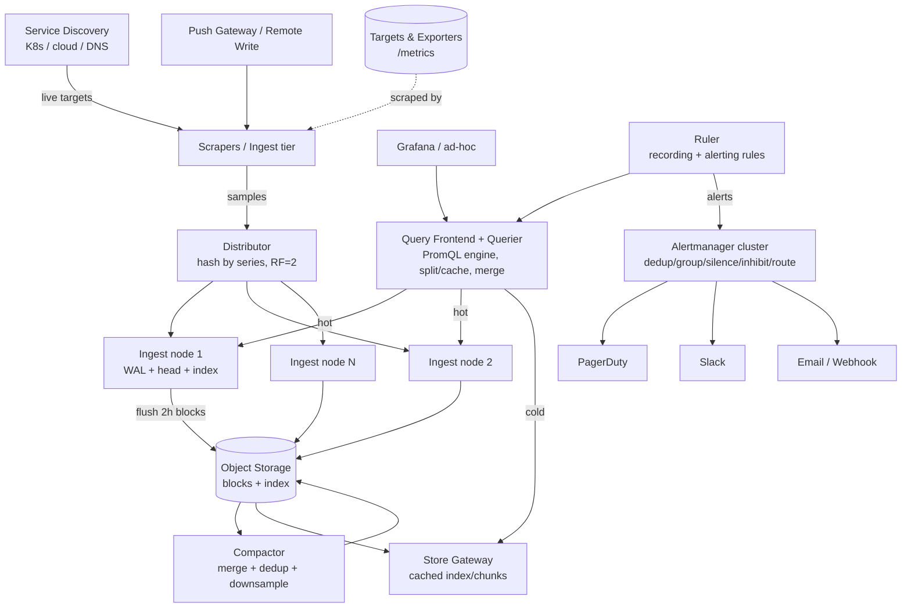
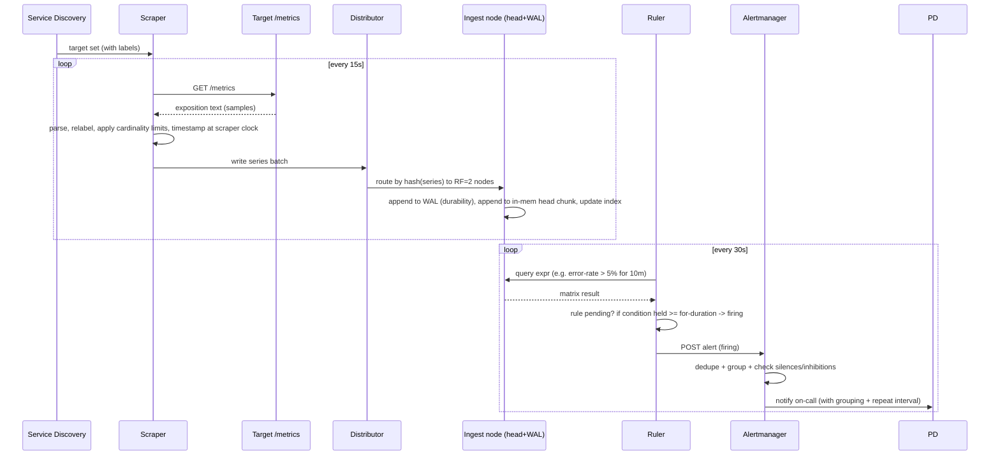
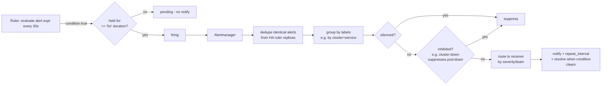

# Design a Metrics & Monitoring System (Prometheus-like)

> Staff/principal-level HLD reference + practice artifact. Reader profile: a senior backend engineer (Java/JVM, distributed systems) who already knows the building blocks and wants the *design judgment* — clarification, tradeoffs, and the deep dives that separate a senior answer from a junior one.

---

## 1. Problem & Clarifying Questions

### 1.1 Restating the problem

Build a system that **collects numeric time-series telemetry** (metrics — CPU, memory, request counts, latencies, error rates, queue depths, business KPIs) from thousands of hosts, containers, and services; **stores** that data efficiently with configurable retention; lets engineers **query and aggregate** it interactively and from dashboards; and **evaluates alerting rules** so on-call engineers are paged when something breaks. Think Prometheus + Alertmanager + Thanos/Cortex/Mimir + Grafana, but we design the engine, not just wire products together.

A metric in this world is identified by a **name + a set of key-value labels** (e.g. `http_requests_total{service="checkout", method="POST", code="500", pod="checkout-7f9c"}`) and is a stream of `(timestamp, float64)` samples. The combination of metric name and a unique label set is one **time series**. The number of *distinct* series is the single most important driver of cost and difficulty in this whole system — a concept called **cardinality**, which we will return to repeatedly.

### 1.2 Questions I'd ask the interviewer first

A senior answer never starts with boxes-and-arrows. I'd scope the problem along four axes.

**Functional scope**
1. **What signals?** Just metrics (numeric time series), or also logs and traces? These have wildly different storage engines. I'll assume **metrics only**, with a clean integration boundary toward logs/traces (the "three pillars of observability").
2. **Collection model:** Do we control the targets enough to **pull** (scrape) them, or must we accept **push** from short-lived jobs (batch jobs, serverless, browsers)? I'll support pull as primary and a push gateway for the exceptions.
3. **Query surface:** Ad-hoc interactive queries, dashboard refreshes, *and* alert-rule evaluation? All three, with a PromQL-like functional query language.
4. **Alerting:** Do we own rule evaluation, deduplication, grouping, silencing, and notification routing (Slack/PagerDuty/email), or just expose data for an external alerter? I'll own the full pipeline.
5. **Retention tiers:** One retention, or hot/warm/cold (e.g. raw for 15 days, 5-minute rollups for 1 year, 1-hour rollups for 3 years)? I'll assume tiered retention with **downsampling** (storing lower-resolution aggregates of old data).
6. **Multi-tenancy:** Single org, or a shared platform serving many teams/tenants with isolation and quotas? I'll design single-tenant core but call out the multi-tenant extension (this is the Cortex/Mimir story).
7. **Dashboarding:** Do we build the UI, or stop at a query API that Grafana consumes? I'll stop at the **query API boundary** and treat Grafana as the dashboard layer — building a charting UI is a different problem.

**Non-functional scope**
8. **Scale:** How many hosts/series/samples per second? This sets everything. (See §1.3.)
9. **Query latency target:** Dashboards feel broken above ~1 s; what p99 do we promise? I'll target **p99 < 1 s** for typical dashboard queries (single series over hours), **< 10 s** for heavy aggregations over weeks.
10. **Ingest freshness / staleness:** How fresh must data be for alerting? Alert-relevant data should be queryable within **one scrape interval + a few seconds** (~15–30 s). Eventual consistency is fine for historical analytics.
11. **Availability of the monitoring system itself:** This is special — *the monitor must survive the outage it's monitoring.* What's the target, and must alerting keep working during a partial datacenter failure? I'll target **99.9%+ for ingest/alerting** and design for "monitoring stays up when the monitored fleet is on fire."
12. **Durability:** Is it acceptable to lose the last few seconds of in-memory samples on a crash, or must every sample be durable on write? Metrics tolerate small loss far better than financial data — I'll allow a **WAL-bounded loss window** (seconds), not zero loss.
13. **Consistency:** Can queries miss the very latest samples or briefly double-count during HA failover? Yes — metrics are an **AP-leaning, eventually-consistent** workload; approximate answers a few seconds stale are fine.

**Out of scope (stated explicitly)**
- Log aggregation and distributed tracing (separate engines; integration points only).
- The dashboard rendering UI (we expose a query API; Grafana renders).
- Synthetic/blackbox probing internals (we accept their metrics like any other target).
- Capacity *forecasting* / anomaly-detection ML (a downstream consumer of our query API).

### 1.3 Scale assumptions I'll proceed with

I'll size for a **large but realistic single platform**:

- **10,000 monitored targets** (hosts + pods + service instances).
- **~700 series per target** on average (host metrics + app metrics) → **~7,000,000 active time series**.
- **Scrape interval: 15 s** → each series produces 1 sample / 15 s.
- **Retention:** raw 15 days; 5-min rollups 13 months; 1-hour rollups 3 years.
- **Alerting rules:** ~5,000 rules evaluated every 30–60 s.
- **Query load:** ~2,000 dashboard panel queries/min at peak + ad-hoc + rule evaluation.

These are the numbers I'll defend with arithmetic in §3.

---

## 2. Requirements (finalized)

### 2.1 Functional requirements

- **FR1 — Ingestion:** Collect samples via **pull (scrape)** from HTTP endpoints exposing metrics in a text/exposition format, and via a **push gateway** for ephemeral jobs.
- **FR2 — Service discovery:** Dynamically discover targets (Kubernetes, cloud APIs, file/DNS-based) so the scrape set tracks an elastic fleet without manual edits.
- **FR3 — Storage:** Persist `(series, timestamp, value)` with **per-tier retention** and **downsampling** (raw → 5-min → 1-hour rollups).
- **FR4 — Query:** A **PromQL-like** functional query language supporting instant queries (value now) and range queries (values over `[start, end]` at a `step`), with selectors, aggregations (`sum`, `rate`, `histogram_quantile`, `avg`, `max`), and label grouping.
- **FR5 — Alerting:** Periodically evaluate alert rules (PromQL boolean expressions over a `for` duration), generate alerts, then **dedupe, group, silence, inhibit, and route** notifications to receivers (PagerDuty, Slack, email, webhook).
- **FR6 — Recording rules:** Precompute expensive expressions into new series on a schedule (so dashboards/alerts read cheap precomputed series).
- **FR7 — Metadata/labels API:** List metric names, label names, label values for autocomplete and exploration.
- **FR8 — Multi-window:** Serve both recent (hot, high-res) and historical (cold, downsampled) data through one query surface.

### 2.2 Non-functional requirements

| Property | Target | Rationale |
|---|---|---|
| **Ingest freshness** | Sample queryable ≤ ~20 s after scrape | Alerting must react within ~1 evaluation cycle |
| **Query latency** | p99 < 1 s typical dashboard panel; < 10 s heavy aggregation | Dashboards feel broken above ~1 s |
| **Availability (ingest + alert)** | ≥ 99.9%, survive single-AZ loss | The monitor must outlive the monitored |
| **Availability (query)** | ≥ 99.9%, degrade gracefully (serve hot even if cold is down) | Engineers debugging an outage need *some* data |
| **Durability** | Bounded loss ≤ WAL flush window (seconds) on crash; long-term storage 11 nines (object store) | Metrics tolerate seconds of loss; history must not vanish |
| **Consistency** | Eventual; queries may miss last few seconds / briefly double-count on failover | Metrics are AP-leaning; approximate-but-available beats exact-but-down |
| **Cardinality safety** | Hard per-target & per-tenant series caps; reject not crash | One bad label must not OOM the cluster |
| **Scalability** | Linear horizontal scale by sharding series across nodes | Fleet grows; design must not require rewrite |

### 2.3 Explicit assumptions

- Samples are `float64`; timestamps are millisecond Unix epoch. (Histograms/summaries are *composed* of multiple float series, not a special storage type — until we discuss native histograms in §10.)
- Clocks are roughly synced (NTP); we tolerate small skew, scrape *at the scraper's clock* to avoid trusting target clocks.
- Targets are mostly cooperative and inside our network/VPC; auth is mTLS or bearer tokens, not the hard part.
- Writes are **append-mostly, time-ordered-ish** (samples arrive roughly in timestamp order per series). Out-of-order arrival is bounded and we'll handle it explicitly.
- Reads are **range scans over a series or a label-matched set of series**, almost always with a time bound. There are essentially **no point lookups and no updates/deletes** of individual samples (delete is by retention/series, not by sample).

That last assumption is the crux: this is an **append-heavy, time-bounded-range-scan** workload with a **write-once, never-update** sample model. That is precisely why a general-purpose OLTP database is the wrong tool and a purpose-built **time-series database (TSDB)** is the right one. We'll prove it in §6.

---

## 3. Capacity Estimation (show the arithmetic)

### 3.1 Ingest rate (samples per second)

```
active series                 = 7,000,000
scrape interval               = 15 s
samples/sec (ingest)          = 7,000,000 / 15
                              ≈ 466,667 samples/sec
                              ≈ 4.67e5 sps  (call it ~500k sps)
```

So steady-state ingest is **~500,000 samples/second**. This is the number that sizes the ingest tier. A single well-tuned TSDB node (Go/Prometheus-class) ingests ~500k–1M sps before it strains, so we are at the edge of a single node — meaning **we must shard** (and we want headroom + HA replicas). More in §8.

### 3.2 Raw storage (the headline win: compression)

Naïve cost per sample if stored as `(8-byte timestamp, 8-byte value)` = **16 bytes**.

```
raw samples in 15 days = 500,000 sps * 86,400 s/day * 15 days
                       = 500,000 * 1,296,000
                       = 6.48e11 samples  (648 billion)

naïve raw bytes        = 6.48e11 * 16 bytes
                       = 1.0368e13 bytes
                       ≈ 10.4 TB  (uncompressed)
```

But TSDBs compress *brutally well*. Prometheus's encoding (delta-of-delta for timestamps, XOR for values — the **Gorilla/Facebook scheme**) achieves **~1.3 bytes/sample** in practice (regular intervals + slowly-changing values compress to near nothing).

```
compressed raw bytes   = 6.48e11 * 1.3 bytes
                       ≈ 8.42e11 bytes
                       ≈ 0.84 TB  (~840 GB) for 15 days raw, before replication
```

> **Term — delta-of-delta:** instead of storing a timestamp, store the *change in the gap between consecutive timestamps*. For a steady 15 s scrape the gap is constant, so the delta-of-delta is 0 → encodes to a single bit. **XOR encoding:** consecutive float values are XOR'd; values that barely change have many leading/trailing zero bits → tiny. This pair is why metrics compress to ~1.3 B/sample instead of 16.

With **replication factor 2** (HA) for the hot tier: **~1.7 TB**. Comfortably fits on a handful of NVMe nodes.

### 3.3 Downsampled / long-term storage

5-min rollups store, per series, aggregates (count, sum, min, max — enough to recompute avg/rate) every 300 s instead of every 15 s → **20× fewer points** per series, ~4 aggregate values each (~4× the per-point size, so net ~5× reduction in points-bytes), kept 13 months:

```
5-min points/series in 13 months ≈ (13*30*86400 / 300) ≈ 112,320 points
                                  * 7e6 series * ~6 bytes/agg-point compressed
                                  ≈ 4.7e12 bytes ≈ 4.7 TB
1-hour rollups for 3 years        ≈ (3*365*24) = 26,280 points/series
                                  * 7e6 * ~6 B ≈ 1.1e12 ≈ 1.1 TB
```

Long-term tiers land on **object storage (S3/GCS)** — cheap, 11-nines durable, infinitely scalable — totalling single-digit TB compressed. Object storage at ~$0.023/GB/month makes 6 TB ≈ **$140/month** of storage; the cost is overwhelmingly **query compute**, not bytes.

### 3.4 Bandwidth

```
ingest network = 500,000 sps * 16 bytes/sample (on the wire, exposition text is bigger,
                 but scrapes batch: assume ~25 bytes/sample wire incl. labels amortized)
               ≈ 500,000 * 25 ≈ 12.5 MB/s ≈ 100 Mbps sustained ingest
scrape fan-out = 10,000 targets / 15 s = ~667 scrape HTTP requests/sec
```

~100 Mbps and ~667 scrapes/s is trivial network-wise; the cost is CPU (parsing + compressing), not the NIC.

### 3.5 Memory (the real hot-tier constraint)

The hot path keeps the **most recent ~2 h block in memory** plus per-series in-memory chunk + an inverted index for label lookup.

```
in-memory head series overhead ≈ ~few KB/series (active chunk + index entries)
                               ≈ 3 KB/series * 7e6 ≈ 21 GB  (rough)
```

Plus index structures and query working set. Budget **~32–64 GB RAM per ingest node** and split 7M series across nodes so each holds ~1–2M series. **Memory, not disk, is what forces the shard count.**

### 3.6 Node / shard count

```
target: ~1M series per ingest shard (safe, leaves CPU/mem headroom)
ingest shards = 7,000,000 / 1,000,000 = 7 shards
replication factor 2 (HA)            = 14 ingest nodes
+ query/aggregation tier             ≈ 4–6 nodes (stateless, scale to load)
+ store-gateway (reads object store) ≈ 3–4 nodes
+ compactor (downsampling)           ≈ 2 nodes (1 active, 1 standby)
+ alerting (ruler + notifier)        ≈ 3 nodes (HA, see §7)
+ gateway/router + service discovery ≈ 3 nodes
```

**~30 nodes** for the whole platform at 7M series — and it scales **linearly**: double the fleet → ~double the ingest shards. That linearity is the design goal of §8.

### 3.7 QPS summary

| Flow | Rate | Notes |
|---|---|---|
| Ingest | ~500k samples/s | from ~667 scrapes/s |
| Dashboard queries | ~33 q/s (2k/min) peak | each touches many series |
| Rule evaluations | ~5,000 rules / 30 s ≈ 167 evals/s | cheap if backed by recording rules |
| Metadata/label queries | bursty (autocomplete) | served from inverted index |

---

## 4. API Design

Three logical APIs: **ingest**, **query**, **alerting/admin**. (PromQL-shaped where applicable.)

### 4.1 Ingest

**Pull (scrape) — the target exposes, we fetch.** The target serves an exposition-format body over HTTP:

```
GET /metrics  ->  200 OK, text/plain
# HELP http_requests_total Total HTTP requests
# TYPE http_requests_total counter
http_requests_total{method="POST",code="500"} 1027 1719331200000
http_requests_total{method="GET",code="200"} 98321 1719331200000
process_resident_memory_bytes 5.3424e+07 1719331200000
```

Our scraper config (declarative):
```yaml
scrape_configs:
  - job_name: "checkout"
    scrape_interval: 15s
    scrape_timeout: 10s
    metrics_path: /metrics
    kubernetes_sd_configs: [{ role: pod }]
    relabel_configs: [...]   # drop/keep/rewrite labels before ingest
```

**Push (remote write) — for ephemeral jobs and federation.** A protobuf+Snappy batch:
```
POST /api/v1/write    Content-Encoding: snappy
WriteRequest {
  repeated TimeSeries timeseries = 1;
}
TimeSeries { repeated Label labels; repeated Sample samples; }
Sample { double value; int64 timestamp_ms; }
-> 200 (accepted) | 400 (bad) | 429 (over quota) | 503 (back off)
```

**Push gateway (for short-lived batch jobs):**
```
PUT /metrics/job/<job>/instance/<inst>   body: exposition format
-> stores last-pushed values; scraped like a normal target
```

### 4.2 Query

**Instant query** (value at a single time `t`):
```
GET /api/v1/query?query=<promql>&time=<unix>
-> { status, data: { resultType: "vector", result: [ {metric:{...labels}, value:[t, "v"]}, ... ] } }
```

**Range query** (a time window sampled at `step`, what dashboards use):
```
GET /api/v1/query_range?query=<promql>&start=<unix>&end=<unix>&step=<dur>
-> resultType "matrix", result: [ {metric:{...}, values:[[t,"v"],...]} ]
```

Example PromQL the engine must run:
```promql
# per-second error rate of the 5xx, summed by service, over a 5m window:
sum by (service) (rate(http_requests_total{code=~"5.."}[5m]))

# p99 latency from a histogram:
histogram_quantile(0.99, sum by (le) (rate(http_request_duration_seconds_bucket[5m])))
```

> **Term — `rate(...[5m])`:** computes the per-second average increase of a *counter* (a monotonically increasing metric) over the trailing 5 minutes, automatically handling counter resets (restarts) where the value drops to 0. This is *the* most common metric operation.

**Metadata:**
```
GET /api/v1/labels                       -> all label names
GET /api/v1/label/<name>/values          -> values for a label
GET /api/v1/series?match[]=<selector>    -> matching series (label sets)
```

### 4.3 Alerting / admin

```
GET  /api/v1/rules                 -> current rule states (firing/pending/inactive)
GET  /api/v1/alerts                -> active alerts
POST /api/v1/silences              -> create a silence (matchers, start, end, comment)
DELETE /api/v1/silences/<id>
```
Rule definition (declarative, hot-reloaded):
```yaml
groups:
  - name: latency
    interval: 30s
    rules:
      - record: job:http_req_rate5m:sum     # recording rule -> new series
        expr: sum by (job) (rate(http_requests_total[5m]))
      - alert: HighErrorRate                  # alerting rule
        expr: sum by (service)(rate(http_requests_total{code=~"5.."}[5m]))
              / sum by (service)(rate(http_requests_total[5m])) > 0.05
        for: 10m                              # must hold 10m before firing (debounce)
        labels: { severity: page }
        annotations: { summary: "5xx > 5% on {{ $labels.service }}" }
```

---

## 5. High-Level Architecture

### 5.1 Component overview

- **Service Discovery (SD):** watches K8s/cloud/DNS for targets; emits the live target set with labels.
- **Scrapers (ingest workers):** pull `/metrics` from assigned targets on schedule, parse, relabel, apply cardinality limits, write to TSDB head.
- **Push Gateway / Remote-Write Receiver:** accepts pushed samples for ephemeral jobs.
- **TSDB Ingest nodes (hot tier):** hold the in-memory **head block** + **WAL** (write-ahead log) + recent on-disk blocks; serve queries over recent data; periodically flush blocks to **object storage**.
- **Distributor / Router:** hashes incoming series to the right ingest shard(s); replicates to RF copies.
- **Inverted Index:** per node, maps `label=value -> posting list of series IDs` for fast selector resolution.
- **Compactor:** merges small blocks into large ones, deduplicates HA replicas, and produces **downsampled** rollups; uploads to long-term object storage.
- **Store Gateway:** serves queries over historical blocks living in object storage (reads index + chunks on demand, caches them).
- **Query Frontend + Querier:** parses PromQL, splits/caches queries, fans out to ingest nodes (hot) and store gateways (cold), merges results, runs the PromQL engine.
- **Ruler:** evaluates recording + alerting rules on a schedule (a query client that writes results back / emits alerts).
- **Alertmanager:** dedupes, groups, silences, inhibits, and routes alerts to receivers (PagerDuty/Slack/email/webhook); clustered for HA.
- **Grafana (external):** dashboards talk to the Query Frontend. *We stop at this boundary.*

### 5.2 ASCII block diagram

```
                         ┌───────────────────┐
                         │ Service Discovery │  (K8s / cloud / DNS / file)
                         └─────────┬─────────┘
                                   │ live target set
                                   v
   targets/exporters       ┌───────────────┐        push (ephemeral jobs)
   [ /metrics ] <──scrape──│   Scrapers     │<──────── Push Gateway / RemoteWrite
   [ /metrics ]            │ (ingest tier)  │
   [ /metrics ]            └──────┬─────────┘
                                  │ samples (series hashed by labels)
                                  v
                          ┌──────────────────┐  replicate RF=2
                          │   Distributor    │───────────────┐
                          └───────┬──────────┘               │
                       shard by series hash                  │
            ┌──────────────┬──────┴───────┬───────────────┐  │
            v              v              v               v  v
        ┌────────┐    ┌────────┐    ┌────────┐    ... ┌────────┐
        │ Ingest │    │ Ingest │    │ Ingest │        │ Ingest │
        │ node 1 │    │ node 2 │    │ node 3 │        │ node N │
        │ WAL+   │    │ WAL+   │    │ WAL+   │        │ WAL+   │
        │ head + │    │ head   │    │ head   │        │ head   │
        │ index  │    └───┬────┘    └───┬────┘        └───┬────┘
        └───┬────┘        │             │                 │
            │ flush 2h blocks to object storage           │
            └──────────────┬──────────────────────────────┘
                           v
                  ┌──────────────────┐        ┌───────────────┐
                  │  Object Storage  │<───────│   Compactor   │
                  │  (S3/GCS)        │ rollup │ merge+dedup+  │
                  │  blocks+index    │ upload │ downsample    │
                  └────────┬─────────┘        └───────────────┘
                           │ read cold
                           v
                  ┌──────────────────┐
                  │  Store Gateway   │ (cached index/chunks)
                  └────────┬─────────┘
                           │
   queries  ┌──────────────┴───────────────┐  hot reads
  ───────►  │  Query Frontend + Querier    │──────────► Ingest nodes
  (Grafana, │  (PromQL engine, split/cache,│            (recent data)
   ad-hoc)  │   fan-out + merge + dedup)   │
            └───────┬──────────────────────┘
                    ^ reads same query API
                    │
              ┌─────┴──────┐  alerts     ┌─────────────────────┐
              │   Ruler    │────────────►│   Alertmanager      │──► PagerDuty
              │ (rule eval)│             │ dedup/group/silence │──► Slack
              └────────────┘             │ /inhibit/route (HA) │──► Email/Webhook
                                         └─────────────────────┘
```

### 5.3 Mermaid diagram



### 5.4 Key flow: a scrape becoming a queryable, alertable sample



---

## 6. Data Model & Storage Choices

### 6.1 The data model

- **Series identity:** `metric_name{label1=v1, label2=v2, ...}`. Internally we fold the name into a reserved label: `{__name__="http_requests_total", method="POST", code="500", ...}`. The series ID is a hash of the *sorted* label set (so label order doesn't create duplicates).
- **Sample:** `(series_id, timestamp_ms int64, value float64)`. Append-only.
- **Inverted index:** `label_name=label_value -> sorted posting list of series_ids`. A selector like `{service="checkout", code=~"5.."}` resolves by intersecting posting lists (and regex-matching values for `=~`).
- **Chunk:** a compressed run of ~120 samples for one series (the unit of storage and compression). Chunks are immutable once closed.
- **Block:** an immutable directory covering a time range (e.g. 2 h) containing chunks for many series + the index + a `meta.json`. Blocks are the unit of compaction, retention, and upload to object storage.

### 6.2 Why a purpose-built TSDB and not X

Recall the access pattern (§2.3): **append-only, write-once-never-update, time-ordered-ish writes; reads are time-bounded range scans over label-matched series; no point lookups; deletes only by retention.** Now compare:

| Store | Fit for this workload | Why / why not |
|---|---|---|
| **Relational (Postgres/MySQL)** | Poor at scale | A `(series_id, ts, value)` table at 648 B rows works to millions of rows, not *hundreds of billions*. B-tree index on `(series,ts)` bloats; no native delta/XOR compression → ~10× the bytes; vacuum/bloat on append-heavy tables; no built-in downsampling. **Failure mode avoided: index write amplification & storage blowup at 500k inserts/s.** |
| **Key-value / Cassandra** | OK-ish, lots of glue | Wide-row-by-time partition (`series_id` partition key, `ts` clustering) can model TS, and is what early large-scale systems did. But you must build compression, downsampling, the inverted index, and the query engine yourself; compaction is heavy; cardinality of partitions hurts. **Reinventing the TSDB on top.** |
| **Document/Elastic** | Poor | Inverted index is great for label search, but per-sample documents are enormous; not built for numeric range-scan compression. **Storage and ingest cost explode.** |
| **General column store (ClickHouse)** | Strong alternative | Columnar + compression + fast scans genuinely fits metrics and is used in production TSDBs. Tradeoff: you build the metrics semantics (counters/rate, staleness, inverted-index-style label lookups, downsampling) atop SQL. Viable; heavier ops, more general. |
| **Purpose-built TSDB (Prometheus TSDB / Gorilla-style)** | **Best fit** | Delta-of-delta + XOR compression (~1.3 B/sample), immutable time-range blocks, native inverted index for labels, head/WAL hot path, native downsampling & retention. Built exactly for append-only time-ordered series + time-range scans. **This is the defended choice.** |

**Decision:** a **custom TSDB engine** modeled on the Prometheus/Gorilla design — local NVMe for the hot tier (head + recent blocks), **object storage for the durable long-term tier**, an **inverted index** for label resolution, and **block-based immutable storage** for cheap compaction/retention. We pair it with **object storage (S3/GCS)** for long-term because it's cheap, 11-nines durable, infinitely scalable, and lets compute (store gateways, compactor) scale independently of bytes — the **disaggregated storage/compute** pattern (Thanos/Cortex/Mimir).

> **Term — disaggregated storage/compute:** the durable data lives in object storage; stateless compute nodes (queriers, store gateways, compactor) read it on demand and can be scaled or replaced freely. This decouples "how much you store" from "how much you query."

### 6.3 On-disk layout (per ingest node)

```
data/
  wal/            <- write-ahead log; replayed on restart to rebuild head
  chunks_head/    <- memory-mapped head chunks (recent ~2h)
  01H.../         <- immutable block (2h): index + chunks + meta.json + tombstones
  01H.../         <- older 2h block
  ...
```
Head holds the latest ~2 h in memory (+ WAL on disk for durability); every 2 h it's cut into an immutable block and the WAL is truncated. Blocks are later compacted (merged) into larger blocks and uploaded to object storage, after which local copies can be dropped per retention.

---

## 7. Deep Dives (the bulk)

I'll deep-dive the five genuinely hard sub-problems: **(7.1) the TSDB storage engine — compression, blocks, downsampling, retention; (7.2) pull vs push collection; (7.3) cardinality explosion and bounding it; (7.4) querying & aggregation at scale; (7.5) the alerting pipeline and HA of the monitoring system itself.**

---

### 7.1 Deep dive — The time-series storage engine

This is the heart. Three problems nested inside: **(a) the hot write path**, **(b) compression**, **(c) blocks/compaction/downsampling/retention**.

#### (a) The hot write path: head + WAL + memory-mapped chunks

Writes are ~500k sps and must survive crashes without paying per-sample fsync. Design:

1. On each sample, **append to the WAL** (write-ahead log) — a sequential file. Sequential append is cheap; we **batch fsync** (e.g. every ~10 s or on segment roll), accepting a bounded loss window rather than fsync-per-sample.
2. Append the sample to the series' **in-memory head chunk** (a growing compressed buffer of ~120 samples).
3. When a head chunk fills, **memory-map** it to disk (`chunks_head/`) and start a new one — so memory stays bounded but data is on disk.
4. Every **2 h**, cut the head into an immutable **block**, write its index, and truncate the now-redundant WAL.

> **Term — WAL (write-ahead log):** an append-only log written *before* the in-memory state is updated, so on crash we replay it to reconstruct the head. It converts "lose everything since last flush" into "lose only the un-fsynced tail."

| Option for durability | Pro | Con | Decision |
|---|---|---|---|
| fsync every sample | zero loss | kills throughput at 500k sps | reject |
| WAL + periodic fsync (chosen) | cheap, bounded loss (sec) | small loss window on crash | **chosen** — metrics tolerate seconds; HA replica covers the gap |
| In-memory only | fastest | total loss on crash | reject |

**Failure mode avoided:** an OOM or crash on an ingest node loses *only* the unsynced WAL tail (seconds), and because we replicate at RF=2, the replica still has the data — so effective loss is ~zero while we never pay fsync-per-sample.

#### (b) Compression — why 16 bytes becomes ~1.3

Two independent streams per chunk, the **Gorilla** scheme:

- **Timestamps — delta-of-delta:** store `t0`; then `Δ = t1 - t0`; then for each subsequent point store `(Δ_n - Δ_{n-1})`. For a steady 15 s scrape, every delta-of-delta is **0**, encoded as a single bit. Irregularity costs a few bits.
- **Values — XOR:** store `v0` as a raw float; then store `v_n XOR v_{n-1}`. Slowly-changing or constant gauges XOR to mostly zero bits → store only the meaningful middle bits (leading-zeros count + significant bits). A flat CPU-idle gauge costs ~1 bit/sample.

Net: **~1.3 bytes/sample** in practice vs 16 naïve — an **~12× reduction** (proven arithmetically in §3.2). This is the single biggest reason a TSDB beats a generic DB here.

| Compression choice | Bytes/sample | Notes |
|---|---|---|
| Raw `(int64,float64)` | 16 | baseline |
| Generic gzip on raw | ~3–5 | block-level, slower random access |
| **Delta-of-delta + XOR (Gorilla)** | **~1.3** | streaming, decode-friendly, **chosen** |

**Failure mode avoided:** storage blowup. At 648B samples/15 days, the difference between 1.3 and 16 B/sample is **840 GB vs 10.4 TB** — the difference between a few NVMe nodes and an unaffordable cluster.

#### (c) Blocks, compaction, downsampling, retention

- **Immutable blocks** make everything else simple: no in-place updates, so compaction is a pure merge, retention is a directory delete, replication is a file copy, and corruption is contained to one block.
- **Compaction** merges many small 2 h blocks into larger ones (e.g. 2 h → 8 h → 2 day), which (i) shrinks the index (fewer block-index lookups per query), (ii) deduplicates HA replicas (two ingesters wrote near-identical data; the compactor keeps one), and (iii) is when we compute **downsampling**.
- **Downsampling** precomputes lower-resolution aggregates for old data: for each series over each 5-min (then 1-h) window, store `count, sum, min, max` (from which `avg`, `rate`, extremes are recomputed). A dashboard showing 6 months of data should *never* scan raw 15 s points — it reads the 1 h rollup, scanning ~240× fewer points.

> **Term — downsampling:** storing coarse-grained aggregates of old data and dropping (or archiving) the raw points, trading resolution you no longer need for query speed and storage you do.

**Retention tiers (chosen):** raw 15 d (hot, NVMe + recent blocks in object store), 5-min rollups 13 months, 1-h rollups 3 years. The querier transparently picks the right resolution for the requested `step` (if `step >= 5m`, read the 5-min rollup).

| Retention design | Pro | Con | Decision |
|---|---|---|---|
| Keep raw forever | perfect fidelity | storage + query cost explode; 6-month dashboards scan billions of points | reject |
| Single short retention | cheap | lose history; can't do YoY/quarterly trends | reject |
| **Tiered + downsampled (chosen)** | cheap, fast historical queries, keeps trends | rollups lose sub-window detail; must choose aggregates upfront | **chosen** |

**Failure mode avoided:** the "6-month dashboard times out" failure. Without downsampling, a wide query scans hundreds of billions of raw points and either OOMs the querier or blows the latency SLO. Rollups bound the scan to thousands of points.

---

### 7.2 Deep dive — Pull vs push collection

Should the system **pull** (scrape targets) or have targets **push**? This is one of the most debated design choices and a classic senior-signal question.

| Dimension | Pull (scrape) | Push (remote write) |
|---|---|---|
| **Target liveness** | "scrape failed" *is* a health signal — you instantly know a target is down | a silent target is ambiguous: dead, or just not pushing? need a separate heartbeat |
| **Service discovery** | scraper owns the target list (from SD); easy to know "what *should* exist" | the system can't know what *should* be pushing; can't detect a missing pusher |
| **Ephemeral / short-lived jobs** | can't scrape a job that exits in 2 s | natural fit — job pushes before exiting |
| **Firewalls / NAT** | scraper must reach targets (hard across NAT, browsers, mobile) | target reaches us (works through NAT) |
| **Backpressure / overload** | scraper controls rate; a slow scrape just times out, target unaffected | a runaway pusher can flood ingest; need quotas/429 |
| **Multi-consumer** | many scrapers can scrape the same `/metrics` independently | target must know all destinations |
| **Cardinality control** | scraper applies relabel/limits *before* ingest | limits enforced at receiver; abuse already on the wire |

**Decision: pull-primary, push for the exceptions.**

- **Pull is the default** because (i) target-down is a first-class signal — *the absence of data is itself information*, which is gold for a monitoring system; (ii) service discovery gives us the authoritative "what should exist" set, so we can alert on *missing* targets; (iii) the scraper controls rate, so a misbehaving target can't overwhelm ingest; (iv) relabeling/limits are applied centrally before data lands.
- **Push (remote write + push gateway)** is offered for the cases pull *cannot* serve: short-lived batch jobs (push final metrics before exit), serverless/lambda, browser/mobile clients behind NAT, and **federation/remote-write** to ship data to a central long-term store.

**Failure mode avoided:** if we went push-only, a crashed host simply stops pushing and looks identical to a healthy-but-quiet host — we'd **fail to detect outages**, the cardinal sin of a monitoring system. Pull turns "I can't reach you" into an immediate, attributable alert. Conversely, pull-only would silently lose every short-lived job's data — hence the push gateway escape hatch.

A subtlety worth stating: with pull we **timestamp at the scraper's clock**, not the target's, sidestepping target clock skew and giving consistent ingest ordering. The push path must validate/clamp timestamps (reject far-future, bound out-of-order) to protect the storage engine's append assumption.

---

### 7.3 Deep dive — Cardinality explosion and how to bound it

**Cardinality** = the number of *distinct* time series. It is the dominant cost and the most common way these systems fall over. Cardinality is the product of the cardinalities of every label:

```
series = metric_names × Π (distinct values per label)
```

A single careless label is catastrophic. Putting `user_id` (millions of values) or `request_id` / `email` / full `url` (unbounded) into a label turns one metric into **millions of series** — each needing a head chunk, index entries, and memory. This is **cardinality explosion**, and it OOMs ingest nodes and bloats the index until queries crawl.

Worked example of the blast radius:
```
http_requests_total{method, code, path, user_id}
methods = 5, codes = 15, paths = 200, user_id = 2,000,000 distinct
=> 5 * 15 * 200 * 2,000,000 = 30,000,000,000 series   (30 BILLION) from ONE metric
```
vs the same metric without `user_id`: `5 * 15 * 200 = 15,000` series. The `user_id` label inflated it **2 million-fold**.

**Defense in depth — layered controls:**

1. **Education + linting (prevent):** ban high-cardinality labels (IDs, emails, raw URLs, timestamps) in code review and via a static linter on metric definitions. The cheapest fix is the metric never being created.
2. **Relabeling at the scraper (drop before ingest):** `relabel_configs` to `drop`/`replace` dangerous labels, normalize `path` to a route template (`/users/{id}` not `/users/12345`), and `labeldrop` known offenders — *before* data hits storage.
3. **Per-target & per-tenant series limits (hard caps):** each scrape target may produce ≤ N series (e.g. 10k); exceed → **drop the excess and emit a `scrape_samples_exceeded` metric + alert**, never crash. Per-tenant global caps in the distributor with **429** responses on push.
4. **Cardinality observability:** the system monitors *itself* — expose top-N highest-cardinality metrics/labels, per-tenant series counts, and churn rate; alert when a metric's series count spikes.
5. **Series churn control:** **churn** (series that appear and vanish, e.g. a `pod` label that changes every deploy) is as costly as raw cardinality because every new series needs index entries and a head chunk. Detect churn and alert; encourage stable labels.

| Control | Where | Stops what | Cost |
|---|---|---|---|
| Lint / ban ID labels | code review / CI | explosion at the source | human effort |
| Relabel drop/normalize | scraper | bad labels before ingest | config maintenance |
| Per-target series cap | scraper | one target OOMing a node | drops data (with alert) |
| Per-tenant global cap | distributor | one tenant starving others | 429s (with alert) |
| Cardinality dashboards | self-monitoring | slow detection | none |

**Decision:** enforce **hard, fail-safe limits at ingest** (drop + alert, never crash) *plus* **prevention upstream** (lint + relabel). The non-negotiable principle: **a single bad metric must degrade gracefully (its data is dropped, an alert fires) and must never take down the cluster.**

**Failure mode avoided:** the classic 3 a.m. incident where a deploy adds `request_id` to a label, series count 1000×'s in minutes, ingest nodes OOM, and **the monitoring system dies exactly when you need it to watch the deploy**. Hard caps convert "cluster down" into "one metric dropped + a page about cardinality."

---

### 7.4 Deep dive — Querying & aggregation at scale

A PromQL query like `sum by (service)(rate(http_requests_total{code=~"5.."}[5m]))` must: resolve the selector to series, fetch their samples over the range from *both* hot (ingest) and cold (store gateway) tiers, run `rate()` per series, then `sum` group by `service` — fast, across shards, without OOM. Hard parts:

**(a) Selector resolution via the inverted index.** `{code=~"5.."}` becomes: fetch posting lists for the candidate label values, regex-match values, intersect with `{__name__="http_requests_total"}`'s posting list. Intersecting *sorted* posting lists is a linear merge. Regex on label values is the trap — an unanchored `.*` regex over a high-cardinality label scans everything. Mitigation: anchor regexes, push `__name__` equality first to shrink the candidate set, and cap the number of series a single query may touch (e.g. 100k) — **reject huge queries rather than OOM**.

**(b) Scatter-gather across shards + tiers.** Series for one query may live on several ingest shards (hot) and in many object-store blocks (cold). The **querier** fans out, each shard/store-gateway returns *partial* results, the querier merges. To make cold reads fast: store gateways keep the **block index in memory/cached** and fetch only the needed chunks via byte-range GETs from object storage, with an LRU chunk cache.

**(c) Query splitting + caching (the Query Frontend).** A 30-day range query is split by the frontend into per-day sub-queries; **completed days are immutable and cacheable** (results cache), so a dashboard refresh re-fetches only *today's* partial day. This is the single biggest dashboard-latency win.

| Query optimization | Mechanism | Saves |
|---|---|---|
| Recording rules | precompute expensive expr into a cheap series | repeated heavy aggregation at query time |
| Downsampled rollups | read 1h points not 15s for wide ranges | ~240× fewer points scanned |
| Query splitting + results cache | split by time, cache immutable past | re-scan of unchanged history |
| Series-touch limit | reject queries over N series | OOM from accidental full scans |
| Concurrency + queueing | per-tenant query queue in frontend | one heavy query starving others |

**(d) Recording rules** are the proactive half: the most expensive dashboard/alert expressions are precomputed every interval into new series (`job:http_req_rate5m:sum`), so the dashboard reads a single cheap series instead of aggregating thousands at render time.

**Decision:** a **stateless querier fleet behind a Query Frontend** that does split-and-cache, fan-out to hot+cold, merge, and enforce per-query limits and per-tenant queueing; **recording rules + downsampling** push work *off* the query path.

**Failure mode avoided:** the "one engineer pastes a `{__name__=~".+"}` range query over 30 days and OOMs the cluster" failure. Series-touch limits, query splitting, downsampling, and per-tenant query queues turn a hostile query into a rejected/slow *single* query, not a cluster outage. And recording rules prevent the steady-state death-by-dashboard where 50 panels each re-aggregate millions of series every 10 s.

---

### 7.5 Deep dive — Alerting pipeline & HA of the monitoring system itself

Two intertwined hard problems: **the alerting pipeline correctness** and **keeping the monitor alive during the very outage it must report.**

#### The alerting pipeline



Key correctness mechanisms, each defending a specific failure:

- **`for` duration (debounce):** an alert must hold true for e.g. 10 m before firing. **Avoids flapping pages** from a single transient blip.
- **Grouping:** 500 pods failing in one cluster become *one* grouped notification, not 500 pages. **Avoids alert-storm pager floods.**
- **Deduplication:** because we run **redundant ruler/Alertmanager replicas** (for HA), the same alert arrives multiple times; Alertmanager dedupes on alert identity. **Avoids double-paging from HA itself.**
- **Silences:** suppress known/maintenance alerts by matcher for a window. **Avoids paging during planned work.**
- **Inhibition:** a higher-level alert suppresses dependent ones (a `ClusterDown` inhibits the 200 `PodDown` alerts it causes). **Avoids drowning the root cause in symptoms.**
- **Repeat interval + resolve:** re-notify if still firing after N hours; send a "resolved" when the condition clears. **Avoids both alert fatigue and "is it still broken?" ambiguity.**

#### HA of the monitor itself — the hardest reliability constraint

The monitoring system must report the outage, not be a casualty of it. Principles:

1. **Run redundant, independent ingest/ruler/Alertmanager replicas across AZs.** Two ingesters scrape the same targets (RF=2); the compactor/querier dedupes. If one AZ dies, the other keeps ingesting and alerting. **Avoids "monitor and monitored share a failure domain."**
2. **Alertmanager runs as a gossip cluster** so any node can fire and they coordinate dedupe/silences via gossip — *and crucially they are designed to err toward notifying* on partition (better a duplicate page than a missed one). **Avoids a split-brain swallowing a real page.**
3. **Minimize external dependencies on the critical path.** Ingest + local storage + rule eval + paging must work even if object storage, the dashboard, or the long-term tier is down. Hot-tier queries and alerting are served from local NVMe/head — *no dependency on S3 to fire a page.* **Avoids "we can't alert because the data lake is down."**
4. **Meta-monitoring / dead-man's switch:** a separate, minimal watchdog (ideally in a different region/provider) that pings the monitoring system and an **always-firing "DeadMansSwitch" alert** that pages if it *stops* arriving — so a totally dead monitoring stack still triggers a human. **Avoids the silent-failure-of-the-monitor catastrophe**: the worst outage is the one your monitor was too dead to report.
5. **Graceful query degradation:** if the cold/store-gateway tier is down, queriers still serve hot data and mark results partial, rather than failing the whole query. Engineers debugging an outage get *recent* data even when history is unavailable.

| HA concern | Mechanism | Failure mode avoided |
|---|---|---|
| AZ loss | RF=2 ingest across AZs + dedupe | losing all telemetry in one zone |
| Alerter down | clustered Alertmanager, err toward notify | missed page on partition |
| Object store down | hot path independent of S3 | can't alert during data-lake outage |
| Whole stack dead | external dead-man's-switch watchdog | silent monitor death = blind during incident |
| Cold tier down | queries degrade to hot-only | full query failure during debugging |

**Decision:** **redundant cross-AZ replicas + clustered Alertmanager that biases toward notifying + a hot path with zero hard external dependencies + an external dead-man's switch.** The governing rule: **the monitoring system's worst failure is a silent one**, so every choice biases toward "page a human even if degraded" over "be exactly correct but possibly silent."

---

## 8. Scaling & Bottlenecks

How it scales, where it breaks first, and how each bottleneck is removed.

| # | Bottleneck (breaks first) | Symptom | Fix |
|---|---|---|---|
| 1 | **Single ingest node memory** (head + index for too many series) | OOM at ~1–2M series/node | **Shard series across nodes** (hash by series labels in the distributor); add shards linearly with fleet growth |
| 2 | **Cardinality** | series count spikes → OOM | Hard per-target/tenant caps + relabel drop + lint (§7.3) |
| 3 | **Scrape fan-out** (one scraper can't scrape 10k targets in 15 s) | scrapes slip past interval | Horizontally shard scrapers; **consistent-hash targets to scraper shards**; rebalance on SD change |
| 4 | **Query compute** (heavy aggregations) | slow dashboards, querier OOM | Stateless querier fleet (scale out), Query Frontend split+cache, recording rules, downsampling, per-query series limits |
| 5 | **Object-store read amplification** (cold queries fetch too many chunks) | slow historical queries, high S3 cost | Store-gateway index/chunk cache; downsampled tiers reduce chunks scanned; compaction reduces block count |
| 6 | **Compaction throughput** (can't keep up merging/downsampling) | block count grows, queries slow | Shard compaction by tenant/time range; vertical scale the compactor; it's offline so it can lag briefly |
| 7 | **WAL / disk write** | ingest stalls | Batch fsync, sequential WAL, fast NVMe; WAL is append-only so it's rarely the limit |
| 8 | **Alertmanager notification fan-out** | paging delays during storms | Grouping + inhibition collapse storms; clustered AM; rate-limit per receiver |

**Scaling philosophy:** the architecture is **shard-by-series for write, stateless-fan-out for read, object-store for capacity.** Adding fleet → add ingest shards (write scales linearly). Adding query load → add stateless queriers (read scales linearly). Adding history → object storage grows independently of compute. The one thing that does *not* scale by adding hardware is **cardinality** — that must be bounded by policy, which is why §7.3 is a first-class deep dive.

**Where it breaks first in practice:** almost always **cardinality** (a bad label) or **a single ingest node's memory**, both addressed by sharding + hard caps. The second-most-common is **dashboard query load without recording rules**, addressed by precomputation.

---

## 9. Reliability, Consistency & Security

### 9.1 Failure handling

- **Ingest node crash:** WAL replay rebuilds the head on restart (bounded loss ≤ fsync window); the **RF=2 replica** covered queries/alerts during the gap. Distributor stops routing to the dead node and resumes when it's healthy.
- **Object storage unavailable:** hot path (ingest + recent queries + alerting) is **independent** of object storage and keeps working; only historical queries and uploads pause and catch up later.
- **Network partition between AZs:** each AZ's replica continues ingesting and alerting; Alertmanager biases toward notifying; on heal, the compactor dedupes overlapping data.
- **Poison sample / corrupt block:** immutability contains corruption to a single block; the querier skips a corrupt block and serves the rest; the block can be re-derived from the replica.

### 9.2 Replication & consistency model

- **Hot tier:** **RF=2** synchronous-ish write to two ingesters (different AZs). This is *not* a strongly-consistent quorum DB — it's redundancy for availability/durability. Queries may briefly see one replica slightly ahead of the other; the querier **deduplicates overlapping samples** (same series+timestamp → keep one).
- **Consistency stance: eventual, AP-leaning.** A query might miss the last few seconds of data or, during HA failover, briefly read from a replica that's a sample or two behind. For metrics this is **acceptable** — we explicitly trade strict consistency for availability, because **an available approximate dashboard beats an exact but unreachable one during an incident** (CAP: choose A over C here).
- **Long-term tier:** object storage gives **11-nines durability**; compaction is idempotent (re-running produces the same block), so retries are safe.

### 9.3 Idempotency

- **Sample writes are naturally idempotent:** writing `(series, ts, value)` twice is a no-op after dedup (same key). Retries from scrapers/push are safe.
- **Compaction is idempotent:** deterministic merge of input blocks → same output; safe to retry on crash.
- **Alert notifications:** Alertmanager dedupe makes repeated identical alerts idempotent at the notification layer (one page, not many), and notification receivers should be sent stable dedup keys (e.g. PagerDuty dedup_key) so re-sends update rather than re-page.

### 9.4 Security

- **Authn between targets and scrapers:** **mTLS** or bearer tokens on `/metrics`; scrape configs reference secrets, never inline credentials.
- **Authn/z on query + write APIs:** tenant-scoped tokens; every query/write carries a tenant ID; the distributor/querier **enforce tenant isolation** (a tenant can only read/write its own series) — essential for the multi-tenant extension.
- **Abuse / rate limiting & quotas:** per-tenant **series caps** (cardinality), **ingest rate limits** (samples/s), and **query limits** (max series touched, max time range, per-tenant query concurrency queue). Over-quota → **429**, never crash.
- **PII / sensitive labels:** relabeling **drops** sensitive labels (emails, IDs) at the scraper before storage — both a cardinality *and* a privacy control.
- **Tamper/audit:** rule/silence changes are authenticated and audit-logged; silences require a comment and creator.
- **Network:** ingest/query planes in a private VPC; only the dashboard/query gateway is exposed, behind authn and a WAF; object-store buckets are private with least-privilege IAM.

---

## 10. Extensions & Follow-ups

Realistic variations an interviewer adds, and how each changes the design.

1. **Multi-tenancy (shared platform).** Add a **tenant ID** to every series/query; the distributor shards and isolates by tenant; per-tenant quotas (series, ingest rate, query concurrency); per-tenant retention. This is the Cortex/Mimir evolution. Risk: a noisy tenant — mitigated by per-tenant queues and quotas. Object-store prefixes per tenant for isolation.

2. **Long-term storage / global view across many clusters.** Each cluster runs a local hot Prometheus-like ingester; a **sidecar uploads blocks to a central object store**; a global querier (Thanos/Mimir-style) fans out across all clusters' store gateways for a single pane of glass. Changes: add a global query layer + a federation/remote-write path.

3. **Native histograms (high-resolution latency).** Today a histogram is *many* bucket series (`_bucket{le=...}`) — high cardinality and fixed buckets. **Native/sparse histograms** store the whole distribution as one series with dynamic exponential buckets — far less cardinality, better quantiles. Changes the sample model from scalar to a structured histogram value and the compression scheme.

4. **Exemplars (metrics → traces bridge).** Attach a trace ID to specific samples (e.g. "this spike's slow request was trace abc123") so a dashboard spike links to a trace. Adds a small side-store of exemplars keyed by series+time; the query API returns them alongside samples. This is the integration boundary toward the tracing pillar.

5. **Logs & traces (full observability).** Out of scope here, but the boundary: logs go to a **log store** (inverted-index + object storage, e.g. Loki/Elastic), traces to a **trace store**; they share **service discovery, labels, and the dashboard layer**, and correlate via exemplars/trace IDs. Don't try to store logs in the metrics TSDB — different engine.

6. **Anomaly detection / forecasting.** A downstream consumer of the query API runs ML on series for capacity forecasting / anomaly alerts; feeds results back as new series or alerts. Keeps the core engine unchanged — it's a query client.

7. **Push-only / serverless-heavy environments.** Lean harder on remote-write + push gateway; add a **heartbeat/expected-pusher registry** so missing-pusher detection compensates for the lost "scrape-failed" signal.

8. **Edge / unreliable-connectivity ingest.** Buffer at the edge (agent with local WAL), batch remote-write with retry/backoff, tolerate out-of-order on reconnect (widen the out-of-order window in the head, or use a dedicated out-of-order WAL).

---

## 11. Interview Q&A

**Q1. Why pull instead of push?**
Pull makes *target liveness a first-class signal* — a failed scrape immediately tells you a target is down, and service discovery tells you what *should* exist, so you can alert on *missing* targets. The scraper also controls rate (no target can flood ingest) and applies relabeling/limits centrally. We add push (gateway + remote-write) only for the cases pull can't serve: short-lived jobs, serverless, NAT'd clients, and federation. *Probe: what does pull lose?* Short-lived jobs and anything unreachable from the scraper — hence the push escape hatch. *Probe: how do you detect a down target with push?* You can't directly; you need an expected-pusher heartbeat registry, which is exactly the signal pull gives you for free.

**Q2. How do you get from 16 bytes/sample to ~1.3?**
Delta-of-delta encoding for timestamps (a steady 15 s interval encodes each timestamp to ~1 bit) plus XOR encoding for values (slowly-changing floats XOR to mostly-zero bits). That's the Gorilla scheme; it's ~12× smaller and turns 10 TB of raw into ~840 GB. *Probe: when does it compress poorly?* Irregular scrape intervals (timestamp deltas vary) and rapidly-changing high-entropy values (XOR has many significant bits) — e.g. random gauges.

**Q3. What is cardinality and why is it the thing that kills these systems?**
Cardinality is the count of distinct series, the product of every label's distinct values. One high-cardinality label (user_id, request_id, raw URL) multiplies series by millions, and each series costs memory (head chunk + index), so the ingest tier OOMs. It's the dominant cost and the most common outage cause. *Probe: how do you bound it?* Lint/ban ID labels, relabel-drop at the scraper, **hard per-target/tenant series caps that drop-and-alert rather than crash**, and self-monitoring dashboards for top-N cardinality and churn. *Senior signal:* the principle is *fail-safe* — one bad metric degrades to "data dropped + a page," never "cluster down."

**Q4. How do you keep the monitoring system up during the outage it's monitoring?**
Redundant cross-AZ replicas (RF=2) so one zone dying doesn't blind you; a clustered Alertmanager that biases toward notifying on partition; a **hot path with zero hard dependency on object storage** so you can still fire pages when the data lake is down; and an external **dead-man's switch** in a different failure domain that pages if the monitor goes silent. *Senior signal:* the governing rule is "the worst failure of a monitor is a silent one," so every tradeoff favors paging-while-degraded over exact-but-possibly-silent.

**Q5. Why a custom TSDB and not Postgres/Cassandra/Elasticsearch?**
The workload is append-only, write-once-never-update, time-ordered writes, with reads as time-bounded range scans over label-matched series — no point lookups, deletes only by retention. A purpose-built TSDB gives delta-of-delta+XOR compression (~12×), immutable time-range blocks (cheap compaction/retention/replication), a native inverted index for labels, and native downsampling. Postgres bloats its index and stores ~10× the bytes at hundreds of billions of rows; Cassandra means rebuilding the TSDB by hand; Elasticsearch's per-sample docs explode storage. *Probe: what's the closest viable alternative?* ClickHouse — columnar + great compression genuinely fits, but you build the metrics semantics (rate/counters, staleness, downsampling, label index) on top.

**Q6. Walk me through `rate(http_requests_total[5m])`.**
`http_requests_total` is a counter (monotonically increasing). `rate(...[5m])` takes the samples in the trailing 5-minute window, computes the per-second average increase, and handles counter resets (if the value drops, it assumes a restart and adjusts). It's the canonical way to turn a cumulative counter into a meaningful per-second rate. *Probe: why not just subtract the last two points?* Noise and missing scrapes; the windowed rate is robust to gaps and gives a smooth value.

**Q7. How do dashboard queries stay fast over months of data?**
Three levers: **downsampling** (read 1-hour rollups, not 15 s raw — ~240× fewer points), **recording rules** (precompute expensive aggregations into cheap series), and **query splitting + results caching** in the Query Frontend (split a 30-day query by day; cache the immutable past; only re-fetch today). Plus per-query series-touch limits so a runaway query is rejected, not fatal. *Probe: what do rollups cost you?* Sub-window resolution — you can't see a 5-second spike in 1-hour rollups, which is why raw is kept for the recent window where you'd actually zoom in.

**Q8. What consistency model do you offer and why is it acceptable?**
Eventual, AP-leaning. A query may miss the last few seconds or briefly read a slightly-behind replica during failover; the querier dedupes overlapping samples. It's acceptable because metrics are statistical/approximate by nature and, per CAP, during an incident **an available approximate dashboard beats an exact but unreachable one**. *Senior signal:* we *chose* A over C deliberately for this workload — a payments ledger would choose differently.

**Q9. How do you stop an alert storm from paging 500 times?**
Alertmanager **grouping** (collapse many alerts sharing labels into one notification), **inhibition** (a `ClusterDown` suppresses the `PodDown` alerts it causes), the **`for` duration** (debounce transient blips), and **dedup** across HA replicas. *Probe: tradeoff of grouping?* Slightly delayed/coarser notifications — you trade per-alert immediacy for human sanity, which is the right trade for paging.

**Q10. Where does this break first as the fleet grows, and how do you scale it?**
First: single-ingest-node memory (head + index) at ~1–2M series. Fix: shard series across nodes via the distributor; write scales linearly with added shards. Next: cardinality (policy, not hardware — hard caps). Then: query compute (stateless querier fleet + recording rules + frontend caching) and cold-read amplification (store-gateway caches + downsampling). *Senior signal:* write scales by sharding series, read scales by stateless fan-out, capacity scales via object storage — but cardinality scales only by bounding it.

---

## 12. Cheat-sheet & Self-test

### 12.1 Dense recap

**Key numbers (10k targets, ~700 series each):**
- Active series **~7M**; ingest **~500k samples/s** (7M / 15 s); ~667 scrapes/s.
- Compression **~1.3 B/sample** (delta-of-delta + XOR) vs 16 naïve → 15 d raw ≈ **840 GB** (vs 10.4 TB), ×RF2 ≈ 1.7 TB.
- Memory **~3 KB/series** → ~21 GB head; budget 32–64 GB/node → ~1M series/node → **7 ingest shards**, ×RF2 = 14 nodes; ~30 nodes total.
- Long-term: 5-min rollups 13 mo (~4.7 TB) + 1-h rollups 3 yr (~1.1 TB) on object storage.
- Targets: query p99 < 1 s typical; freshness ≤ ~20 s; availability ≥ 99.9% (ingest/alert survive AZ loss).

**Key decisions (and the failure each avoids):**
- **Pull-primary + push escape hatch** → detect down targets (avoid silent-outage blindness).
- **Custom Gorilla-style TSDB on NVMe + object storage** → ~12× compression, cheap compaction/retention (avoid storage blowup & index amplification).
- **WAL + batched fsync, RF=2** → bounded loss + HA (avoid fsync-per-sample stall and crash data loss).
- **Immutable blocks → compaction → downsampling → tiered retention** → fast wide queries (avoid 6-month-dashboard timeout).
- **Hard per-target/tenant cardinality caps (drop+alert)** → graceful degradation (avoid cardinality OOM killing the monitor).
- **Stateless queriers + Query Frontend split/cache + recording rules** → linear read scale (avoid death-by-dashboard).
- **Cross-AZ replicas + clustered Alertmanager biased-to-notify + S3-independent hot path + dead-man's switch** → the monitor survives the outage (avoid silent monitor death).
- **Eventual, AP-leaning consistency with query-time dedup** → available during incidents (avoid exact-but-unreachable).

**Diagram in words:** Service discovery feeds scrapers (pull) and a push gateway feeds them for ephemeral jobs → distributor hashes each series to RF=2 ingest shards → each ingest node writes WAL + in-memory head + inverted index, flushing 2 h immutable blocks → compactor merges, dedupes, and downsamples blocks into object storage → store gateways serve cold reads from object storage with caches → a Query Frontend + stateless queriers fan out to hot (ingest) and cold (store gateway), merge/dedupe, run PromQL → a Ruler queries the same engine to evaluate recording + alerting rules → Alertmanager dedupes/groups/silences/inhibits/routes pages → Grafana consumes the query API at the dashboard boundary.

### 12.2 Self-test (no answers)

1. Your ingest nodes start OOMing 20 minutes after a routine deploy; CPU and disk are fine. What's the most likely cause, how do you confirm it in under 5 minutes, and what's the *systemic* fix so it can't recur?
2. A dashboard panel showing 90 days of p99 latency takes 25 seconds to load. Name three independent changes that each speed it up, and state what each one *costs* you.
3. Object storage (S3) is fully unavailable for 30 minutes. Exactly which capabilities keep working, which pause, and why must alerting be in the "keeps working" set?
4. Defend pull over push to a skeptic who says "push is simpler and works through NAT." Then state the one scenario where they're unambiguously right.
5. You must add multi-tenancy so 50 teams share the platform without one starving the others. List the four enforcement points you'd add and what each one rejects/limits.

---

*End of document.*
