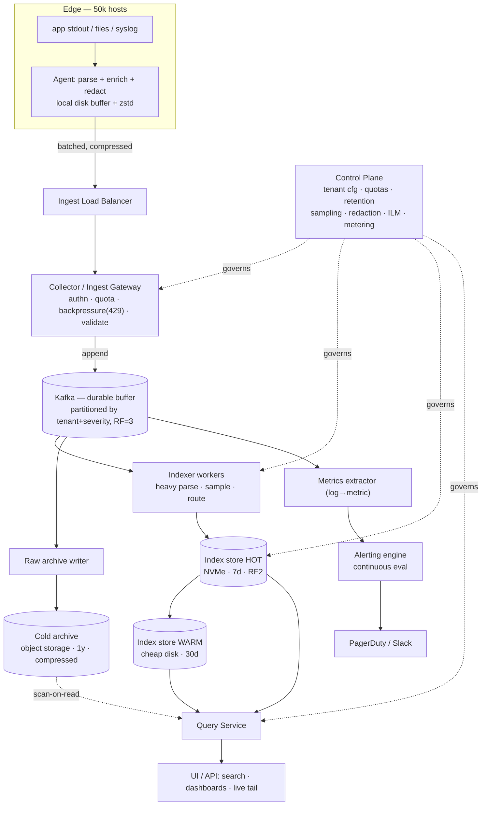

# Design a Log Collection & Analysis System

> Staff/principal-level HLD reference and interview-practice artifact.
> Category: Storage & Infrastructure. Think: Datadog Logs, Splunk, ELK (Elasticsearch/Logstash/Kibana), Grafana Loki, AWS CloudWatch Logs, Google Cloud Logging.

---

## 1. Problem & clarifying questions

### 1.1 Restating the problem

We are building a **multi-tenant log collection and analysis platform**. Thousands of services across many hosts/containers emit log lines. We must **collect** those lines reliably from the edge, **transport** them to a central pipeline without losing data (or losing it predictably under stress), **store** them cost-effectively, **index** them so engineers can search and filter quickly, **query** them interactively (full-text search, field filters, aggregations) and **alert** on patterns (e.g., "error rate > X"). The system spans the full lifecycle: *agent → buffer → pipeline → index/store → query/UI → retention/expiry*.

The defining characteristic of this domain — and the thing that separates a senior answer from a junior one — is that **logs are a write-heavy, append-only, time-series-shaped firehose whose value decays sharply with age, and the dominant design constraint is cost, not latency.** Almost every decision (sampling, tiered retention, index granularity, structured-vs-raw storage) is ultimately a knob on the cost/recall/latency triangle. A junior candidate designs "Elasticsearch + Kibana." A senior candidate designs the **economics** of log storage and defends where they spend index dollars.

### 1.2 Clarifying questions I would ask the interviewer

I never start drawing boxes. I'd spend the first 3–5 minutes pinning down scope. The questions below are grouped; the answers materially change the design.

**Functional scope**

1. **Collection only, or full analysis?** Are we just shipping logs to storage (a "log pipeline"), or do we own the search UI, dashboards, and alerting too? (I'll assume full stack.)
2. **What log shapes?** Free-text unstructured lines (`2026-06-25 ERROR NullPointerException at ...`), structured JSON, or both? Do we control the emit format or must we ingest arbitrary text? (Assume both; we encourage structured but must accept unstructured.)
3. **Search semantics required?** Full-text keyword search? Field-equality filters (`service=checkout AND status=500`)? Numeric range and aggregations (`p99 latency by host`)? Regex/wildcard? Each tier costs more. (Assume keyword + field filters + time-bounded aggregations; regex best-effort.)
4. **Alerting?** Threshold alerts on log-derived metrics, pattern-match alerts ("page me on any `OutOfMemoryError`"), anomaly detection? (Assume threshold + pattern alerts.)
5. **Tail/live mode?** Do users need `tail -f`-style live streaming of new logs? (Assume yes, best-effort.)
6. **Retention policy?** How long must logs be queryable? Same for all logs or per-tenant/per-source tiers? Any compliance retention (e.g., audit logs kept 7 years, immutable)? (Assume hot 7d, warm 30d, cold/archive 1y, plus a compliance lane.)

**Non-functional**

7. **Scale.** How many hosts/agents? Log volume in events/sec and bytes/sec? Average line size? Peak-to-average ratio (incidents cause log storms — this is the crux)? (I'll estimate below; assume large.)
8. **Ingestion durability.** Is it acceptable to drop logs under extreme overload, or must we never lose a line? Logs are usually **best-effort with graceful degradation**, unlike payments. (Assume best-effort with bounded, *prioritized* loss — drop debug before error.)
9. **Query latency target.** Interactive search p95? (Assume p95 < 2–5s for hot-tier queries over a bounded time window; cold queries can be minutes.)
10. **Freshness / ingestion lag.** Time from emit to searchable? (Assume p95 < 30s, target < 10s.)
11. **Availability.** Ingestion is the critical path — if collection is down, logs are lost forever (no replay from source). Query availability is less critical. (Assume ingestion 99.9%+, query 99.5%.)
12. **Multi-tenancy & isolation.** One big internal platform with team-level tenants, or external SaaS with hard tenant isolation and per-tenant billing/quotas? (Assume internal-platform with strong soft isolation + quotas; design notes for hard SaaS isolation.)
13. **Security/PII.** Do logs contain secrets/PII that must be redacted or access-controlled? Encryption at rest/in transit? (Assume yes — redaction at the edge, RBAC, encryption everywhere.)

**Out of scope (confirm)**

14. Metrics and distributed tracing pipelines (related but separate systems — I'll note where logs feed metrics). APM. The services *producing* the logs. Long-term BI/data-warehouse analytics (we hand cold data to the lake).

### 1.3 Assumptions I'll proceed with

- **Full stack**: agent + pipeline + index/store + query UI + alerting.
- **Both** structured (JSON, preferred) and unstructured logs.
- **Search**: keyword full-text + field filters + time-bounded aggregations; live tail best-effort.
- **Scale**: ~50,000 hosts/containers, **1,000,000 log events/sec average**, **5,000,000/sec peak** (5× during incidents), **~500 bytes/event average** (after light structuring).
- **Durability**: best-effort, prioritized drop under overload (severity-aware), bounded by buffer capacity. No source-side replay.
- **Latency**: ingest-to-searchable p95 < 30s; hot query p95 < 5s.
- **Retention tiers**: hot 7d (indexed, fast), warm 30d (indexed, slower/cheaper), cold/archive 1y (object storage, slow query), compliance lane (immutable, up to 7y).
- **Multi-tenant** internal platform: hundreds of teams, soft isolation + per-tenant quotas + chargeback.

---

## 2. Requirements (finalized)

### 2.1 Functional

- **F1 — Collect**: a lightweight agent on every host/container tails files, reads container stdout/stderr, or accepts syslog/HTTP, and ships lines with metadata (host, service, container, k8s labels, severity, timestamp).
- **F2 — Parse/enrich**: extract structured fields from common formats; attach tenant, environment, region; redact PII; normalize timestamps.
- **F3 — Transport reliably**: durable buffering between agent and backend so transient outages don't lose logs; backpressure handling.
- **F4 — Index & store**: make logs searchable by full-text and by field; store raw line losslessly.
- **F5 — Query**: full-text search, field filters, boolean combinations, time-range scoping, aggregations (count/histogram/top-N), live tail.
- **F6 — Alert**: pattern alerts and threshold alerts on log-derived metrics; notify via existing channels.
- **F7 — Retention & lifecycle**: tiered hot/warm/cold, automatic rollover and expiry, per-tenant retention policies.
- **F8 — Multi-tenancy**: per-tenant quotas (ingest rate, storage, query concurrency), isolation, usage metering/chargeback.

### 2.2 Non-functional

| Property | Target | Rationale |
|---|---|---|
| Ingestion availability | 99.95% | Logs unrecoverable if dropped at source; protect the front door. |
| Query availability | 99.5% | Degraded query is survivable; ingestion is not. |
| Ingest→searchable latency | p95 < 30s, p50 < 10s | Engineers debugging incidents need near-real-time. |
| Hot query latency | p95 < 5s over ≤7d window | Interactive debugging UX. |
| Cold query latency | minutes acceptable | Archive is rare-access. |
| Durability (hot/warm) | replicated, survive node loss | But best-effort end-to-end (source can't replay). |
| Durability under overload | prioritized, bounded loss | Drop DEBUG/INFO before WARN/ERROR. |
| Consistency | eventual / read-your-recent-writes not required | Logs are append-only facts; ordering is best-effort per-source. |
| Scalability | linear with hosts and volume | Sharded everywhere. |
| Cost | the primary optimization target | Index/storage dominate spend. |

### 2.3 Key non-obvious assumptions (flagged)

- **Logs are append-only and immutable.** No updates, no deletes (except bulk expiry). This unlocks huge simplifications: no transactions, no read-modify-write, segment files can be immutable and merged.
- **Value decays with age.** A 5-minute-old ERROR is gold; a 60-day-old DEBUG is near-worthless. This justifies tiered storage and aggressive sampling of low-value logs.
- **The peak is the design point, not the average.** Incidents cause log storms exactly when the system is most stressed and most needed. Backpressure handling is a first-class deep dive, not an afterthought.
- **Cost is the constraint that kills naive designs.** Indexing everything in Elasticsearch at this volume is financially impossible. The art is deciding what to index, what to sample, and what to store raw.

---

## 3. Capacity estimation

Show the arithmetic; flag every assumption.

### 3.1 Ingestion volume

- Average events/sec: **1,000,000 EPS** (events per second).
- Average bytes/event: **500 B** (assumption: structured JSON, modest field count; real-world ranges 200 B–2 KB).
- **Average ingest throughput** = 1e6 × 500 B = **500 MB/s** = **0.5 GB/s**.
- **Peak** (5×): **5,000,000 EPS = 2.5 GB/s**.

Daily volume (average):
- Events/day = 1e6 × 86,400 ≈ **8.64 × 10¹⁰ events/day (~86 billion)**.
- Bytes/day = 0.5 GB/s × 86,400 s ≈ **43.2 TB/day raw**.

### 3.2 Storage

Per-day raw = **43.2 TB**. We never store all of it indexed; we apply compression, sampling, and tiering.

**Compression.** Log text compresses extremely well (repetitive tokens, timestamps, hostnames). Assume **~10× compression** for raw stored logs (gzip/zstd on object storage), **but indexes inflate**:
- **Inverted index overhead**: a full-text index (term → posting list of doc IDs) typically adds **0.5×–1.5× the raw size**. With doc values for aggregations and field mappings, indexed footprint can be **1×–2× the raw uncompressed size** before its own compression. Assume hot-tier indexed data lands at **~0.8× raw** after Elasticsearch's internal compression (i.e., ~35 TB/day indexed if we indexed everything — we won't).

**Tiering plan (after sampling):**

Assume sampling/retention policy keeps:
- **100%** of WARN/ERROR/FATAL (assume 5% of volume) fully indexed.
- **10%** of INFO (assume 60% of volume) indexed, rest stored raw-compressed.
- **1%** of DEBUG (assume 35% of volume) indexed, rest dropped or raw-compressed at edge.

Indexed events/day ≈ (0.05×1.0 + 0.60×0.10 + 0.35×0.01) × 86.4e9
= (0.05 + 0.06 + 0.0035) × 86.4e9 ≈ **0.1135 × 86.4e9 ≈ 9.8 billion events/day indexed** (~11% of volume).

- **Hot tier (7d, fully indexed, replicated ×2):**
  Indexed bytes/day ≈ 11% × 43.2 TB × ~0.8 (index factor) ≈ **~3.8 TB/day indexed**.
  × 7 days × 2 replicas ≈ **~53 TB hot, indexed, replicated**.
- **Warm tier (30d, indexed, replica ×1, slower hardware):**
  Carry the same indexed data 30d at ×1 replica ≈ 3.8 TB/day × 30 ≈ **~114 TB warm**.
- **Cold/archive (1y, raw compressed in object storage, ×1 with erasure coding):**
  Raw 43.2 TB/day ÷ 10 (compression) ≈ **4.3 TB/day** × 365 ≈ **~1.6 PB/year cold**.
- **Compliance lane** (audit logs only, immutable, 7y): assume audit ≈ 1% of volume → 0.43 TB/day ÷10 ≈ 43 GB/day × 365 × 7 ≈ **~110 TB**.

**Takeaway number to say out loud:** "If we naively indexed everything in the hot tier with replication, we'd be writing ~70 TB/day and storing ~500 TB just for one week of hot data. Sampling + tiering cuts the indexed footprint by ~9× to ~53 TB hot — that's the single highest-leverage cost decision in this design."

### 3.3 Bandwidth

- Ingest into pipeline: **0.5 GB/s avg, 2.5 GB/s peak** (must size network + Kafka for peak).
- Kafka replication (RF=3): write amplifies ×3 across brokers → **~1.5 GB/s avg cross-broker, 7.5 GB/s peak**.
- Indexer read from Kafka + write to index ≈ another **0.5–1 GB/s**.
- Plan agent-side compression (zstd) on the wire → cut edge→pipeline bandwidth ~5–8×, so the **WAN/agent egress is ~70–100 MB/s avg** (huge cost saving on cross-AZ/cross-region traffic).

### 3.4 QPS — query side

Queries are tiny compared to writes. Assume 5,000 engineers, each running ~50 searches/day during active debugging, bursty during incidents:
- ≈ 250,000 queries/day → **~3 QPS average**, but **bursty to ~100–500 QPS** during a major incident when everyone piles in.
- Each query can be **expensive** (scatter-gather across many index shards). The query tier must size for **fan-out cost and concurrency**, not raw QPS.
- Alerting adds continuous query load: thousands of saved alert rules evaluated on a schedule (or streamed) — design these as **streaming/continuous queries**, not polling the index, to avoid hammering it.

### 3.5 Server / shard counts (rough)

- **Kafka**: 2.5 GB/s peak × RF3 = 7.5 GB/s replicated write. A well-provisioned broker handles ~150–250 MB/s sustained write. → ~30–50 brokers for ingest, round up to **~60 brokers** with headroom. Partition count sized so each partition stays under broker throughput and consumer parallelism is sufficient — e.g., **~2,000–4,000 partitions** across topics (tenant/severity-routed).
- **Index/search cluster (hot)**: 3.8 TB/day × 7d × 2 = ~53 TB. A hot data node with NVMe holds ~2–4 TB of *queryable* indexed data while keeping query latency low (memory:disk ratio matters — see deep dive). → **~20–30 hot data nodes**, plus dedicated master/coordinator nodes. Index sharded by **time + tenant**, e.g., daily indices each split into N primary shards (~10–50 GB/shard target).
- **Warm nodes**: cheaper, denser disk, ~114 TB → **~15–25 warm nodes** (HDD/cheap SSD, higher data-per-node, slower queries OK).
- **Object storage (cold)**: ~1.6 PB/yr — managed service (S3/GCS), no server count, but a fleet of **stateless cold-query workers** that read compressed objects and scan on demand.
- **Ingest/indexer workers**: stateless consumers reading Kafka, parsing/enriching, writing to index — scale horizontally, **~50–100 pods** sized to peak.
- **Edge agents**: 1 per host = **~50,000 agents** (not "servers" — sidecar/daemonset footprint).

---

## 4. API design

Four surfaces: **ingest** (agent → backend), **query**, **admin/policy**, and **alerting**.

### 4.1 Ingest API (agent → collector)

High-throughput, batched, compressed. Prefer a binary/length-prefixed protocol or gRPC; HTTP shown for clarity.

```
POST /v1/ingest
Headers:
  Content-Encoding: zstd
  X-Tenant-Id: <tenant>
  X-Agent-Id: <agent>
  Idempotency-Key: <batch-uuid>      # for safe retries (see §9)
Body (decompressed, NDJSON — one JSON object per line):
  {"ts":"2026-06-25T10:00:00.123Z","sev":"ERROR","svc":"checkout",
   "host":"h-9123","k8s":{"ns":"prod","pod":"checkout-7f"},
   "msg":"NPE at OrderService.line 88","trace_id":"abc123", ...}
  {...}

Response 200:
  {"accepted": 4096, "rejected": 0, "next_backoff_ms": 0}
Response 429 (backpressure / quota):
  {"accepted": 0, "retry_after_ms": 2000, "reason": "tenant_quota"}
Response 413 (batch too large) / 400 (malformed)
```

Design notes:
- **Batched + compressed**: a single request carries thousands of lines. This is essential at 1M+ EPS.
- **Idempotency key per batch**: the collector dedupes on retry so an agent that times out and retries doesn't double-write (best-effort dedupe within a short window — full exactly-once is not promised; see §9).
- **429 with `retry_after_ms`**: the **backpressure signal**. The collector pushes load back to the agent, which buffers locally. This is the core of the spike-handling story.
- **Severity present at ingest** so the pipeline can route/sample by severity early.

### 4.2 Query API

```
POST /v1/query
Body:
  {
    "tenant": "team-checkout",
    "time": {"from":"2026-06-25T09:00:00Z","to":"2026-06-25T10:00:00Z"},
    "query": "status:500 AND svc:checkout AND \"NullPointer\"",
    "limit": 100,
    "sort": "ts_desc",
    "aggregations": [
      {"type":"date_histogram","field":"ts","interval":"1m"},
      {"type":"terms","field":"host","size":10}
    ],
    "cursor": null
  }
Response 200:
  {
    "hits": [ {"ts":..., "msg":..., "fields":{...}}, ... ],
    "total_estimate": 152340,
    "aggregations": {...},
    "cursor": "eyJ0cyI6...",        # opaque pagination cursor
    "took_ms": 850,
    "tiers_scanned": ["hot"],       # transparency on cost
    "partial": false                # true if some shards timed out
  }
```

```
GET  /v1/tail?tenant=...&query=...        # WebSocket / SSE live stream of new matching lines
GET  /v1/fields?tenant=...                 # field discovery / autocomplete (known field names + types)
```

Design notes:
- **Time range is mandatory** (or strongly defaulted). Unbounded time = full-cluster scan = cost bomb. The API forces a bounded window.
- **Cursor-based pagination** (search-after), not offset — offset pagination over a firehose is O(N) and breaks as new data arrives.
- **`partial: true`** lets us return fast, incomplete results rather than blocking on a slow/dead shard (availability > completeness for logs).
- **`tiers_scanned`** surfaces cost/latency: a query that touches cold tier warns the user it'll be slow.

### 4.3 Admin / policy API

```
PUT  /v1/tenants/{id}/quota        {ingest_eps, storage_gb, query_concurrency}
PUT  /v1/tenants/{id}/retention    {hot_days, warm_days, cold_days, compliance:bool}
PUT  /v1/tenants/{id}/sampling     {rules:[{match:"sev:DEBUG", keep_ratio:0.01}, ...]}
PUT  /v1/tenants/{id}/redaction    {patterns:[{regex:"\\b\\d{16}\\b", action:"mask"}]}
```

### 4.4 Alerting API

```
POST /v1/alerts
Body:
  {
    "name": "checkout 5xx spike",
    "tenant": "team-checkout",
    "type": "threshold",            # or "pattern"
    "query": "svc:checkout AND status:5xx",
    "window": "5m",
    "condition": "count > 100",
    "notify": ["pagerduty:team-checkout", "slack:#checkout-alerts"]
  }
```

---

## 5. High-level architecture

### 5.1 Component walkthrough (follow a log line)

1. **Edge agent** (daemonset/sidecar) tails the file/stdout, parses, enriches (host, k8s labels, tenant), redacts PII, **buffers locally** (disk-backed ring buffer), compresses, and ships batches to the collector.
2. **Collector / ingest gateway** (stateless, behind an L4/L7 load balancer) authenticates the tenant, enforces **quota + backpressure** (429s), does light validation, and **appends to Kafka**. It is intentionally dumb and fast — its only job is to get bytes durably into the buffer.
3. **Kafka (the durable buffer / shock absorber)** decouples ingest rate from index rate. Topics partitioned by tenant + severity. This is what absorbs the 5× spike: the collector keeps accepting, Kafka soaks it up, indexers drain at their own pace.
4. **Stream processors / indexer workers** (stateless Kafka consumers) do heavier parsing, schema extraction, **sampling decisions**, routing, and fan out to:
   - **Index/search store** (hot) — the inverted index (Elasticsearch/OpenSearch-style) for searchable data.
   - **Raw archive writer** — batches raw compressed logs to object storage (all logs, even unindexed).
   - **Metrics extractor** — derives counts/rates feeding the alerting engine (log-to-metric).
5. **Index store (hot/warm)** holds time-bucketed, tenant-partitioned indices. Hot = NVMe, fast. Warm = cheaper disk, older data.
6. **Cold archive (object storage)** holds everything, compressed, cheap, slow to query (scan-on-read via cold-query workers).
7. **Query service** parses the user query, decides which tiers/shards to hit, scatter-gathers, merges, paginates, returns. Enforces per-tenant query quotas.
8. **Alerting engine** runs continuous/streamed evaluation of alert rules against the log-derived metric stream (and pattern matches on the Kafka stream), firing to notification channels.
9. **UI** (Kibana/Grafana-style) for search, dashboards, live tail.
10. **Control plane**: tenant config, quotas, retention/sampling/redaction policies, index lifecycle management (rollover, tier migration, expiry), and metering/billing.

### 5.2 ASCII block diagram

```
 ┌──────────────────────────────────────────── EDGE (50k hosts) ───────────────────────────────────────┐
 │   app stdout / files / syslog                                                                        │
 │         │                                                                                            │
 │   ┌─────▼──────┐   parse + enrich + redact + LOCAL DISK BUFFER + zstd compress                       │
 │   │   Agent    │ ───────────────── batched, compressed ─────────────────┐                            │
 │   └────────────┘   (backs off on 429)                                   │                            │
 └─────────────────────────────────────────────────────────────────────────┼─────────────────────────┘
                                                                            │
                                                              ┌─────────────▼──────────────┐
                                                              │  Ingest LB  (L4/L7)         │
                                                              └─────────────┬──────────────┘
                                                ┌───────────────────────────▼───────────────────────────┐
                                                │  Collector / Ingest Gateway (stateless, autoscaled)    │
                                                │  authn • quota • BACKPRESSURE (429) • validate         │
                                                └───────────────────────────┬───────────────────────────┘
                                                                            │ append
                                          ┌─────────────────────────────────▼─────────────────────────────────┐
                                          │            KAFKA  — durable buffer / shock absorber                │
                                          │   topics partitioned by tenant + severity ; RF=3 ; retention 24–72h │
                                          └───┬───────────────────────────────┬───────────────────────────┬────┘
                                              │                               │                           │
                       ┌──────────────────────▼─────┐        ┌────────────────▼────────┐      ┌───────────▼────────────┐
                       │  Indexer workers (consumers)│        │  Raw archive writer      │      │  Metrics extractor      │
                       │  heavy parse • SAMPLE • route│       │  batch → object storage  │      │  log→metric for alerts  │
                       └───────┬─────────────────────┘        └───────────┬──────────────┘      └───────────┬───────────┘
                               │ index writes                             │                                 │
        ┌──────────────────────▼───────────────────────┐     ┌────────────▼─────────────┐    ┌──────────────▼────────────┐
        │   INDEX / SEARCH STORE                        │     │   COLD ARCHIVE           │    │   ALERTING ENGINE          │
        │   ┌─────── HOT (NVMe, 7d, RF2) ───────┐       │     │   object storage (1y)    │    │   continuous eval → notify │
        │   │ daily indices, sharded by tenant  │       │     │   compressed, scan-on-   │    └────────────────────────────┘
        │   └───────────────────────────────────┘       │     │   read via cold workers  │
        │   ┌─────── WARM (cheap disk, 30d) ────┐        │     └──────────────────────────┘
        │   └───────────────────────────────────┘        │
        └────────────────────┬──────────────────────────┘
                             │ scatter-gather
                ┌─────────────▼─────────────┐         ┌──────────────────────────────┐
                │      Query Service         │◄────────│  CONTROL PLANE                │
                │  parse • plan tiers • merge│         │  tenant cfg • quotas • ILM     │
                │  per-tenant query quota    │         │  retention/sampling/redaction │
                └─────────────┬─────────────┘         │  metering / chargeback         │
                             │                        └──────────────────────────────┘
                      ┌───────▼────────┐
                      │   UI / API     │  search • dashboards • LIVE TAIL
                      └────────────────┘
```

### 5.3 Mermaid diagram



### 5.4 Key flow — ingest under a spike (sequence)

```mermaid
sequenceDiagram
  participant A as Agent
  participant C as Collector
  participant K as Kafka
  participant I as Indexer
  participant E as Index Store

  Note over A,E: Normal flow
  A->>C: POST /ingest (batch, zstd, idempotency-key)
  C->>K: append (partition by tenant+sev)
  C-->>A: 200 accepted=4096
  I->>K: consume
  I->>I: parse + sampling decision
  I->>E: bulk index (sampled subset)

  Note over A,E: Log STORM (5x) — Kafka lag grows
  A->>C: POST /ingest (huge batch)
  C->>C: tenant over quota OR Kafka write slow
  C-->>A: 429 retry_after_ms=2000, reason=quota
  A->>A: buffer to local disk, exp backoff, drop DEBUG first
  Note over I,E: Indexer drains Kafka at steady rate;<br/>severity-aware sampling sheds INFO/DEBUG;<br/>ERROR/FATAL still fully indexed
```

---

## 6. Data model & storage choices

### 6.1 The log event (canonical schema)

Every event normalizes to a small required envelope + an open bag of fields:

```jsonc
{
  // --- required envelope (always present, always indexed) ---
  "ts":        "2026-06-25T10:00:00.123Z",  // event time, normalized to UTC
  "ingest_ts": "2026-06-25T10:00:03.900Z",  // arrival time (for lag/ordering)
  "tenant":    "team-checkout",
  "sev":       "ERROR",                       // FATAL|ERROR|WARN|INFO|DEBUG|TRACE
  "svc":       "checkout",
  "host":      "h-9123",
  "msg":       "NullPointerException at OrderService:88",  // raw line / free text
  "log_id":    "01J...ULID",                  // sortable unique id (ULID/Snowflake)

  // --- structured fields (variable; indexed selectively) ---
  "fields": {
    "status": 500,
    "trace_id": "abc123",
    "k8s.namespace": "prod",
    "k8s.pod": "checkout-7f",
    "latency_ms": 842
  }
}
```

Design choices:
- **`ts` vs `ingest_ts` split** — event time (when it happened) drives queries; ingest time measures pipeline lag and provides a monotonic anchor when clocks skew. Out-of-order arrival is normal; we index by `ts` but watermark on `ingest_ts`.
- **`log_id` is a sortable ULID** — gives a total-ish order and a dedupe key without coordination.
- **`msg` always stored raw**, even when structured fields are extracted — never lose the original line (debugging needs it).
- **Open `fields` bag** — we can't predict every field. But indexing arbitrary fields explodes the inverted index (mapping explosion). We index a **curated set** of high-cardinality-controlled fields and leave the rest searchable only via full-text on `msg`.

### 6.2 Why these datastores (justified against access patterns)

The single most important storage insight: **logs have three distinct access patterns, and no one store serves all three well.** We use a **polyglot** design.

| Need | Access pattern | Chosen store | Why / failure mode avoided |
|---|---|---|---|
| **Durable transport buffer** | append-only, high-throughput sequential write, replayable | **Kafka** (or Pulsar/Kinesis) | Decouples ingest from index rate; absorbs spikes; replay on indexer failure. Avoids: losing logs when the index can't keep up. |
| **Interactive search (hot)** | full-text + field filter + aggregations over recent, bounded time | **Inverted-index store** (Elasticsearch/OpenSearch) | Built for full-text + ad-hoc filters + aggregations. Avoids: O(N) scans that make interactive debugging impossible. |
| **Cheap long-term retention** | rare, large scans; mostly write-once-read-never | **Object storage** (S3/GCS) + columnar/compressed files (e.g., Parquet for structured) | ~10–20× cheaper than indexed storage; near-infinite scale. Avoids: paying index prices to store logs nobody queries. |
| **Log-derived metrics for alerting** | continuous aggregation, time-series reads | **Time-series store** (Prometheus/Mimir/VictoriaMetrics) | Cheap, fast range queries; alert eval doesn't hammer the index. Avoids: thousands of alert rules polling Elasticsearch. |
| **Control plane / metadata** | small, transactional, strongly consistent | **Relational DB** (Postgres) | Tenant config, quotas, retention policies need ACID. Tiny scale. |

**Why not "just Elasticsearch for everything"?** Because indexing the full 43 TB/day with replication is financially ruinous and the index inflates storage rather than shrinking it. ES is the *premium* tier; we ration it. This is the central tradeoff of the whole system.

**Why not "just object storage + scan" (Loki-style)?** Grafana Loki's model — index only labels (metadata), store log *bodies* unindexed and compressed, scan on query — is dramatically cheaper. But full-text queries over large windows become slow scans. We adopt a **hybrid**: index-light for high-volume low-value logs (Loki-style), full inverted index for low-volume high-value logs (ERROR/WARN). The right answer is per-log-class, not global.

### 6.3 Index layout (hot/warm)

- **Index per tenant per day** (or per few hours for very high-volume tenants): `logs-{tenant}-{yyyy.mm.dd}`. Time-bucketing means **expiry = drop a whole index** (cheap, O(1)) rather than deleting documents (expensive). It also bounds query scope: a 1-hour query only touches today's index.
- **Shards sized ~10–50 GB** each. Too many tiny shards = overhead and slow scatter-gather; too few huge shards = poor parallelism and slow recovery.
- **Rollover by size/age** via Index Lifecycle Management (ILM): hot → warm → cold → delete, automatically.

---

## 7. Deep dives

This is the bulk. Five hard sub-problems: (7.1) high-throughput ingestion & the durable buffer, (7.2) the indexing/search store and its cost, (7.3) backpressure under log storms, (7.4) sampling & retention tiers (cost control), (7.5) querying at scale + multi-tenancy.

---

### 7.1 Deep dive — High-throughput ingestion: agents → buffer → index

**Problem.** 1M–5M EPS from 50k agents, no source-side replay, must not collapse under spikes. Where do we put durability and how do we get bytes in fast?

#### 7.1.1 The agent

The agent is on the critical path and runs on customer/production hosts, so it must be **lightweight, bounded, and never take down the host**.

- **Tailing**: follows file rotation (inode tracking), reads container runtime logs, accepts syslog/journald. Tracks a **checkpoint (file offset)** persisted to disk so a restart resumes where it left off (no duplicates, no gaps — at-least-once from the file).
- **Local disk buffer (ring buffer)**: this is the first line of defense against backpressure. When the backend 429s or is unreachable, the agent buffers to a **bounded** on-disk queue. Bounded is critical — an unbounded buffer fills the disk and crashes the host (worse than dropping logs). When full, it drops by **severity policy** (DEBUG first).
- **Batching + compression**: accumulate N lines or T ms, zstd-compress, ship. Cuts request overhead and bandwidth ~5–8×.
- **Backoff**: honors `retry_after_ms`; exponential backoff with jitter to avoid thundering-herd reconnects after a backend blip.
- **Resource caps**: hard CPU/memory limits; the agent must degrade (sample/drop) rather than starve the application it's monitoring. **Failure mode avoided:** a logging agent that OOMs the production service it's supposed to observe.

#### 7.1.2 The collector (ingest gateway)

Deliberately **stateless and minimal**: authenticate, check quota, enforce backpressure, append to Kafka, ack. No parsing, no indexing on the hot path. Why: the collector must handle peak with low latency; any heavy work here becomes the bottleneck. Heavy work moves to the async indexer stage.

#### 7.1.3 Where durability lives: Kafka as the shock absorber

**The single most important architectural decision in ingestion: insert a durable, replayable buffer (Kafka) between collection and indexing.**

Why a log/queue and not direct-to-index?

| Option | Throughput | Spike absorption | Replay on indexer failure | Backpressure model | Verdict |
|---|---|---|---|---|---|
| Agent → Index directly | High but couples ingest to index speed | None — index falls over | None — logs lost | Index latency = ingest latency | **Reject**: index hiccup = data loss + ingest stall |
| Agent → Collector → **Kafka** → Indexer | Very high (sequential append) | Excellent — retention 24–72h soaks spikes | Yes — reprocess from offset | Clean: Kafka lag is the signal | **Choose** |
| Agent → Collector → in-memory queue → Indexer | High | Limited by RAM | None on crash | Fragile | Reject: not durable |

**Kafka specifics:**
- **Partitioning by tenant + severity.** Tenant for isolation (one noisy tenant's lag doesn't block others if consumers are tenant-aware). Severity so we can **prioritize**: indexers can drain ERROR partitions ahead of DEBUG, and we can shed DEBUG by simply not consuming it under stress.
- **RF=3** for broker durability; `acks=all` from collector so a batch is durable across 3 brokers before we ack the agent. (Tradeoff: higher ingest latency vs. survive broker loss. For logs, we might relax to `acks=1` for non-critical severities to cut latency — a tunable per-severity durability knob.)
- **Short retention (24–72h)**: Kafka is a buffer, not the store. Long enough to survive a multi-hour indexer outage and reprocess; short enough to keep Kafka disk costs bounded.
- **Consumer groups** = indexer workers; partition count sets max parallelism. We oversize partitions (~2–4k) so we can scale consumers out during spikes without repartitioning (repartitioning breaks key ordering).

**Failure mode avoided by Kafka:** the *correlated-spike-plus-index-slowdown death spiral*. During an incident, log volume spikes 5× exactly when the index is also under query pressure from debugging engineers. Without a buffer, the index can't keep up, ingest backs up to the collector, collector backs up to agents, and either logs are lost or agents OOM. With Kafka, the collector keeps accepting at full rate, Kafka absorbs the burst into disk, and indexers drain at a steady, survivable rate — the spike becomes *lag* (a few minutes of ingestion delay), not *loss* or *outage*.

#### 7.1.4 Indexer workers

Stateless Kafka consumers doing the expensive work off the hot path: full parse, schema/field extraction, **sampling decision** (§7.4), PII redaction (defense-in-depth, even though the agent also redacts), routing to hot index / archive / metrics. They **bulk-write** to the index (e.g., ES `_bulk`) in large batches — bulk indexing is dramatically more efficient than per-doc. On crash, a new worker resumes from the last committed Kafka offset (at-least-once → occasional duplicate, deduped by `log_id`).

---

### 7.2 Deep dive — The indexing/search store and its cost

**Problem.** Make logs searchable interactively while not bankrupting the company. This is where ELK's cost reputation comes from.

#### 7.2.1 What an inverted index is, and why it's expensive

An **inverted index** maps each *term* (word/token) to a **posting list** — the IDs of documents containing it — so a keyword search is a fast lookup + list merge instead of scanning every document. For field filters, the store also keeps **doc values** (a columnar per-field structure) so it can aggregate (`count by host`) without scanning. This is what makes `status:500 AND "NullPointer"` return in milliseconds over millions of docs.

The cost: building and storing this index is expensive in **CPU (tokenizing/analyzing every line), memory (segment metadata, field-data caches), and disk (the index can equal or exceed raw size).** Indexing *everything* at 43 TB/day is the trap.

#### 7.2.2 Levers to control index cost

| Lever | What it does | Cost saved | Tradeoff / failure mode |
|---|---|---|---|
| **Don't index every field** | Index curated fields; everything else only full-text on `msg` | Huge — avoids mapping explosion (thousands of dynamic fields each with index structures) | Can't field-filter on un-indexed fields; mitigate with full-text fallback |
| **Index-light for high-volume logs** (Loki-style) | Index only metadata/labels; store body compressed, scan on query | ~10× on storage for those logs | Slower full-text over large windows for those logs |
| **Severity-tiered indexing** | Full index for ERROR/WARN; sampled/index-light for INFO/DEBUG | Matches spend to value | Sampled INFO has gaps (acceptable — see §7.4) |
| **Time-bucketed indices + ILM** | Roll hot→warm→cold; query touches only relevant buckets | Hot-node count tracks 7d not 1y | Older queries slower (acceptable) |
| **Tune replication per tier** | Hot RF2 (HA + query throughput), warm RF1 (recovery from snapshot OK) | ~33% on warm storage | Warm node loss → restore from snapshot, brief unavailability |
| **Right-size shards & force-merge** | Merge segments on read-only warm indices; ~10–50 GB shards | CPU/heap, faster queries | One-time merge CPU cost |
| **Compression codec** | `best_compression` (zstd/deflate) on warm/cold | Storage | Slightly slower decompress on query |

#### 7.2.3 Memory:disk ratio — the hidden hot-tier sizing constraint

A subtle senior point: hot-tier query latency depends on the **ratio of queryable data to node RAM** (filesystem cache + heap for field data). If a node holds 10 TB of index but has 64 GB RAM, most queries hit cold disk and latency tanks. Rule of thumb: keep hot **queryable** data per node to a few TB and provision RAM so the working set (recent, hot segments + field-data for common aggregations) stays cached. This is *why* hot nodes are expensive (NVMe + lots of RAM) and *why* we shrink the hot tier with sampling — every TB pushed out of hot saves premium hardware.

#### 7.2.4 Build vs. buy / engine choice

| Engine | Strength | Weakness | When |
|---|---|---|---|
| **Elasticsearch / OpenSearch** | Best-in-class full-text + aggregations, mature ILM, huge ecosystem | Expensive at scale; heap pressure; operational heft | Default for full-search hot tier |
| **Grafana Loki** | Index-light, cheap, object-storage native, great with k8s labels | Weak ad-hoc full-text over big windows | High-volume low-value logs; label-driven access |
| **ClickHouse** | Columnar, blazing aggregations, cheap storage, SQL | Full-text is bolt-on (tokenbf/ngram), more DIY | Structured logs + heavy analytics; cost-sensitive |
| **Splunk** | Powerful, turnkey, great search language | Very expensive licensing | If budget allows / enterprise mandate |

**Decision:** **hybrid** — Elasticsearch/OpenSearch for the full-search hot tier (ERROR/WARN + sampled INFO), a Loki/ClickHouse-style cheap path for high-volume INFO/DEBUG, object storage for cold. Defend it: *no single engine optimizes both interactive full-text and bulk cheap retention; forcing one engine to do both means either overpaying (all-ES) or under-serving search (all-Loki).*

---

### 7.3 Deep dive — Backpressure when log volume spikes

**Problem.** Incidents cause 5× log storms precisely when the system is most needed. We must degrade gracefully and **prioritize the logs that matter**, never collapse.

#### 7.3.1 The backpressure chain (where load is absorbed, in order)

1. **Indexer drains slower than Kafka fills → Kafka lag grows.** Kafka disk absorbs the burst. This is the *desired* first response: turn a spike into bounded lag.
2. **Lag crosses a threshold → autoscale indexers** (more consumers, up to partition count). Buys throughput.
3. **Lag still growing / tenant over quota → collector returns 429** with `retry_after_ms` to that tenant's agents. Backpressure propagates outward.
4. **Agent buffers locally to bounded disk queue**, backs off, and when the buffer fills, **sheds load by severity** (drop DEBUG, then INFO; keep WARN/ERROR/FATAL).
5. **Severity-aware sampling at the indexer** (§7.4) sheds low-value volume so the *index* sees a fraction of the storm even though the *archive* still captures everything cheaply.

Each layer absorbs what it can and pushes the rest outward, with **drops happening last and by priority**, at the edge, where it's cheapest and least harmful.

#### 7.3.2 Why backpressure, not just "scale up"

| Strategy | Pro | Con | Verdict |
|---|---|---|---|
| Pure autoscaling (no backpressure) | Simple mental model | Scaling lags the spike (minutes); a 5× instant burst overruns before nodes warm; index/Kafka have hard ceilings; cost balloons | Insufficient alone |
| **Backpressure + bounded buffers + priority shedding** | Survives instant bursts; bounded cost; protects high-value logs | More complex; some low-value logs dropped | **Choose** |
| Just drop on overflow (no priority) | Trivial | Drops ERROR as readily as DEBUG — loses the logs you need during the incident | Reject |

**Failure mode avoided:** the *retry storm / metastable failure*. If the collector simply slows down or fails without a clean backpressure signal, agents retry aggressively, multiplying load, and the system enters a metastable collapse it can't exit even after the original spike passes. Explicit 429 + `retry_after_ms` + jittered exponential backoff + bounded buffers prevents the retry amplification and lets the system recover deterministically.

#### 7.3.3 Severity-aware everything

Severity is threaded end-to-end: agent ships it, Kafka partitions on it, indexers sample/route on it, drops happen in severity order. This is the mechanism that lets us "lose logs predictably": we always keep the FATAL/ERROR needle and sacrifice the DEBUG haystack.

---

### 7.4 Deep dive — Sampling & retention tiers (cost control as the central tradeoff)

**Problem.** Storing and indexing all logs forever is impossible; storing none is useless. Where exactly do we cut, and how do we keep the cuts safe?

#### 7.4.1 The cost/recall/latency triangle

Every log decision trades three things: **cost** (storage + index $), **recall** (will the log I need be there?), and **latency** (how fast can I find it?). You can optimize any two. Sampling buys cost at the expense of recall; tiering buys cost at the expense of latency.

#### 7.4.2 Sampling strategies

| Strategy | How | Best for | Risk |
|---|---|---|---|
| **Severity sampling** | Keep 100% ERROR+, sample INFO/DEBUG | Default; cheap, value-aligned | Sampled INFO has gaps |
| **Tail-based / trace-aware** | Keep all logs for a request *if* it errored or was slow; sample the rest | Tracing-integrated debugging | Needs trace correlation, more state |
| **Rate-limit per source** | Cap EPS per service; a runaway loop can't drown the system | Protecting the platform | Drops some legit bursts |
| **Deterministic hash sampling** | Keep events where `hash(trace_id) % 100 < k` | Consistent sampling that keeps whole traces together | Still loses k% uniformly |
| **Dynamic/adaptive** | Lower keep-ratio as volume rises (budget-driven) | Bounded spend during storms | Variable recall |

**Decision:** **severity sampling as the baseline**, augmented by **tail-based sampling for traced requests** (keep everything for failed/slow requests) and **per-source rate limits** to contain runaway loggers. Defend: this aligns retained data with *debugging value* — you almost always want the full context of a *failed* request and rarely need the millionth identical successful DEBUG line.

**Critical nuance:** sampling decisions must be **consistent within a logical unit** (a request/trace). Randomly dropping 90% of a single failing request's logs leaves you with useless fragments. Hash on `trace_id` so you keep or drop a request's logs *together*.

**Also: always archive raw, even when not indexing.** Sampling decides what to *index* (expensive), not necessarily what to *store* (cheap). We can index 10% of INFO but still write 100% to compressed object storage. If you need the un-indexed logs later, you scan the archive (slow but possible). This separates "searchable" from "retained" — a key cost lever.

#### 7.4.3 Retention tiers (lifecycle)

| Tier | Age | Store | Replication | Query speed | Cost/GB | Purpose |
|---|---|---|---|---|---|---|
| **Hot** | 0–7d | NVMe index | RF2 | ms–seconds | $$$$ | Active debugging |
| **Warm** | 7–30d | Cheap disk index, force-merged, best_compression | RF1 | seconds | $$ | Recent investigations |
| **Cold/archive** | 30d–1y | Object storage, compressed (Parquet/zstd) | EC (erasure coded) | minutes (scan) | $ | Rare lookups, audits |
| **Compliance** | up to 7y | Object storage, immutable (object-lock/WORM) | EC, locked | minutes | $ | Legal/audit, can't delete |
| **Deleted** | > policy | — | — | — | — | Whole index/objects dropped (O(1)) |

**Lifecycle automation (ILM):** index rolls over by size/age; on schedule, hot→warm (move to cheaper nodes, drop replica, force-merge), warm→cold (export to object storage, drop from index cluster), cold→delete. **Expiry is a metadata operation** (drop an index / delete an object prefix), never per-document deletion — this is why time-bucketing the indices matters.

**Per-tenant retention policies** let teams (and billing) choose: a team can pay for 30d hot, or accept 3d hot to cut cost. This makes cost a tenant-owned, accountable decision rather than a platform-wide compromise.

#### 7.4.4 Structured vs. unstructured logs (a cost decision in disguise)

| | Unstructured (free text) | Structured (JSON / key-value) |
|---|---|---|
| Emit cost | Trivial (`log.info("user "+id+" failed")`) | Slight (must format fields) |
| Parse cost at ingest | High — regex/grok extraction, brittle | Low — fields are explicit |
| Index efficiency | Full-text only; can't field-filter/aggregate well | Field filters + aggregations cheap and powerful |
| Query power | Keyword search only | Filter, aggregate, dashboard, alert on fields |
| Storage | Slightly smaller raw | Slightly larger raw, but columnar-friendly |

**Position to take:** *push for structured logging at the source* (it makes everything downstream cheaper and more powerful), but **never require it** — we must ingest arbitrary text from legacy systems. So the pipeline does **best-effort parsing** (grok patterns, JSON detection, common formats) to lift fields out of unstructured lines, while always preserving the raw `msg`. Structured logs skip the expensive, brittle parse step and enable the rich queries that make field-filtering and aggregation cheap — which is *itself* a cost lever, because aggregations over structured fields are far cheaper than full-text scans.

---

### 7.5 Deep dive — Querying at scale & multi-tenancy

**Problem.** Bursty, expensive, fan-out queries from many tenants over sharded data, without one tenant or one bad query taking down search for everyone.

#### 7.5.1 Query execution: scatter-gather

A query for `status:500 svc:checkout` over the last 6 hours:
1. **Plan**: resolve which indices/tiers the time range touches (today's + maybe yesterday's hot indices). Reject/clamp unbounded time ranges.
2. **Scatter**: send the query to every relevant shard in parallel (a shard is a self-contained inverted index over a slice of the data).
3. **Each shard** does its local lookup/aggregation and returns top-K + partial aggregates.
4. **Gather/merge**: coordinator merges top-K (heap), combines partial aggregations, paginates via `search_after` cursor.
5. **Return** with `partial:true` if any shard timed out — **bounded latency beats completeness** for logs.

**Why bounded time range is enforced:** an unbounded query scatters to *every* shard across *every* tier — a single user can trigger a full-cluster scan. The API mandating a time window keeps fan-out proportional to the window. **Failure mode avoided:** one careless `*` query over 1 year DOS-ing the whole search cluster.

#### 7.5.2 Cold-tier query (scan-on-read)

When a query reaches into the cold tier, dedicated **stateless cold-query workers** read the relevant compressed objects from object storage (object keys are time/tenant-prefixed so we only fetch relevant prefixes), decompress, scan/filter, and stream results. Slow (minutes) but cheap and infinitely scalable (spin up workers per query). The UI warns the user (`tiers_scanned:["cold"]`) that it'll be slow.

#### 7.5.3 Multi-tenancy & isolation

The risk: a **noisy neighbor** — one tenant's volume or query load degrades everyone.

| Concern | Mechanism |
|---|---|
| **Ingest isolation** | Per-tenant ingest quota (EPS, bytes/s) at the collector; 429 the over-quota tenant only. Tenant-partitioned Kafka so one tenant's lag doesn't block others' consumers. |
| **Storage isolation** | Per-tenant indices + per-tenant storage quota; over-quota → stop indexing (still archive) or shrink retention. |
| **Query isolation** | Per-tenant **query concurrency limit** and **per-query resource budget** (max shards, max time, memory). A heavy tenant's queries queue without starving others. Circuit-break runaway queries. |
| **Data isolation** | Tenant scoping enforced server-side on every query (never trust client-supplied tenant); RBAC; encryption with per-tenant keys for hard-isolation SaaS. |
| **Fairness** | Weighted fair queuing across tenants in the query tier; reserve capacity for ERROR-tier ingestion. |
| **Metering / chargeback** | Track per-tenant ingest GB, indexed GB, storage GB-days, query cost; bill it back so cost is owned by the team that generates it. |

**Soft vs. hard isolation:** for an *internal* platform, soft isolation (shared cluster, per-tenant quotas + indices) is cost-efficient and sufficient. For *external SaaS*, you may need hard isolation: dedicated index clusters per large tenant, per-tenant encryption keys, network isolation — at higher cost. Decision is a business call; the design supports both by making isolation strength a per-tenant config.

**Chargeback as a design feature, not an afterthought:** when teams pay for their own logs, they self-regulate volume and retention. Metering turns the central cost tradeoff into thousands of small, locally-accountable decisions — the most scalable form of cost control.

---

## 8. Scaling & bottlenecks

### 8.1 How each tier scales

- **Agents**: scale 1:1 with hosts; no central bottleneck. Concern is aggregate egress and connection count to collectors → mitigate with batching/compression and connection pooling.
- **Collectors**: stateless → horizontal autoscale behind LB. Scale on CPU + connection count.
- **Kafka**: scale by adding brokers + partitions. Oversize partitions upfront (repartitioning is disruptive). Bottleneck: per-partition throughput and disk I/O.
- **Indexers**: stateless consumers → scale up to partition count. Bottleneck: index write throughput downstream.
- **Index cluster**: scale by adding data nodes + shards; ILM moves data off hot. Bottleneck: heap/RAM and indexing throughput.
- **Query tier**: coordinator nodes scale horizontally; scatter-gather fan-out is the cost. Bottleneck: shard count per query and concurrent heavy queries.
- **Cold workers**: stateless, scale per query; object storage is effectively infinite.

### 8.2 Where it breaks first, and the fix

| # | First bottleneck under growth | Symptom | Fix |
|---|---|---|---|
| 1 | **Index write throughput** | Kafka lag climbs, ingest→searchable latency blows past 30s | Sample harder (§7.4), add indexers + data nodes, bulk-write tuning, move low-value logs to index-light path |
| 2 | **Hot-tier RAM / heap** | Slow queries, GC pauses, OOM | Shrink hot retention, more sampling, add RAM/nodes, force-merge warm, push working set down |
| 3 | **Kafka disk** during a long indexer outage | Buffer fills, can't accept more | Larger Kafka disks, faster recovery, shed DEBUG into a separate short-retention topic |
| 4 | **Query fan-out** during incident | Search tier saturates, p95 spikes | Per-tenant concurrency limits, bounded time ranges, query result cache, dedicated incident-query capacity |
| 5 | **Mapping explosion** (too many dynamic fields) | Cluster state bloats, instability | Cap indexed fields, dynamic-mapping limits, full-text fallback for the long tail |
| 6 | **Hot tenant / runaway logger** | Noisy neighbor degrades others | Per-source rate limits, per-tenant quotas, fair queuing |
| 7 | **Cross-AZ/region bandwidth** | Network cost + saturation | Edge compression, regional collectors + regional pipelines, ship only aggregates cross-region |

### 8.3 Multi-region

Run a **full pipeline per region** (agents → collector → Kafka → index local to the region) to keep ingestion cheap and resilient to cross-region partition. Queries either run per-region with a global query federator that scatters across regional clusters and merges, or replicate only a thin global index/metadata layer. **Never** ship 0.5 GB/s of raw logs cross-region — keep data local, federate queries.

---

## 9. Reliability, consistency & security

### 9.1 Failure handling

- **Agent crash/restart**: resumes from persisted file checkpoint → at-least-once from file (no gap; possible small overlap, deduped by `log_id`). Local disk buffer survives short backend outages.
- **Collector loss**: stateless; LB routes around it; agents retry with backoff.
- **Kafka broker loss**: RF=3 + `acks=all` → no loss; partition leadership fails over.
- **Indexer crash**: new consumer resumes from committed offset → at-least-once → duplicate docs deduped by `log_id` on index (idempotent upsert by id).
- **Hot node loss**: RF2 → replica serves; lost shard re-replicates. Warm RF1 → restore from snapshot (brief unavailability of that slice, acceptable).
- **Index cluster degraded**: indexers keep consuming Kafka (lag grows but no loss within retention); queries return `partial:true`.
- **Object storage**: managed, 11-nines durability; cold is the durable system of record for raw logs.

### 9.2 Consistency model

- **Eventual consistency** end-to-end: an emitted log becomes searchable after pipeline lag (p95 < 30s). Acceptable — logs are append-only facts.
- **Ordering**: best-effort per source/partition (Kafka preserves per-partition order). Across sources, order by `ts` at query time; out-of-order arrival is normal and handled by indexing on event time with an `ingest_ts` watermark.
- **No transactions, no read-modify-write** — append-only immutability removes a whole class of consistency problems. We never promise read-your-writes faster than pipeline lag.
- **Duplicates**: at-least-once delivery → occasional dupes; **idempotent indexing by `log_id`** makes re-delivery harmless. End-to-end exactly-once is not promised (too costly for logs); idempotent dedupe gets us "effectively once" for searchable results.

### 9.3 Idempotency

- **Batch idempotency key** at the collector dedupes agent retries within a window.
- **`log_id` (ULID)** dedupes at the index (upsert by id) — handles indexer reprocessing after a crash.

### 9.4 Security

- **In transit**: mTLS agent↔collector and internally; tenant auth via signed tokens/keys.
- **At rest**: encryption on index disks and object storage; per-tenant keys for hard-isolation SaaS.
- **PII/secrets redaction at the edge** (agent) — regex/pattern masking of card numbers, tokens, emails *before logs leave the host*, so secrets never land in the pipeline. Defense-in-depth: re-apply redaction at the indexer.
- **RBAC** on query: tenant scoping enforced server-side; users see only their tenants' logs; field-level redaction for sensitive fields by role.
- **Audit logging** of who queried what (logs about logs) — itself routed to the immutable compliance lane.
- **Abuse / rate limiting**: per-tenant ingest and query quotas; per-source rate caps; circuit breakers on runaway queries; the 429 backpressure path doubles as DoS protection.

---

## 10. Extensions & follow-ups

| Interviewer adds… | How the design changes |
|---|---|
| **"Add distributed tracing / metrics in the same platform"** | Unify the agent and pipeline (OpenTelemetry collector); logs, metrics, traces share ingest + Kafka but fan to specialized stores (TSDB for metrics, trace store for spans). Correlate via `trace_id`. Enables tail-based sampling (§7.4). |
| **"Real-time anomaly detection / ML"** | Add a stream-processing branch off Kafka (Flink) computing rolling baselines; alert on deviation. Feature store + model serving. Watch cost — ML on full firehose is pricey; run on sampled/aggregated streams. |
| **"Exactly-once, zero log loss"** | Push durability to source (agent persists until backend confirms commit), transactional writes, dedupe by id. Expensive (latency + complexity); usually not worth it for logs — push back and ask which logs truly need it (audit lane only). |
| **"Hard SaaS multi-tenancy / compliance (SOC2, GDPR)"** | Dedicated clusters/keys per large tenant; data residency per region; right-to-be-forgotten → tricky on immutable logs (use crypto-shredding: per-tenant keys, delete key to erase). |
| **"Cut cost 50%"** | Sample harder, shorten hot retention, move more to Loki/ClickHouse-style index-light + object storage, archive in columnar Parquet, chargeback to force team-level decisions. |
| **"Sub-second freshness / live tail at scale"** | Tee a live stream off Kafka directly to tail subscribers (bypass index), filtered per query; best-effort, no history. |
| **"Federated query across regions/clusters"** | Global query federator scatters to regional clusters, merges, handles partial results; metadata catalog of which cluster holds which tenant/time. |
| **"Querying historical cold data fast"** | Pre-build columnar (Parquet) + lightweight indexes (min/max, bloom filters per object) so cold scans skip irrelevant objects; or rehydrate a window back into a temporary hot index. |

---

## 11. Interview Q&A

**Q1. Why put Kafka between collection and indexing instead of writing straight to Elasticsearch?**
Kafka decouples ingest rate from index rate and acts as a durable shock absorber. During incident-driven 5× log storms, the index can't keep up; without a buffer, ingest stalls and logs are lost (no source replay). Kafka turns a spike into bounded *lag* (minutes), lets indexers drain at a survivable rate, and enables reprocessing from offset if an indexer crashes. **Probe — why not an in-memory queue?** Not durable across crashes; RAM-bounded so it can't absorb multi-hour bursts. **Probe — Kafka retention?** 24–72h: long enough to survive an indexer outage and replay, short enough to bound disk cost — Kafka is a buffer, not the store.

**Q2. Indexing 43 TB/day in Elasticsearch is infeasible. What do you actually index?** *(senior-signal)*
I ration the inverted index — the premium tier. Index 100% of ERROR/WARN, sample INFO/DEBUG (e.g., 10%/1%), and index only a curated set of fields to avoid mapping explosion. High-volume low-value logs go to an index-light path (Loki/ClickHouse-style: index labels, store body compressed, scan on query). **Crucially, I always archive 100% raw to cheap object storage even when not indexing** — "retained" and "searchable" are separate decisions. This cuts indexed footprint ~9× and aligns spend with debugging value. **Probe — what if I need an un-indexed log later?** Scan the archive: slow (minutes) but possible, or rehydrate a window into a temp index.

**Q3. A team accidentally logs at DEBUG in a tight loop and 10×'s their volume. What happens?**
Per-source rate limits cap their EPS at the agent/collector; per-tenant quota 429s only that tenant; tenant-partitioned Kafka means their lag doesn't block others; severity sampling sheds their DEBUG before anyone's ERROR. Chargeback bills them, creating self-regulation. **Probe — noisy neighbor on the query side?** Per-tenant query concurrency limits + per-query resource budgets + fair queuing isolate it.

**Q4. How do you handle the incident spike without losing the logs that matter?** *(senior-signal)*
Severity-aware backpressure threaded end-to-end. The chain: indexer lag absorbs into Kafka disk → autoscale indexers → collector 429s over-quota tenants → agents buffer to bounded local disk and back off → drops happen *last*, at the edge, *by priority* (DEBUG before INFO before WARN; never ERROR/FATAL). Explicit 429 + `retry_after_ms` + jittered backoff prevents the retry-storm metastable collapse. We "lose logs predictably": keep the needle, drop the haystack. **Probe — why bounded buffers?** An unbounded local buffer fills the host disk and crashes the production service — worse than dropping logs.

**Q5. What's your consistency and ordering model?**
Eventual: searchable after pipeline lag (p95 < 30s). Per-partition order preserved by Kafka; cross-source order resolved by `ts` at query time. Append-only immutability removes transactions and read-modify-write. At-least-once delivery with idempotent indexing by `log_id` → effectively-once searchable results. We don't promise exactly-once end-to-end — too costly for logs. **Probe — clock skew?** Index on event `ts` but track `ingest_ts` watermark; tolerate out-of-order arrival.

**Q6. Structured vs. unstructured logs — what do you push for and why?** *(senior-signal)*
Push for structured (JSON) at the source: it skips brittle/expensive grok parsing, enables cheap field filters and aggregations, and makes alerting and dashboards possible. But never *require* it — must ingest arbitrary legacy text. So the pipeline does best-effort parsing while always preserving raw `msg`. It's a cost decision: aggregations over structured fields are far cheaper than full-text scans. **Probe — parsing cost?** Heavy grok is CPU-expensive; do it in the async indexer stage, not the collector hot path; cache compiled patterns.

**Q7. Walk me through a query for `status:500 svc:checkout` over the last hour.**
API enforces the bounded time window. Query service resolves which hot indices the window touches, scatters the parsed query to each relevant shard in parallel; each shard does a local inverted-index lookup + doc-value aggregation, returns top-K + partial aggregates; coordinator merges (heap for top-K, combine aggregates), paginates via `search_after` cursor, returns — with `partial:true` if a shard timed out. **Probe — unbounded time range?** Rejected/clamped; otherwise one query scatters to every shard across every tier — a self-inflicted DoS.

**Q8. How do retention tiers work and why time-bucket the indices?**
Index per tenant per day; ILM rolls hot (NVMe, 7d, RF2) → warm (cheap disk, 30d, RF1, force-merged) → cold (object storage, 1y, compressed) → delete. Time-bucketing makes **expiry an O(1) metadata op** (drop the whole index/object prefix) instead of expensive per-document deletes, and bounds query scope to relevant buckets. **Probe — compliance logs you can't delete?** Separate immutable lane (object-lock/WORM), up to 7y; GDPR erasure via crypto-shredding (per-tenant key deletion).

**Q9. Why not just use Grafana Loki everywhere — it's way cheaper?**
Loki indexes only labels and scans bodies on query — cheap, but full-text over large windows is slow. ES is the opposite: fast search, expensive storage. Neither wins globally, so I use a **hybrid keyed on log value**: full inverted index for low-volume high-value logs (ERROR/WARN), index-light for high-volume low-value logs (INFO/DEBUG), object storage for cold. **Probe — defend the complexity.** The alternative is overpaying (all-ES) or under-serving search during incidents (all-Loki); matching engine to log-class is the cost/recall optimum.

**Q10. How do you keep one tenant from hurting others, and control cost overall?** *(senior-signal)*
Soft isolation + quotas: per-tenant ingest EPS/byte quotas, tenant-partitioned Kafka, per-tenant indices + storage quotas, per-tenant query concurrency + resource budgets, fair queuing. **Cost control's killer feature is metering + chargeback** — when teams pay for their own ingest/index/retention, the central cost tradeoff decomposes into thousands of locally-accountable decisions. Teams self-regulate volume and retention better than any central policy. **Probe — hard SaaS isolation?** Dedicated clusters + per-tenant encryption keys + data residency, at higher cost; make isolation strength a per-tenant config.

---

## 12. Cheat-sheet & self-test

### 12.1 Dense recap

**Numbers**: 50k hosts • 1M EPS avg / 5M peak (5×) • ~500 B/event • **0.5 GB/s avg, 2.5 GB/s peak** • 43 TB/day raw • ~86B events/day • indexed ~11% (sample) → ~3.8 TB/day indexed → ~53 TB hot (7d, RF2) • ~114 TB warm (30d) • ~1.6 PB/yr cold • Kafka ~60 brokers RF3 • ~20–30 hot nodes • query ~3 QPS avg, 100–500 QPS incident burst.

**Pipeline (diagram in words)**: agent (tail+enrich+redact+**bounded disk buffer**+zstd) → LB → **collector** (authn+quota+**429 backpressure**, stateless) → **Kafka** (durable shock absorber, partition by tenant+severity, RF3, 24–72h) → **indexer** (parse+**sample**+route) → {**hot/warm inverted index** (search), **object storage** (raw archive, all logs), **TSDB** (log→metric for alerts)} → **query service** (bounded-time scatter-gather, partial results) → UI/tail. **Control plane**: quotas, retention/sampling/redaction, ILM, metering/chargeback.

**Key decisions & the failure each avoids**:
- Kafka buffer → avoids spike-induced index collapse + log loss (no source replay).
- Sample + tier + always-archive-raw → avoids financially impossible all-ES indexing; separates "searchable" from "retained."
- Severity-aware backpressure with priority drop at the edge, bounded buffers → avoids retry-storm metastable collapse and agent OOMing production.
- Time-bucketed per-tenant indices → expiry is O(1), query scope bounded.
- Mandatory bounded time range → avoids one query scatter-DoS-ing the cluster.
- Hybrid engine (ES + Loki/ClickHouse + object store) → avoids overpaying or under-serving search.
- Per-tenant quotas + metering/chargeback → avoids noisy neighbor; decentralizes cost control.
- Append-only + idempotent `log_id` indexing → effectively-once without exactly-once cost.

**The one-liner**: *Logs are a write-heavy, append-only, value-decaying firehose; the design is fundamentally about the economics of what to index vs. archive vs. drop, with a durable Kafka buffer and severity-aware backpressure protecting the high-value logs during the spikes that matter most.*

### 12.2 Self-test (no answers)

1. Re-derive the hot-tier storage from EPS, event size, sampling ratios, replication, and retention — show every step. How does the number change if average event size doubles to 1 KB?
2. Walk the full backpressure chain during a 5× spike. At each stage, what is absorbed, what is shed, and what is the failure mode if that stage didn't exist?
3. You must keep all logs for any *failed* request but can sample successful ones at 1%. Design the sampling so a failed request's logs are never fragmented — what do you hash on and where does the decision happen?
4. A user runs `error` with no time bound over a tenant's full year. Trace exactly what the system does and which guardrails fire.
5. Justify the hybrid storage engine choice (ES + Loki/ClickHouse + object storage) to a skeptical interviewer who wants "just one system." Name the specific failure mode of each single-engine alternative.
