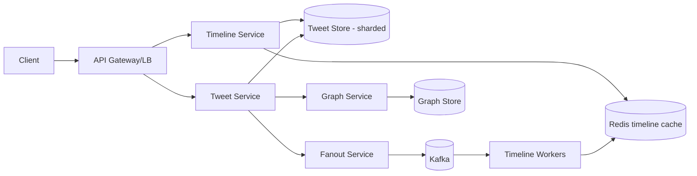

# Design Twitter / News Feed — HLD

> Example output from running `02-social-and-feed/01-design-twitter-newsfeed/PROMPT.md`. Kept at the library top level as a quality reference; the actual practice folders contain only `PROMPT.md`.

## 1. Problem & clarifying questions
We're designing the backend for posting short messages ("tweets") and serving each user a **home timeline** of tweets from people they follow. Before designing, I'd ask:
- **Scope:** post tweet, follow/unfollow, home timeline, user timeline? Search, notifications, DMs, trends — in or out? (Assume: post, follow, home + user timeline. Search/trends out of scope.)
- **Scale:** DAU? avg followers/followees? read:write ratio? (Assume 200M DAU, ~200 follows avg, heavily read-skewed.)
- **Freshness:** must a tweet appear instantly, or is a few seconds' delay fine? (Assume seconds-level eventual consistency is acceptable.)
- **Ranking:** chronological or ranked/relevance feed? (Assume reverse-chronological v1, ranking as an extension.)
- **Media:** images/video? (Assume yes — store in blob+CDN, out of the critical timeline path.)
- **Consistency:** is it OK to occasionally miss a very recent tweet on refresh? (Yes — availability over strict consistency for the feed.)

## 2. Requirements (finalized)
**Functional:** post a tweet; follow/unfollow; fetch home timeline (tweets from followees, newest first, paginated); fetch a user's own timeline.
**Non-functional:** timeline read p99 < ~200 ms; very high availability (AP — a stale-by-seconds feed beats an unavailable one); durable tweets; read-heavy (~100:1 read:write); horizontally scalable.

## 3. Capacity estimation
- 200M DAU, ~2 tweets/user/day → **~400M tweets/day ≈ 4–5K writes/s**, peak ~5× → **~25K writes/s**.
- Timeline reads: each user refreshes ~10×/day → 2B reads/day → **~23K reads/s**, peak **~100K+ reads/s**.
- Storage: tweet ≈ 300 B metadata; 400M/day → ~120 GB/day → **~45 TB/yr** (text only); media in blob store, far larger, separate.
- Fan-out: avg 200 followers → a tweet write can imply ~200 timeline writes; at 5K tweets/s that's **~1M timeline inserts/s** if fan-out-on-write — the central design tension.

## 4. API design
```
POST /v1/tweets            {text, mediaIds[]}            -> {tweetId, createdAt}
POST /v1/follow            {followeeId}                   -> 202
GET  /v1/feed?cursor=&limit=20                            -> {tweets[], nextCursor}
GET  /v1/users/{id}/tweets?cursor=&limit=20              -> {tweets[], nextCursor}
```
Cursor = opaque (encodes last seen tweet's snowflake id) for keyset pagination.

## 5. High-level architecture
```
                     ┌────────────┐
   client ── LB ──▶  │ API Gateway│ ──▶ Tweet Service ──▶ Tweet Store (sharded by tweetId)
                     └────────────┘            │
                                               ├──▶ Graph Service (followers)  ── Graph Store
                                               └──▶ Fanout Service ──▶ [Kafka] ──▶ Timeline workers
                                                                                       │
   client ── LB ──▶ Timeline Service ◀── Timeline Cache (Redis: per-user feed list) ◀──┘
                                      └── (fallback) read-time merge for celebrity followees
```


## 6. Data model & storage choices
- **Tweet Store:** `tweetId (snowflake), userId, text, mediaIds, createdAt`. Sharded by `tweetId`; wide-column/KV (e.g., Cassandra) or sharded MySQL — write-heavy, simple access by id. Snowflake ids are time-sortable (good for cursors).
- **Graph Store:** adjacency lists `followee -> [followers]` and `follower -> [followees]`; KV/wide-column; the "followers of X" query drives fan-out.
- **Timeline Cache:** Redis list/sorted-set per user holding the most recent ~800 tweet ids; the home timeline is served from here.
- Media in **blob store + CDN**; only `mediaId` references travel through the timeline path.

## 7. Deep dives
**(a) Timeline generation — fan-out-on-write vs fan-out-on-read.**
| | Fan-out-on-write (push) | Fan-out-on-read (pull) |
|---|---|---|
| On post | Insert tweet id into every follower's timeline | Do nothing extra |
| On read | Cheap — read precomputed list | Expensive — fetch+merge followees' tweets |
| Cost | Write amplification (celebrity = millions of inserts) | Read amplification, slow timelines |
| Best for | Normal users (most accounts) | Celebrities / very high follower counts |

**Decision: hybrid.** Push for normal accounts (fast reads, which dominate). For **celebrity** accounts (followers above a threshold), do *not* fan out on write; instead, at read time, merge the celebrity's recent tweets into the (mostly precomputed) timeline. This caps write amplification while keeping reads fast for the common case.

**(b) The celebrity / hot-key problem.** A 100M-follower account would cause 100M timeline inserts per tweet — infeasible and bursty. Mitigation: the hybrid above + caching the celebrity's recent tweets in a hot cache that every reader merges in. The merge cost is bounded (a user follows few celebrities).

**(c) Pagination & ordering.** Use **keyset/cursor pagination** on the time-sortable snowflake id, not offset (offset is slow and inconsistent under inserts). Timelines are reverse-chronological; ranking (extension) would add a scoring service that reorders a candidate set.

**(d) Read path latency.** Home timeline = single Redis read of precomputed ids → batch-get tweet bodies (mget, cache-aside) → merge celebrity tweets. Target p99 < 200 ms via cache hits; tweet bodies cached aggressively (immutable once posted).

## 8. Scaling & bottlenecks
- **Fan-out workers** scale on Kafka partition/consumer count; back-pressure via queue depth. First bottleneck under a viral event → mitigated by the celebrity carve-out.
- **Timeline cache** sharded by userId (consistent hashing); hot users replicated.
- **Tweet store** sharded by tweetId; reads cached.
- **Graph store**: "followers of X" is the heavy query; precompute counts, cache, and shard.

## 9. Reliability, consistency & security
- **Consistency:** eventual for the feed (a tweet may take seconds to appear) — acceptable and chosen for availability. Tweet writes are durable (replicated, acks=all on the log).
- **Failure handling:** fan-out is async via Kafka → at-least-once; timeline inserts are idempotent (set/sorted-set by tweet id, so duplicates collapse). Worker crash → reprocess from offset.
- **Backfill:** new follow triggers a bounded backfill of recent tweets into the follower's timeline.
- **Security:** auth at the gateway, rate limiting per user (post abuse), block/mute filters applied at read, media scanning out-of-band.

## 10. Extensions & follow-ups
Ranked feed (candidate generation + ML scoring service); search (separate inverted index / Elasticsearch); trends (streaming top-K with Count-Min Sketch); notifications; DMs; "who to follow"; edit/delete (tombstones propagated to timelines).

## 11. Interview Q&A
- **Why hybrid fan-out?** Pure push dies on celebrities (write amplification); pure pull makes the common read slow. Hybrid optimizes the dominant case (reads, normal users) while bounding the worst case. *(senior-signal)*
- *Probe: where's the celebrity threshold?* Tunable (e.g., >~100K–1M followers); measure write-amplification vs read-merge cost and set it where total cost is minimized.
- **Why eventual consistency for the feed?** A few seconds of staleness is invisible to users but buys huge availability/scale; money-like strictness isn't needed here. *(senior-signal)*
- **Why keyset over offset pagination?** Offset is O(n) deep and shifts when new tweets arrive (dupes/gaps); keyset on a sortable id is O(1) and stable.
- **How do you avoid duplicate timeline entries under at-least-once fan-out?** Store timeline as a set/sorted-set keyed by tweet id — idempotent inserts.
- *Probe: a tweet goes viral mid-fan-out — what happens?* Workers lag (visible as consumer lag); the celebrity carve-out prevents the unbounded insert storm; readers merge the hot tweet at read time.

## C. Cheat-sheet & self-test
**Recap:** Read-heavy (100:1) → precompute timelines (push) for normal users, pull+merge for celebrities. Snowflake ids → keyset pagination + time ordering. Async fan-out via Kafka, idempotent set-based timeline. Eventual consistency, AP. Numbers: ~25K writes/s peak, ~100K reads/s peak.

**Self-test (no answers)**
1. Derive the write-amplification at 5K tweets/s with a 200-follower average; how does the celebrity carve-out change it?
2. Exactly how do you keep the home timeline free of duplicates under at-least-once fan-out?
3. Why is offset pagination wrong here, and what does the cursor encode?
4. Where would you insert a ranking stage without rebuilding the system?
5. A new follow happens — how does the followee's history appear in the timeline, and what bounds the backfill cost?
