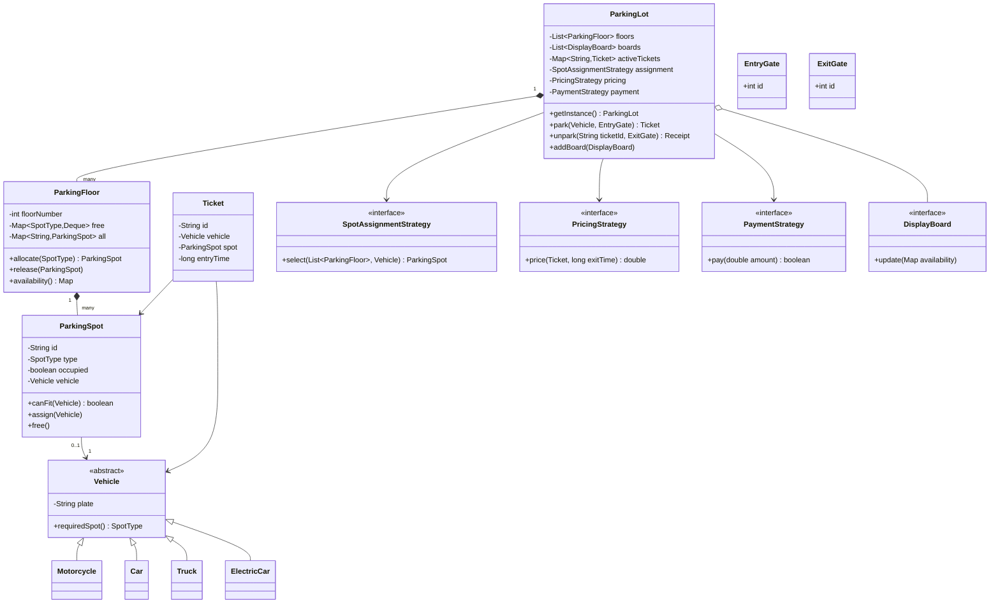
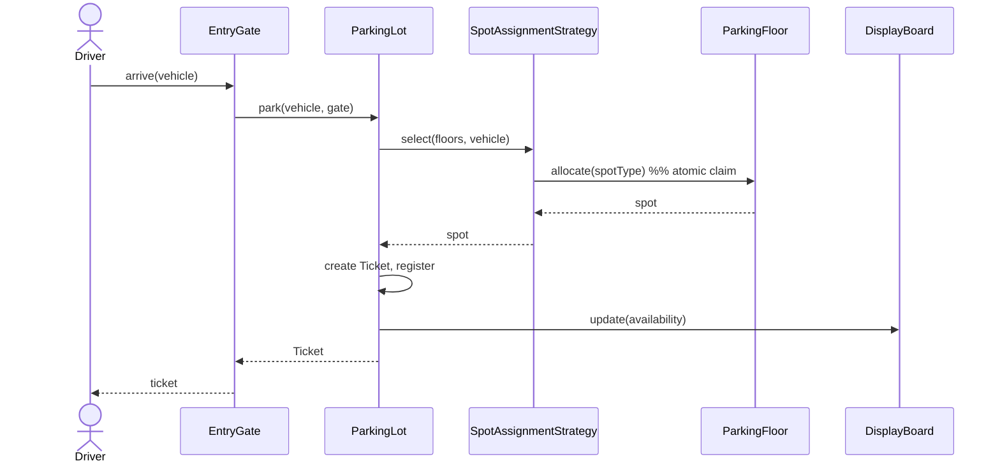

# Parking Lot — Low-Level Design

> A staff-level LLD / machine-coding reference and last-minute revision artifact. Read top to bottom once for the design narrative; skim the cheat-sheet at the end the night before an interview.

---

## 1. Problem statement

Design the software for a **parking lot**: a facility with one or more floors, each floor holding parking spots of different sizes. Vehicles of different types arrive at an **entry gate**, are issued a **ticket**, and are assigned a spot. When they leave through an **exit gate**, the parked duration is computed, a **fee** is charged according to some pricing policy, payment is taken, and the spot is freed. Display boards should show live availability.

We want a clean object-oriented model that:

- assigns the *right* spot to the *right* vehicle,
- supports multiple floors and multiple entry/exit gates running concurrently,
- swaps pricing strategies without touching the rest of the system,
- and extends gracefully to real-world add-ons (EV charging, reserved spots, nearest-spot search).

---

## 2. Clarifying / requirements questions to ask first

A senior candidate opens the round by scoping the problem out loud. Ask before you draw a single class.

**Functional scope**

1. How many **floors** and how many **entry/exit gates**? One of each, or many? (Determines whether we need a multi-gate concurrency story.)
2. What **vehicle types** must we support? (Motorcycle, Car, Truck/Bus, EV?) Is the set fixed or expected to grow?
3. What **spot sizes** exist (Small / Medium / Large / XL), and what is the **fit matrix** — can a car take a large spot if mediums are full? Do larger vehicles ever occupy multiple spots?
4. How is a spot **chosen** — any free spot of a fitting size, the *nearest* spot to the gate, or a spot the customer reserves in advance?
5. **Pricing model**: flat fee, per-hour, per-day, tiered (first hour free / progressive), or different rates per vehicle type and per spot size? Can rates change at runtime?
6. **Payment**: cash, card, UPI/wallet? Do we model the payment processor, or is "payment succeeded" an external signal?
7. Do we issue a physical **ticket** or a digital one? Can a ticket be **lost** (penalty flow)?

**Non-functional**

8. **Concurrency**: can two cars at two gates request a spot at the same instant? (Almost always yes → we must prevent double-allocation.) Expected throughput?
9. Is this a **single-process in-memory** system (typical machine-coding scope) or distributed across services? (I'll assume in-memory single JVM, thread-safe, unless told otherwise.)
10. **Persistence / restart**: must state survive a restart, or is in-memory fine?
11. Capacity scale — tens of spots or tens of thousands? (Affects whether we keep per-size counters / indexes.)

**Scope-narrowing**

12. Out of scope confirmation: license-plate recognition, hardware/sensor integration, billing reconciliation, multi-lot federation, UI. I'll treat these as out of scope unless asked.

---

## 3. Finalized requirements & assumptions

For this document I'll build to the following (stated explicitly so the design is unambiguous):

**Functional**

- A `ParkingLot` has **multiple floors**; each floor has **multiple spots**; spots have a **size** (`MOTORCYCLE`, `COMPACT`, `LARGE`, `EV`).
- Vehicle types: `MOTORCYCLE`, `CAR`, `TRUCK`, `ELECTRIC` — each declares the spot size it needs.
- **Fit rule**: a vehicle takes the smallest free spot it fits in; it may "up-size" to a larger free spot if its ideal size is exhausted. (Configurable via a `SpotAssignmentStrategy`.)
- Multiple **entry** and **exit** gates. Entry issues a `Ticket`; exit computes fee, takes payment, frees the spot.
- **Pricing** is pluggable (`PricingStrategy`): hourly, flat, and day-based provided; rate may vary by vehicle type.
- **Payment** is pluggable (`PaymentStrategy`): cash and card stubs.
- **Display boards** observe availability and update live (`Observer`).

**Non-functional**

- Single JVM, **thread-safe** for concurrent gate operations — no two vehicles may be assigned the same spot.
- In-memory state; no persistence.
- O(1)-ish spot lookup per size using per-size free-spot structures.

**Out of scope**: hardware, ANPR, distributed deployment, persistence, reconciliation, UI.

---

## 4. Problem extensions / follow-up variations

These are the follow-ups interviewers add. For each, the design impact — note how little the core changes, which is the whole point of the pattern choices.

| Extension | Design impact |
|---|---|
| **Multiple floors & entrances** | `ParkingLot` aggregates `List<Floor>`; spot search iterates floors. Gates hold a `floorId`/location so a *nearest-spot* strategy can rank by distance. No interface change. |
| **Different spot & vehicle sizes / fit matrix** | Encapsulated in `SpotAssignmentStrategy` + the `canFit(VehicleType)` rule on `SpotType`. Adding a size = add an enum value + extend the fit rule; no caller changes. |
| **Hourly vs flat vs day pricing** | New `PricingStrategy` implementation; inject it at runtime. The exit flow is untouched (Open/Closed). |
| **EV charging spots** | Add `EV` spot type + `ELECTRIC` vehicle; `EVPricingDecorator` (or a dedicated strategy) adds an energy surcharge. Spot can carry a `Charger` capability. |
| **Finding nearest spot** | `NearestFirstAssignmentStrategy` ranks free spots by distance from the entry gate; swap in without touching `ParkingLot`. |
| **Full-lot handling** | `park()` returns `Optional<Ticket>` / throws `LotFullException`; display board shows `FULL`; entry gate refuses. |
| **Reserved / handicap / valet spots** | Add a `SpotCategory` attribute and a filter in the assignment strategy. |
| **Concurrent gate access** | Per-floor locking + atomic free-counters; covered in §9. |
| **Lost ticket** | Exit accepts a "lost ticket" flow charging a max/penalty fee via a `PricingStrategy` branch. |
| **Multiple lots / city-wide** | `ParkingLot` becomes one node; a higher `ParkingService` federates — out of single-process scope but the boundary is clean. |

---

## 5. Core entities, responsibilities & relationships

- **`ParkingLot`** *(Singleton)* — root aggregate. Owns floors, gates, the chosen strategies, and the registry of active tickets. Coordinates park/unpark. Notifies display boards.
- **`ParkingFloor`** — owns its `ParkingSpot`s, indexed by `SpotType`; knows how to hand out / reclaim a free spot of a size. Guards its own spots for thread-safety.
- **`ParkingSpot`** — a single bay: `id`, `SpotType`, `occupied` flag, the parked `Vehicle`, optional `Charger`. Knows whether it `canFit(vehicle)`.
- **`Vehicle`** (abstract) → `Motorcycle`, `Car`, `Truck`, `ElectricCar` — license plate + the `SpotType` it requires.
- **`Ticket`** — issued at entry: id, vehicle, assigned spot, entry timestamp, entry gate. The token correlating entry and exit.
- **`EntryGate` / `ExitGate`** — entry requests a spot and issues a ticket; exit computes fee, takes payment, frees the spot.
- **`SpotType`** (enum) — `MOTORCYCLE`, `COMPACT`, `LARGE`, `EV` with the fit rule.
- **`SpotAssignmentStrategy`** *(Strategy)* — picks which free spot to allocate (`first-fit`, `nearest-first`).
- **`PricingStrategy`** *(Strategy)* — computes the fee from a ticket + exit time.
- **`PaymentStrategy`** *(Strategy)* — processes payment.
- **`DisplayBoard`** *(Observer)* — subscribes to availability changes and renders counts.
- **`ParkingSpotFactory` / `VehicleFactory`** *(Factory)* — centralize creation of spots/vehicles by type.

Relationships: `ParkingLot` **composes** `ParkingFloor` (floors die with the lot); `ParkingFloor` **composes** `ParkingSpot`; `ParkingSpot` **associates** a `Vehicle` when occupied; `Ticket` **associates** a `Vehicle` and a `ParkingSpot`; `ParkingLot` **holds** one of each `*Strategy` and a list of `DisplayBoard` observers.

---

## 6. Design patterns applied

Each pattern is justified with the alternative rejected and when *not* to use it. No pattern-stuffing — every one earns its place.

### Strategy — pricing, spot assignment, payment
**Where/why.** Fee calculation, spot selection, and payment processing are *interchangeable algorithms* that vary independently of the parking workflow. Encapsulating each behind an interface lets us swap hourly→flat pricing, or first-fit→nearest-spot, at runtime via injection.
**Rejected alternative.** `if (type == HOURLY) … else if (FLAT) …` branching inside `ExitGate`. Rejected: every new rule edits a growing conditional (violates Open/Closed), and the rules can't be unit-tested or reused in isolation.
**When *not* to use.** If there were exactly one pricing rule that would never change, a plain method is simpler — Strategy would be speculative generality.

### Factory (Method / Simple Factory) — vehicle & spot creation
**Where/why.** `VehicleFactory.create(type, plate)` and `ParkingSpotFactory.create(type)` centralize the `switch` over types so the rest of the code depends on the abstract `Vehicle`/`ParkingSpot`, not the concrete subclasses (Dependency Inversion). Adding `ELECTRIC` touches only the factory.
**Rejected alternative.** `new Car(...)` scattered across gates. Rejected: construction logic leaks everywhere; adding a type means hunting down call sites.
**When *not* to use.** If there's a single concrete type, direct construction is fine.

### Singleton — the `ParkingLot`
**Where/why.** There is exactly one physical lot; a single coordination point for floors, gates, and active tickets is natural. Implemented with an enum/holder idiom for thread-safe lazy init.
**Rejected alternative.** Passing a global mutable static everywhere, or many lot instances. Rejected for the same reasons globals are dangerous.
**Caveat / when *not* to use.** Singletons hinder testability (hidden global state) and break the moment you need *multiple* lots (the city-wide extension). Prefer a single instance created at composition root and **dependency-injected**. I show the Singleton because it's the textbook expectation, but I call out DI as the production-grade choice.

### Observer — display boards
**Where/why.** Multiple display boards must react to availability changes without the lot knowing their concrete types. `ParkingLot` publishes `availabilityChanged(...)`; boards subscribe.
**Rejected alternative.** The lot directly calling each board. Rejected: tight coupling; can't add a board (or a mobile-app feed) without editing the lot.
**When *not* to use.** If only one consumer exists and will forever, a direct call is simpler.

### (Optional) Decorator — EV surcharge
**Where/why.** `EVPricingDecorator` wraps any `PricingStrategy` to add an energy surcharge, composing pricing behaviors without subclass explosion. Used in the EV extension.

### SOLID in play
- **S**RP: pricing, assignment, payment, display, and creation each live in their own type.
- **O**CP: new pricing/assignment/vehicle types are *added*, not edited into existing conditionals.
- **L**SP: any `Vehicle` subtype works wherever `Vehicle` is expected; any `PricingStrategy` is substitutable.
- **I**SP: small, focused interfaces (`PricingStrategy`, `PaymentStrategy`, `SpotAssignmentStrategy`) instead of one fat "lot manager" interface.
- **D**IP: gates and lot depend on strategy *abstractions*, injected from the composition root.

---

## 7. Class diagram



**Text UML (key APIs).**

```
ParkingLot (Singleton)
  + Ticket  park(Vehicle v, EntryGate g)         // allocate spot, issue ticket, notify boards
  + Receipt unpark(String ticketId, ExitGate g)  // price -> pay -> free spot -> notify boards

ParkingFloor
  + ParkingSpot allocate(SpotType t)   // atomic: pop a free spot of type t (or up-size)
  + void        release(ParkingSpot s)

interface SpotAssignmentStrategy { ParkingSpot select(List<ParkingFloor> floors, Vehicle v); }
interface PricingStrategy        { double price(Ticket t, long exitEpochMs); }
interface PaymentStrategy        { boolean pay(double amount); }
interface DisplayBoard           { void update(Map<SpotType,Integer> availability); }
```

---

## 8. Key flows

**Park (entry).**

1. Vehicle arrives at an `EntryGate`; gate calls `lot.park(vehicle, gate)`.
2. `SpotAssignmentStrategy.select(floors, vehicle)` finds a fitting free spot (first-fit or nearest-first), **atomically** claiming it on its floor.
3. If none → throw `LotFullException` (board shows `FULL`).
4. Spot is marked occupied; a `Ticket` is created (id, vehicle, spot, entry time) and registered in `activeTickets`.
5. Boards are notified of new availability. Ticket returned to driver.

**Unpark (exit).**

1. Driver presents ticket at an `ExitGate`; gate calls `lot.unpark(ticketId, gate)`.
2. Look up the active ticket; compute fee = `PricingStrategy.price(ticket, now)`.
3. `PaymentStrategy.pay(fee)`; on success, free the spot (`floor.release(spot)`), remove from `activeTickets`.
4. Notify boards; return a `Receipt`.



---

## 9. Concurrency, edge cases & extensibility

**Thread-safety (the crux for "multiple gates").**

- The danger is two gates allocating the **same** spot. Make allocation atomic at the floor: each `ParkingFloor` keeps per-`SpotType` free structures (e.g. a `ConcurrentLinkedDeque` or a guarded `ArrayDeque`); `allocate()` **pops** a spot under the floor's lock, so a popped spot is invisible to any other thread.
- Prefer **fine-grained per-floor locking** over one global lock so gates on different floors don't contend. `release()` pushes the spot back under the same lock.
- `activeTickets` is a `ConcurrentHashMap`. Availability counters are `AtomicInteger` (or derived from the deque sizes) so the display update is consistent.
- Idempotency: `unpark` on an already-exited ticket should be a no-op / clear error, not a double-free.

**Edge cases.**

- **Lot / size full** → first-fit may up-size; if all fitting sizes exhausted, refuse (`Optional.empty()` / exception) and show `FULL`.
- **Lost ticket** → exit charges a max-day penalty via a pricing branch; spot still freed.
- **Zero-/sub-minute stay** → pricing must define a minimum charge / rounding rule (round up to the hour for hourly).
- **Vehicle won't fit anywhere** (oversized truck) → reject at entry.
- **Double exit / unknown ticket** → guard with the active-ticket registry.
- **Clock**: inject a time source so pricing is testable (don't call `System.currentTimeMillis()` directly in logic).

**Extensibility recap.** Because pricing, assignment, payment, creation, and display are each behind an interface (§6), every extension in §4 is an *additive* change: implement a new strategy or add an enum value and wire it at the composition root. The hot paths (`park`/`unpark`) never change.

---

## 10. Likely interview questions

1. **Why Strategy for pricing rather than subclassing the lot?**
   Pricing varies independently of the lot; Strategy lets us swap/compose rules at runtime and unit-test them in isolation, satisfying OCP. Subclassing the lot would couple two orthogonal axes and explode the class count.

2. **How do you stop two gates from grabbing the same spot?**
   Allocation is atomic at the floor: pop the spot from a guarded per-size free structure under the floor lock. A popped spot is no longer visible to other threads, so double-allocation is impossible. *Follow-up:* per-floor locks (not one global) to reduce contention; *follow-up:* lock-free via `ConcurrentLinkedDeque.poll()`; *follow-up:* what if you need fairness across gates? (use a fair lock or a queue).

3. **Where exactly is the Singleton, and why is it risky?**
   `ParkingLot` is the single coordination point. Risk: hidden global state hurts testability and breaks for multiple lots. Production answer: create one instance at the composition root and **inject** it (DIP) rather than a static `getInstance()`. *(Senior signal.)*

4. **A car arrives but only large spots are free — what happens?**
   The `SpotAssignmentStrategy` encodes the fit/up-size rule: a car may take a larger free spot when its ideal size is exhausted. This rule lives in one place, so changing policy doesn't touch gates. *(Senior signal — pattern + SRP.)*

5. **Add EV charging spots with a surcharge — what changes?**
   Add an `EV` spot type and `ELECTRIC` vehicle (factory + enum), mark spots with a charger capability, and wrap pricing with an `EVPricingDecorator`. Core flows untouched — additive only. *(Senior signal — OCP/Decorator.)*

6. **How would you implement "park in the spot nearest the entrance"?**
   Swap in a `NearestFirstAssignmentStrategy` that ranks free spots by distance from the requesting gate. The gate carries its location; everything else is unchanged. *Follow-up:* maintain a per-gate distance-ordered index/heap of free spots for O(log n) selection.

7. **How is the fee computed and kept testable?**
   `PricingStrategy.price(ticket, exitTime)` with an injected time source; hourly rounds up partial hours, day pricing caps per 24h, flat is constant. Injecting the clock makes pricing deterministic in tests.

8. **What does the Observer buy you for display boards?**
   Boards subscribe; the lot publishes availability changes without knowing concrete board types, so we add a mobile feed or analytics sink without editing the lot (OCP, loose coupling). *Follow-up:* push vs pull; *follow-up:* avoid notifying under the floor lock to prevent holding locks during slow observers.

9. **How do you handle a full lot and a lost ticket?**
   Full: `park` returns empty/throws and boards show `FULL`. Lost ticket: exit takes a "lost" path charging a max/penalty fee, still freeing the spot.

10. **How would this evolve into a distributed, multi-lot system?**
    Each `ParkingLot` becomes a node behind a `ParkingService`; spot allocation moves to a per-lot service with a datastore and optimistic locking or a reservation token. The in-memory atomic-pop becomes a conditional DB update. The interfaces (pricing/assignment/payment) survive the transition. *(Senior signal — scaling boundary.)*

---

## PART C — Cheat-sheet & self-test

**Patterns & key decisions (recall in 30 seconds).**

- **Strategy** ×3 → pricing, spot assignment, payment (swap at runtime, OCP).
- **Factory** → vehicle & spot creation (DIP; add a type in one place).
- **Singleton** → `ParkingLot` (textbook), but **prefer DI** in production.
- **Observer** → display boards (loose-coupled live availability).
- **Decorator** (optional) → EV surcharge wraps any pricing.
- **Concurrency** → atomic pop of a free spot under **per-floor** lock; `ConcurrentHashMap` for active tickets; inject a clock for testable pricing.
- **Fit rule & up-sizing** live entirely inside the assignment strategy.
- Hot paths `park`/`unpark` never change when extensions are added — every extension is additive.

**5 self-test questions (no answers).**

1. Draw the call sequence for `unpark`, naming every strategy invoked and the exact moment the spot becomes reusable by another gate.
2. Two trucks and one large spot, requested at two gates within 1 ms — walk through the locking and state transitions that guarantee only one wins.
3. Pricing must change to "first 30 minutes free, then ₹40/hour, capped at ₹400/day." Which class do you add, what do you change, and what stays untouched?
4. Add **reserved spots** that only pre-booked vehicles may use. Where does the filter live, and which SOLID principle keeps the change local?
5. Justify keeping `ParkingLot` as a Singleton vs injecting it — and describe one concrete bug the Singleton could cause in tests.
