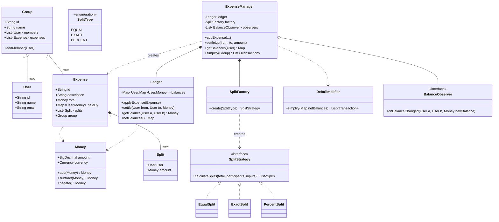
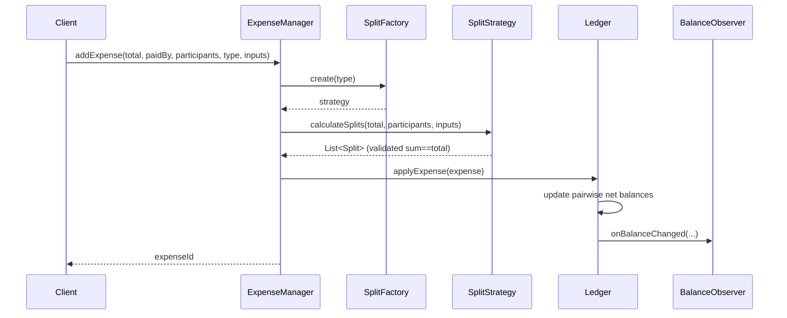

# Splitwise (Expense Sharing) — LLD Design Doc

> Output from running `02-splitwise/PROMPT.md` (PART A + C). Companion code: `Solution.java` (PART B). The solution is a **review/revision artifact** — read it, don't compile it.

## 1. Problem statement
Design the core of a **Splitwise-style expense-sharing system**. A set of users can record shared expenses. Each expense is paid by one or more people and **split** among a set of participants by some rule (equal, exact amounts, or percentages). The system must continuously track **who owes whom** and surface per-user and per-group balances, support **settling up**, and ideally **simplify debts** so the group settles in the fewest possible transactions. It is an in-memory OO design (the kind asked in an LLD / machine-coding round), not a full distributed service — but the design should make the path to persistence and concurrency obvious.

## 2. Clarifying / requirements questions to ask first

Before writing a single class, I'd nail down scope with the interviewer:

**Functional scope**

- Do we support both **1:1 friend** expenses and **group** expenses, or only groups? (Assume both; a 1:1 expense is just an expense with no group.)
- What **split types** must we support? Equal, exact (unequal fixed amounts), percentage — anything else (shares/ratios, "split by adjustment")? (Assume equal / exact / percent, with shares as an easy extension.)
- Can an expense be **paid by multiple people** (multiple payers), or exactly one payer? (Design for multi-payer; single-payer is the common case.)
- Should the system **simplify debts** (minimize the number of settle-up transactions across a group), or only track raw pairwise balances? (Track pairwise always; offer simplify as an explicit operation.)
- How does **settle up** work — full settlement only, or **partial payments**? (Support partial.)
- Do we need **multi-currency**? Are amounts within one expense always the same currency? (v1 single currency per expense; multi-currency as an extension with a conversion strategy.)

**Non-functional / constraints**

- Is this **single-process in-memory**, or do balances need to be **durable** and **concurrent** across requests? (In-memory core, but make it thread-safe and persistence-ready.)
- Expected **scale** — tens of users in a group, or millions globally? (Drives whether we precompute balances or recompute on read.)
- **Monetary precision** — can we use floating point or must we avoid rounding errors? (Use `BigDecimal` / integer minor-units; never `double` for money.)
- Do splits need to **sum exactly** to the expense total (no rounding leftover)? How do we assign the rounding remainder? (Validate sum == total; assign leftover cents deterministically to the first/largest participant.)

**Scope-narrowing (explicitly out for v1)**

- Auth, friend requests, notifications delivery, attachments/receipts storage, comments, activity feed, recurring-expense scheduling — note them as extensions, keep them out of the core.

## 3. Finalized requirements & assumptions

**Will build (v1 core):**

- Register `User`s; create `Group`s with members.
- Add an `Expense`: total amount, one or more payers (who paid how much), participants, and a **split strategy** (equal / exact / percent). The strategy computes each participant's owed share; the system validates shares sum to the total.
- Maintain a **balance ledger**: net amount between every ordered pair of users (and aggregated per user / per group).
- **Settle up**: record a payment from A to B (full or partial) that reduces the debt.
- **Simplify debts**: produce a minimal set of transactions that zeroes out a group's net balances.
- **Observers** notified on balance changes (e.g., to push notifications / refresh feeds) — wired but pluggable.
- Money handled with `BigDecimal`; balances are **net** (if A owes B 30 and B owes A 10, the ledger shows A owes B 20).

**Assumptions:** single currency per expense in the core; one process, but data structures guarded for concurrency; users identified by stable IDs.

## 4. Problem extensions / follow-up variations

| Extension | Design impact |
|---|---|
| **Simplify-debts / settle-up minimization** | Add a `DebtSimplifier` over the net-balance graph: separate creditors/debtors, greedily match largest creditor ↔ largest debtor. Produces ≤ n−1 transactions. Pure read over the ledger; doesn't change storage. |
| **Multi-currency** | `Money` carries a `Currency`; add a `CurrencyConverter`/`ExchangeRateStrategy`; normalize to a base currency in the ledger or keep per-currency sub-ledgers. Strategy keeps conversion swappable. |
| **Shares / ratio split, "split by adjustment"** | New `SplitStrategy` implementations only — existing code untouched (OCP payoff). |
| **Partial payments** | `settle(from,to,amount)` decrements rather than zeroing; already supported by modeling settlement as a signed ledger entry. |
| **Recurring expenses** | A `RecurringExpense` template + a scheduler that emits `Expense`s on a cadence; reuses the same add-expense path. |
| **Comments / attachments** | Compose `List<Comment>` / `List<Attachment>` onto `Expense`; orthogonal to splitting. |
| **Multiple payers** | Model payers as a `Map<User, Money> paidBy`; net contribution per user = paid − owed. Core already assumes this. |
| **Concurrency on shared balances** | Guard the ledger with per-pair locking or a `ConcurrentHashMap` of atomic balances; or serialize writes per group. |
| **Persistence** | Put the ledger/expenses behind repository interfaces (DIP) so an in-memory map can be swapped for a DB. |

## 5. Core entities, responsibilities & relationships

- **`User`** — identity (id, name, email). A pure data/entity object.
- **`Group`** — a named set of members; scopes expenses and a simplify operation. *Association* to users; *composition* of its expense references.
- **`Money`** — value object wrapping a `BigDecimal` amount (+ currency in the multi-currency extension). Centralizes monetary arithmetic and prevents `double` bugs.
- **`Split`** — one participant's share of one expense: `(user, amountOwed)`. *Composition* inside `Expense`.
- **`SplitStrategy`** (interface) — given the total, payers, participants, and inputs (exact amounts / percentages), returns the list of `Split`s and validates they sum to the total. Implementations: `EqualSplit`, `ExactSplit`, `PercentSplit`.
- **`SplitFactory`** — creates the right `SplitStrategy` from a `SplitType` enum + inputs.
- **`Expense`** — total `Money`, `paidBy` (Map user→amount), `splits` (who owes what), metadata (description, group, timestamp). Knows its own breakdown; does **not** mutate global balances itself.
- **`BalanceSheet` / `Ledger`** — the system of record for **net pairwise balances**. Responsibilities: apply an expense (credit payers, debit owers), apply a settlement, query balances, expose the net-balance graph. *This is the heart of correctness.*
- **`DebtSimplifier`** — pure function over the ledger's net balances → minimal transaction list.
- **`ExpenseManager` / `SplitwiseService`** — façade/orchestrator: the public API the UI/controller calls (`addExpense`, `settleUp`, `getBalances`, `simplify`). Coordinates factory → strategy → ledger → observers.
- **`BalanceObserver`** (interface) — notified on balance changes (notifications, audit, feed). `Subject` is the ledger/manager.

Relationships in one line: `ExpenseManager` *composes* a `Ledger` and a `SplitFactory`, *creates* `Expense`s each *composing* `Split`s produced by a `SplitStrategy`, and *notifies* `BalanceObserver`s; `Group` *associates* `User`s.

## 6. Design patterns applied

- **Strategy — `SplitStrategy` (equal / exact / percent).**
  *Where/why:* the only thing that varies between expense types is *how the total is divided*. Encapsulating each rule behind one interface lets us add new split types without touching `Expense` or the ledger (**Open/Closed**). 
  *Rejected alternative:* a `switch (splitType)` inside `Expense.computeSplits()`. Fine for exactly three fixed types and a tiny codebase, but every new type edits a growing conditional and risks regressions — violates OCP. 
  *When not to use:* if split logic were truly fixed forever and trivial, the indirection is overkill.

- **Factory — `SplitFactory`.**
  *Where/why:* clients pass a `SplitType` + raw inputs (percent map, exact map); the factory hides which concrete strategy/validation to instantiate, keeping the manager free of `new EqualSplit()` clutter (**SRP**, **DIP** — manager depends on the `SplitStrategy` abstraction).
  *Rejected alternative:* let callers `new` the strategy directly — leaks construction details and couples callers to concrete classes.
  *When not to use:* if there were a single strategy, a factory is ceremony.

- **Observer — `BalanceObserver` on the ledger.**
  *Where/why:* when a balance changes, several independent reactions may be needed (push notification, activity feed, audit log) and we don't want the ledger to know about any of them (**SRP**, low coupling).
  *Rejected alternative:* the ledger directly calling a `NotificationService` — couples core accounting to delivery and makes it hard to add/remove reactions.
  *When not to use:* if there's exactly one synchronous reaction that will never change, a direct call is simpler.

- **Façade — `ExpenseManager`/`SplitwiseService`.**
  *Where/why:* gives the UI one coherent entry point and hides the factory→strategy→ledger→observer choreography.
  *Rejected alternative:* let controllers orchestrate the pieces — duplicates logic and leaks internals.

- **(Implicit) Value Object — `Money`.** Immutable, equality-by-value, all arithmetic centralized; prevents floating-point money bugs.

- **(Extension) Strategy again — `ExchangeRateStrategy`** for multi-currency, same justification as splits.

**SOLID recap:** **SRP** (entity vs. strategy vs. ledger vs. notification each do one job), **OCP** (new split types / currencies / observers add classes, don't edit existing ones), **LSP** (any `SplitStrategy` is substitutable — same contract: returns splits summing to total), **ISP** (small focused interfaces: `SplitStrategy`, `BalanceObserver`), **DIP** (manager depends on `SplitStrategy`/`BalanceObserver` abstractions and repository interfaces, not concretes).

## 7. Class diagram

**Text UML (key APIs):**

- `SplitStrategy.calculateSplits(Money total, List<User> participants, Map<User,?> inputs) : List<Split>` — implemented by `EqualSplit`, `ExactSplit`, `PercentSplit`; each validates the result sums to `total`.
- `SplitFactory.create(SplitType) : SplitStrategy`.
- `Ledger.applyExpense(Expense)`, `Ledger.settle(User from, User to, Money)`, `Ledger.getBalance(User a, User b) : Money`, `Ledger.netBalances() : Map<User,Map<User,Money>>`.
- `DebtSimplifier.simplify(Map netBalances) : List<Transaction>`.
- `ExpenseManager.addExpense(description, total, paidBy, participants, splitType, inputs, group)`, `.settleUp(from,to,amount)`, `.getBalances(user)`, `.simplify(group)`.
- Relationships: `Expense` **composes** `Split`; `Group` **aggregates** `User` and `Expense`; `ExpenseManager` **composes** `Ledger`/`SplitFactory` and **aggregates** `BalanceObserver`s; `SplitFactory` **creates** `SplitStrategy`.

## 8. Key flows

**Add expense (the central flow):**

1. Caller invokes `ExpenseManager.addExpense(total, paidBy, participants, splitType, inputs, group)`.
2. Manager asks `SplitFactory.create(splitType)` for the right `SplitStrategy`.
3. Strategy `calculateSplits(...)` returns `List<Split>` and **validates** `Σ split.amount == total` (and `Σ paidBy == total`); else throws.
4. Manager builds the `Expense` and calls `Ledger.applyExpense(expense)`: for each participant, `netContribution = paid − owed`; update pairwise balances so payers are credited and owers debited (net out reverse debts).
5. Ledger fires `onBalanceChanged` to each `BalanceObserver`.

**Settle up (partial allowed):** `settleUp(from,to,amount)` → `Ledger.settle` decrements `from→to` debt by `amount` (a settlement is just a payment ledger entry); observers fire.

**Simplify debts:** compute each user's **net** position (sum of all balances). Split into creditors (net > 0) and debtors (net < 0). Repeatedly match the largest creditor with the largest debtor, emit a `Transaction` for `min(|creditor|, |debtor|)`, reduce both, drop any that hit zero. Terminates in ≤ n−1 transactions.

## 9. Concurrency, edge cases & extensibility

**Concurrency / thread-safety:** the `Ledger` is the shared mutable state. Options: (a) a single coarse lock on the ledger — simplest, correct, fine for an interview; (b) **per-pair / per-user striped locking** for throughput; (c) `ConcurrentHashMap` with atomic compute on the nested balance maps. To avoid deadlock when locking two users, always **lock in a canonical order** (e.g., by user id). Writes to one pair must be atomic (read-modify-write of the net balance). `Money` is immutable, so it's safely shared. The reference solution uses synchronized methods on the ledger to keep it correct-by-inspection and notes the striping upgrade.

**Edge cases:**

- **Rounding:** equal split of 100 among 3 → 33.34 / 33.33 / 33.33; assign the leftover cent deterministically (first participant) so splits sum exactly to the total.
- **Sum validation:** exact/percent inputs that don't sum to the total (or 100%) → reject before touching the ledger.
- **Self-inclusion:** payer is also a participant — handled naturally by `paid − owed` netting (they shouldn't owe themselves).
- **Settle more than owed / wrong direction:** clamp or reject overpayment; a partial settlement never flips the sign unintentionally.
- **Empty participant list / zero amount / negative amount / payer not in group** → validate and reject.
- **Currency mismatch** (extension): reject mixed currencies unless a converter is configured.

**Extensibility:** every item in §4 lands as *new classes*, not edits — new `SplitStrategy` for shares, new `ExchangeRateStrategy` for currency, new `BalanceObserver` for feed/notifications, repository interfaces behind the ledger for persistence. That's the OCP/DIP payoff of the design.

## 10. Likely interview questions

1. **Why Strategy for splits instead of an enum + switch?** Because split rules are the primary axis of change; Strategy isolates each rule, makes them independently testable, and lets new types (shares, adjustment) be added without editing existing code (OCP). A switch concentrates risk and grows unboundedly. *(senior-signal)*

2. **How do you store balances — per expense or netted?** Net pairwise balances in the ledger (`Map<User,Map<User,Money>>`). Recomputing from all expenses on every read is O(expenses); a maintained net ledger gives O(1) pairwise reads and is the source of truth for simplify. Trade-off: you must apply every expense/settlement transactionally.

3. **Walk through debt simplification and its complexity.** Net everyone out, separate creditors/debtors, greedily match largest-with-largest. Produces ≤ n−1 transactions; greedy is O(n log n) per match via heaps. *(Note: minimizing the absolute fewest transactions is NP-hard in general — the greedy heuristic is what Splitwise actually ships and is "good enough"; mention this.)* *(senior-signal)*

4. **Why `BigDecimal` (or integer cents) over `double`?** Binary floating point can't represent decimal money exactly (0.1 + 0.2 ≠ 0.3), causing drift across many operations. `BigDecimal` with a fixed scale + explicit rounding mode is exact and auditable.

5. **How is the rounding remainder handled in an equal split?** Compute the floor share, distribute the remaining minor units one-by-one to the first k participants so the splits sum exactly to the total. Deterministic and total-preserving.

6. **Make the ledger thread-safe.** Coarse lock for correctness; or stripe by user/pair with canonical lock ordering to avoid deadlock; or atomic `compute` on a `ConcurrentHashMap`. Reads can use the same lock or a snapshot. *(senior-signal: name the deadlock risk and the ordering fix.)*

7. **Single payer vs. multiple payers — how does the model handle it?** `paidBy` is a `Map<User,Money>`. Each user's net effect on an expense is `paid − owed`; the ledger updates pairwise balances from those nets, so single-payer is just the one-entry case.

8. **Where does Observer help and what's the downside?** It decouples balance changes from reactions (notify/feed/audit). Downside: harder to follow control flow, ordering of observers, and exceptions in one observer shouldn't break accounting — so notify *after* the ledger commit and isolate observer failures.

9. **How would you add multi-currency without rewriting the ledger?** Give `Money` a currency, add an `ExchangeRateStrategy`, normalize to a base currency (or keep per-currency sub-ledgers). Strategy keeps the rate source swappable; the ledger logic is unchanged.

10. **How do you keep an expense and its ledger update consistent (atomicity)?** Validate splits first; apply the expense and fire observers as one logical transaction. In-memory: do it under one lock; with a DB: wrap in a transaction so a partial apply can't corrupt balances.

**Deep-probe follow-ups:** (a) "Show that simplify never increases total debt and terminates" — invariant: each step zeroes at least one party and conserves net sums. (b) "What breaks if two threads add expenses for the same pair simultaneously?" — lost update without atomic read-modify-write; fix with locking/atomic compute. (c) "Why not put `applyExpense` logic inside `Expense`?" — it would couple an entity to global state and violate SRP; the ledger owns cross-entity accounting.

---

## PART C — Cheat-sheet & self-test

**Patterns used:** Strategy (`SplitStrategy`: equal/exact/percent — primary axis of change, OCP), Factory (`SplitFactory` — hides strategy construction, DIP), Observer (`BalanceObserver` — decouples balance changes from notifications/feed/audit), Façade (`ExpenseManager` — single entry point), Value Object (`Money` — immutable, exact monetary math).

**Key design decisions:** net **pairwise ledger** as source of truth (O(1) reads, transactional writes); money as `BigDecimal`/minor-units, never `double`; deterministic rounding-remainder assignment so splits sum exactly; multi-payer via `paidBy` map and `paid − owed` netting; debt **simplify** as a greedy heuristic over net balances (optimal-min is NP-hard); thread-safety via a ledger lock with canonical lock ordering, upgradable to striping; extensions (shares, multi-currency, recurring, attachments, persistence) all land as new classes behind existing interfaces (OCP/DIP).

**5 self-test questions (no answers):**

1. Why is the absolute-minimum-transaction settlement NP-hard, and why is greedy acceptable in production?
2. Given an equal split of ₹100 among 3, exactly how are the splits computed so they sum to ₹100, and where does the extra paisa go?
3. Two threads call `addExpense` affecting the same user pair concurrently — describe the lost-update bug and two distinct fixes.
4. Add a new "split by shares" type and a "comments on expense" feature — which existing classes change, and which don't, and why?
5. How would you migrate the in-memory `Ledger` to a database while preserving atomicity of an expense + its balance updates?
