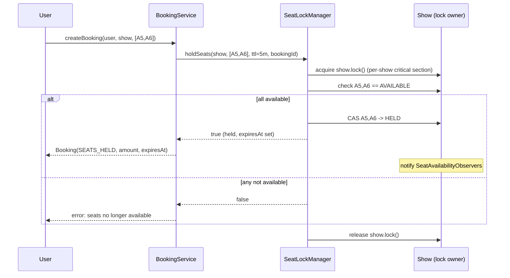

# Movie Ticket Booking (BookMyShow) — LLD Design Doc

> Output from running `03-movie-ticket-booking-bookmyshow/PROMPT.md` (PART A + C). Companion code: `Solution.java` (PART B). The solution is a **review/revision artifact** — read it, don't compile it.

## 1. Problem statement

Design the core of a **BookMyShow-style movie-ticket-booking system**. Users browse **movies** playing across **cinemas** in a **city**, pick a **show** (a movie screened on a particular **screen** at a particular time), choose **seats** from a live seat-map, and **book** them. The headline difficulty is **correctness under concurrency**: many users stare at the same show's seat-map at once, and the system must guarantee that **a seat is sold to exactly one booking** — no double-booking — while still feeling responsive (you "hold" the seats while you pay, and the hold expires if you don't). Around that core we need pricing, payment, and cancellation/refund.

This is an in-memory OO design of the kind asked in an LLD / machine-coding round — not a full distributed service — but the design should make the path to persistence, horizontal scale, and a real distributed lock obvious.

## 2. Clarifying / requirements questions to ask first

Before writing a single class, I'd pin down scope with the interviewer:

**Functional scope**

- What's the **browse/search** surface? Search by **city → movie → cinema → show**, or also by language/genre/format (2D/3D/IMAX)? (Assume city → movie → show is the core path; format/language are attributes we filter on.)
- Is seat selection **user-picks-specific-seats** (a seat-map), or "give me N seats anywhere"? (Assume explicit seat selection from a map; auto-pick is an easy add.)
- Do we **hold/lock** seats while the user pays, and for how long? What happens on expiry? (Yes — hold with a **TTL**, typically a few minutes; on expiry the seats free up automatically.)
- What does the **booking lifecycle** look like — CREATED → seats held → payment → CONFIRMED, plus EXPIRED / CANCELLED / FAILED? (Yes, model it as an explicit state machine.)
- **Pricing**: flat per seat, or does it vary by **seat type** (regular/premium/recliner), **show time** (matinee/primetime), **day** (weekend), or **dynamic demand**? (Support a pluggable pricing strategy; start with seat-type + show-category.)
- **Payments**: which methods (card / UPI / wallet / net-banking)? Do we need real gateway integration or a stub? (Stub a gateway behind an interface; support multiple methods.)
- **Cancellation / refund**: allowed up to some cutoff before showtime? Refund full / partial / with fee? (Allow until a cutoff; refund per a refund policy.)

**Non-functional / constraints**

- **Concurrency**: how many users contend on one show? Is this single-process in-memory, or distributed across many app servers? (Core is in-memory and thread-safe; I'll call out exactly what changes for a distributed deployment — a shared lock store / DB row locks.)
- What's the **double-booking tolerance**? (Zero. This is the hard requirement; correctness beats throughput.)
- **Consistency vs. latency** for the seat-map: is a slightly stale map acceptable while a definitive check happens at booking time? (Yes — optimistic display, authoritative check on commit.)
- **Scale** of catalog — cities, cinemas, shows/day? (Drives indexing for search, not the core booking logic.)
- **Money precision** — never `double`; use `BigDecimal` / integer minor units.

**Scope-narrowing (explicitly out for v1)**

- User auth, login, profiles; ratings/reviews; offers/coupons engine; food & beverage add-ons; real payment-gateway certification; notifications *delivery* (we model the event, not SMS/email transport); analytics. Note them as extensions; keep them out of the core.

## 3. Finalized requirements & assumptions

**Will build (v1 core):**

- A **catalog**: `City` → `Cinema` → `Screen`; `Movie`s; and `Show`s (a movie on a screen at a start time, with a price category).
- **Search**: list movies in a city; list shows for a (movie, city) on a date.
- A per-show **seat-map** built from the screen's physical seats; each `ShowSeat` tracks status (`AVAILABLE` / `HELD` / `BOOKED`).
- **Seat hold with TTL**: a user selects seats → the system atomically holds them (only if all are currently available) → returns a `Booking` in `SEATS_HELD` with an expiry. A background reaper (and lazy check) **expires** stale holds and frees the seats.
- **Booking lifecycle** as an explicit **State machine**: `CREATED → SEATS_HELD → PAYMENT_PENDING → CONFIRMED`, plus `EXPIRED`, `CANCELLED`, `PAYMENT_FAILED`.
- **Pricing** via a pluggable strategy (seat-type × show-category), so dynamic/surge pricing drops in later.
- **Payment** via a `PaymentStrategy` (card / UPI / wallet); on success the booking confirms and seats become `BOOKED`; on failure seats are released.
- **Cancellation + refund** governed by a `RefundPolicy`.
- **Observers** notified on seat-availability changes and booking-state changes (for live UI refresh / notifications) — wired but pluggable.
- **Concurrency-safe** seat operations: holding a set of seats is **all-or-nothing** and atomic per show, so two users can never both grab seat A5.

**Assumptions:** single process, but data structures and lock boundaries chosen so a distributed lock / DB swap is mechanical; users identified by stable IDs; single currency; one screen shows one show at a time; seats are pre-defined per screen.

## 4. Problem extensions / follow-up variations

| Extension | Design impact |
|---|---|
| **Concurrent booking of the same seat** | The core requirement. Holding is a single critical section **per show** that flips all requested seats `AVAILABLE→HELD` atomically, or fails. In-process: a per-`Show` lock (or per-show `synchronized`) + `compareAndSet` on each seat. Distributed: a shared lock store (Redis `SETNX`+TTL) or a DB transaction with `SELECT … FOR UPDATE` / a unique constraint on `(show_id, seat_id, BOOKED)`. |
| **Seat hold / expiry (TTL)** | `Booking` carries `holdExpiresAt`. A **reaper** thread sweeps expired holds; plus a **lazy** check on any read/commit. Modeled as the `SEATS_HELD → EXPIRED` transition that frees seats. Distributed: lock TTL does the expiry for you. |
| **Dynamic / surge pricing** | New `PricingStrategy` implementation reading live demand (held+booked ratio); the rest of the system is untouched (OCP). Strategy is chosen per show. |
| **Cancellations / refunds** | `RefundPolicy` computes the refundable amount from time-to-show; `cancel()` is the `CONFIRMED → CANCELLED` transition, frees seats, and emits a refund via the payment processor. |
| **Multiple payment methods** | `PaymentStrategy` family (CardPayment, UpiPayment, WalletPayment) behind a factory; adding one = one new class. |
| **Search by movie / city / date / format** | `SearchService` with indexes (`Map<City, movies>`, `Map<(movie,city,date), shows>`); orthogonal to booking. Add filters by language/format as predicates. |
| **"N seats anywhere" auto-select** | A `SeatSelectionStrategy` that picks the best contiguous block; layered on top of the same atomic-hold primitive. |
| **Offers / coupons** | A `Discount` decorator/strategy applied to the priced total before payment; keeps pricing and discounting separate. |
| **Per-seat-type layout & accessibility seats** | `SeatType` enum + per-seat metadata; pricing and selection already key off seat type. |
| **Persistence / multi-server** | Put catalog, shows, and the seat-status store behind repository interfaces (DIP); swap in-memory maps for a DB; move the lock to Redis/DB. The state machine and strategies don't change. |
| **Waitlist / notify-when-available** | Observer already fires on `BOOKED→AVAILABLE` (cancellation/expiry); a `Waitlist` observer can grab/notify. |

## 5. Core entities, responsibilities & relationships

- **City** — a named location; groups cinemas. *(association → Cinema)*
- **Cinema** — a multiplex in a city; owns screens. *(composition → Screen)*
- **Screen** — an auditorium; owns a fixed physical layout of **Seat**s. *(composition → Seat)*
- **Seat** — a *physical* seat: id, row/col, `SeatType` (REGULAR/PREMIUM/RECLINER). Stateless w.r.t. booking.
- **Movie** — title, language, duration, genre, format. Catalog data.
- **Show** — the central scheduling entity: a `Movie` on a `Screen` starting at a `LocalDateTime`, with a `ShowCategory` (matinee/regular/primetime) and a `PricingStrategy`. **Owns the per-show seat-map** (`Map<seatId, ShowSeat>`) and is the **concurrency boundary** for holding seats.
- **ShowSeat** — a *bookable* seat **for one show**: wraps a physical `Seat` + a mutable `SeatStatus` (`AVAILABLE/HELD/BOOKED`). This is where status lives (not on the physical `Seat`), so the same physical seat is independent across shows.
- **Booking** — a user's attempt for a set of `ShowSeat`s on a `Show`: holds a `BookingState`, the held seats, total price, `holdExpiresAt`, and a `Payment`. Drives the lifecycle.
- **BookingState** *(State pattern)* — `CreatedState`, `SeatsHeldState`, `PaymentPendingState`, `ConfirmedState`, `CancelledState`, `ExpiredState`, `FailedState`. Each encapsulates which transitions are legal.
- **Payment** + **PaymentStrategy** *(Strategy)* — `CardPayment`, `UpiPayment`, `WalletPayment`; a `PaymentProcessor` runs the chosen strategy and handles refunds.
- **PricingStrategy** *(Strategy)* — `SeatTypePricing` (base), extensible to `DynamicPricing`.
- **RefundPolicy** *(Strategy)* — refundable amount from time-to-show.
- **SeatLockManager** — owns the **atomic all-or-nothing hold** + TTL bookkeeping; the single place that mutates seat status for booking. (In-process now; the seam for a distributed lock later.)
- **BookingService** — façade orchestrating select → hold → pay → confirm, plus cancel; ties the entities together.
- **SearchService** — browse/search over the catalog.
- **Observer / Subject** *(Observer)* — `SeatAvailabilityObserver`, `BookingObserver` for live updates.

Relationships in one line: `City *— Cinema *— Screen *— Seat`; `Show —> Movie`, `Show —> Screen`, `Show *— ShowSeat —> Seat`; `Booking —> Show`, `Booking *— ShowSeat`, `Booking —> Payment`, `Booking —> BookingState`.

## 6. Design patterns applied

| Pattern | Where | Why / tradeoff | Rejected alternative & when-not |
|---|---|---|---|
| **State** | `Booking` lifecycle (`Created/SeatsHeld/PaymentPending/Confirmed/Cancelled/Expired/Failed`) | Booking behavior depends heavily on its phase; illegal transitions (e.g., pay an expired booking) must be impossible. State localizes "what's legal now" into one class each → no sprawling `switch(status)`. | A single `enum status` + `if/else` is fine for 2–3 states; here we have 7 with distinct rules, so the conditionals would metastasize. Don't use State when transitions are trivial. |
| **Strategy** | `PricingStrategy`, `PaymentStrategy`, `RefundPolicy`, (optional) `SeatSelectionStrategy` | Pricing, payment method, refund rules vary independently and we add new ones over time. Strategy makes each swappable at runtime and additive (OCP). | Inheritance/subclassing `Show` per price model — explodes the class tree and couples pricing to scheduling. Avoid Strategy if there's exactly one algorithm that will never vary. |
| **Observer** | `SeatAvailabilityObserver` (live seat-map), `BookingObserver` (state changes → notifications/waitlist) | Decouples "seat freed/booked" from the many things that react (UI refresh, waitlist, analytics). Subjects don't know their listeners. | Hard-coded calls from `SeatLockManager` into UI/notifier — tight coupling, can't add listeners without editing the subject. Skip Observer if there's a single, fixed reaction. |
| **Factory** | `PaymentStrategyFactory` (method → strategy), `BookingState` creation | Centralizes the method→object mapping; callers ask for a `PaymentMethod` and get the right strategy without `new`-ing concrete classes. | Direct `new` at call sites scatters construction and the switch logic. Don't add a factory for a single concrete type. |
| **Façade** | `BookingService` | Gives clients one coherent API (`selectSeats → pay → confirm`, `cancel`) over many collaborators (lock manager, pricing, payment, state). | Letting clients orchestrate lock + price + pay themselves leaks invariants and risks half-finished bookings. |
| **Singleton-ish / shared service** | `SeatLockManager` per JVM (or per shard) | One authority for seat-status mutation = the serialization point that guarantees no double-book. | Multiple independent lockers would reintroduce races. |

**SOLID in play.** *SRP*: `Show` schedules and owns its map; `SeatLockManager` only does atomic holds/TTL; `PaymentProcessor` only moves money; `Booking` only tracks lifecycle. *OCP*: new pricing/payment/refund/selection = new class, no edits to orchestration. *LSP*: every `PaymentStrategy`/`BookingState` is substitutable behind its interface. *ISP*: thin interfaces (`PricingStrategy.price()`, `PaymentStrategy.pay()`) instead of a god-interface. *DIP*: `BookingService` depends on `PricingStrategy`/`PaymentStrategy`/repository abstractions, not concretes — the seam for DB/distributed-lock swaps.

## 7. Class diagram

```mermaid
classDiagram
    class City { +String id; +String name; +List~Cinema~ cinemas }
    class Cinema { +String id; +String name; +List~Screen~ screens }
    class Screen { +String id; +List~Seat~ seats }
    class Seat { +String id; +int row; +int col; +SeatType type }
    class Movie { +String id; +String title; +String language; +int durationMin }

    class Show {
      +String id
      +LocalDateTime startTime
      +ShowCategory category
      -Map~String,ShowSeat~ seatMap
      +getSeat(id) ShowSeat
      +availableSeats() List~ShowSeat~
    }
    class ShowSeat {
      +Seat seat
      -SeatStatus status
      +casStatus(expected, next) boolean
    }
    class SeatStatus { <<enumeration>> AVAILABLE HELD BOOKED }
    class SeatType { <<enumeration>> REGULAR PREMIUM RECLINER }

    class Booking {
      +String id; +User user; +Show show
      +List~ShowSeat~ seats
      +BigDecimal amount
      +Instant holdExpiresAt
      -BookingState state
      +setState(s); +confirm(); +cancel(); +expire()
    }
    class BookingState { <<interface>> +onPay(Booking); +onConfirm(Booking); +onCancel(Booking); +onExpire(Booking); +name() }
    class SeatsHeldState
    class PaymentPendingState
    class ConfirmedState
    class CancelledState
    class ExpiredState

    class PricingStrategy { <<interface>> +price(Show, List~ShowSeat~) BigDecimal }
    class SeatTypePricing
    class DynamicPricing

    class PaymentStrategy { <<interface>> +pay(BigDecimal) PaymentResult }
    class CardPayment
    class UpiPayment
    class WalletPayment
    class PaymentStrategyFactory { +create(PaymentMethod) PaymentStrategy }

    class RefundPolicy { <<interface>> +refundable(Booking, Instant) BigDecimal }

    class SeatLockManager {
      +holdSeats(Show, List~ShowSeat~, ttl, bookingId) boolean
      +confirmSeats(Show, List~ShowSeat~)
      +releaseSeats(Show, List~ShowSeat~)
      +reapExpired()
    }
    class BookingService {
      +createBooking(user, show, seatIds) Booking
      +pay(bookingId, method) Booking
      +cancel(bookingId) Booking
    }
    class SearchService { +moviesIn(city); +showsFor(movie, city, date) }

    class Subject { <<interface>> +register(o); +notifyAll() }
    class SeatAvailabilityObserver { <<interface>> +onSeatChange(Show, ShowSeat) }

    City "1" *-- "*" Cinema
    Cinema "1" *-- "*" Screen
    Screen "1" *-- "*" Seat
    Show --> Movie
    Show --> Screen
    Show "1" *-- "*" ShowSeat
    ShowSeat --> Seat
    Booking --> Show
    Booking "1" *-- "*" ShowSeat
    Booking --> BookingState
    Booking --> PricingStrategy
    BookingState <|.. SeatsHeldState
    BookingState <|.. PaymentPendingState
    BookingState <|.. ConfirmedState
    BookingState <|.. CancelledState
    BookingState <|.. ExpiredState
    PricingStrategy <|.. SeatTypePricing
    PricingStrategy <|.. DynamicPricing
    PaymentStrategy <|.. CardPayment
    PaymentStrategy <|.. UpiPayment
    PaymentStrategy <|.. WalletPayment
    PaymentStrategyFactory ..> PaymentStrategy
    BookingService --> SeatLockManager
    BookingService --> PricingStrategy
    BookingService --> PaymentStrategyFactory
    BookingService --> RefundPolicy
    Show ..|> Subject
    SeatAvailabilityObserver ..> Show
```



**Text UML (key APIs):**

```
Show:            ShowSeat getSeat(id); List<ShowSeat> availableSeats(); ReentrantLock lock()
ShowSeat:        boolean casStatus(SeatStatus expected, SeatStatus next); SeatStatus status()
SeatLockManager: boolean holdSeats(Show, List<ShowSeat>, Duration ttl, String bookingId)
                 void confirmSeats(...); void releaseSeats(...); void reapExpired()
BookingState:    void onPay(Booking); void onConfirm(Booking); void onCancel(Booking);
                 void onExpire(Booking); String name()
PricingStrategy: BigDecimal price(Show, List<ShowSeat>)
PaymentStrategy: PaymentResult pay(BigDecimal amount)        // SUCCESS | FAILED
RefundPolicy:    BigDecimal refundable(Booking, Instant now)
BookingService:  Booking createBooking(User, Show, List<String> seatIds)   // selects + holds
                 Booking pay(String bookingId, PaymentMethod)              // confirm or fail
                 Booking cancel(String bookingId)                          // refund + free seats
```

## 8. Key flows

**A. Select & hold seats (the race-critical path)**



**B. Pay → confirm.** `pay(bookingId, method)`: state must be `SEATS_HELD` and not expired → move to `PAYMENT_PENDING` → `PaymentStrategy.pay(amount)`. On **SUCCESS**: `confirmSeats` (HELD→BOOKED), state → `CONFIRMED`, fire `BookingObserver`. On **FAILURE**: `releaseSeats` (HELD→AVAILABLE), state → `PAYMENT_FAILED`.

**C. Hold expiry.** Reaper sweeps bookings whose `holdExpiresAt < now` and still `SEATS_HELD`: `releaseSeats`, state → `EXPIRED`, notify (so waitlist/UI react). A lazy check on `pay()` also rejects an expired hold even if the reaper hasn't run.

**D. Cancel + refund.** `cancel(bookingId)` from `CONFIRMED`: compute `RefundPolicy.refundable(...)`, issue refund via `PaymentProcessor`, `releaseSeats` (BOOKED→AVAILABLE), state → `CANCELLED`, notify.

## 9. Concurrency, edge cases & extensibility

**The no-double-booking guarantee.** All seat-status mutation goes through `SeatLockManager`, and a hold is **all-or-nothing within a per-`Show` critical section**. Two designs, both shown/discussed:

- *Coarse, simplest:* take `show.lock()` (a `ReentrantLock`), verify every requested seat is `AVAILABLE`, flip them all to `HELD`, release. Because the check-and-set for the whole set happens under one lock, partial holds and races are impossible. Contention is scoped to a single show, which is acceptable (different shows never block each other).
- *Fine-grained / lock-free:* per-`ShowSeat` `AtomicReference<SeatStatus>` with `compareAndSet(AVAILABLE, HELD)`. To keep all-or-nothing, sort seats by id, CAS them in order; if any CAS fails, roll back the ones already set. Higher concurrency, more code — call out the tradeoff. (The code uses the per-show lock for clarity and notes the CAS variant.)

**What changes when distributed** (multiple app servers): an in-JVM lock no longer serializes anything. Move the critical section to a **shared authority**: (a) Redis `SET key NX PX ttl` per seat (the TTL *is* the hold expiry — elegant), or (b) a DB transaction holding row locks (`SELECT … FOR UPDATE`) or a unique partial index on `(show_id, seat_id)` for `BOOKED` so a duplicate insert fails. The state machine, pricing, payment, and observers are unchanged — only `SeatLockManager`'s implementation swaps. This is the DIP payoff.

**Edge cases.** Payment succeeds but confirm crashes → idempotent `confirm` keyed by bookingId; on retry, re-derive state. User abandons after hold → reaper frees seats at TTL. Double-pay / double-cancel → State rejects illegal transitions (paying a `CONFIRMED`/`EXPIRED` booking throws). Showtime passes while held → treat as expired. Refund after partial cancellation window → `RefundPolicy` returns 0 past the cutoff. Selecting 0 seats or seats from another show → validate at the service boundary. Clock for TTL → use a single monotonic time source (`Instant`/injected `Clock`) so tests are deterministic.

**Extensibility.** Section 4's extensions land as new Strategy/Observer classes or a swapped repository/lock — the orchestration (`BookingService`) and the `Booking` state machine stay put, which is the whole point of the pattern choices.

## 10. Likely interview questions

1. **How do you prevent two users from booking the same seat?** All seat mutation funnels through `SeatLockManager`; a hold checks-and-sets the *entire* requested set inside a per-`Show` critical section (lock or ordered CAS), so it's atomic and all-or-nothing. The first hold wins; the second sees the seat non-`AVAILABLE` and fails. *Probe: lock granularity?* Per-show, not global — different shows don't contend. *Probe: deadlock with CAS rollback?* Sort seats by id before locking/CAS to impose a global order. *Probe: distributed?* Redis `SETNX`+TTL or DB row locks / unique constraint.

2. **Why hold seats with a TTL instead of booking immediately?** Users need time to pay, but you can't let an abandoned cart freeze seats forever. A hold reserves seats transiently; expiry frees them automatically and is modeled as the `SEATS_HELD→EXPIRED` transition. With a distributed lock the TTL doubles as the expiry, so no reaper is even needed. *Probe: reaper vs lazy?* Both — reaper for timeliness, lazy check at `pay()` for correctness if the reaper lags.

3. **Why the State pattern for `Booking`?** Seven phases with distinct legal operations (you can't pay an expired booking or cancel a failed one). State puts each phase's rules in its own class and makes illegal transitions throw, instead of a brittle `switch(status)` sprinkled everywhere. *Senior signal.* *Probe: when overkill?* If you had 2 states and trivial rules, an enum + ifs is simpler — don't pattern-stuff.

4. **Where does seat *status* live — on `Seat` or `ShowSeat`, and why?** On `ShowSeat`. A physical `Seat` is shared across many shows; its bookable status is **per show**. Putting status on the physical seat would couple unrelated shows. `ShowSeat` = physical seat + per-show mutable status. *Senior signal (modeling).* 

5. **How is pricing kept flexible?** `PricingStrategy` injected per show; base `SeatTypePricing` keys off seat type × show category; `DynamicPricing` reads live demand. New models are new classes — OCP — with zero edits to booking flow. *Probe: surge inputs?* held+booked ratio, time-to-show.

6. **Walk the happy path and the failure paths of payment.** Happy: `SEATS_HELD → PAYMENT_PENDING → (gateway SUCCESS) → confirmSeats(HELD→BOOKED) → CONFIRMED`. Failure: gateway returns FAILED → `releaseSeats(HELD→AVAILABLE) → PAYMENT_FAILED`. Crash between success and confirm: idempotent confirm keyed by bookingId on retry. *Probe: exactly-once?* Idempotency key + persisted payment record.

7. **How do live seat-maps update for everyone watching?** `Show` is a `Subject`; `SeatAvailabilityObserver`s (UI push, waitlist, analytics) subscribe and get `onSeatChange` when a seat goes HELD/BOOKED/AVAILABLE. Subject doesn't know its observers — Observer pattern decoupling. *Probe: thundering herd on cancel?* Coalesce/notify-async; waitlist grabs first.

8. **Cancellation & refund design?** `cancel()` is `CONFIRMED→CANCELLED`: `RefundPolicy.refundable(booking, now)` computes the amount from time-to-show (full before cutoff, partial/zero after), `PaymentProcessor` refunds, seats freed, observers fire. Policy is a Strategy so business can tweak rules without touching the flow.

9. **How would you scale this to many servers?** Catalog/shows/seat-status behind repository interfaces (DIP) → swap maps for a DB; move the lock from an in-JVM `ReentrantLock` to Redis/DB. Everything else — state machine, strategies, observers — is unchanged. *Senior signal (the seam was designed in).* 

10. **Optimistic vs pessimistic locking for seats — which and why?** Holding is naturally **pessimistic** (you take the seat before payment) because the conflict window (payment time) is long and contention on hot shows is high, so optimistic retries would thrash. A **version/CAS** check on the final commit adds an optimistic safety net against stale reads. *Probe: where optimistic wins?* Low-contention catalog edits, not hot-seat holds.

---

## PART C — Cheat-sheet & self-test

**Patterns recap.** *State* = `Booking` lifecycle (legal transitions per phase, no `switch`). *Strategy* = pricing / payment / refund / seat-selection (swappable, OCP). *Observer* = live seat-map + booking-state reactions (decoupled subjects). *Factory* = payment-method → strategy. *Façade* = `BookingService` orchestrates select→hold→pay→confirm/cancel. *Shared authority* = `SeatLockManager` is the single serialization point that guarantees no double-booking.

**Key decisions recap.** Status lives on `ShowSeat` (per-show), not physical `Seat`. Holds are **all-or-nothing** in a **per-`Show`** critical section (lock now; ordered CAS or distributed Redis/DB lock later — TTL = hold expiry). Money in `BigDecimal`. The DIP seams (repositories + lock manager) are the only things that change to go distributed. Reaper + lazy check together expire holds.

**Self-test (no answers):**
1. Modify the design so a user can request "4 seats together, anywhere good" instead of picking exact seats — which class(es) change, which don't?
2. Two users CAS the same two seats in opposite order and one rolls back — show the exact interleaving and how seat-id ordering prevents a deadlock/livelock.
3. The payment gateway confirms but your process dies before `confirm()`. Describe an idempotent recovery that never double-books and never silently drops a paid booking.
4. Add surge pricing that rises as a show fills. What does `DynamicPricing` read, and how do you stop the displayed price from changing *after* a user has held seats?
5. Move the seat lock to Redis with `SETNX`+TTL. What now plays the role of the reaper, and what new failure mode (vs. in-JVM lock) must you defend against?
