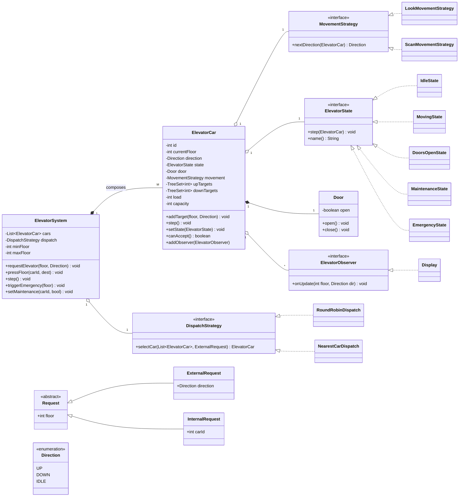
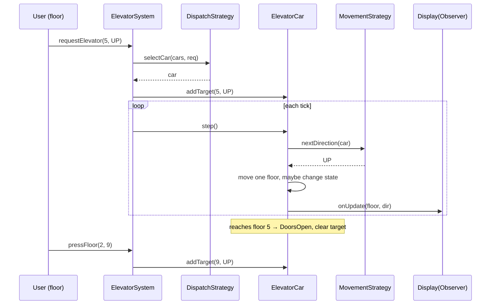

# Elevator System — Low-Level Design

> A staff-level LLD / machine-coding reference and last-minute revision artifact.
> Reader profile: a senior Java engineer who knows OOP and the GoF patterns and wants to see them *applied* with justification.

---

## 1. Problem statement

Design the control software for an **elevator system** in a building. The system manages one or more elevator cars across a fixed set of floors. People interact with it in two ways:

- **External (hall) requests:** a person standing on a floor presses *Up* or *Down*. This is a request for *some* car to come to that floor heading in a given direction.
- **Internal (car) requests:** a person already inside a car presses a destination-floor button.

The controller must decide **which car serves which request** and **how each car sequences the floors it must visit**, while honoring physical constraints (a car only moves up/down one floor at a time, doors must open/close, capacity limits). We want a clean, extensible object model — not just a working simulation.

---

## 2. Clarifying / requirements questions to ask first

Lead with these before drawing a single class. They split the design space and signal seniority.

**Functional scope**

1. **Single car or a bank of cars?** If a bank, do we need optimal car *assignment*, or is round-robin acceptable for v1?
2. **Floor model:** contiguous floors only, or basements (negative floors), mezzanines, skipped floors?
3. **Button model:** do hall panels have separate *Up* and *Down* buttons (standard), or a single call button?
4. **Do we model doors explicitly** (open/close/obstruction), or treat "arrive at floor" as the unit of work?
5. **Displays/indicators:** must we update floor displays and direction arrows inside the car and on each floor? (Drives Observer.)
6. **Do we model passengers/boarding**, or only the car's motion and request queue?

**Scheduling / dispatch**

7. **What's the dispatch objective** — minimize average wait, minimize total travel, or maximize throughput? This decides the algorithm (nearest-car vs. SCAN/LOOK vs. zoning).
8. Is the **scheduling policy fixed, or must it be swappable** at runtime/config? (Drives Strategy.)

**Non-functional**

9. **Concurrency:** requests arrive from many floors/cars simultaneously — must the controller be thread-safe? How many cars (10s, 100s)?
10. **Real-time vs. simulation:** do cars move in real wall-clock time (background threads/ticks), or do we step a discrete simulation?
11. **Capacity / weight limits**, and behavior when full (skip new boardings, refuse hall stops)?
12. **Fault handling:** maintenance mode, emergency stop, fire-service mode, power failure / safe-park?
13. **Persistence / observability:** do we need to log or recover state after a crash? (Usually out of scope for the round.)

**Scope-narrowing (what I'll assume if not told)**

> Multiple cars; contiguous floors `0..N-1` plus optional basements; separate Up/Down hall buttons; explicit doors; displays via Observer; objective = minimize wait with a **pluggable** strategy (default = nearest-suitable car for assignment + **LOOK** per-car sequencing); thread-safe controller; cars driven by per-car worker threads in a tick loop; capacity limit with skip-when-full; maintenance & emergency modes in scope; persistence out of scope.

---

## 3. Finalized requirements & assumptions

**In scope**

- A building with `N` floors and a configurable bank of `M` elevator cars.
- External Up/Down hall requests and internal destination requests.
- A pluggable **dispatch strategy** (which car) and per-car **movement strategy** (LOOK/SCAN: what order).
- Each car has: current floor, motion direction (`UP`/`DOWN`/`IDLE`), operational state (moving, stopped/doors-open, idle, maintenance, emergency), a door, a capacity limit, and a set of target floors.
- Displays on each floor and in each car update as cars move (Observer).
- Thread-safe submission of requests; cars run concurrently.
- Maintenance mode (take a car out of service) and emergency stop.

**Out of scope (stated explicitly)**

- Physics of acceleration, real motor control, exact timing/SLA guarantees.
- Persistence/crash recovery, auth, billing, UI.
- Multi-building / network-wide optimization.

**Key assumptions**

- One floor = one unit of travel; a "tick" advances a moving car by one floor.
- Boarding/alighting are abstracted: when a car stops at a floor, internal requests for that floor are cleared and new destination presses may arrive.
- "Capacity" is modeled as an occupant count with a max; weight is an easy extension of the same idea.

---

## 4. Problem extensions / follow-up variations

These are the follow-ups interviewers pile on. For each: the realistic ask and the **design impact** — note how little core code changes if the abstractions are right.

| # | Extension | Design impact |
|---|-----------|---------------|
| 1 | **Multiple elevators + optimal assignment** | Introduce a `DispatchStrategy` (Strategy pattern) consulted by the controller. Default round-robin → replace with nearest-suitable/estimated-time-of-arrival (ETA) cost function. No car or request code changes. |
| 2 | **Separate Up/Down hall buttons** | `ExternalRequest` carries a `Direction`. The per-car sequencing (LOOK) uses direction to decide whether to stop while passing. Already baked into the model. |
| 3 | **Capacity / weight limits** | Car tracks `load`/`maxLoad`. When full, dispatcher won't assign new *hall* stops to it and the car skips hall pickups (still serves internal drop-offs). One predicate, `canAccept()`. |
| 4 | **Express / zoned elevators** | A car gets a `serviceableFloors` set or a zone. `DispatchStrategy.canServe(car, request)` filters candidates. Sky-lobby/express = a car whose set is `{lobby} ∪ {high floors}`. |
| 5 | **Maintenance mode** | Add `MaintenanceState`: car refuses requests, finishes nothing, is excluded from dispatch. State pattern handles the behavior switch cleanly. |
| 6 | **Emergency / fire-service mode** | System-wide command: cancel all requests, send every car to a designated floor, open doors, lock out. Modeled as a `Command` broadcast + an `EmergencyState`. |
| 7 | **Concurrency of requests** | Thread-safe request intake (`BlockingQueue` / locked structures), per-car worker threads, atomic state transitions. Covered in §9. |
| 8 | **Priority / VIP / freight requests** | Requests carry a priority; the per-car target structure becomes a priority-aware ordering, or dispatch boosts certain requests. Strategy/Command absorb it. |
| 9 | **Energy-aware idle parking** | Idle cars return to "home" floors via a parking strategy — another `DispatchStrategy`/policy, invoked when a car goes IDLE. |
| 10 | **Destination-dispatch (enter destination at the lobby)** | Hall request becomes a full destination up front; assignment groups passengers by destination. Changes the *request type* and dispatch cost function, not the car. |

The recurring theme: **Strategy** isolates *policy* (who/where/order), **State** isolates *mode* (idle/moving/maintenance/emergency), **Command** isolates *request semantics*, and the car/controller stay stable.

---

## 5. Core entities, responsibilities & relationships

- **`ElevatorSystem` (Facade / Controller / Singleton-ish):** the single entry point. Holds all cars, the floor range, the dispatch strategy, and the request intake. Routes external requests to a car via the strategy; forwards internal requests to the specific car. Owns lifecycle (start/stop) and system-wide commands (emergency).
- **`ElevatorCar`:** one physical car. Holds current floor, direction, an `ElevatorState`, a `Door`, a capacity counter, its `MovementStrategy`, and its set of target floors (up-set / down-set). Runs one *step* per tick: ask state what to do, move/stop/open doors, notify observers.
- **`Request` (abstract Command):** something to be done. `ExternalRequest(floor, direction)` and `InternalRequest(car, destinationFloor)`. Encapsulates "where + intent."
- **`Direction`:** `UP`, `DOWN`, `IDLE` (enum).
- **`ElevatorState` (State):** `IdleState`, `MovingState`, `DoorsOpenState`, `MaintenanceState`, `EmergencyState`. Each defines how the car behaves on a step and which transitions are legal.
- **`Door`:** `OPEN`/`CLOSED`, with `open()`/`close()` and an obstruction hook.
- **`DispatchStrategy` (Strategy):** chooses *which* car serves an external request. Impls: `RoundRobinDispatch`, `NearestCarDispatch` (LOOK-aware ETA).
- **`MovementStrategy` (Strategy):** decides a car's *next* target floor given its target sets and direction. Impl: `LookMovementStrategy` (and a `ScanMovementStrategy` variant).
- **`Display` / `Observer`:** floor indicators and in-car displays subscribe to a car's `(floor, direction)` changes. `ElevatorObserver` interface; `Display` implements it.
- **`ButtonPanel` (optional):** hall panel and car panel; thin producers of `Request`s. Often folded into the system API in a machine-coding round.

**Relationships (at a glance)**

- `ElevatorSystem` **composes** many `ElevatorCar` (cars don't exist without the system).
- `ElevatorSystem` **has-a** `DispatchStrategy`; `ElevatorCar` **has-a** `MovementStrategy`, a `Door`, an `ElevatorState`.
- `ElevatorCar` **aggregates** `ElevatorObserver`s (displays attach/detach independently).
- `ExternalRequest`/`InternalRequest` **inherit** from `Request`.
- `Idle/Moving/DoorsOpen/Maintenance/Emergency State` **implement** `ElevatorState`.

---

## 6. Design patterns applied

| Pattern | Where | Why | Rejected alternative / when *not* to use |
|---------|-------|-----|------------------------------------------|
| **State** | `ElevatorState` hierarchy controlling per-tick behavior & legal transitions | Car behavior differs sharply by mode (idle vs moving vs doors-open vs maintenance vs emergency); a State object localizes each mode's logic and the transition rules, killing a giant `switch`/`if` ladder | A single enum + conditionals is fine for **2–3 trivial modes**; don't add State if behavior barely varies — it adds class count for little gain |
| **Strategy** (dispatch) | `DispatchStrategy` picks the car | Assignment policy is the part most likely to change/experiment with (round-robin → nearest → ETA → zoning). Strategy makes it swappable and testable in isolation | If there will only ever be one fixed policy, a method on the controller suffices. Don't pre-abstract a policy that can't vary |
| **Strategy** (movement) | `MovementStrategy` picks next floor (LOOK/SCAN) | The "which floor next" sequencing is a distinct, swappable algorithm from "which car"; separating the two keeps each small | Folding movement into the car hardcodes one algorithm; only acceptable if SCAN/LOOK will never be compared |
| **Command** | `Request` (external/internal) as objects | Requests are queued, assigned, prioritized, logged, possibly cancelled. Reifying them as objects enables all of that and decouples *who presses* from *who serves* | If requests were just `(floor)` ints with no metadata/queueing/cancellation, a plain value would do |
| **Observer** | `Display`/`ElevatorObserver` on each car | Many displays must react to a car's position/direction without the car knowing about them; loose coupling, easy add/remove | If there's exactly one display tightly bound to the car, a direct call is simpler than the subscription machinery |
| **Facade** | `ElevatorSystem` as the single client-facing API | Hides cars, strategies, threads behind `requestElevator(...)`/`pressFloor(...)`; clients don't orchestrate internals | None really — but keep the facade thin; don't let it become a god-class that also implements scheduling itself |
| **Singleton** (optional) | `ElevatorSystem` instance per building | One coordinator per building is natural | Avoid if you need multiple instances in tests or multi-building setups; prefer DI over a hard Singleton. I keep it injectable |
| **Factory** (light) | creating `Request`/states | Centralizes construction, keeps panels dumb | Overkill if constructors are trivial; I keep it minimal |

**SOLID in play**

- **SRP:** car = motion + state; controller = routing; strategies = policy; displays = presentation. Each has one reason to change.
- **OCP:** new dispatch/movement policies, new states (maintenance, emergency, fire-service) are *added* without editing existing classes — the whole point of Strategy + State.
- **LSP:** any `DispatchStrategy`/`MovementStrategy`/`ElevatorState` is substitutable; the car/controller only see the interfaces.
- **ISP:** `ElevatorObserver` is a tiny interface (just `onUpdate`); requesters depend only on the facade methods they use.
- **DIP:** `ElevatorSystem` depends on `DispatchStrategy` abstraction; `ElevatorCar` on `MovementStrategy`/`ElevatorState` abstractions — not concretes. Strategies are injected.

---

## 7. Class diagram



**Brief text UML**

```
ElevatorSystem ◆──> ElevatorCar*        (composition)
ElevatorSystem ──>  DispatchStrategy     (strategy, injected)
ElevatorCar    ──>  MovementStrategy      (strategy, injected)
ElevatorCar    ──>  ElevatorState         (state, swapped at runtime)
ElevatorCar    ◆──> Door                  (composition)
ElevatorCar    ──>  ElevatorObserver*     (observer, attach/detach)
Request ▲ ExternalRequest, InternalRequest        (inheritance)
ElevatorState ▲ Idle/Moving/DoorsOpen/Maintenance/Emergency
DispatchStrategy ▲ RoundRobin, NearestCar
MovementStrategy ▲ Look, Scan
```

**Key public APIs**

```java
// Facade
void requestElevator(int floor, Direction dir);   // external/hall call
void pressFloor(int carId, int destinationFloor); // internal/car call
void step();                                       // advance simulation one tick
void triggerEmergency(int parkFloor);
void setMaintenance(int carId, boolean on);

// Car
void addTarget(int floor, Direction servingDir);
void step();                 // delegates to current ElevatorState
boolean canAccept();         // capacity/zone check
void setState(ElevatorState s);

// Strategies
ElevatorCar selectCar(List<ElevatorCar> cars, ExternalRequest r);
Direction   nextDirection(ElevatorCar car);
```

---

## 8. Key flows

**A) External (hall) request → service**

1. `requestElevator(floor, dir)` builds an `ExternalRequest`.
2. `DispatchStrategy.selectCar(...)` filters cars that *can serve* (in zone, not in maintenance, has capacity) and picks the best (nearest/ETA, or round-robin).
3. Chosen car `addTarget(floor, dir)` — inserted into its up-set or down-set.
4. On each tick, the car's `MovementStrategy.nextDirection()` decides up/down/idle from its target sets (LOOK: keep going in the current direction while targets remain that way, then reverse).
5. Car transitions `Idle → Moving`; advances one floor per tick; when it reaches a target floor it transitions `Moving → DoorsOpen`, opens doors, clears that target, notifies observers.
6. After dwell, `DoorsOpen → Moving/Idle`; passengers may press internal floors (`pressFloor`).

**B) Internal request**

`pressFloor(carId, dest)` → that car `addTarget(dest, dir-implied-by-dest-vs-current)`; same movement loop continues.



---

## 9. Concurrency, edge cases & extensibility

**Concurrency / thread-safety**

- **Request intake is multi-producer:** many floors/cars submit concurrently. Keep a per-car thread-safe target structure (synchronized `TreeSet` access, or a `ConcurrentSkipListSet`), and guard car state transitions with the car's own lock so `step()` and `addTarget()` don't interleave inconsistently.
- **Two execution models** (call out the choice):
  - *Discrete simulation* (what `Solution.java` ships): a single driver calls `system.step()`; deterministic, trivially correct, ideal for a review artifact. Each car's `step()` synchronizes on the car.
  - *Real-time*: one **worker thread per car** running a tick loop; the controller dispatches into thread-safe target sets. Use a `BlockingQueue` for external-request intake feeding a dispatcher thread. State transitions must be atomic under the car lock.
- **Avoid global locks:** lock per car, not the whole system, so cars move in parallel. The dispatcher reads a snapshot of car positions to choose — slight staleness is acceptable (it's a heuristic anyway).
- **Idempotent targets:** pressing the same floor twice is a no-op because targets are *sets*, not lists — naturally dedupes concurrent duplicate presses.

**Edge cases**

- Request for the **current floor while idle** → just open doors, don't "move."
- **Direction conflict:** someone on floor 5 wants UP but the nearest car is heading DOWN past 5 — LOOK should *not* stop for an opposite-direction hall call; it serves it on the return sweep. (Common bug; mention it.)
- **Car full** → still serves its internal drop-offs but is skipped for new hall pickups (`canAccept()` false).
- **Out-of-range floor / unknown carId** → reject defensively.
- **All cars in maintenance** → request is rejected/queued with a clear signal, not silently lost.
- **Doors obstructed** → stay in `DoorsOpen`, retry close (hook provided).
- **Emergency mid-motion** → flush all targets, drive to park floor, open, lock to `EmergencyState`.

**Extensibility recap** — every item in §4 maps to *adding* a Strategy/State/Command impl, not editing the car or controller. That's the design's payoff and the senior-signal talking point.

---

## 10. Likely interview questions

1. **Why State for the elevator and not just an enum + `switch`?**
   Because behavior (what `step()` does) and *legal transitions* both vary by mode, and modes grow (maintenance, emergency, fire-service). State localizes each mode's behavior and transition rules in its own class, satisfying OCP. An enum+switch centralizes and re-edits the same method for every new mode — exactly what OCP warns against. *Probe:* When is the enum fine? → 2–3 trivial modes with near-identical behavior.

2. **SCAN vs. LOOK vs. nearest-car — which and why?**
   *Nearest-car* (greedy) minimizes the picked car's immediate wait but can starve and ping-pong. *SCAN* sweeps to the building extreme before reversing; *LOOK* is SCAN but reverses as soon as there are no further targets in the current direction — strictly less wasted travel. I use **LOOK for per-car sequencing** and a **nearest/ETA cost for assignment**. *Probe:* starvation? → LOOK bounds wait because a request is served within at most one full sweep.

3. **How do separate Up/Down hall buttons change sequencing?**
   A car passing floor 5 should only stop if the waiting passenger's direction matches the car's current direction; otherwise it serves them on the return. So targets are kept as direction-tagged sets (up-set / down-set), and LOOK drains the set matching the current direction first.

4. **Multiple cars: how do you assign optimally?**
   `DispatchStrategy` computes a cost per candidate car (distance + directional compatibility + load + estimated stops ahead = rough ETA), filters by zone/maintenance/capacity, and picks the min. It's a heuristic on a snapshot; perfect optimality is NP-ish and unnecessary. *Probe:* tie-break? → least-loaded, then lowest id for determinism.

5. **Where exactly is the Strategy pattern, and could you over-apply it?**
   Two places: assignment (which car) and movement (which floor next). Yes — over-applying means abstracting policies that will never vary, paying class-count and indirection cost for nothing. I only abstract the two axes that genuinely change.

6. **(Senior) Walk the SOLID tradeoffs in this design.**
   SRP splits motion/routing/policy/presentation. OCP shows up as "new mode = new State, new policy = new Strategy, no edits." DIP: controller→strategy interface, car→state/movement interfaces, all injected. ISP: `ElevatorObserver` is one method. The cost is more classes; justified because the change-prone axes (policy, mode) are exactly the ones isolated.

7. **(Senior) Make it thread-safe for a real building.**
   Per-car lock guarding state + target sets; a dispatcher thread consuming a `BlockingQueue` of external requests; per-car worker threads ticking. No global lock so cars parallelize. Targets as sets give idempotent dedupe. Dispatcher reads a position snapshot — bounded staleness is fine for a heuristic. *Probe:* deadlock risk? → cars never lock each other; the dispatcher only reads snapshots, so there's no lock-ordering cycle.

8. **How does Observer help, and what if there were one display?**
   Many floor/car displays react to position changes without the car depending on them — add/remove freely. With exactly one tightly-coupled display, a direct method call is simpler and Observer is over-engineering.

9. **(Senior) Add express/zoned elevators with minimal change.**
   Give each car a `serviceableFloors`/zone; `DispatchStrategy.canServe()` filters candidates. An express car's set is `{lobby} ∪ {high floors}`. Movement/LOOK is unchanged because it only ever sees that car's own targets. Zero car/controller edits — only the strategy's filter and the car's field.

10. **How do you handle emergency / fire-service mode?**
    A system-wide `Command` broadcast flips every car to `EmergencyState`: flush targets, drive to the designated floor, open doors, lock out new requests. State guarantees no normal transition can fire while emergency is active. *Probe:* recovery? → an explicit reset command transitions back to `IdleState`.

**Deep-probe follow-ups to expect:** (a) prove LOOK can't starve a request; (b) compute the ETA cost function precisely and defend each term; (c) show the exact transition table of your State machine and which transitions you *forbid*.

---

## PART C — Cheat-sheet & self-test

**Patterns used (recap)**

- **State** → `ElevatorState` (Idle/Moving/DoorsOpen/Maintenance/Emergency): per-mode behavior + legal transitions, OCP-friendly.
- **Strategy ×2** → `DispatchStrategy` (which car: round-robin / nearest-ETA, zone & capacity filtered) and `MovementStrategy` (which floor next: LOOK/SCAN).
- **Command** → `Request` (External Up/Down, Internal destination): queueable, assignable, cancellable.
- **Observer** → `Display`/`ElevatorObserver`: decoupled position/direction updates.
- **Facade (+ optional Singleton)** → `ElevatorSystem`: one thin client API over cars/strategies/threads.

**Key design decisions**

- Targets are **direction-tagged sets** (up-set/down-set) → idempotent dedupe + correct Up/Down hall handling.
- Separate the two policy axes (assignment vs. sequencing) into two Strategies.
- **Per-car locking**, no global lock; discrete `step()` for the review artifact, worker-thread model described for production.
- Extensions (zoning, capacity, maintenance, emergency, priority, parking) = *add* a Strategy/State/Command impl, never edit the car/controller.

**Self-test (no answers)**

1. Draw the full State transition table and mark which transitions you deliberately forbid (e.g., `Maintenance → Moving` directly).
2. Write the exact ETA cost function `NearestCarDispatch` uses and justify every term and its sign.
3. Prove LOOK serves any accepted request within at most one full direction sweep (no starvation).
4. The same floor's Up and Down buttons are both pressed by two people — trace how your model keeps them as distinct obligations and serves each in the right sweep.
5. Convert the discrete `step()` simulation to a real-time, per-car-thread design: name every shared structure, the lock that guards it, and argue why no deadlock is possible.
