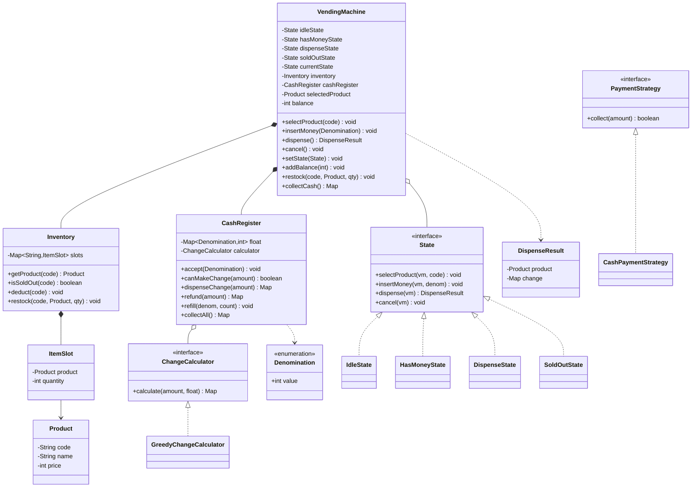

# Vending Machine — Low-Level Design

> A staff-level LLD / machine-coding reference. Read it top-to-bottom once; on revision day, skim the clarifying questions, the pattern table, the class diagram, and the interview Q&A. The companion `Solution.java` is the single-file review artifact.

---

## 1. Problem statement

Design the software that runs a **vending machine**. A customer walks up, selects a product, inserts money (coins/notes or a card), and the machine either **dispenses the product and returns correct change**, or **rejects/refunds** the transaction. An operator periodically **restocks** products and **refills/collects** cash.

The crux of the problem is that the machine is a **stateful device**: the same button ("insert coin", "select product", "dispense") behaves completely differently depending on *where* the machine currently is in the transaction (waiting for selection, collecting money, dispensing, sold out). Modeling that cleanly — without a sprawl of `if (state == ...)` checks — is what the interviewer is testing.

---

## 2. Clarifying / requirements questions to ask first

Lead with these *before* writing a single class. They show you scope the problem like a senior engineer. Group them so you can rattle them off quickly.

**Functional scope**

1. What payment types must we support — coins/notes only, or also cards / UPI / contactless? (Decides whether we need a payment-strategy abstraction now or later.)
2. Does the machine have to **compute and return change**? If so, from a finite cash float (realistic) or can we assume infinite change (toy)?
3. One product per transaction, or a cart of multiple items? (Most VM problems are one-at-a-time; confirm.)
4. Can the user **cancel** mid-transaction and get a full refund?
5. What happens on **exact-change-unavailable** — refuse the sale and refund, or dispense and owe? (Real machines refuse.)
6. Do we need **restock / refill cash / collect cash** operator operations, or is that out of scope?

**Non-functional / constraints**

7. Is this a **single physical machine** (one in-process controller) or a fleet with a central server? (Single machine → in-memory singleton inventory is fine.)
8. **Concurrency:** is there exactly one front panel (one user at a time, naturally serialized) or could multiple threads/inputs hit it? This decides how much locking we need.
9. Any **persistence** requirement (survive power cycle) or is in-memory acceptable for the round?
10. Денominations: which coins/notes are valid? Fixed set?

**Scope-narrowing / out-of-scope**

11. Out of scope: hardware/motor control, networking, UI rendering, auth for operators, multi-currency, dynamic pricing — confirm we can stub these.
12. Observability/audit log of transactions — needed or nice-to-have?

> For this document I assume the common interview answer: **single physical machine, coins + notes now with a card strategy designed-in, finite change float that must be computed, cancel/refund supported, refuse sale if exact change can't be made, operator restock/collect supported, single-user front panel but inventory made thread-safe defensively.**

---

## 3. Finalized requirements & assumptions

**Functional**

- Display available products with price and stock.
- Accept money incrementally (insert one coin/note at a time); track running balance.
- Select a product; validate it exists and is in stock.
- On "dispense": verify balance ≥ price and that the machine can make change; then dispense product, return change, reset.
- Support **cancel** at any pre-dispense point → full refund of inserted money.
- Refuse and refund if exact change cannot be made.
- Operator: **restock** a slot, **refill change** float, **collect cash**.

**Non-functional**

- Adding a new payment method must not touch the state machine (Open/Closed).
- State transitions must be explicit and centralized — no scattered conditionals.
- Inventory access is thread-safe (defensive, even though the panel is single-user).
- Pure JDK, in-memory.

**Assumptions**

- One product per transaction.
- Prices and denominations are integers in the smallest currency unit (e.g., cents) to avoid floating-point money bugs.
- Cash float is finite; greedy change-making is acceptable for the standard denomination set (documented limitation below).

---

## 4. Problem extensions / follow-up variations

These are the follow-ups interviewers pile on. For each, note the design impact — the goal is that a well-factored design absorbs them with *additive* changes, not rewrites.

| Extension | What changes | Design lever that absorbs it |
|---|---|---|
| **Card / UPI / contactless payment** | New way to add balance; auth + capture instead of physical coins | `PaymentStrategy` interface — add a `CardPaymentStrategy`; states are untouched |
| **Change computation from finite float** | Must check feasibility before dispensing; deduct correct denominations | `ChangeCalculator` + `CashRegister`; refuse in `DispenseState` if `null` |
| **Exact-change-only mode** | Disallow sales when change can't be made | A flag the `DispenseState` checks via `CashRegister.canMakeChange` |
| **Refund / cancel** | Return all inserted money at any pre-dispense state | `cancel()` on the `State` interface; each state implements appropriately |
| **Multiple denominations / new currency** | New coin/note values | `Denomination` enum / value object; calculator is denomination-agnostic |
| **Restocking & cash refill (operator mode)** | Privileged operations distinct from customer flow | Separate operator methods on `VendingMachine`; optional `MaintenanceState` |
| **Concurrency (multiple input sources, telemetry)** | Shared inventory/register mutated concurrently | `synchronized`/locks in `Inventory` & `CashRegister`; atomic balance |
| **Multiple simultaneous purchases / cart** | Reserve several slots atomically | Inventory reservation + transaction object; bigger change but contained |
| **Audit / telemetry** | Emit events on each transition & sale | `Observer` pattern on the machine (designed-in, optional) |
| **Discounts / promotions** | Adjust effective price | Pricing strategy or decorator over `Product` price |

---

## 5. Core entities, responsibilities & relationships

- **`VendingMachine`** — the **context**. Holds current `State`, the `Inventory`, the `CashRegister`, the currently selected product, and the customer's running balance. Exposes the public API the front panel calls: `selectProduct`, `insertMoney`, `dispense`, `cancel`. It **delegates** each call to its current state. *(One responsibility: orchestrate the transaction by delegating to state.)*
- **`State`** (interface) — defines the reaction to each event: `selectProduct`, `insertMoney`, `dispense`, `cancel`. Concrete states: **`IdleState`** (waiting for selection), **`HasMoneyState`** (product selected, collecting money), **`DispenseState`** (enough money in, dispensing + change), **`SoldOutState`** (selected slot empty / machine empty). Each state knows the legal transitions out of itself.
- **`Product`** — value object: id, name, price (in smallest unit). Immutable.
- **`Inventory`** — maps a slot/product code → `ItemSlot{Product, quantity}`. Responsibilities: stock lookup, decrement on sale, restock, "is sold out". Thread-safe.
- **`CashRegister`** — holds the machine's cash float as counts per `Denomination`. Responsibilities: accept inserted money, compute/return change, check feasibility (`canMakeChange`), refill, collect. Thread-safe.
- **`Denomination`** (enum) — valid coin/note values (e.g., `PENNY, NICKEL, DIME, QUARTER, ONE, FIVE`), each carrying its integer value.
- **`ChangeCalculator`** (strategy) — given an amount and available denominations, returns the denomination breakdown or `null` if impossible.
- **`PaymentStrategy`** (interface) — abstracts *how* balance is added: `CashPaymentStrategy`, (extension) `CardPaymentStrategy`.
- **`DispenseResult`** — what the machine hands back: the `Product` plus a change map.

Relationships: `VendingMachine` **composes** `Inventory`, `CashRegister`, and the current `State` (states are usually flyweight singletons referenced by the machine). `Inventory` **composes** `ItemSlot`s which **reference** `Product`. `CashRegister` **uses** a `ChangeCalculator`.

---

## 6. Design patterns applied

| Pattern | Where | Why | Rejected alternative & *when not* to use this |
|---|---|---|---|
| **State** | `State` interface + `Idle/HasMoney/Dispense/SoldOut` | The machine's response to each event depends entirely on its current phase. State localizes each phase's transition logic in its own class, eliminating a giant `switch(currentState)` and making transitions explicit and testable. | **Enum + conditionals** in `VendingMachine`. Fine for 2 states / trivial logic; becomes a maintenance hazard as states and events grow. Don't reach for State when there are only two states and no per-state behavior. |
| **Strategy** | `PaymentStrategy`, `ChangeCalculator` | Payment method and change algorithm are *interchangeable policies*. Lets us add card payment or swap greedy→DP change without touching the state machine. (Open/Closed.) | **`if (cash) … else if (card) …`** branching. Acceptable if there will only ever be one payment type — then a strategy is over-engineering. |
| **Singleton** | `Inventory` / `CashRegister` (or the `VendingMachine` itself) | A physical machine has exactly one inventory and one cash box; a single shared instance prevents divergent stock counts. | **Plain instances passed around** (dependency injection). DI is actually *cleaner and more testable*; prefer it if the round values testability. Singleton is the classic VM answer but call out its testing downside. |
| **Flyweight (light)** | State objects shared as singletons | States are stateless behavior holders; one instance each, referenced by the context, avoids per-transaction allocation. | New state object per transition — negligible cost, simpler; fine to skip flyweight. |
| **Observer** *(designed-in, optional)* | `VendingMachine` notifies listeners on sale/low-stock | Decouples telemetry/audit/low-stock alerts from core logic. | Direct logging calls inside states — couples concerns; only worth Observer if telemetry is in scope. |
| **Factory** *(optional)* | Building the configured machine | Centralizes wiring of inventory, register, denominations. | Inline construction in `main` — fine for the artifact. |

**SOLID in play**

- **S**RP: `Inventory` only manages stock; `CashRegister` only manages money; each `State` only manages its own transitions; `VendingMachine` only delegates.
- **O**CP: new payment method = new `PaymentStrategy`; new change algorithm = new `ChangeCalculator`; **no edits to existing states**.
- **L**SP: every `State` honors the `State` contract; the context calls them uniformly.
- **I**SP: `State` exposes only the four customer events; operator ops live on `VendingMachine`, not forced onto states.
- **D**IP: `VendingMachine` depends on the `State`, `PaymentStrategy`, and `ChangeCalculator` **abstractions**, not concretions.

---

## 7. Class diagram



**Text UML (quick recall)**

```
VendingMachine ──*── Inventory ──*── ItemSlot ──> Product
VendingMachine ──*── CashRegister ──o── ChangeCalculator
VendingMachine ──o── State ◁── {Idle, HasMoney, Dispense, SoldOut}
PaymentStrategy ◁── {Cash, (Card)}
( * composition,  o aggregation/uses,  ◁ implements )
```

Key public APIs: `selectProduct(String code)`, `insertMoney(Denomination d)`, `DispenseResult dispense()`, `cancel()`, plus operator `restock(...)`, `refillChange(...)`, `Map<Denomination,Integer> collectCash()`.

---

## 8. Key flows

**Happy path (cash purchase)**

```mermaid
sequenceDiagram
    actor User
    participant VM as VendingMachine
    participant S as currentState
    participant Inv as Inventory
    participant Reg as CashRegister

    User->>VM: selectProduct("A1")
    VM->>S: selectProduct(vm,"A1")
    S->>Inv: isSoldOut("A1")?
    Inv-->>S: false
    S->>VM: set selectedProduct, setState(HasMoney)
    User->>VM: insertMoney(QUARTER) x N
    VM->>S: insertMoney(vm, QUARTER)
    S->>Reg: accept(QUARTER); VM.addBalance
    Note over VM: when balance >= price → setState(Dispense)
    User->>VM: dispense()
    VM->>S: dispense(vm)
    S->>Reg: canMakeChange(balance - price)?
    Reg-->>S: true → dispenseChange(...)
    S->>Inv: deduct("A1")
    S-->>VM: DispenseResult(product, change); setState(Idle)
    VM-->>User: product + change
```

**Cancel / refund:** in `HasMoneyState.cancel()` → `CashRegister.refund(balance)`, reset balance & selection, `setState(Idle)`.

**Refuse on no-change:** in `DispenseState.dispense()` if `!canMakeChange(balance - price)` → refund full balance, message "exact change unavailable", back to `Idle`.

**Sold out:** if `selectProduct` finds the slot empty → `setState(SoldOut)`; `SoldOutState` refuses inserts/dispense, allows `cancel` (refund) and returns to `Idle` after refund or restock.

---

## 9. Concurrency, edge cases & extensibility

**Concurrency / thread-safety**

- A real front panel serializes one customer's actions, but telemetry threads, an operator restocking, or multiple input sources can race on **shared mutable state**: `Inventory` slot counts and `CashRegister` float.
- Make `Inventory.deduct/restock/isSoldOut` and `CashRegister` mutators `synchronized` (or guard with a `ReentrantLock`). Use **atomic check-then-act**: verifying stock and decrementing must happen under the *same* lock, else two threads both see qty=1 and both dispense (oversell).
- The customer **balance** lives on the machine; if a single panel, no contention. If concurrent, use an `AtomicInteger` or confine the transaction to a per-session object.
- Keep money in **integer smallest units**; never `double` (floating-point rounding loses cents).
- Lock ordering: if a single operation touches both inventory and register, always acquire in a fixed order to avoid deadlock — or better, keep them independent and sequence the steps.

**Edge cases**

- Insert money before selecting → either buffer it in `Idle` or reject; we require selection first (`IdleState.insertMoney` rejects with a message).
- Overpayment → return the difference as change (subject to feasibility).
- Dispense pressed with insufficient balance → stay in `HasMoney`, prompt for more.
- Slot becomes the last unit → after `deduct`, mark sold-out for that slot.
- Cancel after dispense started → not allowed once `DispenseState` has committed; cancel only valid pre-commit.
- Invalid product code / unknown denomination → reject gracefully.
- Change float empty for a denomination → `canMakeChange` returns false → refuse & refund.

**Extensibility recap** — the extensions in §4 land as: new `PaymentStrategy` (card), new `ChangeCalculator` (DP for arbitrary denominations), a flag for exact-change mode, an optional `MaintenanceState` + operator methods, and `Observer` listeners for telemetry — all *additive*, none requiring edits to existing state classes. That additivity is the payoff of State + Strategy + DIP.

**Change-making caveat:** greedy is optimal only for "canonical" coin systems (standard US/EUR-like sets). For arbitrary denominations greedy can fail (e.g., {1,3,4} making 6 → greedy 4+1+1, optimal 3+3). Swap in a dynamic-programming `ChangeCalculator` — the `Strategy` seam makes this a one-class change. Mention this proactively; it's a senior signal.

---

## 10. Likely interview questions

**Q1. Why the State pattern here, not just an enum + `switch`?**
Each phase reacts differently to the *same* four events, and transitions are phase-specific. State puts each phase's behavior and its outgoing transitions in one cohesive class, so adding a phase (e.g., `MaintenanceState`) doesn't mean editing a growing switch in every method. Enum+switch is fine for ≤2 trivial states; here it would scatter transition logic and violate OCP.
- *Probe:* Where do transitions live? → Inside each state (it calls `vm.setState(...)`), so the context stays thin.
- *Probe:* Are states stateful? → No, they're behavior-only, so we share singletons (flyweight) and keep per-transaction data on the machine.

**Q2. How do you compute change, and what breaks?**
A `ChangeCalculator` strategy. Default greedy over denominations high→low against the finite float. It breaks for non-canonical denomination sets where greedy isn't optimal — so the calculator is an interface and we can drop in a DP solution. The register checks feasibility (`canMakeChange`) *before* dispensing and refuses otherwise.
- *Probe:* Why integers? → Money in cents avoids floating-point rounding errors.

**Q3. Exact-change-unavailable — what does the machine do?**
Before committing the sale, `DispenseState` asks `CashRegister.canMakeChange(balance - price)`. If false, it refunds the full inserted balance, shows a message, and returns to `Idle`. Real machines refuse rather than owe money.

**Q4. Make it thread-safe. What exactly do you lock?**
The shared mutable state: `Inventory` counts and `CashRegister` float. The critical insight is **atomic check-then-act** — verify stock and decrement under one lock to prevent oversell; same for reserving change denominations. Customer balance is confined to the session/machine. Keep operations on inventory and register independent to avoid deadlock, or impose a fixed lock order.
- *Probe:* Singleton + global lock — bottleneck? → For one physical machine throughput is human-paced, so contention is negligible; for a fleet you'd shard per machine.

**Q5. Adding card payments — what changes?**
Just a new `CardPaymentStrategy implements PaymentStrategy` that authorizes/captures and reports the amount as balance. The state machine and inventory are untouched. That's OCP via Strategy.
- *Probe:* Where is the strategy selected? → At `insertMoney`/payment time on the machine; states delegate to whatever strategy is active.

**Q6. Why is Singleton a *questionable* choice and what would you prefer?** *(senior signal)*
A physical machine genuinely has one inventory/register, so Singleton models reality — but it harms testability (global state, hard to inject mocks) and hides dependencies. I'd prefer constructing single instances and **injecting** them (DIP). I'd mention Singleton as the textbook answer but flag the trade-off and lean toward DI.

**Q7. How does cancel/refund work and when is it illegal?** *(senior signal)*
`cancel()` is on the `State` interface; `Idle`/`HasMoney`/`SoldOut` refund inserted money and reset. Once `DispenseState` has *committed* (deducted stock / released product), cancel is rejected — the transaction is past the point of no return. Modeling cancel per-state is exactly why State pattern pays off.

**Q8. Where do SOLID principles show up?** *(senior signal)*
SRP across `Inventory`/`CashRegister`/`State`/`VendingMachine`; OCP via the Strategy seams for payment and change; DIP because the context depends on `State`/`PaymentStrategy`/`ChangeCalculator` abstractions; ISP because operator ops aren't forced onto the customer-facing `State` interface.

**Q9. User inserts money without selecting a product?**
`IdleState.insertMoney` rejects (or buffers, by clarified requirement). We require selection first so the machine knows the target price and can validate stock early.

**Q10. How would you add low-stock alerts / audit logs without polluting core logic?**
Designed-in `Observer`: `VendingMachine` notifies registered listeners on sale and on stock crossing a threshold. Telemetry/audit subscribe; core states stay clean. Only add it if observability is in scope — otherwise YAGNI.

---

## PART C — Cheat-sheet & self-test

**Patterns & decisions recap**

- **State** is the centerpiece: `Idle → HasMoney → Dispense → Idle`, with `SoldOut` branch; each state owns its transitions and its `cancel` semantics.
- **Strategy** twice: `PaymentStrategy` (cash/card) and `ChangeCalculator` (greedy now, DP if denominations non-canonical).
- **Singleton** for `Inventory`/`CashRegister` (model reality) — but flag DI as the more testable choice.
- **Observer** (optional) for telemetry/low-stock.
- Money as **integer cents**; **atomic check-then-act** under lock for stock & change to prevent oversell; **refuse + refund** when exact change impossible.
- Everything new (card, DP change, maintenance mode, alerts) is **additive** — no edits to existing states (OCP + DIP).

**5 self-test questions (no answers)**

1. Draw the full state-transition table for the four states × four events (select, insert, dispense, cancel) — which transitions are illegal, and what does each illegal one do?
2. Greedy change fails for denominations {1, 3, 4} making 6. Write the DP `ChangeCalculator` interface method signature and the recurrence.
3. Two threads call `dispense()` for the last unit of slot A1 simultaneously. Walk through exactly where the race is and the minimal locking that fixes it without deadlock.
4. You must support a cart of up to 5 items in one transaction. What new abstraction do you introduce, and which existing classes change vs. stay fixed?
5. Replace `Singleton` inventory with dependency injection. Show the constructor wiring and explain how it improves unit-testing of `DispenseState`.
