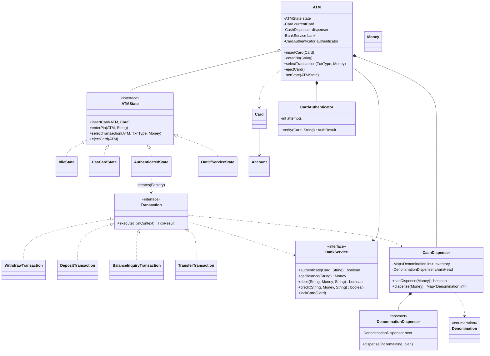
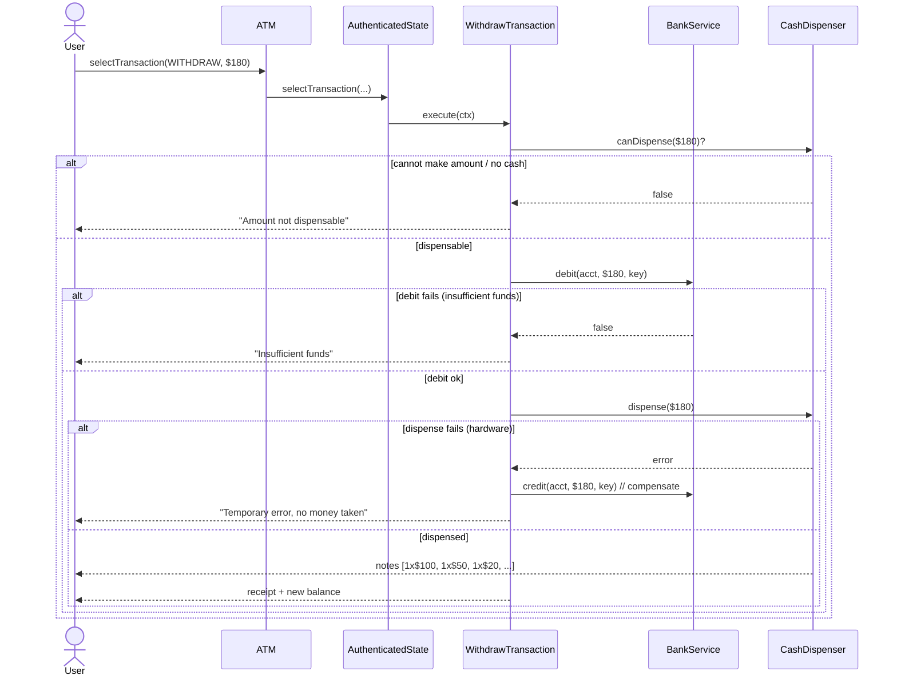

# ATM — Low-Level Design

> A staff-level OOD / machine-coding reference and last-minute revision artifact.
> Companion file: `Solution.java` (single-file, review-only implementation).

---

## 1. Problem statement

Design the software that runs an **Automated Teller Machine (ATM)**. A customer walks up, inserts a bank card, authenticates with a PIN, and performs one or more transactions — **withdraw cash, deposit cash/cheque, check balance, transfer funds** — and then takes the card back. The machine holds a finite amount of physical cash in **discrete denominations** and must dispense the exact requested amount using the notes it has, or refuse cleanly. Authentication must lock the card after too many wrong PINs, and money movements against the backing bank account must be **atomic and consistent** (we never dispense cash without debiting, and never debit without dispensing).

We are designing the **ATM controller**: the state machine, the transaction logic, the cash-dispensing logic, and the interface to the bank — not the embedded firmware for the card reader motor or the cash hopper sensors (those are abstracted behind interfaces).

---

## 2. Clarifying / requirements questions to ask first

Lead with these in the round — never start with classes.

**Functional scope**

- Which transaction types are in scope: withdraw, deposit, balance inquiry, transfer, mini-statement, PIN change? (I'll assume the first four.)
- Can the user perform **multiple transactions** in one session before ejecting the card, or one-and-done?
- Deposits: cash only, cheque only, or both? Is deposited cash available immediately or held for clearing?
- Withdrawals: must we dispense **exact denominations**, and do we optimize for fewest notes? Is there a per-transaction or daily limit?
- Is this a **single bank's** ATM (card always belongs to us) or an **interbank** ATM that routes to other banks' networks?

**Non-functional / constraints**

- **Concurrency model:** one customer at a time at the physical machine (true), but the *backing account* can be touched concurrently by other ATMs / online banking / POS. So account debits must be atomic at the bank, not just at this ATM. Agree?
- Reliability: what happens on **power loss mid-dispense**? Do we need a transaction journal / two-phase behavior so we can reconcile?
- **PIN retry policy:** how many attempts before lockout (assume 3), and is lockout per-session or persistent on the card/account?
- Hardware failure handling: card reader jam, cash hopper empty, receipt printer out of paper — degrade gracefully or go out of service?

**Scope-narrowing / out of scope**

- Are we mocking the **BankService** (network call to core banking) or implementing it? (Assume a mockable interface.)
- Do we need to model **multiple currencies**? (Assume single currency.)
- Receipt printing, audit logging, fraud detection, EMV chip crypto — model as interfaces/hooks or out of scope? (Treat as pluggable, out of deep scope.)

---

## 3. Finalized requirements & assumptions

**In scope**

1. Session lifecycle: idle → card inserted → PIN authenticated → transaction selection → execute → (repeat or) eject.
2. Authentication with **3 PIN attempts**, then card retained/locked.
3. Transactions: **Withdraw, Deposit, Balance inquiry, Transfer**.
4. Withdrawal dispenses cash from a **denomination-aware dispenser** using a greedy *fewest-notes* algorithm, refusing if it can't make the exact amount or has insufficient cash.
5. Money movement is **atomic** via the `BankService` (debit/credit are the source of truth; the ATM never updates a local balance authoritatively).
6. Edge cases: insufficient account funds, insufficient ATM cash, non-dispensable amount, wrong PIN / lockout, withdrawal limit exceeded.

**Assumptions**

- One customer physically present at a time → the **state machine itself is single-threaded per ATM**. Thread-safety matters for (a) the shared `CashDispenser` inventory if the machine model is reused across sessions, and (b) the `BankService` account, which is shared infrastructure.
- `BankService` is an interface backed by a mock in the review artifact.
- Single currency; amounts are whole units (e.g., dollars) for dispensing; we track minor units with `BigDecimal`/`long` cents for balances to avoid floating point.

---

## 4. Problem extensions / follow-up variations

These are where senior candidates differentiate. For each: the ask, and the **design impact**.

| Extension | What changes | Design impact |
|---|---|---|
| **Denomination optimization** (fewest notes) | Greedy works for canonical currency systems; not for arbitrary sets | Encapsulate in `CashDispenser` behind a `dispense(amount)` API; the algorithm is swappable (Strategy / Chain). DP fallback for non-canonical sets. |
| **Insufficient cash / partial inventory** | Must check feasibility *before* committing the debit | Two-phase: `canDispense()` → `commitDebit()` → `dispense()`. Never debit first. |
| **PIN retries / lockout** | Counter + threshold; persistent vs session lockout | Lives in the authentication step / `CardAuthenticator`; emits a domain event to lock the card at the bank. State machine moves to a terminal "card retained" state. |
| **Multiple transaction types** | Adding transfer, mini-statement, PIN change | **Strategy pattern**: each transaction is a `Transaction` strategy; adding one = new class, no `switch` edits (OCP). |
| **Concurrency / atomicity of debits** | Same account hit by other channels | Atomicity pushed to `BankService` (DB transaction / optimistic locking). ATM holds no authoritative balance. Idempotency keys for retry safety. |
| **Daily / per-txn withdrawal limits** | Need running totals per account/day | A `WithdrawalPolicy` consulted before dispense; data lives at the bank, not the ATM. |
| **Power failure mid-dispense** | Reconciliation needed | **Transaction journal** (write-ahead): record INTENT → DISPENSED → COMPLETED; on reboot, reconcile pending records (reverse debit if cash never left). |
| **Interbank routing** | Card may belong to another bank | `BankService` becomes a router/`Facade` over multiple bank adapters keyed by card BIN. |
| **Multi-currency** | Denomination sets per currency | `CashDispenser` parameterized by currency; `Money` value object carries currency. |

---

## 5. Core entities, responsibilities & relationships

- **`ATM`** — the controller / context. Holds the current `ATMState`, the inserted `Card`, the `CashDispenser`, and a reference to `BankService`. Delegates behavior to the current state.
- **`ATMState`** (interface) — `insertCard`, `enterPin`, `selectTransaction`, `ejectCard`. Concrete states: `IdleState`, `HasCardState`, `AuthenticatedState` (a.k.a. SelectOperation), `OutOfServiceState`. (State pattern.)
- **`Card`** — card number, encrypted PIN reference, owning account id; value/identity object. Does not store balance.
- **`Account`** — account id, balance, currency. Authoritative copy lives at the bank; ATM treats it as read-through.
- **`BankService`** (interface) — `authenticate(card, pin)`, `getBalance(accountId)`, `debit(accountId, amount, idempotencyKey)`, `credit(...)`, `transfer(...)`, `lockCard(card)`. The boundary to core banking; where atomicity lives.
- **`CashDispenser`** — holds note inventory `Map<Denomination, count>`; `canDispense(amount)`, `dispense(amount)`. Internally a **Chain of Responsibility** over denominations (₹2000 → ₹500 → ₹200 → ₹100 …) or a strategy.
- **`Denomination`** (enum) — note values and their integer worth.
- **`Transaction`** (interface, Strategy) — `execute(context)`. Concrete: `WithdrawTransaction`, `DepositTransaction`, `BalanceInquiryTransaction`, `TransferTransaction`.
- **`Money`** — value object wrapping amount + currency (avoids primitive obsession).
- **`CardAuthenticator`** — owns PIN-attempt counting and lockout decision.

**Relationships:** `ATM` *composes* one `CashDispenser` and *holds* the current `ATMState` (composition over inheritance for behavior). `ATM` *associates* with `BankService` (interface, injected). `Transaction` strategies *use* `BankService` + `CashDispenser` via a small context. `CashDispenser` *composes* a chain of `DenominationDispenser` handlers.

---

## 6. Design patterns applied

| Pattern | Where | Why | Rejected alternative / when **not** to use |
|---|---|---|---|
| **State** | `ATMState` drives the session (Idle → HasCard → Authenticated → …) | The legal operations depend entirely on the current phase; State removes a giant `if (phase==…)` web and makes illegal transitions impossible | A status `enum` + `switch` in `ATM`. Fine for 2–3 states with trivial logic; becomes unmaintainable as transitions/guards grow. Don't use State if there's really only one behavior. |
| **Strategy** | `Transaction` types (withdraw/deposit/balance/transfer) | Each transaction is an interchangeable algorithm; adding one is a new class, not an edit to existing code (OCP) | A `switch(type)` in one execute method. Acceptable if the set is fixed and tiny; Strategy wins once types multiply or vary independently. |
| **Chain of Responsibility** | `CashDispenser` dispensing by denomination (₹2000 handler → ₹500 → …) | Each handler peels off as many of its note as it can, passes the remainder on; adding/removing a denomination = add/remove a link | A single greedy loop over a sorted list. Simpler and arguably clearer for canonical currency — CoR shines when each denomination needs distinct rules (limits per note, reserve floors). Don't over-engineer if it's just a sorted loop. |
| **Factory (Method)** | Creating the right `Transaction` from a user selection | Centralizes instantiation, keeps the state object free of `new` clutter | Direct `new` in the state. Fine if creation is trivial; Factory helps when wiring dependencies (bank, dispenser) into the strategy. |
| **Singleton / DI** | One `ATM` controller; injected `BankService` | One controller per machine; dependencies injected for testability | Global static `BankService` — hurts testability. Prefer DI over classic Singleton. |
| **Facade** (extension) | `BankService` as a facade/router over core-banking subsystems / multiple banks | Hides interbank routing & subsystem complexity behind one interface | Direct subsystem calls from the ATM — leaks complexity and couples the ATM to bank internals. |

**SOLID in play**

- **S**RP: `CashDispenser` only dispenses; `CardAuthenticator` only authenticates; `BankService` only talks to the bank; the state classes only manage transitions.
- **O**CP: new transaction = new Strategy class; new note = new chain link — no edits to existing classes.
- **L**SP: any `ATMState` / `Transaction` substitutes for its interface without breaking `ATM`.
- **I**SP: small focused interfaces (`ATMState`, `Transaction`, `BankService`) rather than one fat ATM interface.
- **D**IP: `ATM` depends on the `BankService` *abstraction*, not a concrete bank; states depend on the `ATMState` abstraction.

---

## 7. Class diagram



**Text UML (quick read)**

```
ATM ──holds──▶ ATMState (Idle | HasCard | Authenticated | OutOfService)   [State]
ATM ──owns───▶ CashDispenser ──chain──▶ DenominationDispenser links       [Chain of Responsibility]
ATM ──uses───▶ BankService (interface; mock/real/router)                  [DIP / Facade]
AuthenticatedState ──creates──▶ Transaction (Withdraw|Deposit|Balance|Transfer)  [Strategy + Factory]
Transaction ──calls──▶ BankService.debit/credit  &  CashDispenser.dispense
```

**Key public APIs**

```java
// State
interface ATMState {
    void insertCard(ATM atm, Card card);
    void enterPin(ATM atm, String pin);
    void selectTransaction(ATM atm, TxnType type, Money amount);
    void ejectCard(ATM atm);
}

// Strategy
interface Transaction { TxnResult execute(TxnContext ctx); }

// Bank boundary (atomicity lives here)
interface BankService {
    boolean authenticate(Card card, String pin);
    Money   getBalance(String accountId);
    boolean debit(String accountId, Money amount, String idempotencyKey);
    boolean credit(String accountId, Money amount, String idempotencyKey);
    void    lockCard(Card card);
}

// Dispenser
Map<Denomination,Integer> dispense(Money amount);  // throws if not dispensable
boolean canDispense(Money amount);
```

---

## 8. Key flows

**Withdrawal (the critical path) — two-phase, debit-before-dispense, with compensation**



> **Ordering note:** we check feasibility first, then debit, then dispense, then *compensate* (credit back) if the physical dispense fails after a successful debit. Combined with an **idempotency key** + a write-ahead **journal**, this survives power loss: on reboot, any journal entry stuck at "debited but not dispensed" is reversed.

**Authentication / lockout**

```
HasCardState.enterPin(pin):
  if authenticator.verify(card, pin) == OK   → atm.setState(AuthenticatedState)
  else attempts++
       if attempts >= MAX(3) → bank.lockCard(card); retain card; atm.setState(OutOfService/Idle)
       else                  → "wrong PIN, N tries left"
```

---

## 9. Concurrency, edge cases & extensibility

**Concurrency / thread-safety**

- The **session state machine is single-threaded per ATM** (one physical user). We don't need locks around state transitions for a single machine.
- The **shared, dangerous state** is (1) the `CashDispenser` inventory and (2) the **account balance at the bank**.
  - `CashDispenser.dispense` mutates inventory; guard with a lock (`synchronized` / `ReentrantLock`) or make the inventory updates atomic so a feasibility check + decrement is a single critical section (avoid TOCTOU: *check-then-act* must be atomic).
  - Account atomicity is the **bank's** job: `debit` must be a single committed DB transaction with row locking or optimistic-concurrency (compare-and-set on balance/version). The ATM must **not** keep an authoritative local balance.
- **Idempotency:** every debit/credit carries a key so a retried request after a timeout doesn't double-charge.

**Edge cases**

- Wrong PIN ×3 → lock card, end session.
- Insufficient account funds → refuse before dispense.
- Insufficient/incompatible ATM cash (e.g., asks $30 but only $20 notes) → refuse with clear message, no debit.
- Withdrawal exceeds per-txn/daily limit → refuse via `WithdrawalPolicy`.
- Dispense hardware failure after debit → compensate (credit back); journal reconciles on reboot.
- User abandons mid-session / timeout → auto-eject card, return to Idle.
- Card jam / printer out → degrade or `OutOfServiceState`.

**Extensibility** — the patterns absorb the §4 extensions: new transaction = new Strategy (OCP); new denomination = new chain link; interbank = `BankService` becomes a router/Facade; multi-currency = parameterize `Money`/`CashDispenser`; limits = inject a `WithdrawalPolicy`.

---

## 10. Likely interview questions

1. **Why the State pattern here instead of an enum + switch?**
   Because the *set of legal operations changes per phase* and illegal transitions should be impossible by construction. State localizes each phase's behavior in its own class and removes scattered `if (phase==…)` guards. An enum+switch is fine for 2–3 trivial states; it rots as guards and transitions grow.

2. **Why is each transaction a Strategy and not a method on `ATM`?**
   Open/Closed: adding "transfer" or "mini-statement" should not force edits to existing tested code. Each strategy varies independently and can carry its own validation/policy. A monolithic `execute(switch type)` couples all transaction logic and grows unboundedly.

3. **Walk me through dispensing $180 with {$100,$50,$20,$10}. What if it's a non-canonical set like {$3,$5}?**
   Greedy/chain peels 1×$100, 1×$50, 1×$20, 1×$10. For **non-canonical** denominations greedy can fail even when a solution exists, so fall back to a DP (coin-change) that minimizes notes — encapsulated behind `dispense()` so callers don't care which algorithm runs.

4. **Order of operations for a withdrawal — debit first or dispense first?**
   Check feasibility → **debit → dispense → compensate on dispense failure**. Never dispense before a committed debit (you'd give away money on a failed debit); never leave a debit without dispensing — compensate by crediting back, backed by a journal + idempotency key so power loss is recoverable.

5. **How do you guarantee atomicity of the account debit when the same account is used elsewhere simultaneously?** *(senior signal)*
   The ATM is not the source of truth. `BankService.debit` is a single committed transaction at the bank with row-level locking or optimistic concurrency (version/CAS). Idempotency keys make retries safe. The ATM never caches an authoritative balance.

6. **PIN retry/lockout — where does that logic live and why?**
   In `CardAuthenticator` (SRP), consulted by `HasCardState`. On threshold it asks `BankService.lockCard` (persistent lock, not just session) and transitions to a terminal state. Keeping it out of the state class keeps the state machine about transitions, not policy.

7. **What happens on power loss mid-dispense?** *(senior signal)*
   A write-ahead **journal** records INTENT→DEBITED→DISPENSED→DONE. On reboot we scan for incomplete records: debited-but-not-dispensed → reverse (credit back); dispensed-but-not-marked-done → finalize. Idempotency keys prevent double effects.

8. **How would you add interbank support without rewriting the ATM?** *(senior signal)*
   `BankService` becomes a **Facade/router**: route by card BIN to per-bank adapters. The ATM still depends only on the `BankService` abstraction (DIP), so nothing in the state machine or transactions changes.

9. **Why Chain of Responsibility for the dispenser rather than just a sorted loop?**
   Honest answer: a sorted greedy loop is simpler and often sufficient — I'd start there. CoR earns its keep when each denomination needs *distinct rules* (reserve floors, per-note limits, "skip this hopper if jammed"); then each link owns its own rule and adding/removing notes is local.

10. **How do you avoid floating-point errors in money math?**
    Use a `Money` value object over integer minor units (cents) or `BigDecimal`, never `double`. Dispensing works in whole-note integer units. `Money` also makes multi-currency a natural extension.

**Deep-probe follow-ups**

- *"Your `canDispense` passes but between the check and the actual dispense another session drains a hopper — what breaks?"* → classic **TOCTOU**; make check+decrement one atomic critical section (lock or CAS on inventory).
- *"Show how SRP and OCP would be violated if you put everything in `ATM`."* → `ATM` would change for every new transaction, denomination, and auth-policy tweak — many reasons to change (SRP) and edits to existing code per feature (OCP).
- *"Where would you put a daily withdrawal limit and why not in `WithdrawTransaction`?"* → a `WithdrawalPolicy` consulted by the transaction; the *data* (running daily total) lives at the bank since the same account is used across ATMs/channels.

---

## PART C — Cheat-sheet & self-test

**Patterns & key decisions (recap)**

- **State** → session lifecycle (Idle/HasCard/Authenticated/OutOfService); illegal ops impossible by construction.
- **Strategy (+Factory)** → transaction types; new type = new class (OCP).
- **Chain of Responsibility** → denomination dispensing; new note = new link. (Start with a greedy loop; upgrade to CoR/DP when rules or non-canonical sets demand.)
- **DIP/Facade** → `BankService` abstraction; atomicity & interbank routing live behind it.
- **Two-phase withdrawal** → feasibility → debit → dispense → compensate; journal + idempotency key for crash safety.
- **Money value object** → no floating-point money; multi-currency ready.
- **Concurrency** → state machine single-threaded per ATM; lock the dispenser inventory (avoid TOCTOU); push account atomicity to the bank.

**5 self-test questions (no answers)**

1. Draw the state diagram and label every transition trigger, including the failure transitions (wrong PIN ×3, hardware fault).
2. Implement `dispense()` for a non-canonical denomination set so it still returns the fewest-notes solution — what's the time/space complexity?
3. Two ATMs debit the same account at the same millisecond; describe exactly how the bank prevents an overdraft and how an idempotency key participates.
4. The receipt printer fails *after* a successful withdrawal — does the transaction roll back? Justify.
5. Add a "PIN change" transaction and a "mini-statement" transaction; list every class you create or touch and confirm you edited no existing transaction class.
