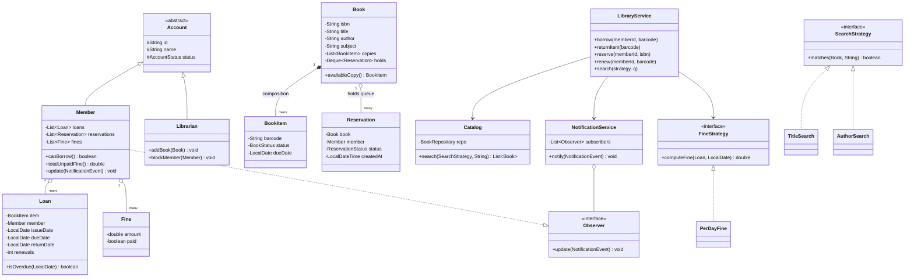
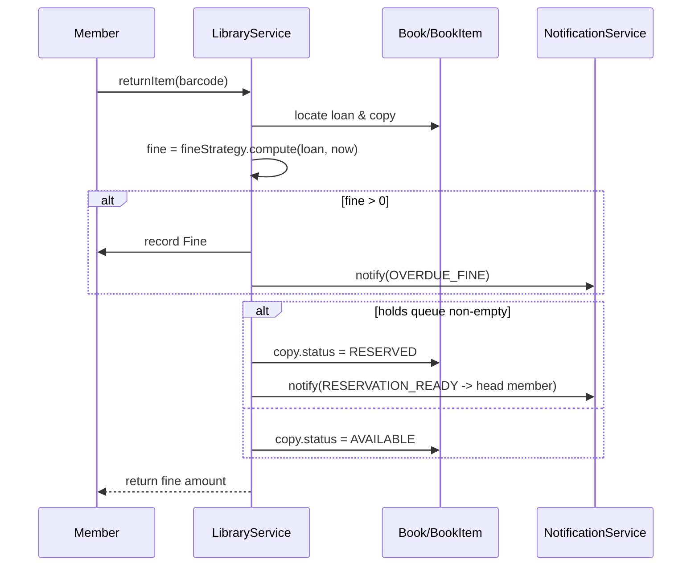

# Library Management System — LLD / Machine-Coding Design Doc

> A staff-level, interview-ready design + revision reference. Lead with clarifying
> questions, drive the design from requirements, justify every pattern with its
> rejected alternative, and ship a complete single-file Java artifact (`Solution.java`).

---

## 1. Problem statement

Design the back-end object model for a **Library Management System (LMS)**. The system tracks a **catalog** of books, the **physical copies** of each book, **members** who borrow them, and **librarians** who administer the system. Members can **search** the catalog, **borrow** and **return** copies, **reserve** a title that is fully checked out (a holds queue), and **renew** loans. The system enforces **lending limits**, computes **fines** for overdue returns, and **notifies** members about due dates, availability, and reservations.

The deliverable is the in-memory domain model and service logic (no DB/HTTP/UI) — the classic machine-coding scope.

---

## 2. Clarifying / requirements questions to ask first

Ask these *before* writing a single class. They scope the problem and surface the design's pressure points.

**Functional scope**

1. Is the unit of borrowing a physical **copy** (a `BookItem` with a barcode) or a logical title? *(Assume copies — multiple copies per title, each individually trackable.)*
2. Do we support **reservations / holds** when all copies are out, with a FIFO queue per title? *(Yes.)*
3. Do members **renew** loans? Is renewal blocked if someone has reserved the title? *(Yes / yes.)*
4. What **search** dimensions — title, author, subject/category, ISBN? Exact or substring? *(All four; case-insensitive substring.)*
5. Is there a per-member **borrowing limit** and a fixed **loan period**? *(Yes — e.g., max 5 books, 14-day loan.)*
6. Are **fines** charged for overdue returns? Flat or per-day? Can a member with unpaid fines or at-limit still borrow? *(Per-day fine; over-limit blocks borrowing; unpaid-fine policy is configurable.)*

**Non-functional / constraints**

7. **Concurrency** — can multiple librarians/members act simultaneously (two members racing for the last copy, or for the head of a holds queue)? *(Yes — must be thread-safe.)*
8. Scale — thousands of titles, tens of thousands of copies, in memory? Any persistence? *(In-memory; persistence behind a repository interface so it can be swapped.)*
9. Time source — wall clock or injectable `Clock`? *(Injectable, so fines/due-dates are testable.)*

**Scope-narrowing (explicitly out)**

10. Out: authentication, payment processing for fines (we only *compute and record* them), recommendation engine, inter-library loans, e-books/streaming, multi-branch inventory. Confirm these are out so we don't over-build.

---

## 3. Finalized requirements & assumptions

**Functional**

- Catalog of **`Book`** titles; each has 0..N **`BookItem`** copies (barcode-identified, each with a `BookStatus`).
- **Search** by title, author, subject, ISBN — case-insensitive substring, via pluggable strategies.
- **Members** borrow up to `MAX_BOOKS` copies for `LOAN_DAYS`; **librarians** administer (add/remove books & copies, manage members).
- **Reserve** a title when no copy is available → FIFO **holds queue**; when a copy is returned it's offered to the head of the queue (status `RESERVED`).
- **Renew** an active loan for another `LOAN_DAYS`, *unless* the title has outstanding reservations.
- **Fines**: `finePerDay × overdueDays`, computed at return via a pluggable strategy; recorded against the member.
- **Notifications**: members are observers; they receive due-soon, overdue, and "your reservation is ready" events.

**Non-functional**

- **Thread-safe** for concurrent borrow/return/reserve.
- Persistence hidden behind **repository** interfaces (in-memory implementations here).
- Injectable **`Clock`** for deterministic fines/dates.

**Assumptions / defaults**

- `MAX_BOOKS = 5`, `LOAN_DAYS = 14`, `MAX_RENEWALS = 2`, `finePerDay = $1`, reservation hold expiry = 3 days.

---

## 4. Problem extensions / follow-up variations

These are the common interviewer add-ons. The design is built to absorb them with minimal change.

| Extension | Design impact | Where it plugs in |
|---|---|---|
| **Reservations & holds queue** | FIFO queue per title; on return, offer to head of queue | `ReservationQueue` inside `Book`; `Lending.returnItem` triggers `tryFulfilLnextReservation` |
| **Fines for late returns** | Compute overdue days × rate at return | `FineStrategy` (Strategy pattern); `Fine` ledger on `Member` |
| **Search by author/title/subject** | Multiple search algorithms | `SearchStrategy` implementations + `Catalog.search(...)` |
| **Max-books limit & renewals** | Pre-checks in `LendingService` | `Member.canBorrow()`, renewal count on `Loan` |
| **Multiple copies** | Title vs. copy split | `Book` (title) ↔ `BookItem` (copy) |
| **Notifications** | Event fan-out to members | `Observer` pattern: `NotificationService` (subject) → `Member` (observer) |
| **Tiered fine waivers / promotions** | Swap fine algorithm at runtime | New `FineStrategy` (e.g., `StudentDiscountFine`) — no core change |
| **Multi-branch libraries** | Copies belong to a branch | Add `branchId` to `BookItem`; repositories partition by branch |
| **E-books (infinite copies)** | No physical scarcity | New `BookItem` subtype / `availability` policy strategy |

Senior signal: the patterns chosen (Strategy, Observer, Factory, Repository, State) are *exactly* what makes these extensions cheap.

---

## 5. Core entities, responsibilities & relationships

- **`Book`** — a *title*: ISBN, title, author(s), subject, publication metadata. Owns its `BookItem` copies and its `ReservationQueue`. *(Anchor of the aggregate.)*
- **`BookItem`** — a physical *copy*: barcode, current `BookStatus` (AVAILABLE/LOANED/RESERVED/LOST), the date it's due. Belongs to one `Book`.
- **`Account`** (abstract) → **`Member`**, **`Librarian`** — a person with an `AccountStatus`. Members hold active `Loan`s, a list of `Reservation`s and a `Fine` ledger; librarians administer the catalog.
- **`Loan`** (a.k.a. `BookLending`) — links a `BookItem` to a `Member`: issue date, due date, return date, renewal count.
- **`Reservation`** — links a `Member` to a `Book` (title) with status (WAITING/READY/CANCELLED/FULFILLED) and timestamp for FIFO ordering.
- **`Fine`** — amount owed by a member for a specific overdue loan; paid/unpaid.
- **`Catalog`** — index over books; runs `SearchStrategy` queries. (Term: a *catalog* is the searchable index of titles.)
- **`LibraryService` / `LendingService`** — the façade orchestrating borrow / return / reserve / renew, enforcing limits, invoking fine + notification logic.
- **`NotificationService`** — the *subject* in the Observer relationship; pushes events to member observers.
- **Repositories** — `BookRepository`, `MemberRepository`, `LoanRepository`: persistence abstraction.

Relationships: `Book` ◆—▷ `BookItem` (composition — a copy has no meaning without its title). `Member` ◇—▷ `Loan`/`Reservation`/`Fine` (aggregation). `Account` ◁— `Member`,`Librarian` (inheritance). `LendingService` —▷ uses repositories, strategies, and the notification service (association).

---

## 6. Design patterns applied

| Pattern | Where | Why | Rejected alternative & *when not* to use the pattern |
|---|---|---|---|
| **Strategy** | `FineStrategy` (flat / per-day / discounted), `SearchStrategy` (by title/author/subject/ISBN) | Fine and search policies vary independently and change often; isolate each behind an interface so we add policies without touching callers (OCP) | *Rejected:* `if/switch` on a policy enum inside the service. Fine for 2 fixed policies that never change; becomes a god-method as policies grow. Don't use Strategy if there's genuinely one algorithm forever. |
| **Observer** | `NotificationService` (subject) → `Member` (observer) for due/overdue/reservation-ready events | Decouples "something happened to a loan" from "who needs to be told and how"; lets us add SMS/email channels later | *Rejected:* the service directly calling `member.email(...)`. Acceptable when there's exactly one consumer; brittle once channels/consumers multiply. Don't use Observer if event flow is trivial and synchronous-only. |
| **Factory Method** | `AccountFactory` / `BookItemFactory` to create `Member`/`Librarian` and barcode-stamped copies | Centralizes construction + invariants (barcode generation, default status, account-id assignment) | *Rejected:* `new Member(...)` scattered across code. Don't bother if construction is a single trivial `new` with no invariants. |
| **State** | `BookStatus` transitions for a `BookItem` (AVAILABLE↔LOANED↔RESERVED, →LOST) | Encodes legal transitions; prevents e.g. loaning a LOST copy | *Rejected:* boolean flags (`isLoaned`, `isReserved`) — combinatorial and error-prone. Here we keep it as a guarded enum + transition checks (lightweight State) rather than full State-object classes, which would be overkill for 4 states. |
| **Repository / DAO** | `BookRepository`, `MemberRepository`, `LoanRepository` | Hides storage; swap in-memory ↔ DB without touching services; testability | *Rejected:* services touching maps directly. Don't add if there is genuinely no persistence concern. |
| **Facade** | `LibraryService` | One clean entry point for clients; hides orchestration of repos+strategies+notifications | *Rejected:* clients wiring sub-objects themselves — leaks internals. |
| **Singleton (light)** | A single `Library` configuration/registry instance | One library config in this scope | *Rejected:* global static state — we keep it injectable to stay testable; avoid classic Singleton when it harms testing. |

**SOLID in play**

- **SRP** — `FineStrategy` computes fines, `Catalog` searches, `NotificationService` notifies; each has one reason to change.
- **OCP** — new fine/search policies and notification channels added via new classes, not edits.
- **LSP** — any `FineStrategy`/`SearchStrategy` is substitutable; `Member`/`Librarian` honor the `Account` contract.
- **ISP** — narrow interfaces (`Observer`, `SearchStrategy`) rather than one fat service interface.
- **DIP** — `LendingService` depends on repository/strategy *interfaces*, not concrete maps.

---

## 7. Class diagram



**Text UML (quick recall)**

```
Account (abstract) ──┬── Member  ──◇ Loan, Reservation, Fine ; implements Observer
                     └── Librarian
Book ──◆ BookItem (copies)        Book ──◇ Reservation (FIFO holds)
LibraryService ──> Catalog, NotificationService, FineStrategy, *Repository
SearchStrategy: TitleSearch | AuthorSearch | SubjectSearch | IsbnSearch
FineStrategy:   PerDayFine | FlatFine | DiscountedFine
```

Key public APIs:

```java
List<Book> LibraryService.search(SearchStrategy s, String query);
Loan       LibraryService.borrow(String memberId, String barcode);
double     LibraryService.returnItem(String barcode);          // returns fine charged
Reservation LibraryService.reserve(String memberId, String isbn);
Loan       LibraryService.renew(String memberId, String barcode);
```

---

## 8. Key flows

**Borrow**

1. Look up member + copy.
2. Guard: member active, under `MAX_BOOKS`, copy `AVAILABLE`, not blocked by another's reservation.
3. Transition copy → `LOANED`, set due date = `now + LOAN_DAYS`.
4. Create `Loan`, attach to member, persist.

**Return**

1. Find loan by barcode; set `returnDate = now`.
2. `fine = fineStrategy.computeFine(loan, now)`; if > 0, record `Fine` and notify member.
3. If the title has waiting reservations → mark copy `RESERVED`, set head reservation `READY`, notify that member; else copy → `AVAILABLE`.

**Reserve**

1. If a copy is `AVAILABLE` → tell member to just borrow; else append `Reservation(WAITING)` to the title's FIFO queue and confirm position.



---

## 9. Concurrency, edge cases & extensibility

**Concurrency**

- The race that matters: **two members grabbing the last available copy**, and **two returns/reservations touching one title's holds queue**. Guard mutations of a `Book`'s copies + holds queue under a **per-title lock** (lock striping by ISBN), not one global lock — preserves throughput across unrelated titles.
- `BookItem.status` transitions are validated and performed inside the lock; selecting and flipping an `AVAILABLE` copy is atomic, so two borrowers can't both win.
- Member-level counters (`loans`, `fines`) use thread-safe collections / are mutated under the member's lock to avoid lost updates when one member acts on two threads.
- The holds `Deque` is mutated only under the per-title lock; fulfilment (pop head, mark READY) is atomic with the status flip.

**Edge cases**

- Borrow when at `MAX_BOOKS` → reject. Borrow a `RESERVED` copy by a non-head member → reject.
- Return an already-returned / unknown barcode → no-op / error.
- Renew when reservations exist or `renewals == MAX_RENEWALS` → reject.
- Reserve a title you already have a copy of, or already reserved → reject duplicate.
- Reservation **expiry**: a `READY` hold not picked up within the hold window expires; copy is offered to the next in queue (extension hook).
- Lost copy: librarian marks `LOST`; it leaves availability and may bill the member.
- Clock skew / fines: all dates from injectable `Clock` → deterministic.

**Extensibility** — see §4 table; each extension is a new Strategy/Observer/subtype, not a rewrite.

---

## 10. Likely interview questions (with model answers)

1. **Why split `Book` and `BookItem`?** A `Book` is the *title* (ISBN/author/subject — shared metadata); a `BookItem` is a *physical copy* with its own barcode, status, and due date. Borrowing, reservations-availability, and fines all operate on copies. Conflating them can't represent "3 of 5 copies are out." *Follow-up: where do reservations live?* On the title (`Book`), because a member reserves *any* copy of a title, not a specific one.

2. **How do fines stay flexible?** `FineStrategy` interface; `PerDayFine` is default, but `FlatFine`, `DiscountedFine`, or grace-period variants drop in without touching `LendingService` (OCP). *Follow-up: runtime switching?* Inject per-member or per-policy strategy; service just calls `computeFine`.

3. **Walk the return flow including the holds queue.** Set return date → compute & record fine → if holds queue non-empty, mark copy `RESERVED` + head reservation `READY` + notify; else copy `AVAILABLE`. Atomic under the per-title lock.

4. **How do notifications work and why Observer?** `Member` implements `Observer`; `NotificationService` is the subject. Loan events fan out to interested members. Decouples event production from delivery and lets us add channels (email/SMS/push) as new observers — no caller change.

5. **Where's the concurrency risk and how do you fix it?** Last-copy race and holds-queue mutation. Per-title (striped) lock makes copy-selection + status flip + queue update atomic, while keeping unrelated titles parallel. A single global lock would serialize the whole library. *(Senior signal: lock striping vs. global lock tradeoff.)*

6. **Why Strategy for search instead of one method with flags?** Each dimension (title/author/subject/ISBN) is an independent algorithm; Strategy keeps them small, testable, and composable (you can OR them). A flag-driven mega-method violates SRP/OCP and grows unboundedly. *(Senior signal.)*

7. **Renewal rules?** Allowed up to `MAX_RENEWALS` and only if no one has reserved the title — otherwise the waiting member would be starved. Encodes a fairness policy in the service.

8. **How would you add multi-branch support?** Add `branchId` to `BookItem`, partition repositories by branch, and scope availability/holds per branch. Core entities unchanged — that's the payoff of the copy/title split + repositories. *(Senior signal: extension justification.)*

9. **How is this testable?** Inject `Clock` (deterministic dues/fines) and repository interfaces (in-memory fakes). Strategies are pure functions, trivially unit-tested.

10. **What did you deliberately leave out and why?** Auth, real payment, recommendations, inter-library loans — out of machine-coding scope; they'd be separate services. Stating scope prevents over-engineering.

**Deep-probe follow-ups:** (a) How do you prevent a reservation from being fulfilled by a copy a different member is mid-borrowing? — fulfilment + status flip share the per-title lock. (b) How do expired `READY` holds re-enter the queue? — a sweeper checks hold age and re-offers to next. (c) Would you make notifications async? — yes, hand events to a queue/executor so return latency isn't bound to delivery.

---

## PART C — Cheat-sheet & self-test

**Patterns recap**

- **Strategy** → fines (`PerDayFine`…) + search (`TitleSearch`…); add policies without edits (OCP).
- **Observer** → `NotificationService`→`Member`; decoupled event delivery, pluggable channels.
- **Factory** → `Account`/`BookItem` creation with invariants (barcode, ids, default status).
- **State (guarded enum)** → `BookStatus` legal transitions; no boolean-flag explosion.
- **Repository** → storage hidden; swap in-memory↔DB; testable.
- **Facade** → `LibraryService` single entry point.

**Key design decisions**

- Split **title (`Book`)** vs **copy (`BookItem`)** — the foundation for copies/holds/fines.
- **Per-title (striped) locks** — atomic last-copy + holds-queue ops without serializing the whole library.
- **Injectable `Clock`** — deterministic due dates and fines.
- **FIFO holds queue on the title**; return offers the copy to the head and notifies.

**5 self-test questions (no answers)**

1. Two members call `borrow` on the title's last copy at the same instant — trace exactly what guarantees only one wins, and name the lock scope.
2. A copy is returned with both an overdue fine *and* a waiting holds queue — list every state change and notification, in order.
3. You must add an **e-book** type with unlimited concurrent "copies" and no fines — which classes change, which don't, and which pattern carries the change?
4. Renewal is requested on a title that has one waiting reservation — what's the policy, and why is it fairer than allowing the renew?
5. Where would a single global lock hurt throughput, and what would you measure to justify lock striping?
